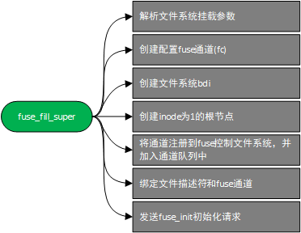
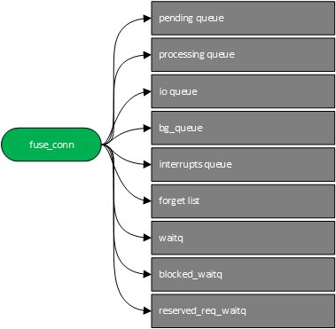
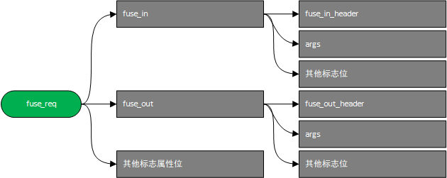

## 用户空间文件系统(FUSE)
#### 1.简介
##### 1.1 环境
本文所有的分析和操作都在下面的环境中完成:
| 类别 | 版本 |
| --- | --- |
| 操作系统 | CentOS Linux release 7.6.1810 (Core) |
| 内核版本 | 3.10.0-862.2.3.el7.x86_64 |
| libfuse版本 | libcurl-7.29.0-57 |

###### 1.2 FUSE
Linux内核从2.6.14开始支持用户空间文件系统，即FUSE(Filesystem in Userspace),与之对应的是内核文件系统，区别在于，FUSE除了能够使用普通用户进行挂载外，文件系统的元数据和数据操作也都是由用户空间的进程来实现，并且能够使用内核文件系统的接口进行访问；FUSE的引入极大的方便了文件系统的开发和调试，相对于复杂的内核文件系统，无需编写任何内核代码，无需重新编译内核，维护上也由此变得简单，因此开源的文件系统都会使用FUSE来支持POSIX协议，比如CephFS、GlusterFS、ZFS、sshfs、mailfs等。除了类Unix系统外，windows下的FUSE实现叫Dokan,提供的接口和FUSE相同，这使得开发跨平台文件系统变得简单。为了方便文件系统的开发，除了libfuse提供的C,C++接口，社区也有相应的库支持JAVA、Go、Python等编程语言的绑定。使用FUSE也并非没有缺点，其在用户空间和内核空间的多次交换造成的性能问题一直为人所诟病。综上所述，FUSE主要有以下特性：
- 能够使用普通用户进行挂载；
- 文件系统运行于用户空间；
- 方便开发、调试、安装和维护；
- 多平台支持；
- 用户空间接口的多编程语言支持；
- 性能比内核文件系统差；

#### 2.架构
为了能够使用和内核文件系统相同的接口，以及方便用户空间文件系统的开发和维护，FUSE在内核空间和用户空间都具有相应的实现，主要由三个部分组成：
- 内核模块(fuse.ko)：和VFS进行交互，它和普通的文件系统模块一致，只是不会处理实际的文件系统调用，而是将其进行封装为特定格式的fuse请求后发送给用户空间进程，等待用户空间进程处理完成并返回，接收处理返回结果转换为内核文件系统格式后再传递给VFS。
- 用户空间库(libfuse.\*)：负责和内核模块进行通信，接收来自内核模块的请求并将结果写回内核模块。
- 挂载工具(fusermount):实现普通用户对文件系统挂载和卸载。


如上图所示，当应用程序在挂载点进行操作的时，IO路径分为以下几步：
- 应用程序在挂载点进行系统调用；
- 系统调用进入VFS并最终由FUSE内核模块进行处理；
- FUSE内核模块将系统调用进行封装后发送给用户空间进程；
- 用户空间进程将请求进行处理完成后发送给FUSE内核模块；
- FUSE内核模块解析请求返回并由VFS返回给应用程序；

以上可以看出，在这个IO过程中，会存在四次的用户态和内核态的切换，在具有高吞吐、高并发、低延迟需求的应用中，这样的开销是无法忍受的，这也是FUSE相对于内核文件系统存在性能问题的原因所在；

#### 3.内核模块
##### 3.1 内核模块加载
使用FUSE需要内核的支持，可以使用insmod或modprobe命令进行内核模块的加载：
```SHELL
# modprobe fuse
# modinfo fuse
filename:       /lib/modules/3.10.0-862.2.3.el7.x86_64/kernel/fs/fuse/fuse.ko.xz
alias:            devname:fuse
alias:            char-major-10-229
alias:            fs-fuseblk
alias:            fs-fuse
license:         GPL
description:   Filesystem in Userspace
author:         Miklos Szeredi <miklos@szeredi.hu>
alias:            fs-fusectl
retpoline:      Y
rhelversion:   7.5
...
```
fuse内核模块初始化(`fuse/inode.c: fuse_init()`)主要有以下四个过程过程：
- `fuse_fs_init`：创建fuse_inode高速缓存，并注册类型为fuse的文件系统 

```SHELL
# cat /proc/filesystems | grep fuse
fuseblk
nodev	fuse
nodev	fusectl
```

- `fuse_dev_init`：创建fuse_req高速缓存，注册fuse杂项设备/dev/fuse，主设备号为9，次设备号为299
```SHELL
# ll /dev/fuse 
crw-rw-rw- 1 root root 10, 229 Oct 18 15:40 /dev/fuse
```

- `fuse_sysfs_init`：在sysfs文件系统下新增fuse节点，在fuse节点下新增connections节点
```SHELL
# ll -d /sys/fs/fuse/
drwxr-xr-x 3 root root 0 Oct 18 15:40 /sys/fs/fuse/
```

- `fuse_ctl_init`：注册FUSE控制文件系统fusectl，如果系统中存在挂载的用户空间文件系统，可以看到如下的信息：
```SHELL
# mount -t fusectl none /sys/fs/fuse/connections/
# ll /sys/fs/fuse/connections/
total 0
dr-x------ 2 test test 0 Oct 18 15:48 39
# ll /sys/fs/fuse/connections/39/
total 0
--w------- 1 test test 0 Oct 18 15:48 abort
-rw------- 1 test test 0 Oct 18 15:48 congestion_threshold
-rw------- 1 test test 0 Oct 18 15:48 max_background
-r-------- 1 test test 0 Oct 18 15:48 waiting
```

##### 3.2 模块参数
FUSE内核模块包括两个参数，模块注册后也可以在sysfs文件系统中查看默认值：
```SHELL
# modinfo -p fuse
max_user_bgreq:Global limit for the maximum number of backgrounded requests an unprivileged user can set (uint)
max_user_congthresh:Global limit for the maximum congestion threshold an unprivileged user can set (uint)
# ls /sys/module/fuse/parameters/
max_user_bgreq  max_user_congthresh
# cat /sys/module/fuse/parameters/max_user_bgreq 
19701
# cat /sys/module/fuse/parameters/max_user_congthresh 
19701
```
- max_user_bgreq: 后台请求的最大数量；在FUSE控制文件系统中，max_background属性在普通用户下禁止超过该值；
- max_user_congthresh：后台请求限流开始的数量；在FUSE控制文件系统中，congestion_threshold属性在普通用户下不会超过该值；

##### 3.3 文件系统挂载参数
文件系统挂载可以指定如下的参数：
- fd=: 必填，指定了用户空间进程打开杂项设备`/dev/fuse`的文件描述符；
- rootmode=：必填，指定了文件系统挂载时跟目录的文件权限；
- user_id=：必填，指定了用户空间进程所属的用户id；
- group_id=：必填，指定了用户空间进程所属的用户组id；
- default_permissions：默认情况下FUSE是不进行文件系统权限校验的，这可以在用户空间进程中对权限进行合乎场景的实现；指定该参数后，内核会对文件按照访问控制权限进行检查；
- allow_other：允许其他用户访问挂载点的数据，和default_permissions共同设置可以到达共享文件访问限制的功能；另外，需要注意的是，使用普通用户挂载文件系统时需要在配置文件/etc/fuse.conf中添加user_allow_other参数；
- max_read=：文件系统读请求IO的最大值，默认为无符号整型的最大值，也可以通过初始化请求从用户空间获取；
- blksize=：在文件系统类型fuseblk时设置块大小。文件系统类型为fuse时不需要指定，此时默认值为页大小；

##### 3.4 文件系统挂载流程
文件系统挂载时会调到文件系统注册时的`.mount`接口，对应到FUSE为`fuse_mount`，进入方法后实际主要分为两个部分：
- 调用sget获取或分配文件系统超级块；
- 调用`fuse_fill_super`初始化文件系统并填充超级块字段；



如上图所示，默认会初始化一个根节点索引号为1的文件系统，用户空间文件系统在实现的时候需要进行默认维护，所有文件系统跟节点下的操作的父节点索引号都是1。另外，每当挂载一个文件系统，都会在内核模块中创建一个与之对应的fuse通道，fuse通道会被添加FUSE控制文件系统fusectl中；挂载多个文件系统时，多个fuse通道会被组织成一个链表，如下是一个fuse通道的内部结构：



fuse通道主要用于维护文件系统中各种类型的请求队列：
- pending queue：一般的请求在初始化完成后会加入该队列，等待用户空间进程来读取；
- io queue：请求数据正在被读取时会被加入该队列；
- processing queue：请求数据被读取完成后正在用户空间进行处理，则会加入该队列；
- bg_queue：后台请求的队列，每当由请求处理完成时，会将后台队列加入pending queue中，最多添加max_background和请求；
- interrupts queue：被中断的请求会被加入该列表；
- forget list：缓存失效时发送的forget请求链表；

用户空间进程在读取请求时各个队列之间存在一定的优先级，`interrupt queue > forget list > pending queue`。waitq是用于维护等待请求返回的睡眠线程，用户空间进程写入请求返回或请求被终止后会被唤醒；

##### 3.5 FUSE控制文件系统
在FUSE内核模块加载时会创建FUSE控制文件系统，如3.1节；文件系统挂载时，创建的fuse通道会被加入FUSE控制文件系统中，这样就可以查看文件系统当前的状态，或则通过写入数据到文件达到控制文件系统的目的；如果FUSE控制文件系统不存在的话，需要进行手动挂载。另外一个在维护上需要注意的是，FUSE控制文件系统依赖于fuse内核模块，有时需要卸载fuse内核模块，没有文件系统挂载但还提示模块正在被使用，大多数情况是由于FUSE控制文件系统处于挂载状态，卸载后就可以正常的移除内核模块了。

```SHELL
# mount -t fusectl none /sys/fs/fuse/connections/
# ll /sys/fs/fuse/connections/
total 0
dr-x------ 2 test test 0 Oct 18 15:48 39
# ll /sys/fs/fuse/connections/39/
total 0
--w------- 1 test test 0 Oct 18 15:48 abort
-rw------- 1 test test 0 Oct 18 15:48 congestion_threshold
-rw------- 1 test test 0 Oct 18 15:48 max_background
-r-------- 1 test test 0 Oct 18 15:48 waiting
```

每个通道都包含以下四个文件：
- abort：写入任何数据到该文件都会导致所有请求被中断，阻塞的线程被唤醒；如果用户空间进程出现死锁或则无法响应时可以用此方法来终止内核模块的请求；
- congestion_threshold：fuse通道中后台请求达到该数量后会进行限流操作；
- max_background：fuse通道中最大的后台请求数量；
- waiting：统计等待队列和处理队列中请求的数量；

##### 3.6 fuse请求
如下是一个fuse请求的主要结构：



主要包括了两个部分，发送给用户空间进程的部分fuse_in，用户空间进程返回的部分fuse_out；每个部分都携带了请求头部和请求的参数；
```C
struct fuse_in_header {
    uint32_t    len;          # 头部和参数的总长度
    uint32_t    opcode;    # 请求类型
    uint64_t    unique;    # 请求的唯一标识 
    uint64_t    nodeid;    # 请求的inode id
    uint32_t    uid;         # 进行系统调用的用户id
    uint32_t    gid;         # 进行系统调用的用户组id
    uint32_t    pid;         # 进行系统调用的进程号
    uint32_t    padding;   # 填充字段
};

struct fuse_out_header {
    uint32_t    len;        # 头部和参数的总长度
    int32_t     error;      # 用户空间进程处理过程是否发送错误
    uint64_t    unique;   # 请求的唯一标识
};
```

fuse请求从创建到处理完成的过程中，会存在不同的状态：


- FUSE_REQ_INIT：请求创建后正在进行初始化；
- FUSE_REQ_PENDING：请求初始化完成并加入了pending queue中，等待用户空间进程读取；
- FUSE_REQ_READING：用户空间进程正在读取请求数据，加入了io queue中；
- FUSE_REQ_SENT：请求数据读取完成，正在被用户空间进程处理，加入了processing queue中；
- FUSE_REQ_WRITING：用户空间正在写入请求返回；
- FUSE_REQ_FINISHEND：请求返回接收处理完成，将会唤醒睡眠线程；

##### 3.7 初始化请求
文件系统在挂载时，会向用户空间进程发送初始化请求，用于初始化用户空间文件系统，以及获取用户空间文件系统的特性，用于配置fuse通道属性，初始化请求正常接收后，fuse通道才算初始化完成，其他请求才会发送到用户空间进程，文件系统可以配置如下的特性：
- max_readahead：设置文件的最大预读，最大值为文件系统挂载时bdi设置的预读值，默认为VM_MAX_READAHEAD(32)页，可以在sysfs相应的bdi设备中修改；
- flock：是否支持文件锁；
- atomic_o_trunc：是否支持open时带O_TRUNC参数，支持则一同发送到用户空间进程，不支持则在open请求中去掉O_TRUNC标志位，open请求完成后再发送设置文件大小属性为0的请求；
- export_support：是否支持NFS导出；
- big_writes：支持缓存io的多页写入，否则只会写入一页；
- dont_mask：文件权限不适用掩码；
- auto_inval_data：是否每次预读都去检查文件获取文件的大小属性；
- do_readdirplus：是否支持readirplus回调；
- async_dio：读取数据时，如果offset+count大于文件的大小，是否设置按FUSE_MAX_PAGES_PER_REQ(32)页对齐进行数据的读取；
- max_write：一个写io的最大值，如果不设置，则默认值为4k；
- max_background：设置后台请求的最大数量；
- congestion_threshold：设置后台请求限流的阈值；
- async_read：是否设置将预读请求作为后台请求；

##### 3.8 后台请求
除了来自用户进程直接的文件系统调用外，有部分请求会由内核的机制在后台进行创建，每个fuse通道中后台请求会有最大的数量，由max_background参数进行控制，主要包括了以下几类：
- init：初始化请求在文件系统挂载时发送到用户空间进程，仅会发送一次；
- release：当文件关闭后如果发现没有其他应用时，会发送release请求；
- async_read：后台的异步读请求；

##### 3.9 mkdir

##### 3.10 open

##### 3.11 write

##### 3.12 read

##### 3.13 setattr

##### 3.14 unlink

##### 3.15 rmdir

##### 3.16 /dev/fuse
之前在介绍中提到FUSE内核模块会将系统调用封装为fuse请求发送给用户空间进程，这个发送和接收的过程并不是直接进行的，而是由`/dev/fuse`这个杂项设备文件作为接口来提供了用户空间与内核空间的通信机制；对该文件的读会调用到`fuse_dev_read`方法，它会从fuse通道的队列中读取请求，没有请求则会阻塞，直到有请求来后被唤醒。对该文件的写会调用`fuse_dev_write`，它会从用户空间进程读取请求返回的数据，并根据id在processing queue中找到对应的请求，填入写回数据并唤醒睡眠进程；

##### 3.17 中断请求

#### 4.用户空间库
##### 4.1 libfuse
这里提到的用户空间库主要是libfuse，它提供了开发用户空间文件系统便捷的两类C/C++接口，一类称为low_level，能够用于直接操作文件系统的索引节点，一般文件系统都使用这类接口实现，它能够对文件进行灵活的控制；一类称为high_level，其操作的是文件的绝对路径名称，底层也是由low_level接口进行实现，封装了`fuse_path_ops`接口回调用于处理索引节点到文件路径名称的转换，使用简单，但缺乏对文件灵活性；以下分析主要使用low_level进行分析。

low_level接口的使用主要有三个部分：
- `fuse_mount`：挂载文件系统，创建和内核通信的通道；
首先会用读写的方式打开杂项字符设备`/dev/null`，将返回的文件描述符作为作为参数传递给mount系统调用，进入内模块后会执行上文3.3节部分析的流程。如果是普通用户进行挂载，就会出现权限问题，此时会重新使用挂载工具fusermount进行重试，区别于mount系统调用的挂载的方式，fusermount是一个二进制文件，所以libfuse会fork创建一个子进程来执行程序，挂载成功后使用管道将杂项字符设备的文件描述符进行返回；

- `fuse_lowlevel_new`：注册文件系统回调，创建用户空间session结构；
这个步骤会创建文件系统接口管理的结构`fuse_ll`，它会保存用户空间实现的回调方法，并保存文件系统的额外的配置信息，接下来会创建session，并注册session的请求接收方法`fuse_ll_receive_buf`和请求处理方法`fuse_ll_receive_buf`，请求被接收后，由处理方法再分发到用户空间实现的各个回调方法中去；

- `fuse_session_loop`或`fuse_session_loop_mt`：轮询内核模块请求，处理后进行回复；
通过以上两个步骤，文件系统已挂载完毕，文件系统回调也初始化完成，剩下的需要做的就是不断的从内核中读取请求进行处理并返回处理结果，libfuse使用`fuse_session_loop`来完成这部分工作，那`fuse_session_loop_mt`呢？mt就是multi-thread的缩写，多线程处理情况下，每当收到一个请求，如果没有监听杂项设备的线程，则创建就一个新线程去重新进行监听，否则不创建新线程，这样就可以进行请求的并发处理，提高处理速度，默认最多能够开启10个线程监听线程，请求处理完成的线程在检查监听线程数量存在多于后会自动退出；

##### 4.2 文件系统接口


#### 5.挂载工具
为了能够让普通用户进行文件系统的挂载，libfuse实现了相应的工具`fusermount`，同时它也能对文件系统进行卸载。内部实现上还是使用了mount系统调用，只是`fusermount`加入了SUID权限，在进入系统调用之前进行了权限提升，从而绕过了安全检查机制；因此，在部分版本的libfuse库中会存在安全漏洞，使用时需要注意避免；

#### 6.简易文件系统实践
libfuse开源库在example目录中自带了几个用户空间文件系统的实例，这里选用hello_ll进行实践，它实现了`lookup`、`getattr`、
`readdir`、`open`和`read`五个接口：
- 下载源码，切换到到2_9
```SHELL
$ git clone https://github.com/libfuse/libfuse.git
$ cd libfuse/
$ git checkout fuse_2_9_2
```

- 编译libfuse
```SHELL
$ ./makeconf.sh
$ ./configure
$ make
$ ll example/hello_ll
-rwxrwxr-x 1 test test 7726 Oct 20 09:04 example/hello_ll
```

- 挂载文件系统，首先创建`/tmp/fuse`作为挂载点
```SHELL
$ ./example/hello_ll -o fsname=hello,subtype=ll /tmp/fuse/
$ cat /etc/mtab | grep hello
hello /tmp/fuse fuse.ll rw,nosuid,nodev,relatime,user_id=45878,group_id=45878 0 0
$ ll /tmp/fuse/
total 0
-r--r--r-- 1 root root 13 Jan  1  1970 hello
$ stat /tmp/fuse/hello 
  File: ‘/tmp/fuse/hello’
  Size: 13        	Blocks: 0          IO Block: 4096   regular file
Device: 2eh/46d	Inode: 2           Links: 1
Access: (0444/-r--r--r--)  Uid: (    0/    root)   Gid: (    0/    root)
Access: 1970-01-01 08:00:00.000000000 +0800
Modify: 1970-01-01 08:00:00.000000000 +0800
Change: 1970-01-01 08:00:00.000000000 +0800
 Birth: -
$ cat /tmp/fuse/hello
Hello World!
```

#### 7.FUSE优化
- 增加单个请求的最大值
FUSE内核模块中，定义了IO操作的最大值，默认为FUSE_MAX_PAGES_PER_REQ(32)页，大于该值的IO都会切分为多个，对于带宽有需求的应用可以将该值调整到更大的值，修改后重新编译FUSE内核模块即可；
```C
# fs/fuse/fuse_i.h
/** Max number of pages that can be used in a single read request */
#define FUSE_MAX_PAGES_PER_REQ 32
```

- libfuse增大单个IO的最大值(max_write)
libufuse在响应初始化请求时会设置max_write属性，默认值为132K，对于带宽有需求的应用需要结合第一个优化，增大用户空间缓存；修改后重新编译libfuse即可；
```C
# lib/fuse_kern_chan.c 
#define MIN_BUFSIZE 0x21000
```

- 增大文件系统预读
可以修改内核的默认预读值，调整文件`include/linux/mm.h`中的宏定义`VM_MAX_READAHEAD`进行修改；如果不想重新编译内核，也可以在sysfs中相应的bdi设备下修改文件系统的默认预读大小；

- 增加内核缓存的过期时间
对于创建文件或则查询文件等操作，可以在文件系统实现中增大返回参数`entry_timeout`和`attr_timeout`的值，这会增加对应文件在内核缓存中的过期时间，从而减少元数据的交互次数；

- 用户空间进程开启多线程轮询
多线程可以加快请求的处理，能够提高系统的并发，使用libfuse进行文件系统开发时，建议使用`fuse_session_loop_mt`对通道进行轮询；

#### 8.总结
本文主要分析了用户空间文件系统FUSE的主要工作原理，内核和用户空间各个部分的作用，以及各个部分是如何交互的，最后，总结了FUSE在使用中的部分可选优化项，另外，由于VFS的复杂性，所以在分析上进行了过滤。希望能给大家工作带来帮助；

#### 9.参考链接
- [FUSE源码剖析](http://blog.sae.sina.com.cn/archives/2308)
- [FUSE架构详解](https://blog.csdn.net/songguangfan/article/details/87599379)
- [FUSE分析总结](https://blog.csdn.net/weixin_33918357/article/details/92469051?utm_medium=distribute.pc_relevant.none-task-blog-BlogCommendFromMachineLearnPai2-3.channel_param&depth_1-utm_source=distribute.pc_relevant.none-task-blog-BlogCommendFromMachineLearnPai2-3.channel_param)
- [用户空间文件系统 FUSE：架构和实现细节](http://guleilab.com/2019/04/27/fuse-performance-1/)
- [基于Fuse的用户态文件系统性能优化几点建议](https://zhuanlan.zhihu.com/p/68085075)
- [用户空间文件系统 FUSE：架构和实现细节](http://guleilab.com/2019/04/27/fuse-performance-1/)
- [再读FUSE内核源代码](https://www.cnblogs.com/yunnotes/archive/2013/04/19/3032382.html)
- [FUSE的使用及示例](https://zhoubofsy.github.io/2017/01/13/linux/filesystem-userspace-usage/)
- [fuse.rst](https://git.kernel.org/pub/scm/linux/kernel/git/torvalds/linux.git/tree/Documentation/filesystems/fuse.rst)
- [Fuse 安全漏洞](https://www.anquanke.com/vul/id/1228800)