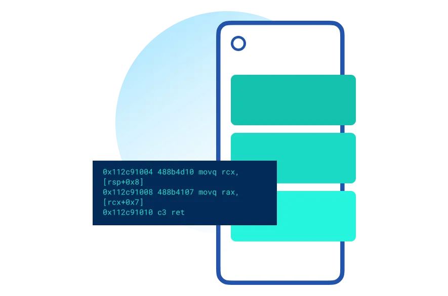
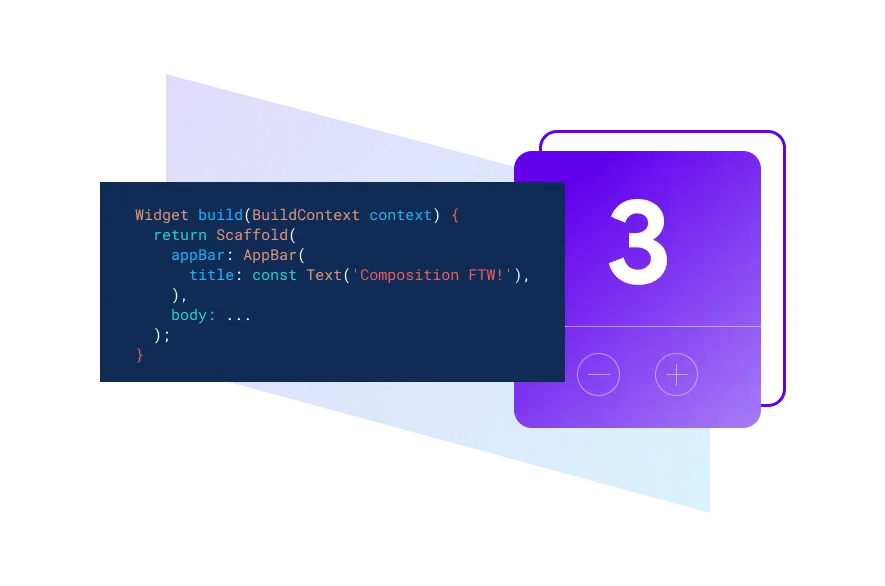
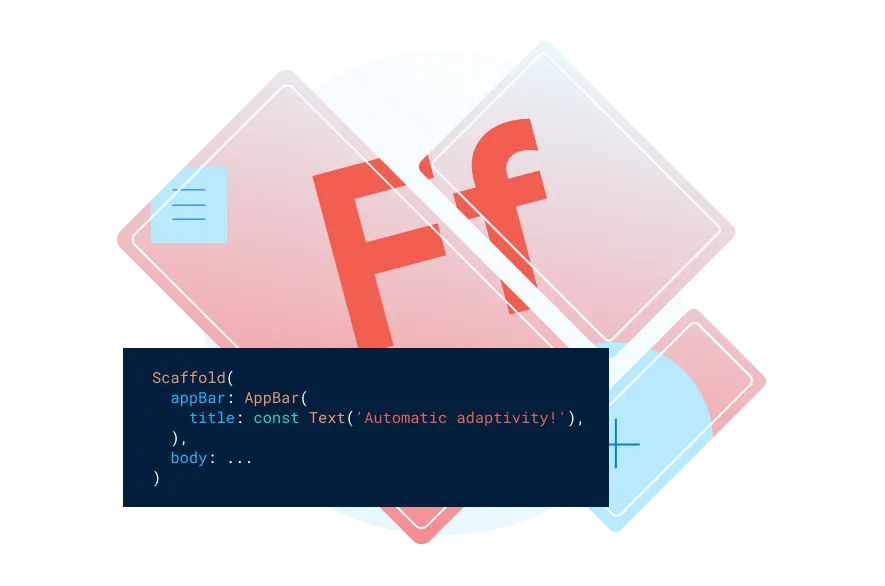
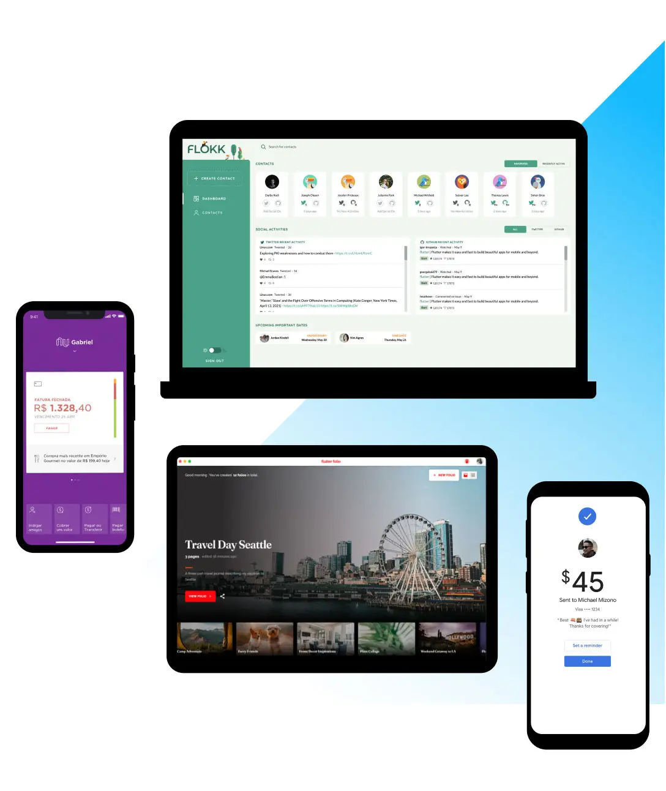
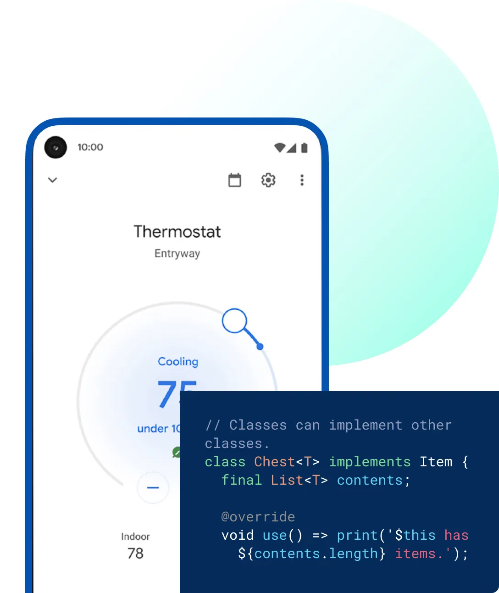

Flutter 是 Google 开源的应用开发框架，仅通过一套代码库，就能构建精美的、原生平台编译的多平台应用。于 2017 年首次发布，旨在通过一套代码库同时构建高性能、美观的 iOS 和 Android 应用。它采用自绘 UI 引擎，不依赖平台原生组件，因此能实现跨平台 UI 的一致性和高度定制化。

## Flutter 的核心特性
- 跨平台开发：一套代码同时运行在 iOS、Android、Web、桌面端（Windows/macOS/Linux），甚至嵌入式设备，大幅降低开发和维护成本。
- 高性能 UI：使用 Skia 图形引擎自绘界面，避免平台原生组件的性能损耗，支持 60fps 流畅动画和复杂交互动效。
- Dart 语言：基于 Dart 编程语言，具备热重载（Hot Reload） 功能，修改代码后可实时查看效果，提升开发效率。
- Widget 驱动 UI：采用 “一切皆 Widget” 的设计理念，通过组合基础 Widget（如 Text、Button、Container）构建复杂界面，类似 React 的组件化思想。
- 丰富的生态：拥有 Flutter 插件系统，可调用平台原生功能（如相机、定位），并支持 Firebase 等后端服务集成。

###### 快速
Flutter 代码可以直接编译成 ARM 或 Intel 平台的机器代码，以及 JavaScript 代码，确保了 Flutter 应用能够拥有原生平台的性能表现。

###### 高效
使用热重载 (Hot Reload) 快速构建和迭代你的产品，更新代码后即刻看到变化，也不会丢失应用状态。

###### 灵活
屏幕上的每个像素都由你来把握，尽情去创造不被定义、不受局限、彰显品牌的完美体验吧，这个舞台专属于你。

## 多平台支持
部署到多种设备，只需要一份代码库，支持移动、网页、桌面和嵌入式设备。

## 开发体验
在工程中可以使用插件、自动化测试、开发者工具以及任何可以用来帮助构建高质量应用的工具。

## 稳定可依赖
Flutter 由 Google 支持被并广泛使用，全球性的开发者社区广泛参与和维护，并得到众多世界知名品牌的信任。

