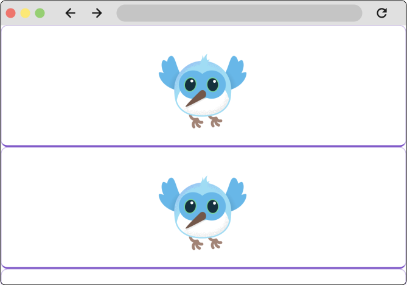

鉴于Flutter是一个用户界面（UI）工具包，你将花费大量时间使用Flutter组件来创建布局。在本节中，你将学习如何使用一些最常见的布局组件来构建布局。你将使用Flutter DevTools（也称为Dart DevTools）来了解Flutter是如何创建你的布局的。最后，你将遇到并调试Flutter最常见的布局错误之一，即可怕的“无界约束”错误。

## 理解 Flutter 中的布局
Flutter布局机制的核心是Widget（组件）。在Flutter中，几乎所有内容都是一个Widget——甚至布局模型也是Widget。你在Flutter应用中看到的图像、图标和文本都是Widget。一些不可见的元素同样是Widget，例如用于排列、约束和对齐可见Widget的行（Row）、列（Column）和网格（Grid）等。

你可以通过组合Widget来创建更复杂的Widget，从而构建布局。例如，下图展示了3个图标（每个图标下方带有标签）及其对应的Widget树结构：


在这个示例中，有一个包含3列的行，每列都包含一个图标和一个标签。无论布局多么复杂，所有布局都是通过组合这些布局组件来创建的。

#### 约束
理解Flutter中的约束是理解Flutter布局工作原理的重要部分。

一般来说，布局指的是组件的尺寸及其在屏幕上的位置。任何给定组件的尺寸和位置都受到其父组件的约束：它不能任意决定尺寸，也不能自行决定在屏幕上的位置。相反，尺寸和位置是通过组件与其父组件之间的"对话"来确定的。

在最简单的示例中，布局对话如下：

- 组件从父组件接收约束。
- 约束只是一组4个双精度值：最小宽度、最大宽度、最小高度和最大高度。
- 组件在这些约束范围内确定自身应有的尺寸，并将宽度和高度反馈给父组件。
- 父组件根据自身期望的尺寸和对齐方式设置子组件的位置。对齐方式可以通过`Center`等多种组件，或通过`Row`和`Column`的对齐属性显式设置。

在Flutter中，这种布局对话常被简化为一句话："**约束向下传递，尺寸向上传递，父组件设置位置**"。

#### Box types
在Flutter中，Widget由其底层的RenderBox对象渲染。这些对象决定了如何处理传递给它们的约束。

通常有三种类型的盒子：

- **尽可能大的盒子**：例如Center和ListView使用的盒子。
- **与子元素尺寸相同的盒子**：例如Transform和Opacity使用的盒子。
- **特定尺寸的盒子**：例如Image和Text使用的盒子。

有些Widget（如Container）会根据构造函数参数改变盒子类型。Container的构造函数默认尝试尽可能大，但如果为其指定宽度（例如），它会尝试遵循该值并成为特定尺寸。

其他Widget（如Row和Column等弹性盒子）则根据所接收的约束改变行为。关于弹性盒子和约束的更多内容，请阅读[《理解约束》](https://docs.flutter.cn/ui/layout/constraints)一文。

## 布局单个组件
在Flutter中布局单个组件时，请将可见组件（如Text或Image）包裹在可改变其屏幕位置的组件中，例如Center组件。
```dart
Widget build(BuildContext context) {
  return Center(
    child: BorderedImage(),
  );
}
```
下图展示了一个未左对齐的组件，以及一个在右侧居中的组件。


所有布局组件都具有以下属性之一：
- 如果组件仅接收单个子组件，则具有 `child` 属性（例如 `Center`、`Container` 或 `Padding`）。
- 如果组件接收组件列表，则具有 `children` 属性（例如 `Row`、`Column`、`ListView` 或 `Stack`）。

#### Container
`Container` 是一个便捷组件，由多个负责布局、绘制、定位和尺寸设置的组件组合而成。在布局方面，它可用于为组件添加内边距（padding）和外边距（margin）。这里也可以使用 Padding 组件来达到相同效果。以下示例展示了 Container 的用法。
```dart
Widget build(BuildContext context) {
  return Container(
    padding: EdgeInsets.all(16.0),
    child: BorderedImage(),
  );
}
```
下图展示了左侧没有内边距的组件和右侧带有内边距的组件。


在Flutter中创建更复杂的布局时，可以组合使用多个组件。例如，可以将Container和Center组合起来：
```dart
Widget build(BuildContext context) {
  return Center(
    Container(
      padding: EdgeInsets.all(16.0),
      child: BorderedImage(),
    ),
  );
}
```

## 垂直或水平布局多个组件
最常见的布局模式之一是垂直或水平排列组件。你可以使用`Row`组件来水平排列组件，使用`Column`组件来垂直排列组件。本页的第一个图同时使用了这两种组件。

这是使用`Row`组件的最基本示例。
```dart
Widget build(BuildContext context) {
  return Row(
    children: [
      BorderedImage(),
      BorderedImage(),
      BorderedImage(),
    ],
  );
}
```


`Row` 或 `Column` 的每个子级本身可以是行和列，通过组合形成复杂布局。例如，你可以使用 Column 为上述示例中的每个图像添加标签。
```dart
Widget build(BuildContext context) {
  return Row(
    children: [
      Column(
        children: [
          BorderedImage(),
          Text('Dash 1'),
        ],
      ),
      Column(
        children: [
          BorderedImage(),
          Text('Dash 2'),
        ],
      ),
      Column(
        children: [
          BorderedImage(),
          Text('Dash 3'),
        ],
      ),
    ],
  );
}
```


#### 在行和列中对齐组件

在下面的示例中，每个组件的宽度为200像素，而视口宽度为700像素。因此，组件会依次向左对齐，右侧则留有所有额外空间。


你可以使用`mainAxisAlignment`和`crossAxisAlignment`属性来控制行或列对齐其子组件的方式。对于`Row`，主轴为水平方向，交叉轴为垂直方向；对于`Column`，主轴为垂直方向，交叉轴为水平方向。


将主轴对齐方式设置为`spaceEvenly`后，会在每个图像之间、之前和之后均匀分配空闲的水平空间。
```dart
Widget build(BuildContext context) {
  return Row(
    mainAxisAlignment: MainAxisAlignment.spaceEvenly,
    children: [
      BorderedImage(),
      BorderedImage(),
      BorderedImage(),
    ],
  );
}
```


Column 的工作原理与 Row 相同。以下示例展示了一个包含 3 张图片的 Column，每张图片高度为 100 像素。渲染框（在此例中为整个屏幕）的高度超过 300 像素，因此将主轴对齐方式设置为 spaceEvenly 后，会在每张图片之间、上方和下方均匀分配空闲的垂直空间。


#### 在行和列中设置组件尺寸
当布局过大而无法适配设备时，受影响的边缘会出现黄黑相间的条纹图案。在此示例中，视口宽度为400像素，每个子组件的宽度为150像素
。


可以使用`Expanded`组件来调整组件尺寸，使其适配行或列。若要解决之前示例中图像行超出渲染框宽度的问题，可将每个图像包裹在`Expanded`组件中。
```dart
Widget build(BuildContext context) {
  return const Row(
    children: [
      Expanded(
        child: BorderedImage(width: 150, height: 150),
      ),
      Expanded(
        child: BorderedImage(width: 150, height: 150),
      ),
      Expanded(
        child: BorderedImage(width: 150, height: 150),
      ),
    ],
  );
}
```


`Expanded`组件还可以规定一个组件相对于其兄弟组件应占据的空间大小。例如，你可能希望某个组件占据的空间是其兄弟组件的两倍。为此，可使用`Expanded`组件的`flex`属性，该属性是一个整数，用于确定组件的弹性因子，默认弹性因子为1。以下代码将中间图像的弹性因子设置为2：
```dart
Widget build(BuildContext context) {
  return const Row(
    children: [
      Expanded(
        child: BorderedImage(width: 150, height: 150),
      ),
      Expanded(
        flex: 2,
        child: BorderedImage(width: 150, height: 150),
      ),
      Expanded(
        child: BorderedImage(width: 150, height: 150),
      ),
    ],
  );
}
```


## DevTools 与布局调试

在某些情况下，盒子的约束是无界的或无限的。这意味着其最大宽度或最大高度被设置为`double.infinity`。当一个盒子被赋予无界约束时，若它试图尽可能大，将无法正常工作，并且在调试模式下会抛出异常。

渲染盒子最终获得无界约束的最常见场景是在弹性盒子（Row 或 Column）中，以及在可滚动区域（如 ListView 和其他 ScrollView 子类）内。例如，ListView 会尝试在其交叉方向上扩展以适应可用空间（假设它是一个垂直滚动块，则会尝试与父容器等宽）。如果将垂直滚动的 ListView 嵌套在水平滚动的 ListView 中，内部列表会尝试尽可能宽，由于外部列表在该方向上可滚动，这会导致内部列表宽度变为无限大。

在构建 Flutter 应用时，最常遇到的错误可能源于布局组件的使用不当，这种错误被称为“无界约束”错误。

如果说在刚开始构建 Flutter 应用时只需要准备应对一种类型的错误，那就是这个。


## 可滚动组件
Flutter 有许多内置组件可自动实现滚动功能，同时还提供了多种可自定义的组件，以便创建特定的滚动行为。在本页面中，你将了解如何使用用于使任何页面可滚动的最常用组件，以及用于创建可滚动列表的组件。

#### ListView
ListView 是一个类似 Column 的组件，当内容长度超过其渲染框时会自动提供滚动功能。使用 ListView 最基本的方式与使用 Column 或 Row 非常相似。但与 Column 或 Row 不同的是，ListView 要求其子组件占据交叉轴上的所有可用空间，如下例所示。

```dart
Widget build(BuildContext context) {
  return ListView(
    children: const [
      BorderedImage(),
      BorderedImage(),
      BorderedImage(),
    ],
  );
}
```


当列表项数量未知、非常多（或无限）时，通常会使用ListView。这种情况下，最好使用ListView.builder构造函数。该构造函数仅构建当前屏幕上可见的子项。

在下面的示例中，ListView正在显示待办事项列表。待办事项是从存储库中获取的，因此待办事项的数量是未知的。
```dart
final List<ToDo> items = Repository.fetchTodos();

Widget build(BuildContext context) {
  return ListView.builder(
    itemCount: items.length,
    itemBuilder: (context, idx) {
      var item = items[idx];
      return Padding(
        padding: const EdgeInsets.all(8.0),
        child: Row(
          mainAxisAlignment: MainAxisAlignment.spaceBetween,
          children: [
            Text(item.description),
            Text(item.isComplete),
          ],
        ),
      );
    },
  );
}
```


## 自适应布局

由于Flutter可用于创建移动设备、平板、桌面和Web应用，你可能需要根据屏幕尺寸或输入设备等因素调整应用的表现方式。这被称为使应用具备适应性和响应性。

在构建自适应布局时，最有用的组件之一是LayoutBuilder组件。LayoutBuilder是Flutter中众多采用“构建器”模式的组件之一。

#### 构建器模式
在Flutter中，你会发现多个组件的名称或构造函数中使用了“builder”一词。以下列表并非完整列举：

- `ListView.builder`
- `GridView.builder`
- `Builder`
- `LayoutBuilder`
- `FutureBuilder`

这些不同的“构建器”可用于解决不同的问题。例如，`ListView.builder`构造函数主要用于惰性渲染列表中的项目，而Builder组件则有助于在深层组件代码中访问BuildContext。

尽管用途不同，但这些构建器的工作方式具有一致性。构建器组件和构建器构造函数都包含名为“builder”的参数（或类似名称，如`ListView.builder`中的`itemBuilder`），且该参数始终接受一个回调。此回调是一个构建器函数。构建器函数是将数据传递给父组件的回调，父组件利用这些参数构建并返回子组件。构建器函数至少会传入一个参数——构建上下文（build context），通常还会传入至少一个其他参数。

例如，LayoutBuilder组件用于根据视口尺寸创建响应式布局。其构建器回调主体会被传入从父级接收的BoxConstraints以及组件的“BuildContext”。借助这些约束条件，你可以根据可用空间返回不同的组件。

在下面的示例中，LayoutBuilder返回的组件会根据视口宽度是否小于或等于600像素，或者大于600像素而改变。
```dart
Widget build(BuildContext context) {
  return LayoutBuilder(
    builder: (BuildContext context, BoxConstraints constraints) {
      if (constraints.maxWidth <= 600) {
        return _MobileLayout();
      } else {
        return _DesktopLayout();
      }
    },
  );
}
```


同时，`ListView.builder`构造函数上的`itemBuilder`回调会被传入构建上下文（build context）和一个整数（int）。该回调会为列表中的每个项目调用一次，其中int参数表示列表项的索引。当Flutter构建UI时首次调用itemBuilder回调时，传入函数的int值为0，第二次为1，依此类推。

这使你能够根据索引提供特定配置。回顾上述使用ListView.builder构造函数的示例：
```dart
final List<ToDo> items = Repository.fetchTodos();

Widget build(BuildContext context) {
  return ListView.builder(
    itemCount: items.length,
    itemBuilder: (context, idx) {
      var item = items[idx];
      return Padding(
        padding: const EdgeInsets.all(8.0),
        child: Row(
          mainAxisAlignment: MainAxisAlignment.spaceBetween,
          children: [
            Text(item.description),
            Text(item.isComplete),
          ],
        ),
      );
    },
  );
}
```

此示例代码使用传入构建器的索引从项目列表中获取对应的待办事项，然后在构建器返回的组件中显示该待办事项的数据。

为举例说明，以下示例会每隔一个列表项更改背景颜色。
```dart
final List<ToDo> items = Repository.fetchTodos();

Widget build(BuildContext context) {
  return ListView.builder(
    itemCount: items.length,
    itemBuilder: (context, idx) {
      var item = items[idx];
      return Container(
        color: idx % 2 == 0 ? Colors.lightBlue : Colors.transparent,
        padding: const EdgeInsets.all(8.0),
        child: Row(
          mainAxisAlignment: MainAxisAlignment.spaceBetween,
          children: [
            Text(item.description),
            Text(item.isComplete),
          ],
        ),
      );
    },
  );
}
```


