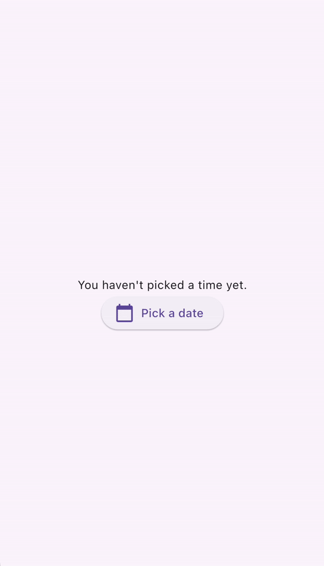

## 用户输入处理简介
作为一个跨平台的用户界面框架，用户与Flutter应用进行交互的方式有很多种。本节中的资源将向你介绍一些用于在应用内实现用户交互的常见组件。

某些用户输入机制（如滚动）已在“布局”部分中介绍过。
> 关于设计系统支持  
Flutter 在 SDK 中附带了两种设计系统的预构建组件：Material 和 Cupertino。出于教学目的，本页面主要介绍 Material 组件——这些组件是根据 Material 3 设计语言规范设计样式的。  
> 在 Dart 和 Flutter 的软件包仓库 pub.dev 上，Flutter 社区创建并支持了更多设计语言，例如 Fluent UI、macOS UI 等。如果现有设计系统组件不完全符合需求，Flutter 允许你构建自定义组件，这部分内容将在本节末尾介绍。无论选择哪种设计系统，本页面介绍的原则均适用。

接下来，我们将介绍几个 Material 组件，这些组件支持在 Flutter 应用中处理用户输入的常见用例。

## Buttons


按钮允许用户通过点击或轻触在用户界面中启动操作。Material库提供了多种功能相似但样式不同的按钮类型，适用于各种用例，包括：  

- **ElevatedButton（ Elevated 按钮）**：具有一定深度的按钮。当需要为整体较为扁平的布局添加层次感时，可使用此类按钮。  
- **FilledButton（填充按钮）**：一种填充式按钮，适用于完成流程的重要最终操作，例如“保存”“立即加入”或“确认”。  
- **Tonal Button（色调按钮）**：介于FilledButton和OutlinedButton之间的中间类型按钮。当低优先级按钮需要比轮廓按钮更突出的视觉效果时（如下一步操作），这类按钮十分实用。  
- **OutlinedButton（轮廓按钮）**：带有文本和可见边框的按钮。此类按钮包含重要操作，但并非应用中的主要操作。  
- **TextButton（文本按钮）**：可点击的文本，不带边框。由于文本按钮没有可见边框，因此必须依靠其与其他内容的相对位置来明确上下文。  
- **IconButton（图标按钮）**：带有图标的按钮。  
- **FloatingActionButton（悬浮操作按钮）**：一种悬浮在内容上方的图标按钮，用于突出显示主要操作。

构建按钮通常包含三个主要方面：样式、回调和子组件，如以下`ElevatedButton`示例代码所示：  

- 按钮的回调函数`onPressed`决定了点击按钮时的响应逻辑，因此该函数是更新应用状态的关键位置。如果回调为`null`，按钮将处于禁用状态，用户点击时不会触发任何操作。  

- 按钮的子组件（显示在按钮内容区域内）通常是文本或图标，用于指示按钮的功能。  

- 最后，按钮的样式控制其外观，例如颜色、边框等属性。

```dart
int count = 0;

@override
Widget build(BuildContext context) {
  return ElevatedButton(
    style: ElevatedButton.styleFrom(
      textStyle: const TextStyle(fontSize: 20),
    ),
    onPressed: () {
      setState(() {
        count += 1;
      });
    },
    child: const Text('Enabled'),
  );
}
```


## Text
有几个组件支持文本输入。

#### `SelectableText`
Flutter 的 Text 组件用于在屏幕上显示文本，但不允许用户高亮或复制文本。而 `SelectableText` 则用于显示可被用户选中的字符串文本。
```dart
@override
Widget build(BuildContext context) {
  return const SelectableText('''
Two households, both alike in dignity,
In fair Verona, where we lay our scene,
From ancient grudge break to new mutiny,
Where civil blood makes civil hands unclean.
From forth the fatal loins of these two foes''');
}
```


#### `RichText`
RichText 可让你在应用中显示富文本字符串。TextSpan 与 RichText 类似，允许你显示具有不同文本样式的部分文本。它并非用于处理用户输入，但在允许用户编辑和设置文本格式时十分有用。

```dart
@override
Widget build(BuildContext context) {
  return RichText(
    text: TextSpan(
      text: 'Hello ',
      style: DefaultTextStyle.of(context).style,
      children: const <TextSpan>[
        TextSpan(text: 'bold', style: TextStyle(fontWeight: FontWeight.bold)),
        TextSpan(text: ' world!'),
      ],
    ),
  );
}
```


#### `TextField`
TextField 允许用户使用硬件键盘或屏幕键盘在文本框中输入文本。  

TextField 具有许多不同的属性和配置，以下是一些重点：  

- **InputDecoration**：决定文本字段的外观，例如颜色和边框。  
- **controller**：TextEditingController 用于控制正在编辑的文本。为什么需要控制器？默认情况下，用户可以在文本字段中输入内容，但如果需要通过编程方式控制 TextField（例如清除其值），则需要 TextEditingController。  
- **onChanged**：当用户更改文本字段的值时（如插入或删除文本），此回调函数会触发。  
- **onSubmitted**：当用户表示已完成文本字段的编辑时触发此回调，例如在文本字段获得焦点时点击“回车”键。  

该类还支持其他可配置属性，例如：  
- **obscureText**：输入时将每个字母转换为圆点（常用于密码输入）；  
- **readOnly**：阻止用户更改文本。

```dart
final TextEditingController _controller = TextEditingController();

@override
Widget build(BuildContext context) {
  return TextField(
    controller: _controller,
    decoration: const InputDecoration(
      border: OutlineInputBorder(),
      labelText: 'Mascot Name',
    ),
  );
}
```


#### Form
表单是一个可选容器，用于将多个表单字段组件（如TextField）分组在一起。  

每个独立的表单字段都应包裹在FormField组件中，并且Form组件作为共同的祖先。存在一些便捷组件，可预先将表单字段组件包裹在FormField中。例如，TextField的Form组件版本是TextFormField。  

使用Form可访问FormState，它允许你保存、重置和验证此Form下的每个FormField。你还可以提供一个GlobalKey来标识特定表单，如以下代码所示：
```dart
final GlobalKey<FormState> _formKey = GlobalKey<FormState>();

@override
Widget build(BuildContext context) {
  return Form(
    key: _formKey,
    child: Column(
      crossAxisAlignment: CrossAxisAlignment.start,
      children: <Widget>[
        TextFormField(
          decoration: const InputDecoration(
            hintText: 'Enter your email',
          ),
          validator: (String? value) {
            if (value == null || value.isEmpty) {
              return 'Please enter some text';
            }
            return null;
          },
        ),
        Padding(
          padding: const EdgeInsets.symmetric(vertical: 16.0),
          child: ElevatedButton(
            onPressed: () {
              // Validate returns true if the form is valid, or false otherwise.
              if (_formKey.currentState!.validate()) {
                // Process data.
              }
            },
            child: const Text('Submit'),
          ),
        ),
      ],
    ),
  );
}
```

## 从一组选项中选择一个值
为用户提供从多个选项中进行选择的方式。

#### SegmentedButton
SegmentedButton 允许用户从最少 2-5 个项目组成的组中进行选择。  

数据类型 <T> 可以是内置类型（如 int、String、bool）或枚举。SegmentedButton 包含以下相关属性：  

- **segments**：ButtonSegment 的列表，每个元素代表用户可选择的一个“分段”或选项。从视觉上看，每个 ButtonSegment 可以包含图标、文本标签或两者兼具。  
- **multiSelectionEnabled**：指示是否允许用户选择多个选项，该属性默认值为 false。  
- **selected**：标识当前选中的值（或多个值）。注意：selected 的类型为 Set<T>，因此如果仅允许用户选择单个值，该值必须以仅包含一个元素的 Set 形式提供。  
- **onSelectionChanged**：当用户选择任意分段时触发此回调，它会提供选中分段的列表，以便更新应用状态。  

其他样式参数可用于修改按钮外观。例如，style 属性接受 ButtonStyle，可通过它配置 selectedIcon 等样式。

```dart
enum Calendar { day, week, month, year }

// StatefulWidget...
Calendar calendarView = Calendar.day;

@override
Widget build(BuildContext context) {
  return SegmentedButton<Calendar>(
    segments: const <ButtonSegment<Calendar>>[
      ButtonSegment<Calendar>(
          value: Calendar.day,
          label: Text('Day'),
          icon: Icon(Icons.calendar_view_day)),
      ButtonSegment<Calendar>(
          value: Calendar.week,
          label: Text('Week'),
          icon: Icon(Icons.calendar_view_week)),
      ButtonSegment<Calendar>(
          value: Calendar.month,
          label: Text('Month'),
          icon: Icon(Icons.calendar_view_month)),
      ButtonSegment<Calendar>(
          value: Calendar.year,
          label: Text('Year'),
          icon: Icon(Icons.calendar_today)),
    ],
    selected: <Calendar>{calendarView},
    onSelectionChanged: (Set<Calendar> newSelection) {
      setState(() {
        Suggested change
        // By default there is only a single segment that can be
        // selected at one time, so its value is always the first
        // By default, only a single segment can be
        // selected at one time, so its value is always the first
        calendarView = newSelection.first;
      });
    },
  );
}
```


#### Chip
Chip 是一种在特定上下文中表示属性、文本、实体或操作的紧凑方式。针对特定用例，存在以下专门的Chip组件：  

- **InputChip**：以紧凑形式表示复杂信息（如实体（人、地点或事物）或对话文本）。  
- **ChoiceChip**：允许从一组选项中单选，包含相关描述性文本或类别。  
- **FilterChip**：使用标签或描述性词汇过滤内容。  
- **ActionChip**：表示与主要内容相关的操作。  

每个Chip组件都需要一个标签，也可选择性包含头像（如图标或用户头像）和`onDeleted`回调（显示删除图标，触发时删除芯片）。此外，可通过设置`shape`、`color`、`iconTheme`等可选参数自定义Chip的外观。  

通常需要使用`Wrap`组件（可将子组件按多行水平或垂直排列），确保芯片能自动换行，避免在应用边缘被截断。

```dart
@override
Widget build(BuildContext context) {
  return const SizedBox(
    width: 500,
    child: Wrap(
      alignment: WrapAlignment.center,
      spacing: 8,
      runSpacing: 4,
      children: [
        Chip(
          avatar: CircleAvatar(
              backgroundImage: AssetImage('assets/images/dash_chef.png')),
          label: Text('Chef Dash'),
        ),
        Chip(
          avatar: CircleAvatar(
              backgroundImage:
                  AssetImage('assets/images/dash_firefighter.png')),
          label: Text('Firefighter Dash'),
        ),
        Chip(
          avatar: CircleAvatar(
              backgroundImage: AssetImage('assets/images/dash_musician.png')),
          label: Text('Musician Dash'),
        ),
        Chip(
          avatar: CircleAvatar(
              backgroundImage: AssetImage('assets/images/dash_artist.png')),
          label: Text('Artist Dash'),
        ),
      ],
    ),
  );
}
```


#### `DropdownMenu`
DropdownMenu 允许用户从选项菜单中选择一项，并将所选文本放入 TextField 中。它还支持用户根据输入的文本过滤菜单项。  

配置参数包括：  

- **dropdownMenuEntries**：提供 DropdownMenuEntry 列表，用于描述每个菜单项。菜单可包含文本标签、前置或后置图标等信息（此为唯一必填参数）。  
- **TextEditingController**：支持通过编程方式控制 TextField。  
- **onSelected**：用户选择选项时触发此回调。  
- **initialSelection**：可配置默认选中值。  

此外，还有其他参数用于自定义组件的外观和行为。
```dart
enum ColorLabel {
  blue('Blue', Colors.blue),
  pink('Pink', Colors.pink),
  green('Green', Colors.green),
  yellow('Orange', Colors.orange),
  grey('Grey', Colors.grey);

  const ColorLabel(this.label, this.color);
  final String label;
  final Color color;
}

// StatefulWidget...
@override
Widget build(BuildContext context) {
  return DropdownMenu<ColorLabel>(
    initialSelection: ColorLabel.green,
    controller: colorController,
    // requestFocusOnTap is enabled/disabled by platforms when it is null.
    // On mobile platforms, this is false by default. Setting this to true will
    // trigger focus request on the text field and virtual keyboard will appear
    // afterward. On desktop platforms however, this defaults to true.
    requestFocusOnTap: true,
    label: const Text('Color'),
    onSelected: (ColorLabel? color) {
      setState(() {
        selectedColor = color;
      });
    },
    dropdownMenuEntries: ColorLabel.values
      .map<DropdownMenuEntry<ColorLabel>>(
          (ColorLabel color) {
            return DropdownMenuEntry<ColorLabel>(
              value: color,
              label: color.label,
              enabled: color.label != 'Grey',
              style: MenuItemButton.styleFrom(
                foregroundColor: color.color,
              ),
            );
      }).toList(),
  );
}
```


#### `Slider`
Slider 小部件允许用户通过移动指示器（如音量条）来调整值。  

Slider 小部件的配置参数：  

- **value**：表示滑块的当前值  
- **onChanged**：当滑块手柄移动时触发的回调函数  
- **min 和 max**：设置滑块允许的最小值和最大值  
- **divisions**：建立离散间隔，使用户可沿轨道按该间隔移动手柄

```dart
double _currentVolume = 1;

@override
Widget build(BuildContext context) {
  return Slider(
    value: _currentVolume,
    max: 5,
    divisions: 5,
    label: _currentVolume.toString(),
    onChanged: (double value) {
      setState(() {
        _currentVolume = value;
      });
    },
  );
}
```


## 值之间的切换  
你的用户界面可以通过多种方式允许在值之间进行切换。

#### `Checkbox`, `Switch`, 和 `Radio`

提供一种用于切换单个值开/关的选项。这些组件的功能逻辑相同（三者均基于`ToggleableStateMixin`构建），但呈现方式略有差异：  

- **复选框（Checkbox）**：状态为false时空置，为true时显示对勾标记。  
- **开关（Switch）**：状态为false时手柄在左侧，为true时滑至右侧。  
- **单选按钮（Radio）**：与复选框类似，false时空置，true时填充。  

复选框和开关的配置包含：  
- 一个布尔值`value`（true或false）；  
- 当用户切换组件状态时触发的`onChanged`回调函数。

#### `Checkbox`
```ddart
bool isChecked = false;

@override
Widget build(BuildContext context) {
  return Checkbox(
    checkColor: Colors.white,
    value: isChecked,
    onChanged: (bool? value) {
      setState(() {
        isChecked = value!;
      });
    },
  );
}
```


#### `Switch`
```dart
bool light = true;

@override
Widget build(BuildContext context) {
  return Switch(
    // This bool value toggles the switch.
    value: light,
    activeColor: Colors.red,
    onChanged: (bool value) {
      // This is called when the user toggles the switch.
      setState(() {
        light = value;
      });
    },
  );
}
```


#### `Radio`
一组单选按钮（Radio buttons）允许用户在互斥的值之间进行选择。当用户选择组中的某个单选按钮时，其他单选按钮会自动取消选择。  

- 特定单选按钮的`value`表示该按钮对应的值，
- 而一组单选按钮的选中值由`groupValue`参数标识。  
- 与开关（Switch）和复选框（Checkbox）类似，单选按钮（Radio）也包含`onChanged`回调函数，当用户点击时触发。
```dart
enum Character { musician, chef, firefighter, artist }

class RadioExample extends StatefulWidget {
  const RadioExample({super.key});

  @override
  State<RadioExample> createState() => _RadioExampleState();
}

class _RadioExampleState extends State<RadioExample> {
  Character? _character = Character.musician;

  void setCharacter(Character? value) {
    setState(() {
      _character = value;
    });
  }

  @override
  Widget build(BuildContext context) {
    return Column(
      children: <Widget>[
        ListTile(
          title: const Text('Musician'),
          leading: Radio<Character>(
            value: Character.musician,
            groupValue: _character,
            onChanged: setCharacter,
          ),
        ),
        ListTile(
          title: const Text('Chef'),
          leading: Radio<Character>(
            value: Character.chef,
            groupValue: _character,
            onChanged: setCharacter,
          ),
        ),
        ListTile(
          title: const Text('Firefighter'),
          leading: Radio<Character>(
            value: Character.firefighter,
            groupValue: _character,
            onChanged: setCharacter,
          ),
        ),
        ListTile(
          title: const Text('Artist'),
          leading: Radio<Character>(
            value: Character.artist,
            groupValue: _character,
            onChanged: setCharacter,
          ),
        ),
      ],
    );
  }
}
```


#### 额外内容：CheckboxListTile（复选框列表项）和SwitchListTile（开关列表项）
这些便捷组件本质上是相同的复选框和开关组件，但支持将标签作为列表项（ListTile）显示。
```dart
double timeDilation = 1.0;
bool _lights = false;

@override
Widget build(BuildContext context) {
  return Column(
    children: [
      CheckboxListTile(
        title: const Text('Animate Slowly'),
        value: timeDilation != 1.0,
        onChanged: (bool? value) {
          setState(() {
            timeDilation = value! ? 10.0 : 1.0;
          });
        },
        secondary: const Icon(Icons.hourglass_empty),
      ),
      SwitchListTile(
        title: const Text('Lights'),
        value: _lights,
        onChanged: (bool value) {
          setState(() {
            _lights = value;
          });
        },
        secondary: const Icon(Icons.lightbulb_outline),
      ),
    ],
  );
}
```


## 选择日期和时间
提供的组件可让用户选择日期和时间。  

有一组对话框支持用户选择日期或时间，如以下部分所示。除了日期类型不同（日期使用`DateTime`，时间使用`TimeOfDay`），这些对话框的功能相似，可通过以下方式配置：  

- 默认的`initialDate`或`initialTime`  
- 或`initialEntryMode`，用于确定显示的选择器UI。

#### `DatePickerDialog`

此对话框允许用户选择单个日期或日期范围。通过调用`showDatePicker`函数激活该对话框，此函数会返回`Future<DateTime>`类型的结果，因此请务必使用`await`关键字等待异步函数调用！

```dart
DateTime? selectedDate;

@override
Widget build(BuildContext context) {
  var date = selectedDate;

  return Column(children: [
    Text(
      date == null
          ? "You haven't picked a date yet."
          : DateFormat('MM-dd-yyyy').format(date),
    ),
    ElevatedButton.icon(
      icon: const Icon(Icons.calendar_today),
      onPressed: () async {
        var pickedDate = await showDatePicker(
          context: context,
          initialEntryMode: DatePickerEntryMode.calendarOnly,
          initialDate: DateTime.now(),
          firstDate: DateTime(2019),
          lastDate: DateTime(2050),
        );

        setState(() {
          selectedDate = pickedDate;
        });
      },
      label: const Text('Pick a date'),
    )
  ]);
}
```


#### `TimePickerDialog`
时间选择器对话框（TimePickerDialog）是一个显示时间选择器的对话框，可通过调用`showTimePicker()`函数激活。与`showDatePicker`不同，`showTimePicker`返回的是`Future<TimeOfDay>`而非`Future<DateTime>`。同样，别忘了使用`await`等待函数调用！

```dart
TimeOfDay? selectedTime;

@override
Widget build(BuildContext context) {
  var time = selectedTime;

  return Column(children: [
    Text(
      time == null ? "You haven't picked a time yet." : time.format(context),
    ),
    ElevatedButton.icon(
      icon: const Icon(Icons.calendar_today),
      onPressed: () async {
        var pickedTime = await showTimePicker(
          context: context,
          initialEntryMode: TimePickerEntryMode.dial,
          initialTime: TimeOfDay.now(),
        );

        setState(() {
          selectedTime = pickedTime;
        });
      },
      label: const Text('Pick a time'),
    )
  ]);
}
```




## 滑动与轻扫(Swipe & slide)
#### `Dismissible`

Dismissible 是一种允许用户通过滑动将其移除的组件。它包含多个配置参数，包括：  

- 子组件  
- 当用户滑动时触发的 onDismissed 回调  
- 背景等样式参数  

此外，务必包含一个 key 对象，以便在组件树中与同级的 Dismissible 组件进行唯一标识。
```dart
List<int> items = List<int>.generate(100, (int index) => index);

@override
Widget build(BuildContext context) {
  return ListView.builder(
    itemCount: items.length,
    padding: const EdgeInsets.symmetric(vertical: 16),
    itemBuilder: (BuildContext context, int index) {
      return Dismissible(
        background: Container(
          color: Colors.green,
        ),
        key: ValueKey<int>(items[index]),
        onDismissed: (DismissDirection direction) {
          setState(() {
            items.removeAt(index);
          });
        },
        child: ListTile(
          title: Text(
            'Item ${items[index]}',
          ),
        ),
      );
    },
  );
}
```


## 想了解更多小部件吗？
本页面仅介绍了几个常见的 Material 小部件，您可以在 Flutter 应用中使用它们来处理用户输入。如需完整的小部件列表，请查看 [Material Widget 库](https://flutter.dev/docs/development/ui/widgets/material) 和 [Material 库 API 文档](https://api.flutter.dev/flutter/material/material-library.html)。

> 请查看 Flutter 的 Material 3 演示，了解 Material 库中可用的用户输入组件精选示例。

如果 Material 和 Cupertino 库中没有满足需求的组件，可访问 pub.dev 查找由 Flutter 和 Dart 社区拥有并维护的软件包。例如，flutter_slidable 软件包提供了 Slidable 组件，其可定制性比前一节中介绍的 Dismissible 组件更强。

## 使用`GestureDetector`构建交互式部件。

你是否已经翻遍了组件库、pub.dev，问过编程的朋友，但仍然找不到符合你所需要的用户交互的组件？你可以构建自己的自定义组件，并使用GestureDetector使其具有交互性。

#### 不要忘记无障碍功能！  
如果您正在构建自定义组件，请使用`Semantics`组件标注其含义。它为屏幕阅读器和其他基于语义分析的工具提供描述和元数据。

## 测试
当你完成在应用中构建用户交互后，别忘了编写测试以确保一切按预期运行！


