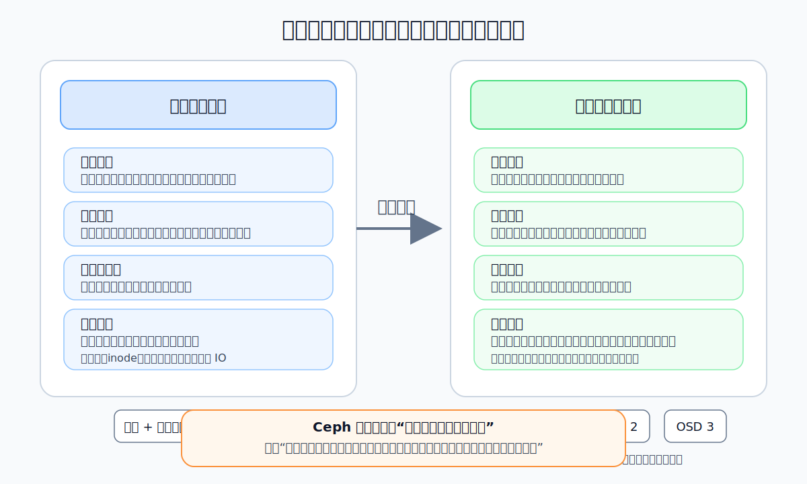
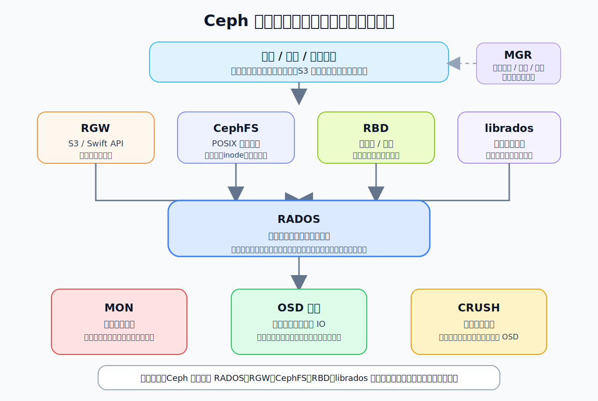
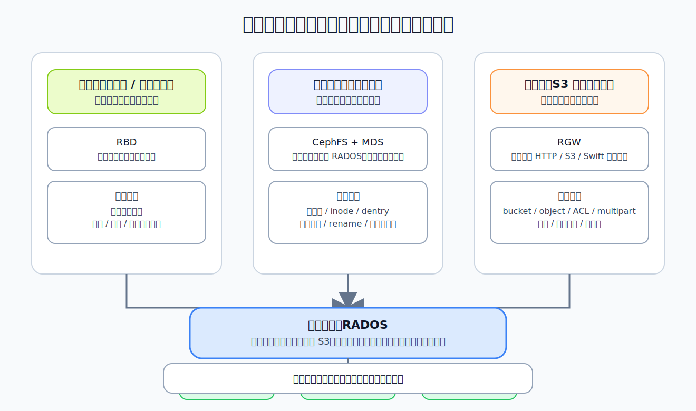

# Ceph 是什么：从单机文件系统思维切换到分布式存储思维

## 这篇文章要解决什么问题

很多工程师第一次接触 Ceph 时，容易把它理解成“一个更大的网络磁盘”或者“一个分布式文件系统”。这两种理解都不算错，但都不够准确。Ceph 真正的核心不是某一个具体的存储接口，而是一个统一的分布式对象存储底座。在这个底座之上，Ceph 再向上提供块存储、文件存储和对象存储能力。

如果你还停留在单机文件系统的思维里，读 Ceph 时会不断碰到这些困惑：

- 为什么 Ceph 老是在讲对象，而不是文件或磁盘块？
- 为什么客户端不是直接去找某台“元数据服务器”拿数据？
- 为什么同一套集群既能做云盘，又能做文件系统，还能兼容 S3？
- 为什么 Ceph 会把数据定位、一致性、故障恢复拆成那么多层？

这一篇不急着进入源码细节，而是先完成最重要的一步：把脑子里的“单机存储地图”换成“分布式存储地图”。只有地图换对了，后面再看 `MON`、`OSD`、`PG`、`CRUSH`、`RBD`、`CephFS`、`RGW` 时，才不会觉得每个模块都像凭空冒出来。

## 从单机存储思维说起

在单机环境里，我们对存储的直觉通常来自操作系统和本地磁盘：

- 块设备层看到的是一串线性地址空间，比如 `/dev/sda`
- 文件系统层把块组织成 inode、目录、文件
- 应用层通过 `open/read/write/fsync` 访问数据
- 数据放在哪里、如何做缓存、如何恢复，基本都由单机内核和本地磁盘栈负责

这种模型有几个隐含前提：

- 存储设备就在本机或者至少表现得像本机设备
- 元数据和数据都受同一台机器管理
- 故障域主要是单盘、单机、单电源
- 性能瓶颈主要来自本地 IO、页缓存、文件系统锁和单机资源上限

但一旦进入分布式场景，这些前提就不成立了。

你面对的不再是一块盘，而是一组节点；不再是“这份数据写到哪个扇区”，而是“这份数据应该落到哪些机器、复制几份、如何在节点故障后仍然可读可写、如何扩容后自动均衡”。这时，问题的本质已经从“本地数据组织”变成了“集群级数据放置与一致性维护”。

也就是说，单机文件系统关心的是“如何把一台机器上的存储空间组织好”，而 Ceph 关心的是“如何把一组机器的存储资源组织成一个统一、可扩展、可容错的逻辑存储系统”。



*图 1：从本地磁盘视角切换到集群级数据放置与恢复视角，是理解 Ceph 的第一步。*

## 为什么 Ceph 先定义对象，而不是先定义文件或块

Ceph 的底层核心是 `RADOS`，即 Reliable Autonomic Distributed Object Store。名字已经把核心讲出来了：

- Reliable：要考虑副本、故障恢复、数据一致性
- Autonomic：系统应尽量自动完成均衡、恢复、重映射
- Distributed：资源分布在整个集群中，不依赖单机视角
- Object Store：底层抽象单位是对象

为什么对象是 Ceph 最自然的底层抽象？

因为对象比“文件”和“裸块”更适合作为分布式系统里的通用载体。

先看文件。文件天然依赖目录树、路径解析、权限模型、rename 语义、元数据操作，这些都偏向“文件系统接口”而不是“底层统一存储底座”。如果 Ceph 一开始就把“文件”作为最底层抽象，那么它很难自然承载块存储和对象网关这两类完全不同的上层语义。

再看裸块。块设备看起来简单，只是线性地址读写，但它对上层暴露的是“覆盖写”“随机块访问”“缓存一致性”“刷新语义”等典型块语义。这个接口非常适合数据库和虚拟机磁盘，却不适合作为所有存储服务的统一底座。

对象的好处在于：

- 每个对象有唯一标识，天然适合在分布式集群中做映射
- 对象是相对独立的数据单元，便于复制、迁移、恢复和校验
- 底层不需要先承诺完整的 POSIX 文件语义或块设备语义
- 文件、块、对象网关都可以在对象之上二次封装出各自需要的抽象

所以可以把 Ceph 理解成：

`Ceph = 一个以对象为基础单位的分布式存储底座 + 多种上层访问接口`

## 建立第一张全景图：Ceph 不是一个接口，而是一套分层体系

先记住这一张最重要的心智图：

```text
应用 / 平台
    |
    +-- S3 / Swift API ----------------------> RGW
    |
    +-- POSIX 文件语义 -----------------------> CephFS
    |
    +-- 块设备 / 云盘 / 虚拟机磁盘 -------------> RBD
    |
    +-- 原生对象访问 --------------------------> librados
                                                   |
                                                   v
                                                RADOS
                                                   |
                          +------------------------+------------------------+
                          |                        |                        |
                        MON                     OSD 集群                 CRUSH
                     管理集群地图               存数据与执行 IO          负责数据定位
```

这张图里最容易混淆的是：`RADOS`、`librados`、`RBD`、`CephFS`、`RGW` 不是并列关系，它们是“底座”和“接口”的关系。



*图 2：`RADOS` 是统一底座，`RGW`、`CephFS`、`RBD`、`librados` 是不同语义的访问入口。*

可以分别这样理解：

- `RADOS`：Ceph 的分布式对象存储核心，负责对象存储、复制或纠删码、故障恢复、数据分布、一致性维持
- `librados`：直接访问 `RADOS` 的客户端库，是最贴近底座的编程接口
- `RBD`：基于 `RADOS` 封装出来的块存储服务，把对象拼装成“虚拟磁盘”
- `CephFS`：基于 `RADOS` 封装出来的分布式文件系统，把对象组织成“目录树 + inode + 文件”
- `RGW`：基于 `RADOS` 封装出来的对象网关，对外提供 S3/Swift 风格 API

这也是理解 Ceph 的第一个关键转换：

不要问“Ceph 到底是文件系统、对象存储还是块存储”，而要问“Ceph 以哪种方式把统一底座暴露给不同业务”。

## RADOS：真正的统一底座

如果只允许用一句话定义 Ceph，那最准确的说法通常是：

**Ceph 的本体是 RADOS，其他能力大多是构建在 RADOS 之上的上层服务。**

`RADOS` 主要解决的是这几个底层问题：

- 数据应该放到哪些节点上
- 数据副本或纠删码分片如何分布
- 节点故障后如何恢复
- 扩容缩容后如何重新均衡
- 客户端如何找到目标数据，而不是依赖中心转发节点
- 如何在大规模节点下维持可接受的一致性和可用性

这意味着，`RADOS` 不关心你的业务把对象解释成镜像块、文件片段，还是桶里的对象。它只关心：这些对象如何被可靠地放进一个可扩展的集群。

后面你会看到很多 Ceph 特有名词，比如 `pool`、`object`、`PG`、`acting set`、`primary OSD`、`CRUSH rule`。这些概念大部分都是为了回答同一个问题：

**一个逻辑对象，如何在一个会变化、会失败、会扩容的机器集合里稳定地找到归宿。**

## `librados`：最贴近底座的访问方式

`librados` 是 Ceph 的原生客户端库。它不是给普通业务开发者做对象上传下载 SDK 的狭义工具，而是一个直接面向 `RADOS` 的编程入口。

你可以把它理解成：

- 如果你想直接使用 Ceph 的对象能力，而不想经过文件系统或块设备语义，就会接触 `librados`
- 如果上层模块想建立自己的抽象，往往也会以 `librados` 或对应底层能力为基础

从仓库结构上看，这部分代码在 `src/librados`，它是理解客户端如何和集群交互的第一站。后面读源码时，你会经常看到 `RadosClient`、`IoCtx`、对象操作封装等概念。

这里先只抓住一个重点：`librados` 代表的是“直接面向 Ceph 分布式对象底座”的视角，它比 `RBD`、`CephFS`、`RGW` 更接近 Ceph 的本体。

## `RBD`：把对象底座封装成块设备

很多人第一次使用 Ceph，接触最多的是 `RBD`，因为云主机磁盘、虚拟化平台后端存储经常都建立在它之上。

`RBD` 的本质不是“Ceph 自带的一块超级硬盘”，而是：

**它把一个逻辑镜像拆成很多对象，存进 `RADOS`，再对上层暴露出块设备语义。**

也就是说，在上层看来：

- 你拿到的是一个连续的虚拟磁盘镜像
- 你可以随机读写某个偏移
- 你可以做快照、克隆、回滚、映射到内核块设备

但在底层看来：

- 这块“磁盘”被切成了一批对象
- 对象由 `RADOS` 负责分布、复制和恢复
- `RBD` 额外维护镜像元数据、对象映射、快照关系和锁等机制

这就是 Ceph 很典型的设计风格：上层接口看起来像传统存储，下层实现却完全站在分布式对象系统之上。

如果以后要看这部分源码，可以先盯 `src/librbd`。它是理解“块语义如何落到对象存储之上”的核心目录。

## `CephFS`：把对象底座封装成文件系统

`CephFS` 解决的是另一个问题：应用要的是目录、文件、inode、权限、rename、共享挂载，而不是对象 ID 或块偏移。

它做了两件关键事情：

- 把文件数据落到 `RADOS`
- 把文件系统元数据单独组织并协调起来

这也是为什么 `CephFS` 不是“直接在对象上加个名字”那么简单。文件系统最麻烦的部分往往不是数据块本身，而是复杂的元数据操作语义，例如：

- 目录遍历
- inode 和 dentry 关系
- 元数据缓存
- 多客户端一致性
- rename、unlink、truncate 等操作的协调

因此，Ceph 在对象底座之上，又引入了文件系统层需要的客户端和元数据服务机制。这也是后面 `MDS` 会出现的原因。

简单说：

- `RADOS` 负责“对象怎么可靠存”
- `CephFS` 负责“文件系统语义怎么成立”

如果以后从源码角度进入 CephFS，最常看的目录会是 `src/client` 和 `src/mds`。前者偏客户端文件系统逻辑，后者偏元数据服务控制面。

## `RGW`：把对象底座封装成 S3/Swift 风格服务

`RGW` 即 RADOS Gateway。它是 Ceph 面向对象存储协议的出口，通常对外提供 S3 兼容接口，也支持 Swift 风格接口。

要注意，虽然从“业务语义”上看，`RGW` 也是对象存储，但它和 `RADOS` 不是同一层概念。

区别在于：

- `RADOS` 是 Ceph 内部的分布式对象底座
- `RGW` 是面对外部 HTTP/S3/Swift 协议客户端的网关层

也就是说，用户通过 S3 API 看到的是 bucket、object、ACL、multipart upload、生命周期这些高层语义；而底层依旧要把这些对象和元数据映射进 `RADOS`。

所以很多初学者会混淆“Ceph 是对象存储”这句话。更准确地说：

- 从底层实现看，Ceph 的核心是分布式对象存储底座
- 从对外产品形态看，Ceph 既能提供对象存储服务，也能提供块存储和文件存储服务

如果以后要读网关相关实现，主要会进入 `src/rgw`。

## 一个统一底座，为什么能支撑三种存储形态

到这里，可以把三类接口的关系浓缩成一句话：

**RBD、CephFS、RGW 共享的是同一套集群可靠性和数据放置能力，差别主要在于它们向上暴露的访问语义不同。**

它们复用的能力包括：

- 数据分布
- 副本或纠删码保护
- 故障检测后的重建
- 扩容后的再均衡
- 集群级访问控制和管理能力

它们各自新增的语义包括：

- `RBD`：块偏移、镜像、快照、克隆、独占锁
- `CephFS`：目录树、inode、dentry、权限、会话、一致性协调
- `RGW`：bucket、对象元数据、HTTP 协议、S3 鉴权、多租户等

换句话说，Ceph 不是把三个完全独立的系统硬拼在一起，而是让不同接口共享同一个“分布式存储发动机”。

## 为什么 Ceph 不依赖中心数据转发节点

这也是从单机思维切换到分布式思维时最关键的一点。

很多传统存储系统或者比较直觉化的设计，会让客户端先访问一个中心节点，由它决定数据在哪，再转发请求。这样做实现上更容易理解，但扩展性和故障影响面通常比较差。

Ceph 的一个重要设计目标是：**让客户端尽量具备独立定位数据的能力，而不是所有 IO 都穿过中心节点。**

这背后有几个直接收益：

- 避免中心转发节点成为性能瓶颈
- 降低单点故障对数据路径的影响
- 扩大集群规模时，不必线性增加中心调度压力

当然，这不代表 Ceph 没有控制面。它当然有，而且非常重要，比如：

- `MON` 维护集群地图和关键状态
- `MGR` 负责管理平面、监控指标、编排接口和插件能力

但要建立一个清晰认知：

- 控制面负责“告诉系统当前拓扑和规则是什么”
- 数据面负责“基于这些规则真正完成读写和恢复”

这也是后面理解 `MON` 和 `OSD` 分工的基础。`MON` 很关键，但它不是日常数据转发的必经之路；真正承载数据 IO 的核心执行单元是 `OSD`。

## `MON`、`OSD` 在第一视角下分别是什么

这一篇不展开讲它们的内部实现，只先建立角色直觉。

### `MON`

可以先把 `MON` 理解成集群控制面的大脑之一。它维护和分发各种集群地图，帮助整个系统对“当前集群长什么样”形成一致认知。

它解决的是：

- 哪些 monitor 组成仲裁
- 哪些 OSD 存活
- pool 和放置规则是什么
- 集群状态是否健康

从源码目录看，这部分主要在 `src/mon`。

### `OSD`

`OSD` 是数据面的核心执行单元。对象最终放在哪、谁负责主副本处理、谁参与复制、谁承担恢复与回填，大量真实的数据动作都发生在 `OSD` 侧。

从源码目录看，这部分主要在 `src/osd`。

你现在不用记住所有细节，只要先记住：

- `MON` 更像“掌握集群地图和规则的控制面角色”
- `OSD` 更像“真正执行对象存储与复制恢复的数据面角色”

后面很多复杂概念，其实都是围绕这两类角色展开的。

## 从三个典型场景重新认识 Ceph

为了彻底摆脱“Ceph 到底是什么”的模糊感，可以从三个真实使用场景重新看它。

### 场景一：给虚拟机提供云硬盘

在这个场景里，业务希望拿到的是块设备语义。最常见的组合就是：

- 虚拟化平台或云平台调用 `RBD`
- `RBD` 把镜像映射成底层对象集合
- 对象最终由 `RADOS` 存储在多个 `OSD` 上

业务看到的是磁盘；Ceph 底层处理的是对象分布和可靠性。

### 场景二：给容器或主机提供共享文件系统

在这个场景里，业务希望拿到的是挂载后的文件系统语义。典型路径是：

- 客户端挂载 `CephFS`
- 元数据操作与 `MDS` 协同
- 文件数据仍然落到 `RADOS`

业务看到的是目录和文件；Ceph 底层处理的仍然是对象存储和元数据协调。

### 场景三：给应用提供 S3 兼容对象存储

在这个场景里，业务希望直接通过 HTTP API 读写对象。典型路径是：

- 应用访问 `RGW`
- `RGW` 处理认证、bucket、对象元数据和请求语义
- 底层对象及其相关元数据最终仍然进入 `RADOS`

业务看到的是桶和对象；Ceph 底层处理的仍是统一的分布式存储底座。

从这三个场景你会发现，表面上接口千差万别，底层却高度统一。这正是 Ceph 架构最值得建立的第一层认知。



*图 3：块、文件、对象三种产品形态复用的是同一个分布式对象存储发动机。*

## 初学者最容易混淆的 5 个点

### 1. “Ceph 就是 CephFS”

不是。`CephFS` 只是 Ceph 提供的一种上层接口。Ceph 的核心底座是 `RADOS`。

### 2. “Ceph 就是 S3 对象存储”

不准确。`RGW` 可以把 Ceph 暴露成 S3 兼容对象存储，但 Ceph 本身不止这一种接口。

### 3. “RBD 是一块分布式磁盘”

更准确地说，`RBD` 是把分布式对象存储封装成块设备语义的服务。它表面像磁盘，底层不是传统磁盘实现。

### 4. “MON 负责所有请求转发”

不是。`MON` 主要负责控制面状态和集群地图，不是普通数据 IO 的中心转发器。

### 5. “Ceph 的复杂度主要来自代码写得大”

不完全对。Ceph 的复杂度首先来自它试图解决的问题本身：分布式放置、故障恢复、一致性、扩展性、多接口抽象。这些问题即使换一种实现，也不会变简单。

## 从仓库结构看第一批源码锚点

这一篇虽然以架构认知为主，但最好已经把后面会反复进入的几个目录先记住：

- `src/mon`：控制面核心之一，后面理解集群地图、选举、状态维护时会进入
- `src/osd`：数据面核心，后面看对象读写、复制、恢复、PG 时会大量进入
- `src/librados`：最贴近 `RADOS` 的客户端入口
- `src/librbd`：块存储实现
- `src/client`：CephFS 客户端核心逻辑
- `src/rgw`：对象网关实现

如果你把整个仓库比作一座城市，那么上面这几个目录就是 Ceph 的第一批主干道。后面系列文章几乎都会围绕它们来回穿梭。

## 这一篇先形成三个结论

读完这一篇，至少应该把下面三个判断变成直觉。

### 结论一：Ceph 的本体首先是分布式对象存储底座

块、文件、S3 网关都很重要，但它们大多是建立在 `RADOS` 之上的能力层。

### 结论二：Ceph 的核心难点是集群级数据组织，而不是单机文件组织

你后面看到的 `CRUSH`、`PG`、主副本、恢复、回填、一致性设计，几乎都服务于“如何在分布式环境里可靠地放和找数据”。

### 结论三：理解 Ceph，必须分清底座、控制面和上层接口

只有先分清：

- 底座是谁
- 控制面是谁
- 数据面是谁
- 上层接口是谁

后面看任何模块时，才不会把角色混在一起。

## 下一篇看什么

下一篇建议顺着这篇继续，把整体角色图完整建立起来，也就是：

**《Ceph 总体架构图解：MON、MGR、OSD、MDS、RGW 各自负责什么》**

如果说这一篇解决的是“Ceph 到底是什么”，那么下一篇要解决的就是“Ceph 这几个核心进程分别在系统里扮演什么角色，它们之间如何协作”。

到那时，你就可以从“底座与接口”的抽象关系，进一步进入“真实进程与真实职责”的系统全景图。
