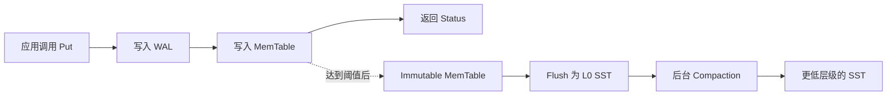
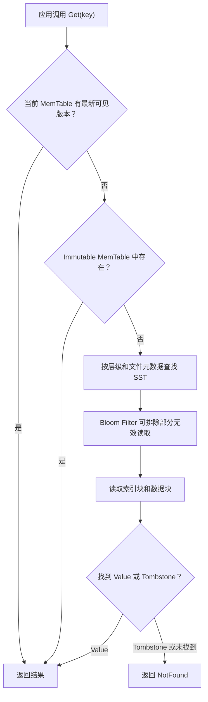

# RocksDB 入门（一）：从一个 Key-Value 示例认识 RocksDB

第一次接触 RocksDB，最容易被 WAL、MemTable、SST、Compaction 等术语包围。其实可以先记住一句话：**RocksDB 是一个嵌入到应用进程中的、持久化的、有序 Key-Value 存储引擎。**

本篇不急着深入源码，而是先完成三个目标：

1. 运行一个 RocksDB 程序；
2. 理解 `Open`、`Put`、`Get`、`Delete` 四个基本操作；
3. 建立一张足够准确的内部结构地图，为后续源码分析做准备。


> 图 1：数据先进入内存结构并记录日志，随后形成有序文件，最终在后台整理到不同层级。配图为概念表达，精确流程以下文为准。

## 1. RocksDB 到底是什么？

RocksDB 最初基于 LevelDB 发展而来，主要使用 C++ 编写。它提供的是存储引擎能力，而不是一套开箱即用的数据库服务。

“嵌入式”是理解 RocksDB 的第一个关键词：

- RocksDB 以库的形式链接到你的程序中；
- 应用通过函数调用读写数据，不需要先连接独立的数据库服务器；
- 数据通常保存在本机磁盘目录中；
- 进程、线程、文件系统和机器资源都由应用自己管理。

下面这张表可以帮助我们划清边界。

| 对比项 | RocksDB | 典型关系型数据库 |
| --- | --- | --- |
| 使用方式 | 嵌入应用进程 | 通过网络连接数据库服务 |
| 数据模型 | 有序的 Key-Value | 表、行、列和关系 |
| 查询方式 | `Get`、`Put`、迭代器等 API | SQL |
| Schema | RocksDB 不强制定义 | 通常由数据库管理 |
| 运维责任 | 应用负责更多生命周期和资源配置 | 数据库服务承担更多职责 |

RocksDB 适合需要低延迟本地存储、写入吞吐较高、希望精确控制数据布局的场景，例如缓存持久化、流处理状态、搜索或数据库系统的底层存储。

如果需求是跨机器共享数据、直接使用 SQL、复杂关联查询或由数据库自动管理权限与远程访问，单独使用 RocksDB 通常不是最省事的选择。上层系统可以基于 RocksDB 提供这些能力，但那已经是另一个完整的数据库产品了。

## 2. Key 和 Value 是什么？

对 RocksDB 来说，Key 和 Value 本质上都是字节序列。

```text
Key                         Value
------------------------------------------------
user:1001                   {"name":"Ada"}
order:20260710:0001         <protobuf bytes>
cache:homepage:v3           <compressed bytes>
```

RocksDB 不理解 JSON、Protobuf 或业务对象。编码和解码由应用负责。它关心的是：

- 根据 Key 写入或找到 Value；
- 按比较器定义的顺序组织 Key；
- 在并发、崩溃恢复和后台整理过程中维持一致的数据视图。

默认比较器按字节顺序比较 Key。因此，Key 的编码会直接影响范围扫描结果。例如，字符串 `user:10` 会排在 `user:2` 前面；如果需要按数字顺序扫描，可以使用固定宽度编码，如 `user:000010`。

## 3. 跑通仓库自带示例

在 RocksDB 源码根目录执行：

```bash
AUTO_CLEAN=1 make -j4 static_lib
make -C examples simple_example
./examples/simple_example
```

第一条命令构建静态库 `librocksdb.a`，第二条命令构建示例程序。`-j4` 可以按机器 CPU 核数调整。

程序正常运行时不会输出内容，而是以退出码 `0` 结束。示例通过断言检查读写结果；源文件位于 [`examples/simple_example.cc`](../examples/simple_example.cc)。

Windows、macOS 或需要系统级安装时，依赖和构建方式可能不同，应以仓库中的 [`INSTALL.md`](../INSTALL.md) 为准。

## 4. 一个最小但完整的 C++ 程序

下面的示例保留了最重要的错误处理。生产代码不应该只依赖 `assert`，因为 Release 构建可能禁用断言，而且调用者通常需要记录或传播具体错误。

```cpp
#include <iostream>
#include <memory>
#include <string>

#include "rocksdb/db.h"
#include "rocksdb/options.h"

int main() {
  rocksdb::Options options;
  options.create_if_missing = true;

  std::unique_ptr<rocksdb::DB> db;
  rocksdb::Status status =
      rocksdb::DB::Open(options, "./hello-rocksdb", &db);
  if (!status.ok()) {
    std::cerr << "open failed: " << status.ToString() << '\n';
    return 1;
  }

  status = db->Put(rocksdb::WriteOptions(), "language", "C++");
  if (!status.ok()) {
    std::cerr << "put failed: " << status.ToString() << '\n';
    return 1;
  }

  std::string value;
  status = db->Get(rocksdb::ReadOptions(), "language", &value);
  if (status.ok()) {
    std::cout << "language = " << value << '\n';
  } else {
    std::cerr << "get failed: " << status.ToString() << '\n';
    return 1;
  }

  status = db->Delete(rocksdb::WriteOptions(), "language");
  if (!status.ok()) {
    std::cerr << "delete failed: " << status.ToString() << '\n';
    return 1;
  }

  status = db->Get(rocksdb::ReadOptions(), "language", &value);
  if (!status.IsNotFound()) {
    std::cerr << "expected NotFound, got: " << status.ToString() << '\n';
    return 1;
  }

  return 0;
}
```

预期输出：

```text
language = C++
```

逐段来看，这个程序做了五件事。

### 4.1 配置 Options

```cpp
rocksdb::Options options;
options.create_if_missing = true;
```

`Options` 决定数据库如何打开以及如何组织内存和磁盘数据。`create_if_missing` 表示目标目录不存在时创建数据库。

配置项很多，但第一篇文章不建议立刻调参。默认值首先保证可用性；性能优化必须结合读写比例、Value 大小、内存预算和磁盘类型进行测量。

### 4.2 打开数据库

```cpp
std::unique_ptr<rocksdb::DB> db;
rocksdb::Status status =
    rocksdb::DB::Open(options, "/tmp/hello-rocksdb", &db);
```

`DB::Open` 会打开或创建一个数据库目录。`std::unique_ptr` 明确了对象所有权：离开作用域时，`DB` 会被正确释放。

同一进程可以让多个线程共享一个 `DB` 对象，但不要让多个普通 RocksDB 实例同时以读写方式打开同一个目录。RocksDB 会使用锁文件避免这种情况。

### 4.3 写入数据

```cpp
status = db->Put(rocksdb::WriteOptions(), "language", "C++");
```

`Put` 表示写入一组 Key-Value。如果 Key 已存在，新 Value 会在最新序列号对应的视图中覆盖旧值。旧版本不一定立刻从磁盘消失，它会在后续 Compaction 中被清理。

### 4.4 读取数据

```cpp
std::string value;
status = db->Get(rocksdb::ReadOptions(), "language", &value);
```

`Get` 按 Key 查询。读取成功时 `status.ok()` 为真；Key 不存在时返回 `NotFound`。不要把“未找到”与 I/O 错误、数据损坏等其他失败混为一谈。

### 4.5 删除数据

```cpp
status = db->Delete(rocksdb::WriteOptions(), "language");
```

`Delete` 通常不是马上定位并擦除所有旧数据，而是写入一个删除标记（Tombstone）。后续读取看到该标记后会认为 Key 不存在，后台 Compaction 再择机清理旧 Value 和删除标记。

这正是 LSM Tree 系统的重要思路：前台操作尽量顺序追加，把较重的数据整理工作放到后台批量完成。

## 5. 一次 Put 在内部经历了什么？

先看一张简化图：



这条路径里有四个核心角色。

### WAL：崩溃恢复的依据

WAL 是 Write-Ahead Log，也就是预写日志。在默认配置下，写入先记录到日志，再更新内存结构。如果进程突然退出，重新打开数据库时可以重放日志，恢复尚未 Flush 的数据。

`WriteOptions` 可以控制是否同步 WAL、是否禁用 WAL 等行为。这些选项会改变延迟和持久性保证，不能只为了跑分而随意关闭。

### MemTable：当前正在写入的有序内存结构

MemTable 保存近期写入，通常位于内存中。它不是普通哈希表，而是支持按 Key 有序访问的数据结构。新的写入先在这里变得可见，所以很多热点读取不需要访问磁盘。

### SST：不可变的有序磁盘文件

当 MemTable 达到一定大小后，它会变成只读的 Immutable MemTable，随后被 Flush 成 SST 文件。SST 可以理解为 Sorted String Table：其中的数据按 Key 排序，文件生成后不再原地修改。

### Compaction：后台合并与清理

持续写入会产生越来越多 SST。Compaction 在后台合并文件、处理重复版本和删除标记，并把数据逐步移动到更合适的层级。

Compaction 让读取保持可控，但也会带来额外的 CPU、I/O 和写放大。后续文章会单独讨论它，因为 RocksDB 的许多性能问题最终都与 Compaction 是否跟得上写入有关。

## 6. 一次 Get 又如何查到数据？

读取不能只看一个地方，因为同一个 Key 的不同版本可能分布在内存和多个 SST 中。简化后的查询顺序如下：



这张图刻意省略了快照、序列号、Merge、Range Tombstone、Block Cache 等细节。现在只需建立一个直觉：**RocksDB 的读取是在多个候选位置中寻找最新且对当前读视图可见的版本。**

## 7. Status：每次调用都必须面对的结果

RocksDB 使用 `Status` 返回操作结果。最常见的判断方式是：

```cpp
if (status.ok()) {
  // 操作成功
} else if (status.IsNotFound()) {
  // Key 不存在
} else {
  // I/O 错误、数据损坏、参数错误等
  std::cerr << status.ToString() << '\n';
}
```

几个实践原则：

- 检查每一个需要检查的 `Status`；
- 根据语义区分 `NotFound` 和真正的错误；
- 在系统边界记录 `ToString()`，保留足够的错误上下文；
- 不要在生产路径中用 `assert(status.ok())` 代替错误处理；
- 当函数无法处理错误时，将 `Status` 返回给上层。

## 8. 四个常见误区

### 误区一：Put 成功就表示数据已经进入 SST

不是。数据通常先写 WAL 和 MemTable，之后由后台 Flush 生成 SST。Put 的持久性还取决于 WAL 与同步写相关配置。

### 误区二：Delete 会立即释放磁盘空间

不是。Delete 通常写入 Tombstone，空间要等后续 Compaction 才可能回收。大量删除后磁盘占用暂时不下降并不反常。

### 误区三：RocksDB 会理解业务对象

不会。Key 和 Value 的编码、版本兼容、校验与迁移策略都属于应用的数据协议。

### 误区四：Options 越激进，性能越好

不存在适用于所有负载的最优参数。增大写缓冲可能提高突发写入承载能力，也会占用更多内存并影响恢复时间；增加后台任务可能缓解积压，也可能与前台请求争用 CPU 和磁盘。

## 9. 动手练习

读完后可以在 `examples/simple_example.cc` 上完成三个小实验：

1. 连续对同一个 Key 执行三次 `Put`，确认 `Get` 返回最后一次写入的 Value；
2. 删除 Key 后，分别打印 `status.ok()`、`status.IsNotFound()` 和 `status.ToString()`；
3. 写入 `user:1`、`user:2`、`user:10`，使用 Iterator 观察默认字节序下的排列结果。

第三个实验会自然引出下一篇的两个主题：Key 如何排序，以及 Column Family 如何在同一个数据库中隔离不同类型的数据。

## 10. 本篇小结

到这里，我们已经建立了 RocksDB 的第一张地图：

```text
写入：Application -> WAL -> MemTable -> SST -> Compaction
读取：Application -> MemTable -> Immutable MemTable -> SST
删除：写入 Tombstone -> 读取时屏蔽旧值 -> Compaction 后清理
```

现在再看开头那句话会更具体：RocksDB 是一个嵌入应用的有序 Key-Value 存储引擎，它以 WAL 提供崩溃恢复基础，以 MemTable 承接前台写入，以 SST 保存不可变的有序数据，并通过后台 Compaction 持续整理这些文件。

下一篇将进入 API 层，系统介绍 `DB`、`Options`、`ReadOptions`、`WriteOptions`、`Slice` 和 `Status`，并完成一个带命令行交互的迷你 Key-Value 程序。

## 参考入口

- [`examples/simple_example.cc`](../examples/simple_example.cc)：官方最小示例；
- [`include/rocksdb/db.h`](../include/rocksdb/db.h)：`DB` 公共接口；
- [`include/rocksdb/options.h`](../include/rocksdb/options.h)：数据库与读写配置；
- [`docs/components/write_flow/index.md`](../docs/components/write_flow/index.md)：写入流程文档；
- [`docs/components/read_flow/index.md`](../docs/components/read_flow/index.md)：读取流程文档。
