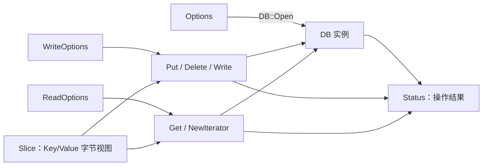

# RocksDB 入门（二）：掌握核心 API，写一个迷你 KV 命令行

上一篇建立了 RocksDB 的内部地图：写入通常经过 WAL 和 MemTable，之后 Flush 为 SST，再由 Compaction 在后台整理。本篇把视角拉回应用侧，回答一个更实际的问题：**C++ 程序究竟应该如何正确地使用 RocksDB？**

我们将围绕六个核心对象展开：

1. `DB`：数据库实例和操作入口；
2. `Options`：打开数据库时的配置；
3. `ReadOptions`：控制单次读取；
4. `WriteOptions`：控制单次写入；
5. `Slice`：不拥有内存的字节视图；
6. `Status`：每次操作的结果。

最后，我们会写出一个支持 `put`、`get`、`delete` 和 `scan` 的迷你命令行程序。


> 图 1：应用通过不同 API 入口配置、读写和观察同一个嵌入式存储引擎。配图用于表达对象关系，具体语义以代码和公共接口为准。

## 1. 先看全局：六个对象如何协作



可以把它们分成三层：

| 层次 | 对象 | 职责 |
| --- | --- | --- |
| 生命周期 | `DB`、`Options` | 创建、持有和配置数据库实例 |
| 单次操作 | `ReadOptions`、`WriteOptions` | 调整一次读写的行为 |
| 数据与结果 | `Slice`、`Status` | 传递字节数据，表达成功或失败 |

这组设计有一个明显特点：数据库级配置与请求级配置分离。数据库打开后，不需要为了切换一次同步写或一次不填充缓存的扫描而重新创建实例。

## 2. DB：所有操作的入口

最小的打开代码如下：

```cpp
rocksdb::Options options;
options.create_if_missing = true;

std::unique_ptr<rocksdb::DB> db;
rocksdb::Status status =
    rocksdb::DB::Open(options, "./mini-kv-data", &db);
if (!status.ok()) {
  std::cerr << "open failed: " << status.ToString() << '\n';
  return 1;
}
```

这里有三个值得注意的点。

### 2.1 DB 是对象，不是网络连接

`DB::Open` 在当前进程中创建数据库对象，并打开指定目录里的文件。后续 `Put` 和 `Get` 是普通的 C++ 方法调用，不经过远程数据库协议。

### 2.2 用 RAII 管理生命周期

公共接口返回的 `DB` 由调用者负责释放。使用 `std::unique_ptr<rocksdb::DB>` 可以让析构发生在确定的位置，即使函数中途返回也不会泄漏资源。

数据库销毁前，应先销毁依赖它的 Iterator、Snapshot 和 Column Family Handle。尤其不要让 Iterator 比 `DB` 活得更久。

### 2.3 一个目录对应一个打开的数据库

普通 RocksDB 实例会锁定数据库目录，避免另一个进程同时以不兼容的方式写入。遇到锁错误时，不应删除锁文件“修复”，而应先确认是否已有进程持有数据库。

一个 `DB` 实例通常可以被应用中的多个线程共享，但 Iterator 等带游标状态的对象不应该被多个线程无同步地同时操作。常见做法是每个扫描任务创建自己的 Iterator。

## 3. Options：决定数据库如何打开

`Options` 组合了数据库级的 `DBOptions` 与默认 Column Family 使用的 `ColumnFamilyOptions`。入门阶段先掌握下面几个配置即可。

```cpp
rocksdb::Options options;
options.create_if_missing = true;
options.error_if_exists = false;
```

| 配置 | 含义 | 常见用途 |
| --- | --- | --- |
| `create_if_missing` | 目录里没有数据库时是否创建 | 首次启动通常设为 `true` |
| `error_if_exists` | 数据库已存在时是否报错 | 初始化工具防止覆盖已有数据 |
| `paranoid_checks` | 是否执行更积极的一致性检查 | 默认保持开启 |

仓库示例还经常出现两个辅助方法：

```cpp
options.IncreaseParallelism();
options.OptimizeLevelStyleCompaction();
```

它们会设置一组适合常见场景的参数，但不是“自动得到最佳性能”的开关。生产配置仍应根据写入速率、读取模式、Value 大小、内存预算和磁盘能力验证。

另一个重要原则是：`Options` 中某些字段保存的是指针或共享对象，例如自定义 Comparator、Merge Operator 和 Cache。阅读具体字段注释，确保相关对象的生命周期覆盖 `DB` 的使用期。

## 4. WriteOptions：一次写入需要多强的持久性

最常见的写法是使用默认配置：

```cpp
rocksdb::WriteOptions write_options;
rocksdb::Status status = db->Put(write_options, "user:1001", "Ada");
```

默认的两个关键字段是：

```cpp
write_options.sync = false;
write_options.disableWAL = false;
```

它们的组合决定写入返回时已经完成到哪一步。

| 配置 | WAL | 返回前同步到持久化介质 | 崩溃风险与代价 |
| --- | --- | --- | --- |
| 默认值 | 写入 | 否 | 进程崩溃通常可恢复；机器掉电可能丢失近期写入 |
| `sync = true` | 写入 | 是 | 持久性更强，单次写延迟通常更高 |
| `disableWAL = true` | 不写 | 不提供 WAL 保护 | 未 Flush 数据可能在崩溃后丢失 |

`sync = false` 并不等于“完全不持久化”。默认情况下仍会写 WAL，只是不要求每次写入都等待操作系统把日志同步到持久化介质。进程崩溃与整台机器掉电是两个不同的故障边界。

不要仅为了提高基准测试数字就关闭 WAL。备份、恢复和故障语义都可能因此改变。

`WriteOptions` 还有一个常见字段：

```cpp
write_options.no_slowdown = true;
```

当写入需要等待或被限速时，它会让请求立即以 `Status::Incomplete()` 失败。它适合上层已经实现重试或降级的低延迟系统，不适合不检查返回值的代码。

## 5. ReadOptions：一次读取要看到什么、影响什么

默认读取可以直接使用临时对象：

```cpp
std::string value;
rocksdb::Status status =
    db->Get(rocksdb::ReadOptions(), "user:1001", &value);
```

三个入门阶段最有用的字段如下。

| 配置 | 默认值 | 作用 |
| --- | --- | --- |
| `snapshot` | `nullptr` | 指定一致性快照；为空时使用本次读取开始时的隐式视图 |
| `verify_checksums` | `true` | 读取数据时校验校验和 |
| `fill_cache` | `true` | 把本次读取涉及的数据块放入 Block Cache |

大范围、一次性的离线扫描经常不希望冲掉在线请求的热点缓存，可以这样写：

```cpp
rocksdb::ReadOptions scan_options;
scan_options.fill_cache = false;
std::unique_ptr<rocksdb::Iterator> it(db->NewIterator(scan_options));
```

关闭 `fill_cache` 不等于完全绕过缓存，也不保证每次都访问磁盘；它控制的是这次迭代读取的相关块是否被放入 Block Cache。

`verify_checksums = false` 可能减少少量工作，但会削弱损坏检测。除非已经明确评估风险，通常应保持默认值。

## 6. Slice：轻量，但不拥有数据

RocksDB 的 Key 和 Value 接口大量使用 `Slice`。它可以近似理解为一个只读字节视图：

```text
Slice
+----------------------+-------+
| const char* data     | size  |
+----------|-----------+-------+
           |
           v
      外部实际内存
```

`Slice` 只保存地址和长度，不复制、分配或释放它指向的数据。这样可以减少热路径上的内存分配与复制，但调用者必须处理好生命周期。

```cpp
std::string key = "user:1001";
rocksdb::Slice key_view(key);

std::cout << key_view.size() << '\n';
std::cout << key_view.ToString() << '\n';  // 复制为 std::string
```

在 `key_view` 使用完之前，不能销毁或以可能触发重新分配的方式修改 `key`。

下面的函数则会返回悬空视图：

```cpp
rocksdb::Slice MakeBrokenKey() {
  std::string local = "user:1001";
  return rocksdb::Slice(local);  // 错误：local 离开函数后被销毁
}
```

Iterator 返回的 `key()` 和 `value()` 也是 `Slice`。它们通常只在 Iterator 下一次 `Seek`、`Next`、`Prev` 等修改操作之前有效。需要长期保存时，应调用 `ToString()` 复制内容。

因为 `Slice` 带有长度，数据不要求以 `\0` 结尾，Key 和 Value 都可以包含二进制字节。不要把 `slice.data()` 直接交给只接受 C 字符串的函数；那类函数不知道 Slice 的真实长度。

## 7. Status：不要把所有失败都当成 NotFound

`Status` 同时表达成功、错误类别和错误信息。

```cpp
rocksdb::Status status = db->Get(read_options, key, &value);

if (status.ok()) {
  std::cout << value << '\n';
} else if (status.IsNotFound()) {
  std::cout << "key does not exist\n";
} else if (status.IsCorruption()) {
  std::cerr << "data corruption: " << status.ToString() << '\n';
} else if (status.IsIOError()) {
  std::cerr << "I/O error: " << status.ToString() << '\n';
} else {
  std::cerr << "read failed: " << status.ToString() << '\n';
}
```

正确的处理方式是先按状态类别决定策略，再用 `ToString()` 记录诊断信息。不要解析 `ToString()` 的文本来判断错误类型，因为文本是给人看的，不是稳定的程序接口。

对于无法在当前层处理的错误，优先把原始 `Status` 返回给调用者：

```cpp
rocksdb::Status LoadUser(rocksdb::DB* db, rocksdb::Slice key,
                         std::string* value) {
  rocksdb::Status status = db->Get(rocksdb::ReadOptions(), key, value);
  if (!status.ok()) {
    return status;
  }
  return rocksdb::Status::OK();
}
```

## 8. 完整示例：迷你 KV 命令行

下面的程序把前面的对象全部串起来。它支持：

```text
put <key> <value>   写入或更新；value 可以包含空格
get <key>           读取
delete <key>        写入删除标记
scan [prefix]       全量扫描或按前缀扫描
help                显示帮助
quit                退出
```

```cpp
#include <iostream>
#include <memory>
#include <sstream>
#include <string>

#include "rocksdb/db.h"
#include "rocksdb/iterator.h"
#include "rocksdb/options.h"

namespace {

void PrintHelp() {
  std::cout << "put <key> <value>\n"
            << "get <key>\n"
            << "delete <key>\n"
            << "scan [prefix]\n"
            << "help\n"
            << "quit\n";
}

void PrintFailure(const char* operation, const rocksdb::Status& status) {
  std::cerr << operation << " failed: " << status.ToString() << '\n';
}

}  // namespace

int main(int argc, char** argv) {
  const std::string db_path =
      argc > 1 ? argv[1] : "./mini-kv-data";

  rocksdb::Options options;
  options.create_if_missing = true;

  std::unique_ptr<rocksdb::DB> db;
  rocksdb::Status status = rocksdb::DB::Open(options, db_path, &db);
  if (!status.ok()) {
    PrintFailure("open", status);
    return 1;
  }

  rocksdb::ReadOptions read_options;
  rocksdb::WriteOptions write_options;

  std::cout << "opened " << db_path << '\n';
  PrintHelp();

  std::string line;
  while (std::cout << "> " && std::getline(std::cin, line)) {
    std::istringstream input(line);
    std::string command;
    input >> command;

    if (command.empty()) {
      continue;
    }

    if (command == "quit" || command == "exit") {
      break;
    }

    if (command == "help") {
      PrintHelp();
      continue;
    }

    if (command == "put") {
      std::string key;
      if (!(input >> key)) {
        std::cerr << "usage: put <key> <value>\n";
        continue;
      }

      std::string value;
      std::getline(input >> std::ws, value);
      status = db->Put(write_options, key, value);
      if (status.ok()) {
        std::cout << "OK\n";
      } else {
        PrintFailure("put", status);
      }
      continue;
    }

    if (command == "get") {
      std::string key;
      if (!(input >> key)) {
        std::cerr << "usage: get <key>\n";
        continue;
      }

      std::string value;
      status = db->Get(read_options, key, &value);
      if (status.ok()) {
        std::cout << value << '\n';
      } else if (status.IsNotFound()) {
        std::cout << "NOT_FOUND\n";
      } else {
        PrintFailure("get", status);
      }
      continue;
    }

    if (command == "delete") {
      std::string key;
      if (!(input >> key)) {
        std::cerr << "usage: delete <key>\n";
        continue;
      }

      status = db->Delete(write_options, key);
      if (status.ok()) {
        std::cout << "OK\n";
      } else {
        PrintFailure("delete", status);
      }
      continue;
    }

    if (command == "scan") {
      std::string prefix;
      input >> prefix;

      rocksdb::ReadOptions scan_options;
      scan_options.fill_cache = false;
      std::unique_ptr<rocksdb::Iterator> iterator(
          db->NewIterator(scan_options));

      if (prefix.empty()) {
        iterator->SeekToFirst();
      } else {
        iterator->Seek(prefix);
      }

      for (; iterator->Valid(); iterator->Next()) {
        if (!prefix.empty() && !iterator->key().starts_with(prefix)) {
          break;
        }
        std::cout << iterator->key().ToString() << " = "
                  << iterator->value().ToString() << '\n';
      }

      status = iterator->status();
      if (!status.ok()) {
        PrintFailure("scan", status);
      }
      continue;
    }

    std::cerr << "unknown command: " << command << '\n';
  }

  return 0;
}
```

如果系统已经安装 RocksDB 开发包并提供 `pkg-config`，可以编译为：

```bash
c++ -std=c++20 mini_kv.cc -o mini_kv \
  $(pkg-config --cflags --libs rocksdb)
./mini_kv ./demo-data
```

在源码仓库中使用静态库时，还需要链接当前构建启用的压缩库和平台依赖。先按 [`INSTALL.md`](../INSTALL.md) 构建 RocksDB，再复用项目构建系统给出的链接参数，避免手工遗漏依赖。

一次交互可能是：

```text
opened ./demo-data
put <key> <value>
get <key>
delete <key>
scan [prefix]
help
quit
> put user:0002 Grace Hopper
OK
> put user:0001 Ada Lovelace
OK
> get user:0001
Ada Lovelace
> scan user:
user:0001 = Ada Lovelace
user:0002 = Grace Hopper
> delete user:0001
OK
> get user:0001
NOT_FOUND
> quit
```

注意扫描结果按 Key 的字节顺序排列，而不是写入顺序排列。

## 9. 为什么 Iterator 结束后还要检查 Status？

`iterator->Valid()` 变成 `false` 有两种主要可能：

1. 已经正常到达扫描范围末尾；
2. 迭代过程中发生了 I/O 错误、数据损坏或其他失败。

所以扫描的完整结构必须包含最后的状态检查：

```cpp
for (iterator->SeekToFirst(); iterator->Valid(); iterator->Next()) {
  // 读取 iterator->key() 和 iterator->value()
}

rocksdb::Status status = iterator->status();
if (!status.ok()) {
  return status;
}
```

只检查 `Valid()` 会把“扫描完成”和“扫描失败”混在一起，这是使用 RocksDB Iterator 时最常见的错误之一。

## 10. 多个修改需要原子提交：WriteBatch

如果一项业务操作要同时修改多个 Key，应使用 `WriteBatch`：

```cpp
#include "rocksdb/write_batch.h"

rocksdb::WriteBatch batch;
batch.Put("account:alice", "90");
batch.Put("account:bob", "110");
batch.Put("transfer:0001", "alice->bob:10");

rocksdb::Status status =
    db->Write(rocksdb::WriteOptions(), &batch);
if (!status.ok()) {
  return status;
}
```

同一个 `WriteBatch` 中的更新会作为一个原子批次写入：读取者不会看到只应用一部分修改的中间状态。

不过，原子批次不等于完整事务。上面的代码没有先检查余额，也没有防止并发转账造成业务冲突。需要读改写隔离时，应使用 TransactionDB、OptimisticTransactionDB，或者在应用层增加合适的并发控制。

## 11. API 使用检查表

在真实项目中接入 RocksDB 时，可以先过一遍下面的检查表：

- `DB`、Iterator、Snapshot、Column Family Handle 的销毁顺序是否正确；
- 每个有意义的 `Status` 是否被检查或向上返回；
- 是否区分了 `NotFound`、`Incomplete`、`IOError` 和 `Corruption`；
- `Slice` 指向的内存在使用期间是否始终有效；
- 是否理解 `sync` 与 `disableWAL` 对故障恢复的影响；
- 大范围扫描是否应该设置 `fill_cache = false`；
- Iterator 结束后是否检查了 `iterator->status()`；
- 多 Key 修改是否应该放入 `WriteBatch`。

## 12. 本篇小结

这六个对象已经覆盖了 RocksDB 最常用的 API 骨架：

```text
Options + DB::Open        -> 创建 DB
WriteOptions + Put/Write  -> 写入数据
ReadOptions + Get/Iterator -> 读取数据
Slice                     -> 传递不拥有内存的字节视图
Status                    -> 表达成功、失败与错误类别
```

真正需要记住的不是每个字段，而是三个边界：

1. `Options` 管数据库，`ReadOptions` 和 `WriteOptions` 管单次请求；
2. `Slice` 不拥有内存，生命周期由调用者负责；
3. `Status` 和 Iterator 的最终状态都不能被忽略。

下一篇将进入 Column Family：学习如何在同一个 RocksDB 实例中管理多组逻辑数据、正确持有 Handle，并理解不同 Column Family 共享与隔离了哪些资源。

## 参考入口

- [`include/rocksdb/db.h`](../include/rocksdb/db.h)：`DB`、读写和 Iterator 创建接口；
- [`include/rocksdb/options.h`](../include/rocksdb/options.h)：数据库、读取和写入配置；
- [`include/rocksdb/slice.h`](../include/rocksdb/slice.h)：`Slice` 的内存视图语义；
- [`include/rocksdb/status.h`](../include/rocksdb/status.h)：`Status` 的错误分类；
- [`include/rocksdb/iterator.h`](../include/rocksdb/iterator.h)：Iterator 接口与生命周期；
- [`include/rocksdb/write_batch.h`](../include/rocksdb/write_batch.h)：原子批量写；
- [`examples/simple_example.cc`](../examples/simple_example.cc)：仓库内的基础示例。
