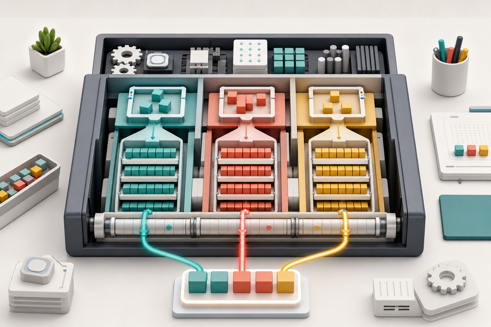
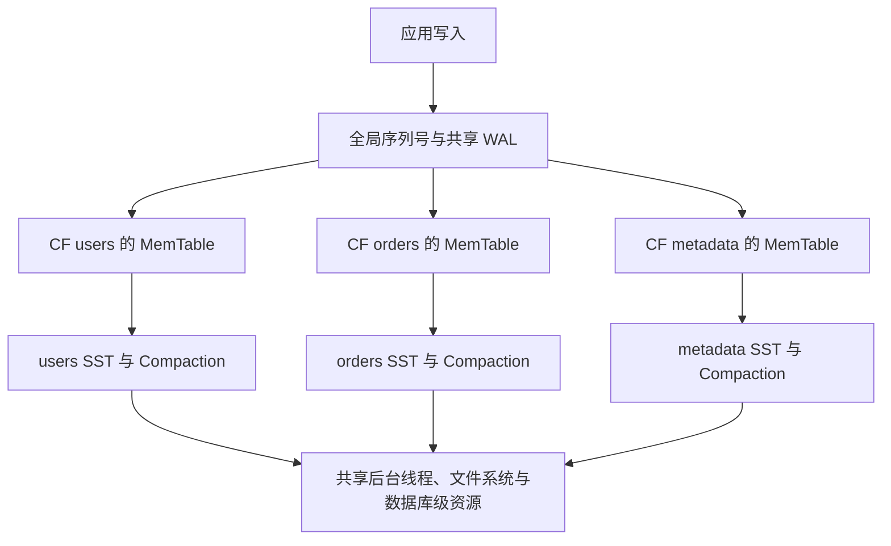
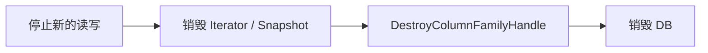

# RocksDB 入门（三）：Column Family 的隔离、共享与生命周期

前两篇已经介绍了 RocksDB 的基本结构与核心 API。如果一个应用同时保存用户资料、订单状态和系统元数据，最直接的办法是在 Key 前加前缀：

```text
user:1001
order:20260711:0001
meta:schema_version
```

这种做法简单有效，但三类数据仍使用完全相同的 MemTable、SST 和 Compaction 配置。假设订单写入量很大，而元数据很小且读取频繁，我们可能希望它们拥有不同的写缓冲、压缩和整理策略。

这正是 Column Family（下文简称 CF）解决的问题：**一个 RocksDB 数据库中，可以存在多个逻辑 Key 空间；每个 CF 拥有自己的数据与部分存储结构，同时共享数据库级资源。**

本篇将完成六件事：

1. 区分 CF、Key 前缀和独立数据库；
2. 理解 CF 独享什么、共享什么；
3. 创建并重新打开多个 CF；
4. 正确管理 `ColumnFamilyHandle`；
5. 使用 `WriteBatch` 跨 CF 原子写入；
6. 安全地删除 CF。



> 图 1：三个逻辑数据通道各自维护内存区与有序文件，同时共享数据库级日志和后台资源。底部的混合批次表示一次写入可以原子地更新多个 CF。

## 1. Column Family 不是关系型数据库的“列族”

虽然名字里有 Column，RocksDB CF 并不是表中的一组列。更准确的理解是：**CF 是同一个 DB 内的命名 Key 空间。**

假设数据库中有两个 CF：

```text
CF: users                 CF: sessions
--------------------      --------------------
key = 1001                key = 1001
value = {name: Ada}       value = {token: ...}
```

同一个 Key 可以同时出现在不同 CF 中，它们互不覆盖：

```cpp
rocksdb::Status status =
    db->Put(write_options, users_cf, "1001", "Ada");
if (!status.ok()) {
  return status;
}

status = db->Put(
    write_options, sessions_cf, "1001", "token-abc");
if (!status.ok()) {
  return status;
}
```

调用读写 API 时，`ColumnFamilyHandle*` 与 Key 一起确定目标数据：

```text
一条记录的逻辑地址 = ColumnFamily + Key
```

没有显式传入 Handle 的 `Put`、`Get` 和 `Delete`，实际操作的是默认 CF。

## 2. 独享与共享：CF 的真正边界

理解 CF 的关键，不是只记住“逻辑隔离”，而是知道它的资源边界。



大体上可以这样划分：

| 每个 CF 独立拥有或配置 | 同一个 DB 内共享 |
| --- | --- |
| 逻辑 Key 空间 | WAL |
| Mutable/Immutable MemTable | 全局 Sequence Number |
| SST 文件和各层版本 | 后台线程池 |
| Comparator、Merge Operator | 文件系统与数据库目录 |
| 写缓冲、压缩、Compaction 配置 | MANIFEST 等数据库级元数据 |
| CF 级统计与属性 | Rate Limiter、Write Buffer Manager 等共享对象 |

Block Cache 是否共享取决于配置：多个 CF 使用同一个 Cache 对象时，它们共享缓存预算；分别配置 Cache 对象时可以拆分预算。因此不要简单地认为“CF 一定有独立缓存”或“一定共享缓存”。

所有 CF 的 Sequence Number 在同一个 DB 内全局递增，WAL 记录也可能交错包含不同 CF 的写入。这使跨 CF 的一致读视图和原子批次成为可能。

### CF 不是资源硬隔离

一个高写入量 CF 可能消耗后台 Compaction 能力、占用共享缓存或触发数据库级流控，从而影响其他 CF。CF 提供数据与配置边界，但不是进程、磁盘或 I/O 配额层面的硬隔离。

如果两个工作负载必须独立故障、独立限流或独立维护，使用两个 DB 目录甚至两个进程通常更合适。

## 3. 默认 Column Family

每个 RocksDB 数据库都存在名为 `default` 的默认 CF，其常量是：

```cpp
rocksdb::kDefaultColumnFamilyName
```

使用简单版本的 `DB::Open` 时，只打开默认 CF：

```cpp
rocksdb::Options options;
options.create_if_missing = true;

std::unique_ptr<rocksdb::DB> db;
rocksdb::Status status =
    rocksdb::DB::Open(options, "./column-family-demo", &db);
```

下列两次写入目标相同：

```cpp
rocksdb::Status status =
    db->Put(rocksdb::WriteOptions(), "key", "value");
if (!status.ok()) {
  return status;
}

status = db->Put(rocksdb::WriteOptions(),
                 db->DefaultColumnFamily(), "key", "value");
if (!status.ok()) {
  return status;
}
```

`db->DefaultColumnFamily()` 返回的是 DB 自己持有的默认 Handle，不要把这个指针传给 `DestroyColumnFamilyHandle()`。

后面会看到，使用“多 CF Open”返回的 Handles 是另一种所有权：包括 default 在内，那些返回给调用者的 Handles 都需要在关闭 DB 前显式销毁。

## 4. 创建 Column Family

数据库打开后，可以动态创建 CF：

```cpp
rocksdb::ColumnFamilyOptions users_options;
users_options.write_buffer_size = 32 * 1024 * 1024;

rocksdb::ColumnFamilyHandle* users_cf = nullptr;
rocksdb::Status status =
    db->CreateColumnFamily(users_options, "users", &users_cf);
if (!status.ok()) {
  std::cerr << "create users CF failed: "
            << status.ToString() << '\n';
  return 1;
}
```

成功后，`users_cf` 由调用者管理。使用完毕且准备关闭数据库时：

```cpp
status = db->DestroyColumnFamilyHandle(users_cf);
if (!status.ok()) {
  std::cerr << "destroy handle failed: "
            << status.ToString() << '\n';
  return 1;
}

db.reset();
```

销毁 Handle 不会删除 CF 数据。它只释放当前进程持有的操作句柄；CF 仍会记录在数据库元数据中，下次打开时必须再次声明。

## 5. 重新打开数据库：必须列出全部 CF

数据库一旦包含非默认 CF，再用简单版本的 `DB::Open(options, path, &db)` 打开会失败。读写模式下必须提供数据库中全部 CF 的描述符。

```cpp
std::vector<rocksdb::ColumnFamilyDescriptor> descriptors;
descriptors.emplace_back(
    rocksdb::kDefaultColumnFamilyName,
    rocksdb::ColumnFamilyOptions());
descriptors.emplace_back("users", rocksdb::ColumnFamilyOptions());
descriptors.emplace_back("orders", rocksdb::ColumnFamilyOptions());

std::vector<rocksdb::ColumnFamilyHandle*> handles;
std::unique_ptr<rocksdb::DB> db;

rocksdb::Status status = rocksdb::DB::Open(
    rocksdb::DBOptions(), "./column-family-demo",
    descriptors, &handles, &db);
if (!status.ok()) {
  std::cerr << "open failed: " << status.ToString() << '\n';
  return 1;
}
```

成功时，`handles.size()` 与 `descriptors.size()` 相同，并保持对应关系：

```text
descriptors[0] default  <-> handles[0]
descriptors[1] users    <-> handles[1]
descriptors[2] orders   <-> handles[2]
```

不要假设 Handle 按 CF 名称自动排序。它们与调用方提供的 Descriptor 顺序一致。

### 5.1 不知道数据库里有哪些 CF 怎么办？

使用 `ListColumnFamilies`：

```cpp
std::vector<std::string> names;
rocksdb::Status status = rocksdb::DB::ListColumnFamilies(
    rocksdb::DBOptions(), "./column-family-demo", &names);
if (!status.ok()) {
  return status;
}

std::vector<rocksdb::ColumnFamilyDescriptor> descriptors;
for (const std::string& name : names) {
  descriptors.emplace_back(name, rocksdb::ColumnFamilyOptions());
}
```

`ListColumnFamilies` 返回名称的顺序没有保证。应用应按名称决定每个 CF 的配置，再构造 Descriptor：

```cpp
rocksdb::ColumnFamilyOptions OptionsFor(const std::string& name) {
  rocksdb::ColumnFamilyOptions options;

  if (name == "orders") {
    options.write_buffer_size = 128 * 1024 * 1024;
  } else if (name == "metadata") {
    options.write_buffer_size = 8 * 1024 * 1024;
  }

  return options;
}
```

Comparator 等影响数据解释的配置必须与创建和历史写入时兼容。不能为了“调优”随意更换 Comparator，否则数据库可能无法正确打开或读取。

### 5.2 只读打开是一个例外

`OpenForReadOnly` 可以只打开已有 CF 的子集，但仍必须包含默认 CF。普通读写 `Open` 则要求打开全部 CF。不要把只读模式的规则套到读写模式。

## 6. 用名称管理 Handle

真实应用不应在各处依赖 `handles[1]` 这样的数字位置。打开成功后，可以建立名称到 Handle 的映射：

```cpp
#include <unordered_map>

std::unordered_map<std::string, rocksdb::ColumnFamilyHandle*>
    handles_by_name;

for (size_t i = 0; i < descriptors.size(); ++i) {
  handles_by_name.emplace(descriptors[i].name, handles[i]);
}

rocksdb::ColumnFamilyHandle* users_cf =
    handles_by_name.at("users");
```

Handle 是调用 CF API 的能力凭证。不要：

- 在 DB 销毁后继续使用 Handle；
- 使用已经 Drop 的 CF Handle 继续写入；
- 把一个 DB 产生的 Handle 传给另一个 DB 实例；
- 忘记销毁多 CF `Open` 返回的 Handle。

关闭顺序应该是：



对应代码：

```cpp
rocksdb::Status cleanup_status = rocksdb::Status::OK();

for (rocksdb::ColumnFamilyHandle* handle : handles) {
  rocksdb::Status status = db->DestroyColumnFamilyHandle(handle);
  if (!status.ok() && cleanup_status.ok()) {
    cleanup_status = status;
  }
}
handles.clear();
db.reset();

if (!cleanup_status.ok()) {
  std::cerr << "handle cleanup failed: "
            << cleanup_status.ToString() << '\n';
}
```

这里销毁了多 CF `Open` 返回的所有 Handles，包括与 default Descriptor 对应的 Handle。它们是 API 返回给调用者管理的对象，与 `db->DefaultColumnFamily()` 返回的 DB 自有指针不是同一种所有权。

## 7. 在指定 CF 中读写

获得 Handle 后，读写 API 只比默认版本多一个参数：

```cpp
rocksdb::WriteOptions write_options;
rocksdb::ReadOptions read_options;

rocksdb::Status status = db->Put(
    write_options, users_cf, "1001", "Ada");
if (!status.ok()) {
  return status;
}

std::string value;
status = db->Get(read_options, users_cf, "1001", &value);
if (status.IsNotFound()) {
  std::cout << "user does not exist\n";
} else if (!status.ok()) {
  return status;
}
```

删除也必须传入正确 Handle：

```cpp
status = db->Delete(write_options, users_cf, "1001");
```

如果 Key 实际存放在 `users`，却拿 `orders_cf` 去读取，结果是 `NotFound`，而不是“自动搜索其他 CF”。RocksDB 不会跨 CF 猜测数据位置。

## 8. 跨 CF 原子写：WriteBatch

一个订单创建动作可能同时修改三个 CF：

- `orders`：保存订单主体；
- `users`：更新用户最近订单；
- `metadata`：记录业务事件位置。

可以把它们放进同一个 `WriteBatch`：

```cpp
#include "rocksdb/write_batch.h"

rocksdb::WriteBatch batch;
batch.Put(orders_cf, "order:0001", "created");
batch.Put(users_cf, "user:1001:last_order", "0001");
batch.Put(metadata_cf, "last_event", "42");

rocksdb::Status status =
    db->Write(rocksdb::WriteOptions(), &batch);
if (!status.ok()) {
  std::cerr << "write batch failed: "
            << status.ToString() << '\n';
  return 1;
}
```

同一个 DB 内，`WriteBatch` 可以跨 CF 原子应用。其他读取者不会看到只写入其中一部分的中间状态。

这个能力不能跨两个独立 DB 目录。将数据拆成多个 DB 会获得更强的资源与故障隔离，但会失去原生的跨目录原子批次。

还要再次强调：原子写不自动提供业务级读改写隔离。若创建订单前需要检查库存并防止并发超卖，应使用事务 API 或应用层并发控制。

## 9. 每个 CF 创建自己的 Iterator

Iterator 始终属于某一个 CF：

```cpp
rocksdb::ReadOptions read_options;
read_options.fill_cache = false;

std::unique_ptr<rocksdb::Iterator> iterator(
    db->NewIterator(read_options, orders_cf));

const std::string prefix = "order:20260711:";
for (iterator->Seek(prefix);
     iterator->Valid() && iterator->key().starts_with(prefix);
     iterator->Next()) {
  std::cout << iterator->key().ToString() << " = "
            << iterator->value().ToString() << '\n';
}

rocksdb::Status status = iterator->status();
if (!status.ok()) {
  return status;
}
```

Iterator 不会自动跨 CF。如果需要组合多个 CF 的结果，上层必须分别迭代并合并，或者使用专门的跨 CF 接口并理解其语义。

## 10. 为不同 CF 设置不同策略

CF 的重要价值是可以按数据特征配置存储行为：

```cpp
rocksdb::ColumnFamilyOptions orders_options;
orders_options.write_buffer_size = 128 * 1024 * 1024;
orders_options.max_write_buffer_number = 4;

rocksdb::ColumnFamilyOptions metadata_options;
metadata_options.write_buffer_size = 8 * 1024 * 1024;
metadata_options.max_write_buffer_number = 2;
```

常见差异包括：

| 数据特征 | 可能关注的配置方向 |
| --- | --- |
| 写入量大、允许较大内存 | 增大写缓冲，确保后台 Flush/Compaction 跟得上 |
| 小而热点的数据 | 控制内存占用，评估独立或共享 Cache |
| Value 较大且可压缩 | 选择合适的压缩算法与层级策略 |
| 需要自定义聚合语义 | 配置 Merge Operator |
| 特殊 Key 排序 | 配置 Comparator，并保证长期兼容 |

`write_buffer_size` 是每个 CF 的限制。创建许多 CF 后，即使每个 CF 流量不大，MemTable 与元数据开销也会累积。可以使用 DB 级 `db_write_buffer_size` 或共享 `WriteBufferManager` 管理总体内存，但它们不能消除大量 CF 本身的管理成本。

## 11. DropColumnFamily：删除分两步

删除 CF 不是只调用一次 `delete`。正确流程是：

```cpp
rocksdb::Status status = db->DropColumnFamily(orders_cf);
if (!status.ok()) {
  return status;
}

status = db->DestroyColumnFamilyHandle(orders_cf);
if (!status.ok()) {
  return status;
}
orders_cf = nullptr;
```

两个动作含义不同：

1. `DropColumnFamily` 在 MANIFEST 中记录删除，并阻止该 CF 继续 Flush 和 Compaction；
2. `DestroyColumnFamilyHandle` 释放当前调用者持有的 Handle。

CF 只有在已经 Drop 且相关 Handles 都被销毁后，才具备被彻底清理的条件。Drop 成功后不要继续使用旧 Handle 读写。

默认 CF 不能像普通业务 CF 那样随意删除。通常保留它保存少量元数据，或者保持为空，但多 CF 打开时仍需声明它。

批量创建或批量删除 CF 可能部分成功。调用 `CreateColumnFamilies` 或 `DropColumnFamilies` 时，要检查返回的 Handles，并在不确定时通过 `ListColumnFamilies` 核对最终状态。

## 12. CF、Key 前缀还是独立 DB？

这是架构设计中比 API 调用更重要的问题。

| 方案 | 优点 | 代价 | 适合场景 |
| --- | --- | --- | --- |
| Key 前缀 | 最简单，无 Handle 生命周期 | 所有数据共享同一 CF 配置与文件 | 数据策略相近、租户数量很多 |
| Column Family | 独立 Key 空间和存储策略；支持跨 CF 原子批次 | 每个 CF 有内存和管理开销；共享资源会互相影响 | 少量、稳定的数据类别 |
| 独立 DB | 资源、目录、故障和维护边界更清晰 | 无原生跨 DB 原子批次；实例更多 | 强隔离、独立备份或独立生命周期 |

一个很实用的经验是：

- “用户、订单、元数据”这类数量少且固定的类别，可以考虑 CF；
- “每个租户一个分区”且租户可能达到成千上万时，通常先考虑 Key 前缀；
- 需要单独迁移、限流、备份或故障隔离的业务，考虑独立 DB。

不要把 CF 当作廉价且无限量的表。每个 CF 都可能拥有 Mutable MemTable、Immutable MemTable、SST 版本和 Compaction 状态，数量增长会变成真实的内存与管理成本。

## 13. 常见错误清单

### 错误一：创建 CF 后仍用简单 Open 重启

普通读写模式必须打开全部 CF。先用 `ListColumnFamilies` 获取名称，再构造全部 Descriptor。

### 错误二：忘记 default

多 CF 打开时必须包含 `kDefaultColumnFamilyName`，即使业务完全不在 default 中保存数据。

### 错误三：把 Handles 的数组位置写死

Descriptor 顺序由调用者决定，`ListColumnFamilies` 的结果顺序没有保证。建立名称到 Handle 的映射更稳妥。

### 错误四：先销毁 DB，再销毁 Handles

多 CF `Open` 返回的 Handles 应在 DB 销毁前通过 `DestroyColumnFamilyHandle` 释放。

### 错误五：认为 CF 完全互不影响

它们共享 WAL、后台线程和多种数据库级资源。容量规划和监控仍要从整个 DB 的角度进行。

### 错误六：为每个用户或租户创建一个 CF

大量 CF 会累积 MemTable、文件版本和调度开销。高基数逻辑分区通常更适合编码到 Key 前缀中。

## 14. 本篇小结

Column Family 的核心可以浓缩成下面几句话：

```text
逻辑地址：ColumnFamily + Key
独立部分：Key 空间、MemTable、SST、Compaction 与 CF Options
共享部分：WAL、全局 Sequence Number、后台线程和数据库级资源
打开规则：普通读写必须列出全部 CF，且包含 default
关闭规则：先销毁迭代器等对象，再销毁返回的 Handles，最后销毁 DB
原子能力：同一个 WriteBatch 可以原子更新同一 DB 内的多个 CF
```

CF 的价值不只是把 Key 分组，而是为少量稳定的数据类别提供独立存储策略，同时保留同一 DB 内的原子写与一致性基础。它的限制也来自“仍在同一个 DB”：资源竞争和故障边界并没有完全分开。

下一篇将回到 RocksDB 的底层基础，完整拆解 LSM Tree：为什么顺序写通常更快、读放大和写放大从哪里来，以及 MemTable、SST 与 Compaction 如何组成一个持续运转的系统。

## 参考入口

- [`examples/column_families_example.cc`](../examples/column_families_example.cc)：仓库内的 CF 生命周期示例；
- [`include/rocksdb/db.h`](../include/rocksdb/db.h)：Descriptor、Handle、Open、Create 与 Drop 接口；
- [`include/rocksdb/options.h`](../include/rocksdb/options.h)：`DBOptions` 与 `ColumnFamilyOptions`；
- [`include/rocksdb/write_batch.h`](../include/rocksdb/write_batch.h)：跨 CF 原子批次；
- [`docs/components/write_flow/index.md`](../docs/components/write_flow/index.md)：共享 WAL、序列号与写入流程；
- [`docs/components/read_flow/index.md`](../docs/components/read_flow/index.md)：CF 级读视图与读取流程。
