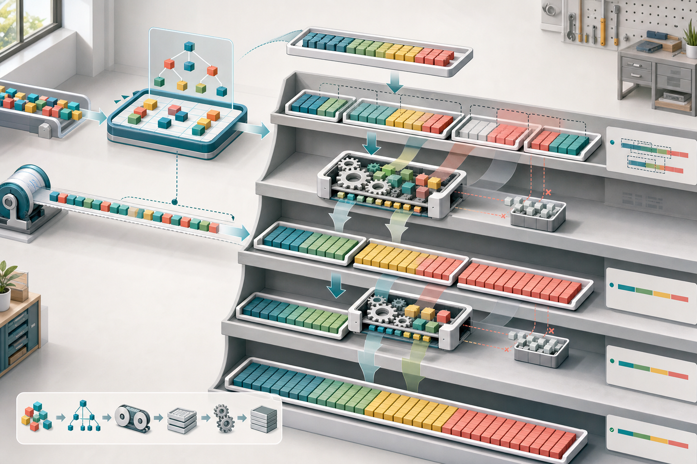
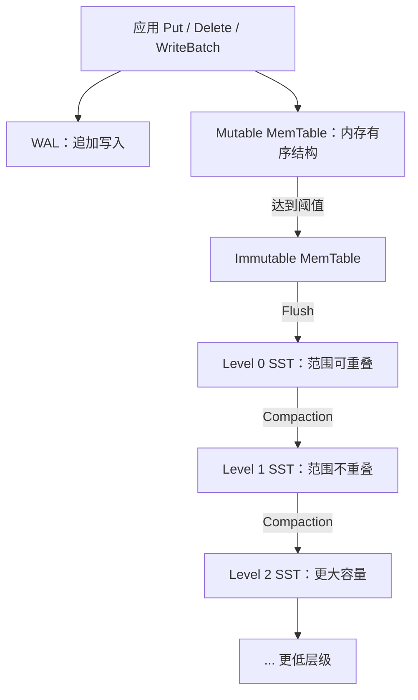
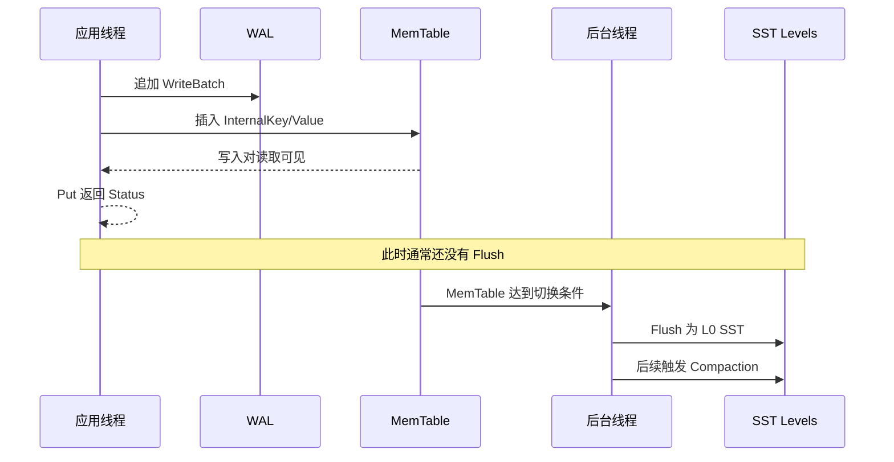
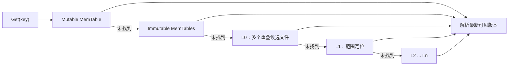

# RocksDB 入门（四）：看懂 LSM Tree 的写入、读取与 Compaction

前面三篇已经学会了 RocksDB 的基本 API 和 Column Family。现在可以回答一个更底层的问题：为什么 RocksDB 不在每次 `Put` 时直接找到磁盘上的旧记录并原地修改？

答案是 LSM Tree，全称 Log-Structured Merge Tree。它的核心思想可以先浓缩成一句话：

> 前台把小而随机的更新先写入日志和有序内存结构，后台再把它们批量转换成不可变有序文件，并持续合并整理。

这个设计把很多昂贵工作从请求路径搬到后台，但并没有让成本消失。写入延迟降低的代价，是读取时需要检查多个位置，以及 Compaction 会反复读写数据。

本篇将建立一张完整的 LSM 地图，并通过一个小实验观察 Flush 与层级文件变化。



> 图 1：数据先进入内存排序结构，同时追加到 WAL；Flush 产生可能重叠的 L0 文件，Compaction 再将其合并为更大、更稳定的有序层级，并在安全时清理旧版本。

## 1. 为什么不直接原地更新？

假设磁盘上已经有一棵大型有序树。每次更新一个 Key，系统可能需要：

1. 定位包含该 Key 的页面；
2. 读取页面；
3. 修改内容并处理分裂或合并；
4. 把页面写回；
5. 维护崩溃一致性元数据。

当写入 Key 分散在整个数据集时，请求会产生大量离散 I/O。对机械磁盘来说，随机寻道尤其昂贵；对 SSD 来说，随机访问差距缩小了，但小写、擦写、同步和元数据更新仍有成本。

LSM 选择另一条路：

```text
小随机更新
    |
    v
内存中排序 + 日志追加
    |
    v
批量生成有序文件
    |
    v
后台顺序合并
```

前台不急着修改旧文件，而是追加一个更新版本。旧值、新值和删除标记可以暂时共存，读取逻辑根据版本顺序选择当前可见结果。

所以“RocksDB 写入快”更准确的说法是：**它把前台随机修改转换为内存更新、日志追加和后台批量 I/O，使请求路径更短、更容易合并。**

## 2. LSM Tree 不是一棵传统指针树

RocksDB 的 LSM 更像多组按 Key 排序的数据集合：



这里讨论的是 RocksDB 常见的 Leveled Compaction。Universal、FIFO 等 Compaction Style 的文件组织和触发方式不同，不能把所有结论机械套用过去。

组成这套系统的核心对象是：

| 组件 | 是否可变 | 主要职责 |
| --- | --- | --- |
| WAL | 追加 | 为尚未 Flush 的写入提供崩溃恢复基础 |
| Mutable MemTable | 可变 | 接收当前写入并保持 Key 有序 |
| Immutable MemTable | 只读 | 等待后台 Flush，仍可参与读取 |
| SST | 不可变 | 在磁盘保存排序后的 Key 与版本 |
| MANIFEST | 追加元数据 | 记录哪些 SST 属于哪些层级及版本变化 |
| Compaction | 后台任务 | 合并重叠范围、整理层级并清理过期数据 |

## 3. 一次写入的时间线

默认写入路径可以简化为：



具体实现还包含 WriteThread、组提交、Sequence Number 分配、并发 MemTable 写入和错误发布等步骤，后续写入路径文章会逐层展开。

现在先抓住两个边界：

- `Put` 成功通常不表示数据已经进入 SST；
- `Put` 是否等待 WAL 同步到持久化介质，由 `WriteOptions::sync` 等配置决定。

## 4. WAL 与 MemTable 为什么要同时存在？

MemTable 让写入和近期读取都很快，但它位于内存中。机器或进程异常退出后，未 Flush 的 MemTable 会消失。

WAL 解决的是恢复问题：

```text
正常运行：WriteBatch -> WAL -> MemTable
异常重启：读取 MANIFEST -> 重放 WAL -> 重建 MemTable
```

默认情况下，WAL 与 MemTable 记录同一批逻辑更新，但用途不同：

- WAL 按写入顺序追加，适合恢复；
- MemTable 按内部 Key 排序，适合读写和生成 SST。

当相关 MemTable 已经成功 Flush，旧 WAL 中不再承担恢复职责的部分才具备回收条件。多个 CF 共享 WAL 时，只要某个 CF 仍依赖较旧日志，日志回收就可能被延后。

关闭 WAL 可以减少一部分写入工作，却会让未 Flush 数据失去正常的日志恢复保护。它是持久性选择，不是免费的性能开关。

## 5. MemTable：当前正在变化的有序集合

默认 MemTable 通常使用 SkipList 表示，内部保存的不是简单的 User Key，而是带版本信息的 InternalKey。

可以用下面的概念结构理解：

```text
InternalKey = UserKey + SequenceNumber + ValueType

user:1001 | seq=105 | Put       -> Ada v2
user:1001 | seq=101 | Put       -> Ada v1
user:1000 | seq=108 | Delete    -> Tombstone
```

同一个 User Key 可以存在多个版本。Sequence Number 越大通常表示更新越新，ValueType 区分普通值、删除标记、Merge 等记录类型。

MemTable 的主要特征：

- 新写入插入有序内存结构；
- `Get` 可以先在这里找到最新可见版本；
- Iterator 可以与其他层级 Iterator 一起归并；
- 内存主要通过 Arena 批量分配，Flush 后可以整体释放；
- 达到大小或其他触发条件时，会切换为 Immutable MemTable。

`write_buffer_size` 控制单个 CF 的目标写缓冲规模，但 MemTable 的实际切换还可能受 WriteBufferManager、WAL 大小和内存压力等条件影响。它不是精确到字节的硬边界。

## 6. Immutable MemTable 与 Flush

当前 MemTable 被切换后不再接受写入，新的写入进入下一张 Mutable MemTable。旧表进入 Immutable 列表，等待后台 Flush。

```text
时刻 T0：Mutable A 接收写入
时刻 T1：A 变为 Immutable，Mutable B 开始接收写入
时刻 T2：后台将 A Flush 为 SST
时刻 T3：A 从内存列表移除，相关 WAL 可能具备回收条件
```

Flush 的核心工作是顺序遍历已经排序的 MemTable，把数据编码为 SST：

- 生成 Data Block；
- 建立 Index Block；
- 可选地生成 Filter Block；
- 压缩并写入校验和；
- 完成文件后，把它安装到当前 Version；
- 更新 MANIFEST 中的文件集合。

Flush 生成的文件通常进入 L0。SST 一旦完成就不会原地修改；后续变化通过生成新文件和切换版本完成。

应用也可以手动触发 Flush：

```cpp
rocksdb::FlushOptions flush_options;
flush_options.wait = true;

rocksdb::Status status = db->Flush(flush_options);
if (!status.ok()) {
  return status;
}
```

手动 Flush 会制造额外文件和 I/O，不应在每次写入后调用。正常系统通常让 RocksDB 根据缓冲和后台调度自动完成。

## 7. 为什么 L0 与其他 Level 不一样？

多个 MemTable 分别 Flush 时，每个 SST 都包含当时的一段排序数据，但不同文件的 Key 范围可能重叠：

```text
L0 file A: [a ........ m]
L0 file B:      [f ........ r]
L0 file C: [b ................ z]
```

因此读取某个 Key 时，L0 可能需要检查多个候选文件，并且要按新旧顺序解析版本。

在典型 Leveled Compaction 中，L1 及以下层级维持层内 Key 范围不重叠：

```text
L1: [a..d] [e..h] [i..m] [n..r] [s..z]
L2: [a......f] [g......n] [o......z]
```

这样，给定一个 User Key，每个 L1+ 层级通常最多定位到一个候选文件。层级越低，目标总容量通常越大，数据也更稳定。

| 层级 | 文件范围 | 读取特征 |
| --- | --- | --- |
| L0 | 可以重叠 | 可能检查多个文件，按新旧顺序处理 |
| L1+ | 同层通常不重叠 | 可按范围快速定位候选文件 |

L0 文件持续堆积会明显提高读取成本，也是写入限速和停止的重要信号。

## 8. 读取为什么比写入更复杂？

一个 Key 的最新可见版本可能位于多个位置：



这就是 LSM 的读放大来源之一：一次逻辑读取可能检查多张 MemTable、多个文件和多个数据块。

RocksDB 使用多种机制降低成本：

- Bloom Filter 排除一定不存在的候选；
- 文件 Key 范围缩小搜索集合；
- Index Block 定位数据块；
- Block Cache 缓存热点数据、索引和过滤器；
- Row Cache 可在适合的工作负载中缓存查询结果；
- Compaction 减少重叠文件和过期版本。

Bloom Filter 只能回答“很可能不存在”或“可能存在”，不能返回 Value，也不能彻底消除假阳性。

## 9. Compaction 到底做了什么？

Compaction 可以近似理解为多路归并排序：

```text
输入层文件： [a c e g]  [b d f h]
下一层重叠： [a b c d]  [e f g h]
                     |
                     v
归并与版本处理：a b c d e f g h
                     |
                     v
新输出文件： [a b c d]  [e f g h]
```

实际工作包括：

1. 选择一个或多个输入文件；
2. 找出下一层与其 Key 范围重叠的文件；
3. 创建多个 Iterator，按 InternalKey 顺序归并；
4. 根据 Snapshot、Sequence Number、Tombstone、Merge 等规则判断哪些版本必须保留；
5. 生成新的不可变 SST；
6. 原子安装新 Version；
7. 在旧文件不再被任何读视图引用后回收它们。

Compaction 不是简单地“删除重复 Key”。旧版本能否丢弃取决于是否仍可能被 Snapshot 或其他读视图看到，删除标记能否清理还取决于更低层是否可能存在被它遮蔽的数据。

### 为什么需要持续 Compaction？

如果只 Flush 不 Compaction：

- L0 文件会不断增加；
- 读取需要检查越来越多文件；
- 旧版本和 Tombstone 无法及时回收；
- 空间占用持续增长；
- 最终写入会因后台处理跟不上而停顿。

所以 Compaction 是 LSM 能长期运行的必要成本，不是可有可无的“磁盘整理”。

## 10. 三种放大：成本没有消失

LSM 的性能讨论经常围绕三种放大。

### 10.1 写放大

```text
写放大 = 存储设备实际写入字节 / 应用逻辑写入字节
```

一条数据先写 WAL，再写入 L0 SST，之后还可能在多个 Level 的 Compaction 中被反复写出。层级比例、数据更新模式、压缩和 Compaction Style 都会影响写放大。

### 10.2 读放大

读放大表示完成一次逻辑读取需要检查的内存结构、文件、块或设备读取数量。L0 文件多、Bloom Filter 效果差、缓存命中低时，读放大会升高。

### 10.3 空间放大

```text
空间放大 = 存储引擎占用的物理空间 / 当前有效逻辑数据量
```

旧版本、Tombstone、Compaction 临时输入输出和层级容量策略都会增加空间占用。

三者往往相互制约：

| 优化方向 | 可能得到 | 可能付出 |
| --- | --- | --- |
| 更积极 Compaction | 更低读放大和空间放大 | 更多后台 I/O 与写放大 |
| 容忍更多文件 | 更少即时 Compaction 压力 | 更高读放大和空间占用 |
| 更大 MemTable | 更少 Flush 文件、更好的批量性 | 更多内存和更长恢复时间 |
| 更大层级容量 | 减少部分迁移频率 | 更慢的数据下沉和空间回收 |

不存在同时最小化三种放大的通用配置，必须根据工作负载选择平衡点。

## 11. 后台跟不上时：限速与写停顿

前台写入速度可以短时间超过磁盘整理速度，但不能无限持续。RocksDB 会观察：

- Immutable MemTable 数量；
- L0 文件数量；
- 估算的待 Compaction 字节数。

压力升高时，系统可能先增加 Compaction 并行度，然后延迟写入；达到停止阈值后，新的写入需要等待后台追上。


写停顿不是偶然的抖动，而是保护机制：如果仍让前台无限制造 L0 文件，读取和恢复成本会失控。

调优时不要只盯平均写入吞吐。L0 文件数、Pending Compaction Bytes、Flush/Compaction 时间和 Stall 统计通常更能说明系统是否处于健康稳态。

## 12. 动手实验：观察 Flush 与层级变化

下面的程序刻意关闭自动 Compaction，并把 MemTable 设置得很小。每轮写入后手动 Flush，再打印各层文件数；最后执行一次全范围手动 Compaction。

> 这些参数只用于教学实验，不要直接用于生产环境。

```cpp
#include <iomanip>
#include <iostream>
#include <memory>
#include <sstream>
#include <string>

#include "rocksdb/db.h"
#include "rocksdb/options.h"
#include "rocksdb/write_batch.h"

namespace {

std::string MakeKey(int value) {
  std::ostringstream key;
  key << "key:" << std::setfill('0') << std::setw(8) << value;
  return key.str();
}

rocksdb::Status PrintLevelFiles(rocksdb::DB* db) {
  std::cout << "levels:";
  for (int level = 0; level < db->NumberLevels(); ++level) {
    const std::string property =
        "rocksdb.num-files-at-level" + std::to_string(level);
    std::string file_count;
    if (!db->GetProperty(property, &file_count)) {
      return rocksdb::Status::NotFound(
          "property unavailable: ", property);
    }
    std::cout << " L" << level << '=' << file_count;
  }
  std::cout << '\n';
  return rocksdb::Status::OK();
}

void PrintFailure(const char* operation,
                  const rocksdb::Status& status) {
  std::cerr << operation << " failed: "
            << status.ToString() << '\n';
}

}  // namespace

int main(int argc, char** argv) {
  const std::string db_path =
      argc > 1 ? argv[1] : "./lsm-observe";

  rocksdb::Options options;
  options.create_if_missing = true;
  options.write_buffer_size = 64 * 1024;
  options.disable_auto_compactions = true;

  // Avoid teaching runs stalling while automatic compaction is disabled.
  options.level0_slowdown_writes_trigger = 100;
  options.level0_stop_writes_trigger = 100;

  std::unique_ptr<rocksdb::DB> db;
  rocksdb::Status status =
      rocksdb::DB::Open(options, db_path, &db);
  if (!status.ok()) {
    PrintFailure("open", status);
    return 1;
  }

  rocksdb::FlushOptions flush_options;
  flush_options.wait = true;

  for (int round = 0; round < 4; ++round) {
    rocksdb::WriteBatch batch;
    const std::string value(
        128, static_cast<char>('a' + round));

    for (int item = 0; item < 1000; ++item) {
      status = batch.Put(MakeKey(round * 1000 + item), value);
      if (!status.ok()) {
        PrintFailure("build batch", status);
        return 1;
      }
    }

    status = db->Write(rocksdb::WriteOptions(), &batch);
    if (!status.ok()) {
      PrintFailure("write", status);
      return 1;
    }

    status = db->Flush(flush_options);
    if (!status.ok()) {
      PrintFailure("flush", status);
      return 1;
    }

    std::cout << "after flush " << round + 1 << ": ";
    status = PrintLevelFiles(db.get());
    if (!status.ok()) {
      PrintFailure("properties", status);
      return 1;
    }
  }

  rocksdb::CompactRangeOptions compact_options;
  status = db->CompactRange(compact_options, nullptr, nullptr);
  if (!status.ok()) {
    PrintFailure("compact range", status);
    return 1;
  }

  std::cout << "after manual compaction: ";
  status = PrintLevelFiles(db.get());
  if (!status.ok()) {
    PrintFailure("properties", status);
    return 1;
  }

  return 0;
}
```

如果系统已安装 RocksDB 开发包并提供 `pkg-config`，可以编译运行：

```bash
c++ -std=c++20 lsm_observe.cc -o lsm_observe \
  $(pkg-config --cflags --libs rocksdb)
./lsm_observe ./lsm-observe-data
```

实验现象通常是：

1. 每次 Flush 后 L0 文件数增加；
2. 自动 Compaction 被关闭，所以文件不会自行下沉；
3. 手动 `CompactRange` 后，L0 文件减少，数据出现在更低 Level；
4. 具体输出层级和文件数量受 RocksDB 版本、数据量及配置影响，不应写死断言。

再次运行同一目录会保留上次数据，文件数量也会不同。需要对比实验时应使用新的数据库目录。

### 为什么不建议在业务请求里调用 CompactRange？

全范围手动 Compaction 可能读取和重写大量数据，消耗 CPU、磁盘带宽和额外空间。它适合明确的维护任务或实验，不是每次删除、每次 Flush 后都要调用的清理函数。

## 13. 最先应该理解的配置项

这些参数直接影响 LSM 的形状，但下面的方向不等于调优配方。

| 配置 | 控制对象 | 调大后的典型影响 |
| --- | --- | --- |
| `write_buffer_size` | 单张 MemTable 目标大小 | 减少 Flush 频率，增加内存与恢复负担 |
| `max_write_buffer_number` | 可同时存在的写缓冲数量 | 提高短时吸收能力，增加内存上限 |
| `level0_file_num_compaction_trigger` | L0 Compaction 触发点 | 容忍更多 L0 文件后再整理 |
| `level0_slowdown_writes_trigger` | L0 写入减速点 | 推迟减速，但可能提高读放大 |
| `level0_stop_writes_trigger` | L0 写入停止点 | 推迟停写，但积压风险更大 |
| `target_file_size_base` | SST 目标文件大小基础值 | 文件更大、数量更少，单次 Compaction 粒度更大 |
| `max_bytes_for_level_base` | L1 目标容量基础值 | 改变层级容量与数据下沉节奏 |

调参前至少收集：

- Key/Value 大小分布；
- 写入、点查和范围扫描比例；
- 数据更新与删除模式；
- 峰值与稳态写入速率；
- 内存、CPU 和磁盘带宽预算；
- L0 文件数、Compaction Pending Bytes 与 Stall 时间；
- 实际写放大、缓存命中率和尾延迟。

没有这些数据，调大缓冲或阈值往往只是把问题延后，而不是解决后台吞吐不足。

## 14. 四个常见误区

### 误区一：LSM 没有随机 I/O

WAL、Flush 和 Compaction 让大量写入更接近追加或批量顺序 I/O，但读取、元数据访问、文件选择和设备内部行为仍可能产生随机访问。它是成本转换，不是彻底消除。

### 误区二：数据进入 SST 后 WAL 就能立即全部删除

WAL 可能同时包含多个 CF 和多个 MemTable 的记录。只有当日志中的相关数据都不再承担恢复职责时，旧日志才具备回收条件。

### 误区三：Compaction 越频繁越好

更积极的 Compaction 可能降低读放大与空间放大，也会消耗更多 I/O 并提高写放大。目标应是满足读延迟和空间要求的健康稳态。

### 误区四：删除后立即释放空间

Delete 通常先写入 Tombstone。它何时能与旧值一起清理，取决于层级覆盖、Snapshot 和 Compaction 是否已经证明不存在需要继续遮蔽的数据。

## 15. 从原理走向源码

理解本篇流程后，可以按数据移动顺序阅读源码：

```text
公共写 API
  -> DBImpl::WriteImpl
  -> WAL 写入
  -> MemTable::Add
  -> FlushJob
  -> VersionSet 安装文件
  -> CompactionPicker
  -> CompactionJob
```

建议入口：

| 主题 | 源码或文档入口 |
| --- | --- |
| 写入总览 | [`docs/components/write_flow/index.md`](../docs/components/write_flow/index.md) |
| 写入 API | [`docs/components/write_flow/01_write_apis.md`](../docs/components/write_flow/01_write_apis.md) |
| MemTable 插入 | [`docs/components/write_flow/04_memtable_insert.md`](../docs/components/write_flow/04_memtable_insert.md) |
| MemTable 实现 | [`db/memtable.cc`](../db/memtable.cc) |
| Flush 实现 | [`db/flush_job.cc`](../db/flush_job.cc) |
| Version 与文件层级 | [`db/version_set.cc`](../db/version_set.cc) |
| Compaction 执行 | [`db/compaction/compaction_job.cc`](../db/compaction/compaction_job.cc) |
| SST 读取 | [`docs/components/read_flow/05_sst_file_lookup.md`](../docs/components/read_flow/05_sst_file_lookup.md) |

## 16. 本篇小结

LSM Tree 的完整循环可以概括为：

```text
前台写入：WAL + Mutable MemTable
内存切换：Mutable -> Immutable
持久化：Immutable -> Flush -> L0 SST
后台整理：L0 -> L1 -> L2 ...
读取：从最新内存结构到各层 SST 逐步寻找可见版本
回收：Compaction 在安全时清理旧版本和 Tombstone
保护：后台积压过高时通过减速或停写恢复稳态
```

LSM 的本质不是“只追加，所以永远快”，而是把前台随机更新转换成后台批量归并。它用写放大和后台资源换取高吞吐、较短前台写路径，并依靠缓存、过滤器与层级不重叠规则控制读放大。

下一篇将沿着这张地图进入真实写入源码：从 `DB::Put`、`DB::Delete` 和 `DB::Write` 出发，跟踪请求如何进入 `DBImpl::WriteImpl`，再理解 WriteThread 为什么要做组提交。

## 参考入口

- [`docs/components/index.md`](../docs/components/index.md)：组件文档总入口；
- [`docs/components/write_flow/10_performance.md`](../docs/components/write_flow/10_performance.md)：写放大与调优方向；
- [`docs/components/read_flow/index.md`](../docs/components/read_flow/index.md)：分层读取流程；
- [`include/rocksdb/options.h`](../include/rocksdb/options.h)：MemTable、Level 与 Compaction 配置；
- [`include/rocksdb/db.h`](../include/rocksdb/db.h)：Flush、CompactRange 与属性 API。
