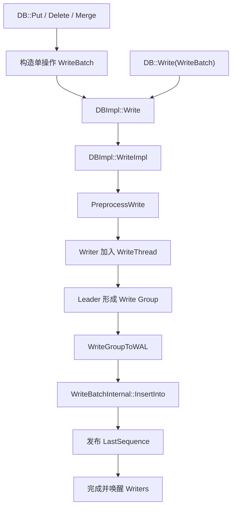
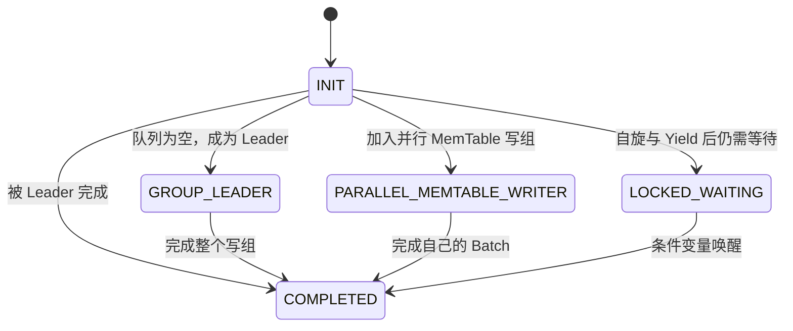
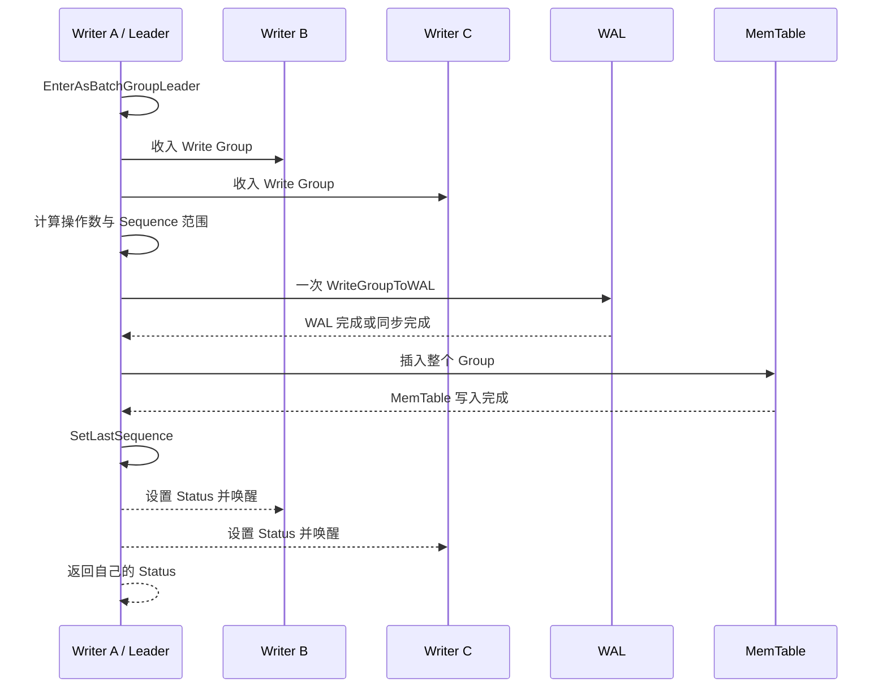

# RocksDB 写入路径（一）：Put/Delete 如何进入 WriteImpl 与组提交

上一篇建立了 LSM Tree 的完整循环，但还有一个关键问题没有展开：当多个线程同时调用 `Put` 时，RocksDB 是让每个线程各写一次 WAL，还是把它们合并起来？

答案藏在 `DBImpl::WriteImpl` 与 `WriteThread` 中。

RocksDB 会把单条 `Put`、`Delete` 等操作先包装成 `WriteBatch`，再把并发请求表示为一个个 `Writer` 排入写队列。队首 Writer 成为 Leader，并尽可能收集兼容的 Followers 形成 Write Group。Leader 代表整个组完成 WAL 写入，之后将操作插入 MemTable，最后把各自的 `Status` 返回给原线程。

这就是组提交（Group Commit）的核心：**多个独立 API 调用仍保持各自的完成语义，但可以共同分摊一次 WAL 追加和同步成本。**


> 图 1：并发请求进入 WriteThread 队列，由一个 Leader 形成兼容写组、分配顺序、写 WAL，再插入 MemTable；完成后，每个原始请求分别被唤醒并获得自己的结果。

## 1. 本篇源码范围

写入路径有多种模式。为了先抓住主干，本篇重点讲默认模式：

```text
two_write_queues = false
enable_pipelined_write = false
unordered_write = false
```

默认路径的核心调用链是：



主要源码入口：

| 职责 | 文件 |
| --- | --- |
| API 汇聚与默认写路径 | [`db/db_impl/db_impl_write.cc`](../db/db_impl/db_impl_write.cc) |
| Writer 状态和 Write Group | [`db/write_thread.h`](../db/write_thread.h) |
| 排队、选 Leader、组成写组 | [`db/write_thread.cc`](../db/write_thread.cc) |
| WriteBatch 公共接口 | [`include/rocksdb/write_batch.h`](../include/rocksdb/write_batch.h) |
| WriteBatch 编码与 MemTable 回放 | [`db/write_batch.cc`](../db/write_batch.cc) |

## 2. Put 和 Delete 最终都会变成 WriteBatch

`DB::Put` 看起来是单 Key API：

```cpp
rocksdb::Status status = db->Put(
    rocksdb::WriteOptions(), "user:1001", "Ada");
```

但 `DB::Put` 的默认实现会：

1. 预估并预留 `WriteBatch` 缓冲区；
2. 调用 `batch.Put(column_family, key, value)`；
3. 调用虚函数 `Write(options, &batch)`。

概念代码如下：

```cpp
namespace rocksdb {

Status DB::Put(const WriteOptions& options,
               ColumnFamilyHandle* column_family,
               const Slice& key, const Slice& value) {
  WriteBatch batch;
  Status status = batch.Put(column_family, key, value);
  if (!status.ok()) {
    return status;
  }
  return Write(options, &batch);
}

}  // namespace rocksdb
```

真实实现还会按照 Key、Value 和完整性保护配置预留更准确的容量，以减少缓冲区扩容。

`Delete`、`SingleDelete`、`DeleteRange` 和 `Merge` 也采用相同模式，只是写入 `WriteBatch` 的操作类型不同：

```text
Put          -> kTypeValue
Delete       -> kTypeDeletion
SingleDelete -> kTypeSingleDeletion
DeleteRange  -> kTypeRangeDeletion
Merge        -> kTypeMerge
```

因此，分析单条写入和批量写入不需要维护两套完全不同的主路径。它们最终都由 `DBImpl::WriteImpl` 协调。

## 3. WriteBatch 不只是 vector

`WriteBatch` 使用紧凑二进制缓冲区保存操作。基础格式是：

```text
+----------------------+----------------------+-------------------+
| Sequence: 8 bytes    | Count: 4 bytes       | Operations ...    |
+----------------------+----------------------+-------------------+
       offset 0               offset 8              offset 12
```

头部共 12 字节：

| 字段 | 大小 | 写入前状态 | 用途 |
| --- | --- | --- | --- |
| Sequence | 8 字节 | 通常为 0 占位 | Leader 在写 WAL 前填入起始 Sequence |
| Count | 4 字节 | 随操作追加递增 | 表示 Batch 中的操作数量 |

每个操作通常包含：

```text
操作标签 + 可选 CF ID + Key 长度与字节 + 可选 Value 长度与字节
```

调用 `batch.Put()` 只是把一条操作编码到 Batch 中，并没有修改 DB：

```cpp
rocksdb::WriteBatch batch;

rocksdb::Status status = batch.Put("k1", "v1");
if (!status.ok()) {
  return status;
}

status = batch.Delete("k2");
if (!status.ok()) {
  return status;
}

// 到这里仍未写入数据库。
status = db->Write(rocksdb::WriteOptions(), &batch);
```

Batch 的操作顺序有意义。如果同一个 Batch 依次 `Put(k, v1)`、`Delete(k)`、`Put(k, v2)`，应用后该 Key 的最新结果是 `v2`。

下一篇会专门拆解 WriteBatch 的编码、保存点、保护字节和跨 CF 原子性。本篇先把它当成写入路径中的统一载体。

## 4. DBImpl::Write 做了什么？

公开的 `DBImpl::Write` 很薄：

```text
DBImpl::Write
  -> 根据 protection_bytes_per_key 更新 Batch 保护信息
  -> DBImpl::WriteImpl
```

真正复杂的分发与并发协调都在 `WriteImpl` 中。它的参数不仅有 `WriteOptions` 和 `WriteBatch`，还包括事务回调、WAL 输出编号、Sequence 输出、是否只写 WAL、WBWI 等内部能力。

这说明 `WriteImpl` 不只是普通 `Put` 的实现，也是事务、追踪、Blob Direct Write 等功能的公共写入枢纽。

## 5. WriteImpl 先验证，再选择写模式

进入队列前，`WriteImpl` 会拒绝不合法或不兼容的组合。例如：

| 条件 | 为什么不能继续 |
| --- | --- |
| `sync && disableWAL` | 没有 WAL 就没有可同步的日志记录 |
| `DeleteRange` 与 Row Cache 同时使用 | 当前不支持对应的缓存失效语义 |
| `protection_bytes_per_key` 不是 0 或 8 | 当前只支持这两种保护级别 |
| Pipelined Write 与 Two Write Queues 同时启用 | 两种队列模型不兼容 |
| Pipelined Write 与 Unordered Write 同时启用 | 顺序与可见性模型冲突 |

`low_pri` 写入还可能在进入主路径前被低优先级 Rate Limiter 限速。

验证完成后，`WriteImpl` 根据 DBOptions 选择模式：

| 模式 | 核心特征 | 本篇是否展开 |
| --- | --- | --- |
| 默认 Batched Write | 同一写组按 WAL -> MemTable 顺序完成 | 是 |
| Pipelined Write | WAL 队列与 MemTable 队列分离，可重叠阶段 | 只说明分支 |
| Unordered Write | WAL 后允许独立插入 MemTable，放宽 Snapshot 不变性 | 只说明风险 |
| Two Write Queues | WAL-only 与普通写使用不同队列，服务事务等场景 | 只说明分支 |

不要为了“更并发”直接开启后面三种模式。它们改变的不只是吞吐，也可能改变 Sequence 分配、阶段重叠和 Snapshot 保证。

## 6. 每次调用都会变成一个 Writer

默认路径中，当前线程会在栈上创建 `WriteThread::Writer`。它保存一次待处理请求的上下文：

```text
Writer
+ batch                         WriteBatch 指针
+ sync                          是否要求 WAL 同步
+ disable_wal                   是否跳过 WAL
+ no_slowdown                   遇到 Stall 是否立即失败
+ rate_limiter_priority         WAL I/O 优先级
+ protection_bytes_per_key      完整性保护级别
+ sequence                      分配到的起始 Sequence
+ status                        当前请求最终结果
+ state                         原子状态机
+ link_older / link_newer       写队列链表指针
```

Writer 不拥有业务线程本身，它是线程等待、Leader 代办和结果传递的协调对象。

其主要状态包括：



Pipelined 模式还会使用 `STATE_MEMTABLE_WRITER_LEADER` 等状态，本篇暂不展开。

## 7. 无锁入队与 Leader 选举

`WriteThread::LinkOne()` 使用原子指针 `newest_writer_` 和 CAS 循环把 Writer 链入队列。

```text
旧 -> 新

Writer A  <-  Writer B  <-  Writer C
  Leader                       newest_writer_
```

如果当前队列为空，CAS 看到的旧值是 `nullptr`，当前 Writer 立即成为 Leader。否则，它链接到已有队列后方并等待自己的状态被改变。

这个设计不需要所有并发写线程先竞争一把全局互斥锁才能排队。互斥与条件变量仍会在长时间等待等场景使用，但 Leader 选举本身建立在原子链表操作上。

### 等待不是一直忙等

Follower 等待状态变化时采用分阶段策略：

1. 短暂 Spin，捕获微秒级完成；
2. 自适应 `yield`，给其他线程运行机会；
3. 仍未完成时进入 mutex + condition variable 阻塞。

这样可以避免每个极短写入都支付上下文切换成本，又不会让长等待无限占用 CPU。

`write_thread_max_yield_usec` 等参数会影响这个过程，但通常应保持默认并通过性能数据判断，而不是先入为主地增大自旋时间。

## 8. Leader 如何形成 Write Group？

成为 Leader 后，线程调用 `EnterAsBatchGroupLeader()`，从队列中的旧请求向新请求遍历，收集兼容 Writers。

并不是所有相邻请求都能进入同一组。

| 兼容条件 | 原因 |
| --- | --- |
| Sync 语义可兼容 | 非 Sync Leader 不能替 Sync Follower 提供同步保证 |
| `disable_wal` 相同 | 不能把有 WAL 与无 WAL 请求混为一个日志批次 |
| `no_slowdown` 相同 | 立即失败与允许等待的语义不同 |
| 保护字节级别相同 | Batch 完整性编码必须一致 |
| Rate Limiter 优先级相同 | I/O 调度语义必须一致 |
| Callback 允许批处理 | 某些内部操作必须独占写组 |
| 合并后不超过大小限制 | 控制尾延迟和内存开销 |

Sync 兼容关系是单向的：

- Sync Follower 不能加入非 Sync Leader；
- 非 Sync Follower 可以加入 Sync Leader，并随组一起获得更强的同步完成点。

无法加入的 Writer 会被临时移出当前组，再接回队列，等待后续 Leader 处理，并不会被丢弃。

### 小请求不会无限吞并后续写入

默认 `max_write_batch_group_size_bytes` 是 1 MiB。Leader Batch 很小时，实际组上限会限制为：

```text
leader_size + max_group_size / 8
```

这是一种延迟保护：不能因为队列里恰好有一个大 Batch，就让一个很小的 Leader 请求承担过大的合并工作。

## 9. 组提交的完整时间线

假设三个兼容 Writer 同时到达：



关键收益是：如果三个请求都要求 `sync = true`，Leader 可以用一次写组同步满足整个组，而不是严格执行三次独立 fsync。

组提交没有把三次业务调用变成一次业务调用。每个 Writer 仍有自己的 Batch、Sequence 起点、回调与最终 Status；Leader 只是在内部共同执行可合并阶段。

## 10. Sequence Number 在哪里分配？

默认写模式中，Leader 负责为整个 Write Group 分配连续 Sequence 范围。

假设当前 `LastSequence = 100`：

```text
Writer A: 2 个操作 -> seq 101, 102
Writer B: 1 个操作 -> seq 103
Writer C: 3 个操作 -> seq 104, 105, 106

本组结束后 LastSequence = 106
```

源码步骤是：

1. 统计写组中有效操作数量；
2. 计算 `current_sequence = last_sequence + 1`；
3. 在写 WAL 前，把写组起始 Sequence 写入合并 Batch 头部；
4. WAL 成功后，逐 Writer 设置各自的起始 Sequence；
5. 把 Batch 插入 MemTable；
6. 只有 MemTable 阶段成功后，才调用 `SetLastSequence` 发布可见性。


这一区分很重要：**分配 Sequence 不等于已经对读取者可见。**

如果 MemTable 插入出现错误，RocksDB 不会发布一个只完成部分操作的 Sequence 上界，并会进入专门的失败处理路径。

## 11. 为什么必须先 WAL，后 MemTable？

默认写路径中，只要没有设置 `disableWAL`，顺序必须是：

```text
Write Group -> WAL -> MemTable -> 发布可见性
```

如果反过来先让数据进入 MemTable，再写 WAL，进程可能在两者之间崩溃：读取曾经看到的数据没有任何日志可供恢复，重启后它会消失。

WAL-before-MemTable 保证：只要写入已经进入 MemTable，恢复路径就有对应日志记录。`sync = true` 进一步要求日志在写组完成前同步到持久化介质。

`disableWAL = true` 会显式放弃这一保证。此时 RocksDB 会标记存在未持久化数据，调用方必须接受崩溃后丢失尚未 Flush 内容的风险。

## 12. MemTable 可以并行插入

WAL 需要维持明确顺序，但 MemTable 阶段可以利用写组内并行性。

当满足以下条件时，RocksDB 可以启动并行 MemTable Writers：

- `allow_concurrent_memtable_write = true`；
- Write Group 中不止一个 Writer；
- 当前 MemTable 实现支持并发写；
- Batch 不包含不支持并行路径的操作，例如 Merge。

此时：

```text
Leader 先完成 WAL
        |
        +-> Writer A 插入自己的 Batch
        +-> Writer B 插入自己的 Batch
        +-> Writer C 插入自己的 Batch
        |
最后完成者负责发布 Sequence 并退出写组
```

如果不满足并行条件，Leader 会通过 `WriteBatchInternal::InsertInto(write_group, ...)` 串行应用整个组。

并行 MemTable 写入不会改变各 Writer 已分配的 Sequence，也不会允许更晚的写组越过当前组发布可见性。

## 13. Leader 如何把结果还给每个调用者？

写组完成时，`ExitAsBatchGroupLeader()` 负责：

1. 汇总 WAL、回调和 MemTable 错误；
2. 把组级错误传播给相关 Writers；
3. 给 Followers 设置最终 `status`；
4. 把状态改为 `STATE_COMPLETED`；
5. 唤醒使用条件变量等待的线程；
6. 从剩余队列中选出下一位 Leader。

Follower 醒来后并不会重新执行写入，只是读取 Leader 已经写入其 Writer 对象的结果并从自己的 API 调用返回。

这就是统计指标 `WRITE_DONE_BY_OTHER` 的含义：某次 Write 调用的实际协调工作由另一个线程作为 Leader 完成。

## 14. Write Stall 如何进入这条路径？

在组成写组前，`PreprocessWrite` 会处理 MemTable 切换、Flush 调度和写入流控。如果 Immutable MemTable、L0 文件或待 Compaction 字节过多，写入可能被延迟或阻塞。

WriteThread 使用一个特殊的 Stall Barrier 阻止新 Writers 继续穿过队列：

```text
已进入的 Writers -> [stall dummy] <- 新到达 Writers 等待
```

设置 `WriteOptions::no_slowdown = true` 的请求不愿等待 Stall，会以 `Status::Incomplete` 失败。其他请求等待后台 Flush 或 Compaction 降低压力后继续。

所以 `no_slowdown` 不是让写入无视流控，而是把“等待”转换成“立即失败并交给上层处理”。

## 15. 动手实验：观察写请求由谁完成

下面的程序启动八个线程并同时执行同步 `Put`。Statistics 中：

- `WRITE_DONE_BY_SELF`：作为 Leader 完成的写请求数量；
- `WRITE_DONE_BY_OTHER`：作为 Follower 被其他线程完成的请求数量；
- `WRITE_WITH_WAL`：请求 WAL 的 Write 调用数量；
- `WAL_FILE_SYNCED`：WAL 同步次数。

```cpp
#include <atomic>
#include <barrier>
#include <chrono>
#include <iostream>
#include <memory>
#include <mutex>
#include <string>
#include <thread>
#include <vector>

#include "rocksdb/db.h"
#include "rocksdb/options.h"
#include "rocksdb/statistics.h"

int main(int argc, char** argv) {
  const std::string db_path =
      argc > 1 ? argv[1] : "./write-group-observe";

  rocksdb::Options options;
  options.create_if_missing = true;
  options.statistics = rocksdb::CreateDBStatistics();

  std::unique_ptr<rocksdb::DB> db;
  rocksdb::Status status =
      rocksdb::DB::Open(options, db_path, &db);
  if (!status.ok()) {
    std::cerr << "open failed: " << status.ToString() << '\n';
    return 1;
  }

  constexpr int kThreadCount = 8;
  constexpr int kWritesPerThread = 50;

  std::barrier<> start_line(kThreadCount);
  std::atomic<int> failure_count{0};
  std::mutex error_mutex;
  std::string first_error;
  std::vector<std::thread> workers;
  workers.reserve(kThreadCount);

  rocksdb::WriteOptions write_options;
  write_options.sync = true;

  const auto started = std::chrono::steady_clock::now();

  for (int thread_id = 0; thread_id < kThreadCount; ++thread_id) {
    workers.emplace_back([&, thread_id] {
      start_line.arrive_and_wait();

      for (int write_id = 0;
           write_id < kWritesPerThread; ++write_id) {
        const std::string key =
            "thread:" + std::to_string(thread_id) +
            ":key:" + std::to_string(write_id);
        const std::string value(
            256, static_cast<char>('a' + thread_id));

        rocksdb::Status write_status =
            db->Put(write_options, key, value);
        if (!write_status.ok()) {
          ++failure_count;
          std::lock_guard<std::mutex> lock(error_mutex);
          if (first_error.empty()) {
            first_error = write_status.ToString();
          }
          break;
        }
      }
    });
  }

  for (std::thread& worker : workers) {
    worker.join();
  }

  const auto elapsed =
      std::chrono::duration_cast<std::chrono::milliseconds>(
          std::chrono::steady_clock::now() - started);

  if (failure_count.load() != 0) {
    std::cerr << "writes failed: " << first_error << '\n';
    return 1;
  }

  const auto& statistics = options.statistics;
  std::cout
      << "write calls: "
      << kThreadCount * kWritesPerThread << '\n'
      << "done by self: "
      << statistics->getTickerCount(
             rocksdb::WRITE_DONE_BY_SELF) << '\n'
      << "done by other: "
      << statistics->getTickerCount(
             rocksdb::WRITE_DONE_BY_OTHER) << '\n'
      << "writes with WAL: "
      << statistics->getTickerCount(
             rocksdb::WRITE_WITH_WAL) << '\n'
      << "WAL sync count: "
      << statistics->getTickerCount(
             rocksdb::WAL_FILE_SYNCED) << '\n'
      << "elapsed ms: " << elapsed.count() << '\n';

  return 0;
}
```

如果系统已经安装 RocksDB 开发包并提供 `pkg-config`：

```bash
c++ -std=c++20 -pthread write_group_observe.cc \
  -o write_group_observe \
  $(pkg-config --cflags --libs rocksdb)
./write_group_observe ./write-group-data
```

### 如何解读输出？

在并发确实发生时，通常可以看到：

```text
done by other > 0
WAL sync count < write calls
```

这说明部分 API 调用成为 Follower，由其他线程代表完成，而且多个同步写共享了 WAL 同步。

但不要把具体数值写成测试断言。分组取决于线程调度、CPU 数量、存储延迟、Batch 大小和当前队列状态。在非常快或接近串行的环境中，`WRITE_DONE_BY_OTHER` 也可能为 0。

实验使用 `sync = true` 是为了让组提交效果更容易观察，写入次数也刻意较小。生产系统是否同步写，应由数据持久性要求决定，而不是为了让统计数字更漂亮。

## 16. 组提交带来了什么，又没有带来什么？

### 得到的收益

- 多个小写共享 WAL 追加和同步成本；
- Leader 统一维护写入顺序与 Sequence 范围；
- MemTable 阶段可以在满足条件时并行；
- Follower 不需要重复执行相同协调逻辑；
- 自适应等待减少短写入的线程切换。

### 没有消失的成本

- 每个请求仍需要排队和等待完成；
- 不兼容 WriteOptions 会拆分写组；
- 大 Batch 可能增加后续小请求尾延迟；
- WAL、MemTable 和后台 Compaction 吞吐仍有物理上限；
- 写入积压最终仍会触发 Delay 或 Stall。

组提交优化的是固定成本摊销，不会让存储设备和后台 LSM 处理能力变成无限。

## 17. 常见误区

### 误区一：每次 Put 都直接写 MemTable

公开 `Put` 先构造 WriteBatch，再经过 `WriteImpl`、WriteThread 和 WAL 阶段，之后才进入 MemTable。

### 误区二：一个 Write Group 就是一笔业务事务

Write Group 是内部调度单位。组内 Writers 可能来自完全无关的线程和业务请求。每个 Writer 的 Batch 保持自己的原子边界。

### 误区三：Leader 会等待一段固定时间凑满 Batch

Leader 形成写组时收集已经排队且兼容的 Writers，并受大小与延迟启发式限制。它不是固定睡眠后再提交。

### 误区四：Sync 和非 Sync 请求永远不能同组

Sync Follower 不能加入非 Sync Leader；非 Sync Follower 可以加入 Sync Leader，因为后者提供了更强的完成保证。

### 误区五：允许并发 MemTable 写就能跳过 WAL 排序

并行发生在 WAL 成功和 Sequence 分配之后。WAL 顺序与可见性发布仍受 Write Group 协调。

## 18. 源码阅读顺序

建议带着下面五个问题阅读：

1. 单条 API 在哪里构造 WriteBatch？
2. Writer 如何加入队列并成为 Leader 或 Follower？
3. Leader 为什么拒绝某些 Follower？
4. Sequence 在 WAL、Writer 与 MemTable 之间如何传递？
5. 哪个时刻真正让读取者看到新数据？

推荐顺序：

```text
DB::Put / DB::Delete
  -> DBImpl::Write
  -> DBImpl::WriteImpl
  -> WriteThread::EnterAsBatchGroupLeader
  -> DBImpl::WriteGroupToWAL
  -> WriteBatchInternal::InsertInto
  -> VersionSet::SetLastSequence
  -> WriteThread::ExitAsBatchGroupLeader
```

对应入口：

- [`docs/components/write_flow/01_write_apis.md`](../docs/components/write_flow/01_write_apis.md)：API 与 WriteBatch；
- [`docs/components/write_flow/02_write_thread.md`](../docs/components/write_flow/02_write_thread.md)：队列、状态机和组提交；
- [`docs/components/write_flow/03_wal.md`](../docs/components/write_flow/03_wal.md)：WAL 写入与同步；
- [`docs/components/write_flow/05_sequence_numbers.md`](../docs/components/write_flow/05_sequence_numbers.md)：Sequence 分配与发布；
- [`docs/components/write_flow/06_write_modes.md`](../docs/components/write_flow/06_write_modes.md)：其他写入模式。

## 19. 本篇小结

默认写入路径可以浓缩为：

```text
单条 API -> WriteBatch -> Writer 入队
Writer 队首 -> Leader
Leader + 兼容 Followers -> Write Group
Write Group -> 连续 Sequence -> 一次 WAL 组提交
WAL 成功 -> 串行或并行插入 MemTable
MemTable 成功 -> 发布 LastSequence
Leader -> 设置各 Writer Status -> 唤醒原线程
```

这条路径把 API 一致性、WAL 顺序、Sequence 可见性和并发吞吐连接到了一起。理解 WriteThread 后，再看 RocksDB 的并发写就不再是“一把大锁保护所有 Put”，而是一套围绕 Leader、写组与状态机设计的细粒度协调机制。

下一篇将深入 WriteBatch 本身：逐字节解析 12 字节头、操作 Tag、Column Family ID 与长度编码，并通过 Handler 回放理解它为什么既是原子写载体，也是 WAL 恢复的基本逻辑记录。

## 参考入口

- [`db/db_impl/db_impl_write.cc`](../db/db_impl/db_impl_write.cc)：公开写 API 与 `WriteImpl`；
- [`db/write_thread.h`](../db/write_thread.h)：Writer 和 Write Group 定义；
- [`db/write_thread.cc`](../db/write_thread.cc)：排队、组建与完成写组；
- [`include/rocksdb/write_batch.h`](../include/rocksdb/write_batch.h)：WriteBatch 公共接口；
- [`db/write_batch.cc`](../db/write_batch.cc)：编码、遍历与 MemTable 插入；
- [`include/rocksdb/options.h`](../include/rocksdb/options.h)：写入模式与 WriteThread 配置；
- [`include/rocksdb/statistics.h`](../include/rocksdb/statistics.h)：写入观测指标。
