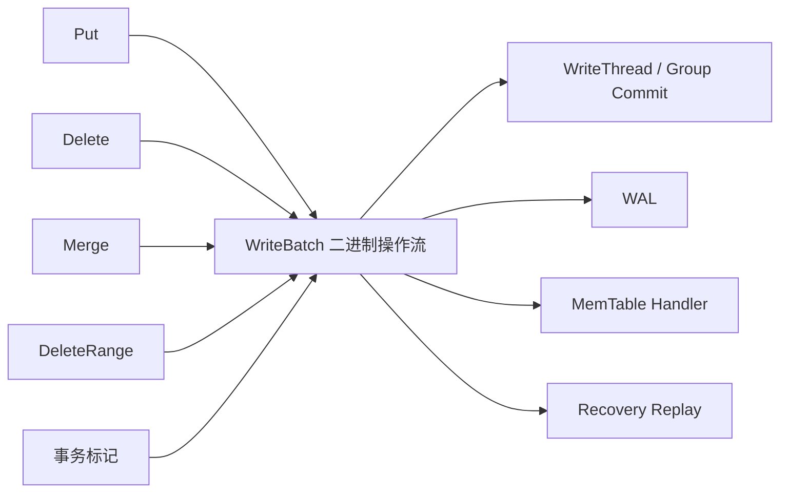
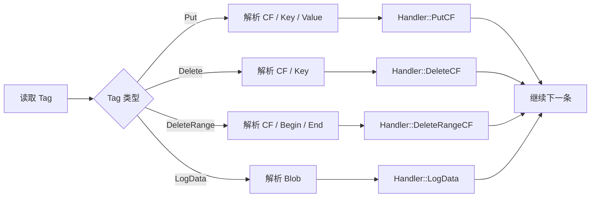

# RocksDB 写入路径（二）：WriteBatch 的编码、原子性与回放

上一篇沿着 `Put` 进入 `DBImpl::WriteImpl`，看到并发 Writers 如何形成 Write Group。无论是单条 `Put`，还是包含上千次更新的业务请求，它们进入写入主路径时都有一个共同载体：`WriteBatch`。

WriteBatch 不只是“装着很多操作的容器”。它同时承担了多种角色：

- 公开 API 中的原子批量写载体；
- WriteThread 进行组提交的基本单元；
- WAL 逻辑记录的主要载荷；
- 崩溃恢复时可顺序回放的操作流；
- 事务系统保存准备、提交和回滚标记的编码基础。

这些能力来自一个紧凑且可顺序解析的二进制格式。本篇将从一个 20 字节示例开始，把 WriteBatch 拆到字节级。


> 图 1：固定头之后依次编码不同操作，扫描器按 Tag 把记录分派给 Handler；同一序列化结果可以写入 WAL，也可以回放到 MemTable。书签表示 Batch 构建阶段的 SavePoint。

## 1. 为什么需要统一的 Batch 格式？

如果每种写 API 都直接修改 MemTable，RocksDB 需要为 `Put`、`Delete`、跨 CF 更新和事务标记分别实现 WAL、恢复、校验与并发逻辑。

WriteBatch 把它们统一为一条有序操作流：



新增一种操作类型时，核心问题变成：如何编码它，以及各类 Handler 如何解释它。上层写路径仍可以复用相同的排队、日志和回放框架。

## 2. WriteBatch 的整体布局

`WriteBatch::rep_` 是一个 `std::string`，其中保存完整的二进制数据：

```text
WriteBatch::rep_

+---------------------------+----------------------+------------------+
| Sequence: fixed64         | Count: fixed32       | Records ...      |
| 8 bytes                   | 4 bytes              | variable length  |
+---------------------------+----------------------+------------------+
offset 0                    offset 8               offset 12
```

固定头共 12 字节：

| 字段 | 编码 | 含义 |
| --- | --- | --- |
| Sequence | little-endian fixed64 | Batch 中第一个操作的 Sequence Number |
| Count | little-endian fixed32 | 会消费 Sequence 的更新操作数量 |

应用刚构造 Batch 时，Sequence 通常为 0。上一章讲过，Write Group Leader 在写 WAL 前为合并 Batch 设置实际起始 Sequence。

`Count` 不等于 Records 的绝对数量。`PutLogData` 等 WAL-only 记录不会消费 Sequence，也不会增加 Count。

## 3. 一个精确到字节的例子

创建下面的 Batch：

```cpp
rocksdb::WriteBatch batch;

rocksdb::Status status = batch.Put("a", "x");
if (!status.ok()) {
  return status;
}

status = batch.Delete("b");
if (!status.ok()) {
  return status;
}
```

此时 `batch.Count() == 2`，`batch.GetDataSize() == 20`。原始字节为：

```text
00 00 00 00 00 00 00 00  02 00 00 00  01 01 61 01 78  00 01 62
|-----------------------|  |----------|  |--------------|  |------|
       Sequence = 0          Count = 2      Put(a, x)      Delete(b)
```

逐段解释：

```text
Header
  00 00 00 00 00 00 00 00   fixed64 Sequence = 0
  02 00 00 00               fixed32 Count = 2

Put("a", "x")
  01                         Tag = kTypeValue
  01                         Key 长度 = 1
  61                         ASCII 'a'
  01                         Value 长度 = 1
  78                         ASCII 'x'

Delete("b")
  00                         Tag = kTypeDeletion
  01                         Key 长度 = 1
  62                         ASCII 'b'
```

这个例子只有 20 字节，却已经包含 Sequence 占位、操作数量、两种 Tag 和两个变长字符串。

## 4. Record：Tag 决定后续如何解释

每条 Record 的第一个字节是 ValueType Tag。常见值定义在 `db/dbformat.h`：

| Tag | 数值 | 后续字段 |
| --- | --- | --- |
| `kTypeDeletion` | `0x00` | Key |
| `kTypeValue` | `0x01` | Key、Value |
| `kTypeMerge` | `0x02` | Key、Operand |
| `kTypeLogData` | `0x03` | Blob |
| `kTypeColumnFamilyDeletion` | `0x04` | CF ID、Key |
| `kTypeColumnFamilyValue` | `0x05` | CF ID、Key、Value |
| `kTypeColumnFamilyMerge` | `0x06` | CF ID、Key、Operand |
| `kTypeSingleDeletion` | `0x07` | Key |
| `kTypeColumnFamilySingleDeletion` | `0x08` | CF ID、Key |
| `kTypeColumnFamilyRangeDeletion` | `0x0e` | CF ID、Begin Key、End Key |
| `kTypeRangeDeletion` | `0x0f` | Begin Key、End Key |
| `kTypeWideColumnEntity` | `0x16` | Key、序列化 Entity |
| `kTypeColumnFamilyWideColumnEntity` | `0x17` | CF ID、Key、序列化 Entity |

事务还会使用 Begin Prepare、End Prepare、Commit、Rollback 等 WAL-only Tag。读取未知 Tag 时，`ReadRecordFromWriteBatch` 返回 `Status::Corruption`，而不是跳过无法理解的操作。

同一种业务语义可能有两个 Tag：默认 CF 使用短格式，非默认 CF 使用带 `ColumnFamily` 前缀的格式。

## 5. Varint 与 Varstring

Key、Value 和 CF ID 的长度不是固定 4 字节，而是使用 Varint 编码。

```text
varstring := varint32(length) + raw bytes
```

较小数字只占一个字节：

| 数值范围 | Varint32 常见字节数 |
| --- | --- |
| 0 到 127 | 1 |
| 128 到 16383 | 2 |
| 更大数值 | 继续使用后续字节 |

因此长度为 1 的 Key 编码是：

```text
01 61
^^ ^^
长度 'a'
```

Varint 让常见的小 Key、Value 和小 CF ID 少占空间，代价是解析时必须逐字节判断延续位。

不要把 varstring 与 C 字符串混淆。长度是显式编码的，所以 Key 和 Value 可以包含 `\0` 和任意二进制字节。

## 6. Column Family ID 如何进入 Batch？

默认 CF 的 ID 是 0，可以直接使用短 Tag：

```text
kTypeValue + Key + Value
```

非默认 CF 需要记录目标 ID：

```text
kTypeColumnFamilyValue + varint32(CF ID) + Key + Value
```

例如，向 ID 为 7 的 CF 写入一条记录：

```text
05 07 ...
^^ ^^
Tag CF ID
```

公开 API 接收 `ColumnFamilyHandle*`，WriteBatch 从 Handle 获取持久 CF ID，再编码进 Record：

```cpp
rocksdb::Status status =
    batch.Put(users_cf, "1001", "Ada");
if (!status.ok()) {
  return status;
}
```

WAL 恢复时，Handler 根据 CF ID 找到对应 MemTable。这也是为什么一个 Batch 可以原子地包含多个 CF 的更新。

CF 名称不会重复写入每条 Record。ID 更紧凑，也更适合恢复时快速路由。

## 7. 原子性与操作顺序

同一个 WriteBatch 中的操作按添加顺序执行：

```cpp
rocksdb::WriteBatch batch;
rocksdb::Status status = batch.Put("key", "v1");
if (!status.ok()) {
  return status;
}

status = batch.Delete("key");
if (!status.ok()) {
  return status;
}

status = batch.Put("key", "v2");
if (!status.ok()) {
  return status;
}
```

提交成功后，最新结果是 `v2`。三个操作不会在 Batch 内自动按 Key 去重或重排。

原子性意味着读取者不会观察到 Batch 只应用了一部分操作的中间状态：

```text
提交前：看不到 Batch 中任何新修改
提交后：看到 Batch 对当前读视图可见的全部修改
```

跨 CF 也适用：

```cpp
rocksdb::WriteBatch batch;
rocksdb::Status status =
    batch.Put(accounts_cf, "alice", "90");
if (!status.ok()) {
  return status;
}

status = batch.Put(accounts_cf, "bob", "110");
if (!status.ok()) {
  return status;
}

status = batch.Put(audit_cf, "transfer:42", "alice->bob:10");
if (!status.ok()) {
  return status;
}

status = db->Write(rocksdb::WriteOptions(), &batch);
if (!status.ok()) {
  return status;
}
```

但 WriteBatch 本身不会检查余额或检测并发业务冲突。它是原子写，不是自动带隔离级别的读改写事务。

## 8. Iterate：用 Handler 顺序回放

`WriteBatch::Iterate(Handler*)` 从 offset 12 开始扫描 Records：



一个最小 Handler：

```cpp
class PrintingHandler final : public rocksdb::WriteBatch::Handler {
 public:
  rocksdb::Status PutCF(uint32_t column_family_id,
                        const rocksdb::Slice& key,
                        const rocksdb::Slice& value) override {
    std::cout << "put cf=" << column_family_id
              << " key=" << key.ToString()
              << " value=" << value.ToString() << '\n';
    return rocksdb::Status::OK();
  }

  rocksdb::Status DeleteCF(uint32_t column_family_id,
                           const rocksdb::Slice& key) override {
    std::cout << "delete cf=" << column_family_id
              << " key=" << key.ToString() << '\n';
    return rocksdb::Status::OK();
  }
};

PrintingHandler handler;
rocksdb::Status status = batch.Iterate(&handler);
if (!status.ok()) {
  return status;
}
```

Handler 返回错误时，Iterate 停止并把该 Status 交给调用者。`Continue()` 也可以提前终止遍历。

遍历整个 Batch 时，Iterate 会比较实际解析到的更新数量与 Header Count。如果二者不一致，会返回 `Corruption("WriteBatch has wrong count")`。

## 9. 同一格式如何服务 WAL 与 MemTable？

WriteBatch 的关键设计是：序列化格式描述“发生了哪些逻辑操作”，Handler 决定“把操作应用到哪里”。

```text
WriteBatch::rep_
       |
       +-> WAL Writer：把整段字节作为逻辑记录持久化
       |
       +-> MemTable Inserter：PutCF/DeleteCF 写入对应 MemTable
       |
       +-> Recovery：从 WAL 取回 rep_，再次调用插入 Handler
       |
       +-> 工具或复制系统：自定义 Handler 检查操作流
```

默认写路径中：

1. Leader 为合并 Batch 设置起始 Sequence；
2. 完整 `rep_` 成为 WAL 逻辑记录载荷；
3. `WriteBatchInternal::InsertInto` 使用 Handler 解析操作；
4. Handler 为每条更新构造 InternalKey 并写入目标 MemTable。

崩溃恢复时，WAL Reader 重组出同一逻辑记录，恢复代码重新解析 WriteBatch，将尚未 Flush 的操作写回 MemTable。

因此 WAL 不需要为 Put、Delete 和 Merge 再设计一套完全不同的业务编码。

## 10. SavePoint：回滚 Batch 构建，不是回滚 DB

WriteBatch 支持多层 SavePoint：

```cpp
rocksdb::WriteBatch batch;

rocksdb::Status status = batch.Put("stable", "v1");
if (!status.ok()) {
  return status;
}

batch.SetSavePoint();

status = batch.Put("temporary", "v2");
if (!status.ok()) {
  return status;
}

status = batch.RollbackToSavePoint();
if (!status.ok()) {
  return status;
}
```

SavePoint 记录三类状态：

```text
rep_ 当前大小
Count
content_flags
```

启用 ProtectionInfo 时，还会把校验条目缩回对应数量。

`RollbackToSavePoint()` 会恢复最近 SavePoint 并弹出它；`PopSavePoint()` 只弹出 SavePoint，不删除后来添加的操作。

如果不存在 SavePoint，两者都返回 `Status::NotFound()`。

最重要的边界是：

> SavePoint 只修改尚未提交的内存 Batch。调用 `DB::Write` 成功后，不能靠 `RollbackToSavePoint` 撤销已经写入数据库的内容。

## 11. max_bytes 与局部回滚

构造函数可以限制 Batch 最大序列化大小：

```cpp
rocksdb::WriteBatch batch(
    0 /* reserved_bytes */, 1024 /* max_bytes */);
```

每次添加操作前，内部 `LocalSavePoint` 记录当前状态。操作编码完成后，如果 `rep_.size()` 超过 `max_bytes`：

1. `rep_` 缩回原大小；
2. Count 恢复；
3. ProtectionInfo 和 content flags 恢复；
4. 返回 `Status::MemoryLimit()`。

所以一次过大的 `Put` 不会把 Batch 留在“Count 已增加、Record 只写一半”的破损状态。

`max_bytes` 包含 12 字节 Header。设置太小可能使任何有效操作都无法加入。

## 12. PutLogData：只进入 WAL 的旁路记录

`PutLogData` 可以把任意 Blob 插入操作流：

```cpp
rocksdb::Status status = batch.PutLogData("trace-id=42");
if (!status.ok()) {
  return status;
}
```

它有三个特殊点：

- 保存在事务日志中；
- 不写入 SST；
- 不消费 Sequence，也不增加 `Count()`。

遍历时会按原始插入顺序调用 `Handler::LogData`。它可以为复制或日志消费系统携带附加元数据，但不能当作普通 Key-Value 读取。

如果 WAL 被禁用或旧 WAL 已被回收，这类数据也不会神奇地存在于 SST 中。

## 13. content_flags：快速回答“Batch 里有什么”

WriteBatch 维护内部原子位图 `content_flags_`，记录是否包含 Put、Delete、Merge、DeleteRange、事务标记等内容。

公开查询包括：

```cpp
batch.HasPut();
batch.HasDelete();
batch.HasSingleDelete();
batch.HasDeleteRange();
batch.HasMerge();
```

对于通过原始序列化字符串恢复的 Batch，flags 初始可以处于 Deferred 状态，第一次查询时通过 Handler 扫描计算，之后缓存结果。

这让写入路径可以快速执行类似“Batch 是否包含 DeleteRange”或“是否包含 Merge”的兼容性判断，不必每次从头解析全部 Records。

content flags 不是 `rep_` 的额外公开字段。它是 WriteBatch 对序列化内容维护的派生元数据。

## 14. 每 Key 保护字节

`WriteOptions::protection_bytes_per_key` 当前支持：

```text
0：关闭
8：为每条更新维护 8 字节保护信息
```

保护信息覆盖 Key、Value、操作类型和 CF ID 等内容，帮助检测写入在应用进入 RocksDB后、到达 MemTable 前的内存损坏或错误转换。

```cpp
rocksdb::WriteOptions write_options;
write_options.protection_bytes_per_key = 8;

rocksdb::Status status = db->Write(write_options, &batch);
```

`WriteBatch::VerifyChecksum()` 可以验证当前 Batch 的 ProtectionInfo；没有启用保护信息时返回 OK。

这套保护与 WAL Record CRC、SST Block Checksum 不是同一个层次：

| 机制 | 主要保护范围 |
| --- | --- |
| WriteBatch ProtectionInfo | 写入流水线中的每条逻辑更新 |
| WAL CRC | WAL 物理记录 |
| SST Block Checksum | 持久化表中的块数据 |

ProtectionInfo 作为 Batch 旁路结构维护，不是简单追加在 `Data()` 返回的 `rep_` 末尾。只保存 `Data()` 字符串不会自动保存这组旁路校验条目。

## 15. Data、Release 与序列化边界

公开 API 可以取得序列化结果：

```cpp
const std::string& bytes = batch.Data();
```

也可以从字符串构造 Batch：

```cpp
std::string serialized = batch.Data();
rocksdb::WriteBatch restored(serialized);

PrintingHandler handler;
rocksdb::Status status = restored.Iterate(&handler);
```

构造函数不会让任意字节自动变得可信。格式过短、Tag 未知、长度越界或 Count 不匹配，会在 Iterate 或写入时返回 Corruption。

`Release()` 移出序列化字符串并清空当前 Batch，适合转移所有权。`Clear()` 清除操作但通常保留 `std::string` 已分配容量，便于复用 Batch，不能把它理解为保证归还全部内存。

尽管 RocksDB 自己使用该格式进行 WAL 与恢复，应用仍应优先通过 `WriteBatch` 和 `Handler` 操作，而不是维护一份手写二进制解析器。内部 Tag 会随新特性扩展，错误解析可能把合法的新记录当作旧格式。

## 16. 线程安全边界

`WriteBatch` 的公共注释明确说明：

- 多线程可以并发调用 const 方法；
- 只要有线程调用非 const 方法，所有访问同一 Batch 的线程就需要外部同步。

下面的做法不安全：

```text
线程 A -> batch.Put("a", "1")
线程 B -> batch.Put("b", "2")
             ^ 同一个可变 Batch，且没有外部同步：数据竞争
```

通常更简单的模式是每个请求或线程构建自己的 Batch，再调用线程安全的 `DB::Write`。WriteThread 会在 DB 内部协调不同 Batch，不要求业务线程共享一个可变 Batch 对象。

## 17. 动手实验：打印字节、回放与回滚

下面的完整程序验证本篇最重要的行为：

```cpp
#include <iomanip>
#include <iostream>
#include <string>

#include "rocksdb/slice.h"
#include "rocksdb/status.h"
#include "rocksdb/write_batch.h"

class PrintingHandler final : public rocksdb::WriteBatch::Handler {
 public:
  rocksdb::Status PutCF(uint32_t column_family_id,
                        const rocksdb::Slice& key,
                        const rocksdb::Slice& value) override {
    std::cout << "PUT cf=" << column_family_id
              << " key=" << key.ToString()
              << " value=" << value.ToString() << '\n';
    return rocksdb::Status::OK();
  }

  rocksdb::Status DeleteCF(uint32_t column_family_id,
                           const rocksdb::Slice& key) override {
    std::cout << "DELETE cf=" << column_family_id
              << " key=" << key.ToString() << '\n';
    return rocksdb::Status::OK();
  }

  void LogData(const rocksdb::Slice& blob) override {
    std::cout << "LOG_DATA " << blob.ToString() << '\n';
  }
};

void PrintHex(const std::string& data) {
  for (unsigned char byte : data) {
    std::cout << std::hex << std::setfill('0')
              << std::setw(2) << static_cast<unsigned>(byte)
              << ' ';
  }
  std::cout << std::dec << '\n';
}

int main() {
  rocksdb::WriteBatch batch;

  rocksdb::Status status = batch.Put("a", "x");
  if (!status.ok()) {
    std::cerr << status.ToString() << '\n';
    return 1;
  }

  status = batch.Delete("b");
  if (!status.ok()) {
    std::cerr << status.ToString() << '\n';
    return 1;
  }

  std::cout << "count=" << batch.Count()
            << " bytes=" << batch.GetDataSize() << '\n';
  PrintHex(batch.Data());

  PrintingHandler handler;
  status = batch.Iterate(&handler);
  if (!status.ok()) {
    std::cerr << status.ToString() << '\n';
    return 1;
  }

  batch.SetSavePoint();

  status = batch.Put("c", "z");
  if (!status.ok()) {
    std::cerr << status.ToString() << '\n';
    return 1;
  }

  status = batch.PutLogData("trace=42");
  if (!status.ok()) {
    std::cerr << status.ToString() << '\n';
    return 1;
  }

  std::cout << "before rollback: count=" << batch.Count()
            << " bytes=" << batch.GetDataSize() << '\n';

  status = batch.RollbackToSavePoint();
  if (!status.ok()) {
    std::cerr << status.ToString() << '\n';
    return 1;
  }

  std::cout << "after rollback: count=" << batch.Count()
            << " bytes=" << batch.GetDataSize() << '\n';

  const std::string serialized = batch.Data();
  rocksdb::WriteBatch restored(serialized);

  std::cout << "restored batch:\n";
  status = restored.Iterate(&handler);
  if (!status.ok()) {
    std::cerr << status.ToString() << '\n';
    return 1;
  }

  return 0;
}
```

如果系统已经安装 RocksDB 开发包并提供 `pkg-config`：

```bash
c++ -std=c++20 write_batch_inspect.cc \
  -o write_batch_inspect \
  $(pkg-config --cflags --libs rocksdb)
./write_batch_inspect
```

关键输出应类似：

```text
count=2 bytes=20
00 00 00 00 00 00 00 00 02 00 00 00 01 01 61 01 78 00 01 62
PUT cf=0 key=a value=x
DELETE cf=0 key=b
before rollback: count=3 bytes=...
after rollback: count=2 bytes=20
restored batch:
PUT cf=0 key=a value=x
DELETE cf=0 key=b
```

`PutLogData` 增加了序列化大小，但没有增加 Count；随后它与 `Put("c", "z")` 一起被 SavePoint 回滚。

## 18. 大 Batch 的性能代价

WriteBatch 减少 API 调用和固定开销，但不是越大越好。

一个很大的 Batch 会：

- 在应用侧和 RocksDB 内部占用更多连续内存；
- 生成更大的 WAL 逻辑记录，并可能跨越多个 32 KiB WAL Block；
- 延长 Write Group Leader 的处理时间；
- 增加后续小写请求的排队尾延迟；
- 一次向 MemTable 插入大量记录；
- 在恢复时形成较大的单次回放工作。

`max_write_batch_group_size_bytes` 限制的是 WriteThread 收集 Followers 时的写组增长，不会自动把调用者提交的单个巨大 WriteBatch 拆成多个独立原子 Batch。

业务需要在原子性、吞吐、内存和尾延迟之间选择批次大小。性能结论应通过实际 Key/Value 分布和并发负载测量。

## 19. 常见错误

### 错误一：把 Count 当成 Record 总数

`PutLogData` 和部分事务标记不会增加 Count。Count 表示会消费 Sequence 的更新数量。

### 错误二：修改 Data 返回的字符串

`Data()` 返回内部序列化缓冲区的 const 引用。通过不安全方式修改底层字节会使 Count、flags、ProtectionInfo 与 Record 内容失去一致性。

### 错误三：SavePoint 可以撤销已提交写入

SavePoint 只回滚内存中的 Batch 构建。数据库写入成功后，需要新的补偿写、事务回滚能力或业务恢复流程。

### 错误四：Handler 只实现旧版 Put/Delete 就能处理全部 CF

非默认 CF 会调用 `PutCF`、`DeleteCF` 等接口。默认实现对未处理的非默认 CF 返回错误，不能假设所有记录都会退化成旧接口。

### 错误五：WriteBatch 自动解决并发冲突

它保证一个 Batch 的原子应用，不负责检测应用读取之后是否被其他线程更新。需要读改写隔离时应使用事务或外部同步。

## 20. 源码阅读顺序

建议按“编码 -> 解析 -> 应用”阅读：

```text
WriteBatch::Put / Delete
  -> WriteBatchInternal::Put / Delete
  -> rep_ 追加 Tag、CF ID、varstring
  -> WriteBatch::Iterate
  -> ReadRecordFromWriteBatch
  -> Handler::PutCF / DeleteCF
  -> WriteBatchInternal::InsertInto
  -> MemTableInserter
```

重点入口：

- [`include/rocksdb/write_batch.h`](../include/rocksdb/write_batch.h)：公开操作、Handler 和 SavePoint；
- [`db/write_batch.cc`](../db/write_batch.cc)：格式、编码、解析与 MemTable Handler；
- [`db/write_batch_internal.h`](../db/write_batch_internal.h)：12 字节头和内部辅助接口；
- [`db/dbformat.h`](../db/dbformat.h)：ValueType Tag；
- [`util/coding.h`](../util/coding.h)：fixed、Varint 与长度前缀编码；
- [`db/db_impl/db_impl_write.cc`](../db/db_impl/db_impl_write.cc)：Sequence 设置与 WAL 提交；
- [`docs/components/write_flow/01_write_apis.md`](../docs/components/write_flow/01_write_apis.md)：Write API 总览。

## 21. 本篇小结

WriteBatch 的主线可以概括为：

```text
内存表示：std::string rep_
固定头：fixed64 Sequence + fixed32 Count
操作记录：Tag + 可选 CF ID + 一个或多个 varstring
提交语义：按添加顺序原子应用
解析方式：Iterate 逐条分派给 Handler
持久化：rep_ 作为 WAL 逻辑记录载荷
恢复：读取同一格式，再由 Handler 写回 MemTable
构建辅助：SavePoint、max_bytes、content flags
完整性：可选每 Key ProtectionInfo
```

WriteBatch 把“应用想执行哪些更新”与“更新写到 WAL、MemTable 还是自定义消费者”分开。紧凑编码负责保存操作意图，Handler 负责解释和执行，这使同一种数据结构能够横跨正常写入、组提交和崩溃恢复。

下一篇将继续向下进入 WAL：解析 32 KiB Block、7/11 字节物理 Record Header、Full/First/Middle/Last 分片、CRC 校验和 `sync` 的真实持久性边界。

## 参考入口

- [`include/rocksdb/write_batch.h`](../include/rocksdb/write_batch.h)：WriteBatch 公共接口；
- [`db/write_batch.cc`](../db/write_batch.cc)：二进制格式与 Handler 回放；
- [`db/write_batch_internal.h`](../db/write_batch_internal.h)：内部头部与 ProtectionInfo；
- [`db/dbformat.h`](../db/dbformat.h)：操作 Tag 定义；
- [`docs/components/write_flow/03_wal.md`](../docs/components/write_flow/03_wal.md)：WriteBatch 进入 WAL 后的下一段流程。
