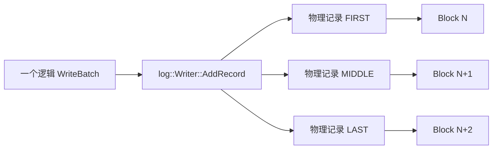
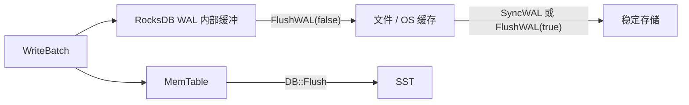
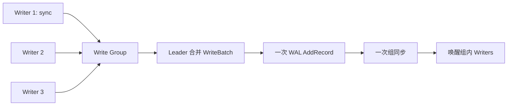
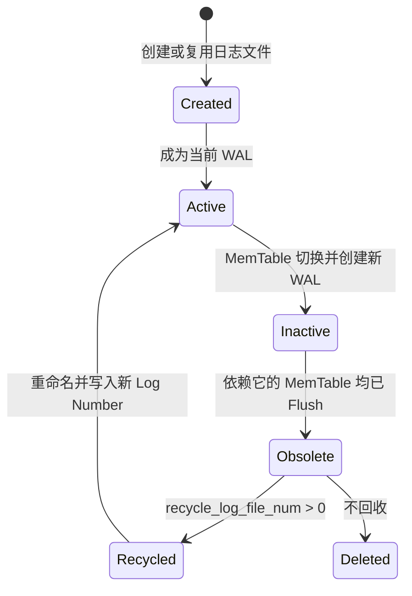
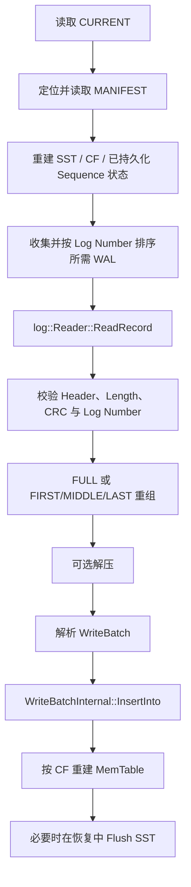

# RocksDB 写入路径（三）：WAL 分片、同步与崩溃恢复

上一篇拆解了 `WriteBatch` 的二进制格式。Write Group Leader 为合并后的 Batch 分配 Sequence Number 后，这串字节不会立刻成为 SST，而是先进入 **Write-Ahead Log（WAL，预写日志）**。

WAL 解决的是一个很具体的问题：MemTable 在内存中，机器异常断电后会消失；只要相同更新已经持久化到 WAL，RocksDB 就能在重新打开数据库时按顺序重放它们，重建尚未 Flush 成 SST 的 MemTable。


> 图 1：逻辑 WriteBatch 经过 Log Writer 后被放入固定大小的 Block；大记录会拆成多个带 Header 和校验值的物理分片。崩溃恢复时，Reader 反向完成校验、拼接和重放。

本文将回答六个核心问题：

1. 一个 WriteBatch 在 WAL 中究竟是什么；
2. 为什么 WAL 使用 32 KiB Block 和两种 Header；
3. 大记录如何拆成 `First/Middle/Last`；
4. `FlushWAL`、`SyncWAL` 与 MemTable Flush 有什么区别；
5. RocksDB 如何从多个 WAL 恢复出一致状态；
6. 日志压缩、回收和完整性跟踪分别解决什么问题。

## 1. WAL 保护的不是所有数据，而是未落盘的 MemTable

先建立一个重要边界：**WAL 不是 RocksDB 的长期数据主体**。

RocksDB 的长期有序数据位于 SST，WAL 只负责保护仍依赖内存状态的更新：


写入遵守“先日志，后内存表”的顺序。这样即使 MemTable 尚未生成 SST，只要 WAL 仍然存在且写入达到所需的持久性边界，恢复过程就能重新执行同一个 WriteBatch。

一个 WAL 可能同时保护多个 Column Family 的 MemTable。只有当所有仍引用该 WAL 的 MemTable 都已安全 Flush，日志才会变成 obsolete。因此，一个写入较少但迟迟没有 Flush 的 Column Family，也可能让旧 WAL 长时间无法删除。

## 2. 两层“记录”：逻辑记录与物理记录

讨论 WAL 格式时，“一条记录”可能指两件不同的事。

### 2.1 逻辑记录

`DBImpl::WriteGroupToWAL()` 先把 Write Group 中需要写 WAL 的 Batch 合并，再设置起始 Sequence Number。随后 `DBImpl::WriteToWAL()` 取得 `WriteBatch::rep_` 的完整字节串，并把它作为一个逻辑记录交给：

```cpp
log_writer->AddRecord(write_options, log_entry, sequence);
```

因此，WAL 的普通逻辑记录载荷就是上一篇解析过的内容：

```text
+----------------------+----------------------+---------------------+
| Sequence: fixed64    | Count: fixed32       | WriteBatch Records  |
| 8 bytes              | 4 bytes              | variable length     |
+----------------------+----------------------+---------------------+
```

### 2.2 物理记录

WAL 文件被切分为固定的 32 KiB Block。一个逻辑记录如果放不进当前 Block，就会被拆成多个物理记录，每个物理记录都有自己的 Header、长度、类型和 CRC。



这层区分很关键：

- WriteBatch 的原子边界属于逻辑记录；
- CRC、长度和分片类型属于物理记录；
- 物理记录不会跨 Block；
- 逻辑记录可以跨越多个 Block。

## 3. 为什么是 32 KiB Block

[`db/log_format.h`](../db/log_format.h) 定义：

```cpp
constexpr unsigned int kBlockSize = 32768;
```

Block 是 WAL **格式层**的切分单位，不等于文件系统页、设备扇区或一次 `write()` 的固定大小。它给 Reader 提供了稳定的扫描边界，也限制了单个物理记录的最大载荷。

一个 Block 内可以放多条小记录：

```text
32 KiB WAL Block

+----------+---------+----------+---------+----------+---------+--------+
| Header A | Data A  | Header B | Data B  | Header C | Data C  | trailer|
+----------+---------+----------+---------+----------+---------+--------+
0                                                               32768
```

如果 Block 尾部剩余空间连一个完整 Header 都容不下，Writer 会用零填满这段 trailer，然后从下一个 Block 的 offset 0 开始写。Reader 知道这些零只是填充，不会把它们当成业务记录。

> 这里不是“只要 Data 放不下就浪费整个尾部”。Writer 会先计算当前 Block 在扣除 Header 后还能容纳多少载荷，并尽可能写入一个分片；只有连 Header 都容不下时才补零换 Block。

## 4. 经典 Header：7 字节逐字段解析

普通 WAL 物理记录使用 7 字节 Header：

```text
offset
  0          4          6       7
  +----------+----------+-------+
  | CRC32C   | Length   | Type  |
  | fixed32  | fixed16  | uint8 |
  +----------+----------+-------+
     4 bytes    2 bytes  1 byte
```

字段含义如下：

| 字段 | 大小 | 含义 |
| --- | ---: | --- |
| CRC | 4 字节 | masked CRC32C，覆盖 Type 和 Payload |
| Length | 2 字节 | 当前物理记录 Payload 的字节数，小端序 |
| Type | 1 字节 | `Full/First/Middle/Last` 等记录类型 |

`Length` 只有 16 位并不是问题。物理分片最多只需要装下一个 32 KiB Block 扣除 Header 后的空间，天然小于 `65535`。

### 4.1 CRC 覆盖什么

普通记录的校验输入为：

```text
CRC32C(Type byte + Payload)
```

Writer 构造时预计算每个 Type 字节的 CRC，再用 `crc32c::Crc32cCombine()` 合并 Payload CRC，最后执行 `crc32c::Mask()` 后写入 Header。这样无需为每个物理记录重新复制 `Type + Payload`。

CRC 可以检测常见的随机损坏、截断和错位，但它不是加密哈希，也不提供防篡改认证。攻击者如果能同时修改 Payload 与 CRC，CRC 并不能阻止伪造。

## 5. 可回收 Header：为什么多出 4 字节

当 `DBOptions::recycle_log_file_num > 0` 时，RocksDB 会保留一定数量的旧 WAL 文件供后续重用，减少重新分配文件以及同步 inode 元数据的开销。

可回收 WAL 使用 11 字节 Header：

```text
offset
  0          4          6       7              11
  +----------+----------+-------+---------------+
  | CRC32C   | Length   | Type  | Log Number    |
  | fixed32  | fixed16  | uint8 | low fixed32   |
  +----------+----------+-------+---------------+
     4 bytes    2 bytes  1 byte     4 bytes
```

被回收的文件可能比新 WAL 的有效内容更长，尾部还残留着“上一次生命”中的合法字节。仅靠 CRC，这些旧字节仍可能看起来完全正确。Header 中增加当前 Log Number 后，Reader 可以把不匹配的旧记录识别为 stale data。

可回收记录的 CRC 覆盖：

```text
CRC32C(Type byte + Log Number bytes + Payload)
```

源码只编码 64 位 Log Number 的低 32 位。注释说明，只有在同一文件跨越约 40 亿代重用时才可能发生编号碰撞，工程上可忽略。

## 6. Full、First、Middle、Last 如何分片

核心类型定义在 [`db/log_format.h`](../db/log_format.h)：

| 类型 | 数值 | 含义 |
| --- | ---: | --- |
| `kZeroType` | 0 | 预分配或 trailer 中的零 |
| `kFullType` | 1 | 一个物理记录就是完整逻辑记录 |
| `kFirstType` | 2 | 逻辑记录的第一个分片 |
| `kMiddleType` | 3 | 逻辑记录的中间分片 |
| `kLastType` | 4 | 逻辑记录的最后一个分片 |
| `kRecyclableFullType` | 5 | 可回收格式的 Full |
| `kRecyclableFirstType` | 6 | 可回收格式的 First |
| `kRecyclableMiddleType` | 7 | 可回收格式的 Middle |
| `kRecyclableLastType` | 8 | 可回收格式的 Last |

### 6.1 小记录

如果整个 WriteBatch 能放入当前 Block 的剩余有效空间：

```text
Block N
+------------------+-----------------------+
| FULL Header      | complete WriteBatch   |
+------------------+-----------------------+
```

### 6.2 大记录

如果逻辑记录跨越多个 Block：

```text
Block N                   Block N+1                 Block N+2
+--------+--------------+ +--------+--------------+ +--------+---------+
| FIRST  | payload part | | MIDDLE | payload part | | LAST   | payload |
+--------+--------------+ +--------+--------------+ +--------+---------+
```

`Writer::AddRecord()` 每轮根据两个布尔条件选择类型：

```text
begin=true,  end=true   -> FULL
begin=true,  end=false  -> FIRST
begin=false, end=false  -> MIDDLE
begin=false, end=true   -> LAST
```

空逻辑记录也会进入一次循环，生成 Payload 长度为 0 的 `FULL`，而不是完全不写。

## 7. 一次 AddRecord 的完整路径

结合 [`db/db_impl/db_impl_write.cc`](../db/db_impl/db_impl_write.cc) 与 [`db/log_writer.cc`](../db/log_writer.cc)，普通单写队列的 WAL 路径可以压缩为：

```text
DBImpl::WriteGroupToWAL
  -> MergeBatch
  -> WriteBatchInternal::SetSequence
  -> DBImpl::WriteToWAL
  -> WriteBatchInternal::Contents
  -> WriteBatch::VerifyChecksum
  -> log::Writer::AddRecord
       -> 计算 Block 剩余空间
       -> 可选流式压缩
       -> 选择 FULL/FIRST/MIDDLE/LAST
       -> EmitPhysicalRecord
            -> 编码 Length / Type / Log Number
            -> 计算并 Mask CRC32C
            -> Append(Header)
            -> Append(Payload)
       -> 默认模式下 Flush 内部文件缓冲
  -> 可选 Sync WAL
```

注意两种不同的校验：

- `merged_batch.VerifyChecksum()` 校验 WriteBatch 可选的逐 Key ProtectionInfo；
- `EmitPhysicalRecord()` 计算 WAL 每个物理分片的 CRC32C。

前者保护逻辑更新在内存处理链路中的完整性，后者保护 WAL 格式中的物理记录。它们不是同一层机制。

## 8. 三个 Flush/Sync 概念不要混淆

这是使用 WAL 时最容易踩坑的部分。



### 8.1 WAL 自动 Flush

默认 `manual_wal_flush = false`。`log::Writer::AddRecord()` 在追加完逻辑记录后调用底层 `WritableFileWriter::Flush()`，把 RocksDB 内部 WAL 缓冲推进文件系统。

这通常足以抵抗**进程崩溃**：即使进程消失，OS 缓存中的数据仍在。但它不等于数据已经抵达稳定介质。

### 8.2 `FlushWAL(false)`

只有启用 `manual_wal_flush = true` 时，RocksDB 才会在多次写入之间保留专门的内部 WAL 缓冲。此时应用调用 `FlushWAL(false)`，将它推进文件/OS 缓存。

它的目的通常是合并 Flush 开销，或者在创建 Checkpoint、Backup 前确保内部缓冲已进入文件。它**不承诺抵抗机器掉电**。

### 8.3 `SyncWAL()` 与 `FlushWAL(true)`

`SyncWAL()` 对已经写向文件的 WAL 数据执行存储同步，在 OS 与硬件正确支持时，使数据能够抵抗掉电。它不会隐式执行 `FlushWAL()`。

因此启用手动 WAL Flush 时，应使用：

```cpp
status = db->FlushWAL(true);
```

这会先排空 RocksDB 内部缓冲，再调用 `SyncWAL()`。

### 8.4 MemTable Flush

`DB::Flush()` 的目标完全不同：它把 MemTable 转换成 SST，并安装到 LSM 状态中。MemTable Flush 完成后，相关更新不再依赖 WAL 恢复，旧 WAL 才可能被淘汰。

一句话记忆：

```text
FlushWAL：移动日志字节
SyncWAL：强化日志持久性
DB::Flush：把内存表变成 SST
```

## 9. 四种常见写入配置的持久性边界

| 配置 | 返回前发生什么 | 进程崩溃 | 机器掉电 | 主要代价 |
| --- | --- | --- | --- | --- |
| 默认 `sync=false` | WAL 写入文件/OS 缓存 | 通常可恢复 | 最近写入可能丢失 | 延迟低 |
| `sync=true` | WAL 写入并同步稳定存储 | 可恢复 | 在系统正确实现同步时可恢复 | 每次/每组同步延迟高 |
| `manual_wal_flush=true` | 写入可暂留 RocksDB 内部缓冲 | Flush 前可能丢失 | Flush+Sync 前可能丢失 | 可批量控制 Flush |
| `disableWAL=true` | 跳过 WAL，直接更新 MemTable | 未 Flush 数据可能丢失 | 未 Flush 数据可能丢失 | 吞吐更高，风险最大 |

`WriteOptions::sync=true` 的语义类似 `write()` 后跟 `fdatasync()`。默认的 `sync=false` 类似只执行 `write()`。

还有一个细微但重要的可见性差异：

- `Write(..., sync=true)` 在同步完成之前，不会让这次修改对调用方表现为已完成；
- 先执行普通 `Write()` 再由其他时机调用 `SyncWAL()`，写入可能已经可见，但尚未达到后续同步边界。

所以“稍后统一 Sync”可以摊薄开销，却不能让先前每次 Write 都拥有与 `sync=true` 完全相同的完成语义。

## 10. Group Commit 如何摊薄同步成本

如果每次小 `Put` 都独立执行一次存储同步，设备延迟会直接进入每次写请求的关键路径。RocksDB 的 WriteThread 会把兼容的 Writers 组成 Write Group，由 Leader 合并 Batch 并写一次 WAL。



当写组需要同步时，Leader 写完 WAL 后同步相关日志，再让请求继续完成。这样一次 Sync 可以覆盖多个调用者，吞吐远高于所有线程各自同步。

这也是为什么评估 `sync=true` 时不能只看单线程微基准：并发度、Batch 大小和设备同步延迟会共同决定 Group Commit 的收益。

## 11. WAL 压缩发生在哪一层

设置：

```cpp
options.wal_compression = rocksdb::kZSTD;
```

可让逻辑 WAL 记录在物理分片前经过流式压缩。目前该选项只支持 ZSTD。Writer 会先写一个 `kSetCompressionType` 元记录，Reader 看到它后创建对应的流式解压器。

流程顺序是：

```text
WriteBatch 逻辑字节
  -> WAL 流式压缩
  -> 按 Block 剩余空间切物理分片
  -> 每个分片生成 Header 和 CRC
```

恢复时顺序相反：读取并校验物理分片，拼接压缩流，再解压出完整逻辑记录。Reader 是否能读取压缩 WAL 取决于 RocksDB 版本与 ZSTD 支持，而不取决于重新打开时是否仍设置 `wal_compression`。

压缩可能减少 WAL 写放大，但增加 CPU 成本。是否启用应根据 Value 可压缩性、设备带宽和 CPU 余量测试，而不是只看数据库大小。

## 12. WAL 的生命周期与轮转

WAL 不会无限追加到一个文件。典型生命周期如下：



MemTable 切换时，RocksDB 创建新的 WAL，并让新的 MemTable 记住它的 Log Number。旧日志是否可删除取决于所有 Column Family 的最小未持久化日志编号，而不是单看文件年龄。

常见的 WAL 堆积原因包括：

- 某个 Column Family 写入量小，MemTable 长时间不触发 Flush；
- 后台 Flush 被阻塞或失败；
- `max_total_wal_size` 触发后，系统需要主动 Flush 持有旧 WAL 的 Column Family；
- 事务、备份或 WAL 迭代器仍需要旧日志。

## 13. 崩溃后如何恢复

恢复不是“直接把所有 `.log` 文件盲目重放一遍”。RocksDB 先恢复持久化元数据，再确定哪些 WAL 仍然需要。



关键步骤如下：

1. `VersionSet::Recover()` 从 MANIFEST 重建已有 SST、Column Family 和已持久化边界；
2. `DBImpl::RecoverLogFiles()` 接收按 Log Number 升序排列的 WAL；
3. `log::Reader::ReadRecord()` 从 32 KiB 缓冲读取物理记录；
4. Reader 校验 CRC，并将 `First/Middle/Last` 拼回逻辑记录；
5. 恢复层把逻辑记录解释为 WriteBatch，跳过已经持久化或无效的部分；
6. `WriteBatchInternal::InsertInto()` 按记录中的 CF ID 与 Sequence 写入新 MemTable；
7. 如果恢复中的 MemTable 达到阈值，也可以中途 Flush 成 SST。

WAL 按 Log Number 排序重放，Batch 内又携带 Sequence Number，因此正常恢复顺序与原写入顺序一致。

## 14. Reader 如何处理分片错误

Reader 维护“当前是否正在拼接一个逻辑记录”的状态：

| 读取到的情况 | 处理方式 |
| --- | --- |
| `FULL` | 直接返回完整逻辑记录 |
| `FIRST` | 清空 scratch，开始收集 |
| `MIDDLE` | 追加到正在收集的 scratch |
| `LAST` | 追加后返回完整逻辑记录 |
| CRC 错误 | 报告损坏，具体结果取决于恢复模式 |
| 意外类型顺序 | 报告不完整或失序记录，丢弃当前部分记录 |
| 可回收记录 Log Number 不匹配 | 识别为旧文件残留并停止当前有效区域 |

逻辑记录只有在完整重组后才交给 WriteBatch 解析。因此，崩溃发生在一个大 Batch 的中间分片时，不会把前半个 Batch 当作完整业务更新重放。

## 15. 四种 WAL Recovery Mode

`DBOptions::wal_recovery_mode` 控制遇到损坏时的策略，默认是 `kPointInTimeRecovery`。

| 模式 | 行为 | 适用场景 |
| --- | --- | --- |
| `kTolerateCorruptedTailRecords` | 容忍崩溃写入造成的尾部不完整，但其他损坏仍失败 | 要求已应用更新不回退，并能确认 Append 持久性的系统 |
| `kAbsoluteConsistency` | 任意 WAL 损坏都拒绝恢复 | 干净关闭验证、测试和最高严格度检查 |
| `kPointInTimeRecovery` | 遇到不一致后停在此前有效时间点 | 默认，优先恢复到一致状态 |
| `kSkipAnyCorruptedRecords` | 跳过损坏并尽可能抢救更多记录 | 灾难恢复的最后手段 |

不要把 `kSkipAnyCorruptedRecords` 当成日常“高可用开关”。跳过中间记录后，后续状态可能失去业务前提，跨 Key 或跨 Column Family 的逻辑关系也可能不再成立。

尾部不完整与中间损坏也不能一概而论：前者可能只是进程在写最后一条物理记录时崩溃；后者更可能代表介质、文件系统或运维操作造成的数据破坏。

## 16. 两套 WAL 完整性跟踪机制

物理记录 CRC 只能证明“读到的这一条记录内部是否一致”，不能证明一个完整 WAL 文件是否被删除、截断或错换。RocksDB 还提供两套可选机制。

### 16.1 `track_and_verify_wals_in_manifest`

该选项把已关闭且已同步 WAL 的编号和大小记录到 MANIFEST。恢复时可以验证这些 WAL 是否存在、大小是否符合预期。

为了控制开销，活动 WAL 上由 `WriteOptions::sync=true` 或 `SyncWAL()` 产生的同步不会逐次记录到 MANIFEST；跟踪重点是已关闭 WAL 的同步状态。

### 16.2 `track_and_verify_wals`

这是独立且更近的新机制。每个新 WAL 内嵌前驱 WAL 的编号、文件大小和最后 Sequence Number，形成可验证的前驱链，从而检测：

- 当前 WAL 是否接错前驱；
- 前驱文件是否被截断；
- 仍应存在的旧 WAL 是否形成空洞。

两者可以独立启用，覆盖的故障类型不同。它们也不能替代备份：完整性验证负责发现问题，不负责凭空重建已经丢失的日志。

## 17. 可运行实验：观察 Flush 与 Sync

下面的程序启用手动 WAL Flush，并通过 Statistics 观察 WAL 字节数和同步次数。它不会模拟断电，而是用公开 API 清楚展示三个边界。

```cpp
#include <cstdint>
#include <cstdlib>
#include <iostream>
#include <memory>
#include <string>

#include "rocksdb/db.h"
#include "rocksdb/options.h"
#include "rocksdb/statistics.h"

namespace {

void Check(const rocksdb::Status& status, const char* operation) {
  if (!status.ok()) {
    std::cerr << operation << ": " << status.ToString() << '\n';
    std::exit(1);
  }
}

void PrintStats(const std::shared_ptr<rocksdb::Statistics>& stats,
                const char* stage) {
  std::cout << stage
            << " wal_bytes="
            << stats->getTickerCount(rocksdb::WAL_FILE_BYTES)
            << " wal_syncs="
            << stats->getTickerCount(rocksdb::WAL_FILE_SYNCED)
            << '\n';
}

}  // namespace

int main() {
  const std::string path = "/tmp/rocksdb-wal-demo";

  rocksdb::Options options;
  options.create_if_missing = true;
  options.manual_wal_flush = true;
  options.statistics = rocksdb::CreateDBStatistics();

  Check(rocksdb::DestroyDB(path, options), "DestroyDB before demo");

  rocksdb::DB* raw_db = nullptr;
  Check(rocksdb::DB::Open(options, path, &raw_db), "DB::Open");
  std::unique_ptr<rocksdb::DB> db(raw_db);

  rocksdb::WriteOptions async_write;
  Check(db->Put(async_write, "phase", "buffered"), "Put buffered");
  PrintStats(options.statistics, "after Put(sync=false)");

  Check(db->FlushWAL(false), "FlushWAL(false)");
  PrintStats(options.statistics, "after FlushWAL(false)");

  Check(db->FlushWAL(true), "FlushWAL(true)");
  PrintStats(options.statistics, "after FlushWAL(true)");

  rocksdb::WriteOptions sync_write;
  sync_write.sync = true;
  Check(db->Put(sync_write, "phase", "synced"), "Put sync=true");
  PrintStats(options.statistics, "after Put(sync=true)");

  db.reset();
  Check(rocksdb::DestroyDB(path, options), "DestroyDB after demo");
  return 0;
}
```

在已安装 RocksDB 开发库的 Linux 环境中可编译：

```bash
g++ -std=c++17 -O2 wal_durability_demo.cc -o wal_durability_demo \
  $(pkg-config --cflags --libs rocksdb)
./wal_durability_demo
```

预期现象：

- 第一次 `Put(sync=false)` 后已经统计 WAL 逻辑字节，但 `wal_syncs` 不增加；
- `FlushWAL(false)` 推进内部缓冲，但不执行存储同步；
- `FlushWAL(true)` 使 `wal_syncs` 增加；
- 后续 `Put(sync=true)` 再触发一次同步。

Ticker 是理解行为的观测工具，不是持久性证明。生产环境还应结合 `WAL_FILE_SYNC_MICROS`、写延迟分位数、文件系统和设备掉电保护能力判断。

## 18. 如何设计真正的崩溃实验

不要在同一个进程里正常 `delete db` 后再打开，并把它称为“崩溃恢复”：析构与关闭路径会排空缓冲，这测到的是干净关闭。

更合理的测试应使用两个独立程序：

1. Writer 写入带单调编号的 Key，并在确认某些编号达到指定 Sync 边界后，把进度写到独立控制文件；
2. 外部测试器随机对 Writer 执行强制终止，必要时配合虚拟机断电或故障注入文件系统；
3. Recovery 重新打开 DB，核对已确认同步的前缀是否完整；
4. 对 `sync=false` 的尾部只统计可能丢失范围，不错误地要求全部保留；
5. 重复足够多轮，并记录文件系统、挂载参数、存储设备缓存与虚拟化层配置。

单纯 `kill -9` 主要模拟进程崩溃，不能充分模拟 OS、控制器缓存和设备同时失电。持久性结论必须与故障模型绑定。

## 19. 常见误区

### 误区一：Put 返回成功就一定抗掉电

默认 `sync=false` 只承诺写入路径成功完成到相应软件边界，不承诺最近 WAL 字节已经进入稳定介质。需要抗掉电时，应使用同步写、批量 `FlushWAL(true)`，并确认系统实际支持可靠同步。

### 误区二：WAL Flush 等于 MemTable Flush

前者移动或同步日志字节，后者生成 SST。两者会影响不同文件、不同后台流程和不同生命周期。

### 误区三：一个 WriteBatch 在 WAL 中总是一条物理记录

它是一条逻辑记录，但可能因为 Block 边界被拆成多个物理记录。原子恢复依赖 Reader 完整重组后再解析 Batch。

### 误区四：CRC 正确说明 WAL 文件完整

CRC 只覆盖单个物理记录。整个文件被删除、截成某个合法记录边界或换成另一个合法文件时，需要 WAL 跟踪、前驱链、MANIFEST 验证和外部备份共同发现或恢复。

### 误区五：开启 WAL 回收只影响文件删除策略

回收会改变物理 Header 和 Record Type，并引入 Log Number 校验。它同时影响文件生命周期与磁盘格式解释。

### 误区六：`SyncWAL()` 会先排空手动缓冲

不会。启用 `manual_wal_flush` 后应使用 `FlushWAL(true)`，否则内部缓冲中的最新记录可能尚未交给待同步文件。

### 误区七：禁用 WAL 后还能依靠恢复重建 MemTable

`disableWAL=true` 的更新如果尚未 Flush 成 SST，崩溃后没有可重放来源。它只适合数据可重建、外部已有可靠日志，或应用明确接受丢失窗口的场景。

## 20. 性能调优时看哪些指标

WAL 性能通常不是由单个参数决定。建议同时观察：

| 指标/现象 | 说明 |
| --- | --- |
| `WAL_FILE_BYTES` | 逻辑写入 WAL 的字节规模 |
| `WAL_FILE_SYNCED` | WAL 同步次数 |
| `WAL_FILE_SYNC_MICROS` | 同步耗时累计与分布基础 |
| 写入 P50/P99/P999 | Sync 和排队是否造成尾延迟 |
| Write Group 大小 | Group Commit 是否有效摊薄同步 |
| WAL 文件数量与总大小 | 是否有 CF 或 Flush 问题钉住旧日志 |
| CPU 使用率 | WAL 压缩和 CRC 是否成为瓶颈 |
| 设备带宽与 fsync 延迟 | 当前瓶颈在吞吐还是持久化等待 |

调优方向通常有三类：

- **降低同步频率**：在业务允许的丢失窗口内批量同步；
- **增加每次同步覆盖的工作量**：利用并发和 Group Commit；
- **减少写入字节**：评估 WAL 压缩，但同时测量 CPU 与恢复速度。

任何吞吐提升都应明确写出新的故障语义。把 `sync` 关掉很容易得到漂亮数字，困难的是确认业务是否真正接受相应的数据丢失窗口。

## 21. 源码阅读顺序

建议沿“格式 -> 写入 -> 同步 -> 读取 -> 恢复”阅读：

```text
db/log_format.h
  -> db/log_writer.h / db/log_writer.cc
  -> db/db_impl/db_impl_write.cc
  -> db/db_impl/db_impl.cc
  -> db/log_reader.h / db/log_reader.cc
  -> db/db_impl/db_impl_open.cc
```

重点入口：

- [`db/log_format.h`](../db/log_format.h)：Block 大小、Header 大小和 Record Type；
- [`db/log_writer.cc`](../db/log_writer.cc)：分片、压缩、CRC 与物理记录输出；
- [`db/log_reader.cc`](../db/log_reader.cc)：CRC 校验、分片重组、旧回收记录识别；
- [`db/db_impl/db_impl_write.cc`](../db/db_impl/db_impl_write.cc)：Write Group 合并、Sequence 设置、WAL 写入和组同步；
- [`db/db_impl/db_impl.cc`](../db/db_impl/db_impl.cc)：`FlushWAL()`、`SyncWAL()` 与日志同步管理；
- [`db/db_impl/db_impl_open.cc`](../db/db_impl/db_impl_open.cc)：WAL 枚举、重放与恢复期间 Flush；
- [`include/rocksdb/options.h`](../include/rocksdb/options.h)：同步、回收、压缩、跟踪和恢复模式选项；
- [`include/rocksdb/db.h`](../include/rocksdb/db.h)：公开 WAL Flush/Sync API 的精确定义；
- [`docs/components/write_flow/03_wal.md`](../docs/components/write_flow/03_wal.md)：仓库内 WAL 专题文档；
- [`docs/components/write_flow/09_crash_recovery.md`](../docs/components/write_flow/09_crash_recovery.md)：崩溃恢复流程文档。

## 22. 本篇小结

WAL 的完整主线可以概括为：

```text
逻辑载荷：带 Sequence / Count 的 WriteBatch 字节串
文件结构：固定 32 KiB Block
普通 Header：4 字节 CRC + 2 字节 Length + 1 字节 Type
回收 Header：普通 Header + 4 字节 Log Number
物理分片：FULL 或 FIRST + MIDDLE* + LAST
完整性：每个物理记录 CRC32C，可选文件级跟踪与前驱链
默认落点：文件/OS 缓存，通常抗进程崩溃但不保证抗掉电
强持久化：sync=true、SyncWAL 或手动模式下 FlushWAL(true)
恢复过程：按日志编号读取、校验、重组、解压、解析并重放 Batch
生命周期：所有依赖 MemTable Flush 后，旧 WAL 才能删除或回收
```

WAL 把一次写入从“易失内存中的修改”变成“可按顺序重放的意图”。它并不直接提供查询能力，也不永久保存每个历史版本；它的价值在于跨越 MemTable 到 SST 之间最脆弱的时间窗口。

下一篇将沿写入路径继续进入 MemTable：理解 Internal Key 如何排序、SkipList 如何支持并发插入与无锁读取，以及 Immutable MemTable 怎样衔接 Flush。

## 参考入口

- [`db/log_format.h`](../db/log_format.h)：WAL 磁盘格式常量；
- [`db/log_writer.cc`](../db/log_writer.cc)：WAL Writer 实现；
- [`db/log_reader.cc`](../db/log_reader.cc)：WAL Reader 实现；
- [`db/db_impl/db_impl_write.cc`](../db/db_impl/db_impl_write.cc)：写入主路径；
- [`db/db_impl/db_impl_open.cc`](../db/db_impl/db_impl_open.cc)：恢复主路径；
- [`include/rocksdb/options.h`](../include/rocksdb/options.h)：WAL 配置项与恢复模式；
- [`include/rocksdb/db.h`](../include/rocksdb/db.h)：WAL 公共 API。
