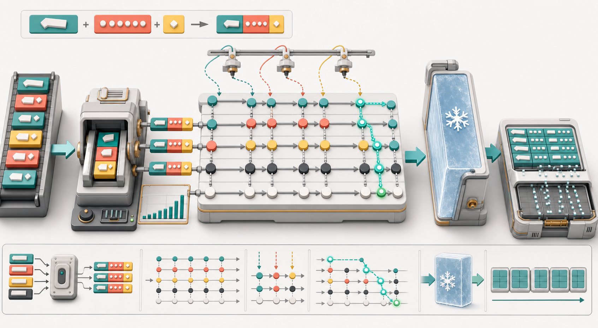
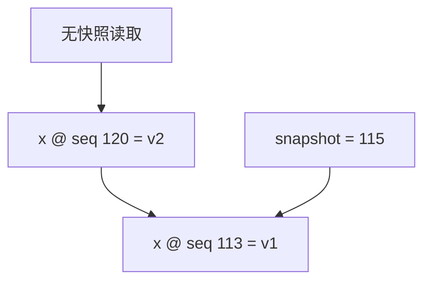
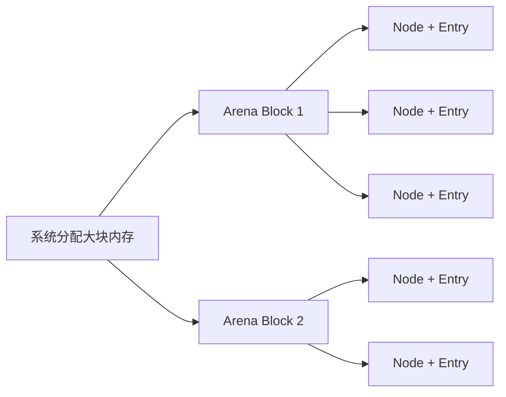
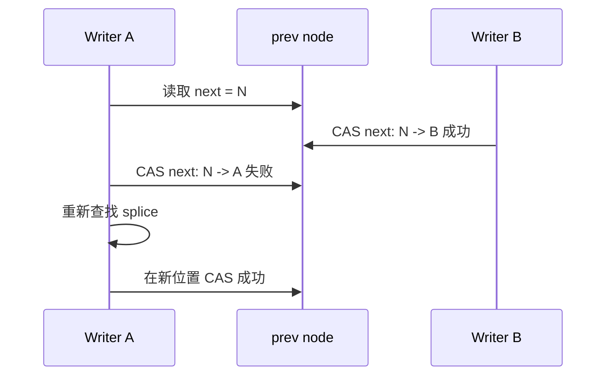
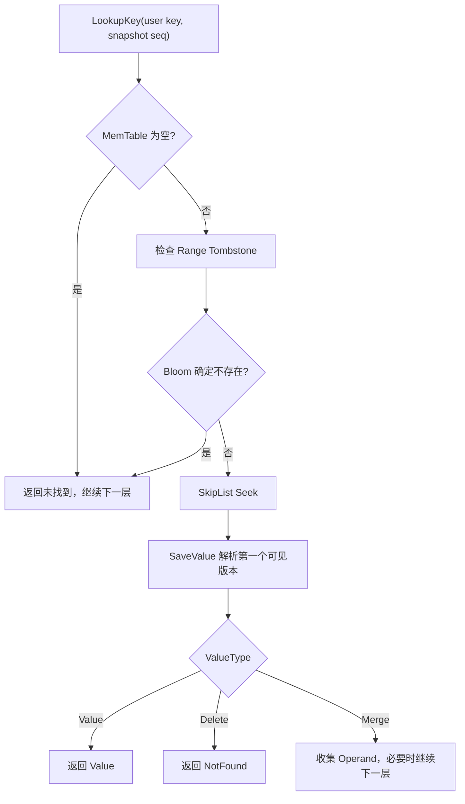
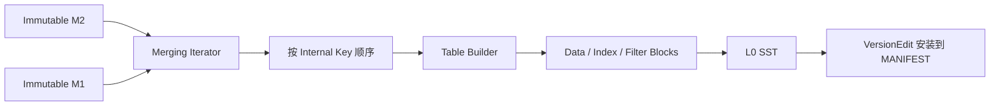

# RocksDB 写入路径（四）：MemTable、SkipList 与内存转储

上一篇跟随 WriteBatch 穿过 WAL，理解了 32 KiB Block、物理分片和持久性边界。WAL 写入成功之后，同一批更新还要进入内存中的 **MemTable**，才能立刻被后续读请求看见。

MemTable 经常被概括为“内存中的有序表”，但这句话省略了很多真正决定性能与正确性的细节：

- 它保存的不是普通 User Key，而是带 Sequence Number 和 ValueType 的 Internal Key；
- 默认实现不是平衡树，而是支持并发插入和无锁读取的 InlineSkipList；
- 同一个 User Key 的多个历史版本会同时存在，而不是原地覆盖；
- 条目从 Arena 分配，生命周期内不逐条释放；
- 写满后不会原地清空，而是冻结成 Immutable MemTable，再由后台 Flush 成 SST。



> 图 1：写入先编码为 Internal Key，再插入多层 SkipList；查询从高层快速跳跃并逐层下降。写满的 MemTable 被密封为 Immutable，随后按序迭代并生成 SST。

本文将把这条路径拆到数据布局、并发算法和生命周期三个层次。

## 1. MemTable 在写入路径中的位置

普通写入的主干可以简化为：


WAL 与 MemTable 保存的是同一批逻辑更新，但职责不同：

| 组件 | 主要职责 | 是否用于正常查询 | 生命周期 |
| --- | --- | --- | --- |
| WAL | 崩溃后重放尚未持久化的更新 | 通常不参与点查 | 依赖它的 MemTable Flush 后可淘汰 |
| MemTable | 提供最新写入的有序内存视图 | 是 | Flush 后释放或按配置保留为写历史 |
| SST | 长期保存已排序数据 | 是 | 由 Compaction 管理 |

“先 WAL，后 MemTable”保证恢复能力；“先查 MemTable，再查 SST”保证刚写入的数据能够立即参与读取。

## 2. MemTable 是接口，不等于 SkipList

RocksDB 通过 `MemTableRep` 抽象内存索引结构。默认配置是 `SkipListFactory`，但用户可以替换：

| MemTableRep | 核心结构 | 更适合的场景 |
| --- | --- | --- |
| SkipList | 全局有序跳表 | 通用读写、范围扫描、默认选择 |
| VectorRep | 写入追加到向量，迭代前排序 | 极少读取或迭代、批量构建型负载 |
| HashSkipList | 哈希桶中放 SkipList | 前缀可分桶、点查密集的负载 |
| HashLinkList | 哈希桶中放链表，过大后转 SkipList | 前缀局部访问、桶内数据较少的负载 |

公开工厂位于 [`include/rocksdb/memtablerep.h`](../include/rocksdb/memtablerep.h)。默认值在 `AdvancedColumnFamilyOptions` 中：

```cpp
std::shared_ptr<MemTableRepFactory> memtable_factory =
    std::shared_ptr<SkipListFactory>(new SkipListFactory);
```

因此本文说“MemTable 使用 SkipList”时，准确含义是：**默认的点记录 `table_` 使用 SkipListRep**。此外，Range Tombstone 被放进独立的 `range_del_table_`，当前固定使用 SkipList。

## 3. 一个 MemTable Entry 的字节布局

`MemTable::Add()` 不会分别分配 Key 对象、Value 对象和树节点。它一次计算所需空间，并编码为连续字节：

```text
+-------------------+----------------+------------------+----------------+
| internal_key_size | internal key   | value_size       | value          |
| varint32          | variable       | varint32         | variable       |
+-------------------+----------------+------------------+----------------+
                                                        + optional checksum
```

Internal Key 又由两部分组成：

```text
+-------------------------+----------------------------------+
| User Key                | packed tag                       |
| key.size() bytes        | fixed64: (sequence << 8) | type  |
+-------------------------+----------------------------------+
```

完整编码公式为：

```text
varint32(user_key_size + 8)
+ user_key
+ fixed64((sequence_number << 8) | value_type)
+ varint32(value_size)
+ value
+ optional protection bytes
```

`protection_bytes_per_key == 8` 时，条目尾部还会保存保护信息，用来检测 Key、Value、Type 或 Sequence 在内存处理链路中发生的损坏。

### 3.1 一个具体例子

假设执行：

```text
Put("cat", "blue"), sequence = 100, type = kTypeValue(1)
```

那么：

```text
internal_key_size = 3 + 8 = 11
packed_tag        = (100 << 8) | 1 = 0x0000000000006401
value_size        = 4
```

内存中的概念布局为：

```text
0b | 63 61 74 | 01 64 00 00 00 00 00 00 | 04 | 62 6c 75 65
^^   ^^^^^^^^   ^^^^^^^^^^^^^^^^^^^^^^^^   ^^   ^^^^^^^^^^^
11     "cat"      seq=100,type=Value       4       "blue"
```

这里的 fixed64 使用小端编码。比较时并不是直接对整段原始内存做 `memcmp`，而是由 `InternalKeyComparator` 解析 User Key 和末尾 Tag 后执行规定的顺序。

## 4. Internal Key 为什么按 Sequence 倒序

Internal Key 的比较规则是：

1. User Key 按用户 Comparator 升序；
2. User Key 相同时，Sequence Number 降序；
3. Sequence 也相同时，ValueType 降序。

例如同一个 User Key 有三个版本：

```text
("order:42", seq=108, Put)
("order:42", seq=105, Delete)
("order:42", seq=101, Put)
```

它们在 SkipList 中正好按上面的顺序相邻排列：

```text
order:41 ...
order:42 @ 108 Put       <- 最新版本
order:42 @ 105 Delete
order:42 @ 101 Put       <- 最旧版本
order:43 ...
```

这带来两个直接收益：

- 普通读以最新 Sequence 构造 `LookupKey`，Seek 后立刻遇到最新可见版本；
- Snapshot 读以快照 Sequence 构造 LookupKey，跳过更新版本后，第一个不大于快照的版本就是候选结果。

因此，RocksDB 不需要为每个 User Key 再维护一个版本链头指针。**排序本身就是版本索引。**

## 5. 为什么更新不是原地覆盖

假设 Key `x` 先后写入 `v1` 和 `v2`。MemTable 会保留两条不同 Sequence 的记录，而不是把 `v1` 的 Value 改成 `v2`。



保留多版本是 Snapshot 隔离、Iterator 一致视图和 Merge Operand 处理的基础。Delete 也不是立即移除旧节点，而是插入一个带新 Sequence 的 Tombstone。

这同时解释了为什么“条目数量”可能远高于“不同 User Key 数量”，以及写热点 Key 为什么会增加 MemTable 和后续 Compaction 的工作量。

> RocksDB 也有受限的 inplace update 功能，但它会改变 Snapshot 等语义约束，不是默认路径。理解核心实现时，应先以追加多版本为主模型。

## 6. SkipList 的结构：给有序链表加快速通道

最底层 Level 0 包含所有节点。更高层只保留随机抽样的节点，形成越来越稀疏的快速通道：

```text
Level 3: HEAD --------------------> 25 --------------------------> NIL
Level 2: HEAD --------> 09 -------> 25 -------------> 41 ------> NIL
Level 1: HEAD -> 03 --> 09 -> 17 -> 25 -> 31 -------> 41 -> 48 -> NIL
Level 0: HEAD -> 03 -> 06 -> 09 -> 12 -> 17 -> 25 -> 31 -> 37 -> 41 -> 48
```

查找 `37` 时，从最高层开始：

```text
HEAD -> 25                    Level 3
         25 -> 41，越界       Level 2
         25 -> 31             Level 1
               31 -> 37       Level 0
```

它不需要从 Level 0 的头部逐个扫描，期望查找复杂度为 `O(log N)`。

## 7. 随机层高如何产生

`InlineSkipList` 默认参数为：

```cpp
max_height = 12
branching_factor = 4
```

`RandomHeight()` 从高度 1 开始，每次以 `1 / branching_factor` 的概率再升一层。因此默认情况下：

| 节点最低高度 | 大约占全部节点的比例 |
| --- | ---: |
| 至少 1 层 | 100% |
| 至少 2 层 | 25% |
| 至少 3 层 | 6.25% |
| 至少 4 层 | 1.5625% |
| 至少 5 层 | 0.390625% |

平均每个节点的 forward pointer 数量约为：

```text
1 + 1/4 + 1/16 + ... = 4/3
```

这是一种概率平衡，而不是像红黑树那样通过旋转维持严格平衡。极端坏结构理论上可能出现，但概率很低；实现换来了简单的插入路径和良好的并发特性。

## 8. InlineSkipList 的内存布局优化

RocksDB 默认使用 [`memtable/inlineskiplist.h`](../memtable/inlineskiplist.h) 中的 `InlineSkipList`。它不是朴素的：

```cpp
struct Node {
  Key key;
  Node* next[];
};
```

节点的 Key 字节紧跟在 Node 后面，高层 next 指针则存放在 Node 之前的内存中：

```text
低地址
+----------+----------+----------+---------+----------------------+
| next[2]  | next[1]  | next[0]  | Node    | encoded entry bytes  |
+----------+----------+----------+---------+----------------------+
                                              ^ AllocateKey 返回这里
高地址
```

这种布局让 SkipList 节点与 MemTable Entry 一次分配，常见高度下还能比“单独保存 Key 指针”的实现少一个指针，并改善缓存局部性。

`SkipListRep::Allocate()` 实际调用：

```cpp
*buf = skip_list_.AllocateKey(len);
```

调用者随后直接在返回的空间编码 Internal Key 和 Value，不再进行一次容器节点分配和一次字符串分配。

## 9. Arena：为什么不逐条 free

MemTable 使用 `ConcurrentArena` 管理大块内存。写入时从当前 Arena Block 顺序切出空间；较大的条目可能使用专用 Block。



条目插入后不会在 Mutable MemTable 中单独删除，整个 Arena 会在 MemTable 生命周期结束时一起释放。这有三个重要效果：

- 热路径没有每条记录对应的 `delete/free`；
- Reader 不必处理节点在遍历中突然回收的问题；
- 大量小对象的分配和释放被摊薄为少量 Block 操作。

代价也很明确：旧版本和 Tombstone 在 Flush 前会一直占用空间，单条删除不能立刻降低 MemTable 内存。

## 10. `MemTable::Add()` 的完整插入流程

结合 [`db/memtable.cc`](../db/memtable.cc)，一次点记录插入可概括为：

```text
MemTableInserter::PutCF / DeleteCF / MergeCF
  -> MemTable::Add(sequence, type, user_key, value)
       -> 计算 encoded_len
       -> 选择 table_ 或 range_del_table_
       -> MemTableRep::Allocate
       -> 编码 internal_key_size
       -> 复制 user key
       -> 编码 fixed64(sequence << 8 | type)
       -> 编码 value_size 和 value
       -> 写入可选 ProtectionInfo
       -> 更新 MemTable Bloom Filter
       -> InsertKey / InsertKeyConcurrently
       -> 更新 entries、deletes、data_size 等计数
       -> 更新 first_seqno / earliest_seqno
       -> 检查 Flush 状态
```

Range Delete 走独立的 `range_del_table_`。这避免普通点记录 SkipList 被范围墓碑的特殊语义污染，也便于冻结时构建 `FragmentedRangeTombstones`，加速覆盖关系查询。

## 11. 串行插入与 Hint

没有并发 MemTable 写入时，Write Group Leader 负责把合并 Batch 依次插入 MemTable。默认调用 `InsertKey()`。

若配置 `memtable_insert_with_hint_prefix_extractor`，RocksDB 会为每个 Prefix 缓存一个 SkipList Splice，也就是各层的前驱/后继位置。后续同 Prefix 的 Key 如果位置接近，就不必每次从 Head 开始完整搜索。

这种优化适合：

```text
device:001 + timestamp increasing
device:002 + timestamp increasing
...
```

每个设备内部基本按时间顺序写入。它会为每个 Prefix 付出额外 Hint 内存；源码注释给出的量级约为每个 Prefix 250 字节。并发 MemTable 写入模式通常不会使用这个 Prefix Hint 选项。

## 12. 并发插入为什么可以不锁整张表

`DBOptions::allow_concurrent_memtable_write` 默认是 `true`，默认 SkipListFactory 支持并发插入。Write Group 写完 WAL 后，组内 Writers 可以并行把各自更新插入 MemTable。

每个插入线程先找到新节点在各层的 `prev[i]` 与 `next[i]`，再逐层执行：

```text
new.next[i] = expected_next
CAS(prev[i].next, expected_next, new)
```

如果 CAS 失败，说明其他线程在同一区间插入了节点。当前线程重新计算这一层的前驱和后继，再重试。



### 12.1 为什么 Reader 能看到完整节点

Node 的链接访问具有明确的内存顺序：

- 新节点内容及自己的 next 指针先初始化；
- `SetNext` 使用 release store，CAS 也承担发布作用；
- Reader 的 `Next()` 使用 acquire load；
- 因此 Reader 通过链表指针看到节点时，也能看到节点已经初始化好的 Key、Value 和链接。

### 12.2 为什么“不删除节点”如此重要

并发 Reader 只需要保证 SkipList 本体在读取期间不被销毁。节点一旦发布，就不会从当前 MemTable 中移除或复用，因此不存在常见的悬空指针、ABA 和复杂 Epoch 回收问题。

严格来说，这是一种支持无锁读取与并发插入的数据结构，不代表所有操作都“无锁”：MemTable 切换、SuperVersion 安装和 Flush 调度仍需要更高层同步。

## 13. 并发路径为什么延后更新计数器

如果每插入一个 Key 都原子更新 `num_entries_`、`data_size_` 和删除计数，多个 Writer 会竞争同一批缓存行。

并发路径把增量先写入线程自己的 `MemTablePostProcessInfo`：

```cpp
post_process_info->num_entries++;
post_process_info->data_size += encoded_len;
```

一个 WriteBatch 插入完成后，再由 `BatchPostProcess()` 汇总到 MemTable 计数器，并更新 Flush 状态。

这不会改变条目对 Reader 的可见性。它只是把统计与 Flush 判断的共享原子更新从“每个 Key 一次”降为“每个 Batch 一次”，减少缓存一致性流量。

## 14. MemTable 中的 Bloom Filter

MemTable Bloom 与 SST Bloom 是两个独立结构。前者随 MemTable 增量构建，不会持久化到 SST。

相关选项：

```cpp
options.memtable_prefix_bloom_size_ratio = 0.1;
options.memtable_whole_key_filtering = true;
```

Bloom 大小大致由：

```text
write_buffer_size * memtable_prefix_bloom_size_ratio
```

决定，比例超过 `0.25` 会被限制。默认比例为 `0`，即关闭。

点查流程中，如果 Bloom 明确返回“不存在”，RocksDB 可以跳过 SkipList Seek。Bloom 的假阳性只会导致一次多余查找，不会返回错误值；正确实现不会产生假阴性。

Bloom 更适合大量查询最终要继续落到 Immutable/SST 的场景。如果大多数 Get 都命中当前 MemTable，Bloom 检查本身可能只是额外 CPU 与内存开销。

## 15. 点查询如何穿过 MemTable

`MemTable::Get()` 的主要步骤是：



LookupKey 的 Tag 使用目标 Snapshot Sequence 和 `kValueTypeForSeek`。由于同 User Key 内部按 Sequence 降序，`Seek` 能直接定位到第一个可能对该 Snapshot 可见的版本。

`SaveValue()` 还要处理：

- Point Delete 与 Single Delete；
- Range Tombstone 是否以更高 Sequence 覆盖当前值；
- Merge Operand 是否已经能完成 Full Merge；
- Blob Index 与 Wide Column Entity；
- ReadCallback 对可见性的额外约束。

因此，“SkipList 找到 Key”不等于“Get 返回 Value”。SkipList 只完成有序定位，最终语义由 Sequence、Type、Range Delete 和 Merge 共同决定。

## 16. Mutable 如何变成 Immutable

MemTable 达到切换条件后，RocksDB 不会暂停所有读写并原地清空它，而是创建一个新 Mutable MemTable，把旧表放入 Immutable 列表：

```text
切换前：
  Mutable M1  <- 新写入

切换后：
  Mutable M2  <- 新写入继续
  Immutable list: [M1]  <- 仍可查询，等待 Flush
```

`DBImpl::SwitchMemtable()` 的关键动作包括：

1. 必要时创建或复用新 WAL；
2. 构造新的 Mutable MemTable；
3. 对旧 MemTable 调用 `MarkImmutable()`；
4. 构建旧表的 Fragmented Range Tombstones；
5. 排空并切换 WAL Writer；
6. 把旧表加入 `MemTableList`；
7. 安装包含新 Mutable 与 Immutable 列表的新 SuperVersion；
8. 调度后台 Flush。

`MarkImmutable()` 会把 `is_immutable_` 设为 true，调用底层 `table_->MarkReadOnly()`，并通知内存跟踪器不再分配。但源码特别强调：只调用这个方法本身，不足以凭空保证没有线程还在写；真正的不可变性由上层 WriteThread、DB Mutex 和 SuperVersion 切换协议共同建立。

## 17. 什么时候触发 MemTable 切换

最常见的触发条件是接近 `write_buffer_size`，默认每个 Column Family 为 64 MiB。但源码并不是简单判断：

```cpp
allocated_memory >= write_buffer_size
```

Arena 以 Block 分配，MemTable 很难恰好停在配置字节数。`ShouldFlushNow()` 使用三段判断：

1. 当前分配量再加一个 Arena Block，仍低于“阈值 + 0.6 个 Block”时继续写；
2. 已超过“阈值 + 0.6 个 Block”时请求 Flush；
3. 位于边界区时，若当前 Block 剩余不足四分之一，则请求 Flush。

这样既避免为了严格卡住 64 MiB 而浪费大块剩余空间，也限制过度超分配。

其他触发来源还包括：

- 应用调用 `DB::Flush()`；
- `memtable_max_range_deletions` 达到阈值；
- `WriteBufferManager` 或 `db_write_buffer_size` 触发跨 CF/跨 DB 内存控制；
- `max_total_wal_size` 迫使钉住旧 WAL 的 Column Family Flush；
- 数据库关闭、Checkpoint、Atomic Flush 或错误恢复流程提出 Flush 要求。

所以 `write_buffer_size` 是目标规模，不是精确硬上限。

## 18. Immutable 列表与写停顿

后台 Flush 需要时间。如果写入产生 Immutable MemTable 的速度高于 Flush 消化速度，列表会增长。

`max_write_buffer_number` 默认是 2，表示同一 Column Family 最多保有的 write buffer 数量。默认配置允许：

```text
1 个 Mutable + 1 个正在等待/执行 Flush 的 Immutable
```

达到容量边界时，前台写入必须等待后台 Flush 腾出空间。若把 `max_write_buffer_number` 调大，可以吸收更长的瞬时写入峰值，但会增加：

- 峰值内存；
- 崩溃恢复时需要重放的数据量；
- Get 需要检查的 Immutable 数量；
- 后台积压最终爆发时的压力。

`min_write_buffer_number_to_merge` 控制至少积累多少个 Write Buffer 再一起 Flush。值大于 1 可能在内存中消除跨 MemTable 的重复版本、减少 L0 文件和写放大，但会延长数据驻留内存与 WAL 的时间。启用 Atomic Flush 时该值会被规整为 1。

## 19. 从 Immutable 到 SST

Flush Job 为待刷新的 Immutable MemTable 创建内部迭代器。因为 SkipList 已按 Internal Key 有序，Flush 可以顺序遍历并交给 Table Builder：



Flush 可能合并多个 Immutable MemTable。Iterator 将它们组织为统一有序流，Table Builder 生成 SST。只有 SST 构建、文件同步和 VersionEdit 安装成功后，这批数据才真正脱离对旧 MemTable 与旧 WAL 的依赖。

这也解释了一个常见误解：

```text
MemTable 被标记 Immutable != 数据已经落盘
SST 文件写完 != 新版本已经安装成功
```

完整提交还涉及文件校验、目录/文件同步策略和 MANIFEST 元数据安装，下一篇会继续展开。

## 20. 可运行实验：观察 Active 与 Immutable

下面的程序把 `write_buffer_size` 调小到 256 KiB，持续写入 4 KiB Value，并通过公开 Property 观察 Active MemTable、Immutable 数量和条目数。

```cpp
#include <cstdint>
#include <cstdlib>
#include <iomanip>
#include <iostream>
#include <memory>
#include <sstream>
#include <string>

#include "rocksdb/db.h"
#include "rocksdb/options.h"

namespace {

void Check(const rocksdb::Status& status, const char* operation) {
  if (!status.ok()) {
    std::cerr << operation << ": " << status.ToString() << '\n';
    std::exit(1);
  }
}

uint64_t Property(rocksdb::DB* db, const std::string& name) {
  uint64_t value = 0;
  if (!db->GetIntProperty(name, &value)) {
    std::cerr << "property unavailable: " << name << '\n';
    std::exit(1);
  }
  return value;
}

void PrintMemTableState(rocksdb::DB* db, const char* stage) {
  std::cout
      << std::left << std::setw(18) << stage
      << " active_bytes="
      << Property(db, rocksdb::DB::Properties::kCurSizeActiveMemTable)
      << " all_bytes="
      << Property(db, rocksdb::DB::Properties::kCurSizeAllMemTables)
      << " active_entries="
      << Property(db, rocksdb::DB::Properties::kNumEntriesActiveMemTable)
      << " immutable="
      << Property(db, rocksdb::DB::Properties::kNumImmutableMemTable)
      << '\n';
}

}  // namespace

int main() {
  const std::string path = "/tmp/rocksdb-memtable-demo";

  rocksdb::Options options;
  options.create_if_missing = true;
  options.write_buffer_size = 256 * 1024;
  options.max_write_buffer_number = 4;
  options.min_write_buffer_number_to_merge = 1;
  options.level0_file_num_compaction_trigger = 1000;

  Check(rocksdb::DestroyDB(path, options), "DestroyDB before demo");

  rocksdb::DB* raw_db = nullptr;
  Check(rocksdb::DB::Open(options, path, &raw_db), "DB::Open");
  std::unique_ptr<rocksdb::DB> db(raw_db);

  const std::string value(4096, 'v');
  rocksdb::WriteOptions write_options;

  for (int i = 0; i < 300; ++i) {
    std::ostringstream key;
    key << "key-" << std::setw(6) << std::setfill('0') << i;
    Check(db->Put(write_options, key.str(), value), "DB::Put");

    if ((i + 1) % 20 == 0) {
      std::string stage = "after " + std::to_string(i + 1);
      PrintMemTableState(db.get(), stage.c_str());
    }
  }

  rocksdb::FlushOptions flush_options;
  flush_options.wait = true;
  Check(db->Flush(flush_options), "DB::Flush");
  PrintMemTableState(db.get(), "after Flush");

  db.reset();
  Check(rocksdb::DestroyDB(path, options), "DestroyDB after demo");
  return 0;
}
```

在安装了 RocksDB 开发库的 Linux 环境中编译：

```bash
g++ -std=c++17 -O2 memtable_observe.cc -o memtable_observe \
  $(pkg-config --cflags --libs rocksdb)
./memtable_observe
```

观察时应注意：

- `active_bytes` 是近似内存占用，不会精确等于写入 Payload 总和；
- 达到边界后 Active 会切换为新的小 MemTable；
- `immutable` 可能短暂增加，也可能被后台 Flush 很快清零；
- Property 读取与后台线程并发，输出是一组瞬时快照；
- 手动 `Flush(wait=true)` 返回后，当前数据已经进入 SST，Active/Immutable 状态会显著下降。

若机器 Flush 很快，看不到 `immutable > 0`，可以增大写入并发、减小 `write_buffer_size`，或使用较慢的测试文件系统。不要通过人为破坏后台线程来制造现象。

## 21. 配置建议与权衡

### 21.1 `write_buffer_size`

增大它通常会：

- 减少 Flush 频率并生成更大的 L0 文件；
- 给同 Key 的重复版本更多机会在 Flush/Compaction 中折叠；
- 增加内存占用和崩溃恢复时间；
- 让单个 Column Family 更久才释放旧 WAL。

### 21.2 `max_write_buffer_number`

它主要控制后台 Flush 跟不上时的缓冲余量。不要只为了“避免 stall”无限增大，否则只是把压力从延迟转移到内存和更晚的积压。

### 21.3 MemTable Bloom

点查 Miss 多、Key 较长或 Immutable 层较多时可能收益明显。写多读少、读大多命中 Active MemTable 时可能不划算。应同时测 CPU、内存与 Get P99。

### 21.4 `allow_concurrent_memtable_write`

默认开启，并要求 MemTableRep 支持并发插入。它对高并发写入有帮助，但最终收益受 WAL、Write Group、CPU 核数和 Key 分布共同影响。更换自定义 MemTableRep 前必须检查 `IsInsertConcurrentlySupported()`。

### 21.5 自定义 MemTableRep

不要因为 Hash 听起来是 `O(1)` 就直接替换默认 SkipList。范围扫描、Iterator、Prefix Extractor 正确性、桶分布、内存和 Flush 排序成本都会改变。默认 SkipList 是最稳妥的通用起点。

## 22. 常见误区

### 误区一：MemTable 是一个 `std::map<UserKey, Value>`

它保存的是 Internal Key 到编码 Value 的多版本有序集合。同一个 User Key 可以同时有多个 Put、Delete 和 Merge 记录。

### 误区二：Delete 会立即释放旧 Value

Delete 追加 Tombstone。旧版本仍留在 MemTable/SST，直到后续 Compaction 在 Snapshot 等规则允许时回收。

### 误区三：MemTable 达到 64 MiB 时会精确切换

`write_buffer_size` 是目标值。Arena Block、索引指针、Bloom、超大条目和边界利用策略都会让实际占用与配置不同。

### 误区四：SkipList 所有操作都无锁

默认实现支持并发插入与无锁读取，但 MemTable 切换、SuperVersion 发布和 Flush 调度仍有同步协议。串行插入路径也依赖外部串行化。

### 误区五：`MarkImmutable()` 单独保证没有 Writer

源码明确说明不可如此推断。真正保证来自上层对写线程、DB Mutex、引用和 SuperVersion 的协调。

### 误区六：Immutable 已经安全落盘

Immutable 只是“不再接受新写入”。在 Flush 成功并安装 SST 之前，它仍依赖内存和 WAL。

### 误区七：Bloom Miss 可以删除 Key

Bloom 只用于跳过不必要查找。它不改变数据，也不参与最终版本语义。

### 误区八：调大 MemTable 一定提升性能

大 MemTable 可能降低 Flush 频率，却会增加峰值内存、恢复时间和单次 Flush 压力。最终效果必须用真实读写比例、Value 大小和设备性能验证。

## 23. 源码阅读顺序

建议沿“编码 -> 容器 -> 并发 -> 查询 -> 生命周期”阅读：

```text
db/dbformat.h / db/dbformat.cc
  -> include/rocksdb/memtablerep.h
  -> db/memtable.h / db/memtable.cc
  -> memtable/skiplistrep.cc
  -> memtable/inlineskiplist.h
  -> memory/arena.h / memory/concurrent_arena.h
  -> db/memtable_list.h / db/memtable_list.cc
  -> db/db_impl/db_impl_write.cc
  -> db/flush_job.cc
```

重点入口：

- [`db/dbformat.h`](../db/dbformat.h)：Internal Key、Sequence 和 ValueType；
- [`db/memtable.h`](../db/memtable.h)：MemTable 字段、计数器与生命周期接口；
- [`db/memtable.cc`](../db/memtable.cc)：条目编码、Add、Get 和 Flush 判断；
- [`include/rocksdb/memtablerep.h`](../include/rocksdb/memtablerep.h)：可替换 MemTableRep 接口与工厂；
- [`memtable/skiplistrep.cc`](../memtable/skiplistrep.cc)：MemTableRep 到 InlineSkipList 的适配；
- [`memtable/inlineskiplist.h`](../memtable/inlineskiplist.h)：节点布局、查找、随机层高和 CAS 插入；
- [`memory/arena.h`](../memory/arena.h)：大块内存分配；
- [`memory/concurrent_arena.h`](../memory/concurrent_arena.h)：并发 Arena；
- [`db/memtable_list.cc`](../db/memtable_list.cc)：Immutable MemTable 列表；
- [`db/db_impl/db_impl_write.cc`](../db/db_impl/db_impl_write.cc)：SwitchMemtable 与 SuperVersion 安装；
- [`docs/components/write_flow/04_memtable_insert.md`](../docs/components/write_flow/04_memtable_insert.md)：仓库内写入专题；
- [`docs/components/read_flow/04_memtable_lookup.md`](../docs/components/read_flow/04_memtable_lookup.md)：仓库内查询专题。

## 24. 本篇小结

MemTable 的核心主线可以概括为：

```text
逻辑角色：最新写入的有序内存视图
条目格式：varint key length + Internal Key + varint value length + value
排序规则：User Key 升序，Sequence 和 ValueType 降序
默认容器：InlineSkipList，期望 O(log N) 查找与插入
层高策略：默认 branching factor 4，max height 12
内存管理：ConcurrentArena 批量分配，生命周期内不逐条释放
并发模型：CAS 插入、release/acquire 发布、节点只增不删
读取语义：SkipList 定位后再解释 Snapshot、Type、Merge 和 Range Delete
切换模型：Mutable -> Immutable -> Flush -> L0 SST
容量边界：write_buffer_size 是目标值，不是精确硬上限
背压来源：Immutable 积压达到 max_write_buffer_number
```

MemTable 的设计把 MVCC 版本顺序、缓存友好的连续编码、概率有序索引和简单生命周期结合在一起。它不追求在内存中完成垃圾回收，而是通过“只追加、整体冻结、批量落盘”把复杂度移到更适合顺序处理的 Flush 与 Compaction 阶段。

下一篇将进入 Flush 主流程：从挑选 Immutable MemTable、构造 Merging Iterator 开始，追踪 Table Builder 如何生成 Data Block、Index Block、Filter Block 和 Properties，最终把 L0 SST 原子安装进 VersionSet。

## 参考入口

- [`db/memtable.cc`](../db/memtable.cc)：MemTable 插入与查询实现；
- [`memtable/inlineskiplist.h`](../memtable/inlineskiplist.h)：默认跳表核心算法；
- [`memory/concurrent_arena.h`](../memory/concurrent_arena.h)：并发内存分配；
- [`db/db_impl/db_impl_write.cc`](../db/db_impl/db_impl_write.cc)：MemTable 切换；
- [`db/flush_job.cc`](../db/flush_job.cc)：Immutable 到 SST 的下一段流程；
- [`include/rocksdb/options.h`](../include/rocksdb/options.h)：DB 与 Column Family 配置；
- [`include/rocksdb/advanced_options.h`](../include/rocksdb/advanced_options.h)：MemTable 高级选项。
