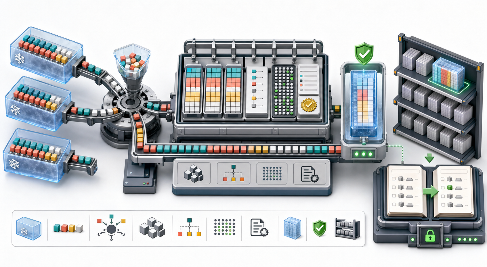
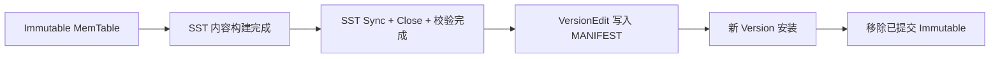
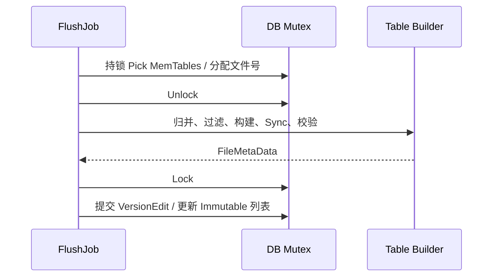
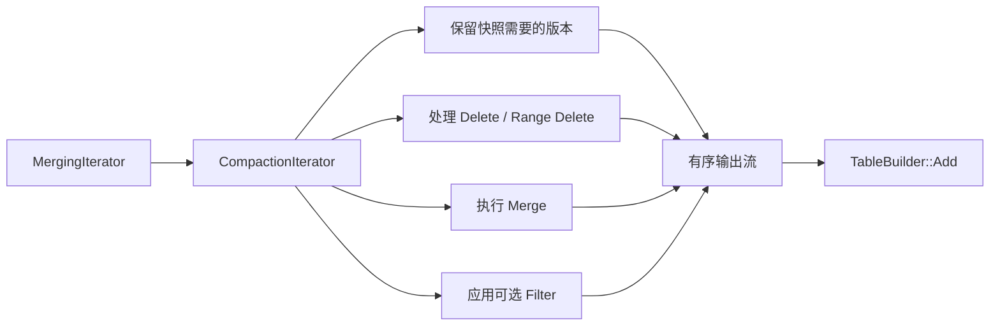
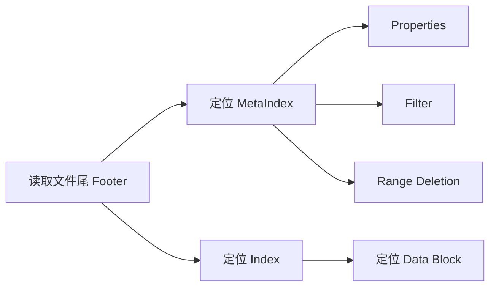
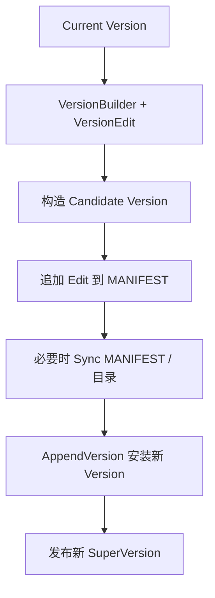

# RocksDB 写入路径（五）：Flush、SST 构建与版本安装

上一篇把 MemTable 拆到了 Internal Key、InlineSkipList、Arena 和并发插入。Mutable MemTable 写满后会被冻结为 Immutable，但 **Immutable 仍然只存在于内存中**，崩溃恢复仍要依赖 WAL。

Flush 的任务，是把一个或多个 Immutable MemTable 转换为有序的 SST 文件，并把新文件安全地加入当前 LSM 版本。这个过程远不止“遍历 SkipList 然后写文件”：

- 多个 MemTable 需要按 Internal Key 做多路归并；
- Snapshot、Delete、Merge、Range Tombstone 和 Compaction Filter 需要共同决定输出；
- Key 会被前缀压缩并切分为 Data Block；
- Index、Filter、Properties、MetaIndex 和 Footer 要引用正确的文件偏移；
- 每个 Block 与整个文件都有各自的完整性信息；
- 文件写完后还要 Sync、Close、重新打开并验证；
- 最后通过 VersionEdit 写入 MANIFEST，才能让新 SST 正式可见。



> 图 1：多个冻结 MemTable 先进入有序归并器，再构建 Data、Index、Filter 和 Properties 等 Block；完成文件校验后，SST 被加入 L0，MANIFEST 记录从旧版本切换到新版本的元数据变化。

## 1. Flush 真正完成需要跨过三道边界

理解 Flush 的第一步，是区分三个不同的“完成”：



| 边界 | 已经得到什么 | 还缺什么 |
| --- | --- | --- |
| Table Builder Finish | 结构完整的 SST 字节 | 文件持久化、可读性验证、元数据提交 |
| 文件 Sync/Close/验证 | 独立可读的 SST 文件 | 数据库尚未声明它属于当前版本 |
| LogAndApply 成功 | MANIFEST 与内存 Version 都包含新文件 | Flush 才正式提交 |

如果构建成功但 MANIFEST 写入失败，这个 SST 不能悄悄成为数据库的一部分。它会被视为未安装输出，由清理流程回收。

## 2. 谁发起 Flush

Flush 可以由多种原因触发：

- Mutable MemTable 接近 `write_buffer_size`；
- 应用调用 `DB::Flush()`；
- WriteBufferManager 或 `db_write_buffer_size` 达到全局内存边界；
- `max_total_wal_size` 迫使持有旧 WAL 的 Column Family 落盘；
- Range Tombstone 数量达到配置阈值；
- 数据库关闭、Checkpoint、Recovery 或 Atomic Flush 提出要求。

写线程把 MemTable 切换为 Immutable 并设置 Flush 请求后，后台调度器创建 `FlushJob`。前台写入通常可以继续使用新的 Mutable MemTable；只有 Immutable 积压达到写缓冲上限时才发生 Write Stall。

## 3. `FlushJob::PickMemTable()` 挑选什么

`FlushJob::PickMemTable()` 要求持有 DB Mutex。它调用 `MemTableList::PickMemtablesToFlush()`，选择当前最早、符合条件且尚未被其他 Flush Job 占用的 Immutable MemTable。

选中的 `mems_` 按 MemTable ID 递增排列，也就是从旧到新。随后 FlushJob：

1. 计算这批 MemTable 的最大 `NextLogNumber`；
2. 使用第一张 MemTable 携带的 VersionEdit；
3. 在 Edit 中设置 Column Family ID 和新的 Log Number 边界；
4. 从 VersionSet 分配新的文件编号；
5. 记录当前 Version 为 `base_`，供构建阶段判断底层重叠与版本可见性。

```text
Immutable list（概念顺序）

newest                                              oldest
  M5       M4       M3       M2       M1
                    |--------本次 Pick--------|
```

Log Number 边界很重要：当这批 MemTable 成功持久化后，更早且不再包含未落盘数据的 WAL 才有资格被淘汰。

## 4. 为什么 Flush 主要工作在 DB Mutex 之外执行

挑选与最终提交需要保护共享元数据，但遍历数十 MiB MemTable、压缩 Block 和写入设备可能耗时很长。`WriteLevel0Table()` 在准备好输入后释放 DB Mutex，再执行主要 I/O 和 CPU 工作。



这样其他 Column Family 的写入、读取和许多元数据操作不必在整个文件构建期间等待全局锁。Flush Job 通过引用保持选中 MemTable 和 Base Version 的生命周期。

## 5. 每个 MemTable 先产生有序 Iterator

选中的每张 Immutable MemTable 已按 Internal Key 排序。FlushJob 为每张表创建：

- 一个 Point Entry `InternalIterator`；
- 一个可选的 `FragmentedRangeTombstoneIterator`。

Point Iterator 使用 `ReadOptions::total_order_seek = true`，遍历全部 Key，而不是只允许某个 Prefix 范围。

如果配置了“不持久化 User-defined Timestamp”，Flush 还会使用 Timestamp Stripping Iterator，在输出前逻辑移除时间戳；否则直接使用普通 MemTable Iterator。

## 6. MergingIterator：把多个有序流变成一个

若一次 Flush 包含多张 MemTable，RocksDB 使用 `NewMergingIterator()` 将多个有序输入合成一个全局有序流。

```text
M1: a@90, c@88, f@81
M2: a@97, b@95, f@92
M3: b@103, d@99

Merge:
a@97, a@90, b@103, b@95, c@88, d@99, f@92, f@81
```

注意同 User Key 内仍按 Sequence 降序。MergingIterator 只负责从多个输入中取出“当前最小的 Internal Key”，通常通过最小堆或专用归并结构维护各子 Iterator 的当前位置。

它不会自行判断旧版本能否删除。版本语义由下一层 `CompactionIterator` 处理。

## 7. Flush 为什么也使用 CompactionIterator

`BuildTable()` 没有直接把 MergingIterator 接到 Table Builder，而是构造 `CompactionIterator`。尽管名字里有 Compaction，它也服务于 Flush。

这意味着 Flush 不是 MemTable 的逐字节拷贝。它可以处理：

- 同一 User Key 的多个版本；
- Snapshot 与 Write Conflict Snapshot；
- Point Delete、Single Delete 和 Range Tombstone；
- Merge Operand 与 Merge Operator；
- Compaction Filter；
- Blob File 抽取或引用统计；
- Internal Key 损坏检测；
- User-defined Timestamp 持久化策略。



### 7.1 能否在 Flush 时删除旧版本

可以，但必须保守。若某个旧版本仍可能被 Snapshot 读取，或者底层 SST 中存在需要与 Tombstone 配合解释的数据，就不能随意丢弃。

因此，最终 SST 的 `num_entries` 不一定等于输入 MemTable 的条目总数。FlushJob 会分别统计输入与输出，并在配置要求时验证计数关系是否合理。

### 7.2 Compaction Filter 的边界

Flush 创建 Table 文件时也可以调用允许该原因的 Compaction Filter。当前路径要求 Filter 忽略 Snapshot；不满足要求的 Filter 会被拒绝。业务不应把 Compaction Filter 当成精确、实时的删除 API，因为它的执行时机取决于后台文件构建。

## 8. 为什么 Flush 文件进入 L0

普通 Flush 输出被加入 Level 0：

```cpp
edit_->AddFile(0 /* level */, meta_);
```

L1 及更深层通常要求文件之间满足更严格的非重叠约束，而多个 Flush 与 Compaction 可能并发生成相交 Key Range。直接把 Flush 文件放入更深层，需要额外协调并会放大关键路径复杂度。

L0 允许文件 Key Range 重叠，也保留文件的新旧顺序信息。后续 Compaction 再统一选择输入、消除重叠并下沉到更深层。

## 9. `BuildTable()` 创建文件与 Builder

有有效 Point Entry 或 Range Tombstone 时，`BuildTable()`：

1. 根据新文件编号计算 `.sst` 路径；
2. 通过 FileSystem 创建 `FSWritableFile`；
3. 包装为 `WritableFileWriter`，接入缓冲、限速、统计和文件级校验；
4. 通过当前 `TableFactory` 创建 `TableBuilder`；
5. 遍历 CompactionIterator，逐条调用 `builder->Add()`；
6. 单独序列化 Range Tombstone 并加入 Builder；
7. 更新 FileMetaData 的最小/最大 Key、Sequence 和文件属性。

默认 TableFactory 是 BlockBasedTable，因此后文聚焦 `BlockBasedTableBuilder`。PlainTable、CuckooTable 等格式实现相同的 TableBuilder 接口，但文件布局不同。

## 10. BlockBased SST 的整体布局

一个典型 BlockBasedTable 文件可以概念化为：

```text
+--------------------------+
| Data Block 0             |
+--------------------------+
| Data Block 1             |
+--------------------------+
| ...                      |
+--------------------------+
| Filter Block             |  optional / may be partitioned
+--------------------------+
| Index Block              |  may be two-level / partitioned
+--------------------------+
| Compression Dictionary   |  optional
+--------------------------+
| Range Deletion Block     |  optional
+--------------------------+
| Properties Block         |
+--------------------------+
| MetaIndex Block          |
+--------------------------+
| Footer                   |  fixed tail anchor
+--------------------------+
```

Data Block 占据文件主体。`Finish()` 中尾部的当前写入顺序是：Filter、Index、Compression Dictionary、Range Deletion、Properties、MetaIndex、Footer。

Footer 是打开 SST 时的固定入口，保存 Index 与 MetaIndex 的 BlockHandle 以及格式识别信息。Reader 先从文件尾读取 Footer，再反向定位其他元数据 Block。

## 11. Data Block 何时切分

`BlockBasedTableOptions::block_size` 默认是 4 KiB，表示每个 Data Block 的**未压缩目标大小**，不是严格上限，也不是磁盘最终字节数。

每次 `BlockBasedTableBuilder::Add()` 都把下一个 Key/Value 交给 `FlushBlockPolicy`。默认策略综合：

- 当前 Block 估算大小；
- 新 Entry 加入后的大小；
- `block_size_deviation` 允许的偏差；
- 是否值得提前结束当前 Block，避免下一次产生过多空余。

若策略决定切分，Builder 先 `Flush()` 当前 Data Block，再把新 Entry 写入下一个 Block。

```text
目标 block_size = 4 KiB

[Entry 1][Entry 2]...[Entry N]  -> Flush -> compression -> trailer
[Entry N+1]...                 -> next Data Block
```

因此不能用 `SST 文件大小 / 4096` 精确推导 Data Block 数量。压缩、超大 Entry、对齐、Trailer 和元数据都会影响结果。

## 12. Data Block 内部如何压缩 Key

相邻 Internal Key 常有很长的公共前缀。Data Block 使用 Prefix Delta Encoding：

```text
Entry :=
  shared_bytes      varint32
  unshared_bytes    varint32
  value_length      varint32
  key_delta         byte[unshared_bytes]
  value             byte[value_length]
```

例如：

```text
上一条 Key: customer:000123|tag
当前 Key:   customer:000124|tag

shared_bytes   = len("customer:00012")
key_delta      = "4|tag"
```

Value 默认原样跟在 Key Delta 后，再由整个 Block 的压缩算法统一压缩。

### 12.1 Restart Point

如果所有 Entry 都只保存相对上一条 Key 的差异，随机定位到 Block 中部就必须从第一条开始解码。RocksDB 每隔 `block_restart_interval` 条记录写一次完整 Key，默认间隔为 16。

Block 尾部保存：

```text
restart_offset[0]
restart_offset[1]
...
num_restarts
```

Reader 可以先对 Restart Key 二分查找，再在一个小区间内顺序解码。间隔越小，随机查找需要解码的 Entry 越少，但完整 Key 和 Offset 开销越大。

## 13. 压缩、Block Trailer 与校验和

Data Block 构建完成后可以独立压缩。每个物理 Block 写入形式为：

```text
+----------------------+------------------+------------------+
| block contents       | compression type | checksum         |
| N bytes              | 1 byte           | fixed32          |
+----------------------+------------------+------------------+
```

Trailer 固定 5 字节。Checksum 覆盖实际写入的 Block Contents 和 Compression Type，因此 Reader 能在解压前验证读到的压缩字节是否完整。

BlockHandle 记录：

```text
offset: Block Contents 在文件中的起始位置
size:   Block Contents 长度，不包含 5 字节 Trailer
```

当前仓库的 BlockBasedTable 默认 ChecksumType 是 `kXXH3`，但旧文件或自定义配置可以使用其他算法。文件格式携带足够信息，Reader 不要求所有 SST 使用同一种校验算法。

### 13.1 Block 校验与文件校验不是一回事

- Block Checksum 保护每个可寻址 Block；
- WritableFileWriter 的 File Checksum 覆盖文件级输出，用于元数据和外部完整性核对；
- `paranoid_file_checks` 还可以重新读取输出并比较 Key/Value 滚动哈希。

三者位于不同层次，不能互相替代。

## 14. Index Block 保存什么

每个 Data Block 完成后，Index Builder 生成一条索引项：

```text
index key -> encoded BlockHandle(offset, size)
```

Index Key 不一定机械复制 Data Block 的最后一个完整 Internal Key。Builder 可以根据当前 Block 的最后 Key 和下一 Block 的第一 Key，调用 Comparator 的 Separator/Successor 逻辑生成更短、仍然正确的边界 Key。

```text
Data Block A: ... customer:000199
Data Block B: customer:000240 ...

Index A 可以保存一个满足：
last(A) <= separator < first(B)
的更短边界
```

点查先在 Index 中定位候选 Data Block，再读取对应 BlockHandle。默认 `index_block_restart_interval = 1`，Index Entry 通常以独立 Restart 形式编码，减少解码依赖。

对于很大的 SST，可以使用 Partitioned Index 或 Two-level Index，避免一个巨大 Index Block 成为缓存和 I/O 负担。

## 15. Filter Block 解决什么问题

配置 Bloom/Ribbon Filter 后，Table Builder 会把 User Key 或 Prefix 加入 Filter Builder。Filter 回答：

```text
这个 SST（或某个分区）是否“可能”包含目标 Key？
```

若返回确定不存在，读取可以跳过 Data Block I/O。Filter 只影响查询性能，不是数据正确性的必要组成：无法识别 Filter Schema 或未配置 Filter 时，Reader 仍能通过 Index 和 Data Block 读取 SST。

Filter 可以是：

- Full Filter：覆盖整个 SST；
- Partitioned Filter：与分区 Index 配合，按需加载局部过滤器；
- Whole-key Filter 或 Prefix Filter：取决于策略和 Prefix Extractor。

Filter Entry 使用 User Key 语义，而不是把 Sequence Number 当成业务 Key 的一部分，否则同一 User Key 的每个版本都会浪费过滤器空间。

## 16. Properties Block 记录什么

Table Properties 描述 SST 的统计和构建信息，例如：

- `num_entries`、`num_deletions`、`num_range_deletions`；
- `raw_key_size`、`raw_value_size`；
- `data_size`、`index_size`、`filter_size`；
- `num_data_blocks`；
- Compression 名称；
- Column Family ID 与名称；
- Comparator、Merge Operator、Prefix Extractor 名称；
- 创建时间、Sequence 到时间的映射；
- 用户自定义 Table Properties Collector 结果。

Properties 既供诊断工具使用，也帮助 Reader 判断格式兼容性、优化打开与查询行为。它不是简单的“日志文本”，而是 SST 的结构化元数据。

## 17. MetaIndex 与 Footer 如何串起整个文件

MetaIndex 是“元数据 Block 的索引”，名字映射到 BlockHandle：

```text
filter name             -> Filter BlockHandle
rocksdb.properties      -> Properties BlockHandle
compression dictionary  -> Dictionary BlockHandle
range deletions         -> RangeDel BlockHandle
```

Footer 直接保存 MetaIndex 与主 Index 的 BlockHandle。文件打开过程因此是：



Footer 还包含 Magic Number 和格式信息，用于识别 BlockBasedTable 及解释文件版本。由于 Footer 位于固定尾部，Reader 无需从文件头顺序扫描才能找到索引。

## 18. Table Builder Finish 之后发生什么

`builder->Finish()` 成功只表示 SST 结构已经输出。`BuildTable()` 随后执行：

1. 获取文件大小、Tail 大小和 Table Properties；
2. 填充 FileMetaData 的 Key/Sequence 边界；
3. 对 WritableFileWriter 调用 `Sync()`；
4. 关闭文件；
5. 取得文件级 Checksum 与 Unique ID；
6. 通过 TableCache 重新打开新 SST；
7. 检查 Table Reader/Iterator 状态；
8. 若开启 `paranoid_file_checks`，完整迭代文件并比较构建前后的滚动哈希。

```text
Builder Finish
   -> file Sync
   -> file Close
   -> TableCache::NewIterator
   -> optional full scan validation
   -> BuildTable success
```

如果任何步骤失败，输出 SST 会被删除，可能进入的 Table Cache 项也会被释放。失败文件不会被加入 VersionEdit。

### 18.1 空输出

若输入为空，或 Filter/版本处理让 Builder 没有任何输出记录，Builder 会 Abandon，空 SST 不会保留。`meta.fd.file_size == 0` 时 FlushJob 不执行 `AddFile()`，但仍可能需要提交 WAL 边界或 Blob 元数据变化。

## 19. FileMetaData 为什么重要

Flush 构建过程中持续更新 `FileMetaData`：

```text
file number / path id / size
smallest internal key / largest internal key
smallest seqno / largest seqno
file checksum / checksum function
unique id
creation time / oldest ancestor time
temperature
number of entries / deletions
range deletion effective bounds
```

VersionSet 不需要在每次版本计算时重新扫描 SST 内容，而是依靠 FileMetaData 判断 Key Range 重叠、选择 Compaction、估算大小和打开文件。

这些元数据必须和物理文件一致。错误的 smallest/largest 边界可能让读取或 Compaction 错过本应检查的文件，因此 BuildTable 同步维护并验证边界。

## 20. VersionEdit 如何描述这次 Flush

Flush 成功后，Edit 至少表达两类变化：

```text
AddFile(level=0, FileMetaData)
SetLogNumber(max_next_log_number)
```

第一项声明新 SST 属于 L0；第二项推进该 Column Family 的 WAL 恢复边界。启用 BlobDB、User-defined Timestamp 或其他特性时，Edit 还可能包含 Blob File Addition/Garbage、Full History Timestamp 等字段。

VersionEdit 是“从旧 Version 到新 Version 的增量”，而不是完整 LSM 快照。MANIFEST 是这些 Edit 的持久化日志；DB Open 时通过重放它们重建 VersionSet。

## 21. 并发 Flush 为什么必须按 MemTable 顺序提交

多个后台线程可以并发构建 SST。较新的 MemTable 可能先完成，但不能越过更老的 MemTable 单独推进 WAL 边界。

```text
创建顺序：M1 -> M2 -> M3
完成顺序：M2 -> M1 -> M3

允许的提交：
M2 完成：等待
M1 完成：一起提交 M1、M2
M3 完成：提交 M3
```

`TryInstallMemtableFlushResults()` 先在每张 MemTable 上记录 `flush_completed_` 和输出文件号。只有 Immutable 列表最老端已经完成时，提交线程才从最老开始收集连续完成的批次，并调用 `VersionSet::LogAndApply()`。

这样保证：

- MANIFEST 中的 MemTable 持久化顺序与创建顺序一致；
- WAL Log Number 不会越过仍未落盘的旧数据；
- 并发 Flush 获得吞吐，而不破坏恢复边界。

## 22. `LogAndApply()` 的原子承诺

`VersionSet::LogAndApply()` 的契约是：把 Edit 应用到当前 Version，形成新 Version；同时把同一变化写入持久化 MANIFEST，并安装为当前内存版本。

概念过程如下：



实现可以在写 MANIFEST 时暂时释放 DB Mutex，但 Manifest Writer 队列保证 Edit 串行有序。只有持久化与安装成功后，已 Flush MemTable 才从 Immutable 列表移除并等待引用计数归零后释放。

如果 `LogAndApply()` 失败，回调会恢复 MemTable 的 Flush 标志，让数据仍留在 Immutable 列表中；新 SST 不会成为 Current Version 的合法成员。

## 23. MANIFEST 与 SST 谁是事实来源

物理目录里存在一个 `.sst` 文件，不代表 RocksDB 会读取它。**MANIFEST/VersionSet 决定哪些 SST 属于数据库当前历史。**

反过来，如果 MANIFEST 声明某 SST 存在，而文件缺失或损坏，数据库打开或读取会报告错误，因为元数据承诺无法兑现。

```text
孤立 SST：文件存在，MANIFEST 未引用 -> 不属于当前 LSM，可清理
缺失 SST：MANIFEST 引用，文件不存在 -> 数据完整性错误
合法 SST：文件完整，MANIFEST 引用 -> Current Version 可见
```

这就是为什么不能靠手工把 `.sst` 复制进 DB 目录来“导入数据”。应使用 `IngestExternalFile()`，让 RocksDB 校验文件并通过 VersionEdit 正式安装。

## 24. Atomic Flush 有什么不同

普通 Flush 每个 Column Family 独立提交。启用 `atomic_flush=true` 时，一组 Column Family 的 Flush 必须全成或全败：

- 各 Flush Job 可以分别构建输出文件；
- 单个 Job 暂不独立写 MANIFEST；
- 所有参与者成功后，跨 CF 的 VersionEdits 作为一个原子组提交；
- 任一参与者失败，整组不能部分安装。

Atomic Flush 解决跨 Column Family 的持久化原子边界，但会增加协调、内存驻留和失败恢复复杂度。它与 WriteBatch 的“跨 CF 原子写入”不是同一个阶段：前者约束落盘版本，后者约束逻辑写入可见性。

## 25. 可运行实验：读取 Flush 生成的 SST 属性

下面的程序关闭自动 Compaction，写入一批数据后手动 Flush，并通过公开 API 输出 L0 文件元数据和 Table Properties。

```cpp
#include <cstdlib>
#include <iomanip>
#include <iostream>
#include <memory>
#include <sstream>
#include <string>
#include <vector>

#include "rocksdb/db.h"
#include "rocksdb/filter_policy.h"
#include "rocksdb/metadata.h"
#include "rocksdb/options.h"
#include "rocksdb/table.h"
#include "rocksdb/table_properties.h"

namespace {

void Check(const rocksdb::Status& status, const char* operation) {
  if (!status.ok()) {
    std::cerr << operation << ": " << status.ToString() << '\n';
    std::exit(1);
  }
}

std::string Key(int i) {
  std::ostringstream out;
  out << "user:" << std::setw(6) << std::setfill('0') << i;
  return out.str();
}

}  // namespace

int main() {
  const std::string path = "/tmp/rocksdb-flush-demo";

  rocksdb::BlockBasedTableOptions table_options;
  table_options.block_size = 4 * 1024;
  table_options.block_restart_interval = 16;
  table_options.filter_policy.reset(
      rocksdb::NewBloomFilterPolicy(10, false));

  rocksdb::Options options;
  options.create_if_missing = true;
  options.disable_auto_compactions = true;
  options.compression = rocksdb::kNoCompression;
  options.table_factory.reset(
      rocksdb::NewBlockBasedTableFactory(table_options));

  Check(rocksdb::DestroyDB(path, options), "DestroyDB before demo");

  rocksdb::DB* raw_db = nullptr;
  Check(rocksdb::DB::Open(options, path, &raw_db), "DB::Open");
  std::unique_ptr<rocksdb::DB> db(raw_db);

  rocksdb::WriteOptions write_options;
  const std::string value(200, 'v');
  for (int i = 0; i < 2000; ++i) {
    Check(db->Put(write_options, Key(i), value), "DB::Put");
  }
  for (int i = 0; i < 200; i += 5) {
    Check(db->Delete(write_options, Key(i)), "DB::Delete");
  }

  rocksdb::FlushOptions flush_options;
  flush_options.wait = true;
  Check(db->Flush(flush_options), "DB::Flush");

  std::vector<rocksdb::LiveFileMetaData> files;
  db->GetLiveFilesMetaData(&files);
  for (const auto& file : files) {
    std::cout << "file=" << file.relative_filename
              << " level=" << file.level
              << " bytes=" << file.size
              << " seq=[" << file.smallest_seqno
              << ',' << file.largest_seqno << "]\n";
  }

  rocksdb::TablePropertiesCollection tables;
  Check(db->GetPropertiesOfAllTables(&tables),
        "GetPropertiesOfAllTables");
  for (const auto& [name, props] : tables) {
    std::cout << "table=" << name
              << " entries=" << props->num_entries
              << " deletions=" << props->num_deletions
              << " data_blocks=" << props->num_data_blocks
              << " data_bytes=" << props->data_size
              << " index_bytes=" << props->index_size
              << " filter_bytes=" << props->filter_size
              << " raw_key_bytes=" << props->raw_key_size
              << " raw_value_bytes=" << props->raw_value_size
              << '\n';
  }

  db.reset();
  Check(rocksdb::DestroyDB(path, options), "DestroyDB after demo");
  return 0;
}
```

在安装 RocksDB 开发库的 Linux 环境中编译：

```bash
g++ -std=c++17 -O2 flush_inspect.cc -o flush_inspect \
  $(pkg-config --cflags --libs rocksdb)
./flush_inspect
```

预期观察到：

- 新文件位于 `level=0`；
- `data_blocks` 大于 1，因为 2000 条记录远超 4 KiB 目标 Block；
- `index_bytes` 与 `filter_bytes` 非零；
- `raw_value_bytes` 接近逻辑 Value 总量，但 `data_bytes` 还受到 Entry 编码、Block 尾部与删除处理影响；
- `entries` 不应被当成 Put 调用次数的机械复制，版本清理和 Tombstone 处理可能改变输出条目数；
- 禁用压缩便于观察结构开销，生产环境通常需要重新评估压缩。

## 26. 用 `sst_dump` 继续观察

仓库自带的 `sst_dump` 可以读取已生成 SST 的 Properties、Block 布局与 Key：

```bash
./sst_dump --file=/path/to/000123.sst --show_properties
./sst_dump --file=/path/to/000123.sst --command=scan \
  --output_hex --show_properties
```

可重点核对：

- Comparator 与 Table Format Version；
- Entry、Delete、Range Delete 数量；
- Data/Index/Filter 大小；
- Compression 名称；
- 最小与最大 Internal Key；
- Block Checksum 校验结果。

不要在程序仍运行时随意修改 SST。观察应使用只读工具或数据库副本，避免把诊断行为变成数据损坏来源。

## 27. Flush 性能看哪些指标

| 指标/现象 | 说明 |
| --- | --- |
| `FLUSH_WRITE_BYTES` | Flush 实际写入量 |
| `TABLE_SYNC_MICROS` | SST 文件同步耗时 |
| `FLUSH_MEMTABLE_MEMORY_BYTES` | 输入 MemTable 内存规模 |
| `FLUSH_MEMTABLE_TOTAL_DATA_SIZE` | 输入编码数据量 |
| Flush CPU 时间 | 归并、过滤、压缩与校验开销 |
| `num_data_blocks` | Data Block 数量 |
| Compression Ratio | 原始 Key/Value 与物理数据大小关系 |
| Immutable 数量 | 后台 Flush 是否跟不上前台写入 |
| L0 文件数 | Flush 与 Compaction 是否失衡 |
| Write Stall 时间 | 积压最终对前台延迟的影响 |

常见瓶颈来源：

- 存储带宽或 Sync 延迟；
- 高压缩级别消耗 CPU；
- 大量小 Key 造成索引和编码开销；
- Range Tombstone、Merge 或 Filter 增加迭代处理；
- `paranoid_file_checks` 全量回读增加 I/O；
- L0 Compaction 跟不上，反过来导致 L0 Stall。

优化时应区分“Flush 慢”和“Compaction 慢导致 Flush 无处可去”。只增加后台 Flush 线程，可能让 L0 更快堆积，并不一定改善长期吞吐。

## 28. 关键配置如何权衡

### 28.1 `write_buffer_size`

更大的 MemTable 通常生成更大的 SST、降低 Flush 频率，但增加内存、恢复时间和单次 Flush 峰值。

### 28.2 `max_background_jobs`

它为 Flush 与 Compaction 提供后台并发资源。增大可提高并行度，也可能让多个 Job 争用 CPU、设备带宽和 Cache。应结合设备队列深度测试。

### 28.3 `block_size`

小 Block 减少点查读取放大，却增加 Index、Filter、Trailer 和 Block Cache 管理开销；大 Block 更利于压缩和扫描，但单次随机读带入更多无关数据。

### 28.4 `block_restart_interval`

较小间隔提高 Block 内随机 Seek 效率，代价是更多完整 Key 和 Restart Offset。默认 16 是通用折中。

### 28.5 Compression

压缩降低存储带宽、文件大小和后续读 I/O，但消耗 CPU。Flush 与底层 Compaction 可以使用不同 Compression 策略；需要按 Key/Value 分布和设备特性基准测试。

### 28.6 Filter Policy

Filter 增加构建 CPU 与文件空间，换取点查时跳过 Data Block。读取 Miss 多时收益更大；纯顺序扫描可能几乎用不到。

## 29. 常见误区

### 误区一：Immutable 就等于已经持久化

Immutable 只表示不再接受新写入。Flush 与 VersionEdit 提交成功之前，它仍依赖内存和 WAL。

### 误区二：Flush 是 MemTable 的原样复制

它经过 MergingIterator 和 CompactionIterator，可能处理旧版本、Merge、Delete、Range Tombstone、Filter 和 Blob。

### 误区三：SST 写完就会被查询

只有 MANIFEST 成功记录 AddFile 并安装新 Version 后，SST 才属于 Current Version。

### 误区四：所有 Flush 都生成一个非空 SST

输入可能经处理后为空。空文件会被 Abandon/删除，Flush 仍可能只推进 WAL 或其他元数据边界。

### 误区五：`block_size=4096` 代表每个磁盘块恰好 4096 字节

它是未压缩 Data Block 的目标大小。压缩、Trailer、超大 Entry、对齐和策略偏差都会改变物理大小。

### 误区六：Index 保存每个 Key

主 Index 通常每个 Data Block 一条边界记录，并映射到 BlockHandle；Block 内再通过 Restart Array 定位具体 Entry。

### 误区七：Bloom Filter 参与数据正确性

Filter 是性能结构。即使没有或无法识别 Filter，Index 与 Data Block 仍应能正确读取数据。

### 误区八：目录里出现 `.sst` 就能手工接入数据库

MANIFEST 才定义合法文件集合。外部 SST 应通过 Ingest API 校验并安装。

### 误区九：并发 Flush 可以按完成顺序随意提交

构建可以乱序完成，但 MANIFEST 提交必须尊重旧到新的 MemTable 顺序，避免错误推进 WAL 边界。

### 误区十：Flush 调优只看写吞吐

Flush 参数还会改变点查读取放大、Block Cache 效率、L0 文件数量、Compaction 压力和恢复时间。

## 30. 源码阅读顺序

建议沿“挑选 -> 归并 -> 过滤 -> 构建 -> 校验 -> 安装”阅读：

```text
db/flush_job.h / db/flush_job.cc
  -> db/memtable_list.h / db/memtable_list.cc
  -> table/merging_iterator.h / table/merging_iterator.cc
  -> db/compaction/compaction_iterator.h
  -> db/compaction/compaction_iterator.cc
  -> db/builder.h / db/builder.cc
  -> table/table_builder.h
  -> table/block_based/block_based_table_builder.cc
  -> table/block_based/block_builder.cc
  -> table/block_based/index_builder.cc
  -> db/version_edit.h / db/version_edit.cc
  -> db/version_set.h / db/version_set.cc
```

重点入口：

- [`db/flush_job.cc`](../db/flush_job.cc)：Pick、Run、WriteLevel0Table 与 AddFile；
- [`db/memtable_list.cc`](../db/memtable_list.cc)：并发 Flush 完成状态与有序提交；
- [`table/merging_iterator.cc`](../table/merging_iterator.cc)：多路有序归并；
- [`db/compaction/compaction_iterator.cc`](../db/compaction/compaction_iterator.cc)：版本、Delete、Merge 和 Filter 处理；
- [`db/builder.cc`](../db/builder.cc)：SST 创建、同步、重新打开与验证；
- [`table/table_builder.h`](../table/table_builder.h)：表格式抽象；
- [`table/block_based/block_based_table_builder.cc`](../table/block_based/block_based_table_builder.cc)：BlockBased SST 主构建流程；
- [`table/block_based/block_builder.cc`](../table/block_based/block_builder.cc)：Prefix Delta 与 Restart Array；
- [`table/block_based/index_builder.cc`](../table/block_based/index_builder.cc)：Index Boundary 与 BlockHandle；
- [`table/format.h`](../table/format.h)：Footer、BlockHandle 和 Trailer 常量；
- [`db/version_edit.cc`](../db/version_edit.cc)：VersionEdit 编码；
- [`db/version_set.cc`](../db/version_set.cc)：LogAndApply 与 Version 安装；
- [`include/rocksdb/table.h`](../include/rocksdb/table.h)：BlockBasedTableOptions。

## 31. 本篇小结

Flush 主线可以概括为：

```text
输入选择：Pick 最早且可 Flush 的 Immutable MemTables
有序输入：每张 MemTable 产生 InternalIterator
多路归并：MergingIterator 合成全局 Internal Key 顺序
语义处理：CompactionIterator 处理版本、快照、删除、Merge 与 Filter
表格式：默认 BlockBasedTable
Data Block：Prefix Delta + Restart Array，默认目标 4 KiB
物理保护：每个 Block 带 Compression Type 和 4 字节 Checksum
索引结构：Index Key -> BlockHandle(offset, size)
查询优化：可选 Filter Block
结构元数据：Properties + MetaIndex + Footer
文件完成：Finish -> Sync -> Close -> TableCache reopen -> optional verify
版本提交：VersionEdit AddFile(L0) + WAL 边界 -> MANIFEST
并发规则：构建可并发，提交按 MemTable 创建顺序
失败处理：回滚 Flush 标记，删除未安装输出，保留 Immutable 与 WAL
```

Flush 把“内存中的有序版本集合”变成“可独立校验、随机定位和长期管理的不可变文件”。它的正确性不仅来自 SST 内部格式，还来自物理文件、MANIFEST 和内存 Version 三者的一致提交。

下一篇将从读取方向打开刚生成的 SST：追踪 `Get()` 如何经过 SuperVersion、FilePicker、TableCache、Filter、Index 与 Block Cache，最终在 Data Block 中找到符合 Snapshot 的版本。

## 参考入口

- [`db/flush_job.cc`](../db/flush_job.cc)：Flush Job 主流程；
- [`db/builder.cc`](../db/builder.cc)：BuildTable 与输出验证；
- [`table/block_based/block_based_table_builder.cc`](../table/block_based/block_based_table_builder.cc)：BlockBased SST 构建；
- [`table/block_based/block_builder.cc`](../table/block_based/block_builder.cc)：Data Block 编码；
- [`db/memtable_list.cc`](../db/memtable_list.cc)：Flush 结果安装；
- [`db/version_set.cc`](../db/version_set.cc)：MANIFEST 与 VersionSet；
- [`include/rocksdb/table.h`](../include/rocksdb/table.h)：BlockBasedTable 配置。
