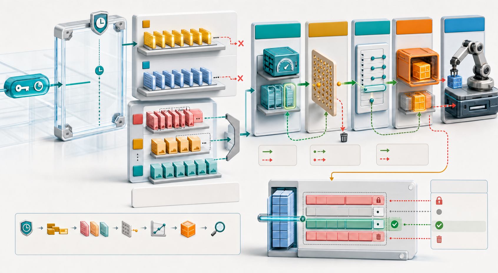
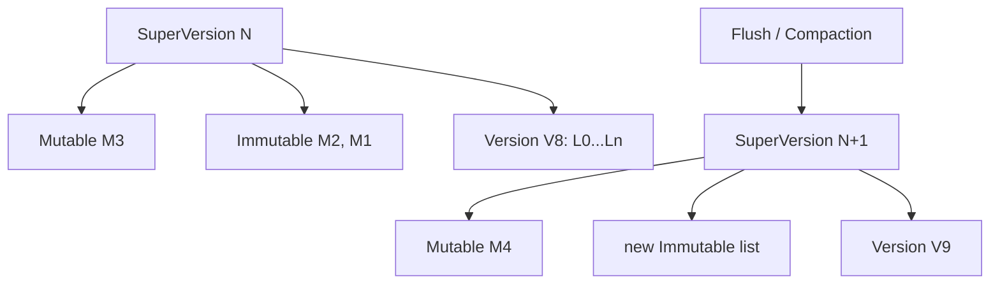
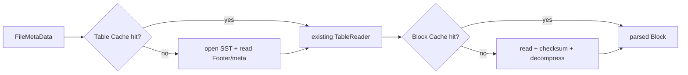
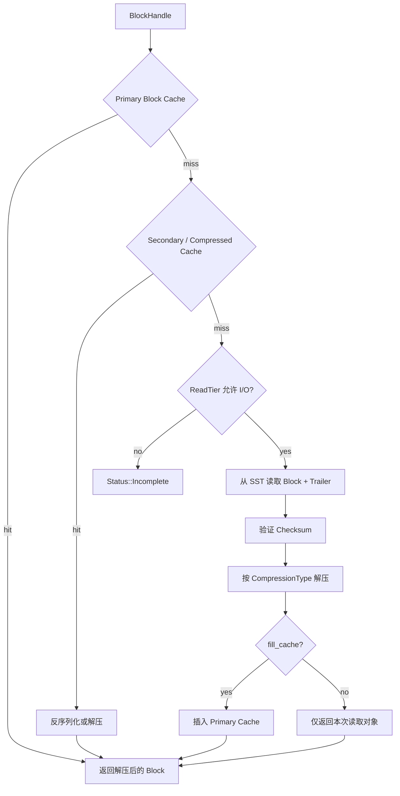

# RocksDB 读取路径（一）：从 Get 到 Data Block 的完整旅程

前九篇沿写入方向，把一条更新从 API、WriteBatch、WAL、MemTable 一直送进了 L0 SST。现在反过来回答用户最直接的问题：

```cpp
rocksdb::Status status = db->Get(read_options, "user:42", &value);
```

这次 `Get()` 到底会查多少层数据、打开哪些文件、读取几个 Block，又如何保证在并发写入和 Compaction 期间返回正确的 Snapshot 版本？



> 图 1：查询先固定结构视图与可见 Sequence，再依次检查 Mutable/Immutable MemTable；未命中时按层选择 SST，经 Table Cache、Filter、Index 和 Block Cache 找到 Data Block，最终排除过新版本和 Tombstone，返回最新可见值。

本篇聚焦单 Key 点查询。它会串起 RocksDB 读取路径上最重要的三个问题：

1. 并发 Flush/Compaction 时，Reader 如何获得稳定的数据结构视图；
2. L0 重叠文件与 L1+ 非重叠文件如何选择；
3. Filter、Index、Table Cache 和 Block Cache 分别省掉什么开销。

## 1. 一次 Get 的全景图

默认 Column Family 上的点查主线如下：

```mermaid
flowchart LR
    A["DB::Get"] --> B["DBImpl::GetImpl"]
    B --> C["引用 SuperVersion"]
    C --> D["确定 Snapshot Sequence"]
    D --> E["构造 LookupKey"]
    E --> F["Mutable MemTable"]
    F -->|"未完成"| G["Immutable MemTables"]
    G -->|"未完成"| H["Version::Get"]
    H --> I["FilePicker"]
    I --> J["TableCache::Get"]
    J --> K["BlockBasedTable::Get"]
    K --> L["Filter"]
    L --> M["Index"]
    M --> N["Block Cache / Storage"]
    N --> O["Data Block Seek"]
    O --> P["GetContext::SaveValue"]
    P --> Q["返回 Value / NotFound / Error"]
```



这不是每次都完整执行。任一上层找到终态后，下层会被跳过：

- Mutable MemTable 命中：完全不访问 SST；
- Bloom Filter 确定不存在：不读取 Index/Data Block；
- Block Cache 命中：不访问存储设备；
- L0 新文件中找到 Put/Delete：不再查更老 L0 与更深层；
- Merge 尚未获得 Base Value：必须继续向旧文件和深层搜索。

读取性能的本质，就是尽早在正确层得到终态，同时避免无效文件与无效 Block I/O。

## 2. SuperVersion：一次读需要的结构快照

一个 Column Family 的数据同时分散在三处：

```text
当前 Mutable MemTable
Immutable MemTable 列表
当前 Version 中的全部 SST Levels
```

如果 Reader 分别读取这三个指针，恰好遇到 MemTable Switch 或 Compaction 安装新 Version，就可能把不同时间点的结构拼在一起。

`SuperVersion` 把它们绑定为一个引用计数对象：

| 字段 | 含义 |
| --- | --- |
| `mem` | 当前 Mutable MemTable |
| `imm` | Immutable MemTableListVersion |
| `current` | 当前 SST Version |
| `mutable_cf_options` | 这代视图对应的可变 CF 配置 |
| `version_number` | 单调递增的结构版本编号 |
| `full_history_ts_low` | User-defined Timestamp 可读历史边界 |
| `seqno_to_time_mapping` | Sequence 到时间的映射 |



旧 SuperVersion 不会因为新版本安装就立刻销毁。持有旧引用的 Reader 可以继续访问旧 MemTable 和旧 SST；最后一个引用释放后，Cleanup 才解除底层对象引用，并让已过期资源进入回收流程。

## 3. SuperVersion 与 Snapshot 解决不同问题

这两个概念经常被混为一谈：

| 机制 | 保证什么 |
| --- | --- |
| SuperVersion | 读取期间，MemTable/Version 等物理结构仍然存在且组合一致 |
| Snapshot Sequence | 只返回指定 Sequence 之前逻辑可见的版本 |

可以把它们理解为：

```text
SuperVersion：我能安全访问哪些容器和文件？
Snapshot：这些容器中哪些版本对我可见？
```

只固定结构而不检查 Sequence，Reader 可能看到查询开始后才写入的新值；只有 Snapshot 而没有结构引用，文件可能在读取途中被 Compaction 替换并删除。

## 4. 为什么先取得 SuperVersion，再取得隐式 Snapshot

没有显式 `ReadOptions::snapshot` 时，`GetImpl()` 的顺序是：

```text
1. GetAndRefSuperVersion(cfd)
2. GetLastPublishedSequence()
```

不能反过来。假设先取得 Sequence 100，再发生一次 Flush/Compaction，旧结构中对 Sequence 100 可见的数据被移动，而 Reader 随后拿到的新旧混合视图，就可能既看不到旧值，也看不到覆盖它的较新值。

先固定 SuperVersion，再读取最后已发布 Sequence，可以保证：这个结构视图至少包含取得 Snapshot 时已经发布的可见数据。

显式 Snapshot 则直接使用 `Snapshot::GetSequenceNumber()`。它还会约束后续 Compaction，阻止清除该 Snapshot 仍需要的旧版本。

## 5. LookupKey 如何定位最新可见版本

点查不会只携带 User Key。RocksDB 构造：

```text
LookupKey =
  varint32(internal_key_size)
  + user_key
  + fixed64((snapshot_sequence << 8) | kValueTypeForSeek)
```

回顾 Internal Key 排序：

```text
User Key 升序
同 User Key 内 Sequence 降序
同 Sequence 内 ValueType 降序
```

假设：

```text
account:7 @ 120 = v3
account:7 @ 115 = Delete
account:7 @ 109 = v2
account:7 @ 101 = v1
```

Snapshot 112 构造的 LookupKey 会跳过 120 和 115，定位到 109。Snapshot 117 则先遇到 115 的 Delete，结果应为 NotFound。

排序规则让“找到第一个不晚于 Snapshot 的版本”转化为一次有序 Seek，而不是扫描该 Key 的所有历史版本。

## 6. 第一站：Mutable MemTable

`sv->mem->Get()` 先检查当前 Mutable MemTable：

1. 空表快速返回；
2. 查询 Range Tombstone 覆盖 Sequence；
3. 检查可选 MemTable Bloom Filter；
4. 在 SkipList 中 Seek LookupKey；
5. 按 Snapshot、ValueType、Merge 和 Range Delete 解释候选记录。

命中 Put、Delete 或可独立完成的 Merge 后，查询结束并记录 `MEMTABLE_HIT`。

Mutable 查询与并发插入同时发生。InlineSkipList 使用 acquire load 读取已通过 release/CAS 发布的节点，节点在 MemTable 生命周期内不删除，因此 Reader 不需要给整张表加读锁。

## 7. 第二站：Immutable MemTables

当前 Mutable 未完成查询时，`sv->imm->Get()` 按**从新到旧**搜索 Immutable MemTables。

```text
newest                     oldest
M4 -> M3 -> M2 -> M1
```

如果 M4 中找到该 Key 的 Delete，就不能继续去 M2 找一个旧 Put 并返回；Delete 本身就是终态。若遇到 Merge Operand，则把 Operand 放入 MergeContext，并继续搜索更老 MemTable 或 SST 中的 Base Value。

SuperVersion 引用保证即使后台 Flush 已把 M2 生成 SST，当前 Reader 仍能安全使用自己看到的 Immutable 列表。它不会同时因为资源被回收而掉进空洞。

## 8. 第三站：`Version::Get()`

MemTable 路径仍没有终态时，`GetImpl()` 调用：

```cpp
sv->current->Get(...);
```

`Version::Get()` 创建一个贯穿全部候选 SST 的 `GetContext`，并使用 `FilePicker` 按 Level 选择文件。

这里“贯穿全部文件”很重要。GetContext 可能在 L0 新文件收集到 Merge Operand，随后在旧 L0 或 L1 找到 Base Value；Range Tombstone 的最高覆盖 Sequence 也必须跨文件累计。

## 9. L0 为什么必须检查多个文件

L0 文件来自 Flush，Key Range 可以重叠：

```text
L0 newest: [a ........ m]
           [f ........ z]
oldest:       [h .. k]
```

查询 `j` 时，三个文件都可能包含候选版本。FilePicker 按 L0 的新旧顺序处理重叠文件，当前实现依据 `epoch_number` 组织最近性；较大的 Epoch 表示更新的 L0 文件。

每个文件先做 User Key Range 判断：

```text
smallest_user_key <= target <= largest_user_key
```

范围不覆盖目标的文件直接跳过。覆盖目标的文件仍可能被 Bloom Filter 排除。

L0 文件数量直接影响点查放大：即使每个 Bloom Filter 很准，文件很多时假阳性和元数据访问也会累积。因此 `level0_file_num_compaction_trigger`、Slowdown/Stop Trigger 不只是写入参数，也在保护读取延迟。

## 10. L1 及更深层为什么通常每层只查一个文件

Compaction 维护 L1+ 同层文件 Key Range 非重叠：

```text
L2: [a..d] [e..k] [l..q] [r..z]
```

FilePicker 使用 `FindFileInRange()` 对文件的 largest Internal Key 做二分查找，找到第一个 `largest >= lookup_key` 的文件，再验证 smallest/largest 边界。

所以典型情况下每个非空 Level 最多检查一个 SST。例外是相邻文件可能在边界共享同一 User Key，例如 Snapshot 或 Merge Operand 让该 Key 的版本无法完全合并到单文件，此时查询可能继续检查同层后续文件。

## 11. FileIndexer：跨 Level 缩小二分范围

若每层都在全部文件上重新二分，已经做过的 Key Range 比较没有被利用。`FileIndexer` 根据 Level N 命中文件与目标 Key 的相对位置，为 Level N+1 提供更窄的左右搜索边界。

这个思想接近 Fractional Cascading：上层搜索结果携带到下一层，减少重复比较。

```text
L1 命中范围 [g..m]
            |
            v
L2 只需在可能与 [g..m] 对应的子区间中二分
```

Key 很长、Comparator 昂贵或 Level 文件很多时，减少比较次数会直接降低 CPU。

## 12. Table Cache 与 Block Cache 不是一回事

读取路径有两种常被统称为“缓存”的结构：

| 缓存 | 保存什么 | 省掉什么 |
| --- | --- | --- |
| Table Cache | 已打开 SST 的 TableReader、文件句柄和解析后的表级状态 | 打开文件、读取 Footer/Properties、构造 Reader |
| Block Cache | Data/Index/Filter 等具体 Block 的内存对象 | 存储 I/O、校验、解压和 Block 解析 |



Table Cache 命中并不代表目标 Data Block 已在内存；Block Cache 命中也依赖已经能定位 BlockHandle 的 TableReader。

## 13. `TableCache::Get()` 的工作

对每个 FilePicker 返回的文件，`Version::Get()` 调用 `TableCache::Get()`：

1. 可选检查 Row Cache；
2. `FindTable()` 在 Table Cache 中查找 TableReader；
3. Miss 时打开 SST 并创建对应 TableReader；
4. 读取并累计文件中的 Range Tombstone 覆盖信息；
5. 调用 `TableReader::Get()`；
6. 将查询过程记录到可选 Row Cache Replay Log。

`max_open_files = -1` 等配置会影响 TableReader 和文件句柄能否长期驻留。Table Cache 太小会导致频繁重新打开 SST，表现为高文件打开次数和元数据 I/O，而 Data Block Cache 指标可能看起来仍然正常。

## 14. 可选 Row Cache 在哪一层

`DBOptions::row_cache` 位于 TableCache 的单文件查询入口之前。它缓存的是某个 File Number、User Key 和 Snapshot 可见边界对应的 `GetContext` 回放日志，而不只是裸 Value。

Cache Key 概念上包含：

```text
row_cache_id + file_number + snapshot-related sequence + user_key
```

命中后，RocksDB 把日志重新播放进当前 GetContext，从而恢复 Found/Delete/Merge 等状态。

Row Cache 不是默认配置。它会引入额外内存与失效语义，常规调优通常先从 Block Cache、Filter 和 L0 文件数开始。

## 15. BlockBasedTable 先问 Filter

进入 `BlockBasedTable::Get()` 后，若没有跳过 Filter，先调用 `FullFilterKeyMayMatch()`：

```text
Filter says no    -> 该 SST 确定不包含 Key，直接返回
Filter says maybe -> 继续查 Index 和 Data Block
```

Bloom/Ribbon Filter 只有两类结果：

- **Definitely not**：可以安全跳过文件；
- **May contain**：可能真的存在，也可能是假阳性。

它绝不会回答“确定存在”。最终存在性必须由 Data Block 中的 Internal Key 决定。

Whole-key Filter 使用去除 Timestamp 的完整 User Key；Prefix Filter 使用 Prefix Extractor 结果。Filter 与当前 Comparator/Prefix 配置不兼容时，RocksDB 必须保守地跳过优化，而不是冒险产生假阴性。

## 16. 为什么某些底层文件会跳过 Filter

`optimize_filters_for_hits=true` 时，如果目标文件位于当前 Bottommost Non-empty Level，并满足 L0 特殊条件，RocksDB 可以跳过 Bloom Filter。

思路是：查询已经穿过所有更高层仍未完成，到最底层时 Key 命中的概率较高；Filter 探测本身也会消耗 CPU，甚至可能需要读取 Filter Partition。

这是面向“多数查询命中”的优化。对大量不存在 Key 的负载，盲目跳过底层 Filter 可能增加 Data Block I/O，必须用实际 Miss 比例测试。

## 17. Index Block 如何定位 Data Block

Filter 返回 May Match 后，Reader 创建 Index Iterator 并 Seek LookupKey。Index Entry 保存：

```text
boundary internal key -> BlockHandle(offset, size)
```

默认 Binary Search Index 通过边界 Key 找到候选 Data Block。Two-level/Partitioned Index 则先在顶层 Index 定位 Index Partition，再从 Partition 定位 Data Block。


Index Key 是块边界，不是每个 User Key 的完整目录。因此定位到 Data Block 后，仍需在块内 Seek 并核对 User Key、Sequence 和 Type。

## 18. Index 和 Filter 一定在 Block Cache 中吗

不一定。默认 `cache_index_and_filter_blocks=false` 时，顶层 Index/Filter 通常随 TableReader 加载并在 Reader 生命周期内驻留，不经过普通 Block Cache 淘汰。

设置为 `true` 后，它们进入 Block Cache；若同时开启 `cache_index_and_filter_blocks_with_high_priority`，会使用 HIGH Priority，尽量晚于 Data Block 淘汰。

Partitioned Index/Filter 的分区 Block 通常仍通过 Block Cache 按需加载，因为全部常驻会失去分区设计节省内存的意义。

这解释了一个常见现象：

```text
Block Cache 中 Data Block 很少
但进程内存仍显著高于 Cache Usage
```

额外内存可能来自 TableReader、Pinned Index/Filter、MemTable、Arena、Iterator 和操作系统页缓存。

## 19. Block Cache Miss 之后发生什么

`RetrieveBlock()` 组织完整缓存层级：



默认 `ReadOptions::fill_cache=true`。大型一次性扫描常设为 false，避免把热点 Data Block 挤出 Cache；点查通常保留默认，让后续相同或邻近 Key 受益。

## 20. Cache Key 为什么不能只用文件名

Block Cache 可能被多个 DB 实例、备份恢复后的数据库或不同 Column Family 共享。若 Cache Key 只使用 `000123.sst + offset`，不同数据库的同名文件可能冲突并返回错误数据。

RocksDB 为每个 SST 构造稳定 Base Key，结合 DB ID、Session ID、原始文件编号等身份信息，再与 Block Offset 派生具体 Block Key。

```text
BlockCacheKey = StableFileIdentity + BlockOffset
```

Cache Key 冲突不是“命中率下降”，而是正确性事故。因此身份唯一性属于 Block Cache 的数据契约。

## 21. Data Block 内如何 Seek

上一篇介绍过 Data Block 使用 Prefix Delta 与 Restart Array：

```text
[Entry delta ...]
[Entry delta ...]
...
[restart offsets]
[num restarts]
```

点查进入块后：

1. 对 Restart Key 做二分查找；
2. 找到不超过 LookupKey 的 Restart 区间；
3. 从完整 Restart Key 开始顺序重建后续 Key；
4. 到达第一个 `internal_key >= lookup_key` 的候选位置；
5. 逐条交给 GetContext，直到得到终态或 User Key 改变。

默认 `block_restart_interval=16`，因此二分后通常只需解码一个较短区间。

如果 Data Block 使用 Binary+Hash Index，Hash 可以更快排除不存在的 User Key，但仍需遵守 Internal Key 与 Snapshot 语义。

## 22. GetContext 是跨层查询状态机

`GetContext` 初始状态通常是 `kNotFound`：

| 状态 | 含义 | 是否终态 |
| --- | --- | --- |
| `kNotFound` | 尚未找到匹配版本 | 否 |
| `kMerge` | 已收集 Operand，还需要 Base 或更多 Operand | 否 |
| `kFound` | 找到 Value 或完成 Merge | 是 |
| `kDeleted` | 最新可见版本为 Delete | 是 |
| `kCorrupt` | Internal Entry 损坏 | 是 |
| `kUnexpectedBlobIndex` | Blob 配置与记录不匹配 | 是 |
| `kMergeOperatorFailed` | Merge Operator 执行失败 | 是 |

同一个 GetContext 在多个 SST 之间持续存在：

```text
L0 file A: Merge operand "x"   -> state = kMerge
L0 file B: Merge operand "y"   -> state = kMerge
L1 file C: Base value "base"   -> FullMerge -> state = kFound
```

如果每个文件都创建独立状态，跨文件 Merge、Range Tombstone 和 Snapshot 处理都会失去上下文。

## 23. `SaveValue()` 如何解释候选 Entry

Data Block Iterator 找到匹配 User Key 后，`GetContext::SaveValue()`：

1. 检查 Entry Sequence 是否对 Snapshot/ReadCallback 可见；
2. 与最高 Range Tombstone 覆盖 Sequence 比较；
3. 按 ValueType 更新状态；
4. 决定是否继续读取更旧版本。

主要分支：

```text
Value       -> kFound，返回 Value
Delete      -> kDeleted，返回 NotFound
Merge       -> 保存 Operand，继续向旧版本搜索
BlobIndex   -> 保存索引，必要时延迟读取 Blob
WideEntity  -> 返回默认列或完整列集合
Corruption  -> kCorrupt
```

返回 `false` 表示已经得到终态；返回 `true` 表示还要继续当前 Block、下一个文件或更深 Level。

## 24. Point Delete 与 Range Delete 的相遇

TableCache 在文件查询时可以创建 Range Tombstone Iterator，计算覆盖目标 User Key 的最高 Tombstone Sequence，并累计到：

```text
max_covering_tombstone_seq
```

当候选 Point Entry 的 Sequence 更低时，它被 Range Tombstone 视为删除。

```text
RangeDelete [a, z) @ 80
Put key=m @ 75

snapshot >= 80 -> Put 被覆盖，NotFound
snapshot = 77  -> Tombstone 不可见，Put 可见
```

Version::Get() 发现后续文件中的所有候选都已经被更高 Sequence Range Tombstone 覆盖时，可以提前停止搜索。

`ReadOptions::ignore_range_deletions` 会跳过这部分处理，但只有数据库从未执行 DeleteRange 时才可能安全；该选项已被标为 Deprecated，不应作为普通性能开关。

## 25. Merge 为什么可能读取多个 Level

Put/Delete 通常在第一个最新可见记录处结束，Merge 则可能需要历史：

```text
Mutable: operand +3
L0:      operand *2
L2:      base 10

FullMerge(10, *2, +3) -> final value
```

MergeContext 保存 Operand，GetContext 维持 `kMerge`，FilePicker 继续搜索旧文件。找到 Base Value 或 Delete 后执行 Full Merge；走到最深层仍无 Base 时，使用 No Base Value 完成 Merge。

大量未折叠 Merge Operand 会放大点查 CPU、文件访问和内存 Pin。应通过 Partial Merge、及时 Compaction 和 Merge Operand 指标控制历史链长度。

## 26. PinnableSlice 如何减少 Value 复制

公开 `Get()` 的字符串重载最终可能复制 Value；内部与部分 API 使用 `PinnableSlice`，允许结果直接引用 MemTable 或 Cache Block 中的内存，并注册 Cleanup 保持底层对象存活。

```text
普通复制：Data Block -> std::string
Pin：      PinnableSlice -> cached block memory
```

若 Value 参与跨文件 Merge，相关 Block 可能需要临时 Pin，直到 Merge 完成。Pin 可以减少复制，但会延长 Cache Entry 的不可淘汰时间；大量长生命周期 Pin 会增加 `BLOCK_CACHE_PINNED_USAGE`。

应用不能在 PinnableSlice Reset/析构后继续使用其数据指针。

## 27. 三种 Read Tier

`ReadOptions::read_tier` 控制允许访问的数据层：

| Read Tier | 行为 |
| --- | --- |
| `kReadAllTier` | 默认，允许 MemTable、Cache 与存储 I/O |
| `kBlockCacheTier` | MemTable 仍可读取；SST 路径只允许 Cache，所需 Block 不在内存时返回 `Incomplete` |
| `kPersistedTier` | Get/MultiGet 跳过未持久化数据，读取持久化层 |

`kBlockCacheTier` 适合“内存层可以读取，但 SST Cache Miss 时宁可快速失败，也不允许尾延迟落到磁盘”的场景。Cache Miss 不应该被误报为 NotFound，因为 Key 可能存在，只是当前不允许 I/O；因此返回 `Status::Incomplete()` 或 Key-May-Exist 语义。

## 28. Checksum 在读取时何时验证

默认 `ReadOptions::verify_checksums=true`。Block Cache Miss 后从 SST 读取 Block Contents 与 5 字节 Trailer，先根据 Footer/格式解释 ChecksumType，再验证 Checksum，最后解压。

顺序是：

```text
read compressed bytes
  -> verify block checksum
  -> decompress
  -> parse restart/index/filter structure
```

Cache 中通常保存已校验并解析的 Block，命中后不需要每次重新计算物理 Checksum。

关闭 Checksum 可以减少少量 CPU，但会降低对介质、DMA、内存或文件系统损坏的检测能力。除非已有明确的端到端完整性方案和基准证据，不建议关闭。

## 29. 可运行实验：观察冷读、热读和 Bloom 排除

下面的程序只写偶数编号 Key，Flush 后重建一个空 Block Cache 并重新打开数据库。它先冷读一个存在 Key，再重复热读同一 Key，最后查询 Key Range 内不存在的奇数 Key。

```cpp
#include <cstdint>
#include <cstdlib>
#include <iomanip>
#include <iostream>
#include <memory>
#include <sstream>
#include <string>

#include "rocksdb/cache.h"
#include "rocksdb/db.h"
#include "rocksdb/filter_policy.h"
#include "rocksdb/options.h"
#include "rocksdb/statistics.h"
#include "rocksdb/table.h"

namespace {

void Check(const rocksdb::Status& status, const char* operation) {
  if (!status.ok()) {
    std::cerr << operation << ": " << status.ToString() << '\n';
    std::exit(1);
  }
}

std::string Key(int number) {
  std::ostringstream out;
  out << "key-" << std::setw(6) << std::setfill('0') << number;
  return out.str();
}

void PrintStats(const std::shared_ptr<rocksdb::Statistics>& stats,
                const char* stage) {
  std::cout
      << stage
      << " data_hit="
      << stats->getTickerCount(rocksdb::BLOCK_CACHE_DATA_HIT)
      << " data_miss="
      << stats->getTickerCount(rocksdb::BLOCK_CACHE_DATA_MISS)
      << " bloom_useful="
      << stats->getTickerCount(rocksdb::BLOOM_FILTER_USEFUL)
      << " l0_hit="
      << stats->getTickerCount(rocksdb::GET_HIT_L0)
      << '\n';
}

}  // namespace

int main() {
  const std::string path = "/tmp/rocksdb-point-read-demo";

  rocksdb::BlockBasedTableOptions table_options;
  table_options.block_size = 4 * 1024;
  table_options.filter_policy.reset(
      rocksdb::NewBloomFilterPolicy(10, false));

  rocksdb::Options options;
  options.create_if_missing = true;
  options.disable_auto_compactions = true;
  options.compression = rocksdb::kNoCompression;
  options.table_factory.reset(
      rocksdb::NewBlockBasedTableFactory(table_options));

  Check(rocksdb::DestroyDB(path, options), "DestroyDB before demo");

  rocksdb::DB* raw_db = nullptr;
  Check(rocksdb::DB::Open(options, path, &raw_db), "DB::Open for write");
  std::unique_ptr<rocksdb::DB> db(raw_db);

  const std::string value(200, 'v');
  for (int i = 0; i < 1000; ++i) {
    Check(db->Put(rocksdb::WriteOptions(), Key(i * 2), value), "DB::Put");
  }

  rocksdb::FlushOptions flush_options;
  flush_options.wait = true;
  Check(db->Flush(flush_options), "DB::Flush");
  db.reset();

  auto stats = rocksdb::CreateDBStatistics();
  table_options.block_cache = rocksdb::NewLRUCache(8 * 1024 * 1024);
  options.statistics = stats;
  options.table_factory.reset(
      rocksdb::NewBlockBasedTableFactory(table_options));

  raw_db = nullptr;
  Check(rocksdb::DB::Open(options, path, &raw_db), "DB::Open for read");
  db.reset(raw_db);

  std::string result;
  Check(db->Get(rocksdb::ReadOptions(), Key(500), &result),
        "cold Get existing");
  PrintStats(stats, "after cold hit");

  Check(db->Get(rocksdb::ReadOptions(), Key(500), &result),
        "warm Get existing");
  PrintStats(stats, "after warm hit");

  rocksdb::Status missing =
      db->Get(rocksdb::ReadOptions(), Key(501), &result);
  if (!missing.IsNotFound()) {
    Check(missing, "Get missing odd key");
  }
  PrintStats(stats, "after bloom miss");

  rocksdb::ReadOptions cache_only;
  cache_only.read_tier = rocksdb::kBlockCacheTier;
  rocksdb::Status cache_status = db->Get(cache_only, Key(1900), &result);
  std::cout << "cache-only status=" << cache_status.ToString() << '\n';

  db.reset();
  Check(rocksdb::DestroyDB(path, options), "DestroyDB after demo");
  return 0;
}
```

在安装 RocksDB 开发库的 Linux 环境中编译：

```bash
g++ -std=c++17 -O2 point_read_cache.cc -o point_read_cache \
  $(pkg-config --cflags --libs rocksdb)
./point_read_cache
```

预期现象：

- 第一次读取 `key-000500` 增加 `BLOCK_CACHE_DATA_MISS`；
- 第二次读取同一 Key 增加 `BLOCK_CACHE_DATA_HIT`；
- `key-000501` 位于 SST Key Range 内但从未写入，Bloom 大概率直接排除并增加 `BLOOM_FILTER_USEFUL`；
- Cache-only 读取另一个未预热 Block 时通常返回 `Incomplete`；
- Bloom 是概率结构，极小概率假阳性会让缺失 Key 继续读取 Data Block，但结果仍为 NotFound。

不要把具体计数写成硬断言。Filter 假阳性、Block 边界、Table Open 预取和配置版本都可能改变访问次数，正确的断言应围绕 Status 与 Value。

## 30. 如何判断瓶颈在哪一层

| 观测 | 更可能的瓶颈 |
| --- | --- |
| `MEMTABLE_HIT` 高且延迟仍高 | Comparator、热点 Key 多版本、Merge、锁外 CPU |
| Table Cache 反复 Miss | `max_open_files`、文件数过多、Table Cache 容量 |
| `BLOOM_FILTER_USEFUL` 高 | Filter 有效减少文件/Block 读取 |
| `BLOOM_FILTER_FULL_POSITIVE` 高且大量 NotFound | Filter Bits 不足或文件太多 |
| `BLOCK_CACHE_DATA_MISS` 高 | Cache 太小、访问集过大、一次性扫描污染 |
| Cache Hit 高但延迟高 | Cache 竞争、解码、Comparator、Merge 或 CPU 调度 |
| `GET_HIT_L0` 高且文件多 | L0 积压导致读放大 |
| `READ_BLOCK_GET_MICROS` 高 | 设备、文件系统、Checksum/解压或 I/O 排队 |
| Pinned Usage 高 | 长 Iterator、Merge、PinnableSlice 生命周期过长 |

必须结合延迟分位数观察。平均 Cache Hit Rate 很高，仍可能有少量冷读主导 P99/P999。

## 31. 常用读取配置及权衡

### 31.1 Block Cache 容量

首先估算热点 Data Block、Index/Filter 策略和并发工作集。Cache 过小会抖动，过大则挤压 MemTable、文件系统页缓存和应用内存。

### 31.2 LRUCache 与 HyperClockCache

高并发下 Cache 元数据竞争可能成为 CPU 热点。HyperClockCache 使用更适合高并发的结构，但需要合理估算 Entry Charge；选择应以线程数、Block 大小与命中率基准为准。

### 31.3 Filter Bits

更多 Bits/Key 降低假阳性，但增加 SST 和 Cache 内存。L0 文件很多时，即便每个 Filter 只有 1% 假阳性，累积额外 I/O 仍可能可观。

### 31.4 `fill_cache`

点查保持 true；一次性全量扫描常设 false。混合负载可以为后台扫描单独使用 ReadOptions，避免污染在线热点。

### 31.5 `cache_index_and_filter_blocks`

开启后，元数据与 Data Block 共享可控 Cache，便于统一预算；关闭时顶层元数据随 TableReader 驻留，访问稳定但更难从普通 Cache Usage 看出总内存。

### 31.6 `verify_checksums`

默认 true。只有在有明确端到端校验、可接受风险并且实测 Checksum 成为瓶颈时才考虑关闭。

### 31.7 Snapshot 生命周期

长期 Snapshot 会阻止 Compaction 清理仍需可见的旧版本，增加空间与读放大。长期 Iterator 还会 Pin SuperVersion 和相关文件。应监控 `rocksdb.oldest-snapshot-time`。

## 32. 常见误区

### 误区一：Get 只查一个最新 SST

它先查 Mutable/Immutable；L0 可能查多个重叠文件；L1+ 通常每层一个候选，Merge 和边界版本可能继续跨文件。

### 误区二：SuperVersion 就是 Snapshot

SuperVersion 固定结构生命周期，Snapshot Sequence 过滤逻辑版本。两者共同提供一致读取。

### 误区三：Bloom 返回 true 就说明 Key 存在

true 只表示 May Match。Data Block 才能确认存在、删除或 Snapshot 不可见。

### 误区四：Table Cache Hit 就不会读盘

它只表示 TableReader 已打开。目标 Data Block 仍可能不在 Block Cache，需要存储 I/O。

### 误区五：Block Cache Hit Rate 越高越好

一次性扫描全部填入 Cache 可以制造大量插入和短暂命中，却驱逐真正热点。命中率必须与业务延迟和工作集一起解释。

### 误区六：Cache-only Miss 等于 NotFound

`kBlockCacheTier` 下没有所需 Block 只说明当前禁止 I/O，结果应为 Incomplete/May Exist，而不是断言 Key 不存在。

### 误区七：Delete 找到旧 Put 后还可以返回旧值

最新可见 Delete 是终态。继续返回更旧 Put 会破坏数据库语义。

### 误区八：显式 Snapshot 只是保存一个数字，没有成本

它会约束 Compaction 的版本清理。Snapshot 越老、存活越久，越多历史版本必须保留。

### 误区九：关闭 Checksum 只影响错误日志

它会减少读取链路中的数据损坏检测。潜在结果可能是把损坏字节交给上层解析，而不是更早报告 Corruption。

### 误区十：增加 Block Cache 能解决所有读放大

L0 文件过多、Merge 链过长、昂贵 Comparator、旧 Snapshot 和 Range Tombstone 都可能在纯 CPU/元数据层放大读取。

## 33. 源码阅读顺序

建议沿“视图 -> 内存 -> 文件选择 -> 表读取 -> 块读取 -> 语义判定”阅读：

```text
db/db_impl/db_impl.cc
  -> db/column_family.h / db/column_family.cc
  -> db/memtable.cc / db/memtable_list.cc
  -> db/version_set.cc
  -> db/file_indexer.h / db/file_indexer.cc
  -> db/table_cache.cc
  -> table/block_based/block_based_table_reader.cc
  -> table/block_based/block_cache.cc
  -> table/block_based/block.cc
  -> table/get_context.cc
```

重点入口：

- [`db/db_impl/db_impl.cc`](../db/db_impl/db_impl.cc)：`GetImpl()`、SuperVersion 与 Snapshot 顺序；
- [`db/column_family.h`](../db/column_family.h)：SuperVersion 结构与引用；
- [`db/memtable.cc`](../db/memtable.cc)：Mutable MemTable Lookup；
- [`db/memtable_list.cc`](../db/memtable_list.cc)：Immutable Lookup；
- [`db/version_set.cc`](../db/version_set.cc)：`Version::Get()` 与 FilePicker；
- [`db/file_indexer.cc`](../db/file_indexer.cc)：跨 Level 搜索范围缩小；
- [`db/table_cache.cc`](../db/table_cache.cc)：TableReader 与可选 Row Cache；
- [`table/block_based/block_based_table_reader.cc`](../table/block_based/block_based_table_reader.cc)：Filter、Index、Block 获取与 Get；
- [`table/block_based/block_cache.cc`](../table/block_based/block_cache.cc)：Block Cache 访问；
- [`table/block_based/block.cc`](../table/block_based/block.cc)：Data Block Iterator 与 Restart Seek；
- [`table/get_context.cc`](../table/get_context.cc)：状态机、Snapshot、Delete、Merge 与 Blob；
- [`include/rocksdb/options.h`](../include/rocksdb/options.h)：ReadOptions；
- [`include/rocksdb/table.h`](../include/rocksdb/table.h)：BlockBasedTable 读取配置；
- [`docs/components/read_flow/01_point_lookup.md`](../docs/components/read_flow/01_point_lookup.md)：仓库内点查专题；
- [`docs/components/read_flow/05_sst_file_lookup.md`](../docs/components/read_flow/05_sst_file_lookup.md)：SST 文件选择；
- [`docs/components/read_flow/06_block_cache.md`](../docs/components/read_flow/06_block_cache.md)：Block Cache 专题。

## 34. 本篇小结

一次点查的核心主线可以概括为：

```text
结构一致性：引用 SuperVersion，固定 mem + imm + current Version
逻辑可见性：显式 Snapshot 或 LastPublishedSequence
查找键：User Key + Snapshot Sequence + kValueTypeForSeek
内存顺序：Mutable -> Immutable newest-to-oldest
文件顺序：L0 检查重叠文件；L1+ 二分定位每层候选
跨层状态：GetContext 保存 NotFound/Found/Deleted/Merge 等状态
文件对象：Table Cache 保存 TableReader 与文件打开状态
文件过滤：Bloom/Ribbon 只能确定不存在
块定位：Index Key 映射 Data BlockHandle
块获取：Primary Cache -> Secondary Cache -> SST I/O
物理校验：Checksum 后解压与解析
块内搜索：Restart 二分 + 区间顺序解码
最终语义：Snapshot + ValueType + Range Delete + Merge
结果生命周期：复制到字符串或由 PinnableSlice Pin 底层内存
```

RocksDB 点查不是从“一个大索引”直接取值，而是通过稳定视图、版本顺序、分层文件范围、概率过滤和块级缓存逐步缩小搜索空间。每一层都只做自己擅长的判断：SuperVersion 管结构，Snapshot 管可见性，FilePicker 管候选文件，Filter 管排除，Index 管定位，GetContext 管最终语义。

下一篇将扩展到 MultiGet：理解批量 Key 如何共享 SuperVersion、按文件和 Block 分组、合并重复 I/O，并利用异步读取降低大量冷 Key 的总延迟。

## 参考入口

- [`db/db_impl/db_impl.cc`](../db/db_impl/db_impl.cc)：点查入口；
- [`db/version_set.cc`](../db/version_set.cc)：Level 文件选择与跨文件状态；
- [`db/table_cache.cc`](../db/table_cache.cc)：Table Cache；
- [`table/block_based/block_based_table_reader.cc`](../table/block_based/block_based_table_reader.cc)：BlockBasedTable 查询；
- [`table/get_context.cc`](../table/get_context.cc)：候选版本解释；
- [`include/rocksdb/options.h`](../include/rocksdb/options.h)：ReadOptions 与 ReadTier；
- [`include/rocksdb/table.h`](../include/rocksdb/table.h)：Filter、Index 与 Cache 配置。
