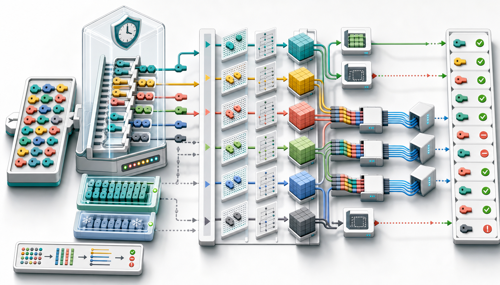
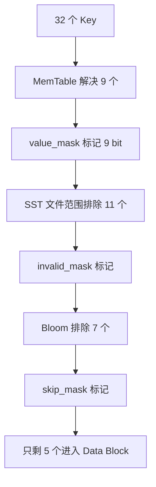
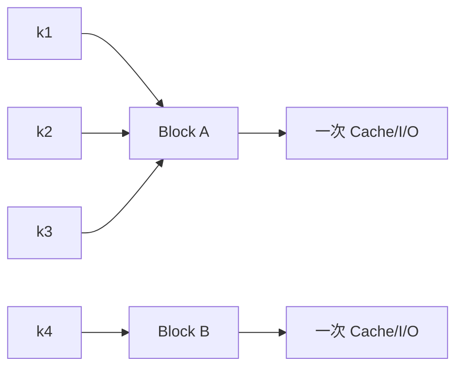

# RocksDB 读取路径（二）：MultiGet 批处理、Block 复用与异步 I/O

上一篇把一次 `Get()` 从 SuperVersion、MemTable、FilePicker 一直追踪到了 Data Block。现在考虑一个常见场景：服务端一次请求需要读取用户资料、权限、配置和多个业务对象，总共有几十个 Key。

最直接的写法是：

```cpp
for (const auto& key : keys) {
  db->Get(read_options, key, &values[key]);
}
```

它语义正确，却浪费了 Key 之间可以共享的大量工作。每次 Get 都要独立取得读取视图、检查 MemTable、路由文件、探测 Filter/Index、查询 Block Cache，并可能发起单独 I/O。

`MultiGet()` 的价值不只是减少 API 调用次数，而是把一批 Key 作为一个整体穿过读取层级，让 RocksDB 看见并利用它们的相关性。



> 图 1：批量 Key 在同一 Snapshot 下排序分组；内存层已解决的 Key 提前退出，剩余 Key 共享 Filter/Index，映射到相同 Data Block 的请求只取块一次，Cache Miss 被合并为较少的并行存储请求，最终按原输入位置回填独立结果。

## 1. MultiGet 不是 Get 的简单循环

两种方式的逻辑结果可以相同，但内部执行模型不同：

| 工作 | N 次 Get | 一次 MultiGet |
| --- | --- | --- |
| SuperVersion | 通常每次取得/归还 | 每个批次与 CF 共享 |
| Snapshot Sequence | 每次隐式确定 | 批次共享一致边界 |
| Key 排序 | 不可见全局顺序 | 按 CF 与 User Key 排序 |
| MemTable | 每 Key 独立 Seek | 批量接口处理未完成 Key |
| Bloom Filter | 每 Key 单独探测 | 一批 Key 一次进入 Filter Reader |
| Index | 多次随机 Seek | 排序后可顺序推进与复用 |
| 同一 Data Block | 重复查 Cache/建 Iterator | BlockHandle 去重、共享块 |
| Cache Miss I/O | 多次单独读取 | MultiRead、合并相邻读取 |
| 跨文件并行 | 调用者自行实现 | 条件满足时内部协程/异步 I/O |

MultiGet 的优化空间来自一个事实：**Key 越接近、越集中在少量 SST 和 Block 中，可共享的工作越多。**

## 2. API 语义：结果始终与输入位置对齐

默认 Column Family 的便捷接口：

```cpp
std::vector<rocksdb::Slice> keys = {"a", "b", "c"};
std::vector<std::string> values;

std::vector<rocksdb::Status> statuses =
    db->MultiGet(read_options, keys, &values);
```

返回满足：

```text
statuses.size() == keys.size()
values.size()   == keys.size()
```

`statuses[i]` 和 `values[i]` 永远对应 `keys[i]`。RocksDB 可以在内部排序，但不会把结果按排序后顺序交给调用者。

每个 Key 都有独立 Status：

```text
OK
NotFound
Incomplete
Corruption
IOError
MergeOperatorFailed
...
```

因此不能只检查一个“整个 MultiGet 是否成功”的总 Status。

## 3. 重复 Key 不会被自动去重

公开 API 明确说明，输入 Key 不会去重：

```text
input:  [a, b, a]
output: [value(a), value(b), value(a)]
```

内部排序和 Block 复用仍可能减少重复 I/O，但调用语义保留三个独立位置。错误或 ReadCallback 等特殊条件下，重复位置甚至可能得到不同 Status。

如果业务允许合并重复请求，可以在调用前去重并建立原位置映射；这属于应用语义，RocksDB 不擅自替调用者决定。

## 4. 一次 MultiGet 的全景图


每经过一层，已经得到终态的 Key 会被标记 Done，后续层只处理剩余 Key。

## 5. 第一步：整理 KeyContext

每个输入 Key 对应一个内部 `KeyContext`，主要保存：

| 字段 | 用途 |
| --- | --- |
| User Key / LookupKey / Internal Key | 排序与查找 |
| ColumnFamilyHandle | 分组与 Comparator 选择 |
| Status / Value / Columns / Timestamp | 独立输出 |
| MergeContext | 跨层收集 Merge Operand |
| `max_covering_tombstone_seq` | Range Delete 覆盖边界 |
| `key_exists` / `is_blob_index` | 后处理状态 |
| GetContext | SST 内版本状态机 |

调用者的输入数组不会被重排。RocksDB 排序的是 KeyContext 指针，因此最终仍能把结果写回原始 `values[i]` 和 `statuses[i]`。

## 6. 为什么先按 Column Family 和 Key 排序

排序键概念上是：

```text
(column_family_id, user_key comparator order)
```

它带来四个收益：

1. 同一 CF 的 Key 可以共享 Comparator、SuperVersion 和 Version；
2. MemTable SkipList 可以按顺序 Seek，减少从头查找；
3. FilePicker 可以把相邻 Key 连续映射到少量 SST；
4. Index Iterator 可以向前推进，相邻 Key 更容易落入同一 Data Block。

若使用底层 C 风格批量接口，并且调用者能保证 Key 已按要求排序，可以设置 `sorted_input=true`，省掉内部排序。错误地声明已排序会破坏查找前提，不能把它当作无条件性能开关。

## 7. 批次为什么最多 32 个 Key

`MultiGetContext::MAX_BATCH_SIZE` 当前为 32。更大的 API 请求会拆成多个内部批次。

核心原因是位掩码：

```cpp
using Mask = uint64_t;
```

一批 Key 的完成和过滤状态可以放进 CPU 寄存器：

```text
bit 0 -> key 0
bit 1 -> key 1
...
bit 31 -> key 31
```

源码注释还指出，基准测试中超过该规模的边际收益很小，而更大批次会增加栈上辅助数组、排序与状态管理开销。

应用仍可以一次传入数百或数千 Key；32 只是内部流水线批次，不是公开 API 的总 Key 上限。

## 8. 三种 Mask 如何让 Key 自动退出

`MultiGetContext::Range` 通过三种掩码描述当前子集：

| Mask | 作用域 | 含义 |
| --- | --- | --- |
| `value_mask_` | 整个 MultiGetContext 共享 | 该 Key 已得到最终结果 |
| `skip_mask_` | 当前 Range | 当前阶段跳过，例如 Bloom 确定不存在 |
| `invalid_mask_` | 当前 Range | Key 不属于这个文件或子范围 |

Range Iterator 每次递增时自动跳过：

```text
value_mask | skip_mask | invalid_mask
```



这比反复创建“剩余 Key Vector”更轻量：没有移动 KeyContext，也没有层层分配新数组。

## 9. `Range` 是视图，不是数据副本

Range 记录起止下标和掩码，可从原 Range 派生子 Range。FilePickerMultiGet 为某个 SST 构造子 Range 时，只改变哪些 bit 有效，而不是复制 Key 或输出对象。

它支持：

- 取一段连续 Key；
- 合并不相邻子范围，并用 `invalid_mask_` 表示中间空洞；
- 从当前 Range 中减去已交给其他文件的 Key；
- 把某阶段的 Skip 结果合并回来。

这种设计使同一批 Key 可以在 MemTable、Version、TableCache 和 BlockBasedTable 之间传递，而各层只附加本层的筛选状态。

## 10. 共享 SuperVersion 与 Snapshot

单 Column Family 批次只需取得一次 SuperVersion，并使用一个 Snapshot Sequence 构造所有 LookupKey。

```text
batch snapshot = 120

k1 -> LookupKey(k1, 120)
k2 -> LookupKey(k2, 120)
k3 -> LookupKey(k3, 120)
```

这既减少引用计数/线程本地 SuperVersion 操作，也保证批次中的 Key 看到相同逻辑时间点。

和单 Key Get 一样，隐式 Snapshot 必须与 SuperVersion 获取顺序协调，防止 MemTable Switch/Flush 在中间造成结构视图空洞。

## 11. 跨 Column Family 的一致视图

MultiGet 允许每个 Key 指定不同 ColumnFamilyHandle。`MultiCFSnapshot` 协调多个 CF 的 SuperVersion 与 Snapshot：

- 尝试在不长期持有 DB Mutex 的情况下取得兼容视图；
- 若并发 MemTable Switch 让视图不稳定，会重试；
- 重复冲突到最后一次尝试时，可持有 Mutex 完成；
- `kPersistedTier` 需要更严格冻结跨 CF 的持久化视图。

如果业务要求一个长期、明确的跨 Key/跨 CF 时间点，应使用显式 Snapshot，而不是假设两个独立 MultiGet 调用天然处于同一时刻。

## 12. Mutable 与 Immutable 的批量查找

排序后的 Range 先进入：

```text
mem->MultiGet(range)
imm->MultiGet(range)
```

每个 Key 仍遵守单点查询语义：

- 最新可见 Put -> 完成；
- Delete -> NotFound，完成；
- Merge -> 保存 Operand，继续旧层；
- Range Tombstone -> 更新覆盖 Sequence；
- 未找到 -> 继续。

某个 Key 完成时调用 `MarkKeyDone()`，全局 `value_mask_` 对所有后续 Range 立即可见。若全部 Key 在 MemTable 解决，SST 路径完全跳过。

## 13. FilePickerMultiGet 如何批量路由 SST

单点 `FilePicker` 每次返回一个候选文件；`FilePickerMultiGet` 返回：

```text
当前 SST + 与其 Key Range 相交的 MultiGetRange
```

例如：

```text
sorted keys: b, c, h, k, p, y

L2 files:
[a..f]  -> b, c
[g..m]  -> h, k
[n..t]  -> p
[u..z]  -> y
```

每个文件一次接收多个 Key，而不是每个 Key 独立执行文件二分和 TableCache 查找。

## 14. L0 批处理仍必须保持新旧顺序

L0 文件 Key Range 重叠，同一个 Key 可能出现在多个文件：

```text
new L0 A: [a..m]
old L0 B: [f..z]
```

Key `h` 必须先查 A，再决定是否需要查 B。Delete 和 Merge 都依赖这个顺序。

因此，即使启用了异步 I/O，L0 也不能把所有重叠文件任意并发后按完成时间解释结果。批处理可以减少文件内重复工作，但逻辑新旧顺序必须保留。

L1+ 文件同层通常不重叠，不同 Key 映射到不同文件时更容易安全并行。

## 15. Bloom Filter 的批量探测

单 Get 调用 `FullFilterKeyMayMatch()`；MultiGet 使用 `FullFilterKeysMayMatch()`，把当前 Range 一次交给 Filter Reader。

```text
input range: k1 k2 k3 k4 k5
filter:      ?  no ?  no ?
remaining:   k1    k3    k5
```

确定不存在的 Key 在当前文件 Range 上设置 `skip_mask_`，无需为它们读取 Index/Data Block。

批量探测可以：

- 只加载一次 Filter Block/Partition；
- 在连续内存上执行多个 Hash；
- 减少虚函数和调用边界；
- 为后续异步文件读取提前缩小 Key 集合。

Bloom 返回 May Match 仍然不代表存在；假阳性只会让该 Key 多走后续路径。

## 16. 排序 Key 如何复用 Index Seek

Key 已按 Comparator 顺序排列。Index Iterator 查完 `k1` 后，`k2 >= k1`，通常可以从当前位置继续，而不必每次从 Index 开头完整 Seek。

```text
Index blocks:
B0 [a..f]
B1 [g..m]
B2 [n..t]

keys: b, c, d -> 都指向 B0
      h, k    -> 都指向 B1
```

排序也让相同 BlockHandle 连续出现，为下一步去重创造条件。

## 17. 同一 Data Block 只获取一次

BlockBasedTable MultiGet 比较相邻 Key 的 BlockHandle Offset。若当前 Offset 与前一个相同：

```text
k1 -> data block offset 4096
k2 -> data block offset 4096
k3 -> data block offset 8192
```

它用 Null BlockHandle 标记 `k2` 复用前块，并在 `reused_mask` 设置对应 bit。后续只为 Offset 4096 做一次 Cache Lookup 或 I/O，多个 Key 共用解析后的 Block Iterator/资源引用。



Key 局部性越好，`N 个 Key -> 少量 Distinct Block` 的压缩比越高。

## 18. SharedCleanablePtr 减少 Cache 引用竞争

多个 Key 共用同一 Cache Block 时，如果每个 Key 都单独对 Cache Handle 执行 Ref/Release，会在共享计数或 Cache 元数据上产生额外竞争。

MultiGet 使用共享 Cleanable，让复用同一 Block 的多个结果共同持有一次生命周期管理。最后一个使用者结束时再释放 Cache Entry。

这类优化不会改变 Value 内容，却能减少高并发下的原子操作和 Cache 锁压力。

## 19. Cache Lookup 也可以批量异步发起

对唯一 BlockHandle，读取路径可以先连续调用：

```text
StartAsyncLookupFull(block 1)
StartAsyncLookupFull(block 2)
StartAsyncLookupFull(block 3)
...
WaitAll()
```

这让 Primary/Secondary Cache 的异步实现并行查找，避免“查一个、等待、再查下一个”的串行依赖。

Cache Hit 立即得到 Block；Miss 则累计到后续存储读取阶段。只有 Distinct Block 参与，已标记复用的 Key 不发起重复 Cache Probe。

## 20. `RetrieveMultipleBlocks()` 如何减少系统调用

Cache Miss 后，MultiGet 不会机械地为每个 Block 调一次 `pread()`。它先收集 BlockHandle 与读取长度，再构造批量请求。

物理相邻且满足合并条件的 Block 可以共享一段连续读取：

```text
file offsets:
[Block A][trailer][Block B][trailer]       [Block C]
|----------- one read region --------|    |-- another --|
```

同步路径调用 FileSystem `MultiRead()` 一次提交多个 `FSReadRequest`；异步路径可调用 `MultiReadAsync()`。

收益包括：

- 减少用户态到内核态切换；
- 提高 NVMe/io_uring 队列深度；
- 让文件系统或设备合并邻近访问；
- 在多个读取延迟之间形成重叠。

I/O 数量取决于 Distinct Block 和物理分布，而不是简单等于 Key 数量。

## 21. 8 KiB 栈缓冲的作用

多块读取需要暂存压缩字节。当前实现定义 `kMultiGetReadStackBufSize = 8192`：

- 总读取数据较小时使用栈缓冲；
- 超过阈值时再分配堆缓冲；
- FileSystem 能直接提供 Scratch 时可使用其能力。

这避免小批量 MultiGet 每次都进行 Heap Allocation。它是热路径上的固定成本优化，不改变外部 Batch 上限或 Value 大小。

## 22. 异步 I/O 不是只设置一个布尔值

相关选项：

```cpp
read_options.async_io = true;
read_options.optimize_multiget_for_io = true;  // 默认 true
```

真正使用异步路径还取决于：

- RocksDB 是否以协程支持编译；
- FileSystem 是否声明 `kAsyncIO`；
- 平台是否实现 `ReadAsync/Poll`；
- 当前 Level 是否允许并行处理；
- Row Cache 等功能是否与 Filter-then-launch 路径兼容；
- Key 是否真的分散到多个需要 I/O 的文件/Block。

条件不满足时应安全回退到同步路径，结果语义不变。不能因为设置了 `async_io=true` 就断言底层一定使用 io_uring。

## 23. 非 L0 文件如何并行

当协程与异步 I/O 可用时，MultiGet 可以先对候选文件执行 Filter，再为同一 Level 中互不依赖的文件启动协程，使用类似 `collectAllRange` 的方式等待。

```text
L2 file A <- keys a,b  ---- async ----\
L2 file B <- keys m,n  ---- async -----+--> collect results
L2 file C <- keys x,y  ---- async ----/
```

L0 的重叠文件需要按新旧顺序解释，通常不会使用这类同层无序并行。

异步的目标是缩短一批 Key 的墙钟时间，不一定减少总 I/O 字节；并行度过高还可能增加 CPU、设备排队和尾延迟。

## 24. 每个 Key 仍有独立 GetContext

批量基础设施共享路由与 I/O，但不会把不同 Key 的版本语义混在一起。每个 KeyContext 有自己的：

```text
Status
GetContext state
MergeContext
max_covering_tombstone_seq
Value / Columns / Timestamp
Blob state
```

例如：

```text
k1 -> Found
k2 -> Deleted
k3 -> MergeInProgress，需要下一层
k4 -> Bloom skip 当前文件
k5 -> Corruption
```

Range Mask 决定哪些 Key 继续，但状态判定仍逐 Key 独立。

## 25. Merge 与 Range Delete 为什么让批处理更复杂

普通 Put/NotFound 容易批量化；Merge 和 Range Tombstone 需要跨层状态：

- 某个 Key 在 Mutable 收集到 Operand 后，必须继续去 Immutable/SST 找 Base；
- Range Tombstone 覆盖 Sequence 要与每个 Key 的 Point Entry Sequence 比较；
- 同一 SST 可能对一批 Key 产生不同 Tombstone 覆盖结果；
- 完成一个 Key 不能让其他 Key 停止。

因此 MultiGet 不能简单执行“找到任意匹配 Entry 就填 Value”。位掩码只是调度工具，最终语义仍由每个 GetContext 完成。

## 26. Value Size Soft Limit

`ReadOptions::value_size_soft_limit` 可以限制一次 MultiGet 累积返回的 Value 大小。超过边界后，未完成 Key 可返回 `Aborted`，避免单个异常批次占用过多内存。

它是 Soft Limit：读取和解析以批次推进，实际已取得字节可能略过边界。应用仍应限制请求 Key 数、Value 业务上限和响应体大小。

这个选项对单 Key Get 没有同样的批量累计含义。

## 27. `kBlockCacheTier` 下的批量行为

和单 Get 一样：

- MemTable 仍可读取；
- SST 所需 Block 若在 Cache 中，可以完成；
- Cache Miss 时禁止磁盘 I/O，对应 Key 返回 Incomplete/May Exist；
- 其他 Key 可以独立成功或 NotFound。

所以 MultiGet 可能得到混合 Status：

```text
[OK, Incomplete, NotFound, OK]
```

调用者必须逐项处理，不能把第一项或最后一项代表整批结果。

## 28. MultiGetEntity 与 Wide Column

`MultiGetEntity()` 使用同一批处理基础设施，但输出为 `PinnableWideColumns`。普通 Value 会映射为默认匿名列；Wide Column Entity 则返回全部列。

Attribute Group 版本还能跨 Column Family 读取多个实体。共享 Snapshot、FilePicker、Filter、Index 和 Block 复用原则保持一致，差别主要在 Value 解析和输出结构。

## 29. 可运行实验：观察批次统计和热读复用

下面的程序只写偶数 Key，Flush 后用一个新 Block Cache 重新打开数据库。批次包含相邻 Key、分散 Key、缺失 Key和重复 Key，并连续执行两次。

```cpp
#include <cstdlib>
#include <iomanip>
#include <iostream>
#include <memory>
#include <sstream>
#include <string>
#include <vector>

#include "rocksdb/cache.h"
#include "rocksdb/db.h"
#include "rocksdb/filter_policy.h"
#include "rocksdb/options.h"
#include "rocksdb/statistics.h"
#include "rocksdb/table.h"

namespace {

void Check(const rocksdb::Status& status, const char* operation) {
  if (!status.ok()) {
    std::cerr << operation << ": " << status.ToString() << '\n';
    std::exit(1);
  }
}

std::string Key(int number) {
  std::ostringstream out;
  out << "key-" << std::setw(6) << std::setfill('0') << number;
  return out.str();
}

void PrintStats(const std::shared_ptr<rocksdb::Statistics>& stats,
                const char* stage) {
  std::cout
      << stage
      << " calls="
      << stats->getTickerCount(rocksdb::NUMBER_MULTIGET_CALLS)
      << " keys="
      << stats->getTickerCount(rocksdb::NUMBER_MULTIGET_KEYS_READ)
      << " found="
      << stats->getTickerCount(rocksdb::NUMBER_MULTIGET_KEYS_FOUND)
      << " data_hit="
      << stats->getTickerCount(rocksdb::BLOCK_CACHE_DATA_HIT)
      << " data_miss="
      << stats->getTickerCount(rocksdb::BLOCK_CACHE_DATA_MISS)
      << " bloom_useful="
      << stats->getTickerCount(rocksdb::BLOOM_FILTER_USEFUL)
      << '\n';
}

void RunBatch(rocksdb::DB* db,
              const std::shared_ptr<rocksdb::Statistics>& stats,
              const std::vector<std::string>& key_storage,
              const char* stage) {
  std::vector<rocksdb::Slice> keys;
  keys.reserve(key_storage.size());
  for (const auto& key : key_storage) {
    keys.emplace_back(key);
  }

  rocksdb::ReadOptions read_options;
  read_options.async_io = true;
  read_options.optimize_multiget_for_io = true;

  std::vector<std::string> values;
  std::vector<rocksdb::Status> statuses =
      db->MultiGet(read_options, keys, &values);

  for (size_t i = 0; i < keys.size(); ++i) {
    std::cout << i << " key=" << key_storage[i]
              << " status=" << statuses[i].ToString()
              << " bytes=" << values[i].size() << '\n';
  }
  PrintStats(stats, stage);
}

}  // namespace

int main() {
  const std::string path = "/tmp/rocksdb-multiget-demo";

  rocksdb::BlockBasedTableOptions table_options;
  table_options.block_size = 4 * 1024;
  table_options.filter_policy.reset(
      rocksdb::NewBloomFilterPolicy(10, false));

  rocksdb::Options options;
  options.create_if_missing = true;
  options.disable_auto_compactions = true;
  options.compression = rocksdb::kNoCompression;
  options.table_factory.reset(
      rocksdb::NewBlockBasedTableFactory(table_options));

  Check(rocksdb::DestroyDB(path, options), "DestroyDB before demo");

  rocksdb::DB* raw_db = nullptr;
  Check(rocksdb::DB::Open(options, path, &raw_db), "DB::Open for write");
  std::unique_ptr<rocksdb::DB> db(raw_db);

  const std::string value(200, 'v');
  for (int i = 0; i < 1000; ++i) {
    Check(db->Put(rocksdb::WriteOptions(), Key(i * 2), value), "DB::Put");
  }
  rocksdb::FlushOptions flush_options;
  flush_options.wait = true;
  Check(db->Flush(flush_options), "DB::Flush");
  db.reset();

  auto stats = rocksdb::CreateDBStatistics();
  table_options.block_cache = rocksdb::NewLRUCache(8 * 1024 * 1024);
  options.statistics = stats;
  options.table_factory.reset(
      rocksdb::NewBlockBasedTableFactory(table_options));

  raw_db = nullptr;
  Check(rocksdb::DB::Open(options, path, &raw_db), "DB::Open for read");
  db.reset(raw_db);

  const std::vector<std::string> request_keys = {
      Key(500), Key(502), Key(504), Key(506),
      Key(1000), Key(1002), Key(1500), Key(1900),
      Key(501), Key(1501), Key(500)};

  RunBatch(db.get(), stats, request_keys, "after cold batch");
  RunBatch(db.get(), stats, request_keys, "after warm batch");

  db.reset();
  Check(rocksdb::DestroyDB(path, options), "DestroyDB after demo");
  return 0;
}
```

在安装 RocksDB 开发库的 Linux 环境中编译：

```bash
g++ -std=c++17 -O2 multiget_observe.cc -o multiget_observe \
  $(pkg-config --cflags --libs rocksdb)
./multiget_observe
```

预期观察：

- 每次调用增加 `NUMBER_MULTIGET_CALLS`；
- `NUMBER_MULTIGET_KEYS_READ` 包含重复和缺失 Key；
- 奇数 Key 返回 NotFound，并可能增加 `BLOOM_FILTER_USEFUL`；
- 第一次批次产生 Data Block Miss，第二次更偏向 Hit；
- 重复的 `Key(500)` 仍有两个独立输出位置；
- `async_io=true` 在环境不支持协程/异步 FS 时安全回退，不能只凭该选项断言使用了 io_uring。

## 30. 如何设计有效的 MultiGet Batch

### 30.1 优先利用 Key 局部性

同一 User/Partition/时间段的 Key 通常落在相邻 SST 和 Data Block。把这些 Key 放在同一 MultiGet 中，Block 复用和 I/O 合并收益更高。

### 30.2 控制请求规模

超大批次会被内部拆分，还会增加 Value 总内存、排序与响应时间。应用层通常应设置 Key 数和响应字节上限。

### 30.3 不要人为破坏业务并行

若几个 Key 只有在前一个结果返回后才能确定，下游依赖决定了它们不能真正批量化。不要为了 API 形式先查大量可能不需要的 Key。

### 30.4 区分热批次与冷批次

热批次收益来自 Cache/Block 复用；冷批次收益更多来自 MultiRead 和并行 I/O。二者应分别基准测试。

## 31. 哪些场景收益最大

| 场景 | 主要收益 |
| --- | --- |
| 相邻 Key | 同 Data Block 复用、Index 顺序 Seek |
| 同一 CF 多 Key | 共享 SuperVersion 与 Version 路由 |
| Key 分散到同层多个 SST | 文件级并行与批量 Filter |
| NVMe/io_uring | 提高队列深度、重叠冷读延迟 |
| 高网络扇入服务 | 一次存储批处理对应一次上游请求 |
| 大量缺失 Key | 批量 Bloom Filter 快速排除 |
| Wide Column 批量读取 | 共享 MultiGetEntity 基础设施 |

## 32. 哪些场景不一定更快

- 只有 1 到 2 个 Key，固定批处理成本可能占比更高；
- 所有 Key 都在 Mutable MemTable，I/O 合并无用；
- Key 完全随机且每个落入不同冷文件/Block，总读取字节不会消失；
- Value 很大，网络拷贝和响应序列化主导；
- Comparator 很昂贵，排序成本明显；
- 存储设备或 FileSystem 不支持有效 MultiRead/Async I/O；
- L0 文件严重积压，必须保持重叠文件顺序；
- Row Cache 或自定义 Table Format 让部分优化路径不可用。

性能结论必须通过实际 Key 分布、Cache 热度和设备测量。

## 33. 关键指标

| 指标 | 含义 |
| --- | --- |
| `NUMBER_MULTIGET_CALLS` | MultiGet 调用次数 |
| `NUMBER_MULTIGET_KEYS_READ` | 请求 Key 总数，含重复/缺失 |
| `NUMBER_MULTIGET_KEYS_FOUND` | 实际找到的 Key 数 |
| `NUMBER_MULTIGET_BYTES_READ` | 逻辑返回字节数 |
| `DB_MULTIGET` | MultiGet 延迟 Histogram |
| `BYTES_PER_MULTIGET` | 每次批量逻辑字节分布 |
| `MULTIGET_IO_BATCH_SIZE` | 一次 MultiGet 并行发出的 I/O 数量 |
| `NUM_LEVEL_READ_PER_MULTIGET` | 需要 I/O 的 Level 数 |
| `NUM_SST_READ_PER_LEVEL` | 每层实际读取的 SST 数 |
| `BLOCK_CACHE_DATA_HIT/MISS` | Data Block Cache 效率 |
| `BLOOM_FILTER_USEFUL` | Filter 排除的文件/Key |
| `MULTIGET_COROUTINE_COUNT` | 启动的 MultiGet 协程数量 |
| `READ_ASYNC_MICROS` | Async Read 调用耗时 |

只看 MultiGet 平均延迟不够。应同时记录 Batch Key 数、Found 比例、Value 总字节、冷热程度和 P95/P99。

## 34. `async_io` 的调优边界

异步并行能隐藏 I/O 延迟，但不是免费午餐：

- 更多协程与回调消耗 CPU；
- 高并行可能把设备队列填满，挤压其他请求；
- 分散 Key 会增加总读放大；
- 非常小的热批次可能被调度开销反噬；
- L0 顺序约束限制可并行空间。

建议分别测试：

```text
async_io=false / true
热 Cache / 冷 Cache
相邻 Key / 随机 Key
Batch 4 / 8 / 16 / 32 / 更大
同步 FS / 支持 io_uring 的 FS
```

最终目标是业务端到端延迟与吞吐，而不是让协程计数尽可能高。

## 35. 常见误区

### 误区一：MultiGet 内部就是循环 Get

它拥有专门的排序、位掩码、FilePickerMultiGet、批量 Filter、Block 去重和 MultiRead 路径。

### 误区二：一次传入 1000 个 Key 就会形成一个 1000-Key 内部批次

内部按最多 32 个 Key 拆分。公开调用仍接受更大数组，并保持结果位置。

### 误区三：MultiGet 会自动去重 Key

不会。重复 Key 保留重复结果，业务去重需要调用者明确完成。

### 误区四：`async_io=true` 保证使用 io_uring

还需要编译支持、FileSystem 能力、平台实现和适用的执行路径；否则安全回退。

### 误区五：所有 SST 都能并行读取

L0 重叠文件必须按新旧顺序解释。Merge、Delete 与 Snapshot 不能按 I/O 完成顺序随意合并。

### 误区六：32 个 Key 就会产生 32 次磁盘读

实际取决于未被内存/Filter 解决的 Key、Distinct Block、Cache Hit 和物理 I/O 合并结果。

### 误区七：排序后的结果会改变顺序

排序只作用于内部 KeyContext 指针，输出 Status/Value 始终回填原输入位置。

### 误区八：整批只有一个 Status

每个 Key 独立成功、缺失或失败。应用必须遍历全部 Status。

### 误区九：MultiGet 一定优于并发 Get

通常更高效，但在极小批次、纯内存命中、昂贵排序或特殊设备上需要实测。并发 Get 还允许应用控制取消、优先级和独立 Deadline。

### 误区十：异步并行会减少读取字节

并行主要隐藏延迟；Filter、Block 去重和 I/O 合并才更直接减少无效工作与系统调用。

## 36. 源码阅读顺序

建议沿“API -> 批次上下文 -> 内存 -> 文件路由 -> Filter/Index -> 多块读取”阅读：

```text
include/rocksdb/db.h
  -> db/db_impl/db_impl.cc
  -> table/multiget_context.h
  -> db/memtable.cc / db/memtable_list.cc
  -> db/version_set.cc
  -> db/version_set_sync_and_async.h
  -> db/table_cache_sync_and_async.h
  -> table/block_based/block_based_table_reader_sync_and_async.h
  -> util/async_file_reader.h
  -> include/rocksdb/file_system.h
```

重点入口：

- [`include/rocksdb/db.h`](../include/rocksdb/db.h)：MultiGet 与 MultiGetEntity 公共接口；
- [`db/db_impl/db_impl.cc`](../db/db_impl/db_impl.cc)：排序、分批、MultiCFSnapshot 与 MultiGetImpl；
- [`table/multiget_context.h`](../table/multiget_context.h)：KeyContext、Range 和位掩码；
- [`db/memtable.cc`](../db/memtable.cc)：Mutable MultiGet；
- [`db/memtable_list.cc`](../db/memtable_list.cc)：Immutable MultiGet；
- [`db/version_set.cc`](../db/version_set.cc)：FilePickerMultiGet 与 Version::MultiGet；
- [`db/version_set_sync_and_async.h`](../db/version_set_sync_and_async.h)：Version 批量同步/协程路径；
- [`db/table_cache_sync_and_async.h`](../db/table_cache_sync_and_async.h)：TableCache 批量 Filter/Get；
- [`table/block_based/block_based_table_reader_sync_and_async.h`](../table/block_based/block_based_table_reader_sync_and_async.h)：Block 去重、Cache 批量查询与 MultiRead；
- [`util/async_file_reader.h`](../util/async_file_reader.h)：协程文件读取适配；
- [`include/rocksdb/file_system.h`](../include/rocksdb/file_system.h)：ReadAsync、Poll 与 MultiRead 接口；
- [`docs/components/read_flow/02_multiget.md`](../docs/components/read_flow/02_multiget.md)：仓库内 MultiGet 专题；
- [`docs/components/read_flow/10_prefetching_and_async_io.md`](../docs/components/read_flow/10_prefetching_and_async_io.md)：异步 I/O 专题。

## 37. 本篇小结

MultiGet 的核心主线可以概括为：

```text
外部语义：每个输入位置对应独立 Status/Value，重复 Key 不去重
输入整理：按 Column Family 和 User Key 排序
内部批次：最多 32 Key，使用 uint64 位掩码
共享视图：每批复用 SuperVersion 与 Snapshot Sequence
逐层淘汰：MemTable 完成 Key 通过 value_mask 退出
文件路由：FilePickerMultiGet 生成 SST 对应的 Key Range
文件过滤：批量 Bloom/Ribbon Probe 更新 skip_mask
索引访问：排序 Key 顺序 Seek，并识别相同 BlockHandle
Block 复用：reused_mask + SharedCleanablePtr
Cache 路径：多个唯一 Block 并行 Probe 后统一 Wait
存储路径：MultiRead/Async 合并并提交多个读取区域
并行边界：L1+ 独立文件更易并行，L0 保持新旧顺序
结果处理：每 Key 独立 GetContext、Merge、Range Delete 与 Status
资源保护：Value Size Soft Limit、Cache Pin 与批次上限
```

MultiGet 把“批量”一直下推到数据所在的 Block 和存储请求，而不是停留在 API 外壳。它通过排序、位掩码和 Range 让 Key 共享工作，又通过独立 KeyContext 保留每个 Key 的完整数据库语义。

下一篇将进入 Iterator 与范围扫描：理解 MergingIterator、DBIter、Forward/Reverse Seek、Upper Bound、Prefix 模式和自动 Readahead 如何把多个有序层合成为一条用户可见记录流。

## 参考入口

- [`table/multiget_context.h`](../table/multiget_context.h)：MultiGet 批次状态；
- [`db/db_impl/db_impl.cc`](../db/db_impl/db_impl.cc)：批量读取入口；
- [`db/version_set.cc`](../db/version_set.cc)：批量文件选择；
- [`table/block_based/block_based_table_reader_sync_and_async.h`](../table/block_based/block_based_table_reader_sync_and_async.h)：Block 复用与 I/O 合并；
- [`util/async_file_reader.h`](../util/async_file_reader.h)：异步读取；
- [`include/rocksdb/options.h`](../include/rocksdb/options.h)：ReadOptions 批量读取选项。
