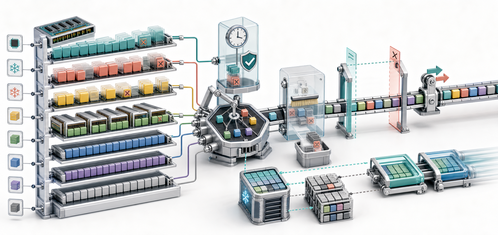
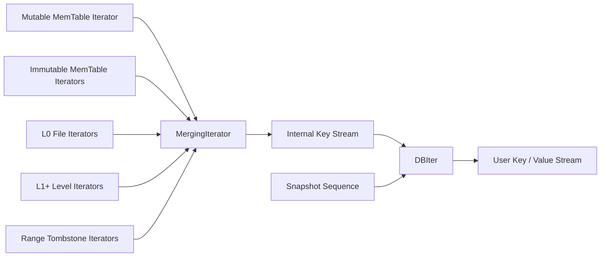
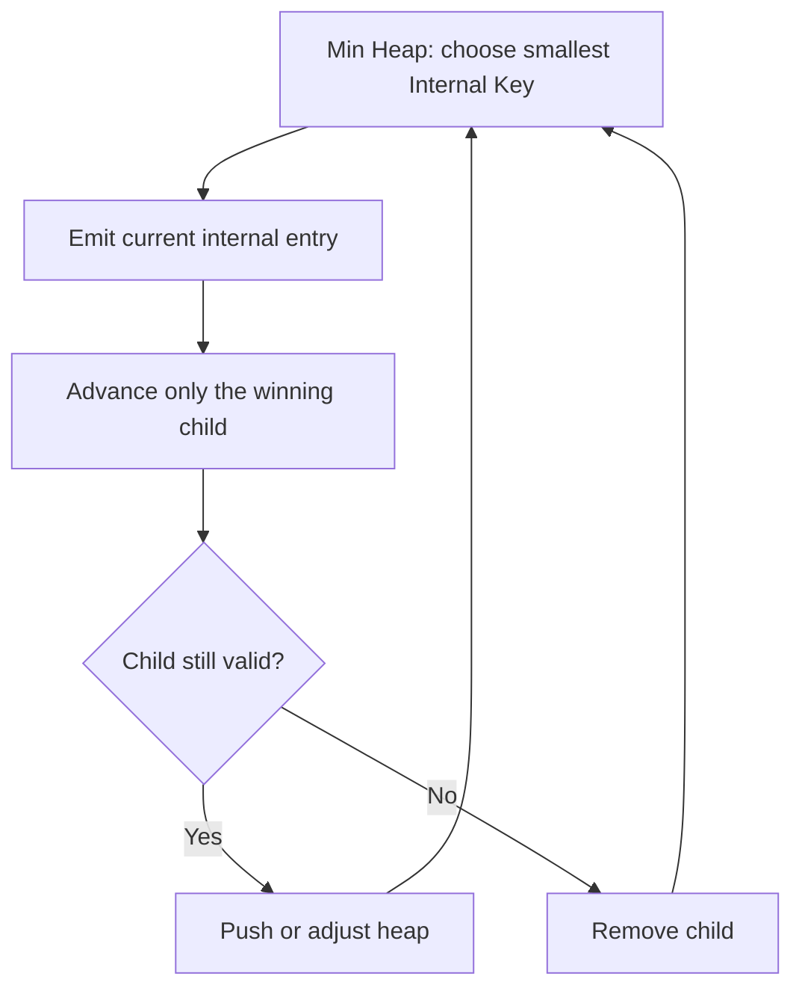
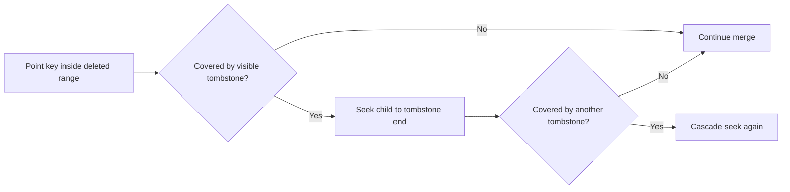
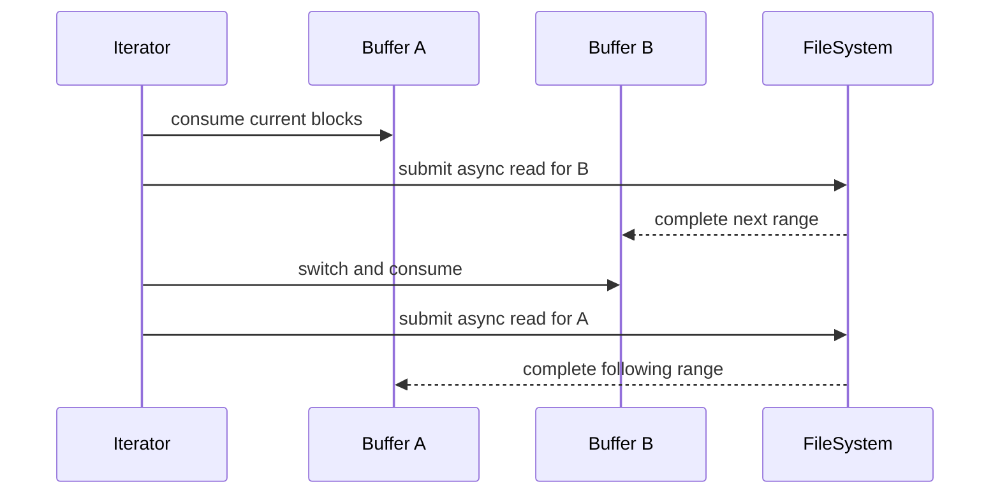

# RocksDB 读取路径（三）：Iterator 多路归并、范围扫描与 Readahead

上一篇研究了 `MultiGet()` 如何让一批离散 Key 共享读取工作。如果业务要读取的不是几十个确定的 Key，而是：

- 某个用户从时间 T1 到 T2 的所有事件；
- 某个租户下按 ID 排序的前 100 条记录；
- 以 `order:2026-07:` 开头的全部订单；
- 从断点 Key 开始继续分页；

那么逐 Key 点查已经不合适，RocksDB 的 `Iterator` 才是主要工具。

表面上，Iterator 只是 `Seek()` 后不断 `Next()`。但 RocksDB 的数据同时散落在 Mutable MemTable、多个 Immutable MemTable、互相重叠的 L0 文件和多个有序 Level 中；同一个 User Key 还可能有多个版本、删除标记和 Merge Operand。Iterator 必须把这些内部有序流实时归并，并只输出 Snapshot 可见的最终用户记录。



> 图 1：Mutable/Immutable MemTable 与各层 SST 产生多条有序流；MergingIterator 选择全局最小 Internal Key，DBIter 再按 Snapshot 折叠版本、跳过删除，最终在上下界与 Prefix 约束内输出用户记录。顺序访问 SST 时，Block Cache 与双缓冲 Readahead 共同隐藏存储延迟。

## 1. 先从一个正确的范围扫描开始

下面读取 `[user:0002, user:0005)`：下界包含，上界不包含。

```cpp
std::string lower = "user:0002";
std::string upper = "user:0005";
rocksdb::Slice lower_slice(lower);
rocksdb::Slice upper_slice(upper);

rocksdb::ReadOptions ro;
ro.iterate_lower_bound = &lower_slice;
ro.iterate_upper_bound = &upper_slice;

std::unique_ptr<rocksdb::Iterator> it(db->NewIterator(ro));
for (it->Seek(lower_slice); it->Valid(); it->Next()) {
  std::cout << it->key().ToString() << " = "
            << it->value().ToString() << "\n";
}

if (!it->status().ok()) {
  std::cerr << "scan failed: " << it->status().ToString() << "\n";
}
```

这段代码有四个不能省略的要点：

1. `NewIterator()` 返回时 Iterator 尚未定位，必须先调用某个 Seek 方法；
2. 每轮读取 `key()`/`value()` 前必须检查 `Valid()`；
3. 循环结束不一定表示正常到达边界，还要检查 `status()`；
4. Iterator 必须在 `DB` 被销毁前释放。

## 2. Iterator API 的位置语义

`include/rocksdb/iterator.h` 暴露的核心动作可以整理为：

| 方法 | 定位结果 |
| --- | --- |
| `SeekToFirst()` | 第一条可见记录 |
| `SeekToLast()` | 最后一条可见记录 |
| `Seek(target)` | 第一条 `key >= target` 的记录 |
| `SeekForPrev(target)` | 最后一条 `key <= target` 的记录 |
| `Next()` | 移到下一条用户记录 |
| `Prev()` | 移到上一条用户记录 |
| `Valid()` | 当前是否可读取 |
| `status()` | 无效是正常边界还是发生错误 |

注意 `Seek(target)` 不保证找到完全相等的 Key：

```text
已有 Key：a, c, e

Seek("b")        -> c
SeekForPrev("b") -> a
```

这使 Iterator 天然适合游标分页。客户端只需保存最后一个 Key，下一页 `Seek(last_key)` 后跳过重复项，或者构造严格大于它的业务边界。

## 3. Slice 的生命周期比看起来重要

`iterate_lower_bound` 和 `iterate_upper_bound` 的类型是 `const Slice*`。RocksDB 保存的是指针，不会复制 Slice 对象和其底层字符串：

```cpp
// 错误示意：临时对象离开作用域后，ReadOptions 中留下悬空指针。
rocksdb::ReadOptions MakeReadOptions() {
  std::string upper = "user:9999";
  rocksdb::Slice upper_slice(upper);
  rocksdb::ReadOptions ro;
  ro.iterate_upper_bound = &upper_slice;
  return ro;
}
```

正确做法是让边界字符串和 Slice 至少活到 Iterator 销毁：

```cpp
std::string upper_storage = "user:9999";
rocksdb::Slice upper_bound(upper_storage);
rocksdb::ReadOptions ro;
ro.iterate_upper_bound = &upper_bound;
auto it = std::unique_ptr<rocksdb::Iterator>(db->NewIterator(ro));
```

同样，`it->key()` 和 `it->value()` 返回的 Slice 通常只在下一次 `Seek/Next/Prev` 前有效。需要长期保存时必须复制：

```cpp
std::string saved_key = it->key().ToString();
std::string saved_value = it->value().ToString();
```

## 4. 为什么扫描不是“遍历一个 B+Tree”

假设同一时刻存在这些有序来源：

```text
Mutable MemTable:    a@105  d@101
Immutable MemTable:  b@98   d@97
L0 file #1:          a@90   c@89
L0 file #2:          b@80   e@79
L1:                  a@70   d@68   f@65
L2:                  g@40   h@39
```

`@` 后是 Sequence Number。每一条来源内部有序，但不存在一份已经物化好的“全库排序结果”。如果先把所有数据复制、排序再返回，创建 Iterator 的成本会与数据库大小相关，完全不可接受。

RocksDB 的策略是惰性多路归并：每个来源只暴露当前最小项，归并器选择其中全局最小的一项，推进该来源，再继续比较。



## 5. Iterator 的四层栈

一次普通 `DB::NewIterator()` 最终形成四层对象：

```text
用户代码
  |
  v
ArenaWrappedDBIter       统一管理 Arena、重建与生命周期
  |
  v
DBIter                   Internal Key -> User Key 语义
  |
  v
MergingIterator          多路 Internal Iterator 有序归并
  |
  +-- Mutable MemTable Iterator
  +-- Immutable MemTable Iterators
  +-- L0: 每个重叠 SST 的 Iterator
  +-- L1+: 每层按文件懒切换的 Level Iterator
  +-- 对应的 Range Tombstone Iterators
```

各层职责不能混为一谈：

| 层 | 核心职责 |
| --- | --- |
| Child Iterator | 在单个 MemTable、SST 或 Level 内移动 |
| MergingIterator | 按 Internal Comparator 生成全局有序内部流 |
| DBIter | Snapshot 可见性、重复版本、Delete、Merge、Blob、用户边界 |
| ArenaWrappedDBIter | 对象内存、初始化、刷新和清理 |

## 6. NewIterator 如何固定读取视图

普通 Iterator 创建时会引用 Column Family 当前的 `SuperVersion`。它把三部分结构固定下来：

```text
SuperVersion
  +-- mem      当前 Mutable MemTable
  +-- imm      Immutable MemTable 列表
  +-- current  当前 Version，即 SST 文件集合
```

随后确定 Snapshot Sequence：

- `ReadOptions::snapshot != nullptr`：使用显式 Snapshot 的 Sequence；
- 没有显式 Snapshot：创建 Iterator 时确定一个可见序列边界；
- `tailing = true`：走另一套面向持续追尾的 ForwardIterator 路径。

这里要区分两个概念：

1. **SuperVersion 固定结构**：防止 Iterator 正在使用的 MemTable/SST 被提前释放；
2. **Snapshot Sequence 固定逻辑时间**：决定哪些 Internal Key 对本次扫描可见。

Flush 或 Compaction 可能在扫描期间继续发生，但旧 SuperVersion 的引用会让相关对象保持可用。Iterator 析构时注册的 Cleanup 才归还引用，并可能触发过期文件清理。

## 7. 从源码看 Iterator 的组装

主路径可以压缩为：

```text
DBImpl::NewIterator()
  -> GetReferencedSuperVersion()
  -> DBImpl::NewIteratorImpl()
  -> NewArenaWrappedDbIterator()
  -> DBImpl::NewInternalIterator()
     -> mem->NewIterator()
     -> imm->AddIterators()
     -> current->AddIterators()
     -> MergeIteratorBuilder::Finish()
  -> DBIter::NewIter()
```

`DBImpl::NewInternalIterator()` 中最关键的骨架是：

```cpp
MergeIteratorBuilder merge_iter_builder(
    &cfd->internal_comparator(), arena,
    !read_options.total_order_seek && prefix_extractor != nullptr,
    read_options.iterate_upper_bound);

merge_iter_builder.AddPointAndTombstoneIterator(
    mem_iter, std::move(mem_tombstone_iter));

super_version->imm->AddIterators(..., &merge_iter_builder, ...);
super_version->current->AddIterators(..., &merge_iter_builder, ...);

internal_iter = merge_iter_builder.Finish(
    read_options.ignore_range_deletions ? nullptr : db_iter);
```

这段源码说明：Range Tombstone 不是 DBIter 最后才额外查询的一张表，它在构建 MergingIterator 时就与 Point Iterator 一起注册。

## 8. Internal Key 决定归并顺序

第八篇介绍过 Internal Key：

```text
InternalKey = UserKey + SequenceNumber + ValueType
```

排序规则可简化为：

```text
UserKey 升序
同一 UserKey 内 SequenceNumber 降序
再比较 ValueType
```

因此归并后的内部流天然把同一 User Key 的最新版本放在前面：

```text
apple@120 Value
apple@115 Deletion
apple@90  Value
banana@118 Merge
banana@100 Value
carrot@80 Value
```

MergingIterator 只保证这条内部流有序，并不知道 `apple@120` 是否对 Snapshot 可见，也不会自己把多个 `apple` 折叠成一个结果。这是 DBIter 的工作。

## 9. MergingIterator：最小堆驱动的 K 路归并

正向扫描时，MergingIterator 为有效 Child Iterator 维护最小堆：

```text
heap top = 所有 Child 当前 Internal Key 中最小者
```

一次 `Next()` 的核心过程：

1. 取出堆顶 Child；
2. 只推进这个 Child；
3. 将它的新位置重新放入堆；
4. 新堆顶成为下一个全局最小 Internal Key。

若有 `K` 个活跃 Child，每推进一条的堆调整复杂度约为 `O(log K)`，不需要每次扫描全部 Child。



`Seek(target)` 与 `Next()` 不同：它必须让各 Child 都定位到目标附近，然后重建堆。因此频繁随机 Seek 的成本通常高于一次 Seek 后连续 Next。

## 10. L0 与 L1+ 的 Child 数量并不相同

L0 文件的 Key Range 可以互相重叠。同一个目标范围可能同时命中多个 L0 文件，所以通常需要为候选文件分别创建 Iterator 并参与归并。

L1 及更深层中，同一层文件的 Key Range 通常互不重叠，因此 RocksDB 可以使用 Level Iterator：

- 根据 Key 定位当前文件；
- 只打开/使用当前文件的 Table Iterator；
- 到达文件末尾后懒切换到下一文件。

这解释了两个性能现象：

- L0 文件很多时，Iterator 初始化、堆大小和读放大都可能增加；
- 深层长扫描不需要同时打开该层所有 SST。

因此扫描慢不一定先调 Readahead，也要检查 L0 文件数和 Compaction 是否落后。

## 11. DBIter 如何把内部流变成用户流

DBIter 的 `FindNextUserEntryInternal()` 是正向扫描的语义核心。对每个 Internal Key，它依次处理：

1. 解析 User Key、Sequence Number 和 ValueType；
2. 跳过 `sequence > snapshot_seq` 的不可见版本；
3. 若当前 User Key 已经得出结论，跳过它的更旧版本；
4. 遇到 Value/BlobIndex/WideColumnEntity 时输出对应值；
5. 遇到 Delete/SingleDelete 时隐藏该 User Key；
6. 遇到 Merge 时向旧版本收集 Operand 并调用 MergeOperator；
7. 检查边界、Prefix、Range Tombstone 和错误状态。

例如 Snapshot Sequence 为 110：

```text
apple@120 Value("new")       太新，跳过
apple@105 Deletion           可见，apple 不输出
apple@90  Value("old")       已被可见删除覆盖，跳过
banana@108 Value("B")        输出 banana=B
banana@70  Value("old-B")    已找到新值，跳过
```

用户只看到：

```text
banana = B
```

## 12. 为什么一个 User Key 的大量旧版本会拖慢扫描

即使最终只输出一个 Key，DBIter 也可能需要跳过很多内部版本：

```text
hot-key@10000
hot-key@9999
hot-key@9998
...
hot-key@1
```

逐条 `Next()` 的成本会很高。`ColumnFamilyOptions::max_sequential_skip_in_iterations` 控制从顺序跳过切换为 Seek 的阈值，当前默认值为 `8`。

超过阈值后，DBIter 可以构造一个 Internal Seek Key，直接 Seek 到这个 User Key 的版本区间之外，避免线性扫描成百上千个旧版本。

这项优化不能消除旧版本本身造成的空间和 Compaction 成本。如果 `NUMBER_ITER_SKIP` 长期很高，仍应检查：

- 热 Key 是否被高频覆盖；
- Snapshot 是否长期不释放；
- Compaction 是否来不及清理旧版本；
- Merge Operand 是否积累过多。

## 13. Range Tombstone 如何跨来源屏蔽 Point Key

假设较新层存在：

```text
DeleteRange [b, f) @ 100
```

较旧层存在：

```text
b@80  c@79  d@78  e@77  f@76
```

`b` 到 `e` 都应被隐藏，`f` 仍可见。若逐 Key 检查，删除一个大范围的扫描代价会非常高。

MergingIterator 会把各层的 `TruncatedRangeDelIterator` 纳入归并状态。当发现当前 Point Key 被活动 Tombstone 覆盖时，它可以把相关 Child Seek 到 Tombstone 的结束位置。如果新位置又被另一层 Tombstone 覆盖，Seek 还会级联。



不要为了性能随意设置 `ignore_range_deletions = true`。一旦数据库历史上存在 `DeleteRange()`，该选项可能返回已被删除的陈旧 Key，属于正确性变化，而不只是性能变化。

## 14. 正向和反向不是完全对称的

反向扫描使用 Max Heap，选择最大的 Internal Key。但同一 User Key 内部按 Sequence Number 降序排列，这与“找上一条用户记录”组合后会让状态更复杂。

DBIter 的方向模型大致是：

| 方向 | Internal Iterator 位置 |
| --- | --- |
| Forward | 当前返回项处，或 Merge Operand 末端之后 |
| Reverse | 当前 User Key 的所有版本之前 |

从 `Next()` 切到 `Prev()`，或从 `Prev()` 切回 `Next()`，不能只是把堆比较器反过来。MergingIterator 和 DBIter 都需要围绕当前 Key 重新定位 Child，避免重复或漏掉当前用户记录。

```text
推荐：Seek -> Next -> Next -> Next
推荐：SeekForPrev -> Prev -> Prev -> Prev

较贵：Next -> Prev -> Next -> Prev -> ...
```

如果业务天然需要双向浏览，优先把请求组织成一段连续的单方向扫描，不要在每条记录间来回切换。

## 15. 正确编写反向有界扫描

读取 `[user:0002, user:0005)` 的反向结果：

```cpp
std::string lower = "user:0002";
std::string upper = "user:0005";
rocksdb::Slice lower_slice(lower);
rocksdb::Slice upper_slice(upper);

rocksdb::ReadOptions ro;
ro.iterate_lower_bound = &lower_slice;
ro.iterate_upper_bound = &upper_slice;

std::unique_ptr<rocksdb::Iterator> it(db->NewIterator(ro));
it->SeekForPrev(upper_slice);

// upper 本身不允许返回；若数据库恰好存在它，需要向前退一项。
if (it->Valid() && it->key().compare(upper_slice) >= 0) {
  it->Prev();
}

for (; it->Valid(); it->Prev()) {
  std::cout << it->key().ToString() << "\n";
}
if (!it->status().ok()) {
  std::cerr << it->status().ToString() << "\n";
}
```

也可以调用 `SeekToLast()`；当设置了 `iterate_upper_bound` 时，RocksDB 会尝试定位到严格小于上界的第一条记录。显式 `SeekForPrev()` 更适合从分页游标开始。

## 16. iterate_lower_bound 与 iterate_upper_bound

边界不仅帮助用户代码停止循环，还会向内部下推：

| 选项 | 语义 | 主要影响方向 |
| --- | --- | --- |
| `iterate_lower_bound` | 包含，下界 Key 可以返回 | 反向扫描 |
| `iterate_upper_bound` | 不包含，到达上界即无效 | 正向扫描 |

上界还能帮助 RocksDB：

- 跳过与范围不相交的文件或 Block；
- 避免 Readahead 越过扫描终点；
- 在满足条件时判断 Prefix 优化是否安全；
- 减少 Cache 污染和无效 I/O。

因此不要只在业务循环中写：

```cpp
if (it->key().compare(upper) >= 0) break;
```

最好同时把上界传给 `ReadOptions`，让存储层也知道真正的工作范围。

## 17. Prefix Scan 的三个模式

配置 `options.prefix_extractor` 后，RocksDB 可以利用 Prefix Bloom、Hash Index 或文件范围减少无关读取。但调用者必须明确扫描语义。

### 17.1 prefix_same_as_start

```cpp
options.prefix_extractor.reset(rocksdb::NewFixedPrefixTransform(5));

rocksdb::ReadOptions ro;
ro.prefix_same_as_start = true;

std::unique_ptr<rocksdb::Iterator> it(db->NewIterator(ro));
for (it->Seek("user:"); it->Valid(); it->Next()) {
  // 只迭代与 Seek Key 相同的 prefix domain。
}
```

它适合“只读取同一前缀”的明确需求。Iterator 保存 Seek Key 的 Prefix，一旦后续 Key 不再属于这个 Prefix，`Valid()` 变为 false。

### 17.2 total_order_seek

```cpp
ro.total_order_seek = true;
```

它要求全局有序语义，并跳过 Prefix Bloom 优化。需要跨 Prefix 扫描，或不确定上层边界是否落在同一 Prefix 时，优先保证正确性。

### 17.3 auto_prefix_mode

```cpp
ro.auto_prefix_mode = true;
ro.iterate_upper_bound = &upper_bound;
```

RocksDB 默认按 Total Order 思考，只有从 Seek Key 与 Upper Bound 能证明 Prefix 模式不会改变结果时才启用 Prefix 优化。

当前源码注释明确记录了 Short Key 相关限制：如果数据库可能包含短于固定前缀长度的 Key，需要谨慎验证，不要把 `auto_prefix_mode` 当成无条件安全的性能开关。

## 18. 构造字符串 Prefix 的排他上界

对于字节序 Comparator，前缀 `user:42:` 的范围通常可写为：

```text
[ "user:42:", PrefixSuccessor("user:42:") )
```

通用的字节前缀后继算法是：从末尾寻找第一个不是 `0xff` 的字节，加一并截断其后内容。

```cpp
bool PrefixSuccessor(std::string* key) {
  for (size_t i = key->size(); i > 0; --i) {
    unsigned char c = static_cast<unsigned char>((*key)[i - 1]);
    if (c != 0xff) {
      (*key)[i - 1] = static_cast<char>(c + 1);
      key->resize(i);
      return true;
    }
  }
  return false;  // 不存在有限后继，例如全部字节都是 0xff。
}
```

这只适用于与字节字典序兼容的 Comparator。自定义 Comparator 必须由业务定义对应的范围编码，不能套用这段算法。

## 19. Table Filter：在打开文件前剪枝

`ReadOptions::table_filter` 接收 `TableProperties`，可以让 Iterator 跳过整个 SST：

```cpp
rocksdb::ReadOptions ro;
ro.table_filter = [](const rocksdb::TableProperties& props) {
  auto it = props.user_collected_properties.find("tenant-id");
  return it == props.user_collected_properties.end() ||
         it->second == "tenant-42";
};
```

它适合数据按文件属性可证明分区的场景。回调返回 `false` 必须意味着“这个文件不可能包含需要的结果”。若判断错误，结果会直接缺失。

该回调只影响 Iterator，不是普通 `Get()` 的文件过滤器。要使用自定义属性，还需在建表时通过 Table Properties Collector 正确写入。

## 20. BlockBasedTableIterator 如何在 SST 内 Seek

进入一个 BlockBasedTable 后，扫描仍有两层：

```text
Index Iterator
  -> 定位 Data BlockHandle
  -> Block Cache / FilePrefetchBuffer / SST Read
  -> Data Block Iterator
  -> 在块内 Seek 或 Next
```

`Seek(target)` 先在 Index 中找到候选 Data Block，再创建对应 Data Block Iterator 并在块内定位。连续 `Next()` 到达块末尾后，Index Iterator 前进到下一个 Block，随后加载新块。

这也是连续扫描比反复 Seek 更容易获得高吞吐的原因：

- Index Iterator 顺序向前；
- Data Block 连续读取；
- Auto Readahead 能识别顺序模式；
- CPU 与存储设备都更喜欢连续访问。

## 21. Block Cache 与 fill_cache

扫描读取 Data Block 时，`ReadOptions::fill_cache` 决定新读取的 Block 是否进入 Block Cache：

```cpp
rocksdb::ReadOptions ro;
ro.fill_cache = false;
```

常见策略：

| 工作负载 | fill_cache 建议 |
| --- | --- |
| 热点范围会反复读取 | 通常 `true` |
| 一次性全量导出 | 常考虑 `false` |
| 后台校验/离线分析 | 常考虑 `false` |
| 小范围在线分页 | 通常 `true` |

`fill_cache = false` 不等于完全绕过 Cache：已有 Block 仍可能被查询和使用，它主要控制本次从底层读出的 Block 是否插入 Cache。

不要凭“扫描很大”就永久关闭 Cache。若范围会被重复访问，缓存 Data Block 可能非常有价值，应通过命中率和对在线流量的影响验证。

## 22. Auto Readahead 的启动过程

当用户没有显式设置 `readahead_size`，BlockBasedTableIterator 会观察顺序文件读取：

```text
第 1 个顺序 Block Read：观察
第 2 个顺序 Block Read：观察
后续顺序读取：启动隐式预读
预读大小：8 KiB -> 16 KiB -> 32 KiB -> ... -> 256 KiB
```

当前默认值来自 `BlockBasedTableOptions`：

| 选项 | 默认值 |
| --- | --- |
| `initial_auto_readahead_size` | 8 KiB |
| `max_auto_readahead_size` | 256 KiB |
| `num_file_reads_for_auto_readahead` | 2 |

将 `max_auto_readahead_size` 或 `initial_auto_readahead_size` 设为 `0` 可以关闭隐式 Auto Readahead。

## 23. 显式 readahead_size 何时有用

```cpp
rocksdb::ReadOptions ro;
ro.readahead_size = 2 * 1024 * 1024;
```

非零值会指定固定预读大小，适合已知是长顺序扫描、且测量表明默认渐进预读过于保守的场景。例如旋转磁盘或高延迟远端文件系统可能从更大预读中受益。

代价也很直接：

- 短扫描会读取大量永远不用的数据；
- 并发 Iterator 会放大内存和存储带宽；
- 边界不明确时容易越界预读；
- Cache 中已有 Block 可能造成重复工作。

所以固定值不应从某篇调优文章直接抄进生产配置，要用真实扫描长度分布和设备延迟验证。

## 24. adaptive_readahead 解决跨文件重置

默认情况下，Iterator 从同一 Level 的一个 SST 切到下一个 SST 时，Auto Readahead 状态会重新从较小值开始。

```cpp
rocksdb::ReadOptions ro;
ro.adaptive_readahead = true;
```

启用后，离开文件时保存当前 `readahead_size` 与顺序读计数，进入同层下一文件时恢复，适合跨多个 SST 的长扫描。

它不是“自动让所有扫描更快”：大量短范围、随机 Seek 或高并发扫描可能受益不大，甚至增加无效预读。仍需观察 `PREFETCH_BYTES` 与 `PREFETCH_BYTES_USEFUL`。

## 25. auto_readahead_size 如何减少浪费

`ReadOptions::auto_readahead_size` 当前默认 `true`。在 Block Cache 可用，并且设置 Upper Bound 或 `prefix_same_as_start` 时，它可以：

1. 查看前方 Data Block 是否已经在 Cache；
2. 避免预读已经缓存的范围；
3. 在 `iterate_upper_bound` 前截断预读；
4. 在 Prefix 边界前截断预读；
5. 根据预读利用情况降低后续 Readahead。

反向扫描会禁用这项自动调节，并且之后重新正向扫描也不会再次启用。因此混合方向不仅有重新定位成本，还可能损失扫描预读优化。

## 26. async_io：用双缓冲隐藏读取延迟

```cpp
rocksdb::ReadOptions ro;
ro.async_io = true;
```

顺序扫描启用异步预读时，FilePrefetchBuffer 通常使用两个 Buffer：

```text
时间片 T0：应用消费 Buffer A，同时异步填充 Buffer B
时间片 T1：应用消费 Buffer B，同时异步复用并填充 Buffer A
时间片 T2：继续轮换
```



真正异步需要 FileSystem 支持 `ReadAsync()`、`Poll()`、`AbortIO()` 并声明 `kAsyncIO`。不支持时可能走同步兼容路径，所以打开布尔值不等于设备一定获得并行 I/O。

## 27. pin_data：少复制，但会延长内存驻留

```cpp
rocksdb::ReadOptions ro;
ro.pin_data = true;
```

它允许 Iterator 将已加载的 Block Pin 到其生命周期结束，减少 Key/Value 的复制或重复 Pin/Unpin 开销。

适合：

- Iterator 生命周期短；
- 热范围较小；
- 应用及时消费 Slice；
- 已测量到复制/引用管理是瓶颈。

风险：一个长寿命 Iterator 扫过大量 Block 后，可能长期占用 Cache/内存。`pin_data` 不是让 `key()`/`value()` 永久有效的承诺，调用者仍应遵守 Iterator API 的 Slice 生命周期。

## 28. 显式 Snapshot 与长扫描

```cpp
const rocksdb::Snapshot* snapshot = db->GetSnapshot();

rocksdb::ReadOptions ro;
ro.snapshot = snapshot;
{
  std::unique_ptr<rocksdb::Iterator> it(db->NewIterator(ro));
  // 扫描期间所有结果都按同一个 Sequence Number 判断可见性。
}

db->ReleaseSnapshot(snapshot);
```

必须先销毁使用 Snapshot 的 Iterator，再释放 Snapshot。

长时间持有 Snapshot 会阻止 Compaction 丢弃仍可能对它可见的旧版本，导致：

- 旧 SST 不能及时回收；
- 空间放大增加；
- 同 Key 版本数增加；
- Iterator 需要跳过更多内部记录。

一致性不是免费的。分页若必须跨多次请求保持完全相同视图，需要设计 Snapshot 生命周期；若允许弱一致分页，则可只保存 Key 游标，但要接受并发写入导致的结果漂移。

## 29. auto_refresh_iterator_with_snapshot

一个长寿命 Iterator 即使使用 Snapshot，也可能持续引用创建时的旧 SuperVersion，延缓旧 MemTable/SST 资源释放。

```cpp
rocksdb::ReadOptions ro;
ro.snapshot = snapshot;
ro.auto_refresh_iterator_with_snapshot = true;
```

在显式 Snapshot 存在时，该选项允许 Iterator 检测 SuperVersion 变化并重建内部结构，同时仍按同一个 Snapshot Sequence 读取。因此：

- **逻辑视图不变**：Snapshot 仍固定可见性；
- **物理结构可刷新**：释放旧 SuperVersion 的资源引用。

没有显式 Snapshot 时，该选项不会提供这种保证。使用 User-defined Timestamp 时还要阅读源码注释中的限制。

## 30. Tailing Iterator 不是普通 Snapshot Iterator

```cpp
rocksdb::ReadOptions ro;
ro.tailing = true;
```

Tailing Iterator 可以在创建后继续看到新写入，并针对持续向前读取优化。它内部使用 `ForwardIterator`，而不是普通 NewInternalIterator 构造出的固定 MergingIterator 栈。

适合日志式追加读取，但要明确：

- 它不是固定 Snapshot；
- 主要面向正向顺序读取；
- 并发更新下不能把一次长扫描理解为静态快照；
- 方向、Prefix 与某些功能组合需要单独验证。

如果需求是“审计导出必须看到同一时刻的数据”，应使用显式 Snapshot，而不是 Tailing Iterator。

## 31. max_skippable_internal_keys：给 Seek 延迟设保险丝

```cpp
rocksdb::ReadOptions ro;
ro.max_skippable_internal_keys = 100000;
```

当 Seek 需要跳过的 Internal Key 超过阈值，操作可返回 `Status::Incomplete()`，避免单个请求因大量旧版本或删除范围而无限拖长。

默认值 `0` 表示不限制。启用后，调用者必须把 `Incomplete` 当成一种需要处理的结果，而不是把 `!Valid()` 误判为正常扫描结束。

该选项是延迟保护，不会修复版本膨胀。触发后仍要定位底层原因。

## 32. 完整可运行实验

下面的程序演示：

- 正向有界扫描；
- 反向有界扫描；
- 同 Prefix 扫描；
- 删除后的用户可见结果；
- Iterator Status 检查；
- 关键统计指标。

```cpp
#include <cassert>
#include <chrono>
#include <cstdlib>
#include <iostream>
#include <memory>
#include <string>
#include <vector>

#include "rocksdb/db.h"
#include "rocksdb/filter_policy.h"
#include "rocksdb/options.h"
#include "rocksdb/slice_transform.h"
#include "rocksdb/statistics.h"
#include "rocksdb/table.h"

namespace {

void Check(const rocksdb::Status& s) {
  if (!s.ok()) {
    std::cerr << s.ToString() << "\n";
    std::abort();
  }
}

void PrintForward(rocksdb::DB* db, const std::string& lower,
                  const std::string& upper) {
  rocksdb::Slice lower_slice(lower);
  rocksdb::Slice upper_slice(upper);
  rocksdb::ReadOptions ro;
  ro.iterate_lower_bound = &lower_slice;
  ro.iterate_upper_bound = &upper_slice;
  ro.adaptive_readahead = true;

  std::unique_ptr<rocksdb::Iterator> it(db->NewIterator(ro));
  for (it->Seek(lower_slice); it->Valid(); it->Next()) {
    std::cout << "forward " << it->key().ToString() << " = "
              << it->value().ToString() << "\n";
  }
  Check(it->status());
}

void PrintReverse(rocksdb::DB* db, const std::string& lower,
                  const std::string& upper) {
  rocksdb::Slice lower_slice(lower);
  rocksdb::Slice upper_slice(upper);
  rocksdb::ReadOptions ro;
  ro.iterate_lower_bound = &lower_slice;
  ro.iterate_upper_bound = &upper_slice;

  std::unique_ptr<rocksdb::Iterator> it(db->NewIterator(ro));
  it->SeekForPrev(upper_slice);
  if (it->Valid() && it->key().compare(upper_slice) >= 0) {
    it->Prev();
  }
  for (; it->Valid(); it->Prev()) {
    std::cout << "reverse " << it->key().ToString() << " = "
              << it->value().ToString() << "\n";
  }
  Check(it->status());
}

void PrintPrefix(rocksdb::DB* db, const std::string& seek_key) {
  rocksdb::ReadOptions ro;
  ro.prefix_same_as_start = true;

  std::unique_ptr<rocksdb::Iterator> it(db->NewIterator(ro));
  for (it->Seek(seek_key); it->Valid(); it->Next()) {
    std::cout << "prefix  " << it->key().ToString() << " = "
              << it->value().ToString() << "\n";
  }
  Check(it->status());
}

}  // namespace

int main() {
  const auto suffix =
      std::chrono::steady_clock::now().time_since_epoch().count();
  const std::string path =
      "/tmp/rocksdb-iterator-demo-" + std::to_string(suffix);

  rocksdb::Options options;
  options.create_if_missing = true;
  options.prefix_extractor.reset(rocksdb::NewFixedPrefixTransform(5));
  options.statistics = rocksdb::CreateDBStatistics();

  rocksdb::BlockBasedTableOptions table_options;
  table_options.filter_policy.reset(
      rocksdb::NewBloomFilterPolicy(10, false));
  table_options.initial_auto_readahead_size = 8 * 1024;
  table_options.max_auto_readahead_size = 256 * 1024;
  options.table_factory.reset(
      rocksdb::NewBlockBasedTableFactory(table_options));

  rocksdb::DB* raw_db = nullptr;
  Check(rocksdb::DB::Open(options, path, &raw_db));
  std::unique_ptr<rocksdb::DB> db(raw_db);

  const std::vector<std::pair<std::string, std::string>> rows = {
      {"user:0001", "Alice"},
      {"user:0002", "Bob-v1"},
      {"user:0003", "Carol"},
      {"user:0004", "Dave"},
      {"user:0005", "Eve"},
      {"order:001", "paid"},
  };

  for (const auto& [key, value] : rows) {
    Check(db->Put(rocksdb::WriteOptions(), key, value));
  }
  Check(db->Put(rocksdb::WriteOptions(), "user:0002", "Bob-v2"));
  Check(db->Delete(rocksdb::WriteOptions(), "user:0003"));

  rocksdb::FlushOptions flush_options;
  flush_options.wait = true;
  Check(db->Flush(flush_options));

  std::cout << "-- [user:0002, user:0005) --\n";
  PrintForward(db.get(), "user:0002", "user:0005");

  std::cout << "-- reverse [user:0002, user:0005) --\n";
  PrintReverse(db.get(), "user:0002", "user:0005");

  std::cout << "-- same five-byte prefix as user: --\n";
  PrintPrefix(db.get(), "user:");

  std::cout << "iterator bytes: "
            << options.statistics->getTickerCount(rocksdb::ITER_BYTES_READ)
            << "\n";
  std::cout << "internal keys skipped: "
            << options.statistics->getTickerCount(rocksdb::NUMBER_ITER_SKIP)
            << "\n";
  std::cout << "prefetch bytes: "
            << options.statistics->getTickerCount(rocksdb::PREFETCH_BYTES)
            << "\n";

  db.reset();
  Check(rocksdb::DestroyDB(path, options));
}
```

典型输出中：

```text
正向：[user:0002, user:0005) 只包含 0002 与 0004
反向：顺序为 0004、0002
Prefix：包含 user:0001、0002、0004、0005
```

`user:0003` 被 Delete 隐藏，`user:0002` 只输出新版本 `Bob-v2`。数据量很小，Auto Readahead 不一定启动，这是正常现象；要观察预读，应把数据规模扩大到多个 Data Block 和 SST。

## 33. 编译与运行

在已经构建 RocksDB 的 Linux 环境中，可以按本机依赖调整链接参数：

```bash
g++ -std=c++17 -O2 iterator_demo.cc \
  -I./include -L. -lrocksdb \
  -lpthread -ldl -lz -lbz2 -llz4 -lzstd -lsnappy \
  -o iterator_demo

./iterator_demo
```

如果使用项目构建系统，更可靠的方法是把实验放入现有 Example/Test 目标，以仓库配置自动带入启用的压缩库和平台依赖。

## 34. 生产调优：先判断扫描类型

| 扫描类型 | 首先考虑 |
| --- | --- |
| 小范围在线分页 | Upper Bound、Prefix、Block Cache |
| 大范围一次性导出 | `fill_cache=false`、显式 Readahead、限流 |
| 跨多个 SST 的长扫描 | `adaptive_readahead`、Compaction 状态 |
| 高延迟远端存储 | Readahead、Async I/O、并发预算 |
| 反向分页 | Lower Bound、避免方向频繁切换 |
| 热 Key 多版本 | Snapshot 生命周期、Compaction、Iterator Skip |
| 持续读取新增记录 | Tailing Iterator，并明确一致性语义 |

调优顺序建议：

1. 先缩小扫描范围；
2. 再降低参与归并的文件数；
3. 再提高连续 I/O 效率；
4. 最后才增加并发和预读内存。

读取更少的数据，通常比更快地读取无用数据有效。

## 35. 应重点观察哪些指标

`Statistics` 中与 Iterator 直接相关的 Ticker 包括：

| Ticker | 含义 |
| --- | --- |
| `ITER_BYTES_READ` | Iterator 返回/处理的数据字节 |
| `NUMBER_ITER_SKIP` | DBIter 跳过的内部 Key 数量 |
| `BLOCK_CACHE_DATA_HIT` | Data Block Cache 命中 |
| `BLOCK_CACHE_DATA_MISS` | Data Block Cache 未命中 |
| `NO_FILE_OPENS` | 文件打开次数 |
| `PREFETCH_BYTES` | 预读字节数 |
| `PREFETCH_BYTES_USEFUL` | 真正被消费的预读字节 |
| `PREFETCH_HITS` | 预读 Buffer 命中 |

可以建立这些比率：

```text
Data Block Cache 命中率
  = HIT / (HIT + MISS)

Prefetch 有效率
  = PREFETCH_BYTES_USEFUL / PREFETCH_BYTES

每条结果的内部跳过量
  = NUMBER_ITER_SKIP / 返回记录数
```

仅看吞吐会掩盖 Cache 污染、预读浪费和版本膨胀。还应按请求记录：扫描结果条数、扫描 Key Span、P50/P99 延迟、读取字节、Iterator 存活时间与 Snapshot 年龄。

## 36. 常见误区

### 误区一：循环退出就代表成功

错误。I/O Error、Corruption、Incomplete 都可能让 `Valid()` 变为 false。必须检查 `status()`。

### 误区二：Upper Bound 是包含的

错误。`iterate_upper_bound` 是排他上界；`iterate_lower_bound` 是包含下界。

### 误区三：设置 prefix_extractor 后所有 Seek 都自动更快

错误。Total Order、Same Prefix 和 Auto Prefix 有不同语义，错误组合可能漏结果。

### 误区四：fill_cache=false 会完全绕过 Block Cache

错误。它主要阻止本次读取的新 Block 填入 Cache，不必然禁止使用已有 Cache Entry。

### 误区五：Readahead 越大越好

错误。短扫描、高并发和精确上界下，过大预读会浪费带宽与内存。

### 误区六：普通 Iterator 会持续看到新写入

错误。普通 Iterator 有固定可见边界；需要持续观察新增数据应评估 Tailing Iterator。

### 误区七：反向扫描只是把 Next 改成 Prev

不完整。起点应使用 `SeekForPrev()`/`SeekToLast()`，下界需要设置，方向切换还会触发内部重定位。

### 误区八：长 Snapshot 只有一点内存开销

错误。它可能阻止旧版本和旧文件回收，间接增加空间、读放大和 Iterator Skip。

## 37. 源码阅读顺序

建议按“公开契约 -> 对象组装 -> 用户语义 -> 内部归并 -> SST 扫描 -> 预读”的顺序：

```text
include/rocksdb/iterator.h
  -> include/rocksdb/options.h
  -> db/db_impl/db_impl.cc
  -> db/arena_wrapped_db_iter.cc
  -> db/db_iter.cc
  -> table/merging_iterator.cc
  -> db/version_set.cc
  -> db/table_cache.cc
  -> table/block_based/block_based_table_iterator.cc
  -> table/block_based/block_prefetcher.cc
  -> file/file_prefetch_buffer.cc
```

重点入口：

- [`include/rocksdb/iterator.h`](../include/rocksdb/iterator.h)：用户 Iterator 接口与 Slice 生命周期；
- [`include/rocksdb/options.h`](../include/rocksdb/options.h)：Bounds、Prefix、Readahead、Snapshot 选项；
- [`db/db_impl/db_impl.cc`](../db/db_impl/db_impl.cc)：`NewIterator()`、`NewIteratorImpl()`、`NewInternalIterator()`；
- [`db/arena_wrapped_db_iter.cc`](../db/arena_wrapped_db_iter.cc)：Iterator 栈的 Arena 包装与刷新；
- [`db/db_iter.cc`](../db/db_iter.cc)：版本折叠、Delete/Merge、方向切换；
- [`table/merging_iterator.cc`](../table/merging_iterator.cc)：Min/Max Heap、多路归并、Range Tombstone；
- [`db/version_set.cc`](../db/version_set.cc)：各层 SST Iterator 的加入；
- [`table/block_based/block_based_table_iterator.cc`](../table/block_based/block_based_table_iterator.cc)：Index/Data Block 定位；
- [`table/block_based/block_prefetcher.cc`](../table/block_based/block_prefetcher.cc)：预读策略；
- [`file/file_prefetch_buffer.cc`](../file/file_prefetch_buffer.cc)：同步/异步预读 Buffer；
- [`docs/components/read_flow/07_iterator_scan.md`](../docs/components/read_flow/07_iterator_scan.md)：仓库内 Iterator 专题；
- [`docs/components/read_flow/10_prefetching_and_async_io.md`](../docs/components/read_flow/10_prefetching_and_async_io.md)：Readahead 与异步 I/O 专题。

## 38. 本篇小结

RocksDB Iterator 的主线可以概括为：

```text
创建视图：引用 SuperVersion，确定 Snapshot Sequence
建立来源：Mutable + Immutable + L0 文件 + L1+ Level
内部归并：MergingIterator 用 Min/Max Heap 合并 Internal Key
删除裁剪：Range Tombstone 推动被覆盖 Child 跨范围 Seek
用户语义：DBIter 过滤不可见版本、Delete，解析 Merge
范围语义：Lower Bound 包含，Upper Bound 不包含
Prefix 语义：Same Prefix、Total Order、Auto Prefix 必须明确选择
顺序 I/O：Index/Data Block 连续前进，触发 Auto Readahead
跨文件优化：Adaptive Readahead 继承同层预读状态
异步预读：双 Buffer 让消费与下一段读取重叠
生命周期：检查 Status，及时销毁 Iterator 与释放 Snapshot
```

Iterator 不是一个装着结果的容器，而是一台实时运行的归并机器。它一边从多个 LSM 来源拉取 Internal Key，一边维护全局顺序，再由 DBIter 按 Snapshot 解释版本语义。扫描性能的关键也因此不只在磁盘速度：范围是否足够小、L0 是否堆积、旧版本是否过多、方向是否稳定、Prefix 是否正确、预读是否真正被消费，都会进入最终延迟。

下一篇将继续向下进入 SST 与 BlockBasedTable：拆开文件 Footer、MetaIndex、Properties、Filter、Index 与 Data Block，理解 Iterator 和 Get 最终读取的物理文件究竟长什么样。

## 参考入口

- [`docs/components/read_flow/07_iterator_scan.md`](../docs/components/read_flow/07_iterator_scan.md)：Iterator 与扫描主路径；
- [`docs/components/read_flow/08_range_deletions.md`](../docs/components/read_flow/08_range_deletions.md)：Range Tombstone；
- [`docs/components/read_flow/09_merge_resolution.md`](../docs/components/read_flow/09_merge_resolution.md)：Merge 解析；
- [`docs/components/read_flow/10_prefetching_and_async_io.md`](../docs/components/read_flow/10_prefetching_and_async_io.md)：预读与异步 I/O；
- [`docs/components/read_flow/11_read_options_and_tuning.md`](../docs/components/read_flow/11_read_options_and_tuning.md)：ReadOptions 调优；
- [`db/db_iter.cc`](../db/db_iter.cc)：用户记录解析；
- [`table/merging_iterator.cc`](../table/merging_iterator.cc)：多路归并；
- [`table/block_based/block_based_table_iterator.cc`](../table/block_based/block_based_table_iterator.cc)：BlockBasedTable Iterator；
- [`include/rocksdb/statistics.h`](../include/rocksdb/statistics.h)：读取与预读统计指标。
