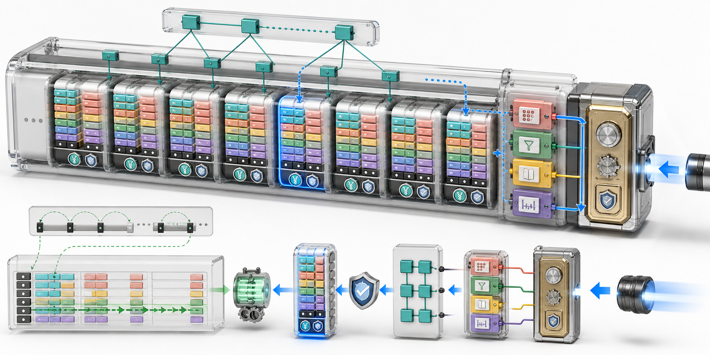

# RocksDB 存储格式（一）：SST 与 BlockBasedTable 文件解剖

前面三篇读取路径不断提到 SST：

- Get 经过 FilePicker 选择候选 SST；
- MultiGet 按文件和 Data Block 聚合请求；
- Iterator 通过 Index Iterator 在多个 Data Block 间移动。

但 SST 内部究竟是什么样？为什么打开文件时先读尾部？Index 的 Value 为什么不是业务 Value？Bloom Filter、Properties 和 Range Tombstone 又放在哪里？

本篇不再把 SST 当作黑盒，而是沿着 BlockBasedTable 的写入顺序拆开文件，再从 Reader 的方向把它重新组装。

> 图 1：SST 主体由多个有序 Data Block 组成，每块带压缩类型与校验和 Trailer；Index 指向 Data Block，MetaIndex 指向 Properties、Filter、压缩字典、Range Deletion 和新版 Index；Reader 从文件尾 Footer 进入，只读取与目标 Key 相关的少量 Block。

## 1. SST 的四个基本性质

SST 常被解释为 Sorted String Table。对 RocksDB 而言，先抓住四点：

1. **有序**：Point Entry 按 Internal Comparator 排序；
2. **不可变**：文件完成后不再原地修改；
3. **分块**：数据与元数据按 Block 组织；
4. **自描述**：Footer 与 MetaIndex 提供版本和元数据入口。

一个 SST 并不是数据库的完整快照，也不只保存最终用户 Key-Value。它仍可能包含：

~~~text
apple@120 Value
apple@115 Deletion
banana@110 Merge
carrot@90  Value
~~~

Flush 和 Compaction 输出的是有序 Internal Key 流，Snapshot、Delete、Merge 等语义仍由读取路径解释。

## 2. SST 不等于 BlockBasedTable

“SST”描述不可变有序文件的角色，“BlockBasedTable”是具体 Table Format。

RocksDB 还存在或曾支持 PlainTable、CuckooTable 与自定义 TableFactory。默认配置使用 BlockBasedTable：

~~~cpp
rocksdb::BlockBasedTableOptions table_options;
options.table_factory.reset(
    rocksdb::NewBlockBasedTableFactory(table_options));
~~~

本文的 Block、Footer、Filter 与 Index 布局都针对 BlockBasedTable，不能直接套用到其他格式。

## 3. 整张文件地图

经典逻辑布局如下：

~~~text
低 Offset
|
| Data Block 0
| Block Trailer
| Data Block 1
| Block Trailer
| ...
| Data Block N
| Block Trailer
|
| [Filter Block / Filter Partitions]
| [Index Block / Index Partitions]
| Properties Block
| [Compression Dictionary]
| [Range Deletion Block]
| [其他 Meta Block]
|
| MetaIndex Block
| Block Trailer
| Footer                    固定长度，位于文件末尾
|
高 Offset
~~~

方括号表示可选或取决于配置。Footer 自身不是普通 Block，不再附加 Block Trailer。

~~~mermaid
flowchart LR
  D0["Data Block 0"] --> D1["Data Block 1"]
  D1 --> DN["Data Block N"]
  DN --> MB["Filter / Index / Properties / Other Meta"]
  MB --> MI["MetaIndex Block"]
  MI --> F["Footer at file tail"]
~~~

物理上这是一个连续文件。图中箭头表示 Builder 的追加顺序，不是内存指针。

## 4. BlockHandle：文件内地址

RocksDB 使用 BlockHandle 描述一个 Block：

~~~text
BlockHandle
  offset : Block 内容起始偏移
  size   : Block 内容长度，不包含 Trailer
~~~

编码使用 Varint64：

~~~cpp
class BlockHandle {
 public:
  void EncodeTo(std::string* dst) const;
  Status DecodeFrom(Slice* input);

 private:
  uint64_t offset_;
  uint64_t size_;
};
~~~

读取整个物理块时，长度是：

~~~text
handle.size() + 5-byte block trailer
~~~

Index Value 本质上是 Data BlockHandle 或其紧凑变体；MetaIndex Value 则是各种 Meta BlockHandle。

## 5. 为什么 Footer 位于文件尾

Reader 刚拿到一个 SST 时只知道：

~~~text
file pointer + file size
~~~

它不知道 Index、Filter、Properties 在什么 Offset。固定长度 Footer 位于尾部后，打开流程变成：

~~~text
Read(file_size - footer_length, footer_length)
  -> 校验 Magic Number
  -> 解析 Format Version 与 Checksum Type
  -> 定位 MetaIndex
  -> 再按名称查找其他 Block
~~~

Builder 因此可以向前流式写入，不必预知最终位置。等数据和元数据全部完成，再追加 MetaIndex 与 Footer。

## 6. 当前 Footer 固定为 53 字节

Footer::kNewVersionsEncodedLength 的计算是：

~~~text
1 byte checksum type
+ 2 * BlockHandle::kMaxEncodedLength
+ 4 bytes format version
+ 8 bytes magic number
= 53 bytes
~~~

固定长度使 Reader 能一次读取文件尾。重要的是：**固定长度不表示每个版本都用相同方式解释中间 40 字节。**

当前仓库 BlockBasedTable 的默认写入版本是：

~~~cpp
uint32_t format_version = 7;
~~~

生产工具不应凭本文硬编码 Footer，应使用 RocksDB 的 Footer Decoder。

## 7. Version 5 及以前的 Footer

旧版 Footer 中间区域保存两个 Handle：

~~~text
checksum type
metaindex handle
index handle
zero padding
format version
magic number
~~~

因此传统架构图常画成：

~~~text
Footer -> MetaIndex
Footer -> Index
~~~

这个模型适用于旧格式，却不是当前版本的完整事实。

## 8. Version 6 及以后的 Footer

Version 6+ 的中间区域改为：

~~~text
extended magic
footer checksum
base context checksum
metaindex block size
reserved bytes
~~~

它利用“MetaIndex 紧邻 Footer”的约束推导 Offset：

~~~text
metaindex_offset =
    footer_offset - block_trailer_size - metaindex_size
~~~

Index Handle 不再直接保存于 Footer，而是登记在 MetaIndex。

新版导航链是：

~~~text
Footer -> MetaIndex -> Index
                   -> Properties
                   -> Filter
                   -> Other Meta Blocks
~~~

这给 Footer 校验、上下文校验和与元数据扩展留下空间。

## 9. Magic Number 与 Format Version

Magic Number 用于：

- 判断文件是否属于可识别的 Table Format；
- 区分 BlockBasedTable、PlainTable、CuckooTable；
- 配合 Format Version 判断 Reader 是否支持；
- 尽早把错误文件或损坏尾部报告为 Corruption。

Magic Number 不是加密签名，也不能替代完整 Checksum。

Format Version 则描述同一格式家族内部的编码能力。它只影响新写 SST，Reader 读取旧文件时以 Footer 中的版本为准。

## 10. 每个 Block 的 5 字节 Trailer

BlockBasedTable 当前定义：

~~~cpp
static constexpr size_t kBlockTrailerSize = 5;
~~~

布局如下：

~~~text
Block Contents
+ 1 byte CompressionType
+ 4 bytes Checksum
~~~

~~~mermaid
flowchart LR
  B["Serialized Block Contents"] --> C["1-byte Compression Type"]
  C --> S["4-byte Checksum"]
~~~

BlockHandle::size 不包含这 5 字节。Reader 发起 I/O 时会额外读取 Trailer。

## 11. Checksum 校验什么

经典校验覆盖：

~~~text
compressed block contents + compression type
~~~

Format Version 6 引入带上下文的校验增强，把文件身份和 Block Offset 等上下文混入计算，改善“读到了另一个合法 Block”这类错位损坏的检测。

ChecksumType 包括 CRC32c、xxHash、xxHash64、XXH3 与 kNoChecksum 等。关闭校验会失去重要损坏检测；除非有清晰的端到端完整性方案，不应把 kNoChecksum 当作普通调优。

## 12. 压缩按 Block 完成

SST 不是一个整体压缩流：

~~~text
Data Block A -> compress -> write -> trailer
Data Block B -> compress -> write -> trailer
~~~

独立压缩带来：

- 点查只读和解压一个小块；
- Block Cache 可独立缓存；
- 损坏影响更局部；
- Iterator 可以逐块前进；
- 多个 Block 能并行压缩。

若压缩收益太小，Builder 可以写原始 Block，Trailer 记录实际 CompressionType。

## 13. Data Block 的经典编码

默认 Data Block 保存按 Internal Key 排序的 Entry：

~~~text
Entry 0
Entry 1
...
Entry N
Restart Offset 0
Restart Offset 1
...
DataBlockFooter
~~~

每个经典 Entry 的形式：

~~~text
shared_bytes    : varint32
unshared_bytes  : varint32
value_length    : varint32
key_delta       : char[unshared_bytes]
value           : char[value_length]
~~~

Restart Point 的 shared_bytes 为 0，保存完整 Key。

## 14. Prefix Compression 如何省空间

连续 Key：

~~~text
tenant:42:order:000001
tenant:42:order:000002
tenant:42:order:000003
~~~

无需重复保存长前缀。BlockBuilder 记录与上一 Key 共享的长度和剩余字节：

~~~cpp
current_key =
    previous_key.substr(0, shared) + key_delta;
~~~

这会降低 Key 密集数据的块大小，并通常改善通用压缩算法的压缩率。

## 15. Restart Point 解决随机定位

若所有 Key 都依赖前一个 Key，寻找中间项必须从头解码。RocksDB 每隔若干 Key 保存完整 Key，当前默认：

~~~cpp
int block_restart_interval = 16;
~~~

Reader 的块内 Seek：

1. 对 Restart Key 二分；
2. 选中目标 Restart Interval；
3. 从完整 Key 开始顺序解码一小段 Entry。

~~~mermaid
flowchart LR
  K["Target Internal Key"] --> R["Binary search restart keys"]
  R --> I["Choose one restart interval"]
  I --> L["Linear decode short interval"]
  L --> V["Candidate entry"]
~~~

这是空间、Cache Locality 与 CPU 的折中。

## 16. 当前 DataBlockFooter

传统布局最后四字节只保存 num_restarts。当前 DataBlockFooter 把 uint32 的低 28 位用于 Restart 数，高位编码：

- 是否带 Data Block Hash Index；
- Restart Key 是否近似均匀；
- 是否启用 Key/Value 分离；
- 保留特性位。

启用 Key/Value 分离时，Footer 前还保存 Value Section Offset。

因此底层工具应调用 DataBlockFooter::DecodeFrom，不能永远把最后四字节当作旧式 Restart Count。

## 17. Key/Value 分离存储

配置：

~~~cpp
table_options.separate_key_value_in_data_block = true;
~~~

布局变为：

~~~text
Key Entry Section
Value Section
Restart Array
Values Section Offset
Packed DataBlockFooter
~~~

它可能改善只比较 Key 的路径和压缩效果，但 Restart Point 需要额外 Value Offset，小 Value 或较小 Restart Interval 未必受益。当前默认是 false。

## 18. Block Size 是目标，不是硬边界

当前默认：

~~~cpp
table_options.block_size = 4 * 1024;
~~~

它是未压缩数据的近似目标。Builder 不会从中间切断一个 Entry，因此最终 Block 可以略大；超大 Key/Value 也可能产生远大于目标的 Block。

| Block 倾向 | 收益 | 代价 |
| --- | --- | --- |
| 较小 | 点查无关读取少，Cache Charge 粒度细 | Index、Trailer 和 I/O 次数增加 |
| 较大 | 扫描连续性好，元数据占比低 | 点查读放大与解压成本增加 |

## 19. Data Block Hash Index

默认块内搜索：

~~~cpp
data_block_index_type = kDataBlockBinarySearch;
~~~

可配置为：

~~~cpp
data_block_index_type = kDataBlockBinaryAndHash;
~~~

Hash Index 把 User Key 映射到 Restart Interval，改善点查 CPU，但增加空间，并依赖 Comparator 与 Key 语义。

它只优化“已经定位到 Data Block 后”的搜索，不替代文件级 Index 或 Bloom Filter。

## 20. Index Block 的职责

Index Entry 可以抽象为：

~~~text
Separator Internal Key -> Data BlockHandle
~~~

例如：

~~~text
"cat"  -> BlockHandle(offset=0,    size=3800)
"lamp" -> BlockHandle(offset=3805, size=2700)
"zoo"  -> BlockHandle(offset=6510, size=4100)
~~~

查找 dog 时，Index Iterator 找到覆盖它的边界 Entry，取得 Handle，再读取候选 Data Block。

Index Key 还可通过 FindShortestSeparator 或 FindShortSuccessor 缩短，只要仍正确分隔相邻 Block。

## 21. Index Value 也会压缩

相邻 Data Block 通常连续：

~~~text
next.offset =
    previous.offset + previous.size + block_trailer_size
~~~

所以新版 Index Value 可以从 Previous Handle 推导 Offset，只编码 Size Delta 等信息。物理字节不一定是两个完整 Varint64。

## 22. 四种文件级 Index

| IndexType | 特点 |
| --- | --- |
| kBinarySearch | 默认，Index Block 二分 |
| kHashSearch | 配合 Prefix Extractor |
| kTwoLevelIndexSearch | 顶层 Index 指向多个 Partition |
| kBinarySearchWithFirstKey | 额外保存块首 Key，可延迟读取 Data Block |

大 SST 的单个 Index 可能很大。Two-Level Index 把它分区：

~~~text
Top-Level Index
  -> Index Partition 0 -> Data Blocks
  -> Index Partition 1 -> Data Blocks
  -> Index Partition 2 -> Data Blocks
~~~

只需让顶层结构常驻，Partition 可按需进入 Block Cache。

## 23. Filter 与 Index 的区别

Filter 回答：

~~~text
这个 Key 一定不存在，还是可能存在？
~~~

Index 回答：

~~~text
如果存在，应该去哪个 Data Block？
~~~

Bloom/Ribbon Filter 有假阳性：

- “一定不存在”可信；
- “可能存在”仍需 Index 与 Data Block 确认。

Index 是确定性导航，但候选块内仍需比较真实 Internal Key。

## 24. Full Filter 与 Partitioned Filter

Full Filter 通常为整个 SST 构建一组 Filter Bits。Partitioned Filter 则有两层：

~~~text
Top-Level Filter Index
  -> Filter Partition 0
  -> Filter Partition 1
  -> ...
~~~

配置示意：

~~~cpp
table_options.index_type =
    rocksdb::BlockBasedTableOptions::kTwoLevelIndexSearch;
table_options.partition_filters = true;
table_options.metadata_block_size = 4096;
~~~

大文件因此不必把全部 Filter 常驻内存。

## 25. Properties Block：SST 体检报告

Properties 记录：

- Data、Index、Filter Size；
- Entry 数和 Data Block 数；
- Raw Key/Value Size；
- Delete、Merge、Range Delete 数；
- Comparator、Merge Operator、Prefix Extractor；
- Compression 名称和统计；
- Column Family ID/Name；
- 创建时间与最旧祖先时间；
- DB Session ID、原始 File Number；
- 用户自定义属性。

Properties 是观测与兼容性判断依据，但不是 Point Lookup 的业务索引。

## 26. MetaIndex：元数据目录

MetaIndex 本身也是有序 Block：

~~~text
Meta Block Name -> BlockHandle
~~~

典型 Entry 名称包括：

~~~text
rocksdb.properties
rocksdb.compression_dict
rocksdb.range_del
fullfilter.<policy compatibility name>
partitionedfilter.<policy compatibility name>
rocksdb.block.based.table.index
~~~

功能未启用时相应 Entry 不存在。Reader 按名字查找，因此 Meta Block 无需固定物理顺序，格式也容易扩展。

## 27. Compression Dictionary

启用字典压缩并成功训练字典后，Builder 写 Compression Dictionary Meta Block，并把 Handle 加入 MetaIndex：

~~~text
MetaIndex -> Compression Dictionary
Data Block Trailer -> Compression Type
Compressed Data + Dictionary -> Decompress
~~~

字典能改善相似小 Block 的压缩率，也会带来样本 Buffer、训练 CPU 与 Reader 元数据内存。

## 28. Range Deletion Block

DeleteRange 产生的 Range Tombstone 不放入普通 Point Data Block。Builder 使用独立 Range Deletion Block，并登记：

~~~text
rocksdb.range_del -> BlockHandle
~~~

上一篇的 TruncatedRangeDelIterator，其 SST 来源就在这里。Point Data Block 中存在一个 Key，不代表它最终对 Snapshot 可见。

## 29. Builder 怎样写完一个 SST

~~~mermaid
flowchart TD
  A["Add sorted Internal Key / Value"] --> B["BlockBuilder accumulates"]
  B --> C{"Flush policy closes data block?"}
  C -- No --> A
  C -- Yes --> D["Compress and write block + trailer"]
  D --> E["IndexBuilder records separator + handle"]
  E --> A
  A -->|Finish| G["Write Filter and Index"]
  G --> H["Write Properties / Dictionary / RangeDel"]
  H --> I["Write MetaIndex"]
  I --> J["Append Footer"]
~~~

源码主线：

~~~text
BlockBasedTableBuilder::Add()
  -> BlockBuilder::Add()
  -> Flush()
  -> WriteBlock()
  -> WriteMaybeCompressedBlock()

BlockBasedTableBuilder::Finish()
  -> WriteFilterBlock()
  -> WriteIndexBlock()
  -> WritePropertiesBlock()
  -> WriteCompressionDictBlock()
  -> WriteRangeDelBlock()
  -> Write MetaIndex
  -> WriteFooter()
~~~

## 30. 为什么 Builder 要求输入有序

Index Separator、Prefix Compression、Restart Point 与文件 Smallest/Largest Key 都依赖有序输入。

Flush/Compaction 输出天然来自有序 Iterator。直接使用 SstFileWriter 时，调用者也必须按 Comparator 严格递增写 Key：

~~~cpp
writer.Put("a", "1");
writer.Put("b", "2");
writer.Put("c", "3");
~~~

乱序输入会返回错误，而不是由 Writer 暗中全量排序。

## 31. Reader 打开方向与写入相反

写入从 Data 向 Footer 前进，打开从 Footer 倒推：

~~~text
file tail
  -> ReadFooterFromFile()
  -> validate Magic + Format Version + footer checksum
  -> locate/read MetaIndex
  -> read Properties
  -> discover Index and Filter
  -> create IndexReader / FilterBlockReader
  -> table ready
~~~

Reader 不会在 Open 时读取所有 Data Block。TableReader 是导航结构，不是全文件内存副本。

## 32. 点查在文件内的路径

~~~text
1. Full Filter 检查
   -> 一定不存在：返回
   -> 可能存在：继续

2. Index Iterator Seek(InternalKey)
   -> 得到 Data BlockHandle

3. RetrieveBlock(handle)
   -> Primary Block Cache
   -> Secondary Cache
   -> Prefetch Buffer
   -> SST I/O

4. Verify Checksum
5. Decompress
6. Restart 二分 + Interval 顺序解码
7. GetContext 解释 Value/Delete/Merge/Blob
~~~

~~~mermaid
flowchart LR
  K["Lookup Internal Key"] --> F{"Filter may match?"}
  F -- No --> N["Not in this file"]
  F -- Yes --> I["Seek Index"]
  I --> H["Data BlockHandle"]
  H --> C{"Block Cache hit?"}
  C -- Yes --> B["Parsed Data Block"]
  C -- No --> R["Read + checksum + decompress"]
  R --> B
  B --> S["Restart search"]
  S --> G["GetContext result"]
~~~

## 33. Iterator 如何复用文件结构

BlockBasedTableIterator 持有：

- Index Iterator；
- 当前 Data Block Iterator；
- Block Prefetcher；
- 可选 FilePrefetchBuffer。

连续 Next 在同一块内只做 Entry 解码；到块尾才推进 Index Iterator 并加载下一块。长扫描不需要为每个 Key 重走 Footer、MetaIndex 与 Filter。

## 34. Index/Filter 的内存归属

默认：

~~~cpp
cache_index_and_filter_blocks = false;
~~~

非分区顶层 Index/Filter 通常由 TableReader 持有。设为 true 后进入共享 Block Cache：

~~~cpp
table_options.cache_index_and_filter_blocks = true;
table_options.cache_index_and_filter_blocks_with_high_priority = true;
~~~

| 模式 | 优点 | 风险 |
| --- | --- | --- |
| TableReader 持有 | 访问稳定 | 大量文件时元数据不易统一预算 |
| Block Cache | 统一容量、淘汰与优先级 | 冷元数据可能重新读取 |

Index/Filter Partition 会通过 Block Cache 管理。

## 35. 可运行实验：生成一个 SST

下面用 SstFileWriter 生成 BlockBasedTable。为便于观察，把 Block 目标调成 1 KiB、Restart Interval 调成 4。

~~~cpp
#include <chrono>
#include <cstdio>
#include <cstdlib>
#include <iostream>
#include <string>

#include "rocksdb/filter_policy.h"
#include "rocksdb/options.h"
#include "rocksdb/sst_file_writer.h"
#include "rocksdb/table.h"

void Check(const rocksdb::Status& s) {
  if (!s.ok()) {
    std::cerr << s.ToString() << "\n";
    std::abort();
  }
}

int main() {
  const auto suffix =
      std::chrono::steady_clock::now().time_since_epoch().count();
  const std::string file =
      "/tmp/rocksdb-block-table-" + std::to_string(suffix) + ".sst";

  rocksdb::Options options;
  rocksdb::BlockBasedTableOptions table_options;
  table_options.block_size = 1024;
  table_options.block_restart_interval = 4;
  table_options.filter_policy.reset(
      rocksdb::NewBloomFilterPolicy(10, false));
  table_options.whole_key_filtering = true;
  table_options.cache_index_and_filter_blocks = true;
  options.table_factory.reset(
      rocksdb::NewBlockBasedTableFactory(table_options));

  rocksdb::SstFileWriter writer(rocksdb::EnvOptions(), options);
  Check(writer.Open(file));

  for (int i = 0; i < 1000; ++i) {
    char key[32];
    std::snprintf(key, sizeof(key), "tenant:0042:item:%06d", i);
    std::string value(80, static_cast<char>('a' + i % 26));
    Check(writer.Put(key, value));
  }

  Check(writer.Finish());
  std::cout << file << "\n";
}
~~~

固定宽度数字保证字符串字典序：

~~~text
...:000009 < ...:000010 < ...:000100
~~~

不补零时，字符串 10 会排在 2 前面。

## 36. 编译实验

在已构建 RocksDB 的 Linux 环境中：

~~~bash
g++ -std=c++17 -O2 sst_anatomy.cc \
  -I./include -L. -lrocksdb \
  -lpthread -ldl -lz -lbz2 -llz4 -lzstd -lsnappy \
  -o sst_anatomy

./sst_anatomy
~~~

程序输出具体 SST 路径。链接依赖应按本地 RocksDB 构建配置调整。

## 37. 用 sst_dump 查看记录与 Properties

扫描前十条：

~~~bash
./sst_dump --file=/tmp/rocksdb-block-table-123.sst \
  --command=scan \
  --read_num=10 \
  --show_properties
~~~

查看指定范围：

~~~bash
./sst_dump --file=/tmp/rocksdb-block-table-123.sst \
  --command=scan \
  --from='tenant:0042:item:000100' \
  --to='tenant:0042:item:000110'
~~~

重点观察：

~~~text
format version
number of entries
number of data blocks
data size
index size
filter size
raw key size
raw value size
compression name
comparator name
~~~

## 38. 用 sst_dump 检查完整性

遍历所有 Block 并校验：

~~~bash
./sst_dump --file=/tmp/rocksdb-block-table-123.sst \
  --command=verify
~~~

扫描 Entry 并核对 Properties：

~~~bash
./sst_dump --file=/tmp/rocksdb-block-table-123.sst \
  --command=check
~~~

导出底层结构：

~~~bash
./sst_dump --file=/tmp/rocksdb-block-table-123.sst \
  --command=raw \
  --show_sequence_number_type
~~~

Raw 命令写出 file_name_dump.txt。生产大文件上执行完整扫描前应评估 I/O。

## 39. 用 recompress 比较算法

~~~bash
./sst_dump --file=/tmp/rocksdb-block-table-123.sst \
  --command=recompress \
  --compression_types=kSnappyCompression,kZSTD
~~~

它能回答真实数据换算法后的大小估计，但不能独自回答 Builder CPU、解压 CPU、Cache、Compaction 与 P99 延迟，仍需基准或业务回放。

## 40. Table Properties API

线上可以通过 API 获取各 SST 属性：

~~~cpp
rocksdb::TablePropertiesCollection props;
rocksdb::Status s = db->GetPropertiesOfAllTables(&props);
if (!s.ok()) {
  std::cerr << s.ToString() << "\n";
}

for (const auto& [file_name, p] : props) {
  std::cout << file_name
            << " entries=" << p->num_entries
            << " data_blocks=" << p->num_data_blocks
            << " data_size=" << p->data_size
            << " index_size=" << p->index_size
            << " filter_size=" << p->filter_size
            << "\n";
}
~~~

它也能配合自定义 Table Properties Collector 写入租户、时间范围或业务分片属性。

## 41. 关键 BlockBasedTableOptions

| 选项 | 当前默认 | 主要影响 |
| --- | ---: | --- |
| block_size | 4 KiB | 点查读放大、Index、扫描 I/O |
| block_restart_interval | 16 | Key 压缩率与块内 Seek |
| index_block_restart_interval | 1 | Index 压缩率与查找 CPU |
| index_type | Binary Search | 文件级导航 |
| data_block_index_type | Binary Search | 块内导航 |
| format_version | 7 | 写入格式与兼容性 |
| checksum | XXH3 | Block 完整性 |
| whole_key_filtering | true | Filter 是否加入完整 User Key |
| partition_filters | false | Filter 是否分区 |
| cache_index_and_filter_blocks | false | 顶层元数据内存归属 |
| separate_key_value_in_data_block | false | Data Block KV 布局 |

默认值来自本文对应的当前源码，升级时应重新查看 include/rocksdb/table.h。

## 42. Format Version 与回滚

format_version 只影响新文件：

~~~text
旧 SST + 新进程 -> Reader 按旧格式解析
新 Flush/Compaction -> 按当前配置写新格式
~~~

数据库可同时包含多个版本。升级前应验证：

- 新文件能否被回滚后的旧二进制读取；
- Compaction 是否快速重写大量 SST；
- Backup/Restore 目标版本；
- 外部 SST Ingestion 的文件版本；
- 灰度节点共享数据时的兼容性。

源码建议优先使用经过验证的默认版本，而非为“最新”强制指定版本。

## 43. Block Size 与 Restart Interval

Block Size 应从访问模式出发：

| 工作负载 | 倾向 |
| --- | --- |
| 小 Value、随机点查 | 较小 Block 降低无关读取 |
| 长顺序扫描 | 较大 Block 降低元数据与 I/O 次数 |
| Cache 很紧 | 关注 Block Charge 粒度 |
| 远端高延迟存储 | 较大 Block 与 Readahead 可能有利 |
| 超大 Value | 评估 BlobDB，而非只增大 Block |

Restart Interval 越小，完整 Key 和 Restart 元数据越多，但 Seek 后线性解码越短；越大则 Key 压缩更好，随机 Seek CPU 更高。

应同时观察 Cache Hit/Miss、BLOCK_READ_BYTE、BLOCK_READ_TIME、GET_READ_BYTES、ITER_BYTES_READ、压缩率与 P99。

## 44. 常见误区

### 误区一：SST 只保存最终 User Key

错误。同一 User Key 的多个 Internal Version 可以共存。

### 误区二：Footer 永远直接指向 Index

错误。Version 5 及以前如此；Version 6+ 经 MetaIndex 定位 Index。

### 误区三：BlockHandle::size 包含 Trailer

错误。物理读取还需加 5 字节。

### 误区四：Bloom Filter 命中就能返回 Value

错误。命中只表示可能存在，仍要查 Index 与 Data Block。

### 误区五：Block Size 是严格切片大小

错误。它是未压缩 Data Block 的目标，Entry 不会任意切开。

### 误区六：全部 Pin 一定最快

不一定。文件很多时会挤占 Data Block 空间甚至超出预算。

### 误区七：修改 Options 会重写旧 SST

错误。格式类选项通常只影响后续新文件。

### 误区八：Checksum 能发现所有错误

错误。Checksum 检测能力有限，也不替代备份与端到端校验。

## 45. 源码阅读顺序

~~~text
table/format.h
  -> table/block_based/data_block_footer.h
  -> table/block_based/block_builder.cc
  -> table/block_based/index_builder.cc
  -> table/block_based/block_based_table_builder.cc
  -> table/format.cc
  -> table/block_based/block_based_table_reader.cc
  -> table/block_fetcher.cc
  -> table/block_based/block.cc
  -> tools/sst_dump_tool.cc
~~~

重点入口：

- [table/format.h](../table/format.h)：BlockHandle、Footer 与版本；
- [table/format.cc](../table/format.cc)：Footer 编解码与读取；
- [data_block_footer.h](../table/block_based/data_block_footer.h)：DataBlockFooter 位布局；
- [block_builder.cc](../table/block_based/block_builder.cc)：Prefix Compression 与 Restart；
- [index_builder.cc](../table/block_based/index_builder.cc)：Index Entry 与分区；
- [block_based_table_builder.cc](../table/block_based/block_based_table_builder.cc)：构建顺序；
- [block_based_table_reader.cc](../table/block_based/block_based_table_reader.cc)：Open、Filter、Index、Get；
- [block_fetcher.cc](../table/block_fetcher.cc)：I/O、Checksum 与解压；
- [block.cc](../table/block_based/block.cc)：Data Block 解码与 Seek；
- [include/rocksdb/table.h](../include/rocksdb/table.h)：BlockBasedTableOptions；
- [sst_dump_tool.cc](../tools/sst_dump_tool.cc)：解剖工具；
- [SST File Lookup](../docs/components/read_flow/05_sst_file_lookup.md)：文件内读取流程。

## 46. 本篇小结

~~~text
文件角色：不可变、有序、分块、自描述
物理地址：BlockHandle = Offset + Size
块边界：Contents + CompressionType + Checksum
Data Block：Internal Entries + Prefix Delta + Restart + Footer
块内查找：Restart 二分 + 短区间解码
文件级 Index：Separator Key -> Data BlockHandle
概率过滤：Bloom/Ribbon 只能排除
元数据目录：MetaIndex Name -> Meta BlockHandle
文件入口：固定长度 Footer 位于尾部
新版变化：Version 6+ 从 Footer 经 MetaIndex 定位 Index
写入方向：Data -> Metadata -> MetaIndex -> Footer
打开方向：Footer -> MetaIndex -> Index/Filter/Properties
实际取数：Filter -> Index -> Cache/I/O -> Verify -> Decompress -> Search
~~~

BlockBasedTable 的精髓不是简单把排序数据写进文件，而是把大文件拆成可独立定位、校验、解压和缓存的 Block，再用尾部目录让 Reader 只为目标 Key 读取极少字节。Footer、MetaIndex、Index 与 Data Block 形成从粗到细的导航链；Filter、Properties、Checksum 和 Compression 分别解决排除、观测、完整性与空间问题。

下一篇将聚焦 Bloom/Ribbon Filter 与 Block Cache：解释概率过滤器怎样减少 Data Block I/O、Cache Key 如何跨文件保持唯一，以及 Primary/Secondary Cache、优先级、Pinning 和容量预算如何共同决定命中率。

## 参考入口

- [BlockBasedTableOptions](../include/rocksdb/table.h)；
- [SstFileWriter API](../include/rocksdb/sst_file_writer.h)；
- [Table Properties API](../include/rocksdb/table_properties.h)；
- [BlockHandle 与 Footer](../table/format.h)；
- [Data Block 编码](../table/block_based/block_builder.cc)；
- [SST Builder](../table/block_based/block_based_table_builder.cc)；
- [SST Reader](../table/block_based/block_based_table_reader.cc)；
- [Block Fetcher](../table/block_fetcher.cc)；
- [sst_dump](../tools/sst_dump_tool.cc)；
- [Block Cache 专题](../docs/components/read_flow/06_block_cache.md)。
