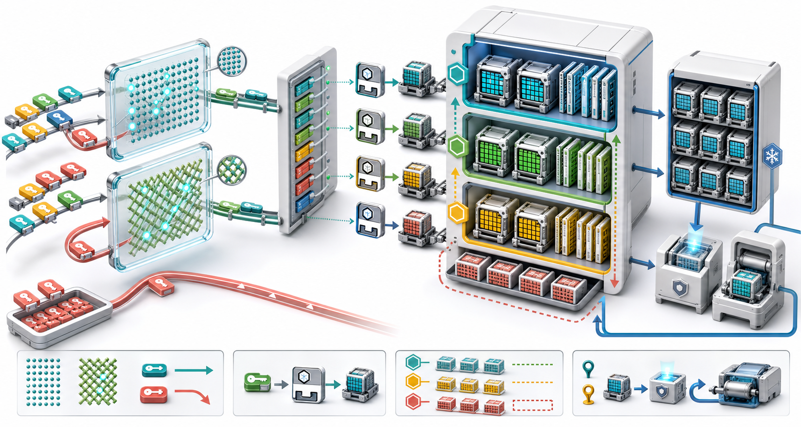

# RocksDB 读取优化：Bloom/Ribbon Filter 与多级 Block Cache

上一篇拆开了 BlockBasedTable：

~~~text
Footer -> MetaIndex -> Filter / Index -> Data Block
~~~

现在把注意力放到读取成本上。一次 Point Lookup 进入 SST 后，最昂贵的情况不是“比较几次 Key”，而是为了一个根本不存在的 Key 读取、校验并解压 Data Block。即使 Key 存在，如果每次都访问底层存储，延迟仍然很高。

RocksDB 用两类机制解决这两个问题：

- **Bloom/Ribbon Filter**：尽早证明 Key 不在 SST，避免无效 Data Block 读取；
- **Block Cache**：缓存真正需要的 Block，避免重复存储 I/O 与解压。

> 图 1：大量请求先经过 Bloom 或 Ribbon Filter；确定不存在的 Key 直接返回，可能存在的 Key 才进入 Index。随后以文件身份与 Block Offset 组成唯一 Cache Key，依次查询 Primary Cache、Compressed Secondary Cache 和存储层，并按元数据、普通数据与预读数据分配不同优先级。

## 1. Filter 与 Cache 解决不同问题

假设某次 Get 需要检查五个 SST。

没有 Filter，也没有 Cache：

~~~text
SST 1: Index Read + Data Read -> NotFound
SST 2: Index Read + Data Read -> NotFound
SST 3: Index Read + Data Read -> NotFound
SST 4: Index Read + Data Read -> NotFound
SST 5: Index Read + Data Read -> Found
~~~

有 Filter：

~~~text
SST 1: Filter says definitely absent
SST 2: Filter says definitely absent
SST 3: Filter says maybe -> read Data Block -> NotFound
SST 4: Filter says definitely absent
SST 5: Filter says maybe -> Found
~~~

再有 Cache：

~~~text
SST 3: Data Block cache hit
SST 5: Data Block cache hit
~~~

Filter 降低不必要的读取次数，Cache 降低必要读取的成本。二者互补。

## 2. 概率过滤器的契约

对一个已经正确构建的 Bloom/Ribbon Filter：

| Filter 返回 | 含义 |
| --- | --- |
| false | Key 一定没有被加入，可以跳过 SST |
| true | Key 可能被加入，必须继续查真实数据 |

Filter 允许 False Positive：

~~~text
Filter: may match
Data Block: actually absent
~~~

但正常实现不允许 False Negative：

~~~text
Filter: definitely absent
Data Block: actually present
~~~

False Negative 会直接丢失正确结果，属于数据正确性故障；False Positive 只损失性能。

## 3. Bloom Filter 的直觉

Bloom Filter 是一段 Bit Array 和若干 Hash Probe。

插入一个 Key：

~~~text
hash_1(key) -> set bit a
hash_2(key) -> set bit b
hash_3(key) -> set bit c
...
~~~

查询：

~~~text
任一 bit 为 0 -> 一定没插入
所有 bit 为 1 -> 可能插入过
~~~

不同 Key 会共享 Bit，随着 Filter 变满，所有 Probe 恰好都为 1 的概率上升，这就是 False Positive。

~~~mermaid
flowchart LR
  K["Query Key"] --> H1["Hash probe 1"]
  K --> H2["Hash probe 2"]
  K --> H3["Hash probe 3"]
  H1 --> B1{"Bit set?"}
  H2 --> B2{"Bit set?"}
  H3 --> B3{"Bit set?"}
  B1 -- No --> N["Definitely absent"]
  B2 -- No --> N
  B3 -- No --> N
  B1 -- Yes --> A["All probes must be set"]
  B2 -- Yes --> A
  B3 -- Yes --> A
  A --> M["May match"]
~~~

## 4. Bits Per Key 与 False Positive

理论 Bloom Filter 中：

~~~text
m = 总 bit 数
n = Key 数
k = Hash Probe 数

FPR ≈ (1 - exp(-k*n/m))^k
~~~

最优 Probe 数近似：

~~~text
k ≈ (m/n) * ln(2)
~~~

最优条件下：

~~~text
FPR ≈ 0.6185 ^ bits_per_key
~~~

理论上 10 Bits/Key 大约对应 0.8% 的 False Positive。RocksDB 的具体格式、取整和实现优化会让实际值略有差异，源码对 Ribbon API 给出的 Bloom 10 Bits/Key 等价示例约为 0.95%。

## 5. 配置 Bloom Filter

最常见配置：

~~~cpp
rocksdb::BlockBasedTableOptions table_options;
table_options.filter_policy.reset(
    rocksdb::NewBloomFilterPolicy(10, false));
table_options.whole_key_filtering = true;

options.table_factory.reset(
    rocksdb::NewBlockBasedTableFactory(table_options));
~~~

第二个参数是旧版 Block-Based Filter Builder 开关。当前源码说明，从 RocksDB 7.0 起它已被忽略；旧的低效 Block-Based Filter 不再通过公开 API 生成。

新代码仍可传 false 保持示例兼容，但不要把它误解为当前 Full Filter/Partitioned Filter 选择器。

## 6. Bits Per Key 不是越高越好

提高 Bits/Key：

- 降低 False Positive；
- 减少无效 Data Block Read；
- 增加 Filter 文件空间；
- 增加 Filter 内存或 Cache 占用；
- 可能增加 Probe CPU。

降低 Bits/Key：

- 节省空间；
- 增加 False Positive；
- 更频繁进入 Index/Data Block；
- 在远端或慢存储上代价可能很大。

正确目标不是“零 False Positive”，而是让一份 Filter 内存带来的 I/O 节省最大。

## 7. Full Filter 的构建

BlockBasedTableBuilder 创建 FilterBlockBuilder，并在加入每个 Point Key 时将 User Key 或 Prefix 送入 FilterBitsBuilder。

完成 SST 时：

~~~text
keys / prefixes
  -> FilterBitsBuilder
  -> Full Filter contents
  -> WriteFilterBlock()
  -> MetaIndex records fullfilter.<policy>
~~~

读取时 MetaIndex 找到 Filter Block，FilterPolicy 根据兼容名称创建对应 Reader。

Filter 不包含 Sequence Number。它回答的是 User Key/Prefix 是否可能存在于文件，而不是哪个版本对 Snapshot 可见。

## 8. Whole-Key Filtering

当前默认：

~~~cpp
table_options.whole_key_filtering = true;
~~~

构建时加入完整 User Key；Get 时调用 KeyMayMatch。

适合：

- 随机 Point Lookup；
- 完整 Key 查询占主导；
- Prefix Extractor 没有覆盖所有业务查询。

如果关闭 Whole-Key Filtering，且没有可用 Prefix，某些 Get 无法使用 Filter，只能保守返回 May Match。

## 9. Prefix Filtering

设置 Prefix Extractor：

~~~cpp
options.prefix_extractor.reset(
    rocksdb::NewFixedPrefixTransform(8));
~~~

Filter 可加入：

~~~text
prefix(key)
~~~

Iterator Seek、Prefix Scan 或 Whole-Key Filtering 关闭时，可以通过 PrefixMayMatch 排除整个前缀不在文件的情况。

必须保证：

- Prefix Extractor 对业务 Key 编码有效；
- 查询 Key 在 Transform Domain 内；
- Reader 当前 Prefix Extractor 与建表时兼容；
- Iterator 的 Total Order / Same Prefix 语义正确。

Filter 优化永远不能改变 Comparator 的正确结果。

## 10. Whole Key 与 Prefix 可以同时存在

当 Whole-Key Filtering 为 true 且配置 Prefix Extractor，Builder 可以同时加入完整 Key 与 Prefix：

~~~text
Put tenant42:user0001
  -> add whole key
  -> add prefix tenant42
~~~

这样 Point Get 使用完整 Key，Prefix Iterator 使用 Prefix。

代价是 Filter Entry 数增加，实际 Bits/Entry 分配与内存需求也会变化。设置了 10 Bits/Key 不意味着每个业务 Key 永远只占约 10 Bit。

## 11. Filter 在 Get 路径的位置

BlockBasedTable::Get 的核心结构：

~~~text
FullFilterKeyMayMatch()
  -> false: return OK, file has no candidate
  -> true:
       NewIndexIterator()
       Index Seek()
       NewDataBlockIterator()
       GetContext::SaveValue()
~~~

Filter 位于 Index/Data Block 之前。若 Index/Filter 都已在内存，Filter Miss 往往只需要 Hash 和少量内存访问。

## 12. 为什么 Filter 不能判断 Snapshot

一个 SST 可能包含：

~~~text
key@120 Value
key@100 Deletion
~~~

Filter 只知道 key 被加入过，不知道：

- Read Snapshot Sequence；
- 新版本是否太新；
- Range Tombstone 是否覆盖；
- Merge Operand 是否要继续向下查；
- Blob Index 是否要取 Blob。

所以 Filter 是物理读取优化，不是 MVCC 语义层。

## 13. Filter 的 True Positive 与 False Positive

源码统计：

~~~text
BLOOM_FILTER_FULL_POSITIVE
  Filter 返回 May Match 的次数

BLOOM_FILTER_FULL_TRUE_POSITIVE
  后续真实查找确实匹配的次数
~~~

近似 False Positive 数：

~~~text
FULL_POSITIVE - FULL_TRUE_POSITIVE
~~~

近似观测 FPR：

~~~text
(FULL_POSITIVE - FULL_TRUE_POSITIVE)
/ FULL_POSITIVE
~~~

这不是严格的理论 FPR，因为请求分布、文件选择、Merge 与边界都会影响统计，但足以发现配置是否明显失衡。

## 14. BLOOM_FILTER_USEFUL 的含义

当 Filter 成功证明 Key 不在文件，RocksDB 增加：

~~~text
BLOOM_FILTER_USEFUL
~~~

“Useful 很高”不必然表示配置完美，可能只是业务大量查询不存在 Key。应结合：

- 总 Filter Check；
- Data Block Read；
- Point Lookup 的 NotFound 比例；
- Filter 内存；
- 存储延迟；
- CPU。

Filter 最重要的收益是阻止后续 I/O，而不是让某个计数越大越好。

## 15. Ribbon Filter 是什么取舍

Ribbon 是 Bloom 的静态 Filter 替代方案，特别适合完成后不再修改的 SST。

当前 API 注释给出的典型取舍：

| 维度 | Bloom | Ribbon |
| --- | --- | --- |
| 最终 Filter 空间 | 基准 | 约节省 30% |
| 查询时间 | 很快 | 相近但略高 |
| 构建 CPU | 基准 | 约 3 到 4 倍 |
| 构建临时空间 | 较低 | 约 3 倍 |
| 使用场景 | 短寿命、上层 SST | 长寿命、较深层 SST |

数字是典型量级，不是所有硬件和 Key 分布的固定承诺。

## 16. 配置 Ribbon + Bloom Hybrid

~~~cpp
table_options.filter_policy.reset(
    rocksdb::NewRibbonFilterPolicy(
        10.0,  // Bloom-equivalent bits per key
        2));   // Levels before 2 use Bloom
~~~

bloom_before_level 的语义：

| 值 | 行为 |
| ---: | --- |
| 0 | Flush 使用 Bloom，其他情况倾向 Ribbon |
| -1 | 尽量总是使用 Ribbon |
| INT_MAX | 总是使用 Bloom |
| N > 0 | 小于 N 的 Level 使用 Bloom，N 及以后使用 Ribbon |

这利用了 LSM 生命周期：L0/L1 文件变化快，深层文件更大、更稳定，Ribbon 的长期内存节省更容易抵消构建成本。

## 17. Ribbon 的失败回退

Ribbon 构建比 Bloom 复杂，极端或资源不足场景可能回退到 Bloom。API 契约强调结果仍是兼容的 Built-In Filter。

因此 Ribbon 配置表达的是策略，不是“每一个 SST 必定含 Ribbon”。观测应查看 Table Properties 与构建统计，而不是只看 Options。

## 18. optimize_filters_for_memory

~~~cpp
table_options.optimize_filters_for_memory = true;
~~~

它会考虑分配器可用大小，调整 Filter 大小以减少内存内部碎片。目标不是简单减少磁盘字节，而是让分配后的实际内存 Charge 更接近期望。

该优化依赖 Format Version、平台分配器能力等条件。当前默认值应以 include/rocksdb/table.h 为准，升级时重新核对。

## 19. Partitioned Filter

单个大 SST 的 Full Filter 可能很大。Partitioned Filter 结构：

~~~text
Top-Level Filter Index
  -> Filter Partition 0
  -> Filter Partition 1
  -> ...
~~~

配置：

~~~cpp
table_options.index_type =
    rocksdb::BlockBasedTableOptions::kTwoLevelIndexSearch;
table_options.partition_filters = true;
table_options.metadata_block_size = 4096;
~~~

查询只加载对应 Partition，其余部分可以留在磁盘或 Cache 外。

~~~mermaid
flowchart LR
  K["Lookup Key"] --> T["Top-level filter index"]
  T --> P["One filter partition"]
  P --> M{"May match?"}
  M -- No --> N["Skip SST data"]
  M -- Yes --> I["Continue to index"]
~~~

## 20. Filter Partition 与 Block Cache

即使 cache_index_and_filter_blocks 为 false，Filter/Index Partition 也需要通过 Block Cache 管理。

原因是：

- 顶层目录很小，可由 TableReader 持有；
- Partition 数量可能很多；
- 按需读取后需要统一淘汰；
- 多个查询可以复用热点 Partition。

这意味着启用分区元数据后，Block Cache 不再只是 Data Block Cache。

## 21. Block Cache 缓存什么

Primary Block Cache 可以保存：

- 解压后的 Data Block；
- Index Block 或 Index Partition；
- Filter Block 或 Filter Partition；
- Compression Dictionary；
- Range Deletion/Properties 等可缓存对象；
- 某些内部预读或元数据对象。

每类对象通过 CacheItemHelper 提供销毁、序列化、反序列化等回调。

Block Cache 不缓存 DB::Get 返回的最终 std::string。那是 Row Cache 或应用 Cache 的不同抽象层。

## 22. Primary Cache 的基本路径

~~~mermaid
flowchart LR
  H["Data BlockHandle"] --> K["Build unique cache key"]
  K --> P{"Primary cache hit?"}
  P -- Yes --> U["Use uncompressed parsed block"]
  P -- No --> S{"Secondary cache hit?"}
  S -- Yes --> D["Reconstruct / decompress"]
  S -- No --> R["Read SST + verify checksum"]
  R --> D
  D --> A["Admit to primary cache"]
  A --> U
~~~

Primary Cache 保存适合立即读取的对象。命中时通常无需存储 I/O，也无需重新解压 Data Block。

## 23. 为什么 Cache Key 不能只用 Block Offset

几乎每个 SST 的第一个 Data Block 都可能位于 Offset 0。若 Cache Key 只用 Offset：

~~~text
SST A offset 0
SST B offset 0
~~~

会发生碰撞，读取到错误 Block，成为正确性灾难。

RocksDB 先构造每文件 Base Key：

~~~text
db_id + db_session_id + original/current file number
~~~

再叠加 Block Offset：

~~~text
CacheKey = OffsetableCacheKey(file identity)
           + encoded block offset
~~~

当前实现利用 Block 最小物理大小至少为 5 字节，压缩 Offset 的低位信息，形成固定大小 Key。

## 24. Stable Cache Key

较新 SST 的 Table Properties 保存：

- DB ID；
- DB Session ID；
- Original File Number。

这些信息使 Cache Key 在 DB Close/Open、Backup/Restore 等情况下更稳定。

旧 SST 缺少属性时，Reader 使用当前会话信息构造回退 Key，可能无法跨重启复用 Secondary/Persistent Cache Entry。

“稳定”仍要求文件身份管理正确，不能把不同内容的 SST 伪装成同一文件身份。

## 25. Cache Hit 之后的引用生命周期

Cache Lookup 返回 Handle，Handle Pin 住 Entry。读取代码把 Block 包装为 CachableEntry，并在 Iterator/Get 生命周期内持有引用。

~~~text
Lookup -> Cache::Handle
       -> parsed Block pointer
       -> use
       -> Release handle
~~~

被 Pin 的 Entry 即使触发淘汰也不能立即释放。长生命周期 Iterator 配合 pin_data 可能让大量 Data Block 长期占用 Cache。

## 26. Cache Miss 后发生什么

MaybeReadBlockAndLoadToCache 的主线：

~~~text
Primary miss
  -> optional Secondary lookup
  -> optional Prefetch Buffer
  -> RandomAccessFile Read
  -> verify Checksum
  -> decompress
  -> parse Block
  -> insert Primary Cache
  -> return pinned CachableEntry
~~~

ReadOptions::fill_cache 为 false 时，本次读取仍可查询已有 Cache Entry，但新读 Block 通常不加入 Primary Cache。

## 27. fill_cache 的正确理解

~~~cpp
rocksdb::ReadOptions ro;
ro.fill_cache = false;
~~~

适合一次性大扫描，避免把在线热点挤出 Cache。

它不表示：

- 禁止查询已有 Block Cache；
- 禁止 OS Page Cache；
- 禁止 FilePrefetchBuffer；
- 禁止所有元数据 Cache；
- 读取不再分配内存。

它主要控制本次读取的新 Block 是否填充 Block Cache。

## 28. LRUCache

LRUCache 使用分片降低锁竞争，并通过近似最近使用顺序淘汰 Entry。

推荐使用 Options 对象，而不是已标记 Deprecated 的便捷包装参数：

~~~cpp
rocksdb::LRUCacheOptions cache_options;
cache_options.capacity = 512ULL * 1024 * 1024;
cache_options.num_shard_bits = -1;
cache_options.strict_capacity_limit = false;
cache_options.high_pri_pool_ratio = 0.20;
cache_options.low_pri_pool_ratio = 0.0;

table_options.block_cache = cache_options.MakeSharedCache();
~~~

容量并非只包含 Value Payload，还可能包含对象、Allocator 与可选元数据 Charge，取决于配置。

## 29. HyperClockCache

当前源码明确说明：高并发场景一般推荐 HyperClockCache 优先于 LRUCache。

~~~cpp
rocksdb::HyperClockCacheOptions cache_options(
    512ULL * 1024 * 1024,
    0);  // 0 表示使用动态表变体

table_options.block_cache = cache_options.MakeSharedCache();
~~~

它使用高并发友好的 Counting-CLOCK 近似淘汰，通常降低热点 Cache 上的锁竞争。

取舍包括：

- Hit Rate 可能略高或略低于 LRU；
- 内存表与 Entry Charge 估计影响配置；
- 平台 mmap 支持和实现变体不同；
- 迁移必须以真实并发和命中率测试。

## 30. Cache Sharding

LRU/HyperClock 都会分片。分片减少并发争用，但每片独立容量也可能产生局部失衡：

~~~text
Shard A: cold and empty
Shard B: hot and constantly evicting
~~~

Cache 很小时分片过多尤其危险，因为单片连一个较大 Filter Block 都难以容纳。

因此 num_shard_bits 不是“越大并发越好”。应同时考虑：

- 总容量；
- 平均/最大 Block Charge；
- Thread 数；
- Key Hash 分布；
- Filter/Index 是否进入 Cache。

## 31. strict_capacity_limit

~~~cpp
cache_options.strict_capacity_limit = true;
~~~

严格模式努力不超过配置容量，插入可能失败；非严格模式在大量 Entry 被 Pin 时可能暂时超过容量。

选择取决于：

- 进程是否有硬内存上限；
- 能否容忍 Cache Insert Failure；
- Iterator/Read 是否长期 Pin；
- 监控是否覆盖 Pinned Usage；
- 是否使用 WriteBufferManager 计入同一预算。

严格容量不是免费安全带，插入失败也可能降低命中率并增加 I/O。

## 32. 三种优先级

| Priority | 典型对象 | 淘汰倾向 |
| --- | --- | --- |
| HIGH | Index/Filter 等高复用元数据 | 尽量晚淘汰 |
| LOW | Data Block、Properties | 普通 |
| BOTTOM | 投机预读 Block | 优先淘汰 |

启用：

~~~cpp
table_options.cache_index_and_filter_blocks = true;
table_options.cache_index_and_filter_blocks_with_high_priority = true;
~~~

还需要 Cache 配置 high_pri_pool_ratio，才能为高优先级 Entry 预留合理空间。

## 33. 为什么元数据常用 HIGH

一个 Index/Filter Block 可以服务同一 SST 的大量 Point Lookup，而一个 Data Block 只覆盖小 Key Range。

把元数据留在 Cache，常能：

- 让不存在 Key 快速被过滤；
- 避免读取 Index；
- 让 Data Cache 容量更有效；
- 稳定尾延迟。

但元数据总量过大时，HIGH Pool 过高会挤压 Data Block。优先级是相对策略，不是无限 Pin。

## 34. Pinning 与 Priority 的区别

Priority 影响淘汰顺序：

~~~text
仍可淘汰，只是倾向晚一点
~~~

Pinning 持有引用：

~~~text
引用释放前不能真正回收
~~~

配置 MetadataCacheOptions、L0 Pinning 或 Iterator pin_data 时要估算最坏 Pinned Usage。过度 Pin 会让容量配置失去弹性。

## 35. Secondary Cache

Primary Cache 通常保存解压对象，速度快但空间成本高。Secondary Cache 可以保存：

- 压缩后的 Block；
- 自定义序列化形式；
- NVM/远端介质上的 Cache Entry。

读取：

~~~text
Primary miss
  -> Secondary hit
  -> deserialize/decompress
  -> promote to Primary
~~~

Secondary Hit 避免存储读取和 Checksum 路径，但仍可能需要解压与对象重建。

## 36. Compressed Secondary Cache

当前 API 提供 CompressedSecondaryCacheOptions：

~~~cpp
rocksdb::CompressedSecondaryCacheOptions secondary_options;
secondary_options.capacity = 1024ULL * 1024 * 1024;
secondary_options.compression_type = rocksdb::kLZ4Compression;
auto secondary = secondary_options.MakeSharedSecondaryCache();

rocksdb::LRUCacheOptions primary_options;
primary_options.capacity = 512ULL * 1024 * 1024;
primary_options.secondary_cache = secondary;
table_options.block_cache = primary_options.MakeSharedCache();
~~~

Filter Block 本身通常不可压缩，默认 do_not_compress_roles 会避免对它做无意义压缩。

## 37. Tiered Cache

NewTieredCache 用一个总预算在 Primary 与 Compressed Secondary 之间分配：

~~~cpp
rocksdb::LRUCacheOptions primary_shape;

rocksdb::TieredCacheOptions tiered;
tiered.cache_opts = &primary_shape;
tiered.cache_type =
    rocksdb::PrimaryCacheType::kCacheTypeLRU;
tiered.total_capacity = 1536ULL * 1024 * 1024;
tiered.compressed_secondary_ratio = 0.67;

table_options.block_cache = rocksdb::NewTieredCache(tiered);
~~~

这是实验性/演进中的接口，升级前应按当前头文件复核字段和限制。

## 38. Promotion 与 Admission

Secondary Hit 后并非无条件永久驻留 Primary。系统要处理：

- 是否把重建对象 Promote；
- Primary 是否有容量；
- 是否已有并发请求插入同一 Key；
- Entry Priority；
- Secondary 是否保留副本；
- Admission Policy 是否判定值得进入。

相关统计：

~~~text
SECONDARY_CACHE_HITS
COMPRESSED_SECONDARY_CACHE_HITS
COMPRESSED_SECONDARY_CACHE_PROMOTIONS
COMPRESSED_SECONDARY_CACHE_PROMOTION_SKIPS
~~~

只看 Primary Hit Rate 会遗漏 Secondary 的实际贡献。

## 39. Cache-Only Read Tier

~~~cpp
rocksdb::ReadOptions ro;
ro.read_tier = rocksdb::kBlockCacheTier;
~~~

Cache Miss 时不做存储 I/O，而是返回 Incomplete。

适合：

- 必须控制同步请求尾延迟；
- 上层可异步回源；
- 预热状态探测；
- 尽力而为的热点读取。

调用者必须区分 Incomplete 与 NotFound。Cache Miss 不表示 Key 不存在。

## 40. Row Cache 不是 Block Cache

Row Cache 位于更高层，缓存用户 Key 的查询结果；Block Cache 缓存 SST 物理 Block。

| 维度 | Row Cache | Block Cache |
| --- | --- | --- |
| Key | 查询 User Key/上下文 | File Identity + Block Offset |
| Value | 用户结果 | Data/Index/Filter Block |
| 版本处理 | 更敏感 | 保存物理不可变块 |
| 多 Key 共享 | 较少 | 同块 Key 可共享 |
| 写入失效 | 需要处理 | SST 不可变，简单得多 |

本文聚焦 Block Cache。不能把两个 Cache 的容量或命中率混在一起。

## 41. 完整可运行实验

程序写入偶数 Key，随后查询位于文件范围内但不存在的奇数 Key，用 Bloom Filter 制造 Useful；再重复读取存在 Key，观察 Data Block Cache Hit。

~~~cpp
#include <chrono>
#include <cstdio>
#include <cstdlib>
#include <iostream>
#include <memory>
#include <string>

#include "rocksdb/cache.h"
#include "rocksdb/db.h"
#include "rocksdb/filter_policy.h"
#include "rocksdb/options.h"
#include "rocksdb/statistics.h"
#include "rocksdb/table.h"

void Check(const rocksdb::Status& s) {
  if (!s.ok()) {
    std::cerr << s.ToString() << "\n";
    std::abort();
  }
}

std::string Key(int n) {
  char buf[32];
  std::snprintf(buf, sizeof(buf), "item:%08d", n);
  return buf;
}

void PrintTicker(
    const std::shared_ptr<rocksdb::Statistics>& stats,
    rocksdb::Tickers ticker,
    const char* name) {
  std::cout << name << "="
            << stats->getTickerCount(ticker) << "\n";
}

int main() {
  const auto suffix =
      std::chrono::steady_clock::now().time_since_epoch().count();
  const std::string path =
      "/tmp/rocksdb-filter-cache-" + std::to_string(suffix);

  rocksdb::Options options;
  options.create_if_missing = true;
  options.statistics = rocksdb::CreateDBStatistics();

  rocksdb::LRUCacheOptions cache_options;
  cache_options.capacity = 64 * 1024;
  cache_options.num_shard_bits = 0;
  cache_options.strict_capacity_limit = false;
  cache_options.high_pri_pool_ratio = 0.20;

  rocksdb::BlockBasedTableOptions table_options;
  table_options.block_size = 1024;
  table_options.block_cache = cache_options.MakeSharedCache();
  table_options.cache_index_and_filter_blocks = true;
  table_options.cache_index_and_filter_blocks_with_high_priority = true;
  table_options.filter_policy.reset(
      rocksdb::NewBloomFilterPolicy(10, false));
  table_options.whole_key_filtering = true;
  options.table_factory.reset(
      rocksdb::NewBlockBasedTableFactory(table_options));

  std::unique_ptr<rocksdb::DB> db;
  Check(rocksdb::DB::Open(options, path, &db));

  for (int i = 0; i < 5000; ++i) {
    Check(db->Put(
        rocksdb::WriteOptions(),
        Key(i * 2),
        std::string(128, static_cast<char>('a' + i % 26))));
  }

  rocksdb::FlushOptions flush;
  flush.wait = true;
  Check(db->Flush(flush));

  rocksdb::ReadOptions ro;
  std::string value;

  // Odd keys are absent but lie inside the SST key range.
  for (int i = 0; i < 5000; ++i) {
    rocksdb::Status s = db->Get(ro, Key(i * 2 + 1), &value);
    if (!s.IsNotFound()) {
      Check(s);
    }
  }

  // Read a working set twice. The second pass can reuse surviving blocks.
  for (int pass = 0; pass < 2; ++pass) {
    for (int i = 0; i < 500; ++i) {
      Check(db->Get(ro, Key(i * 2), &value));
    }
  }

  auto stats = options.statistics;
  PrintTicker(stats, rocksdb::BLOOM_FILTER_USEFUL,
              "bloom_useful");
  PrintTicker(stats, rocksdb::BLOOM_FILTER_FULL_POSITIVE,
              "bloom_positive");
  PrintTicker(stats, rocksdb::BLOOM_FILTER_FULL_TRUE_POSITIVE,
              "bloom_true_positive");
  PrintTicker(stats, rocksdb::BLOCK_CACHE_DATA_HIT,
              "data_hit");
  PrintTicker(stats, rocksdb::BLOCK_CACHE_DATA_MISS,
              "data_miss");
  PrintTicker(stats, rocksdb::BLOCK_CACHE_INDEX_HIT,
              "index_hit");
  PrintTicker(stats, rocksdb::BLOCK_CACHE_FILTER_HIT,
              "filter_hit");

  db.reset();
  Check(rocksdb::DestroyDB(path, options));
}
~~~

Cache 只有 64 KiB，无法容纳所有 Data Block，因此结果会体现真实淘汰，不应期待第二轮 100% 命中。

## 42. 编译与运行

~~~bash
g++ -std=c++17 -O2 filter_cache_demo.cc \
  -I./include -L. -lrocksdb \
  -lpthread -ldl -lz -lbz2 -llz4 -lzstd -lsnappy \
  -o filter_cache_demo

./filter_cache_demo
~~~

链接依赖按本地 RocksDB 构建配置调整。

## 43. 如何解释实验指标

预期趋势：

~~~text
bloom_useful
  应显著增长，因为大量奇数 Key 被排除

bloom_positive
  包含真实存在 Key与少量 False Positive

bloom_true_positive
  主要来自偶数 Key

data_miss
  第一轮读取工作集时增长

data_hit
  第二轮对仍在 Cache 的块增长
~~~

若 Useful 为 0，优先检查：

- 查询是否仍命中 MemTable；
- 数据是否已经 Flush；
- Filter 是否真正写入 SST；
- Whole-Key/Prefix 配置；
- 查询是否被 File Range 先排除；
- Statistics 是否在 DB Open 前设置。

## 44. 核心观测指标

| 指标 | 含义 |
| --- | --- |
| BLOOM_FILTER_USEFUL | 成功避免后续 SST 查找 |
| BLOOM_FILTER_FULL_POSITIVE | Full Filter 返回 May Match |
| BLOOM_FILTER_FULL_TRUE_POSITIVE | 后续确认真实匹配 |
| BLOCK_CACHE_DATA_HIT/MISS | Data Block 命中/未命中 |
| BLOCK_CACHE_INDEX_HIT/MISS | Index Block 命中/未命中 |
| BLOCK_CACHE_FILTER_HIT/MISS | Filter Block 命中/未命中 |
| BLOCK_CACHE_ADD_FAILURES | Cache 插入失败 |
| SECONDARY_CACHE_HITS | Secondary Cache 命中 |
| BLOCK_CACHE_BYTES_READ | 从 Cache 读取字节 |
| BLOCK_CACHE_BYTES_WRITE | 写入 Cache 字节 |

常用比率：

~~~text
Data Hit Rate =
  DATA_HIT / (DATA_HIT + DATA_MISS)

Observed Full Filter False Positive Share ≈
  (FULL_POSITIVE - FULL_TRUE_POSITIVE)
  / FULL_POSITIVE
~~~

要按 Block Type 分开看，汇总命中率可能被常驻 Filter/Index 美化。

## 45. Cache 容量怎么估

先建立预算：

~~~text
进程内存上限
- MemTable / Immutable MemTable
- Iterator / Read Buffer
- TableReader 元数据
- Write/Compaction Buffer
- 压缩字典与构建临时内存
- 应用对象与线程栈
- 安全余量
= 可给 Block Cache 的预算
~~~

再按工作集决定 Primary/Secondary 比例。不要用“机器内存的固定百分比”替代完整预算。

同时观测：

- Cache Usage；
- Pinned Usage；
- Estimated Entry Charge；
- RSS 与 Allocator Fragmentation；
- Eviction/Insert Failure；
- Data、Index、Filter 各自占比。

## 46. 常见误区

### 误区一：Filter 返回 true 表示 Key 存在

错误。只表示可能存在。

### 误区二：Bloom 有概率漏掉已加入 Key

正常实现不允许 False Negative；允许的是 False Positive。

### 误区三：Bits/Key 越高越好

错误。更低 FPR 要付出 Filter 内存与 CPU。

### 误区四：Ribbon 永远比 Bloom 好

错误。Ribbon 省最终空间，但构建 CPU 和临时内存更高。

### 误区五：Block Cache Key 就是 User Key

错误。它由 SST 文件身份与 Block Offset 派生。

### 误区六：fill_cache=false 完全绕过 Cache

错误。已有 Entry 仍可命中，它主要禁止新 Block 填充。

### 误区七：Priority HIGH 等于 Pin

错误。HIGH 仍可淘汰；Pin 在引用释放前不可回收。

### 误区八：总体 Hit Rate 高就说明 Cache 健康

错误。必须分 Data/Index/Filter 与 Primary/Secondary。

### 误区九：Cache Miss 就是 NotFound

错误。kBlockCacheTier 的 Cache Miss 返回 Incomplete。

### 误区十：OS Page Cache 可以替代 Block Cache

不完全。Page Cache 保存文件页，Block Cache 保存校验、解压和解析后的对象，两者成本层级不同。

## 47. 源码阅读顺序

~~~text
include/rocksdb/filter_policy.h
  -> util/bloom_impl.h
  -> util/ribbon_config.h
  -> table/block_based/filter_policy.cc
  -> table/block_based/full_filter_block.cc
  -> table/block_based/partitioned_filter_block.cc
  -> include/rocksdb/cache.h
  -> cache/cache_key.h
  -> cache/typed_cache.h
  -> table/block_based/block_cache.cc
  -> table/block_based/block_based_table_reader.cc
  -> include/rocksdb/secondary_cache.h
~~~

重点入口：

- [filter_policy.h](../include/rocksdb/filter_policy.h)：Bloom/Ribbon API 与取舍；
- [filter_policy.cc](../table/block_based/filter_policy.cc)：Built-In Filter 实现；
- [full_filter_block.cc](../table/block_based/full_filter_block.cc)：Full Filter Builder/Reader；
- [partitioned_filter_block.cc](../table/block_based/partitioned_filter_block.cc)：Filter Partition；
- [cache.h](../include/rocksdb/cache.h)：LRU、HyperClock、Secondary 与 Tiered Cache；
- [cache_key.h](../cache/cache_key.h)：OffsetableCacheKey；
- [typed_cache.h](../cache/typed_cache.h)：类型安全 Cache Helper；
- [block_cache.cc](../table/block_based/block_cache.cc)：Block Cache 公共逻辑；
- [block_based_table_reader.cc](../table/block_based/block_based_table_reader.cc)：Filter Check、Cache Lookup 与回源；
- [secondary_cache.h](../include/rocksdb/secondary_cache.h)：Secondary Cache 接口；
- [Block Cache 专题](../docs/components/read_flow/06_block_cache.md)：仓库内读取说明。

## 48. 本篇小结

~~~text
过滤目标：在 Index/Data Block 前证明 Key 不在 SST
Bloom 契约：false = 一定没有，true = 可能有
Bloom 空间：Bits/Key 越高，FPR 越低，内存越大
Ribbon 取舍：约省 30% 空间，构建 CPU/临时内存更高
混合策略：上层 Bloom，长寿命深层 Ribbon
过滤粒度：Whole Key、Prefix、Full、Partitioned
Primary Cache：保存可立即读取的解压 Block
Cache Key：文件身份 + Block Offset，不能只用 Offset
Secondary Cache：压缩/序列化 Block，命中后重建并提升
淘汰策略：LRU 或高并发友好的 HyperClock
优先级：Index/Filter HIGH，Data LOW，投机预读 BOTTOM
Pinning：持有引用，与 Priority 不同
只读 Cache：kBlockCacheTier Miss 返回 Incomplete
观测原则：Filter、Block Type、Primary/Secondary 分开统计
~~~

Filter 与 Block Cache 共同把“可能需要访问很多 SST”的最坏读取，变成少量内存 Probe 和热点 Block 复用。Filter 的价值来自可靠排除，Cache 的价值来自跨请求共享。真正有效的配置不是堆叠所有开关，而是用不存在 Key 比例、FPR、各类 Block Hit Rate、Pinned Usage、I/O 与 CPU 建立一套闭环。

下一篇将进入 Compaction：理解 LSM 如何选择输入文件、合并多个有序流、丢弃旧版本和 Tombstone，并分析读放大、写放大与空间放大之间无法回避的三角关系。

## 参考入口

- [Bloom/Ribbon API](../include/rocksdb/filter_policy.h)；
- [BlockBasedTableOptions](../include/rocksdb/table.h)；
- [Cache API](../include/rocksdb/cache.h)；
- [Secondary Cache API](../include/rocksdb/secondary_cache.h)；
- [Filter 实现](../table/block_based/filter_policy.cc)；
- [Full Filter](../table/block_based/full_filter_block.cc)；
- [Partitioned Filter](../table/block_based/partitioned_filter_block.cc)；
- [Block Cache](../table/block_based/block_cache.cc)；
- [BlockBasedTable Reader](../table/block_based/block_based_table_reader.cc)；
- [Statistics](../include/rocksdb/statistics.h)；
- [Ribbon Filter 设计文章](../docs/_posts/2021-12-29-ribbon-filter.markdown)。
