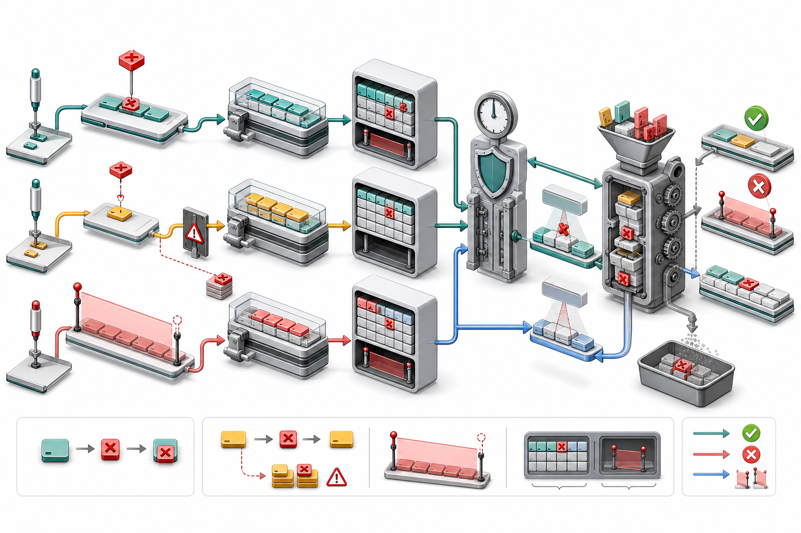

# RocksDB 删除语义：Delete、SingleDelete 与 DeleteRange 生命周期

关系数据库常把 Delete 想象为“找到记录并从页中移除”。LSM Tree 不能原地修改已经写好的 SST，RocksDB 的删除首先是一条新记录：

~~~text
old: key@100 Value
new: key@120 Deletion
~~~

读取遇到较新的 Tombstone 后隐藏旧 Value，后台 Compaction 再在确认不会破坏 Snapshot、不会让深层旧值复活时回收二者。

RocksDB 提供三种主要删除语义：

- Delete：通用 Point Tombstone；
- SingleDelete：承诺只匹配一个 Put 的优化 Tombstone；
- DeleteRange：覆盖半开 Key 区间的 Range Tombstone。

> 图 1：三种删除先进入 WriteBatch 和 MemTable；Point Tombstone 与普通 Internal Key 一起写入 Data Block，Range Tombstone 写入独立 SST Meta Block。读取按 Snapshot 判断遮蔽关系，Compaction 只有在确认下层无旧值复活风险时才丢弃 Tombstone。

## 1. 为什么不能立即物理删除

执行：

~~~cpp
db->Delete(rocksdb::WriteOptions(), "user:42");
~~~

RocksDB 不知道旧版本只存在于一个位置：

~~~text
Mutable MemTable
Immutable MemTable
L0 file A
L0 file B
L2 file
Blob file reference
~~~

同步查遍并改写所有 SST 会让 Delete 变成昂贵随机写。RocksDB 选择追加 Tombstone，把成本移到顺序写和后台 Compaction。

## 2. 三种 API 对照

| API | Internal ValueType | 覆盖范围 | 关键约束 |
| --- | --- | --- | --- |
| Delete | kTypeDeletion | 一个 User Key 的旧版本 | 通用、安全 |
| SingleDelete | kTypeSingleDeletion | 恰好一个匹配 Put | 调用者必须满足契约 |
| DeleteRange | kTypeRangeDeletion | [begin, end) | end 不包含 |

选择原则：

~~~text
不确定 -> Delete
严格一 Put 一 Delete -> 才考虑 SingleDelete
连续大范围删除 -> DeleteRange
~~~

## 3. WriteBatch 编码

DB API 最终通常进入 WriteBatch：

~~~cpp
rocksdb::WriteBatch batch;
batch.Delete("a");
batch.SingleDelete("b");
batch.DeleteRange("c", "f");
db->Write(rocksdb::WriteOptions(), &batch);
~~~

Batch Record 用不同 Tag 区分操作，写入组分配连续 Sequence Number。恢复 WAL 时，同样的 Handler 回放这些操作到 MemTable。

~~~mermaid
flowchart LR
  A["Delete APIs"] --> B["WriteBatch record tags"]
  B --> W["WAL append"]
  W --> M["MemTable insertion"]
  M --> F["Flush to SST"]
~~~

## 4. Delete 的 Internal Key

~~~text
InternalKey =
  UserKey + SequenceNumber + kTypeDeletion
Value = empty
~~~

同一 User Key 内 Sequence 降序，因此新 Tombstone 排在旧 Value 前：

~~~text
key@120 Deletion
key@100 Value old
~~~

Snapshot 120 的读取先看到 Delete，返回 NotFound；Snapshot 110 看不到 Sequence 120，仍能读取 old。

## 5. Delete 是幂等语义

对不存在 Key 执行 Delete 通常仍可成功写入 Tombstone：

~~~cpp
db->Delete(wo, "missing-key");
~~~

RocksDB 不先做 Get，因为：

- Get 增加 I/O 与竞争；
- 检查后到写入前仍有并发竞态；
- Tombstone 本身能表达顺序语义；
- 后台会在安全时回收无效删除。

因此 Status::OK 表示删除记录已接受，不表示之前一定存在 Value。

## 6. SingleDelete 的承诺

SingleDelete 不是“更强的 Delete”，而是调用者提供额外事实：

~~~text
从上次删除边界起，这个 Key 恰好有一次 Put，
并且 SingleDelete 与该 Put 可以成对消除。
~~~

正确：

~~~text
Put(k, v)
SingleDelete(k)
~~~

危险：

~~~text
Put(k, v1)
Put(k, v2)
SingleDelete(k)
~~~

或：

~~~text
Merge(k, operand)
SingleDelete(k)
~~~

违反契约的行为不应依赖，可能返回非预期历史值或在 Compaction 后出现语义问题。

## 7. 为什么 SingleDelete 可能更高效

普通 Delete 必须保留到确认所有更深层旧值都被覆盖。SingleDelete 若与唯一 Put 配对，可在更局部的 Compaction 中一起消除：

~~~text
SingleDelete@120
Put@100
  -> both dropped when snapshot-safe
~~~

它减少 Tombstone 向深层传播的机会，适合：

- 临时唯一对象；
- 确定无重复 Put 的生命周期；
- 创建一次、删除一次的 Key。

如果业务模型不能证明契约，节省不值得承担正确性风险。

## 8. DeleteRange 的半开区间

~~~cpp
db->DeleteRange(wo, "b", "f");
~~~

覆盖：

~~~text
[b, f)
~~~

即 b、c、d、e 被删除，f 不删除。

空区间或 Comparator 下 begin >= end 是无效输入。自定义 Comparator 下的区间顺序由 Comparator 定义，不一定是字节序。

## 9. Range Tombstone 表示

逻辑形式：

~~~text
start_key
end_key
sequence
optional timestamp
~~~

序列化时 Start 形成 kTypeRangeDeletion Internal Key，End 通常作为 Value/边界信息。

它不等于为区间内每个现存 Key 生成 Point Delete，因此可以用一条记录删除百万 Key。

## 10. MemTable 中的 Range Delete

Point Entry 与 Range Tombstone 使用不同结构。读取 MemTable 时：

1. Point Lookup 找候选 Value/Delete；
2. Range Tombstone Iterator 查找覆盖 User Key 的最高可见 Sequence；
3. 若 Tombstone Sequence 更高，候选 Point Entry 被视为删除。

~~~text
point: key@100 Value
range: [a,z)@120
snapshot: 130
result: deleted
~~~

Snapshot 110 看不到 Range Tombstone，仍可读取 Value。

## 11. SST 中的存储差异

Point Delete/SingleDelete 与普通 Point Entry 一起进入 Data Block：

~~~text
Data Block:
  key@120 kTypeDeletion
  key@100 kTypeValue
~~~

Range Tombstone 写入独立 Range Deletion Meta Block：

~~~text
MetaIndex:
  rocksdb.range_del -> BlockHandle
~~~

这样 Point Index 不需要为区间内每个 Key 膨胀，Range Iterator 也能独立 Fragment 和 Seek。

## 12. GetContext 如何解释删除

GetContext::SaveValue 遇到：

~~~text
kTypeDeletion
kTypeDeletionWithTimestamp
kTypeSingleDeletion
kTypeRangeDeletion
~~~

通常把状态从 kNotFound 转为 kDeleted；Version::Get 最终返回 Status::NotFound。

如果之前已收集 Merge Operand，Delete 可以作为“无 Base Value”的边界触发 Merge 解析。

## 13. Range Tombstone 覆盖 Point Entry

BlockBasedTable 读取时先取得覆盖目标 Key 的最大 Range Tombstone Sequence：

~~~text
max_covering_tombstone_seq
~~~

若：

~~~text
range_tombstone_seq > point_entry_seq
~~~

GetContext 把 Point Entry 当作 kTypeRangeDeletion 处理。

若 Point Entry 更新：

~~~text
[a,z)@120 DeleteRange
key@130 Value new
~~~

Value 更新，最终仍可见。

## 14. Iterator 的活动 Tombstone

MergingIterator 将每层 TruncatedRangeDelIterator 纳入堆状态。

正向扫描：

~~~text
到达 start -> Tombstone 变 active
扫描覆盖范围 -> 跳过更旧 Point Keys
到达 end -> Tombstone 失效
~~~

若覆盖范围很大，Iterator 可把 Child Seek 到 End，而不是逐 Key Next。

~~~mermaid
flowchart LR
  P["Current point key"] --> C{"Covered by visible range tombstone?"}
  C -- No --> V["Continue value resolution"]
  C -- Yes --> E["Seek child toward tombstone end"]
  E --> C
~~~

## 15. Range Tombstone Fragmentation

多个区间可能重叠：

~~~text
[a, f)@100
[c, h)@120
~~~

FragmentedRangeTombstoneList 将它们转换成不重叠片段，并记录各片段可见 Tombstone：

~~~text
[a,c) -> 100
[c,f) -> 120 and 100
[f,h) -> 120
~~~

这让覆盖查询和 Snapshot 过滤更高效。

## 16. 文件边界截断

Range Tombstone 可以跨多个 SST 输出边界：

~~~text
DeleteRange [a, z)
Output file 1 [a, m)
Output file 2 [m, z]
~~~

Compaction 会为各文件生成适当片段，使单文件 Reader 能正确判断覆盖范围，同时保持逻辑区间不变。

## 17. Snapshot 为什么阻止回收

~~~text
key@120 Delete
key@100 Value
snapshot sequence = 110
~~~

当前读返回 NotFound，但 Snapshot 110 应看到 Value。Compaction 必须保留旧 Value，通常也要保留删除记录用于更新视图。

长期 Snapshot 会让：

- Point Tombstone 存活更久；
- Range Tombstone 继续 Fragment/传播；
- 旧 Value 无法回收；
- SST 与 Iterator Skip 增加。

## 18. 旧值复活风险

假设：

~~~text
L1: key@120 Delete
L3: key@80 Value
~~~

若只 Compact L1 并丢掉 Tombstone，之后读取会在 L3 找到旧 Value，Key 复活。

所以 CompactionIterator 丢弃 Point Tombstone 前要确认：

- 对所有 Snapshot 足够旧；
- 更深层不存在该 Key，或当前 Compaction 覆盖了相关 Base Level；
- 没有历史保留约束。

## 19. Bottommost Compaction

当 Compaction 到达最底层且范围完整，系统更容易证明没有更深旧版本，因此能积极回收 Tombstone。

手动：

~~~cpp
rocksdb::CompactRangeOptions cro;
cro.bottommost_level_compaction =
    rocksdb::BottommostLevelCompaction::kForce;
db->CompactRange(cro, nullptr, nullptr);
~~~

这可能重写大量数据，不能只为“清 Tombstone”频繁执行。

## 20. Range Tombstone 的回收条件

Range Delete 比 Point Delete 更复杂：

- 区间下仍可能有深层 Point Key；
- Snapshot 可能需要被覆盖的 Value；
- 输出文件边界要求 Fragment；
- 与其他 Range Tombstone 可能重叠；
- Comparator Timestamp 影响边界；
- Compaction 可能只覆盖区间一部分。

因此磁盘空间不会在 DeleteRange 返回时立即下降，甚至短期因新 Tombstone 与 Compaction 输出增加。

## 21. Delete 与 Merge

~~~text
key@130 Merge +1
key@120 Delete
key@100 Value 10
~~~

Delete 是 Merge Operand 搜索的边界。MergeOperator 可能以 No Base Value 解析 +1，而不能穿过 Delete 使用旧 Value 10。

SingleDelete 与 Merge 的组合有严格限制；不确定时使用普通 Delete。

## 22. WAL 与崩溃恢复

删除先写 WAL，再应用 MemTable：

~~~text
WriteBatch(Delete)
  -> WAL record durable
  -> MemTable Tombstone
~~~

崩溃后 Replay 恢复相同 Tombstone。若 disableWAL，删除和普通 Put 一样可能在 MemTable Flush 前丢失。

删除操作本身并不天然比 Put 更耐久。

## 23. DeleteRange 与 Prefix

DeleteRange 按 Comparator 区间，不是按 Prefix 语义。

删除 Prefix p 的常见做法是：

~~~text
[p, PrefixSuccessor(p))
~~~

仅适用于能正确构造 Comparator 后继边界的 Key Encoding。自定义 Comparator、Timestamp 或全 0xff 后缀需要业务专门处理。

## 24. 大量 Point Delete 与 DeleteRange

删除连续百万 Key：

~~~text
百万次 Delete:
  百万 Internal Entries
  大 WAL/MemTable/SST
  Iterator 跳过成本

一次 DeleteRange:
  少量 Range Tombstone
  读取按区间遮蔽
  Compaction Fragment 成本
~~~

DeleteRange 通常更合适，但它删除的是 Comparator 区间。数据布局若把多个租户交错，范围删除可能误伤。

## 25. 可运行实验

~~~cpp
#include <chrono>
#include <cstdlib>
#include <iostream>
#include <memory>
#include <string>

#include "rocksdb/db.h"
#include "rocksdb/options.h"

void Check(const rocksdb::Status& s) {
  if (!s.ok()) {
    std::cerr << s.ToString() << "\n";
    std::abort();
  }
}

void PrintGet(rocksdb::DB* db, const rocksdb::ReadOptions& ro,
              const std::string& key, const char* label) {
  std::string value;
  rocksdb::Status s = db->Get(ro, key, &value);
  std::cout << label << " " << key << ": "
            << (s.ok() ? value : s.ToString()) << "\n";
}

int main() {
  const auto suffix =
      std::chrono::steady_clock::now().time_since_epoch().count();
  const std::string path =
      "/tmp/rocksdb-delete-" + std::to_string(suffix);

  rocksdb::Options options;
  options.create_if_missing = true;

  std::unique_ptr<rocksdb::DB> db;
  Check(rocksdb::DB::Open(options, path, &db));

  Check(db->Put({}, "point", "old-point"));
  Check(db->Put({}, "single", "only-value"));
  Check(db->Put({}, "range:b", "B"));
  Check(db->Put({}, "range:c", "C"));
  Check(db->Put({}, "range:d", "D"));
  Check(db->Put({}, "range:e", "E"));

  const rocksdb::Snapshot* snapshot = db->GetSnapshot();

  Check(db->Delete({}, "point"));
  Check(db->SingleDelete({}, "single"));
  Check(db->DeleteRange({}, "range:b", "range:e"));
  Check(db->Put({}, "range:c", "C-new"));

  rocksdb::ReadOptions current;
  rocksdb::ReadOptions old;
  old.snapshot = snapshot;

  PrintGet(db.get(), current, "point", "current");
  PrintGet(db.get(), old, "point", "snapshot");
  PrintGet(db.get(), current, "single", "current");
  PrintGet(db.get(), old, "single", "snapshot");

  for (const char* key :
       {"range:b", "range:c", "range:d", "range:e"}) {
    PrintGet(db.get(), current, key, "current");
  }

  db->ReleaseSnapshot(snapshot);

  rocksdb::FlushOptions fo;
  fo.wait = true;
  Check(db->Flush(fo));

  rocksdb::CompactRangeOptions cro;
  Check(db->CompactRange(cro, nullptr, nullptr));

  db.reset();
  Check(rocksdb::DestroyDB(path, options));
}
~~~

预期当前视图：

~~~text
point    -> NotFound
single   -> NotFound
range:b  -> NotFound
range:c  -> C-new
range:d  -> NotFound
range:e  -> E
~~~

因为 DeleteRange 是 [range:b, range:e)，并且 range:c 在删除后重新 Put。

旧 Snapshot 仍看到删除前的 Point/Single Value。调用 CompactRange 前必须先释放 Snapshot，否则旧版本仍需保留。

## 26. 编译运行

~~~bash
g++ -std=c++17 -O2 delete_demo.cc \
  -I./include -L. -lrocksdb \
  -lpthread -ldl -lz -lbz2 -llz4 -lzstd -lsnappy \
  -o delete_demo

./delete_demo
~~~

依赖按本地 RocksDB 构建调整。

## 27. 如何观察 Tombstone

Table Properties：

~~~text
rocksdb.num.deletions
rocksdb.num.range-deletions
rocksdb.num.merge-operands
~~~

sst_dump：

~~~bash
./sst_dump --file=/path/to/file.sst \
  --command=raw \
  --show_sequence_number_type
~~~

数据库属性和 Statistics 可关注：

- 每层文件数；
- Live Data Size 与 Total SST Size；
- Estimate Pending Compaction Bytes；
- Compaction Input/Output Records；
- NUMBER_ITER_SKIP；
- Write Stall；
- Snapshot 数量与年龄。

删除量大但空间不降时，先检查 Snapshot 和 Compaction 是否到达含旧值的底层范围。

## 28. 常见误区

### 误区一：Delete 返回后磁盘空间立即下降

错误。它先增加一条 Tombstone。

### 误区二：Delete 会先检查 Key 是否存在

错误。通常直接追加 Tombstone。

### 误区三：SingleDelete 适合所有唯一 Key

错误。它要求删除边界间严格的一 Put 一 SingleDelete 契约。

### 误区四：DeleteRange 的 End 包含

错误。区间是 [begin, end)。

### 误区五：Range Delete 会展开成大量 Point Delete

错误。它使用独立 Range Tombstone。

### 误区六：Compaction 看到 Tombstone 就能丢

错误。必须防止 Snapshot 失真和深层旧值复活。

### 误区七：关闭 WAL 的 Delete 仍完全耐久

错误。它与 Put 一样可能在 Flush 前丢失。

### 误区八：删除后重新 Put 仍不可见

错误。Sequence 更高的新 Put 会覆盖旧 Tombstone。

## 29. API 选择清单

| 场景 | 推荐 |
| --- | --- |
| 普通删除，不确定历史 | Delete |
| 严格创建一次删除一次 | 可评估 SingleDelete |
| 连续 Key 区间批量删除 | DeleteRange |
| Prefix 删除 | 正确构造范围后 DeleteRange |
| 立即回收空间 | 删除后评估 Compaction，不保证即时 |
| 保留旧视图 | Snapshot，但监控空间代价 |
| TTL | CompactionFilter/TTL 设计，不要逐条定时 Delete |

## 30. 源码阅读顺序

~~~text
include/rocksdb/db.h
  -> db/write_batch.cc
  -> db/write_batch_internal.h
  -> db/memtable.cc
  -> db/range_del_aggregator.cc
  -> table/get_context.cc
  -> table/merging_iterator.cc
  -> table/block_based/block_based_table_builder.cc
  -> db/compaction/compaction_iterator.cc
~~~

重点入口：

- [DB API](../include/rocksdb/db.h)；
- [WriteBatch](../db/write_batch.cc)；
- [MemTable](../db/memtable.cc)；
- [Range Delete Aggregator](../db/range_del_aggregator.cc)；
- [GetContext](../table/get_context.cc)；
- [MergingIterator](../table/merging_iterator.cc)；
- [BlockBasedTable Builder](../table/block_based/block_based_table_builder.cc)；
- [CompactionIterator](../db/compaction/compaction_iterator.cc)；
- [Tombstone Lifecycle](../docs/components/write_flow/08_tombstone_lifecycle.md)；
- [Range Deletions](../docs/components/read_flow/08_range_deletions.md)。

## 31. 本篇小结

~~~text
Delete：通用 Point Tombstone，安全但可能传播到深层
SingleDelete：以严格一 Put 一 Delete 契约换取更早回收
DeleteRange：用 [begin,end) Tombstone 删除 Comparator 区间
写入：Batch Tag -> WAL -> MemTable
SST：Point Tombstone 在 Data Block，Range Tombstone 在独立 Meta Block
读取：较高可见 Sequence 的 Tombstone 遮蔽旧 Value
更新：更高 Sequence 的 Put 可以重新建立 Value
Snapshot：保留删除前视图，也阻止旧版本回收
Compaction：确认 Base Level 安全后才能丢 Tombstone
风险：过早删除 Tombstone 会让深层旧值复活
~~~

在 LSM Tree 中，删除不是一个瞬间动作，而是一段生命周期。前台写入 Tombstone 以保持低延迟，读取路径解释它的可见性，Compaction 最终偿还空间债务。理解三种删除 API 的契约，才能在正确性、写入成本、扫描效率和空间回收之间作出可靠选择。

下一篇将进入 RocksDB 事务：比较 TransactionDB 的悲观锁与 OptimisticTransactionDB 的提交验证，并理解 WriteBatchWithIndex、冲突检测和 Snapshot 隔离边界。

## 参考入口

- [Delete APIs](../include/rocksdb/db.h)；
- [WriteBatch API](../include/rocksdb/write_batch.h)；
- [WriteBatch 实现](../db/write_batch.cc)；
- [Range Tombstone](../db/range_tombstone_fragmenter.cc)；
- [读取状态机](../table/get_context.cc)；
- [范围删除读取](../docs/components/read_flow/08_range_deletions.md)；
- [删除生命周期](../docs/components/write_flow/08_tombstone_lifecycle.md)；
- [Compaction 回收](../db/compaction/compaction_iterator.cc)。
