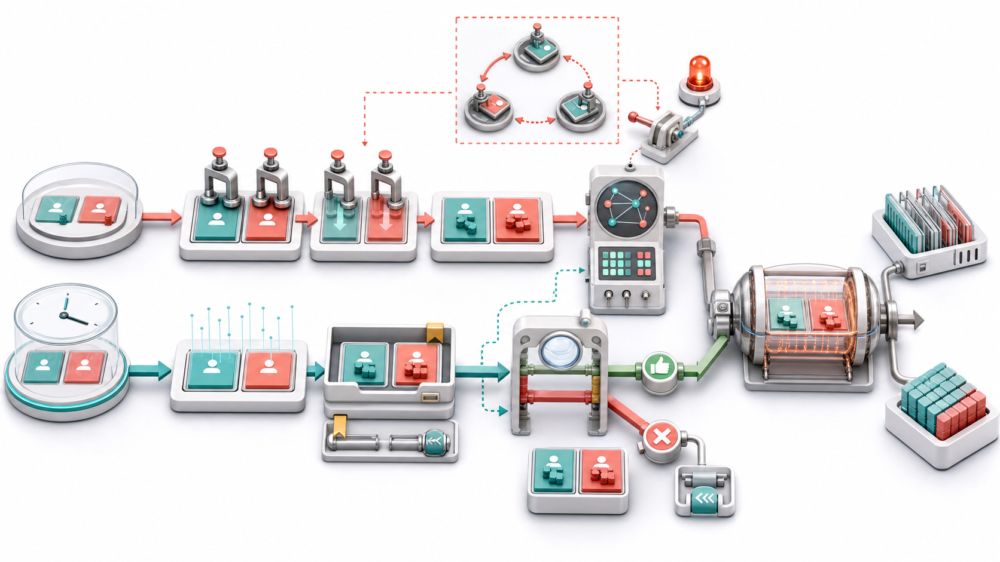

# RocksDB 事务：悲观锁、乐观验证与原子提交

WriteBatch 能保证一批写原子提交：

~~~cpp
batch.Put("alice", "90");
batch.Put("bob", "110");
db->Write(write_options, &batch);
~~~

但转账通常还要先读余额：

~~~text
read alice
read bob
check alice >= amount
write alice - amount
write bob + amount
~~~

若两个线程同时读取旧余额再写回，单纯 WriteBatch 只能保证各自两条写不被拆开，不能阻止 Lost Update。

RocksDB 提供：

- TransactionDB：悲观并发控制，先锁 Key；
- OptimisticTransactionDB：乐观并发控制，提交时验证冲突。

> 图 1：悲观事务在读改写前锁住账户 Key，等待图出现环时执行死锁处理；乐观事务在 Snapshot 下读取并将修改放入可检索 Batch，提交前验证被追踪 Key 是否被并发更新。成功事务最终都以原子 WriteBatch 进入 WAL 和 MemTable。

## 1. WriteBatch 与 Transaction 的边界

| 能力 | WriteBatch | Transaction |
| --- | --- | --- |
| 多 Key 写入原子性 | 有 | 有 |
| Read Your Own Writes | 需 WriteBatchWithIndex | 有 |
| 读后写冲突检测 | 无 | 有 |
| Snapshot | 调用者管理 | 事务管理 |
| Lock/Commit Validation | 无 | 有 |
| Rollback/SavePoint | Batch 级有限支持 | 有 |

如果操作只需无条件写多个 Key，WriteBatch 足够。只有业务决策依赖已读数据时，才需要事务冲突控制。

## 2. 两种事务模型

~~~mermaid
flowchart TD
  B["Begin transaction"] --> P{"Model"}
  P -->|Pessimistic| L["Acquire key locks during GetForUpdate/write"]
  L --> W1["Buffer writes"]
  W1 --> C1["Commit atomically"]
  P -->|Optimistic| S["Read from snapshot and track keys"]
  S --> W2["Buffer writes"]
  W2 --> V{"Validate no conflicting commit"}
  V -- Pass --> C2["Commit atomically"]
  V -- Conflict --> R["Busy / TryAgain, retry"]
~~~

悲观模式把冲突成本放在操作过程中；乐观模式把成本放在 Commit。

## 3. TransactionDB：悲观锁

打开：

~~~cpp
#include "rocksdb/utilities/transaction_db.h"

rocksdb::Options options;
options.create_if_missing = true;

rocksdb::TransactionDBOptions txn_db_options;
rocksdb::TransactionDB* raw_db = nullptr;

rocksdb::Status s = rocksdb::TransactionDB::Open(
    options, txn_db_options, path, &raw_db);
~~~

TransactionDB 在普通 DB 上增加 Lock Manager 与事务元数据。

## 4. GetForUpdate 是关键

~~~cpp
std::string value;
rocksdb::Status s = txn->GetForUpdate(
    rocksdb::ReadOptions(), "alice", &value);
~~~

它不仅读取，还把 Key 加入事务的冲突集合并在悲观模式获取锁。

普通 Get：

~~~cpp
txn->Get(ro, "alice", &value);
~~~

主要提供事务视图读取，但不能自动表达“我的后续写依赖这个值”。读改写应使用 GetForUpdate。

## 5. 共享锁与排他锁

GetForUpdate 支持 exclusive 参数：

~~~text
exclusive=true  -> 排他锁，常用于读后写
exclusive=false -> 共享锁，多个读事务可并存
~~~

Put/Delete 也会追踪并锁定相应 Key。锁粒度通常是 Column Family + User Key，不是整个数据库。

## 6. 悲观转账示例

~~~cpp
std::unique_ptr<rocksdb::Transaction> txn(
    db->BeginTransaction(rocksdb::WriteOptions()));

txn->SetSnapshot();
rocksdb::ReadOptions ro;
ro.snapshot = txn->GetSnapshot();

std::string alice;
std::string bob;
Check(txn->GetForUpdate(ro, "alice", &alice));
Check(txn->GetForUpdate(ro, "bob", &bob));

int a = std::stoi(alice);
int b = std::stoi(bob);
if (a < 10) {
  Check(txn->Rollback());
  return;
}

Check(txn->Put("alice", std::to_string(a - 10)));
Check(txn->Put("bob", std::to_string(b + 10)));
Check(txn->Commit());
~~~

锁一直持有到 Commit/Rollback，避免其他事务同时修改账户。

## 7. 固定锁顺序

两个转账：

~~~text
T1: lock alice -> wait bob
T2: lock bob   -> wait alice
~~~

形成死锁。最简单策略是统一排序：

~~~cpp
std::string first = std::min(from, to);
std::string second = std::max(from, to);
txn->GetForUpdate(ro, first, &v1);
txn->GetForUpdate(ro, second, &v2);
~~~

固定顺序不能覆盖所有动态工作流，但能消除大量常见死锁。

## 8. Lock Timeout

全局：

~~~cpp
txn_db_options.transaction_lock_timeout = 1000;
txn_db_options.default_lock_timeout = 1000;
~~~

单事务：

~~~cpp
rocksdb::TransactionOptions to;
to.lock_timeout = 500;
~~~

单位与当前 API 注释保持一致，配置前应查版本头文件。Timeout 后操作返回 Busy/TimedOut 一类 Status，调用者要 Rollback 并决定是否重试。

## 9. Deadlock Detection

~~~cpp
rocksdb::TransactionOptions to;
to.deadlock_detect = true;
to.deadlock_detect_depth = 50;
~~~

Lock Manager 维护 Wait-For Graph。发现环后让一个事务失败，打破循环。

~~~mermaid
flowchart LR
  T1["Transaction A"] -->|waits| T2["Transaction B"]
  T2 -->|waits| T3["Transaction C"]
  T3 -->|waits| T1
  T1 --> D["Deadlock detector aborts one participant"]
~~~

检测本身有 CPU/内存成本，Depth 也限制搜索范围。

## 10. OptimisticTransactionDB

打开：

~~~cpp
#include "rocksdb/utilities/optimistic_transaction_db.h"

rocksdb::OptimisticTransactionDB* raw_db = nullptr;
Check(rocksdb::OptimisticTransactionDB::Open(
    options, path, &raw_db));
~~~

它通常不在操作期间阻塞其他事务，而是在 Commit 时检查被追踪 Key 自 Snapshot 后是否发生变化。

## 11. 乐观事务流程

~~~text
Begin
  -> SetSnapshot
  -> GetForUpdate / Put / Delete track keys
  -> buffer updates
  -> Commit
     -> validate latest sequence for tracked keys
     -> conflict: fail without applying batch
     -> no conflict: atomic write
~~~

冲突率低时避免锁等待；冲突率高时重试浪费前面全部业务计算。

## 12. 乐观转账示例

~~~cpp
std::unique_ptr<rocksdb::Transaction> txn(
    db->BeginTransaction(rocksdb::WriteOptions()));

txn->SetSnapshot();
rocksdb::ReadOptions ro;
ro.snapshot = txn->GetSnapshot();

std::string alice;
std::string bob;
Check(txn->GetForUpdate(ro, "alice", &alice));
Check(txn->GetForUpdate(ro, "bob", &bob));

Check(txn->Put("alice", std::to_string(std::stoi(alice) - 10)));
Check(txn->Put("bob", std::to_string(std::stoi(bob) + 10)));

rocksdb::Status s = txn->Commit();
if (s.IsBusy() || s.IsTryAgain()) {
  Check(txn->Rollback());
  // 使用退避策略从头重试整个事务。
} else {
  Check(s);
}
~~~

不能只重试 Commit：冲突说明读到的业务前提已失效，必须重新读取和计算。

## 13. Snapshot 与冲突检测不是一回事

Snapshot 决定事务读到什么：

~~~text
visibility boundary
~~~

冲突追踪决定哪些并发变化会导致提交失败：

~~~text
tracked key set
~~~

只 SetSnapshot 但用普通 Get，不一定把 Key 纳入更新冲突保护。读后写仍应使用 GetForUpdate 或相应追踪 API。

## 14. Read Your Own Writes

事务内部写入保存在 WriteBatchWithIndex：

~~~text
DB snapshot: alice=100
txn Put: alice=90
txn Get: alice=90
~~~

索引让事务无需扫描整个 Batch 就能查找最新本地更新，并能把 Batch Iterator 与 DB Iterator 合并。

## 15. WriteBatchWithIndex

它封装：

~~~text
WriteBatch serialization
+ searchable per-CF key index
~~~

同 Key 多次更新时，overwrite_key 影响索引视图；Merge 保留多次 Operand。当前源码明确说明 DeleteRange 不受 WriteBatchWithIndex 支持，因此事务功能组合要查看具体 Status。

## 16. SavePoint

~~~cpp
txn->SetSavePoint();
Check(txn->Put("alice", "90"));

rocksdb::Status s = ValidateBusinessRule();
if (!s.ok()) {
  Check(txn->RollbackToSavePoint());
}
~~~

SavePoint 回滚事务内最近一段 Batch 修改，不释放整个事务之前获得的所有语义资源这一点应按具体实现理解；它也不是数据库级持久化 Checkpoint。

## 17. Rollback

~~~cpp
Check(txn->Rollback());
~~~

悲观事务释放锁，丢弃未提交 Batch；乐观事务丢弃修改与冲突追踪。

析构事务对象前显式 Commit/Rollback 更清晰，尤其便于记录失败原因和锁持有时间。

## 18. Commit 的原子性

验证/锁检查通过后，事务修改最终作为一个 WriteBatch 进入普通写路径：

~~~text
Transaction Batch
  -> WriteThread
  -> WAL
  -> MemTable
  -> publish sequence
~~~

其他线程不会看到只更新 alice、尚未更新 bob 的中间状态。

## 19. Write Policy

TransactionDB 支持不同写策略：

- WriteCommitted：Commit 后写入普通 MemTable，可见性简单；
- WritePrepared：Prepare 数据可提前进入 DB，提交状态另行追踪；
- WriteUnprepared：进一步减少大事务 Prepare 开销，恢复与可见性更复杂。

默认和最易理解的是 WriteCommitted。两阶段提交、超大事务或 XA 场景才应深入评估其他策略。

## 20. Prepare 与两阶段提交

事务可设置 Name：

~~~cpp
Check(txn->SetName("order-20260711-42"));
Check(txn->Prepare());
Check(txn->Commit());
~~~

Prepare 将事务写入可恢复状态，之后可通过 GetAllPreparedTransactions 找回并 Commit/Rollback。

这不是分布式事务协调器本身；应用仍要负责全局决议、幂等恢复和事务 ID 生命周期。

## 21. 锁管理成本

TransactionDBOptions 影响：

~~~text
max_num_locks
num_stripes
max_num_deadlocks
transaction_lock_timeout
default_lock_timeout
~~~

锁表过小会限制并发；Stripe 过少增加争用，过多增加内存。长事务会持有更多锁并阻塞更多请求。

## 22. 冲突粒度与 Phantom

RocksDB 事务冲突主要围绕被追踪 User Key。读取一个范围后，另一个事务插入范围中的新 Key，是否形成 Phantom 冲突不能仅靠 Point GetForUpdate 自动覆盖。

需要可串行化范围约束时，应设计：

- 显式哨兵/版本 Key；
- 应用层范围锁；
- 适当 Key 编码；
- 更强事务系统。

不要把 Snapshot Isolation 自动等同于完整 Serializable。

## 23. 悲观还是乐观

| 工作负载 | 倾向 |
| --- | --- |
| 热点 Key、高冲突 | TransactionDB |
| 大量低冲突事务 | OptimisticTransactionDB |
| 事务计算昂贵 | 悲观可避免失败后重算 |
| 不能容忍锁等待 | 乐观，但接受 Commit 失败 |
| 事务很长 | 两者都需谨慎 |
| 范围冲突 | 需要额外设计 |

最终选择必须测量冲突率、锁等待、重试成本和 P99。

## 24. 完整可运行悲观事务实验

~~~cpp
#include <chrono>
#include <cstdlib>
#include <iostream>
#include <memory>
#include <string>

#include "rocksdb/options.h"
#include "rocksdb/utilities/transaction.h"
#include "rocksdb/utilities/transaction_db.h"

void Check(const rocksdb::Status& s) {
  if (!s.ok()) {
    std::cerr << s.ToString() << "\n";
    std::abort();
  }
}

int main() {
  const auto id =
      std::chrono::steady_clock::now().time_since_epoch().count();
  const std::string path =
      "/tmp/rocksdb-txn-" + std::to_string(id);

  rocksdb::Options options;
  options.create_if_missing = true;

  rocksdb::TransactionDBOptions db_opts;
  db_opts.transaction_lock_timeout = 1000;

  rocksdb::TransactionDB* raw = nullptr;
  Check(rocksdb::TransactionDB::Open(
      options, db_opts, path, &raw));
  std::unique_ptr<rocksdb::TransactionDB> db(raw);

  Check(db->Put({}, "alice", "100"));
  Check(db->Put({}, "bob", "100"));

  rocksdb::TransactionOptions txn_opts;
  txn_opts.set_snapshot = true;
  txn_opts.deadlock_detect = true;

  std::unique_ptr<rocksdb::Transaction> txn(
      db->BeginTransaction({}, txn_opts));

  rocksdb::ReadOptions ro;
  ro.snapshot = txn->GetSnapshot();
  std::string alice;
  std::string bob;
  Check(txn->GetForUpdate(ro, "alice", &alice));
  Check(txn->GetForUpdate(ro, "bob", &bob));
  Check(txn->Put("alice", std::to_string(std::stoi(alice) - 10)));
  Check(txn->Put("bob", std::to_string(std::stoi(bob) + 10)));
  Check(txn->Commit());

  Check(db->Get({}, "alice", &alice));
  Check(db->Get({}, "bob", &bob));
  std::cout << "alice=" << alice << " bob=" << bob << "\n";

  db.reset();
  Check(rocksdb::DestroyDB(path, options));
}
~~~

预期：

~~~text
alice=90 bob=110
~~~

## 25. 编译

~~~bash
g++ -std=c++17 -O2 transaction_demo.cc \
  -I./include -L. -lrocksdb \
  -lpthread -ldl -lz -lbz2 -llz4 -lzstd -lsnappy \
  -o transaction_demo
~~~

需确保构建包含 TransactionDB Utilities。

## 26. 重试策略

乐观冲突或 Lock Timeout 的重试应：

1. Rollback/销毁旧事务；
2. 指数退避并加入随机抖动；
3. 创建新事务和新 Snapshot；
4. 重新读取全部业务前提；
5. 设置最大尝试次数；
6. 区分可重试 Status 与永久错误。

不要无限忙循环，也不要把 Corruption/IOError 当作冲突重试。

## 27. 观测指标

- Commit/Abort/Retry 数；
- Transaction 平均与 P99 时长；
- GetForUpdate 延迟；
- Lock Wait 与 Timeout；
- Deadlock 次数与等待图；
- 事务 Batch 大小；
- 持锁 Key 数；
- Optimistic Validation 失败率；
- WAL Sync 与 Write Stall；
- Prepared Transaction 数与年龄。

高冲突率可能来自少数热点 Key，应按 Key Domain/业务类型分组。

## 28. 常见误区

### 误区一：WriteBatch 就是事务

它只有写原子性，没有自动读写冲突检测。

### 误区二：SetSnapshot 后普通 Get 会自动锁 Key

错误。读改写应使用 GetForUpdate。

### 误区三：乐观事务不会阻塞，所以一定更快

错误。高冲突时重试成本可能更高。

### 误区四：Commit 冲突后只重试 Commit

错误。必须重新读取和执行业务逻辑。

### 误区五：死锁检测替代固定锁顺序

错误。固定顺序先减少死锁，检测负责剩余动态环。

### 误区六：Snapshot Isolation 等于 Serializable

错误。范围 Phantom 与业务不变量需要额外保护。

### 误区七：SavePoint 是持久化恢复点

错误。它只是当前事务 Batch 内的局部回滚位置。

## 29. 源码阅读顺序

~~~text
include/rocksdb/utilities/transaction.h
  -> include/rocksdb/utilities/transaction_db.h
  -> include/rocksdb/utilities/optimistic_transaction_db.h
  -> utilities/transactions/transaction_base.cc
  -> utilities/transactions/pessimistic_transaction.cc
  -> utilities/transactions/lock/lock_manager.cc
  -> utilities/transactions/optimistic_transaction.cc
  -> utilities/transactions/write_committed_txn.cc
  -> utilities/write_batch_with_index/write_batch_with_index.cc
~~~

重点入口：

- [Transaction API](../include/rocksdb/utilities/transaction.h)；
- [TransactionDB](../include/rocksdb/utilities/transaction_db.h)；
- [OptimisticTransactionDB](../include/rocksdb/utilities/optimistic_transaction_db.h)；
- [Pessimistic Transaction](../utilities/transactions/pessimistic_transaction.cc)；
- [Optimistic Transaction](../utilities/transactions/optimistic_transaction.cc)；
- [Lock Manager](../utilities/transactions/lock/lock_manager.cc)；
- [WriteBatchWithIndex](../include/rocksdb/utilities/write_batch_with_index.h)；
- [Transaction Example](../examples/transaction_example.cc)。

## 30. 本篇小结

~~~text
WriteBatch：提供多 Key 写原子性，不提供读写冲突保护
悲观事务：GetForUpdate 获取 Key Lock，冲突时等待/超时
乐观事务：执行时不锁，Commit 验证追踪 Key
Snapshot：固定读可见性，不自动等于冲突集合
本地写：WriteBatchWithIndex 支持 Read Your Own Writes
提交：验证通过后作为一个 Batch 原子进入 WAL/MemTable
死锁：固定锁顺序 + Timeout + 可选 Wait-For 检测
失败：冲突后必须重跑整个事务
隔离：Point Key 冲突强，不自动解决范围 Phantom
~~~

RocksDB 事务并没有改变 LSM 的底层写入结构，而是在 WriteBatch 之前增加锁、Snapshot、冲突集合和提交协议。悲观与乐观的本质区别是“什么时候支付冲突成本”：前者提前等待，后者失败重试。选择模型时，应围绕真实冲突分布和重试代价，而不是只看 API 名称。

下一篇将进入备份、Checkpoint 与恢复：理解 Hard Link 快照、WAL 捕获、BackupEngine 增量文件复用，以及如何验证恢复后的数据完整性。

## 参考入口

- [Transaction API](../include/rocksdb/utilities/transaction.h)；
- [TransactionDB API](../include/rocksdb/utilities/transaction_db.h)；
- [Optimistic API](../include/rocksdb/utilities/optimistic_transaction_db.h)；
- [WriteBatchWithIndex](../include/rocksdb/utilities/write_batch_with_index.h)；
- [Transaction Example](../examples/transaction_example.cc)；
- [Optimistic Example](../examples/optimistic_transaction_example.cc)。
