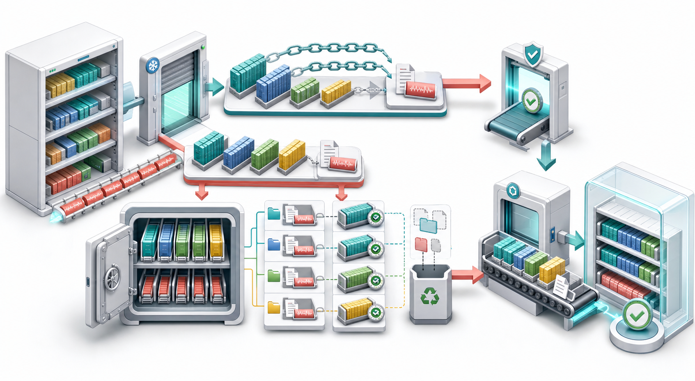

# RocksDB 备份恢复：Checkpoint、BackupEngine 与灾备演练

备份不是复制数据库目录。RocksDB 在运行中会同时：

- 创建新 SST；
- 删除过期 SST；
- 切换 MANIFEST；
- 追加 WAL；
- Flush MemTable；
- 安装新 Version。

直接递归复制可能得到彼此不属于同一逻辑时刻的文件集合。RocksDB 提供两种主要机制：

- Checkpoint：快速创建一个可独立打开的一致性 DB 目录；
- BackupEngine：维护多代、可校验、可增量复用与可恢复的备份仓库。

> 图 1：一致性切面固定 Live File 集合；Checkpoint 对同文件系统的不可变 SST 使用 Hard Link，并复制 MANIFEST/WAL；BackupEngine 跨代复用校验一致的 SST，维护代际元数据与保留策略，最后经 Checksum 验证恢复到独立目录。

## 1. Checkpoint 与 BackupEngine

| 维度 | Checkpoint | BackupEngine |
| --- | --- | --- |
| 目标 | 一个可直接打开的 DB 副本 | 多代备份仓库 |
| 同文件系统 SST | 优先 Hard Link | Copy/共享文件仓库 |
| 增量复用 | 依赖文件系统链接 | 内建跨 Backup 共享 |
| Backup ID | 无 | 有 |
| Retention/Purge | 调用者管理 | 内建 |
| VerifyBackup | 无专门代际 API | 有 |
| Restore API | 目录本身可 Open/复制 | 有 |
| 典型用途 | 快速快照、测试克隆 | 长期灾备 |

## 2. 为什么 SST 适合复用

SST 与 Blob File 完成后不可变：

~~~text
same file identity + same checksum
  -> safe to share between backup generations
~~~

变化的主要是：

- CURRENT；
- MANIFEST；
- OPTIONS；
- WAL；
- 新增/淘汰的 SST。

因此第二次备份通常只复制新文件与新元数据，而不是全库。

## 3. Checkpoint 的文件策略

Checkpoint::CreateCheckpoint：

1. 获取一致性 Live File 集合；
2. 同文件系统的 SST/Blob 优先创建 Hard Link；
3. 跨文件系统则复制；
4. MANIFEST 等可变元数据始终复制；
5. 根据 Flush 阈值决定 Flush 还是包含 WAL；
6. 在临时目录完成后安装目标目录。

~~~mermaid
flowchart LR
  D["Live DB"] --> V["Consistent live-file view"]
  V --> S{"Same filesystem?"}
  S -- Yes --> H["Hard-link immutable SST/blob"]
  S -- No --> C["Copy immutable files"]
  V --> M["Copy manifest/current/options"]
  V --> W["Flush or capture WAL"]
  H --> O["Checkpoint directory"]
  C --> O
  M --> O
  W --> O
~~~

## 4. log_size_for_flush

~~~cpp
checkpoint->CreateCheckpoint(dir, log_size_for_flush);
~~~

当前默认 0，表示总 WAL 大小达到阈值即 Flush，因此默认总会触发 Flush。

使用更大阈值可避免昂贵 Flush，但 Checkpoint 需要包含 WAL 才能恢复未 Flush 数据。若 WAL 被关闭或采用特殊多目录配置，应按 API 限制验证。

## 5. Hard Link 的含义

Hard Link 让源目录和 Checkpoint 指向同一文件内容：

~~~text
source/000123.sst ----+                       same inode/content
checkpoint/000123.sst-/
~~~

删除源路径不会删除仍被 Checkpoint 引用的内容。因为 SST 不可变，共享是安全的。

但它不是远端备份：磁盘、文件系统或主机整体损坏时，两条链接可能一起丢失。

## 6. Checkpoint 示例

~~~cpp
#include "rocksdb/utilities/checkpoint.h"

rocksdb::Checkpoint* raw = nullptr;
Check(rocksdb::Checkpoint::Create(db, &raw));
std::unique_ptr<rocksdb::Checkpoint> checkpoint(raw);

uint64_t checkpoint_sequence = 0;
Check(checkpoint->CreateCheckpoint(
    "/backup/checkpoint-001",
    0,
    &checkpoint_sequence));
~~~

目标目录必须不存在。创建成功后可用普通 DB::Open 打开。

## 7. BackupEngine 仓库

典型结构逻辑上包含：

~~~text
backup root
  private/<backup-id>/   generation-specific files
  shared/                shared SST
  shared_checksum/       checksum/session named shared files
  meta/<backup-id>       backup manifest metadata
~~~

不要手工移动其中个别文件或修改元数据；通过 BackupEngine API 管理。

## 8. 打开 BackupEngine

~~~cpp
#include "rocksdb/utilities/backup_engine.h"

rocksdb::BackupEngineOptions backup_options("/backup/repository");
backup_options.share_table_files = true;
backup_options.share_files_with_checksum = true;
backup_options.max_background_operations = 4;

rocksdb::BackupEngine* raw_backup = nullptr;
CheckIO(rocksdb::BackupEngine::Open(
    rocksdb::Env::Default(),
    backup_options,
    &raw_backup));
std::unique_ptr<rocksdb::BackupEngine> backup(raw_backup);
~~~

Backup 目录必须与 DB 目录分离，生产上还应位于独立故障域。

## 9. 创建 Backup

~~~cpp
rocksdb::CreateBackupOptions create_options;
create_options.flush_before_backup = true;
create_options.atomic_flush = true;

rocksdb::BackupID id = 0;
CheckIO(backup->CreateNewBackupWithMetadata(
    create_options,
    db,
    "release=2026-07-11",
    &id));
~~~

Metadata 可保存应用版本、Schema、部署 ID 或恢复说明，但不应放 Secret。

## 10. Flush 与 WAL 策略

两种基本方式：

~~~text
flush_before_backup=true
  MemTable -> SST
  备份以 SST 为主

flush_before_backup=false
  备份 Live SST + WAL
  恢复时 Replay WAL
~~~

多 Column Family 需要跨 CF 一致切面时，可组合 Atomic Flush。若 backup_log_files=false，必须确认 Flush 策略足以覆盖所有已确认写入。

## 11. 增量复用不是增量恢复日志

BackupEngine 的“增量”主要指文件复用：

~~~text
Backup 1: A.sst B.sst C.sst
Backup 2: A.sst B.sst D.sst

shared store: A B C D
metadata 1: A B C
metadata 2: A B D
~~~

每个 Backup ID 仍描述可独立恢复的完整文件集合。

## 12. Checksum 命名与去重

仅按 File Number 复用不安全：不同 DB/Session 可有同名文件。share_files_with_checksum 使用 Checksum、Size、Session 等信息构造共享文件身份。

BackupEngine 还会记录预期 File Size 与 Checksum，供 VerifyBackup 检查。

## 13. VerifyBackup

~~~cpp
CheckIO(backup->VerifyBackup(
    id,
    true));  // verify_with_checksum
~~~

只检查 Size 比完整 Checksum 快，但发现损坏的能力较弱。关键备份应周期性做 Checksum Verify。

Verify 成功仍不代表业务可恢复：还需要真正 Restore、Open 和查询校验。

## 14. Restore

~~~cpp
rocksdb::RestoreOptions restore_options(
    false,  // keep_log_files
    rocksdb::RestoreOptions::kPurgeAllFiles);

CheckIO(backup->RestoreDBFromBackup(
    restore_options,
    id,
    restore_db_dir,
    restore_wal_dir));
~~~

恢复目录与 WAL 目录必须规划清楚。默认 Purge 模式会清理目标已有文件，不应指向正在运行的生产 DB。

~~~mermaid
flowchart LR
  B["Backup generation"] --> V["Verify size and checksum"]
  V --> R["Restore into isolated directory"]
  R --> O["Open DB"]
  O --> Q["Read sentinel keys / scan counts"]
  Q --> S["Declare recovery drill successful"]
~~~

## 15. Restore Latest 与指定 ID

~~~cpp
backup->RestoreDBFromLatestBackup(
    restore_options, db_dir, wal_dir);
~~~

Latest 使用最新非损坏 Backup。灾难恢复通常应记录明确 Backup ID，避免恢复到错误代际。

## 16. 保留与 Garbage Collection

~~~cpp
CheckIO(backup->PurgeOldBackups(7));
CheckIO(backup->GarbageCollect());
~~~

Purge 删除旧代元数据；共享文件只有在不再被任何保留 Backup 引用后才能删除。

Retention 应按 RPO 设计，例如：

~~~text
最近 24 个小时备份
最近 14 个日备份
最近 8 个周备份
~~~

单纯“保留 7 个”在备份频率变化时可能不满足时间目标。

## 17. 完整备份恢复实验

~~~cpp
#include <chrono>
#include <cstdlib>
#include <iostream>
#include <memory>
#include <string>

#include "rocksdb/db.h"
#include "rocksdb/options.h"
#include "rocksdb/utilities/backup_engine.h"

template <typename StatusLike>
void Check(const StatusLike& s) {
  if (!s.ok()) {
    std::cerr << s.ToString() << "\n";
    std::abort();
  }
}

int main() {
  const auto id =
      std::chrono::steady_clock::now().time_since_epoch().count();
  const std::string root =
      "/tmp/rocksdb-backup-demo-" + std::to_string(id);
  const std::string db_dir = root + "-db";
  const std::string backup_dir = root + "-backups";
  const std::string restore_dir = root + "-restore";

  rocksdb::Options options;
  options.create_if_missing = true;

  std::unique_ptr<rocksdb::DB> db;
  Check(rocksdb::DB::Open(options, db_dir, &db));
  Check(db->Put({}, "sentinel", "backup-ok"));
  Check(db->Put({}, "counter", "42"));

  rocksdb::BackupEngineOptions bo(backup_dir);
  rocksdb::BackupEngine* raw = nullptr;
  Check(rocksdb::BackupEngine::Open(
      rocksdb::Env::Default(), bo, &raw));
  std::unique_ptr<rocksdb::BackupEngine> backup(raw);

  rocksdb::CreateBackupOptions create;
  create.flush_before_backup = true;
  rocksdb::BackupID backup_id = 0;
  Check(backup->CreateNewBackupWithMetadata(
      create, db.get(), "demo", &backup_id));
  Check(backup->VerifyBackup(backup_id, true));

  db.reset();
  Check(backup->RestoreDBFromBackup(
      rocksdb::RestoreOptions(),
      backup_id,
      restore_dir,
      restore_dir));

  std::unique_ptr<rocksdb::DB> restored;
  Check(rocksdb::DB::Open(options, restore_dir, &restored));
  std::string value;
  Check(restored->Get({}, "sentinel", &value));
  std::cout << value << "\n";
}
~~~

当前 Backup API 返回 IOStatus，但它可按 Status 风格检查 ok/ToString。具体重载以本地头文件为准。

## 18. 生产恢复演练

每次演练至少验证：

1. 选择 Backup ID；
2. Verify Checksum；
3. 恢复到隔离目录/主机；
4. 用目标 RocksDB 版本 Open；
5. 检查所有 Column Family；
6. 查询 Sentinel 与关键业务对象；
7. 扫描数量/聚合校验；
8. 记录 Restore 时长与吞吐；
9. 关闭并清理演练环境；
10. 更新 Runbook。

RTO 只能通过恢复演练测量，不能从备份速度推断。

## 19. RPO 与 RTO

~~~text
RPO：最多能丢多久的数据
RTO：故障后多久恢复服务
~~~

更频繁 Backup 降低 RPO，但增加扫描、元数据与存储请求。更高恢复并行度降低 RTO，但可能受网络、Checksum、文件数和 Open/Recovery 限制。

## 20. 常见风险

- 备份与主库在同一磁盘；
- 只创建、不 Verify；
- 从不 Restore 演练；
- Backup 目录容量耗尽；
- Retention 删除了合规需要的代际；
- 恢复使用不兼容 RocksDB 版本；
- 遗漏 WAL/Blob/多 CF 文件；
- 把 Restore 目标指向运行中的 DB；
- 备份凭据与主库凭据同故障域；
- 没有监控最后成功 Backup 年龄。

## 21. Checkpoint 适用场景

- 本机快速克隆；
- 一致性离线分析；
- 测试/升级前快照；
- 交给外部上传流程；
- 快速构建只读副本。

Checkpoint 本身没有代际仓库管理和异地耐久保证。要成为备份，仍需把它复制到独立故障域并验证。

## 22. BackupEngine 适用场景

- 周期多代备份；
- 大库增量文件复用；
- Retention/Purge；
- Checksum Verify；
- 指定代际恢复；
- 备份限速和并行复制；
- 跨环境灾备。

对云对象存储或自定义文件系统，应验证 Env/FileSystem 实现及一致性语义。

## 23. 观测指标

- 最后成功 Backup 时间与年龄；
- Backup ID、文件数、逻辑/新增字节；
- 共享文件复用率；
- Backup/Restore 吞吐和耗时；
- Checksum Verify 耗时与失败；
- 仓库总容量和增长率；
- Purge/GarbageCollect 失败；
- 最近恢复演练时间；
- 实测 RPO/RTO；
- 恢复后业务校验结果。

## 24. 常见误区

### 误区一：复制 DB 目录就是备份

错误。并发文件变化可能产生不一致集合。

### 误区二：Checkpoint 一定复制所有 SST

错误。同文件系统通常 Hard Link。

### 误区三：Hard Link 是异地备份

错误。它仍共享文件系统故障域。

### 误区四：Backup 成功就代表可恢复

错误。还需 Verify、Restore、Open 与业务校验。

### 误区五：删除旧 Backup 会立即删除全部文件

错误。仍被其他代际引用的共享 SST 必须保留。

### 误区六：Latest 永远是业务想要的恢复点

错误。应记录并选择明确 Backup ID。

## 25. 源码阅读顺序

~~~text
include/rocksdb/utilities/checkpoint.h
  -> utilities/checkpoint/checkpoint_impl.cc
  -> include/rocksdb/utilities/backup_engine.h
  -> utilities/backup/backup_engine.cc
  -> db/db_impl/db_impl_files.cc
  -> db/filename.cc
  -> file/file_util.cc
~~~

重点入口：

- [Checkpoint API](../include/rocksdb/utilities/checkpoint.h)；
- [Checkpoint 实现](../utilities/checkpoint/checkpoint_impl.cc)；
- [BackupEngine API](../include/rocksdb/utilities/backup_engine.h)；
- [BackupEngine 实现](../utilities/backup/backup_engine.cc)；
- [Backup Restore 示例](../examples/rocksdb_backup_restore_example.cc)。

## 26. 本篇小结

~~~text
Checkpoint：一致性可打开目录，本地快速，SST 可 Hard Link
BackupEngine：多代仓库、共享不可变文件、校验与恢复 API
一致性：固定 Live File 集合，按策略 Flush 或捕获 WAL
增量：跨代复用相同 SST，每代仍描述完整恢复集合
验证：Size Check 不等于 Checksum Verify
恢复：必须进入隔离目录，Open 后做业务校验
保留：删除代际元数据，共享文件按引用 GC
灾备：独立故障域 + 明确 RPO/RTO + 定期演练
~~~

可靠备份的终点不是 CreateNewBackup 返回 OK，而是一次可重复、可计时、可审计的恢复。Checkpoint 解决快速一致副本，BackupEngine 解决长期多代管理；真正的灾备能力来自异地保存、完整校验、版本兼容和持续恢复演练。

下一篇将进入性能调优：从 db_bench、PerfContext、Statistics 与 IOStatsContext 建立基线，再按写入、读取、内存、Compaction 和设备瓶颈逐层定位。

## 参考入口

- [BackupEngine](../include/rocksdb/utilities/backup_engine.h)；
- [Checkpoint](../include/rocksdb/utilities/checkpoint.h)；
- [Backup 示例](../examples/rocksdb_backup_restore_example.cc)；
- [Backup 实现](../utilities/backup/backup_engine.cc)；
- [Checkpoint 实现](../utilities/checkpoint/checkpoint_impl.cc)。
