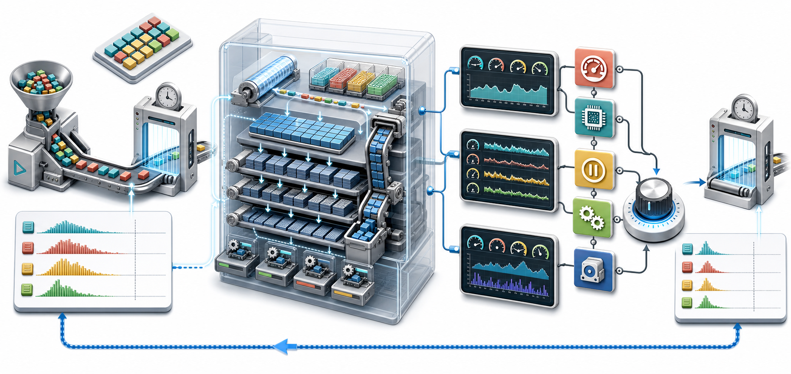

# RocksDB 性能调优：从 Options、db_bench 到精准归因

性能调优最危险的开场白是：“先把这个参数调大试试。”

RocksDB 的一次请求可能经过 WAL、Write Thread、MemTable、Block Cache、Bloom Filter、SST、Compaction 和文件系统。吞吐下降既可能是磁盘慢，也可能是缓存失效、写放大、CPU 解压、后台积压或锁等待。没有测量，参数只是旋钮；有了证据链，参数才是实验变量。

> 图 1：固定工作负载后先测吞吐和延迟分布，再用 Statistics、PerfContext、IOStatsContext 与 DB Properties 逐层归因。每次只改变一个主要变量，最后回到同一负载复测。

## 1. 本篇要解决什么

本文建立一套可重复的调优流程：

1. 定义与线上相似的工作负载；
2. 用 `db_bench` 获得稳定基线；
3. 同时观察吞吐、P50、P95、P99 与 P99.9；
4. 用累计统计判断“发生了什么”；
5. 用线程局部上下文判断“时间花在哪里”；
6. 用数据库属性判断“系统当前堵在哪里”；
7. 形成一个可证伪的假设，只改一个主要变量；
8. 用相同数据、环境和负载复测。

这不是一份“最佳参数表”。最佳配置取决于数据分布、读写比例、容量、硬件、耐久性要求和延迟目标。

## 2. 四类观测工具不要混用

| 工具 | 作用域 | 典型内容 | 适合回答 |
| --- | --- | --- | --- |
| `db_bench` | 整段压测 | ops/s、MB/s、延迟直方图 | 用户看到多快 |
| `Statistics` | DB 生命周期累计 | Cache 命中、字节数、操作直方图、Stall | 系统发生了什么 |
| `PerfContext` | 当前线程、采样窗口 | Get/Write 内部分阶段耗时与计数 | 当前调用慢在哪 |
| `IOStatsContext` | 当前线程、采样窗口 | read/write/fsync 字节和耗时 | 文件系统时间占多少 |
| DB Properties | DB/CF 当前状态或累计状态 | L0、MemTable、Compaction Debt、Cache | LSM 是否正在积压 |

关键区别：

- `Statistics` 适合长时间累计与趋势监控；
- `PerfContext`、`IOStatsContext` 通常是线程局部的；
- Property 是主动拉取的状态快照；
- `rocksdb.stats` 是人类可读报告，结构化监控优先使用整数或 Map Property。

~~~mermaid
flowchart LR
  W["Reproducible workload"] --> B["Throughput and percentiles"]
  B --> S["Statistics: what happened"]
  S --> P["PerfContext: where time went"]
  P --> I["IOStatsContext: filesystem cost"]
  I --> D["DB properties: LSM pressure"]
  D --> H["One falsifiable hypothesis"]
  H --> C["Change one major variable"]
  C --> V["Repeat and compare"]
  V --> B
~~~

## 3. 先写性能契约

压测之前先固定目标，而不是压测之后挑一个好看的数字：

~~~text
workload: 80% point read + 20% update
key/value: 16 B / 512 B
dataset: 4 x block cache capacity
threads: 32
durability: WAL enabled, sync policy explicitly recorded
SLO: P99 < 2 ms, P99.9 < 8 ms
capacity target: >= 150k ops/s
test duration: 20 min after 5 min warm-up
~~~

至少记录：

- RocksDB commit 或版本；
- 所有 DB/CF/Table Options；
- CPU、NUMA、内存、存储型号和文件系统；
- 数据量、键值大小、压缩类型；
- 读写比例、热点分布、线程数；
- WAL、`sync`、Direct I/O 等耐久性条件；
- 数据是冷缓存、热缓存还是混合缓存；
- 是否包含 Flush 与 Compaction 的稳态成本。

## 4. 构建 db_bench

仓库的 Make 构建会复用对象文件，不同构建模式之间应启用自动清理：

~~~bash
AUTO_CLEAN=1 DEBUG_LEVEL=0 make -j"$(nproc)" db_bench
~~~

性能测试使用 Release 构建。Debug、Sanitizer 和断言会显著改变时延，不应与生产结果直接比较。

先确认当前二进制支持哪些参数：

~~~bash
./db_bench --help
~~~

不同 RocksDB 版本会增加或调整选项，脚本应和被测版本一起保存。

## 5. 建立写入基线

下面创建固定数量的随机键值，并输出延迟直方图与数据库统计：

~~~bash
./db_bench \
  --benchmarks=fillrandom \
  --db=/data/rocksdb-bench \
  --num=50000000 \
  --threads=16 \
  --key_size=16 \
  --value_size=512 \
  --histogram=1 \
  --statistics=1 \
  --stats_interval_seconds=10
~~~

必须说明这是：

- 首次装载还是覆盖更新；
- 空库还是已有多层 SST；
- 是否等待后台 Compaction 收敛；
- 是否包含数据生成开销；
- 是否使用与生产相同的 WAL/压缩配置。

## 6. 建立读取基线

对同一数据目录执行随机点查：

~~~bash
./db_bench \
  --benchmarks=readrandom \
  --db=/data/rocksdb-bench \
  --use_existing_db=1 \
  --reads=100000000 \
  --threads=32 \
  --histogram=1 \
  --statistics=1 \
  --stats_interval_seconds=10 \
  --report_interval_seconds=10 \
  --report_file=readrandom.csv
~~~

冷缓存测试应先明确清理哪一层缓存；热缓存测试应先预热。操作系统 Page Cache 与 RocksDB Block Cache 是两层不同的缓存，不能把“重启进程”自动等同于“冷盘”。

## 7. 吞吐不是全部

平均值会隐藏长尾。假设两组结果平均延迟都是 300 微秒：

| 方案 | P50 | P99 | P99.9 | 判断 |
| --- | ---: | ---: | ---: | --- |
| A | 180 us | 1.2 ms | 4 ms | 长尾可控 |
| B | 120 us | 3.8 ms | 40 ms | 偶发停顿严重 |

对在线服务，P99/P99.9 往往比平均值更接近用户体验。还要同时观察：

- 稳态吞吐，而非最初几秒的峰值；
- 每个时间窗口的延迟，而非全程聚合；
- CPU 利用率和上下文切换；
- 设备吞吐、IOPS、队列深度与尾延迟；
- RocksDB 的 Flush、Compaction 与 Stall。

## 8. 压测阶段必须分开

推荐将实验拆为四段：

~~~text
prepare -> warm up -> steady state -> cool down / drain
~~~

`fillrandom` 结束时后台可能仍有 Compaction。立即读测量的是“读 + 后台整理”场景；等待完全收敛后读，测量的是“静态数据”场景。两者都可能有价值，但不能混为同一基线。

## 9. Statistics：低成本累计证据

在应用中开启统计：

~~~cpp
#include <rocksdb/db.h>
#include <rocksdb/options.h>
#include <rocksdb/statistics.h>

rocksdb::Options options;
options.create_if_missing = true;
options.statistics = rocksdb::CreateDBStatistics();

rocksdb::DB* raw_db = nullptr;
rocksdb::Status s = rocksdb::DB::Open(options, db_path, &raw_db);
if (!s.ok()) {
  throw std::runtime_error(s.ToString());
}
std::unique_ptr<rocksdb::DB> db(raw_db);
~~~

读取几个高价值 Ticker：

~~~cpp
const auto hit = options.statistics->getTickerCount(
    rocksdb::Tickers::BLOCK_CACHE_HIT);
const auto miss = options.statistics->getTickerCount(
    rocksdb::Tickers::BLOCK_CACHE_MISS);
const auto stall_us = options.statistics->getTickerCount(
    rocksdb::Tickers::STALL_MICROS);
const auto compact_read = options.statistics->getTickerCount(
    rocksdb::Tickers::COMPACT_READ_BYTES);
const auto compact_write = options.statistics->getTickerCount(
    rocksdb::Tickers::COMPACT_WRITE_BYTES);

const double hit_rate = (hit + miss == 0)
                            ? 0.0
                            : static_cast<double>(hit) / (hit + miss);
~~~

Ticker 是单调累计值。监控系统应保存相邻采样差值：

~~~text
rate = (counter_now - counter_previous) / elapsed_seconds
~~~

不要把进程启动以来的累计 `STALL_MICROS` 当作当前一分钟的停顿。

## 10. Histogram：看操作分布

`Statistics` 还维护 DB 操作直方图，例如 `DB_GET`、`DB_WRITE` 与 `DB_SEEK`。可通过 `histogramData()` 获取结构化摘要：

~~~cpp
rocksdb::HistogramData get_hist;
options.statistics->histogramData(
    rocksdb::Histograms::DB_GET, &get_hist);

std::cout << "get p50(us)=" << get_hist.median << '\n'
          << "get p95(us)=" << get_hist.percentile95 << '\n'
          << "get p99(us)=" << get_hist.percentile99 << '\n';
~~~

直方图用于发现分布变化；端到端服务延迟仍应在调用 RocksDB 的上层测量，因为排队、序列化和业务逻辑不在 DB 直方图内。

## 11. PerfLevel：采集越深，成本越高

当前接口的级别是逐级包含的：

| PerfLevel | 新增采集重点 |
| --- | --- |
| `kDisable` | 关闭 |
| `kEnableCount` | 次数与字节计数 |
| `kEnableWait` | RocksDB 内部等待/延迟时间 |
| `kEnableTimeExceptForMutex` | 操作阶段耗时，不含 Mutex |
| `kEnableTimeAndCPUTimeExceptForMutex` | 再加入 CPU 时间 |
| `kEnableTime` | 再加入 Mutex/Condition 时间 |

`SetPerfLevel()` 只设置当前线程。在线诊断应：

1. 在实际执行请求的线程中设置；
2. 只采样有限请求或有限时间；
3. 测量开启采集本身的开销；
4. 完成后恢复原来的级别。

## 12. PerfContext：拆开一次 Get

一个安全的短窗口采样器：

~~~cpp
#include <rocksdb/perf_context.h>
#include <rocksdb/perf_level.h>

std::string ProfileGet(rocksdb::DB* db, const rocksdb::Slice& key,
                       std::string* value) {
  const auto previous = rocksdb::GetPerfLevel();
  rocksdb::SetPerfLevel(
      rocksdb::PerfLevel::kEnableTimeAndCPUTimeExceptForMutex);

  rocksdb::PerfContext* perf = rocksdb::get_perf_context();
  perf->Reset();

  const rocksdb::Status s = db->Get(rocksdb::ReadOptions(), key, value);
  const std::string report = perf->ToString(true);

  rocksdb::SetPerfLevel(previous);
  if (!s.ok() && !s.IsNotFound()) {
    throw std::runtime_error(s.ToString());
  }
  return report;
}
~~~

点查重点关注：

- `block_cache_hit_count` / `block_read_count`；
- `get_from_memtable_time`；
- `get_from_output_files_time`；
- `block_read_time` / `block_read_cpu_time`；
- `block_checksum_time`；
- `block_decompress_time`；
- `user_key_comparison_count`；
- `bloom_sst_hit_count` / `bloom_sst_miss_count`。

这些值只描述执行该调用的线程。线程池切换、异步任务或其他工作线程不会自动汇总进来。

## 13. 用 PerfContext 分解写延迟

写入路径常见字段：

| 字段 | 含义 | 可能方向 |
| --- | --- | --- |
| `write_wal_time` | 写 WAL 时间 | WAL 设备、批量、同步策略 |
| `write_memtable_time` | 写 MemTable 时间 | MemTable 结构、并发写 |
| `write_delay_time` | 被节流/延迟 | L0、MemTable、Compaction Debt |
| `write_thread_wait_nanos` | 等待 Write Group | 并发、批量、调度 |
| `write_scheduling_flushes_compactions_time` | 切换和调度后台任务 | Flush/Compaction 压力 |
| `db_mutex_lock_nanos` | DB Mutex 等待 | 需在相应 PerfLevel 下采集 |

不要看到 `write_wal_time` 高就立即关闭 WAL。耐久性不是免费的性能参数，必须先满足数据一致性契约。

## 14. IOStatsContext：确认是否真是 I/O

~~~cpp
#include <rocksdb/iostats_context.h>

rocksdb::IOStatsContext* io = rocksdb::get_iostats_context();
io->Reset();

std::string value;
const rocksdb::Status s = db->Get(rocksdb::ReadOptions(), key, &value);
const std::string io_report = io->ToString(true);
~~~

常用字段包括：

- `bytes_read` / `bytes_written`；
- `read_nanos` / `write_nanos`；
- `fsync_nanos`；
- `open_nanos`；
- `allocate_nanos`；
- `cpu_read_nanos` / `cpu_write_nanos`。

若端到端 Get 很慢但 `read_nanos` 很低，瓶颈可能在 CPU 解压、校验、锁等待或上层排队；若 `block_read_time` 与 `read_nanos` 同时升高，才更像存储路径问题。

## 15. DB Properties：查看此刻的 LSM 压力

通用整数属性读取函数：

~~~cpp
uint64_t ReadProperty(rocksdb::DB* db, const std::string& name) {
  uint64_t value = 0;
  if (!db->GetIntProperty(name, &value)) {
    throw std::runtime_error("property unavailable: " + name);
  }
  return value;
}

uint64_t ReadLevelFileCount(rocksdb::DB* db, int level) {
  const std::string name =
      "rocksdb.num-files-at-level" + std::to_string(level);
  std::string value;
  if (!db->GetProperty(name, &value)) {
    throw std::runtime_error("property unavailable: " + name);
  }
  return std::stoull(value);
}

const uint64_t imm =
    ReadProperty(db.get(), "rocksdb.num-immutable-mem-table");
const uint64_t l0 = ReadLevelFileCount(db.get(), 0);
const uint64_t debt = ReadProperty(
    db.get(), "rocksdb.estimate-pending-compaction-bytes");
const uint64_t delayed_rate =
    ReadProperty(db.get(), "rocksdb.actual-delayed-write-rate");
const uint64_t cache_usage =
    ReadProperty(db.get(), "rocksdb.block-cache-usage");
~~~

`rocksdb.num-files-at-level<N>` 是带 Level 后缀的 String Property，因此示例使用 `GetProperty()` 后解析；其余列出的固定整数属性使用 `GetIntProperty()`。

生产监控优先关注：

| 类别 | Property |
| --- | --- |
| Flush | `rocksdb.num-immutable-mem-table`、`rocksdb.mem-table-flush-pending`、`rocksdb.num-running-flushes` |
| Compaction | `rocksdb.compaction-pending`、`rocksdb.num-running-compactions`、`rocksdb.estimate-pending-compaction-bytes` |
| Stall | `rocksdb.actual-delayed-write-rate`、`rocksdb.is-write-stopped` |
| Cache | `rocksdb.block-cache-capacity`、`rocksdb.block-cache-usage`、`rocksdb.block-cache-pinned-usage` |
| Memory | `rocksdb.cur-size-all-mem-tables`、`rocksdb.estimate-table-readers-mem` |
| Safety | `rocksdb.background-errors` |

`rocksdb.total-sst-files-size` 等属性在文件很多时可能较慢，不要无脑高频抓取所有 Property。

## 16. rocksdb.stats 适合人工快照

~~~cpp
std::string stats;
if (db->GetProperty("rocksdb.stats", &stats)) {
  std::cout << stats;
}
~~~

它整合了 CF 与 DB 的多行统计，适合事故现场和实验归档。自动化监控更适合稳定的 Ticker、Histogram 和结构化 Property，避免解析展示文本。

## 17. 读慢的证据链

~~~mermaid
flowchart TD
  A["Read P99 increased"] --> B{"Block cache miss increased?"}
  B -- Yes --> C{"Storage read_nanos increased?"}
  C -- Yes --> D["Storage / cache capacity / locality"]
  C -- No --> E["Decompression, checksum, lookup CPU"]
  B -- No --> F{"Internal keys skipped increased?"}
  F -- Yes --> G["Overwrite or tombstone debt"]
  F -- No --> H{"Mutex or scheduling time increased?"}
  H -- Yes --> I["Concurrency and contention"]
  H -- No --> J["Measure application queueing"]
~~~

一个常见判断矩阵：

| 现象 | 共同证据 | 优先验证 |
| --- | --- | --- |
| Cache 容量不足 | Miss 上升、设备读上升、热集大于 Cache | Cache 大小、Shard、索引/Filter 占用 |
| Bloom 效果差 | 不存在键查询触发大量 SST 读 | Filter 配置、Prefix 契约、Bits/Key |
| CPU 解压高 | I/O 不高，`block_decompress_time` 高 | 压缩算法、CPU、Block 大小 |
| 层数/文件探测多 | `get_from_output_files_time`、比较次数高 | L0、Compaction、文件布局 |
| 删除债务 | `internal_*_skipped_count` 高 | Tombstone、Snapshot、Compaction |

## 18. 写慢的证据链

写吞吐掉下来时先区分“前台本身慢”与“后台来不及”：

~~~text
write_delay_time > 0
  + immutable memtables increasing
    -> flush cannot keep up

write_delay_time > 0
  + L0 files / pending compaction bytes increasing
    -> compaction cannot keep up

write_wal_time high
  + fsync_nanos high
    -> WAL storage or sync policy dominates

write_thread_wait_nanos high
  + storage not saturated
    -> write grouping / scheduling / concurrency needs study
~~~

对应动作必须解决原因：

- Flush 不足：检查 Flush 线程、MemTable 数量、写缓冲与设备带宽；
- Compaction 不足：检查后台线程、速率限制、层级大小、压缩 CPU 和写放大；
- L0 激增：检查输入速率是否长期超过后台消化能力；
- WAL 慢：检查设备与同步契约，而不是先牺牲耐久性。

## 19. 计算几个有用的派生指标

### Cache 命中率

~~~text
block_cache_hit_rate = hit / (hit + miss)
~~~

命中率必须按工作负载解释。一次 Miss 的代价还取决于 Filter、存储与压缩。

### Compaction 写放大近似

~~~text
compaction_write_amplification = compact_write_bytes / user_bytes_written
~~~

分母应使用同一时间窗口的用户逻辑写入字节，并说明是否包含 WAL。

### 设备读取放大

~~~text
read_amplification_bytes = filesystem_bytes_read / user_bytes_returned
~~~

范围扫描、预取与缓存预热会改变它，不能跨不同负载直接比较。

### Stall 比例

~~~text
stall_ratio = stall_micros_delta / wall_time_micros
~~~

多写线程下累计 Stall 时间可能重叠，指标更适合趋势与告警，不一定等于墙钟时间百分比。

## 20. 一次只改一个主要变量

实验表应至少包含：

| Run | 唯一主要变化 | ops/s | P99 | P99.9 | CPU | Read MB/s | WA | Stall |
| --- | --- | ---: | ---: | ---: | ---: | ---: | ---: | ---: |
| A | baseline |  |  |  |  |  |  |  |
| B | block cache +25% |  |  |  |  |  |  |  |
| C | compression changed |  |  |  |  |  |  |  |

若一次同时修改 Cache、Block Size、Compression 和后台线程，即使结果变好，也无法知道是哪一个变化起作用，更无法预测它在另一种负载下是否仍有效。

## 21. 核心 Options 如何进入实验

参数不是独立的。每一组修改都要绑定症状、机制与反证指标：

| 参数组 | 主要影响 | 适合验证的证据 | 主要代价 |
| --- | --- | --- | --- |
| `block_cache` | 数据/索引/Filter Block 复用 | Cache Miss、物理读、读 P99 | 内存占用、与 Page Cache 竞争 |
| `write_buffer_size`、`max_write_buffer_number` | 前台写吸收与 Flush 粒度 | Immutable 数、Flush Pending、Stall | 内存、恢复时间、Flush 峰值 |
| `max_background_jobs` | Flush/Compaction 并发 | Pending Debt、后台线程、设备利用率 | CPU、I/O 抢占、尾延迟 |
| `level0_*_writes_trigger` | L0 Slowdown/Stop 边界 | L0 文件数、Stall、读放大 | 放宽后可能推高读放大与债务 |
| `target_file_size_base` | SST 粒度 | 文件数、Compaction、随机读 | 元数据、Compaction 粒度 |
| `max_bytes_for_level_base` | 层级容量与形状 | Level Size、Compaction Score、写放大 | 空间放大、层间流量 |
| `compression` / `compression_per_level` | 容量、I/O 与 CPU 交换 | 压缩率、设备读写、解压 CPU | CPU 或存储成本 |
| `rate_limiter` | 后台 I/O 平滑 | 设备尾延迟、Debt、前台 P99 | 限得过低会累积债务 |

### Block Cache 实验

只有同时满足“Miss 较高、物理读取较高、热点集可被新增容量覆盖”时，增大 Cache 的假设才完整。若 Miss 很高但查询几乎都是一次性扫描，扩容可能只会污染缓存。

### Write Buffer 实验

增大 `write_buffer_size` 可以延长 MemTable 吸收时间并形成更大 Flush 文件，但也增加内存与恢复成本。`max_write_buffer_number` 提供的缓冲必须由 Flush 能力最终消化；后台长期跟不上时，它只是推迟 Stall。

### 后台并发实验

提高 `max_background_jobs` 前先看 CPU 和存储是否还有余量。设备已经饱和时增加 Compaction 并发，可能提高队列深度并恶化前台 P99。实验必须同时观察 Debt 的斜率与前台长尾。

### L0 阈值实验

`level0_file_num_compaction_trigger`、`level0_slowdown_writes_trigger` 和 `level0_stop_writes_trigger` 是一组保护边界。单纯调高 Slowdown/Stop 阈值可能让短期吞吐变好，却让更多 L0 文件放大读成本。

### 压缩实验

压缩是 CPU、设备带宽与容量之间的交换：

~~~text
device-bound + spare CPU
  -> stronger compression might help

CPU-bound decompression + low physical read pressure
  -> lighter compression might help
~~~

结论必须来自目标硬件和真实数据。压缩率、Compaction 吞吐、读长尾与总体成本应一起比较。

## 22. 常见错误

### 错误一：只跑十秒

短测试可能只测到 MemTable 吸收峰值，尚未进入 Flush/Compaction 稳态。

### 错误二：只看平均延迟

平均值会掩盖 Write Stall、Compaction 抢占和设备尾延迟。

### 错误三：把 Cache 命中率当目标

目标是业务延迟、吞吐和成本。更高命中率若消耗过多内存或挤压 Page Cache，未必更好。

### 错误四：全量常开最高 PerfLevel

时间和 Mutex 采集有成本。应先用低成本指标发现异常，再用短窗口深采样。

### 错误五：跨线程读取 PerfContext

它通常是线程局部数据。应在执行被测请求的同一线程 Reset、调用和读取。

### 错误六：忽略后台状态

相同前台 QPS 下，一个库可能处于平衡，另一个库正在累积 Compaction Debt。后者的好成绩只是把成本推迟了。

### 错误七：为了数字关闭正确性

关闭 WAL、降低同步级别或改变一致性语义会得到更快数字，但那已经不是同一个产品契约。

## 23. 生产环境分层采样

推荐三档：

~~~text
always on:
  request latency + throughput + errors
  Statistics counters/histograms
  selected DB integer properties

periodic:
  rocksdb.stats snapshot
  OS CPU / memory / filesystem / device metrics

incident sampling:
  PerfContext + IOStatsContext
  higher PerfLevel for a bounded request sample
  thread status and profiles
~~~

采样本身也要有保护：限定比例、持续时间、线程与最大输出，避免诊断工具放大事故。

## 24. 推荐排障顺序

1. 确认业务 SLO、错误率和负载是否变化；
2. 比较同口径吞吐与分位延迟；
3. 检查 CPU、内存、设备与文件系统；
4. 检查 Stall、L0、Immutable MemTable 和 Compaction Debt；
5. 检查 Block Cache、Bloom 与实际物理读；
6. 对慢请求做线程内 `PerfContext`/`IOStatsContext` 采样；
7. 提出一个能被实验推翻的假设；
8. 只改一个主要变量并复测；
9. 验证其他负载、长尾、资源成本与恢复时间没有退化。

## 25. 源码阅读顺序

~~~text
tools/db_bench_tool.cc
  -> include/rocksdb/statistics.h
  -> monitoring/statistics_impl.h
  -> include/rocksdb/perf_level.h
  -> include/rocksdb/perf_context.h
  -> monitoring/perf_context.cc
  -> include/rocksdb/iostats_context.h
  -> monitoring/iostats_context.cc
  -> include/rocksdb/db.h
  -> db/internal_stats.cc
~~~

重点入口：

- [`db_bench` 实现](../tools/db_bench_tool.cc)；
- [`Statistics` API](../include/rocksdb/statistics.h)；
- [`PerfLevel`](../include/rocksdb/perf_level.h)；
- [`PerfContext`](../include/rocksdb/perf_context.h)；
- [`IOStatsContext`](../include/rocksdb/iostats_context.h)；
- [DB Properties API](../include/rocksdb/db.h)；
- [内部统计实现](../db/internal_stats.cc)。

## 26. 调优检查清单

- [ ] 工作负载、数据量和热点分布接近生产；
- [ ] 版本、Options、硬件和耐久性条件已归档；
- [ ] 测试包含预热并足够长；
- [ ] 同时记录吞吐与 P50/P95/P99/P99.9；
- [ ] 区分冷缓存、热缓存和 Compaction 稳态；
- [ ] 使用差值而不是误读累计 Counter；
- [ ] 监控 L0、Immutable MemTable、Debt 与 Stall；
- [ ] 在线深度采样有明确时间和比例上限；
- [ ] PerfContext 在被测线程中 Reset 和读取；
- [ ] 一次只改变一个主要变量；
- [ ] 优化后验证其他负载与正确性契约；
- [ ] 保留原始结果、命令和配置以便复现。

## 27. 本篇小结

~~~text
db_bench: 建立可重复负载，输出吞吐与延迟分布
Statistics: 低成本累计事件、字节和操作直方图
PerfContext: 在线程内拆解 Get/Write 的内部成本
IOStatsContext: 在线程内确认文件系统读写与 fsync 成本
DB Properties: 观察 LSM、Cache、Flush、Compaction 与 Stall 当前状态
方法论: 固定契约 -> 建基线 -> 找证据 -> 单变量修改 -> 同口径复测
~~~

真正的性能优化不是把某个基准数字推到最大，而是在正确性、资源成本和稳定长尾的约束下，让系统持续满足业务目标。先用全局低成本信号定位方向，再用线程局部深采样缩小范围；先证明瓶颈，再触碰参数。

下一篇将进入内存治理：拆解 MemTable、Block Cache、Table Reader、Pinned Block 和 WriteBufferManager 的预算关系，建立可计算的 RocksDB 内存模型，并处理多 DB、多 Column Family 场景下的总量控制。

## 参考入口

- [`db_bench`](../tools/db_bench_tool.cc)；
- [`Statistics`](../include/rocksdb/statistics.h)；
- [`PerfContext`](../include/rocksdb/perf_context.h)；
- [`IOStatsContext`](../include/rocksdb/iostats_context.h)；
- [`PerfLevel`](../include/rocksdb/perf_level.h)；
- [DB Properties](../include/rocksdb/db.h)。
