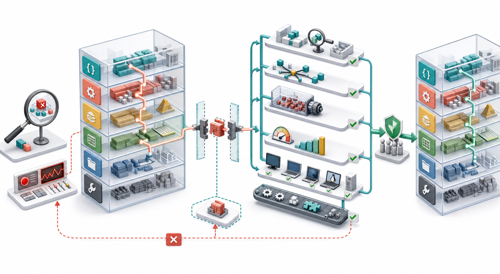

# 如何阅读 RocksDB 源码并贡献代码：从调用链到可信 PR

读大型系统源码的目标不是“把每个文件都看完”，而是回答一个具体问题：

~~~text
哪个公开契约定义了行为？
哪个组件拥有这条策略？
状态沿什么路径变化？
并发边界在哪里？
现有测试如何证明它？
修改后怎样证明没有破坏别处？
~~~

RocksDB 包含公开 API、数据库核心、LSM 元数据、MemTable、SST、Cache、文件系统、事务、备份、多语言绑定、测试与多套构建系统。顺着目录逐文件阅读很快会失去方向；从一个可复现行为出发，沿契约和数据流追踪，才能建立稳定的心智模型。

> 图 1：先用最小实验固定问题，再沿分层源码定位所有权；补丁保持最小，通过单测、确定性并发测试、压力测试、基准、多构建系统和跨平台检查后，才进入审查与集成。

## 1. 本篇路线

本文用两条主线收束整个系列：

1. 阅读主线：以 `DB::Get` 为例，从公开接口追到 MemTable 与 SST；
2. 贡献主线：以一个小型行为修复为例，从复现、测试、实现走到可信 PR。

你将获得的不是一张永不变化的文件清单，而是一套可迁移的方法。

## 2. 先认识仓库地图

| 目录/文件 | 主要职责 | 阅读时的问题 |
| --- | --- | --- |
| `include/rocksdb/` | C++ 公开 API | 用户看到的契约是什么 |
| `db/` | DB 核心、Version、MemTable、Flush、Compaction | 状态和策略由谁拥有 |
| `table/` | SST 格式与 Table Reader/Builder | 数据如何编码、查找、缓存 |
| `cache/` | Cache 实现 | 并发、容量与淘汰语义是什么 |
| `file/`、`env/` | 文件与环境抽象 | I/O 如何跨平台落地 |
| `utilities/` | 事务、备份等扩展能力 | 可选能力如何隔离于核心 |
| `monitoring/` | Statistics、PerfContext 等 | 如何观察系统行为 |
| `test_util/` | 测试框架、SyncPoint、辅助器 | 如何稳定构造边界条件 |
| `tools/` | `db_bench`、SST 工具等 | 如何压测与诊断 |
| `db_stress_tool/` | 随机状态机与一致性压力测试 | 并发/崩溃下是否仍正确 |
| `java/` | Java/JNI API | 公开能力是否跨绑定完整 |
| `docs/components/` | 组件级设计与调用流程 | 阅读入口和核心不变量是什么 |
| `CLAUDE.md` | 本仓库开发与验证约束 | 改动需要满足哪些门槛 |

先读地图，再决定进入哪一层。不要看到一个函数名就默认那一层拥有最终策略。

## 3. 用问题驱动阅读

一个好问题应该可以被代码和实验回答：

~~~text
坏问题：RocksDB 的读取是怎么实现的？

好问题：一次点查在什么条件下停止搜索后续 Level？
好问题：Bloom Filter 的阴性结果在哪一层避免 Data Block I/O？
好问题：Snapshot 的 Sequence Number 在读取路径何时进入 LookupKey？
~~~

把问题写成一句话，然后列出：

- 输入；
- 可观察输出；
- 预期不变量；
- 可能的所有者；
- 最小复现实验。

## 4. 阅读的五层模型

~~~mermaid
flowchart TD
  Q["Observable behavior or failure"] --> A["Public contract"]
  A --> O["Policy owner"]
  O --> D["Data and control flow"]
  D --> C["Concurrency and lifetime"]
  C --> T["Tests and observability"]
  T --> Q
~~~

### 公开契约

参数、返回值、线程安全、生命周期、兼容性承诺是什么？

### 策略所有者

谁决定“是否”“何时”“采用哪种模式”？底层机制不应猜测调用者身份。

### 数据与控制流

对象经过哪些函数，状态在哪些点被转换或安装？

### 并发与生命周期

锁、引用、Snapshot、SuperVersion、后台线程与销毁顺序如何协作？

### 测试与可观测性

现有测试覆盖了什么，哪些 Counter、Property 或日志可以验证理解？

## 5. 从文档进入，而不是从随机源码进入

组件文档入口：

- [组件总览](../docs/components/index.md)；
- [读取流程](../docs/components/read_flow/index.md)；
- [写入流程](../docs/components/write_flow/index.md)；
- [压力测试](../docs/components/stress_test/index.md)。

文档提供名词、主路径和边界；源码确认当前实现。两者不一致时，以当前代码和测试为准，同时判断文档是否也需要更新。

## 6. 用 rg 建立符号地图

先找声明、实现和调用者：

~~~bash
rg -n "virtual Status Get\(" include/rocksdb
rg -n "Status DBImpl::Get\(" db
rg -n "GetImpl\(" db/db_impl
rg -n "TEST_F\(.*Get" db
~~~

查找一个符号时不要只搜你猜测的目录。公开 API 可能还有 C API、Java/JNI、Wrapper DB、Secondary DB、测试、工具和文档引用。

常用搜索维度：

~~~bash
# 精确符号
rg -n "SetPerfLevel"

# 配置项的声明、注册、解析、测试和工具接入
rg -n "write_buffer_size"

# 错误消息往往能直接反查分支
rg -n "Can only call Get"

# 测试名与 SyncPoint 名
rg -n "DBTest|TEST_SYNC_POINT"
~~~

## 7. 先读头文件中的契约

阅读 `DB::Get` 时，先看 [`include/rocksdb/db.h`](../include/rocksdb/db.h)，同时看：

- `ReadOptions` 的字段语义；
- `ColumnFamilyHandle` 生命周期；
- `Status::OK()`、`IsNotFound()` 与错误状态；
- `Slice`/`PinnableSlice` 的所有权；
- Snapshot 与 Timestamp 限制；
- 默认 Column Family 的便利重载。

头文件告诉你“允许什么”。实现文件告诉你“现在怎么做”。贡献代码必须先守住前者。

## 8. DB::Get 调用链

当前主路径可概括为：

~~~text
DB::Get public overload
  -> DBImpl::Get
  -> DBImpl::GetImpl
  -> acquire/reference SuperVersion
  -> MemTable::Get
  -> immutable MemTableList::Get
  -> Version::Get
  -> TableCache::Get
  -> TableReader / BlockBasedTableReader
  -> Data Block / Blob / Merge resolution
  -> release SuperVersion reference
~~~

主要源码入口：

- [`DBImpl::Get`](../db/db_impl/db_impl.cc)；
- [`MemTable`](../db/memtable.cc)；
- [`Version::Get`](../db/version_set.cc)；
- [`TableCache`](../db/table_cache.cc)；
- [`BlockBasedTableReader`](../table/block_based/block_based_table_reader.cc)。

这条链不是“调用越深越重要”。例如是否继续搜索下一层由上层版本与查找状态共同决定，而读取某个 Block 的机制属于 Table 层。

## 9. 画出对象，而不只抄函数名

阅读调用链时维护一张对象表：

| 对象 | 谁创建/持有 | 是否可变 | 生命周期关键点 |
| --- | --- | --- | --- |
| `ReadOptions` | 调用者/入口复制 | 调用内局部调整 | 不应越过引用对象生命周期 |
| `ColumnFamilyData` | DB/VersionSet | 有受控状态变化 | 受 DB 生命周期与锁保护 |
| `SuperVersion` | Column Family | 发布后作为读取视图 | 线程局部缓存与引用管理 |
| `LookupKey` | 单次读取栈帧 | 不可变视图 | 包含 User Key 与 Sequence |
| `MemTable` | Column Family | Active 阶段可写 | Flush 后转 Immutable/SST |
| `Version` | VersionSet | 安装后不可变视图 | 引用决定旧 SST 何时可回收 |
| `TableReader` | TableCache/Cache | 读取结构基本稳定 | Cache Handle/Iterator 可能 Pin |

若不理解对象生命周期，只看函数体很容易引入悬空引用、提前释放或持锁过久。

## 10. 用不变量过滤细节

读取路径的重要不变量包括：

- 返回值必须符合 Snapshot/Sequence 可见性；
- User Comparator 与 InternalKey 排序不能混用；
- 新版本不能让旧 Snapshot 看到未来写入；
- Tombstone 必须遮蔽更旧值；
- Cache 命中与磁盘读取必须得到同样逻辑结果；
- 错误不能被静默改写成 NotFound；
- Pin 的内存必须在消费者完成前保持有效。

每读一个分支都问：它维护了哪个不变量？若答案只是“因为当前调用者碰巧这样”，可能存在契约边界泄漏。

## 11. 区分机制与策略

假设 Compaction 希望绕开某种共享缓存：

~~~text
上层策略：这次 Compaction 采用何种 I/O/Cache 策略
下层机制：打开独立 Reader、跳过插入、采用指定 FileOptions
~~~

底层 TableReader 应暴露精确机制，而不是增加一个“is_compaction”布尔值后顺便改变 Reader 所有权、Cache、预取和 I/O 模式。

审查新参数时问：

- 一个 Flag 是否控制了多个不相关行为；
- 通用层注释是否写进了某个调用者的特殊理由；
- 是否通过偶然字段推断策略；
- 新调用者是否会无意继承旧调用者假设。

## 12. 阅读状态机，而不是单个快照

LSM 行为通常跨阶段：

~~~mermaid
stateDiagram-v2
  [*] --> Reproduce
  Reproduce --> Contract
  Contract --> LocateOwner
  LocateOwner --> MinimalPatch
  MinimalPatch --> UnitTest
  UnitTest --> StressTest
  StressTest --> Benchmark
  Benchmark --> Review
  UnitTest --> MinimalPatch: failure
  StressTest --> MinimalPatch: race
  Benchmark --> MinimalPatch: regression
  Review --> MinimalPatch: contract issue
  Review --> [*]: accepted
~~~

对源码对象也采用同样视角：MemTable 从 Active 到 Immutable 再到 Flush；SST 从创建到 Version 安装、被新 Version 淘汰、最后在引用释放后删除。Bug 常出现在阶段切换，而不是稳定状态。

## 13. 先做最小复现

贡献代码的第一件工件通常应该是失败测试或最小程序：

~~~cpp
#include <cassert>
#include <memory>
#include <string>

#include "rocksdb/db.h"

int main() {
  rocksdb::Options options;
  options.create_if_missing = true;

  rocksdb::DB* raw = nullptr;
  rocksdb::Status s =
      rocksdb::DB::Open(options, "/tmp/rocksdb-repro", &raw);
  assert(s.ok());
  std::unique_ptr<rocksdb::DB> db(raw);

  s = db->Put(rocksdb::WriteOptions(), "key", "value");
  assert(s.ok());
  s = db->Delete(rocksdb::WriteOptions(), "key");
  assert(s.ok());

  std::string value;
  s = db->Get(rocksdb::ReadOptions(), "key", &value);
  assert(s.IsNotFound());
}
~~~

真实复现还应固定随机种子、Options、操作顺序、并发角色和重启/Flush/Compaction 边界。

## 14. 把复现变成回归测试

RocksDB 测试已有大量 Fixture 与辅助函数。优先复用它们：

~~~cpp
TEST_F(DBTest, DeleteHidesValueAcrossFlush) {
  ASSERT_OK(Put("key", "v1"));
  ASSERT_OK(Flush());
  ASSERT_EQ("v1", Get("key"));

  ASSERT_OK(Delete("key"));
  ASSERT_EQ("NOT_FOUND", Get("key"));

  ASSERT_OK(Flush());
  ASSERT_EQ("NOT_FOUND", Get("key"));
}
~~~

好的回归测试应该：

- 修复前稳定失败，修复后稳定通过；
- 只依赖行为契约，不锁死无关实现细节；
- 覆盖触发 Bug 所需的最小阶段转换；
- 错误路径明确检查 `Status`；
- 在失败消息中保留种子和参数。

## 15. 并发测试不要使用 sleep

`sleep_for()` 不能证明线程已经到达某个内部阶段，只是在猜调度。RocksDB 使用 SyncPoint 构造确定性交错：

~~~cpp
SyncPoint::GetInstance()->LoadDependency({
    {"Test:writer-ready", "DBImpl::TargetPoint"},
    {"DBImpl::TargetPoint:done", "Test:reader-continues"},
});
SyncPoint::GetInstance()->EnableProcessing();

// Start writer and reader, then assert the intended interleaving.

SyncPoint::GetInstance()->DisableProcessing();
SyncPoint::GetInstance()->ClearAllCallBacks();
~~~

实现中对应位置使用测试宏暴露事件。SyncPoint 名称是测试契约的一部分，应描述局部事件，不要依赖无关时序。

入口见 [`test_util/sync_point.h`](../test_util/sync_point.h)。

## 16. 选择正确的测试层级

| 测试层级 | 适合内容 | 不适合替代 |
| --- | --- | --- |
| 单元测试 | 一个组件、边界、错误分支 | 长期并发状态空间 |
| DB 集成测试 | Write/Flush/Compaction/Read 联动 | 性能结论 |
| 随机/属性测试 | 多组合与未知边界 | 明确错误分支的可读测试 |
| `db_stress` | 并发、重启、随机操作和一致性 | 精确定位单个失败原因 |
| Crash Test | 崩溃恢复与持久性 | 普通逻辑分支 |
| `db_bench` | 吞吐、延迟与资源成本 | 正确性证明 |

一个高风险核心修改通常需要多层证据，而不是把所有情况塞进一个巨型测试。

## 17. 快速运行目标测试

串行运行少量测试：

~~~bash
build_tools/rockstest.sh db_test \
  --gtest_filter='DBTest.DeleteHidesValueAcrossFlush'
~~~

多个测试或较大集合使用并行脚本：

~~~bash
build_tools/rocksptest.sh db_test db_basic_test \
  --gtest_filter='*Delete*'
~~~

这两个脚本会使用 `AUTO_CLEAN=1` 并按 CPU 核数并行构建，避免混用不同编译参数留下的旧对象文件。

## 18. 专门压测 Flakiness

并发测试通过一次几乎没有说服力：

~~~bash
COERCE_CONTEXT_SWITCH=1 \
  build_tools/rockstest.sh db_test -r100 \
  --gtest_filter='DBTest.DeleteHidesValueAcrossFlush'
~~~

随机测试应记录种子：

~~~cpp
const uint32_t seed = static_cast<uint32_t>(Env::Default()->NowMicros());
SCOPED_TRACE("seed=" + std::to_string(seed));
Random rnd(seed);
~~~

确定性边界测试与随机测试分开保留。前者解释契约，后者扩展状态空间。

## 19. Status 必须被处理

RocksDB 使用 `Status` 传播 I/O、损坏、参数、NotFound 等状态。危险代码：

~~~cpp
db->Put(write_options, key, value);  // Return value ignored.
~~~

正确处理：

~~~cpp
rocksdb::Status s = db->Put(write_options, key, value);
if (!s.ok()) {
  return s;
}
~~~

在完整验证中启用状态检查：

~~~bash
AUTO_CLEAN=1 ASSERT_STATUS_CHECKED=1 make check
~~~

不要把真实 I/O Error 降级成 NotFound，也不要仅在 Debug 模式依赖断言处理生产错误。

## 20. 修改范围越小，证据越清楚

一个可信补丁通常包含：

~~~text
one behavioral problem
  + one clearly owned implementation change
  + focused regression tests
  + docs / metrics / benchmark when required
~~~

避免在同一 PR 中顺手：

- 大规模重命名；
- 格式化无关文件；
- 搬迁模块；
- 改变多个默认值；
- 引入与修复无关的抽象。

小补丁并不等于少测试。它意味着行为边界清楚、回滚容易、审查者能把每行代码连接到问题。

## 21. 新文件要同步构建系统

RocksDB 同时维护 Make、CMake 与 BUCK 等构建入口。新增 `.cc` 文件时，根据仓库规则同步：

- `Makefile`；
- `CMakeLists.txt`；
- `src.mk`；
- `BUCK` 生成结果。

不要手工编辑 `BUCK`，而是在更新 `src.mk` 后运行仓库的 Buck 生成器：

~~~bash
/usr/local/bin/python3 buckifier/buckify_rocksdb.py
~~~

搜索同目录相邻源码在各构建系统中的注册方式，比凭空写新规则可靠。

## 22. 新增公开 API 的影响面

公开 API 不只是 `include/rocksdb/db.h` 中加一个虚函数：

~~~text
C++ public header
  -> DBImpl implementation
  -> StackableDB forwarding
  -> read-only / secondary variants
  -> C API generation path
  -> Java / JNI when applicable
  -> tests and documentation
  -> compatibility review
~~~

开始之前阅读 [新增公开 API 指南](../claude_md/add_public_api.md)。重点检查：

- 默认 Column Family 便利重载；
- Wrapper DB 是否转发；
- Secondary/ReadOnly 是否应返回 `NotSupported`；
- C API 文件是否由生成器维护；
- ABI/API 兼容性；
- 生命周期与线程安全文档。

## 23. 新增 Option 的影响面

Option 需要同时考虑：

- 公共声明与默认值；
- Mutable/Immutable 分类；
- 字符串序列化与反序列化；
- `SetOptions` 动态更新；
- Options 文件持久化与兼容；
- `db_bench`、`db_stress` 与 Crash Test；
- C/Java/JNI 绑定；
- 测试和发布说明。

完整清单见 [新增 Option 指南](../claude_md/add_option.md)。一个字段若只在结构体里存在，却不能被解析、打印、压测和压力测试，就不算完整接入。

## 24. 性能修改必须有基准证据

先构建 Release 版：

~~~bash
AUTO_CLEAN=1 DEBUG_LEVEL=0 make db_bench
~~~

基准报告至少包含：

~~~text
hardware / filesystem / compiler
commit before and after
full command and options
dataset and cache state
throughput + P50/P95/P99/P99.9
CPU / memory / device IO
multiple repetitions and variance
~~~

性能改动还应让 `db_bench` 能配置或触发新能力。只报告一次最高值，无法区分真实提升、缓存状态和随机波动。

## 25. 跨平台不是 CI 才考虑

本地 Linux + GCC 通过，不代表以下组合通过：

- Linux x86_64 / ARM；
- macOS / AppleClang；
- Windows / MSVC；
- MinGW；
- Clang + libc++；
- Release `-fno-rtti`；
- ASAN/UBSAN/TSAN；
- Unity Build、JNI、Folly 等配置。

常见陷阱：

- 无保护使用 POSIX 头文件与函数；
- 依赖 GCC 扩展；
- 依赖传递 include；
- 在生产路径使用 `dynamic_cast`；
- 假设 `size_t`、文件句柄或路径格式；
- 新文件只加入一个构建系统。

优先使用 RocksDB 的 `port::`、`Env` 和 `FileSystem` 抽象。

## 26. 格式与源码检查

自动格式化目标改动：

~~~bash
make format-auto
~~~

检查源码列表、许可证和 ASCII 约束：

~~~bash
make check-sources
~~~

新增源文件需要标准双许可证头。C++ 源码注释与字符串使用 ASCII，避免智能引号、长破折号等导致 CI 失败。

## 27. 完整验证阶梯

不要一开始每次都跑全量测试。采用由快到慢的阶梯：

~~~text
compile touched target
  -> focused unit test
  -> related test binary / component tests
  -> flakiness repetition
  -> db_stress / crash test when relevant
  -> benchmark when performance-sensitive
  -> format + source checks
  -> full make check
  -> ASSERT_STATUS_CHECKED make check
~~~

最终完整命令：

~~~bash
AUTO_CLEAN=1 make check
AUTO_CLEAN=1 ASSERT_STATUS_CHECKED=1 make check
~~~

全量检查时间较长，可用以下命令读取机器可解析的进度：

~~~bash
make check-progress
~~~

## 28. 如何阅读失败

测试失败时不要立即改第一处 Assertion。按层分类：

| 失败类型 | 首先确认 |
| --- | --- |
| 编译错误 | Header、命名空间、跨平台、生成文件 |
| 链接错误 | 新源文件是否加入全部构建列表、构建模式是否混用 |
| 确定性测试失败 | 契约、输入、状态转换、错误传播 |
| 偶发失败 | 数据竞争、生命周期、非确定调度、测试污染 |
| 性能回退 | 热路径分配、拷贝、锁、Cache、I/O 与测量噪声 |
| Sanitizer 失败 | 越界、Use-after-free、数据竞争、未定义行为 |

先保存最小失败命令、种子、日志和配置，再缩小范围。不要用放宽断言或增加 Sleep 掩盖问题。

## 29. Code Review 在审什么

审查者通常依次关心：

1. 行为是否正确，是否保留数据库语义；
2. 契约是否放在正确层；
3. 并发与生命周期是否安全；
4. 错误是否完整传播；
5. 热路径是否引入分配、拷贝、分支或锁；
6. 测试是否能稳定证明修复；
7. 公共 API 与格式是否兼容；
8. 构建、平台、文档与工具是否完整接入。

提交说明应解释“为什么”：

~~~text
Problem:
  observable failure and affected contract

Root cause:
  owning component and broken invariant

Change:
  minimal mechanism/policy adjustment

Validation:
  focused tests, stress, benchmark, compatibility checks
~~~

## 30. 回应审查意见

收到意见后：

- 先确认审查者指出的是正确性、契约、可读性还是性能问题；
- 修改代码时同步更新测试和注释；
- 不只修表面行，重新搜索同类模式；
- 用新验证结果回复，而不是只说“已修复”；
- 若不同意，提供代码路径、契约和实验依据；
- 避免在讨论中偷偷扩大 PR 范围。

好的审查不是把补丁变得更复杂，而是让行为所有权和证据更清楚。

## 31. 首次贡献前的准备

阅读仓库的 [CONTRIBUTING.md](../CONTRIBUTING.md)。首次贡献还需要按项目要求完成 Contributor License Agreement。

选题优先级：

- 有明确复现的 Bug；
- 缺失的边界测试；
- 代码与文档不一致；
- 可测量的性能问题；
- 已讨论并确认所有权的 API/Option 改动。

不确定设计时先讨论问题与契约，再投入大规模实现，能显著减少返工。

## 32. 一份可执行的贡献清单

### 定位

- [ ] 问题能用一句话描述；
- [ ] 有最小复现与预期结果；
- [ ] 已找到公开契约和策略所有者；
- [ ] 已搜索所有调用者、绑定、Wrapper 与测试；
- [ ] 已写出关键不变量与生命周期。

### 实现

- [ ] 改动范围只覆盖一个行为；
- [ ] 通用层没有泄漏调用者策略；
- [ ] 所有 `Status` 都被检查或传播；
- [ ] 热路径没有无依据的分配、拷贝或锁；
- [ ] 新文件已同步构建系统；
- [ ] API/Option 已覆盖完整影响面。

### 验证

- [ ] 修复前测试失败，修复后通过；
- [ ] 边界和错误路径已覆盖；
- [ ] 并发测试使用 SyncPoint 而非 Sleep；
- [ ] Flakiness 重复测试通过；
- [ ] 相关 Stress/Crash Test 已运行；
- [ ] 性能改动有可复现基准；
- [ ] 格式、源码与全量检查通过；
- [ ] 已考虑 Windows、macOS、ARM 与不同编译器。

## 33. 推荐源码阅读练习

按以下顺序各做一次“契约 -> 调用链 -> 测试”练习：

1. `DB::Get`：追踪 MemTable、Immutable 与 Version；
2. `DB::Write`：追踪 WriteThread、WAL 与 MemTable；
3. `Flush`：追踪 Pick、Build Table 与 Version Edit；
4. `Compaction`：追踪 Score、Pick、Job 与安装结果；
5. `Iterator::Seek`：追踪 DBIter、MergingIterator 与 Block Iterator；
6. `CreateCheckpoint`：追踪 Live Files、Hard Link 与 WAL；
7. 一个 Option：追踪声明、序列化、动态更新、工具和测试。

每次输出一张调用图、一张对象生命周期表和一个可运行测试，比写大段源码摘要更能暴露理解漏洞。

## 34. 源码入口索引

~~~text
CLAUDE.md
  -> docs/components/index.md
  -> include/rocksdb/*.h
  -> db/db_impl/*.cc
  -> db/version_set.cc / db/memtable.cc
  -> table/block_based/*.cc
  -> test_util/*
  -> db/*_test.cc
  -> db_stress_tool/*
  -> tools/db_bench_tool.cc
  -> src.mk / CMakeLists.txt / Makefile / BUCK
~~~

核心入口：

- [仓库开发指南](../CLAUDE.md)；
- [贡献说明](../CONTRIBUTING.md)；
- [组件文档](../docs/components/index.md)；
- [DB 公开 API](../include/rocksdb/db.h)；
- [DBImpl](../db/db_impl/db_impl.cc)；
- [测试辅助器](../db/db_test_util.h)；
- [SyncPoint](../test_util/sync_point.h)；
- [单测脚本](../build_tools/rockstest.sh)；
- [并行测试脚本](../build_tools/rocksptest.sh)；
- [`db_bench`](../tools/db_bench_tool.cc)。

## 35. 系列收官

~~~text
阅读：从问题出发，不从目录出发
契约：先看公开语义，再看当前实现
所有权：策略留在调用者，底层暴露精确机制
状态：关注阶段转换、引用与并发边界
测试：最小复现 -> 回归测试 -> 确定性交错 -> 压力验证
性能：用 Release 基准和多次测量证明
兼容：同步 API、绑定、Options、构建系统与平台
审查：解释根因、最小改动和完整证据
~~~

到这里，这个系列已经从最小 KV 示例走过写入、WAL、MemTable、Flush、读取、SST、Cache、Compaction、删除、事务、备份和性能调优，最后回到“怎样自己继续读、继续验证、继续贡献”。

真正理解 RocksDB 的标志，不是记住某个版本里函数位于哪一行，而是面对一个新行为时，能快速找到契约、所有者、状态机和验证方法；面对一个补丁时，能说明它为什么正确、为什么属于这里、代价是什么，以及怎样证明。

后续扩展篇可以继续深入第十九篇留下的内存治理主题：建立 MemTable、Block Cache、Table Reader、Pinned Block 与多实例共享预算的可计算模型。

## 参考入口

- [CLAUDE.md](../CLAUDE.md)；
- [CONTRIBUTING.md](../CONTRIBUTING.md)；
- [组件文档](../docs/components/index.md)；
- [新增公开 API 指南](../claude_md/add_public_api.md)；
- [新增 Option 指南](../claude_md/add_option.md)；
- [DB 测试示例](../db/db_test.cc)；
- [Stress Test 文档](../docs/components/stress_test/index.md)；
- [`db_bench`](../tools/db_bench_tool.cc)。
