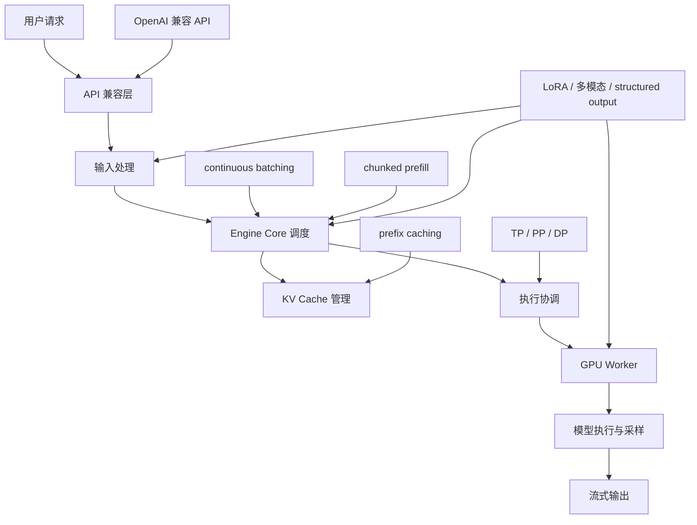
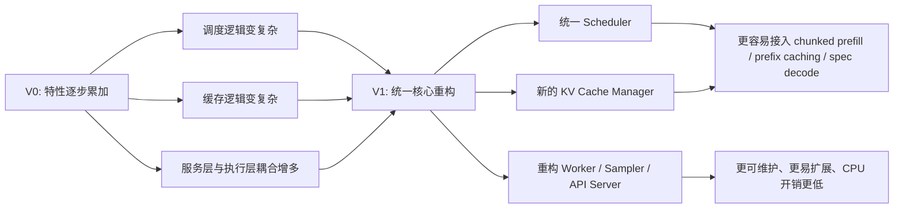

# vLLM 到底在解决什么问题：为什么推理系统会复杂到今天这样

## 这篇要回答什么问题

很多人第一次接触 vLLM 时，看到的是一句很直接的介绍: “一个高性能、易用的 LLM serving 框架”。如果只停留在这个层面，容易把它理解成“把 Hugging Face 模型包一层 HTTP 接口，再做一些性能优化”。

但这不是 vLLM 的真实定位。

今天的 vLLM，更接近一个 **LLM 推理运行时**，而不是一个简单的“模型推理封装”。它要同时处理吞吐、时延、显存利用率、并发请求、缓存复用、流式返回、分布式执行、模型兼容性，以及不断增长的新能力，比如 LoRA、多模态、结构化输出、speculative decoding。

所以这篇文章真正要回答的问题是:

> 为什么大模型推理系统会复杂到今天这样，而 vLLM 又是如何把这些复杂性组织成一个可运行、可扩展、还能保持高性能的系统？

如果把这个问题想清楚，后面再去读 `scheduler`、`KV Cache`、`worker`、`sampler`、`API server`，就不会只看到一堆分散的模块，而能看到它们背后在共同解决的系统性矛盾。

## 如果不了解这个问题，后面会在哪些地方读不下去

如果没有先建立这层“问题视角”，读 vLLM 源码时通常会在几个地方卡住:

- 看到 `continuous batching`，会误以为它只是“自动把请求攒批”。
- 看到 `prefix caching`，会误以为它只是“做了一个 prompt 缓存”。
- 看到 API Server、Engine Core、GPU Worker 分成多个进程，会觉得架构太重。
- 看到 V1 重写了调度器、KV Cache、Worker、Sampler、API Server，会疑惑为什么不在 V0 上继续修修补补。
- 看到服务层还要理解 LoRA、多模态、structured output，会觉得职责边界不够“纯”。

这些困惑背后其实都指向同一个事实: **LLM 推理不是一次前向计算的问题，而是一个长生命周期、强资源约束、强并发耦合的在线系统问题。**

## 先给一张全景图

先用一句话概括 vLLM 在解决什么:

> 它试图把“很多不同长度、不同阶段、不同能力要求的请求”，稳定而高效地塞进一组受限的 GPU 里，并且以用户能接受的 API 语义返回结果。

可以把 vLLM 的能力地图画成下面这样:

这张图里最重要的不是模块名称，而是一个判断: **vLLM 的核心任务从来不是“把模型跑起来”，而是“让模型在复杂约束下持续跑得划算”。**

## 为什么推理系统会复杂到今天这样

### 1. 单次前向很简单，持续服务很难

离线推理时，你可以拿一批 prompt，跑一次生成，然后结束。在线服务完全不是这样。

在线场景里的请求会持续到来，而且它们往往具有下面这些特征:

- 到达时间不同，无法天然组成整齐 batch。
- prompt 长度差异很大。
- 有些请求还在 prefill，有些已经进入 decode。
- 用户希望首 token 尽快返回，又希望总吞吐尽量高。
- 相同前缀会反复出现，但后续生成路径不同。

这意味着推理系统不能只关心“这一步 forward 多快”，而必须关心:

- 现在该让谁先上 GPU。
- batch 要不要重组。
- 已经算过的 KV 能不能复用。
- 显存什么时候该分配，什么时候该回收。
- 一组请求一起执行时，谁在拖慢其他请求。

这就是为什么推理服务会从“模型执行”演化成“调度系统”。

### 2. LLM 的主要瓶颈不只是算力，还有 KV Cache

大模型推理与训练很不一样。训练看重吞吐和大 batch，推理除了算力，还要面对一个很现实的问题: **KV Cache 会随着上下文增长持续占用显存**。

用户每多生成一个 token，系统往往就要为这个请求继续维护更多上下文状态。并发一高，真正先撞上的常常不是 FLOPS，而是显存和缓存管理能力。

这也是 vLLM 早期最出名的点: 它不是先去宣传“某个 kernel 更快”，而是先把注意力放在 **PagedAttention / paged KV cache** 这一类内存管理思路上。虽然今天仓库里的 `docs/design/paged_attention.md` 已经明确标注为历史文档，但它仍然说明了一个很关键的方向:

**vLLM 从一开始就在把 KV Cache 当成一个需要精细管理的内存系统，而不是顺手挂在模型旁边的一块缓存。**

### 3. 请求不是只有“prefill”和“decode”两个孤立阶段

很多入门文章会把推理拆成:

- prefill: 先把 prompt 整体编码一遍
- decode: 再一 token 一 token 地往后生成

这个划分没有错，但如果把它理解成两个互不相干的阶段，就会很快撞到实现问题。

真实系统中，同一时刻你会同时面对:

- 一批已经开始逐 token 解码的老请求
- 一批刚进来的新请求
- 一些前缀能复用缓存的请求
- 一些带多模态输入或特殊预算约束的请求

如果系统把 prefill 和 decode 完全分裂成两套调度逻辑，很多优化就会互相打架。vLLM V1 明确把 prompt token 和 output token 放进统一 token budget 里，用同一调度器管理，这样 `chunked prefill`、`prefix caching`、`speculative decoding` 等能力才能真正落到一条主链路里，而不是每加一个特性就额外分叉一层逻辑。

### 4. API 兼容只是表面，服务层其实承担了大量语义工作

很多用户通过 OpenAI-compatible API 使用 vLLM，于是容易产生一个错觉: 服务层不过是个 HTTP 转发器，真正复杂的都在模型执行层。

但只要看一下架构文档，就会发现 API Server 远不止是“收请求、发结果”。它还要处理:

- HTTP 协议与流式输出
- 输入预处理与 tokenizer
- 多模态数据加载
- 请求到内部 engine client 的映射
- 鉴权、metrics、中间件
- 与 LoRA、结构化输出等能力相关的请求语义

也就是说，**服务层并不是“薄薄一层壳”**。它承担的是“把外部 API 语义转换成内部运行时语义”的工作。

### 5. 执行层复杂，是因为控制面和数据面必须拆开

如果系统只在单卡上跑一个模型，那么很多事情都可以写在一个进程里。但 vLLM 要面对的是:

- 单机多卡
- tensor parallel、pipeline parallel、data parallel
- 不同硬件平台
- 不同模型家族
- 高并发在线请求

这时，把所有东西堆进一个进程会很快变得不可维护。V1 文档已经把这种拆分说得很清楚:

- API Server 负责 HTTP、输入处理和流式返回
- Engine Core 负责调度、KV Cache 管理和执行协调
- GPU Worker 负责每张 GPU 上的模型执行和设备资源管理
- 在 DP 场景下，还会引入 DP Coordinator

所以多进程并不是为了“把结构画得更复杂”，而是为了把控制面与执行面拆开，把 CPU 侧请求管理和 GPU 侧执行管理解耦。

## vLLM 的核心回答是什么

理解了上面的复杂性，再看 vLLM 的设计就会更顺。

### continuous batching: 不是攒批，而是持续重排 batch

传统 batch 思路是“等一批请求凑齐再跑”。这对 LLM 在线服务不够，因为请求到达是连续的，生成长度也是动态的。

`continuous batching` 的关键不是“批处理”这三个字，而是 **continuous**:

- 新请求可以持续进入系统
- 旧请求可以持续留在 batch 中继续 decode
- batch 会在每一步调度时被重新组织
- GPU 尽量保持忙碌，而不是等整批请求一起结束

这本质上是把“静态批处理”变成“动态调度”。

在 V1 里，这个思想进一步被统一进 scheduler: prompt token 和 output token 被放进同一个 token budget，不再用两套割裂逻辑分别处理。这就是为什么 V1 文档会特别强调 unified scheduler。

### prefix caching: 不是简单缓存 prompt，而是复用已算过的 KV blocks

很多系统都知道“相同前缀可以复用”。真正难的是: **怎么让它在在线系统里低开销、可回收、可扩展地成立**。

vLLM 的做法不是存一份“prompt -> hidden states”的大字典，而是以 block 为单位管理 KV Cache，并对完整 block 做哈希。这样带来的好处是:

- 可以按块复用，而不是要求整段 prompt 全量一致
- 可以和块分配、回收、淘汰策略结合
- 可以自然接入多模态输入哈希、LoRA ID、cache salt 等附加条件

所以 `prefix caching` 在 vLLM 里不是一个边缘优化，而是 KV Cache 系统的一部分。

### 多进程架构: 不是工程铺张，而是运行时分层

V1 的多进程架构，本质是在回答一个问题: **谁负责“理解请求”，谁负责“决定资源”，谁负责“真正执行模型”？**

对应关系非常清晰:

- API Server: 面向客户端协议与输入语义
- Engine Core: 面向调度与资源决策
- GPU Worker: 面向设备执行与显存管理

这种分层的价值在于，后续无论你增加的是 LoRA、多模态、structured output，还是新的并行形态、硬件后端，都更容易找到应该接入哪一层，而不是把每个新特性横着塞进整个系统。

## 为什么 V1 要“重写核心”，而不是继续修 V0

这是理解 vLLM 最近演进时最重要的一点。

`docs/usage/v1_guide.md` 对 V0 到 V1 的变化总结得很直接: V0 成功支持了大量模型和硬件，但随着新能力独立生长，系统复杂度越来越高，技术债逐渐显现。于是 V1 选择保留那些已经稳定、成熟、可复用的部分，比如模型实现、GPU kernels 和工具层，同时重构真正承载复杂性的核心路径:

- scheduler
- KV cache manager
- worker
- sampler
- API server

V1 试图实现的目标可以概括成四个词:

- 更简单
- 更模块化
- 更高性能
- 更统一

这里的“统一”非常关键。它不是指把所有代码塞进一起，而是指:

- 用统一调度框架承接 prompt 和 decode
- 用统一运行时承接缓存、采样、执行和服务层语义
- 尽量把优化做成默认能力，而不是靠用户手工拼配置

可以把 V0 到 V1 的变化摘要成下面这张图:

如果说 V0 像是在一套已经证明可用的系统上不断叠能力，那么 V1 更像是在保留成熟资产的前提下，重新定义“核心运行时”的边界。

## 一张“vLLM 能力地图”

下面这张表可以当作这篇文章的核心总结。它回答的是: vLLM 的每个能力，究竟在解决哪一类系统问题。

| 系统问题 | 典型症状 | vLLM 的回答 |
| - | - | - |
| 请求持续到来，长度不一 | 静态 batch 利用率低，尾延迟高 | `continuous batching` + 统一调度 |
| prompt 很长，prefill 容易拖慢 decode | 新老请求互相抢预算 | `chunked prefill` + token budget |
| 显存首先被 KV Cache 顶满 | 并发上不去，缓存回收困难 | paged/block-based KV Cache 管理 |
| 相同前缀反复出现 | 重复 prefill，吞吐浪费 | `prefix caching` |
| HTTP 语义和内部运行时语义不同 | 服务层职责膨胀 | API Server 统一做协议、输入处理、流式输出 |
| 调度与执行互相耦合 | 特性越来越难加 | API Server / Engine Core / Worker 分层 |
| 模型、硬件、并行方式越来越多 | 兼容性和扩展性迅速恶化 | 模块化 V1 架构 + 配置统一收敛 |

这张表也提醒我们一个很重要的事实:

**vLLM 的“快”不是某一个点的快，而是把请求、缓存、调度、执行、输出整个链路都压成了一个更高效的运行时。**

## 最后回到一次请求生命周期

现在可以再用“请求生命周期”把全局串起来:

1. 用户通过 OpenAI-compatible API 或离线接口发来请求。
2. API Server 解析输入，处理 tokenizer、多模态数据、流式语义等服务层问题。
3. 请求进入 Engine Core，由 scheduler 决定这一轮给它多少 token 预算、是否和其他请求一起进入当前 batch。
4. KV Cache 管理器判断哪些 prefix blocks 可以命中，哪些 block 需要新分配。
5. Engine Core 把执行任务派给 GPU Worker。
6. Worker 在对应 GPU 上组织模型执行、维护设备侧状态，并把结果交给采样和输出处理链路。
7. API Server 再把结果以用户熟悉的协议流式返回。

这条链路里，每一层看起来都像是一个独立模块，但真正让它们连接在一起的，是同一个目标:

**让“不断变化的请求集合”在“严格受限的 GPU 资源”上持续产生高质量、低成本的输出。**

这就是 vLLM 真正在解决的问题。

## 这篇文章之后，最值得继续读什么

如果你已经接受了“vLLM 是一个推理运行时”这个视角，接下来最适合继续读的不是某个零散功能，而是它的 V1 分层架构:

- `docs/design/arch_overview.md`
- `docs/usage/v1_guide.md`
- `vllm/v1/engine/core.py`
- `vllm/v1/executor/multiproc_executor.py`
- `vllm/v1/worker/gpu_worker.py`

按这个顺序往下读，你会先看清“系统怎么分层”，再看清“每层如何协作”，最后再进入调度、缓存和执行的细节。

## 一句话总结

不要把 vLLM 看成“帮你跑模型的工具”。

更准确地说，它是在回答这样一个系统问题:

> 当 LLM 请求变得长、碎、并发、异构，而且用户还要求低时延、高吞吐、低成本、强兼容时，推理系统应该如何组织自己？

vLLM 给出的答案，就是一个围绕调度、KV Cache、执行层和服务层协同构建出来的 LLM 推理运行时。
