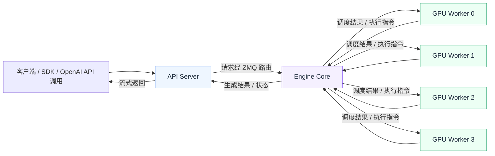
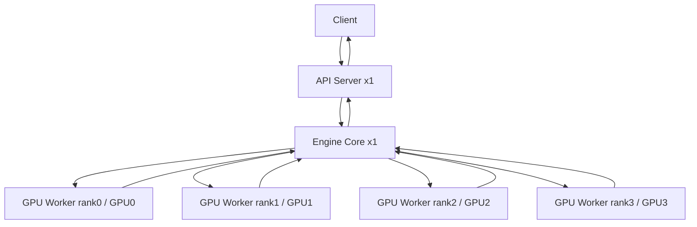
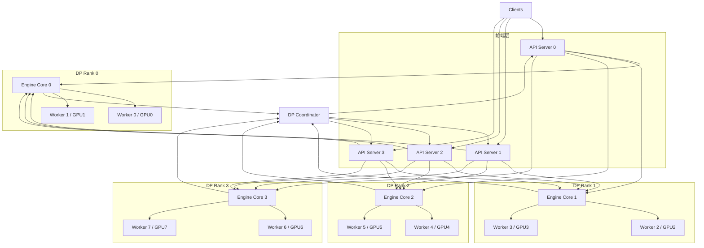

# 一张图看懂 vLLM V1：API Server、Engine Core、GPU Worker 如何协作

## 这篇要回答什么问题

很多人第一次看 vLLM V1 架构图时，最直观的反应往往是：

- 为什么要拆这么多进程？
- 为什么不是一个服务进程直接把模型跑起来？
- API Server、Engine Core、GPU Worker 到底谁在做决定，谁在真正执行？
- 数据并行一开，为什么又多出一个 `DP Coordinator`？

如果这些问题没有先想清楚，后面去读 `scheduler`、`KV Cache manager`、`worker`、`api_server`，很容易把它们看成几块分散的代码，而看不出它们其实是在共同回答同一个系统问题：

> 一个在线推理系统，应该如何把“面向用户的请求语义”“面向资源的调度决策”和“面向设备的模型执行”拆开，又重新协同起来？

vLLM V1 给出的回答，就是现在这套多进程分层架构。

这篇文章不会一上来就按目录背源码，而是先把这套分层的职责边界讲清楚，再回到关键类和关键流程，最后用一次完整请求生命周期把四类进程串起来。

## 如果不了解这个模块，后面会在哪些地方读不下去

如果没有先建立 V1 多进程架构的整体认知，后面读源码时通常会在这些地方卡住：

- 看到 `vllm serve` 拉起不止一个进程，会觉得“结构太重”，但不知道它到底重在哪里、值不值得。
- 看到 `EngineCore` 里既初始化 executor，又初始化 KV Cache、scheduler、structured output manager，会不清楚它为什么是控制中枢。
- 看到 `MultiprocExecutor` 负责创建 worker 进程、消息队列、就绪同步，会不清楚它和 `EngineCore` 的边界。
- 看到 `Worker` / `GPUWorker` 里既做设备初始化，又做模型加载、显存管理，会不清楚它到底是“执行器”还是“运行时外壳”。
- 看到数据并行时除了 API Server、Engine Core、GPU Worker 之外还多了 `DP Coordinator`，会不知道它是不是又一层多余封装。

这些困惑背后，其实都是同一个问题：**vLLM V1 不是把推理系统拆碎了，而是在按职责把控制面、协调面和执行面重新分层。**

## 先给一张全景图

先用一句话概括 V1 的进程分层：

> API Server 负责和客户端说话，Engine Core 负责做系统级决策，GPU Worker 负责在设备上真正执行模型；当进入数据并行时，DP Coordinator 再负责跨多个 Engine Core 做负载视角的协调。

把它画成一张总图，大致是这样：

这张图里最重要的不是“有哪些箭头”，而是三层职责的分工：

- `API Server` 处理 HTTP、输入处理、流式返回，以及把外部 API 语义变成内部请求语义。
- `Engine Core` 持有调度器、KV Cache 相关管理能力和执行协调逻辑，是 V1 的控制中枢。
- `GPU Worker` 绑定具体 GPU，负责设备初始化、模型加载、前向执行和设备资源管理。

如果把 V1 想成一个公司组织结构：

- API Server 像前台和接单系统。
- Engine Core 像调度中心。
- GPU Worker 像真正干活的产线。

前台不应该直接决定显存怎么分、哪个请求先跑；产线也不应该自己决定全局调度策略。V1 的多进程设计，本质上就是把这些事情拆回到最合适的层里。

## 一张“单机 TP=4”进程图

先看最常见、也最容易建立直觉的场景：单机 4 卡，`tensor_parallel_size=4`，没有数据并行。

根据架构文档，这种部署默认会有：

- 1 个 `API Server`
- 1 个 `Engine Core`
- 4 个 `GPU Worker`

总共是 **6 个进程**。

可以画成下面这样：

这个场景里最关键的判断是：

- 对用户来说，系统入口只有一个 API Server。
- 对调度来说，系统中只有一个全局控制中枢，也就是一个 Engine Core。
- 对执行来说，每张 GPU 都有一个独立 Worker 进程负责。

也就是说，**TP 扩大的是执行面，不会自动复制控制面。**

这很符合 tensor parallel 的本质：同一个请求的一次前向，需要多张卡一起参与，所以这些卡更像是同一个执行单元里的多个成员，而不是多套独立服务实例。

## 一张“DP + TP”进程图

接着看另一个更能体现 V1 分层价值的场景：`tp=2, dp=4`，总共 8 张 GPU。

架构文档给出的默认进程数量是：

- 4 个 `API Server`
- 4 个 `Engine Core`
- 8 个 `GPU Worker`
- 1 个 `DP Coordinator`

总共是 **17 个进程**。

可以把它理解成：系统现在不是只有“一套控制面 + 一套执行面”，而是存在 **4 个 DP rank**，每个 rank 都有自己的一套局部控制与局部执行单元。

这张图传达了两个非常关键的事实。

第一，`DP` 扩大的不只是 worker 数量，还会复制 Engine Core。

因为数据并行不是“一次前向拆到多卡上”，而是“系统中存在多份可独立接活的副本”。既然每个 DP rank 都可能处理不同请求，就需要：

- 各自的调度状态
- 各自的 KV Cache
- 各自的执行协调逻辑

所以在 V1 里，**1 个 DP rank 对应 1 个 Engine Core**。

第二，前端 API Server 和后端 Engine Core 之间是 many-to-many 拓扑。

架构文档明确说明，默认情况下：

- API Server 个数会自动扩到 `DP size`
- 每个 API Server 会连接到所有 Engine Core
- 这样任意前端都可以把请求路由到任意后端 rank

这意味着 API Server 不是和某个固定 Engine Core 绑定死的，而是整个服务层共享一个更灵活的路由视角。

## 为什么 V1 一定要这么拆

理解了上面两张图之后，最自然的问题就是：为什么 V1 非得这样分层？

### 1. API 协议和模型执行不是一回事

一个典型的在线请求，表面上看只是一个 HTTP 调用，但它其实包含了大量和“模型前向”不同类型的工作：

- HTTP 协议处理
- OpenAI-compatible 请求格式解析
- tokenizer 和输入预处理
- 多模态数据加载
- 流式输出协议拼装
- 鉴权、metrics、中间件

这些逻辑天然偏 CPU、偏 I/O，也更接近“服务语义”。

如果把它们和 GPU 执行写死在同一个进程里，会出现两个问题：

- 服务层逻辑会挤压执行层的清晰边界。
- 一旦部署变复杂，CPU 资源规划、线程数规划、I/O 隔离都会变得困难。

所以 API Server 独立出来，本质上是在做第一层分离：**把“客户端语义”从“内部运行时语义”里拆出来。**

### 2. 全局调度决策不能下沉到单个 Worker

GPU Worker 很适合做设备相关事情，但不适合持有全局调度视角。

原因很简单。调度器要回答的是：

- 当前有哪些请求在等待？
- 哪些请求正在运行？
- 这一轮 token budget 该如何切？
- 哪些 prefix blocks 可以命中？
- 哪些 KV blocks 该分配、复用、回收？
- 执行结果出来之后，哪些请求完成了，哪些请求还要继续下一轮？

这些问题都需要一个统一视角。把它放到每个 Worker 里，会立刻导致：

- 状态分散
- 一致性复杂
- 特性接入困难

所以 V1 用 `Engine Core` 持有 scheduler、KV Cache 管理和执行协调逻辑，让 Worker 尽量专注于设备执行。

### 3. 一卡一进程更符合设备资源管理现实

从架构文档到执行层代码，vLLM 都明确遵循一个核心实践：**一个 Worker 进程控制一个加速器设备**。

这样做的价值并不只是“实现简单”，而是：

- 设备初始化边界清晰
- 模型加载与显存管理边界清晰
- 并行通信和 rank 身份清晰
- 进程级隔离更适合承载复杂的分布式运行时

换句话说，V1 不是为了画出“一张复杂架构图”才搞一张 GPU 一个 Worker，而是因为在真实多卡环境下，设备级资源管理天然就适合被一个独立进程承接。

### 4. 数据并行下需要一个跨 rank 的协调视角

当 `DP > 1` 时，系统里已经不止一套 Engine Core + Worker 组合了。

这时前端要想做更合理的路由，至少要知道：

- 每个 DP rank 当前积压了多少请求
- 哪些 rank 处于 running / paused 状态
- 当前全局 request wave 进展到哪里

`DPCoordinator` 的职责，正是把这些跨 DP rank 的状态收集起来，再发布给前端与后端，用于：

- 负载均衡
- 请求波次协调
- 多个 DP engine 之间的状态同步

所以它不是“又一个执行层”，而更像是 **DP 模式下的协调面补丁**。

## 再按关键类和关键函数往下钻

有了上面的整体图之后，再读核心文件就容易多了。这里不求一次吃透所有实现，而是先建立“谁在控制什么”的源码地图。

### 1. `EngineCore`：控制中枢从哪里开始搭起来

`vllm/v1/engine/core.py` 的 `EngineCore.__init__` 非常值得细看，因为它几乎就是 V1 控制面的装配图。

从初始化顺序上看，它做了几件非常关键的事：

1. 创建 `model_executor`
2. 初始化 KV Cache
3. 初始化 `StructuredOutputManager`
4. 创建 scheduler
5. 处理 KV connector 握手信息
6. 根据并行形态建立 batch queue 和后续执行路径

这个顺序本身就在表达架构含义：

- `Executor` 负责连到后面的 Worker 执行面。
- KV Cache 初始化决定了 scheduler 的资源边界。
- scheduler 不是单独存在的算法对象，而是建立在执行能力和缓存能力之上的控制中枢。

尤其要注意，`EngineCore` 不是一个“拿到请求就简单转发”的壳。它真的在掌握：

- 调度器实例
- KV Cache 配置与容量感知
- prefix caching 所需的 block hasher
- structured output 相关管理器
- 与 worker 相关的握手元信息

这也是为什么后面读 V1 源码时，`EngineCore` 往往是最值得优先建立心智模型的文件。

### 2. `MultiprocExecutor`：控制面和执行面之间的桥

`vllm/v1/executor/multiproc_executor.py` 可以看成是 `EngineCore` 通往 Worker 世界的桥梁。

它做的核心事情不是“跑模型”，而是把执行层组织起来：

- 根据 `TP / PP / PCP` 等并行配置计算 world size
- 创建消息队列
- 生成 worker 进程
- 等待所有 worker ready
- 建立响应通路
- 在后台监控 worker 健康状态

从代码结构上你会发现，`MultiprocExecutor` 很像一个“执行层调度器的外壳”：

- `EngineCore` 负责决定本轮要执行什么
- `MultiprocExecutor` 负责确保这些决定能被一组 Worker 稳定执行

也就是说，**它不是调度策略本身，而是让调度策略具备多进程落地能力的那一层。**

这也是理解 V1 的一个关键切口：调度逻辑和进程编排逻辑没有混在一起。

### 3. `GPU Worker`：真正绑定 GPU 的地方

`vllm/v1/worker/gpu_worker.py` 里的 `Worker` 类，是执行面的核心代表。

如果只看职责，可以把它概括成四类：

- 初始化设备与分布式环境
- 加载模型与执行运行时组件
- 管理显存、缓存、sleep/wake 等设备侧资源
- 接收调度结果，触发实际前向与相关后处理

这里要特别强调一点：Worker 不是“只会执行一个 forward 函数”的极简壳。

从代码可以看到，它还承担了很多真实运行时语义，比如：

- `init_device()` 里的设备初始化与分布式环境建立
- sleep / wake_up 相关的显存与 buffer 管理
- profiler、weight transfer、kv transfer 等能力的承接

所以 Worker 更准确的理解方式是：

> 它是“每张 GPU 对应的本地运行时进程”，模型执行只是其中最核心的一项职责。

### 4. `DPCoordinator`：DP 模式下的共享视角

`vllm/v1/engine/coordinator.py` 的说明非常直接。它会在 `DP > 1` 时介于多个 DP rank 的 Engine Core 和前端 API Server 之间，做几类事情：

- 收集每个 DP engine 的等待队列和运行队列长度
- 把这些统计信息发布给前端，用于负载均衡
- 维护当前 request wave 和全局 running state
- 在需要时广播 `START_DP_WAVE`，把多个 engine 从 paused 状态推进到 running

这段实现说明了一个很重要的事实：

**数据并行不是“多复制几份 engine 就结束了”。**

只要存在多份可以独立接活的后端副本，就一定会出现“跨副本如何共享负载视角”的问题。`DPCoordinator` 正是在回答这个问题。

## API Server、Engine Core、Worker 的协作关系，最容易误解在哪里

理解 V1 时，有三个很常见的误解。

### 误解 1：API Server 只是一个薄转发层

实际上它并不薄。

架构文档明确指出，API Server 除了处理 HTTP 之外，还负责：

- 输入处理
- tokenizer
- 多模态数据加载
- 结果流式返回

所以它真正做的是：**把外部请求翻译成系统可以调度的内部请求**。

### 误解 2：Engine Core 是 executor 的一个包装器

这也不对。

如果 `EngineCore` 只是 executor 外壳，它就不需要负责：

- scheduler 初始化
- KV Cache 初始化
- prefix caching 相关哈希器
- structured output manager
- connector 握手信息收敛

它本质上是系统级决策中心，executor 只是它调动执行层的一只手。

### 误解 3：Worker 只是“一个 GPU 上的模型对象”

这同样过于简化。

Worker 的职责至少还包括：

- 设备与分布式初始化
- 显存资源管理
- profiler / transfer / sleep mode 等运行时能力
- 与其他 rank 协作的通信语义

所以它更接近一个“GPU 本地 runtime”，而不是简单的模型封装。

## 最后用一次请求生命周期回到全局

到这里，再把一次在线请求重新走一遍，V1 的进程协作关系就会变得非常清楚。

### 第 1 步：请求进入 API Server

客户端通过 OpenAI-compatible API 发来请求后，首先进入 API Server。

这一层会处理：

- HTTP 协议
- 输入解析
- tokenizer 与可能的多模态加载
- 流式返回协议准备

也就是先把“面向用户的请求”变成“面向系统内部的请求”。

### 第 2 步：API Server 把请求路由到某个 Engine Core

在非 DP 场景下，这个选择很简单，因为只有一个 Engine Core。

在 DP 场景下，API Server 会基于自身掌握的后端视角，把请求路由到某个 DP rank 对应的 Engine Core。这个过程中，`DPCoordinator` 会向前端持续发布各个 DP rank 的负载与运行状态，帮助前端做更合理的决策。

### 第 3 步：Engine Core 做这一轮真正的系统决策

请求进入 Engine Core 后，系统开始从“服务入口语义”切换到“运行时语义”。

这一层要回答的问题包括：

- 这个请求现在处于 waiting 还是 running？
- 本轮是否可以进入调度？
- 需要多少 token budget？
- 现有 prefix 有没有可复用的 KV blocks？
- 还需要新分配哪些缓存块？
- 本轮应该把什么样的执行任务交给后端？

这也是为什么我们说 Engine Core 是 V1 的控制中枢。

### 第 4 步：Engine Core 通过 executor 把任务交给 GPU Worker

此时 `MultiprocExecutor` 开始发挥作用。

它并不改变调度决策，而是负责把这些决策稳定地下发给对应 Worker，并收集执行结果。对单机 TP 来说，这通常意味着多个 worker 共同参与一次前向；对更复杂并行模式来说，这一层还要处理好多进程通信与生命周期问题。

### 第 5 步：GPU Worker 在设备上真正执行

每个 Worker 绑定一张 GPU，负责：

- 维护本地设备状态
- 驱动模型前向
- 管理本地显存和缓存相关状态
- 把本轮执行结果返回给上层

这一步才是“真正跑模型”的地方。

### 第 6 步：结果回到 Engine Core，再回到 API Server

Worker 结果返回后，Engine Core 会结合当前请求状态继续推进：

- 哪些请求完成了
- 哪些请求还要继续下一轮 decode
- 哪些输出需要被打包成最终返回

随后 API Server 再把这些结果转换回客户端熟悉的流式或非流式响应。

整个过程中，四类角色的职责边界非常清晰：

- API Server 负责外部语义
- Engine Core 负责内部决策
- GPU Worker 负责设备执行
- DP Coordinator 负责 DP 模式下的跨 rank 协调视角

## 一张总表：四类进程分别解决什么问题

| 进程角色 | 它最核心的职责 | 它不该负责什么 |
| - | - | - |
| `API Server` | HTTP、输入处理、流式返回、前端路由 | 不直接做全局调度和设备执行 |
| `Engine Core` | scheduler、KV Cache 管理、执行协调 | 不直接承接 HTTP 协议细节，也不直接绑某张 GPU 执行 |
| `GPU Worker` | 设备初始化、模型执行、显存与设备侧资源管理 | 不持有全局请求队列与统一调度决策 |
| `DP Coordinator` | DP 场景下的负载统计、wave 协调、状态发布 | 不直接处理用户请求，也不直接跑模型 |

这张表可以帮助你在后面读源码时快速做判断：

- 如果问题属于“客户端协议和服务语义”，去看 API Server。
- 如果问题属于“请求该不该跑、缓存怎么分、下一轮怎么排”，去看 Engine Core。
- 如果问题属于“这张 GPU 上模型怎么初始化、怎么执行、怎么管理本地资源”，去看 Worker。
- 如果问题属于“多个 DP rank 之间如何共享状态视角”，去看 DP Coordinator。

## 这篇文章之后，最值得继续读什么

如果你已经接受了 V1 这套分层视角，后续最适合继续读的顺序是：

1. `docs/design/arch_overview.md`
2. `vllm/v1/engine/core.py`
3. `vllm/v1/executor/multiproc_executor.py`
4. `vllm/v1/worker/gpu_worker.py`
5. `vllm/v1/engine/coordinator.py`

按这个顺序读的好处是：

- 先看架构全景，知道系统如何分层。
- 再看 `EngineCore`，抓住控制中枢。
- 再看 `MultiprocExecutor`，理解控制面如何落到执行面。
- 再看 `GPU Worker`，理解设备侧运行时。
- 最后看 `DP Coordinator`，补齐数据并行场景下的协作闭环。

这样你后面再进入 scheduler、KV Cache、Worker 细节时，脑子里就不再是“几个零碎模块”，而是一整套已经分工明确的运行时。

## 一句话总结

vLLM V1 的多进程架构，不是在故意把系统做复杂。

更准确地说，它是在明确回答这三个问题：

> 谁负责理解请求？谁负责决定资源？谁负责真正执行模型？

V1 的答案分别是：

- `API Server` 负责理解外部请求语义
- `Engine Core` 负责做内部资源与调度决策
- `GPU Worker` 负责在设备上真正执行模型
- `DP Coordinator` 在数据并行时补上跨 rank 的协调视角

所以理解 V1 的关键，不是记住“有多少个进程”，而是看清：

**vLLM 是如何把服务语义、调度语义和设备执行语义拆开，再让它们协同起来的。**
