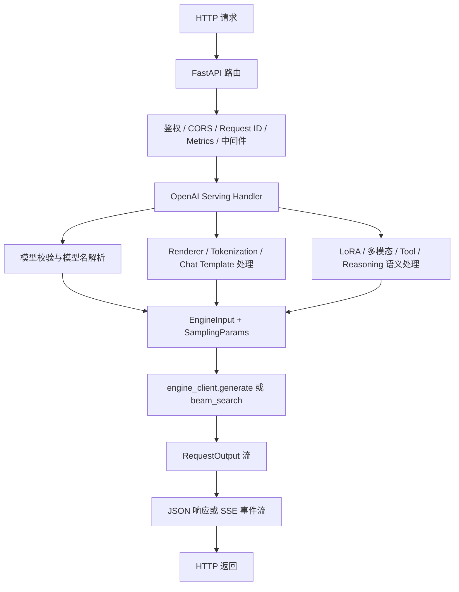

# OpenAI 兼容接口只是表面：vLLM 服务层真正做了哪些事

## 这篇要回答什么问题

很多人第一次使用 vLLM 在线服务时，看到的是这些熟悉的接口：

- `/v1/chat/completions`
- `/v1/completions`
- `/v1/models`
- 以及一系列看起来“和 OpenAI 一样”的请求字段

于是很容易产生一个直觉：

> vLLM 的 API Server 只是做了一个 OpenAI-compatible 壳，真正复杂的事情都在 Engine Core 和 GPU Worker 那边。

这个直觉只对了一半。

OpenAI 兼容，确实是 vLLM 服务层最显眼的一面；但如果你顺着 `vllm/entrypoints/openai/api_server.py` 和 `vllm/entrypoints/openai/engine/serving.py` 往下读，很快就会发现，API Server 远不止是在“收 HTTP 请求然后转发”。

它至少还在承担下面几类职责：

- 装配 FastAPI 应用、路由、异常处理和中间件
- 在启动时初始化模型注册表、renderer、tokenization 和各类 serving handler
- 把 OpenAI 风格请求翻译成内部 `EngineInput`、`SamplingParams` 和请求元数据
- 处理模型名解析、LoRA 适配器、多模态输入、chat template 和工具调用等服务语义
- 把内部生成结果重新拼装成 JSON 响应或 SSE 流式事件
- 接入鉴权、请求 ID、metrics、日志、负载感知和 tracing

所以这篇文章真正要回答的问题是：

> 当一个请求以 OpenAI 兼容接口进入 vLLM 时，服务层究竟做了哪些“运行时翻译工作”，它为什么绝不是一层薄薄的 HTTP 外壳？

如果这个问题没有想清楚，后面去读 `OpenAIServingChat`、`OpenAIServingCompletion`、`OpenAIServingResponses`，或者继续读 Engine Core，你很容易误判模块边界。

## 如果不了解这个模块，后面会在哪些地方读不下去

如果没有先建立服务层的整体认知，后面读源码时通常会在这些地方卡住：

- 看到 `build_app()` 里注册了大量 router、异常处理器和 middleware，会误以为“都是框架样板代码”。
- 看到 `init_app_state()` 不只保存 `engine_client`，还要初始化 `OpenAIServingModels`、`OpenAIServingRender`、`OpenAIServingTokenization`，会不清楚服务层为什么要懂这么多模型语义。
- 看到 `/v1/chat/completions` 的路由函数几乎只做了几行调用，会误以为真正逻辑都藏在 engine 里。
- 看到 `OpenAIServingChat._create_chat_completion()` 里要处理 chat template、LoRA、多模态 token 计数、sampling params、trace headers、data parallel rank，会觉得“这些为什么不下沉到更底层”。
- 看到流式输出代码里有大量 `yield "data: ...\n\n"`、usage 统计、错误转流式事件、`[DONE]` 拼装时，会误以为 SSE 只是一个简单包装。

这些困惑背后，其实都指向同一个事实：

**服务层的核心职责，不是转发请求，而是把“外部 API 语义”翻译成“内部运行时语义”，再把运行时结果翻译回客户端语义。**

## 先给一张全景图

先用一句话概括 vLLM 服务层在做什么：

> 它先把 FastAPI 应用和配套运维能力装起来，再把 OpenAI 风格请求预处理成引擎可调度的输入，最后把引擎输出重新拼成 OpenAI 风格的同步或流式响应。

如果把这个过程画成一张总图，大致是这样：

这张图里最重要的判断不是“有多少个步骤”，而是：

**服务层既要理解 Web 服务语义，也要理解推理请求语义。**

只理解 HTTP 不够，因为它必须构造内部请求；只理解模型执行也不够，因为它最终还要遵守 OpenAI 风格的返回协议。

## 第一层：FastAPI 应用不是空壳，而是一套服务运行时装配

很多人第一次看 `api_server.py`，会先盯着 `run_server()` 或 `build_and_serve()`。但真正值得先看的是 `build_app()`，因为它决定了“这到底是一个怎样的服务进程”。

### 1. `build_app()` 先决定应用长什么样

`build_app()` 并不是简单 `app = FastAPI()` 就结束了。它会先根据参数决定：

- 是否关闭 OpenAPI / docs / redoc
- 是否启用 offline docs
- 生命周期管理由哪个 `lifespan` 逻辑接管

然后它开始往应用里注册多组 router：

- 通用 `serve` 路由
- OpenAI models 路由
- SageMaker 相关路由
- generate / render / speech-to-text / pooling 等任务路由

这里已经能看出一件非常关键的事：

**OpenAI API server 在 vLLM 里并不是单一接口文件，而是一个按任务动态装配的服务容器。**

也就是说，这个服务层不是只服务 `/v1/chat/completions`。它还会根据 `supported_tasks` 和模型能力，决定哪些 API 能被挂进来。

### 2. 中间件接入也不是附属品

`build_app()` 接着会把一组运维和协议相关能力接进来：

- `CORSMiddleware`
- 全局异常处理器
- `AuthenticationMiddleware`
- `XRequestIdMiddleware`
- `ScalingMiddleware`
- 实时任务下的 WebSocket metrics middleware
- 用户自定义 middleware

这一步很容易被低估，但它恰恰说明服务层不是“拿到请求才开始工作”，而是在 **请求到来前就先定义了服务边界**：

- 哪些路径需要鉴权
- 哪些请求头要被保留下来
- 请求失败时错误如何统一格式化
- 服务是否处于扩缩容中的特殊状态
- metrics 应该以什么方式暴露

以 `AuthenticationMiddleware` 为例，它并不是把 token 明文直接比较，而是会先对 token 做哈希，再对 `/v1`、`/v2`、`/inference` 这些受保护路径做 Bearer Token 校验。`OPTIONS` 和不在受保护前缀下的路径会被跳过。

这说明服务层在进入“模型逻辑”之前，就已经先做了一轮 API 边界控制。

### 3. 监控与指标也是服务层职责的一部分

vLLM 的 metrics 不是某个后置插件顺手补上的。

一方面，通用 `serve` 路由会挂接健康检查和 metrics 能力；另一方面，`serve/instrumentator/metrics.py` 会把 Prometheus registry 暴露到 FastAPI 应用上，并处理 `/metrics` 的路由与响应类型。

同时，在具体的 OpenAI API router 里，还能看到另一类“离请求更近”的观测能力：

- `load_aware_call` 装饰器
- `metrics_header(...)`
- 请求级日志和 request metadata

所以服务层里的 metrics 实际上分成了两层：

- 一层是应用级指标暴露
- 一层是接口级负载感知与响应头信息

这也是为什么说 API Server 不只是协议壳。它还承担了可观测性入口。

## 第二层：真正的初始化，不是把 `engine_client` 塞进 `app.state`

看懂 `build_app()` 之后，下一步最值得看的就是 `init_app_state()`。

很多人会以为服务启动完成后，应用状态里最重要的就是一个 `engine_client`。但 `init_app_state()` 明确告诉你，事实远不止如此。

### 1. 它先初始化“模型视角”

`init_app_state()` 会先做几件事：

- 解析 `served_model_name`
- 创建 `base_model_paths`
- 构造 `OpenAIServingModels`
- 初始化静态 LoRA

这里的 `OpenAIServingModels` 很关键。它不仅仅是 `/v1/models` 的数据源，还持有：

- 基础模型列表
- 已加载 LoRA 适配器
- 动态 LoRA 解析能力
- 模型名到实际服务目标的映射关系

这意味着服务层并不是“拿着请求里的 `model` 字段原样往后传”。

它必须先判断：

- 这是基础模型名，还是 LoRA 名
- 这个 LoRA 是否已经静态加载
- 如果允许运行时 LoRA 更新，是否需要现场解析或加载

只有服务层先完成这一步，后面的请求才知道自己到底要落到哪个“可服务模型视角”上。

### 2. 它再初始化“渲染与输入处理视角”

接着，`init_app_state()` 会创建：

- `OpenAIServingRender`
- `OpenAIServingTokenization`

这两类对象的存在非常关键，因为它们说明服务层并不只是处理“模型输出怎么返回”，它还负责处理“用户输入如何变成内部 prompt / engine input”。

具体来说，服务层要在这里理解：

- chat template
- message content format
- tokenizer
- tool parser
- reasoning parser
- request-level chat template 是否可信
- 默认 chat template 参数如何和请求参数合并

很多人会把 renderer 理解成“纯显示层”，但在 vLLM 里并不是这样。`OpenAIServingRender` 实际承担的是 **把 OpenAI 风格输入渲染为模型可执行输入** 的工作。

也就是说，它离“前端展示”很远，离“运行时输入构造”很近。

### 3. 生成类 handler 是在状态初始化时装进去的

如果当前模型支持 `generate`，`init_app_state()` 还会继续调用 `init_generate_state()`，在 `app.state` 上挂好这些对象：

- `OpenAIServingResponses`
- `OpenAIServingChat`
- `OpenAIServingChatBatch`
- `OpenAIServingCompletion`

这一步很值得注意，因为它说明 API router 本身几乎只负责“拿 handler、调 handler、决定返回 JSON 还是 StreamingResponse”。

真正把 OpenAI 请求翻译成内部运行时调用的核心逻辑，并不写在 router 里，而是写在这些 serving handler 里。

## 第三层：路由函数看起来很薄，是因为服务层逻辑被分层了

以 `/v1/chat/completions` 为例，`chat_completion/api_router.py` 里的路由函数看起来非常薄：

1. 先做 JSON 请求校验
2. 再套上取消处理和负载感知装饰器
3. 从 `app.state` 里拿到 `OpenAIServingChat`
4. 调 `handler.create_chat_completion(...)`
5. 根据返回值决定是 `JSONResponse` 还是 `StreamingResponse`

如果只看这里，确实很像“薄转发层”。

但恰恰是这种写法，说明 vLLM 服务层做了一个很清晰的分层：

- router 负责 HTTP 入口与响应类型
- serving handler 负责请求语义与引擎调用
- engine client 负责进一步和内部运行时通信

所以不是服务层没有逻辑，而是 **服务层内部自己也做了分层**。

## 第四层：请求不是直接转发给引擎，而是先被翻译成内部运行时对象

真正值得细看的，是 `OpenAIServingChat._create_chat_completion()` 和 `OpenAIServingCompletion._create_completion()`。

### 1. 先做模型校验，而不是先调引擎

不管是 chat 还是 completion，handler 都会先做模型检查：

- 请求里的 `model` 是否是当前基础模型
- 是否命中了已加载 LoRA
- 如果允许运行时更新 LoRA，是否可以动态解析

如果这些校验不过，服务层会直接返回 OpenAI 风格错误响应，而不是让错误在更底层炸出来。

这一步说明：

**模型选择是服务层职责，不是引擎的 HTTP 兼容职责。**

引擎关心的是“你最终让我跑哪个模型视角”；服务层关心的是“用户写在请求里的模型名是否合法、能否映射”。

### 2. 再把 OpenAI 输入渲染成 `EngineInput`

对 chat 请求来说，handler 会把大量预处理工作交给 `OpenAIServingRender.render_chat(...)`：

- 校验 chat template 是否可信
- 合并默认和请求级 chat template kwargs
- 处理消息列表、工具信息和多模态内容
- 调 renderer 把 conversation 变成一个或多个 `EngineInput`

对 completion 请求，过程类似，只是会走 completion 对应的 render / preprocess 逻辑。

到这一步为止，服务层已经完成了一个非常重要的转换：

> 从 OpenAI 风格的 JSON 请求，变成 vLLM 内部能理解的 prompt / token / multimodal 输入对象。

如果没有这一步，Engine Core 根本没有办法直接理解 HTTP 请求体。

### 3. 服务层要自己决定 sampling 语义

请求一旦被渲染成 `EngineInput`，handler 还不会马上调用 `engine_client.generate()`。

它还要继续做这些事：

- 生成请求 ID
- 记录 `RequestResponseMetadata`
- 提取 `X-Request-Id`
- 提取可选的 `X-data-parallel-rank`
- 根据 prompt 长度、模型上限和默认采样配置计算 `max_tokens`
- 把 OpenAI 请求字段翻译成 `SamplingParams` 或 `BeamSearchParams`
- 处理 tracing headers

这一步非常关键，因为它说明服务层还在定义“用户参数的实际语义”。

例如：

- 用户说 `max_tokens`，服务层要把它和 `max_model_len`、prompt 长度、默认 generation config 合起来算真正可执行上限。
- 用户说 `stream=True`，服务层要决定后面走 SSE 还是单次 JSON。
- 用户说 `use_beam_search`，服务层要切换到 `beam_search(...)` 而不是普通生成。

也就是说，**服务层不是把参数原封不动传给引擎，而是在这里做了一次语义收敛。**

### 4. 真正调用引擎时，已经是内部请求了

当这些准备都完成后，handler 才会调用：

- `self.engine_client.generate(...)`
- 或 `self.beam_search(...)`

此时传下去的已经不是原始 HTTP 请求，而是这些内部对象：

- `EngineInput`
- `SamplingParams` / `BeamSearchParams`
- `request_id`
- `lora_request`
- `trace_headers`
- `priority`
- `data_parallel_rank`

所以从链路上看，服务层真正做的是：

**OpenAI Request -> 内部推理请求对象 -> Engine Client 调用**

这中间的翻译层，就是它最核心的价值。

## 第五层：流式输出不是“把结果一边收到一边吐出去”

如果说输入翻译容易被低估，那么流式返回更容易被误解。

很多人会想当然地把 streaming 理解成：

> engine 出一个 token，API server 就原样往客户端写一个 chunk。

真实情况远比这个复杂。

### 1. 服务层要把内部输出改写成 SSE 协议

在 chat 和 completion 的 serving 实现里，都能看到大量这样的逻辑：

- `yield f"data: {json}\n\n"`
- 在末尾补一个 `data: [DONE]\n\n`
- 在出错时把异常转成“流式错误事件”

这说明服务层处理的不是“任意流”，而是 OpenAI 兼容所要求的 SSE 协议语义。

它要关心：

- 每一段增量应该长什么样
- usage 何时输出
- 错误是在 HTTP 级返回，还是在已经开始 streaming 后改写成 SSE 错误事件
- 最后如何明确结束流

这些都不属于 Engine Core 的职责。

### 2. 流式和非流式不是简单开关，而是两套返回语义

在 non-streaming 模式下，handler 会先把所有 `RequestOutput` 收齐，再汇总成一个完整的 `ChatCompletionResponse` 或 `CompletionResponse`。

在 streaming 模式下，handler 则必须持续维护中间状态，例如：

- 已经输出了多少文本
- 哪些 token 已经回传
- 是否要补 usage
- 是否要在第一次事件里带上角色、prompt 相关信息

所以 `stream=True` 在服务层里不是一个布尔标记，而是：

**切换到另一套响应拼装协议。**

### 3. Responses API 还会更复杂

如果继续看 `OpenAIServingResponses` 相关代码，会发现服务层不仅要处理 chat/completion 这种老接口，还要处理更复杂的 Responses API 事件流。

这进一步说明：

OpenAI 兼容并不只是“路径兼容”。真正难的是 **协议语义兼容**，尤其是流式事件如何组织、排序和结束。

## 第六层：为什么服务层必须理解 LoRA、多模态和 renderer

这是这一篇最想澄清的一点。

很多人会说：LoRA、多模态这些能力不是应该属于模型侧或执行侧吗？为什么服务层也要参与？

答案是：因为这些能力会改变“请求长什么样”。

### 1. LoRA 会改变模型选择语义

在 vLLM 里，请求里的 `model` 字段不一定指向基础模型。

它还可能指向：

- 已加载的 LoRA 适配器名
- 运行时可解析的 LoRA 名
- 默认多模态 LoRA

这意味着服务层必须先知道：

- 当前有哪些 base model
- 当前有哪些 LoRA
- 某个名字该映射到哪个 adapter

否则它连“这个请求究竟请求的是谁”都判断不了。

### 2. 多模态会改变输入预处理语义

多模态输入不是只多了几个字段那么简单。

一旦请求里带有图片、音频或其他内容类型，服务层就必须参与：

- 识别消息里的 content type
- 调 renderer / input processor 把这些输入变成模型可消费的结构
- 在必要时选择默认 modality-specific LoRA
- 统计 multimodal token 相关信息

也就是说，多模态并不是进入 Engine Core 之后才突然出现的。它在服务层就已经开始改变请求形态了。

### 3. renderer 决定了“OpenAI 风格输入怎么落到模型”

从 `OpenAIServingRender` 的职责就能看出来，renderer 不是一个无关紧要的附属对象。

它负责把：

- chat messages
- tools
- completion prompt
- chat template
- tokenizer
- multimodal content

统一渲染成内部输入。

这恰好解释了为什么路线图里会特别强调：

**服务层仍然需要理解 LoRA、多模态和 renderer。**

因为这些东西不是执行层的“内部优化选项”，而是会直接改写 API 请求语义。

## 第七层：服务层还承担了很多运行时“边缘但关键”的工作

除了主链路上的输入翻译和输出拼装，API Server 还承担了一批很容易被忽略、但对线上服务非常关键的工作。

### 1. 请求级元数据与追踪

在 serving handler 里，服务层会：

- 生成或继承请求 ID
- 把 request metadata 塞到 `raw_request.state`
- 提取 tracing headers

这让后面的日志、调试和跨层追踪变得可能。

### 2. 负载与路由相关信息

服务层不仅知道“这个请求是什么”，还知道“它该往哪边走”。

比如：

- 可以从 header 提取 `data_parallel_rank`
- 接口层通过 `load_aware_call` 和 metrics header 暴露负载信息

这说明 API Server 对后端拓扑并不是完全无感。

### 3. 取消、错误与清理

路由函数用了 `with_cancellation`，serving 基类里还包了一层 `_with_kv_transfer_rejection_cleanup(...)`。

这类逻辑表达的是：

- 客户端断开连接后如何取消请求
- 如果请求在真正进入 engine 前就失败，是否需要通知 KV connector 做清理
- 如果生成过程中出现异常，错误应如何被包装成兼容协议

这些事情如果没有服务层承接，系统很容易在协议层和运行时之间出现语义断层。

## 再按一次请求生命周期串起来

到这里，可以把“OpenAI 兼容服务层真正做了什么”重新走一遍。

### 第 1 步：启动时先装出一个完整的服务容器

`build_app()` 创建 FastAPI 应用，注册路由、异常处理器、中间件和 metrics 相关能力。

### 第 2 步：初始化服务层状态

`init_app_state()` 把这些运行时对象装进 `app.state`：

- `engine_client`
- `OpenAIServingModels`
- `OpenAIServingRender`
- `OpenAIServingTokenization`
- 各种面向具体 API 的 serving handler

### 第 3 步：请求进入 router

像 `/v1/chat/completions` 这样的 router 先做请求校验、取消控制和负载感知，然后把调用委托给 `OpenAIServingChat`。

### 第 4 步：serving handler 做语义翻译

handler 会完成：

- 模型与 LoRA 校验
- chat/completion 输入渲染
- chat template 和多模态处理
- sampling params 计算
- request metadata、trace headers、priority、DP rank 收敛

### 第 5 步：通过 `engine_client` 调用内部运行时

当 handler 调用 `engine_client.generate(...)` 时，请求已经被翻译成内部运行时对象，可以被后端调度和执行。

### 第 6 步：把结果重新拼回 OpenAI 兼容协议

服务层再把内部 `RequestOutput` 改写成：

- 标准 JSON 响应
- 或 SSE 流式事件

并补齐 usage、错误事件和 `[DONE]` 结束标记。

这条链路里，服务层真正承担的就是两个方向的翻译：

- 向内，把 API 请求翻译成引擎请求
- 向外，把引擎输出翻译成 API 协议

## 一张总表：服务层分别在解决什么问题

| 服务层工作 | 表面看起来像什么 | 实际在解决什么问题 |
| - | - | - |
| FastAPI 装配 | “起一个 Web 服务” | 把路由、异常、中间件、metrics、鉴权统一成服务边界 |
| `app.state` 初始化 | “塞几个对象进去” | 建立模型注册、renderer、tokenization 和各类 handler 的共享运行时 |
| 模型名解析 | “检查请求是否合法” | 把 base model、LoRA、运行时 adapter 映射成真实服务目标 |
| 输入 render / preprocess | “处理一下 prompt” | 把 OpenAI 风格输入翻译成 `EngineInput` |
| 参数收敛 | “组装 sampling params” | 把用户参数变成引擎可执行的运行时语义 |
| 流式返回 | “把结果流出来” | 把内部输出拼成 OpenAI SSE 协议 |
| 鉴权 / 日志 / tracing / metrics | “运维配套” | 让服务真正可上线、可观测、可治理 |

这张表最值得记住的一点是：

**服务层做的不是“杂事”，而是“协议语义和运行时语义之间的胶合工作”。**

## 这篇文章之后，最值得继续读什么

如果你已经接受了“服务层不是薄壳”这个判断，下一步最值得继续读的顺序是：

1. `vllm/entrypoints/openai/api_server.py`
2. `vllm/entrypoints/openai/models/serving.py`
3. `vllm/entrypoints/serve/render/serving.py`
4. `vllm/entrypoints/openai/chat_completion/serving.py`
5. `vllm/entrypoints/openai/completion/serving.py`
6. `vllm/v1/engine/core.py`

按这个顺序读的好处是：

- 先看应用如何装起来
- 再看模型与 LoRA 视角如何建立
- 再看输入是如何被渲染
- 然后看 chat/completion 如何真正调用 engine
- 最后再回到 Engine Core，看服务层翻译出来的请求如何被调度

这样你看到的就不再是“一个 HTTP 层 + 一个引擎层”，而是一条连续的请求语义转换链路。

## 一句话总结

不要把 vLLM 的 OpenAI-compatible API Server 看成一个简单的 HTTP 转发器。

更准确地说，它是在回答这样一个问题：

> 当外部世界用 OpenAI 风格协议描述请求时，系统要怎样把这些请求稳定地翻译成内部可调度、可执行、可流式返回的运行时对象？

vLLM 服务层给出的答案是：

- 用 FastAPI 和中间件装出服务边界
- 用模型注册、renderer 和 tokenization 理解请求
- 用 serving handler 收敛模型、LoRA、多模态和 sampling 语义
- 再用 JSON / SSE 拼装把结果翻译回客户端协议

所以 OpenAI 兼容只是它最表面的那层皮。

真正重要的是：

**vLLM 服务层在做一整套“协议语义 <-> 运行时语义”的双向翻译。**
