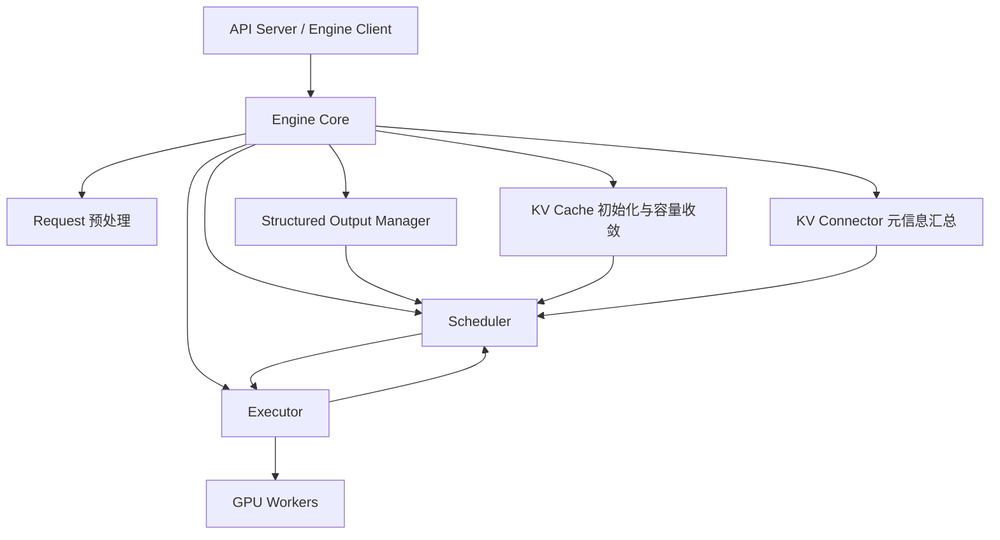
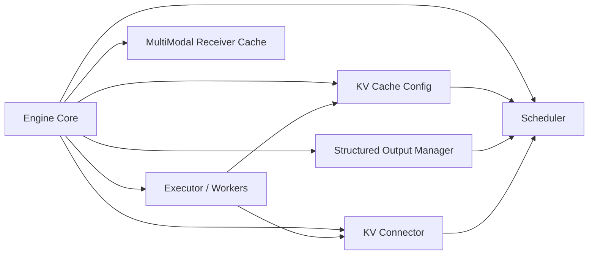

# Engine Core：vLLM V1 真正的控制中枢

## 这篇要回答什么问题

如果你已经读过前几篇文章，脑子里大概已经有了这样一张图：

- `vllm serve` 把整套系统拉起来
- API Server 接住 OpenAI-compatible 请求
- GPU Worker 真正执行模型

但这时通常会冒出一个更关键的问题：

> 服务层把请求翻译好了，Worker 也把模型跑起来了，那么中间到底是谁在决定“现在该调度谁、该分多少 KV Cache、该怎么把结果回写成下一轮状态”？

这个问题的答案，就是 `vllm/v1/engine/core.py` 里的 `EngineCore`。

很多人第一次看 vLLM V1，会本能地先去读 API Server，或者直接冲进 `gpu_model_runner.py`。这当然没错，但如果只能优先读一个 V1 核心文件，我反而更建议先读 `core.py`，原因很简单：

- 它离外部请求足够近，能看见服务层到底把什么交给运行时
- 它离底层执行也足够近，能看见 Worker 和 executor 到底提供了哪些能力
- 它不是单一算法模块，而是把调度、KV Cache、结构化输出、多模态、KV transfer、批处理队列这些能力收拢到一个中心点

所以这篇文章真正要解释的是：

> 为什么 `EngineCore` 是 V1 里最值得优先读的模块？它到底控制了哪些关键资源，又为什么初始化顺序必须写成现在这样？

路线图里提到的四个问题，我们都会回答：

1. 为什么先建 executor，再初始化 KV Cache，再构建 scheduler
2. 为什么 `StructuredOutputManager` 要在这里初始化
3. 为什么非因果 attention 会影响 chunked prefill 和 prefix caching
4. 为什么 KV connector 的握手信息要在这一层汇总

## 如果不了解这个模块，后面会在哪些地方读不下去

如果没有先把 `EngineCore` 的职责边界看清楚，后面读源码时通常会卡在这些地方：

- 看到 scheduler 很复杂，却说不清它的输入到底是谁准备好的。
- 看到 `KVCacheManager`、`BlockPool`、prefix caching 很重要，却不知道为什么它们不是 executor 或 worker 自己完全处理。
- 看到 `StructuredOutputManager` 出现在 engine 层，会疑惑“这不应该是 API 层或 sampler 层的事情吗”。
- 看到 `core.py` 里一边在和 worker 握手，一边在做请求预处理，一边又在驱动 `step()`，会觉得这个文件“什么都做一点”，很难抓主线。
- 看到 `EngineCoreProc` 里有 ZMQ、握手、输入输出线程，又不知道这些包装和 `EngineCore` 本体是什么关系。

这些困惑背后其实指向同一个事实：

**Engine Core 不是单纯的调度器，也不是单纯的执行代理。它是 V1 运行时里连接“请求语义、缓存语义、执行语义”的控制面。**

## 先给一张全景图

先用一句话概括 `EngineCore` 在系统中的位置：

> 它向上接收已经被服务层翻译好的内部请求，向下驱动 executor 和 worker，横向持有 scheduler、KV cache、structured output、KV connector 等运行时能力，并在每一步迭代里把“调度决策”和“执行结果”闭环起来。

如果画成一张总图，大致是这样：



这张图里最重要的不是模块数量，而是中间这个位置：

- API Server 不直接调度请求
- Worker 不自己决定系统级资源分配
- Scheduler 也不是凭空存在，它依赖 Engine Core 先把配置和上下文准备好

也就是说，**Engine Core 是 V1 控制面真正落地的地方。**

## 第一层：为什么说 `core.py` 是 V1 最值得优先读的入口

如果只看 `EngineCore.__init__()`，你会发现这个类的初始化并不长，但信息密度非常高。

它按顺序做了这些事：

1. 加载通用插件
2. 创建 executor
3. 初始化 KV Cache，并根据 profiling 结果回写配置
4. 初始化 `StructuredOutputManager`
5. 构造 scheduler
6. 处理 KV connector 握手信息
7. 初始化多模态接收缓存、批队列、prefix hash 等辅助能力

这正好对应 V1 里最核心的几个问题：

- 模型执行能力从哪来
- KV Cache 到底有多少、块大小是多少
- 调度器能不能安全地启用 chunked prefill / prefix caching
- 结构化输出在哪一层变成运行时约束
- 远端 KV 传输这类跨进程能力怎么和本地调度器对齐

换句话说，`core.py` 的价值不是“它有一个事件循环”，而是：

**V1 里很多看起来分散的能力，第一次被真正拼在一起，就是在 Engine Core。**

## 第二层：为什么初始化顺序必须是 executor -> KV Cache -> scheduler

这是整篇文章最重要的一部分。

如果你把 `EngineCore.__init__()` 的主干抽出来，会非常接近下面这个顺序：

```python
self.model_executor = executor_class(vllm_config)
kv_cache_config = self._initialize_kv_caches(vllm_config)
self.structured_output_manager = StructuredOutputManager(vllm_config)
self.scheduler = Scheduler(
    vllm_config=vllm_config,
    kv_cache_config=kv_cache_config,
    structured_output_manager=self.structured_output_manager,
    ...
)
```

很多设计判断，其实都藏在这个顺序里。

### 1. 为什么必须先建 executor

因为后面的很多初始化动作，本质上都依赖 executor 去“向 worker 要真实世界的信息”。

最直接的几个例子是：

- `get_kv_cache_specs()`：KV cache 应该长什么样，不是 Engine Core 自己拍脑袋决定的，而是由执行侧根据模型层结构给出。
- `determine_available_memory()`：可用于 KV cache 的显存，也不是配置文件里写死的，而是要在模型执行环境里做 profiling 后得到。
- `initialize_from_config(kv_cache_configs)`：真正把 KV cache 配好并做 warmup，仍然是 executor / worker 侧动作。
- `get_kv_connector_handshake_metadata()`：KV transfer 相关的 worker 元信息，也要从 executor 往上取。

这意味着 executor 在这里不是“最后执行模型时才用到”的被动对象，而是：

**Engine Core 连接执行层能力的第一个抓手。**

如果没有先把 executor 建出来，后面 Engine Core 根本无法回答这些问题：

- 这个模型到底需不需要 KV cache
- 各类 attention 层的 KV spec 是什么
- 当前部署下还能拿出多少显存给 KV cache
- worker 侧是否已经具备某些 connector / transfer 能力

所以初始化先建 executor，本质上是在先把“执行层观察窗口”打开。

### 2. 为什么 KV Cache 初始化必须早于 scheduler

因为 V1 的 scheduler 不是一个抽象排队器，它是一个强依赖缓存形态和容量上限的调度器。

在 `_initialize_kv_caches()` 里，Engine Core 会完成几件关键事情：

1. 注册 KV cache spec
2. 从 executor 收集各 worker 的 `kv_cache_specs`
3. profiling 可用显存
4. 调 `get_kv_cache_configs(...)` 真正生成 KV cache 配置
5. 如果 auto-fit 改写了 `max_model_len`，用 `collective_rpc("update_max_model_len")` 同步给 workers
6. 生成给 scheduler 使用的 `scheduler_kv_cache_config`
7. 更新 `cache_config.num_gpu_blocks`、`block_size`、`kv_cache_size_tokens`、`kv_cache_max_concurrency`
8. 调 `model_executor.initialize_from_config(...)` 完成 cache 初始化和模型 warmup

这一步做完之后，调度器才终于知道：

- 一共有多少 block 可分配
- scheduler 视角的 block size 和 hashing block size 是多少
- 这个模型最多能容纳多少并发 token
- prefix caching 是否真的可用
- 最大上下文长度是否在 profiling 后被自动缩小

所以 scheduler 放在 KV cache 之后，不是代码排列习惯，而是运行时依赖关系决定的。

更直白地说：

**没有 KV cache 的真实形态，scheduler 连自己的资源边界都不知道。**

### 3. 为什么 scheduler 不能在 profiling 前就创建

因为 profiling 不只是“测个时间”，它会直接改变调度条件。

最典型的一段逻辑是：

- 先记录 `max_model_len_before`
- 调 `get_kv_cache_configs(...)`
- 再读 `max_model_len_after`
- 如果两者不同，就调用 `collective_rpc("update_max_model_len", ...)`

这意味着 KV cache auto-fit 可能会把允许的最大上下文长度改小。

如果 scheduler 在这之前就已经按旧的 `max_model_len` 建好了，它后面所有预算判断都可能失真：

- 允许接收的 prompt 长度会失真
- block 分配上限会失真
- prefix caching 的命中边界会失真

因此这里的顺序，本质上是在保证：

**先把“系统真实能承受的缓存边界”确定下来，再创建负责分配这些资源的调度器。**

## 第三层：为什么 `StructuredOutputManager` 要在 Engine Core 初始化

这是很多人第一次看 `core.py` 时最容易疑惑的一点。

直觉上，structured output 很像“输出格式控制”，似乎应该放在 API 层，或者最多放在 sampler 附近。但 V1 的实现恰恰反过来：`StructuredOutputManager` 明确在 Engine Core 里初始化，并且同时被请求预处理和 scheduler 使用。

这背后有两个关键原因。

### 1. 结构化输出不是后处理，而是调度前就要生效的约束

在 `Request` 创建时，`StructuredOutputRequest.from_sampling_params(...)` 就已经把结构化输出信息挂到请求对象上了。

而在 Engine Core 里，请求真正进入系统时会经过：

```python
req = Request.from_engine_core_request(request, self.request_block_hasher)
if req.use_structured_output:
    self.structured_output_manager.grammar_init(req)
```

也就是说，结构化输出不是等 token 全部生成完再“修一下 JSON 格式”，而是在请求准入后、正式调度前就开始准备 grammar。

更进一步看 scheduler，你会发现它在两个关键位置直接依赖这个 manager：

- `get_grammar_bitmask(...)`：给本轮调度中需要约束的请求生成 grammar bitmask
- `update_from_output(...)`：在 token 返回后决定是否推进 grammar 状态

这说明 structured output 已经进入了调度和采样主链路，而不是尾部修饰。

### 2. Engine Core 是唯一同时看得见“请求预处理”和“调度推进”的地方

`StructuredOutputManager` 之所以不放在 API 层，还有一个更工程化的原因：

- grammar 的初始化发生在请求被转换成 `Request` 之后
- grammar bitmask 的消费发生在 scheduler 构造 `SchedulerOutput` 时
- grammar 的状态推进发生在 `update_from_output(...)` 收到本轮 token 之后

这三件事分别落在：

- 请求进入 Engine Core 的预处理路径
- scheduler 的调度路径
- Engine Core 的执行结果回收路径

如果 manager 放在 API 层，它看不到 scheduler 的 step 级状态。
如果 manager 放在 worker 层，它又看不到请求对象和系统级调度状态。

只有 Engine Core 同时具备这两种视角：

- 它能拿到请求对象
- 它能驱动 scheduler
- 它能在每轮执行后更新请求状态

所以更准确的说法是：

**StructuredOutputManager 初始化在 Engine Core，不是因为它属于“输出层”，而是因为它属于“请求状态机控制层”。**

### 3. 为什么它不在 scheduler 里自己初始化

这也是一个很容易问的问题。

答案是：scheduler 需要它，但不应该拥有它。

因为 manager 还要参与请求进入系统时的 `grammar_init(req)`，这一步发生在 `preprocess_add_request(...)` 中，而这个方法属于 Engine Core，不属于 scheduler。

所以这里的依赖关系是：

- Engine Core 持有 manager
- 请求预处理用它初始化 grammar
- scheduler 在 step 过程中消费它

这是一种非常典型的控制面组织方式：

**把跨多个阶段共享的运行时对象放在 Engine Core，由它协调，而不是塞进某一个局部模块里。**

## 第四层：为什么非因果 attention 会直接影响 chunked prefill 和 prefix caching

这是路线图里另一个非常值得专门展开的点。

在 `_initialize_kv_caches()` 里，`core.py` 有一段很关键的注释：

> 某些层会把自己的 KV cache spec 标记为 `non_causal=True`，Engine Core 收集完所有 worker 的 spec 之后，要把这个 layer-level signal 翻译成 scheduler policy，因为 chunked prefill 和 prefix caching 都默认 attention 是 causal 的。

这段逻辑如果展开来看，大致是在做这件事：

```python
if any(spec.non_causal for ...):
    if enable_chunked_prefill:
        disable_chunked_prefill()
    if enable_prefix_caching:
        disable_prefix_caching()
```

### 1. 为什么不是 worker 自己决定禁用这些特性

因为 worker 只看得见局部执行细节，看不见系统级调度策略。

是否启用 chunked prefill 和 prefix caching，最终影响的是：

- scheduler 如何切 prompt
- cache manager 如何复用历史 block
- 请求在 waiting/running 队列中怎样推进

这些都属于 Engine Core 和 scheduler 的职责，不属于某个单独 worker。

同时，`non_causal` 这个信号来自 layer spec，本身是执行层事实；但把它翻译成“禁用某个调度策略”，则是控制层决定。

所以这里体现的是一个很经典的 V1 分层：

- worker 报告模型层事实
- Engine Core 把事实提升为系统策略

### 2. 为什么非因果 attention 会破坏 chunked prefill

chunked prefill 的前提是：提示词的前半段算完后，后半段可以继续沿着同一条因果依赖链安全推进。

这隐含了一个假设：

**后面的 token 只依赖前面的 token。**

可一旦某层 attention 是非因果的，比如 Prefix LM 风格，某些位置可能会双向或更宽松地读取上下文，那么“把 prefill 切成多个 chunk 再逐段推进”这件事就不再天然安全。

因为前一块和后一块的边界，不再只是简单的时间顺序边界。

这时如果还沿用 chunked prefill，Engine Core 以为自己只是把 prompt 拆成几段调度，实际可能已经改变了该层看到的依赖关系。

### 3. 为什么非因果 attention 也会破坏 prefix caching

prefix caching 的前提同样依赖因果语义：

- 相同前缀对应的历史 KV 可以安全复用
- 只要 prefix 相同，后面的生成就能把这些 block 当成稳定上下文

但如果存在非因果 attention，某段 KV 是否还能安全复用，就不再只由“前缀文本是否一致”决定。

换句话说，prefix cache 命中的“相同前缀”语义，是建立在 causal attention 下的。

一旦这个假设被打破，继续复用旧 block 可能不是优化，而是错误。

所以 `core.py` 里这段逻辑的真正价值是：

**把执行层暴露出来的 non-causal 属性，及时上升为整个调度系统的安全开关。**

### 4. 为什么这件事刚好发生在 Engine Core

因为只有这里同时满足三个条件：

- 还没构建 scheduler，可以安全改策略
- 已经从所有 workers 收到了 KV cache specs
- 能把一个 layer-level 信号翻译成全局运行时策略

这也是为什么源码注释会特别强调：

**这是 multiproc-safe place。**

它不是随便选了个位置，而是这个位置刚好处于“执行信息已经汇总，但调度器尚未落地”的最佳时点。

## 第五层：为什么 KV connector 的握手信息要在这一层汇总

如果你只把 `EngineCore` 理解成“排队和调度请求”，很容易忽略它还承担了一部分跨进程、跨设备能力编排。

KV connector 就是最典型的例子。

在 `Scheduler.__init__()` 里，scheduler 侧会先根据 `kv_transfer_config` 创建自己的 connector：

- role 是 `SCHEDULER`
- 后面还会把 `kv_cache_manager.block_pool` 绑定进去

但这还不够。

因为 worker 侧也有各自的 connector，它们分别知道本 rank、本 stage 的 transfer 上下文。于是 `EngineCore.__init__()` 里又做了一步：

1. 先从 scheduler 拿 `kv_connector`
2. 再通过 `model_executor.get_kv_connector_handshake_metadata()` 从 workers 收集握手信息
3. 把各个 worker 返回的字典合并
4. 最后 `kv_connector.set_xfer_handshake_metadata_pp_aware(content)`

### 1. 为什么 scheduler connector 不能自己直接拿这些信息

因为 scheduler connector 在控制面，而 handshake metadata 分散在 worker 那一侧。

单个 worker 只能知道自己的局部信息，例如：

- 自己属于哪个 `pp_rank`
- 自己属于哪个 `tp_rank`
- 自己这边有哪些 transfer 元数据

但 scheduler connector 最后需要的是一个完整视图，尤其在 PP/TP 存在时，需要知道整张拓扑上的上下文。

于是这里就出现了一个非常典型的“汇总层需求”：

- worker 有局部事实
- scheduler 有全局使用需求
- Engine Core 刚好站在两者中间

### 2. 为什么这一步要在 KV cache 注册之后做

源码注释写得很清楚：这件事发生在 KV cache registration 之后。

这背后的原因也很合理：

- connector 的 transfer 能力最终和 KV cache 形态强相关
- block pool、cache group、block size 这些信息不稳定前，很多握手元数据都还没有最终意义

所以顺序上必须是：

1. 先把 KV cache 配出来
2. scheduler connector 和 block pool 建立关系
3. 再把 worker 侧握手信息汇总给 scheduler connector

这说明 KV connector 在 V1 里不是一个“额外的网络插件”，它是跟本地缓存系统绑定在一起的。

### 3. 为什么说 Engine Core 是“外部能力依赖图”的汇合点

如果把这一段抽象一下，你会发现 Engine Core 正在同时整合几类外部能力：

- executor / worker 提供执行能力
- KV cache spec 提供缓存形态
- KV connector 提供远端 KV 传输能力
- structured output backend 提供 grammar 约束能力
- multimodal registry 提供多模态接收缓存能力

这也是路线图里为什么建议产出一张“Engine Core 对外部能力的依赖关系图”。

可以先用文字版记成这样：



这张图真正想强调的是：

**Engine Core 并不是只拥有 scheduler，它是在把多种运行时能力整理成 scheduler 可消费的系统上下文。**

## 第六层：初始化完成后，Engine Core 如何真的“控制”系统

如果前面讲的是为什么它能成为控制中枢，这一节回答的是：初始化结束后，它是怎么把这个角色真正跑起来的。

`EngineCore` 最核心的运行主线其实很短：

1. 接收请求
2. 把请求放进 scheduler
3. 调度一个 step
4. 交给 executor 执行
5. 收回结果，更新 scheduler
6. 继续下一轮

如果抽成伪代码，会非常接近这样：

```python
scheduler_output = self.scheduler.schedule()
future = self.model_executor.execute_model(scheduler_output, non_block=True)
grammar_output = self.scheduler.get_grammar_bitmask(scheduler_output)
model_output = future.result() or self.model_executor.sample_tokens(grammar_output)
engine_core_outputs = self.scheduler.update_from_output(
    scheduler_output, model_output
)
```

这条链路有两个特别值得注意的点。

### 1. 它不是“调度完就结束”，而是完整闭环

Engine Core 并不只是生成 `SchedulerOutput`，然后把锅甩给 worker。

它还必须在结果回来后继续做这些事：

- 处理 abort 队列
- 用 `scheduler.update_from_output(...)` 推进请求状态
- 在需要时更新 draft token
- 产出最终要发回 client/coordinator 的 `EngineCoreOutputs`

这说明 Engine Core 不是单向派发器，而是一个持续收敛系统状态的控制循环。

### 2. 它同时持有“请求状态机”和“资源状态机”

在这条闭环里，至少有两套状态在同步推进：

- 请求状态机：`WAITING`、`RUNNING`、`PREEMPTED`、`FINISHED_*`
- 资源状态机：KV block 分配、prefix cache 命中、connector transfer、encoder cache、多模态缓存

而 Engine Core 正是这两套状态机的交点。

这也是为什么很多逻辑最终会落在 `update_from_output(...)`：

- 新 token 追加到 request
- grammar 是否接受这些 token
- encoder inputs 是否释放
- KV connector 输出是否带来了无效 block，需要回滚并重算

这些动作既不是纯请求逻辑，也不是纯显存逻辑，而是“请求如何消耗和释放资源”的联动逻辑。

## 第七层：从一次请求生命周期再看一遍 Engine Core

到这里，可以重新把一条请求从服务层进入后，在 Engine Core 中发生的事情再走一遍。

### 第 1 步：请求进入 Engine Core

API Server 经过前面几篇文章讲过的翻译后，把请求交给 Engine Core。

在 `preprocess_add_request(...)` 中，Engine Core 会先做几件事：

- 如有多模态特征，先经 `mm_receiver_cache` 更新
- 把 `EngineCoreRequest` 转成内部 `Request`
- 如果启用了 prefix caching 或 KV connector，提前计算 block hash
- 如果请求启用了 structured output，就在这里做 `grammar_init(req)`

这一步说明 Engine Core 接的不是原始 HTTP 请求，而是已经进入内部状态机的请求对象。

### 第 2 步：请求进入 scheduler

`add_request(...)` 会做基本校验，然后把请求交给 scheduler。

这里已经能看到控制面判断开始发挥作用：

- pooling 任务是否合法
- 请求是否附带 `kv_transfer_params`
- 是否需要立刻 abort 以触发 connector 清理钩子

### 第 3 步：scheduler 生成本轮调度结果

一旦 `step()` 开始，Engine Core 就会调用：

```python
scheduler_output = self.scheduler.schedule()
```

这一步里，scheduler 使用的关键上下文都来自前面的初始化：

- `kv_cache_config`
- `block_size` / `hash_block_size`
- `StructuredOutputManager`
- KV connector
- prefix caching 开关
- speculative decoding 配置

也就是说，初始化阶段准备好的内容，到这里才第一次真正“投入战斗”。

### 第 4 步：executor 驱动 worker 执行

接着 Engine Core 调：

```python
future = self.model_executor.execute_model(scheduler_output, non_block=True)
```

如果需要 grammar 约束，再由 scheduler 生成 grammar bitmask，必要时进入 `sample_tokens(...)`。

这说明 Engine Core 并不亲自执行模型，但它决定了：

- 本轮给 worker 什么 batch
- 何时采样
- 采样前是否要加 grammar bitmask

### 第 5 步：执行结果回到 Engine Core，系统状态闭环

结果返回后，`scheduler.update_from_output(...)` 会更新请求、缓存和相关统计。

此时会发生很多关键动作：

- 新 token 写回 request
- grammar 状态推进
- stop condition 检查
- connector 输出处理
- 失效 block 检测与必要时重算
- 最终拼出 `EngineCoreOutputs`

所以从一次请求的角度看，Engine Core 做的不是“中转”，而是：

**把请求接进来，把本轮系统状态推进一格，再把结果吐出去。**

## 第八层：为什么说它比 API Server 和 Worker 更像“控制中枢”

看到这里，其实已经可以回答标题里的那句话了。

API Server 当然重要，但它更像协议边界层。
Worker 当然重要，但它更像执行层。

只有 Engine Core 同时在做这三类事情：

- 控制请求何时进、何时出
- 控制缓存如何建、如何分、如何复用
- 控制执行层何时跑、跑什么、跑完后如何更新系统状态

更具体一点说，Engine Core 有三个特别鲜明的“中枢特征”。

### 1. 它不是最重的模块，但它决定系统如何组织自己

真正最重的算力开销不在这里，最复杂的模型细节也不全在这里。

但 Engine Core 决定了：

- executor 何时被调用
- scheduler 按什么资源约束工作
- KV cache 如何被初始化成可调度资源
- structured output 如何进入采样链路
- connector 元信息如何汇总成系统视图

所以它不一定是“最重”的地方，却是“最像操作系统内核”的地方。

### 2. 它是少数能同时看见全局与局部的模块

API Server 看得见外部协议，但看不见显存和 block。
Worker 看得见张量和 kernel，但看不见全局请求队列。

Engine Core 同时看得见：

- 单个请求对象
- 一整轮调度结果
- 全局 KV cache 资源
- worker 回传的执行事实

这也是它能把很多局部信号上升成系统级策略的根本原因。

### 3. 它把“配置”变成“真实运行时”

很多配置在 `VllmConfig` 阶段还只是声明：

- 开不开 prefix caching
- 开不开 chunked prefill
- 是否启用 structured outputs
- 是否启用 KV transfer

到了 Engine Core，这些配置才真正经历：

- 与 worker 能力对齐
- 与 profiling 结果对齐
- 与 cache 形态对齐
- 与 scheduler 运行时对齐

换句话说，**Engine Core 是配置第一次变成真实系统行为的地方。**

## 这篇文章之后，最值得继续读什么

如果你已经接受了“Engine Core 是 V1 控制中枢”这个判断，下一步最值得继续读的顺序是：

1. `vllm/v1/core/sched/scheduler.py`
2. `vllm/v1/core/kv_cache_manager.py`
3. `vllm/v1/core/block_pool.py`
4. `vllm/v1/executor/multiproc_executor.py`
5. `vllm/v1/request.py`

按这个顺序读的好处是很明显的：

- 先看它如何调度
- 再看它调度的资源到底是什么
- 再看这些资源底层如何管理
- 然后看执行层怎样承接调度结果
- 最后回头看请求对象为什么要设计成现在这样

如果想继续沿博客主线往后走，那么下一篇最自然就是调度器本身，也就是：

**continuous batching 在 vLLM 里到底是什么。**

因为只有先理解了 Engine Core，你才会知道 scheduler 不是一个孤立算法模块，而是整个控制面的核心决策器。

## 一句话总结

不要把 `vllm/v1/engine/core.py` 看成“启动后顺手建一下 scheduler”的胶水文件。

更准确地说，它在回答的是这样一个问题：

> 当一个请求已经进入 vLLM 内部语义之后，系统要由谁来同时协调执行层能力、KV cache 资源、结构化输出约束、远端 KV transfer 能力，并把这些东西收敛成一轮轮可执行的调度决策？

V1 给出的答案就是 `EngineCore`：

- 先通过 executor 连接执行层
- 再通过 KV cache 初始化确定真实资源边界
- 再把 structured output、connector、多模态等能力装进控制面
- 最后由 scheduler 和 step 循环把整套运行时持续推进

所以如果你要在 V1 里找一个最像“控制中枢”的模块，不是在 API Server，也不在 GPU Worker。

就在这里：

**`EngineCore` 是 vLLM V1 把请求、缓存、调度和执行真正拧成一个系统的地方。**
