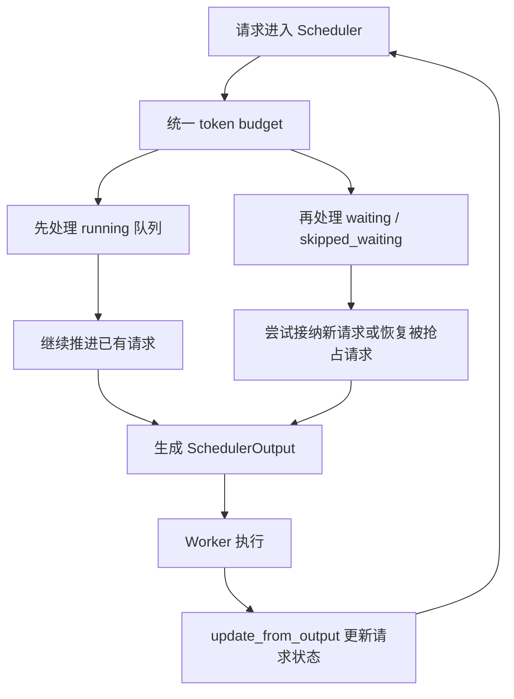
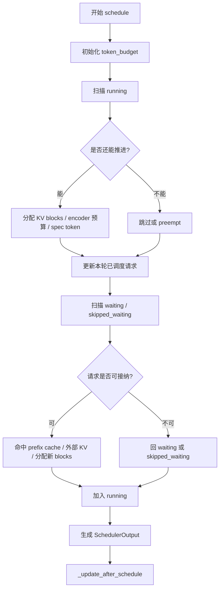

# continuous batching 在 vLLM 里到底是什么：统一调度模型详解

## 这篇要回答什么问题

如果你已经读过上一篇关于 `EngineCore` 的文章，就会知道 V1 的控制中枢最终会把请求交给 `Scheduler`。

但这时大多数人还会停留在一个比较模糊的理解上：

> continuous batching，不就是“有新请求时不断往 batch 里塞请求”吗？

这个说法不能算错，但远远不够。

因为一旦你真的打开 `vllm/v1/core/sched/scheduler.py`，很快就会发现，V1 的 scheduler 根本不是在分别维护“prefill 阶段”和“decode 阶段”两套调度逻辑。它在做的是另一件更统一的事：

**给每个请求分配“这一步还能推进多少 token”，然后让所有请求都朝着自己的目标状态往前追。**

这正是 V1 里 continuous batching 最值得理解的地方。

所以这篇文章真正要回答的问题是：

> continuous batching 在 vLLM V1 里，究竟是怎样从一个口号变成代码里的统一调度模型的？为什么它不再把 prompt token 和 output token 当成两类完全不同的东西？

路线图里点名要回答的四个问题，这篇都会覆盖：

1. V1 为什么把 prompt token 和 output token 放到统一预算里
2. `waiting`、`skipped_waiting`、`running` 三类请求队列分别是什么
3. FCFS 和 priority 调度如何切换
4. speculative decoding、encoder budget、多模态预算是怎样接入同一个调度器的

## 如果不了解这个模块，后面会在哪些地方读不下去

如果不先把 unified scheduler 的思路看清楚，后面读 V1 时通常会在几个地方卡住：

- 看到 `schedule()` 里没有明显的“prefill 分支”和“decode 分支”，会怀疑自己是不是读漏了。
- 看到 `num_computed_tokens`、`num_tokens`、`num_tokens_with_spec` 这些字段时，会觉得概念很多，但不知道它们为什么能统一表达请求进度。
- 看到 `waiting` 和 `skipped_waiting` 两个 waiting 队列并存时，会不明白为什么不直接一个大队列搞定。
- 看到 running 请求会被 preempt，再塞回 waiting 队列，会觉得这是不是在“回退”。
- 看到 speculative decoding、多模态 encoder budget、LoRA 限额都出现在同一个调度函数里，会觉得这个 scheduler 为什么像在做很多“不属于调度”的事。

这些困惑背后，其实都指向同一个事实：

**V1 的 scheduler 不是“给 decode 请求排队”的组件，而是整个请求生命周期的统一推进器。**

## 先给一张全景图

先用一句话概括 V1 的 continuous batching：

> 每一步调度时，系统先拿到一个固定 token budget，再按照统一规则决定每个请求本轮还能推进多少 token；这个“推进”既可能是 prompt prefill，也可能是 decode，也可能夹杂 speculative token、prefix cache 命中、多模态 encoder 约束和远端 KV transfer。

如果把这个过程画成一张图，大致是这样：



这张图里最重要的不是队列顺序，而是中间这条主线：

- scheduler 不关心“这个请求属于哪种宏观阶段”
- scheduler 只关心“这个请求距离自己该推进到的位置，还差多少 token”

也就是说，V1 的 continuous batching 不是“不断往 batch 里加请求”那么简单，而是：

**把不同生命周期状态的请求，都翻译成同一种可推进量，然后统一分配预算。**

## 第一层：V1 为什么不再严格区分 prefill 和 decode

理解 V1 调度器，最关键的一段注释就写在 `schedule()` 开头。

源码里明确说：

- scheduler 里没有严格意义上的 “decoding phase”
- 也没有严格意义上的 “prefill phase”
- 每个请求只有 `num_computed_tokens` 和 `num_tokens_with_spec`
- 调度器在每一步里只是尝试让 `num_computed_tokens` 追上 `num_tokens_with_spec`

这几句话几乎就是 V1 unified scheduler 的总纲。

### 1. 请求进度被统一成“还差多少 token”

先看几个关键字段：

- `request.num_prompt_tokens`：prompt 本身有多少 token
- `request.num_output_tokens`：已经生成了多少 output token
- `request.spec_token_ids`：当前 speculative decoding 暂挂的 draft token
- `request.num_tokens`：当前请求总 token 数，也就是 prompt + 已确认输出
- `request.num_tokens_with_spec`：总 token 数再加上 spec tokens
- `request.num_computed_tokens`：已经被模型真正“计算推进”到哪里

于是调度器在 running 请求里就能直接写出这个统一公式：

```python
num_new_tokens = (
    request.num_tokens_with_spec
    + request.num_output_placeholders
    - request.num_computed_tokens
)
```

这个公式的含义非常直接：

**本轮需要给这个请求再安排多少 token，才能让它从“当前已计算位置”追上“当前目标位置”。**

一旦你接受这个建模方式，很多看起来分裂的场景就都统一了：

- prompt 还没算完：那就是 prefill 还没追平
- decode 还要继续：那就是输出 token 还没追平
- speculative decode：那就是目标位置里临时多了一些 spec tokens
- chunked prefill：那就是一次追不完整个 prompt，只先追一段

### 2. 这就是为什么 prompt token 和 output token 能共用一个预算

在 V0 式思维里，很多人会自然地把 prompt 和 decode 看成两种不同任务：

- prompt 比较像大块 prefill
- output 比较像单步 decode

但 V1 的调度器换了一个角度：

**不去问“它是什么阶段”，而去问“它本轮要再算多少 token”。**

于是 token budget 就自然可以统一：

- 一个还没完成 prefill 的请求，占预算
- 一个正在 decode 的请求，也占预算
- 一个带 speculative tokens 的请求，仍然占预算

从调度器视角看，它们只是“需要若干 token 配额的请求”。

这也是 `docs/usage/v1_guide.md` 里那句总结真正落到代码里的样子：

> 用 `{request_id: num_tokens}` 这种简单映射来动态分配固定 token budget，而不是硬拆成两套 prefill/decode 机制。

### 3. continuous batching 的本质因此被改写了

很多文章会把 continuous batching 解释成：

> 一个 batch 结束后，不是整体换下一批请求，而是持续让新旧请求混在一起滚动执行。

这仍然是对的，但在 V1 里更准确的描述应该是：

> 每一轮都重新解一道“小规模资源分配题”：固定预算下，哪些请求该继续推进、推进多少、谁该暂缓、谁该被抢占、谁可以新加入。

所以 continuous batching 在 V1 里不是一种“批处理技巧”，而是：

**统一调度模型的外在表现。**

## 第二层：三类队列分别在解决什么问题

理解 unified scheduler 的第二个关键，是读懂这三个队列：

- `running`
- `waiting`
- `skipped_waiting`

它们并不是简单的“运行中 / 等待中 / 异常中”。

### 1. `running`：已经进场、下一步优先继续推进的请求

`running` 里放的是当前已经拿到运行资格的请求。

它们的特点是：

- 已经分配过必要的 KV blocks
- 已经处在活跃执行链路里
- 默认下一轮优先继续推进

这也是为什么 `schedule()` 一开始总是先扫 `running` 队列。

因为从系统吞吐和状态连续性的角度，优先推进已经在场的请求通常更划算：

- 它们已经占有一部分 KV cache
- 其中很多请求只需要再推进少量 token
- 如果随便中断，会带来更多 preemption 和 cache 重建成本

所以 V1 的调度主顺序其实非常明确：

1. 先照顾已经在场的请求
2. 再看有没有预算接纳新的请求

### 2. `waiting`：理论上可立即尝试接入的请求

`waiting` 里的请求还没进入 `running`，但它们是“可被立即尝试调度”的候选。

常见来源有：

- 新进来的普通请求
- 被 preempt 后重新等待的请求
- 某些 streaming session 继续输入后重新变成普通等待状态的请求

它们的特点是：

- 没有被某种额外条件阻塞
- 调度器只要预算够、KV blocks 够，就可以尝试让它们进场

### 3. `skipped_waiting`：还在等某个前置条件满足的请求

这是 V1 很值得注意的设计。

`skipped_waiting` 不是失败队列，而是“暂时还不能进场，但还得持续观察”的队列。

源码里把下面这些状态都视为 blocked waiting status：

- `WAITING_FOR_STRUCTURED_OUTPUT_GRAMMAR`
- `WAITING_FOR_REMOTE_KVS`
- `WAITING_FOR_STREAMING_REQ`

也就是说，一个请求可能逻辑上还没结束，但当前就是不能被正常调度：

- grammar 还没编译好
- 远端 KV 还没传完
- streaming 的下一段输入还没到

如果把这些请求直接和普通 waiting 混在一个队列里，调度器每次都会反复撞上它们，逻辑会非常乱。

所以 V1 的做法是：

- 能直接尝试的，放 `waiting`
- 还差一步前置条件的，放 `skipped_waiting`

这样调度器就能在每轮调度时“顺手检查有没有谁已经恢复可调度”，但又不会把整个 waiting 流程搞脏。

### 4. 为什么 FCFS 下会优先看 `skipped_waiting`

这一点第一次看源码会有点反直觉。

`_select_waiting_queue_for_scheduling()` 里，FCFS 模式返回的是：

```python
self.skipped_waiting or self.waiting or None
```

也就是说，在 FCFS 下，`skipped_waiting` 竟然排在前面。

这不是在违反 FCFS，而是在尽量维持“原本先到先服务”的语义。

因为这些 skipped 请求往往本来就更早进入系统，只是中间卡在：

- grammar 未就绪
- 远端 KV 未就绪
- streaming 输入未到

一旦它们恢复可调度，如果还把它们长期压在新请求后面，反而更偏离先来先服务。

所以 `skipped_waiting` 的本质不是“低优先级队列”，而是：

**暂时阻塞、恢复后应尽量接回原有顺序的 waiting 队列。**

## 第三层：一次 `schedule()` 到底在做什么

如果把 `schedule()` 的主流程压缩一下，大致可以写成下面这样：

```python
token_budget = self.max_num_scheduled_tokens

1. 先调度 running 请求
2. 再调度 waiting / skipped_waiting 请求
3. 必要时对 running 请求做 preempt
4. 生成 SchedulerOutput
5. 调 _update_after_schedule() 推进请求内部状态
```

这条主线里，最值得展开的是前两步。

## 第四层：第一优先级是继续推进 `running` 请求

### 1. 先给每个 running 请求算“本轮最多还能推进多少”

对于每个 running 请求，scheduler 会先计算：

- 这个请求理论上还差多少 token 没推进
- 当前剩余 `token_budget` 有多少
- 是否超出 `max_model_len`
- 是否被 `long_prefill_token_threshold` 限制
- 是否暂时不满足 decode cadence 等额外约束

这一步之后，调度器得到的是一个候选值 `num_new_tokens`。

注意这仍然不是“最终一定会调度的 token 数”，因为后面还要经过：

- encoder budget 检查
- Mamba 对齐
- KV block 分配

### 2. 如果 KV blocks 不够，就可能发生 preemption

这正是 continuous batching 真正“动态”的地方。

当 running 请求继续推进时，调度器会调用：

```python
new_blocks = self.kv_cache_manager.allocate_slots(...)
```

如果拿不到新的 blocks，系统不会简单地说“那这轮算了”，而是可能去抢占别的 running 请求。

源码里处理方式很清楚：

- `PRIORITY` 策略下，抢占优先级最低、到达时间更晚的 running 请求
- `FCFS` 下，则更接近从 `running` 尾部弹出

被抢占的请求会发生这些事：

- 释放当前 blocks
- 释放 encoder cache
- 状态变成 `PREEMPTED`
- `num_computed_tokens` 重置为 0
- `num_preemptions += 1`
- 被重新塞回 `waiting`

这说明 V1 的 preemption 不是“逻辑失败”，而是统一调度模型中的正常控制手段。

更准确地说：

**当预算和缓存不够时，continuous batching 不是停止滚动，而是重排谁先滚动。**

### 3. 为什么 running 请求会先于 waiting 请求

因为 unified scheduler 的目标不是“让更多请求碰一下 GPU”，而是“在固定预算下最大化整体推进效率”。

优先继续推进 running 请求通常更合理，因为：

- 它们已经有上下文状态
- 已经有 KV 占用
- 很多只差少量 token 就能到下一稳定点

如果每轮都急着接更多 waiting 请求，反而会带来：

- 更频繁的 cache 压力
- 更多 preemption
- 更差的局部性

所以这里体现的是 V1 一个很朴素但非常重要的设计倾向：

**先尽量把已经在场的请求推进顺，再考虑扩展 batch 边界。**

## 第五层：第二优先级是尝试接纳 `waiting` 和 `skipped_waiting`

只有在没有 preempted 请求阻塞、且调度器没有暂停时，V1 才会继续尝试从 waiting 侧接新请求。

这一步其实是 unified scheduler 最能体现“灵活但统一”的地方。

### 1. 新请求不是直接进场，而是先看它已经“自带了多少进度”

对于 waiting 请求，调度器首先会尝试判断：

- 本地 prefix cache 命中了多少
- 远端 KV connector 能补多少
- 多模态 encoder cache 是否已经就绪

也就是说，一个“新请求”并不总是从 0 开始。

源码里对应的是：

- `kv_cache_manager.get_computed_blocks(request)`
- `connector.get_num_new_matched_tokens(...)`
- `ec_connector.ensure_cache_available(...)`

于是 waiting 请求在真正进场前，系统会先把它拆成：

- 已经通过本地 cache 命中的部分
- 已经可由外部 KV 提供的部分
- 真正还需要本轮计算的新 token

这正是 unified scheduler 的另一个关键点：

**请求进入系统时，不是“全做或不做”，而是先把已经拥有的进度折算掉。**

### 2. chunked prefill 只是统一预算下的一种自然结果

对于 waiting 请求，如果它的 prompt 很长，那么：

```python
num_new_tokens = request.num_tokens - num_computed_tokens
num_new_tokens = min(num_new_tokens, token_budget)
```

如果再叠加 `long_prefill_token_threshold`，就可能只安排 prompt 的一部分。

这就是 chunked prefill 在 V1 里的真实样子：

- 不是一个完全独立的调度子系统
- 不是先切到某个“prefill 模式”再特殊处理
- 而只是统一 token budget 下，一个长请求一次拿不到全部预算，于是分块推进

也正因此，路线图才会强调：

**要把 continuous batching 从口号讲成代码里的统一调度机制。**

因为 chunked prefill 并不是 scheduler 外挂，而是 unified scheduler 的直接推论。

### 3. waiting 请求接纳失败时，通常不是“报错”，而是“继续等待”

waiting 请求在尝试接纳时，可能会因为很多原因失败：

- token budget 不够
- encoder budget 不够
- encoder cache 不够
- KV blocks 不够
- grammar 还没好
- 远端 KV 还没到
- LoRA 数量约束超了

遇到这些情况时，V1 很少把它们当作异常，而是把请求重新放回适当队列：

- 还能普通等待的，继续回 `waiting`
- 处于 blocked 状态的，放 `skipped_waiting`

这说明 unified scheduler 的哲学不是“本轮能否成功”，而是：

**每轮尽量推进系统状态，推进不了的保持可恢复。**

## 第六层：FCFS 和 priority 到底是怎么切换的

路线图里特别要求讲清这个点，而源码的实现其实比很多人想象得更朴素。

### 1. 队列实现本身就不同

`request_queue.py` 里直接给出了两种实现：

- `FCFSRequestQueue`
- `PriorityRequestQueue`

前者本质上是 `deque`
后者本质上是 `heapq`

`Request.__lt__()` 定义了 priority 模式下的排序规则：

1. 先比 `priority`
2. 再比 `arrival_time`
3. 再比 `request_id`

这意味着 priority 模式并不是抛弃 FCFS，而是：

**用 priority 作为第一关键字，用 FCFS 作为同优先级下的 tie-breaker。**

### 2. priority 不只影响 waiting 顺序，也影响 preemption 选择

很多人会以为 priority 只影响“谁先出队”。

但在 V1 里，它还影响：

- 从 `waiting` 和 `skipped_waiting` 里优先取谁
- 当 block 不够时，抢占哪个 running 请求

也就是说，priority 不是一个局部排序开关，而是渗透到整轮调度决策中的。

在 priority 模式下，调度器实际上在做两件事：

- 高优请求更容易先入场
- 当资源紧张时，高优请求也更不容易被挤出去

### 3. FCFS 并不是绝对不跳队

这也是很值得在博客里点破的一点。

源码里有一条非常重要的注释：

当 running 请求因为某些约束导致 `num_new_tokens == 0` 时，scheduler 选择 `continue` 而不是 `break`，这意味着它不严格坚持绝对 FCFS，可能允许后面的请求先被调度。

为什么这么做？

因为系统还得考虑实际约束：

- 当前请求可能被 encoder budget 卡住
- 可能被 block 对齐卡住
- 可能被 async 依赖卡住

如果你坚持“只要前面的过不去，后面的也一律不许过”，那吞吐会非常差。

所以 V1 的 FCFS 更准确地说是：

**以 FCFS 为主序，但在运行时约束前不是教条式绝对公平。**

这很像真实操作系统调度的思路：公平重要，但资源利用率也重要。

## 第七层：speculative decoding、encoder budget、多模态预算是如何接进同一个调度器的

这一节是很多人最容易被“代码很长”吓住的地方。

但如果抓住 unified scheduler 的主线，就会发现这些能力并没有破坏调度器，反而都是以“额外约束”方式接进来的。

### 1. speculative decoding：把目标位置临时往前推

在 V1 里，speculative decoding 没有创造第二套 scheduler。

它做的主要是两件事：

- 用 `request.spec_token_ids` 扩展请求的“目标位置”
- 在 `scheduled_spec_decode_tokens` 里记录本轮被安排的 spec tokens

从统一进度模型看，这件事非常自然：

- 普通请求的目标位置是 `num_tokens`
- spec 请求的目标位置是 `num_tokens_with_spec`

于是 speculative decoding 本质上只是：

**把“本轮要追到哪里”这个目标临时向前延展了一截。**

后面如果 draft tokens 被拒绝，再在 `update_from_output(...)` 里把 `num_computed_tokens` 回调即可。

这正是 unified scheduler 最漂亮的一点：

它没有专门为 speculative decode 发明一个调度世界，而是把它当成“目标位置暂时变化”的普通情况。

### 2. encoder budget：给统一 token 预算再叠一层模态约束

多模态和 encoder-decoder 模型并没有打破 unified scheduler，但它们引入了第二种预算：

- token budget：这一轮总共还能算多少 token
- encoder compute budget：这一轮还能承受多少 encoder embeds

`_try_schedule_encoder_inputs(...)` 就是在做这件事：

- 看当前 token 窗口内是否覆盖了某些 encoder inputs
- 如果需要，就检查 encoder cache 是否够
- 再检查 encoder compute budget 是否够
- 如果不够，就缩小 `num_new_tokens`，甚至让这个请求本轮不进场

这说明多模态预算并不是独立调度器，而是：

**在统一 token 调度过程中，对某些 token 区间附加了一层“你还得顺便付 encoder 成本”的约束。**

### 3. 多模态预算为什么必须进 scheduler，而不是在 worker 里临时处理

因为一旦 encoder 输入和 token 窗口发生重叠，scheduler 就必须提前知道：

- 这一轮到底能不能接这个请求
- 如果不能，是整个请求都不接，还是只调到 encoder input 前一段
- encoder cache 是否要为这个请求保留空间

这些都是“准入和预算”问题，不是 worker 本地执行问题。

所以多模态预算必须进入 scheduler，是因为它本质上会改变：

**一个请求本轮最多允许推进到哪里。**

### 4. LoRA 限额也是同样的接法

`scheduled_loras` 的处理方式也很有代表性。

调度器并没有为 LoRA 单独做复杂控制，而是简单检查：

- 当前已调度的 LoRA 集合有多少
- 新请求若加入，是否会超过 `max_loras`

如果会超，就先跳过该请求。

这再次说明 unified scheduler 的扩展方式非常统一：

- 主线永远是 token 推进
- 其它能力以“附加准入约束”接入

## 第八层：一张“单步调度决策图”

这篇文章最适合记住的，就是下面这张图：



这张图最值得记住的一点是：

**V1 不是先决定“prefill 们怎么排”，再决定“decode 们怎么排”，而是统一在一个调度回合里处理所有请求。**

## 第九层：一条请求的状态变化时间线

路线图里还建议产出一条请求状态变化时间线。

可以先用最常见的场景来记：

```text
WAITING
-> RUNNING
-> RUNNING（继续推进，可能经历多个 chunked prefill / decode step）
-> PREEMPTED（资源紧张时）
-> WAITING
-> RUNNING（恢复）
-> FINISHED_STOPPED / FINISHED_LENGTH_CAPPED / FINISHED_ABORTED ...
```

如果请求带有额外依赖，还可能插入这些状态：

```text
WAITING_FOR_STRUCTURED_OUTPUT_GRAMMAR
WAITING_FOR_REMOTE_KVS
WAITING_FOR_STREAMING_REQ
```

这条时间线最想说明的不是状态名，而是：

**V1 的请求不是线性单向前进的，而是在统一调度器控制下不断经历“可推进 / 暂停 / 恢复 / 完成”的循环。**

这也正是 continuous batching 真正成立的前提。

## 第十层：再用一次完整请求生命周期回到全局

现在可以把这篇文章的重点，再按一次请求生命周期串起来。

### 第 1 步：请求进入 scheduler

新请求进入时，先被放入：

- 普通可调度请求进入 `waiting`
- 被前置条件阻塞的请求进入 `skipped_waiting`

### 第 2 步：每轮先给 running 请求分预算

调度器先拿固定 `token_budget`，优先尝试推进已在 `running` 队列中的请求。

它并不问“你是 prefill 还是 decode”，而只问：

- 你还差多少 token
- 这些 token 现在能不能被安全安排

### 第 3 步：再尝试接纳 waiting 请求

如果还有预算，再去看：

- prefix cache 命中了多少
- 远端 KV 能补多少
- encoder budget 和 encoder cache 是否允许
- LoRA 限额是否允许

然后决定请求能否进入 `running`。

### 第 4 步：构造 `SchedulerOutput`

这一轮最终产出的就是：

- 哪些新请求进入
- 哪些旧请求继续跑
- 每个请求本轮调度了多少 token
- 是否有 speculative tokens
- 是否有 encoder inputs
- 哪些请求被抢占

### 第 5 步：执行结果回来后更新状态

`update_from_output(...)` 再根据实际输出：

- 追加 token
- 检查 stop
- 回收部分资源
- 修正 speculative token 结果
- 推进结构化输出 grammar 状态

于是请求的 `num_computed_tokens`、`num_tokens`、`status` 又进入新一轮稳定状态，等待下一次 `schedule()`。

这整条链路最重要的结论是：

**continuous batching 在 V1 里，不是一个“把请求拼 batch”的技巧，而是一种“每轮统一推进请求状态”的调度哲学。**

## 这篇文章之后，最值得继续读什么

如果你已经接受了“continuous batching = unified scheduler”这个判断，下一步最值得继续读的是：

1. `vllm/v1/core/kv_cache_manager.py`
2. `vllm/v1/core/block_pool.py`
3. `vllm/v1/core/kv_cache_coordinator.py`
4. `vllm/v1/engine/core.py`

按这个顺序读，会非常顺：

- 先理解 scheduler 真正在分配什么资源
- 再理解 prefix caching 为什么能成立
- 再理解多组 cache / hybrid cache 是怎么协调的
- 最后回到 Engine Core 看整个控制面如何驱动 scheduler

如果沿博客主线继续往后写，那么最自然的下一篇就是：

**《从 BlockPool 到 Prefix Cache：vLLM 如何把 KV Cache 做成分页系统》**

因为你只有先知道 scheduler 在“统一地分配 token 预算”，才会真正关心：

**这些 token 背后的 KV block 到底是怎么被分页、命中、回收和复用的。**

## 一句话总结

不要把 vLLM V1 的 continuous batching 理解成一句模糊的“动态拼 batch”。

更准确地说，它在回答的是这样一个问题：

> 当系统里同时存在长 prompt、短 decode、被 prefix cache 命中的请求、带 speculative tokens 的请求、带多模态 encoder 成本的请求，以及可能被抢占和恢复的请求时，如何用同一个调度器在每一步里统一推进它们？

V1 给出的答案是：

- 用 `num_computed_tokens` 和 `num_tokens_with_spec` 统一表达请求进度
- 用固定 token budget 统一表达本轮资源
- 用 `running / waiting / skipped_waiting` 统一组织请求状态
- 再把 speculative decoding、多模态 encoder budget、LoRA 限额、远端 KV transfer 都作为附加约束接进同一个调度回合

所以 continuous batching 在 V1 里真正意味着：

**不是把请求不断塞进 batch，而是把所有请求都翻译成“本轮还能推进多少 token”这同一个问题。**
