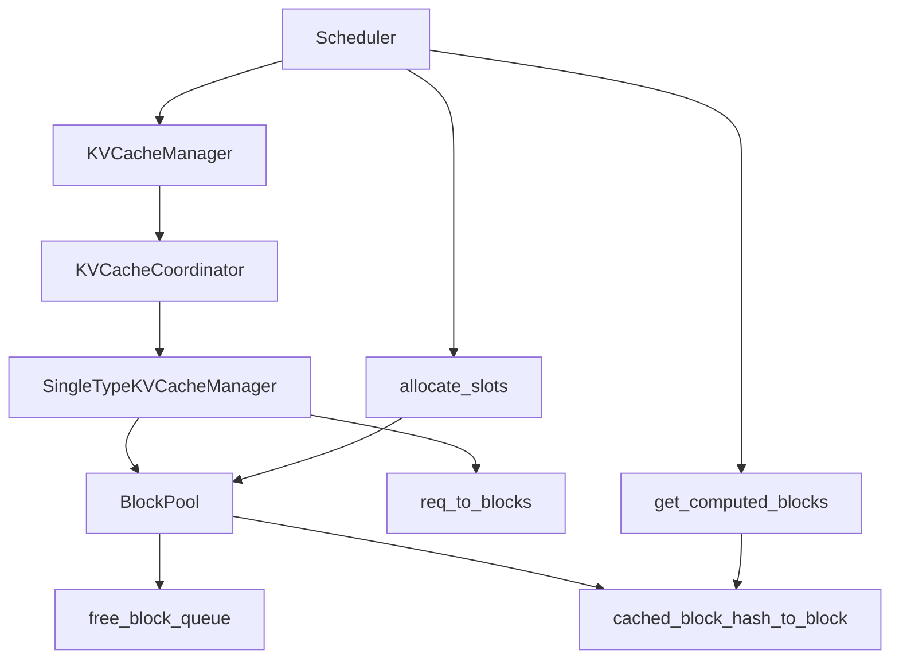

# 从 BlockPool 到 Prefix Cache：vLLM 如何把 KV Cache 做成分页系统

## 这篇要回答什么问题

上一篇我们把 `continuous batching` 讲成了一个统一调度模型：调度器每一轮都在回答“这批请求接下来还能推进多少 token”。

但只要你继续往 `Scheduler` 往下读，很快就会碰到另一个更硬核的问题：

> 调度器口中的“推进 token”，到底是在分配什么资源？为什么它既要考虑 prefix cache hit，又要考虑 block 不够时的 preemption，还要能把已经算过的前缀、外部 connector 带来的 KV、lookahead token 一起放进同一套分配逻辑里？

这个问题的答案，就在 `vllm/v1/core/kv_cache_manager.py`、`vllm/v1/core/block_pool.py` 以及它们下面的 coordinator / single-type manager 分层里。

很多人会把 KV Cache 想成一句比较朴素的话：

- 模型算过的 key/value 放进显存，下次继续接着用

这个理解当然没错，但对于 vLLM V1 来说远远不够。因为从代码实现看，KV Cache 已经不是一个“显存里的大数组”，而更像一套运行时内存系统：

- 它把 KV 按 block 分页，而不是按请求整体连续分配
- 它为每个 block 建立哈希，从而支持 prefix cache 命中
- 它用 `ref_cnt`、free queue 和淘汰顺序管理 block 生命周期
- 它允许多个请求共享同一组前缀 block
- 它还要兼容 sliding window、hybrid attention、外部 KV transfer、spec decode lookahead 等复杂情况

所以这篇文章真正要解释的是：

> vLLM 是怎样把 KV Cache 从“缓存一段显存”做成一套“分页、命中、分配、回收、复用”都完整闭环的内存系统的？

路线图里点名的五个问题，这篇都会回答：

1. `KVCacheManager` 为什么只是外观层，真正块管理在 coordinator 和 `BlockPool`
2. `get_computed_blocks()` 如何寻找最长 cache hit
3. 为什么 cache hit 之后仍然可能重算最后一个 token
4. `allocate_slots()` 如何同时处理新 token、已命中 token、外部 connector token、lookahead token
5. `BlockPool` 如何维护 free queue 和 block hash 到 block 的映射

## 如果不了解这个模块，后面会在哪些地方读不下去

如果没有先把 KV Cache 这一层看明白，后面读 V1 源码时通常会卡在这些地方：

- 看到 scheduler 里频繁调用 `kv_cache_manager.allocate_slots(...)`，却不知道它到底在分配什么。
- 看到 prefix caching 命中后，调度器仍然安排一部分 token 重新计算，会怀疑是不是命中逻辑写得不彻底。
- 看到 `BlockPool` 里既有 `free_block_queue`，又有 `cached_block_hash_to_block`，会分不清“空闲 block”和“可复用 block”到底是什么关系。
- 看到请求释放 block 时要逆序 free，会觉得这只是个小优化，不知道它其实决定了淘汰优先级。
- 看到 `KVCacheManager` 名字最大，却发现很多核心逻辑都下沉到 coordinator 和 single-type manager，会不明白这层拆分的必要性。

这些困惑背后，其实都指向同一个事实：

**在 V1 里，KV Cache 已经不是“请求附属状态”，而是被做成了一个可被 scheduler 精确管理的分页资源。**

## 先给一张全景图

先用一句话概括这套系统：

> `KVCacheManager` 对上给 scheduler 一个统一接口，对下把不同 KV cache group 的差异交给 coordinator 和 single-type manager 处理，再由 `BlockPool` 维护真正的物理 block 池、空闲队列和 prefix cache 哈希表。

如果画成一张图，大致是这样：



这张图里最重要的不是类名，而是职责边界：

- scheduler 不直接碰 block 细节
- `KVCacheManager` 不直接实现所有 block 算法
- `BlockPool` 不理解请求生命周期，只负责 block 这一层的物理资源

也就是说，V1 在这里其实做了三层抽象：

1. `KVCacheManager`：面向 scheduler 的门面
2. coordinator / manager：面向不同 cache 语义的策略层
3. `BlockPool`：面向 block 生命周期的物理层

这和操作系统里的“虚拟内存接口 / 页表策略 / 物理页框”其实已经有点像了。

## 第一层：为什么说 `KVCacheManager` 更像外观层，而不是全部逻辑本体

第一次看 `kv_cache_manager.py`，很容易以为“KV cache 的核心一定都在这里”。但只要把构造函数和几个核心方法连起来看，就会发现这个类更像一个 facade。

它做的事主要有三类：

1. 接住 scheduler 的统一调用入口
2. 持有统计、watermark、event 等横切能力
3. 把真正的块管理委托给 coordinator

初始化时最关键的一行其实是：

```python
self.coordinator = get_kv_cache_coordinator(...)
```

这行代码的含义很重要。

它说明 `KVCacheManager` 并不假设所有模型只有一种 KV cache 形态。相反，它先根据 `kv_cache_config` 选择协调器：

- prefix cache 关闭时，可退化为 `KVCacheCoordinatorNoPrefixCache`
- 单一 cache group 时，使用 `UnitaryKVCacheCoordinator`
- hybrid attention / 多 group 时，使用 `HybridKVCacheCoordinator`

因此 `KVCacheManager` 的真正职责不是“自己管所有 block”，而是：

**把 scheduler 看到的一套统一语义，翻译给下面可能完全不同的 KV cache 组织方式。**

### 1. 为什么 scheduler 只应该依赖它，而不该直接依赖 `BlockPool`

因为 scheduler 真正关心的是请求级问题，而不是物理 block 级问题：

- 当前请求命中了多少 prefix
- 这轮再推进多少 token 还需要多少 block
- 外部 connector 提供了多少已算好的 KV
- 本轮 lookahead token 要不要预留 slot
- 如果块不够，应该返回 `None` 还是继续推进

这些都不是 `BlockPool` 该知道的事情。

`BlockPool` 只应该知道：

- 现在有多少 block
- 哪些 block 空闲
- 哪些 block 还保留 hash，可被命中
- 分配时如果踩到 cached block，该怎样先把它逐出哈希表

所以 `KVCacheManager` 夹在中间，是为了保证 scheduler 永远操作的是“请求进度和缓存语义”，而不是直接操作物理 block 细节。

### 2. 真正的块管理为什么要继续下沉一层

因为 vLLM 的 block 管理不是单一语义。

至少有这些变体：

- full attention：天然支持从左到右找最长前缀命中
- sliding window：命中的不是简单“最长前缀”，而要看窗口内连续块
- hybrid attention：不同 group 的 block size、命中粒度、可缓存区域都可能不同
- EAGLE / MTP：prefix 命中后还要丢掉最后一个 matched block

如果把这些都硬塞进 `KVCacheManager`，那这个类会变成一个巨大的条件分支集合，scheduler 看到的接口也会被污染。

现在 V1 的做法更清晰：

- `KVCacheManager` 保持统一入口
- coordinator 负责跨 group 协调
- single-type manager 负责某一种 cache 语义
- `BlockPool` 只负责 block 级分配 / 回收 / 哈希索引

这也是为什么路线图里特别强调：

**`KVCacheManager` 是门面层，真正的块管理在 coordinator 和 block pool。**

## 第二层：为什么说 vLLM 的 KV Cache 是“分页系统”

理解 Prefix Cache 前，先要把“分页”这个比喻真正落到代码里。

### 1. 不按请求整体分配，而按 block 分配

在 vLLM 里，一个请求不会拿到一整块连续显存来存放自己的全部 KV。

相反，它拿到的是一串 block：

```text
request -> [block_17, block_42, block_5, block_98, ...]
```

每个 block 只容纳固定数量 token 的 KV。一个请求增长时：

- 先填满已有尾块
- 不够再申请新块
- 块满了再把这个块变成可缓存块

这就是分页系统的第一层含义：

**逻辑上连续的序列，被映射成物理上离散的 block。**

### 2. block 是统一的资源粒度

一旦采用 block 作为基本单位，很多事情都会自然统一：

- prefix cache hit 的单位是“完整 block”
- 可回收 / 可淘汰的单位也是“完整 block”
- block table 天然变成请求到物理页的映射
- free queue 不再关心请求，只关心 block 是否空闲

这比“按请求长度整体搬移”要稳定得多，因为请求长度是动态增长的，block 则是稳定粒度。

### 3. `paged_attention` 文档为什么仍然值得看

仓库里的 `docs/design/paged_attention.md` 开头已经明确提醒：这是一份历史文档，不再精确描述今天的代码实现。

但它仍然值得读，因为它帮你建立一个非常关键的直觉：

- attention kernel 看到的不是连续上下文内存
- 它通过 block table 去索引 paged KV cache

也就是说，哪怕今天 V1 的上层实现已经演进，**“KV 以 block 为页组织”** 这个基本抽象并没有变。

这也是为什么理解 `BlockPool` 和 prefix cache，会让你反过来看懂 paged attention 的资源视角。

## 第三层：`BlockPool` 到底维护了什么

如果要给这篇文章挑一个最像“物理内存管理器”的类，那一定是 `vllm/v1/core/block_pool.py` 里的 `BlockPool`。

它初始化时会一次性创建所有 `KVCacheBlock`：

```python
self.blocks = [KVCacheBlock(idx) for idx in range(num_gpu_blocks)]
self.free_block_queue = FreeKVCacheBlockQueue(self.blocks)
self.cached_block_hash_to_block = BlockHashToBlockMap()
```

这三行几乎就把全套设计说完了。

### 1. block 对象一次性全部建好

这一步特别重要。

vLLM 不是在请求运行过程中不断 new / delete block 对象，而是启动时把 block pool 全部建好。

这样做有两个直接好处：

- 避免 Python 对象频繁创建和 GC
- 所有 block 都有稳定 `block_id`，便于 block table 追加式维护

所以 block 在这里不是“临时描述符”，而更像预先编号好的物理页框。

### 2. `free_block_queue`：空闲队列，同时也是淘汰顺序

很多人第一次看到 `free_block_queue` 会以为它只是“还能拿哪些 block”。

其实它还有第二层含义：

**当 prefix caching 开启时，空闲队列里的 block 同时也是潜在淘汰候选。**

因为一个 block 即使已经被缓存到哈希表里，只要当前 `ref_cnt == 0`，它仍然会待在 free queue 中，表示：

- 没有请求正在使用它
- 但它的 block hash 还在，可以被未来请求命中
- 如果系统现在需要新 block，也可以把它作为牺牲者淘汰后复用

这就把“空闲”和“可复用缓存”统一到了同一批物理页上。

### 3. `cached_block_hash_to_block`：从内容到页框的反向索引

这是 prefix cache 成立的关键。

它维护的是：

```text
block_hash + group_id -> block
```

注意它不是简单的：

```text
prefix string -> request
```

而是对完整 block 建立内容哈希，并映射到物理 block。

这样一来，新请求想判断前缀是否命中时，就不需要扫描历史请求，而只要：

1. 计算自己每个 block 的 hash
2. 按顺序去哈希表查 block
3. 一旦某个 block miss，后续 full-attention block 就必然不再命中

这就是为什么 prefix caching 文档会强调：

**vLLM 采用的是 hash-based prefix caching，而不是按请求对象做复用。**

### 4. `null_block`：为什么还要有一个空占位 block

`BlockPool` 初始化时会专门拿出一个 `null_block`：

- `block_id = 0`
- `is_null = True`
- 不走正常 ref_cnt 管理

这个 block 的作用不是存真实 KV，而是给某些稀疏 / 滑窗场景当占位符，保证 block table 的形状或对齐语义成立。

这背后反映的还是同一个思想：

**block table 是运行时核心结构，哪怕某些位置逻辑上“没有可用 block”，系统也更愿意用显式占位来保持结构稳定。**

## 第四层：Prefix Cache 是怎样建立起来的

现在可以开始看 prefix cache 本身。

它的关键不是“缓存 prompt”，而是“缓存完整 block，并把它们串成一条可验证的哈希链”。

### 1. block hash 不是只看本块 token

`docs/design/prefix_caching.md` 里有个很重要的点：

每个 block 的 hash 由这些部分共同决定：

- 父 block 的 hash
- 当前 block 的 token
- 额外键，例如 LoRA、图像 hash、cache salt 等

所以 block hash 的语义不是“这 16 个 token 长什么样”，而是：

**“以这个前缀为上下文时，这个 block 的内容身份是什么。”**

这能保证只有当前缀链路一致时，后续 block 才能命中。

### 2. 为什么只缓存 full block

这是 prefix caching 里最关键、也最容易被忽略的约束：

**只有 full block 会进入哈希表。**

原因非常直接：

- 部分填充的 block 还不稳定，后续 token 追加后内容会变
- 只有 full block 才能作为未来请求的稳定复用单元

所以一个请求在增长过程中，尾块通常是“已分配但尚未可缓存”的状态；只有当它被填满，才会真正进入 prefix cache。

### 3. 命中的是 block，不是 token

这点和很多人想象的不一样。

prefix cache 的命中粒度是完整 block，而不是“前 153 个 token 有 153 个命中”。

这意味着：

- 命中长度天然按 block 对齐
- 某个 block 只要没满，哪怕前面 token 都相同，也不会被视为命中
- 命中和重算的边界通常发生在 block 边界上

也正是因此，后面你会看到“命中后仍然可能多重算一个 block”的现象。

## 第五层：`get_computed_blocks()` 如何寻找最长 cache hit

对 scheduler 来说，最关键的前缀命中入口就是：

```python
kv_cache_manager.get_computed_blocks(request)
```

这个函数返回两样东西：

1. 已命中的 `KVCacheBlocks`
2. 对应的 `num_new_computed_tokens`

注意这里的“computed”不是说“本轮刚算出来”，而是说：

**这些 token 已经有现成 KV，可以被当作已完成计算的前缀。**

### 1. 它为什么不是自己查哈希表，而是交给 coordinator

因为“最长命中”不是所有模型都一样：

- 单一 full attention 可以从左到右线性找
- sliding window 需要考虑窗口内连续块
- hybrid 模型里不同 group 可能给出不同上界，要做固定点收敛

所以 `KVCacheManager.get_computed_blocks()` 做的其实很少：

1. 先判断 prefix cache 是否启用
2. 处理某些请求不允许读 prefix cache 的情况
3. 设定 `max_cache_hit_length`
4. 调 `self.coordinator.find_longest_cache_hit(...)`

这说明“找最长 hit”本质上是 cache 策略问题，而不是门面类的工作。

### 2. full attention 场景下，最长命中为什么能从左到右直接停

`FullAttentionManager.find_longest_cache_hit()` 的逻辑很直白：

1. 按 block 顺序扫描 `block_hashes`
2. 每个 block 去 `block_pool.get_cached_block(...)` 查哈希表
3. 一旦某个 block miss，立即 break

为什么这里可以安全 break？

因为 full attention 的 block hash 是一条前缀链：

- 第 N 个 block 的 hash 依赖第 N-1 个 block
- 只要中间某个 block 不匹配，后面的 block 也不可能构成同一条前缀链

也就是说：

**full attention 下的 prefix hit 是一个天然向下闭合的前缀问题。**

### 3. hybrid / sliding window 为什么更复杂

滑窗场景下，命中不再是简单的“左起最长前缀”，而是要考虑窗口范围内是否存在足够连续的 block。

hybrid 场景更进一步：

- 不同 group 可能 block size 不同
- 不同 attention spec 对“可命中区域”的定义不同
- 某个 group 缩短候选命中长度后，其他 group 也要重新验证

所以 `HybridKVCacheCoordinator.find_longest_cache_hit()` 才会使用一个迭代 fixed-point 算法：

- 先给一个候选 hit length
- 每个 attention type 检查自己是否接受
- 如果任何一组缩短这个长度，就重新让所有组按新长度再验证
- 直到所有组都接受

这说明在 V1 里，“prefix cache 命中长度”不是一个局部事实，而是：

**所有 KV cache group 共同同意后的系统事实。**

## 第六层：为什么 cache hit 之后仍然可能重算最后一个 token

这是很多人第一次看 `get_computed_blocks()` 时最困惑的地方。

源码里有一段非常关键的注释：

> 当所有 token 都命中 cache 时，仍然必须重算最后一个 token 才能拿到 logits，所以 `max_cache_hit_length = prompt_length - 1`。

这句话背后其实有两层原因。

### 1. 命中了 KV，不代表拿到了这一步需要的 logits

prefix cache 提供的是历史 token 的 K/V。

但如果这次请求要继续生成，就还需要对“最后一个可见 token”执行一次前向，拿到下一步采样所需 logits。

因此，即便整个 prompt 的历史 KV 都已经在 cache 里，也不能直接说：

- prompt 全部不用算了
- 立刻开始输出

系统仍然要对最后一个位置做一次计算，以便产生当前请求真正需要的输出分布。

换句话说：

**KV cache 解决的是“上下文状态复用”，不是“本轮 logits 凭空出现”。**

### 2. 为什么有时不是重算 1 个 token，而是重算一整个 block

源码注释接着又说了一句更重要的话：

由于 `allocate_slots()` 要求 `num_computed_tokens` 按 block size 对齐，所以这可能触发整块重算，而不是只重算最后一个 token。

这件事是由两种粒度不一致导致的：

- 语义上，只差最后一个 token 的 logits
- 工程上，block 管理按 page/block 粒度对齐

于是系统宁可保守一点，在 block 边界上回退，也不愿意把 block 管理逻辑搞成“支持尾部任意非对齐已计算区域”的复杂形态。

这就是一个典型的系统工程权衡：

- 理论上可以更细粒度，省下一点算力
- 实践上 block 对齐让分页系统更稳定、更简单

所以这段逻辑真正体现的是：

**vLLM 把 Prefix Cache 做成了页式系统，因此也接受了页式系统典型的对齐成本。**

## 第七层：`allocate_slots()` 为什么是整套系统的核心分配入口

如果说 `get_computed_blocks()` 负责“找已有页”，那么 `allocate_slots()` 就负责“把这次运行真正需要的页配出来”。

它之所以关键，是因为它要同时处理多种 token 来源：

- 已经算过并命中的前缀 token
- connector 提供的 external computed tokens
- 本轮真正要新算的 token
- speculative decoding 的 lookahead token
- encoder-decoder 场景额外的 encoder token

源码注释直接给了一张很重要的布局图，可以把它翻译成一句话：

> 一条请求当前看到的 token 区间，不只是“旧 token + 新 token”，而是“本地已计算 + 新命中前缀 + 外部已计算 + 本轮新算 + lookahead 预留”的组合。

### 1. 为什么它叫 allocate slots，而不是 allocate blocks

因为 scheduler 站在请求视角想表达的不是“我要几个 block”，而是：

- 我需要让这个请求至少拥有多少 token 的可用位置

块数只是由 token 数和 block size 折算出来的结果。

这也是统一调度模型和分页系统对接时非常漂亮的一点：

- scheduler 思考 token
- KV cache 系统思考 block
- `allocate_slots()` 负责把 token 级需求翻译成 block 级分配

### 2. 它处理的是哪几段 token

源码注释里把整个布局拆成这些区域：

- `comp`：请求本来就已经计算完成的 token
- `new_comp`：这次通过本地 prefix cache 新命中的 token
- `ext_comp`：来自外部 connector 的已计算 token
- `new`：本轮真正要计算的新 token
- `lookahead`：为 speculative decode 预留的 token

这几个区域最重要的区别是：

- 有些 token 已有 KV，只要占住 slot，不必再算
- 有些 token 还没有 KV，既要分 slot，也要参与本轮计算
- 有些 token 甚至只是提前预留位置，后面可能还会被拒绝

所以 `allocate_slots()` 的工作不是简单 malloc，而是：

**根据不同 token 的“已计算程度”和“是否最终可提交”，决定哪些页要复用、哪些页要新分、哪些页允许先占后算。**

### 3. 为什么它要先移除 skipped blocks

在真正分配前，`allocate_slots()` 会先调用：

```python
self.coordinator.remove_skipped_blocks(...)
```

这一步的含义是：

- 某些 block 可能由于 sliding window 等原因，已经不再参与后续 attention
- 它们即便仍属于这个请求，也可以先从活跃工作集里摘掉

这样做的好处很直接：

- 在尝试申请新 block 前先缩小旧工作集
- 减少不必要的淘汰
- 提高“当前请求还能继续推进”的概率

这很像分页系统里先回收不再需要的页，再决定是否需要新页。

### 4. watermark、reserved_blocks、full_sequence_must_fit 分别在防什么

`allocate_slots()` 里有几组特别值得注意的 admission 控制参数。

`watermark_blocks`：

- 只对 waiting / preempted 请求生效
- 用来保留一部分空闲 block 头寸
- 目的是避免刚接纳新请求就立刻把系统顶满，导致频繁 preemption

`reserved_blocks`：

- 为其他 in-flight 请求保留 block
- 特别适合异步 KV connector 加载场景
- 防止一个新 admission 把正在路上的序列逼死

`full_sequence_must_fit`：

- 某些场景不是“先塞一小段再说”
- 而是要求整条序列按滑窗和命中折算后必须能完整容纳

这三者共同说明：

**`allocate_slots()` 不只是一个执行动作，它同时也是准入控制点。**

## 第八层：`BlockPool` 如何把“命中、分配、回收、淘汰”连成闭环

现在可以回到最底层，看看 `BlockPool` 如何把这些状态真正跑起来。

### 1. 命中时为什么要 `touch`

当一个请求命中已有 cached blocks 时，这些 block 不能继续只是 free queue 里的“可淘汰候选”。

因为它们马上就要被当前请求使用。

所以系统会对命中的 block 执行 `touch(...)`：

- 如果 `ref_cnt == 0`，先从 free queue 中移除
- 再把 `ref_cnt += 1`

这一步的意义非常关键：

**被命中的 cached block 会从“空闲但可复用”状态，提升为“正在被使用，不可淘汰”状态。**

这正是共享前缀成立的基础。

### 2. 分配新 block 时为什么可能先逐出 cached block

`BlockPool.get_new_blocks()` 从 `free_block_queue` 头部取 block。

但取到的 block 不一定是“完全没历史”的 block，它也可能是：

- 当前 `ref_cnt == 0`
- 但还挂着 `block_hash`
- 因此仍可被 prefix cache 命中的 block

这时 `get_new_blocks()` 会先调用 `_maybe_evict_cached_block(block)`：

1. 从 `cached_block_hash_to_block` 中移除
2. 清掉 `block.block_hash`
3. 如有事件系统则发出 `BlockRemoved`

只有这样，这个 block 才能安全地重新分配给新请求。

所以 free queue 头部弹出的不仅是“空页”，也是：

**按 LRU 顺序优先牺牲的 prefix cache 页。**

### 3. 为什么说 free queue 天然就是 LRU

prefix caching 文档里专门强调：

- free queue 头部是最先被淘汰的 block
- 释放请求时，block 按逆序进入 free queue 尾部

这两个动作合起来，刚好形成一个近似 LRU 的淘汰顺序。

更细一点看：

- 正在被使用的 block 不在 free queue 中
- 刚变空闲的 block 进入队尾，说明“最近刚被使用”
- 早就空闲着的 block 慢慢移动到队头，说明“最久没被碰过”

这就是为什么 vLLM 不需要再额外搞一套复杂 LRU 容器：

**free queue 本身既是空闲表，也是缓存淘汰表。**

### 4. 为什么释放时要逆序 free

这一步特别容易被低估。

`KVCacheManager.free()` 的注释明确说：

- 释放 block 时按 reverse order
- 这样尾部 block 会更早被淘汰

为什么尾部 block 更适合先淘汰？

因为请求越往后的 block：

- 依赖的前缀越长
- 被未来请求完全复用的概率通常越低
- 越像“长尾上下文”

反过来，前面的 block 往往对应公共系统 prompt、对话模板、共享长前缀，更可能再次命中。

所以逆序 free 并不是一个小技巧，而是把“更有复用价值的前缀页”尽量留得更久。

这也解释了为什么这套系统越来越像分页缓存，而不只是显存分配器。

## 第九层：从一次请求生命周期看完整闭环

到这里，可以把一次请求在 KV Cache 系统中的路径完整走一遍。

### 第 1 步：请求创建时就预先算好 block hashes

请求进入系统后，会基于 token 序列预先生成 `block_hashes`。

这一步非常关键，因为后面 prefix cache 的 lookup 不是拿原始文本比对，而是直接拿这些 hash 去查 `BlockPool` 的哈希索引。

### 第 2 步：调度前先找最长 cache hit

scheduler 调用：

```python
computed_blocks, num_computed_tokens = kv_cache_manager.get_computed_blocks(request)
```

这里得到的是：

- 哪些 block 已经可以直接复用
- 当前请求可以视为“已经算到哪里”

如果一个 full block 没命中，后面的块在 full-attention 场景下也就不必再查了。

### 第 3 步：把命中的 block 从“可淘汰缓存”变成“活跃共享页”

一旦本轮真的决定接纳这个请求，系统就会在分配流程里 touch 命中的 blocks：

- 增加 `ref_cnt`
- 从 free queue 中摘除

这意味着：

- 命中的前缀不只是“查到过”
- 而是真正被当前请求接管为在用状态

### 第 4 步：为剩余 token 申请新 block

接下来 `allocate_slots()` 会综合：

- 已命中的 token
- 外部已计算 token
- 本轮新 token
- lookahead token

把最终需要的 slot 数折算成新 block 数，并通过 `BlockPool.get_new_blocks()` 从 free queue 中拿 block。

如果 free queue 头部 block 仍带 hash，就先逐出再复用。

### 第 5 步：块满了就进入 prefix cache

本轮执行完成后，系统会调用 `cache_blocks(...)`。

这一步只会让 full block 进入哈希表。

于是这些 block 既可能：

- 继续被当前请求持有
- 也可能在以后请求命中时被共享

### 第 6 步：请求结束后，block 变成“空闲但可复用缓存”

请求完成时，block 会被 free。

如果 `ref_cnt` 归零：

- block 重新回到 free queue
- 但 block hash 不一定会被立刻清掉

这意味着它成了：

- 空闲页
- 也是 prefix cache 候选页

### 第 7 步：系统缺页时，再从 LRU 侧开始淘汰

当后续请求需要新 block 时：

- 从 free queue 头部取 block
- 若 block 仍带 hash，就先从哈希表移除
- 该 block 重新成为干净可写页

于是整个系统闭环完成：

```text
新页分配 -> 填满 -> 进入 prefix cache -> 空闲但可命中 -> 被再次命中或被淘汰复用
```

这已经完全是一套页缓存系统，而不是简单的“显存数组复用”。

## 第十层：Prefix Cache 为什么能和 unified scheduler 无缝结合

如果把上一篇 scheduler 的内容和这篇 KV Cache 系统一起看，会发现它们拼得非常自然。

### 1. scheduler 关心的是推进多少 token

调度器不想知道 block 细节，它只想知道：

- 当前请求已经推进到哪里
- 本轮再推进多少是否可行

### 2. KV Cache 系统把 token 进度翻译成 block 资源

`KVCacheManager` 恰好给出了这两个关键接口：

- `get_computed_blocks()`：哪些 token 已经可视作完成
- `allocate_slots()`：要让请求推进到目标位置，还需要多少 block

于是 scheduler 可以继续留在“token 世界”，而分页系统留在“block 世界”。

### 3. prefix cache 命中因此成为统一调度模型的一部分

对 scheduler 来说，一个 waiting 请求并不总是从 0 开始。

它可能已经自带：

- 本地 prefix cache 命中
- 外部 connector 已计算的 KV

于是请求的实际“待推进量”会被自然扣减。

这就是为什么在 V1 里，prefix cache 不是一个外挂优化，而是 unified scheduler 的输入之一。

更准确地说：

**continuous batching 负责统一分配 token 预算，KV Cache 分页系统负责把这份预算落到真实 block 资源上。**

## 这篇文章之后，最值得继续读什么

如果你已经接受了“KV Cache 是分页系统”这个视角，下一步最值得继续读的是：

1. `vllm/v1/core/kv_cache_coordinator.py`
2. `vllm/v1/core/single_type_kv_cache_manager.py`
3. `docs/design/prefix_caching.md`
4. `docs/usage/v1_guide.md`

按这个顺序读的好处很明显：

- 先看多 group 协调到底怎么收敛
- 再看 full attention、sliding window、hybrid 各自如何定义 hit 和 cacheable 区域
- 再回到设计文档，用图把 free queue 和 hash map 想清楚
- 最后再从 V1 运行时视角看 prefix caching 为什么能直接进入调度链路

如果沿博客主线继续往后写，那么下一篇最自然就是：

**《Sampler 不是最后的小步骤：vLLM 如何定义输出语义》**

因为调度和 KV cache 解释的是“请求怎样被推进”，而 sampler 要回答的是：

**推进到最后一步之后，vLLM 到底如何把 logits 变成用户真正看到的输出。**

## 一句话总结

不要把 vLLM 的 KV Cache 理解成“把过去算过的 KV 暂存在显存里”。

更准确地说，它在回答的是这样一个问题：

> 当系统里同时存在多个动态增长的请求、共享前缀、外部 KV transfer、滑窗 attention、spec decode lookahead 和频繁的请求完成 / 回收时，如何用一套稳定的数据结构把这些 KV 组织成可分页、可命中、可复用、可淘汰的运行时资源？

V1 给出的答案是：

- 用 block 作为统一分页粒度
- 用 `KVCacheManager` 暴露请求级接口
- 用 coordinator 和 single-type manager 处理不同 cache 语义
- 用 `BlockPool` 统一维护物理 block、free queue 和 hash 索引
- 用 `ref_cnt`、touch、逆序 free 和 LRU 式淘汰把共享、回收和复用串成闭环

所以从 `BlockPool` 到 Prefix Cache，vLLM 做的并不是“再加一个缓存优化”。

它真正做的是：

**把 KV Cache 做成了一套页式内存系统，而 prefix caching 只是这套系统最显眼、但不是唯一的能力。**
