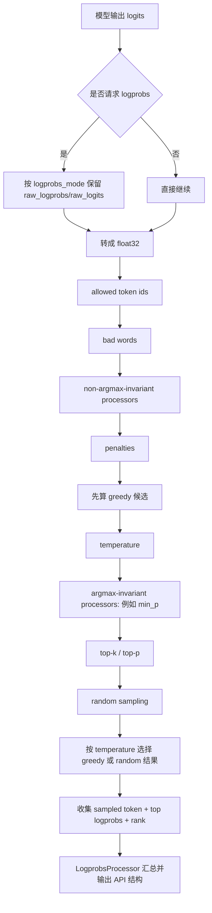
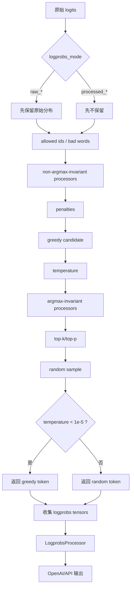

# Sampler 不是最后的小步骤：vLLM 如何定义输出语义

## 这篇要回答什么问题

上一篇我们把 `KV Cache` 讲成了一套分页系统。到那一步为止，请求已经能被调度、能拿到 block、也能在 worker 上完成前向。

但真正贴近用户的问题，其实还没结束：

> 模型吐出来一行 logits 之后，vLLM 到底是怎样把它变成“用户看到的下一个 token”和“API 里返回的 logprobs”的？

很多人会下意识把 sampler 当成最后一个小步骤：

- 前面调度、KV Cache、Worker 都很复杂
- sampler 不就是 `argmax` 或 `top-p` 一下吗

这个理解很容易让人错过 V1 一个非常关键的事实：

**Sampler 不只是“挑一个 token”，它还在定义输出语义。**

更具体地说，它同时决定了三件事：

1. 哪些 logits processor 会真的影响最终输出
2. 返回给用户的 logprobs，究竟对应“原始模型分布”还是“采样后分布”
3. greedy、temperature、top-k、top-p 在代码里究竟按什么顺序生效

路线图里点名的四个问题，这篇都会回答：

1. 采样前后有哪些 logits processor
2. `raw_logprobs` 与 `processed_logprobs` 的区别
3. 为什么 V1 的 logprobs 语义和 V0 不一样
4. greedy、temperature、top-k/top-p 在代码里的实际顺序

## 如果不了解这个模块，后面会在哪些地方读不下去

如果不先把 sampler 这层看明白，后面读 V1 时通常会卡在这些地方：

- 看到 `logprobs_mode` 有 `raw_logprobs`、`processed_logprobs`、`raw_logits`、`processed_logits` 四种模式，却不知道它们究竟在什么时刻取值。
- 看到同一个请求返回的 `sampled token` 和 top logprobs 排序不一致，会怀疑是不是实现有 bug。
- 看到代码把 logits processor 分成 `argmax_invariant` 和 `non_argmax_invariant` 两类，不明白为什么要这么拆。
- 看到 `all_greedy`、`all_random`、`temperature < 1e-5` 这些分支时，会分不清真正的 greedy 是什么时候发生的。
- 看到 `LogprobsProcessor` 在 engine 层继续处理 sampler 输出，会误以为“logprobs 语义是在 API 层定义的”，而不是在 sampler 层就已经定了大半。

这些困惑背后，其实都指向同一个事实：

**在 V1 里，sampler 不是执行链路末端的附属组件，而是“模型分布如何暴露给用户”的语义边界。**

## 先给一张全景图

先用一句话概括 V1 的采样流水线：

> `Sampler.forward()` 会先决定“要不要在处理前保留一份原始分布”，再应用 whitelist / bad words / penalties / logits processors，然后按 greedy 或 random 分支取样，最后把 sampled token、top-k logprobs 和 rank 封装成 `SamplerOutput`，交给 engine 侧 `LogprobsProcessor` 汇总成最终 API 语义。

如果画成一张图，大致是这样：



这张图里最重要的不是类名，而是两个“切分点”：

- 第一刀切在“什么时候保留 logprobs”
- 第二刀切在“哪些处理会影响 greedy，哪些只影响 random”

只要这两刀切清楚，`sampler.py` 里那些看起来很多的条件分支就会一下子顺起来。

## 第一层：为什么说 sampler 定义了输出语义

第一次看 `vllm/v1/sample/sampler.py`，很容易把注意力放在“最终怎么抽样”上。

但如果从用户视角看，一个请求真正关心的是两样东西：

1. 最后输出了哪个 token
2. 这个 token 以及候选 token 的分数该怎么解释

而这两件事都不是单靠模型前向就能回答的。

原因很简单：

- 模型前向只给出原始 logits
- 但用户实际拿到的 token，可能已经经过 bad words、penalties、temperature、top-k、top-p
- 用户实际拿到的 logprobs，也可能是处理前的，也可能是处理后的

这意味着 sampler 决定的不是“最后用哪个抽样器”，而是：

**到底把哪一个分布当作“应该返回给用户看的分布”。**

这也是为什么 `Sampler.forward()` 一开头就先处理 `logprobs_mode`，而不是先去做 top-k/top-p。

从源码顺序看，V1 在做一个很明确的选择：

- 如果用户要的是 `raw_logprobs` / `raw_logits`，先把原始分布留住
- 如果用户要的是 `processed_logprobs` / `processed_logits`，就返回“当前采样分支真正使用的处理后分布”

也就是说，`logprobs_mode` 不是一个展示层小开关，而是 sampler 自己的一部分语义协议。

## 第二层：`Sampler.forward()` 的第一件事不是采样，而是决定“保留哪份分布”

这一点非常关键。

`Sampler.forward()` 开头最重要的一段逻辑，不是 `argmax`，也不是 `top_p`，而是：

- 先看这次请求有没有要求 `num_logprobs`
- 或者有没有指定 `logprob_token_ids`
- 如果需要，就按 `logprobs_mode` 决定保留什么

V1 支持四种模式：

- `raw_logprobs`：在任何 post-processing 之前，对原始 logits 做 `log_softmax`
- `raw_logits`：直接保留原始 logits
- `processed_logprobs`：返回处理后分布对应的 logprobs
- `processed_logits`：返回处理后分布对应的 logits

这四种模式表面上只是“返回什么值”，但它们背后对应的是两套完全不同的语义：

### 1. raw 模式：返回模型原始判断

`raw_logprobs` 和 `raw_logits` 的核心含义是：

- 先保留原始分布
- 后面的 bad words、penalties、temperature、top-k/top-p 可以继续影响采样
- 但默认不回头改写“返回给用户看的模型分数”

因此 raw 模式回答的是：

**如果不考虑运行时采样策略，模型本来怎么看这个位置？**

### 2. processed 模式：返回采样真正使用的分布

`processed_logprobs` 和 `processed_logits` 则相反。

它们的语义是：

- 对 random 路径，等 temperature、`min_p`、top-k/top-p 等处理把分布改写完
- 对纯 greedy 路径，则返回 greedy 决策点所使用的处理后分布
- 再把“真正参与当前分支决策的那份分布”返回给用户

因此 processed 模式回答的是：

**系统在当前采样分支里，最后是按什么分布做决策的？**

这两套语义都合理，但不能混为一谈。

而 V1 最大的变化，正是默认把选择切到了 raw 这一侧。

## 第三层：为什么 V1 的 logprobs 语义和 V0 不一样

这一点，`sampler.py` 里的注释写得非常直接：

> V1 默认用原始 logits 来返回 top-k logprobs，而不是像 V0 那样，用“实际用于采样的处理后 logits”。

`docs/usage/v1_guide.md` 也明确说明了这一变化：

- V1 默认在原始模型输出一出来时，就立即计算 logprobs
- 这些值不包含 temperature scaling、penalty adjustments 以及其它 logits post-processing 的影响

这意味着 V1 默认更强调一件事：

**把“模型原始分布”与“运行时采样策略”分开。**

这个变化会直接带来一个很容易让人误解、但其实完全合理的现象：

- 返回给用户的 `raw_logprobs` 里，token A 可能仍然排名第一
- 但最终采样结果却是 token B

为什么会这样？

因为两者回答的是两个不同问题：

- `raw_logprobs` 问的是：模型原始更看好谁
- 最终 sampled token 问的是：经过 penalty、bad words、temperature、top-k/top-p 后，系统真正允许并选择了谁

所以这不是 bug，而是 V1 刻意暴露出来的语义差异。

### 一个最容易记住的对比

可以把 V0 和 V1 的默认行为概括成下面这张表：

| 版本 | 默认返回的 logprobs 更接近什么 |
| --- | --- |
| V0 | 实际采样所依据的处理后分布 |
| V1 | 模型刚输出时的原始分布 |

这也是为什么路线图专门要求把“V1 的 logprobs 语义和 V0 不一样”单独讲出来。

因为它不是实现细节变化，而是 API 解释方式变化。

## 第四层：采样前到底有哪些处理，会按什么顺序生效

理解这层，最好的方式不是背函数名，而是按“谁先影响语义”来分。

`Sampler.forward()` 和 `apply_logits_processors()` 组合起来，采样前的处理顺序大致如下：

1. 保留 raw 分布（如果需要）
2. 转成 `float32`
3. 应用 `allowed_token_ids_mask`
4. 应用 bad words 过滤
5. 应用会影响 greedy 的 logits processors
6. 应用 penalties
7. 进入 `sample()`，再分 greedy / random 路径

这里最值得解释的是第 5 步和第 6 步。

### 1. 为什么要把 logits processor 分成两类

V1 把 logits processor 拆成：

- `non_argmax_invariant`
- `argmax_invariant`

这个分类标准不是“重要 / 不重要”，而是：

**它会不会改变 greedy 的 `argmax` 结果。**

如果会改变 greedy 结果，那它必须在 greedy 候选生成之前执行。

所以这一类先做，包括路线图里点到的典型成员：

- `min_tokens`
- `logit_bias`

相反，如果某个 processor 不会改变 `argmax`，那它可以延后到 random sampling 分支再做。

源码注释里点名的典型成员就是：

- `min_p`

这就是为什么 `min_p` 不在 `apply_logits_processors()` 的前半段，而是在 `sample()` 里、temperature 之后才应用。

### 2. penalties 为什么放在 greedy 之前

V1 的 penalties 包括：

- repetition penalty
- frequency penalty
- presence penalty

这些处理显然会改变 token 排名，因此必须在 greedy 候选生成前生效。

这也说明一个很重要的事实：

**greedy 看到的不是“原始 logits”，而是“经过 whitelist / bad words / 非 argmax-invariant processor / penalties 之后的 logits”。**

所以如果你把 greedy 理解成“对模型原始输出直接 argmax”，在 V1 里就已经不对了。

## 第五层：greedy、temperature、top-k、top-p 的真实顺序是什么

这是这篇文章最需要讲清楚的地方。

只看概念，很多人会把顺序想成：

```text
logits -> temperature -> top-k/top-p -> greedy 或 random
```

但 V1 代码里的实际顺序不是这样。

真正顺序是：

```text
处理后的 logits
-> 先算 greedy 候选
-> temperature
-> argmax-invariant processors（默认 min_p）
-> top-k/top-p
-> random sampling
-> 如果 temperature < 1e-5，则回退用 greedy 结果
```

也就是说：

### 1. greedy 候选先于 temperature

在 `sample()` 里，只要不是 `all_random`，系统就会先做：

```python
greedy_sampled = self.greedy_sample(logits)
```

此时的 logits 已经经过：

- allowed token ids
- bad words
- 会影响 greedy 的 logits processors
- penalties

但还没有经过：

- temperature
- `min_p`
- top-k
- top-p

这说明 V1 的 greedy 语义是：

**在“会影响 argmax 的处理”做完之后，立刻确定 greedy 候选。**

### 2. temperature 之后才进入 random 路径

只有在需要 random sampling 时，代码才会继续：

- 按 temperature 缩放 logits
- 再应用 argmax-invariant processors
- 再应用 top-k/top-p
- 最后从概率分布里采样

这条路径回答的是：

**如果这不是纯 greedy 请求，那么系统真正拿什么分布去随机抽样。**

### 3. `temperature < 1e-5` 不是“随机温度很低”，而是语义上回退到 greedy

V1 用 `_SAMPLING_EPS = 1e-5` 做了一个很明确的分界。

代码逻辑是：

- 先同时准备 greedy 结果和 random 结果
- 再用 `torch.where(temperature < eps, greedy, random)` 按请求选最终 token

所以从语义上说，极低 temperature 在 V1 里不是“几乎 greedy”，而是：

**直接把最终 token 选择回退为 greedy 结果。**

这也是为什么 `apply_temperature()` 里会把低于 epsilon 的 temperature 临时改成 `1.0`，避免数值上的除零问题，同时把真正的“是否 greedy”判定放在后面统一处理。

## 第六层：一张“同一组 logits 在不同模式下的输出差异”示意表

下面用一个非常小的示意例子，把语义差异直接摊开。

假设某一步原始 logits 为：

| token | 原始 logits |
| --- | --- |
| A | 6 |
| B | 5 |
| C | 1 |

再假设：

- A 因为 repetition penalty 被压低到 3
- 开启 `top_k = 2`
- temperature 正常生效

那么从 V1 视角看，同一步里会出现下面这些“都对，但回答问题不同”的结果：

| 观察角度 | 看到的排序 / 结果 | 它回答的问题 |
| --- | --- | --- |
| `raw_logprobs` | A > B > C | 模型原始更看好谁 |
| `processed_logprobs` | B > A，C 可能已被裁掉 | 采样真正依据的分布是什么 |
| greedy 结果 | B | 在会影响 argmax 的处理之后，最确定的输出是谁 |
| random 结果 | 在 B / A 中按处理后分布抽样 | 若启用随机采样，系统真正怎么抽 |

这张表最想说明的一点是：

**“返回给你的 logprobs”与“最终 sampled token”并不一定来自同一个语义时刻。**

一旦你接受这一点，V1 的很多行为就都不再反直觉。

## 第七层：为什么 `processed_logprobs` 甚至会影响采样后端的选择

这也是一个很能说明“sampler 不只是最后一步”的细节。

在 `vllm/v1/sample/ops/topk_topp_sampler.py` 里，`TopKTopPSampler` 会根据 `logprobs_mode` 决定是否可以使用更激进的采样后端。

原因很直接：

- FlashInfer 这样的高性能路径可以高效做 top-k/top-p 采样
- 但它并不暴露 post-top-k/top-p 之后的 logits/logprobs

于是只要配置成：

- `processed_logits`
- `processed_logprobs`

系统就必须退回能拿到处理后分布的实现路径。

这件事很说明问题。

如果 sampler 只是“最后随手抽一个 token”，那 `logprobs_mode` 不该反过来影响底层后端选择。

但现实是它确实会影响，因为：

**一旦你承诺给用户返回“处理后的分布”，运行时就必须真的保留那份分布。**

语义承诺会反过来约束实现。

## 第八层：`SamplerOutput` 为什么还不等于最终 API 输出

到这里，很多人会觉得：

- sampler 已经给了 sampled token
- 也给了 `logprobs_tensors`
- 那是不是 API 语义已经结束了

还没有。

`SamplerOutput` 更准确地说，是 GPU 侧的中间结果。

它里面主要包含：

- `sampled_token_ids`
- `logprobs_tensors`

其中 `logprobs_tensors` 里最重要的几个约定是：

- sampled token 的 logprob 总是放在第一列
- 后面再跟 top-k 候选
- 还会附带 sampled token 的 rank

到了 engine 侧，`vllm/v1/engine/logprobs.py` 里的 `LogprobsProcessor` 才会继续做这些事：

- 累加 `cumulative_logprob`
- 把 sampled token / top-k 候选整理成每个位置的 Python 结构
- 进行 detokenize
- 修正某些 UTF-8 byte fallback 场景下的显示文本
- 处理 sampled token 与 top-k 候选可能重复的问题

这也是为什么 `sampler.py` 注释里会明确写：

- sampled token 先被放在前面
- 如果它本来就在 top-k 里，后面会在 `LogprobsProcessor` 中被合并
- 因此最终返回给用户的 logprobs 数量，可能是 `max_num_logprobs`，也可能是 `max_num_logprobs + 1`

也就是说，sampler 定义了核心语义，而 engine 输出层负责把这份语义整理成 API 友好的形状。

## 第九层：为什么 prompt logprobs 会反过来影响调度和 prefix cache

这一点非常值得专门讲一下，因为它再次证明：

**输出语义不是链路最后的装饰，而会反过来影响主链路行为。**

`docs/usage/v1_guide.md` 对 V1 有一条很明确的说明：

- 当请求要求 prompt logprobs 时
- 即使 prefix caching 已启用
- 系统也不会复用已缓存的 prompt logprobs
- 而是重新完整 prefill 整个 prompt 来生成 prompt logprobs

这背后的原因其实很朴素：

- prefix cache 复用的是 KV
- 但 prompt logprobs 需要的是每个 prompt 位置真实对应的输出分布

换句话说：

**“上下文状态可复用”不等于“该位置的 logprobs 也可直接拿来返回”。**

所以一旦用户请求 prompt logprobs，输出语义要求就会反过来压过缓存优化，驱动 engine 重新计算。

这和上一篇讲的 KV Cache 刚好形成一个很好的呼应：

- KV Cache 关注“状态复用”
- sampler / logprobs 关注“分布语义”

两者都重要，但不是一回事。

## 第十层：再按一次请求生命周期把 sampler 放回全局

现在可以把 sampler 放回整条请求链路里，再看一次它的位置。

### 第 1 步：模型前向产出原始 logits

到这一步为止，系统只有“模型原始判断”，还没有“最终输出语义”。

### 第 2 步：sampler 决定保留哪份分布

如果用户请求 logprobs，sampler 会先决定：

- 保留原始分布
- 还是等处理后再返回

### 第 3 步：sampler 应用运行时约束

包括：

- whitelist
- bad words
- penalties
- `min_tokens` / `logit_bias`
- temperature
- `min_p`
- top-k / top-p

这一步把“模型原始判断”改写成“系统允许且准备采样的分布”。

### 第 4 步：sampler 产生 sampled token 与 logprobs tensors

这一步给出的是 GPU 侧中间事实：

- 最终 sampled token 是谁
- 用户可请求的 logprobs 张量是什么

### 第 5 步：engine 输出层把它整理成 API 结构

`LogprobsProcessor` 和 OpenAI 兼容输出层再把这些张量整理成：

- 累积 logprob
- top logprobs 字典
- token 文本
- prompt / sample logprobs

于是用户最终看到的结果就成立了。

这条链路最想说明的一点是：

**“输出语义”不是 API 层临时拼出来的，而是在 sampler 决定保留哪份分布、按什么顺序处理 logits 时，就已经基本决定了。**

## 一张采样流水线图

这一篇最适合记住的，就是下面这张图：



这张图里最值得记住的一点是：

**greedy 的确定时机早于 temperature / min_p / top-k/top-p，而 logprobs 的保留时机甚至可能比这些都更早。**

## 这篇文章之后，最值得继续读什么

如果你已经接受了“sampler 定义输出语义”这个判断，下一步最值得继续读的是：

1. `vllm/v1/engine/logprobs.py`
2. `vllm/v1/sample/ops/topk_topp_sampler.py`
3. `docs/usage/v1_guide.md`
4. `vllm/v1/sample/rejection_sampler.py`

按这个顺序读，会很顺：

- 先看 logprobs 最终怎样汇总成用户可见结构
- 再看 processed 模式为什么会影响后端选择
- 再回到文档确认 V1 和 V0 的语义变化
- 最后再看 speculative decoding 下，accepted token 的 logprobs 是怎么重新计算和拼回来的

如果沿博客主线继续往后写，那么下一篇最自然就是：

**《为什么 vLLM 要一张 GPU 对应一个 Worker 进程》**

因为这篇回答的是：

**“logits 之后，vLLM 如何定义输出。”**

而下一篇要回答的是：

**“这些输出语义，最终是在怎样的执行进程模型里被稳定地产生出来的。”**

## 一句话总结

不要把 sampler 理解成“执行完模型以后，顺手做一下 top-p”的最后小步骤。

更准确地说，它在回答的是这样一个问题：

> 当模型给出原始 logits 之后，系统要不要保留原始分布、哪些运行时约束会改写分布、greedy 和 random 分支分别在什么时刻决定结果，以及最终应当把哪一份分布暴露给用户？

V1 给出的答案是：

- 默认把 logprobs 语义切到原始分布一侧
- 把会影响 greedy 的处理与只影响 random 的处理显式分开
- 先确定 greedy 候选，再进入 temperature / min_p / top-k/top-p 路径
- 用 `SamplerOutput` 把 GPU 侧事实传给 engine
- 再由 `LogprobsProcessor` 整理成最终 API 输出

所以 sampler 在 V1 里真正做的，并不是“最后选个 token”。

它真正做的是：

**把模型分布、采样策略和用户可见输出之间的关系，定义成一套明确且可配置的语义协议。**
