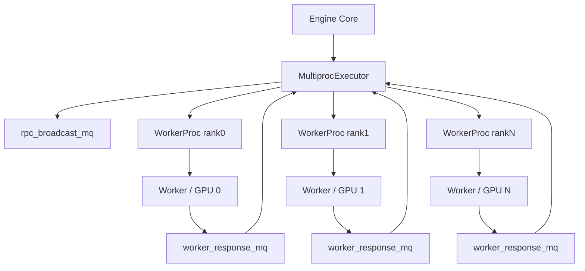
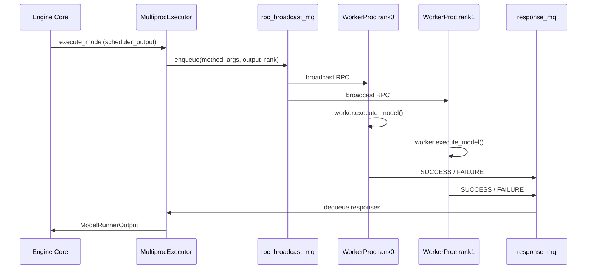

# 为什么 vLLM 要一张 GPU 对应一个 Worker 进程

## 这篇要回答什么问题

上一篇我们把 `Sampler` 讲成了输出语义的边界：模型前向产出的 logits，不会直接原样变成用户看到的 token，而是要经过一整套采样与输出处理流程。

但如果你继续沿着执行链路往回看，很快又会碰到另一个更底层的问题：

> 这些前向、采样、KV Cache 分配、pipeline 收发、distributed 初始化，到底是谁在真正执行？为什么 vLLM 不把它们都塞进 Engine Core 所在进程里，而是坚持把执行层拆成“一张 GPU 一个 Worker 进程”？

很多人第一次看到 V1 多进程架构时，容易把这件事理解成一个“工程实现偏好”：

- 多起几个进程，比较整齐
- 一卡一进程，比较符合分布式习惯

这些说法不能算错，但都不够解释源码里的真实设计动机。

从 `vllm/v1/executor/multiproc_executor.py`、`vllm/v1/worker/gpu_worker.py` 和 `docs/design/multiprocessing.md` 一起看，V1 在这里真正想解决的是三类问题：

1. 如何把控制面和执行面彻底拆开
2. 如何让每个 rank 对自己的设备、进程状态和 distributed 角色负责
3. 如何在 TP、PP、PCP、DP 这些并行维度叠起来时，仍然维持稳定的初始化、通信和故障处理

所以这篇文章真正要回答的问题是：

> “一张 GPU 一个 Worker 进程”在 vLLM 里究竟不是一句部署口号，而是怎样落到 world size、进程创建、ready 同步、消息队列、设备绑定和执行循环上的？

路线图里点名的四个问题，这篇都会覆盖：

1. `world_size` 与 TP、PP、PCP 的关系
2. worker 进程如何创建、就绪同步、建立消息队列
3. 为什么要把控制面和执行面拆开
4. 为什么 multiprocess 架构能更稳定地承载复杂并行模式

## 如果不了解这个模块，后面会在哪些地方读不下去

如果不先把 executor / worker 这一层想明白，后面读执行层代码时通常会卡在这些地方：

- 看到 `MultiprocExecutor` 里一上来就断言 `world_size == tp_size * pp_size * pcp_size`，却不知道这和“为什么是一卡一进程”有什么关系。
- 看到 `local_world_size` 个 worker 被逐个拉起，会误以为这只是简单的“多卡循环”，忽略每个 worker 实际上都是一个独立 rank。
- 看到 `WorkerProc` 同时维护 `ready_pipe`、`death_pipe`、`rpc_broadcast_mq`、`worker_response_mq`，会分不清哪个是启动握手、哪个是运行时 RPC、哪个是故障收尾。
- 看到 `gpu_worker.py` 里每个 worker 都自己 `set_device`、初始化 distributed、做内存 profiling、load model，会疑惑为什么这些事不能放在主进程统一做。
- 看到 pipeline parallel 场景下 `execute_model()` 有时返回 `IntermediateTensors`，有时只在某个 `output_rank` 返回真正结果，会觉得执行链路怎么这么绕。

这些困惑背后，其实都指向同一个事实：

**在 V1 里，Worker 不是“被动干活的线程”，而是带着独立 rank 身份、独立设备上下文和独立生命周期的执行进程。**

## 先给一张全景图

先用一句话概括这套架构：

> `Engine Core` 不直接驱动 GPU，而是通过 `MultiprocExecutor` 把 `SchedulerOutput` 广播给各个 worker 进程；每个 worker 进程再在自己的设备上下文里执行 distributed 初始化、模型加载、KV cache 分配和前向计算，最后把结果通过响应队列回传。

如果画成一张图，大致是这样：



这张图里最关键的不是“进程变多了”，而是职责边界变清楚了：

- `Engine Core` 负责调度决策
- `MultiprocExecutor` 负责把决策翻译成面向 worker 的集体 RPC
- `WorkerProc` 负责进程生命周期、握手、消息队列和 busy loop
- `Worker` 负责设备绑定、distributed 初始化、模型执行和 GPU 资源管理

也就是说，vLLM 在这里不是简单地把一堆函数塞到不同文件里，而是把“控制面”和“执行面”真正拆成了不同的进程角色。

## 第一层：`world_size` 为什么先于“一卡一进程”

很多人会把“一张 GPU 一个 Worker 进程”理解成起点，但从源码看，它更像结果。

真正的起点是并行运行时如何定义 rank 空间。

在 `MultiprocExecutor._init_executor()` 里，最先出现的核心断言是：

```python
self.world_size == tp_size * pp_size * pcp_size
```

这里的含义非常重要。

它说明在 V1 的执行层里，worker 并不是“按机器数”或者“按 API server 数”来组织的，而是按模型并行拓扑来组织的：

- TP 决定同一层张量如何拆
- PP 决定模型层如何分 stage
- PCP 决定 prefill context parallel 如何拆

因此 `world_size` 描述的不是“有多少进程差不多能跑”，而是：

**整个模型执行图被拆成了多少个必须各自占据 rank 身份的执行单元。**

一旦这样定义，后面的“每个 rank 用一个独立 worker 进程承载”就几乎是自然结果了。

### 1. 为什么这里先不是 DP

第一次看这段代码，很多人会疑惑：

- 为什么 `world_size` 只等于 TP × PP × PCP
- DP 去哪了

原因在于 V1 这里讨论的是单个 DP 组内部的执行拓扑。

从 `MultiprocExecutor` 的逻辑可以看出：

- 每个 DP 内部会有自己的 leader executor
- `node_rank_within_dp == 0` 的节点会负责建立广播和响应消息队列
- 跨 node 的 DP 协调则通过额外的组和 MQ handle 去接起来

这说明 DP 在这里更像“复制一套执行拓扑并横向扩展”，而不是改写单套拓扑内部 rank 语义。

所以这篇文章要讨论的“一卡一 worker”，更准确地说，是：

**每个参与 TP / PP / PCP 执行拓扑的 rank，都由一个独立 worker 进程承载。**

### 2. 为什么说它本质上是一套 rank-to-device 映射

继续看 `gpu_worker.py` 的 `init_device()`，每个 worker 都会：

- 根据自己的 `local_rank` 算出最终设备索引
- 执行 `torch.accelerator.set_device_index(self.device)`
- 再初始化 distributed 环境和 model parallel group

也就是说，一个 worker 进程从创建那一刻起，就不是“通用执行器”，而是：

**一个已经绑定到具体 rank、具体设备、具体并行角色的执行实体。**

这也是为什么“一个 GPU 一个 Worker 进程”比“一个进程管多张卡”更自然：

- rank 身份是离散的
- device 上下文是离散的
- distributed group 成员关系也是离散的

既然这些身份天然是按 rank 切开的，那么进程边界也按 rank 切开，就能让整个运行时语义保持一致。

## 第二层：为什么要把控制面和执行面拆开

理解这套架构，最关键的一步不是数进程，而是看清“谁做决策、谁执行决策”。

### 1. Engine Core 关心的是调度语义，不该背负设备细节

前几篇我们已经看到，Engine Core 负责的是：

- 请求生命周期
- 统一调度
- KV Cache 管理
- structured output 等横切控制逻辑

这些都是典型的控制面问题。

它真正关心的是：

- 这轮该调度哪些请求
- 每个请求安排多少 token
- 哪些请求要 preempt
- 哪些 grammar / connector / cache 状态需要推进

这些问题都不应该直接耦合到：

- CUDA 上下文
- NCCL 初始化
- 某张 GPU 当前可用显存
- pipeline 某个 stage 的收发张量

所以 V1 在这里做的第一件正确的事，就是：

**让 Engine Core 保持在“系统状态机”这一层，而不要直接下沉为“设备驱动器”。**

### 2. Worker 关心的是把一份调度结果变成具体设备动作

反过来，worker 这一层看到的则是完全不同的问题。

在 `gpu_worker.py` 里，它必须自己处理：

- 设备选择和 `set_device`
- distributed 初始化
- model runner 构造
- 模型加载
- 显存 profiling
- KV cache 初始化
- CUDA graph warmup
- pipeline 收发与 sampler 执行

这些都是强设备相关、强 rank 相关、强生命周期相关的问题。

因此 worker 最适合做的是：

**把上层已经做好的调度决策，翻译成当前 rank 在当前设备上的具体执行步骤。**

### 3. 这两层为什么不应该混在一个进程里

如果把控制面和执行面都放在同一个进程里，至少会立刻出现几个问题：

- 调度器必须直接理解各个设备上下文和分布式状态
- 一张卡出错时，更容易把整个控制逻辑一起拖死
- 初始化顺序会被 GPU / NCCL / 模型加载的副作用污染
- 多并行维度下，不同 rank 的执行角色很难保持边界清晰

而现在这种拆法的好处非常直接：

- 控制面只发“做什么”
- 执行面只负责“在本 rank 上怎么做”

这就是典型的控制面 / 数据面分离思想，只不过在 vLLM 里，数据面更准确地说是执行面。

## 第三层：worker 进程到底是怎么创建出来的

从 `MultiprocExecutor._init_executor()` 看，worker 的创建流程比“for 循环起进程”要完整得多。

### 1. 先确定本地要起多少个 worker

executor 会先拿到：

- `world_size`
- `local_world_size`
- 当前节点在 DP 内部的位置

然后按 `local_rank in range(self.local_world_size)` 循环创建 worker。

这一步说明一个很重要的事实：

**对当前节点来说，本地要拉起多少 worker，不是看 Python 线程池大小，而是看本机承载了多少个执行 rank。**

### 2. 每个 worker 在创建前就已经拿到 rank 身份

调用 `WorkerProc.make_worker_process(...)` 时，传进去的关键参数包括：

- `local_rank`
- `rank`
- `distributed_init_method`
- `is_driver_worker`

这意味着 worker 进程不是启动后再去“问自己是谁”，而是在创建时就已经被赋予：

- 本地设备编号
- 全局 rank
- 是否承担 driver worker 角色
- 应该接入哪一套 distributed init method

所以 worker 从一出生就带着并行拓扑里的明确位置。

### 3. 为什么还要有 `shared_worker_lock`

`MultiprocExecutor` 在创建 worker 前会准备一个共享锁，并把它传给每个 worker。

虽然具体使用会继续下沉到 worker 封装里，但这已经说明：

**worker 进程不是完全独立散养的，它们虽然各自负责一张卡，但某些初始化或临界区动作仍需要跨进程协调。**

这也再次说明“一卡一进程”不是等于“彼此完全无关”，而是：

- 设备和生命周期隔离
- 但仍在一套统一控制协议下协同工作

## 第四层：ready pipe、death pipe、message queue 分别在解决什么问题

如果说 executor / worker 架构里最值得仔细看的部分，那一定是握手和消息通道设计。

V1 这里不是只靠一种 IPC 机制解决所有问题，而是把不同语义拆给了不同通道。

### 1. `ready_pipe`：启动握手通道

在 `WorkerProc.make_worker_process()` 里，父进程会和子进程先建立一个单向 `ready_pipe`。

它的作用非常明确：

- worker 完成初始化、设备绑定、模型加载、MQ 建立后
- 通过 `ready_writer.send(...)` 告诉父进程自己已经 READY
- 同时把 response MQ 的 handle 一并发回去

也就是说，`ready_pipe` 不是运行时 RPC 通道，而是：

**启动阶段的一次性握手通道。**

这一步特别关键，因为 executor 只有拿到所有 worker 的 READY 信号后，才能继续进入真正的运行态。

### 2. `death_pipe`：父子生命周期联动

worker 创建时还会同时建立一对 `death_pipe`。

这里的语义刚好和 `ready_pipe` 相反：

- 父进程保持 `death_writer`
- 子进程持有 `death_reader`
- 一旦父进程异常退出，子进程读到 EOF，就知道该主动关闭队列并退出

这解决的是另一个非常实际的问题：

**不要让 worker 在主进程挂掉后继续拿着 GPU 资源和消息队列“孤儿化”存活。**

所以 `death_pipe` 是生命周期守卫，而不是业务通信通道。

### 3. `rpc_broadcast_mq`：控制面到执行面的广播通道

真正运行时的核心输入通道，是 `rpc_broadcast_mq`。

它负责把 executor 的集体 RPC 广播给 worker。

比如：

- `execute_model`
- `sample_tokens`
- `check_health`
- 以及其它需要所有 worker 一起执行的调用

这说明 executor 对 worker 的控制方式不是“逐个函数调用”，而是：

**把方法名 / 参数打包成一条广播消息，让所有相关 worker 在各自进程里同步执行。**

### 4. `worker_response_mq`：执行面到控制面的结果回传

对应地，每个 worker 还会准备自己的 response MQ。

worker 在 busy loop 里执行完方法后，会把结果封装成：

- `SUCCESS`
- 或 `FAILURE`

再写回响应队列。

于是整个调用链就闭环了：

- executor 广播一条集体 RPC
- 各个 worker 在本地执行
- 再把结果回传给 executor

这就是 V1 执行层真正的“控制面 <-> 执行面”消息协议。

## 第五层：为什么 worker 必须等“真的 ready”之后才能进入运行态

`MultiprocExecutor` 里有一条很容易被忽略、但非常说明问题的注释：

- workers 必须全部创建完，再统一 `wait_for_ready`
- 否则可能 deadlock，因为 `worker.init_device()` 里会做 device sync

这句话很有代表性。

它说明 worker 初始化不是一个轻量动作，而是：

- 会碰 GPU
- 会碰 distributed
- 会碰同步点
- 会碰 MQ handshake

因此 executor 不能把 worker 当成“起进程成功就等于 ready”。

相反，V1 明确把“进程已启动”和“执行环境已就绪”区分成两个阶段：

1. 进程对象已经创建
2. worker 真正完成设备与模型初始化，并把 MQ handle 发回来

这个区分特别关键，因为后面整个运行时都建立在这个假设上：

**只有 READY 之后，worker 才算是一个能参与集体 RPC 的有效 rank。**

## 第六层：为什么说一张 GPU 一个 Worker，核心是设备状态隔离

`gpu_worker.py` 最能说明这件事。

### 1. 每个 worker 都自己选择设备并设置上下文

在 `init_device()` 里，每个 worker 会：

- 根据自己的并行位置计算 `local_rank`
- 构造 `torch.device(f"cuda:{self.local_rank}")`
- 调用 `torch.accelerator.set_device_index(self.device)`

这一步的意义不是“告诉 PyTorch 用哪张卡”这么简单。

更准确地说，它在建立：

**这个进程今后的 CUDA 上下文、显存视角和 runtime 行为都绑定在这张设备上。**

如果多个 GPU 共享一个执行进程，这层边界就会立刻变模糊：

- 哪个 rank 在操作哪个上下文
- 哪些 allocator 状态属于哪张卡
- 哪些 profiling 结果属于哪张卡

而现在一进程一卡，这些问题天然都变简单了。

### 2. 每个 worker 都自己做显存 profiling 和 KV cache 规划

继续看 `gpu_worker.py`，worker 会在本进程里完成：

- `MemorySnapshot`
- `request_memory`
- `determine_available_memory()`
- `initialize_from_config()`

这些动作本质上都依赖“当前 GPU 的真实状态”。

如果把多张卡揉进同一个执行进程，这些资源判断就会混在一起。

而一旦每张卡有自己的 worker：

- profiling 结果天然是本卡的
- 可用 KV cache 空间天然是本卡的
- CUDA graph pool 也是本卡的

所以“一卡一进程”在这里首先带来的，不是优雅，而是：

**资源视角单一。**

### 3. 异步输出线程也必须继承正确设备语义

`WorkerProc.async_output_busy_loop()` 里有一段非常值得引用的注释：

- 线程不会继承主线程的 CUDA context
- 如果不显式设置 device，调用 CUDA runtime 可能隐式在 device 0 上建立新 context，额外占显存

因此 even 在 worker 进程内部，异步输出线程都还要再次绑定正确设备。

这段代码特别能说明为什么执行层对设备边界这么敏感：

**连“同一个进程里的另一个线程”都需要小心维护设备上下文，更不用说让一个进程跨多张 GPU 管理多套执行状态了。**

## 第七层：driver worker、output rank 和 pipeline stage 是怎么配合的

如果只看“一卡一进程”，容易以为所有 worker 角色完全一样。

但从代码看，worker 之间既平等，又不完全对称。

### 1. `is_driver_worker` 不是“额外一类 worker”，而是 rank 上的职责标记

`MultiprocExecutor._is_driver_worker()` 的判断是：

```python
rank % tensor_parallel_size == 0
```

这说明在每个 TP shard 组里，会有某个 worker 拿到额外的 driver 角色。

这里最重要的不是具体功能细节，而是设计思路：

**worker 仍然是统一的 worker，只是在同一套执行进程模型上，再叠加少量职责差异。**

所以 V1 没有为了“特殊 worker”再发明另一套进程类型，而是在统一 worker 模型上用 rank 语义表达差异。

### 2. 为什么 `output_rank` 只取最后一个 PP stage 的某个 TP rank

`MultiprocExecutor._get_output_rank()` 里有一条很关键的说明：

- 最终只从 TP rank = 0 且 PP 最后一段的 worker 返回 `ModelRunnerOutput`

这背后的逻辑非常清晰。

在 PP 场景下：

- 前面的 stage 只负责产生中间张量
- 只有最后一个 stage 才真正拿到最终输出

同时在 TP 内部：

- 没必要让所有 TP rank 都把一份等价结果回传给 executor

于是 executor 只等一个 `unique_reply_rank` 的结果即可。

这一步特别能说明多进程架构的一个好处：

**“谁负责回传最终结果”可以用 rank 级协议精确表达，而不是靠主进程去猜测哪张卡现在持有正确输出。**

### 3. pipeline 收发为什么更适合放在 worker 进程里

`gpu_worker.py` 的 `execute_model()` 里可以看到：

- 非首个 PP rank 会先 `irecv_tensor_dict(...)`
- 非最后一个 PP rank 执行后会 `isend_tensor_dict(...)`
- 只有最后 stage 才返回真正输出

这本质上是 stage-to-stage 的设备级数据流。

把这件事放在 worker 进程里非常自然，因为：

- 当前 worker 已经知道自己是不是 PP first / last
- 当前 worker 已经持有正确设备上下文
- 当前 worker 已经在 distributed group 中

如果要让主进程统一调度这些 stage 间收发，复杂度会急剧上升。

## 第八层：multiprocess 架构为什么更能承载复杂并行模式

这其实是整篇文章最重要的结论。

### 1. 并行模式一多，执行角色就天然分裂

只要并行维度增加，worker 之间的角色差异就会越来越明显：

- TP rank 要参与张量切分与 all-reduce
- PP rank 要参与 stage 间收发
- PCP / DCP 会影响上下文拆分方式
- DP leader / follower 又会影响消息通道组织

如果这些角色都塞进同一个执行进程，最终会变成：

- 一个进程里维护很多 rank 身份
- 很多设备上下文
- 很多生命周期不同的通信对象

这几乎注定会让状态管理变得脆弱。

而 multiprocess 的好处是：

- 每个 worker 只对一个 rank 负责
- 每个 worker 只维护自己的设备与通信状态
- 复杂并行只是“worker 数量和 rank 拓扑增加”，而不是“单进程内部状态爆炸”

### 2. 故障检测和收尾也更清楚

`MultiprocExecutor.start_worker_monitor()` 会监控所有 worker sentinel。

一旦某个 worker 意外死亡：

- executor 记录失败
- 触发 shutdown
- 调 failure callback 通知上层

这套逻辑在多进程架构里非常自然，因为：

- worker 的生死是 OS 级进程事实
- executor 不必猜测某个线程是不是“卡死但还活着”

再加上 `death_pipe` 和显式 shutdown 流程，整个收尾语义也更明确：

- 父进程先关闭 death_writer 请求退出
- 等待优雅结束
- 不行再 `terminate`
- 再不行就 `kill`

这说明 multiprocess 在这里不仅是性能或组织问题，也是：

**可观测、可回收、可失败处理的问题。**

### 3. 这也解释了为什么文档专门讨论 multiprocessing start method

`docs/design/multiprocessing.md` 重点讨论了 `fork`、`spawn`、`forkserver` 的兼容性权衡。

这篇文档的存在本身就说明：

**vLLM 不是把 multiprocessing 当成一个实现细节，而是把它视为执行层架构的一部分。**

之所以要这么认真对待，是因为一旦 worker 进程成了执行层基本单元：

- 如何启动它们
- 如何避免 CUDA 已初始化后的 `fork` 问题
- 如何兼顾 CLI 模式与 library 模式

都会直接影响整个执行层是否可靠。

换句话说，“一张 GPU 一个 Worker 进程”并不是说完这句话就结束了，它后面还连着整套多进程兼容性工程。

## 一张 executor 与 worker 的消息流图

这篇最适合记住的，就是下面这张图：



这张图最值得记住的一点是：

**Executor 并不直接“调用 GPU”，它是在维护一套集体 RPC 协议；真正碰设备、碰 distributed、碰模型执行的是 worker。**

## 第九层：再按一次请求生命周期回到全局

现在可以把这篇文章的重点，再按一次请求生命周期串起来。

### 第 1 步：Engine Core 做出调度决策

到这一步为止，系统决定的是：

- 这轮哪些请求应该推进
- 每个请求推进多少 token

但这仍然只是控制面语义。

### 第 2 步：Executor 把调度结果广播给 worker

`MultiprocExecutor.collective_rpc()` 会把：

- 方法名
- 参数
- 需要回传结果的 rank

打包进 `rpc_broadcast_mq`。

### 第 3 步：每个 worker 在自己的设备上下文里执行

worker 在自己的进程里：

- 已经绑定好 device
- 已经在 distributed group 中
- 已经加载好模型

于是它可以直接把这轮调度结果翻译成：

- 前向执行
- pipeline 收发
- sampler 调用
- 或其它执行动作

### 第 4 步：需要回传结果的 worker 把输出写回 response MQ

如果这轮调用要求唯一返回 rank，就只等那个 rank 的结果。

这一步把“多 worker 并行执行”重新收敛成上层可消费的一份结果。

### 第 5 步：executor 再把结果交还给 Engine Core

于是控制面继续推进请求状态，开始下一轮调度。

这条链路最想说明的是：

**Worker 不是 Engine Core 的实现细节，而是控制面和 GPU 执行之间的正式边界。**

## 这篇文章之后，最值得继续读什么

如果你已经接受了“一个 GPU 对应一个 worker 进程”这个判断，下一步最值得继续读的是：

1. `vllm/v1/worker/gpu_model_runner.py`
2. `vllm/distributed/parallel_state.py`
3. `vllm/config/parallel.py`
4. `docs/design/arch_overview.md`

按这个顺序读，会非常顺：

- 先看 worker 进程里真正跑模型的最大文件
- 再看各种并行 group 是怎样抽象出来的
- 再看并行配置如何贯穿全局
- 最后回到架构总览，把控制面、执行面和并行运行时拼回一张图

如果沿博客主线继续往后写，那么下一篇最自然就是：

**《真正跑模型的地方：GPUModelRunner 应该怎么读》**

因为这篇回答的是：

**“为什么执行层要拆成一个个 worker 进程。”**

而下一篇要回答的是：

**“进入某个 worker 之后，真正复杂的模型执行逻辑到底应该从哪里开始读。”**

## 一句话总结

不要把“一张 GPU 对应一个 Worker 进程”理解成一句部署习惯，或者一个为了多卡而做的粗粒度工程约定。

更准确地说，它在回答的是这样一个问题：

> 当执行层必须同时承载 rank 身份、设备上下文、distributed 初始化、显存 profiling、KV cache 分配、pipeline stage 收发、异步输出和故障监控时，怎样划分运行时边界，才能让控制逻辑和设备执行都保持清晰、稳定且可扩展？

V1 给出的答案是：

- 用 `world_size = TP × PP × PCP` 先定义执行拓扑
- 让每个执行 rank 由一个独立 worker 进程承载
- 用 `MultiprocExecutor` 维护控制面到执行面的集体 RPC
- 用 `ready_pipe`、`death_pipe`、message queue 组织启动、运行与退出
- 让每个 worker 在自己的设备上下文里完成 distributed、模型和执行资源初始化

所以 vLLM 真正做的，并不是“多起几个进程来跑 GPU”。

它真正做的是：

**把复杂并行运行时拆成一组边界清晰、角色明确、故障可控的执行进程，而“一张 GPU 一个 Worker”正是这套设计最自然的外在形态。**
