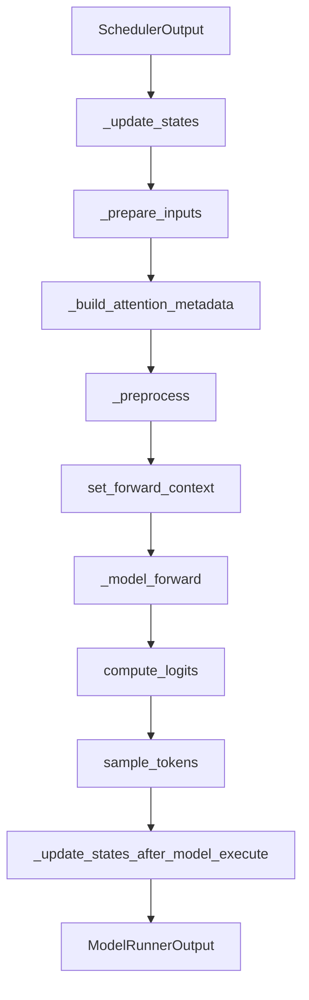
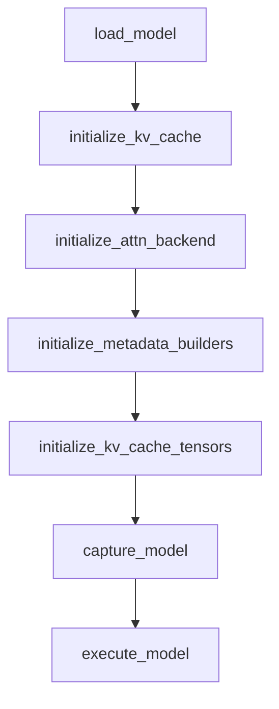
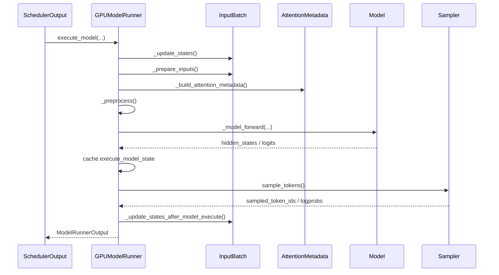

# 真正跑模型的地方：GPUModelRunner 应该怎么读

## 这篇要回答什么问题

上一篇我们停在了 `Worker` 这一层，回答的是：

> 为什么 vLLM 要坚持“一张 GPU 对应一个 Worker 进程”？

但如果你继续沿着执行层往下走，很快就会撞到一个更现实的问题：

> 真正进入某个 worker 之后，到底是谁在准备输入、组织 attention metadata、选择 attention backend、处理多模态输入、调度 CUDA graph、执行模型前向、再把 logits 交给采样器？

答案基本都会指向一个大文件：

- `vllm/v1/worker/gpu_model_runner.py`

这也是很多人第一次认真读 vLLM 执行层时最容易卡住的地方。原因很简单：

- 它非常大
- 它不是一个“单纯的 forward 封装”
- 它把 attention backend、LoRA、多模态、spec decode、pipeline parallel、CUDA graph、KV cache 这些能力都汇合在了一起

所以如果你按“从上到下顺着读”去啃，通常读到三分之一就会失去方向。

这篇文章真正想回答的，不是“这个文件里每一行都在干什么”，而是：

1. `GPUModelRunner` 在 V1 里究竟扮演什么角色
2. 为什么这么多性能和功能特性都在这里汇合
3. 面对这样一个超大执行层文件，应该按什么顺序建立阅读地图
4. 哪些逻辑值得精读，哪些逻辑只需要先建立索引

路线图里点名的三个问题，这篇都会覆盖：

1. 为什么 `ModelRunner` 是多个性能特性的汇合点
2. attention backend、LoRA、多模态、sampling、CUDA graph 为何都在这里汇合
3. 哪些逻辑值得单独拆读，哪些逻辑只需建立索引

## 如果不了解这个模块，后面会在哪些地方读不下去

如果不先把 `GPUModelRunner` 想明白，后面继续读执行层时，通常会卡在这些地方：

- 看到 `__init__()` 里一口气初始化 `Sampler`、`InputBatch`、`CudagraphDispatcher`、多模态预算、LoRA / spec decode 相关状态，会分不清哪些是“常驻运行时状态”，哪些只是某个特性的局部实现。
- 看到 `execute_model()` 之前要先 `_update_states()`、`_prepare_inputs()`、`_build_attention_metadata()`、`_preprocess()`，会误以为这些都是零散的辅助函数，意识不到它们其实共同组成了“本轮 batch 发车前的准备链”。
- 看到 `sample_tokens()` 不直接连在 `execute_model()` 后面，而是通过 `execute_model_state` 共享临时状态，会疑惑为什么前向和采样要拆成两个阶段。
- 看到 `initialize_attn_backend()`、`_check_and_update_cudagraph_mode()`、`capture_model()`、`initialize_kv_cache()` 等初始化函数散落在文件后半段，会不知道哪些属于“启动期阅读”，哪些属于“单步执行期阅读”。
- 看到多模态、LoRA、spec decode、pipeline parallel 都各自插进主链路，会误以为 `GPUModelRunner` 是把各种 feature 胡乱堆在一起。

这些困惑背后，其实都指向同一个事实：

**`GPUModelRunner` 不是“模型 forward 的 Python 包装器”，而是 worker 进程里的执行层编排器。**

它做的不是替模型多包一层函数，而是把这一轮 batch 从“调度结果”翻译成：

- 输入张量
- 位置与 slot 映射
- attention metadata
- 前向上下文
- KV cache 访问方式
- 采样与输出结果

所以读这个文件时，第一步不是问“这是不是 forward”，而是问：

**这一轮 batch 在 GPU 上真正跑起来之前，需要哪些局部运行时状态被准备好？**

## 先给一张全景图

先用一句话概括：

> `SchedulerOutput` 进入 worker 之后，不会立刻喂给模型；它先被 `GPUModelRunner` 更新为本地请求状态，再被整理成 `InputBatch`、attention metadata、位置和 slot 映射，随后带着合适的 CUDA graph 模式与前向上下文进入模型执行，最后再进入采样、记账和结果回传。

如果画成一张图，大致是这样：

但这张图还缺了另外一半，也就是“启动期”：

这两张图合起来，才是 `GPUModelRunner` 真正的阅读方式：

- 启动期负责把执行环境搭起来
- 运行期负责把每一轮 batch 发出去

所以这篇文章也会按这两条线来讲。

## 第一层：先把它看成“执行层编排器”，不要看成单个 forward 文件

第一次读 `gpu_model_runner.py`，最重要的认知切换是：

**它的中心对象不是“模型”，而是“这张 GPU 上持续运转的执行状态”。**

这件事从 `__init__()` 就能看出来。

### 1. `__init__()` 的重点不是参数，而是常驻状态

从 `__init__()` 的结构看，它并不是在简单存一些 config。

它在这里同时建立了几类常驻状态：

- 模型与并行相关配置：`model_config`、`cache_config`、`parallel_config`、`scheduler_config`
- 执行期公共组件：`Sampler`、`InputBatch`、`CudagraphDispatcher`
- 持久化 GPU / CPU buffer：`input_ids`、`positions`、`query_start_loc`、`seq_lens`、`inputs_embeds`
- 多模态、LoRA、spec decode、Mamba、encoder cache 等特性状态
- 异步调度与异步拷贝用到的 stream / event

这说明 `GPUModelRunner` 的运行方式并不是：

- 每次来一个 batch，临时拼一堆张量
- 执行完就全部扔掉

而是：

- 大部分大张量和运行时状态常驻
- 每一轮只在这些持久 buffer 上覆盖写入
- 再结合 batch 的局部信息完成本轮执行

这也是为什么这个文件会显得“又大又杂”。

因为它天然要承担两类职责：

1. 管理这张 GPU 上长期存在的执行资源
2. 在每一步上把这些资源重新组织成当前 batch 的具体执行形态

### 2. 它汇合的不只是 feature，还有“长期状态”

为什么 attention backend、LoRA、多模态、sampling、CUDA graph 都会在这里汇合？

因为这些能力都不是“调用模型之后补一下”的后处理，而是会直接影响：

- 输入张量长什么样
- 这轮 batch 的 padded shape 是多少
- attention metadata 怎么构造
- 哪些 wrapper 会接管 forward
- 这一轮能不能走 FULL / PIECEWISE / eager
- 这轮采样之前需要哪些额外状态

只要一个能力会改写这些执行前提，它最终就会汇合到 `GPUModelRunner`。

所以这不是代码组织偶然变大，而是架构上必然会变成汇合点。

## 第二层：先分清“启动期逻辑”和“单步执行逻辑”

读这个文件最容易乱，是因为它把启动期和运行期都放在了一起。

我建议先粗分成两大块：

### 1. 启动期要读什么

启动期主要回答：

- 模型怎么加载
- KV cache 怎么初始化
- attention backend 怎么选择
- metadata builder 怎么建
- CUDA graph 怎么捕获

对应入口主要是：

- `load_model()`
- `initialize_kv_cache()`
- `initialize_attn_backend()`
- `initialize_metadata_builders()`
- `initialize_kv_cache_tensors()`
- `capture_model()`

### 2. 单步执行期要读什么

运行期主要回答：

- 一轮 `SchedulerOutput` 进来后，本地状态怎么更新
- 输入张量怎么准备
- attention metadata 怎么建
- 前向怎么执行
- 采样和 bookkeeping 怎么做

对应入口主要是：

- `execute_model()`
- `_prepare_inputs()`
- `_build_attention_metadata()`
- `_preprocess()`
- `_model_forward()`
- `sample_tokens()`

如果你先不做这个切分，而是一口气从头读到底，很容易在“为什么这里突然初始化 backend”“为什么这里又开始做采样”之间来回跳。

## 第三层：真正的主链路，其实只要先抓住 6 个函数

面对这样的大文件，我最推荐的第一轮阅读方式是：

**只抓 6 个函数，先把主链路跑通，再回头补横切能力。**

这 6 个函数是：

1. `execute_model()`
2. `_prepare_inputs()`
3. `_build_attention_metadata()`
4. `_preprocess()`
5. `_model_forward()`
6. `sample_tokens()`

### 1. `execute_model()` 是全文件最重要的路标

如果只能先读一个函数，那一定是 `execute_model()`。

因为它最完整地暴露了这轮执行的阶段划分：

- 更新本地请求状态
- 准备输入与 logits 索引
- 计算 cascade attention 前缀长度
- 决定 cudagraph 模式和 padding 形态
- 构造 slot mapping 与 attention metadata
- 做前向前预处理
- 带着 `ForwardContext` 进入模型
- 产出 hidden states / logits
- 暂存执行结果，等待 `sample_tokens()`

它的价值不是“代码最短”，而是：

**你能从这里看到 `GPUModelRunner` 怎么把调度器给的抽象计划，翻译成一次真实的设备执行。**

### 2. `_prepare_inputs()` 是理解“本轮 batch 形状”最关键的函数

很多人会以为输入准备只是把 token ids 搬到 GPU。

其实 `_prepare_inputs()` 做的事情远比这个复杂：

- 根据 `num_scheduled_tokens` 展开 request 维度到 token 维度
- 计算本轮位置 `positions`
- 准备 `input_ids` / `inputs_embeds`
- 构造 `query_start_loc`
- 更新 `num_computed_tokens`
- 生成 `logits_indices`
- 处理 spec decode 相关的 draft token 元数据
- 在需要时激活当前 batch 的 LoRA

换句话说，它真正做的是：

**把“按请求描述的调度结果”重排成“按 token 连续布局的执行输入”。**

这一步读明白后，后面很多 attention metadata 和采样逻辑都会顺很多。

### 3. `_build_attention_metadata()` 是 attention backend 的接缝处

这一段是很多人第一次读执行层时最容易头大的地方。

但它的重要性非常高，因为它正好处在：

- 上游的 batch 组织
- 下游的实际 attention backend

之间。

它做的核心事，是把公共执行信息整理成 `CommonAttentionMetadata`，再按不同 KV cache group 和 attention group 交给对应的 metadata builder。

这里最值得记住的不是所有细节，而是它的分层方式：

- 先准备一份跨 backend 通用的 `CommonAttentionMetadata`
- 再按 group / builder 生成具体 backend 所需 metadata
- 让同组 layer 共享 metadata，避免重复构造

这说明 `GPUModelRunner` 不是直接写死某个 attention 内核，而是在这里建立了一个“执行前描述层”。

也正因为如此，attention backend 的多样性最终都会在这里汇合。

### 4. `_preprocess()` 是进入模型前的最后一道装配线

如果说 `_prepare_inputs()` 更像“把 batch 排好”，那么 `_preprocess()` 更像“把模型真正要吃的输入拼好”。

它主要处理这些事：

- 文本模型直接走 `input_ids`
- prompt embeds 场景补齐 `inputs_embeds`
- 多模态模型执行 encoder 并收集 multimodal embeddings
- pipeline 非首 rank 时同步和聚合 `intermediate_tensors`
- encoder-decoder 模型补 `encoder_outputs`

这一步最想说明的是：

**模型前向看到的输入，并不是 scheduler 直接给出来的，而是 `GPUModelRunner` 在当前 rank 上重新装配后的结果。**

### 5. `_model_forward()` 很简单，但恰恰说明主次关系

`_model_forward()` 本身反而很短，它基本只是把准备好的输入交给 `self.model(...)`。

这段代码短，反而很有启发性。

它说明在 V1 执行层里，复杂度并不主要来自“怎么调用模型 forward”，而主要来自：

- forward 之前怎么把批次形态准备正确
- forward 时怎么放进正确的上下文
- forward 之后怎么接采样和状态推进

所以读 `gpu_model_runner.py` 不要把注意力过度集中在 `_model_forward()` 这一行，而要集中在它的前后。

### 6. `sample_tokens()` 说明“模型执行”和“输出语义”是两阶段

`execute_model()` 并不总是直接返回 `ModelRunnerOutput`。

在生成模型场景里，它经常先把这一步的临时执行状态塞进 `execute_model_state`，然后由 `sample_tokens()` 接着做：

- 应用 grammar bitmask
- 调用 sampler / rejection sampler
- 更新请求状态
- 处理 speculative decoding 的 drafter
- 组织最终输出

这个拆分很值得注意。

它说明在 V1 里：

- 前向负责产出 hidden states / logits
- 采样负责定义用户最终看到的 token 语义

所以 `GPUModelRunner` 其实也把“执行层”和“输出语义层”的边界接起来了。

## 第四层：把执行前准备链看成一个完整流水线

很多人读这部分源码会觉得函数很多，其实可以把它们想成一条严格串联的流水线。

### 第 1 步：`_update_states()` 先把调度器输出变成本地批次状态

这一层的核心对象不是模型，而是：

- `requests`
- `CachedRequestState`
- `InputBatch`

调度器给到 worker 的只是：

- 哪些请求在这一轮被调度
- 每个请求推进多少 token
- 哪些请求新进来、哪些请求被移除

而 `GPUModelRunner` 需要把这些信息变成自己本地可持续维护的状态。

这也是为什么理解 `InputBatch` 很重要。

`InputBatch` 不是普通容器，它是执行层把“多请求状态”压缩成一组连续 CPU / GPU buffer 的核心数据结构。

可以把它近似理解成：

**执行层自己的 batch 内存布局。**

### 第 2 步：`_prepare_inputs()` 把请求视角压扁成 token 视角

调度器说的是“请求 A 这轮跑 2 个 token，请求 B 跑 5 个 token”。

但 GPU 前向真正需要的是：

- 扁平化后的 token 序列
- 每个 token 属于哪个 request
- 每个 token 的 position
- 该从哪里取 logits

所以 `_prepare_inputs()` 做了两类转换：

1. 逻辑转换
   把 request 级调度结果变成 token 级布局
2. 存储转换
   把这些布局写入常驻 buffer，供后续 metadata 与前向使用

很多执行层细节都能在这里找到来源，比如：

- `req_indices`
- `query_start_loc`
- `seq_lens`
- `positions`
- `logits_indices`

### 第 3 步：`_build_attention_metadata()` 把“batch 事实”翻译成“backend 可消费描述”

到这一步，runner 已经知道：

- 这轮总共有多少 token
- 每个请求的 query 长度
- 当前位置和已有上下文长度
- block table 和 slot mapping 是什么

但 attention backend 还需要一层更正式的描述对象。

所以这里会把这些信息装配为：

- `CommonAttentionMetadata`
- 各个 builder 输出的具体 `AttentionMetadata`

这一步之所以复杂，是因为它必须同时兼容：

- 不同 KV cache group
- 不同 attention backend
- DCP / PCP / sequence parallelism
- cascade attention
- spec decode
- encoder-only / cross-attention 等特殊 KV cache spec

所以这里不是“实现细节太多”，而是这里天生就是 attention 适配层。

### 第 4 步：`_preprocess()` 把模型真正要吃的输入补齐

这一步开始更接近模型接口了。

它会根据模型类型决定：

- 输入是 `input_ids` 还是 `inputs_embeds`
- 是否要先跑多模态 encoder
- 是否要合并 multimodal embeddings
- 是否要准备 `encoder_outputs`
- pipeline 非首 rank 如何拿到上一 stage 的中间张量

这也是为什么你会觉得多模态逻辑“怎么也跑到这里来了”。

因为多模态不是 HTTP 层的字段解析问题，而是：

**真正会改写模型输入张量形态的问题。**

### 第 5 步：`set_forward_context(...)` 再把执行期环境一起压进去

真正调用模型之前，`execute_model()` 还会做一件特别关键的事：

- 用 `set_forward_context(...)` 把 attn metadata、slot mapping、batch descriptor、cudagraph runtime mode 等上下文压到当前前向里

这一步非常重要，因为它说明：

**模型 forward 并不是只靠函数参数获得全部信息的。**

很多运行时控制面信息，是通过 forward context 注入的。

这也是 vLLM 执行层为什么能做到：

- Python 入口看起来比较统一
- 真正执行时又能带着丰富的 runtime 语义

## 第五层：为什么这么多横切能力都在这里汇合

路线图里有个很好的问题：

> attention backend、LoRA、多模态、sampling、CUDA graph 为何都在这里汇合？

从执行层视角看，答案其实很统一：

**因为这些能力都会改写“这一轮 batch 应该怎么执行”。**

下面分别看。

### 1. attention backend 在这里汇合，因为它决定 metadata 和 KV cache 访问语义

`initialize_attn_backend()` 和 `initialize_metadata_builders()` 非常值得单独看。

它们做的不是“挑一个 attention 实现”这么简单，而是：

- 按 KV cache group 找到每层实际使用的 backend
- 按 backend + KV cache spec + `num_heads_q` 做分组
- 为每组创建 `AttentionGroup`
- 再为每组创建对应的 metadata builder

这说明 attention backend 在 V1 里不是一个全局单例开关，而是：

**执行层里按 layer / group 精细组织的能力。**

因此 `GPUModelRunner` 必须成为它的汇合点，因为最终只有 runner 同时知道：

- 当前模型有哪些 layer
- 这些 layer 落在哪些 KV cache group
- 这轮 batch 的布局与元数据

### 2. LoRA 在这里汇合，因为它会改写本轮活跃参数视图

很多人容易把 LoRA 理解成“请求来了再切一下 adapter”。

但从 runner 视角看，它影响的是：

- 当前 batch 哪些请求带 LoRA
- 这轮有哪些 LoRA 需要激活
- cudagraph dispatch key 是否需要包含 LoRA 状态

你会在 `_prepare_inputs()` 和 `_determine_batch_execution_and_padding()` 里看到 LoRA 的影子：

- `set_active_loras(...)`
- `has_lora`
- `num_active_loras`

这说明 LoRA 不是一个和执行链路平行的小插件，而是：

**直接影响 batch 形态和执行模式选择的运行时变量。**

### 3. 多模态在这里汇合，因为它会改写输入张量本身

多模态逻辑主要体现在：

- `_execute_mm_encoder()`
- `_gather_mm_embeddings()`
- `_prepare_mm_inputs()`
- `_preprocess()`

它们共同解决的是：

- 哪些请求要先跑 multimodal encoder
- encoder 输出怎么缓存
- multimodal embeddings 怎么与 token embeddings 混排
- 多模态输入如何影响最终前向参数

所以多模态也不是“另开一条支线”。

从 runner 看，它其实是：

**在进入模型前，把一部分 token 输入替换成或补充为 embedding 输入。**

只要是这种改写输入形态的能力，最终都不可能绕开 `GPUModelRunner`。

### 4. sampling 在这里汇合，因为前向之后还要定义输出语义

`GPUModelRunner` 不止负责跑模型，还负责把模型输出转成下一轮调度能消费、API 层能返回的结果。

所以你会看到：

- `Sampler`
- `RejectionSampler`
- `sample_tokens()`
- `_bookkeeping_sync()`
- speculative decoding 的 drafter 逻辑

这些都在 runner 里。

原因也很自然：

- logits 是本 rank 上算出来的
- hidden states 也是本 rank 上拿到的
- speculative decode 的额外执行也紧挨着这一步

因此输出语义的定义，天然应该发生在执行层边界附近。

### 5. CUDA graph 在这里汇合，因为只有 runner 同时知道 batch shape 和执行模式

CUDA graph 相关逻辑主要体现在：

- `CudagraphDispatcher`
- `_determine_batch_execution_and_padding()`
- `_check_and_update_cudagraph_mode()`
- `capture_model()`
- `_warmup_and_capture()`

这里最值得把握的一点是：

**CUDA graph 在 vLLM V1 里不是“包住整个模型就行”，而是运行期按 batch 特征动态决策的。**

而这些 batch 特征恰恰只有 runner 最清楚：

- 这轮有多少 token
- 是否 uniform decode
- 是否带 LoRA
- attention backend 支持哪种 graph 模式
- 是否需要 padding / ubatching

所以 cudagraph dispatch 理所当然只能在 `GPUModelRunner` 这里做。

## 第六层：启动期最值得读的 4 个入口

如果你想从“这个文件怎么把执行环境搭起来”入手，我推荐按下面顺序读。

### 1. `load_model()`：先看模型是如何被包起来的

`load_model()` 不只是加载权重。

它还会顺手处理：

- LoRA 模型包装
- drafter 加载
- MoE / EPLB 相关初始化
- communication buffer 准备
- CUDAGraphWrapper / BreakableCUDAGraphWrapper / UBatchWrapper 包装

所以这一步最重要的认知是：

**runner 手里的 `self.model` 往往已经不是“裸模型”，而是被执行层 wrapper 包起来的运行时对象。**

这对后面理解 `get_model()` 也很关键。

### 2. `initialize_kv_cache()`：看执行层真正依赖的基础设施是怎么接起来的

这个函数很值得读，因为它把很多后续步骤串起来了：

- 补 encoder-only layer / KV sharing layer
- 初始化 attention backend
- 准备 kernel block sizes
- 创建 metadata builders
- 视 block size 情况重建 `InputBatch`
- 初始化并绑定 KV cache tensor

也就是说，`initialize_kv_cache()` 的真正价值不是“分配缓存”，而是：

**把模型层、attention backend、KV cache 布局、InputBatch 布局重新校准成一套可执行运行时。**

### 3. `initialize_attn_backend()`：看 attention backend 是如何被组织成 group 的

这里最值得读的是两个点：

- 为什么要按 backend + KV cache spec + `num_heads_q` 做去重分组
- 为什么在真正创建 metadata builder 之前，就要先解析 cudagraph mode

这说明 attention backend 的选择和 cudagraph 能力不是两条独立支线，而是同一套执行约束的一部分。

### 4. `capture_model()`：看 cudagraph 是怎么被 runner 主动驱动的

很多人会把 CUDA graph 想成“模型自己捕获一下”。

但从这里可以看到，真正主导 capture 的是 runner：

- 它从 dispatcher 取出待捕获的 batch descriptor
- 先 warmup
- 再按 FULL / PIECEWISE 等模式触发 dummy run
- 最后锁 workspace，固定后续运行时行为

这再次说明：

**性能特性并不是附着在模型上的魔法，而是执行层主动组织出来的运行模式。**

## 第七层：运行期最值得精读的 3 个深水区

如果主链路已经看通，下一步最值得精读的其实不是所有 feature，而是下面三个“深水区”。

### 1. `InputBatch` 及其相关状态更新

很多人读 `GPUModelRunner` 会一直觉得“变量怎么这么多”。

原因往往不是 runner 本身，而是没有先理解：

- `CachedRequestState`
- `InputBatch`
- block table / slot mapping

这几个结构。

如果这层没看懂，后面看到：

- `req_indices`
- `prev_positions`
- `num_computed_tokens`
- `token_ids_cpu`
- `block_table`

就会一直像在看局部数组操作。

但一旦你知道 `InputBatch` 是执行层的批次内存布局，这些操作就会突然变得很顺。

### 2. `_build_attention_metadata()` 及 builder 体系

这是理解 attention backend 接入方式的关键。

建议不要一开始试图穷举所有 builder 细节，而是先抓住三个问题：

1. 哪些信息是跨 backend 通用的
2. 哪些信息是 builder 特定的
3. 为什么要按 KV cache group / attention group 分层

只要这三个问题想明白，后面你再去钻 FlashAttention、FlashInfer、Mamba 或 MLA 的 builder，就不会迷路。

### 3. `_determine_batch_execution_and_padding()` 与 cudagraph dispatch

这部分特别值得精读，因为它正好体现了 V1 的“执行模式选择”思想。

它在决定的不是一个小优化，而是：

- 这轮是不是 uniform decode
- 是否允许 FULL graph
- 是否要因为 encoder 输出、cascade attention、LoRA 等条件降级
- DP 下是否要重新协调 padding
- 是否需要 ubatching

也就是说，这里在做的，是：

**根据当前 batch 的真实形态，为这一轮选择最合适的执行制度。**

这正是 V1 执行层最有价值的部分之一。

## 第八层：哪些逻辑要精读，哪些逻辑先建立索引就够了

面对这么大的文件，不可能第一轮就把每个分支读透。

更实际的策略是分层处理。

### 第一优先级：必须精读

下面这些，我建议第一轮就精读：

- `execute_model()`
- `sample_tokens()`
- `_prepare_inputs()`
- `_build_attention_metadata()`
- `_preprocess()`
- `_determine_batch_execution_and_padding()`
- `initialize_kv_cache()`
- `initialize_attn_backend()`

因为这些函数决定了 runner 的主形状。

### 第二优先级：理解接口和职责，先不穷举细节

下面这些函数值得建立索引，但不必第一轮穷举：

- `_execute_mm_encoder()`
- `_gather_mm_embeddings()`
- `_calc_spec_decode_metadata()`
- `propose_draft_token_ids()`
- `_dummy_run()`
- `_capture_cudagraphs()`
- `initialize_kv_cache_tensors()`

原因不是它们不重要，而是它们更适合在你已经知道主链路之后，再按专题深入。

### 第三优先级：先知道“它们在这”，后面按专题回来看

还有一些逻辑，我建议第一轮只建立存在感：

- M-RoPE / XD-RoPE
- Mamba 相关路径
- encoder cudagraph manager
- routed experts capturer
- EPLB
- reload weights / sparse patch

这些分支都很有价值，但它们更适合按单独主题再拆出去读。

如果一开始就全部展开，你会失去“runner 主链路”的轮廓。

## 一份更实用的 GPUModelRunner 阅读地图

如果你准备真的打开源码，我推荐按下面顺序读：

1. 先读 `execute_model()`，只看它调用了哪些函数，不深究细节。
2. 回头读 `sample_tokens()`，理解为什么前向和采样分成两段。
3. 再读 `_prepare_inputs()`，搞清楚 request 级调度如何变成 token 级布局。
4. 再读 `_build_attention_metadata()`，建立 attention metadata 的分层认知。
5. 再读 `_preprocess()`，理解多模态、pipeline、encoder-decoder 怎么插进主链路。
6. 回去读 `__init__()`，这时你会知道那些 buffer 和状态到底是给谁准备的。
7. 再读 `load_model()`、`initialize_kv_cache()`、`initialize_attn_backend()`，补齐启动期视角。
8. 最后读 `capture_model()` 和 `_check_and_update_cudagraph_mode()`，把性能路径补完整。

这个顺序的核心思想是：

**先抓“每一步在干什么”，再补“为什么系统一开始要这样初始化”。**

而不是反过来。

## 一张“执行前准备张量，执行后收集结果”的流程图

这篇最适合记住的，是下面这张图：

这张图里最重要的一点是：

**模型前向只是中间一步，`GPUModelRunner` 真正负责的是前向前后的整段执行编排。**

## 再按一次请求生命周期回到全局

现在可以把这篇文章的重点，再按一次请求生命周期串起来。

### 第 1 步：Engine Core 决定这轮谁该跑

在这一步，系统知道的是：

- 哪些请求要推进
- 每个请求推进多少 token
- 哪些请求带 spec decode / encoder 输入 / KV connector 信息

这仍然是调度语义。

### 第 2 步：Worker 内的 `GPUModelRunner` 把调度语义变成本地执行状态

这一步主要由 `_update_states()` 和 `InputBatch` 完成。

它把抽象的请求计划转成：

- 本地请求状态
- block table
- token 布局
- 采样相关状态

### 第 3 步：Runner 构造本轮真正的前向输入

这一步主要由：

- `_prepare_inputs()`
- `_build_attention_metadata()`
- `_preprocess()`

完成。

到这时，当前 rank 才真正拿到：

- 输入张量
- 位置
- slot mapping
- attention metadata
- multimodal embeddings / encoder outputs

### 第 4 步：Runner 选择本轮执行模式并发起模型前向

这一步由：

- `_determine_batch_execution_and_padding()`
- `set_forward_context(...)`
- `_model_forward()`

共同完成。

此时 CUDA graph、padding、ubatching、LoRA 状态等因素都会一起生效。

### 第 5 步：Runner 把模型输出接回采样与状态推进

这一步由：

- `sample_tokens()`
- `_sample()`
- `_update_states_after_model_execute()`

完成。

所以最终返回给上层的，不是“模型 raw output”，而是已经完成输出语义定义和本地状态推进后的结果。

这也正是为什么它叫 `ModelRunner` 而不是 `ModelForwarder`。

## 这篇之后，最值得继续读什么

如果你已经接受了这篇的核心判断：

> `GPUModelRunner` 是 worker 里的执行层编排器，而不是一个单纯的大号 forward 函数。

那接下来最值得继续读的是：

1. `vllm/v1/worker/gpu_input_batch.py`
2. `vllm/v1/attention/backend.py`
3. `vllm/v1/cudagraph_dispatcher.py`
4. `vllm/v1/worker/gpu_worker.py`

按这个顺序读，会很顺：

- 先补批次状态布局
- 再补 attention backend 抽象
- 再补 CUDA graph 调度器
- 最后回到 worker，看 runner 是怎样被整个执行进程驱动起来的

如果沿博客主线继续往后写，那么下一篇最自然就是：

**《vLLM 如何接管并行运行时：TP、PP、DP 与更多并行形态》**

因为这篇回答的是：

**“进入 worker 之后，真正跑模型的执行编排器该怎么读。”**

而下一篇最自然的问题就是：

**“这个执行编排器所依赖的各种并行 group 与 distributed 抽象，究竟是怎么组织起来的。”**

## 一句话总结

不要把 `GPUModelRunner` 理解成 vLLM 里那个“特别大的模型执行文件”。

更准确地说，它在 V1 里承担的是这样一个角色：

> 在单个 worker、单个 rank、单张 GPU 的边界内，把调度器给出的请求推进计划，持续翻译成一轮又一轮可执行的 batch 形态；同时把 attention backend、KV cache、LoRA、多模态、sampling、spec decode、pipeline、CUDA graph 这些横切能力，都压进同一套执行上下文里。

所以读这个文件时，最重要的不是按目录穷举，而是先抓住三件事：

- `execute_model()` 和 `sample_tokens()` 构成运行期主链路
- `_prepare_inputs()`、`_build_attention_metadata()`、`_preprocess()` 构成执行前准备流水线
- `load_model()`、`initialize_kv_cache()`、`initialize_attn_backend()`、`capture_model()` 构成启动期阅读入口

一旦按这个地图去读，`GPUModelRunner` 就不再是一个“大而乱的文件”。

它会重新变成：

**vLLM 执行层里那张最值得建立索引、也最值得反复回来的总路标。**
