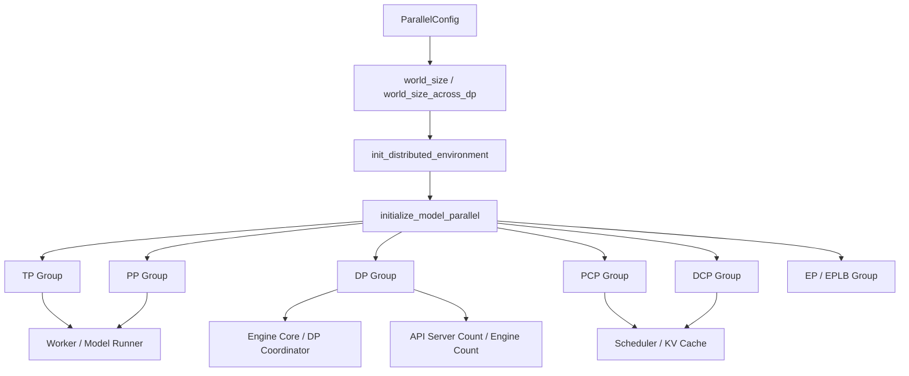
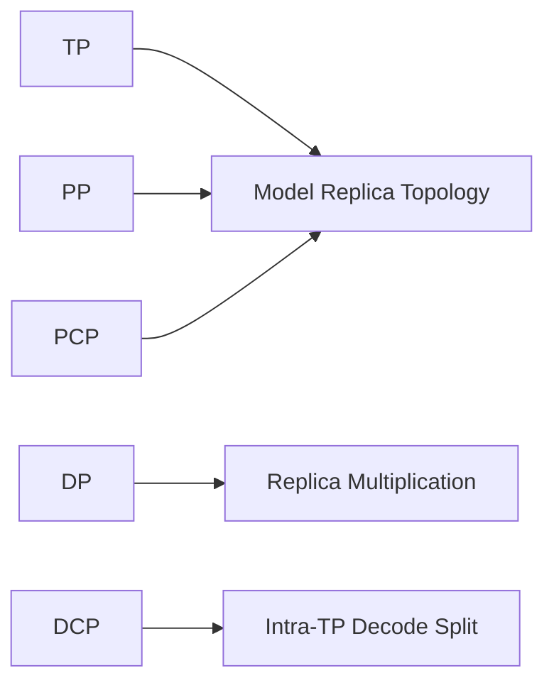
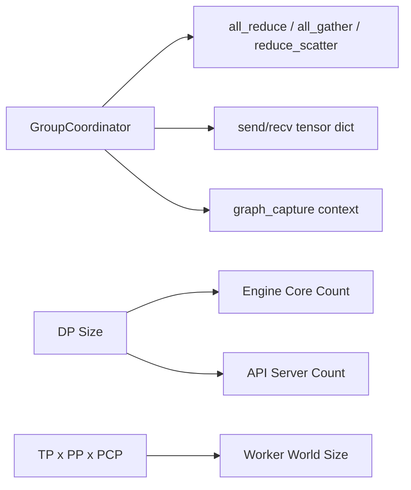
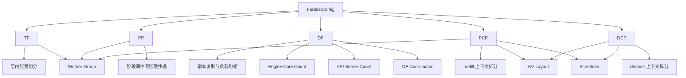

# vLLM 如何接管并行运行时：TP、PP、DP 与更多并行形态

## 这篇要回答什么问题

上一篇我们进入了 `Worker` 内部，回答的是：

> 真正跑模型的地方，也就是 `GPUModelRunner`，应该怎么读？

但如果你继续往前追，很快又会遇到另一个更底层、也更容易让人混乱的问题：

> `GPUModelRunner` 里到处都在读 `parallel_config`，`get_tp_group()`、`get_pp_group()`、`get_dcp_group()` 这些对象又随处可见。那 vLLM 到底是怎样在 PyTorch distributed 之上，建立出自己的一套并行运行时的？

很多人第一次接触 vLLM 的并行配置时，会先把它理解成几个常见参数：

- `tensor_parallel_size`
- `pipeline_parallel_size`
- `data_parallel_size`

再往后一点，可能还会看到：

- `prefill_context_parallel_size`
- `decode_context_parallel_size`
- `enable_expert_parallel`

问题在于，如果只是把这些参数看成“功能开关”，你很快就会在源码里失去方向。

因为在 vLLM 里，这些参数不是孤立配置，而是会一路影响：

- 进程个数怎么确定
- world size 怎么计算
- 哪些 rank 属于同一个 group
- 哪些 collectives 在什么维度上发生
- scheduler 和 KV cache 如何理解上下文拆分
- API server、engine core、worker 的进程拓扑如何变化

所以这篇文章真正想回答的，不是“TP/PP/DP 的教科书定义”，而是：

1. `ParallelConfig` 是怎样变成一张运行时拓扑图的
2. `parallel_state.py` 是怎样把这张拓扑图落实成一组 process group 和通信抽象的
3. TP、PP、DP、PCP、DCP 各自到底影响哪一层
4. 为什么并行配置会反过来影响 API server 和 engine core 的数量

路线图里点名的四个问题，这篇都会覆盖：

1. `parallel_config` 如何贯穿全局
2. data parallel、tensor parallel、pipeline parallel 的角色分工
3. decode context parallel、prefill context parallel 为什么会影响调度和 KV
4. 为什么并行配置会反过来影响 API server 和 engine core 个数

## 如果不了解这个模块，后面会在哪些地方读不下去

如果不先把并行运行时这一层想明白，后面读执行层和调度层时，通常会卡在这些地方：

- 看到 `ParallelConfig.world_size` 写的是 `PP × TP × PCP`，但 `world_size_across_dp` 又变成了 `world_size × DP`，会不知道到底哪个 world size 才是真正的“分布式规模”。
- 看到 `initialize_model_parallel()` 里同时创建 `_TP`、`_PP`、`_DP`、`_DCP`、`_PCP`、`_EP`、`_EPLB`，会觉得 group 太多，不知道每个 group 服务的是哪一类 collective。
- 看到 `decode_context_parallel_size` 的注释说它“不改变 world size，只是复用 TP 的 GPU”，会疑惑这和普通并行维度到底有什么不同。
- 看到 `GPUModelRunner`、`Scheduler`、`KVCacheInterface`、attention backend 都在读 `prefill_context_parallel_size` 或 `decode_context_parallel_size`，会不明白为什么“并行配置”会一路渗透到执行和缓存逻辑。
- 看到文档里说 `DP=4` 时默认会有 4 个 API server、4 个 engine core、8 个 worker，又会疑惑为什么并行参数不只是影响模型切分，还会影响服务层进程拓扑。

这些困惑背后，真正需要建立的认知是：

**vLLM 并不是“把 PyTorch distributed 接进来就完了”，而是接管了并行运行时的拓扑定义、group 划分、通信接口和进程组织。**

## 先给一张全景图

先用一句话概括：

> `ParallelConfig` 决定了运行时拓扑，`parallel_state.py` 把这张拓扑图落实成一组带职责的 `GroupCoordinator`，而 Engine Core、Worker、Scheduler、GPUModelRunner、KV cache 和服务层进程拓扑，都会围绕这些 group 组织自己的行为。

如果画成一张图，大致是这样：



也可以把它再拆成两半来看。

第一半是“配置怎样变成拓扑”：



第二半是“拓扑怎样变成进程和通信”：



这篇文章会按这个顺序往下讲。

## 第一层：`ParallelConfig` 不是参数表，而是并行拓扑契约

第一次读 `vllm/config/parallel.py`，最容易低估的地方是：

**`ParallelConfig` 并不只是保存用户传入的参数，它实际上定义了整套执行拓扑的约束。**

### 1. 先记住两个 world size

理解 vLLM 并行运行时，最先要分清的是两个 world size：

- `world_size`
- `world_size_across_dp`

在 `ParallelConfig.__post_init__()` 里，`world_size` 的定义是：

- `pipeline_parallel_size * tensor_parallel_size * prefill_context_parallel_size`

也就是说，默认的“模型副本内部执行拓扑”是由：

- PP
- TP
- PCP

三者相乘得到的。

而 `world_size_across_dp` 则是：

- `world_size * data_parallel_size`

这说明 DP 在 vLLM 里的语义不是“改变单个模型副本的内部拓扑”，而是：

**把整套模型副本拓扑复制出多个副本。**

这也是为什么从系统视角看，会同时存在：

- 单个副本内部的执行 world
- 跨 DP 副本的更大全局 world

### 2. 为什么 DCP 没进 `world_size`

很多人第一次看到这里都会愣一下：

- 为什么 `decode_context_parallel_size` 没乘进 `world_size`

这其实是 DCP 最值得先记住的特性。

在 `ParallelConfig` 的注释里，DCP 的定义非常明确：

- 它不改变 world size
- 它只是复用 TP 的 GPU
- 因此要求 `tp_size % dcp_size == 0`

也就是说，DCP 不是“再额外加一层并行维度”，而更像：

**在已有 TP rank 空间内部，再对 decode 阶段做一次上下文拆分。**

所以 DCP 的存在感很强，但它和 TP / PP / PCP 的地位并不完全对称。

### 3. `ParallelConfig` 的职责不只是模型切分

继续看 `ParallelConfig` 会发现，它还承担了很多“运行时组织”职责：

- 选择 `distributed_executor_backend`
- 推导 `data_parallel_rank`
- 决定 `nnodes`、`node_rank`
- 决定 `data_parallel_size_local`
- 决定是否使用 `external_launcher`
- 决定是否启用 expert parallel / EPLB / elastic EP
- 决定是否启用 ubatching / DBO

这说明 `ParallelConfig` 不只是“模型怎么切”。

它同时决定：

1. 模型副本怎么切
2. 副本怎么复制
3. 执行进程怎么启动
4. 通信拓扑怎样建立

所以把它理解成“并行参数配置类”其实还不够准确。

更准确地说，它是：

**vLLM 的并行运行时总配置。**

## 第二层：`parallel_state.py` 真正在做的，是接管 distributed 运行时

如果 `ParallelConfig` 负责描述拓扑，那么 `vllm/distributed/parallel_state.py` 负责的就是：

**把这张拓扑图真正落实成运行中的 distributed 环境。**

这个文件开头其实已经把目标写得很直白了：

> vLLM distributed state. It takes over the control of the distributed environment from PyTorch.

这句话非常关键。

它说明 vLLM 不是只用 PyTorch 的 process group，而是要在它之上建立自己的一层控制面。

### 1. 入口先看 `init_distributed_environment()`

这个函数回答的是：

- 默认 process group 何时初始化
- rank / local_rank / world_size 如何确定
- 多节点和 DP 场景下 `distributed_init_method` 怎样改写
- `split_group` 与传统 `new_group` 路径怎么选

也就是说，vLLM 并不是假设“外面已经把分布式环境都准备好了”。

它会主动接管：

- rank 语义
- init method
- backend 选择
- 节点数量感知

这是整个并行运行时的起点。

### 2. 再看 `initialize_model_parallel()`

这个函数是全篇最值得记住的一个入口。

它做的核心事，不是“初始化一下 TP 和 PP”，而是：

- 根据整体 rank 布局构造一张多维 rank 张量
- 再沿不同维度切出不同 group

源码里最重要的一段思路是：

- 先把 `all_ranks` reshape 成一个多维布局
- 再通过 `transpose + reshape + unbind` 拿到各个维度的 group

这个做法的价值非常大，因为它说明：

**vLLM 的并行 group 并不是各写一段特殊逻辑，而是从同一张全局 rank 布局里切出来的不同投影。**

### 3. `GroupCoordinator` 才是 vLLM 真正的 group 抽象

如果只看 PyTorch distributed，很容易把 process group 理解成“collective 的句柄”。

但 vLLM 并不满足于这一层。

它又包了一层 `GroupCoordinator`，把这些职责绑在一起：

- `cpu_group`
- `device_group`
- `device_communicator`
- message queue broadcaster
- all-reduce / all-gather / reduce-scatter
- tensor dict send/recv
- graph capture 上下文

这一步的意义很大。

因为在 vLLM 里，一个 group 需要承担的不只是：

- 张量 collective

还包括：

- 控制面对象广播
- pipeline 阶段间 tensor dict 传输
- CUDA graph 捕获时的通信协调

所以 `GroupCoordinator` 的存在，本质上是在说：

**vLLM 需要的是“有职责语义的 group”，而不是裸的 process group。**

## 第三层：TP、PP、DP 各自到底在系统里负责什么

现在可以回到最熟悉的三个并行维度了。

但这次不要按定义背，而是按系统角色来理解。

### 1. TP：在单层内部切权重，主战场是执行层 collectives

Tensor Parallel 的主要作用，是把单层里的计算和权重分到多个 rank 上。

所以 TP 最直接影响的是：

- 模型初始化时权重分片
- 层内的 all-reduce / all-gather / reduce-scatter
- worker 之间的同步执行

在 `parallel_state.py` 里，TP group 是最典型的“设备通信 group”。

在执行层里，你会反复看到：

- `get_tp_group().all_gather(...)`
- `get_tp_group().all_reduce(...)`

这说明 TP 的主战场非常明确：

**它主要是执行层、层内张量计算的并行维度。**

### 2. PP：在层与层之间切 stage，主战场是中间张量流动

Pipeline Parallel 影响的不是单层内部，而是模型层的 stage 划分。

因此 PP 最直接影响的是：

- 哪个 rank 是 first / last pipeline stage
- 哪些 rank 负责发送 / 接收 `IntermediateTensors`
- 最终输出应该由哪个 rank 回传

在 worker 执行层中，这通常表现为：

- 前一 stage 发中间张量
- 后一 stage 收中间张量
- 最后一 stage 负责算最终 logits 或 pooling 结果

所以 PP 的主战场不是层内 collective，而是：

**stage 之间的张量接力。**

### 3. DP：复制整套执行拓扑，主战场是吞吐、负载均衡和进程规模

Data Parallel 和 TP / PP 的最大区别在于：

它不先改变单个模型副本内部如何执行，而是先把整套副本复制出来。

所以 DP 最直接影响的是：

- engine core 个数
- API server 个数
- 请求如何在多个副本间负载均衡
- 某些场景下不同副本如何同步状态

这也是为什么文档里会说：

- `DP=4` 时默认有 4 个 engine core
- API server 默认也会扩到 4 个

从运行时视角看，DP 的重点不是“某一层怎么并行”，而是：

**把一整套可服务的模型执行单元横向复制出来。**

这也是它会直接影响服务层进程数的原因。

## 第四层：PCP 和 DCP 为什么会影响调度器和 KV cache

如果说 TP / PP / DP 比较容易接受，那么 PCP 和 DCP 往往更容易让人觉得“这怎么也算并行维度”。

理解它们的关键，是不要只盯着“计算分几份”，而要看：

**上下文被怎么拆，KV cache 被怎么布局，调度预算被怎么理解。**

### 1. PCP：prefill context parallel，会改变模型副本内部 world size

`prefill_context_parallel_size` 会直接乘进 `world_size`。

这说明 PCP 在 vLLM 里是一个真正参与执行拓扑的维度。

它的影响包括：

- worker 数量会跟着增加
- model parallel group 的 rank 划分会变化
- KV cache 布局会跟着上下文拆分改变
- scheduler 需要知道 prefill 上下文被分散到了哪些 rank

所以 PCP 的本质不是“又一个 feature”，而是：

**把 prefill 阶段的上下文处理直接纳入模型副本内部拓扑。**

### 2. DCP：decode context parallel，不增 world size，但增执行语义

相比之下，DCP 更微妙。

它不增加 world size，而是把 TP group 内部再切出 decode context 的子结构。

因此它的影响虽然不表现在“多了几个 worker”，却会直接表现在：

- scheduler 对 decode 阶段的理解
- attention backend 是否支持这种上下文拆分
- KV cache 的 interleave 方式
- 某些 decode collectives 的通信后端

这也是为什么 `ParallelConfig` 里会要求：

- `tp_size % dcp_size == 0`

因为 DCP 的基本前提就是：

**它要复用 TP 的 rank 空间。**

### 3. 为什么它们会一路影响 KV cache

在 `ParallelConfig` 里，还有一个很容易被忽略但很说明问题的字段：

- `cp_kv_cache_interleave_size`

它的注释已经把事情说透了：

- `total_cp_rank = pcp_rank * dcp_world_size + dcp_rank`
- `total_cp_world_size = pcp_world_size * dcp_world_size`

也就是说，vLLM 在这里不是把 PCP 和 DCP 当成独立小优化，而是：

**把它们合并成一套 context parallel 的 KV 存储布局语义。**

因此只要你开启 PCP 或 DCP，影响就不会停留在 distributed 初始化层，而会一路传到：

- scheduler
- KV cache utils
- attention metadata
- model runner

### 4. 为什么它们也会影响调度器

调度器关注的不只是“这轮发多少 token”，还要关心：

- 这些 token 的上下文在哪些 rank 上可见
- 哪些并行维度会影响序列长度上界和缓存命中
- decode / prefill 的预算是否仍然等价

所以 context parallel 一旦引入，调度层就不得不感知它。

这也是为什么在源码里你会看到：

- scheduler 读取 `pcp_world_size`
- scheduler 读取 `dcp_world_size`
- KV cache 相关组件也读取相同配置

这不是“耦合变重了”，而是因为这些并行维度本来就改变了请求生命周期的物理落点。

## 第五层：并行配置为什么会反过来影响 API server 和 Engine Core 个数

这是很多人第一次看 vLLM 文档时最惊讶的一点。

为什么并行配置不只是影响模型执行，还会影响服务进程数量？

### 1. 先记住一个最重要的事实

在 `docs/design/arch_overview.md` 里，V1 进程架构已经给出了答案：

- 默认 1 个 API server
- 但当 `DP > 1` 时，API server 默认扩展到 `DP`
- engine core 是 `1 per data parallel rank`
- worker 总数是 `DP × PP × TP`

这说明在 vLLM 里：

**DP 不是只在模型层复制副本，而是把“可服务执行单元”整体复制。**

而一个“可服务执行单元”至少包含：

- 一个 engine core
- 一组属于该 DP rank 的 worker

### 2. `EngineCoreClient` 也会因 DP 模式切换实现

在 `core_client.py` 里可以看到：

- 如果 `data_parallel_size > 1` 且启用 external LB，就走 `DPAsyncMPClient`
- 否则走 `DPLBAsyncMPClient`

这说明一旦进入 DP 场景，前端 client 的行为就已经不一样了：

- 有时每个 client 对接特定 DP rank
- 有时 client 自己要在多个 DP rank 间负载均衡

也就是说，DP 不只是“后台多了几个副本”，而是连前端路由语义也一起变了。

### 3. `launch_core_engines()` 真正在按 DP 数量拉起 engine

再看 `vllm/v1/engine/utils.py`，`launch_core_engines()` 里会直接读取：

- `data_parallel_size`
- `data_parallel_size_local`
- `data_parallel_rank_local`

然后决定：

- 本地起多少个 engine core
- 是否还要额外起 DP coordinator

这意味着 Engine Core 的数量并不是固定“一个服务一个”。

而是：

**一个 DP rank 对应一个 Engine Core。**

### 4. 为什么 API server 默认也会跟着 DP 扩

架构文档里已经明确写了：

- API server count 在 DP 场景下默认扩到 `data_parallel_size`

这里背后的逻辑也很清楚。

因为一旦有多个 engine core 副本，前端就有两种选择：

1. 只保留单个 API server，当总入口
2. 前端也多起几个，让 API server 与 engine core 一起扩

V1 默认选择的是第二种更贴近吞吐扩展的策略。

因此并行配置会向上反作用到服务层，这并不是附带效果，而是：

**vLLM 把“并行副本”定义成完整服务单元后的自然结果。**

## 第六层：`parallel_state.py` 是怎样从一张 rank 布局里切出所有 group 的

这是整篇最值得真正记住的源码思路。

### 1. 先把 rank 摆成一张多维表

在 `initialize_model_parallel()` 里，核心做法是先构造：

- `all_ranks = torch.arange(world_size).reshape(...)`

这个多维张量里，rank 并不是一维排队，而是已经按并行语义摆成了多维坐标。

可以把它理解成这样一张逻辑表：

```text
[ExternalDP][DP][PP][PCP][TP]
```

源码注释里单独点了：

- ExternalDP
- DP
- PP
- TP

而实际 reshape 又把 PCP 也纳入了维度。

这说明 vLLM 的思路非常统一：

**先把 rank 空间排成坐标系，再从不同轴上切 group。**

### 2. TP / PP / DP / PCP / DCP 都是这张表的不同切片

有了这张多维 rank 表之后，后面的 group 构造其实就不神秘了：

- TP：最后一维切块
- PP：把 PP 维换到最后再切
- DP：把 DP 维换到最后再切
- PCP：把 PCP 维换到最后再切
- DCP：在另一套 reshape 语义里按 decode context 切

这也是为什么 `initialize_model_parallel()` 看起来大量出现：

- `transpose(...)`
- `reshape(...)`
- `unbind(0)`

它们不是技巧堆砌，而是把“维度切片”这件事写得非常直接。

### 3. EP / EPLB 也是沿这张表继续切

更有意思的是，MoE 相关的：

- EP
- EPLB

也不是单独另起炉灶，而是继续沿这张布局切 group。

这说明 vLLM 的并行运行时有一个非常强的统一性：

**无论是传统 TP / PP / DP，还是后来的 PCP / DCP / EP / EPLB，本质上都被放进同一张 rank 拓扑表里推导。**

这也是这个模块最值得学的地方。

## 第七层：`GroupCoordinator` 为什么比裸 ProcessGroup 更重要

如果只从 PyTorch 视角看，group 只是 collective 的句柄。

但从 vLLM 视角看，这显然不够。

### 1. 一个 group 不只需要 device collective

在 `GroupCoordinator` 里你会看到，它同时维护：

- `device_group`
- `cpu_group`
- `device_communicator`
- `mq_broadcaster`

这说明在 vLLM 里，一个并行维度的 group 要承担两类通信：

- device 上的高性能 collective
- CPU / 控制面对象的同步与广播

这也是为什么它要同时保留：

- GPU 路径
- Gloo / CPU 路径

### 2. 它还要承担 pipeline 和控制面传输

继续看 `broadcast_object()`、`broadcast_tensor_dict()`、`send_tensor_dict()`、`recv_tensor_dict()`，会发现这层抽象做的已经不只是 NCCL all-reduce 了。

它还直接服务于：

- pipeline stage 间张量传递
- 对象级元数据广播
- tensor dict 的拆包和重组

因此 `GroupCoordinator` 的真实角色更像：

**带拓扑语义的通信门面。**

### 3. 甚至 CUDA graph 也要经过它

`parallel_state.py` 里还有一个很容易被忽略，但很说明问题的设计：

- `graph_capture(...)`

全局 `graph_capture(device)` 会同时进入：

- `get_tp_group().graph_capture(...)`
- `get_pp_group().graph_capture(...)`

这说明在 vLLM 里，连 CUDA graph 捕获都不是单进程自娱自乐。

它也需要和并行通信状态一起协调。

换句话说：

**GroupCoordinator 不是通信工具类，而是执行层运行时语义的一部分。**

## 第八层：最值得怎样读这两个核心文件

如果你真的准备顺着源码读下去，我最推荐的顺序不是从头到尾硬看。

### 1. 先读 `ParallelConfig.__post_init__()`

这一步先回答：

- world size 怎样推导
- DCP / PCP 有什么硬约束
- backend 怎样选
- DP rank / local rank 怎样确定

这一步读完，你会先建立“配置如何收敛成拓扑约束”的认知。

### 2. 再读 `init_distributed_environment()`

这一步回答：

- 默认 process group 怎么起
- 多节点 / DP / external launcher 怎样改写 init 方法
- world group 在什么时候建立

它是“从配置走向真实 distributed 环境”的第一步。

### 3. 再读 `initialize_model_parallel()`

这一步是全篇最重要的主函数。

重点只抓三件事：

1. `all_ranks` 如何 reshape
2. 各种 group 如何由 transpose / reshape / unbind 切出来
3. 哪些 group 是所有模型都需要，哪些是特定能力才需要

### 4. 最后读 `GroupCoordinator`

前面三步看完之后，再回来看 `GroupCoordinator` 会特别顺。

因为这时你已经知道：

- group 从哪里来
- 为什么要这么多 group
- 这些 group 在执行层分别服务谁

于是它就不再是“一个很长的通信工具类”，而会重新变成：

**并行运行时的统一接口层。**

## 一张“并行维度与进程数”的总览图

这篇最适合记住的，是下面这张图：



这张图里最重要的一点是：

**并行维度在 vLLM 里不是只影响“模型怎么切”，而是会一路影响进程、通信、调度、KV 和服务拓扑。**

## 再按一次请求生命周期回到全局

现在可以把这篇的重点，再按一次请求生命周期串起来。

### 第 1 步：用户给出并行配置

这一步里，用户看到的是：

- `tp`
- `pp`
- `dp`
- 以及可能的 `pcp`、`dcp`

但系统接收到的其实是一套运行时拓扑约束。

### 第 2 步：vLLM 建立 distributed 环境和 model-parallel groups

这一步里：

- `init_distributed_environment()` 建默认分布式环境
- `initialize_model_parallel()` 切出 TP / PP / DP / PCP / DCP / EP / EPLB group

### 第 3 步：服务和执行进程按 DP 与 world size 组织起来

这一步里：

- DP 决定 engine core 个数
- DP 默认也影响 API server 个数
- `TP × PP × PCP` 决定每个副本内部有多少 worker

### 第 4 步：调度层、KV cache 和执行层开始读取这些 group

这一步里：

- scheduler 读取 PCP / DCP
- KV cache 读取 PCP / DCP
- worker / model runner 读取 TP / PP / DCP

于是并行配置真正进入执行主链路。

### 第 5 步：请求在这些 group 定义的运行时边界内被执行

到这一步，TP / PP / DP / PCP / DCP 就不再是配置项，而是：

- rank 身份
- collective 语义
- slot / KV 布局
- 服务进程拓扑

的现实约束。

这也正是为什么说 vLLM 在这里“接管了并行运行时”。

## 这篇之后，最值得继续读什么

如果你已经接受了这篇的核心判断：

> vLLM 的并行系统不是几个独立参数，而是一套从配置、到 group、到进程、再到执行链路的统一运行时拓扑。

那下一步最值得继续读的是：

1. `vllm/v1/executor/multiproc_executor.py`
2. `vllm/v1/worker/gpu_worker.py`
3. `vllm/v1/core/sched/scheduler.py`
4. `vllm/v1/core/kv_cache_utils.py`

按这个顺序读，会很顺：

- 先看这些 group 怎样驱动 worker / executor
- 再看 worker 如何按 rank 身份初始化
- 再看调度器怎样感知 context parallel
- 最后看 KV cache 如何真正受 PCP / DCP 影响

如果沿博客主线继续往后写，那么下一篇最自然就是：

**《LoRA 在 vLLM 里为什么不是外挂，而是一等能力》**

因为这一篇回答的是：

**“整套并行运行时是怎样组织起来的。”**

而下一篇更自然的问题就是：

**“在这样一套运行时之上，LoRA 为什么不是请求到来时临时挂上的插件，而是贯穿服务层、执行层和模型层的一等能力。”**

## 一句话总结

不要把 vLLM 的并行配置理解成几项独立的规模参数。

更准确地说，它们共同回答的是这样一个问题：

> 当一个请求要跨越 API server、Engine Core、多个 worker、多个 rank、多个上下文切分维度和多种 collective 语义时，系统应该怎样定义一张统一的运行时拓扑图，并把这张图稳定地映射到分布式环境、进程组织、调度器和执行层里？

vLLM 给出的答案是：

- 用 `ParallelConfig` 定义整套并行运行时约束
- 用 `world_size` 与 `world_size_across_dp` 区分副本内拓扑和跨副本规模
- 用 `initialize_model_parallel()` 从统一 rank 布局里切出 TP / PP / DP / PCP / DCP / EP / EPLB group
- 用 `GroupCoordinator` 统一封装 collectives、对象广播、tensor dict 传输和 graph capture 协调
- 让 DP 直接反映到 engine core 与 API server 数量，让 PCP / DCP 继续下沉到 scheduler 与 KV cache

所以 vLLM 真正做的，并不是“支持 TP/PP/DP 这些并行方式”这么简单。

它真正做的是：

**把模型并行、服务副本扩展、上下文拆分和分布式通信，统一进一套可推导、可初始化、可执行的并行运行时。**
