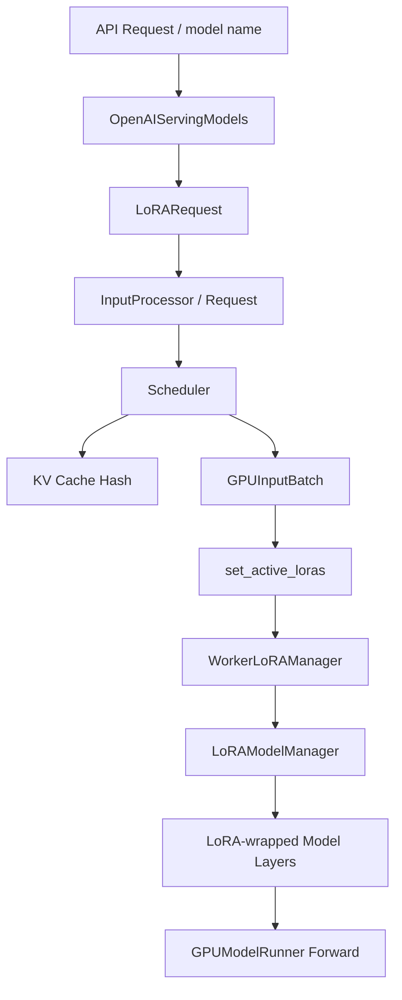
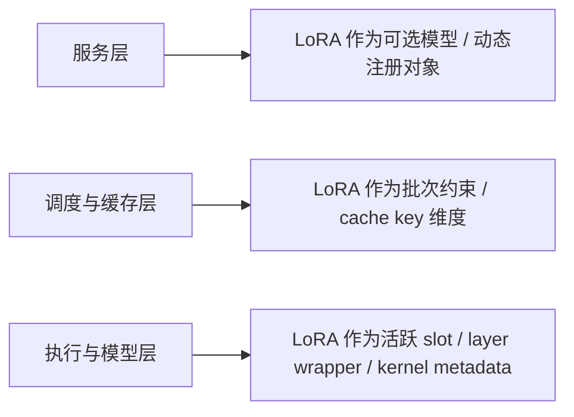
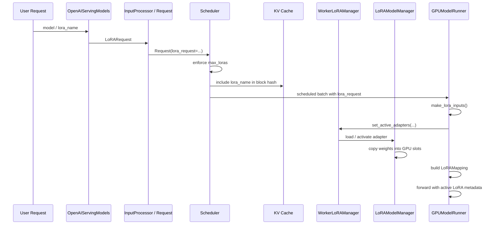

# LoRA 在 vLLM 里为什么不是外挂，而是一等能力

## 这篇要回答什么问题

写到这里，系列已经走过了服务层、调度层、KV Cache、执行层和并行运行时。

如果你带着这条主线继续往后看，就会遇到一个很典型、但也很容易被误解的问题：

> vLLM 支持 LoRA，到底是“在请求到来时临时切一下 adapter”，还是已经把 LoRA 视为推理运行时中的正式能力？

很多人第一次接触 vLLM 的 LoRA 时，直觉上都会把它理解成一种外挂：

- 基座模型还是原来的模型
- 请求只是额外挂一个 `LoRARequest`
- worker 执行前把 LoRA 权重临时塞进去
- 执行完再拔出来

如果只看接口，这种理解很自然。

因为用户最直观看到的确实只是：

- 启动时加一个 `--enable-lora`
- 请求里带一个 `lora_request`
- 或者在服务端注册几个 `--lora-modules`

但如果你顺着源码往下走，很快会发现事情远没有这么简单。

LoRA 在 vLLM 里并不是“请求来到之后再顺手改一下权重”的附加功能，而是会一路影响：

- 服务层的模型注册与模型列表
- 请求对象与输入处理
- scheduler 的批次约束
- KV cache 的哈希隔离
- worker 侧的 adapter 缓存与 slot 管理
- 模型层的 wrapper 注入
- 执行期的 LoRA mapping
- 甚至 CUDA graph 的捕获与 dispatch

所以这篇真正想回答的，不是“如何使用 LoRA”，而是：

1. 为什么 LoRA 在 vLLM 里不是外挂
2. `LoRAModelManager` 和 `WorkerLoRAManager` 各自负责什么
3. adapter 的注册、激活、淘汰和容量控制是怎么做的
4. 为什么服务层、调度层、缓存层、执行层都必须参与 LoRA
5. 多 LoRA、MoE、多模态为什么都会在这一套体系里汇合

路线图里点名的四个问题，这篇都会覆盖：

1. `LoRAModelManager` 负责什么
2. adapter 的注册、激活和容量控制怎么做
3. 多 LoRA 与 MoE、multimodal 的关系
4. 为什么服务层也要参与 LoRA 解析

## 如果不了解这个模块，后面会在哪些地方读不下去

如果不先把 LoRA 这一层看明白，后面继续读执行层时，通常会卡在这些地方：

- 看到 `OpenAIServingModels.show_available_models()` 会把 LoRA 也当成 `/v1/models` 里的 model card 暴露出来，会疑惑为什么服务层要理解 LoRA。
- 看到 `InputProcessor._validate_lora()`、`Request.lora_request`、`OutputProcessor` 里也带着 `lora_request`，会发现 LoRA 并没有停在 API 参数解析阶段。
- 看到 scheduler 会显式维护 `scheduled_loras`，还会用 `max_loras` 约束同一批次能混进来多少种 LoRA，会意识到它已经参与批次形成了。
- 看到 `KV Cache` 计算 block hash 时会把 `lora_name` 纳入额外 key，会明白同一段 prompt 在不同 LoRA 下并不能简单共享前缀缓存。
- 看到 `GPUInputBatch` 里常驻着 `request_lora_mapping`、`lora_id_to_lora_request`，以及 `make_lora_inputs()` 会生成 token 级 LoRA 映射，会发现 LoRA 已经进入执行期 batch 布局了。
- 看到 `WorkerLoRAManager` 和 `LoRAModelManager` 不是简单存路径，而是在维护 CPU cache、GPU slots、激活 adapter、wrapper 替换、Punica metadata，会意识到 LoRA 已经进入模型管理和 kernel 准备阶段了。
- 看到 `GPUModelRunner` 的 cudagraph 逻辑还要看 `has_lora`、`num_active_loras`，会知道 LoRA 连性能路径都改变了。

这些现象背后，真正要建立的认知是：

**在 vLLM 里，LoRA 不是“请求参数”，而是一种会改变服务、调度、缓存、执行和性能路径的运行时维度。**

## 先给一张全景图

先用一句话概括：

> 在 vLLM 里，一个 LoRA adapter 会先被服务层登记成可路由模型，再以 `LoRARequest` 的形式进入请求对象；调度器会按它做批次约束，KV cache 会按它隔离缓存，worker 会按它装载和淘汰 adapter，模型层会被 LoRA wrapper 重写，执行层则会把它翻译成 token 级的 LoRA mapping，最终真正影响每一步前向。

如果画成一张图，大致是这样：

如果换一个角度，也可以把它拆成三层：

这张图里最重要的一点是：

**LoRA 在 vLLM 里不是“附着在模型上的额外权重文件”，而是从入口到执行一路被显式建模的能力。**

## 第一层：为什么先从“不是外挂”这个判断开始

很多系统也支持 LoRA，但它们的做法更接近：

- 一个请求进来
- 把某个 adapter 权重加载到内存
- 执行时临时合并或临时切换

这类方案不能说错，但它们往往有一个特点：

**LoRA 主要只存在于“模型执行前的最后一步”。**

而 vLLM 不是这么设计的。

从源码看，LoRA 在这里至少有五层身份：

1. 服务层的“可路由模型”
2. 请求对象里的正式字段
3. 调度器的批次约束
4. KV cache 的缓存隔离维度
5. worker / model runner 的执行期激活状态

只要一个能力同时扮演了这五层身份，它就已经不再是外挂。

### 1. 它是服务层的模型，而不只是执行层选项

在 `OpenAIServingModels` 里，LoRA 不是隐藏配置。

它会被登记到：

- `self.lora_requests`
- `/v1/models`
- `ModelCard.parent`
- 动态 `load_lora_adapter` / `unload_lora_adapter`

也就是说，从 OpenAI 兼容服务的视角看：

**LoRA 已经是“可以被列出来、被路由到、被动态注册和卸载”的模型对象。**

### 2. 它是请求语义的一部分，而不只是模型内部状态

`LoRARequest` 会一路进入：

- 输入处理
- `Request`
- `SchedulerOutput`
- 输出处理

这说明 LoRA 并不是只在 worker 内部自娱自乐，而是：

**请求生命周期的一部分。**

### 3. 它会影响缓存和批次形成

如果 LoRA 只是“临时改权重”，那理论上 scheduler 和 KV cache 完全不需要知道它。

但 vLLM 恰恰反过来做了：

- scheduler 会限制同一批次最多混多少种 LoRA
- KV cache hash 会把 LoRA 名称算进去

这说明 LoRA 已经进入了：

- 批次资源规划
- 缓存正确性边界

这两个最核心的运行时层面。

### 4. 它还会影响 CUDA graph 和执行模式

如果你已经读过上一篇 `GPUModelRunner`，会知道 cudagraph dispatch 会看：

- `has_lora`
- `num_active_loras`

这意味着 LoRA 不只是功能开关，还会影响：

- capture key
- dispatch key
- 预热与 dummy run

换句话说：

**LoRA 甚至是性能路径的一部分。**

## 第二层：服务层为什么也必须理解 LoRA

路线图里有个很好的问题：

> 为什么服务层也要参与 LoRA 解析？

如果 LoRA 真是外挂，那服务层理应不需要理解它，只需要把参数透传给后端。

但 vLLM 里不是这样。

### 1. `OpenAIServingModels` 把 LoRA 视为可见模型

在 `vllm/entrypoints/openai/models/serving.py` 里，`OpenAIServingModels` 明确承担了：

- `/v1/models`
- `/v1/load_lora_adapter`
- `/v1/unload_lora_adapter`

这几个路由背后的核心状态管理。

这里最值得注意的设计是：

- LoRA 会被放进 `self.lora_requests`
- `show_available_models()` 会把 LoRA 变成 `ModelCard`
- `parent` 字段会指向 base model

这意味着在 OpenAI 兼容 API 里，LoRA 并不是隐藏实现细节，而是被显式呈现为：

**某个基座模型之下可选的派生模型。**

### 2. 动态加载接口说明它不是静态部署小插件

`docs/features/lora.md` 和 `entrypoints/serve/lora/api_router.py` 都说明了：

- 可以启动时静态注册 LoRA
- 也可以运行时动态 `load_lora_adapter`
- 还支持 `load_inplace`

这说明 LoRA 在 vLLM 里不是“服务启动前就焊死”的能力，而是：

**运行中的模型目录的一部分。**

也正因为如此，服务层必须负责：

- 名称唯一性
- 路由可见性
- 模型列表展示
- base model 关联
- 动态增删的一致性

### 3. `LoRARequest` 不是随便一段 metadata

`LoRARequest` 里至少包含这些字段：

- `lora_name`
- `lora_int_id`
- `lora_path`
- `base_model_name`
- `load_inplace`
- `is_3d_lora_weight`

这已经不是一个“附加标签”了。

它更像是：

**服务层到执行层之间传递的 adapter 描述协议。**

特别是：

- `lora_int_id` 需要全局唯一
- `base_model_name` 要支撑服务层的 lineage 表达
- `is_3d_lora_weight` 直接影响 MoE LoRA 的加载路径

所以服务层如果不理解 LoRA，就无法正确描述和管理这些运行时语义。

## 第三层：请求进入系统后，LoRA 就不再是“可有可无”

LoRA 真正开始变成一等能力，是从请求对象开始的。

### 1. 输入处理阶段就会验证 LoRA 合法性

`InputProcessor._validate_lora()` 会先检查：

- 你是不是在没有启用 LoRA 时传了 `lora_request`
- tokenizer 和 LoRA 的关系是否需要提醒

这一步说明：

**LoRA 在输入处理阶段就已经被当成正式输入维度，而不是下游私有字段。**

### 2. 多模态缓存键也会因为 LoRA 改变

在 `InputProcessor._get_mm_identifier()` 里，如果开启了：

- `enable_tower_connector_lora`

那么多模态缓存键就不再只是 `mm_hash`，而会变成：

- `f"{lora_request.lora_name}:{mm_hash}"`

这件事很说明问题。

因为它意味着：

**当 LoRA 能作用到 tower / connector 时，连多模态预处理缓存都必须按 LoRA 隔离。**

这已经远远超出了“模型前向时切一下 adapter”的范畴。

### 3. `Request` 到输出处理都会保留 LoRA 语义

在 V1 里，`Request` 对象和输出处理链路都能看到 `lora_request`。

这意味着 LoRA 不是只在中间某层短暂存在，而是：

**和请求本身一起穿过整条生命周期。**

这也是为什么 API 层、engine 层和 worker 层都要理解它。

## 第四层：scheduler 为什么必须感知 LoRA

如果一个能力会影响批次形成，那它就已经是运行时核心变量了。

LoRA 在 vLLM 里正是这样。

### 1. scheduler 会显式维护 `scheduled_loras`

在 `vllm/v1/core/sched/scheduler.py` 里，调度器会：

- 从当前已调度请求中收集 `scheduled_loras`
- 断言其数量不超过 `max_loras`
- 在尝试拉入新的 waiting request 时，再检查会不会超出 LoRA 上限

这一步特别关键。

因为它说明 scheduler 眼里的“批次可行性”不只取决于：

- token budget
- encoder budget
- running request 数量

还取决于：

- 这轮 batch 同时容纳了多少种不同 LoRA

换句话说：

**LoRA 直接参与批次调度约束。**

### 2. `max_loras` 不是部署参数装饰，而是批次资源边界

`LoRAConfig.max_loras` 的表面含义是：

- 单批次最多支持多少个 LoRA

但从调度器视角看，它的真实含义是：

**执行层当前可用的 LoRA GPU slot 数量，反过来决定批次能容纳的 LoRA 多样性。**

这也解释了为什么 LoRA 不是外挂。

外挂通常不会反向改变 scheduler 的 admitted set。

但 LoRA 会。

### 3. 这一步也解释了为什么需要 LoRA slot

当一个 batch 只能容纳有限种 LoRA 时，系统就必须显式管理：

- 哪些 adapter 当前在 GPU 上
- 哪些 adapter 还在 CPU cache
- 哪些 adapter 需要被淘汰

这也就是后面 `WorkerLoRAManager` 和 `LoRAModelManager` 存在的原因。

## 第五层：KV cache 为什么也必须感知 LoRA

这是很多人第一次看源码时最容易忽略、但最能说明问题的一点。

### 1. Block hash 会把 `lora_name` 作为额外 key

在 `vllm/v1/core/kv_cache_utils.py` 里，LoRA 对应的额外哈希 key 生成方式非常直接：

- 如果请求有 `lora_request`
- 就把 `lora_request.lora_name` 放进 block hash 的额外 key

这意味着：

**同一段 prompt，在不同 LoRA 下不会被视为同一个 prefix cache 条目。**

### 2. 这不是保守实现，而是正确性边界

为什么必须这么做？

因为 LoRA 会改写模型层的实际线性变换。

所以即便：

- 输入 token 一样
- prompt 文本一样
- 位置一样

只要 LoRA 不同，hidden states 和后续 logits 就可能不同。

因此如果还共用同一套 prefix cache，就会污染结果。

所以从缓存系统视角看，LoRA 不是“附加属性”，而是：

**决定缓存可复用性的计算图维度。**

这也是 LoRA 已经进入系统内核的又一条证据。

## 第六层：`WorkerLoRAManager` 负责把“请求上的 LoRA”变成“本机上的可用 adapter”

真正到了 worker 这一层，LoRA 开始从“请求语义”进入“设备管理语义”。

这里最重要的入口是：

- `vllm/lora/worker_manager.py`

### 1. 它负责的不是执行，而是 worker 侧 adapter 生命周期

`WorkerLoRAManager` 最重要的职责不是做前向，而是管理：

- LoRA 从哪里加载
- 什么时候加载
- 哪些 adapter 当前已注册
- 哪些 adapter 当前要激活
- 哪些 adapter 应该移除

也就是说，它站在 worker 视角做的是：

**请求驱动的 adapter 生命周期管理。**

### 2. `_load_adapter()` 先做合法性和格式收敛

这个函数做的事情非常多：

- 根据路径解析本地 adapter
- 用 `PEFTHelper` 读取配置
- 先验证 LoRA 配置是否合法
- 结合模型的 `hf_to_vllm_mapper` 做名字映射
- 读取 `lora_skip_prefixes`
- 构造 `LoRAModel`
- 把 `is_3d_lora_weight` 盖到加载后的对象上

这说明 worker 侧的 LoRA 加载并不是“把 safetensors 读一下”。

它真正做的是：

**把外部 checkpoint 解释成当前模型、当前运行时、当前部署配置下可以接入的 adapter 形式。**

### 3. `_apply_adapters()` 是“按批次所需 adapter 收敛本机状态”

`WorkerLoRAManager._apply_adapters()` 的逻辑非常像执行层的状态同步：

- 先看这一轮请求集合里到底需要哪些 adapter
- 再和当前已存在 adapter 做差集
- 不需要的移走
- 需要但未加载的补进来

这一步很值得强调。

因为它说明 worker 并不是每个请求各自维护自己的 LoRA。

相反，它是在：

**按当前批次的全局需求，维护一个共享 adapter 工作集。**

这正是推理运行时思维，而不是“请求级外挂”思维。

### 4. LRU 版本说明它已经有正式缓存层

vLLM 默认还提供了：

- `LRUCacheWorkerLoRAManager`

这意味着 LoRA 不是一次性加载对象，而是：

- 有 CPU cache
- 有 GPU slot
- 有淘汰策略
- 有 pin 行为
- 有 `load_inplace`

一个能力只要发展出完整缓存层，它就基本已经脱离“外挂”范畴了。

## 第七层：`LoRAModelManager` 真正做的是把 LoRA 接入模型结构

如果说 `WorkerLoRAManager` 负责 adapter 生命周期，那么：

**`LoRAModelManager` 负责把 adapter 真正变成模型的一部分。**

这也是路线图里最该精读的核心文件。

### 1. 它的起点不是“管理 LoRA 文件”，而是“管理 LoRA 化的模型”

`LoRAModelManager.__init__()` 一上来就会：

- 读取模型支持哪些 LoRA 模块
- 初始化 LoRA slots、CPU 容量、GPU 活跃表
- 初始化 `punica_wrapper`
- 扫描模型并创建 LoRA wrapper
- 把自己挂到 `model.lora_manager`

这说明它的目标从一开始就不是“管理 adapter 元数据”。

它的目标是：

**把当前模型重写成一个可容纳多 adapter、可按批次切换的执行对象。**

### 2. `_create_lora_modules()` 是整套机制最关键的一步

这一段是全篇最值得真正精读的逻辑之一。

它会遍历模型模块，然后：

- 过滤出支持 LoRA 的模块
- 找到对应的 `punica_wrapper`
- 用 `from_layer(...)` 把原模块替换成 `BaseLayerWithLoRA`
- 特殊处理 `lm_head` 和 `logits_processor`
- 记录 packed modules 映射
- 给所有 LoRA layer 绑定统一 mapping

这一步说明：

**vLLM 不是在前向时“外插一段 LoRA 逻辑”，而是在模型初始化阶段就把基础层替换成支持 LoRA 的执行层 wrapper。**

这就是“一等能力”和“外挂”的根本区别。

外挂通常挂在调用点。

而这里 LoRA 直接进了模型层定义。

### 3. 激活 LoRA，本质上是在 GPU slot 里装载 adapter 权重

`activate_adapter()` 做的事情也很说明问题：

- 先找第一个空闲 slot
- 把 `lora_id` 放进 `lora_index_to_id`
- 对每个被包装过的模块取出该 LoRA 的权重
- 调 `module.set_lora(...)` 拷进当前 slot

这说明“激活 LoRA”在 vLLM 里的真实含义不是：

- 当前请求逻辑上选中这个 adapter

而是：

**把这个 adapter 的实际 LoRA-A / LoRA-B 张量拷进 GPU 上某个运行时槽位。**

这也是为什么调度器必须关心 `max_loras`。

因为它对应的是实实在在的 GPU 可用槽位。

### 4. 它还管理 CPU 容量和 GPU 活跃集

`LoRAModelManager` 里至少有两层资源概念：

- `capacity`，也就是 `max_cpu_loras`
- `lora_slots`，也就是 `max_loras`

可以近似理解为：

- CPU cache 容量
- GPU 活跃工作集大小

这使得 LoRA 在 vLLM 里形成了一个小型层级存储体系：

- adapter 文件在磁盘
- `LoRAModel` 在 CPU cache
- 活跃 LoRA 权重在 GPU slots

这已经非常像 KV cache / block pool 那样的运行时资源管理问题了。

## 第八层：执行期 LoRA 真正怎样进入 batch

到了 `GPUModelRunner` 这一层，LoRA 不再只是“已加载 adapter”，而要变成：

**当前这轮 batch 每个 request、每个 token 到底对应哪个 adapter。**

### 1. `GPUInputBatch` 会长期维护 LoRA 映射

在 `gpu_input_batch.py` 里，LoRA 相关状态是常驻 batch 结构的一部分：

- `request_lora_mapping`
- `lora_id_to_request_ids`
- `lora_id_to_lora_request`

这说明 LoRA 不是 batch 外挂，而是：

**持久 batch 状态的一部分。**

### 2. `make_lora_inputs()` 会生成 token 级映射

`InputBatch.make_lora_inputs()` 会输出三样东西：

- `prompt_lora_mapping`
- `token_lora_mapping`
- `active_lora_requests`

注意这里非常关键的一点：

它不是只告诉执行层“这轮有哪些 LoRA”。

它还告诉执行层：

- 每个 sampled token 用哪个 LoRA
- 每个 scheduled token 用哪个 LoRA

这说明 LoRA 在执行期的粒度已经下沉到了：

**token 级 mapping。**

### 3. `LoRAModelRunnerMixin` 再把它翻译成 LoRA metadata

在 `vllm/v1/worker/lora_model_runner_mixin.py` 里，`set_active_loras()` 会把这些映射组装成：

- `LoRAMapping`

然后交给：

- `self.lora_manager.set_active_adapters(...)`

这一步的重要性在于：

**执行层并不是只切一个“当前 adapter”，而是把整个 batch 的 LoRA 使用形态显式编码成 mapping metadata。**

这也是多 LoRA 混批真正成立的基础。

## 第九层：为什么 LoRA 连 CUDA graph 都会影响

如果你还觉得 LoRA 只是模型层能力，那么看到这里应该会彻底改观。

### 1. cudagraph key 会看 `has_lora` 和 `num_active_loras`

在 V1 的 `GPUModelRunner` 与相关 cudagraph 工具里，LoRA 相关信息会进入：

- `has_lora`
- `num_active_loras`
- capture cases
- dispatch key

也就是说，不同 LoRA 活跃状态会导向不同的 graph 选择。

### 2. `specialize_active_lora` 说明它已经进入性能建模

`LoRAConfig.specialize_active_lora` 的意思是：

- 可以按不同 `num_active_loras` 分别捕获 graph

这件事非常有代表性。

因为它说明 vLLM 不只是“兼容 LoRA”，而是在认真做：

**LoRA 场景下的性能建模与优化。**

一个能力一旦进入 graph capture specialization，它就已经是执行路径里的正式维度了。

## 第十层：多 LoRA、MoE 和 multimodal 为什么也都在这套体系里汇合

LoRA 之所以在 vLLM 里显得“很重”，本质上是因为它不是单一场景能力。

### 1. 多 LoRA：要求 batch 内按 slot 和 mapping 管理

多 LoRA 场景最核心的问题不是“能不能加载多个 adapter”，而是：

- 同一批次里如何混多个 adapter
- GPU 上怎么给它们分 slot
- batch 内每个 token 怎么找到自己的 adapter

这正是：

- `max_loras`
- `request_lora_mapping`
- `prompt_lora_mapping`
- `token_lora_mapping`

存在的原因。

所以多 LoRA 不是额外功能，而是整个 LoRA 运行时设计的中心假设之一。

### 2. MoE：要求加载格式、wrapper 和专家切片都纳入 LoRA 体系

`LoRAModelManager` 对 MoE 做了非常多特判：

- `FusedMoEWithLoRA`
- `FusedMoE3DWithLoRA`
- `enable_mixed_moe_lora_format`
- `_convert_3d_to_2d_moe_lora()`
- `_slice_moe_lora_ep()`
- `_restrict_to_local_experts()`

这说明 MoE LoRA 在 vLLM 里不是“额外补丁”，而是已经被纳入正式 wrapper 体系。

从这里也能看出：

**只要 LoRA 要真正服务复杂模型，它就必然会深入模型结构和并行语义。**

### 3. multimodal：要求 tower / connector 也能成为 LoRA 目标

LoRA 在多模态场景下也不是简单沿用文本模型路径。

`LoRAModelManager._maybe_init_mm()` 会根据模型结构初始化：

- language model wrapper
- tower wrapper
- connector wrapper

并且还要受这些条件控制：

- `enable_tower_connector_lora`
- 模型是否真的支持 tower / connector LoRA
- multimodal budget
- encoder token 数量

这说明多模态 LoRA 的本质是：

**LoRA 不只挂在线性语言层，也可能进入视觉 tower、connector 等不同子图。**

所以它必须拥有独立 wrapper 和独立 metadata。

### 4. 默认多模态 LoRA 进一步证明它是服务级能力

`default_mm_loras` 的设计也非常说明问题。

它允许：

- 某种 modality 一出现，就自动绑定某个 LoRA

这个特性如果只是外挂思维很难做得优雅。

因为它本质上需要：

- 服务层自动注册默认 LoRA
- 输入处理理解 modality
- 执行层自动带上对应 LoRARequest

这进一步证明：

**LoRA 在 vLLM 里已经和请求解析、多模态语义和模型执行深度融合。**

## 第十一层：真正的分工是 `WorkerLoRAManager` 管生命周期，`LoRAModelManager` 管可执行模型

如果要把这两个核心类用一句话区分开，我会这样记：

### 1. `WorkerLoRAManager` 关心“这一轮需要哪些 adapter”

它站在 worker 外围，负责：

- 加载 adapter
- 应用 adapter 集合
- LRU 淘汰
- pin
- `load_inplace`

它最像：

**worker 侧的 adapter 工作集管理器。**

### 2. `LoRAModelManager` 关心“这些 adapter 怎样真正进入模型结构”

它站在模型内部，负责：

- 把原层替换成 LoRA wrapper
- 维护 CPU / GPU adapter 存储
- 激活 slot
- 设置权重
- 更新 Punica metadata

它最像：

**LoRA 化模型的运行时装配器。**

只看其中一个都不够。

只有把这两层一起看，才能真正理解：

**vLLM 的 LoRA 不是文件管理，而是完整运行时管理。**

## 第十二层：哪些逻辑最值得精读，哪些先建立索引就够了

面对 LoRA 这块源码，我建议按下面顺序读。

### 第一优先级：必须精读

下面这些我建议第一轮就精读：

- `vllm/lora/worker_manager.py`
- `vllm/lora/model_manager.py`
- `vllm/v1/worker/lora_model_runner_mixin.py`
- `vllm/v1/worker/gpu_input_batch.py` 里的 LoRA 相关状态
- `vllm/v1/core/sched/scheduler.py` 里 `max_loras` 约束逻辑
- `vllm/v1/core/kv_cache_utils.py` 里的 LoRA hash key 逻辑

因为这几处刚好拼出了：

- 请求怎样进入 LoRA 体系
- worker 怎样管理 adapter
- batch 怎样表达 LoRA
- scheduler / KV 怎样把它当成运行时维度

### 第二优先级：理解职责，先不穷举细节

下面这些值得建立索引，但不必第一轮穷举：

- `OpenAIServingModels`
- 动态 `load_lora_adapter` / `unload_lora_adapter`
- `LoRAConfig`
- `LoRARequest`
- `default_mm_loras`

这些更适合在你已经知道主链路后，再回来看它们如何补完整个服务面。

### 第三优先级：按专题深入

还有一些更适合按专题拆出去：

- mixed MoE LoRA format
- tower / connector LoRA
- fully sharded LoRA
- cudagraph specialize by active LoRA

这些都很重要，但它们更像：

**LoRA 运行时之上的高级专题。**

## 一份更实用的 LoRA 阅读地图

如果你准备真的打开源码，我推荐按下面顺序读：

1. 先读 `docs/features/lora.md`，只建立用户视角和功能边界。
2. 再读 `LoRARequest` 和 `LoRAConfig`，看系统怎样描述 LoRA。
3. 再读 `OpenAIServingModels`，理解服务层为什么把 LoRA 当模型管理。
4. 然后读 scheduler 里 `max_loras` 相关逻辑，理解它为什么进入批次形成。
5. 再读 `kv_cache_utils.py` 里 LoRA hash key，理解缓存为什么要隔离。
6. 再读 `WorkerLoRAManager`，看 adapter 生命周期如何在 worker 侧收敛。
7. 再读 `LoRAModelManager`，看模型怎样被 LoRA wrapper 重写。
8. 最后读 `lora_model_runner_mixin.py` 和 `gpu_input_batch.py`，把执行期 mapping 补完整。

这个顺序的核心思想是：

**先看 LoRA 如何成为系统语义，再看它如何成为执行实现。**

而不是一上来就钻 `set_lora()` 的细节。

## 一张 LoRA 从请求到执行生效的路径图

这篇最适合记住的，是下面这张图：

这张图里最重要的一点是：

**LoRA 不是在最后一步“临时启用”，而是在请求、调度、缓存、装载、映射、前向这几层连续存在。**

## 再按一次请求生命周期回到全局

现在可以把这篇的重点，再按一次请求生命周期串起来。

### 第 1 步：服务层把 LoRA 变成可路由模型

在这一步里：

- LoRA 可以静态注册
- 也可以动态加载
- `/v1/models` 会把它列出来
- `parent` 会指向 base model

所以 LoRA 先成为了服务语义。

### 第 2 步：请求对象携带 `LoRARequest` 进入系统

在这一步里：

- 输入处理会校验 LoRA
- 请求对象保留 LoRA 信息
- 多模态缓存标识也可能带上 LoRA 名称

所以 LoRA 成为了请求语义。

### 第 3 步：调度器按 LoRA 约束批次形成

在这一步里：

- scheduler 会维护 `scheduled_loras`
- 新请求是否能进 batch，要看会不会超过 `max_loras`

所以 LoRA 成为了调度语义。

### 第 4 步：KV cache 按 LoRA 隔离缓存

在这一步里：

- block hash 会纳入 `lora_name`

所以 LoRA 成为了缓存语义。

### 第 5 步：worker 把 LoRA 收敛成本轮 adapter 工作集

在这一步里：

- `WorkerLoRAManager` 决定哪些 adapter 要加载、保留、淘汰
- `LoRAModelManager` 决定这些 adapter 怎样进入 wrapper 和 GPU slots

所以 LoRA 成为了设备资源语义。

### 第 6 步：执行层把 LoRA 翻译成 token 级 mapping

在这一步里：

- `InputBatch` 维护 request 到 LoRA 的映射
- `make_lora_inputs()` 生成 prompt / token 级 mapping
- `LoRAMapping` 把这种关系传给底层 wrapper

所以 LoRA 最终成了前向执行语义。

到这时，再回看“LoRA 是不是外挂”这个问题，答案就很明确了：

**不是。**

因为外挂不会一路改变：

- 模型列表
- 请求对象
- 调度约束
- 缓存 key
- GPU slot
- 执行 mapping
- cudagraph dispatch

而 vLLM 里的 LoRA 会。

## 这篇之后，最值得继续读什么

如果你已经接受了这篇的核心判断：

> LoRA 在 vLLM 里不是请求进来时临时附着的一段增量权重，而是一套从服务层到执行层都显式参与的运行时能力。

那下一步最值得继续读的是：

1. `vllm/multimodal/registry.py`
2. `vllm/multimodal/inputs.py`
3. `vllm/v1/core/sched/scheduler.py`
4. `docs/design/mm_processing.md`

因为这一篇最自然导向的下一个问题就是：

**既然 LoRA 已经说明了“横切能力会一路下沉到调度和执行”，那么多模态为什么也不是独立分支，而是从预算阶段就开始参与请求生命周期？**

也就是路线图里的下一篇：

**《多模态在 vLLM 里不是独立分支，而是从调度阶段就开始参与预算》**

## 一句话总结

不要把 vLLM 的 LoRA 理解成“把 adapter 权重加载进来，然后执行时切一下”的外挂机制。

更准确地说，它在 vLLM 里的角色是：

> 一种会被服务层显式建模、会被请求对象携带、会被调度器纳入批次约束、会被 KV cache 纳入缓存隔离、会被 worker 作为 adapter 工作集管理、会被模型层 wrapper 真正注入并在执行期以 token 级 mapping 生效的运行时能力。

vLLM 给出的 LoRA 方案，本质上不是“支持 LoRA 推理”这么简单。

它真正做的是：

- 用 `LoRARequest` 和 `LoRAConfig` 把 LoRA 正式纳入协议和配置层
- 用服务层模型注册把 LoRA 变成可路由对象
- 用 scheduler 的 `max_loras` 把 LoRA 纳入批次资源约束
- 用 KV cache hash 把 LoRA 纳入缓存正确性边界
- 用 `WorkerLoRAManager` 和 `LoRAModelManager` 管理 adapter 生命周期与模型重写
- 用 `LoRAMapping`、slot 和 Punica metadata 把 LoRA 真正接入执行路径

所以 LoRA 在 vLLM 里不是外挂。

它是：

**一等能力。**
