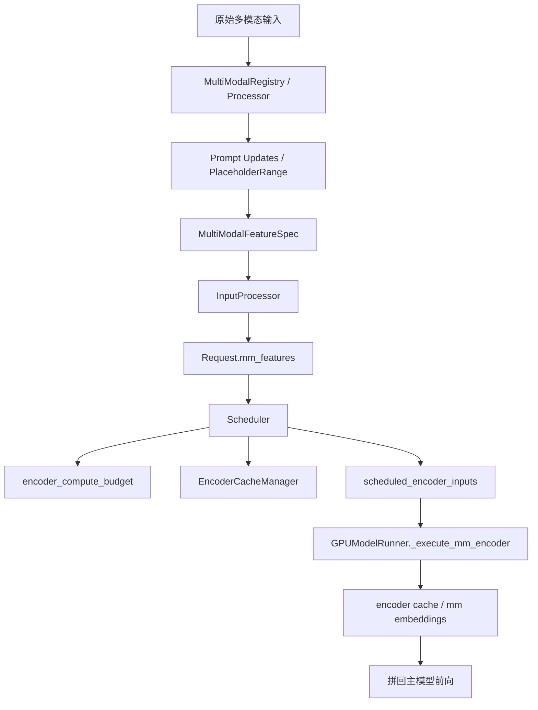
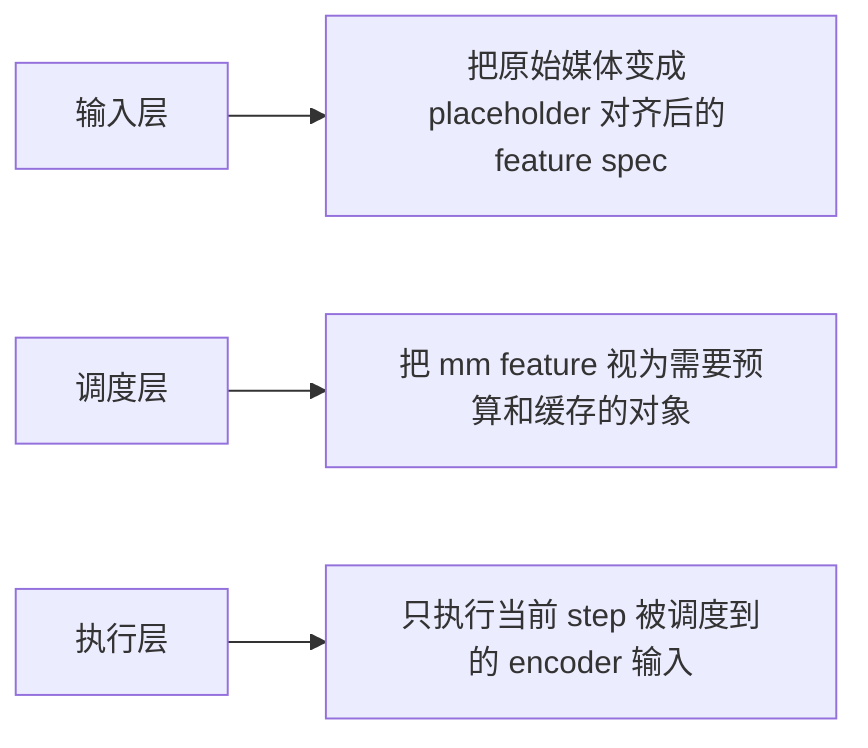
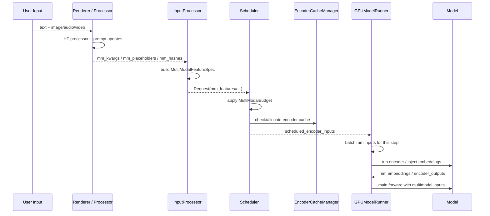

# 多模态在 vLLM 里不是独立分支，而是从调度阶段就开始参与预算

## 这篇要回答什么问题

前一篇我们讲的是 LoRA，结论是：

> LoRA 在 vLLM 里不是外挂，而是一等能力。

如果你沿着这个思路继续往下看，多模态其实会给出一个非常类似、但更容易被低估的结论：

> 多模态在 vLLM 里也不是“文本请求之外的特殊分支”，而是一种从输入处理、缓存、调度预算到 worker 执行都被显式建模的运行时能力。

很多人第一次看多模态推理系统时，直觉上会这样理解：

- 用户请求里多传一张图、一段音频或一段视频
- 服务层先把它们处理一下
- 模型前向前再跑一下视觉 encoder 或音频 encoder
- 最后把得到的 embeddings 拼回语言模型输入

这种理解不能说错，但它只解释了：

- “模型怎么吃到多模态输入”

却解释不了 vLLM 里真正困难的那部分问题：

- 为什么多模态请求会影响 prompt 长度检查
- 为什么多模态要单独做 processor cache
- 为什么 scheduler 里会有 `encoder_compute_budget`
- 为什么 `scheduled_encoder_inputs` 不是附加字段，而是调度输出的一部分
- 为什么 encoder cache manager 要在调度器里维护容量
- 为什么 `disable_chunked_mm_input` 会反过来改变本轮能发出去多少 token
- 为什么 `GPUModelRunner` 不是简单收 `mm_kwargs`，而是先按 `scheduled_encoder_inputs` 批量组织 encoder 输入

所以这篇真正想回答的，不是“vLLM 如何支持图片和音频”，而是：

1. 多模态输入在 vLLM 里是怎样从原始媒体变成可调度对象的
2. 为什么多模态从输入处理阶段就开始影响预算，而不是到 worker 才生效
3. scheduler 为什么必须理解多模态 placeholder、encoder 预算和 encoder cache
4. 为什么多模态不是独立分支，而是直接嵌进请求生命周期主链路

路线图里点名的四个问题，这篇都会覆盖：

1. `MultiModalRegistry` 如何按模型注册 processor
2. 什么条件下模型虽然是 multimodal，但会退化为 text-only mode
3. scheduler 为什么需要 encoder cache 和 multimodal budget
4. 多模态处理如何影响请求生命周期

## 如果不了解这个模块，后面会在哪些地方读不下去

如果不先把多模态这一层看明白，后面继续读输入层、调度层和执行层时，通常会卡在这些地方：

- 看到 `MultiModalRegistry.supports_multimodal_inputs()` 里明明模型是 multimodal，却还能退回 text-only mode，会不知道“支持多模态”和“当前真的走多模态路径”为什么是两回事。
- 看到 `docs/design/mm_processing.md` 里反复强调 dummy text、prompt updates、processor cache，会疑惑为什么多模态处理不是简单调一下 HF processor。
- 看到 `InputProcessor.process_inputs()` 会把多模态输入整理成 `MultiModalFeatureSpec`，还要按 `PlaceholderRange.offset` 排序，会不知道这和后面的调度有什么关系。
- 看到 scheduler 初始化阶段就构造 `MultiModalBudget`、`EncoderCacheManager` 和 `max_num_encoder_input_tokens`，会疑惑为什么调度器需要知道视觉或音频 encoder 的预算。
- 看到 `_try_schedule_encoder_inputs()` 会因为 encoder budget 不够、encoder cache 装不下、或者 chunked mm input 被禁用而回退本轮 `num_new_tokens`，会意识到多模态已经直接影响 batch 发车逻辑了。
- 看到 `GPUModelRunner._execute_mm_encoder()` 只处理 `scheduled_encoder_inputs`，而不是处理请求里所有多模态数据，会说明 worker 执行的实际入口已经被调度层切分过了。

这些现象背后，真正要建立的认知是：

**在 vLLM 里，多模态不是一条“模型前向前补一段处理”的支线，而是一条从输入表示、缓存、预算、调度到执行都被主链路吸收进去的能力。**

## 先给一张全景图

先用一句话概括：

> 在 vLLM 里，多模态输入不会直接从 HTTP 层一路落到模型前向；它们会先经过模型相关 processor，变成带 placeholder 位置信息和缓存标识的 `MultiModalFeatureSpec`，随后被 scheduler 视为需要 encoder 预算和 encoder cache 的对象，最后只有被当前 step 正式调度到的那部分 encoder inputs，才会在 worker 里真正执行 encoder 并拼回语言模型输入。

如果画成一张图，大致是这样：

如果换个角度，也可以把它拆成三层：

这张图里最重要的一点是：

**多模态在 vLLM 里先是调度对象，之后才是模型输入。**

## 第一层：`MultiModalRegistry` 不是“多模态工具箱”，而是模型级入口分发器

理解多模态的第一步，不是去看某个模型的视觉塔，而是先看：

- `vllm/multimodal/registry.py`

### 1. 它先回答“这个模型当前到底算不算多模态”

`MultiModalRegistry.supports_multimodal_inputs()` 里最值得注意的一点是：

- `model_config.is_multimodal_model` 为真还不够
- 模型还必须真的注册过 multimodal processor
- `limit_per_prompt` 不能把所有支持的 modality 都压成 0

否则系统会明确退回：

- text-only mode

这一点非常重要。

因为它说明在 vLLM 里，“多模态模型”不是一个纯静态标签。

系统真正关心的是：

**当前配置下，这个模型是否真的需要启用整套多模态基础设施。**

### 2. 退化为 text-only mode 不是异常，而是正式设计

`supports_multimodal_inputs()` 里至少有两种典型退化路径：

- 模型类没有注册 processor
- 所有支持的 modality 的 `limit_per_prompt` 都是 0

这意味着即便底层模型本身支持多模态，只要当前部署配置不打算接收这些 modality，系统就会：

- 不创建多模态 processor
- 不启用多模态缓存
- 不走 encoder budget 路径

也就是说，多模态能力在 vLLM 里不是“模型有就必须开”，而是：

**模型能力和部署配置共同决定的运行时路径。**

### 3. 它还负责创建 processor 和 cache

`MultiModalRegistry` 不只是一个注册表。

它还负责：

- 构造 `BaseMultiModalProcessor`
- 构造 dummy inputs builder
- 按配置选择 processor cache 类型
- 为 API server、engine、worker 分别创建接收侧 cache

这说明多模态在 vLLM 里不是简单的模型插件。

它更像：

**围绕模型 processor 构建的一套输入处理子系统。**

## 第二层：多模态处理为什么比“调 HF processor”复杂得多

`docs/design/mm_processing.md` 这一篇设计文档非常值得读，因为它几乎直接回答了：

> 为什么多模态不是独立分支，而是要被主链路吸进去？

### 1. 核心难题不是处理媒体，而是对齐 placeholder token

HF processor 做的不只是把图像转成 `pixel_values`。

它还会修改 prompt，比如：

- 插入 feature placeholder tokens
- 把单个 `<image>` 替换成一长串 feature placeholder tokens

而这件事对 vLLM 非常关键。

因为后面系统还要继续做：

- chunked prefill
- prefix caching
- encoder 输入分步调度

只要想做这些优化，系统就必须知道：

**prompt 里哪些 token 位置对应哪一个多模态输入。**

### 2. 这就是为什么要显式建模 `PlaceholderRange`

在 `multimodal/inputs.py` 里，`PlaceholderRange` 保存的是：

- `offset`
- `length`
- 以及可选的 `is_embed`

它的作用不是“多记点元数据”，而是：

**把多模态 feature 在输入序列中的物理落点描述出来。**

一旦有了这个对象，系统后面才有可能回答：

- 当前 step 覆盖了哪些多模态 placeholder
- 本轮需要调度哪些 encoder 输入
- 某段窗口内实际对应多少 encoder embeddings

### 3. Dummy text 和自动 prompt updating 是为了把多模态纳入统一输入模型

`mm_processing.md` 里强调的：

- dummy text
- automatic prompt updating

本质上是为了解决一个统一性问题：

**无论用户给的是原始文本还是 tokenized prompt，vLLM 都要把多模态输入整理成一套统一、可调度的 prompt + placeholder + mm data 表示。**

如果没有这层统一，后面的 scheduler 根本没法只看 request 状态就做预算和切分。

### 4. Processor cache 也说明它不是前向前临时小步骤

文档里还明确说明了：

- 某些 HF processor 很慢
- 所以 vLLM 会缓存 processor 输出
- 为了启用缓存，还要把文本和多模态输入拆开处理，再自己补 prompt update

这说明多模态处理不是“模型前的一次性预处理”。

它已经有了：

- 统一表示
- 独立 cache
- 与 token 序列对齐的后处理逻辑

这已经明显是主链路基础设施了。

## 第三层：`InputProcessor` 把多模态输入真正变成可调度对象

如果说 `MultiModalRegistry` 负责选择 processor，那么：

**`InputProcessor` 负责把处理结果翻译成 Engine Core 真正理解的请求对象。**

### 1. 初始化时就先算多模态预算副作用

`InputProcessor.__init__()` 在发现 `supports_mm_inputs=True` 后，会立即构造：

- `MultiModalBudget`

然后取出：

- `mm_encoder_cache_size`
- `skip_prompt_length_check`

这点很值得注意。

因为它说明输入层不是只管“把数据解出来”，它还得提前知道：

- 后续 encoder cache 大概有多大
- prompt 长度检查要不要特殊放宽

也就是说，多模态预算的影响从输入层就已经开始了。

### 2. `process_inputs()` 会把多模态整理成 `MultiModalFeatureSpec`

这是整条链路最关键的一步之一。

在 `InputProcessor.process_inputs()` 里，如果解码侧输入类型是：

- `multimodal`

那么系统会拿到三样东西：

- `decoder_mm_inputs`
- `decoder_mm_positions`
- `decoder_mm_hashes`

然后做三件关键操作：

1. 把不同 modality 下的多模态项拉平
2. 按 `PlaceholderRange.offset` 排序
3. 为每个条目构造 `MultiModalFeatureSpec`

这个对象里至少包含：

- `data`
- `modality`
- `identifier`
- `mm_position`
- `mm_hash`

### 3. 这一步真正完成了“从原始媒体到调度对象”的转换

`MultiModalFeatureSpec` 之所以关键，是因为它首次把多模态输入同时表达成了：

- 要传给模型的处理后数据
- 在 prompt 里的位置
- 与缓存有关的标识

这意味着从这一步开始，多模态不再只是：

- 图片
- 音频
- 视频

它开始变成：

**请求序列上的一个带位置和缓存身份的 feature。**

而只要你把它建模成 feature，scheduler 就可以开始理解它。

## 第四层：`MultiModalFeatureSpec` 是多模态进入调度层的关键中间表示

为了理解为什么 scheduler 能管多模态，最好单独记一下这个对象。

### 1. `identifier` 不是普通 hash，而是运行时缓存身份

`MultiModalFeatureSpec.identifier` 的注释已经说得很明白：

- 它是 encoder outputs 的缓存标识

如果和 LoRA 结合，还可能带上 LoRA 前缀。

这说明调度器和 worker 后面拿到的不是“原始媒体对象”，而是：

**一个可用于 encoder cache 命中的稳定标识。**

### 2. `mm_position` 让 scheduler 能做窗口级调度

`mm_position` 是 `PlaceholderRange`。

只要有了它，系统就可以结合：

- `num_computed_tokens`
- `num_new_tokens`

来判断：

- 当前 step 覆盖了哪些多模态输入
- 哪些输入需要在这一轮前先把 encoder 输出准备好

而这正是 `_try_schedule_encoder_inputs()` 后面在做的事。

### 3. 它还保留 `data`，让 worker 能晚一点真正执行 encoder

`MultiModalFeatureSpec.data` 可以是处理后的 `MultiModalKwargsItem`，也可以在缓存命中时为 `None`。

这说明多模态输入经过输入层后，并不是马上被执行。

而是以一种：

- 既能被 scheduler 理解
- 又能被 worker 延迟消费

的形式，被存进了 request。

这正是多模态纳入主链路的关键。

## 第五层：`MultiModalBudget` 才是“多模态从调度阶段开始参与预算”的核心证据

如果要给这篇找一个最核心的源码入口，我会选：

- `vllm/multimodal/encoder_budget.py`

### 1. 它先计算每种 modality 每个 item 最多会占多少 token

`MultiModalBudget` 会先通过：

- processor 提供的信息
- 或 dummy mm inputs profiling

算出：

- `mm_max_toks_per_item`

这一步特别重要。

因为 scheduler 后面不可能直接拿原始图片大小来做预算。

它需要的是：

**在当前模型配置下，一个多模态 item 最坏会膨胀成多少 encoder / placeholder token。**

### 2. 它把多模态预算拆成 encoder 和 decoder 两侧

`_get_max_items()` 里最值得注意的一点是：

- 一边看 encoder budget
- 一边看 decoder budget

具体来说，它会同时考虑：

- `encoder_compute_budget`
- `encoder_cache_size`
- `max_model_len`
- `max_num_seqs`
- `max_num_batched_tokens`
- `enable_chunked_prefill`

这说明多模态预算并不是“视觉塔一次最多跑几张图”这么简单。

它真正做的是：

**同时协调 encoder 侧容量和 decoder 侧批次容量。**

### 3. 这也解释了为什么多模态不是执行层局部问题

如果多模态预算同时受：

- encoder cache 容量
- decoder token 预算
- 请求并发上限

共同约束，那它自然不可能只在 worker 层本地解决。

它必须进入 scheduler。

也正因为如此，`MultiModalBudget` 的产物会直接流向：

- `Scheduler.max_num_encoder_input_tokens`
- `EncoderCacheManager`

这已经完全是调度主链路的一部分了。

### 4. `enable_mm_embeds` 还说明多模态不一定都走 tower

`MultiModalBudget` 里还专门区分了：

- `tower_modalities`
- `embed_only_modalities`

这说明多模态在 vLLM 里并不等于“总要跑视觉 encoder”。

有些 modality 可能直接以 embedding 形式进入系统。

但即便如此，它仍然会影响：

- placeholder 布局
- cache 语义
- 预算计算

这再次说明多模态是统一运行时能力，而不是某个单独视觉塔路径。

## 第六层：scheduler 为什么必须维护 encoder budget 和 encoder cache

这部分是整篇最关键的论点落地处。

### 1. Scheduler 初始化时就建立多模态相关预算

在 `Scheduler.__init__()` 里，只要模型当前真的支持多模态输入，就会构造：

- `MultiModalBudget`
- `self.max_num_encoder_input_tokens`
- `self.encoder_cache_manager`

这里已经把事情说透了：

**对 scheduler 来说，多模态首先意味着“我还要额外管理一套 encoder 预算和 encoder cache”。**

### 2. `scheduled_encoder_inputs` 是 scheduler output 的正式部分

调度器在每一步不只会输出：

- 本轮每个请求发多少 token

它还会输出：

- `scheduled_encoder_inputs`

这个字段非常关键。

因为它意味着多模态在调度器眼里不是背景信息，而是：

**和 token 调度并列的一类本轮执行计划。**

### 3. `_try_schedule_encoder_inputs()` 是全篇最值得精读的函数

如果你真的准备读源码，我最推荐在这一篇里先精读这个函数。

它回答的是：

- 当前 step 触及了哪些多模态 placeholder
- 它们哪些已经在 encoder cache 里
- 哪些能在本轮 encoder budget 内处理
- 哪些因为 cache 或 budget 不够而必须推迟

这个函数里最值得记住的几个判断是：

- 当前 token 窗口是否和某个 mm feature 重叠
- 该 feature 是否已在 encoder cache
- `disable_chunked_mm_input` 是否禁止部分调度一个 mm item
- `EncoderCacheManager.can_allocate()` 是否允许分配
- 若不能调度，该把 `num_new_tokens` 回退到哪里

这段逻辑真正说明的是：

**多模态会反向改变这一轮 decoder token 到底能推进多少。**

这就是“从调度阶段就开始参与预算”的最直接证据。

### 4. `disable_chunked_mm_input` 更说明它不是独立分支

这个配置特别能说明问题。

如果禁止 chunked mm input，那么当当前 step 只覆盖到某个多模态 item 的一部分 placeholder 时，scheduler 会：

- 回退本轮 `num_new_tokens`
- 停在这个 mm item 之前

这意味着多模态 placeholder 已经直接参与：

- prefill chunk 的切分边界

这显然不是独立分支能做到的事。

因为独立分支不会改主调度器的 token 窗口。

## 第七层：`EncoderCacheManager` 说明多模态已经拥有正式缓存层

多模态不是执行层临时步骤的另一个核心证据，就是：

- 它有正式 cache manager

### 1. `can_allocate()` 同时看 compute budget 和 cache 容量

在 `EncoderCacheManager.can_allocate()` 里，系统会检查：

- 当前 encoder compute budget 是否足够
- 当前 free slots 是否足够
- 不够时是否能回收 `freeable`

只有都满足，调度器才会认为这个 mm input 能在当前 step 被接纳。

也就是说，多模态 item 在这里已经像 KV block 一样，被当成了：

**需要占用稀缺缓存空间的运行时对象。**

### 2. 这里连淘汰顺序都要管理

如果 free slots 不够，但 reclaimable slots 足够，`EncoderCacheManager` 还会：

- 按顺序从 `freeable` 里回收旧条目

这说明多模态 encoder 输出不是“用完即弃”的临时中间结果。

它已经被系统当成：

- 可缓存
- 可复用
- 可回收

的正式资源。

### 3. 这也解释了为什么 InputProcessor 要构造稳定 `identifier`

只有当每个 mm feature 都有稳定缓存身份时，encoder cache 才可能工作。

所以：

- `MultiModalFeatureSpec.identifier`
- `EncoderCacheManager`

其实是同一条链的两端。

前者定义身份，后者管理容量。

## 第八层：worker 并不处理“所有多模态输入”，只处理 scheduler 发下来的那部分

这一步很重要，因为它恰恰说明调度器已经把多模态切进 step 级执行了。

### 1. `GPUModelRunner._batch_mm_inputs_from_scheduler()` 只看 `scheduled_encoder_inputs`

在 worker 侧，`GPUModelRunner` 并不会拿着 request 里的全部 mm data 直接跑 encoder。

它首先做的是：

- 遍历 `scheduler_output.scheduled_encoder_inputs`

然后再取出对应的：

- `mm_feature.identifier`
- `mm_feature.data`
- `mm_feature.mm_position`

这意味着：

**worker 执行多模态 encoder 的粒度，已经被 scheduler 明确切成了 step 级。**

### 2. `_execute_mm_encoder()` 先处理缓存和 embed-only 路径

这个函数里还有几个很有代表性的细节：

- `prompt_embeds` 这种 passthrough modality 不需要再跑 encoder
- 它会直接把已有 embedding 放进 encoder cache
- 然后把剩余真的需要编码的 mm 输入再按 modality 批量组织

这说明在 worker 看来，多模态也不是单一路径，而是：

- 有些需要编码
- 有些直接当 embedding 注入
- 有些可以命中 cache

这正是调度层需要先建模它们的原因。

### 3. 多模态最终还是要回到主模型输入里

在 `_preprocess()` 里，`GPUModelRunner` 会根据：

- 是否是 text-only
- 是否启用 prompt embeds
- 是否有 `scheduled_encoder_inputs`

决定：

- 用 `input_ids`
- 还是用 `inputs_embeds`
- 是否附带 `encoder_outputs`

尤其对 encoder-decoder 模型，代码里明确写了：

- run the encoder, just like we do with other multimodal inputs

这其实很说明问题。

因为它告诉你：

**在 vLLM 的执行模型里，encoder-decoder 本身也被纳入了同一套“多模态 encoder 输入调度”框架。**

所以多模态不是旁枝，而是统一执行框架的一部分。

## 第九层：为什么说多模态不是独立分支，而是从预算阶段就开始参与请求生命周期

现在可以直接回答题目了。

### 1. 它先改变输入表示

从原始媒体到 `MultiModalFeatureSpec`，多模态已经改变了：

- prompt placeholder 形态
- token 与 feature 的对应关系
- 请求对象的结构

### 2. 它再改变缓存和预算

在 scheduler 初始化和单步调度里，多模态又会进一步改变：

- encoder compute budget
- encoder cache size
- 本轮 `num_new_tokens`
- 哪些输入可被接纳

### 3. 它最后才影响 worker 执行

到了 worker 这里，多模态的角色是：

- 按 `scheduled_encoder_inputs` 执行 encoder
- 命中或填充 encoder cache
- 把 embeddings 或 `encoder_outputs` 拼回主模型输入

所以时间顺序非常清楚：

**先预算，再调度，后执行。**

而不是：

**先当成普通请求调度，最后执行前再顺手处理多模态。**

### 4. 这也解释了为什么多模态和 LoRA 很像，但又更“前置”

LoRA 也是横切主链路的能力。

但多模态比 LoRA 更早地进入系统主线。

因为它连：

- prompt 长度
- placeholder 布局
- encoder cache
- 调度窗口

都要参与。

所以如果说 LoRA 证明了“扩展能力会进入调度与执行”，那么多模态更进一步证明了：

**有些能力甚至会从输入处理阶段就开始改变系统的调度模型。**

## 第十层：哪些逻辑值得精读，哪些先建立索引就够了

面对多模态这一块源码，我建议按下面顺序读。

### 第一优先级：必须精读

下面这些我建议第一轮就精读：

- `docs/design/mm_processing.md`
- `vllm/multimodal/registry.py`
- `vllm/v1/engine/input_processor.py`
- `vllm/multimodal/encoder_budget.py`
- `vllm/v1/core/sched/scheduler.py` 里的 `_try_schedule_encoder_inputs()`
- `vllm/v1/core/encoder_cache_manager.py`

因为这些文件刚好回答了：

- 多模态输入如何被统一表示
- 它如何变成 request 上的 `mm_features`
- 它如何进入 budget、cache 和 scheduler

### 第二优先级：理解职责，先不穷举细节

下面这些值得建立索引，但不必第一轮展开所有模型分支：

- `vllm/multimodal/inputs.py`
- `vllm/renderers/base.py`
- `vllm/multimodal/utils.py`
- `vllm/v1/worker/gpu_model_runner.py` 里 `_execute_mm_encoder()`

这些更适合在主链路清楚后，再回来补“数据结构和执行组织”的细节。

### 第三优先级：按模型专题深入

再往后你可以按专题去钻：

- 视频 batching 和 sequential encoding
- `enable_mm_embeds`
- tower / connector LoRA
- 各个具体模型自己的 processor / dummy inputs builder

这些都很有价值，但第一轮先不要让它们冲散主链路。

## 一份更实用的多模态阅读地图

如果你准备真的打开源码，我推荐按下面顺序读：

1. 先读 `mm_processing.md`，建立“placeholder 对齐才是关键”的认知。
2. 再读 `MultiModalRegistry.supports_multimodal_inputs()`，理解为什么 multimodal 也会退回 text-only mode。
3. 再读 `InputProcessor.process_inputs()`，看 `MultiModalFeatureSpec` 是怎样长出来的。
4. 然后读 `MultiModalBudget`，理解每种 modality 的 token 代价怎样被估出来。
5. 再读 `Scheduler.__init__()` 和 `_try_schedule_encoder_inputs()`，看这些 feature 如何进入预算和单步调度。
6. 再读 `EncoderCacheManager`，理解 encoder outputs 是怎样被当成缓存资源管理的。
7. 最后读 `GPUModelRunner._execute_mm_encoder()` 和 `_preprocess()`，补齐执行侧视角。

这个顺序的核心思想是：

**先看多模态如何成为调度对象，再看它如何成为模型输入。**

而不是反过来。

## 一张多模态输入从原始数据到模型输入的转换图

这篇最适合记住的，是下面这张图：

这张图里最重要的一点是：

**多模态输入并不是在 worker 那里第一次“被看见”，而是在 renderer 和 input processor 之后，就已经成为 scheduler 能理解的结构化对象。**

## 再按一次请求生命周期回到全局

现在可以把这篇的重点，再按一次请求生命周期串起来。

### 第 1 步：模型和配置先决定是否真的启用多模态路径

在这一步里：

- 模型必须注册过 processor
- `limit_per_prompt` 不能把支持的 modality 全部关掉

否则系统会直接退回 text-only mode。

### 第 2 步：输入层把原始媒体整理成 `MultiModalFeatureSpec`

在这一步里：

- processor 生成多模态输入张量
- prompt 被更新为带 placeholder 的序列
- 每个 item 被赋予 `identifier` 和 `PlaceholderRange`

所以多模态开始成为 request 结构的一部分。

### 第 3 步：scheduler 根据多模态预算决定本轮能推进什么

在这一步里：

- `MultiModalBudget` 决定 encoder 预算和 item 上限
- `_try_schedule_encoder_inputs()` 决定本轮哪些 encoder 输入可调度
- encoder cache 空间不够时，token 调度会回退

所以多模态开始成为调度语义的一部分。

### 第 4 步：worker 只执行当前 step 被批准的 encoder 输入

在这一步里：

- `scheduled_encoder_inputs` 指定了本轮要处理哪些 mm feature
- worker 批量组织它们、执行 encoder、更新缓存
- 最终把 embeddings 或 `encoder_outputs` 接回主模型

所以多模态最后才成为执行语义的一部分。

### 第 5 步：请求在统一主链路中继续前进

到这一步，多模态已经不再是一条旁路，而是与：

- token 调度
- prefix caching
- encoder cache
- worker 前向

一起进入同一条请求生命周期。

这也正是题目那句话真正想表达的意思：

**多模态在 vLLM 里不是独立分支，而是从调度阶段就开始参与预算。**

## 这篇之后，最值得继续读什么

如果你已经接受了这篇的核心判断：

> 多模态在 vLLM 里不是“模型前向前的预处理支线”，而是一套从输入表示、缓存、预算、调度到执行都贯穿主链路的能力。

那下一步最值得继续读的是：

1. `vllm/v1/request.py`
2. `vllm/v1/engine/core.py`
3. `vllm/parser/`
4. `vllm/v1/structured_output/`

因为这篇之后，路线图里最自然的问题就是：

**既然 LoRA 和多模态都说明了“扩展能力会下沉到主链路”，那么结构化输出为什么也不是 API 层后处理，而要进入 Engine Core 和请求状态机？**

也就是下一篇：

**《结构化输出、推理增强与请求状态机》**

## 一句话总结

不要把 vLLM 的多模态理解成“请求里多带几个字段，然后在模型前向前跑一下视觉/音频 encoder”的独立功能。

更准确地说，它在 vLLM 里的角色是：

> 一套先由 `MultiModalRegistry` 和 processor 把原始媒体变成 placeholder 对齐后的 `MultiModalFeatureSpec`，再由 `MultiModalBudget`、`EncoderCacheManager` 和 scheduler 把这些 feature 纳入 encoder 预算、缓存容量和单步调度，最后才由 worker 在 `scheduled_encoder_inputs` 的约束下执行 encoder 并拼回主模型输入的统一运行时能力。

vLLM 真正做的，并不是“支持多模态模型推理”这么简单。

它真正做的是：

- 用 processor、dummy text 和 prompt updates 统一多模态输入表示
- 用 `PlaceholderRange` 和 `MultiModalFeatureSpec` 把多模态转成可调度对象
- 用 `MultiModalBudget` 把多模态 token 代价显式纳入预算
- 用 `EncoderCacheManager` 把 encoder 输出纳入缓存层
- 用 `_try_schedule_encoder_inputs()` 让多模态直接影响每一步的 token 调度
- 用 `scheduled_encoder_inputs` 把多模态 encoder 执行并入 worker 主链路

所以多模态在 vLLM 里不是独立分支。

它是：

**从调度阶段就开始参与预算的主链路能力。**
