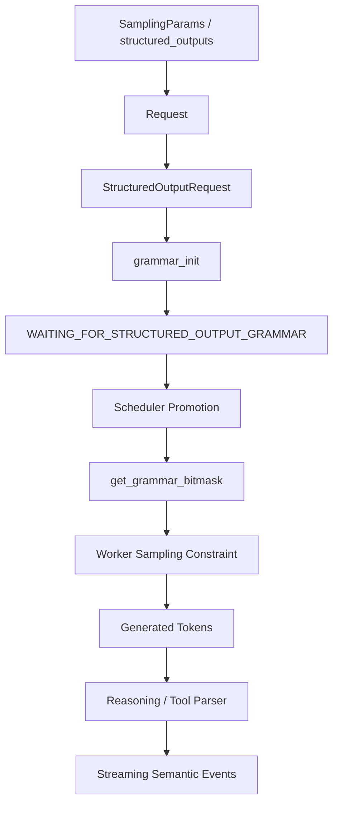
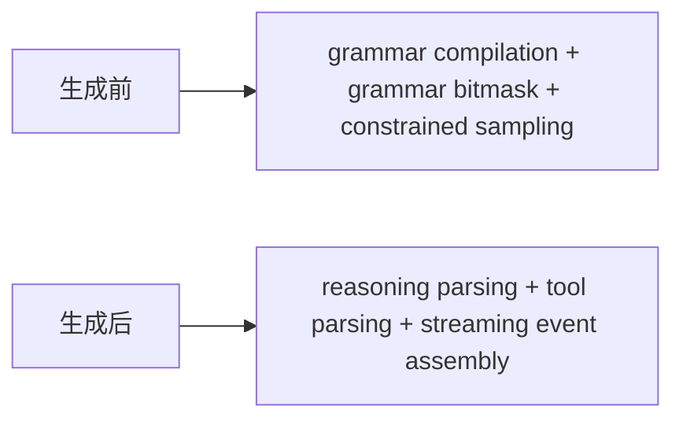
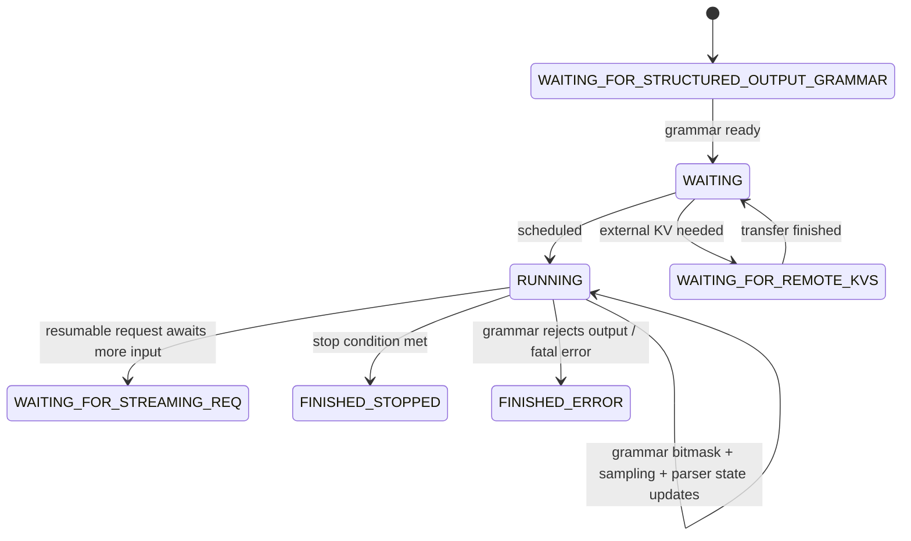

# 结构化输出、推理增强与请求状态机

## 这篇要回答什么问题

写到这里，这条源码主线已经讲过了：

- 服务层怎么接 OpenAI 兼容请求
- Engine Core 为什么是控制中心
- scheduler 怎样把连续批处理、KV cache、多 LoRA、多模态都组织进同一条主链路

如果你顺着这条线继续往后看，很快会遇到另一个很容易被误解的问题：

> 结构化输出不就是“最后把模型生成的文本校验一下”吗？为什么 vLLM 要把它放进 Engine Core、scheduler、worker 甚至请求状态机里？

很多人第一次接触 structured output 时，直觉都会是：

- 用户给一个 JSON schema、regex 或 choice
- 模型照常生成文本
- 最后 API 层做一次校验或重试

这种理解在一些简单系统里能成立，但在 vLLM 里很快就会碰壁。

因为只要你顺着源码读，就会看到这些非常反直觉的现象：

- `Request` 一创建出来，就可能先进入 `WAITING_FOR_STRUCTURED_OUTPUT_GRAMMAR`
- `EngineCore.preprocess_add_request()` 会在请求真正进入 scheduler 之前，先调用 `structured_output_manager.grammar_init(req)`
- scheduler 每一步不只是发 token，还会在采样前调用 `get_grammar_bitmask()`
- worker 侧不是“采样后检查”，而是直接拿 grammar bitmask 约束采样空间
- reasoning parser 还会让系统区分“推理阶段”和“真正开始结构化输出阶段”
- 流式输出场景里，parser 又会在生成之后，把 token 流解释成 reasoning / content / tool call 事件

所以这篇真正想回答的，不是“结构化输出有哪些后端”，而是：

1. 为什么结构化输出不能只在 API 层后处理
2. `StructuredOutputManager` 到底负责什么
3. reasoning parser 和 tool parser 在系统里分别插在哪一步
4. 为什么请求状态机会专门为这些能力新增等待态

路线图里点名的重点，这篇都会覆盖：

1. 为什么结构化输出需要进入调度与输出处理链路
2. `RequestStatus` 为什么不只是 `WAITING/RUNNING/FINISHED`
3. reasoning parser 与 grammar bitmask 分别约束什么
4. 为什么这类“推理增强”能力必须进入 Engine Core，而不能只放在 API 层

## 如果不了解这一层，后面会在哪些地方读不下去

如果不先把这一层看明白，后面读 Engine Core 和 scheduler 时，通常会卡在这些地方：

- 看到 `Request.__init__()` 里只要有 structured output，就会把状态设成 `WAITING_FOR_STRUCTURED_OUTPUT_GRAMMAR`，会疑惑为什么一个新请求不是直接 `WAITING`。
- 看到 `StructuredOutputRequest` 里面保存的不是最终结果，而是 grammar future、reasoning parser kwargs、request-local parser，会意识到这不是 API 层的一次性校验。
- 看到 `EngineCore.step()` 在 `execute_model()` 之后、`sample_tokens()` 之前还要先拿 `grammar_bitmask`，会明白结构化输出已经进入采样路径了。
- 看到 scheduler 在 `_try_promote_blocked_waiting_request()` 里专门处理 `WAITING_FOR_STRUCTURED_OUTPUT_GRAMMAR`、`WAITING_FOR_REMOTE_KVS`、`WAITING_FOR_STREAMING_REQ`，会意识到请求状态机本身已经被这些增强能力改写了。
- 看到 `StructuredOutputManager.should_fill_bitmask()`、`should_advance()` 要根据 reasoning 是否结束来决定 grammar 什么时候开始真正生效，会发现“thinking”和“structured output”并不是简单串联。
- 看到前端 `ParserManager.get_parser()` 会把 reasoning parser 和 tool parser 组合成统一 parser，而流式解析又依赖 `StreamingParserEngine` 输出 semantic events，会明白“约束生成”和“解释输出”其实是两层不同能力。

这些现象背后真正要建立的认知是：

**在 vLLM 里，结构化输出和推理增强不是响应后处理，而是请求生命周期的一部分。**

## 先给一张全景图

先用一句话概括：

> vLLM 把结构化输出拆成了两段能力：一段在生成前，用 grammar bitmask 直接约束采样；另一段在生成后，用 reasoning/tool parser 把 token 流解释成更高层的语义事件。而这两段能力都会反过来改变请求的状态流转，因此它们都必须进入 Engine Core。

如果画成一张图，大致是这样：

如果换个角度，也可以拆成两层：

这张图里最重要的一点是：

**结构化输出不是“模型生成完以后再解释”，而是先约束生成，再解释生成。**

## 第一层：为什么结构化输出不能只放在 API 层做后处理

这个问题其实是整篇的起点。

### 1. 如果只在 API 层后处理，你已经来不及了

假设系统真的这样做：

- 模型先自由生成
- API 层再检查是否满足 JSON / regex / choice

那么你立刻会遇到三个问题：

- 生成了不合法 token，GPU 时间已经花掉了
- speculative decoding、流式输出、连续批处理都已经基于这些 token 往前推进了
- 对于 tool call、thinking、structural tag 这类阶段性输出，你甚至很难定义“后处理”到底该在哪个边界介入

也就是说，一旦系统已经在 worker 里完成采样，再试图在 API 层“纠正”它，通常已经太晚了。

### 2. vLLM 需要的是约束采样，而不是校验字符串

vLLM 这里做的不是：

- validate final text

而是：

- constrain next-token choices

这也是为什么 `EngineCore.step()` 的主链路是：

- `execute_model()`
- `get_grammar_bitmask()`
- `sample_tokens()`

而不是：

- `execute_model()`
- `sample_tokens()`
- `post_validate()`

一旦顺序变成前者，结构化输出就不可能只存在于 API 层。

### 3. reasoning / tool use 还会进一步打破“后处理”假设

结构化输出只约束“最后答案的形状”时，很多人还会觉得后处理勉强可行。

但一旦你再加上：

- reasoning parser
- auto tool choice
- structural tag
- streaming tool calls

事情就变了。

因为这时系统不仅要关心：

- 最终文本是否合法

还要关心：

- 当前是不是还在 reasoning 阶段
- grammar 此刻应不应该生效
- 当前这段 delta 是 content、reasoning 还是 tool args

这些判断都发生在请求生命周期中间，而不是最后。

所以这类能力天然要进入 Engine Core。

## 第二层：`Request` 为什么会先进入等待态

这篇最值得先看的文件其实不是 backend，而是：

- `vllm/v1/request.py`

### 1. `Request` 一创建就可能处于阻塞态

在 `Request.__init__()` 里，只要：

- `StructuredOutputRequest.from_sampling_params(...)` 返回非空

那么 generative request 会立即：

- 创建 `self.structured_output_request`
- 把 `self.status` 设成 `WAITING_FOR_STRUCTURED_OUTPUT_GRAMMAR`

这件事本身就说明了很多问题。

因为它意味着结构化输出不是“运行中附加属性”，而是：

**请求能否进入正常调度队列的前置条件。**

### 2. `StructuredOutputRequest` 保存的是运行时状态，不是配置快照

继续看 `vllm/v1/structured_output/request.py`，会发现这个对象至少持有：

- `params`
- `_grammar`
- `reasoning_ended`
- `reasoning_parser_kwargs`
- `reasoner`

这里最关键的是：

- `_grammar` 可能是 `Future`
- `reasoner` 是 request-local
- `reasoning_ended` 会在生成过程中变化

这说明它不是“用户参数封装”，而是：

**请求级 structured output 运行时状态。**

### 3. 状态机因此必须显式表达“还不能调度”

如果 grammar compilation 还没完成，而 scheduler 又把这个请求正常发给 worker，后面的 constrained sampling 就没有依据。

所以最自然的设计就是：

- 先让请求停在 `WAITING_FOR_STRUCTURED_OUTPUT_GRAMMAR`
- grammar ready 之后，再把它提升回 `WAITING`

这也就是请求状态机存在的直接原因。

## 第三层：`StructuredOutputManager` 真正负责什么

这篇最值得精读的核心文件是：

- `vllm/v1/structured_output/__init__.py`

### 1. 它不是“某个 backend 的包装器”

`StructuredOutputManager` 表面上看像是在统一：

- xgrammar
- guidance
- outlines
- lm-format-enforcer

但如果只把它理解成 backend dispatch，就会低估它。

它真正负责的是：

1. 按请求初始化 grammar
2. 管理 grammar 编译的异步/同步策略
3. 在每个 step 构造 batch 级 bitmask
4. 决定 grammar 此刻应不应该生效
5. 决定生成后的 FSM 什么时候应该前进
6. 管理 request-local reasoning parser

换句话说，它不是“structured outputs SDK wrapper”。

它更像：

**Engine Core 里的结构化输出控制面。**

### 2. `grammar_init()` 是请求进入 Engine Core 时的第一道门

在 `EngineCore.preprocess_add_request()` 里，只要请求使用 structured output，就会调用：

- `self.structured_output_manager.grammar_init(req)`

这一步发生在：

- 输入线程
- 请求真正加入 scheduler 之前

而 `grammar_init()` 会做的事情是：

- 首次初始化 backend
- 选择 grammar backend
- 异步或同步编译 grammar
- 把 grammar 或 grammar future 挂到 request 上

这说明 grammar compilation 在 vLLM 里不是“调度之后顺手做”，而是：

**请求接入 Engine Core 时的正式准备步骤。**

### 3. 它还要处理 external launcher 下的确定性问题

文件里有一个很容易忽略但很说明问题的设计：

- external launcher 模式下禁用 async grammar compilation

原因注释写得很清楚：

- 不同 TP rank 上 grammar ready 时间不一致
- 会破坏 external launcher 依赖的调度确定性

这件事很能说明结构化输出到底有多“核心”。

因为它已经不是单请求局部逻辑，而是：

**会影响多 rank 调度一致性的系统行为。**

## 第四层：scheduler 为什么必须理解 `WAITING_FOR_STRUCTURED_OUTPUT_GRAMMAR`

接下来再看：

- `vllm/v1/core/sched/scheduler.py`

### 1. scheduler 眼里的 waiting 并不只有一种

在这个文件里，一个非常重要但容易被忽略的设计是：

- 并不是所有 waiting request 都等价

它专门维护了：

- 正常 `waiting`
- `skipped_waiting`

而被归入 blocked waiting 的状态包括：

- `WAITING_FOR_STRUCTURED_OUTPUT_GRAMMAR`
- `WAITING_FOR_REMOTE_KVS`
- `WAITING_FOR_STREAMING_REQ`

这说明 scheduler 已经不再把请求理解成简单的：

- waiting
- running
- finished

而是理解成：

**有些请求在逻辑上还没完成，但当前并不具备被调度的前提条件。**

### 2. `_try_promote_blocked_waiting_request()` 就是状态机的恢复点

这个函数正好把三类 blocked waiting 放在一起处理：

- 远端 KV 还没接收完
- structured output grammar 还没 ready
- streaming input 还没续上

对于结构化输出这条分支，逻辑很直接：

- 如果 `structured_output_req.grammar` 还没 ready，就继续阻塞
- 一旦 ready，就把 request.status 改回 `WAITING`

这件事的意义非常大。

因为它说明：

**grammar compilation 不是旁路任务，而是 scheduler 负责观察并推进的请求前置条件。**

### 3. 请求状态机因此成了 feature 汇合点

当你把这三种等待态放在一起看，会发现一个更重要的结论：

- 结构化输出
- KV transfer
- streaming continuation

虽然是不同功能，但它们都通过 `RequestStatus` 汇合到了同一套状态机里。

这就是为什么题目里会把：

- 结构化输出
- 推理增强
- 请求状态机

放在一起讲。

因为在 vLLM 里，这些能力不是平行模块，而是共同改写 request lifecycle 的东西。

## 第五层：grammar bitmask 为什么要进入采样主链路

这部分是“为什么不能只后处理”的最硬核证据。

### 1. bitmask 发生在 `sample_tokens()` 之前

在 `EngineCore.step()` 里，关键顺序是：

1. `scheduler.schedule()`
2. `model_executor.execute_model(...)`
3. `scheduler.get_grammar_bitmask(...)`
4. `model_executor.sample_tokens(grammar_output)`

这条顺序说明得非常清楚：

**模型先算 logits，结构化输出再给采样器一个约束 bitmask，最后才真正采样 token。**

所以它不是后处理。

它是采样控制。

### 2. `get_grammar_bitmask()` 是 batch 级操作

scheduler 在 `get_grammar_bitmask()` 里做的不是单请求检查，而是：

- 从本轮已调度请求里筛出 structured output request
- 按本轮批次顺序拼接 bitmask
- 返回 `GrammarOutput(structured_output_request_ids, bitmask)`

这说明 grammar 约束在 vLLM 里天然是：

- batched
- step-scoped
- 与 scheduler output 对齐

只要一件事需要 batch 级对齐，它就不可能优雅地留在 API 层。

### 3. speculative decoding 让这件事更复杂

`StructuredOutputManager.grammar_bitmask()` 里还专门处理：

- `scheduled_spec_decode_tokens`

也就是说，在 speculative decoding 场景下，系统要为：

- 多个 speculative 位置
- 再加一个 bonus / normal position

一起准备 bitmask。

这进一步说明结构化输出约束的对象不是：

- 一段最终字符串

而是：

**每一步、每个候选位置上的 token 选择空间。**

## 第六层：reasoning parser 和 grammar bitmask 分别管什么

这一层非常关键，因为很多人会把它们混在一起。

### 1. grammar bitmask 管“现在允许采什么”

它的职责是：

- 根据 schema / regex / grammar / choice / structural tag
- 约束当前采样位置可选的 token 集合

也就是：

**生成前约束。**

### 2. reasoning parser 管“当前生成阶段是什么”

`StructuredOutputManager` 里另一个关键能力是：

- `_get_reasoner()`
- `should_fill_bitmask()`
- `should_advance()`

这几个函数回答的问题不是：

- schema 是否匹配

而是：

- 当前是否还在 reasoning
- grammar 此刻是否应该介入
- 这一轮 token 生成之后，FSM 是否应该前进

也就是：

**阶段判断与状态推进。**

### 3. `reasoning_ended` 说明 structured output 不是始终开启的

只要 reasoning parser 存在，系统就可能要区分：

- reasoning 还没结束
- reasoning 刚刚结束
- reasoning 已经结束，后面开始进入受 grammar 约束的答案阶段

这也是为什么 `StructuredOutputRequest` 里会有：

- `reasoning_ended`

它不是日志字段，而是：

**采样约束是否真正开始生效的状态位。**

### 4. `should_advance()` 则控制 grammar FSM 什么时候吃掉输出

在 scheduler `update_from_output()` 里，只有当：

- `new_token_ids`
- 并且 `structured_output_manager.should_advance(request)` 为真

系统才会调用：

- `grammar.accept_tokens(req_id, new_token_ids)`

这说明 grammar FSM 并不是每一步都无脑前进。

reasoning parser 先决定：

- 现在该不该推进 grammar 状态

再由 grammar 去接受新 token。

所以这两者不是替代关系，而是：

**一个决定时机，一个决定约束。**

## 第七层：parser 为什么又在生成之后出现了一次

到这里很多人会问：

> 既然前面已经有 grammar 了，为什么前端还要有 `ParserManager`、tool parser、streaming parser engine？

答案是：

**因为前后两层解决的是不同问题。**

### 1. `StructuredOutputManager` 负责“怎么生成”

它管的是：

- grammar 编译
- 采样约束
- request-local reasoning state
- scheduler/worker 协作

### 2. `ParserManager` 负责“怎么解释输出”

在：

- `entrypoints/openai/chat_completion/serving.py`
- `entrypoints/openai/responses/serving.py`
- `entrypoints/serve/render/serving.py`

这些入口里，都会通过：

- `ParserManager.get_parser(...)`

把：

- reasoning parser
- tool parser

组合成一个统一 parser。

这层 parser 不是用来限制 GPU 采样，而是用来把生成结果解释成：

- reasoning 内容
- 最终 answer 内容
- tool calls
- streaming delta events

也就是：

**生成后解释。**

### 3. `StreamingParserEngine` 说明流式输出也不是字符串拼接

`vllm/parser/engine/streaming_parser_engine.py` 这份实现非常值得看。

它做的事情是：

- 扫描 token ids
- 增量词法分析
- 状态机驱动事件输出
- 产出 `SemanticEvent`

也就是说，流式输出在 vLLM 里并不是：

- 拼字符串
- 然后找几个标签

而是：

**对 token 流做增量语义解析。**

这尤其适合：

- reasoning 分段
- streaming tool calls
- structural tag

这些需要边生成边解释的场景。

## 第八层：请求状态机为什么必须显式变复杂

如果只看普通生成，很多系统的状态机足够简单：

- waiting
- running
- finished

但 vLLM 不行。

### 1. 因为“还活着但不能调度”是真实状态

对 vLLM 来说，请求可能是：

- 还没拿到 grammar
- 还没拿到远端 KV
- 还在等 streaming 续写输入

这些请求都不能算 finished，但也不能立即调度。

如果没有专门状态，scheduler 很难表达它们。

### 2. `RequestStatus` 实际上是系统能力的摘要

当你看 `RequestStatus` 时，会发现它不只是调度状态。

它其实在隐含地描述：

- 请求是否具备进入 GPU 执行的条件
- 请求是否在等待外部异步事件
- 请求是否还能继续恢复

所以它不是“实现细节 enum”，而是：

**功能能力对请求生命周期施加约束后的结果。**

### 3. 结构化输出只是其中一类典型等待态

这也是为什么这篇虽然重点讲 structured output，但会顺带提：

- `WAITING_FOR_REMOTE_KVS`
- `WAITING_FOR_STREAMING_REQ`

因为这三者共同说明：

**vLLM 的请求状态机本质上是异步运行时状态机，而不是同步调用状态机。**

## 第九层：最值得怎样读这条链路

如果你真的准备顺着源码读下去，我最推荐的顺序不是先看 backend，而是：

1. 先读 `vllm/v1/request.py`
2. 再读 `vllm/v1/structured_output/request.py`
3. 再读 `EngineCore.preprocess_add_request()`
4. 再读 `StructuredOutputManager`
5. 再读 scheduler 里的 `get_grammar_bitmask()`、`_try_promote_blocked_waiting_request()` 和 `update_from_output()`
6. 最后再读 `ParserManager` 和 `StreamingParserEngine`

这个顺序的好处是：

- 先看请求状态是怎么被 feature 改写的
- 再看 grammar 如何进入调度和采样
- 最后再看输出解析如何发生

这样不容易把“约束生成”和“解释输出”混在一起。

## 一张“结构化输出进入请求状态机”的图

这篇最适合记住的，是下面这张图：

这张图里最重要的一点是：

**结构化输出不是附着在 `RUNNING` 上的小逻辑，而是会改变请求从创建到调度再到完成的整条状态流。**

## 再按一次请求生命周期回到全局

现在可以把这篇的重点，再按一次请求生命周期串起来。

### 第 1 步：请求进入系统时，先生成 `StructuredOutputRequest`

在这一步里：

- 用户的 structured output 参数被提取出来
- 请求进入 `WAITING_FOR_STRUCTURED_OUTPUT_GRAMMAR`

所以结构化输出先成为请求状态语义。

### 第 2 步：Engine Core 在接入阶段初始化 grammar

在这一步里：

- `grammar_init()` 选择 backend
- grammar 被同步或异步编译

所以结构化输出再成为 Engine Core 准备阶段的一部分。

### 第 3 步：scheduler 等待 grammar ready，再把请求提升为可调度

在这一步里：

- blocked waiting request 被轮询检查
- grammar ready 后状态从阻塞 waiting 变回正常 `WAITING`

所以结构化输出继续成为调度语义的一部分。

### 第 4 步：每个 step 在采样前生成 grammar bitmask

在这一步里：

- scheduler 产出 batch 级 grammar bitmask
- worker 用它约束采样空间

所以结构化输出成为采样语义的一部分。

### 第 5 步：生成后再由 reasoning/tool parser 解释输出

在这一步里：

- reasoning parser 判断阶段边界
- tool parser / streaming parser 把 token 流变成语义事件

所以推理增强成为输出语义的一部分。

到这里再回看题目，就会发现这三件事其实是一回事的不同侧面：

- 结构化输出
- 推理增强
- 请求状态机

它们共同回答的是：

**当“生成文本”这件事不再是自由生成，而是要受 schema、阶段边界、tool call 语义和流式解释共同约束时，系统应该把这些逻辑放在哪里。**

vLLM 的答案是：

**放进请求生命周期主链路。**

## 一句话总结

不要把 vLLM 的结构化输出理解成“API 层把最终文本拿去校验一下”的后处理功能。

更准确地说，它在 vLLM 里的角色是：

> 一套先把请求置于 `WAITING_FOR_STRUCTURED_OUTPUT_GRAMMAR`，再由 `StructuredOutputManager` 初始化 grammar、由 scheduler 在每一步生成 grammar bitmask 约束采样、由 reasoning parser 决定 grammar 何时真正推进、最后再由统一 parser 把 token 流解释成 reasoning/tool/content 语义事件的运行时能力。

所以 vLLM 真正做的，并不是“支持 structured outputs”这么简单。

它真正做的是：

- 用 `StructuredOutputRequest` 把结构化输出变成请求级运行时状态
- 用 `RequestStatus` 明确表达“请求还活着，但当前不能被调度”
- 用 `grammar_init()` 和 `get_grammar_bitmask()` 把约束生成接入 Engine Core 主链路
- 用 reasoning parser 控制结构化约束的生效时机
- 用 `ParserManager` 和 `StreamingParserEngine` 在生成后继续解释 token 流

所以这篇标题里的三件事并不是并列概念。

它们共同描述的是：

**vLLM 如何把“受约束的生成”真正做成请求状态机的一部分。**
