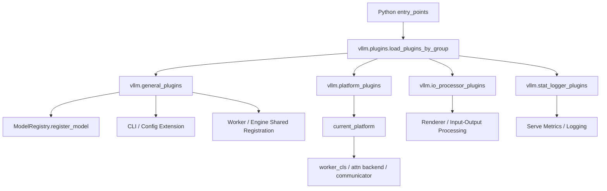
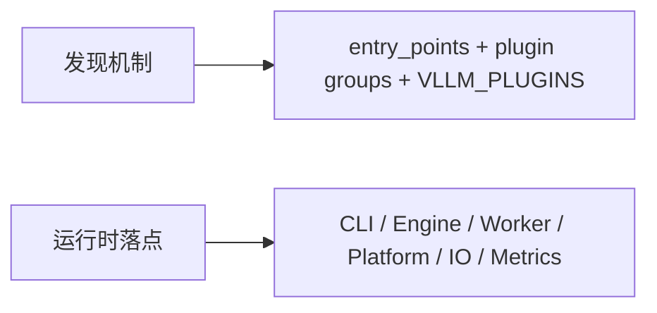
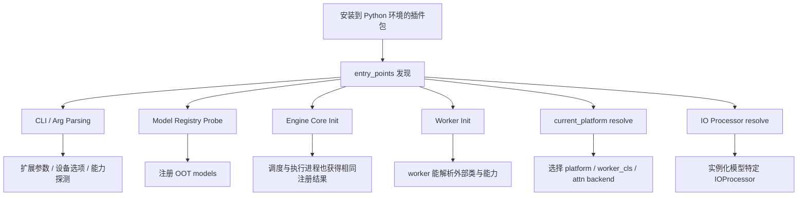

# vLLM 为什么能支持这么多模型和平台：插件系统视角

## 这篇要回答什么问题

写到这里，这套系列已经把主链路大体走通了：

- 请求怎样进入服务层
- Engine Core 怎样调度
- KV Cache、采样、Worker、并行运行时如何协作
- LoRA、多模态、结构化输出这些高级能力怎样横切主链路

如果继续往后看，接下来一个很自然的问题就是：

> vLLM 为什么能支持这么多模型、这么多设备平台、这么多外围能力，而且主仓库看起来又没有无限膨胀？

很多人第一次看 vLLM 的 supported models 列表时，直觉会是：

- 主仓里应该内置了很多模型适配器
- 平台支持大概也是在代码里写死的
- 真要扩展新模型或新设备，大概率只能改主仓

但顺着源码看下去，你会发现 vLLM 给出的答案并不是：

- 把所有能力都塞进主仓

而是：

- 把一部分能力内建
- 再把真正需要开放给外部生态的边界插件化

也就是说，这不是“代码多，所以支持得多”，而是：

**扩展边界设计得比较清楚，所以主仓可以保持核心运行时，模型、平台和一部分外围能力可以外接。**

这篇真正想回答的，就是：

1. vLLM 的插件系统到底解决了什么问题
2. general plugins、platform plugins、IO processor plugins、stat logger plugins 分别扩展哪一层
3. 为什么插件加载要贯穿 CLI、Engine Core、Worker、模型注册这些位置
4. 为什么官方能把部分模型能力放到独立插件仓库，而不是不断往主仓里堆

路线图里点名的重点，这篇都会覆盖：

1. general plugins 在何时加载
2. 插件系统如何扩展模型、平台和处理器
3. 为什么官方能把部分能力放到独立插件仓库

## 如果不了解这个模块，后面会在哪些地方读不下去

如果不先把插件系统这一层看明白，后面读模型注册、平台初始化和输入处理时，通常会卡在这些地方：

- 看到 `load_general_plugins()` 不是只在一个地方调用，而是出现在 `arg_utils.py`、`engine/core.py`、`worker_base.py`、`model_executor/models/registry.py`，会疑惑为什么“插件加载”要在这么多进程和阶段重复出现。
- 看到 `vllm.plugins.__init__.py` 明明只是用 Python `entry_points`，却要反复强调“插件函数要可重入”，会不知道这和 vLLM 的多进程架构有什么关系。
- 看到 `vllm.platforms.__getattr__("current_platform")` 是惰性解析的，还会去扫描 builtin platform plugins 和 out-of-tree platform plugins，会不明白为什么平台选择不能简单写死。
- 看到 `io_processor_plugin` 可以从模型的 `hf_config` 里读出来，再去 `vllm.io_processor_plugins` 组里找实现，会意识到有些模型的输入输出处理根本不应该耦合在主仓里。
- 看到文档里把 `BartForConditionalGeneration`、`Florence2ForConditionalGeneration` 直接指向官方 [bart-plugin](https://github.com/vllm-project/bart-plugin)，会好奇为什么这些模型没有直接并进主仓。

这些现象背后真正要建立的认知是：

**vLLM 的“支持很多模型和平台”，本质上来自一个插件化的扩展边界，而不是一个无限增长的内置列表。**

## 先给一张全景图

先用一句话概括：

> vLLM 通过 Python entry points 发现插件，再把这些插件分成“全进程都要知道的 general plugins”“决定设备栈的 platform plugins”“按模型选择的 IO processor plugins”和“服务侧观测扩展的 stat logger plugins”；于是主仓保留统一运行时，而具体模型、平台和外围适配则可以按边界外接。

如果画成一张图，大致是这样：

如果换一个角度，也可以把它拆成两半：

这张图里最重要的一点是：

**vLLM 的插件系统不是一个“扩展目录”，而是贯穿多进程运行时的注册与探测机制。**

## 第一层：插件系统到底在解决什么问题

要理解插件系统，最好先想清楚它想避免什么。

### 1. 它想避免主仓无限膨胀

如果没有插件机制，vLLM 支持一个新模型、新平台、新预处理器，大概率都要：

- 改主仓
- 增加条件分支
- 把外部生态实现耦合到核心运行时

这会带来三个明显问题：

- 主仓越来越大
- 非主流平台和模型会把核心运行时复杂度也带上去
- 外部生态很难在不改主仓的前提下迭代

插件系统解决的第一件事，就是：

**把“核心运行时”和“可变扩展面”拆开。**

### 2. 它还要适配 vLLM 的多进程架构

这点特别关键。

vLLM 不是一个单进程库，它至少可能同时涉及：

- API server / process0
- Engine Core
- Worker processes

再加上：

- TP / PP / DP
- headless / external launcher / Ray actor

这意味着插件如果只在“用户导入 vllm 的那个进程”里生效，是远远不够的。

所以 `docs/design/plugin_system.md` 一上来就强调：

- vLLM 的多个进程都需要加载插件

这也解释了为什么 `load_general_plugins()` 会反复出现在多个入口里。

### 3. 它真正提供的是“外部扩展能接入主链路的制度化接口”

插件系统不是只提供一个 import 口。

它真正提供的是：

- 标准发现机制
- 统一分组
- 可控加载
- 多进程可重复初始化
- 与主仓稳定 API 的对接承诺

这意味着外部插件不是“偷偷 monkey patch vLLM”，而是：

**沿着官方承认的边界接入。**

## 第二层：vLLM 是怎样发现插件的

这一层最值得先看的两个文件是：

- `docs/design/plugin_system.md`
- `vllm/plugins/__init__.py`

### 1. 发现机制很朴素：标准 Python `entry_points`

vLLM 没有发明一套自定义插件描述协议。

它直接使用：

- `importlib.metadata.entry_points`

来发现插件。

这点很重要，因为它意味着：

- 插件本质上就是普通 Python 包
- 只要安装进环境，就能被发现
- 对外部开发者的接入成本比较低

### 2. 每个插件本质上都是“一个可调用入口”

设计文档里给的最小例子非常经典：

- 插件包在 `entry_points` 里注册一个函数
- 这个函数在执行时做注册动作

比如：

- general plugin 调 `ModelRegistry.register_model(...)`
- platform plugin 返回平台类的全限定名
- IO processor plugin 返回处理器类的全限定名

这说明 vLLM 这里的插件不是“预先实例化的对象”，而更像：

**延迟执行的注册函数。**

### 3. `VLLM_PLUGINS` 是加载白名单

`vllm/plugins/__init__.py` 里还有一个很关键的环境变量：

- `VLLM_PLUGINS`

它的作用不是声明插件，而是：

- 控制已经被发现的插件中，哪些允许被加载

这意味着 vLLM 不只是“能发现插件”，还提供了：

- 默认全加载
- 或按名字白名单加载

这对生产环境很重要，因为它让插件生态具备了可控性。

## 第三层：为什么 `load_general_plugins()` 会在这么多地方调用

这是理解插件系统最关键的一点。

### 1. general plugins 不是“只加载一次，全局共享”

`vllm/plugins/__init__.py` 里明确写着：

- 插件可能在不同进程里被加载多次
- 插件函数必须可重入

这句话必须和 vLLM 的进程架构一起理解。

因为这里的“多次”不是单进程里随便重复 import，而是：

**不同进程都可能各自需要完成同样的注册动作。**

### 2. CLI 配置阶段就可能需要插件

在 `vllm/engine/arg_utils.py` 里，`load_general_plugins()` 会很早被调用。

而注释已经写明了一个典型原因：

- 插件可能扩展 `--quantization`
- 插件可能扩展 `--device`

这说明插件不是只影响“模型执行时怎么跑”，它还可能影响：

- CLI 参数集合
- 配置收敛逻辑
- 支持能力探测

也就是说，插件有一部分作用发生在请求还没进入 Engine Core 之前。

### 3. Engine Core 也必须加载 general plugins

在 `vllm/v1/engine/core.py` 里，Engine Core 初始化时也会：

- `load_general_plugins()`

这意味着即便服务层已经加载过插件，Engine Core 也不能假设：

- 自己天然知道外部模型、外部注册器、外部补丁

因为它是另一个进程，拥有另一份运行时状态。

### 4. Worker 进程同样要加载

在 `vllm/v1/worker/worker_base.py` 的 `init_worker()` 里，也会先：

- `load_general_plugins()`

这就把事情讲透了：

**如果插件会影响模型注册、类解析、设备能力或执行路径，那么 Worker 自己也必须看到这些注册结果。**

### 5. 模型注册子进程也要加载

更有意思的是，`vllm/model_executor/models/registry.py` 里那个子进程 `_run()` 也会先：

- `load_general_plugins()`

这一步很说明问题。

因为它意味着连模型注册/探测这种辅助子进程，也不能脱离插件环境。

否则主进程能识别的模型，子进程可能反而不认识。

所以 general plugins 的加载时机看起来分散，实际上逻辑非常统一：

**凡是需要感知扩展能力的进程，都要自行完成一次注册。**

## 第四层：四类插件各自扩展哪一层

这一层最适合按插件组来记。

### 1. `vllm.general_plugins`：扩展全局能力，最典型是模型注册

这是最核心的一组。

设计文档里直接说了：

- primary use case 是注册 out-of-tree models

最典型的动作就是：

- `ModelRegistry.register_model(...)`

测试里的 dummy plugin 也正是这样做的：

- 可以直接传类
- 也可以传字符串做 lazy import

这点很关键，因为文档还专门提醒：

- 某些模型导入时会初始化 CUDA
- 为避免 fork 子进程里重新初始化 CUDA，最好使用 lazy import

也就是说 general plugin 不只是“告诉 vLLM 有这个模型”，还要考虑：

- 多进程
- 惰性导入
- CUDA 初始化时机

### 2. `vllm.platform_plugins`：扩展设备平台栈

这是第二个很关键的分组。

在 `docs/design/plugin_system.md` 里，platform plugin 的要求很明确：

- 返回平台类全限定名
- 平台类负责 `worker_cls`
- 还要定义 attention backend、device communicator 等

而在 `vllm/platforms/__init__.py` 里，平台解析逻辑也非常清楚：

- 先收 builtin 平台插件
- 再收 out-of-tree 平台插件
- 所有候选都执行一遍探测函数
- 最终只允许激活一个平台

这里最值得注意的点有两个：

- 平台选择是“探测返回非空”的激活模式
- out-of-tree 和 builtin 平台都放在同一决策框架里

这说明 platform plugin 不是外挂设备支持，而是：

**直接进入 vLLM 设备抽象最底层的一层扩展点。**

### 3. `vllm.io_processor_plugins`：扩展模型特定的输入/输出处理

这组插件相对容易被忽略，但其实非常有代表性。

在 `vllm/plugins/io_processors/__init__.py` 里，可以看到它的选择路径是：

- 先看调用方是否显式指定插件
- 否则从模型的 `hf_config` 里读 `io_processor_plugin`
- 再去 `vllm.io_processor_plugins` 组里找对应实现

这说明它的设计目的不是给所有模型统一套一个处理器，而是：

**允许某些模型把自己的输入/输出处理逻辑声明成模型元数据的一部分。**

这非常适合：

- pooling 模型
- 特殊 encoder-decoder 模型
- 需要特定预处理/后处理的模型

它也很好地说明了插件系统的风格：

- 能放到模型元数据里的，就不强耦合进主仓逻辑

### 4. `vllm.stat_logger_plugins`：扩展观测，而不侵入核心逻辑

最后这组插件更偏服务侧，但也很说明边界意识。

在 `vllm/v1/metrics/loggers.py` 里，stat logger 插件要求：

- 必须是 `StatLoggerBase` 的子类

也就是说这组插件不是任意副作用函数，而是：

**通过稳定接口扩展观测能力。**

它的好处是：

- 核心运行时不用为每个外部观测系统加分支
- 插件作者也有明确的接入契约

## 第五层：平台插件为什么是理解“支持很多平台”的关键

题目里有一半是在问模型，另一半其实是在问平台。

### 1. `current_platform` 是惰性解析的

`vllm/platforms/__init__.py` 里最值得记住的设计是：

- `current_platform` 不是模块导入时立刻决定
- 而是在 `__getattr__` 里惰性解析

注释里其实已经把原因说透了：

- out-of-tree 平台插件需要先导入 `vllm.platforms.Platform`
- 如果太早解析 `current_platform`，插件还没来得及注册

这说明平台系统和插件系统不是平行设计，而是：

**平台解析本身就建立在插件加载顺序之上。**

### 2. 平台插件扩展的不是一个名字，而是一整条设备栈

设计文档里对 platform plugin 的要求其实非常重：

- `worker_cls`
- attention backend
- device communicator
- custom ops
- config patching

这意味着“支持一个新平台”在 vLLM 里并不只是：

- 增加一个 `if device == ...`

而是要让这个平台能够真正接入：

- worker 初始化
- KV cache
- execute_model
- distributed 通信
- attention kernel

也就是说，平台插件其实是：

**把一整条设备执行栈抽成了可替换模块。**

### 3. 这也是为什么官方不需要把每个平台都并进主仓

只要平台接口边界清楚，某些平台完全可以：

- 自己维护 worker
- 自己维护 attention backend
- 自己维护 device communicator

而主仓只需要维护：

- 平台抽象
- 解析逻辑
- 与运行时其他部分的接口契约

这就是插件化真正带来的扩展性。

## 第六层：模型插件为什么是理解“支持很多模型”的关键

如果说平台插件解释了“为什么能支持这么多设备”，那 general plugin 则更直接解释了：

**为什么能支持这么多模型。**

### 1. `ModelRegistry.register_model()` 是最核心的稳定边界之一

设计文档里专门把它拿出来说 compatibility guarantee：

- vLLM 保证这类文档化插件接口可用

这非常重要。

因为插件系统能不能形成生态，关键不在“能不能 hack 进去”，而在：

- 官方是否愿意承诺某些接口是稳定边界

`ModelRegistry.register_model()` 就是其中最典型的一个。

### 2. 插件注册模型，不等于把模型耦合进主仓

在 `docs/contributing/model/registration.md` 里，文档明确区分了：

- built-in models
- out-of-tree models

out-of-tree 模型的接入方式很直接：

- 在插件入口里调用 `ModelRegistry.register_model(...)`

这意味着模型支持的扩展路径不是只有“提 PR 到主仓”一种。

对生态来说，这非常关键。

### 3. 官方插件仓库就是这个机制的最好证明

这篇里最值得提的一个例子是：

- [bart-plugin](https://github.com/vllm-project/bart-plugin)

因为仓库内部已经明确把：

- `BartForConditionalGeneration`
- `Florence2ForConditionalGeneration`
- `MBartForConditionalGeneration`

等架构指向这个插件仓库。

甚至在 `vllm/inputs/engine.py` 里还专门写着：

- text-only encoder-decoder models 目前也按 multimodal 模型实现
- 示例就是 `bart-plugin`

这非常说明问题。

因为它告诉你：

**连官方自己都在用插件边界承载一部分模型能力。**

这不是备用通道，而是正式架构的一部分。

## 第七层：IO processor 插件为什么也很重要

如果只盯 general plugin，很容易把插件系统理解成“只是模型注册器”。

但 IO processor 插件说明事情不止如此。

### 1. 有些模型的“支持”不只是模型类能跑起来

对某些模型来说，真正困难的不只是：

- forward 能不能接入

还包括：

- 输入要怎么 render
- 输出要怎么解释
- 是否需要专门的 pooling 前后处理

这正是 IO processor 插件存在的原因。

### 2. 它把“模型特定处理”从主仓共性逻辑里分离出来

`get_io_processor()` 的设计很干净：

- 模型通过 `hf_config` 声明自己要哪个插件
- vLLM 负责发现、校验、实例化

这种方式的好处很明显：

- 主仓不必为每个模型写固定 if/else
- 模型作者可以把自己的处理逻辑打包出去
- 处理逻辑仍然能通过 renderer / config 正式进入主链路

这和前面多模态、renderer 那条线也正好能接上。

## 第八层：为什么插件要设计成“函数入口 + 可重入”，而不是更重的对象系统

这也是一个很值得想清楚的设计取舍。

### 1. 因为 vLLM 需要的是“注册动作”，不是“长生命周期插件对象”

大多数插件分组真正做的事情都是：

- 执行一次探测
- 执行一次注册
- 返回一个类名

它们并不需要常驻一个复杂插件对象贯穿整条生命周期。

所以用：

- entry point -> callable -> registration side effects / class qualname

这样的模式，其实是很贴合 vLLM 需求的。

### 2. 这种设计也更适合多进程重复初始化

如果插件是重对象、重状态、单例式生命周期，那在 vLLM 这种：

- API server
- Engine Core
- Worker
- 子进程探测器

都可能各自初始化一次的环境里，会很难管理。

而“可重入注册函数”恰好更容易适应：

- 每个进程单独执行一次
- 只要保证幂等即可

所以这个设计看起来朴素，其实非常贴合 vLLM 的运行时形态。

## 第九层：最值得怎样读这条链路

如果你真的准备顺着源码读插件系统，我最推荐的顺序不是先去找第三方插件，而是：

1. 先读 `docs/design/plugin_system.md`
2. 再读 `vllm/plugins/__init__.py`
3. 再读 `vllm/platforms/__init__.py`
4. 再读 `vllm/engine/arg_utils.py`、`vllm/v1/engine/core.py`、`vllm/v1/worker/worker_base.py` 里 `load_general_plugins()` 的调用点
5. 再读 `vllm/plugins/io_processors/__init__.py`
6. 最后读 `docs/contributing/model/registration.md` 和测试里的 dummy plugin

这个顺序的好处是：

- 先建立发现与加载机制
- 再看平台和模型两条最重要的扩展路径
- 最后再看作者视角的接入方式

这样更容易把“插件系统”理解成架构层能力，而不是零散工具函数。

## 一张“插件加载时机图”

这篇最适合记住的，是下面这张图：

这张图里最重要的一点是：

**插件不是在某个“插件中心”一次性加载完，而是在不同进程、不同初始化阶段按需重复装配。**

## 再按一次请求生命周期回到全局

虽然这篇讲的是插件系统，但它仍然可以回到我们一直用的“请求生命周期”视角。

### 第 1 步：启动前，插件先影响能力边界

在这一步里：

- CLI 参数可能被插件扩展
- 平台解析可能由平台插件决定
- 模型注册表可能因 general plugin 被补充

所以插件先影响“系统能不能认识这个模型/平台”。

### 第 2 步：系统初始化时，Engine Core 和 Worker 再各自重放注册动作

在这一步里：

- Engine Core 加载 general plugins
- Worker 加载 general plugins

所以插件再影响“每个进程能不能拥有一致的扩展视图”。

### 第 3 步：请求进入服务层后，模型特定处理器也可能由插件提供

在这一步里：

- IO processor 插件可能接管输入/输出处理

所以插件又继续影响了请求进入主链路的方式。

### 第 4 步：执行阶段，平台插件提供的设备栈真正落地

在这一步里：

- worker_cls
- attention backend
- device communicator

都可能来自平台插件。

所以插件最终进入执行路径。

到这里再回看题目，就会发现“支持这么多模型和平台”并不是两个分开的答案。

它们共享的是同一套机制：

**把可变实现沿着清晰边界插件化，然后让这些插件在多进程运行时中被制度化发现和加载。**

## 一句话总结

不要把 vLLM 的插件系统理解成“给用户留了几个可选扩展点”这么简单。

更准确地说，它在 vLLM 里的角色是：

> 一套基于 Python `entry_points` 的、多进程可重复加载的扩展机制：general plugins 负责把模型等全局能力注册进运行时，platform plugins 负责把设备平台整条执行栈接进来，IO processor plugins 负责把模型特定输入输出处理接进主链路，而 stat logger plugins 则把观测能力开放给外部生态。

所以 vLLM 真正做的，并不是“内置支持很多模型和平台”这么简单。

它真正做的是：

- 用插件分组把不同层次的扩展边界拆清楚
- 用多进程重复加载保证每个进程都获得一致的注册结果
- 用稳定接口如 `ModelRegistry.register_model()` 支撑 out-of-tree 生态
- 用平台插件把 worker、attention backend、communicator 这整条设备栈开放出去
- 用 IO processor 插件把模型特定处理逻辑从主仓共性代码中分离出来

所以 vLLM 之所以能支持这么多模型和平台，不只是因为它“写了很多适配器”。

更根本的原因是：

**它把可扩展性做成了架构的一部分。**
