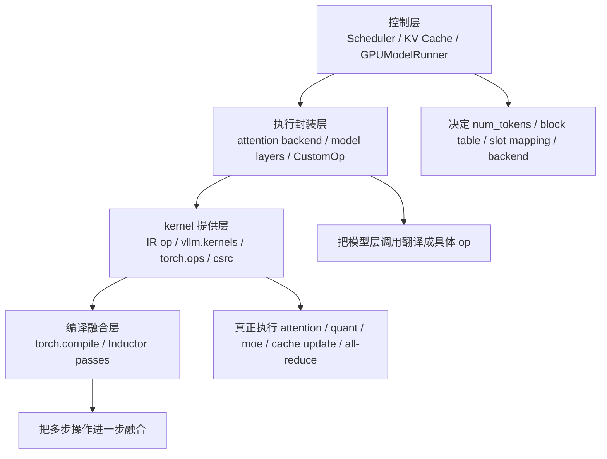
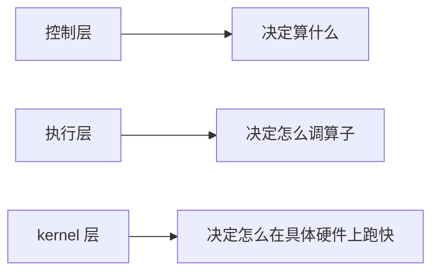
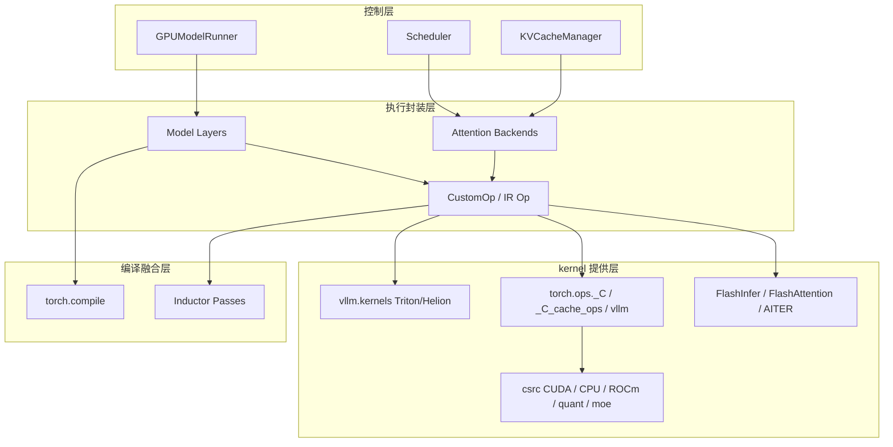

# Python 外壳下的真性能：vLLM 的 kernel 栈怎么分层

## 这篇要回答什么问题

写到系列最后，很多读者都会自然地问一句：

> vLLM 真正快的地方，到底在哪？

如果前面几篇你已经看过调度器、KV Cache、GPU Worker、GPUModelRunner、LoRA、多模态和结构化输出，直觉上很容易得出一个不完整的结论：

- 上面这些 Python 代码负责控制流程
- 真正的性能都藏在 `csrc/` 里
- 所以只要去读 `cu` 文件，性能秘密就差不多找到了

这类判断只对了一半。

因为 vLLM 的“真性能”确实大量落在底层 kernel 上，但它不是一个“Python 慢，C++/CUDA 快”的二分法故事。

更准确地说，vLLM 的性能栈至少分成四层：

1. 控制层：决定这一步到底要算什么
2. 执行封装层：把请求状态、KV 布局、并行信息、attention metadata、quant 配置整理成算子调用
3. kernel 提供层：用 `CustomOp`、IR op、Triton/Helion、Torch 自定义算子和 `csrc` 扩展提供真正的高性能实现
4. 编译融合层：用 `torch.compile` 和 Inductor passes 把多步操作进一步融合

所以这篇真正想回答的，不是“`csrc/` 里有什么目录”，而是：

1. 为什么 vLLM 的性能实现不能只看 `csrc/`
2. `vllm/kernels/`、`CustomOp`、IR op、`torch.ops.*` 和 `csrc/` 之间到底是什么关系
3. attention、quantization、all-reduce、CPU kernel 分别落在哪些层
4. 为什么不先理解调度和缓存，就读不懂底层 kernel 到底在优化什么

路线图里点名的重点，这篇都会覆盖：

1. Python 侧 kernel 封装与 `csrc` 自定义算子的关系
2. attention、quantization、all-reduce、CPU kernel 在仓库中的位置
3. 为什么阅读底层实现前，必须先理解调度和缓存

## 如果不了解这一层，后面会在哪些地方读不下去

如果不先建立这套“性能栈分层”认知，后面读底层实现时通常会卡在这些地方：

- 看到 `vllm/kernels/` 里既有 `vllm_c.py`、`aiter_ops.py`，又有 `triton/` 和 `helion/`，会误以为这里只有“绑定文件”和“实验代码”，但实际上这里已经是正式 kernel 提供层的一部分。
- 看到 `CustomOp` 会按 `current_platform` 分发到 `forward_cuda()`、`forward_hip()`、`forward_cpu()`、`forward_xpu()` 或 `forward_native()`，会不知道这到底是在做“后端选择”还是“性能开关”。
- 看到 `torch.ops._C.*`、`torch.ops._C_cache_ops.*`、`torch.ops.vllm.*`、`torch.ops.vllm_aiter.*` 并存，会分不清哪些来自主仓 `csrc`，哪些来自第三方库，哪些是 Python 里再包装出来的 Torch custom op。
- 看到 `docs/design/fusions.md` 里讲的 `AllReduce -> RMSNorm -> quant`、`RoPE -> KV cache update`、`GEMM -> collective overlap`，会误以为这些性能优化都是单个“神奇 kernel”，但它们其实很多是编译期 pass 把多个算子拼起来的结果。
- 看到 attention backend 目录这么大，会想直接挑一个 `flashinfer.py` 或 `flash_attn` 去读，但如果你不先知道 scheduler 是怎么产出 `slot_mapping`、`block_table_tensor`、`seq_lens` 和 `num_tokens` 的，就很难理解这些 kernel 参数为什么长这样。

这些现象背后真正要建立的认知是：

**vLLM 的性能不是“一个快 kernel”带来的，而是控制层、执行层、kernel 层和编译融合层共同组织出来的。**

## 先给一张全景图

先用一句话概括：

> vLLM 的性能栈不是“Python 在上，CUDA 在下”这么简单，而是“Python 控制层决定计算语义，执行封装层把请求状态整理成结构化张量和元数据，kernel 提供层再通过 IR op、CustomOp、Triton/Helion、Torch 自定义算子和 `csrc` 扩展去落地，而编译融合层继续把这些操作按平台和 token 规模重写成更高效的执行图”。

如果画成一张图，大致是这样：

如果换个角度，也可以拆成三层：

这张图里最重要的一点是：

**底层 kernel 从来不是脱离运行时独立存在的，它吃到的输入形态本身就是调度器和缓存系统定义出来的。**

## 第一层：为什么说“Python 外壳”这个说法既对又不对

这个标题故意用了一个很容易引发误解的说法。

### 1. 对的地方：vLLM 的大部分系统组织确实在 Python

前面几篇已经反复看到：

- API Server
- Engine Core
- scheduler
- KV cache manager
- GPUModelRunner
- attention backend 选择
- LoRA、多模态、structured output

这些高层能力几乎都在 Python。

它们负责决定：

- 当前 step 调度哪些请求
- 这轮有多少 token
- block table 怎么排
- slot_mapping 怎么生成
- 当前 attention backend 用哪一个
- 当前平台到底走 CUDA、ROCm、CPU、XPU 还是 OOT

### 2. 不对的地方：Python 不只是“套壳”

如果把 Python 看成纯粹控制壳，会低估很多事情。

因为在 vLLM 里，Python 不只是决定流程，它还决定：

- 算子的语义边界
- 输入输出张量布局
- 是否走 native / custom / compiled path
- 是否启用某个 `CustomOp`
- 是否允许 Inductor 继续 fuse

换句话说，Python 不是“调完 kernel 就结束”的胶水。

它其实是：

**性能实现的组织层。**

### 3. 更准确的说法是：性能在底层落地，但在上层成形

所以这篇的主论点可以先提前说出来：

**vLLM 的性能不是被 Python 包起来的 CUDA 实现，而是由 Python 运行时把问题整理对了之后，底层 kernel 才有机会跑出应有的性能。**

## 第二层：真正的分层不是“语言分层”，而是“职责分层”

如果只按语言看目录，很容易把仓库误读成：

- Python = 业务逻辑
- C++/CUDA = 性能逻辑

但 vLLM 更合理的划分方式是按职责。

### 1. 控制层：决定这一轮到底算什么

这层最典型的就是：

- `Scheduler`
- `KVCacheManager`
- `GPUModelRunner`

它们决定的不是 kernel 细节，而是：

- 哪些请求进 batch
- 这轮 `num_new_tokens` 是多少
- 哪些 block 已命中 prefix cache
- 哪些 slot 需要写 KV cache
- 哪些 encoder inputs 要跑
- 哪个 attention backend 会被选中

没有这层，底层 kernel 根本不知道自己该处理哪一批张量。

### 2. 执行封装层：把运行时状态翻译成可执行算子调用

这层最典型的是：

- `vllm/model_executor/layers/*`
- `vllm/v1/attention/backends/*`
- `CustomOp`
- IR op 注册与实现

它们负责把上层状态翻译成：

- `torch.ops._C.reshape_and_cache_flash(...)`
- `torch.ops._C.rms_norm(...)`
- `torch.ops.vllm.*`
- `torch.ops.vllm_aiter.*`

或者某个 Triton / Helion kernel 调用。

### 3. kernel 提供层：真正把某种运算在特定平台上跑快

这层才是大家最容易想到的“底层实现”，包括：

- `csrc/`
- `vllm/kernels/triton/`
- `vllm/kernels/helion/`
- 第三方库接口，比如 FlashAttention、FlashInfer、AITER

这里才真正实现：

- attention
- RoPE
- KV cache scatter
- quantization
- fused MoE
- all-reduce
- CPU attention / CPU GEMM / CPU MoE

### 4. 编译融合层：把多个操作重写成更少、更大的执行单元

这一层最容易被忽略，因为它不总表现为一个单独 kernel 文件。

`docs/design/fusions.md` 讲得很清楚，vLLM 会通过 `torch.compile` 的 Inductor passes 去做：

- `AllReduce -> RMSNorm`
- `Attention -> Quant`
- `RoPE -> KV Cache Update`
- `QK Norm -> RoPE`
- `RMSNorm -> Quant`
- `SiLU+Mul -> Quant`
- `GEMM -> reduce-scatter / all-gather`

也就是说，很多“最终跑出来很快”的路径，并不是单个现成 kernel，而是：

**执行封装层 + kernel 提供层 + 编译融合层共同形成的结果。**

## 第三层：`CustomOp` 是 Python 封装和底层 kernel 之间最关键的桥

这一层最值得先看的文件是：

- `docs/design/custom_op.md`
- `vllm/model_executor/custom_op.py`

### 1. `CustomOp` 不是简单的“调用 C++ 扩展”

`CustomOp` 的职责其实比很多人想象得重。

它至少同时管这几件事：

- op 注册
- OOT op 覆盖
- 平台分发
- 是否启用 custom op
- 回退到 `forward_native()`
- 在需要时单独 `torch.compile`

这说明它不是一个薄封装。

它更像：

**性能实现的统一调度门面。**

### 2. 它把“同一个算子语义”分成多个后端实现

`CustomOp.dispatch_forward()` 的逻辑很直接：

- ROCm 走 `forward_hip()`
- CPU 走 `forward_cpu()`
- TPU 走 `forward_tpu()`
- XPU 走 `forward_xpu()`
- OOT 平台走 `forward_oot()`
- 默认 CUDA 走 `forward_cuda()`
- 都不合适时回退 `forward_native()`

也就是说，vLLM 在这里抽象的不是“某个 CUDA kernel”，而是：

**某个运算语义在不同平台上的最优实现。**

### 3. 它还是 custom kernel 和 `torch.compile` 之间的边界阀门

`custom_op.md` 里有个非常关键的点：

- 如果启用了 Inductor，默认配置下某些 `CustomOp` 会被禁用
- 这样 Inductor 就有机会自己生成融合后的 Triton kernel

这件事非常重要。

因为它说明 vLLM 并没有把“自定义算子”当成绝对正义。

它真正追求的是：

- 哪条路径更快，就走哪条路径

所以 `CustomOp` 既可能把你导向 `torch.ops._C.*`，也可能故意退回 native 实现，让编译器去做更大的图级融合。

### 4. OOT 自定义算子也说明底层性能栈不是封闭的

`CustomOp.register_oot()` 允许平台插件用 OOT 实现替换 in-tree op。

这意味着：

- 底层性能栈不仅可插拔
- 而且这种可插拔已经精确到“单个高性能算子”的粒度

这和上一篇插件系统正好能对上。

## 第四层：IR op 说明 kernel 提供层并不总是直接绑死到某个实现

如果说 `CustomOp` 是一个大门面，那么 IR op 是另一个很关键的抽象层。

### 1. IR op 先定义“运算语义”，再注册实现提供者

从：

- `vllm/ir/op.py`
- `vllm/ir/ops/__init__.py`

可以看出来，IR op 的设计重点不是“这个 op 来自哪个库”，而是：

- 先注册运算
- 再让不同 provider 提供实现

这和 `CustomOp` 的思路很相似，但粒度更偏向：

- 一个运算语义
- 多个实现 provider

### 2. `vllm/kernels/vllm_c.py` 和 `aiter_ops.py` 就是在给 IR op 填实现

例如：

- `rms_norm`
- `fused_add_rms_norm`

在 `vllm_c.py` 里会注册成 `vllm_c` provider，在满足条件时走：

- `torch.ops._C.rms_norm`
- `torch.ops._C.fused_add_rms_norm`

而在 `aiter_ops.py` 里，同样的运算语义又可以注册成：

- `aiter` provider

最后走：

- `torch.ops.vllm_aiter.rms_norm`
- `torch.ops.vllm_aiter.fused_add_rms_norm`

这说明 `vllm/kernels/` 不是“扩展加载器目录”，而是：

**IR op 到具体 provider 的实现注册层。**

### 3. 这也解释了为什么 `vllm/kernels/` 会同时出现多种风格

因为它的职责不是“统一语言风格”，而是：

- 给某个语义 op 提供一组可选实现

所以这里可以同时看到：

- `vllm_c.py` 这种基于 `torch.ops._C` 的绑定
- `aiter_ops.py` 这种再包一层 custom op 的桥接
- Triton kernel
- Helion kernel

## 第五层：`vllm/kernels/` 里其实已经有“写在 Python 里的 kernel”

这一层特别适合打破一个常见误解：

> 只有 `csrc/` 才算底层性能实现。

并不是。

### 1. Triton kernel 也是正式性能实现

例如：

- `vllm/kernels/triton/qkv_padded_fp8_quant.py`

这里直接定义了：

- `@triton.jit` kernel

它做的不是普通张量拼装，而是：

- 直接按 3D stride 从非连续 QKV 视图读取
- 量化到 FP8
- 把 `head_dim` padding 到 16 的倍数

这已经是非常典型的：

- 以 kernel 为中心的性能实现

而且它仍然写在 Python 里。

### 2. Helion 也说明“Python 里写 kernel”不是玩具路径

再看：

- `vllm/kernels/helion/ops/silu_mul_fp8.py`

它不仅是正式 op，而且还包含：

- config picker
- input generator
- 针对 `num_tokens` 和 `intermediate_size` 的 case 选择

这里最有意思的一点是：

- 它甚至直接使用了和 cudagraph capture size 对齐的 `num_tokens` 值做预调优

这非常能说明问题。

因为它告诉你：

**上层运行时的批次形状，会反过来塑造底层 kernel 的配置空间。**

### 3. 所以 `vllm/kernels/` 其实是“平台化 kernel 仓”

它并不只是给 `csrc` 打辅助。

更准确地说，它是一层：

- 用 Python 定义 provider
- 组合不同底层能力
- 给 IR op / Torch custom op 提供入口

的 kernel 仓。

## 第六层：`csrc/` 才是最重的底层实现层，但它也不是一个单一世界

如果说 `vllm/kernels/` 是桥，那 `csrc/` 就是最厚的地基。

### 1. `csrc/` 不是一个单文件扩展，而是一整套子系统

从目录上看就很明显，`csrc/` 至少分成这些大块：

- `attention/`
- `cpu/`
- `libtorch_stable/`
- `quantization/`
- `rocm/`
- `moe/`
- `quickreduce/`

这意味着底层实现并不是围绕一个“通用 kernel 引擎”组织，而是：

**按运算类别和平台栈组织。**

### 2. attention 在这里不是一个 op，而是一整片森林

attention 相关实现至少分布在：

- `csrc/attention/`
- `csrc/libtorch_stable/attention/`
- `vllm/v1/attention/backends/`
- 第三方 FlashAttention / FlashInfer / FlashMLA 接口

这说明 vLLM 的 attention 性能并不是单一路径。

它有：

- 自己的 paged attention / cache kernel
- backend 封装
- 第三方高性能实现
- 平台专属版本

### 3. quantization 在这里同样是一个大系统

只看 `csrc/libtorch_stable/quantization/` 就能看到：

- AWQ
- GPTQ
- FP4
- FP8
- W8A8
- fused quant kernels
- Marlin
- Machete

这说明量化在 vLLM 里不是“模型层加个 if quantized”。

它已经有：

- 专门 kernel
- 专门数据布局
- 专门融合路径

### 4. CPU 也不是 fallback，而是一套完整 kernel 子系统

`csrc/cpu/` 里至少能看到：

- CPU attention
- CPU layernorm
- CPU fused MoE
- `sgl-kernels` 下的 GEMM、conv、MoE、int4/int8/fp8
- 多 ISA 分支，比如 AMX、NEON、RVV、VSX、VXE

这非常值得强调。

因为很多人会下意识把 CPU 路径理解成：

- 没 GPU 时凑合用

但仓库结构已经说明：

**CPU 在 vLLM 里也是正式的性能目标平台。**

### 5. all-reduce 和通信相关优化也有专门落点

除了：

- `csrc/custom_all_reduce.cu`

你还会在：

- `vllm/distributed/device_communicators/flashinfer_all_reduce.py`

里看到基于 FlashInfer 的融合 all-reduce 路径。

这说明通信优化并不完全属于“分布式框架层”，它同样属于性能栈的一部分。

## 第七层：attention、quantization、all-reduce、CPU kernel 分别落在哪

这部分最适合把仓库地图整理一下。

### 1. attention：backend 封装在 Python，核心实现分散在多处

attention 相关最重要的三类位置是：

- `vllm/v1/attention/backends/`
- `vllm/v1/attention/ops/`
- `csrc/attention/` 与 `csrc/libtorch_stable/attention/`

再加上：

- `vllm/vllm_flash_attn/`
- FlashInfer / FlashMLA 接口

这说明 attention 在 vLLM 里是典型的“上层选择 + 下层多实现”结构。

### 2. quantization：模型层调用在 Python，真正快路径在 kernel 和融合 pass

量化相关位置主要有：

- `vllm/model_executor/layers/quantization/`
- `vllm/kernels/triton/`
- `csrc/libtorch_stable/quantization/`
- `csrc/quantization/`
- `docs/design/fusions.md` 里的量化融合 pass

所以量化不是单层能力，而是：

- 模型层声明
- 执行层选路
- kernel 层实现
- 编译层继续融合

### 3. all-reduce：通信库、设备通信封装和融合 pass 三层一起做

all-reduce 相关位置主要有：

- `csrc/custom_all_reduce.cu`
- `vllm/distributed/device_communicators/flashinfer_all_reduce.py`
- `vllm/compilation/passes/fusion/allreduce_rms_fusion.py`
- `vllm/compilation/passes/fusion/collective_fusion.py`

这说明通信性能也不是“PyTorch distributed 之外包一个库”那么简单。

它同样经历：

- 运行时选择
- 通信实现
- 编译重写

### 4. CPU kernel：不仅有 op，还有调度元数据准备和 ISA 特化

CPU 路径至少横跨：

- `vllm/v1/attention/backends/cpu_attn.py`
- `csrc/cpu/`
- `torch.ops._C.compute_slot_mapping_kernel_impl`

比如在 `cpu_attn.py` 里，CPU attention 路径一样要吃：

- `query_start_loc`
- `seq_lens`
- `block_table_tensor`
- `slot_mapping`

也就是说，CPU 路径不是一个“单独的简单实现”，它仍然深度依赖：

- vLLM 的 block 化缓存语义
- attention metadata

## 第八层：为什么说不理解调度和缓存，就读不懂底层 kernel

这是这篇最想强调的一点。

### 1. kernel 优化的对象不是抽象 Transformer，而是 vLLM 的运行时张量形态

看 `docs/design/paged_attention.md`，你会发现 paged attention kernel 最重要的输入不是：

- 一个连续的整段 K/V

而是：

- 分块存储的 `k_cache`
- `v_cache`
- block 级布局

这说明它优化的不是“理论 attention”，而是：

**vLLM 的分页 KV cache 语义。**

### 2. KV cache update kernel 直接吃的是 `slot_mapping`

例如在：

- `vllm/v1/attention/backends/flashinfer.py`

里，更新 KV cache 会调用：

- `torch.ops._C_cache_ops.reshape_and_cache_flash(...)`

这里关键的输入包括：

- `key`
- `value`
- `k_cache`
- `v_cache`
- `slot_mapping`

也就是说，底层 cache 写入 kernel 并不是自己“推断布局”，而是：

**直接吃上层调度和 metadata 已经算好的 slot mapping。**

### 3. CPU attention 也同样依赖 block table 和 slot mapping

在：

- `vllm/v1/attention/backends/cpu_attn.py`

里，如果是 encoder-only attention，它还会显式调用：

- `torch.ops._C.compute_slot_mapping_kernel_impl(...)`

来生成与 block table 对齐的 slot mapping。

这再一次说明：

**注意力 kernel 真正在优化的，不只是矩阵乘法，而是带 block 语义和 cache 布局的运行时数据结构。**

### 4. `num_tokens` 还会直接改变 kernel 配置和融合策略

前面看到 Helion kernel 的 config 选择会按：

- `num_tokens`
- `intermediate_size`

选 tuned case。

而 `docs/design/fusions.md` 也明确说明：

- `fuse_allreduce_rms` 只在低 token 区间更有利
- `fuse_gemm_comms` 和 sequence parallelism 只在高 token 区间更有利

这意味着底层性能路径并不是静态的。

它会直接受：

- 当前 step 的 token 数量
- 并行配置
- 硬件平台

影响。

而这些东西都来自调度器和运行时，而不是 kernel 自己决定。

### 5. 所以真正的阅读顺序应该反过来

不是：

- 先读 `csrc/attention_kernels.cu`
- 再猜上层在干什么

而应该是：

- 先理解 scheduler / KV cache / GPUModelRunner
- 再看 attention metadata 和 cache layout
- 最后再读具体 kernel

否则你很容易看到大量：

- block
- page
- slot
- head_dim
- dtype
- provider
- backend

却不知道它们为什么恰好长成这样。

## 第九层：编译融合层为什么也是“kernel 栈”的一部分

如果只看 `csrc/` 和 `vllm/kernels/`，这篇就还不完整。

### 1. 很多“快路径”并不是独立手写 kernel，而是 pass 产物

`docs/design/fusions.md` 已经把这种思路讲得非常清楚：

- vLLM 用 compile-time passes 把优化从模型定义里剥离出来

这意味着很多最终高性能路径，不是你在模型层直接看到的：

- `rms_norm()`
- `all_reduce()`
- `quant_fp8()`

逐个执行。

而是被重写成：

- 一个更大的融合图

### 2. 这层尤其适合解释“为什么自定义 kernel 不一定总是最好”

例如文档里就明确指出：

- 在一些 NVIDIA 场景下，Inductor 自动生成的 fused kernel 反而比自定义 CUDA kernel 更快

所以 vLLM 的态度不是：

- 手写 kernel 一定优于编译器

而是：

- 让 `CustomOp`、native op 和 compiler pass 一起竞争最优路径

### 3. 这层也把 attention、quant 和通信重新绑在了一起

最典型的几个例子就是：

- `Attention -> Quant`
- `AllReduce -> RMSNorm -> Quant`
- `RoPE -> KV Cache Update`
- `GEMM -> reduce-scatter / all-gather`

这些都不是单点优化。

它们是：

**跨算子、跨模块、甚至跨“计算和通信边界”的图级优化。**

所以如果把 kernel 栈理解成“若干独立 op 的集合”，也还是不够的。

## 第十层：怎样把这套性能栈读顺

如果你准备真的沿着源码继续挖，我建议按下面顺序读。

### 第一优先级：先补齐运行时语义

先读这些：

- `vllm/v1/core/sched/scheduler.py`
- `vllm/v1/core/kv_cache_manager.py`
- `vllm/v1/worker/gpu_model_runner.py`
- `docs/design/paged_attention.md`

先弄清：

- token 怎么被调度
- block 怎么分配
- slot mapping 怎么产生
- attention metadata 怎么组织

### 第二优先级：再看算子抽象边界

再读这些：

- `docs/design/custom_op.md`
- `vllm/model_executor/custom_op.py`
- `vllm/ir/op.py`
- `vllm/kernels/vllm_c.py`
- `vllm/kernels/aiter_ops.py`

这一轮重点不是看某个 kernel 细节，而是看：

- 运算语义怎么注册
- provider 怎么切换
- custom/native/compile 三条路径怎么共存

### 第三优先级：最后再按专题进入底层实现

然后再按你的兴趣选择一条线：

- attention：`vllm/v1/attention/backends/` + `csrc/attention/`
- quantization：`vllm/model_executor/layers/quantization/` + `csrc/libtorch_stable/quantization/`
- CPU：`csrc/cpu/` + `vllm/v1/attention/backends/cpu_attn.py`
- 通信：`flashinfer_all_reduce.py` + collective fusion passes
- 融合：`docs/design/fusions.md` + `vllm/compilation/passes/fusion/`

这样不容易迷路。

## 一张“控制层 / 执行层 / kernel 层”三层结构图

这篇最适合记住的，是下面这张图：

这张图里最重要的一点是：

**kernel 层并不是直接接在“模型 forward”后面，它前面还有一整层负责把运行时状态翻译成可执行语义。**

## 再按一次请求生命周期回到全局

虽然这篇已经非常底层，但它仍然应该回到我们一直沿用的请求生命周期视角。

### 第 1 步：请求先被调度，形成这一步真正要处理的 token 结构

在这一步里：

- scheduler 决定 batch
- KV cache manager 决定 block 和 slot
- GPUModelRunner 准备 attention metadata

所以这时系统先定义了“要算什么”。

### 第 2 步：执行层把这些状态翻译成算子调用

在这一步里：

- attention backend 被选中
- model layer 决定用哪个 op
- `CustomOp` / IR op 决定 provider

所以这时系统再定义了“准备怎么调”。

### 第 3 步：kernel 层在具体平台上真正执行

在这一步里：

- `torch.ops._C.*`
- Triton / Helion
- FlashInfer / FlashAttention / AITER
- CPU / CUDA / ROCm kernels

开始真正做：

- attention
- cache update
- quantization
- MoE
- collectives

所以这时系统才真正定义“怎么跑快”。

### 第 4 步：编译融合层继续重写执行图

在这一步里：

- 多个 op 可能被进一步融合
- 计算和通信可能被重新编排
- 小 token 和大 token 区间可能走不同快路径

所以最终性能是：

- 调度形态
- 执行封装
- kernel 实现
- 编译融合

共同决定的。

到这里再回看题目，就会发现“Python 外壳下的真性能”这句话真正想表达的不是：

- Python 只是表层

而是：

**高性能 kernel 的确重要，但它们之所以能高效工作，是因为 Python 运行时先把问题整理成了适合这些 kernel 的形状。**

## 一句话总结

不要把 vLLM 的性能实现理解成“上面是一层 Python 包装，下面藏着一些 CUDA kernel”这么简单。

更准确地说，它在 vLLM 里的角色分层是：

> 控制层先用调度器、KV Cache 和 ModelRunner 定义这一步真正要处理的 token、block 和 metadata；执行封装层再用 attention backend、`CustomOp` 和 IR op 把这些运行时状态翻译成可执行算子；随后 `vllm/kernels/`、`torch.ops.*`、`csrc/` 与第三方高性能库在具体平台上真正执行 attention、quantization、MoE、cache update 和 all-reduce；最后编译融合层继续把这些操作重写成更少、更快的执行图。

所以 vLLM 真正做的，并不是“在 Python 之下塞很多 kernel”这么简单。

它真正做的是：

- 用运行时把问题整理成适合优化的形状
- 用 `CustomOp` 和 IR op 把语义与实现解耦
- 用 `vllm/kernels/` 和 `csrc/` 提供多平台高性能实现
- 用 attention backend、通信封装和平台抽象把不同硬件路径统一到一套执行模型里
- 用 `torch.compile` 和 fusion passes 继续把局部优化提升为图级优化

所以这篇标题里的“真性能”并不只在 `csrc/`。

它真正存在于：

**控制层、执行层、kernel 层和编译层共同组成的整条性能栈里。**
