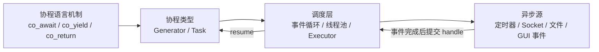
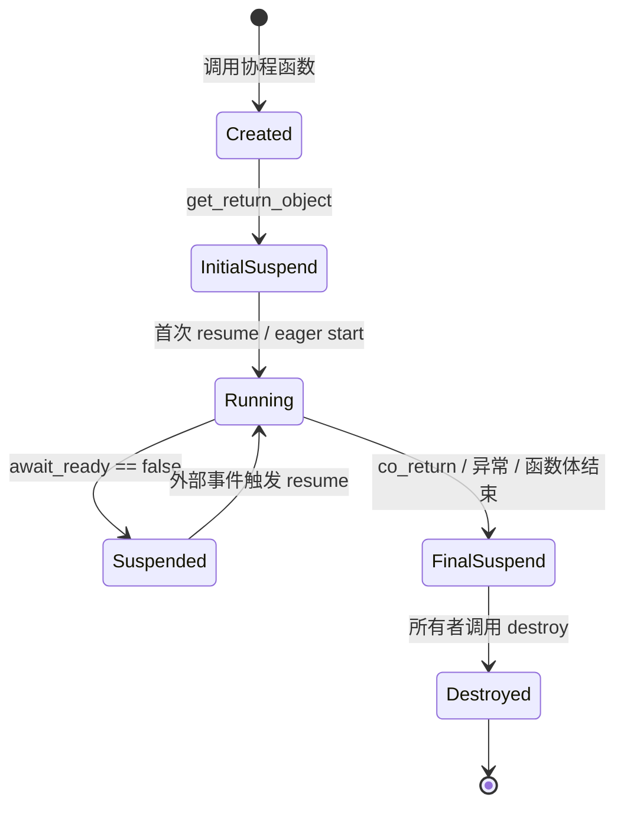
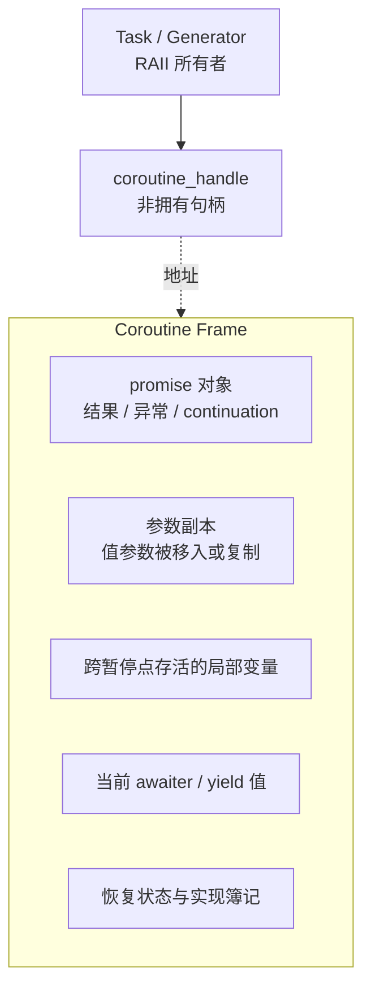
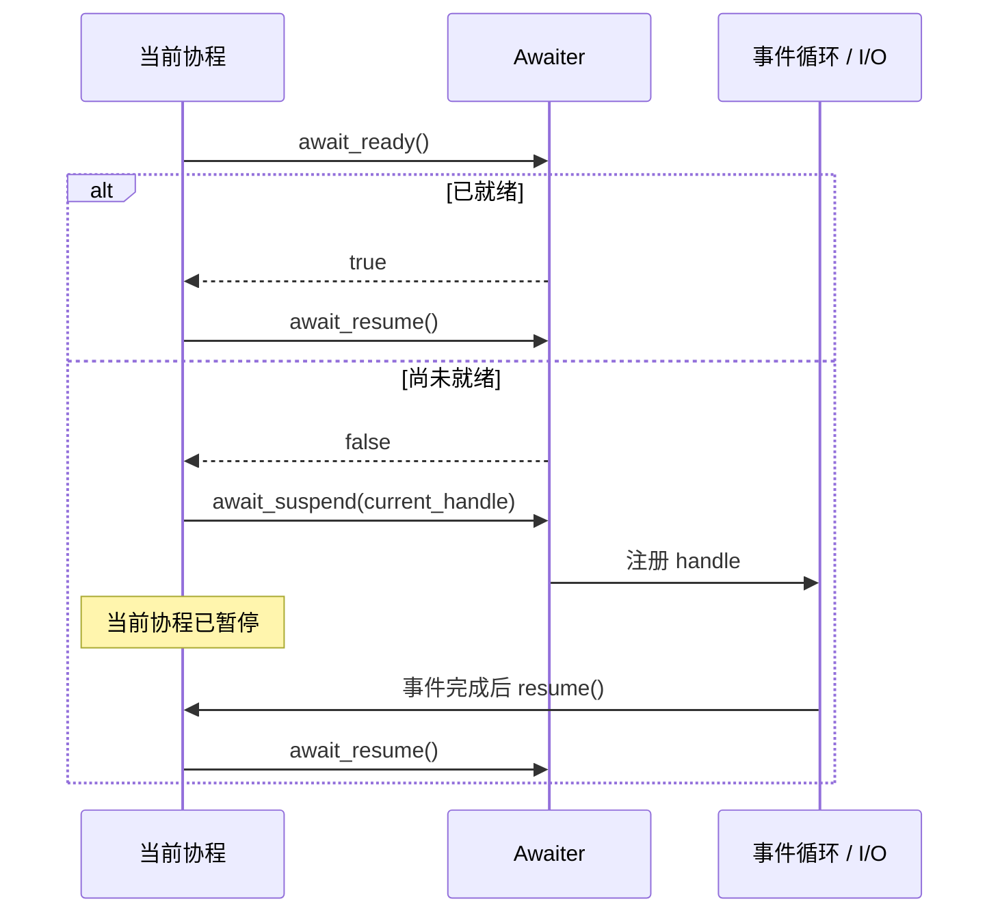
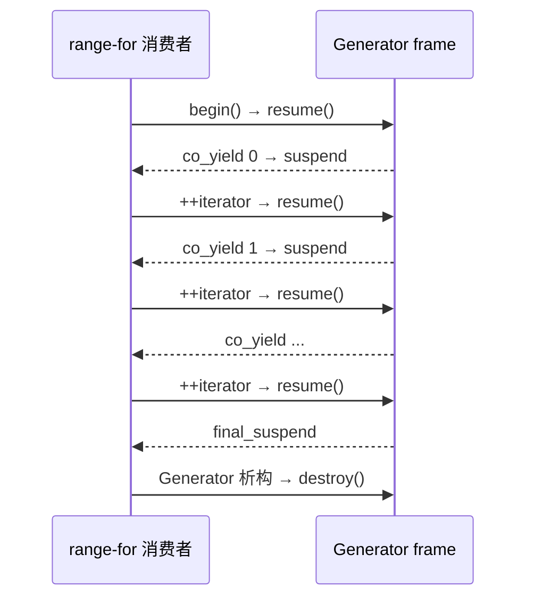
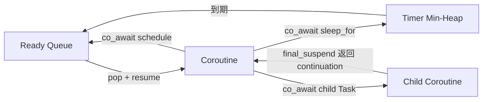

# C++20 协程原理：从编译器变换到 Task 与事件循环


> 本文面向已经掌握 RAII、移动语义、模板和基础并发的 C++ 开发者。示例使用 C++20，只依赖标准库。我们会从编译器协议出发，实现一个惰性 `Generator<T>`，再实现一个可以嵌套 `co_await` 的 `Task<T>`、定时 awaiter 和单线程事件循环。  
> 完整可运行代码：[source/coroutine/mini_coroutine.cpp](./source/coroutine/mini_coroutine.cpp)；构建说明：[source/coroutine/README.md](./source/coroutine/README.md)。  
> 资料核对日期：2026-07-21。

---

## 一、先说结论：协程是什么，又不是什么

C++20 协程是**可以暂停并在以后恢复的函数**。编译器把看起来线性的函数体变换成一个状态机，并生成用于保存状态的 coroutine frame（协程帧）。标准语言只定义变换协议，不替你提供网络 I/O、事件循环、线程池或完整的 `Task` 类型。

只要函数体中出现下列任一关键字，它就可能成为协程：

- `co_await`：等待一个 awaitable，必要时暂停；
- `co_yield`：产出一个值并暂停，常用于 generator；
- `co_return`：结束协程并向 promise 提交结果。

最重要的四个判断是：

1. **协程不是线程。** 暂停不会自动创建线程，恢复也不保证切换线程。
2. **协程不等于异步 I/O。** 对阻塞的 `read()` 使用一层协程包装，它仍会阻塞当前线程。
3. **`co_await` 不必真的暂停。** `await_ready()` 返回 `true` 时，执行会同步继续。
4. **`std::coroutine_handle` 默认不拥有协程帧。** 谁负责调用 `destroy()`，必须由返回类型的所有权协议明确规定。



这四层可以由同一个库打包，但概念上不能混为一谈。语言机制负责“在哪里暂停、怎样恢复”，调度器负责“何时、在哪个线程恢复”，I/O 后端负责“完成事件从哪里来”。

### 1.1 普通函数、线程与协程的差异

| 维度 | 普通函数 | 操作系统线程 | C++20 无栈协程 |
|---|---|---|---|
| 控制权 | 调用后运行到返回 | 由 OS 抢占调度 | 在显式/隐式暂停点协作让出 |
| 状态保存 | 调用栈 | 独立线程栈、寄存器等 | 编译器生成的协程帧 |
| 调度来源 | 调用者 | 操作系统 | 库、事件循环或应用协议 |
| 默认并行 | 否 | 可以 | 否 |
| 暂停成本 | 不适用 | 通常涉及线程调度 | 通常是状态写入和间接恢复，但取决于实现 |
| 典型用途 | 普通计算 | CPU 并行、阻塞任务 | 大量 I/O 等待、惰性序列、状态机 |

“无栈”不是完全不使用调用栈，而是每个协程没有一块可任意增长、可在任意深度切出的独立栈。只有协程函数本身被编译为可暂停状态机；普通子函数若不是协程，就不能从其内部任意挂起整个调用链。

---

## 二、从一段代码建立直觉

先看一个伪异步函数：

```cpp
Task<int> load_answer(EventLoop& loop)
{
    std::string request = "answer";
    co_await loop.sleep_for(100ms);
    co_return static_cast<int>(request.size()) + 36;
}
```

调用 `load_answer(loop)` 时发生什么，取决于它的 `promise_type`：

- 编译器建立协程帧；
- 参数 `loop` 的引用副本、跨暂停点存活的 `request`、promise 和当前执行位置进入帧；
- `get_return_object()` 创建返回给调用者的 `Task<int>`；
- `initial_suspend()` 决定立即运行还是先暂停；
- 执行到 `co_await` 时，定时器 awaiter 把当前 handle 交给事件循环；
- 100 ms 后事件循环调用 `resume()`；
- `co_return` 把结果写入 promise；
- `final_suspend()` 决定在帧尾暂停，还是立即结束并销毁状态。



这里不存在神秘的后台线程。我们的教学实现会在调用 `EventLoop::run()` 的那个线程上执行所有协程。

---

## 三、编译器大致把协程变成了什么

标准不是要求编译器真的生成下面这个类，而是用等价语义规定行为。理解时可以把协程想象成状态机：

```cpp
struct LoadAnswerFrame {
    int state;                       // 下一次从哪里恢复
    EventLoop* loop;                 // 引用参数的表示，仅作示意
    std::string request;             // 跨暂停点仍存活
    Task<int>::promise_type promise;
    /* awaiter、异常状态、簿记信息…… */
};

void resume(LoadAnswerFrame* frame)
{
    switch (frame->state) {
    case 0:
        frame->request = "answer";
        frame->state = 1;
        if (try_suspend_on_timer(frame)) {
            return;
        }
        [[fallthrough]];
    case 1:
        frame->promise.return_value(
            static_cast<int>(frame->request.size()) + 36);
        goto final_suspend;
    }

final_suspend:
    /* co_await frame->promise.final_suspend(); */
}
```

真实编译器还要处理对象构造/析构、异常边界、对齐、参数副本、awaiter 临时量和优化，因此实际降级结果复杂得多。这个模型的价值在于解释以下现象：

- `request` 在原调用栈返回后仍然存在，因为它是帧的一部分；
- 只在暂停点之前使用的临时局部量，可能根本不需要进入帧；
- 大对象跨越多个暂停点，会放大每个协程实例的内存成本；
- 恢复是跳转到状态机的某个分支，不是从头重新调用函数；
- 销毁帧会销毁其中仍存活的局部对象和参数副本。

### 3.1 协程帧里通常有什么



帧经常通过分配函数获得动态存储，但“协程一定发生一次堆分配”不是语言保证。编译器在满足生命周期嵌套、大小可知等条件时可能消除分配。不要根据直觉断言零分配；应检查优化后的汇编、分配统计和目标编译器。

### 3.2 值参数与引用参数

协程调用开始时会创建参数副本：值参数的副本进入协程状态，而引用参数仍然只是绑定到原对象的引用。所以下面存在悬空风险：

```cpp
Task<int> unsafe(const std::string& text)
{
    co_await some_async_event();
    co_return static_cast<int>(text.size()); // text 指向的对象可能已销毁
}

auto task = unsafe(std::string{"temporary"});
// 临时 string 已销毁，之后恢复 task 将访问悬空引用。
```

跨异步边界需要拥有数据时，优先按值传入并移动：

```cpp
Task<int> safe(std::string text)
{
    co_await some_async_event();
    co_return static_cast<int>(text.size());
}
```

---

## 四、`promise_type`：协程与返回类型之间的协议

编译器通过 `std::coroutine_traits<ReturnType, Args...>::promise_type` 找到 promise。最常见的写法是在返回类型中嵌套 `promise_type`：

```cpp
template <typename T>
class Task {
public:
    struct promise_type {
        // 协程协议成员
    };
};
```

这里的 promise 与 `std::promise` 没有继承或绑定关系，只是同名概念。

| promise 成员 | 何时使用 | 设计问题 |
|---|---|---|
| `get_return_object()` | 帧和 promise 建立后 | 返回对象怎样持有或引用 handle |
| `initial_suspend()` | 进入用户函数体之前 | `suspend_always` 为 lazy，`suspend_never` 为 eager |
| `return_value(value)` | 执行 `co_return value` | 结果存在哪里，移动是否安全 |
| `return_void()` | `co_return;` 或允许的自然结束 | 不能与同一 promise 的 `return_value` 同时出现 |
| `yield_value(value)` | 执行 `co_yield value` | 当前值放在哪里，何时暂停 |
| `unhandled_exception()` | 未捕获异常离开函数体 | 保存 `exception_ptr`、转换为错误或终止 |
| `final_suspend()` | 协程完成时 | 谁恢复 continuation，谁最终销毁帧 |

标准给出的核心替换模型可以简化为：

```cpp
{
    promise_type promise(/* 参数可能参与构造 */);
    auto return_object = promise.get_return_object();
    try {
        co_await promise.initial_suspend();
        // 原协程函数体
    } catch (...) {
        promise.unhandled_exception();
    }
final_suspend:
    co_await promise.final_suspend();
}
```

`get_return_object()` 发生在 `initial_suspend()` 之前。`final_suspend()` 必须保证不会把异常抛出协程边界。

### 4.1 Lazy 与 eager

```cpp
std::suspend_always initial_suspend() noexcept; // lazy
std::suspend_never  initial_suspend() noexcept; // eager
```

- **Lazy task**：调用只创建任务，第一次被 `co_await` 或显式启动时才执行，便于组合异步表达式；
- **Eager task**：调用时就进入函数体，适合某些事件源或“调用即开始”的 API，但必须更谨慎地处理完成竞争和返回对象发布时序。

两者没有绝对优劣。API 文档必须说明启动语义，否则调用者无法判断“只构造 Task 但不 await”究竟会不会执行副作用。

### 4.2 为什么教学实现的 `final_suspend()` 返回 `suspend_always`

如果最终暂停，协程的结果和异常仍可留在帧内，让 `Task` 或 awaiter 在读取后调用 `destroy()`。如果返回 `suspend_never`，帧可能在完成路径自动销毁；任何仍指向它的 handle 都会悬空。

因此，很多 task 类型采用“最终暂停 + 明确所有者销毁”的协议。它不是唯一方案，但所有权边界最容易讲清楚。

---

## 五、`co_await` 的三阶段协议

对表达式：

```cpp
Result value = co_await expression;
```

编译器先按规则取得 awaiter。简化后的查找顺序是：

1. 若 promise 定义适用的 `await_transform`，先做 `promise.await_transform(expression)`；
2. 再查找成员或非成员 `operator co_await`；
3. 若都没有，表达式本身就是 awaiter。

然后调用三个核心方法：

```cpp
struct Awaiter {
    bool await_ready();
    auto await_suspend(std::coroutine_handle<> current);
    Result await_resume();
};
```

### 5.1 `await_ready()`：能否同步完成

- 返回 `true`：不暂停，不调用 `await_suspend()`，直接执行 `await_resume()`；
- 返回 `false`：当前协程进入 suspended 状态，再调用 `await_suspend()`。

这条 fast path 很重要。缓存命中、已完成 future 或零时长定时器可以避免一次调度往返。

### 5.2 `await_suspend()`：把 handle 交给谁

它接收当前协程的 handle，返回类型有三种：

| 返回类型 | 含义 |
|---|---|
| `void` | 当前协程保持暂停，控制权返回 caller/resumer |
| `bool` | `true` 保持暂停；`false` 立即恢复当前协程 |
| `std::coroutine_handle<Z>` | 立刻把控制权转移给返回的协程，常用于对称转移 |

异步操作最关键的一步，通常是在这里把 handle 注册进定时器、I/O completion 或调度队列。注册完成后，事件源必须在恰当时机恢复一次，而且只能恢复仍然存活、确实处于暂停状态的协程。

### 5.3 `await_resume()`：恢复后的结果边界

协程恢复后调用 `await_resume()`：

- 它的返回值就是整个 `co_await` 表达式的结果；
- 它可以抛出异步操作保存的异常；
- 返回 `void` 时，`co_await` 表达式也产生 `void`。



### 5.4 “暂停后马上被恢复”的并发陷阱

一旦 `await_suspend()` 把 handle 发布给另一个线程，另一个线程理论上可以立刻恢复协程，甚至在 `await_suspend()` 返回之前继续运行并销毁相关状态。因此：

- 发布 handle 后，不要再无同步地访问可能随协程恢复而销毁的 awaiter 成员；
- 多线程事件源需要建立清楚的 happens-before 关系；
- 同一个协程不得被并发 `resume()`；
- 对 completed 或 running 协程调用 `resume()` 是未定义行为。

---

## 六、`co_yield` 与 `co_return` 只是协议糖

可以把：

```cpp
co_yield value;
```

理解为近似：

```cpp
co_await promise.yield_value(value);
```

generator 的 `yield_value()` 通常保存当前值并返回 `std::suspend_always`。消费者读取这个值，递增迭代器时再次 `resume()`，生产者才继续寻找下一个值。

类似地：

```cpp
co_return value;
```

会调用 `promise.return_value(value)`，随后进入最终暂停路径；`co_return;` 则对应 `return_void()`。

---

## 七、实现一：惰性 `Generator<T>`

下面的 generator 目标是：

- 调用函数时不执行函数体；
- `begin()` 才运行到第一个 `co_yield`；
- `operator++` 运行到下一个 `co_yield`；
- generator 独占协程帧，析构时 `destroy()`；
- 协程异常在消费端重新抛出。

### 7.1 promise 的关键部分

```cpp
template <typename T>
class Generator {
public:
    struct promise_type {
        std::optional<T> current_value;
        std::exception_ptr failure;

        Generator get_return_object() noexcept
        {
            using Handle = std::coroutine_handle<promise_type>;
            return Generator{Handle::from_promise(*this)};
        }

        std::suspend_always initial_suspend() const noexcept { return {}; }
        std::suspend_always final_suspend() const noexcept { return {}; }

        std::suspend_always yield_value(T value)
        {
            current_value.emplace(std::move(value));
            return {};
        }

        void return_void() const noexcept {}
        void unhandled_exception() noexcept
        {
            failure = std::current_exception();
        }
    };
};
```

两个 `suspend_always` 分别保证惰性启动和完成后仍由 `Generator` 管理帧。`current_value` 位于 promise，也就位于协程帧中；在下一次递增前，迭代器返回的引用保持有效。

### 7.2 迭代器就是恢复按钮

```cpp
Iterator& operator++()
{
    coroutine_.resume();
    Generator::rethrow_if_failed(coroutine_);
    return *this;
}

const T& operator*() const noexcept
{
    return *coroutine_.promise().current_value;
}

bool operator==(std::default_sentinel_t) const noexcept
{
    return !coroutine_ || coroutine_.done();
}
```

它是单遍历 input iterator，而不是可随意回退、复制出独立位置的容器迭代器。复制迭代器也只会指向同一个协程状态。

### 7.3 使用 generator

```cpp
Generator<std::uint64_t> fibonacci(std::size_t count)
{
    std::uint64_t current = 0;
    std::uint64_t next = 1;

    for (std::size_t index = 0; index < count; ++index) {
        co_yield current;
        const auto following = current + next;
        current = next;
        next = following;
    }
}

for (const auto value : fibonacci(8)) {
    std::cout << value << ' ';
}
```

控制权往返如下：



### 7.4 这个实现有意没有做什么

它按值保存产出，易于讲清生命周期，但不支持：

- 引用元素和零复制 yield；
- 递归 generator 的高效叶节点转移；
- 异步产出；
- 多消费者；
- 完整 ranges 借用语义。

生产中应优先使用标准库已支持的 `std::generator`（C++23）或成熟库，并检查目标标准库版本。教学实现的用途是看清协议，而不是复制成通用容器。

---

## 八、实现二：最小单线程事件循环

`Task` 要真正“以后再继续”，需要某个组件保存 handle 并在事件到来时恢复。我们的事件循环只有两个队列：

- ready queue：现在可以恢复的 handle；
- timer queue：按唤醒时刻排序的 handle。



调度队列保存的是**非拥有 handle**。本例由 `Task` 或它的 awaiter 拥有帧，所以已启动的根 Task 必须活到事件循环排空。

### 8.1 定时器 awaiter

```cpp
class SleepAwaiter {
public:
    bool await_ready() const noexcept { return delay_ <= 0ms; }

    void await_suspend(std::coroutine_handle<> coroutine) const
    {
        loop_.post_after(delay_, coroutine);
    }

    void await_resume() const noexcept {}
};
```

零时长走同步 fast path；正时长把 handle 放入 timer queue，当前协程暂停。

### 8.2 驱动循环

```cpp
void EventLoop::run()
{
    while (!ready_.empty() || !timers_.empty()) {
        if (!ready_.empty()) {
            auto coroutine = ready_.front();
            ready_.pop();
            if (!coroutine.done()) {
                coroutine.resume();
            }
            continue;
        }

        std::this_thread::sleep_until(timers_.top().wake_at);
        move_due_timers_to_ready_queue();
    }
}
```

真实网络 runtime 不应靠 `sleep_until` 等待所有事件，而会使用 epoll、kqueue、IOCP、io_uring 等平台机制或成熟跨平台库，同时处理唤醒、取消、关闭、工作窃取和线程亲和性。本例只是把“保存 handle → 事件就绪 → resume”这条链路显式画出来。

---

## 九、实现三：可组合的惰性 `Task<T>`

我们的 `Task<T>` 支持：

- lazy 启动；
- 单个非 `void` 结果；
- 未捕获异常保存与重抛；
- `co_await` 子 Task；
- 子 Task 完成时恢复父协程；
- 根 Task 投递给事件循环并同步读取最终结果。

它不支持取消、多等待者、线程安全、真实 I/O、`Task<void>` 和结构化并发，因此不能直接用于生产。

### 9.1 promise 保存结果、异常与 continuation

```cpp
struct promise_type {
    std::optional<T> value;
    std::exception_ptr failure;
    std::coroutine_handle<> continuation = std::noop_coroutine();

    std::suspend_always initial_suspend() const noexcept { return {}; }

    template <typename U>
    void return_value(U&& result)
    {
        value.emplace(std::forward<U>(result));
    }

    void unhandled_exception() noexcept
    {
        failure = std::current_exception();
    }
};
```

`continuation` 是“当前 Task 完成后要继续的父协程”。根 Task 没有父协程，因此默认使用 `std::noop_coroutine()`。

### 9.2 `final_suspend()` 完成对称转移

```cpp
struct FinalAwaiter {
    bool await_ready() const noexcept { return false; }

    std::coroutine_handle<> await_suspend(
        handle_type completed) const noexcept
    {
        return completed.promise().continuation;
    }

    void await_resume() const noexcept {}
};

FinalAwaiter final_suspend() const noexcept { return {}; }
```

当子 Task 到达最终暂停点，`await_suspend()` 返回父协程 handle，控制权直接转回父协程。相比手写 `continuation.resume()`，返回 handle 能表达对称转移，避免一串同步完成的子任务不断增加普通调用栈深度。

### 9.3 Task awaiter 连接父子协程

```cpp
std::coroutine_handle<> await_suspend(
    std::coroutine_handle<> awaiting) const noexcept
{
    coroutine_.promise().continuation = awaiting;
    return coroutine_; // 转移给子协程，启动 lazy task
}
```

`operator co_await() &&` 把 frame 所有权从临时 `Task` 移入 awaiter。子协程完成后，`await_resume()`：

1. 检查并重抛 `failure`；
2. 移出结果；
3. 调用 `destroy()` 释放子协程帧。

```cpp
T await_resume()
{
    auto coroutine = std::exchange(coroutine_, {});
    FrameGuard guard{coroutine}; // 离开函数时 destroy()

    if (coroutine.promise().failure) {
        std::rethrow_exception(coroutine.promise().failure);
    }
    return std::move(*coroutine.promise().value);
}
```

`FrameGuard` 不能省略：如果移动结果或重抛异常离开函数，帧仍必须销毁。

### 9.4 组合两个异步函数

```cpp
Task<int> delayed_square(
    EventLoop& loop,
    int value,
    std::chrono::milliseconds delay)
{
    co_await loop.sleep_for(delay);
    if (value < 0) {
        throw std::invalid_argument{"value must not be negative"};
    }
    co_return value * value;
}

Task<int> sum_of_squares(EventLoop& loop)
{
    const int first = co_await delayed_square(loop, 3, 20ms);
    co_await loop.schedule();
    const int second = co_await delayed_square(loop, 4, 10ms);
    co_return first + second;
}
```

`loop.schedule()` 只表示“把自己重新放回 ready queue”，并不表示切换线程。`sum_of_squares` 的两次等待是顺序的；若要并发等待，需要 `when_all`、nursery/async scope 等额外的结构化并发抽象。

### 9.5 根 Task 的启动与结果

```cpp
EventLoop loop;
auto pipeline = sum_of_squares(loop);
auto independent = delayed_square(loop, 5, 15ms);

pipeline.start_on(loop);
independent.start_on(loop);
loop.run();

std::cout << pipeline.result() << '\n';
std::cout << independent.result() << '\n';
```

两个根 Task 都进入同一事件循环，因此它们的定时等待可以重叠，但所有函数体仍在调用 `run()` 的线程上执行。

---

## 十、构建并运行完整示例

进入源码目录：

```bash
cd Planguage/C++/source/coroutine
g++ -std=c++20 -Wall -Wextra -Wpedantic -Wconversion -Wshadow \
  mini_coroutine.cpp -o mini_coroutine
./mini_coroutine
```

输出：

```text
fibonacci: 0 1 1 2 3 5 8 13
pipeline result: 25
independent result: 25
task error: value must not be negative
```

也可以使用 CMake 和 CTest：

```bash
cmake -S . -B build
cmake --build build
ctest --test-dir build --output-on-failure
```

建议再用 Clang/GCC 的 Sanitizer 构建。AddressSanitizer 与 UndefinedBehaviorSanitizer 可以组合，ThreadSanitizer 通常单独构建：

```bash
g++ -std=c++20 -O1 -g \
  -fsanitize=address,undefined -fno-omit-frame-pointer \
  mini_coroutine.cpp -o mini_coroutine_san
./mini_coroutine_san
```

---

## 十一、异常、取消与背压

### 11.1 异常如何跨暂停点

未捕获异常不会直接从一个已经暂停并由事件循环恢复的调用栈“穿越”到原调用者。编译器把离开协程体的异常交给：

```cpp
void promise_type::unhandled_exception() noexcept
{
    failure = std::current_exception();
}
```

随后父协程或根调用者在结果边界重抛。这与 `std::future::get()` 在读取结果时重抛异常的直觉类似，但协议由你的 Task 类型实现。

### 11.2 取消不是“销毁 handle”

如果事件循环或 I/O 后端仍保存某个 handle，直接销毁 frame 会让队列中留下悬空地址。可靠取消至少需要：

1. 请求取消，而不是从任意线程强制销毁；
2. 从事件源注销操作，或让完成回调识别取消状态；
3. 处理“完成与取消同时发生”的竞争；
4. 保证最终恰好有一条路径取得恢复/销毁责任；
5. 等待子任务收束后再销毁父作用域。

教学事件循环故意不实现取消，并在“已启动但尚未完成的根 Task 被析构”时终止程序，以免把 use-after-free 静默隐藏起来。

### 11.3 协程不会自动提供背压

即使每个任务都很轻，生产者无限创建协程仍可耗尽内存。生产系统需要：

- 有界队列；
- semaphore/并发配额；
- 连接和请求上限；
- deadline 与 timeout；
- 下游变慢时的丢弃、降级或反压策略；
- structured concurrency，保证子任务不逃逸其作用域。

---

## 十二、最常见的生命周期与并发错误

### 12.1 引用参数跨暂停点悬空

值参数一般进入帧，引用参数不会让被引用对象延寿。把临时对象、局部变量引用或裸 `this` 带过暂停点前，必须证明其生命周期。

### 12.2 捕获 Lambda 的闭包先销毁

危险模式：

```cpp
auto make_task = [state = std::string{"data"}]() -> Task<int> {
    co_await some_async_event();
    co_return static_cast<int>(state.size());
};

auto task = make_task();
// 如果闭包 make_task 先销毁，协程中的隐式 this 可能悬空。
```

捕获值属于 Lambda 闭包，不必然复制为独立的协程参数。稳妥方案是调用一个按值接收数据的普通协程函数，或确保闭包活到协程完成。

### 12.3 把 `coroutine_handle` 当智能指针

handle 可复制不代表共享所有权。需要明确区分：

- owning handle：由 RAII 包装器唯一负责 `destroy()`；
- observing handle：事件队列暂存，不负责销毁；
- continuation handle：只在完成协议中恢复一次。

### 12.4 重复恢复或恢复已完成协程

对不处于 suspended 状态的协程执行 `resume()` 属于未定义行为。简单的 `if (!handle.done())` 只能检查最终完成，不能解决另一个线程正在恢复它的竞争。

### 12.5 持锁跨 `co_await`

```cpp
std::unique_lock lock{mutex};
co_await remote_call(); // 锁可能在漫长等待期间一直持有
```

这会造成吞吐下降、死锁或重入问题。通常先在锁内提取必要状态，释放锁，再 await；恢复后重新加锁并验证状态版本。异步系统还应优先使用与调度器集成的异步同步原语。

### 12.6 inline resume 引发重入

完成事件若在 `set()`、`publish()` 或回调内部直接 `resume()` 消费者，消费者可能在生产者尚未恢复不变量时重入。成熟库会明确 inline completion 规则，或把恢复投递到指定 executor。API 设计者必须记录恢复线程和是否允许同步完成。

---

## 十三、性能：协程不是免费的，但成本通常可控

### 13.1 先测四类成本

1. **帧大小**：跨暂停点存活的对象、promise 和 awaiter 占多少字节；
2. **分配**：每个请求是否分配帧，能否由 arena/pool 或编译器消除；
3. **调度跳数**：一次操作经历几次入队、出队、线程唤醒；
4. **恢复位置**：inline 恢复、固定线程、strand 还是工作窃取线程池。

### 13.2 减小帧的实用方法

- 缩短大对象跨 `co_await` 的存活区间；
- 把不需要跨暂停点的数据放进更小的内部作用域；
- 避免在每个协程帧复制庞大上下文；
- 对稳定工作负载测量自定义 frame allocator 是否有价值；
- Release + LTO 下检查，不要只看 Debug 构建。

### 13.3 对称转移为什么重要

若父任务等待子任务，而子任务同步完成后再用普通函数调用 `parent.resume()`，很长的 task 链可能积累恢复调用栈。`await_suspend()` 返回另一个 handle 能让运行时把控制直接交给下一协程，形成对称转移。它既是正确性设计点，也是深层组合的栈空间设计点。

### 13.4 不要用微基准替代端到端指标

真正应观察：

- 请求吞吐、P95/P99 延迟；
- 每请求分配数与峰值内存；
- ready queue 等待时间；
- 跨线程迁移和缓存 miss；
- 取消风暴与超时下的退化；
- 连接关闭时是否泄漏任务。

---

## 十四、如何调试协程

协程打断了传统同步调用栈，建议给每个任务建立可追踪身份：

- task/request ID；
- 创建、暂停、入队、恢复、完成、取消日志；
- 当前 executor/线程 ID；
- 操作名、deadline 与父任务 ID；
- frame 分配与存活计数。

排错时按以下顺序问：

1. 谁拥有 frame？
2. 当前 handle 存在哪个队列或回调里？
3. 哪个事件承诺恢复它？
4. 事件是否可能丢失、重复或在注销后到来？
5. 恢复发生在哪个线程？
6. 异常和取消最终由谁观察？

编译器支持的 coroutine-aware debugger、异步栈跟踪和库内 instrumentation 会很有帮助，但 RAII 所有权图仍是定位悬空与泄漏的基础。

---

## 十五、开源参考实现与阅读路线

下面不是“星数排行榜”，而是按学习目标选择的源代码入口。库的 API、维护状态和编译器要求会变化，集成前应查看对应仓库的最新 release、CI 和支持矩阵。

| 项目 | 适合研究什么 | 建议从哪里读 | 使用提醒 |
|---|---|---|---|
| [cppcoro](https://github.com/lewissbaker/cppcoro) | `task`、`shared_task`、`generator`、async generator、事件和 thread pool 的经典设计 | `include/cppcoro/task.hpp`、`generator.hpp`、`when_all.hpp` | 历史影响很大，仓库以 Coroutines TS 为背景；更适合原理阅读，生产采用前检查现代 C++20 兼容性和维护情况 |
| [Boost.Asio C++20 Coroutines](https://www.boost.org/doc/libs/latest/doc/html/boost_asio/overview/composition/cpp20_coroutines.html) | `awaitable`、`use_awaitable`、`co_spawn` 如何接到成熟网络事件循环 | 官方 coroutine 示例与 `awaitable.hpp` | 适合网络应用；先理解 executor、strand、completion token 和取消语义 |
| [Boost.Cobalt](https://github.com/boostorg/cobalt) | 构建在 Asio 上的 `task`/`promise`/generator、channel、race、join | 官方 [Primer 与 In-Depth](https://www.boost.org/doc/libs/latest/libs/cobalt/doc/html/index.html) | 比裸 Asio 提供更高层协程抽象，注意其 eager/lazy 与 executor 假设 |
| [Folly Coro](https://github.com/facebook/folly/tree/main/folly/coro) | 大型工程里的 Task、AsyncGenerator、取消、超时、收集组合与调度器集成 | `Task.h`、`AsyncGenerator.h`、`Collect.h`、`Cancellation.h` | 实现完整但依赖 Folly 生态，适合作为工程设计样本，不宜只复制局部类型 |
| [libunifex](https://github.com/facebookexperimental/libunifex) | coroutine 与 sender/receiver、scheduler、stop token 的组合 | `include/unifex/task.hpp`、`async_scope.hpp` | 偏研究/参考性质；重点学习结构化生命周期与执行上下文传递 |
| [NVIDIA stdexec](https://github.com/NVIDIA/stdexec) | `std::execution`/sender-receiver 风格执行模型及与协程的适配 | examples、`exec::task` 与 scheduler 相关实现 | 它不是单纯的 coroutine runtime；适合研究执行图、调度和取消组合 |

推荐阅读顺序：

1. 先读本文完整样例，能够手画 frame 所有权；
2. 读 cppcoro 的 `generator` 与 `task`，对照 lazy 和 continuation；
3. 用 Boost.Asio 写一个带 timeout、取消和优雅关闭的 echo server；
4. 读 Boost.Cobalt/Folly 的组合器与 async scope；
5. 最后研究 libunifex/stdexec，把“可暂停函数”放进更广义的执行模型。

Lewis Baker 的 [Understanding operator co_await](https://lewissbaker.github.io/2017/11/17/understanding-operator-co-await) 也是理解 awaitable/awaiter 分层和异步操作协议的经典长文。

---

## 十六、从教学实现到生产实现，还缺哪些部分

可以用下面的清单审查一个 Task/runtime 是否接近生产可用：

- [ ] 明确 eager/lazy、单消费者/多消费者语义；
- [ ] frame 所有权、销毁时机和 handle 发布关系有文档；
- [ ] 结果、异常、取消都能被调用者观察；
- [ ] 支持 deadline、timeout 和协作取消；
- [ ] 完成与取消竞争只会赢一次；
- [ ] 有 structured concurrency/async scope 收束子任务；
- [ ] 有界队列、并发限制和背压；
- [ ] 明确 inline completion、恢复线程和 executor 亲和性；
- [ ] 不在持有同步锁时跨越未知等待；
- [ ] I/O 注销、连接关闭和 runtime 停机顺序可靠；
- [ ] 有 ASan/UBSan/TSan、压力、故障注入和超时测试；
- [ ] 有任务泄漏、悬挂任务和队列深度监控；
- [ ] 性能结论来自真实负载测量。

如果缺少其中几项，代码仍可能是很好的教学库，但不应承载不可丢失的生产任务。

---

## 十七、标准语义对照

本文涉及的关键规则可直接对照工作草案：

- [Coroutine definitions：promise、initial/final suspend、参数副本、协程状态与销毁](https://eel.is/c++draft/dcl.fct.def.coroutine)
- [`co_await`：awaiter 获取、`await_ready`/`await_suspend`/`await_resume` 与返回类型](https://eel.is/c++draft/expr.await)
- [`co_yield` 表达式](https://eel.is/c++draft/expr.yield)
- [`std::coroutine_handle` 与恢复操作](https://eel.is/c++draft/coroutine.handle)

标准草案是精确定义，不是入门教程。阅读时可以先用本文的状态机模型建立直觉，再回到条文核对边界条件。

---

## 十八、总结

C++20 协程最核心的不是三个 `co_` 关键字，而是三组相互咬合的协议：

1. **编译器与 promise**：决定返回对象、启动方式、结果、异常和最终暂停；
2. **协程与 awaiter**：通过 `await_ready`、`await_suspend`、`await_resume` 完成暂停与恢复；
3. **frame 所有者与调度器**：一个负责生命周期，一个保存非拥有 handle 并在事件就绪时恢复。

只要能为一段协程代码回答“帧里有什么、谁拥有它、handle 发布给了谁、谁会恢复、谁会销毁、取消时怎样收束”，就真正抓住了 C++ 协程原理。`Generator` 展示生产者与消费者之间的同步往返，`Task + EventLoop` 则把同一套语言协议连接到了异步调度；生产库只是在这个骨架上补全 I/O、取消、背压、线程安全和工程化保障。
