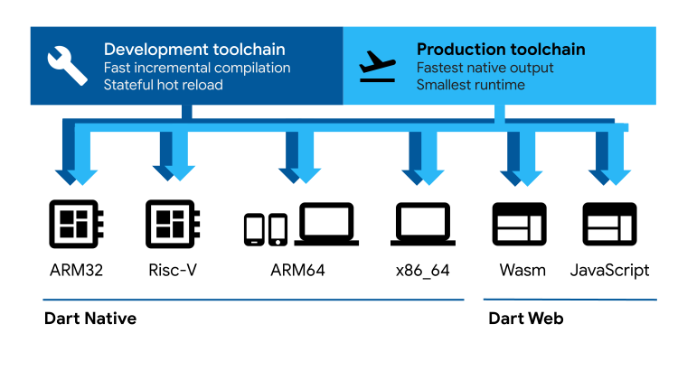

# Dart 概览
Dart 是一种针对客户端优化的语言，可在任何平台上开发快速的应用程序。其目标是为多平台开发提供最高效的编程语言，并为应用程序框架搭配了 灵活的运行时执行平台。
通常来说，编程语言会包含一些 技术壁垒，即语言在设计中的抉择决定了其功能和优势。 Dart 的语言设计针对客户端开发，它优先考虑多平台 (Web，移动端和桌面端) 上的开发 (亚秒级的状态热重载) 和高质量生产环境体验。Dart 也是 Flutter 的基础。 Dart 作为 Flutter 应用程序的编程语言，为驱动应用运行提供了环境，同时 Dart 还支持许多核心的开发任务，例如格式化，分析和代码测试。

## Dart语言
Dart 语言是类型安全的；它使用静态类型检查来确保变量的值 始终 与变量的静态类型相匹配。这也叫健全类型。尽管类型是强制性的，但由于 Dart 支持类型推断，类型注释仍是可选的。 Dart 的类型系统也很灵活，允许结合使用 dynamic 类型与运行时检查，在测试开发期间，或是遇到需要特别指定为动态类型的代码时，这项特性很有帮助。

Dart 内置了 健全的空值安全，这意味着只有你声明值可以为空的情况下，值才可以为空；当 Dart 确定变量不可为空时，该变量 永远 不可为空。凭借健全的空值安全，Dart 可以通过静态代码分析在运行时保护你免受空值异常的影响。如果你在调试器中审查正在运行的代码，你会看到不可为空性仍在运行时被保留，所以是完全的空安全。

## Dart库
Dart 拥有 丰富的核心库，为许多日常编程任务提供了必要工具：
 - 为每个 Dart 程序提供的内置类型，集合与其他核心功能 (dart:core)
 - 更丰富的集合类型，诸如队列、链接列表、哈希图和二叉树 (dart:collection)
 - 用于在不同的数据表示形式之间进行转换编码器和解码器，包括 JSON 和 UTF-8 (dart:convert)
 - 数学常数和函数，以及随机数生成 (dart:math)
 - 异步编程支持，比如 Future 和 Stream 类 (dart:async)
 - 能够有效处理固定大小的数据（例如，无符号的 8 字节整数）和 SIMD 数字类型的列表 (dart:typed_data)
 - 为非 Web 应用程序提供的文件、套接字、HTTP 和其他 I/O 支持 (dart:io)
 - 用于提供 C 语言风格代码互通性支持的外部函数接口 (dart:ffi)
 - 使用 isolates 的并发编程 — 这些独立的工作程序与线程相似但它们不共享内存并仅通过消息进行通信 (dart:isolate)
 0 基于 Web 的应用程序中需要与浏览器和文档对象模型 (DOM) 交互的 HTML 元素和其他资源 (dart:js_interop and package:web)
 
 除核心库外，Dart 还通过一整套软件包提供了许多 API。 Dart 团队发布了许多有用的补充包，
 例如：
 - characters (字符)
 - intl (国际化
 - )http (http 请求)
 - crypto (哈希加密)
 - markdown此外，
 第三方发布者和更广泛的社区也发布了上千个软件包，支持诸如此类功能：
 - XM
 - LWindows integration (Windows API 调用)
 - SQLite
 - compression (压缩)
 
 你可以访问 核心库文档，查看关于 Dart 核心库的一系列示例。

## Dart平台
Dart 的编译器技术可让你以不同的方式运行代码：
- 原生平台：针对面向移动和桌面设备的应用程序， Dart 拥有具有实时 (JIT) 编译功能的 Dart VM 和用于生成机器代码的提前 (AOT) 编译器。
- Web 平台：Dart 可用于编译开发和生产阶段的面向 Web 的应用，它的 Web 编译器可以将 Dart 转换为 JavaScript 或 WebAssembly。

Flutter 框架 是一款流行的多平台 UI 工具包，由 Dart 语言强力驱动，提供一套工具和 UI 库，帮助开发者们在 iOS、Android、macOS、Windows、Linux 和 Web 平台构建优秀的 UI 体验。

**原生平台的 Dart (JIT 和 AOT 机器码)**
在开发过程中，快速的开发周期对于迭代至关重要。 Dart VM 提供了一个实时编译器 (JIT)，编译器拥有增量重编译功能 (支持热重载)、运行数据收集（用于驱动 DevTools）以及丰富的开发调试支持。
当应用程序可以部署到生产环境时 (无论是发布到应用商店还是部署到生产后端)， Dart AOT 编译器可以编译成原生的 ARM 或 x64 的机器码。经过 AOT 编译的应用程序将稳定快速地启动。
经过 AOT 编译的代码会在高效的 Dart 运行环境中运行，该运行环境拥有健全的 Dart 类型系统，并使用快速对象分配和 分代垃圾收集器 来管理内存。

**Web 平台的 Dart（JavaScript 的开发与部署以及 WebAssembly）**
Dart 的 Web 支持让你可以在 JavaScript 驱动的网页平台上运行 Dart 代码。使用 Web 环境下的 Dart 时，你可以将 Dart 编译为在浏览器中运行的 JavaScript 代码，例如: Chrome 中的 V8。或者，也可以将 Dart 代码编译成 WebAssembly。
Dart Web 包含三种编译模式：
- 一种为快速开发提供帮助的增量 JavaScript 编译器。
- 一种为生产环境优化的 JavaScript 编译器，可以将 Dart 代码编译成快速、紧凑、可部署的 JavaScript。它的高效之处在于使用了类似消除无用代码的优化。
- 一种为生产环境优化的 WebAssembly (WasmGC) 编译器，可以将 Dart 代码编译成超快、可部署的 WebAssembly GC 代码。

**Dart 运行时环境**
不论你在哪个平台上使用、选择如何构建你的代码，执行代码时都需要一个 Dart 运行时环境。这个运行时环境负责下面的关键任务：- - 内存管理： Dart 使用一个受管理的内存模型，未被使用的内存会由垃圾收集器 (GC) 回收。
- 执行 Dart 语言的类型体系： Dart 语言里大多数类型检查都是静态的（编译时），但仍有部分检查是动态的（运行时）。比如，Dart 运行时环境会在遇到 类型判断运算符(`as,is,is!`) 时执行动态检查。
- 管理 isolates： Dart 运行时环境会负责控制主 isolate（代码通常在这里运行）以及其他应用创建的 isolate。

在原生平台上，Dart 运行时环境被自动包含在独立的可执行文件中，是 dart run 命令提供的 Dart VM 的一部分。

