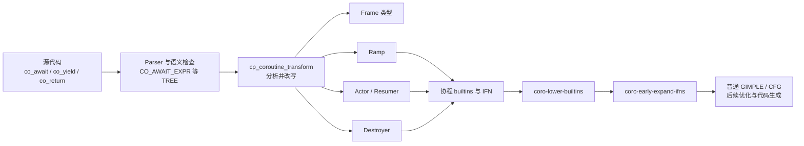
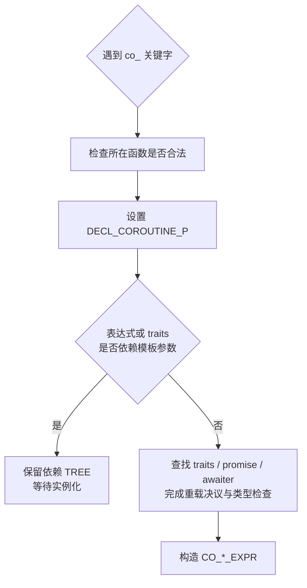
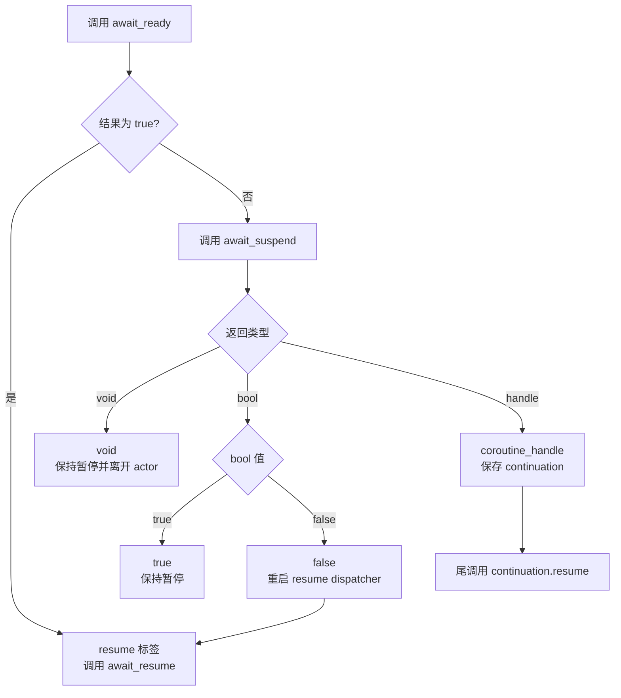
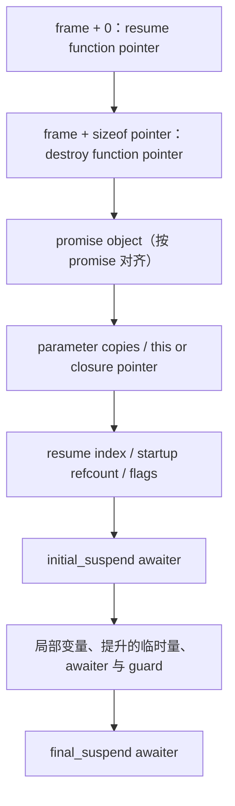
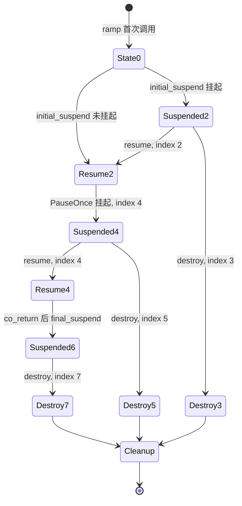
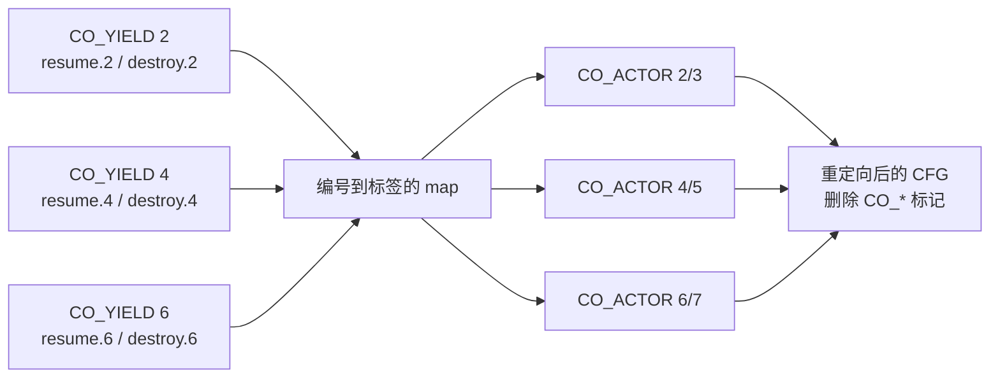

# GCC 16 如何实现 C++20 协程：从语义分析到状态机 Lowering


> 本文讨论 GCC [`releases/gcc-16`](https://github.com/gcc-mirror/gcc/tree/releases/gcc-16) 分支在提交 [`3c902c5144ff29f5d92f2d5924bb38ec3c882983`](https://github.com/gcc-mirror/gcc/tree/3c902c5144ff29f5d92f2d5924bb38ec3c882983) 上的实现，核对日期为 2026-09-13。分支仍可能继续变化，所以源码链接固定到该提交。
> 配套探针：[src/gcc_coroutine_probe.cpp](./src/gcc_coroutine_probe.cpp)；构建说明：[src/README.md](./src/README.md)。第一次接触 promise/awaiter 协议时，建议先读姊妹篇：[C++20 协程原理](./C++20协程原理：从编译器变换到Task与事件循环.md)。

---

## 一、先给出全景：GCC 到底生成了什么

对一个含有 `co_await`、`co_yield` 或 `co_return` 的函数，GCC 16 的 C++ 前端最终构造四类东西：

1. **coroutine frame**：保存两个入口函数指针、promise、参数副本、状态编号、生命周期簿记、跨暂停点对象和 awaiter；
2. **ramp function**：保留原函数签名，分配并初始化 frame，构造返回对象，然后首次调用 actor；
3. **actor/resumer function**：接收 frame 指针，包含 resume/destroy 双分派器和变换后的用户函数体；
4. **destroyer function**：把状态编号切换到 destroy 通道，再调用同一个 actor 执行正确的析构路径。

前端暂时用 `IFN_CO_FRAME`、`IFN_CO_YIELD`、`IFN_CO_SUSPN`、`IFN_CO_ACTOR` 保留协程控制流信息；进入 GIMPLE 后，两个专用 pass 再把它们变成普通赋值、间接调用、跳转和 CFG 边。CPU 最终看到的不是特殊“协程指令”，而是普通控制流和函数调用。



GCC 源码开头也直接把结果概括为 ramp、actor 和 destroy stub 三段函数；对应说明见 [`gcc/cp/coroutines.cc`](https://github.com/gcc-mirror/gcc/blob/3c902c5144ff29f5d92f2d5924bb38ec3c882983/gcc/cp/coroutines.cc#L156-L273)。

### 1.1 标准语义与 GCC 实现细节要分开

标准要求的是可观察行为，例如 promise 查找、参数副本、三个 awaiter 方法、异常路径和 frame 销毁语义。下面这些属于 GCC 16 的实现选择，用户程序不能依赖：

- helper 的名字带 `.actor`、`.destroy`；
- frame 前两个字段是 resume/destroy 函数指针；
- `_Coro_resume_index` 使用 `unsigned short`，偶数恢复、奇数销毁；
- `_Coro_resume_fn == nullptr` 表示 `done()`；
- 当前 frame 布局是保守的，`IFN_CO_FRAME` 暂时只传回前端算出的大小；
- ramp 与 actor 之间用 `_Coro_frame_refcount` 协调启动阶段的销毁责任。

这些细节适合用于读 dump、调试编译器和理解成本，不应成为应用代码的 ABI 假设。

---

## 二、准备一个能看清变换的最小实验

配套的 `answer()` 故意同时包含参数副本、跨暂停点局部变量和一个用户 awaiter：

```cpp
IntTask answer(int input)
{
    const int across_suspend = input + 1;
    co_await PauseOnce{};
    co_return across_suspend * 2;
}
```

使用 GCC 16 编译，并要求输出语言层与两个 GIMPLE 协程 pass 的 dump：

```bash
cd languages/cpp/coroutine/src

g++ -std=c++20 -O0 -g -fno-inline \
  -fdump-lang-coro \
  -fdump-tree-coro-lower-builtins \
  -fdump-tree-coro-early-expand-ifns \
  gcc_coroutine_probe.cpp -o gcc_coroutine_probe

./gcc_coroutine_probe
nm -C gcc_coroutine_probe | grep answer
ls *gcc_coroutine_probe.cpp.*
```

程序输出：

```text
result: 42
```

`nm -C` 能看到三个与 `answer` 对应的符号；地址和完整 frame 名随构建而变：

```text
answer(int)
answer(...Frame*) [clone .actor]
answer(...Frame*) [clone .destroy]
```

这里的 `answer(int)` 已不再是原函数体，而是 ramp。`.actor` 是状态机，`.destroy` 是销毁入口。dump 文件中的数字是 pass 编号，不是稳定接口，应按后缀 `.coro`、`.coro-lower-builtins` 和 `.coro-early-expand-ifns` 查找。

---

## 三、前端如何认出协程并建立语义

### 3.1 词法与语法阶段只先建立 TREE

启用 `-std=c++20` 时，`-fcoroutines` 默认开启；GCC 手册在 [`invoke.texi`](https://github.com/gcc-mirror/gcc/blob/3c902c5144ff29f5d92f2d5924bb38ec3c882983/gcc/doc/invoke.texi#L3399-L3405) 中明确了这一点。词法层据此启用 `co_await`、`co_yield` 和 `co_return` 关键字。

Parser 不会当场生成机器级状态机。它先调用：

- `finish_co_await_expr()`；
- `finish_co_yield_expr()`；
- `finish_co_return_stmt()`。

这些入口进行上下文与类型检查，设置 `DECL_COROUTINE_P(current_function_decl)`，并构造 `CO_AWAIT_EXPR`、`CO_YIELD_EXPR` 或 `CO_RETURN_EXPR` TREE。模板依赖的表达式会保留到实例化后处理，因为此时 promise、awaiter 或返回类型可能尚未确定。相关 TREE 节点定义位于 [`gcc/cp/cp-tree.def`](https://github.com/gcc-mirror/gcc/blob/3c902c5144ff29f5d92f2d5924bb38ec3c882983/gcc/cp/cp-tree.def#L548-L570)。



构造函数、析构函数、`main`、带普通可变参数 `...` 的函数以及若干不允许的上下文会在这里诊断。一个普通 `return` 也不能和协程函数混用。入口检查集中在 [`coro_common_keyword_context_valid_p()` 与 `coro_function_valid_p()`](https://github.com/gcc-mirror/gcc/blob/3c902c5144ff29f5d92f2d5924bb38ec3c882983/gcc/cp/coroutines.cc#L1124-L1222)。

### 3.2 `coroutine_traits` 与 promise 查找

GCC 按函数签名实例化：

```cpp
std::coroutine_traits<ReturnType, ParameterTypes...>
```

非静态成员函数和 Lambda 调用运算符还要把对象参数折算进 traits 参数列表。随后取 `traits::promise_type`，并实例化 `std::coroutine_handle<promise_type>`。如果未包含 `<coroutine>`，GCC 会在找不到 traits 模板时提示可能缺少头文件。

每个原始函数对应一个 `coroutine_info`，缓存 promise type、traits type、handle type、actor/destroyer 声明、`from_address()`，以及两个暂时的代理变量：

- `_Coro_self_handle`：语义检查 `await_suspend(handle)` 时使用；
- `_Coro_promise`：语义检查 promise 成员调用时使用。

真正布局 frame 时，这些代理才被改写为 frame 字段访问。这种“先用代理完成 C++ 类型系统工作，再在 lowering 阶段替换地址”的做法，是读 `coroutines.cc` 时最重要的线索之一。见 [`coroutine_info`](https://github.com/gcc-mirror/gcc/blob/3c902c5144ff29f5d92f2d5924bb38ec3c882983/gcc/cp/coroutines.cc#L279-L302) 和 [`coro_promise_type_found_p()`](https://github.com/gcc-mirror/gcc/blob/3c902c5144ff29f5d92f2d5924bb38ec3c882983/gcc/cp/coroutines.cc#L792-L893)。

GCC 也在这一步拒绝 promise 同时声明 `return_void` 和 `return_value`。

---

## 四、`co_await` 在 TREE 层是怎样展开的

核心函数是 [`build_co_await()`](https://github.com/gcc-mirror/gcc/blob/3c902c5144ff29f5d92f2d5924bb38ec3c882983/gcc/cp/coroutines.cc#L1353-L1573)。它不是立即插入一串 `goto`，而是先把完整语义记录到一个 `CO_AWAIT_EXPR` 中。

### 4.1 从 awaitable 到 awaiter

对用户写下的：

```cpp
co_await expression
```

`finish_co_await_expr()` 先尝试：

```cpp
promise.await_transform(expression)
```

如果 promise 中存在 `await_transform`，它就是强制变换，不是“调用失败再退回原表达式”。随后 `build_co_await()` 进行 `operator co_await` 重载决议；没有可用重载时，awaitable 自身就是 awaiter。

`initial_suspend()`、`final_suspend()` 和 `co_yield` 对应的等待不会走用户 `await_transform`：前两者直接交给 `build_co_await()`，`co_yield e` 则先形成 `promise.yield_value(e)` 再直接构建 await。对应实现见 [`finish_co_await_expr()`](https://github.com/gcc-mirror/gcc/blob/3c902c5144ff29f5d92f2d5924bb38ec3c882983/gcc/cp/coroutines.cc#L1587-L1667) 和 [`finish_co_yield_expr()`](https://github.com/gcc-mirror/gcc/blob/3c902c5144ff29f5d92f2d5924bb38ec3c882983/gcc/cp/coroutines.cc#L1673-L1758)。

### 4.2 awaiter 为什么常常进入 frame

GCC 检查 `await_ready()`、`await_suspend()`、`await_resume()` 是否存在，并验证 `await_suspend()` 的结果只能是：

- `void`；
- `bool`；
- 某个 `std::coroutine_handle<Z>`。

如果 awaiter 不是恢复后仍指向同一对象的稳定左值，GCC 会为它创建代理变量。因为 `await_suspend()` 返回后原调用栈已经退出，而恢复时仍需调用同一个 awaiter 的 `await_resume()`，这个对象必须拥有跨暂停点的存储。后续 frame 分析会给代理分配字段。

一个非平凡 awaiter 的析构也不能简单留给普通栈展开：resume 路径、destroy 路径和异常路径都要在正确位置恰好析构一次。

### 4.3 `CO_AWAIT_EXPR` 保存了哪些信息

非模板情形下，GCC 把这些内容放入节点：

| 槽位 | 含义 |
|---|---|
| awaitable `a` | `await_transform` 后的 awaitable |
| awaiter proxy `e` | 稳定左值或等待写入 frame 的代理 |
| initializer `o` | awaiter 的初始化表达式；后续会被拆出 |
| call vector | 已完成重载决议的 `await_ready/suspend/resume` 调用 |
| suspend kind | 普通 await、yield、initial suspend 或 final suspend |

这能把复杂的 C++ 查找与后面的控制流改写分离开：lowering 不必再次做重载决议，只需要替换 proxy 并发射状态机。

### 4.4 真正的暂停控制流

在 frame 和 actor 已知后，[`expand_one_await_expression()`](https://github.com/gcc-mirror/gcc/blob/3c902c5144ff29f5d92f2d5924bb38ec3c882983/gcc/cp/coroutines.cc#L2159-L2364) 把一个 await 改写为近似结构：

```cpp
awaiter = make_awaiter();
frame->_Coro_resume_index = N;       // N 为偶数

if (!awaiter.await_ready()) {
    auto action = awaiter.await_suspend(handle::from_address(frame));
    // 根据 action 的类型选择 suspend、继续或对称转移
    return;
}

resume_N:
result = awaiter.await_resume();
```

更精确地说，三种 `await_suspend()` 返回类型进入不同分支：



返回 handle 的路径先把它保存到 actor 的 `_Coro_actor_continue`，然后从统一 continuation 出口调用 `__builtin_coro_resume`。GCC 把该调用标为 tail call，使很长的对称转移链不必按普通嵌套调用持续增长调用栈；目标平台不支持任意间接尾调用时仍受后端能力约束。

---

## 五、`co_yield` 和 `co_return` 的前端处理

### 5.1 `co_yield`

GCC 先构造：

```cpp
promise.yield_value(expression)
```

再把它作为 awaitable 交给 `build_co_await()`。稍后的表达式分析会把 `CO_YIELD_EXPR` 换成内部携带的 `CO_AWAIT_EXPR`，因此 actor 状态机无需再保留一种独立的 yield 控制流。

### 5.2 `co_return`

[`finish_co_return_stmt()`](https://github.com/gcc-mirror/gcc/blob/3c902c5144ff29f5d92f2d5924bb38ec3c882983/gcc/cp/coroutines.cc#L1766-L1873) 完成以下选择：

```cpp
co_return;          // promise.return_void()
co_return voidExpr; // 先求值 voidExpr，再 promise.return_void()
co_return value;    // promise.return_value(value)
```

对非 void 局部对象，它还按返回语句的规则优先尝试隐式移动。状态机预处理阶段再把 `CO_RETURN_EXPR` 改为 promise 调用和跳转：

```cpp
promise.return_value(value);
goto final_suspend;
```

所以 `co_return` 不是 C++ ABI 层的普通返回：原函数的真正返回值早已在 ramp 中由 `get_return_object()` 建立。

---

## 六、从函数结束到四阶段 coroutine transform

GCC 在 [`finish_function()`](https://github.com/gcc-mirror/gcc/blob/3c902c5144ff29f5d92f2d5924bb38ec3c882983/gcc/cp/decl.cc#L20536-L20566) 发现 `DECL_COROUTINE_P` 后创建 `cp_coroutine_transform`：

1. `apply_transforms()` 拆出原函数体，做分析，建立 frame 和 ramp；
2. ramp 像普通函数一样继续完成 genericize；
3. 函数结束阶段调用 `finish_transforms()`，生成 actor 和 destroyer；
4. actor/destroyer 作为 outlined functions 交给后续编译流程。

`coroutines.cc` 的总览注释把过程分成 A～D 四阶段：

| 阶段 | GCC 做什么 | 关键产物 |
|---|---|---|
| A：initial framing | 插入 initial/final suspend；异常开启时包裹 `try/catch (...)` | 改写后的函数体骨架 |
| B：analysis | 找 suspend point、提升临时量、分析参数与局部变量 | 保守 frame 字段集合、变量映射 |
| C：build ramp | 选择分配/释放函数，构造 frame、promise、返回对象 | 原签名的 ramp |
| D：actor/destroyer | 建双分派器，展开每个 await，替换变量 proxy | actor 状态机与 destroy shim |

源码注释还沿用“入口是 `morph_fn_to_coro()`”的旧表述；在本文固定的 GCC 16 提交中，实际入口已经是 `cp_coroutine_transform::apply_transforms()` / `finish_transforms()`。应以 [`coroutines.h` 的类声明](https://github.com/gcc-mirror/gcc/blob/3c902c5144ff29f5d92f2d5924bb38ec3c882983/gcc/cp/coroutines.h#L90-L139) 和 `decl.cc` 调用点为准。

### 6.1 复杂表达式为何必须先“摊平”

考虑：

```cpp
auto x = condition() && co_await operation();
```

GCC 不能无条件初始化右侧 awaiter，否则会破坏短路语义。类似问题还存在于 `?:`、`if` 条件、循环条件/迭代表达式和 `switch` 条件中。`await_statement_walker` 会把这些结构改写为显式临时变量、`if`、循环内条件和标签，再提升必须跨暂停存在的临时量。

非平凡条件临时量还会配 guard flag 和 `TRY_FINALLY_EXPR`，确保只析构真正完成构造的对象。相关算法集中在 `flatten_await_stmt()`、`process_conditional()`、`maybe_promote_temps()` 和 `await_statement_walker()`，见 [`coroutines.cc` 的 await 分析部分](https://github.com/gcc-mirror/gcc/blob/3c902c5144ff29f5d92f2d5924bb38ec3c882983/gcc/cp/coroutines.cc#L3080-L4207)。

---

## 七、coroutine frame 的真实布局

对实验中的 `answer(int)`，GCC 语言层 dump 会打印近似 frame：

```cpp
struct answer_frame {
    void (*_Coro_resume_fn)(answer_frame*);
    void (*_Coro_destroy_fn)(answer_frame*);
    IntTask::promise_type _Coro_promise;
    int input;
    unsigned short _Coro_resume_index;
    unsigned short _Coro_frame_refcount;
    bool _Coro_frame_needs_free;
    bool _Coro_initial_await_resume_called;
    std::suspend_always initial_awaiter;
    const int across_suspend;
    PauseOnce user_awaiter;
    std::suspend_always final_awaiter;
};
```

字段名中的编号会随 TREE 和作用域变化，上面为便于阅读进行了简化。



### 7.1 各字段的责任

| 字段 | 用途 | 是否标准规定布局 |
|---|---|---|
| `_Coro_resume_fn` | `resume()` 入口；置空也表示已完成 | 否 |
| `_Coro_destroy_fn` | `destroy()` 入口 | 否 |
| `_Coro_promise` | 标准 promise 对象 | promise 必须属于状态，但位置未规定 |
| 参数副本 | 原调用栈退出后仍供函数体使用 | 语义规定，布局未规定 |
| `_Coro_resume_index` | 选择 actor 的 resume/destroy 分支 | 否 |
| `_Coro_frame_refcount` | 协调 ramp 与刚启动 body 的 frame 释放责任 | 否，且不是 Task 共享引用计数 |
| `_Coro_frame_needs_free` | frame 存储是否需要释放 | 否 |
| `_Coro_initial_await_resume_called` | 区分 initial await 启动前后的异常责任 | 否 |
| awaiter/局部量/临时量 | 保持跨暂停点所需状态和析构信息 | 语义决定生命周期，布局未规定 |

### 7.2 参数与局部变量怎样进入 frame

[`analyze_fn_parms()`](https://github.com/gcc-mirror/gcc/blob/3c902c5144ff29f5d92f2d5924bb38ec3c882983/gcc/cp/coroutines.cc#L4260-L4325) 为每个参数准备字段：

- 值参数在调用时复制或移动；
- 引用参数在 frame 中仍是引用/指针语义，不延长被引用对象生命周期；
- `this` 和 Lambda closure object 有专门标记；
- 非平凡参数副本会登记析构路径。

随后 `register_local_var_uses()` 遍历 `BIND_EXPR` 作用域，为非静态局部量建立唯一 frame 字段名；`transform_local_var_uses()` 再把原变量的 `DECL_VALUE_EXPR` 指向 `frame->field`。这样既能复用 C++ 前端已有的构造/析构结构，也有利于调试信息关联。实现位于 [`register_local_var_uses()`](https://github.com/gcc-mirror/gcc/blob/3c902c5144ff29f5d92f2d5924bb38ec3c882983/gcc/cp/coroutines.cc#L4343-L4443)。

当前实现明确是**保守布局**。源码中的 TODO 仍写着尚未根据“实际是否使用”选择性生成字段；`IFN_CO_FRAME` 也预留了让中端在优化后缩小 frame 的接口，但 GCC 16 当前 pass 只是把前端大小原样传下去。因此：

- 不应把“只跨暂停点存活的变量才一定进入 frame”误写成 GCC 当前的精确算法；
- 优化器仍可能优化字段读写或整个协程调用，但不能据此假设每个 frame 都达到理论最小尺寸；
- 应使用目标 GCC、目标优化级别和实际代码测量 frame/分配成本。

GCC 16 仍会对协程中的变长数组和 `alloca` 给出“不支持”诊断：前者在前端 frame 分析时发现，后者在协程 IFN pass 中发现。

### 7.3 handle 为什么只需要一个地址

libstdc++ 的 `coroutine_handle` 本质上保存 `void* _M_fr_ptr`。`from_promise()`、`promise()`、`resume()`、`destroy()`、`done()` 分别调用 GCC builtin；见 [`libstdc++-v3/include/std/coroutine`](https://github.com/gcc-mirror/gcc/blob/3c902c5144ff29f5d92f2d5924bb38ec3c882983/libstdc%2B%2B-v3/include/std/coroutine#L97-L261)。

GCC 的 lowering 约定 frame 从两个函数指针开始，promise 按自身对齐要求位于其后。因此 `__builtin_coro_promise(ptr, align, direction)` 能通过固定偏移在 frame 地址和 promise 地址间转换。这是编译器与同一工具链标准库之间的实现契约，不是让应用手写指针算术的接口。

---

## 八、ramp：分配、构造、启动与返回

[`build_ramp_function()`](https://github.com/gcc-mirror/gcc/blob/3c902c5144ff29f5d92f2d5924bb38ec3c882983/gcc/cp/coroutines.cc#L5001-L5409) 生成保留原签名的入口。其顺序可以概括为：

1. 按标准规则查找 promise 专属或全局 `operator new`；
2. 需要时查找 `get_return_object_on_allocation_failure()`；
3. 分配 frame，写入 resume/destroy 函数指针；
4. 在 frame 中初始化参数副本；
5. 用参数副本尝试构造 promise，失败时再尝试无参构造；
6. 调用 `promise.get_return_object()` 构造返回对象；
7. 把 `_Coro_resume_index` 初始化为 0；
8. 调用 actor，从 resume point 0 开始执行；
9. 向原调用者返回第 6 步已构造的对象。

```mermaid
sequenceDiagram
    participant Caller as 调用者
    participant Ramp as answer(int) ramp
    participant Frame as coroutine frame
    participant Actor as answer(...Frame*) actor
    participant Promise as promise

    Caller->>Ramp: answer(20)
    Ramp->>Frame: operator new(frame_size)
    Ramp->>Frame: 写入口指针、参数副本与 flags
    Ramp->>Promise: 构造 promise
    Ramp->>Promise: get_return_object()
    Promise-->>Ramp: IntTask(handle)
    Ramp->>Actor: actor(frame), state = 0
    Actor->>Promise: initial_suspend()
    alt initial await 挂起
        Actor-->>Ramp: return
    else initial await 不挂起
        Actor->>Actor: 继续执行用户函数体
    end
    Ramp-->>Caller: 返回 IntTask
```

所以 eager/lazy 不是 ramp 是否调用 actor 的差别：GCC 都会从 ramp 调 actor。真正的差别发生在 actor 内的 `initial_suspend` awaiter：`await_ready()` 或 `await_suspend()` 的结果决定 actor 是否在进入用户函数体前返回。

### 8.1 `_Coro_frame_refcount` 不是共享所有权

GCC 16 的源码使用一个短整型计数处理非常窄的启动期问题：ramp 尚未构造并交付返回对象时，actor 可能同步完成、抛出或触发复杂的返回对象析构。大致状态是：

```text
0  frame 刚分配，ramp 的清理可以回收
1  ramp 持有一次使用
2  actor/body 已开始，ramp 与 body 各持有一次使用
1  一方结束，另一方仍可能访问
0  双方都结束，可以析构 promise/参数并释放 frame
```

该计数不提供多线程原子共享，不表示有几个 `Task` 或 handle，也不替代用户库的所有权协议。它只服务于编译器生成代码在启动、异常和同步完成之间的责任交接。背景说明位于 [`coroutines.cc` 的 frame state 注释](https://github.com/gcc-mirror/gcc/blob/3c902c5144ff29f5d92f2d5924bb38ec3c882983/gcc/cp/coroutines.cc#L198-L273)。

---

## 九、actor：一份函数体，两套分派路径

actor 的签名近似：

```cpp
void answer_actor(answer_frame* frame);
```

它首先检查 `_Coro_resume_index` 的最低位：

```cpp
if (frame->_Coro_resume_index & 1) {
    switch (frame->_Coro_resume_index) {
        // 奇数：destroy dispatch
    }
} else {
    switch (frame->_Coro_resume_index) {
        // 0 或偶数：initial entry / resume dispatch
    }
}
```

实验一共有 initial suspend、用户 `PauseOnce`、final suspend 三个 await point，因此编号近似如下：

| await point | resume index | destroy index |
|---|---:|---:|
| initial suspend | 2 | 3 |
| `co_await PauseOnce{}` | 4 | 5 |
| final suspend | 6 | 7 |



偶数/奇数成对编码让一个 `unsigned short` 同时表达“停在哪”和“这次是恢复还是销毁”。[`build_actor_fn()`](https://github.com/gcc-mirror/gcc/blob/3c902c5144ff29f5d92f2d5924bb38ec3c882983/gcc/cp/coroutines.cc#L2557-L2875) 先放入两个 dispatcher，再把用户函数体、promise 代理和局部变量映射到 frame。

### 9.1 为什么 dispatcher 中先放 `IFN_CO_ACTOR`

前端此时还没有最终 CFG，于是在每个 switch case 中放置 `.CO_ACTOR(index)` 标记；每个暂停点处放置 `.CO_YIELD(index, final, resume_label, destroy_label, frame)`。中端 pass 看到两端后再把 dispatcher case 的边重定向到对应标签。

这避免前端过早手工固定 CFG，也让前序折叠有机会删除恒定 `await_ready()` 带来的无效暂停点。

### 9.2 final suspend 与 `done()`

进入 final suspend 前，GCC 把 `_Coro_resume_fn` 设为 null。`coroutine_handle::done()` 最终就是检查 frame 第一个函数指针是否为空。此时 frame 可能仍存在：**done 只表示到达 final suspend，不等于 frame 已释放**。

如果 final awaiter 不真正挂起，生成控制流会走隐式销毁路径；若它挂起，则等待所有者之后调用 `destroy()`。GCC 还会诊断 final suspend 相关调用或必要析构可能抛出异常的情形。

---

## 十、destroyer：为什么不是直接 `operator delete`

[`build_destroy_fn()`](https://github.com/gcc-mirror/gcc/blob/3c902c5144ff29f5d92f2d5924bb38ec3c882983/gcc/cp/coroutines.cc#L2880-L2921) 很短，语义近似：

```cpp
void answer_destroy(answer_frame* frame)
{
    frame->_Coro_resume_index |= 1;
    answer_actor(frame);
}
```

它不能直接释放内存，因为暂停位置决定哪些局部对象和 awaiter 已构造、哪些析构函数必须运行。actor 的奇数 dispatcher 会跳到与当前 suspend point 配对的 destroy label，沿预先生成的 cleanup nest 退出，最后按顺序处理：

1. 当前 awaiter 和仍存活的局部对象；
2. promise；
3. 参数副本；
4. frame 存储。

这也是“持有 handle 后随便 `operator delete(handle.address())`”错误的根本原因：只有 compiler-generated destroy path 掌握精确的对象存活状态。

---

## 十一、异常路径为何比普通状态机复杂

### 11.1 用户函数体异常

启用异常时，GCC 把 initial await 和用户函数体包进 `try/catch (...)`。在 initial await 已成功执行 `await_resume()` 之后，未捕获异常会：

1. 把 resume 函数指针清零，标记完成；
2. 重置必要状态；
3. 调用 `promise.unhandled_exception()`；
4. 进入 final suspend。

### 11.2 initial await 的特殊边界

`_Coro_initial_await_resume_called` 记录是否已经跨过 initial await 的 `await_resume()`。如果 initial await 的准备阶段在此之前抛出，异常应返回 ramp 的构造调用边界，由 ramp 清理尚未交付的 frame，而不是当作正常协程体异常交给 `unhandled_exception()`。

这正是 GCC 16 引入额外 flag 和 frame 使用计数的原因：返回对象尚未安全交到调用者、actor 又已经开始执行时，清理责任不能只凭“是否进入过 actor”判断。

### 11.3 分配失败

如果 promise 提供可用的静态 `get_return_object_on_allocation_failure()`，分配函数必须使用 non-throwing 形式；frame 分配返回 null 时，ramp 不构造 promise 或 actor，而是直接返回该 fallback 对象。否则按正常 `operator new` / 异常规则处理。分配函数选择见 [`build_coroutine_frame_alloc_expr()`](https://github.com/gcc-mirror/gcc/blob/3c902c5144ff29f5d92f2d5924bb38ec3c882983/gcc/cp/coroutines.cc#L4834-L4965)。

---

## 十二、GIMPLE 的两个专用协程 pass

前端生成的协程标记不能进入 RTL。GCC 16 在所有 lowering passes 的早期注册两个 pass，顺序可在 [`gcc/passes.def`](https://github.com/gcc-mirror/gcc/blob/3c902c5144ff29f5d92f2d5924bb38ec3c882983/gcc/passes.def#L27-L47) 中看到：

```text
lower EH
  ↓
coro-lower-builtins
  ↓
build CFG
  ↓
coro-early-expand-ifns
  ↓
后续优化
```

### 12.1 `coro-lower-builtins`

[`lower_coro_builtin()`](https://github.com/gcc-mirror/gcc/blob/3c902c5144ff29f5d92f2d5924bb38ec3c882983/gcc/coroutine-passes.cc#L55-L177) 把标准库薄封装最终使用的 builtin 降为 frame 操作：

| builtin / IFN | lowering 结果 |
|---|---|
| `__builtin_coro_resume(frame)` | 读 frame 偏移 0 的函数指针并间接调用 |
| `__builtin_coro_destroy(frame)` | 读 frame 偏移一个指针处的函数指针并间接调用 |
| `__builtin_coro_done(frame)` | 检查第一个函数指针是否为 null |
| `__builtin_coro_promise(ptr, align, dir)` | 在 frame 与按 promise 对齐后的地址之间加减偏移 |
| `IFN_CO_SUSPN(label)` | 变成直接 `goto label`，不执行普通作用域 cleanup |

`IFN_CO_SUSPN` 的“不执行 cleanup”很关键：暂停不是离开 C++ 作用域。对象仍活在 frame 中，恢复后继续使用，或在 destroy dispatcher 中按正确路径析构。

### 12.2 `coro-early-expand-ifns`

[`execute_early_expand_coro_ifns()`](https://github.com/gcc-mirror/gcc/blob/3c902c5144ff29f5d92f2d5924bb38ec3c882983/gcc/coroutine-passes.cc#L289-L470) 处理四件事：

1. `IFN_CO_FRAME(size, ...)` 当前直接替换为 `size`；
2. 收集每个 `IFN_CO_YIELD` 携带的 resume/destroy label；
3. 找到 dispatcher 中同编号的 `IFN_CO_ACTOR`，把 CFG 边重定向到目标 basic block；
4. 删除标记、折叠临时 switch/if，并请求 CFG cleanup。



源码定义的 `expand_CO_FRAME/YIELD/SUSPN/ACTOR()` 都是 `gcc_unreachable()`，因为这些标记如果漏到最终 expand 阶段就是编译器错误。定义见 [`gcc/internal-fn.def`](https://github.com/gcc-mirror/gcc/blob/3c902c5144ff29f5d92f2d5924bb38ec3c882983/gcc/internal-fn.def#L594-L597)。

### 12.3 从 dump 验证 pass 前后

语言层 `.coro` dump 中能看到：

```text
Frame type:
  ...
Actor/resumer:
  switch (_Coro_resume_index) ...
  .CO_ACTOR (4)
  ...
  .CO_YIELD (4, 0, &resume.4, &destroy.4, frame_ptr)
```

`.coro-lower-builtins` 仍会保留 `.CO_ACTOR/.CO_YIELD`，但 handle 的 resume/destroy/done 和 promise 地址转换已开始显露为偏移访问与间接调用。`.coro-early-expand-ifns` 的 dump 会报告：

```text
saw CO_YIELD in BB ...
saw CO_ACTOR in BB ...
redirecting edge from bb ... to bb ...
```

其后的函数体只剩普通 basic blocks、switch、goto、成员访问和调用。

---

## 十三、libstdc++ `<coroutine>` 做了什么，没有做什么

GCC 的语言 lowering 与 libstdc++ 的头文件共同完成用户可见接口，但 `<coroutine>` 并不是调度运行时。

### 13.1 `coroutine_traits`

主模板只在返回类型具有 `promise_type` 时暴露它，用户仍可特化 `coroutine_traits`。编译器通过这个标准库类型发现 promise，而不是把 `Task<T>::promise_type` 写死进编译器。

### 13.2 `coroutine_handle`

handle 只保存 frame 地址，操作转发给 builtin：

```cpp
bool done() const noexcept { return __builtin_coro_done(_M_fr_ptr); }
void resume() const { __builtin_coro_resume(_M_fr_ptr); }
void destroy() const { __builtin_coro_destroy(_M_fr_ptr); }
```

typed handle 的 `promise()` 通过 `__builtin_coro_promise` 找 promise 地址。它没有所有权计数，也没有析构时自动 `destroy()`；所有权必须由 `Task`/`Generator` 等库类型建立。

### 13.3 trivial awaitables 与 noop coroutine

`suspend_always`/`suspend_never` 只是三个 awaiter 方法的常量实现。`noop_coroutine()` 则使用一个静态伪 frame，其 resume/destroy 是空操作、`done()` 恒为 false。所有实现都在同一 [`<coroutine>` 头文件](https://github.com/gcc-mirror/gcc/blob/3c902c5144ff29f5d92f2d5924bb38ec3c882983/libstdc%2B%2B-v3/include/std/coroutine#L264-L346) 中。

标准库没有提供事件循环、线程池、网络 I/O、取消传播或通用 `Task`。这些仍属于上层库。

---

## 十四、如何系统地阅读一次真实 lowering

### 14.1 第一层：语言 dump

```bash
g++ -std=c++20 -O0 -g -fno-inline \
  -fdump-lang-coro gcc_coroutine_probe.cpp -c
```

按顺序寻找四个标题：

1. `original`：尚未展开的 `CO_AWAIT_EXPR`；
2. `Ramp function`：分配、参数复制、promise 和返回对象；
3. `Frame type`：实际保守布局；
4. `Actor/resumer` 与 `Destroyer`：双 dispatcher 和每个 await point。

### 14.2 第二层：GIMPLE pass

```bash
g++ -std=c++20 -O0 -g -fno-inline \
  -fdump-tree-coro-lower-builtins-details \
  -fdump-tree-coro-early-expand-ifns-details \
  gcc_coroutine_probe.cpp -c
```

如果目标构建对具体 pass dump 名称有差异，可临时用 `-fdump-tree-all`，再按 `coro` 查文件。比较两个 dump 时重点看：

- `.CO_SUSPN` 何时变成 goto；
- resume/destroy builtin 何时变成函数指针加载；
- `.CO_ACTOR` 和 `.CO_YIELD` 消失前后 CFG 边怎样变化；
- `-O0` 与 `-O2` 下哪些恒定 await 分支被折叠。

### 14.3 第三层：符号与汇编

```bash
g++ -std=c++20 -O2 -g gcc_coroutine_probe.cpp -o gcc_coroutine_probe
nm -C gcc_coroutine_probe | grep answer
objdump -drwC gcc_coroutine_probe | less
```

观察点包括：

- ramp 是否仍实际调用分配函数；
- frame 大小作为 `operator new` 参数是多少；
- actor 开头如何分派 `_Coro_resume_index`；
- `resume()`/`destroy()` 是否从 frame 前两个槽位间接调用；
- 对称转移能否形成 tail jump。

不要把一次 `-O2` 汇编中消失的分配推广成语言保证。内联、逃逸关系、LTO、异常配置、目标 ABI 和 promise 定义都可能改变结果。

---

## 十五、常见误读与源码阅读陷阱

### 15.1 “协程就是一个 switch”只说对了一半

actor 确实以状态分派为骨架，但完整实现还包括：

- ramp 的分配与返回对象发布；
- 参数副本和 promise 构造；
- 每个作用域的构造/析构路径；
- initial/final suspend；
- 三种 `await_suspend` 返回类型；
- 异常与分配失败；
- destroy dispatcher；
- builtin 和 IFN 的 GIMPLE lowering。

只画一个 `switch(state)` 会漏掉最容易出现未定义行为的生命周期部分。

### 15.2 resume index 不是源码行号

它是 GCC 给 await point 分配的内部编号，而且 initial/final suspend 也占编号。表达式摊平、恒定折叠和编译器版本变化都可能影响它。

### 15.3 frame refcount 不是线程安全 Task refcount

它不是原子量，也不管理用户层多个等待者。把它与 `shared_task` 的共享状态计数混为一谈会得到错误的线程安全结论。

### 15.4 `.actor`/`.destroy` 和 frame 字段不是稳定 ABI API

它们可以用于调试当前编译器产物，但不能在源码中声明这些 helper、猜测 frame struct、硬编码 promise 偏移或直接调用函数指针槽。

### 15.5 GCC 前端分析与后端优化不是同一步

`.coro` dump 展示 C++ 前端合成结果；后续 GIMPLE pass、内联、SRA、DCE、IPA/LTO 仍可大幅改变它。讨论“GCC 如何实现”时应明确自己观察的是哪一层。

---

## 十六、源码导航图

以下链接全部固定到本文核对的 GCC 16 提交：

| 阅读目标 | 入口 |
|---|---|
| 总体设计、frame 责任 | [`gcc/cp/coroutines.cc` 文件头](https://github.com/gcc-mirror/gcc/blob/3c902c5144ff29f5d92f2d5924bb38ec3c882983/gcc/cp/coroutines.cc#L156-L273) |
| transform 保存的数据结构 | [`gcc/cp/coroutines.h`](https://github.com/gcc-mirror/gcc/blob/3c902c5144ff29f5d92f2d5924bb38ec3c882983/gcc/cp/coroutines.h#L24-L139) |
| traits/promise/handle 查找 | [`coroutines.cc` 496–893](https://github.com/gcc-mirror/gcc/blob/3c902c5144ff29f5d92f2d5924bb38ec3c882983/gcc/cp/coroutines.cc#L496-L893) |
| awaiter 类型检查与 TREE | [`build_co_await()`](https://github.com/gcc-mirror/gcc/blob/3c902c5144ff29f5d92f2d5924bb38ec3c882983/gcc/cp/coroutines.cc#L1353-L1573) |
| await 控制流展开 | [`expand_one_await_expression()`](https://github.com/gcc-mirror/gcc/blob/3c902c5144ff29f5d92f2d5924bb38ec3c882983/gcc/cp/coroutines.cc#L2159-L2364) |
| actor 与双 dispatcher | [`build_actor_fn()`](https://github.com/gcc-mirror/gcc/blob/3c902c5144ff29f5d92f2d5924bb38ec3c882983/gcc/cp/coroutines.cc#L2557-L2875) |
| destroy shim | [`build_destroy_fn()`](https://github.com/gcc-mirror/gcc/blob/3c902c5144ff29f5d92f2d5924bb38ec3c882983/gcc/cp/coroutines.cc#L2880-L2921) |
| 复杂表达式与临时量提升 | [`coroutines.cc` 3080–4207](https://github.com/gcc-mirror/gcc/blob/3c902c5144ff29f5d92f2d5924bb38ec3c882983/gcc/cp/coroutines.cc#L3080-L4207) |
| 参数和局部 frame 字段 | [`coroutines.cc` 4260–4443](https://github.com/gcc-mirror/gcc/blob/3c902c5144ff29f5d92f2d5924bb38ec3c882983/gcc/cp/coroutines.cc#L4260-L4443) |
| 异常包装与 final suspend | [`wrap_original_function_body()`](https://github.com/gcc-mirror/gcc/blob/3c902c5144ff29f5d92f2d5924bb38ec3c882983/gcc/cp/coroutines.cc#L4504-L4786) |
| frame 分配与 ramp | [`coroutines.cc` 4834–5409](https://github.com/gcc-mirror/gcc/blob/3c902c5144ff29f5d92f2d5924bb38ec3c882983/gcc/cp/coroutines.cc#L4834-L5409) |
| transform 主调度 | [`apply_transforms()` / `finish_transforms()`](https://github.com/gcc-mirror/gcc/blob/3c902c5144ff29f5d92f2d5924bb38ec3c882983/gcc/cp/coroutines.cc#L5486-L5572) |
| builtins 与 IFN lowering | [`gcc/coroutine-passes.cc`](https://github.com/gcc-mirror/gcc/blob/3c902c5144ff29f5d92f2d5924bb38ec3c882983/gcc/coroutine-passes.cc#L47-L515) |
| libstdc++ 用户接口 | [`libstdc++-v3/include/std/coroutine`](https://github.com/gcc-mirror/gcc/blob/3c902c5144ff29f5d92f2d5924bb38ec3c882983/libstdc%2B%2B-v3/include/std/coroutine#L68-L359) |
| 回归测试入口 | [`gcc/testsuite/g++.dg/coroutines`](https://github.com/gcc-mirror/gcc/tree/3c902c5144ff29f5d92f2d5924bb38ec3c882983/gcc/testsuite/g%2B%2B.dg/coroutines) |

推荐阅读顺序是：文件头设计说明 → `build_co_await()` → `apply_transforms()` → frame dump → `build_ramp_function()` → `build_actor_fn()` → `coroutine-passes.cc`。一开始不必逐行追 TREE 构造辅助函数，先抓住“数据在哪一阶段从 proxy 变为 frame access”。

---

## 十七、用六条不变量收束实现

阅读任意一个 GCC 协程 dump 时，可以用六条不变量检查理解是否正确：

1. 原签名函数已经成为 ramp，用户主体位于 actor；
2. handle 地址指向 frame，frame 前缀提供 resume/destroy 入口；
3. promise、参数副本和暂停所需状态具有 frame 生命周期；
4. 每个真正的 suspend point 都有一对 resume/destroy 目的地；
5. `resume()` 走偶数状态，`destroy()` 把最低位置 1 后复用 actor cleanup；
6. 前端协程 IFN 必须在进入最终 RTL expand 前全部消失。

GCC 的实现精髓不是简单地“把 `co_await` 改成 `switch`”，而是把完整的 C++ 对象模型、异常语义和重载决议，安全地投影为一个可优化的 frame 加控制流图。ramp 解决创建与发布，actor 解决暂停与恢复，destroyer 解决任意暂停点上的精确析构，两个 GIMPLE pass 则把前端保留的协程语义最终还原为普通机器可执行控制流。
