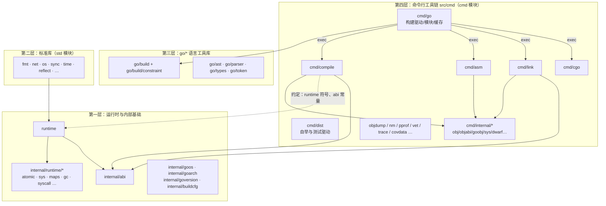
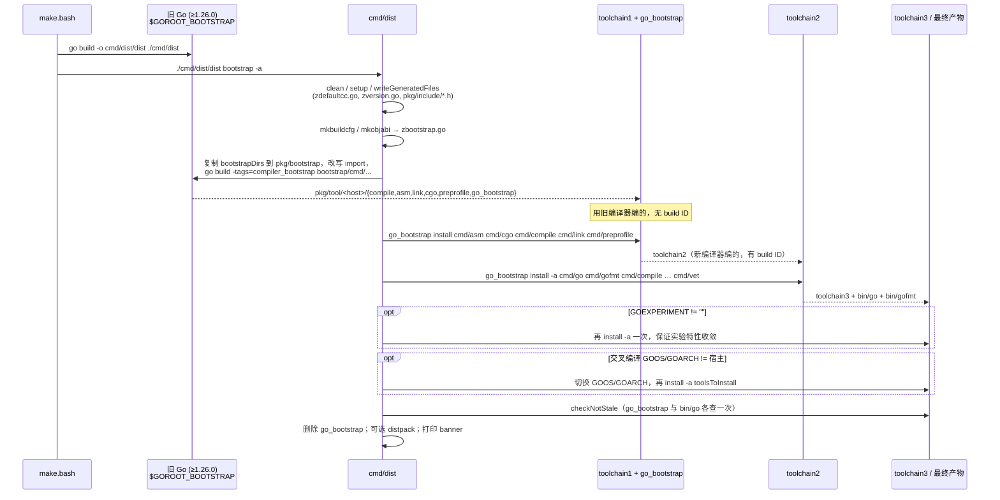
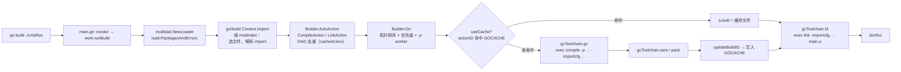

# Go 源码实现详解（一）：源码目录结构与构建引导

## 引言：先给结论

读 Go 源码的第一道门槛不是某个算法，而是"东西在哪、怎么被造出来的"。本篇的核心结论有四条：

1. **整棵树只有一个"根"**：`$GOROOT/src` 同时是标准库（`std` 模块，`src/go.mod`）和工具链（`cmd` 模块，`src/cmd/go.mod`）的家。`src/runtime`、`src/internal/*`、`src/cmd/compile`、`src/cmd/link` 之间没有 API 边界，只有"约定"边界：`internal` 目录规则、`//go:linkname`，以及 `internal/abi`、`cmd/internal/objabi` 里的共享常量。
2. **Go 是自举的，而且是"三轮"自举**：`make.bash` 先用一个已安装的旧 Go（当前要求 ≥ Go 1.26.0）编出 `cmd/dist`，`dist bootstrap` 再依次产出 toolchain1、toolchain2、toolchain3。三轮的意义不是"越编越优化"，而是让编译器用自己编译自己，直到 build ID 收敛。
3. **`go build` 是一个图调度器**：`cmd/go/internal/load` 把 import path 变成 `*load.Package`，`cmd/go/internal/work` 把包变成 `*Action` 组成的 DAG，`Builder.Do` 并行执行，每个 action 用内容哈希（action ID / build ID）决定是否命中 `GOCACHE`。真正干活的 `compile`、`asm`、`link` 只是它 exec 出去的子进程。
4. **编译期决定"哪些文件参与"**：`go/build`（以及 `cmd/go/internal/imports` 的轻量副本）根据 `//go:build` 表达式与文件名后缀 `_GOOS_GOARCH` 挑文件；这套逻辑也是你读 `runtime` 时判断"这个文件到底会不会编进我的平台"的依据。

下面的内容全部基于 golang/go master 提交 fdcd66b（2026-09-11，`src/internal/goversion/goversion.go` 中 `Version = 28`，即 Go 1.28 开发版）核对。凡与常见资料不同的地方（例如自举下限已经从 Go 1.20/1.22 升到 1.26、SSA 的 rewrite 文件已迁到 `ssacompile`），文中会明确指出。

## 一、GOROOT 的顶层与 src/ 的骨架

### 1.1 顶层目录一览

```text
$GOROOT/
├── api/          # 每个版本导出的 API 清单（go1.1.txt … 共 31 个文件），cmd/api 用它做兼容性检查
├── doc/          # go_spec.html、go_mem.html、asm.html、godebug.md，以及下一个版本的 release notes 草稿（doc/next）
├── lib/          # 运行时需要的数据：time/zoneinfo.zip、wasm/wasm_exec.js、fips140 快照
├── misc/         # cgo 测试、ios/android exec 包装器、editors、chrome 等
├── src/          # 全部 Go 代码：标准库 + cmd/
├── test/         # 编译器/运行时的端到端测试（397 个条目，run.go 驱动的 errorcheck/run 测试）
├── go.env        # 发行版默认环境（GOPROXY、GOSUMDB、GOTOOLCHAIN=auto）
├── VERSION       # 发行版才有；开发树上由 cmd/dist 从 git 计算版本
└── LICENSE / PATENTS / SECURITY.md / codereview.cfg
```

对源码阅读者来说，`api/` 和 `test/` 是被低估的两个目录：前者能快速回答"某个函数是哪个版本加的"，后者里几乎每个编译器优化和 GC 边界行为都有一个最小复现。

### 1.2 src/ 的四个层次

`src/` 下面看起来是平铺的几十个包，但按职责可以分成四层，下面这张图是本系列贯穿始终的"地图"：



逐层说明：

**第一层：运行时与内部基础。**
- `src/runtime`：792 个条目（587 个 `.go`，182 个 `.s`），是调度器、内存分配器、GC、栈管理、channel、defer/panic、系统调用等的实现。它只能 import `internal/abi`、`internal/goarch`、`internal/goos`、`internal/runtime/*`、`internal/cpu`、`unsafe` 等少数包。`src/runtime/HACKING.md` 是官方的"在 runtime 里写代码有什么不同"手册，读 runtime 之前务必先过一遍。
- `src/internal/runtime/*`：近几个版本从 `runtime` 里拆出去、但仍属于"运行时内部"的包，当前有 `atomic`、`sys`、`math`、`maps`（Swiss table 实现）、`gc`、`syscall`、`exithook`、`cgroup`、`pprof` 等。拆分的目的是让这些代码能被单独测试，并被 `runtime` 之外的极少数包（如 `reflect`、`internal/sync`）引用。
- `src/internal/abi`：编译器、链接器、运行时三方共享的 ABI 定义——`Type`/`FuncType` 等类型描述符的内存布局（`type.go`）、接口 itab（`iface.go`）、map 布局常量（`map.go`）、寄存器 ABI（`abi_amd64.go` 等）、`FuncPCABI0/FuncPCABIInternal`（`funcpc.go`）、`FuncID`（`symtab.go`）。这个包是理解"编译器为什么能直接 poke 运行时数据结构"的钥匙。
- `src/internal/goos`、`src/internal/goarch`：`zgoos_*.go`/`zgoarch_*.go` 是 `go generate` 出来的常量文件，每个文件带 `//go:build amd64` 之类的约束，只有一个会被编进。`zgoarch_amd64.go` 内容就是 `const GOARCH = "amd64"`、`const IsAmd64 = 1`、其余 `Is* = 0`。运行时靠这些常量做编译期分支。
- `src/internal/goversion`：只有一个常量 `Version = 28`，`cmd/go` 与 `go/build` 用它推导 `ReleaseTags`（`go1.1 … go1.28`）和默认语言版本。
- `src/internal/buildcfg`：读取 `GOEXPERIMENT`、`GOAMD64` 等构建配置，`zbootstrap.go` 由 `cmd/dist` 生成（见第二节）。

**第二层：标准库。** `fmt`、`net`、`os`、`sync`、`time`、`reflect` 等。它们与运行时的耦合点集中在 `//go:linkname`（第五节）。`src/vendor` 存放标准库依赖的 `golang.org/x/*` 副本（见 `src/README.vendor`），import 时自动加 `vendor/` 前缀。

**第三层：`src/go/*`。** 这是"以库形式提供的语言前端"：`go/token`、`go/scanner`、`go/parser`、`go/ast`、`go/types`（类型检查器）、`go/constant`、`go/build`（包发现与构建约束）、`go/version`。注意：**`cmd/compile` 并不使用 `go/parser` 和 `go/types`**，它有自己的 `cmd/compile/internal/syntax` 和 `types2`——`types2` 是 `go/types` 的镜像实现，两者由同一批人维护、定期同步。`go/build` 则真的被 `cmd/go` 使用。

**第四层：`src/cmd`。** 它是独立模块（`src/cmd/go.mod`），依赖 `src/cmd/vendor` 下的 `golang.org/x/tools`、`x/mod`、`x/sys`、`x/arch` 等。关键子目录：

| 目录 | 职责 | 备注 |
|---|---|---|
| `cmd/go` | 用户直接调用的 `go` 命令 | 子命令实现在 `cmd/go/internal/*`：`work`（build/install）、`load`（包加载）、`modload`（模块解析）、`cache`、`list`、`test`、`vet`… |
| `cmd/compile` | 编译器 `go tool compile` | `internal/syntax`→`types2`→`noder`→`ir`→`inline/escape/walk`→`ssagen`→`ssa`/`ssacompile`→`cmd/internal/obj` |
| `cmd/link` | 链接器 `go tool link` | `internal/ld` 主逻辑，`loader` 符号加载，`loadelf/loadmacho/loadpe/loadxcoff` 外部对象 |
| `cmd/asm` | Go 汇编器 | 词法/语法在 `internal/lex`、`internal/asm`，指令编码复用 `cmd/internal/obj` |
| `cmd/cgo` | 把 `import "C"` 的文件翻译成 Go+C | 生成 `_cgo_gotypes.go`、`_cgo_export.c` 等 |
| `cmd/dist` | 自举、`go tool dist test`、`go tool dist list` | 第二节主角 |
| `cmd/internal/obj` | 各架构机器码编码器（`obj/x86`、`obj/arm64`…） | compile 与 asm 共用的"后端的后端" |
| `cmd/internal/objabi` | 编译器/链接器共享的符号类型、重定位类型、`PathToPrefix` | `zbootstrap.go` 由 dist 生成 |
| `cmd/internal/goobj` | Go 对象文件格式 | link 的 `loader` 读它 |
| `cmd/objdump`、`cmd/nm`、`cmd/addr2line`、`cmd/pprof`、`cmd/trace`、`cmd/covdata` | 诊断工具 | 第六节会用到 |

`cmd/compile/README.md` 把编译器分成 7 个阶段（Parsing、Type checking、IR construction、Middle end、Walk、Generic SSA、Generating machine code），是官方给出的读码顺序，本系列第三到第五篇即按此展开。

### 1.3 两个 go.mod：std 与 cmd

`src/go.mod` 定义模块 `std`，`src/cmd/go.mod` 定义模块 `cmd`。这两个模块的 `go` 指令版本，直接决定了自举所需的最低 Go 版本（第二节 `requiredBootstrapVersion` 会读它）。`go list std` 和 `go list cmd` 这两个特殊模式也来源于此。

## 二、构建引导：make.bash 与 cmd/dist 的三轮自举

### 2.1 从 all.bash 到 dist bootstrap

`src/all.bash` 只有三行实质内容：`. ./make.bash "$@" --no-banner`、`bash run.bash --no-rebuild`、`../bin/go tool dist banner`。`make.bash` 负责编译，`run.bash` 负责测试（它最终 `exec ../bin/go tool dist test -rebuild "$@"`）。`make.bash` 的关键路径去掉环境检查后如下：

`src/make.bash`：

```bash
bootgo=1.26.0
# ...
if [[ -z "$GOROOT_BOOTSTRAP" ]]; then
	GOROOT_BOOTSTRAP="$HOME/go1.4"
	for d in sdk/go$bootgo go$bootgo; do
		if [[ -d "$HOME/$d" ]]; then
			GOROOT_BOOTSTRAP="$HOME/$d"
		fi
	done
fi
export GOROOT_BOOTSTRAP
bootstrapenv() {
	GOROOT="$GOROOT_BOOTSTRAP" GO111MODULE=off GOENV=off GOOS= GOARCH= GOEXPERIMENT= GOFLAGS= "$@"
}
export GOROOT="$(cd .. && pwd)"
# ... 若 $GOROOT_BOOTSTRAP/bin/go 不存在，则回退到 PATH 里的 go，并要求它的 GOROOT != 当前 GOROOT
rm -f cmd/dist/dist
bootstrapenv "$GOROOT_BOOTSTRAP/bin/go" build -o cmd/dist/dist ./cmd/dist
eval $(./cmd/dist/dist env -p || echo FAIL=true)
# ...
./cmd/dist/dist bootstrap -a $vflag $GO_DISTFLAGS "$@"
rm -f ./cmd/dist/dist
```

三点值得注意：

1. **自举下限是 Go 1.26.0**（`bootgo=1.26.0`）。很多资料还停留在"Go 1.4 / Go 1.20 / Go 1.22"，那是旧规则。`$HOME/go1.4` 的默认值只是历史遗留的兜底路径。`cmd/dist/notgo126.go` 用 `//go:build !go1.26` 声明了一个名字叫 `building_Go_requires_Go_1_26_0_or_later` 的包，这样用旧 Go 编 `cmd/dist` 时会得到一个"found packages main and building_Go_requires_Go_1_26_0_or_later"的可读错误，而不是一堆语法错误。
2. **`bootstrapenv` 清空了 GOOS/GOARCH/GOEXPERIMENT/GOFLAGS**：编 `cmd/dist` 时永远编宿主平台的二进制，交叉编译的目标只在后续由 dist 自己处理。
3. **`dist` 只是个临时二进制**：编完立即 `rm -f`，然后由 toolchain3 重新安装到 `pkg/tool/$GOOS_$GOARCH/dist`，这样 `run.bash` 里的 `go tool dist test` 用的是新代码。

`cmd/dist` 的子命令表在 `src/cmd/dist/main.go` 的 `commands` 映射中：`banner`、`bootstrap`、`clean`、`env`、`list`、`test`、`version` 分别对应 `cmdbanner`、`cmdbootstrap`、`cmdclean`、`cmdenv`、`cmdlist`、`cmdtest`、`cmdversion`。日常你用到的 `go tool dist list`（列出所有 GOOS/GOARCH 组合）和 `go tool dist test` 就是这里的 `cmdlist` 和 `cmdtest`。

### 2.2 自举需要的版本：requiredBootstrapVersion

`bootstrapBuildTools` 除了硬编码的 `minBootstrap`，还会从 `src/go.mod` 的 `go 1.N` 推导写进临时 `go.mod` 的版本：

`src/cmd/dist/build.go` 的 `requiredBootstrapVersion`：

```go
func requiredBootstrapVersion(v string) string {
	minorstr, ok := strings.CutPrefix(v, "1.")
	// ...
	minor, err := strconv.Atoi(minorstr)
	// ...
	// Per go.dev/doc/install/source, for N >= 22, Go version 1.N will require a Go 1.M compiler,
	// where M is N-2 rounded down to an even number. Example: Go 1.24 and 1.25 require Go 1.22.
	requiredMinor := minor - 2 - minor%2
	return "1." + strconv.Itoa(requiredMinor)
}
```

规则是：Go 1.N 需要 Go 1.M，M = N−2 再向下取偶。对 Go 1.28：28−2−0 = 26，所以是 1.26，与 `minBootstrap = "go1.26.0"` 一致；Go 1.29 也会是 1.26。这条规则让每个自举版本可以"服役"两个发布周期。

### 2.3 第 0 轮：bootstrapBuildTools 用旧 Go 编 toolchain1

`cmdbootstrap` 在设置好 `GOPATH=$GOROOT/pkg/obj/gopath`、`GOCACHE=$GOROOT/pkg/obj/go-build`、`GOPROXY=off`、`GOEXPERIMENT=none` 之后，先 `clean()`（因为 make.bash 传了 `-a`）、`setup()`（创建 `pkg/`、`bin/` 等目录）、`writeGeneratedFiles()`，再调用 `bootstrapBuildTools()`。

`writeGeneratedFiles`（`src/cmd/dist/build.go`）会把 `runtime/textflag.h`、`funcdata.h`、`asm_amd64.h` 等汇编头文件复制到 `pkg/include/`（这就是为什么 `.s` 文件能 `#include "textflag.h"`），并按 `gentab` 表生成三个 `z*.go`：`cmd/go/internal/cfg/zdefaultcc.go`（`mkzdefaultcc`，默认 C 编译器）、`internal/runtime/sys/zversion.go`（`mkzversion`）、`time/tzdata/zzipdata.go`（`mktzdata`）。

`bootstrapBuildTools`（`src/cmd/dist/buildtool.go`）的策略在文件头注释里写得很直白："把需要的源码拷贝到一个新的 GOPATH 工作区、改写 import path、用旧 Go 的 go 命令编译、再把二进制拷回来"。需要拷贝的目录由 `bootstrapDirs` 列举：

`src/cmd/dist/buildtool.go`：

```go
var bootstrapDirs = []string{
	"cmp",
	"cmd/asm",
	"cmd/asm/internal/...",
	"cmd/cgo",
	"cmd/compile",
	"cmd/compile/internal/...",
	"cmd/go",
	"cmd/go/internal/base",
	// ... cmd/go/internal 下约 45 个包
	"cmd/internal/obj/...",
	"cmd/internal/objabi",
	// ...
	"cmd/link",
	"cmd/link/internal/...",
	"cmd/preprofile",
	// ... cmd/vendor/golang.org/x/{mod,sync,tools} 下的若干包
	"go/build",
	"go/build/constraint",
	"internal/abi",
	"internal/buildcfg",
	"internal/goarch",
	"internal/goversion",
	"internal/pkgbits",
	// ...
	"math/bits",
	"sort",
}
```

这个列表回答了一个常见疑问："为什么旧 Go 能编译新编译器？"——因为新编译器**不依赖新的标准库**：它需要的所有非 `cmd/` 包要么是旧 Go 里就有的稳定包，要么被显式列在这里、用新源码替换旧副本（例如 `internal/abi`、`go/build`、`internal/goversion`）。旧 Go 的 `fmt`、`os`、`strings` 直接拿来用。

核心流程：

`src/cmd/dist/buildtool.go` 的 `bootstrapBuildTools`：

```go
const minBootstrap = "go1.26.0"

func bootstrapBuildTools() {
	goroot_bootstrap := os.Getenv("GOROOT_BOOTSTRAP")
	// ...（同 make.bash 的默认路径逻辑）
	ver := run(pathf("%s/bin", goroot_bootstrap), CheckExit, pathf("%s/bin/go", goroot_bootstrap), "env", "GOVERSION")
	// ...
	if version.Compare(ver, version.Lang(minBootstrap)) > 0 && version.Compare(ver, minBootstrap) < 0 {
		fatalf("%s does not meet the minimum bootstrap requirement of %s or later", ver, minBootstrap)
	}
	mkbuildcfg(pathf("%s/src/internal/buildcfg/zbootstrap.go", goroot))
	mkobjabi(pathf("%s/src/cmd/internal/objabi/zbootstrap.go", goroot))

	workspace := pathf("%s/pkg/bootstrap", goroot)
	// ... 清空 workspace，base = workspace/src/bootstrap
	minBootstrapVers := requiredBootstrapVersion(goModVersion())
	writefile("module bootstrap\ngo "+minBootstrapVers+"\n", pathf("%s/%s", base, "go.mod"), 0)
	for _, dir := range bootstrapDirs {
		// ... filepath.Walk：跳过 testdata、以 . _ # 开头的文件、_test.go/_test.s/.pgo；
		// 每个文件经 bootstrapRewriteFile 改写 import 后写到 base/<dir>
	}
	os.Setenv("GOROOT", goroot_bootstrap)
	os.Setenv("GOPATH", workspace)
	// ... GOBIN 置空，GOOS/GOARCH 设为宿主
	cmd := []string{pathf("%s/bin/go", goroot_bootstrap), "build", "-o", bindir, "-tags=compiler_bootstrap,cmd_go_bootstrap"}
	cmd = append(cmd, "bootstrap/cmd/...")
	run(base, ShowOutput|CheckExit, cmd...)
	// ... 把 workspace/bin/<name> 复制到 pkg/tool/<host>/<name>，cmd/go 改名为 go_bootstrap
}
```

几个细节：

- `mkbuildcfg` 生成的 `internal/buildcfg/zbootstrap.go` 把 `DefaultGOAMD64`、`defaultGOEXPERIMENT`、`version`（由 `findgoversion()` 从 `$GOROOT/VERSION` 或 git 计算）等烘焙成常量，工具链于是"知道自己是哪个版本"。这两个 `zbootstrap.go` 都在 `.gitignore` 中。
- `-tags=compiler_bootstrap,cmd_go_bootstrap`：某些文件用 `//go:build !compiler_bootstrap` 排除。典型例子是 `bootstrapRewriteFile` 配合 `isUnneededSSARewriteFile`——toolchain1 只需要宿主架构的 SSA 重写规则，其它架构的 `rewriteXXX.go` 会被替换成 `panic("unused during bootstrap")` 的桩，大幅缩短第 0 轮时间。注意该函数匹配的路径是 `src/cmd/compile/internal/ssacompile/rewrite`，说明当前版本 SSA 的 rewrite 文件已从 `ssa/` 目录移到 `ssacompile/`。
- 导入路径改写：所有包被改写成 `bootstrap/cmd/compile/...`、`bootstrap/internal/abi` 等，避免与旧 GOROOT 里的同名包冲突；这也是为什么 `disallowInternal` 里有一条特例"importerPath 以 `bootstrap/` 开头时跳过 internal 检查"。

第 0 轮的产物：`pkg/tool/<host>/{asm,cgo,compile,link,preprofile}`（toolchain1）和 `pkg/tool/<host>/go_bootstrap`。

### 2.4 第 1～3 轮：为什么要编三次

`cmdbootstrap` 接下来的注释是整个自举设计最好的说明，直接看代码：

`src/cmd/dist/build.go` 的 `cmdbootstrap`：

```go
	// To recap, so far we have built the new toolchain
	// (cmd/asm, cmd/cgo, cmd/compile, cmd/link, cmd/preprofile)
	// and the new go command (as go_bootstrap)
	// using the Go bootstrap toolchain and its go command.
	//
	//	toolchain1 = mk(new toolchain, bootstrap toolchain, bootstrap cmd/go)  # go_bootstrap is cmd/go copied from toolchain1
	//
	// The toolchain1 we built earlier is built from the new sources,
	// but because it was built using cmd/go it has no build IDs.
	// The eventually installed toolchain needs build IDs, so we need
	// to do another round:
	//
	//	toolchain2 = mk(new toolchain, toolchain1, go_bootstrap)
	//
	timelog("build", "toolchain2")
	// ...
	xprintf("Building Go toolchain2 using go_bootstrap and Go toolchain1.\n")
	os.Setenv("CC", compilerEnvLookup("CC", defaultcc, goos, goarch))
	// Now that cmd/go is in charge of the build process, enable GOEXPERIMENT.
	os.Setenv("GOEXPERIMENT", goexperiment)
	goInstall(toolenv(), goBootstrap, toolchain...)
```

```go
	// Toolchain2 should be semantically equivalent to toolchain1,
	// but it was built using the newly built compiler instead of the Go bootstrap compiler,
	// so it should at the least run faster. Also, toolchain1 had no build IDs
	// in the binaries, while toolchain2 does. In non-release builds, the
	// toolchain's build IDs feed into constructing the build IDs of built targets,
	// so in non-release builds, everything now looks out-of-date due to
	// toolchain2 having build IDs ...
	// To keep the behavior the same in both non-release and release builds,
	// we force-install everything here.
	//
	//	toolchain3 = mk(new toolchain, toolchain2, go_bootstrap)
	//
	timelog("build", "toolchain3")
	// ...
	xprintf("Building Go toolchain3 and commands using go_bootstrap and Go toolchain2.\n")
	goInstall(toolenv(), goBootstrap, append([]string{"-a"}, toolsToInstall...)...)
```

其中 `toolchain` 与 `toolsToInstall` 的定义：

`src/cmd/dist/build.go`：

```go
var (
	toolchain = []string{"cmd/asm", "cmd/cgo", "cmd/compile", "cmd/link", "cmd/preprofile"}
	// Keep in sync with binExes in cmd/distpack/pack.go.
	binExesIncludedInDistpack = []string{"cmd/go", "cmd/gofmt"}
	// Keep in sync with the filter in cmd/distpack/pack.go.
	toolsIncludedInDistpack = []string{"cmd/asm", "cmd/cgo", "cmd/compile", "cmd/cover", "cmd/export", "cmd/fix", "cmd/link", "cmd/preprofile", "cmd/vet"}
	toolsToInstall = slices.Concat(binExesIncludedInDistpack, toolsIncludedInDistpack)
)
```

把整个过程画成时序图：



用一句话概括三轮的必要性：

- **toolchain1**：证明"新源码能被旧编译器编出来"，但它是旧编译器的产物，并且因为走的是临时 GOPATH 工作区、没有正规 build ID。
- **toolchain2**：用 toolchain1 编译新源码，得到的编译器在语义上等价于 toolchain1，但代码质量由新编译器决定，并且有了 build ID。这一步之后 `GOEXPERIMENT` 才恢复为用户设置的值（因为此时由 cmd/go 而非 dist 统一处理实验特性）。
- **toolchain3**：用 toolchain2 再编一次。这一轮的意义在 `cmd/go/internal/work/buildid.go` 的头注释里说得最清楚——build ID 由 action ID（输入哈希）和 content ID（输出哈希）组成，下一步的 action ID 只依赖上一步的 content ID，"因为 content ID 会收敛，所以 action ID、build ID 乃至整个编译器二进制也会收敛"。toolchain3 与 toolchain2 应当逐字节相同（可复现构建），随后 `checkNotStale` 会验证没有任何目标被判定为过期。`-d` 调试标志会把每一轮的 `compile` 另存为 `compile1/2/3`，方便对比。

交叉编译时（`GOOS/GOARCH` 与宿主不同），toolchain3 只是宿主工具链，dist 会再切换环境变量为目标平台重新 `install -a`，把目标平台的 `go`、`gofmt` 放到 `bin/$GOOS_$GOARCH/`。

### 2.5 GOROOT_BOOTSTRAP 之外的两个"版本"

读 dist 时容易混淆三个版本概念：

| 概念 | 来源 | 用途 |
|---|---|---|
| bootstrap 版本 | `GOROOT_BOOTSTRAP` 中的 go，`minBootstrap` 检查 | 编 toolchain1 |
| 工具链版本字符串 | `findgoversion()`：优先 `$GOROOT/VERSION`，其次 `VERSION.cache`，最后 git | `go version` 输出、`-V=full`、release 构建中替代 build ID |
| 语言版本 | `internal/goversion.Version`、`src/go.mod` 的 `go 1.N` | `-lang=go1.N`、`ReleaseTags`、`requiredBootstrapVersion` |

`findgoversion` 对 `VERSION` 文件格式的处理值得一看：Go 1.21 起第一行是版本号，后续行可以有 `time 2006-01-02T15:04:05Z` 这样的元数据。

## 三、cmd/go 的构建流程：从 `go build` 到 compile/link

### 3.1 命令分发

`src/cmd/go/main.go` 在 `init` 中把各子命令注册到 `base.Go.Commands`（`work.CmdBuild`、`work.CmdInstall`、`list.CmdList`、`test.CmdTest`…），`main` 解析出子命令后交给 `invoke`：

`src/cmd/go/main.go` 的 `invoke`：

```go
func invoke(cmd *base.Command, args []string) {
	// 'go env' handles checking the build config
	if cmd != envcmd.CmdEnv {
		buildcfg.Check()
		if cfg.ExperimentErr != nil {
			base.Fatal(cfg.ExperimentErr)
		}
	}

	// Set environment (GOOS, GOARCH, etc) explicitly.
	// ...
	cfg.OrigEnv = toolchain.FilterEnv(os.Environ())
	cfg.CmdEnv = envcmd.MkEnv()
	for _, env := range cfg.CmdEnv {
		if os.Getenv(env.Name) != env.Value {
			os.Setenv(env.Name, env.Value)
		}
	}

	// ... base.SetFromGOFLAGS(&cmd.Flag)；cmd.Flag.Parse(args[1:])
	cmd.Run(ctx, cmd, args)
}
```

`go build` 对应 `work.CmdBuild`，其 `Run` 是 `runBuild`。这里有个对阅读很有用的细节：`invoke` 会把 `envcmd.MkEnv()` 算出的完整环境（GOOS、GOARCH、GOCACHE、CC…）重新 `Setenv` 一遍，保证子进程 `compile`/`link` 看到的环境与 `go` 命令自身一致。

### 3.2 加载包：cmd/go/internal/load

`src/cmd/go/internal/work/build.go` 的 `runBuild`：

```go
func runBuild(ctx context.Context, cmd *base.Command, args []string) {
	moduleLoader := modload.NewLoader()
	moduleLoader.InitWorkfile()
	BuildInit(moduleLoader)
	b := NewBuilder("", moduleLoader.VendorDirOrEmpty)
	// ... defer b.Close()

	pkgs := load.PackagesAndErrors(moduleLoader, ctx, load.PackageOpts{AutoVCS: true}, args)
	load.CheckPackageErrors(pkgs)

	explicitO := len(cfg.BuildO) > 0

	if len(pkgs) == 1 && pkgs[0].Name == "main" && cfg.BuildO == "" {
		cfg.BuildO = pkgs[0].DefaultExecName()
		cfg.BuildO += cfg.ExeSuffix
	}
	// ... -o 的目录/单文件处理，-cover 处理
	a := &Action{Mode: "go build"}
	for _, p := range pkgs {
		a.Deps = append(a.Deps, b.AutoAction(moduleLoader, ModeBuild, depMode, p))
	}
	if cfg.BuildBuildmode == "shared" {
		a = b.buildmodeShared(moduleLoader, ModeBuild, depMode, args, pkgs, a)
	}
	b.Do(ctx, a)
}
```

这段代码浓缩了 `go build` 的骨架：**模块加载器 → `PackagesAndErrors` → `Action` 图 → `Builder.Do`**。

`load.PackagesAndErrors(ld *modload.Loader, ctx, opts, patterns)`（`src/cmd/go/internal/load/pkg.go`）把命令行模式（`./...`、`std`、import path、`.go` 文件列表）展开为 `[]*Package`。每个包的加载走 `LoadPackage` → `loadImport` → `loadPackageData`，后者调用 `go/build` 的 `Context.Import`（或 `modindex` 中的索引化副本）读取目录、评估构建约束、解析 import 语句，再递归加载依赖。`Package` 结构分为对外的 `PackagePublic`（`go list -json` 看到的字段：`ImportPath`、`Dir`、`GoFiles`、`Imports`、`Deps`、`Stale`、`StaleReason`…）和 `PackageInternal`（`Build *build.Package`、`Gcflags`、`Ldflags`、`BuildInfo` 等）。

`modload.NewLoader()` 是这一版本的新形态：早期 `modload` 大量使用包级全局状态，现在正在收敛到 `*modload.Loader` 实例（`Builder` 结构里的 `getVendorDir` 字段旁边还留着 `TODO(jitsu): remove this after we eliminate global module state`）。读老资料时要注意这个差异。

### 3.3 Action 图：cmd/go/internal/work

`src/cmd/go/internal/work/action.go`：

```go
type Action struct {
	Mode       string        // description of action operation
	Package    *load.Package // the package this action works on
	Deps       []*Action     // actions that must happen before this one
	Actor      Actor         // the action itself (nil = no-op)
	// ...
	Provider any // Additional information to be passed to successive actions. Similar to a Bazel provider.
	triggers []*Action // inverse of deps
	// ...
	// Generated files, directories.
	Objdir           string         // directory for intermediate objects
	Target           string         // goal of the action: the created package or executable
	built            string         // the actual created package or executable
	actionID         cache.ActionID // cache ID of action input
	buildID          string         // build ID of action output
	// ...
	// Execution state.
	pending      int               // number of deps yet to complete
	priority     int               // relative execution priority
	Failed       *Action           // set to root cause if the action failed
	// ...
}
```

`Builder.AutoAction` 根据包是否为 `main` 决定生成 `CompileAction`（产出 `.a`）还是 `LinkAction`（产出可执行文件）；`LinkAction` 依赖 `CompileAction`，`CompileAction` 依赖所有直接依赖的 `CompileAction`。`Builder.cacheAction` 用 `(mode, pkg)` 去重，保证同一个包在图里只出现一次。当前版本还引入了 `BuildExportAction`/`ExportAction`：编译被拆成"export 数据"和"object 文件"两个 action（`buildExport`/`buildObject`），配合 `compile -exportfd=3` 的 early export，下游包可以在上游对象文件还没写完时就开始类型检查（见 `gc.go` 里的 `earlyExport` 逻辑）。

`Builder.Do` 是调度器：

`src/cmd/go/internal/work/exec.go` 的 `Builder.Do`：

```go
func (b *Builder) Do(ctx context.Context, root *Action) {
	// ...
	// Build list of all actions, assigning depth-first post-order priority.
	all := actionList(root)
	for i, a := range all {
		a.priority = i
	}
	// ... cfg.DebugActiongraph != "" 时把 actionGraphJSON(root) 写到文件
	b.readySema = make(chan bool, len(all))
	// Initialize per-action execution state.
	for _, a := range all {
		for _, a1 := range a.Deps {
			a1.triggers = append(a1.triggers, a)
		}
		a.pending = len(a.Deps)
		if a.pending == 0 {
			b.ready.push(a)
			b.readySema <- true
		}
	}
	// Handle runs a single action and takes care of triggering
	// any actions that are runnable as a result.
	handle := func(ctx context.Context, a *Action) {
		// ... err = a.Actor.Act(b, ctx, a)；加锁后把失败沿 triggers 向上传播；
		// 每个 trigger 的 pending--，归零则入队
	}
	// ... 启动 -p 个 worker goroutine 从 ready 队列取 action 执行
}
```

拓扑排序 + 优先级堆 + `-p` 个 worker——`go build -p 1` 之所以能"串行化"就是这里的 worker 数。`go build -debug-actiongraph=graph.json` 会把整张图 dump 出来（`cfg.DebugActiongraph`，未文档化但稳定存在多年），是理解某个包为什么被重编的最直接工具。

### 3.4 build ID、action ID 与 GOCACHE

每个 build action 的 `actionID` 由 `Builder.buildActionID` 计算：

`src/cmd/go/internal/work/exec.go` 的 `buildActionID`：

```go
func (b *Builder) buildActionID(a *Action) cache.ActionID {
	p := a.Package
	h := cache.NewHash("build " + p.ImportPath)

	// Configuration independent of compiler toolchain.
	fmt.Fprintf(h, "compile\n")
	// ... addPackageOrigin、模块 go 版本
	fmt.Fprintf(h, "goos %s goarch %s\n", cfg.Goos, cfg.Goarch)
	fmt.Fprintf(h, "import %q\n", p.ImportPath)
	// ... omitdebug/standard/local/trimpath/forcelibrary/cover/fuzz/modinfo
	// Configuration specific to compiler toolchain.
	switch cfg.BuildToolchainName {
	// ...
	case "gc":
		fmt.Fprintf(h, "compile %s %q %q\n", b.toolID("compile"), forcedGcflags, p.Internal.Gcflags)
		if len(p.SFiles) > 0 {
			fmt.Fprintf(h, "asm %q %q %q\n", b.toolID("asm"), forcedAsmflags, p.Internal.Asmflags)
		}
		// GOARM, GOMIPS, etc.
		key, val, _ := cfg.GetArchEnv()
		fmt.Fprintf(h, "%s=%s\n", key, val)
		if cfg.CleanGOEXPERIMENT != "" {
			fmt.Fprintf(h, "GOEXPERIMENT=%q\n", cfg.CleanGOEXPERIMENT)
		}
		magic := []string{"GOCLOBBERDEADHASH", "GOSSAFUNC", "GOSSADIR", "GOCOMPILEDEBUG"}
		// ...
	}
	// ... 之后还会写入每个源文件的内容哈希、每个依赖的 export content ID
}
```

哈希的输入包括：GOOS/GOARCH、编译器自身的 tool ID（`b.toolID("compile")` 通过 `compile -V=full` 获取——开发版取二进制的 content ID，发布版取整行版本字符串，这正是 2.4 节"release 构建里工具链版本替代 build ID"的实现）、`-gcflags`、`GOEXPERIMENT`、`GOSSAFUNC` 等"魔法环境变量"、所有源文件内容哈希、依赖的 export content ID。任何一项变化都会得到新的 action ID，也就意味着缓存 miss。

`Builder.useCache(a, actionHash, target, printOutput)`（`buildid.go`）先查 `GOCACHE`（默认 `os.UserCacheDir()/go-build`，见 `cache.DefaultDir`），命中则直接把缓存文件路径填进 `a.built`，跳过 `Actor.Act`。缓存的 key 就是 action ID，value 是 output ID（输出内容哈希）+ 文件。`-a` 强制重编、`-x` 打印命令、`-n` 只打印不执行，都是绕过或观察这一层的开关。

### 3.5 调用 compile：gcToolchain.gc

真正拼命令行的地方在 `src/cmd/go/internal/work/gc.go`：

`src/cmd/go/internal/work/gc.go` 的 `gcToolchain.gc`：

```go
func (gcToolchain) gc(b *Builder, a *Action, export string, importcfg, embedcfg []byte, symabis string, asmhdr bool, pgoProfile, coverCfg string, gofiles []string) (ofile string, output []byte, compile *shellCmd, err error) {
	p := a.Package
	sh := b.Shell(a)
	objdir := a.Objdir
	// ...
	if export == "" {
		export = objdir + "_go_.x"
	}
	ofile = objdir + "_go_.o"

	pkgpath := pkgPath(a)
	defaultGcFlags := []string{"-p", pkgpath}
	// ...
	defaultGcFlags = append(defaultGcFlags, "-lang=go"+gover.Lang(vers))
	if p.Standard {
		defaultGcFlags = append(defaultGcFlags, "-std")
	}
	// ... extFiles == 0 → "-complete"；a.buildID != "" → "-buildid"；symabis != "" → "-symabis"
	// ... compilerConcurrency() > 1 → "-c=N"（并发后端）
	args := []any{cfg.BuildToolexec, base.Tool("compile"), "-o", export, "-linkobj", ofile, "-trimpath", a.trimpath(), defaultGcFlags, gcflags}
	// ... -nolocalimports / -D、-importcfg、-embedcfg、-asmhdr go_asm.h、-exportfd=3
	for _, f := range gofiles {
		args = append(args, fsys.Actual(mkAbs(p.Dir, f)))
	}
	sc, err := sh.startOut(base.Cwd(), cfgChangedEnv, extraFiles, release, args...)
	// ...
}
```

用 `go build -x` 看到的那一长串 `compile -o $WORK/b001/_go_.x -linkobj $WORK/b001/_go_.o -p main -lang=go1.28 -complete -buildid ... -importcfg $WORK/b001/importcfg ...`，逐个标志都能在这里找到出处。几点说明：

- `-p pkgpath`：包路径，编译器用它生成符号名前缀（`objabi.PathToPrefix`）。
- `-std`：标准库专属，允许 `//go:linknamestd` 等只对 std 开放的能力。
- `-complete`：告诉编译器"本包没有汇编/C 文件"，于是无函数体的声明是错误；注意例外列表 `bytes, internal/poll, net, os, runtime/metrics, runtime/pprof, runtime/trace, sync, syscall, time`——这些包"有些函数由 runtime 通过 linkname 提供"，恰好是第五节要讲的耦合点。
- `-symabis`：先由 `gcToolchain.symabis` 用 `asm -gensymabis` 扫描 `.s` 文件得到符号 ABI 表，编译器据此决定是否生成 ABI wrapper。
- `-importcfg`：`packagefile fmt=/path/to/fmt.a` 形式的映射，编译器**不搜索 GOPATH/GOROOT**，所有依赖的位置由 cmd/go 明确给出——这也解释了为什么 `go tool compile` 手动调用时经常报 "could not import"。

链接同理走 `gcToolchain.ld`，命令形如 `link -o out -importcfg ... -buildmode=exe -buildid ... -extld=gcc main.a`。

把 3.1～3.5 串起来：



## 四、go/build、构建约束与文件名后缀

### 4.1 Context 与文件筛选

`go/build.Context`（`src/go/build/build.go`）描述"以什么视角看这棵源码树"：字段有 `GOARCH`、`GOOS`、`GOROOT`、`GOPATH`、`Dir`、`CgoEnabled`、`UseAllFiles`、`Compiler`、`BuildTags`、`ToolTags`、`ReleaseTags`、`InstallSuffix`，以及 `JoinPath`/`ReadDir`/`OpenFile` 等可替换的文件系统钩子（overlay 和 `modindex` 靠这些钩子接入）。

`build.Default` 由 `defaultContext()` 从环境变量填充；`cmd/go` 在 `cfg.BuildContext` 里持有一份并加上 `-tags`。`Context.Import` 读目录时对每个文件调用 `matchFile`，后者依次做两件事：文件名检查（`goodOSArchFile`）和文件头检查（`shouldBuild`）。

### 4.2 文件名后缀：goodOSArchFile

`src/go/build/build.go` 的 `goodOSArchFile`：

```go
func (ctxt *Context) goodOSArchFile(name string, allTags map[string]bool) bool {
	name, _, _ = strings.Cut(name, ".")

	// Before Go 1.4, a file called "linux.go" would be equivalent to having a
	// build tag "linux" in that file. For Go 1.4 and beyond, we require this
	// auto-tagging to apply only to files with a non-empty prefix, so
	// "foo_linux.go" is tagged but "linux.go" is not. ...
	i := strings.Index(name, "_")
	if i < 0 {
		return true
	}
	name = name[i:] // ignore everything before first _

	l := strings.Split(name, "_")
	if n := len(l); n > 0 && l[n-1] == "test" {
		l = l[:n-1]
	}
	n := len(l)
	if n >= 2 && syslist.KnownOS[l[n-2]] && syslist.KnownArch[l[n-1]] {
		// ...
		return ctxt.matchTag(l[n-1], allTags) && ctxt.matchTag(l[n-2], allTags)
	}
	if n >= 1 && (syslist.KnownOS[l[n-1]] || syslist.KnownArch[l[n-1]]) {
		return ctxt.matchTag(l[n-1], allTags)
	}
	return true
}
```

规则：去掉扩展名和 `_test` 后缀，只看**最后一段或最后两段**：`*_GOOS_GOARCH`、`*_GOOS`、`*_GOARCH`。`KnownOS`/`KnownArch` 表在 `src/internal/syslist/syslist.go`（`aix android darwin dragonfly freebsd hurd illumos ios js linux nacl netbsd openbsd plan9 solaris wasip1 windows zos`）。所以 `runtime/os_linux_arm64.go` 参与 linux/arm64 构建，`runtime/sys_linux_amd64.s` 也一样；而 `runtime/mem_linux.go` 这种只有 OS 后缀的文件对所有 linux 架构生效。

### 4.3 //go:build 表达式：shouldBuild 与 matchTag

`src/go/build/build.go` 的 `shouldBuild`：

```go
func (ctxt *Context) shouldBuild(content []byte, allTags map[string]bool) (shouldBuild, binaryOnly bool, err error) {
	// Identify leading run of // comments and blank lines,
	// which must be followed by a blank line.
	// Also identify any //go:build comments.
	content, goBuild, sawBinaryOnly, err := parseFileHeader(content)
	if err != nil {
		return false, false, err
	}

	// If //go:build line is present, it controls.
	// Otherwise fall back to +build processing.
	switch {
	case goBuild != nil:
		x, err := constraint.Parse(string(goBuild))
		if err != nil {
			return false, false, fmt.Errorf("parsing //go:build line: %v", err)
		}
		shouldBuild = ctxt.eval(x, allTags)

	default:
		shouldBuild = true
		// ... 逐行找 // +build，每行 constraint.Parse 后 eval，任一为 false 则不构建
	}

	return shouldBuild, sawBinaryOnly, nil
}
```

`//go:build` 必须出现在 package 子句之前的注释块中且后面跟空行（`parseFileHeader`），表达式由 `go/build/constraint` 包解析成 `Expr`（`TagExpr`/`NotExpr`/`AndExpr`/`OrExpr`，支持 `&&`、`||`、`!`、括号）。当 `//go:build` 存在时 `// +build` 被完全忽略——`gofmt` 会自动同步两者，因此源码里已很少见到 `+build`。

标签求值在 `matchTag`：

`src/go/build/build.go` 的 `matchTag`：

```go
func (ctxt *Context) matchTag(name string, allTags map[string]bool) bool {
	// ...
	// special tags
	if ctxt.CgoEnabled && name == "cgo" {
		return true
	}
	if name == ctxt.GOOS || name == ctxt.GOARCH || name == ctxt.Compiler {
		return true
	}
	if ctxt.GOOS == "android" && name == "linux" {
		return true
	}
	if ctxt.GOOS == "illumos" && name == "solaris" {
		return true
	}
	if ctxt.GOOS == "ios" && name == "darwin" {
		return true
	}
	if name == "unix" && syslist.UnixOS[ctxt.GOOS] {
		return true
	}
	if name == "boringcrypto" {
		name = "goexperiment.boringcrypto" // boringcrypto is an old name for goexperiment.boringcrypto
	}

	// other tags
	return slices.Contains(ctxt.BuildTags, name) || slices.Contains(ctxt.ToolTags, name) ||
		slices.Contains(ctxt.ReleaseTags, name)
}
```

三类标签来源：`BuildTags`（`-tags`）、`ToolTags`（cmd/go 注入的 `goexperiment.xxx`、`goamd64.v3` 等）、`ReleaseTags`（`go1.1`…`go1.28`，来自 `internal/goversion.Version`）。`android`⊃`linux`、`ios`⊃`darwin`、`illumos`⊃`solaris`、`unix` 这些"隐含标签"也在此处理。读 `runtime` 时最常见的组合是 `//go:build unix`、`//go:build linux && (amd64 || arm64)`、`//go:build !faketime`，套用这个函数就能判断。

顺带一提，`cmd/go/internal/imports/build.go` 里有一份 `ShouldBuild` 的轻量重实现（避免完整解析 AST），`cmd/go/internal/modindex` 则把 `go/build` 的目录扫描结果缓存成索引以加速模块加载——它们都必须与 `go/build` 保持语义一致，`go/build/deps_test.go` 的依赖白名单也在守护这类约束。

## 五、internal 目录机制与 go:linkname 约定

### 5.1 internal 规则如何被执行

"含 `internal` 路径元素的包只能被以其父目录为根的子树导入"这条规则不是语言规范，而是 `cmd/go` 在加载包时检查的：

`src/cmd/go/internal/load/pkg.go` 的 `disallowInternal`：

```go
func disallowInternal(ld *modload.Loader, ctx context.Context, srcDir string, importer *Package, importerPath string, p *Package, stk *ImportStack) *PackageError {
	// golang.org/s/go14internal:
	// An import of a path containing the element “internal”
	// is disallowed if the importing code is outside the tree
	// rooted at the parent of the “internal” directory.
	// ...
	// The sort package depends on internal/reflectlite, but during bootstrap
	// the path rewriting causes the normal internal checks to fail.
	// Instead, just ignore the internal rules during bootstrap.
	if p.Standard && strings.HasPrefix(importerPath, "bootstrap/") {
		return nil
	}
	// ... importerPath == "" （命令行直接指定）也放行
	// Check for "internal" element: three cases depending on begin of string and/or end of string.
	i, ok := findInternal(p.ImportPath)
	if !ok {
		return nil
	}
	// ... crypto/internal/fips140 的特例
	if p.Module == nil {
		// ... GOPATH 模式：比较 srcDir 与 internal 父目录的文件路径前缀
	} else {
		// p is in a module, so make it available based on the importer's import path instead
		// of the file path (https://golang.org/issue/23970).
		// ...
		parentOfInternal := p.ImportPath[:i]
		if str.HasPathPrefix(importerPath, parentOfInternal) {
			return nil
		}
	}
Error:
	// ... 返回 "use of internal package %s not allowed"
}
```

对源码树的含义是：`src/internal/*` 只能被标准库和 `cmd` 用；`src/cmd/internal/*` 只能被 `cmd/*` 用；`src/cmd/compile/internal/*` 只能被 `cmd/compile` 用；`src/internal/runtime/*` 虽然名字里有 runtime，但同样只是"标准库内部"——`reflect`、`internal/sync` 都可以 import 它们。这也解释了为什么 Go 团队近年来持续把 `runtime` 的代码搬进 `internal/runtime/*`：既保持对外不可见，又能拆分测试和依赖。同时注意 `crypto/internal/fips140` 的特例——它在 FIPS 快照模式下来自 GOROOT 之外的目录，所以有单独的允许规则。

### 5.2 go:linkname 的方向：push 与 pull

`//go:linkname localname [importpath.name]` 让编译器给本地符号指定链接名。它有两种用法：

- **pull（拉取）**：在 `sync` 里写 `func runtime_Semacquire(s *uint32)`（无函数体），链接时由 runtime 提供实现。
- **push（推送）**：在 `runtime` 里写 `//go:linkname sync_runtime_Semacquire sync.runtime_Semacquire`，把自己的函数"推"到 `sync` 包的符号名下。

`src/runtime/sema.go`：

```go
// Do not remove or change the type signature.
// See go.dev/issue/67401.
//
//go:linkname sync_runtime_Semacquire sync.runtime_Semacquire
func sync_runtime_Semacquire(addr *uint32) {
	semacquire1(addr, false, semaBlockProfile, 0, waitReasonSemacquire)
}

//go:linkname poll_runtime_Semacquire internal/poll.runtime_Semacquire
// ...
//go:linkname sync_runtime_SemacquireRWMutexR sync.runtime_SemacquireRWMutexR
func sync_runtime_SemacquireRWMutexR(addr *uint32, lifo bool, skipframes int) {
	semacquire1(addr, lifo, semaBlockProfile|semaMutexProfile, skipframes, waitReasonSyncRWMutexRLock)
}
```

`src/sync/runtime.go`：

```go
// Semacquire waits until *s > 0 and then atomically decrements it.
func runtime_Semacquire(s *uint32)
// ...
func runtime_SemacquireRWMutexR(s *uint32, lifo bool, skipframes int)
```

这就是 3.5 节 `-complete` 例外列表存在的原因：`sync`、`time`、`os`、`net`、`internal/poll` 等包里有"只有签名没有函数体"的声明，实现由 runtime push 过来。同类的还有 `time.now`（`runtime/timestub.go` 或 `runtime/timeasm.go` 的 `//go:linkname time_now time.now`）、`time.runtimeNano`、`internal/poll.runtime_pollOpen` 等。

### 5.3 Go 1.23 之后的收紧：linkname.go、badlinkname.go 与链接器检查

Go 1.23 起，链接器默认拒绝对标准库内部符号的 pull 式 linkname，除非该符号被 push 出来。为了不破坏生态里已经大量使用的 hack，runtime 增加了两个"名单文件"：

`src/runtime/linkname.go` 列出标准库内部合法的 pull 目标（`write` 给 `internal/godebug` 和 `syscall`，`_cgo_panic_internal`、`cgoAlwaysFalse` 等给 cgo，`overflowError`/`divideError` 给 `math/bits`）；`src/runtime/badlinkname.go` 则是为第三方"hall of shame"保留的：

```go
// These should be an internal details
// but widely used packages access them using linkname.
// Do not remove or change the type signature.
// See go.dev/issue/67401.

// Notable members of the hall of shame include:
//   - github.com/dgraph-io/ristretto
//   - github.com/outcaste-io/ristretto
//   - github.com/clubpay/ronykit
//go:linkname cputicks

// Notable members of the hall of shame include:
//   - gvisor.dev/gvisor (from assembly)
//go:linkname sched
```

只写 `//go:linkname name` 不带第二个参数，在 `cmd/compile/internal/noder/noder.go` 的 pragma 解析里意味着"用默认符号名，仅标记该符号允许被外部 linkname 引用"：

`src/cmd/compile/internal/noder/noder.go`：

```go
	case strings.HasPrefix(text, "go:linkname "), strings.HasPrefix(text, "go:linknamestd "):
		f := strings.Fields(text)
		if !(2 <= len(f) && len(f) <= 3) {
			p.error(syntax.Error{Pos: pos, Msg: fmt.Sprintf("usage: //%s localname [linkname]", f[0])})
			break
		}
		// The second argument is optional. If omitted, we use
		// the default object symbol name for this and
		// linkname only serves to mark this symbol as
		// something that may be referenced via the object
		// symbol name from another package.
		var target string
		if len(f) == 3 {
			target = f[2]
		} else if base.Ctxt.Pkgpath != "" {
			target = objabi.PathToPrefix(base.Ctxt.Pkgpath) + "." + f[1]
		} else {
			panic("missing pkgpath")
		}
		p.linknames = append(p.linknames, linkname{pos, f[0] == "go:linknamestd", f[1], target})
```

注意这里多了一个本版本的新指令 **`//go:linknamestd`**：语义同 `go:linkname`，但对应符号带 `AttrLinknameStd` 属性（`cmd/internal/obj/link.go`），链接器只允许标准库内的包 pull 它。链接器侧的检查在 `cmd/link/internal/loader/loader.go` 的 `checkLinkname`：

`src/cmd/link/internal/loader/loader.go` 的 `checkLinkname`：

```go
func (l *Loader) checkLinkname(refpkg *oReader, name string, s Sym) {
	if l.flags&FlagCheckLinkname == 0 {
		return
	}
	pkg := refpkg.unit.Lib.Pkg
	error := func() { log.Fatalf("%s: invalid reference to %s", pkg, name) }
	pkgs, ok := blockedLinknames[name]
	if ok {
		// ... 只有白名单中的包可以引用，否则 error()
	}
	// ... 外部符号、非 std 定义的符号直接放行；汇编定义的符号、ABI wrapper 等特殊情况
	if osym.IsLinknameStd() {
		// It is pushed with linknamestd. Allow only pulls from the
		// standard library.
		if refpkg.Std() {
			return
		}
	}
	if osym.IsLinkname() {
		// Allow if the def has a linkname (push).
		return
	}
	error()
}
```

`blockedLinknames` 是一张"符号 → 允许引用它的包"白名单，里面记录了 Go 1.24 以来新增的内部 linkname（例如 `internal/runtime/maps.newobject` 只能被 `internal/runtime/maps` 引用、`runtime.mapaccess1` 只能被 `runtime` 引用）。

对读源码的启示：**遇到无函数体的声明，先 `grep -rn "go:linkname .*<pkg>.<name>" src/runtime`**；遇到 runtime 里名字像 `sync_runtime_xxx`、`poll_runtime_xxx`、`reflect_xxx`、`time_xxx` 的函数，它就是 push 给对应包的入口。这条线索是本系列后面讲 `sync`、`time`、`reflect`、`netpoll` 时反复使用的。

### 5.4 编译器与运行时的其它耦合点

除了 linkname，`cmd/compile` 与 `runtime` 之间还有三类硬耦合，后续各篇会分别展开：

1. **运行时函数表**：`cmd/compile/internal/typecheck` 的 `InitRuntime`（`gc/main.go` 中调用）从 `typecheck/_builtin/runtime.go` 读入编译器可直接调用的 runtime 函数签名（`newobject`、`growslice`、`mapaccess1`、`chansend1`、`gopanic`、`deferproc` …）。`walk` 阶段把 `make`、`append`、`<-ch`、`defer`、`panic` 等语法糖改写为对这些函数的调用。
2. **数据布局常量**：`internal/abi` 里的 `Type`、`ITab`、`FuncFlag`、map 的 `MapGroupSlots`（`map.go`，值为 8）等；`cmd/compile/internal/reflectdata` 生成类型描述符时严格按此布局写入，`runtime` 直接按此布局读取。
3. **符号与重定位约定**：`cmd/internal/objabi` 定义 `SymKind`、`RelocType`；`internal/abi/symtab.go` 定义 `FuncID`（如 `FuncID_gopanic`，runtime 的 traceback 用它识别特殊帧，`cmd/internal/objabi/funcid.go` 维护函数名到 ID 的表）；`runtime/funcdata.h` 和 `runtime/textflag.h` 定义汇编中的 `NOSPLIT`、`PCDATA`/`FUNCDATA` 索引。

## 六、阅读源码的建议路径与工具

### 6.1 工具清单

| 工具 | 用途 | 示例 |
|---|---|---|
| `go doc` | 快速看导出 API 与文档 | `go doc runtime.GOMAXPROCS`、`go doc -all -u sync.Mutex`（`-u` 显示未导出） |
| `go list` | 查包的文件、依赖、构建约束结果 | `go list -f '{{.GoFiles}}' runtime`；`GOOS=windows go list -f '{{.GoFiles}}' runtime` 对比不同平台参与编译的文件；`go list -deps -f '{{.ImportPath}}' ./cmd/foo` |
| `go build -x -work` | 看 cmd/go 到底 exec 了什么、临时目录在哪 | 与 3.5 节的 `gc()` 对照 |
| `go build -debug-actiongraph=g.json` | dump action 图 | 分析缓存 miss 的原因 |
| `go build -gcflags=-S` | 输出汇编（编译器视角，含 PCDATA/FUNCDATA） | `go build -gcflags='-S' ./pkg 2>&1 \| less`；`-gcflags='-m -m'` 看逃逸分析与内联决策；`-gcflags=-l` 关内联、`-N` 关优化 |
| `GOSSAFUNC=函数名` | 生成 `ssa.html`，逐 pass 展示 SSA 变换 | `GOSSAFUNC=main.foo go build .`；`ssagen/ssa.go` 中 `ssaDump = os.Getenv("GOSSAFUNC")` |
| `-gcflags=-d=ssa/…` | SSA 调试开关 | `-d=ssa/check/on`、`-d=ssa/prove/debug=2`，说明文字在 `cmd/compile/internal/ssacompile/compile.go` |
| `go tool objdump` | 反汇编最终二进制（链接器视角） | `go tool objdump -s 'main\.foo' ./bin` |
| `go tool nm` / `go tool addr2line` | 符号表、地址到源码 | `go tool nm -size -sort size ./bin \| head` |
| `go tool compile -V=full` | 工具链的完整版本/build ID | 3.4 节 `toolID` 的数据来源 |
| `go tool dist list` / `go tool dist test` | 平台列表、运行官方测试 | `go tool dist test -run=go_test:runtime` |
| `go version -m ./bin` | 二进制里嵌入的模块与构建信息 | 由 `load.Package.setBuildInfo` 写入 |

关于 `-gcflags=-S` 与 `objdump` 的区别：前者是编译器在 `cmd/internal/obj` 层打印的"伪汇编"（`Ctxt.Debugasm = int(Flag.S)`，见 `cmd/compile/internal/base/flag.go`），含 Go 汇编语法与 PCDATA 注解，未经链接器重定位；后者是对最终机器码的反汇编，地址是真实的。看调用约定、栈帧布局用前者，看内联后的实际指令用后者。

### 6.2 建议的阅读顺序

1. **先跑一遍 `./all.bash`**（本篇第二节）。哪怕不改代码，观察 `Building Go toolchain1/2/3` 的输出并对照 `cmdbootstrap`，可以把"树是怎么变成二进制的"变成体感。
2. **从 `runtime/HACKING.md` 和 `cmd/compile/README.md` 入手**，它们是仅有的两份官方"导读"。
3. **按数据流读 cmd/go**：`main.go` → `work/build.go` → `load/pkg.go` → `work/action.go` → `work/exec.go` → `work/gc.go`。读完你对 `-x` 输出的每一行都能解释。
4. **runtime 从启动读起**：`runtime/rt0_linux_amd64.s` 的 `_rt0_amd64_linux` → `runtime/asm_amd64.s` 的 `rt0_go` → `runtime/proc.go` 的 `schedinit`/`main`。这是下一篇的内容。
5. **遇到看不懂的调用就 grep 三样东西**：`//go:linkname`（跨包耦合）、`typecheck/_builtin/runtime.go`（编译器插入的调用）、`internal/abi`（内存布局）。

### 6.3 本系列导览

| 篇 | 主题 | 主要源码位置 |
|---|---|---|
| 1 | 源码树与构建引导（本篇） | `src/make.bash`、`src/cmd/dist`、`src/cmd/go/internal/{load,work}`、`src/go/build` |
| 2 | 程序启动：从 `_rt0_amd64_linux` 到 `main.main` | `runtime/rt0_*.s`、`runtime/asm_*.s`、`runtime/proc.go`、`runtime/runtime1.go` |
| 3 | 编译器前端：syntax、types2、noder 与 IR | `cmd/compile/internal/{syntax,types2,noder,ir}` |
| 4 | 编译器中端：内联、逃逸分析、devirtualize、walk | `cmd/compile/internal/{inline,escape,devirtualize,walk}` |
| 5 | SSA 后端：ssagen、ssa/ssacompile、rewrite 规则、寄存器分配、`cmd/internal/obj` | `cmd/compile/internal/{ssagen,ssa,ssacompile}`、`cmd/internal/obj` |
| 6 | 链接器：loader、符号解析、重定位、死代码消除、DWARF | `cmd/link/internal/{ld,loader}`、`cmd/internal/goobj` |
| 7 | GMP 调度器：`schedule`、`findRunnable`、抢占、sysmon | `runtime/proc.go`、`runtime/preempt.go` |
| 8 | goroutine 与栈：`newproc`、栈分配、栈增长与拷贝 | `runtime/proc.go`、`runtime/stack.go` |
| 9 | 内存分配器：mheap/mcentral/mcache、size class、页分配器 | `runtime/malloc.go`、`runtime/mheap.go`、`runtime/mpagealloc.go`、`internal/runtime/gc` |
| 10 | GC：三色标记、写屏障、mark termination、pacer | `runtime/mgc*.go`、`runtime/mbarrier.go`、`runtime/mwbbuf.go` |
| 11 | channel 与 select | `runtime/chan.go`、`runtime/select.go` |
| 12 | 同步原语：sema、Mutex、WaitGroup、sync.Pool | `runtime/sema.go`、`sync/*`、`internal/sync` |
| 13 | 系统调用、netpoll 与定时器 | `runtime/sys_*.s`、`runtime/netpoll*.go`、`runtime/time.go`、`internal/poll` |
| 14 | 接口与反射：itab、类型断言、`internal/abi`、`reflect` | `runtime/iface.go`、`internal/abi`、`reflect/*` |
| 15 | map：Swiss table 实现 | `internal/runtime/maps`、`runtime/map*.go` |
| 16 | slice、string、defer、panic/recover | `runtime/slice.go`、`runtime/string.go`、`runtime/panic.go` |
| 17 | cgo 与运行时工具：cgo 调用链、race/msan/asan、pprof、trace | `cmd/cgo`、`runtime/cgo`、`runtime/cgocall.go`、`runtime/pprof`、`runtime/trace` |

## 小结

- `$GOROOT/src` 是 `std` 与 `cmd` 两个模块的共同根；`runtime` + `internal/runtime/*` + `internal/abi` 是底座，`go/*` 是库形式的语言前端（但 `cmd/compile` 用的是自己的 `syntax`/`types2`），`cmd/*` 是工具链。
- 自举由 `make.bash` 驱动 `cmd/dist bootstrap`：旧 Go（≥ 1.26.0，规则 M = N−2 向下取偶）编 `dist` 和 toolchain1；toolchain1 编 toolchain2（获得 build ID）；toolchain2 编 toolchain3 并 `-a` 安装一切；build ID 的 action/content 分离设计保证第三轮收敛，`checkNotStale` 验证之。
- `go build` = `load.PackagesAndErrors` 生成 `*Package` → `Builder.AutoAction` 生成 `*Action` DAG → `Builder.Do` 并行调度 → 每个 action 用 `buildActionID` 查 `GOCACHE`，未命中才 exec `compile`/`asm`/`link`，命令行由 `gcToolchain.gc/ld` 拼接。
- 参与构建的文件由 `go/build` 的 `goodOSArchFile`（`_GOOS_GOARCH` 后缀）和 `shouldBuild`（`//go:build` 表达式）决定，标签求值在 `matchTag`。
- `internal` 由 `cmd/go` 的 `disallowInternal` 执行；`//go:linkname` 分 push/pull 两个方向，Go 1.23 起链接器 `checkLinkname` 只放行被 push 的符号，`runtime/linkname.go` 与 `badlinkname.go` 是官方白名单，`//go:linknamestd` 是本版本新增的"仅限标准库 pull"的变体。

## 延伸阅读

- `src/make.bash`、`src/all.bash`、`src/run.bash`：自举与测试的顶层入口，`bootgo=1.26.0` 与 `GOROOT_BOOTSTRAP` 查找逻辑在此。
- `src/cmd/dist/README`：官方对自举四步的简述。
- `src/cmd/dist/main.go`：`commands` 子命令表。
- `src/cmd/dist/build.go`：`cmdbootstrap`（三轮自举主流程）、`requiredBootstrapVersion`、`findgoversion`、`gentab`/`writeGeneratedFiles`、`toolchain`/`toolsToInstall`。
- `src/cmd/dist/buildtool.go`：`bootstrapDirs`、`minBootstrap`、`bootstrapBuildTools`、`isUnneededSSARewriteFile`。
- `src/cmd/dist/buildruntime.go`、`src/cmd/dist/notgo126.go`：`mkbuildcfg`/`mkobjabi` 生成 `zbootstrap.go`；旧版本自举时的友好报错技巧。
- `src/cmd/go/main.go`、`src/cmd/go/internal/work/build.go`：子命令注册、`invoke`、`runBuild`。
- `src/cmd/go/internal/work/action.go`：`Action`、`Builder`、`AutoAction`、`CompileAction`、`LinkAction`。
- `src/cmd/go/internal/work/exec.go`：`Builder.Do`、`buildActionID`、`buildExport`/`buildObject`、`link`。
- `src/cmd/go/internal/work/buildid.go`：build ID 设计说明、`toolID`、`useCache`、`updateBuildID`。
- `src/cmd/go/internal/work/gc.go`：`gcToolchain.gc/asm/symabis/pack/ld`，compile/link 命令行的拼接处。
- `src/cmd/go/internal/load/pkg.go`：`Package`、`PackagesAndErrors`、`disallowInternal`、`findInternal`。
- `src/cmd/go/internal/cache/default.go`：`DefaultDir`，GOCACHE 位置。
- `src/go/build/build.go`：`Context`、`Import`、`matchFile`、`goodOSArchFile`、`shouldBuild`、`matchTag`。
- `src/go/build/constraint/expr.go`、`src/internal/syslist/syslist.go`：`//go:build` 表达式解析器；`KnownOS`、`KnownArch`、`UnixOS`。
- `src/internal/goversion/goversion.go`：`Version = 28`。
- `src/runtime/HACKING.md`：runtime 编程约定。
- `src/runtime/linkname.go`、`src/runtime/badlinkname.go`、`src/runtime/sema.go`、`src/sync/runtime.go`：push/pull 式 linkname 的实例与白名单。
- `src/cmd/compile/internal/noder/noder.go`：`go:linkname`/`go:linknamestd` pragma 解析。
- `src/cmd/link/internal/loader/loader.go`：`blockedLinknames`、`checkLinkname`。
- `src/cmd/compile/README.md`、`src/cmd/compile/internal/gc/main.go`：编译器七阶段导读与 `Main` 主流程。
- `src/cmd/compile/internal/ssagen/ssa.go`：`GOSSAFUNC` 的读取与 `ssa.html` 生成。
- `src/README.vendor`：std/cmd 的 vendor 机制。

> 资料核对日期：2026-09-12，基于 golang/go master 提交 fdcd66b（Go 1.28 开发版）。
