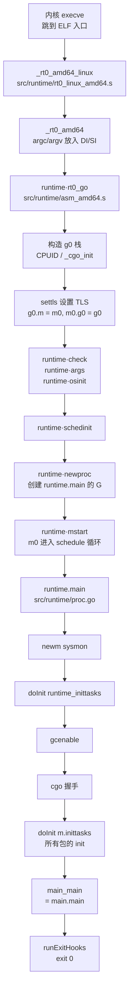

# Go 源码实现详解（二）：程序启动与初始化

## 引言：先给结论

一个 Go 程序在 linux/amd64 上的启动是一条固定的调用链：

```
_rt0_amd64_linux → _rt0_amd64 → runtime·rt0_go（汇编）
    ├─ 用 OS 栈划出 g0 栈；CPUID；（cgo 时）_cgo_init
    ├─ settls：arch_prctl 把 FS 指向 m0.tls，建立 TLS；g0 ⇄ m0 互相绑定
    ├─ runtime·check / runtime·args / runtime·osinit
    ├─ runtime·schedinit：分配器、随机数、哈希、m0、模块表、GC、P 数组……
    ├─ runtime·newproc(runtime.main)：创建 goid 1
    └─ runtime·mstart：m0 进入调度循环，捡起 goid 1
runtime.main（Go）
    ├─ newm(sysmon)：第一个新线程
    ├─ doInit(runtime_inittasks)：runtime 包自己的 init
    ├─ gcenable；cgo 握手（若启用）
    ├─ doInit(m.inittasks)：链接器排好序的所有包 init
    └─ main_main() → runExitHooks(0) → exit(0)
```

读完本篇你会明白：**`main.main` 不是程序的起点**，它之前有一段汇编和上千行 Go 代码；**`g0` 和 `m0` 是静态分配的全局变量**；**包初始化顺序由链接器在链接期算好**（拓扑排序 + 字典序），运行时只是顺序执行一张表；**`main.main` 返回后不会等待其他 goroutine**，直接 `exit_group(0)`；**主 goroutine 里调用 `runtime.Goexit` 不会退出进程**，直到 `checkdead` 报出 deadlock。

所有代码取自 golang/go master（提交 fdcd66b，Go 1.28 开发版）。与 Go 1.21/1.22 相比，`schedinit` 里若干函数名已变化（`alginit` → `maps.AlgInit`、`parsedebugvars` → `parseRuntimeDebugVars`、`main_init_done` → `mainInitDone`），文中随时指出。

## 一、全景图



## 二、汇编入口：从 `_rt0_amd64_linux` 到 `rt0_go`

### 2.1 三个入口符号

链接器为 linux/amd64 可执行文件设置的 ELF 入口是 `_rt0_amd64_linux`，它只是跳板：

`src/runtime/rt0_linux_amd64.s`：

```asm
TEXT _rt0_amd64_linux(SB),NOSPLIT,$-8
	JMP	_rt0_amd64(SB)

TEXT _rt0_amd64_linux_lib(SB),NOSPLIT,$0
	JMP	_rt0_amd64_lib(SB)
```

`_rt0_amd64_linux_lib` 服务于 `-buildmode=c-shared/c-archive`，本文不展开。`_rt0_amd64` 在平台无关的 `src/runtime/asm_amd64.s` 中：

`src/runtime/asm_amd64.s` 的 `_rt0_amd64` 与 `main`：

```asm
TEXT _rt0_amd64(SB),NOSPLIT,$-8
	MOVQ	0(SP), DI	// argc
	LEAQ	8(SP), SI	// argv
	JMP	runtime·rt0_go(SB)

// main is common startup code for most amd64 systems when using
// external linking. The C startup code will call the symbol "main"
// passing argc and argv in the usual C ABI registers DI and SI.
TEXT main(SB),NOSPLIT,$-8
	JMP	runtime·rt0_go(SB)
```

内核 `execve` 后栈顶依次是 `argc`、`argv[]`、`NULL`、`envp[]`、`NULL`、auxv。外部链接（cgo）时由 C 运行时的 `_start` 调用 `main` 符号，同样到达 `rt0_go`。

### 2.2 用 OS 栈构造 g0 的栈

`src/runtime/asm_amd64.s` 的 `runtime·rt0_go`（开头）：

```asm
TEXT runtime·rt0_go(SB),NOSPLIT|NOFRAME|TOPFRAME,$0
	// copy arguments forward on an even stack
	MOVQ	DI, AX		// argc
	MOVQ	SI, BX		// argv
	SUBQ	$(5*8), SP		// 3args 2auto
	ANDQ	$~15, SP
	MOVQ	AX, 24(SP)
	MOVQ	BX, 32(SP)
	// ... 清零 BP，阻止帧指针回溯越过此帧（go.dev/issue/63630）
	MOVQ	$0, BP

	// create istack out of the given (operating system) stack.
	// _cgo_init may update stackguard.
	MOVQ	$runtime·g0(SB), DI
	LEAQ	(-64*1024)(SP), BX
	MOVQ	BX, g_stackguard0(DI)
	MOVQ	BX, g_stackguard1(DI)
	MOVQ	BX, (g_stack+stack_lo)(DI)
	MOVQ	SP, (g_stack+stack_hi)(DI)
```

`runtime·g0` 与 `runtime·m0` 是 `src/runtime/proc.go` 里的全局变量：

```go
var (
	m0           m
	g0           g
	mcache0      *mcache
	// ...
)
```

"第一个 M 和第一个 G"不需要分配器——分配器此时还没初始化。g0 的栈就是主线程的 OS 栈：`stack.hi` 是当前 `SP`，`stack.lo` 是往下 64 KB；`stackguard0/1` 暂时直接设为 `stack.lo`，稍后 `mstart0` 会重设。

### 2.3 CPUID、`_cgo_init` 与 TLS

随后一段 `CPUID` 探测 Intel 厂商（写 `runtime·isIntel`）并保存 `processorVersionInfo`；然后检查 `_cgo_init`。启用 cgo 时，C 侧的 `x_cgo_init` 会修正 g0 栈边界并负责 TLS，汇编跳过 `needtls`；纯 Go 程序则自己设置 TLS：

`src/runtime/asm_amd64.s` 的 `runtime·rt0_go`（TLS 部分）：

```asm
needtls:
	// ... plan9/solaris/illumos/darwin/openbsd 跳过 TLS 设置
	LEAQ	runtime·m0+m_tls(SB), DI
	CALL	runtime·settls(SB)

	// store through it, to make sure it works
	get_tls(BX)
	MOVQ	$0x123, g(BX)
	MOVQ	runtime·m0+m_tls(SB), AX
	CMPQ	AX, $0x123
	JEQ 2(PC)
	CALL	runtime·abort(SB)
ok:
	// set the per-goroutine and per-mach "registers"
	get_tls(BX)
	LEAQ	runtime·g0(SB), CX
	MOVQ	CX, g(BX)
	LEAQ	runtime·m0(SB), AX
	MOVQ	CX, m_g0(AX)	// save m->g0 = g0
	MOVQ	AX, g_m(CX)	// save m0 to g0->m
```

`settls` 在 linux/amd64 上就是 `arch_prctl(ARCH_SET_FS, &m0.tls + 8)`：

`src/runtime/sys_linux_amd64.s` 的 `runtime·settls`：

```asm
TEXT runtime·settls(SB),NOSPLIT,$32
	// ...
	ADDQ	$8, DI	// ELF wants to use -8(FS)
	MOVQ	DI, SI
	MOVQ	$0x1002, DI	// ARCH_SET_FS
	MOVQ	$SYS_arch_prctl, AX
	SYSCALL
	CMPQ	AX, $0xfffffffffffff001
	JLS	2(PC)
	MOVL	$0xf1, 0xf1  // crash
	RET
```

`get_tls(r)` 宏（`src/runtime/go_tls.h`）在 amd64 上展开为 `MOVQ TLS, r`，`g(r)` 即 `-8(FS)`。设置完立刻写 `0x123` 再从 `m0.tls` 读回做自检，然后把 `g0` 地址写入 TLS，完成 `m0.g0 = &g0`、`g0.m = &m0` 的双向绑定。从这一刻起 `getg()` 才可用。现代 Go 在 amd64 上还把当前 g 放在 `R14`（ABIInternal），`gogo<>` 切换 goroutine 时同时更新 TLS 与 `R14`。

### 2.4 `check`、`args`、`osinit`，然后进入 Go

TLS 就绪后才做 GOAMD64 微架构检查（`NEED_FEATURES_CX` 等宏），因为失败时要能打印错误。之后：

`src/runtime/asm_amd64.s` 的 `runtime·rt0_go`（收尾）：

```asm
	CALL	runtime·check(SB)

	MOVL	24(SP), AX		// copy argc
	MOVL	AX, 0(SP)
	MOVQ	32(SP), AX		// copy argv
	MOVQ	AX, 8(SP)
	CALL	runtime·args(SB)
	CALL	runtime·osinit(SB)
	CALL	runtime·schedinit(SB)

	// create a new goroutine to start program
	MOVQ	$runtime·mainPC(SB), AX		// entry
	PUSHQ	AX
	CALL	runtime·newproc(SB)
	POPQ	AX

	// start this M
	CALL	runtime·mstart(SB)

	CALL	runtime·abort(SB)	// mstart should never return
	RET
```

- `runtime·check`（`src/runtime/runtime1.go`）用 `unsafe.Sizeof` 校验基本类型尺寸、原子操作、NaN 行为等编译期假设，失败即 `throw("bad a")` 之类。
- `runtime·args`（`src/runtime/runtime1.go`）把 `argc/argv` 存进全局变量并调用 `sysargs`；`sysargs`（`src/runtime/os_linux.go`）越过 `argv` 与 `envp` 找到 auxv，`sysauxv` 从中取出 `AT_PAGESZ`（`physPageSize`）、`AT_RANDOM`（16 字节内核随机数 `startupRand`）、`AT_SECURE` 等：

```go
func args(c int32, v **byte) {
	argc = c
	argv = v
	sysargs(c, v)
}
```

- `runtime·osinit`（`src/runtime/os_linux.go`）：

```go
func osinit() {
	numCPUStartup = getCPUCount()
	physHugePageSize = getHugePageSize()
	vgetrandomInit()
	configure64bitsTimeOn32BitsArchitectures()
}
```

`getCPUCount` 通过 `sched_getaffinity` 统计 CPU 数，是 `GOMAXPROCS` 默认值的来源。

## 三、`schedinit`：运行时子系统的初始化顺序

`src/runtime/proc.go` 的 `schedinit`（注释与开头）：

```go
// The bootstrap sequence is:
//
//	call osinit
//	call schedinit
//	make & queue new G
//	call runtime·mstart
//
// The new G calls runtime·main.
func schedinit() {
	lockInit(&sched.lock, lockRankSched)
	// ... 十余个 lockInit，仅 staticlockranking 构建下有意义
	lockVerifyMSize()
	sched.midle.init(unsafe.Offsetof(m{}.idleNode))

	// raceinit must be the first call to race detector.
	// In particular, it must be done before mallocinit below calls racemapshadow.
	gp := getg()
	if raceenabled {
		gp.racectx, raceprocctx0 = raceinit()
	}

	sched.maxmcount = 10000
	crashFD.Store(^uintptr(0))

	// The world starts stopped.
	worldStopped()
```

### 3.1 主体顺序

`src/runtime/proc.go` 的 `schedinit`（主体）：

```go
	godebug, parsedGodebug := getGodebugEarly()
	if parsedGodebug {
		parseRuntimeDebugVars(godebug)
	}
	ticks.init() // run as early as possible
	moduledataverify()
	stackinit()
	randinit() // must run before mallocinit, AlgInit, mcommoninit
	mallocinit()
	cpuinit(godebug) // must run before AlgInit
	maps.AlgInit()   // maps, hash, rand must not be used before this call
	mcommoninit(gp.m, -1)
	modulesinit()   // provides activeModules
	typelinksinit() // uses maps, activeModules
	itabsinit()     // uses activeModules
	stkobjinit()    // must run before GC starts

	sigsave(&gp.m.sigmask)
	initSigmask = gp.m.sigmask

	goargs()
	goenvs()
	secure()
	checkfds()
```

逐项说明每一步的作用与位置原因：

| 步骤 | 作用 | 为什么在这里 |
| --- | --- | --- |
| `getGodebugEarly` | 直接扫 `envp` 找 `GODEBUG=` | `goenvs` 还没跑，但 `cpuinit` 需要 GODEBUG 里的 `cpu.*` 开关 |
| `parseRuntimeDebugVars` | 解析 GODEBUG 到 `debug` 结构 | 旧版叫 `parsedebugvars` 且在 `goenvs` 之后，现在提前 |
| `ticks.init` | 初始化 `nanotime` 刻度 | 注释："尽可能早" |
| `moduledataverify` | 校验 `firstmoduledata`（pclntab 魔数、函数表单调性） | 后续符号查找依赖 |
| `stackinit` | 初始化 `stackpool`/`stackLarge` | `malg`/`stackalloc` 依赖 |
| `randinit` | 用 `startupRand`（AT_RANDOM）或 `readRandom` 播种 | 堆地址随机化、哈希种子、`mrandinit` 都要用 |
| `mallocinit` | 校验页大小，初始化 `mheap_`、arena 提示，分配 `mcache0` | 此后才能 `new`/`make` |
| `cpuinit(godebug)` | `cpu.Initialize(env)`，写入 `x86HasAVX` 等编译器守卫变量 | 决定 `AlgInit` 是否用 AES 哈希 |
| `maps.AlgInit` | 初始化字符串/内存哈希 | 旧版叫 `alginit`，已移入 `internal/runtime/maps` |
| `mcommoninit(gp.m, -1)` | m0 登记进 `allm`，分配 `gsignal` 栈 | 需要分配器与随机数 |
| `modulesinit` | 构建 `modulesSlice`，生成 data/bss 的 GC 位图 | 提供 `activeModules()` |
| `typelinksinit` | 多模块（plugin/shared）时合并类型表 | 用到 map，故在 `AlgInit` 后 |
| `itabsinit` | 把编译期 itab 加入全局表 | |
| `stkobjinit` | 设置 `methodValueCallFrameObjs` | 必须在 GC 启动前 |
| `sigsave` | 保存主线程信号掩码到 `initSigmask` | 新建 M 都继承它 |
| `goargs`/`goenvs` | C 风格 `argv/envp` → `argslice/envs` | 此后 `os.Args`、`os.Getenv` 可用 |
| `secure` | setuid 程序强制 `GOTRACEBACK=none` | |
| `checkfds` | fd 0/1/2 若关闭，用 `/dev/null` 占位 | 避免后续打开的文件意外成为 stdout |

`mcommoninit` 把一个 `m` 变成"可被运行时管理"的对象：

`src/runtime/proc.go` 的 `mcommoninit`：

```go
func mcommoninit(mp *m, id int64) {
	// ...
	lock(&sched.lock)
	if id >= 0 {
		mp.id = id
	} else {
		mp.id = mReserveID()
	}
	mp.self = newMWeakPointer(mp)
	mrandinit(mp)
	mpreinit(mp)
	// ...
	// Add to allm so garbage collector doesn't free g->m
	// when it is just in a register or thread-local storage.
	mp.alllink = allm
	atomicstorep(unsafe.Pointer(&allm), unsafe.Pointer(mp))
	unlock(&sched.lock)
	// ...
}
```

`mpreinit`（`src/runtime/os_linux.go`）为该 M 分配 32 KB 的信号处理栈 `gsignal`——这也是 `mcommoninit` 必须在 `mallocinit`、`stackinit` 之后的原因。m0 的 id 由 `mReserveID` 分配，得到 0。

### 3.2 后半段：GC、gcrash 栈与 P 数组

`src/runtime/proc.go` 的 `schedinit`（后半）：

```go
	if !parsedGodebug {
		// Some platforms, e.g., Windows, didn't make env vars available "early",
		// so try again now.
		parseRuntimeDebugVars(gogetenv("GODEBUG"))
	}
	finishDebugVarsSetup()
	gcinit()

	// Allocate stack space that can be used when crashing due to bad stack
	// conditions, e.g. morestack on g0.
	gcrash.stack = stackalloc(16384)
	// ...
	mProfStackInit(gp.m)
	defaultGOMAXPROCSInit()

	lock(&sched.lock)
	sched.lastpoll.Store(nanotime())
	var procs int32
	if n, err := strconv.ParseInt(gogetenv("GOMAXPROCS"), 10, 32); err == nil && n > 0 {
		procs = int32(n)
		sched.customGOMAXPROCS = true
	} else {
		procs = defaultGOMAXPROCS(numCPUStartup)
	}
	if procresize(procs) != nil {
		throw("unknown runnable goroutine during bootstrap")
	}
	unlock(&sched.lock)

	// World is effectively started now, as P's can run.
	worldStarted()
```

- `finishDebugVarsSetup` 存下 `GODEBUG` 字符串并解析 `GOTRACEBACK`。
- `gcinit`（`src/runtime/mgc.go`）用 `gcController.init(readGOGC(), readGOMEMLIMIT())` 初始化 pacer，并把 sweep 状态置为"已排空"。
- `gcrash` 是专用于"栈损坏时仍能打印崩溃信息"的 g。
- `defaultGOMAXPROCSInit`（`src/runtime/cgroup_linux.go`）是 Go 1.25 引入的 cgroup 感知 GOMAXPROCS：打开 cgroup CPU 控制器，后续 `defaultGOMAXPROCS` 会按 CPU 配额下调 P 数。
- `procresize(procs)` 创建 `allp[0..procs)`，把 `allp[0]` 绑定到 m0。返回值是"有可运行 goroutine 的 P 链表"，引导阶段必为 `nil`。

至此 m0 拥有 P0，分配器、GC、类型系统可用，但**还没有任何 goroutine，也没有第二个线程**。

### 3.3 版本差异一览

| 旧名称/位置 | 当前实现 |
| --- | --- |
| `alginit()` | `maps.AlgInit()`（`src/internal/runtime/maps/runtime_alg.go`） |
| `parsedebugvars()`，在 `goenvs` 之后 | `getGodebugEarly()` + `parseRuntimeDebugVars()`，提前到 `ticks.init` 前 |
| `fastrandinit()` | `randinit()`，提前到 `mallocinit` 之前 |
| 无 | `secure()`、`checkfds()`、`defaultGOMAXPROCSInit()`、`gcrash` 栈 |
| `main_init_done chan bool` | `mainInitDone atomic.Bool` + `mainInitDoneChan chan bool` |

## 四、m0、g0 与 `mstart`：主线程进入调度循环

### 4.1 `newproc` 创建主 goroutine

`rt0_go` 把 `runtime·mainPC` 压栈后调用 `newproc`。`mainPC` 是只读的 `funcval`，指向 ABIInternal 版 `runtime.main`：

`src/runtime/asm_amd64.s`：

```asm
DATA	runtime·mainPC+0(SB)/8,$runtime·main<ABIInternal>(SB)
GLOBL	runtime·mainPC(SB),RODATA,$8
```

`src/runtime/proc.go` 的 `newproc`：

```go
func newproc(fn *funcval) {
	gp := getg()
	pc := sys.GetCallerPC()
	systemstack(func() {
		newg := newproc1(fn, gp, pc, false, waitReasonZero)

		pp := getg().m.p.ptr()
		runqput(pp, newg, true)

		if mainStarted {
			wakep()
		}
	})
}
```

`newproc1` 此时拿不到缓存的 g，于是 `malg(stackMin)` 新建一个 8 KB 栈的 g，伪造一个"从 `goexit` 调用 `fn`"的栈帧（`newg.sched.pc = abi.FuncPCABI0(goexit) + sys.PCQuantum`，再由 `gostartcallfn` 把 `fn` 塞进去），分配 goid，状态设为 `_Grunnable`，`runqput(pp, newg, true)` 放进 P0 的 `runnext` 槽。`mainStarted` 此时为 `false`，不会 `wakep()`——引导阶段严格单线程。这个 g 的 goid 为 1，就是 panic 栈上的 `goroutine 1 [running]`。

### 4.2 `mstart` → `mstart0` → `mstart1`

`src/runtime/asm_amd64.s` 的 `runtime·mstart`：

```asm
TEXT runtime·mstart(SB),NOSPLIT|TOPFRAME|NOFRAME,$0
	// This is the root frame of new Go-created OS threads.
	// ... 清零 BP，阻止基于帧指针的回溯越过此帧
	MOVD	$0, BP
	CALL	runtime·mstart0(SB)
	RET // not reached
```

`mstart` 既是 m0 的入口，也是后续所有 `clone` 出来线程的入口。真正逻辑在 `mstart0`：

`src/runtime/proc.go` 的 `mstart0`：

```go
func mstart0() {
	gp := getg()

	osStack := gp.stack.lo == 0
	if osStack {
		// Initialize stack bounds from system stack.
		// Cgo may have left stack size in stack.hi.
		// ...
		gp.stack.hi = uintptr(noescape(unsafe.Pointer(&size)))
		gp.stack.lo = gp.stack.hi - size + 1024
	}
	// Initialize stack guard so that we can start calling regular
	// Go code.
	gp.stackguard0 = gp.stack.lo + stackGuard
	// This is the g0, so we can also call go:systemstack
	// functions, which check stackguard1.
	gp.stackguard1 = gp.stackguard0
	mstart1()

	// Exit this thread.
	// ...
	mexit(osStack)
}
```

m0 的 `g0.stack.lo` 已由 `rt0_go` 填好，跳过 `osStack` 分支，只把 `stackguard0/1` 改成 `stack.lo + stackGuard`，让 g0 上的 Go 代码具备正常的栈检查。

`src/runtime/proc.go` 的 `mstart1`：

```go
func mstart1() {
	gp := getg()

	if gp != gp.m.g0 {
		throw("bad runtime·mstart")
	}

	// Set up m.g0.sched as a label returning to just
	// after the mstart1 call in mstart0 above, for use by goexit0 and mcall.
	// ...
	gp.sched.g = guintptr(unsafe.Pointer(gp))
	gp.sched.pc = sys.GetCallerPC()
	gp.sched.sp = sys.GetCallerSP()
	gp.sched.bp = getcallerfp()

	asminit()
	minit()

	// Install signal handlers; after minit so that minit can
	// prepare the thread to be able to handle the signals.
	if gp.m == &m0 {
		mstartm0()
	}
	// ...
	if fn := gp.m.mstartfn; fn != nil {
		fn()
	}

	if gp.m != &m0 {
		acquirep(gp.m.nextp.ptr())
		gp.m.nextp = 0
	}
	schedule()
}
```

要点：

1. **`g0.sched` 记录的是 `mstart0` 中调用 `mstart1` 之后的位置**。以后 `mcall`、`goexit0` 切回 g0 用的就是它；线程退出时 `gogo(&g0.sched)` 回到 `mstart0`，进而 `mexit`。
2. `minit`（`src/runtime/os_linux.go`）做两件事：`minitSignals()` 设置信号栈与掩码；`getg().m.procid = uint64(gettid())`，供异步抢占（`tgkill`）与调试器使用。
3. **只有 m0 调用 `mstartm0`**：cgo 或 Windows 下 `newextram()` 准备一个额外 M 供 C 线程回调，然后 `initsig(false)`（`src/runtime/signal_unix.go`）遍历 `sigtable` 安装 `sighandler`，把原处理器存进 `fwdSig` 以便转发。信号处理器是在 `runtime.main` 尚未运行时安装的，所以 `init` 里就能收到 `SIGINT`。
4. m0 已在 `procresize` 里拿到 P0，无需 `acquirep`；其他 M 从 `nextp` 取 `newm` 预留的 P。
5. `schedule()` 永不返回。`findRunnable` 先看 `P0.runnext`，那里正躺着 goid 1，于是 `execute(gp)` → `gogo(&gp.sched)` 切到主 goroutine 的栈，开始执行 `runtime.main`。

### 4.3 `newm` 与 `clone`：第二个线程如何诞生

`runtime.main` 的第一件重事是 `newm(sysmon, nil, -1)`，这是程序创建的第一个新线程：

```mermaid
sequenceDiagram
    participant Main as runtime.main (g1 on m0)
    participant NM as newm / allocm
    participant OS as clone 系统调用
    participant T as 新线程 (m.g0)
    Main->>NM: newm(sysmon, nil, -1)
    NM->>NM: allocm: new(mPadded).m<br/>mcommoninit(mp)<br/>mp.g0 = malg(16KB)
    NM->>NM: mp.nextp = pp, mp.sigmask = initSigmask
    NM->>OS: newosproc(mp): 屏蔽所有信号<br/>clone(cloneFlags, g0.stack.hi, mp, mp.g0, mstart)
    OS-->>NM: 父线程: 返回 tid, 恢复信号掩码
    OS-->>T: 子线程: SP=新栈, procid=gettid<br/>g0.m=mp, TLS g=g0, R14=g0
    T->>T: CALL mstart → mstart0 → mstart1
    T->>T: minit; fn = mstartfn = sysmon; fn()
```

`src/runtime/proc.go` 的 `newm`：

```go
func newm(fn func(), pp *p, id int64) {
	// ... 禁止抢占，确保 allocm 与线程真正启动之间不被打断
	acquirem()

	mp := allocm(pp, fn, id)
	mp.nextp.set(pp)
	mp.sigmask = initSigmask
	if gp := getg(); gp != nil && gp.m != nil && (gp.m.lockedExt != 0 || gp.m.incgo) && GOOS != "plan9" {
		// We're on a locked M or a thread that may have been
		// started by C. ... Instead, ask a known-good thread to create
		// the thread for us.
		// ... 把 mp 挂到 newmHandoff.newm 链表，唤醒模板线程
		releasem(getg().m)
		return
	}
	newm1(mp)
	releasem(getg().m)
}
```

`allocm` 用 `new(mPadded).m` 分配 `m`，调用 `mcommoninit` 登记，再为它分配 g0：非 cgo 的 Linux 下 `malg(16384 * sys.StackGuardMultiplier)`，即运行时自己从 `stackalloc` 分配的 16 KB 栈；cgo 模式下 `malg(-1)`，栈由 pthread 提供。`mstartfn` 就是传入的 `fn`。`newm1` 在非 cgo 时直接调用 `newosproc(mp)`：

`src/runtime/os_linux.go` 的 `newosproc` 与 `cloneFlags`：

```go
func newosproc(mp *m) {
	stk := unsafe.Pointer(mp.g0.stack.hi)
	// ...
	// Disable signals during clone, so that the new thread starts
	// with signals disabled. It will enable them in minit.
	var oset sigset
	sigprocmask(_SIG_SETMASK, &sigset_all, &oset)
	ret := retryOnEAGAIN(func() int32 {
		r := clone(cloneFlags, stk, unsafe.Pointer(mp), unsafe.Pointer(mp.g0), unsafe.Pointer(abi.FuncPCABI0(mstart)))
		// clone returns positive TID, negative errno.
		if r >= 0 {
			return 0
		}
		return -r
	})
	sigprocmask(_SIG_SETMASK, &oset, nil)
	// ... 失败时打印 "failed to create new OS thread" 并 throw("newosproc")
}

	cloneFlags = _CLONE_VM | /* share memory */
		_CLONE_FS | /* share cwd, etc */
		_CLONE_FILES | /* share fd table */
		_CLONE_SIGHAND | /* share sig handler table */
		_CLONE_SYSVSEM | /* share SysV semaphore undo lists (see issue #20763) */
		_CLONE_THREAD /* revisit - okay for now */
```

Go 不依赖 libc，线程直接用 `clone(2)` 造。汇编版 `runtime·clone` 在子线程一侧完成本该由 pthread 做的事：

`src/runtime/sys_linux_amd64.s` 的 `runtime·clone`（子线程部分）：

```asm
	// In child, on new stack.
	MOVQ	SI, SP
	// ... m 或 g 为 nil 时跳过 Go 相关设置
	// Initialize m->procid to Linux tid
	MOVL	$SYS_gettid, AX
	SYSCALL
	MOVQ	AX, m_procid(R13)

	// In child, set up new stack
	get_tls(CX)
	MOVQ	R13, g_m(R9)
	MOVQ	R9, g(CX)
	MOVQ	R9, R14 // set g register
	CALL	runtime·stackcheck(SB)

nog2:
	// Call fn. This is the PC of an ABI0 function.
	CALL	R12

	// It shouldn't return. If it does, exit that thread.
	MOVL	$111, DI
	MOVL	$SYS_exit, AX
	SYSCALL
```

父线程一侧在系统调用前给 `flags` 加上 `CLONE_SETTLS`，并把 `&mp.tls[0] + 8` 作为新线程的 FS 基址——与 m0 的 `arch_prctl` 等价，只是由内核在 `clone` 时一并完成。子线程从 `mstart` 开始，走与 m0 相同的 `mstart0 → mstart1` 路径，只是 `gp.m != &m0`，不执行 `mstartm0` 而会 `acquirep(nextp)`。sysmon 的 `pp` 是 `nil`，所以它永远没有 P，这也是它能绕过 STW 的原因。

### 4.4 `mexit`：m0 永不退出

`mstart0` 末尾的 `mexit(osStack)`（`src/runtime/proc.go`）对 m0 有特殊分支：注释写明"On Linux, exiting the main thread puts the process into a non-waitable zombie state"，所以 m0 一旦走到这里（例如锁定它的 goroutine 退出了），就 `handoffp(releasep())` 交出 P、`checkdead()`，然后 `mPark()` 永久停泊；若被唤醒则 `throw("locked m0 woke up")`。其他 M 则正常解绑信号栈、释放 `gsignal`、从 `allm` 摘除并退出线程。

## 五、`runtime.main`：主 goroutine 的工作清单

### 5.1 栈上限、`mainStarted`、启动 sysmon

`src/runtime/proc.go` 的 `main`（开头）：

```go
func main() {
	mp := getg().m
	// ...
	// Max stack size is 1 GB on 64-bit, 250 MB on 32-bit.
	if goarch.PtrSize == 8 {
		maxstacksize = 1000000000
	} else {
		maxstacksize = 250000000
	}
	maxstackceiling = 2 * maxstacksize

	// Allow newproc to start new Ms.
	mainStarted = true

	if haveSysmon {
		systemstack(func() {
			newm(sysmon, nil, -1)
		})
	}

	// Lock the main goroutine onto this, the main OS thread,
	// during initialization. ...
	lockOSThread()

	if mp != &m0 {
		throw("runtime.main not on m0")
	}
```

- `maxstacksize` 就是 `goroutine stack exceeds 1000000000-byte limit` 里的数字。
- `mainStarted = true` 之后 `newproc` 才会 `wakep()`，`go` 语句从此可能触发新线程创建。
- `haveSysmon` 是常量 `GOARCH != "wasm"`。sysmon 运行在没有 P 的 M 上，负责抢占、netpoll、强制 GC、归还内存。
- `lockOSThread()` 在初始化期间把主 goroutine 锁在 m0 上。`LockOSThread` 的文档注释明确写着："All init functions are run on the startup thread. Calling LockOSThread from an init function will cause the main function to be invoked on that thread."

### 5.2 记录时间、inittrace、runtime 包自己的 init、启用 GC

```go
	// Record when the world started.
	// Must be before doInit for tracing init.
	runtimeInitTime = nanotime()
	// ...
	if debug.inittrace != 0 {
		inittrace.id = getg().goid
		inittrace.active = true
	}

	doInit(runtime_inittasks) // Must be before defer.

	// Defer unlock so that runtime.Goexit during init does the unlock too.
	needUnlock := true
	defer func() {
		if needUnlock {
			unlockOSThread()
		}
	}()

	gcenable()
	defaultGOMAXPROCSUpdateEnable() // don't STW before runtime initialized.
```

`runtime_inittasks` 是 `runtime` 包自身的 init 列表，由链接器单独填充（第六章）。它必须在任何 `defer` 之前运行。runtime 包的 init 里有什么？例如 `src/runtime/proc.go` 中：

```go
func init() {
	exithook.Gosched = Gosched
	exithook.Goid = func() uint64 { return getg().goid }
	exithook.Throw = throw
}

// start forcegc helper goroutine
func init() {
	go forcegchelper()
}
```

`gcenable`（`src/runtime/mgc.go`）启动两个后台 goroutine 并等它们就绪：

```go
func gcenable() {
	// Kick off sweeping and scavenging.
	c := make(chan int, 2)
	go bgsweep(c)
	go bgscavenge(c)
	<-c
	<-c
	memstats.enablegc = true // now that runtime is initialized, GC is okay
}
```

至此，一个 hello world 已至少有 4 个 goroutine（main、forcegc、bgsweep、bgscavenge）和 2 个线程（m0、sysmon）。

### 5.3 cgo 握手

接下来 `mainInitDoneChan = make(chan bool)`；若 `iscgo`，则依次检查 `_cgo_pthread_key_created`、`_cgo_thread_start`、`_cgo_setenv`、`_cgo_unsetenv`、`_cgo_notify_runtime_init_done` 等 C 侧符号是否存在，调用 `set_crosscall2()`，用 `startTemplateThread()` 创建一个"干净"的模板线程（供 4.3 中 `newm` 在锁定线程或 C 线程上请求代为 clone），最后 `cgocall(_cgo_notify_runtime_init_done, nil)` 通知 C 侧运行时已可用。

### 5.4 运行所有包的 init，调用 `main.main`

```go
	// Run the initializing tasks. ... Run through the modules in dependency
	// order (the order they are initialized by the dynamic loader ...).
	last := lastmoduledatap // grab before loop starts. ...
	for m := &firstmoduledata; true; m = m.next {
		doInit(m.inittasks)
		if m == last {
			break
		}
	}

	// Disable init tracing after main init done to avoid overhead
	// of collecting statistics in malloc and newproc
	inittrace.active = false

	mainInitDone.Store(true)
	close(mainInitDoneChan)

	needUnlock = false
	unlockOSThread()

	if isarchive || islibrary {
		// A program compiled with -buildmode=c-archive or c-shared
		// has a main, but it is not executed.
		// ...
		return
	}
	fn := main_main // make an indirect call, as the linker doesn't know the address of the main package when laying down the runtime
	fn()
```

普通可执行文件只有一个 `moduledata`，循环只跑一次。`mainInitDone`/`mainInitDoneChan` 供 `cgocallbackg`（`src/runtime/cgocall.go`）使用：C 线程回调进 Go 时若初始化未完成，就在 `mainInitDoneChan` 上等待；旧版本这里是一个 `main_init_done` channel。`main_main` 通过 `//go:linkname main_main main.main` 绑定到用户的 `main.main`。`unlockOSThread` 在调用 `main_main` 前执行——除非某个 init 调用了 `runtime.LockOSThread`（`m.lockedInt` 不为 0，解锁后仍保持锁定）。

### 5.5 `main.main` 返回之后

```go
	// ... asan 泄漏检查（略）

	// Make racy client program work: if panicking on
	// another goroutine at the same time as main returns,
	// let the other goroutine finish printing the panic trace.
	if runningPanicDefers.Load() != 0 {
		// ... 最多让步 1000 次
	}
	if panicking.Load() != 0 {
		gopark(nil, nil, waitReasonPanicWait, traceBlockForever, 1)
	}
	if !exitHooksRun {
		runExitHooks(0)
	}
	if raceenabled {
		racefini() // does not return
	}

	exit(0)
	for {
		var x *int32
		*x = 0
	}
}
```

三个细节：如果别的 goroutine 正在 panic，主 goroutine 让步最多 1000 次后永久 `gopark`，让 panic 的 goroutine 打完栈并以状态码 2 退出——这就是"崩溃时总能看到完整栈"的保证；`runExitHooks(0)` 运行退出钩子（第七章）；`exit(0)` 在 linux/amd64 上是 `exit_group` 系统调用（`src/runtime/sys_linux_amd64.s` 的 `runtime·exit`），终止所有线程。

## 六、包初始化顺序：编译器、链接器与运行时的三方协作

`doInit` 执行的是一张表。这张表是谁、按什么规则排好的？**编译器为每个包生成一个 `.inittask` 记录；链接器把所有记录按依赖关系拓扑排序写进 `moduledata.inittasks`；运行时顺序执行。**

### 6.1 编译器：把变量初始化和 `init()` 收集成函数

noder 在读取包信息时把包级变量初始化语句合成一个名为 `init` 的函数：

`src/cmd/compile/internal/noder/reader.go` 的 `pkgInitOrder`：

```go
// pkgInitOrder creates a synthetic init function to handle any
// package-scope initialization statements.
func (r *reader) pkgInitOrder(target *ir.Package) {
	initOrder := make([]ir.Node, r.Len())
	if len(initOrder) == 0 {
		return
	}
	// ...
	fn := ir.NewFunc(pos, pos, typecheck.Lookup("init"), types.NewSignature(nil, nil, nil))
	fn.SetIsPackageInit(true)
	// ... 语句数超过 maxInitStatements(1000) 时拆成多个 init.part.N
	// Outline (if legal/profitable) global map inits.
	staticinit.OutlineMapInits(fn)
	// ...
	target.Inits = append(target.Inits, fn)
}
```

变量初始化的**顺序**（规范中"按依赖关系、否则按声明顺序"）在更早的 types2 阶段已算好，`initOrder` 拿到的是排好序的语句。用户写的 `func init()` 被 `Renameinit`（`src/cmd/compile/internal/noder/noder.go`）重命名为 `init.0`、`init.1`……，`reader.go` 里名字以 `init.` 开头的函数都进入 `target.Inits`。

接着 `staticinit` 包尽可能把初始化"静态化"：`var x = 42`、`var p = &T{...}` 这类赋值直接落到 data 段，不必在运行时执行。`pkginit.MakeTask` 对每个 init 函数调用 `staticinit.Schedule`：

`src/cmd/compile/internal/pkginit/init.go` 的 `MakeTask`（用户 init 处理部分）：

```go
	// Record user init functions.
	for _, fn := range typecheck.Target.Inits {
		if staticinit.CanOptimize(fn) {
			s := staticinit.Schedule{
				Plans: make(map[ir.Node]*staticinit.Plan),
				Temps: make(map[ir.Node]*ir.Name),
			}
			for _, n := range fn.Body {
				s.StaticInit(n)
			}
			fn.Body = s.Out
			// ...
		}
		// ... 跳过函数体为空的 init
		fns = append(fns, fn.Nname.Linksym())
	}
```

`CanOptimize`（`src/cmd/compile/internal/staticinit/sched.go`）只对合成的 `init` 与 `init.part.*` 返回 true，用户的 `init.N` 不做静态化。`Schedule.StaticInit` 对每条语句先 `tryStaticInit`，失败的才进入 `s.Out` 成为运行时代码。若一个包所有变量都能静态初始化，合成的 `init` 变成空函数并被跳过。

### 6.2 编译器：生成 `.inittask` 符号

`src/cmd/compile/internal/pkginit/init.go` 的 `MakeTask`（生成记录部分）：

```go
	if len(deps) == 0 && len(fns) == 0 && types.LocalPkg.Path != "main" && types.LocalPkg.Path != "runtime" {
		return // nothing to initialize
	}

	// Make an .inittask structure.
	sym := typecheck.Lookup(".inittask")
	task := ir.NewNameAt(base.Pos, sym, types.Types[types.TUINT8]) // fake type
	// ...
	lsym := task.Linksym()
	ot := 0
	ot = objw.Uint32(lsym, ot, 0) // state: not initialized yet
	ot = objw.Uint32(lsym, ot, uint32(len(fns)))
	for _, f := range fns {
		ot = objw.SymPtr(lsym, ot, f, 0)
	}

	// Add relocations which tell the linker all of the packages
	// that this package depends on (and thus, all of the packages
	// that need to be initialized before this one).
	for _, d := range deps {
		lsym.AddRel(base.Ctxt, obj.Reloc{Type: objabi.R_INITORDER, Sym: d})
	}
	// An initTask has pointers, but none into the Go heap.
	// It's not quite read only, the state field must be modifiable.
	objw.Global(lsym, int32(ot), obj.NOPTR)
}
```

`deps` 是函数开头遍历 `typecheck.Target.Imports` 收集的：凡导入包有 `.inittask` 符号的都算依赖。生成的符号叫 `<pkgpath>..inittask`（如 `main..inittask`、`fmt..inittask`），布局为 `state uint32 | nfns uint32 | nfns 个函数指针`，与运行时 `initTask` 严格对应；依赖关系不放在数据里，而用 `R_INITORDER` 重定位表达——它不修改任何字节，纯粹是给链接器看的一条边。`main` 与 `runtime` 即便没有 init 也要生成记录，因为链接器以它们为根。

### 6.3 链接器：拓扑排序 + 字典序

`src/cmd/link/internal/ld/inittask.go` 的 `inittasks`：

```go
func (ctxt *Link) inittasks() {
	switch ctxt.BuildMode {
	case BuildModeExe, BuildModePIE, BuildModeCArchive, BuildModeCShared:
		// Normally the inittask list will be run on program startup.
		ctxt.mainInittasks = ctxt.inittaskSym([]string{"main..inittask"}, "go:main.inittasks")
	// ... plugin 以插件包为根，shared 以所有库包为根
	}

	// If the runtime is one of the packages we are building,
	// initialize the runtime_inittasks variable.
	ldr := ctxt.loader
	if ldr.Lookup("runtime.runtime_inittasks", 0) != 0 {
		t := ctxt.inittaskSym([]string{"runtime..inittask"}, "go:runtime.inittasks")

		// This slice header is already defined in runtime/proc.go, so we update it here with new contents.
		sh := ldr.Lookup("runtime.runtime_inittasks", 0)
		sb := ldr.MakeSymbolUpdater(sh)
		sb.SetSize(0)
		sb.SetType(sym.SNOPTRDATA) // Could be SRODATA, but see issue 58857.
		sb.AddAddr(ctxt.Arch, t)
		sb.AddUint(ctxt.Arch, uint64(ldr.SymSize(t)/int64(ctxt.Arch.PtrSize)))
		sb.AddUint(ctxt.Arch, uint64(ldr.SymSize(t)/int64(ctxt.Arch.PtrSize)))
	}
}
```

这就是 `runtime_inittasks` 变量的来历：链接器以 `runtime..inittask` 为根单独算一张表，直接改写 `runtime.runtime_inittasks` 切片头的三个字。主表 `go:main.inittasks` 则由 `src/cmd/link/internal/ld/symtab.go` 写进 `moduledata.inittasks`。

排序算法在 `inittaskSym` 里：

`src/cmd/link/internal/ld/inittask.go` 的 `inittaskSym`（调度部分）：

```go
	// Figure out the schedule.
	sched := ldr.MakeSymbolBuilder(symName)
	sched.SetType(sym.SNOPTRDATA) // Could be SRODATA, but see issue 58857.
	for !h.empty() {
		// Pick the lexicographically first initializable package.
		s := h.pop(ldr)

		// Add s to the schedule.
		if ldr.SymSize(s) > 8 {
			// Note: don't add s if it has no functions to run. ...
			sched.AddAddr(ctxt.Arch, s)
		}
		// ... 用二分在 edges 里找到所有指向 s 的入边
		// Decrement the import count for all packages that import s.
		// If the count reaches 0, that package is now ready to schedule.
		for _, e := range edges[a:b] {
			m[e.from]--
			if m[e.from] == 0 {
				h.push(ldr, e.from)
			}
		}
	}
```

这是标准的 Kahn 拓扑排序：从根出发沿 `R_INITORDER` 边找到所有可达的 `.inittask`，记录每个包"尚未初始化的直接依赖数" `m[p]`；依赖数为 0 的进入一个**按包路径字典序**的堆 `lexHeap`；每次弹出字典序最小者写入表，再把导入它的包计数减一。因此：依赖关系优先；依赖之外按导入路径字典序——这正是 Go 1.21 起规范中 init 顺序规则的实现出处；只有 `nfns > 0`（符号大于 8 字节）的包才进表，约一半标准库包因完全静态初始化而不出现。

### 6.4 运行时：`initTask` 与 `doInit1`

`src/runtime/proc.go` 的 `initTask` 与 `doInit1`：

```go
// An initTask represents the set of initializations that need to be done for a package.
// Keep in sync with ../../test/noinit.go:initTask
type initTask struct {
	state uint32 // 0 = uninitialized, 1 = in progress, 2 = done
	nfns  uint32
	// followed by nfns pcs, uintptr sized, one per init function to run
}

func doInit1(t *initTask) {
	switch t.state {
	case 2: // fully initialized
		return
	case 1: // initialization in progress
		throw("recursive call during initialization - linker skew")
	default: // not initialized yet
		t.state = 1 // initialization in progress
		// ... inittrace 计时与统计
		firstFunc := add(unsafe.Pointer(t), 8)
		for i := uint32(0); i < t.nfns; i++ {
			p := add(firstFunc, uintptr(i)*goarch.PtrSize)
			f := *(*func())(unsafe.Pointer(&p))
			f()
		}
		// ...
		t.state = 2 // initialization done
	}
}
```

运行时不再做任何图算法，只是顺序遍历、逐个调用（`doInit` 就是对切片做 `for` 循环调用 `doInit1`）。`state` 用于跨模块（plugin）场景避免重复执行，以及在链接器算错时报 "linker skew"。Go 1.20 及之前 `initTask` 还有 `ndeps` 字段并在运行时递归遍历依赖；Go 1.21 把排序移到链接器后，结构体缩为两个字段。`test/noinit.go` 里有同布局的镜像用于测试。

### 6.5 用 `GODEBUG=inittrace=1` 观察

`doInit1` 中被省略的部分在 `inittrace.active` 时打印每个包 init 的耗时和分配：

```go
		if inittrace.active {
			end := nanotime()
			after := inittrace
			f := *(*func())(unsafe.Pointer(&firstFunc))
			pkg := funcpkgpath(findfunc(abi.FuncPCABIInternal(f)))
			// ...
			print("init ", pkg, " @")
			print(string(fmtNSAsMS(sbuf[:], uint64(start-runtimeInitTime))), " ms, ")
			print(string(fmtNSAsMS(sbuf[:], uint64(end-start))), " ms clock, ")
			print(string(itoa(sbuf[:], after.bytes-before.bytes)), " bytes, ")
			print(string(itoa(sbuf[:], after.allocs-before.allocs)), " allocs")
			print("\n")
		}
```

`@` 后是相对 `runtimeInitTime` 的时刻，其后是 wall clock 耗时、堆分配字节数与次数。统计由 `mallocgc` 与 `newproc` 在 `inittrace.active && goid == inittrace.id` 时累加；`parseRuntimeDebugVars` 里 `debug.malloc = (debug.inittrace | debug.sbrk | debug.checkfinalizers) != 0` 就是让分配器走慢路径记账的开关。

## 七、程序退出的几条路径

### 7.1 `main.main` 正常返回

如第五章所述：`runExitHooks(0)` → `exit(0)`，即 `exit_group(0)`。**不会等待其他 goroutine**，它们随进程一起消失。

### 7.2 `os.Exit`

`src/os/proc.go` 的 `Exit` 先调用 `runtime_beforeExit(code)`，再 `syscall.Exit(code)`。前者通过 linkname 对应 `src/runtime/proc.go` 的 `os_beforeExit`：

```go
//go:linkname os_beforeExit os.runtime_beforeExit
func os_beforeExit(exitCode int) {
	runExitHooks(exitCode)
	if exitCode == 0 && raceenabled {
		racefini()
	}
	// ... asan 泄漏检查
}
```

`syscall.Exit` 也 linkname 到运行时（`src/runtime/runtime.go` 的 `syscall_Exit`），最终同样是 `exit(int32(code))`。所以 `os.Exit` 与 main 返回的区别只有：状态码可自定义；**defer 不会执行**——没有栈展开，直接系统调用。

### 7.3 主 goroutine 调用 `runtime.Goexit`

`Goexit`（`src/runtime/panic.go`）先运行当前 goroutine 的所有 defer，然后 `goexit1` → `mcall(goexit0)` → `gdestroy` 销毁 g 并 `schedule()`。它没有任何"我是 goid 1"的特判，主 goroutine 就这样静静消失，进程继续跑其他 goroutine。当所有 goroutine 都结束或阻塞时：

`src/runtime/proc.go` 的 `checkdead`（结尾部分）：

```go
	if grunning == 0 { // possible if main goroutine calls runtime·Goexit()
		unlock(&sched.lock) // unlock so that GODEBUG=scheddetail=1 doesn't hang
		fatal("no goroutines (main called runtime.Goexit) - deadlock!")
	}
```

这就是文档所说"主 goroutine 调用 Goexit 后，程序在其他 goroutine 结束时崩溃"的来源。`runtime.main` 中 `doInit` 之后那个 `defer unlockOSThread` 也是为这个场景准备的：在 init 里 `Goexit`，defer 仍会解锁。

### 7.4 退出钩子

`internal/runtime/exithook` 是 Go 1.23 起独立出来的小包：

`src/internal/runtime/exithook/hooks.go`：

```go
// A Hook is a function to be run at program termination
// (when someone invokes os.Exit, or when main.main returns).
// Hooks are run in reverse order of registration:
// the first hook added is the last one run.
type Hook struct {
	F            func() // func to run
	RunOnFailure bool   // whether to run on non-zero exit code
}

func Run(code int) {
	// ... 自旋拿锁；同一 goroutine 在钩子里再次 exit 则 Throw("exit hook invoked exit")
	// ... recover 后 Throw("exit hook invoked panic")
	for len(hooks) > 0 {
		h := hooks[len(hooks)-1]
		hooks = hooks[:len(hooks)-1]
		if code != 0 && !h.RunOnFailure {
			continue
		}
		h.F()
	}
}
```

它不是公开 API，主要使用者是 `runtime/coverage`（`go test -cover` 退出时写覆盖率文件）和 `testing`。要点：后注册先执行；非零退出码只运行 `RunOnFailure` 的钩子；钩子里再调 `os.Exit` 或 panic 都会 `throw`。它只在 main 返回和 `os.Exit` 两条路径上运行（`log.Fatal` 内部就是 `os.Exit(1)`，也算），信号杀死、`throw`、未恢复的 panic 都不会触发。

## 八、用一个 hello world 走一遍

```go
package main

import "fmt"

func init() { println("main.init") }

func main() { fmt.Println("hello") }
```

`go build -o hello .` 之后逐层验证：

**入口点确实是 `_rt0_amd64_linux`**：`readelf -h hello | grep Entry` 给出的地址，应与 `go tool nm -n hello | grep ' _rt0_amd64_linux$'` 一致。

**`.inittask` 符号与链接器生成的表**：`go tool nm hello | grep inittask` 会列出 `main..inittask`、`fmt..inittask`、`runtime..inittask` 等每包一个的记录，以及 `go:main.inittasks`、`go:runtime.inittasks` 两张表。没有 init 需要执行的包（例如 `errors`）不会出现。

**用 `GODEBUG=inittrace=1 ./hello` 看运行时执行顺序**，输出形如（数字因机器而异）：

```
init internal/godebug @0.031 ms, 0.006 ms clock, 32 bytes, 1 allocs
init sync @0.055 ms, 0.003 ms clock, 16 bytes, 1 allocs
...
init main @0.41 ms, 0.002 ms clock, 0 bytes, 0 allocs
main.init
hello
```

`runtime` 包自己的 init 在 `doInit(runtime_inittasks)` 里执行，出现在最前面；`println("main.init")` 出现在 `init main` 那行之后，因为统计是整个 initTask 执行完才打印的。

**用 gdb 观察引导阶段**（`go build -gcflags=all=-N -l`，并 `source` 仓库中的 `src/runtime/runtime-gdb.py`）：

```
(gdb) break _rt0_amd64_linux
(gdb) break runtime.schedinit
(gdb) break runtime.main
(gdb) break main.main
(gdb) run
(gdb) info threads        # 在 schedinit 处只有 1 个线程
(gdb) continue            # 到 runtime.main，仍是 1 个线程；跨过 newm 后多出 sysmon
(gdb) info goroutines     # runtime-gdb.py 提供
```

在 `runtime.schedinit` 断点处可以 `p runtime.m0`、`p runtime.g0`、`p $r14`（当前 g）确认 TLS 与寄存器约定；在 `runtime.main` 断点处 `$r14` 已不等于 `&runtime.g0`，说明切到了 goid 1 的栈。

**用 dlv**：

```
$ dlv exec ./hello
(dlv) break runtime.main
(dlv) continue
(dlv) goroutines          # 此处只有 goroutine 1
(dlv) threads
(dlv) stack               # 最底下是 runtime.goexit，正是 newproc1 伪造的帧
```

`stack` 里最底下那个 `runtime.goexit` 帧就是 4.1 节 `newproc1` 设置 `newg.sched.pc = abi.FuncPCABI0(goexit) + sys.PCQuantum` 的效果：普通 goroutine 的函数返回后落到 `goexit` → `goexit1`，走退出路径；`runtime.main` 则因为 `exit(0)` 永远不会返回到那里。

## 小结

- 启动链条是 `_rt0_amd64_linux → _rt0_amd64 → rt0_go → schedinit → newproc(runtime.main) → mstart → schedule → runtime.main → main.main`，前半段汇编，后半段 Go。
- `g0`、`m0` 是全局变量；g0 的栈由 OS 主线程栈切出 64 KB；TLS 通过 `arch_prctl(ARCH_SET_FS)` 指向 `m0.tls`，之后 `getg()` 才可用。
- `schedinit` 的顺序有严格依赖：随机数 → 分配器 → CPU 特性 → 哈希 → m0 登记 → 模块/类型/itab → 信号掩码 → 参数/环境 → GC → P 数组。当前版本已把 GODEBUG 解析提前到最开头。
- `mstart1` 记录 `g0.sched` 作为线程退出的返回点，m0 在此安装信号处理器，然后所有 M 进入 `schedule()`；新线程由 `newm → allocm → newosproc → clone` 创建，`clone` 汇编在子线程侧完成 TLS、`procid` 和 g 寄存器设置后跳到 `mstart`。
- `runtime.main` 依次启动 sysmon、运行 runtime 包 init、开启 GC 后台 goroutine、完成 cgo 握手、执行链接器排好序的所有包 init，最后调用 `main.main` 并 `exit(0)`。
- 包初始化顺序：编译器合成 `init` 函数并尽量静态化，生成 `<pkg>..inittask` 与 `R_INITORDER` 重定位；链接器做"依赖优先、其次字典序"的拓扑排序写入 `moduledata.inittasks`；运行时只是顺序执行。
- 退出：main 返回与 `os.Exit` 都会运行 exit hooks 后调用 `exit_group`，不等其他 goroutine；主 goroutine `Goexit` 不终止进程，最终由 `checkdead` 报 deadlock。

## 延伸阅读

- `src/runtime/rt0_linux_amd64.s`：linux/amd64 的 ELF 入口跳板。
- `src/runtime/asm_amd64.s`：`rt0_go`、`mstart`、`mainPC`、`gogo`、`goexit` 等启动与切换汇编。
- `src/runtime/sys_linux_amd64.s`：`settls`、`clone`、`exit` 等系统调用封装。
- `src/runtime/go_tls.h`：`get_tls`/`g()` 宏定义。
- `src/runtime/proc.go`：`schedinit`、`main`、`mstart0/1`、`mcommoninit`、`newm/allocm`、`newproc`、`initTask/doInit1`、`checkdead`、`mexit`。
- `src/runtime/os_linux.go`：`osinit`、`sysargs`、`newosproc`、`cloneFlags`、`mpreinit`、`minit`。
- `src/runtime/runtime1.go`：`check`、`args`、`goargs`、`goenvs_unix`、`parseRuntimeDebugVars`。
- `src/runtime/rand.go`、`src/runtime/malloc.go`、`src/runtime/mgc.go`：`randinit`、`mallocinit`、`gcinit`、`gcenable`。
- `src/runtime/signal_unix.go`：`initsig`、`sigsave`、`minitSignals`。
- `src/runtime/cgroup_linux.go`：`defaultGOMAXPROCSInit`，cgroup 感知的默认 GOMAXPROCS。
- `src/runtime/cgocall.go`：`cgocallbackg` 对 `mainInitDone` 的等待。
- `src/cmd/compile/internal/noder/reader.go`、`src/cmd/compile/internal/noder/noder.go`：`pkgInitOrder` 合成变量初始化函数、`Renameinit` 重命名用户 init。
- `src/cmd/compile/internal/staticinit/sched.go`：`Schedule`、`CanOptimize`，编译期静态初始化。
- `src/cmd/compile/internal/pkginit/init.go`：`MakeTask` 生成 `.inittask` 记录与 `R_INITORDER` 重定位。
- `src/cmd/link/internal/ld/inittask.go`：`inittasks`/`inittaskSym`，链接期拓扑排序。
- `src/cmd/link/internal/ld/symtab.go`：把 `go:main.inittasks` 写入 `moduledata.inittasks`。
- `src/runtime/symtab.go`：`moduledata` 结构、`modulesinit`、`moduledataverify`。
- `src/internal/runtime/exithook/hooks.go`：退出钩子的注册与执行。
- `src/os/proc.go`、`src/runtime/runtime.go`：`os.Exit` → `runtime_beforeExit` → `syscall.Exit` → `exit`。
- `test/noinit.go`：验证 `main..inittask` 为空的测试，含 `initTask` 布局镜像。

> 资料核对日期：2026-09-12，基于 golang/go master 提交 fdcd66b（Go 1.28 开发版）。
