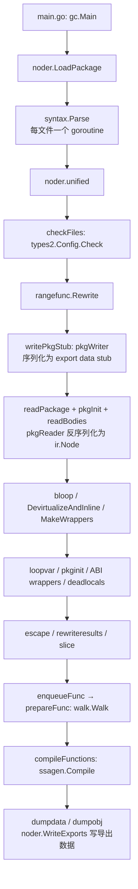
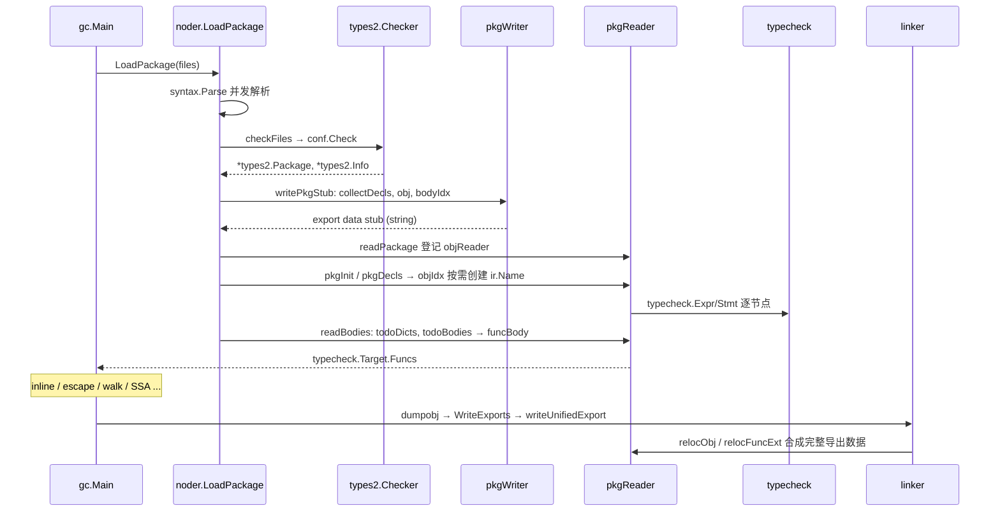

# Go 源码实现详解（三）：编译器前端——从源码到 Unified IR

## 引言：先说结论

`go tool compile` 的前端不是"解析 → 类型检查 → 生成 IR"三步这么简单。自 Go 1.20 起，前端主干是 **Unified IR**：源码被 `syntax` 包解析为 AST，交给 `types2` 做完整类型检查（含泛型），随后 `noder` 把"AST + 类型信息"**序列化成一份导出数据（export data）**，再从这份数据里**反序列化**出后端使用的 `ir` 节点。本包和导入包走同一条读路径，泛型实例化、内联体展开、跨包导出都由这一套读写器统一处理——这就是 "Unified" 的含义。

读完本篇你应当能回答：

1. `gc.Main` 中各阶段以什么顺序被调用？哪些是前端、哪些是后端？
2. Go 的自动分号插入在 `scanner` 中靠哪一个字段实现？
3. `types2` 与 `go/types` 为何几乎一样、如何同步？泛型推断（`infer`/`unify`）怎样收敛？
4. Unified IR 的字节流长什么样？泛型的"字典"与"形状"在 `reader.go` 中如何落地？
5. `ir.Node`/`types.Type` 与 `types2` 的对象模型有何区别？导出数据与 `-importcfg` 如何把包串起来？

所有结论以 golang/go master 提交 fdcd66b（Go 1.28 开发版）为准，路径相对仓库根。本次核实发现若干较新的阶段（`bloop`、`deadlocals`、`rewriteresults`、`slice`、`midway`、`ssacompile`），正文会点出。

## 一、编译器总入口与阶段序列

### 1.1 `main.go`：选架构，调 `gc.Main`

`src/cmd/compile/main.go` 的 `main` 只做一件事：

```go
var archInits = map[string]func(*ssagen.ArchInfo){
	"386":   x86.Init,
	"amd64": amd64.Init,
	"arm64": arm64.Init,
	// ...
	"wasm":  wasm.Init,
}

func main() {
	log.SetFlags(0)
	log.SetPrefix("compile: ")

	buildcfg.Check()
	archInit, ok := archInits[buildcfg.GOARCH]
	if !ok {
		fmt.Fprintf(os.Stderr, "compile: unknown architecture %q\n", buildcfg.GOARCH)
		os.Exit(2)
	}

	gc.Main(archInit)
	base.Exit(0)
}
```

### 1.2 `gc.Main` 的阶段调用序列

`src/cmd/compile/internal/gc/main.go` 的 `Main` 剔除标志处理与伪包初始化后，核心序列如下（按源码顺序摘录）：

```go
func Main(archInit func(*ssagen.ArchInfo)) {
	base.Timer.Start("fe", "init")
	archInit(&ssagen.Arch)
	base.Ctxt = obj.Linknew(ssagen.Arch.LinkArch)
	base.ParseFlags()
	// ... types.LocalPkg / BuiltinPkg / UnsafePkg / ir.Pkgs.Runtime 等伪包
	typecheck.Target = new(ir.Package)
	typecheck.InitUniverse()
	typecheck.InitRuntime()
	rttype.Init()
	ssagen.InitTables()

	// Parse and typecheck input.
	noder.LoadPackage(flag.Args())

	ssagen.InitConfig(ssacompile.NewConfig(ssagen.Arch.SoftFloat))
	coverage.Fixup()
	// ... PGO profile 读取
	bloop.Walk(typecheck.Target)
	base.Timer.Start("fe", "devirtualize-and-inline")
	interleaved.DevirtualizeAndInlinePackage(typecheck.Target, profile)
	noder.MakeWrappers(typecheck.Target) // must happen after inlining
	// ... loopvar.ForCapture(fn)
	pkginit.MakeTask()
	symABIs.GenABIWrappers()
	deadlocals.Funcs(typecheck.Target.Funcs)
	base.Timer.Start("fe", "escapes")
	escape.Funcs(typecheck.Target.Funcs)
	rewriteresults.Funcs(typecheck.Target.Funcs)
	slice.Funcs(typecheck.Target.Funcs)
	reflectdata.WriteBasicTypes()
	// ...
```

后半段是编译循环与目标文件输出：

```go
	base.Timer.Start("be", "compilefuncs")
	for nextFunc, nextExtern := 0, 0; ; {
		reflectdata.WriteRuntimeTypes()
		if nextExtern < len(typecheck.Target.Externs) {
			// ... dumpGlobal / dumpGlobalConst / NeedRuntimeType
			nextExtern++
			continue
		}
		if nextFunc < len(typecheck.Target.Funcs) {
			enqueueFunc(typecheck.Target.Funcs[nextFunc], symABIs)
			nextFunc++
			continue
		}
		if len(compilequeue) != 0 {
			compileFunctions(profile)
			continue
		}
		// ... DWARF fixups
		break
	}
	// ...
	base.Timer.Start("be", "dumpobj")
	dumpdata()
	base.Ctxt.NumberSyms()
	dumpobj()
	// ...
}
```

几点值得注意：

- **`noder.LoadPackage` 一次完成 parse + typecheck + IR 构建**。旧版"先 noder 后 typecheck"的两段模型已不存在，类型检查前移到 `types2`，读出的 `ir` 节点自带 `Typecheck() == 1`。
- `walk` 不直接出现在 `Main` 里，而在 `src/cmd/compile/internal/gc/compile.go` 的 `enqueueFunc → prepareFunc` 中调用 `walk.Walk(fn)`；随后 `compileFunctions` 并发调用 `ssagen.Compile(ssacompile.Compiler{}, fn, workerId, profile)` 进入 SSA 后端。
- `base.Timer.Start("fe", ...)`/`("be", ...)` 标签划出前后端分界：`compilefuncs` 之前是前端。
- 本版本较新的阶段：`bloop.Walk`（循环标记）、`deadlocals.Funcs`（死局部变量消除，`-d=nodeadlocals` 可关）、`rewriteresults.Funcs`（把返回的局部变量改写为直接使用结果参数存储）、`slice.Funcs`（切片分析），以及从 `ssa` 拆出的驱动包 `ssacompile`。

`prepareFunc` 的关键几行：

```go
// src/cmd/compile/internal/gc/compile.go
func prepareFunc(fn *ir.Func) {
	ir.InitLSym(fn, true)
	// ...
	types.CalcSize(fn.Type())
	ssagen.GenWasmExportWrapper(fn)

	ir.CurFunc = fn
	walk.Walk(fn)
	if ir.MatchAstDump(fn, "walk") {
		ir.AstDump(fn, "walk, "+ir.FuncName(fn))
	}
	ir.CurFunc = nil // enforce no further uses of CurFunc

	base.Ctxt.DwTextCount++
}
```

### 1.3 全景图



## 二、词法分析：`syntax/scanner.go`

### 2.1 token 与优先级

`src/cmd/compile/internal/syntax/tokens.go` 用一个 `token` 枚举覆盖全部词法单元，通过 `//go:generate stringer -type token -linecomment` 从行尾注释生成字符串：

```go
const (
	_    token = iota
	_EOF       // EOF

	_Name    // name
	_Literal // literal

	// _Operator is excluding '*' (_Star)
	_Operator // op
	_AssignOp // op=
	_IncOp    // opop
	_Assign   // =
	_Define   // :=
	_Arrow    // <-
	_Star     // *

	_Lparen    // (
	// ...
	_Semi      // ;
	// ...
	_Break       // break
	// ...
	_Var         // var

	tokenCount //
)

// Make sure we have at most 64 tokens so we can use them in a set.
const _ uint64 = 1 << (tokenCount - 1)
```

最后一行是编译期断言：token 总数不超过 64，于是 token 集合可以用 `uint64` 位图表示（`contains(tokset, tok)`），parser 的错误恢复 `advance` 依赖它。`_Star` 被单独从 `_Operator` 拆出，因为 `*` 既是乘法也是解引用/指针类型。二元运算优先级在词法阶段就已确定，只有 5 级：

```go
// src/cmd/compile/internal/syntax/tokens.go
const (
	_ = iota
	precOrOr
	precAndAnd
	precCmp
	precAdd
	precMul
)
```

### 2.2 scanner 结构与自动分号插入

`scanner` 的字段中，`nlsemi` 就是自动分号规则的全部状态：

```go
// src/cmd/compile/internal/syntax/scanner.go
type scanner struct {
	source
	mode   uint
	nlsemi bool // if set '\n' and EOF translate to ';'

	// current token, valid after calling next()
	line, col uint
	blank     bool // line is blank up to col
	tok       token
	lit       string   // valid if tok is _Name, _Literal, or _Semi ("semicolon", "newline", or "EOF")
	bad       bool     // valid if tok is _Literal, true if a syntax error occurred
	kind      LitKind  // valid if tok is _Literal
	op        Operator // valid if tok is _Operator, _Star, _AssignOp, or _IncOp
	prec      int      // valid if tok is _Operator, _Star, _AssignOp, or _IncOp
}
```

`next` 开头取出 `nlsemi` 并清零，跳过空白时据此决定 `\n` 是否变成分号：

```go
// src/cmd/compile/internal/syntax/scanner.go
func (s *scanner) next() {
	nlsemi := s.nlsemi
	s.nlsemi = false

redo:
	// skip white space
	s.stop()
	startLine, startCol := s.pos()
	for s.ch == ' ' || s.ch == '\t' || s.ch == '\n' && !nlsemi || s.ch == '\r' {
		s.nextch()
	}
	// ...
	switch s.ch {
	case -1:
		if nlsemi {
			s.lit = "EOF"
			s.tok = _Semi
			break
		}
		s.tok = _EOF

	case '\n':
		s.nextch()
		s.lit = "newline"
		s.tok = _Semi
	// ...
```

条件 `s.ch == '\n' && !nlsemi` 表示只有上一个 token 不触发分号插入时，换行才当作空白跳过；否则落入 `case '\n'` 产生 `_Semi`（`lit == "newline"`，即错误信息 "unexpected newline" 的来源）。哪些 token 置位 `nlsemi`？`)`/`]`/`}`、`++`/`--` 在 `next` 的 switch 中直接置位（如 `case ')': s.nextch(); s.nlsemi = true; s.tok = _Rparen`），字面量在 `setLit` 中置位，标识符与四个关键字在 `ident` 中处理——这里也展示了关键字识别用的**完美哈希**：

```go
// src/cmd/compile/internal/syntax/scanner.go
func (s *scanner) ident() {
	// accelerate common case (7bit ASCII)
	for isLetter(s.ch) || isDecimal(s.ch) {
		s.nextch()
	}
	// ...
	// possibly a keyword
	lit := s.segment()
	if len(lit) >= 2 {
		if tok := keywordMap[hash(lit)]; tok != 0 && tokStrFast(tok) == string(lit) {
			s.nlsemi = contains(1<<_Break|1<<_Continue|1<<_Fallthrough|1<<_Return, tok)
			s.tok = tok
			return
		}
	}

	s.nlsemi = true
	s.lit = string(lit)
	s.tok = _Name
}

// hash is a perfect hash function for keywords.
// It assumes that s has at least length 2.
func hash(s []byte) uint {
	return (uint(s[0])<<4 ^ uint(s[1]) + uint(len(s))) & uint(len(keywordMap)-1)
}

var keywordMap [1 << 6]token // size must be power of two
```

`init` 把 25 个关键字填入 64 槽的表，碰撞则 `panic("imperfect hash")`——这个只看首两字节和长度的哈希是手工挑出来的。另一个容易忽略的细节：**跨行块注释也触发分号插入**——`case '/'` 分支里 `s.fullComment()` 之后若 `line > s.line && nlsemi`，同样产生 `lit = "newline"` 的 `_Semi`。

`syntax` 包与标准库 `go/scanner`、`go/parser` 是平行的独立实现；scanner.go 顶部注释说明 `scanner.go, source.go, tokens.go, token_string.go` 自成一体。`source.go` 的 `source` 结构维护缓冲索引与当前字符 `ch`，`segment()` 直接返回当前 token 的字节切片，避免逐 token 分配字符串。

## 三、语法分析：`syntax/parser.go`

### 3.1 递归下降骨架与错误恢复

`parser` 直接嵌入 `scanner`，`p.next()`、`p.tok`、`p.op`、`p.prec` 都是 scanner 的字段；额外字段里 `fnest`（函数嵌套层数，用于错误恢复）与 `xnest`（表达式嵌套层数，用于复合字面量歧义）最重要。入口 `syntax.Parse`（`syntax.go`）创建 parser、读第一个 token，再调用 `fileOrNil`，文法在注释里直接写成 EBNF：

```go
// src/cmd/compile/internal/syntax/parser.go
// SourceFile = PackageClause ";" { ImportDecl ";" } { TopLevelDecl ";" } .
func (p *parser) fileOrNil() *File {
	f := new(File)
	f.pos = p.pos()

	// PackageClause
	f.GoVersion = p.goVersion
	p.top = false
	if !p.got(_Package) {
		p.syntaxError("package statement must be first")
		return nil
	}
	f.Pragma = p.takePragma()
	f.PkgName = p.name()
	p.want(_Semi)
	// ...
	for p.tok != _EOF {
		// ...
		switch p.tok {
		case _Import:
			p.next()
			f.DeclList = p.appendGroup(f.DeclList, p.importDecl)
		case _Const:
			p.next()
			f.DeclList = p.appendGroup(f.DeclList, p.constDecl)
		case _Type:
			p.next()
			f.DeclList = p.appendGroup(f.DeclList, p.typeDecl)
		case _Var:
			p.next()
			f.DeclList = p.appendGroup(f.DeclList, p.varDecl)
		case _Func:
			p.next()
			if d := p.funcDeclOrNil(); d != nil {
				f.DeclList = append(f.DeclList, d)
			}
		default:
			// ...
			p.advance(_Import, _Const, _Type, _Var, _Func)
			continue
		}
		// ...
```

`got`（匹配则消费）、`want`（不匹配则报错并 `advance`）与 `advance` 构成整个错误恢复策略：

```go
// src/cmd/compile/internal/syntax/parser.go
// advance consumes tokens until it finds a token of the stopset or followlist.
// The stopset is only considered if we are inside a function (p.fnest > 0).
func (p *parser) advance(followlist ...token) {
	var followset uint64 = 1 << _EOF // don't skip over EOF
	if len(followlist) > 0 {
		if p.fnest > 0 {
			followset |= stopset
		}
		for _, tok := range followlist {
			followset |= 1 << tok
		}
	}

	for !contains(followset, p.tok) {
		p.next()
		if len(followlist) == 0 {
			break
		}
	}
}
```

`stopset` 是 `_Break|_Const|_Continue|_Defer|...|_Var` 的位图——在函数内遇到语法错误时跳到下一个语句开头继续解析，这是编译器能一次报多个错误的原因。

### 3.2 表达式与优先级：`binaryExpr`

优先级已在 scanner 中算好，parser 采用经典的**优先级爬升**：

```go
// src/cmd/compile/internal/syntax/parser.go
func (p *parser) expr() Expr {
	return p.binaryExpr(nil, 0)
}

// Expression = UnaryExpr | Expression binary_op Expression .
func (p *parser) binaryExpr(x Expr, prec int) Expr {
	if x == nil {
		x = p.unaryExpr()
	}
	for (p.tok == _Operator || p.tok == _Star) && p.prec > prec {
		t := new(Operation)
		t.pos = p.pos()
		t.Op = p.op
		tprec := p.prec
		p.next()
		t.X = x
		t.Y = p.binaryExpr(nil, tprec)
		x = t
	}
	return x
}
```

`p.prec > prec` 保证左结合：右操作数递归时传入当前运算符的优先级，只有严格更高的运算符才被右侧吸收。`unaryExpr` 中最绕的是 `<-`：既可能是接收 `<-x` 也可能是通道类型 `<-chan E`，只能先解析出 `x` 再回头判断：

```go
// src/cmd/compile/internal/syntax/parser.go（unaryExpr 节选）
	case _Arrow:
		pos := p.pos()
		p.next()
		x := p.unaryExpr()
		if _, ok := x.(*ChanType); ok {
			// x is a channel type => re-associate <-
			dir := SendOnly
			t := x
			for dir == SendOnly {
				c, ok := t.(*ChanType)
				if !ok {
					break
				}
				dir = c.Dir
				// ...
				c.Dir = RecvOnly
				t = c.Elem
			}
			// ...
			return x
		}
		// x is not a channel type => we have a receive op
		o := new(Operation)
		o.pos = pos
		o.Op = Recv
		o.X = x
		return o
```

主表达式 `pexpr` 是一个 `for` 循环，反复吸收后缀 `.sel`、`.(T)`、`[i]`/`[T1, T2]`、`(args)`、`{...}`；泛型实例化 `F[int]` 与索引 `a[i]` 共用 `IndexExpr`（多个类型实参时 `Index` 是 `ListExpr`）。

### 3.3 语句：`stmtOrNil`

语句分派先走"以标识符开头"的快速路径，再按关键字 switch：

```go
// src/cmd/compile/internal/syntax/parser.go
func (p *parser) stmtOrNil() Stmt {
	// Most statements (assignments) start with an identifier;
	// look for it first before doing anything more expensive.
	if p.tok == _Name {
		p.clearPragma()
		lhs := p.exprList()
		if label, ok := lhs.(*Name); ok && p.tok == _Colon {
			return p.labeledStmtOrNil(label)
		}
		return p.simpleStmt(lhs, 0)
	}

	switch p.tok {
	case _Var:
		return p.declStmt(p.varDecl)
	// ... _Const / _Type
	}

	p.clearPragma()

	switch p.tok {
	case _Lbrace:
		return p.blockStmt("")
	// ... _Operator/_Star, _Literal/_Func/_Lparen ... => simpleStmt
	case _For:
		return p.forStmt()
	case _Switch:
		return p.switchStmt()
	case _Select:
		return p.selectStmt()
	case _If:
		return p.ifStmt()
	// ... _Fallthrough / _Break / _Continue / _Go / _Defer / _Goto / _Return / _Semi
	}
	return nil
}
```

`stmtList` 中 `if !p.got(_Semi) && p.tok != _Rbrace` 对应规范"`}` 前分号可省略"。`funcBody` 在 `p.mode&CheckBranches != 0` 时调用 `branches.go` 的 `checkBranches` 检查标签与 `break/continue/goto`，因此 `checkFiles` 给 `types2.Config` 设了 `IgnoreBranchErrors: true` 以免重复报错。

### 3.4 泛型带来的文法歧义：`typeDecl`

`type T[P any] ...` 与数组类型 `type T [N]int` 在看到 `[` 时无法区分。`typeDecl` 先把 `[` 后内容按表达式解析，再用 `extractName` 尝试拆成"名字 + 类型元素"：

```go
// src/cmd/compile/internal/syntax/parser.go（typeDecl 节选）
	d.Name = p.name()
	if p.tok == _Lbrack {
		pos := p.pos()
		p.next()
		switch p.tok {
		case _Name:
			var x Expr = p.name()
			if p.tok != _Lbrack {
				p.xnest++
				x = p.binaryExpr(p.pexpr(x, false), 0)
				p.xnest--
			}
			if pname, ptype := extractName(x, p.tok == _Comma); pname != nil && (ptype != nil || p.tok != _Rbrack) {
				// d.Name "[" pname ptype ...
				d.TParamList = p.paramList(pname, ptype, _Rbrack, true, false) // ptype may be nil
				d.Alias = p.gotAssign()
				d.Type = p.typeOrNil()
			} else {
				// d.Name "[" x ...
				d.Type = p.arrayType(pos, x)
			}
		case _Rbrack:
			p.next()
			d.Type = p.sliceType(pos)
		default:
			d.Type = p.arrayType(pos, nil)
		}
	}
```

`extractName` 的注释表格列出了 `P*[]int`、`P(E)`、`P*E|F|~G` 等情况的拆分结果，是"类型参数列表用方括号仍然可行"的具体实现证据。

### 3.5 AST 节点与位置信息

`src/cmd/compile/internal/syntax/nodes.go` 定义 `Decl`、`Expr`、`Stmt` 三大类节点，均嵌入 `node` 得到 `pos`；表达式还嵌入 `expr`，携带 `typeInfo` 供 `types2` 在 `StoreTypesInSyntax` 模式下写回类型：

```go
// src/cmd/compile/internal/syntax/nodes.go
type Node interface {
	Pos() Pos
	SetPos(Pos)
	aNode()
}

// func          Name Type { Body }
// func Receiver Name Type { Body }
FuncDecl struct {
	Pragma     Pragma
	Recv       *Field // nil means regular function
	Name       *Name
	TParamList []*Field // nil means no type parameters
	Type       *FuncType
	Body       *BlockStmt // nil means no body (forward declaration)
	decl
}

Operation struct {
	Op   Operator
	X, Y Expr // Y == nil means unary expression
	expr
}

// X[Index]
// X[T1, T2, ...] (with Ti = Index.(*ListExpr).ElemList[i])
IndexExpr struct {
	X     Expr
	Index Expr
	expr
}
```

位置 `Pos`（`src/cmd/compile/internal/syntax/pos.go`）是 `{base *PosBase; line, col uint32}`：`line/col` 始终是文件内绝对坐标，`//line` 指令通过切换 `PosBase` 实现，相对行号在 `RelLine` 中按需计算：

```go
// src/cmd/compile/internal/syntax/pos.go
// FileBase returns the PosBase of the file containing pos,
// skipping over intermediate PosBases from //line directives.
func (pos Pos) FileBase() *PosBase {
	b := pos.base
	for b != nil && b != b.pos.base {
		b = b.pos.base
	}
	return b
}

func (pos Pos) RelLine() uint {
	b := pos.base
	if b.Line() == 0 {
		return 0
	}
	return b.Line() + (pos.Line() - b.Pos().Line())
}
```

文件自身的 `PosBase` 满足 `b == b.pos.base`，`FileBase` 用这个不动点回溯。到了 `ir` 层，`Pos` 经 `noder/posmap.go` 的 `posMap.makeXPos` 转成更紧凑的 `src.XPos`。

### 3.6 并发解析

`src/cmd/compile/internal/noder/noder.go` 的 `LoadPackage` 为每个文件起一个 goroutine 调用 `syntax.Parse`，用容量 `GOMAXPROCS+10` 的信号量限制同时打开的文件数，错误按文件顺序汇总：

```go
// src/cmd/compile/internal/noder/noder.go
func LoadPackage(filenames []string) {
	base.Timer.Start("fe", "parse")

	// Limit the number of simultaneously open files.
	sem := make(chan struct{}, runtime.GOMAXPROCS(0)+10)

	noders := make([]*noder, len(filenames))
	// ...
	go func() {
		for i, filename := range filenames {
			p := noders[i]
			sem <- struct{}{}
			go func() {
				defer func() { <-sem }()
				defer close(p.err)
				fbase := syntax.NewFileBase(filename)
				f, err := os.Open(filename)
				// ...
				p.file, _ = syntax.Parse(fbase, f, p.error, p.pragma, syntax.CheckBranches)
			}()
		}
	}()

	var m posMap
	for _, p := range noders {
		for e := range p.err {
			base.ErrorfAt(m.makeXPos(e.Pos), 0, "%s", e.Msg)
		}
		// ...
	}
	unified(m, noders)
}
```

`p.pragma` 回调（`noder/lex.go`）把 `//go:noinline`、`//go:linkname`、`//go:cgo_*` 记入 `noder.linknames`/`pragcgobuf`，之后由 `pkgWriter.collectDecls` 消费。

## 四、类型检查：`types2`

### 4.1 与 `go/types` 的关系

`src/cmd/compile/internal/types2/README.md` 开宗明义：两个几乎相同的类型检查器，`types2` 操作 `cmd/compile/internal/syntax` 的 AST，`go/types` 操作 `go/ast`；**任何修改都要同步到两边**，且许多 `go/types` 文件可由 `types2` 自动生成。

同步机制在 `src/go/types/generate_test.go`：`TestGenerate` 读取 `types2` 源文件，改包名，按 `filemap` 登记的 AST 改写规则转换后写入 `go/types`；`src/go/types/generate.go` 只有一行 `//go:generate go test -run=Generate -write=all`。本次核实 `filemap` 共 61 个文件，例如：

```go
// src/go/types/generate_test.go（filemap 节选）
"alias.go":       fixTokenPos,
"infer.go":       func(f *ast.File) { fixTokenPos(f); fixInferSig(f) },
"instantiate.go": func(f *ast.File) { fixTokenPos(f); fixCheckErrorfCall(f); fixSprintf(f) },
"typeset.go":     func(f *ast.File) { fixTokenPos(f); renameSelectors(f, "Trace->_Trace") },
"unify.go":       fixSprintf,
```

生成文件头部带 `// Code generated by "go test -run=Generate -write=all"; DO NOT EDIT.` 和 `// Source: ../../cmd/compile/internal/types2/infer.go`。所以**改类型检查器要先改 types2**。

### 4.2 编译器如何调用 types2：`checkFiles`

`src/cmd/compile/internal/noder/irgen.go` 的 `checkFiles`：

```go
func checkFiles(m posMap, noders []*noder) (*types2.Package, *types2.Info, map[*syntax.FuncLit]bool) {
	// ...
recheck:
	ctxt := types2.NewContext()
	importer := gcimports{ctxt: ctxt, packages: make(map[string]*types2.Package)}
	conf := types2.Config{
		Context:            ctxt,
		GoVersion:          base.Flag.Lang,
		IgnoreBranchErrors: true, // parser already checked via syntax.CheckBranches mode
		Importer:           &importer,
		Sizes:              types2.SizesFor("gc", buildcfg.GOARCH),
	}
	info := &types2.Info{
		StoreTypesInSyntax: true,
		Defs:               make(map[*syntax.Name]types2.Object),
		Uses:               make(map[*syntax.Name]types2.Object),
		Selections:         make(map[*syntax.SelectorExpr]*types2.Selection),
		Implicits:          make(map[syntax.Node]types2.Object),
		Scopes:             make(map[syntax.Node]*types2.Scope),
		Instances:          make(map[*syntax.Name]types2.Instance),
		FileVersions:       make(map[*syntax.PosBase]string),
	}
	conf.Error = func(err error) {
		terr := err.(types2.Error)
		// ... 对 "requires go1.x or later" 补充 //go:build 或 -lang 提示
		base.ErrorfAt(m.makeXPos(terr.Pos), terr.Code, "%s", msg)
	}

	pkg, err := conf.Check(base.Ctxt.Pkgpath, files, info)
	base.ExitIfErrors()
	// ...
```

`StoreTypesInSyntax: true` 是编译器与普通 `go/types` 用法的关键差异：类型与常量值直接写回 `syntax.Expr`（`GetTypeInfo()`），不维护巨大的 `Types map`。

`checkFiles` 后半段补做了几项 types2 之外的"实现限制"检查（匿名接口环 #56103、不可堆分配类型作类型实参 #54765），并做两次 AST 级重写：`buildcfg.Experiment.SIMD` 开启时调用 `midway.RewriteWrapper`，若有修改则 `goto recheck` **重新类型检查**；随后 `rangefunc.Rewrite(pkg, info, files)` 把 range-over-func 改写成显式闭包调用——注释说明必须在序列化成 UIR 之前做，否则内联时找不到闭包的 UIR 体。

### 4.3 `Checker` 的检查流程

`api.go` 的 `Config.Check` 只是 `NewChecker(conf, pkg, info).Files(files)`。`check.go` 的 `checkFiles` 给出完整阶段序列：

```go
// src/cmd/compile/internal/types2/check.go
func (check *Checker) checkFiles(files []*syntax.File) {
	// ...
	print("== initFiles ==")
	check.initFiles(files)
	print("== collectObjects ==")
	check.collectObjects()
	print("== sortObjects ==")
	check.sortObjects()
	print("== directCycles ==")
	check.directCycles()
	print("== packageObjects ==")
	check.packageObjects()
	print("== processDelayed ==")
	check.processDelayed(0) // incl. all functions
	print("== cleanup ==")
	check.cleanup()
	print("== initOrder ==")
	check.initOrder()
	if !check.conf.DisableUnusedImportCheck {
		check.unusedImports()
	}
	print("== recordUntyped ==")
	check.recordUntyped()
	if check.firstErr == nil {
		check.monomorph()
	}
	check.pkg.goVersion = check.conf.GoVersion
	check.pkg.complete = true
	// ...
}
```

| 阶段 | 文件 | 作用 |
|---|---|---|
| `collectObjects` | resolver.go | 遍历顶层声明，创建 `Object` 并登记 `check.objMap[obj] = *declInfo`，同时解析 import |
| `packageObjects` | resolver.go | 对每个包级对象调 `objDecl`；顺序为非别名类型 → 别名 → 其他（缓解 go.dev/issue/25838） |
| `objDecl` | decl.go | 白/灰/黑三色标记检测声明环，分派到 `constDecl/varDecl/typeDecl/funcDecl` |
| `processDelayed` | check.go | 执行 `check.later(...)` 压入的延迟动作——**函数体**都延迟检查 |
| `initOrder` | initorder.go | 依据 `declInfo.deps` 计算包级变量初始化顺序 |
| `monomorph` | mono.go | 检测无法单态化的泛型实例化环 |

`objDecl` 的环检测：

```go
// src/cmd/compile/internal/types2/decl.go
	// - not in Checker.objPathIdx and type == nil : type is not yet known (white)
	// -     in Checker.objPathIdx                 : type is pending       (grey)
	// - not in Checker.objPathIdx and type != nil : type is known         (black)
	if _, ok := check.objPathIdx[obj]; ok {
		switch obj := obj.(type) {
		case *Const, *Var:
			if !check.validCycle(obj) || obj.Type() == nil {
				obj.setType(Typ[Invalid])
			}
		case *TypeName:
			if !check.validCycle(obj) {
				obj.setType(Typ[Invalid])
			}
		// ...
		}
		return
	}
	if obj.Type() != nil { // black, meaning it's already type-checked
		return
	}
	// white, meaning it must be type-checked
	check.push(obj)
	defer check.pop()
	// ...
	switch obj := obj.(type) {
	case *Const:
		check.constDecl(obj, d.vtyp, d.init, d.inherited)
	case *Var:
		check.varDecl(obj, d.lhs, d.vtyp, d.init)
	case *TypeName:
		check.typeDecl(obj, d.tdecl)
		check.collectMethods(obj) // methods can only be added to top-level types
	case *Func:
		check.funcDecl(obj, d)
	}
```

### 4.4 表达式与语句

`expr.go` 的约定见 README：每个表达式检查函数形如 `func (check *Checker) f(x *operand, e syntax.Expr, ...)`，结果通过 `operand` 返回，`x.mode == invalid` 表示出错。分派入口 `exprInternal` 是基于 `e.(type)` 的大 switch，外层包装为 `rawExpr → expr / genericExpr / multiExpr / exprOrType`；`binary` 先 `matchTypes` 做无类型常量的隐式转换，再按 `isComparison/isShift` 分流。`stmt.go` 的 `funcBody` 是函数体入口，`stmt` 是语句级 switch，`caseValues/caseTypes` 处理重复 case，未使用变量在 `usage` 中通过 `check.usedVars` 检查。

### 4.5 泛型：类型参数、约束与类型集合

```go
// src/cmd/compile/internal/types2/typeparam.go
type TypeParam struct {
	check *Checker  // for lazy type bound completion
	id    uint64    // unique id, for debugging only
	obj   *TypeName // corresponding type name
	index int       // type parameter index in source order, starting at 0
	bound Type      // any type, but underlying is eventually *Interface for correct programs
}

// src/cmd/compile/internal/types2/interface.go
type Interface struct {
	check     *Checker      // for error reporting; nil once type set is computed
	methods   []*Func       // ordered list of explicitly declared methods
	embeddeds []Type        // ordered list of explicitly embedded elements
	embedPos  *[]syntax.Pos // positions of embedded elements; or nil
	implicit  bool          // interface is wrapper for type set literal (non-interface T, ~T, or A|B)
	complete  bool          // indicates that all fields (except for tset) are set up

	tset *_TypeSet // type set described by this interface, computed lazily
}

// src/cmd/compile/internal/types2/typeset.go
type _TypeSet struct {
	methods    []*Func  // all methods of the interface; sorted by unique ID
	terms      termlist // type terms of the type set
	comparable bool     // invariant: !comparable || terms.isAll()
}
```

约束 `[T int | ~string]` 中的 `int | ~string` 是一个 `Union`，非接口约束被包装成 `implicit` 接口。类型集合由 `computeInterfaceTypeSet` 惰性计算：方法集与 `termlist`（`~T` 用 `term.tilde` 表示）的交集加 `comparable` 位。`IsMethodSet()`（无 term 且不要求可比较）在后文形状化决策中会用到。实例化在 `instantiate.go`：`Instantiate` 与内部 `check.instance` 都以 `Context` 去重（`ctxt.instanceHash`），`verify` 对每个类型实参调用 `check.implements(targs[i], bound, true, &cause)`。

### 4.6 类型推断：`infer.go` 与 `unify.go`

`infer` 的签名与三步算法：

```go
// src/cmd/compile/internal/types2/infer.go
func (check *Checker) infer(pos syntax.Pos, tparams []*TypeParam, targs []Type, params *Tuple, args []*operand, reverse bool, err *error_) (inferred []Type) {
	// ...
	if len(targs) == n && !slices.Contains(targs, nil) {
		return targs
	}
	// ...
	u := newUnifier(check, tparams, targs, check.allowVersion(go1_21))

	// --- 1 --- use information from function arguments
	for i, arg := range args {
		par := params.At(i)
		if isParameterized(tparams, par.typ) || isParameterized(tparams, arg.typ()) {
			if isTyped(arg.typ()) {
				if !u.unify(par.typ, arg.typ(), assign) {
					errorf(par.typ, arg.typ(), arg)
					return nil
				}
			} else if _, ok := par.typ.(*TypeParam); ok && !arg.isNil() {
				untyped = append(untyped, i)
			}
		}
	}

	// --- 2 --- use information from type parameter constraints
	for i := 0; ; i++ {
		nn := u.unknowns()
		for _, tpar := range tparams {
			tx := u.at(tpar)
			core, single := coreTerm(tpar)
			// core != nil: tx 已知则 u.unify(tx, core.typ, 0)；
			//              tx 未知且 single && !core.tilde 则 u.set(tpar, core.typ)
			// tx 已知且不含类型参数：再用约束的方法签名做 unify
		}
		if u.unknowns() == nn { break } // 无进展则停止
	}
	// --- 3 --- 无类型常量参数取默认类型 ...
```

三步分别是：用**函数实参类型**合一；反复用**约束的核心类型与方法签名**推进直到没有新的类型参数被确定（注释承认是 O(n²)，但类型参数通常 < 5）；对只被无类型常量约束的参数取默认类型。`enableReverseTypeInference = true` 表示自 go1.21 支持从目标函数类型反向推断。调用点在 `call.go` 的 `funcInst`（显式部分实例化）与 `arguments`（普通调用）。

合一器的数据结构非常简洁：

```go
// src/cmd/compile/internal/types2/unify.go
type unifier struct {
	check *Checker
	// handles maps each type parameter to its inferred type through
	// an indirection *Type called (inferred type) "handle".
	// After a type parameter P is unified with a type parameter Q,
	// P and Q share the same handle (and thus type).
	handles                  map[*TypeParam]*Type
	depth                    int  // recursion depth during unification
	enableInterfaceInference bool // use shared methods for better inference
}

const (
	assign unifyMode = 1 << iota // 赋值语义：顶层可不精确，元素类型必须精确
	exact                        // 精确匹配
)
```

`handles` 用一层 `*Type` 间接实现了"并查集"：两个类型参数合一后共享同一 handle（`join`），任一方被推断出类型，另一方自动得到相同结果。结构递归在 `nify`：先做 `x == y || Unalias(x) == Unalias(y)` 短路，超过 `unificationDepthLimit = 50` 则 panic（防 go.dev/issue/48619 类无限递归），交换操作数保证"命名类型在 y、绑定类型参数在 x"，再按 `*Basic/*Array/*Slice/*Struct/*Pointer/*Signature/*Interface/*Map/*Chan/*Named/*TypeParam` 递归。`traceInference = false` 打开后可看到 `x ≡ y`、`p ➞ y` 的推断轨迹。

## 五、Unified IR：`noder` 包

### 5.1 为什么"写出来再读回去"

`src/cmd/compile/internal/noder/unified.go` 的 `unified` 注释是理解动机的最佳材料：pipeline 分两步——生成只含本包的导出数据"存根（stub）"，再从存根生成 IR；源码会被检查两次，一次是写之前的 `types2`，一次是读之后的 `gc/typecheck`。保留第二次的理由有四：降低维护分叉的成本、便于 `toolstash -cmp`、历史上导入后总会重跑、以及 `typecheck` 仍负责某些改写（多值调用、`OINDEX → OINDEXMAP`）。

```go
// src/cmd/compile/internal/noder/unified.go
func unified(m posMap, noders []*noder) {
	inline.InlineCall = unifiedInlineCall
	typecheck.HaveInlineBody = unifiedHaveInlineBody
	pgoir.LookupFunc = LookupFunc
	pgoir.PostLookupCleanup = PostLookupCleanup

	data := writePkgStub(m, noders)

	target := typecheck.Target

	localPkgReader = newPkgReader(pkgbits.NewPkgDecoder(types.LocalPkg.Path, data))
	readPackage(localPkgReader, types.LocalPkg, true)

	r := localPkgReader.newReader(pkgbits.SectionMeta, pkgbits.PrivateRootIdx, pkgbits.SyncPrivate)
	r.pkgInit(types.LocalPkg, target)

	readBodies(target, false, nil)

	// Check that nothing snuck past typechecking.
	for _, fn := range target.Funcs {
		if fn.Typecheck() == 0 {
			base.FatalfAt(fn.Pos(), "missed typecheck: %v", fn)
		}
		// ...
	}
	// ...
}
```

前四行把内联器和 PGO 的函数查找挂到 UIR 实现上——内联不再复制 `ir` 树，而是**重新从字节流读一份函数体**（`unifiedInlineCall`/`expandInline`），这是 UIR 与旧内联器最大的行为差异。

### 5.2 写：`writePkgStub` 与 `pkgWriter`

```go
// src/cmd/compile/internal/noder/unified.go
func writePkgStub(m posMap, noders []*noder) string {
	pkg, info, otherInfo := checkFiles(m, noders)

	pw := newPkgWriter(m, pkg, info, otherInfo)
	pw.collectDecls(noders)

	publicRootWriter := pw.newWriter(pkgbits.SectionMeta, pkgbits.SyncPublic)
	privateRootWriter := pw.newWriter(pkgbits.SectionMeta, pkgbits.SyncPrivate)
	// ...
	{
		w := publicRootWriter
		w.pkg(pkg)
		scope := pkg.Scope()
		names := scope.Names()
		w.Len(len(names))
		for _, name := range names {
			w.obj(scope.Lookup(name), nil)
		}
		w.Sync(pkgbits.SyncEOF)
		w.Flush()
	}
	{
		w := privateRootWriter
		w.pkgInit(noders)
		w.Flush()
	}

	var sb strings.Builder
	pw.DumpTo(&sb)

	// At this point, we're done with types2. Make sure the package is
	// garbage collected.
	freePackage(pkg)
	return sb.String()
}
```

写完后 `freePackage` 把 `*types2.Package` 清零并在 `-d=gccheck` 下用 finalizer 确认它真的被回收——UIR 的一个设计目标就是让 `types2` 对象图在写完后即可释放。

`pkgWriter` 嵌入 `pkgbits.PkgEncoder`，为 `PosBase/Package/Type/Object` 各维护一张已写索引表（`posBasesIdx/pkgsIdx/typsIdx/objsIdx`）去重，还记录 `funDecls/typDecls/linknames/cgoPragmas`；`writer` 是单个元素的编码器，携带当前函数签名 `sig`、`localsIdx`、`closureVars` 和一个 `writerDict`。函数体由 `bodyIdx` 写入 `SectionBody`，返回元素索引和自由变量列表——闭包捕获分析就发生在这里：`useLocal` 发现引用的 `*types2.Var` 不在本函数 `localsIdx` 中时追加到 `closureVars`：

```go
// src/cmd/compile/internal/noder/writer.go
func (pw *pkgWriter) bodyIdx(sig *types2.Signature, block *syntax.BlockStmt, dict *writerDict) (idx index, closureVars []posVar) {
	w := pw.newWriter(pkgbits.SectionBody, pkgbits.SyncFuncBody)
	w.sig = sig
	w.dict = dict

	w.declareParams(sig)
	if w.Bool(block != nil) {
		w.stmts(block.List)
		w.pos(block.Rbrace)
	}

	return w.Flush(), w.closureVars
}
```

语句与表达式分别由 `stmt1`/`expr` 用 `codes.go` 的小整数标签编码（`stmtAssign`、`exprCall`、`exprFuncInst`……），读侧 `reader.stmt1`/`reader.expr` 对称解码。

### 5.3 字节流格式：`internal/pkgbits`

`src/cmd/compile/internal/noder/doc.go` 用 EBNF 描述了 UIR 文件：

```
File        = Header Payload fingerprint .
Header      = version [ flags ] sectionEnds elementEnds .

version     = uint32 .     // used for backward compatibility
flags       = uint32 .     // feature flags used across versions
sectionEnds = [10]uint32 . // defines section boundaries
elementEnds = []uint32 .   // defines element boundaries
fingerprint = [8]byte .    // sha256 fingerprint
```

10 个 section 的顺序由 `src/internal/pkgbits/reloc.go` 的 `SectionKind` 固定：`SectionString, SectionMeta, SectionPosBase, SectionPkg, SectionName, SectionType, SectionObj, SectionObjExt, SectionObjDict, SectionBody`。每个元素前有一张**引用表**，元素内部用表下标引用其他元素；`reloc.go` 的长注释解释：UIR 链接器合并多包导出数据时只需改写引用表就能整体拷贝元素，无需理解内容，同时还能去重、缩短 varint。

一个对象被拆到 `SectionName`（包+名+种类）、`SectionObj`（定义）、`SectionObjExt`（编译器扩展：内联代价、逃逸标记、linkname、ABI）、`SectionObjDict`（泛型字典）四个 section，**四者在各自 section 内共用同一相对索引**——`linker.relocObj` 中 `assert(wext.Idx == w.Idx)` 等三行断言保证这一点。

版本由 `pkgbits/version.go` 管理，编译器当前写 `V4`（`unified.go`：`const uirVersion = pkgbits.V4`，注释 "Use V4 for generic methods"）：

```go
// src/internal/pkgbits/version.go
const (
	V0 Version = iota // initial prototype
	V1 // adds the Flags uint32 word
	V2 // removes unused legacy fields and supports type parameters for aliases
	V3 // introduces a more compact format for composite literal element lists
	V4 // encodes generic methods as standalone function objects
	numVersions = iota
)
```

`Field` 枚举（`HasInit`、`DerivedFuncInstance`、`AliasTypeParamNames`、`CompactCompLiterals`、`GenericMethods`……）配合 `Version.Has(field)` 让读写两侧按版本决定字段是否存在——`readPackage`、`objDict`、`objDictIdx` 里的 `if r.Version().Has(pkgbits.GenericMethods)` 就是这个机制。`noder/README.md` 规定了新增字段的流程：先在 `version.go` 加版本，写侧加保护，再更新 go、x/tools 与外部读取器。

调试利器是 **sync marker**：`pkgbits.SyncMarker` 枚举（`SyncPublic`、`SyncObject1`、`SyncFuncBody`、`SyncExpr`……）在 `Encoder.Sync` 处写入、`Decoder.Sync` 校验；`-d=syncframes=N` 还会在每个 marker 后附带 N 层写侧调用栈（`base.Debug.SyncFrames` 传给 `pkgbits.NewPkgEncoder`），读写不对称时能直接定位到 writer.go 的行号。

### 5.4 读：`pkgReader` 与 `readBodies`

```go
// src/cmd/compile/internal/noder/reader.go
type pkgReader struct {
	pkgbits.PkgDecoder

	// Indices for encoded things; lazily populated as needed.
	posBases []*src.PosBase
	pkgs     []*types.Pkg
	typs     []*types.Type

	// offset for rewriting the given (absolute!) index into the output,
	// but bitwise inverted so we can detect if we're missing the entry
	// or not.
	newindex []index
}

var objReader = map[*types.Sym]pkgReaderIndex{}
var bodyReader = map[*ir.Func]pkgReaderIndex{}
var importBodyReader = map[*types.Sym]pkgReaderIndex{}

var todoDicts []func()
var todoBodies []*ir.Func
```

对象是**惰性**实例化的：`readPackage` 只把公开根里每个对象的 `(pkgReader, idx)` 记进全局 `objReader[sym]`，真正创建 `ir.Name` 要等 `objIdxMayFail` 被调用，结果挂在 `sym.Def` 上作缓存：

```go
// src/cmd/compile/internal/noder/reader.go
func (pr *pkgReader) objIdxMayFail(idx index, implicits, explicits []*types.Type, shaped bool) (ir.Node, error) {
	rname := pr.newReader(pkgbits.SectionName, idx, pkgbits.SyncObject1)
	_, sym := rname.qualifiedIdent()
	tag := pkgbits.CodeObj(rname.Code(pkgbits.SyncCodeObj))

	if tag == pkgbits.ObjStub {
		// 桩对象：转到定义它的那个包的 reader
		if pri, ok := objReader[sym]; ok {
			return pri.pr.objIdxMayFail(pri.idx, nil, explicits, shaped)
		}
		// ...
	}

	dict, err := pr.objDictIdx(sym, idx, implicits, explicits, shaped)
	if err != nil {
		return nil, err
	}

	sym = dict.baseSym
	if !sym.IsBlank() && sym.Def != nil {
		return sym.Def.(*ir.Name), nil
	}

	r := pr.newReader(pkgbits.SectionObj, idx, pkgbits.SyncObject1)
	rext := pr.newReader(pkgbits.SectionObjExt, idx, pkgbits.SyncObject1)
	r.dict = dict
	rext.dict = dict
	// ... switch tag { case ObjAlias / ObjConst / ObjFunc / ObjType / ObjVar }
```

函数体同样延迟：`addBody` 记下 `bodyReader[fn]` 并压入 `todoBodies`；`readBodies` 先清空 `todoDicts`（运行时字典必须先于引用它的函数体构造），再逐个 `pri.funcBody(fn)`；实例化出的泛型函数此时才追加进 `target.Funcs`：

```go
// src/cmd/compile/internal/noder/unified.go
func readBodies(target *ir.Package, duringInlining bool, profile *pgoir.Profile) {
	var inlDecls []*ir.Func
	for {
		if len(todoDicts) > 0 {
			fn := todoDicts[len(todoDicts)-1]
			todoDicts = todoDicts[:len(todoDicts)-1]
			fn()
			continue
		}
		if len(todoBodies) > 0 {
			fn := todoBodies[len(todoBodies)-1]
			todoBodies = todoBodies[:len(todoBodies)-1]

			pri, ok := bodyReader[fn]
			assert(ok)
			pri.funcBody(fn)

			// Instantiated generic function: add to Decls for typechecking
			// and compilation.
			if fn.OClosure == nil && len(pri.dict.targs) != 0 {
				// ...
				target.Funcs = append(target.Funcs, fn)
			}
			continue
		}
		break
	}
	// ...
}
```

`reader.expr` 每读出一个节点就立即交给 `typecheck.Expr`/`typecheck.Stmt`/`typecheck.Call`，并在 `defer` 中断言 `res.Typecheck() != 0`——这就是 `unified` 末尾 "missed typecheck" 检查能成立的原因。

### 5.5 时序图：一次编译中的读写



### 5.6 泛型的实现：形状（shape）与字典（dictionary）

Go 泛型采用 **GC Shape Stenciling + 字典**：类型实参先归约为"形状"，同形状实例共享一份机器码；形状中丢失的信息（类型描述符、itab、子字典、方法表达式）由调用时传入的**运行时字典**补齐。`reader.go` 中对应的结构是 `readerDict`：

```go
// src/cmd/compile/internal/noder/reader.go
type readerDict struct {
	shaped bool // whether this is a shaped dictionary

	// baseSym is the symbol for the object this dictionary belongs to.
	// If the object is an instantiated function or defined type, then
	// baseSym is the mangled symbol, including any type arguments.
	baseSym *types.Sym

	// For non-shaped dictionaries, shapedObj is a reference to the
	// corresponding shaped object (always a function or defined type).
	shapedObj *ir.Name

	// targs holds the implicit and explicit type arguments in use for
	// reading the current object.
	targs []*types.Type

	implicits int
	receivers int

	derived      []derivedInfo // reloc index of the derived type's descriptor
	derivedTypes []*types.Type // slice of previously computed derived types

	// These slices correspond to entries in the runtime dictionary.
	typeParamMethodExprs []readerMethodExprInfo
	subdicts             []objInfo
	rtypes               []typeInfo
	itabs                []itabInfo
}
```

写侧 `writerDict` 与它一一对应，`objDict` 按顺序写入 `SectionObjDict`；写侧遇到派生类型（含类型参数的类型）时 `typIdx` 记入 `dict.derived` 而非全局 `typsIdx`，读侧 `typIdx` 按 `info.derived` 决定从 `dict.derivedTypes` 还是 `pr.typs` 取。

**形状化**由 `Shapify` 完成：

```go
// src/cmd/compile/internal/noder/reader.go
func Shapify(targ *types.Type, basic bool) *types.Type {
	// ...
	// When a pointer type is used to instantiate a type parameter
	// constrained by a basic interface, we know the pointer's element
	// type can't matter to the generated code. In this case, we can use
	// an arbitrary pointer type as the shape type.
	// Otherwise, we simply use the type's underlying type as its shape.
	under := targ.Underlying()
	if basic && targ.IsPtr() && !targ.Elem().NotInHeap() {
		under = types.NewPtr(types.Types[types.TUINT8])
	}

	// Hash long type names to bound symbol name length seen by users,
	// particularly for large protobuf structs (#65030).
	uls := under.LinkString()
	if base.Debug.MaxShapeLen != 0 && len(uls) > base.Debug.MaxShapeLen {
		h := hash.Sum32([]byte(uls))
		uls = hex.EncodeToString(h[:])
	}

	sym := types.ShapePkg.Lookup(uls)
	if sym.Def == nil {
		name := ir.NewDeclNameAt(under.Pos(), ir.OTYPE, sym)
		typ := types.NewNamed(name)
		typ.SetUnderlying(under)
		sym.Def = typed(typ, name)
	}
	return sym.Def.Type()
}
```

规则很保守：形状 = 底层类型；只有当约束是"纯方法集接口"（`basic`，来自写侧 `objDict` 写出的 `IsMethodSet()` 布尔）且实参是指针时才退化为 `*uint8`。形状类型放在伪包 `types.ShapePkg`，这就是 panic 栈里 `go.shape.int`、`go.shape.*uint8` 的来历。调用点在 `objDictIdx`：`for i, targ := range dict.targs { basic := r.Bool(); if dict.shaped { dict.targs[i] = Shapify(targ, basic) } }`。

**运行时字典**是一个 `[N]uintptr` 只读全局（`dict.varType()`），符号名带 `objabi.GlobalDictPrefix`（`.dict`）前缀，布局由四个 `*Offset` 函数固定：`typeParamMethodExprsOffset() == 0`，随后依次是 `subdictsOffset`、`rtypesOffset`、`itabsOffset`，`numWords` 为总长。`dictNameOf` 按此布局用 `objw.SymPtr` 逐段写入方法表达式函数符号、子字典符号、`reflectdata.TypeLinksym(typ)`、`reflectdata.ITabLsym(typ, iface)`（无需 itab 的对写 nil 占位），最后 `objw.Global(lsym, int32(ot), obj.DUPOK|obj.RODATA)`。函数体里对字典的访问被编译成对 `.dict` 参数的下标：

```go
// src/cmd/compile/internal/noder/reader.go
func (r *reader) dictWord(pos src.XPos, idx int) ir.Node {
	base.AssertfAt(r.dictParam != nil, pos, "expected dictParam in %v", r.curfn)
	return typecheck.Expr(ir.NewIndexExpr(pos, r.dictParam, ir.NewInt(pos, int64(idx))))
}

func (r *reader) rtype0(pos src.XPos) (typ *types.Type, rtype ir.Node) {
	r.Sync(pkgbits.SyncRType)
	if r.Bool() { // derived type
		idx := r.Len()
		info := r.dict.rtypes[idx]
		typ = r.p.typIdx(info, r.dict, true)
		rtype = r.rttiWord(pos, r.dict.rtypesOffset()+idx)
		return
	}

	typ = r.typ()
	rtype = reflectdata.TypePtrAt(pos, typ)
	return
}
```

调用泛型函数时，写侧 `funcInst` 判断类型实参是否含派生类型：含则写 `subdictIdx`（运行时从当前字典取子字典指针），否则写静态 `objInfo`。读侧 `funcInst` 生成 `wrapperFn`（非形状包装函数，符号名带完整类型实参）与 `baseFn`（形状函数），并经 `objDictName → dictNameOf` 取静态字典地址。包装函数体由 `callShaped` 合成——接收者（若有）→ `&dict` → 其余参数，尾调用形状函数：

```go
// src/cmd/compile/internal/noder/reader.go
func (r *reader) callShaped(pos src.XPos) {
	shapedObj := r.dict.shapedObj
	// ...
	params := r.syntheticArgs()

	// Construct the arguments list: receiver (if any), then runtime
	// dictionary, and finally normal parameters.
	var args ir.Nodes
	if r.methodSym != nil {
		args.Append(params[0])
		params = params[1:]
	}
	args.Append(typecheck.Expr(ir.NewAddrExpr(pos, r.p.dictNameOf(r.dict))))
	args.Append(params...)

	r.syntheticTailCall(pos, shapedFn, args)
}
```

`ir.Name.DictIndex`（由 `varDictIndex` 填充）让 DWARF 生成器能为形状函数中的局部变量从字典找回真实类型。

### 5.7 链接：`linker.go` 与导出数据

编译结束时 `gc/obj.go` 的 `dumpCompilerObj` 调用 `noder.WriteExports`：写一个 `'u'` 字节后调用 `writeUnifiedExport`，再用 `\n$$B\n ... \n$$\n` 包裹（`cmd/link` 靠 `$$` 定位）。`writeUnifiedExport` 构造 `linker{pw pkgbits.PkgEncoder; pkgs, decls, bodies}`，以本包 stub 的公开根为起点，对每个导出对象 `relocIdx → relocObj`，把桩（`ObjStub`）替换成所在包的真实定义，并把编译后才知道的信息写进 `SectionObjExt`：

```go
// src/cmd/compile/internal/noder/linker.go
func (l *linker) relocFuncExt(w *pkgbits.Encoder, name *ir.Name) {
	w.Sync(pkgbits.SyncFuncExt)

	l.pragmaFlag(w, name.Func.Pragma)
	l.linkname(w, name)
	// ... wasm import/export
	// Relocated extension data.
	w.Bool(true)

	// Record definition ABI so cross-ABI calls can be direct.
	w.Uint64(uint64(name.Func.ABI))

	// Escape analysis.
	for _, f := range name.Type().RecvParams() {
		w.String(f.Note)
	}

	if inl := name.Func.Inl; w.Bool(inl != nil) {
		w.Len(int(inl.Cost))
		w.Bool(inl.CanDelayResults)
		if buildcfg.Experiment.NewInliner {
			w.String(inl.Properties)
		}
	}

	w.Sync(pkgbits.SyncEOF)
}
```

逃逸分析结果（参数 `Note`，如 `esc:0x1`）、内联代价、ABI 都在这里进入导出数据。`exportBody` 只导出可内联函数和泛型函数的函数体——`unified` 注释中 "Prunes out any unnecessary details" 指的就是这一步。最后 `base.Ctxt.Fingerprint = l.pw.DumpTo(out)`，8 字节指纹写在末尾供链接器校验。

### 5.8 导入侧与 `-importcfg`

`go build` 从不让编译器自己搜 GOPATH：它生成 importcfg 文件，`-importcfg` 由 `src/cmd/compile/internal/base/flag.go` 的 `readImportCfg` 解析，只认两种指令——`importmap old=new` 写入 `Flag.Cfg.ImportMap`，`packagefile path=filename` 写入 `Flag.Cfg.PackageFile`，其他一律 `log.Fatalf("unknown directive")`。`noder/import.go` 的 `openPackage` 在 `Flag.Cfg.PackageFile != nil` 时直接按表打开，否则才回退到 `-I` 目录与 `$GOROOT/pkg/$GOOS_$GOARCH`。`readImportFile` 随后：

```go
// src/cmd/compile/internal/noder/import.go
	data, err := readExportData(f)
	// ...
	pr := pkgbits.NewPkgDecoder(pkg1.Path, data)

	// Read package descriptors for both types2 and compiler backend.
	readPackage(newPkgReader(pr), pkg1, false)
	pkg2 = importer.ReadPackage(env, packages, pr)

	err = addFingerprint(path, data)
```

同一份字节流被读两次：`readPackage` 为后端登记 `objReader`/`importBodyReader`，`importer.ReadPackage`（`cmd/compile/internal/importer`）为 `types2` 构造 `*types2.Package`。`readExportData` 用 `exportdata.FindPackageDefinition` 在归档中找到包定义，校验 `objabi.HeaderString()`，再用 `base.MapFile` 把导出段 mmap 成一个大字符串，`pkgbits` 的所有 `String()` 都是它的子串。

## 六、IR 层：`ir` 包与 `types` 包

### 6.1 `ir.Node` 与 `Op`

```go
// src/cmd/compile/internal/ir/node.go
type Node interface {
	Format(s fmt.State, verb rune)

	Pos() src.XPos
	SetPos(x src.XPos)

	copy() Node

	doChildren(func(Node) bool) bool
	doChildrenWithHidden(func(Node) bool) bool
	editChildren(func(Node) Node)
	editChildrenWithHidden(func(Node) Node)

	Op() Op
	Init() Nodes

	Type() *types.Type
	SetType(t *types.Type)
	Name() *Name
	Sym() *types.Sym
	Val() constant.Value
	SetVal(v constant.Value)

	Esc() uint16
	SetEsc(x uint16)

	// Typecheck values:
	//  0 means the node is not typechecked
	//  1 means the node is completely typechecked
	//  2 means typechecking of the node is in progress
	Typecheck() uint8
	SetTypecheck(x uint8)
	NonNil() bool
	MarkNonNil()
}
```

与 `syntax` 的 AST 不同，`ir` 是**带 Op 的具体节点**：每种结构一个 struct（`CallExpr`、`AssignStmt`、`IfStmt`、`ForStmt`……见 `expr.go`/`stmt.go`），共同嵌入 `miniNode`（`pos/op/bits/esc`）；`doChildren/editChildren` 由 `mknode.go` 生成到 `node_gen.go`。`Op` 是 `uint8` 枚举，粒度远细于语法：

```go
// src/cmd/compile/internal/ir/node.go
const (
	OXXX Op = iota

	ONAME    // var or func name
	ONONAME
	OTYPE    // type name
	OLITERAL // literal
	ONIL     // nil

	OADD          // X + Y
	// ...
	OAS         // X = Y or (if Def=true) X := Y
	OAS2        // Lhs = Rhs (x, y, z = a, b, c)
	OAS2DOTTYPE // Lhs = Rhs (x, ok = I.(int))
	OAS2FUNC    // Lhs = Rhs (x, y = f())
	OAS2MAPR    // Lhs = Rhs (x, ok = m["foo"])
	OAS2RECV    // Lhs = Rhs (x, ok = <-c)
	OCALL       // X(Args) (function call, method call or type conversion)
	OCALLFUNC   // X(Args) (function call f(args))
	OCALLMETH   // X(Args) (direct method call x.Method(args))
	OCALLINTER  // X(Args) (interface method call x.Method(args))
	// ...
	// opcodes for generics
	ODYNAMICDOTTYPE  // x = i.(T) where T is a type parameter (or derived from a type parameter)
	ODYNAMICDOTTYPE2 // x, ok = i.(T) where T is a type parameter
	ODYNAMICTYPE     // a type node for type switches
	// arch-specific opcodes
	OTAILCALL    // tail call to another function
	OGETG        // runtime.getg() (read g pointer)
	OGETCALLERSP // internal/runtime/sys.GetCallerSP()
	OEND
)
```

一个 `=` 在 `typecheck` 后会变成 `OAS/OAS2/OAS2FUNC/OAS2MAPR/OAS2RECV/OAS2DOTTYPE` 之一，`OCALL` 会分成 `OCALLFUNC/OCALLMETH/OCALLINTER`，`walk` 后还会出现 `OBYTES2STRTMP`、`OMOVE2HEAP` 这类纯实现层操作。`ODYNAMICDOTTYPE`/`ODYNAMICTYPE` 正是"从字典取类型描述符再做断言/switch"的载体。

### 6.2 `ir.Name`、`ir.Func`、`ir.Package`

```go
// src/cmd/compile/internal/ir/name.go
type Name struct {
	miniExpr
	BuiltinOp Op         // uint8
	Class     Class      // uint8
	pragma    PragmaFlag // int16
	flags     bitset16
	DictIndex uint16 // index of the dictionary entry describing the type of this variable declaration plus 1
	sym       *types.Sym
	Func      *Func // TODO(austin): nil for I.M
	Offset_   int64
	val       constant.Value
	Opt       any      // for use by escape or slice analysis
	Embed     *[]Embed // list of embedded files, for ONAME var

	Defn Node
	Curfn *Func
	Heapaddr *Name // temp holding heap address of param
	Outer *Name
}

const (
	Pxxx       Class = iota // no class; used during ssa conversion to indicate pseudo-variables
	PEXTERN                 // global variables
	PAUTO                   // local variables
	PAUTOHEAP               // local variables or parameters moved to heap
	PPARAM                  // input arguments
	PPARAMOUT               // output results
	PTYPEPARAM              // type params
	PFUNC                   // global functions
)
```

`Func`（`func.go`）是 `ODCLFUNC` 节点，持有 `Body Nodes`、`Nname *Name`、`Dcl []*Name`（顺序固定为 PPARAM、PPARAMOUT、PAUTO）、`ClosureVars`、`Closures`（walk 时发现的嵌套闭包）、`Inl *Inline`、`LSym *obj.LSym` 与 `ABI obj.ABI`；`NewFunc` 创建时即 `fn.SetTypecheck(1)`。`Package`（`package.go`）是编译单元容器：`Funcs` 是后端要编译的全部函数（含实例化的泛型函数与闭包），`Externs` 是包级常量、类型、变量，`Imports`、`Inits`、`Embeds` 等亦在其中。

### 6.3 `types.Type` 与 `types2` 的区别

后端的类型表示在 `src/cmd/compile/internal/types/type.go`：

```go
type Type struct {
	// extra contains extra etype-specific fields.
	// TMAP: *Map  TFUNC: *Func  TSTRUCT: *Struct  TINTER: *Interface
	// TCHAN: *Chan  TPTR: Ptr  TARRAY: *Array  TSLICE: Slice  TSSA: string ...
	extra any

	width int64 // valid if Align > 0

	methods    fields // list of base methods (excluding embedding)
	allMethods fields // list of all methods (including embedding)

	obj        Object // canonical OTYPE node for a named type
	underlying *Type  // the underlying type (type literal or predeclared type) for a defined type

	cache struct {
		ptr   *Type // *T, or nil
		slice *Type // []T, or nil
	}

	kind  Kind  // kind of type
	align uint8 // the required alignment of this type, in bytes

	intRegs, floatRegs uint8 // registers needed for ABIInternal

	flags bitset16
	alg   AlgKind // valid if Align > 0
	tflag uint8
	ptrBytes int64 // size of prefix of object that contains all pointers
}
```

`Kind` 枚举除 `TINT8...TUNSAFEPTR` 外还有字面量伪类型 `TIDEAL/TNIL/TBLANK`、帧布局伪类型 `TFUNCARGS/TCHANARGS`，以及 SSA 专用的 `TSSA/TTUPLE/TRESULTS`。两套类型系统的定位：

| | `types2.Type`（接口，多种实现） | `types.Type`（单一 struct + `Kind`） |
|---|---|---|
| 目的 | 语言语义：可赋值性、方法集、类型集合、约束与推断 | 代码生成：大小、对齐、寄存器（`intRegs/floatRegs`）、GC 指针前缀（`ptrBytes`）、哈希/相等算法（`alg`） |
| 泛型 | 完整：`TypeParam`、`Union`、`Named.inst`、`Alias.targs` | 只有形状类型（`IsShape/HasShape`）与 `PTYPEPARAM` 类名，不做推断 |
| 未定型常量 | `Basic` 的 `Untyped*` 种类 | `TIDEAL/TNIL/TBLANK` 伪类型 |
| 生命周期 | 写完 UIR 即 `freePackage` 释放 | 贯穿后端直到目标文件写出 |

`noder/types.go` 的 `basics` 表给出基础类型映射（`types2.Int → types.Types[types.TINT]`、`types2.UntypedInt → types.UntypedInt`……），复合类型由 `reader.doTyp` 按 `pkgbits.CodeType`（`TypeBasic/TypeNamed/.../TypeTypeParam`）重建。也就是说，**`types2.Type` 从不直接转换成 `types.Type`，两者只通过 UIR 字节流间接对应**——这是 `ir` 层看不到任何 `types2` 符号的原因。

## 七、观察与调试

`src/cmd/compile/internal/base/debug.go` 的 `DebugFlags` 定义了全部 `-d=` 选项，字段的 `help` tag 就是 `go tool compile -d=help` 的输出。与前端相关、本次核实存在的选项：

| 选项 | 字段 | 作用 |
|---|---|---|
| `-d=astdump=<func>` | `AstDump string` | 在 `start`、`devirtualize-and-inline`、`walk` 等节点把指定函数的 IR 写到 `pkg.func.ast`（`ir.MatchAstDump`/`ir.AstDump`），并在 `checkFiles` 的 `checked`/`rangefunc` 阶段生成 HTML（`noder/html.go` 的 `DumpNodeHTML`）；支持 `~` 前缀正则 |
| `-d=export` | `Export int` | 打印导入的包及路径，并输出 `BenchmarkExportSize` |
| `-d=syncframes=N` | `SyncFrames int` | UIR sync marker 附带 N 层写侧栈帧 |
| `-d=shapify` | `Shapify int` | 打印递归类型形状化被跳过的警告 |
| `-d=maxshapelen=N` | `MaxShapeLen int` | 形状符号名超长时改用哈希 |
| `-d=gccheck` | `GCCheck int` | 启用 `freePackage` 的 finalizer 校验 |
| `-d=rewriteresults` / `-d=nodeadlocals` | `RewriteResults` / `NoDeadLocals` | 控制新阶段 `rewriteresults` / 关闭 `deadlocals` |
| `-d=ssa/check/on` | 经 `base.DebugSSA` 转发 | `ssacompile.PhaseOption` 中 `phase == "check"` 时置 `checkEnabled`，每个 SSA pass 后做一致性检查；`-d=ssa/help` 列出全部 pass 与 `on/off/debug/mem/time/test/stats/dump/seed` 标志 |

关于 `-W`：`base/flag.go` 中 `LowerW CountFlag "help:\"debug type checking\""`，但本次核实它在编译器中的**唯一**使用点是 `walk/expr.go`——`-W` 在每个表达式 walk 后 `ir.Dump("after walk expr", n)`，`-W -W` 额外在 walk 前 dump。帮助文本仍写着 "debug type checking"，实际观察的是 walk 阶段的 IR；要看类型检查后的 IR 应改用 `-d=astdump`。其他手段：`-gcflags=-m`（`Flag.LowerM`）打印内联与逃逸决策；`GOSSAFUNC=<func>` 生成 `ssa.html`（`Debug.Html`）；`types2` 自身的 `Config.Trace` 会打印 `== collectObjects ==` 等阶段与 `objDecl` 逐对象轨迹（见 `types2/README.md` 的 `go test -run Manual -v`）。

## 小结

1. **总入口**：`gc.Main` 先 `noder.LoadPackage`（解析 + `types2` 检查 + UIR 写读，三合一），再依次 `bloop`、devirtualize-and-inline、`MakeWrappers`、loopvar、`pkginit`、ABI wrappers、`deadlocals`、`escape`、`rewriteresults`、`slice`，最后进入 `compilefuncs` 循环（`prepareFunc → walk.Walk`、`compileFunctions → ssagen.Compile`）与 `dumpobj`。
2. **词法**：`scanner.nlsemi` 一个布尔位实现自动分号；关键字用手工完美哈希识别；token 不超过 64 个以便用 `uint64` 位图做 follow set。
3. **语法**：递归下降 + 优先级爬升（`binaryExpr`），`got/want/advance` 做错误恢复，`typeDecl` 借助 `extractName` 解决类型参数与数组类型的歧义；位置是 `(base, line, col)`，`//line` 靠切换 `PosBase`。
4. **类型检查**：`types2` 是主实现，`go/types` 由 `generate_test.go` 生成；`checkFiles` 序列为 `collectObjects → packageObjects(objDecl 三色环检测) → processDelayed(函数体) → initOrder → monomorph`；泛型推断分"实参合一 → 约束核心类型迭代 → 无类型常量默认化"三步，`unifier.handles` 用共享指针实现类型参数的并查集。
5. **Unified IR**：`pkgWriter` 把检查完的 AST 写成 10 个 section 的 `pkgbits` 字节流（当前 V4），`pkgReader` 惰性地把对象、类型、函数体读回 `ir`，每个节点立即经 `typecheck`；泛型通过 `Shapify` 归约形状、`readerDict`/`dictNameOf` 构造 `[N]uintptr` 运行时字典、`callShaped` 生成包装函数；`linker` 在编译结束时把 stub、导入包与编译结果（内联代价、逃逸标记、ABI）合成最终导出数据。
6. **IR 层**：`ir.Node` 以细粒度 `Op` 区分语义变体，`types.Type` 面向代码生成（大小、对齐、寄存器、GC 元数据），与 `types2` 只通过 UIR 字节流间接对应。

## 延伸阅读

- `src/cmd/compile/main.go`：按 GOARCH 选择后端并调用 `gc.Main`。
- `src/cmd/compile/internal/gc/main.go`：`Main`，编译器全部阶段的调用序列。
- `src/cmd/compile/internal/gc/compile.go`：`enqueueFunc/prepareFunc/compileFunctions`，walk 与 SSA 的实际调用点。
- `src/cmd/compile/internal/syntax/tokens.go`：token、Operator 与优先级常量。
- `src/cmd/compile/internal/syntax/scanner.go`：词法分析器，`nlsemi` 自动分号与关键字完美哈希。
- `src/cmd/compile/internal/syntax/parser.go`：递归下降语法分析器，`fileOrNil/binaryExpr/stmtOrNil/typeDecl`。
- `src/cmd/compile/internal/syntax/nodes.go`：AST 节点定义。
- `src/cmd/compile/internal/syntax/pos.go`：`Pos/PosBase` 与 `//line` 的相对位置计算。
- `src/cmd/compile/internal/noder/noder.go`：`LoadPackage`，并发解析入口。
- `src/cmd/compile/internal/noder/irgen.go`：`checkFiles`，配置并运行 `types2`，附加实现限制检查与 rangefunc 重写。
- `src/cmd/compile/internal/types2/README.md`：types2 组织约定与 go/types 同步说明。
- `src/go/types/generate_test.go`：从 types2 生成 go/types 的 `filemap` 与改写规则。
- `src/cmd/compile/internal/types2/check.go`：`Checker` 结构与 `checkFiles` 阶段序列。
- `src/cmd/compile/internal/types2/resolver.go`：`collectObjects/packageObjects`。
- `src/cmd/compile/internal/types2/decl.go`：`objDecl` 三色环检测与各类声明检查。
- `src/cmd/compile/internal/types2/expr.go`、`stmt.go`：表达式与语句检查。
- `src/cmd/compile/internal/types2/infer.go`、`unify.go`：类型推断与合一。
- `src/cmd/compile/internal/types2/instantiate.go`、`typeset.go`、`typeparam.go`、`interface.go`：实例化、类型集合与约束。
- `src/cmd/compile/internal/noder/unified.go`：`unified/writePkgStub/readPackage/readBodies/writeUnifiedExport`。
- `src/cmd/compile/internal/noder/doc.go`：UIR 文件格式的 EBNF 描述。
- `src/cmd/compile/internal/noder/writer.go`：`pkgWriter/writer/writerDict`，AST → 字节流。
- `src/cmd/compile/internal/noder/reader.go`：`pkgReader/reader/readerDict`、`Shapify`、`dictNameOf`、`callShaped`，字节流 → ir。
- `src/cmd/compile/internal/noder/linker.go`：导出数据链接器，`relocObj/relocFuncExt`。
- `src/cmd/compile/internal/noder/import.go`、`export.go`：导入文件读取与 `WriteExports`。
- `src/cmd/compile/internal/noder/codes.go`：语句/表达式/声明的编码标签。
- `src/internal/pkgbits/reloc.go`、`version.go`、`sync.go`、`codes.go`：section、版本字段、sync marker 与类型/对象编码。
- `src/cmd/compile/internal/ir/node.go`、`name.go`、`func.go`、`expr.go`、`stmt.go`、`package.go`：IR 节点、Op 枚举与包容器。
- `src/cmd/compile/internal/types/type.go`：后端类型表示与 `Kind` 枚举。
- `src/cmd/compile/internal/noder/types.go`：types2 基础类型到 types 的映射表。
- `src/cmd/compile/internal/base/debug.go`、`flag.go`：`-d=` 调试选项、`-W`、`-importcfg` 的定义与解析。
- `src/cmd/compile/internal/ssacompile/compile.go`：`PhaseOption`，`-d=ssa/...` 选项解析。

> 资料核对日期：2026-09-12，基于 golang/go master 提交 fdcd66b（Go 1.28 开发版）。
