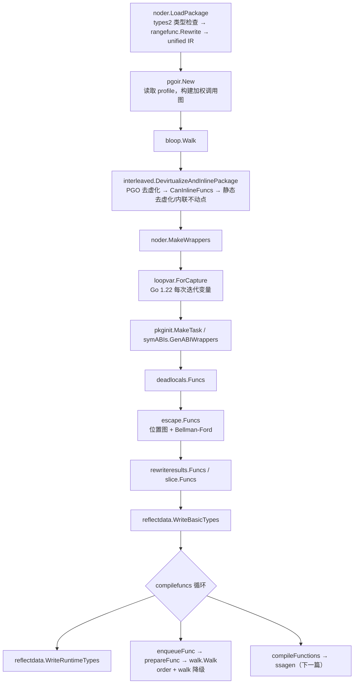
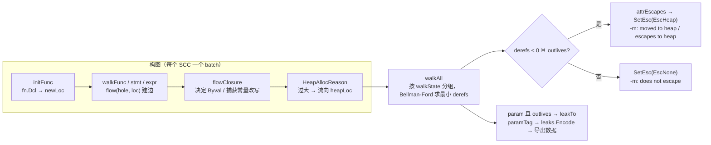
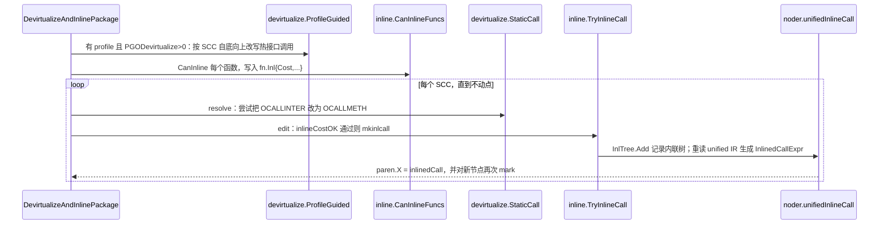

# Go 源码实现详解（四）：编译器中端——逃逸分析、内联与 walk

## 引言：结论先行

如果把 `cmd/compile` 拆成三段，前端负责把源码变成带类型的 IR（上一篇），后端负责 SSA 与机器码（下一篇），那么**中端**就是"在 IR 树上做语义保持的重写与分析"的那一段。读完本篇你应该能回答这些问题：

1. `go build -gcflags=-m` 打出来的 `moved to heap: x`、`leaking param: p`、`can inline f with cost 7` 分别是哪一行源码打印的，背后依据什么判定？
2. 为什么 `-m=2` 中会看到 `flow: {heap} ← &x` 这种"流"，逃逸分析到底在解什么图？
3. 内联预算 80 是怎么扣的，为什么调用一个函数要扣 57，PGO 热调用为什么能放宽到 2000？
4. 接口方法调用什么时候会被"去虚化"成直接调用，profile 又是怎样参与决策的？
5. `for x := range seq` 与 Go 1.22 的循环变量语义，编译器分别在哪一层重写？
6. `append`、`len`、`m[k]`、`a + b + c`、`x.(T)`、`select` 最终变成了哪些 runtime 函数调用？

先给出总的结论：

- 中端各阶段都在 `src/cmd/compile/internal/gc/main.go` 的 `Main` 里**顺序调用**，但当前版本的顺序与很多博客的记忆已经不同：类型检查在 `noder.LoadPackage` 内部完成（types2 + unified IR），rangefunc 重写发生在 **noder 之前**，去虚化与内联是**交错进行**的（`interleaved` 包），并且在逃逸分析之后新增了 `rewriteresults`、`slice` 两个针对返回值和 slice 的栈分配优化；`deadcode` 包已不存在，取而代之的是 `deadlocals`。
- 逃逸分析（`escape` 包）把每个"会分配存储的东西"建模为 `location`，把赋值建模为带权边（权重 = 解引用次数 − 取址次数），然后从"堆"等根出发用 Bellman-Ford 求最小 derefs；若某个位置以 `derefs < 0`（即地址）流到了"活得更久"的根，它就必须上堆。参数的流向被编码为 `leaks` 标签写进导出数据，供跨包调用点使用。
- 内联（`inline` 包）先用 `hairyVisitor` 给每个函数算成本（预算 `inlineMaxBudget = 80`），再在调用点由 `inlineCostOK` 判定；实际的"把函数体贴进来"由 `noder.unifiedInlineCall` 重新读取 unified IR 完成，并通过 `base.Ctxt.InlTree` 记录内联树以生成正确的调试信息。
- 去虚化（`devirtualize` 包）分静态与 PGO 两类：静态版本把 `OCALLINTER` 改写成 `OCALLMETH`；PGO 版本则生成 `if t, ok := recv.(Concrete); ok { t.M() } else { recv.M() }` 的条件直调，热点边来自 `pgoir` 构建的加权调用图。
- `walk` 阶段先由 `order` 强制求值顺序、引入临时变量，再由 `walkExpr/walkStmt` 把高层节点降级为 `typecheck/_builtin/runtime.go` 中声明的 runtime 函数调用。

下面按 `Main` 的调用顺序展开。

## 一、中端在 `Main` 中的阶段顺序

### 1.1 核实实际调用序列

先看 `Main` 的主干（去掉了与本篇无关的初始化）：

```go
// src/cmd/compile/internal/gc/main.go: Main
	// Parse and typecheck input.
	noder.LoadPackage(flag.Args())
	// ...
	// Read profile file and build profile-graph and weighted-call-graph.
	base.Timer.Start("fe", "pgo-load-profile")
	var profile *pgoir.Profile
	if base.Flag.PgoProfile != "" {
		profile, err = pgoir.New(base.Flag.PgoProfile)
		// ...
	}
	// Apply bloop markings.
	bloop.Walk(typecheck.Target)

	// Interleaved devirtualization and inlining.
	base.Timer.Start("fe", "devirtualize-and-inline")
	interleaved.DevirtualizeAndInlinePackage(typecheck.Target, profile)
	// ...
	noder.MakeWrappers(typecheck.Target) // must happen after inlining

	// Get variable capture right in for loops.
	var transformed []loopvar.VarAndLoop
	for _, fn := range typecheck.Target.Funcs {
		transformed = append(transformed, loopvar.ForCapture(fn)...)
	}
	// Build init task, if needed.
	pkginit.MakeTask()
	// Generate ABI wrappers. Must happen before escape analysis
	symABIs.GenABIWrappers()
	deadlocals.Funcs(typecheck.Target.Funcs)
```

紧接着是逃逸分析及其后的几个"栈分配增强"：

```go
// src/cmd/compile/internal/gc/main.go: Main
	base.Timer.Start("fe", "escapes")
	escape.Funcs(typecheck.Target.Funcs)

	rewriteresults.Funcs(typecheck.Target.Funcs)

	slice.Funcs(typecheck.Target.Funcs)

	loopvar.LogTransformations(transformed)
	// ...
	reflectdata.WriteBasicTypes()

	// Compile top-level declarations.
	base.Timer.Start("be", "compilefuncs")
	for nextFunc, nextExtern := 0, 0; ; {
		reflectdata.WriteRuntimeTypes()
		if nextExtern < len(typecheck.Target.Externs) { /* dumpGlobal / NeedRuntimeType */ }
		if nextFunc < len(typecheck.Target.Funcs) {
			enqueueFunc(typecheck.Target.Funcs[nextFunc], symABIs)
			nextFunc++
			continue
		}
		if len(compilequeue) != 0 {
			compileFunctions(profile)
			continue
		}
		// ... DWARF inline fixups
		break
	}
```

而 `walk` 并不直接出现在 `Main` 里，它藏在 `enqueueFunc → prepareFunc` 中：

```go
// src/cmd/compile/internal/gc/compile.go: prepareFunc
func prepareFunc(fn *ir.Func) {
	ir.InitLSym(fn, true)
	// ...
	types.CalcSize(fn.Type())
	ssagen.GenWasmExportWrapper(fn)

	ir.CurFunc = fn
	walk.Walk(fn)
	if ir.MatchAstDump(fn, "walk") {
		ir.AstDump(fn, "walk, "+ir.FuncName(fn))
	}
	ir.CurFunc = nil // enforce no further uses of CurFunc
	base.Ctxt.DwTextCount++
}
```

几点需要特别指出的版本差异：

- **没有独立的 typecheck 阶段调用。** 老版本 `Main` 中有显式的 `typecheck.Package()`；现在 types2 类型检查与 unified IR 生成都在 `noder.LoadPackage` 内完成，`Main` 拿到的 `typecheck.Target.Funcs` 已经是类型检查过的 IR。
- **rangefunc 在 noder 之前。** `noder/irgen.go` 的 `checkFiles` 在 types2 检查之后、写 unified IR 之前调用 `rangefunc.Rewrite`，原因在源码注释里写得很清楚：这样生成的闭包才有 unified IR 形式的函数体，才能被内联。
- **`deadcode` 包不存在了。** 当前是 `deadlocals.Funcs`（删除对未使用局部变量的赋值），位于逃逸分析之前。
- **新增了 `bloop`、`rewriteresults`、`slice`、`midway`。** `bloop` 为 `for b.Loop()` 基准循环插入 `runtime.KeepAlive`；`rewriteresults` 把"直接被 return 的局部变量"改写为使用结果参数的存储；`slice` 把只通过 `return s` 逃逸的 `append` 后备数组改为栈分配 + `move2heap`；`midway` 是 SIMD 相关的中途重写。这些都在本篇后半部分简述。

### 1.2 阶段流程图



`escape.Funcs`、`inline.CanInlineFuncs`、`interleaved` 三者都依赖同一个工具：`ir.VisitFuncsBottomUp`。它按调用图做强连通分量（SCC）分解，从叶子往上把函数分批交给分析器，源码注释说明了它的契约：

```go
// src/cmd/compile/internal/ir/scc.go: VisitFuncsBottomUp
// VisitFuncsBottomUp invokes analyze on the ODCLFUNC nodes listed in list.
// It calls analyze with successive groups of functions, working from
// the bottom of the call graph upward. Each time analyze is called with
// a list of functions, every function on that list only calls other functions
// on the list or functions that have been passed in previous invocations of
// analyze. Closures appear in the same list as their outer functions.
// ...
// If recursive is false, the list consists of only a single function and its closures.
func VisitFuncsBottomUp(list []*Func, analyze func(list []*Func, recursive bool)) {
```

这就是为什么逃逸分析可以直接使用被调函数的参数标签：调用者总是在被调者之后分析，互递归的函数则作为一批一起分析。

## 二、逃逸分析：位置图与最短路径

### 2.1 两个不变量与建模思路

`escape.go` 开头的注释是理解整个包的钥匙，值得原文引用：

```go
// src/cmd/compile/internal/escape/escape.go（包级注释）
// The two key invariants we have to ensure are: (1) pointers to stack objects
// cannot be stored in the heap, and (2) pointers to a stack object
// cannot outlive that object (e.g., because the declaring function
// returned and destroyed the object's stack frame, or its space is
// reused across loop iterations for logically distinct variables).
//
// We implement this with a static data-flow analysis of the AST.
// First, we construct a directed weighted graph where vertices
// (termed "locations") represent variables allocated by statements
// and expressions, and edges represent assignments between variables
// (with weights representing addressing/dereference counts).
// ...
//     p = &q    // -1
//     p = q     //  0
//     p = *q    //  1
//     p = **q   //  2
```

要点有三：

- **顶点 = location**：每个变量声明、`new`、`make`、复合字面量、闭包、接口转换都是一个 location。
- **边 = 赋值**，权重 `derefs` = 解引用次数 − 取址次数，最小为 −1（因为 `&x` 本身不可寻址，`&&x` 不存在）。
- **不区分字段与下标**：`x.f = u[0]` 被建模为 `x = *u`。这是刻意的粗粒度，牺牲精度换取简单与速度。

### 2.2 核心数据结构：location、hole、edge

```go
// src/cmd/compile/internal/escape/graph.go: location
type location struct {
	n         ir.Node  // represented variable or expression, if any
	curfn     *ir.Func // enclosing function
	edges     []edge   // incoming edges
	loopDepth int      // loopDepth at declaration
	// resultIndex records the tuple index (starting at 1) for
	// PPARAMOUT variables within their function's result type.
	resultIndex int
	// derefs and walkgen are used during walk to track the
	// minimal dereferences from the walk root.
	derefs  int // >= -1
	walkgen uint32
	// ...
	attrs locAttr        // attrEscapes | attrPersists | attrMutates | attrCalls
	paramEsc leaks       // 参数的泄漏集合
	captured   bool // has a closure captured this variable?
	reassigned bool // has this variable been reassigned?
	addrtaken  bool // has this variable's address been taken?
	param      bool // is this variable a parameter (ONAME of class ir.PPARAM)?
	paramOut   bool // is this variable an out parameter (ONAME of class ir.PPARAMOUT)?
}
```

`attrs` 是四个位：`attrEscapes`（必须上堆）、`attrPersists`（地址在语句结束后仍被持有，存储不能立刻复用）、`attrMutates`（可达内存可能被写，用于 `string→[]byte` 零拷贝判定）、`attrCalls`（可达闭包可能被调用而结果无法追踪）。

**hole 是"求值上下文"**：在计算 `x = **p` 时，评估 `p` 的 hole 是 `{dst: x, derefs: 2}`。

```go
// src/cmd/compile/internal/escape/graph.go: hole / shift / flow
type hole struct {
	dst    *location
	derefs int // >= -1
	notes  *note
	addrtaken bool
}

func (k hole) shift(delta int) hole {
	k.derefs += delta
	if k.derefs < -1 {
		base.Fatalf("derefs underflow: %v", k.derefs)
	}
	k.addrtaken = delta < 0
	return k
}
func (k hole) deref(where ir.Node, why string) hole { return k.shift(1).note(where, why) }
func (k hole) addr(where ir.Node, why string) hole  { return k.shift(-1).note(where, why) }

func (b *batch) flow(k hole, src *location) {
	if k.addrtaken {
		src.addrtaken = true
	}
	dst := k.dst
	if dst == &b.blankLoc {
		return
	}
	if dst == src && k.derefs >= 0 { // dst = dst, dst = *dst, ...
		return
	}
	if dst.hasAttr(attrEscapes) && k.derefs < 0 { // dst = &src
		// ... -m=2 时打印 "escapes to heap"
		src.attrs |= attrEscapes | attrPersists | attrMutates | attrCalls
		return
	}
	dst.edges = append(dst.edges, edge{src: src, derefs: k.derefs, notes: k.notes})
}
```

`flow` 里有一个快速路径：如果目标本身已经是逃逸位置（比如堆），而边权是 −1（取址），那就不用建边了，源直接标记逃逸。这也是 `-m=2` 中最常见的 `x escapes to heap` 的来源之一。

`batch` 里预置了四个伪位置：`heapLoc`（属性全开）、`mutatorLoc`（仅 `attrMutates`）、`calleeLoc`（仅 `attrCalls`）、`blankLoc`（丢弃）。对应的 `heapHole()`、`mutatorHole()`、`calleeHole()`、`discardHole()` 就是"流向堆/流向被修改/流向被调用/丢弃"四种上下文。

### 2.3 遍历函数体：expr、addr、spill

`Batch` 是一批（一个 SCC）函数的分析入口，顺序是 `initFunc → walkFunc → flowClosure → HeapAllocReason → walkAll → finish`：

```go
// src/cmd/compile/internal/escape/escape.go: Batch
func Batch(fns []*ir.Func, reassignOracles map[*ir.Func]*ir.ReassignOracle) {
	var b batch
	b.heapLoc.attrs = attrEscapes | attrPersists | attrMutates | attrCalls
	b.mutatorLoc.attrs = attrMutates
	b.calleeLoc.attrs = attrCalls
	// Construct data-flow graph from syntax trees.
	for _, fn := range fns {
		b.initFunc(fn)   // 为 fn.Dcl 中每个局部变量 newLoc
	}
	for _, fn := range fns {
		if !fn.IsClosure() {
			b.walkFunc(fn)   // 闭包在遇到 OCLOSURE 时递归 walk
		}
	}
	for _, closure := range b.closures {
		b.flowClosure(closure.k, closure.clo)   // 决定按值/按引用捕获
	}
	// ...
	for _, loc := range b.allLocs {
		b.rewriteWithLiterals(loc.n, loc.curfn)
		if why := HeapAllocReason(loc.n); why != "" {
			b.flow(b.heapHole().addr(loc.n, why), loc)   // 太大 → 直接流向堆
		}
	}
	b.walkAll()
	b.finish(fns)
}
```

表达式遍历的核心是 `exprSkipInit`。几个代表性分支：

```go
// src/cmd/compile/internal/escape/expr.go: exprSkipInit
	if k.derefs >= 0 && !n.Type().IsUntyped() && !n.Type().HasPointers() {
		k.dst = &e.blankLoc     // 不含指针的值怎么流都无所谓
	}
	switch n.Op() {
	case ir.ONAME:
		n := n.(*ir.Name)
		if n.Class == ir.PFUNC || n.Class == ir.PEXTERN {
			return
		}
		e.flow(k, e.oldLoc(n))
	case ir.OADDR:
		n := n.(*ir.AddrExpr)
		e.expr(k.addr(n, "address-of"), n.X) // "address-of"
	case ir.ODEREF:
		n := n.(*ir.StarExpr)
		e.expr(k.deref(n, "indirection"), n.X) // "indirection"
	case ir.OCONVIFACE:
		n := n.(*ir.ConvExpr)
		if !n.X.Type().IsInterface() && !types.IsDirectIface(n.X.Type()) {
			k = e.spill(k, n)      // 非直接接口值需要一块存储
		}
		e.expr(k.note(n, "interface-converted"), n.X)
	case ir.ONEW:
		n := n.(*ir.UnaryExpr)
		e.spill(k, n)
	case ir.OMAKESLICE:
		n := n.(*ir.MakeExpr)
		e.spill(k, n)
		e.discard(n.Len)
		e.discard(n.Cap)
```

`spill` 是"隐式分配"的统一建模：为表达式新建一个 location，把它的**地址**流向当前 hole，并返回一个新 hole 供后续把值写进去：

```go
// src/cmd/compile/internal/escape/expr.go: spill
func (e *escape) spill(k hole, n ir.Node) hole {
	loc := e.newLoc(n, false)
	e.flow(k.addr(n, "spill"), loc)
	return loc.asHole()
}
```

赋值的左值由 `addr` 处理，其中 map 的一个细节常被问到——**map 赋值时 key 一定逃逸**：

```go
// src/cmd/compile/internal/escape/assign.go: addr
	case ir.OINDEXMAP:
		n := n.(*ir.IndexExpr)
		e.discard(n.X)
		// Keys used in map assignments must escape.
		// See "Hashing Pointers" doc in internal/runtime/maps/map.go.
		e.assignHeap(n.Index, "key of map put", n)
```

### 2.4 循环深度与 outlives

`loopDepth` 是逃逸分析里第二重要的概念。`for`/`range` 进入时 `e.loopDepth++`，退出时 `--`；带回跳 `goto` 的标签也算循环头：

```go
// src/cmd/compile/internal/escape/stmt.go: stmt
	case ir.OFOR:
		n := n.(*ir.ForStmt)
		base.Assert(!n.DistinctVars) // Should all be rewritten before escape analysis
		e.loopDepth++
		e.discard(n.Cond)
		e.stmt(n.Post)
		e.block(n.Body)
		e.loopDepth--

	case ir.ORANGE:
		n := n.(*ir.RangeStmt)
		base.Assert(!n.DistinctVars)
		// X is evaluated outside the loop and persists until the loop terminates.
		tmp := e.newLoc(nil, true)
		e.expr(tmp.asHole(), n.X)
		e.loopDepth++
		ks := e.addrs([]ir.Node{n.Key, n.Value})
		// ...
		e.block(n.Body)
		e.loopDepth--
```

注意那两条 `base.Assert(!n.DistinctVars)`：Go 1.22 的循环变量语义必须在逃逸分析之前由 `loopvar` 包重写完毕，逃逸分析看到的已经是"每次迭代一个新变量"的显式形式。

`outlives` 回答"根 s 中存的值会不会比 other 活得久"：

```go
// src/cmd/compile/internal/escape/solve.go: (walkState).outlives
func (s walkState) outlives(b *batch, other *location) bool {
	// The heap outlives everything.
	if s.hasAttr(attrEscapes) {
		return true
	}
	// Pseudo-locations that don't really exist.
	if s.sink == &b.mutatorLoc || s.sink == &b.calleeLoc {
		return false
	}
	// We don't know what callers do with returned values, so
	// pessimistically we need to assume they flow to the heap and
	// outlive everything too.
	if s.sink != nil && s.sink.paramOut {
		if ir.ContainsClosure(other.curfn, s.curfn) && !s.curfn.ClosureResultsLost() {
			return false   // 闭包返回外层变量的地址，且所有调用点可见
		}
		return true
	}
	//	var l *int
	//	for {
	//		l = new(int) // must heap allocate: outlives for loop
	//	}
	if s.curfn == other.curfn && s.loopDepth < other.loopDepth {
		return true
	}
	//	var l *int
	//	func() {
	//		l = new(int) // must heap allocate: outlives call frame (if not inlined)
	//	}()
	if ir.ContainsClosure(s.curfn, other.curfn) {
		return true
	}
	return false
}
```

四条规则对应四类经典逃逸：堆、返回值、外层循环变量、外层函数变量。

### 2.5 求解：walkAll 与 Bellman-Ford

图建好之后，`walkAll` 以每个 location 为根做一次"最小 derefs"遍历。当前版本做了一个优化：把 `walkState`（sink、curfn、loopDepth、attrs）相同的根**分组**一起走，因为它们对其他位置的影响只取决于组内最小 derefs：

```go
// src/cmd/compile/internal/escape/solve.go: walk（节选）
	// The data flow graph has negative edges (from addressing
	// operations), so we use the Bellman-Ford algorithm. However,
	// we don't have to worry about infinite negative cycles since
	// we bound intermediate dereference counts to 0.
	for todo.len() > 0 {
		l := todo.popFront()
		derefs := l.derefs
		var newAttrs locAttr
		// If l.derefs < 0, then l's address flows to root.
		addressOf := derefs < 0
		if addressOf {
			derefs = 0
			// If l's address flows somewhere that outlives it, then l needs to be heap allocated.
			if s.outlives(b, l) {
				newAttrs |= attrEscapes | attrPersists | attrMutates | attrCalls
			} else if s.hasAttr(attrPersists) {
				newAttrs |= attrPersists
			}
		}
		if derefs == 0 {
			newAttrs |= s.attrs & (attrMutates | attrCalls)
		}
		if l.param {
			if s.outlives(b, l) {
				l.leakTo(s.sink, derefs)          // 记录参数泄漏
			}
			// ... AddMutator / AddCallee
		}
		// ... 松弛所有入边：d = derefs + edge.derefs
	}
```

关键的一句是 `derefs = 0` 这个下界：对于 `root = &l; l = x`，`l` 的地址流到了 root，但 `x` 的地址没有，所以到达 `l` 后把 derefs 截到 0 再继续往上游走。这也是"不存在负环"的保证。

### 2.6 参数泄漏标签：leaks

参数的分析结果被压缩成一个 8 字节数组 `leaks`，并通过 `Encode` 写进导出数据的 `param.Note`：

```go
// src/cmd/compile/internal/escape/leaks.go
// A leaks represents a set of assignment flows from a parameter to
// the heap, mutator, callee, or to any of its function's (first
// numEscResults) result parameters.
type leaks [8]uint8

const (
	leakHeap = iota
	leakMutator
	leakCallee
	leakResult0
)
const numEscResults = len(leaks{}) - leakResult0   // = 5

func (l leaks) get(i int) int { return int(l[i]) - 1 }   // -1 表示不流向该处

func (l leaks) Encode() string {
	if l.Heap() == 0 {
		return ""       // 直接泄漏到堆：空串，导出数据最省
	}
	// ...
	s := "esc:" + string(l[:n])
	return s
}
```

每个槽位存"最小 derefs + 1"，0 表示无流向。所以 `Heap()==0` 意味着"参数本身（derefs=0）流到堆"，`Heap()==1` 意味着"参数指向的内容流到堆"（`leaking param content`）。最多只记录前 5 个结果参数。

调用点这一侧由 `tagHole` 把标签反解成 hole：

```go
// src/cmd/compile/internal/escape/call.go: tagHole
func (e *escape) tagHole(ks []hole, fn *ir.Name, param *types.Field) hole {
	// If this is a dynamic call, we can't rely on param.Note.
	if fn == nil {
		return e.heapHole()
	}
	if e.inMutualBatch(fn) {
		if param.Nname == nil {
			return e.discardHole()
		}
		return e.addr(param.Nname.(*ir.Name))   // 同批次：直接接到形参位置
	}
	// Call to previously tagged function.
	var tagKs []hole
	esc := parseLeaks(param.Note)
	if x := esc.Heap(); x >= 0 {
		tagKs = append(tagKs, e.heapHole().shift(x))
	}
	if x := esc.Mutator(); x >= 0 {
		tagKs = append(tagKs, e.mutatorHole().shift(x))
	}
	if x := esc.Callee(); x >= 0 {
		tagKs = append(tagKs, e.calleeHole().shift(x))
	}
	if ks != nil {
		for i := 0; i < numEscResults; i++ {
			if x := esc.Result(i); x >= 0 {
				tagKs = append(tagKs, ks[i].shift(x))
			}
		}
	}
	return e.teeHole(tagKs...)
}
```

所以**未知被调者（函数值、接口调用）的实参一律流向堆**，这就是"通过接口/函数变量传指针几乎必逃逸"的根源。`call` 中还有一个新近加入的改进：对函数变量，会用 `ReassignOracle.FuncAssignments` 收集所有可能被赋给它的静态函数（`resolveAssignedCallees`），然后用 `mergedTagHole` 把多个被调者的标签用 `teeHole` 合并——这比一律流向堆精确得多。

### 2.7 结果落地：finish、`Esc()` 与堆分配

`finish` 把 `attrEscapes` 翻译成 `ir.Node.Esc()`，并打印 `-m` 诊断：

```go
// src/cmd/compile/internal/escape/escape.go: finish（节选）
		if loc.hasAttr(attrEscapes) {
			if n.Op() == ir.ONAME {
				if base.Flag.LowerM != 0 {
					base.WarnfAt(n.Pos(), "moved to heap: %v", n)
				}
			} else {
				if base.Flag.LowerM != 0 && !goDeferWrapper {
					if n.Op() == ir.OAPPEND {
						base.WarnfAt(n.Pos(), "append escapes to heap")
					} else {
						base.WarnfAt(n.Pos(), "%v escapes to heap", n)
					}
				}
			}
			n.SetEsc(ir.EscHeap)
		} else {
			if base.Flag.LowerM != 0 && n.Op() != ir.ONAME && !goDeferWrapper {
				// ... "%v does not escape"
			}
			n.SetEsc(ir.EscNone)
			if !loc.hasAttr(attrPersists) {
				switch n.Op() {
				case ir.OCLOSURE:  n.SetTransient(true)
				case ir.OMETHVALUE: n.SetTransient(true)
				case ir.OSLICELIT: n.SetTransient(true)
				}
			}
		}
```

`Esc` 的取值定义在 `ir/node.go`：

```go
// src/cmd/compile/internal/ir/node.go
const (
	EscUnknown = iota
	EscNone    // Does not escape to heap, result, or parameters.
	EscHeap    // Reachable from the heap
	EscNever   // By construction will not escape.
)
```

一个局部变量被标为 `EscHeap` 后，真正"搬到堆上"发生在 SSA 生成阶段：`ssagen` 遇到 `ODCL` 时若 `v.Esc() == ir.EscHeap` 就调用 `newHeapaddr`，用 `runtime.newobject`（或聚合分配）申请内存并把地址存进 `n.Heapaddr`，此后对该变量的访问都变成隐式解引用：

```go
// src/cmd/compile/internal/ssagen/ssa.go: newHeapaddr / setHeapaddr（节选）
func (s *state) newHeapaddr(n *ir.Name) {
	size := allocSize(n.Type())
	if n.Type().HasPointers() || size >= maxAggregatedHeapAllocation || size == 0 {
		s.setHeapaddr(n.Pos(), n, s.newObject(n.Type()))
		return
	}
	// ... 多个无指针小对象合并成一次分配
}

func (s *state) setHeapaddr(pos src.XPos, n *ir.Name, ptr *ssa.Value) {
	// Declare variable to hold address.
	sym := &types.Sym{Name: "&" + n.Sym().Name, Pkg: types.LocalPkg}
	addr := s.curfn.NewLocal(pos, sym, types.NewPtr(n.Type()))
	// ...
	n.Heapaddr = addr
	s.assign(addr, ptr, false, 0)
}
```

`ir.Name.OnStack()` 的定义也印证了这一点：对 `PPARAM/PPARAMOUT/PAUTO`，`OnStack` 就是 `n.Esc() != EscHeap`。

除了数据流，还有一类"硬性"上堆原因由 `HeapAllocReason` 给出：

```go
// src/cmd/compile/internal/escape/utils.go: HeapAllocReason（节选）
	if n.Type().Size() > ir.MaxStackVarSize {            // 128KB
		return "too large for stack"
	}
	if (n.Op() == ir.ONEW || n.Op() == ir.OPTRLIT) && n.Type().Elem().Size() > ir.MaxImplicitStackVarSize {  // 64KB
		return "too large for stack"
	}
	if n.Op() == ir.OMAKESLICE {
		// ...
		if !ir.IsSmallIntConst(r) {
			// 非常量长度：留给 walkMakeSlice 做"小则栈、大则堆"的混合策略
			return ""
		}
		if ir.Int64Val(r) > ir.MaxImplicitStackVarSize/elem.Size() {
			return "too large for stack"
		}
	}
```

### 2.8 典型例子与 `-m` 输出解读

用上面的规则逐一对照几个例子（`go build -gcflags='-m -m'`）：

```go
func f1() *int { x := 1; return &x }
```
`&x` 以 derefs=−1 流向结果参数 `~r0`（`paramOut`）；`walk` 时根的 sink 是 `paramOut`，`outlives` 第三条返回 true → `moved to heap: x`。`-m=2` 会打印 `flow: ~r0 ← &x:` 加上 `from &x (address-of)` 等 note。

```go
func f2() int { x := 1; p := &x; return *p }
```
`&x` 流向 `p`，但 `p` 只被解引用读取，没有任何以 derefs<0 到达"活得更久"根的路径，`x` 留在栈上，`-m` 无输出。

```go
var l *int
func f3() { for i := 0; i < 3; i++ { l = new(int) } }
```
`new(int)` 的 spill 位置地址流向全局 `l`；`l` 是 `PEXTERN`，`addr` 对其返回 `heapHole()`，`flow` 的快速路径直接标记 → `new(int) escapes to heap`。即便 `l` 是局部变量，`loopDepth` 也会让 `outlives` 返回 true。

```go
func f4(p *int) { global = p }        // leaking param: p
func f5(p *int) int { return *p }     // p does not escape
func f6(s []*int) { global = s[0] }   // leaking param content: s
func f7(p *int) *int { return p }     // leaking param: p to result ~r0 level=0
```
这些字符串都来自 `paramTag → reportLeaks`：`Heap()==0` 打 `leaking param`，`Heap()>0` 打 `leaking param content`，`Result(i)>=0` 打 `to result ... level=x`。

```go
func f8(x int) { fmt.Println(x) }     // x escapes to heap
```
`Println` 的形参 `a ...any` 标签是"泄漏到堆"，`OCONVIFACE` 为 `x` spill 了一块存储，其地址通过 `tagHole` 流向 `heapHole` → 逃逸。不过注意 `walk` 阶段的 `dataWord` 还有一层兜底：小整数、布尔、零值会改用 `runtime.staticuint64s`/`zerobase` 等只读全局，不真正分配。

```go
func f9(n int) []int { s := make([]int, n); return s[:1] }   // make([]int, n) escapes to heap
func f10(n int) int { s := make([]int, n); return len(s) }  // make([]int, n) does not escape
```
`f10` 中 `HeapAllocReason` 对非常量长度返回 ""，逃逸分析判定不逃逸后，`walkMakeSlice` 会生成 `if cap <= 32/sizeof(E) { 栈数组 } else { makeslice }` 的混合代码（`base.Debug.VariableMakeThreshold` 默认 32 字节）。

`-m=2` 还会打印闭包捕获决策，来自 `flowClosure`：变量 ≤128 字节、未被取址、未被重新赋值则按值捕获，否则按引用（`%v capturing by ref: ...`）。当前版本还多了一个 `rewriteClosureVarsWithLiterals`：按值捕获且值为常量的变量会被改写成闭包内的局部常量，从而可能让闭包"捕获零个变量"，进而 `walkClosure` 直接引用函数符号而不分配闭包记录。

### 2.9 逃逸分析流程图



## 三、内联：预算、hairyVisitor 与交错式不动点

### 3.1 预算常量

```go
// src/cmd/compile/internal/inline/inl.go
const (
	inlineMaxBudget       = 80
	inlineExtraAppendCost = 0
	// default is to inline if there's at most one call. -l=4 overrides this by using 1 instead.
	inlineExtraCallCost  = 57              // 57 was benchmarked to provided most benefit with no bad surprises
	inlineParamCallCost  = 17              // calling a parameter only costs this much extra
	inlineExtraPanicCost = 1               // do not penalize inlining panics.
	inlineExtraThrowCost = inlineMaxBudget // with current (2018-05/1.11) code, inlining runtime.throw does not help.

	inlineBigFunctionNodes      = 5000                 // Functions with this many nodes are considered "big".
	inlineBigFunctionMaxCost    = 20                   // Max cost of inlinee when inlining into a "big" function.
	inlineClosureCalledOnceCost = 10 * inlineMaxBudget // if a closure is just called once, inline it.
)

var (
	// Budget increased due to hotness.
	inlineHotMaxBudget int32 = 2000
	inlineCDFHotCallSiteThresholdPercent = float64(99)
)
```

`inlineBudget` 决定某个函数的预算：普通函数 80；PGO 热函数 2000；`internal/runtime/maps` 的 `runtime_mapaccess2*` 也放宽到 2000（为了能内联进 `mapaccess1*` 包装）；新内联器（`GOEXPERIMENT=newinliner`）下再加 `inlheur.BudgetExpansion`（默认再加 80）；闭包至少 800。

### 3.2 CanInline 与 hairyVisitor

```go
// src/cmd/compile/internal/inline/inl.go: CanInline（节选）
func CanInline(fn *ir.Func, profile *pgoir.Profile) {
	// ...
	reason = InlineImpossible(fn)   // go:noinline、go:norace+-race、无函数体……
	if reason != "" {
		return
	}
	cc := int32(inlineExtraCallCost)
	if base.Flag.LowerL == 4 {
		cc = 1 // this appears to yield better performance than 0.
	}
	relaxed := inlheur.Enabled()
	budget := inlineBudget(fn, profile, relaxed, base.Debug.PGODebug > 0)

	visitor := hairyVisitor{
		curFunc: fn, isBigFunc: IsBigFunc(fn),
		budget: budget, maxBudget: budget, extraCallCost: cc, profile: profile,
	}
	if visitor.tooHairy(fn) {
		reason = visitor.reason
		return
	}
	n.Func.Inl = &ir.Inline{
		Cost:            budget - visitor.budget,
		Dcl:             pruneUnusedAutos(n.Func.Dcl, &visitor),
		HaveDcl:         true,
		CanDelayResults: canDelayResults(fn),
	}
	if base.Flag.LowerM != 0 || logopt.Enabled() {
		noteInlinableFunc(n, fn, budget-visitor.budget)
	}
}
```

`hairyVisitor.doNode` 对每个节点默认扣 1（在函数末尾 `v.budget--`），然后按类型修正。几个关键分支：

```go
// src/cmd/compile/internal/inline/inl.go: (*hairyVisitor).doNode（节选）
	case ir.OCALLFUNC:
		// ... internal/abi.NoEscape、runtime.throw、encoding/binary 的 *Uint64 等视为 cheap
		extraCost := v.extraCallCost
		if n.Fun.Op() == ir.ONAME {
			name := n.Fun.(*ir.Name)
			if name.Class == ir.PPARAM || name.Class == ir.PAUTOHEAP && name.IsClosureVar() {
				extraCost = min(extraCost, inlineParamCallCost)   // 调用参数：17
			}
		}
		if cheap || ir.IsIntrinsicCall(n) {
			break // treat like any other node, that is, cost of 1
		}
		if callee := inlCallee(v.curFunc, n.Fun, v.profile, false); callee != nil && typecheck.HaveInlineBody(callee) {
			if ok, _, _ := canInlineCallExpr(v.curFunc, n, callee, v.isBigFunc, false, false); ok {
				v.budget -= callee.Inl.Cost   // 会被内联的调用：按被调者成本计
				break
			}
		}
		v.budget -= extraCost              // 否则：57
	case ir.OCALL, ir.OCALLINTER:
		v.budget -= v.extraCallCost
	case ir.OPANIC:
		v.budget -= inlineExtraPanicCost
	case ir.OCLOSURE:
		if base.Debug.InlFuncsWithClosures == 0 {
			v.reason = "not inlining functions with closures"
			return true
		}
		v.budget -= 15
	case ir.OGO, ir.ODEFER, ir.OTAILCALL:
		v.reason = "unhandled op " + n.Op().String()
		return true
```

从这里可以读出几个"民间经验"的真实依据：

- "含 `defer`/`go` 的函数不能内联"——`OGO/ODEFER` 直接返回 too hairy。
- "含 `for` 的函数不能内联"——**已经不成立**，当前版本 `OFOR/ORANGE/OSELECT/OSWITCH` 不再被拒绝，只按节点数扣预算。
- "调用别的函数就很难内联"——非内联调用扣 57，加上调用本身，80 的预算最多容纳一个。而如果被调者本身可内联，只扣它的 `Inl.Cost`，这就是"中间栈内联"（mid-stack inlining）的实现方式。
- 尾部有 `tooHairy` 的判定：`v.budget < 0` 时 reason 为 `function too complex: cost %d exceeds budget %d`，这正是 `-m=2` 里常见的那句。

`-m` 的输出来自 `noteInlinableFunc`：`-m` 打 `can inline f`，`-m=2` 打 `can inline f with cost 7 as: func(int) int { return x + 1 }`。

### 3.3 调用点判定：inlineCostOK

```go
// src/cmd/compile/internal/inline/inl.go: inlineCostOK（节选）
func inlineCostOK(n *ir.CallExpr, caller, callee *ir.Func, bigCaller, closureCalledOnce bool) (bool, int32, int32, bool) {
	maxCost := int32(inlineMaxBudget)
	if bigCaller {
		// We use this to restrict inlining into very big functions.
		maxCost = inlineBigFunctionMaxCost      // 20
	}
	if callee.ClosureParent != nil {
		maxCost *= 2           // favor inlining closures
		if closureCalledOnce { // really favor inlining the one call to this closure
			maxCost = max(maxCost, inlineClosureCalledOnceCost)
		}
	}
	metric := callee.Inl.Cost
	if inlheur.Enabled() {
		if score, ok := inlheur.GetCallSiteScore(caller, n); ok {
			metric = int32(score)          // 新内联器：用调用点分数替代静态成本
		}
	}
	lineOffset := pgoir.NodeLineOffset(n, caller)
	csi := pgoir.CallSiteInfo{LineOffset: lineOffset, Caller: caller}
	_, hot := candHotEdgeMap[csi]
	if metric <= maxCost {
		return true, 0, metric, hot
	}
	if !hot {
		return false, maxCost, metric, false
	}
	// Hot
	if bigCaller { return false, maxCost, metric, false }
	if metric > inlineHotMaxBudget { return false, inlineHotMaxBudget, metric, false }
	if !base.PGOHash.MatchPosWithInfo(n.Pos(), "inline", nil) { return false, maxCost, metric, false }
	return true, 0, metric, hot
}
```

这里同时体现了三种机制：大函数（≥5000 节点）内只允许 ≤20 的被调者；闭包翻倍、只调用一次的闭包放宽到 800；PGO 热调用点放宽到 2000。`canInlineCallExpr` 还会用 `parsePos` 检查位置链，禁止把函数内联进它自己的内联副本（递归内联）。

### 3.4 交错式去虚化与内联

Go 1.22 起，去虚化与内联不再是两个独立 pass，而由 `interleaved.DevirtualizeAndInlinePackage` 驱动。它先给所有调用点包一层 `ParenExpr` 作为可原地替换的"锚点"，再对每个 SCC 迭代到不动点：

```go
// src/cmd/compile/internal/inline/interleaved/interleaved.go: DevirtualizeAndInlinePackage（节选）
	if profile != nil && base.Debug.PGODevirtualize > 0 {
		ir.VisitFuncsBottomUp(typecheck.Target.Funcs, func(list []*ir.Func, recursive bool) {
			for _, fn := range list {
				devirtualize.ProfileGuided(fn, profile)
			}
		})
	}
	// First compute inlinability of all functions in the package.
	inline.CanInlineFuncs(pkg.Funcs, inlProfile)
	// ... 为每个函数 parenthesize()，并做一次 resolve 统计被调者使用次数
	ir.VisitFuncsBottomUp(typecheck.Target.Funcs, func(list []*ir.Func, recursive bool) {
		// Iterate to a fixed point over all the functions.
		done := false
		for !done {
			done = true
			for _, fn := range list {
				s := inlState[fn]
				ir.WithFunc(fn, func() {
					for i := l0; i < l1; i++ {
						paren := s.parens[i]
						if origCall, inlinedCall := s.edit(&state, i); inlinedCall != nil {
							paren.X = inlinedCall
							ir.EditChildren(inlinedCall, s.mark) // mark may append to parens
							state.InlinedCall(s.fn, origCall, inlinedCall)
							done = false
						}
					}
					// ...
				})
			}
		}
	})
```

每个调用点的处理在 `resolve`：先做静态去虚化，再解析内联目标；`edit` 再调用 `inline.TryInlineCall`：

```go
// src/cmd/compile/internal/inline/interleaved/interleaved.go: (*inlClosureState).resolve（节选）
	devirtualize.StaticCall(state, call)
	if callee := inline.InlineCallTarget(s.fn, call, s.profile); callee != nil {
		s.resolved[i] = callee
		c := s.useCounts[callee] + 1
		s.useCounts[callee] = c
		return callee, c
	}
```

`useCounts` 就是"闭包只被调用一次"（`closureCalledOnce`）判定的来源。之所以要交错，是因为内联之后可能暴露出新的具体类型（例如内联了返回 `*T` 的构造函数后，接口变量的赋值来源就确定了），去虚化随之可以把接口调用变成直接调用，再进一步内联——单向的 pass 顺序做不到这一点。



### 3.5 真正的内联：unifiedInlineCall 与内联树

`mkinlcall` 负责记账与日志，然后把工作交给 `InlineCall` 变量——它在 `noder/unified.go` 中被赋值为 `unifiedInlineCall`：

```go
// src/cmd/compile/internal/inline/inl.go: mkinlcall（节选）
	parent := base.Ctxt.PosTable.Pos(n.Pos()).Base().InliningIndex()
	sym := fn.Linksym()
	inlIndex := base.Ctxt.InlTree.Add(parent, n.Pos(), sym, ir.FuncName(fn))
	// ...
	if base.Flag.GenDwarfInl > 0 {
		if !sym.WasInlined() {
			base.Ctxt.DwFixups.SetPrecursorFunc(sym, fn)
			sym.Set(obj.AttrWasInlined, true)
		}
	}
	if base.Flag.LowerM != 0 {
		fmt.Printf("%v: inlining call to %v\n", ir.Line(n), fn.Nname.DiagName())
	}
	res := InlineCall(callerfn, n, fn, inlIndex, profile)
```

`InlTree` 是一棵记录"哪个位置内联了哪个函数、父节点是谁"的树，最终写入目标文件，供 `runtime.Callers`、panic 栈回溯与 DWARF 还原内联帧：

```go
// src/cmd/internal/obj/inl.go
type InlinedCall struct {
	Parent   int      // index of the parent in the InlTree or < 0 if outermost call
	Pos      src.XPos // position of the inlined call
	Func     *LSym    // function that was inlined
	Name     string   // bare name of the function (w/o package prefix)
	ParentPC int32    // PC of instruction just before inlined body. Only valid in local trees.
}
```

`unifiedInlineCall` 不复制 AST，而是**重新从 unified IR 导出数据里读一遍函数体**，读的过程中把位置映射到带 `inlTreeIndex` 的新 PosBase，把形参换成调用者的临时变量：

```go
// src/cmd/compile/internal/noder/reader.go: unifiedInlineCall（节选）
	pri, ok := bodyReaderFor(fn)
	if !ok {
		base.FatalfAt(call.Pos(), "cannot inline call to %v: missing inline body", fn)
	}
	r := pri.asReader(pkgbits.SectionBody, pkgbits.SyncFuncBody)
	tmpfn := ir.NewFunc(fn.Pos(), fn.Nname.Pos(), callerfn.Sym(), fn.Type())
	r.curfn = tmpfn
	r.inlCaller = callerfn
	r.inlCall = call
	r.inlFunc = fn
	r.inlTreeIndex = inlIndex
	r.inlPosBases = make(map[*src.PosBase]*src.PosBase)
	// ...
	r.retlabel = typecheck.AutoLabel(".i")
	// ... 生成 inlvars = args 的 OAS2，读取函数体，return 变成 goto .i
	res := ir.NewInlinedCallExpr(call.Pos(), body, ir.ToNodes(retvars))
```

结果是一个 `ir.InlinedCallExpr{Body, ReturnVars}` 节点：`Body` 是内联后的语句序列（以 `.iN` 标签结束），`ReturnVars` 是承载返回值的临时变量。这就是为什么 rangefunc 必须在 noder 之前重写——只有走过 unified IR 的函数才有 `bodyReaderFor` 可用。

### 3.6 新内联器启发式（inlheur）

`inline/inlheur` 是 `GOEXPERIMENT=newinliner` 时启用的调用点打分系统（`inlheur.Enabled()`）。它先由 `AnalyzeFunc` 为每个函数计算属性（参数是否只用于条件、返回值是否总是常量等，见 `analyze_func_*.go`），再由 `ScoreCalls` 为每个调用点在 `Inl.Cost` 基础上做加减分，`GetCallSiteScore` 把分数交给 `inlineCostOK`。默认构建不启用，本篇不展开。

## 四、去虚化与 PGO

### 4.1 静态去虚化

`devirtualize.StaticCall` 只处理 `OCALLINTER`，且跳过 `go/defer` 中的调用（避免把 wrapper 里可能 panic 的表达式提前到 `go/defer` 语句处）。当前版本用 `concreteType` 做了比早期 `ir.StaticValue` 更强的分析（常量 `go126ImprovedConcreteTypeAnalysis = true`），能跟踪接口变量的所有赋值来源：

```go
// src/cmd/compile/internal/devirtualize/devirtualize.go: StaticCall（节选）
	sel := call.Fun.(*ir.SelectorExpr)
	typ = concreteType(s, sel.X)
	if typ == nil {
		return
	}
	if !typecheck.Implements(typ, sel.X.Type()) {
		return
	}
	if typ.IsShape() { return }          // 泛型形状类型：仍需走字典
	if typ.HasShape() { /* -m: cannot devirtualize ...: shaped receiver */ return }
	if sel.X.Type().HasShape() { return }

	dt := ir.NewTypeAssertExpr(sel.Pos(), sel.X, typ)
	dt.UseNilPanic = true      // 保持对 nil 接口调用的 panic 语义
	dt.SetPos(call.Pos())
	x := typecheck.XDotMethod(sel.Pos(), dt, sel.Sel, true)
	switch x.Op() {
	case ir.ODOTMETH:
		if base.Flag.LowerM != 0 {
			base.WarnfAt(call.Pos(), "devirtualizing %v to %v", sel, typ)
		}
		call.SetOp(ir.OCALLMETH)
		call.Fun = x
	case ir.ODOTINTER:
		// Promoted method from embedded interface-typed field (#42279).
		call.SetOp(ir.OCALLINTER)
		call.Fun = x
	}
	// ...
	typecheck.FixMethodCall(call)   // OCALLMETH → OCALLFUNC(方法表达式)
```

改写后的形式是 `recv.(T).M(args)`——一个必然成功的类型断言加直接方法调用；SSA 阶段类型断言只剩一次 itab 比较，并且这个调用现在成了内联候选。`State` 结构缓存了接口变量的赋值集合（`ifaceAssignments`），`InlinedCall` 在每次内联后增量更新，这就是它能与内联交错的原因。

### 4.2 pgoir：从 profile 到加权调用图

```go
// src/cmd/compile/internal/pgoir/irgraph.go
type IRGraph struct {
	// Nodes of the graph. Each node represents a function, keyed by linker symbol name.
	IRNodes map[string]*IRNode
}
type IRNode struct {
	AST *ir.Func
	LinkerSymbolName string       // Populated only if AST == nil.
	OutEdges map[pgo.NamedCallEdge]*IREdge
}
type IREdge struct {
	Src, Dst       *IRNode
	Weight         int64
	CallSiteOffset int // Line offset from function start line.
}
type Profile struct {
	*pgo.Profile            // 原始 profile（cmd/internal/pgo），含 NamedEdgeMap
	WeightedCG *IRGraph
}
```

`pgoir.New` 支持两种输入：`go tool pprof` 格式与预处理后的序列化格式（`pgo.IsSerialized`），采样为 0 的 profile 会被接受但忽略。调用点用"函数起始行的相对偏移"（`CallSiteOffset`/`NodeLineOffset`）识别，这样源码在函数外部增删行不会让 profile 失效。

内联侧的热点判定在 `PGOInlinePrologue → hotNodesFromCDF`：按边权降序累加，直到累计权重超过 `inlineCDFHotCallSiteThresholdPercent`（99%），这批边就是热调用边，写入 `candHotEdgeMap`；对应的被调者写入 `candHotCalleeMap`，使 `IsPgoHotFunc` 成立、预算升到 2000。

### 4.3 PGO 去虚化

`devirtualize.ProfileGuided` 遍历函数中每个 `OCALLFUNC/OCALLINTER`，找加权调用图上最热的具体被调者：

```go
// src/cmd/compile/internal/devirtualize/pgo.go: maybeDevirtualizeInterfaceCall
func maybeDevirtualizeInterfaceCall(p *pgoir.Profile, fn *ir.Func, call *ir.CallExpr) (ir.Node, *ir.Func, int64) {
	if base.Debug.PGODevirtualize < 1 {
		return nil, nil, 0
	}
	// Bail if we do not have a hot callee.
	callee, weight := findHotConcreteInterfaceCallee(p, fn, call)
	if callee == nil {
		return nil, nil, 0
	}
	// Bail if we do not have a Type node for the hot callee.
	ctyp := methodRecvType(callee)
	if ctyp == nil {
		return nil, nil, 0
	}
	// Bail if we know for sure it won't inline.
	if !shouldPGODevirt(callee) {
		return nil, nil, 0
	}
	if !base.PGOHash.MatchPosWithInfo(call.Pos(), "devirt", nil) {
		return nil, nil, 0
	}
	return rewriteInterfaceCall(call, fn, callee, ctyp), callee, weight
}
```

改写产物是一个条件直调（源码注释给出了目标形态）：

```go
// src/cmd/compile/internal/devirtualize/pgo.go: rewriteInterfaceCall（注释）
	// recv, arg1, argN = recv expr, arg1 expr, argN expr
	//
	// t, ok := recv.(Concrete)
	// if ok {
	//   ret1, retN = t.Method(arg1, ... argN)
	// } else {
	//   ret1, retN = recv.Method(arg1, ... argN)
	// }
	//
	// OINCALL retvars: ret1, ... retN
```

`condCall` 把两个分支包进一个 `ir.InlinedCallExpr`，并把 `nif.Likely = true`——源码注释坦言"这并不真的是内联调用，但 InlinedCallExpr 让返回值的重新赋值最容易处理"。`base.Debug.PGODevirtualize` 默认为 2（`base/flag.go`），即同时启用接口调用与函数值调用的去虚化；`-m` 下会打印 `PGO devirtualizing interface call recv.M to pkg.(*T).M`。

## 五、rangefunc 与 loopvar：两处语法层面的重写

### 5.1 range over func：在 noder 之前重写

```go
// src/cmd/compile/internal/noder/irgen.go: checkFiles（节选）
	// Rewrite range over function to explicit function calls
	// with the loop bodies converted into new implicit closures.
	// We do this now, before serialization to unified IR, so that if the
	// implicit closures are inlined, we will have the unified IR form.
	// If we do the rewrite in the back end, like between typecheck and walk,
	// then the new implicit closure will not have a unified IR inline body,
	// and bodyReaderFor will fail.
	rangeInfo := rangefunc.Rewrite(pkg, info, files)
```

`rangefunc.Rewrite` 工作在 `syntax` 树 + `types2.Info` 上，而不是 IR 上。基本变换是把 `for x := range f { body }` 变成 `f(func(x T) bool { body; return true })`，复杂之处在于 `break/continue/goto/return` 与迭代器行为检查。包注释描述了状态机：

```go
// src/cmd/compile/internal/rangefunc/rewrite.go（包注释节选）
// abi.RF_DONE = 0      // body of loop has exited in a non-panic way
// abi.RF_READY = 1     // body of loop has not exited yet, is not running
// abi.RF_PANIC = 2     // body of loop is either currently running, or has panicked
// abi.RF_EXHAUSTED = 3 // iterator function call, e.g. f(func(x t){...}), returned so the sequence is "exhausted".
//
// (2) after the iterator function call returns,
//	if #stateN == abi.RF_PANIC {
//		panic(runtime.panicrangestate(abi.RF_MISSING_PANIC))
//	}
//	#stateN = abi.RF_EXHAUSTED
// (3) at the beginning of the iteration of the loop body,
//	if #stateN != abi.RF_READY { #stateN = abi.RF_PANIC ; runtime.panicrangestate(#stateN) }
//	#stateN = abi.RF_PANIC
```

每个循环有一个 `#stateN` 变量，用来检测"迭代器在 yield 返回 false 后又调用了 body"这类错误；`return` 通过 `#next` 整数编码传出循环后再执行。`endLoop` 生成命名为 `#yieldN` 的闭包变量并构造 `X(#yieldN)` 调用。这也解释了内联器里的两个特例：`runtime.panicrangestate` 视为 cheap，而 `runtime.deferrangefunc` 直接拒绝内联（`defer call in range func`）。

### 5.2 Go 1.22 循环变量：loopvar.ForCapture

`loopvar.ForCapture` 在内联之后、逃逸分析之前运行。它的策略是**语法上保守地过近似**"可能被捕获"的循环变量，只改写这些，而不是全部：

```go
// src/cmd/compile/internal/loopvar/loopvar.go: ForCapture（注释节选）
		// scanChildrenThenTransform processes node x to:
		//  1. if x is a for/range w/ DistinctVars, note declared iteration variables possiblyLeaked (PL)
		//  2. search all of x's children for syntactically escaping references to v in PL,
		//     meaning either address-of-v or v-captured-by-a-closure
		//  3. for all v in PL that had a syntactically escaping reference, transform the declaration
		//     and (in case of 3-clause loop) the loop to the unshared loop semantics.
```

`DistinctVars` 是 noder 根据语言版本（`go 1.22` 及以上）在 `ForStmt/RangeStmt` 上设置的标志；判定在 IR 上进行，所以经过内联后来自其他包的循环也能保持原包的语义。range 循环的改写很简单——在循环体开头加一句 `x := tk`（`tk` 是真正的迭代临时变量）；三段式 for 循环则复杂得多，源码注释给出了完整变换：

```go
// src/cmd/compile/internal/loopvar/loopvar.go: ForCapture（注释节选）
	//	BEFORE:
	//		for z := 0; z < n; z++ {
	//			if reason() { escape = append(escape, &z); continue }
	//			z = z + z
	//			stuff
	//		}
	//	AFTER:
	//		for z', tmp_first := 0, true; ; { // (4)
	//			z := z'                       // (1)
	//			if tmp_first {tmp_first = false} else {z++} // (6)
	//			if ! (z < n) { break }        // (7)
	//			if reason() { escape = append(escape, &z); goto next }
	//			z = z + z
	//			stuff
	//		next:                             // (9)
	//			z' = z                        // (2)
	//		}
```

被改写的变量记录在 `[]VarAndLoop` 中，逃逸分析之后 `loopvar.LogTransformations` 再据此报告 `loop variable z now per-iteration`（`-d=loopvar=2` 或 `-m`）。

## 六、walk：从语言原语到 runtime 调用

### 6.1 入口与 order

```go
// src/cmd/compile/internal/walk/walk.go: Walk
func Walk(fn *ir.Func) {
	walkstate := &walkState{curfunc: fn}
	analyzePreWalk(fn)
	// ...
	order(walkstate, fn)
	// ...
	walkStmtList(walkstate, walkstate.curfunc.Body)
	// Eagerly compute sizes of all variables for SSA.
	for _, n := range fn.Dcl {
		types.CalcSize(n.Type())
	}
}
```

`order.go` 的头注释说明了它的职责：

```go
// src/cmd/compile/internal/walk/order.go（文件注释）
// Rewrite tree to use separate statements to enforce
// order of evaluation. Makes walk easier, because it
// can (after this runs) reorder at will within an expression.
//
// Rewrite m[k] op= r into m[k] = m[k] op r if op is / or %.
//
// Introduce temporaries as needed by runtime routines.
// For example, the map runtime routines take the map key
// by reference, so make sure all map keys are addressable
// by copying them to temporaries as needed.
// The same is true for channel operations.
//
// Arrange that map index expressions only appear in direct
// assignments x = m[k] or m[k] = x, never in larger expressions.
//
// Arrange that receive expressions only appear in direct assignments
// x = <-c or as standalone statements <-c, never in larger expressions.
```

`orderState` 维护一个临时变量栈与按类型分桶的空闲列表（`free map[string][]*ir.Name`），`markTemp/popTemp` 让同一语句内的临时变量在语句结束后被复用。以 map 索引为例：

```go
// src/cmd/compile/internal/walk/order.go: (*orderState).expr1（节选）
	case ir.OINDEXMAP:
		n := n.(*ir.IndexExpr)
		n.X = o.expr(walkstate, n.X, nil)
		n.Index = o.expr(walkstate, n.Index, nil)
		needCopy := false
		if !n.Assigned {
			needCopy = mapKeyReplaceStrConv(n.Index)   // m[string(b)] 零拷贝的保护
			if base.Flag.Cfg.Instrumenting {
				needCopy = true
			}
		}
		// key may need to be addressable
		n.Index = o.mapKeyTemp(walkstate, n.Pos(), n.X.Type(), n.Index)
		if needCopy {
			return o.copyExpr(walkstate, n)
		}
		return n
```

`mapKeyTemp` 根据 `mapfast(t)` 决定 key 的形态：慢路径需要 key 可寻址（`addrTemp`），而 `fast32/fast64/faststr` 路径直接按值传 `uint32/uint64/string`。

### 6.2 append、len/cap、make

`walkAppend` 当前的行为与旧版本明显不同——**一般情况不再在 walk 里展开，而是留给 ssagen**：

```go
// src/cmd/compile/internal/walk/builtin.go: walkAppend（节选）
	// General case, with no function calls left as arguments.
	// Leave for ssagen, except that instrumentation requires the old form.
	if !base.Flag.Cfg.Instrumenting || base.Flag.CompilingRuntime {
		return n
	}
	// ... -race 等插桩模式下仍展开为：
	// newLen := s.len + num
	// if uint(newLen) <= uint(s.cap) { s = s[:newLen] } else { s = growslice(s.ptr, newLen, s.cap, num, T) }
	// s[newLen-argc+i] = arg
```

`walkGrowslice` 显示了 runtime 接口的样子：`growslice(oldPtr *any, newLen, oldCap, num int, et *byte) []any`。`append(s, t...)` 与 `append(s, make([]T, n)...)` 分别由 `assign.go` 中的 `appendSlice`、`extendSlice` 处理。

`walkLenCap` 展示了几个模式匹配优化：

```go
// src/cmd/compile/internal/walk/builtin.go: walkLenCap（节选）
	if isRuneCount(n) {
		// Replace len([]rune(string)) with runtime.countrunes(string).
		return mkcall(walkstate, "countrunes", n.Type(), init, typecheck.Conv(n.X.(*ir.ConvExpr).X, types.Types[types.TSTRING]))
	}
	if isByteCount(n) {        // len([]byte(s)) → len(s)，不分配
		// ...
	}
	if isChanLenCap(n) {       // len(ch) → chanlen(ch)
		name := "chanlen"
		if n.Op() == ir.OCAP { name = "chancap" }
		fn := typecheck.LookupRuntime(name, n.X.Type())
		return mkcall1(walkstate, fn, n.Type(), init, n.X)
	}
	// replace len(*[10]int) with 10.
```

`walkMakeSlice` 在 §2.8 已提及：`EscNone` 且容量为小常量 → 直接栈上 `var arr [cap]E; s = arr[:len]`；`EscNone` 但容量非常量 → 生成 `if cap <= K { 栈 } else { makeslice }`，其中栈数组被包进一个带 `[0]uintptr` 字段的 struct 以保证指针对齐（issue 73199）；否则调用 `makeslice`/`makeslice64`。

### 6.3 map 访问与赋值

```go
// src/cmd/compile/internal/walk/expr.go: walkIndexMap
func walkIndexMap(walkstate *walkState, n *ir.IndexExpr, init *ir.Nodes) ir.Node {
	n.X = walkExpr(walkstate, n.X, init)
	n.Index = walkExpr(walkstate, n.Index, init)
	map_ := n.X
	t := map_.Type()
	fast := mapfast(t)
	key := mapKeyArg(fast, n, n.Index, n.Assigned)
	args := []ir.Node{reflectdata.IndexMapRType(base.Pos, n), map_, key}

	var mapFn ir.Node
	switch {
	case n.Assigned:
		mapFn = mapfn(mapassign[fast], t, false)
	case t.Elem().Size() > abi.ZeroValSize:
		args = append(args, reflectdata.ZeroAddr(t.Elem().Size()))
		mapFn = mapfn("mapaccess1_fat", t, true)
	default:
		mapFn = mapfn(mapaccess1[fast], t, false)
	}
	call := mkcall1(walkstate, mapFn, nil, init, args...)
	call.SetType(types.NewPtr(t.Elem()))
	call.MarkNonNil() // mapaccess1* and mapassign always return non-nil pointers.
	star := ir.NewStarExpr(base.Pos, call)
	// ...
	return star
}
```

即 `m[k]` 读取变成 `*mapaccess1_xxx(rtype, m, k)`，`m[k] = v` 变成 `*mapassign_xxx(rtype, m, k) = v`，`v, ok := m[k]` 由 `walkAssignMapRead` 改写为 `mapaccess2_xxx` 加 `a = *var`。`mapfast` 的分类依据是 key 的算法类型：

```go
// src/cmd/compile/internal/walk/walk.go: mapfast（节选）
	if t.Elem().Size() > abi.MapMaxElemBytes {
		return mapslow
	}
	switch algType(t.Key()) {
	case types.AMEM32:
		if !t.Key().HasPointers() { return mapfast32 }
		if types.PtrSize == 4 { return mapfast32ptr }
	case types.AMEM64:
		if !t.Key().HasPointers() { return mapfast64 }
		if types.PtrSize == 8 { return mapfast64ptr }
	case types.ASTRING:
		return mapfaststr
	}
	return mapslow
```

对应的 runtime 声明都在 `typecheck/_builtin/runtime.go`（由 `mkbuiltin.go` 生成 `typecheck/builtin.go`）：

```go
// src/cmd/compile/internal/typecheck/_builtin/runtime.go（节选）
func mapaccess1(mapType *byte, hmap map[any]any, key *any) (val *any)
func mapaccess1_fast32(mapType *byte, hmap map[any]any, key uint32) (val *any)
func mapaccess1_fast64(mapType *byte, hmap map[any]any, key uint64) (val *any)
func mapaccess1_faststr(mapType *byte, hmap map[any]any, key string) (val *any)
func mapaccess1_fat(mapType *byte, hmap map[any]any, key *any, zero *byte) (val *any)
func mapaccess2(mapType *byte, hmap map[any]any, key *any) (val *any, pres bool)
func mapassign(mapType *byte, hmap map[any]any, key *any) (val *any)
func mapassign_faststr(mapType *byte, hmap map[any]any, key string) (val *any)
func mapIterStart(mapType *byte, hmap map[any]any, hiter *any)
func mapIterNext(hiter *any)
func makeslice(typ *byte, len int, cap int) unsafe.Pointer
func growslice(oldPtr *any, newLen, oldCap, num int, et *byte) (ary []any)
func concatstring2(*[64]byte, string, string) string
func concatstrings(*[64]byte, []string) string
func convT(typ *byte, elem *any) unsafe.Pointer
func convT64(val uint64) unsafe.Pointer
func convTstring(val string) unsafe.Pointer
func selectgo(cas0 *byte, order0 *byte, pc0 *uintptr, nsends int, nrecvs int, block bool) (int, bool)
```

`typecheck.LookupRuntime(name, types...)` 就是按名字查这个表，并用给定类型替换声明中的 `any`。map 的 `range` 也在这里：`walkRange` 对 `TMAP` 生成 `mapIterStart(rtype, m, &hit); hit.key != nil; mapIterNext(&hit)` 的 for 循环。

### 6.4 字符串拼接与接口转换

```go
// src/cmd/compile/internal/walk/expr.go: walkAddString（节选）
	case typ.IsString():
		if x.Esc() == ir.EscNone {
			// ... 常量部分总长 < 64 时，在栈上分配 [64]byte 缓冲
			if sz < tmpstringbufsize {
				buf = stackBufAddr(walkstate, tmpstringbufsize, types.Types[types.TUINT8])
			}
		}
		args = []ir.Node{buf}
		fnsmall, fnbig = "concatstring%d", "concatstrings"
	case typ.IsSlice() && typ.Elem().IsKind(types.TUINT8): // Optimize []byte(str1+str2+...)
		fnsmall, fnbig = "concatbyte%d", "concatbytes"
	}
	if c <= 5 {
		fn = fmt.Sprintf(fnsmall, c)       // concatstring2..5
	} else {
		fn = fnbig                          // concatstrings([]string)
	}
```

接口转换 `OCONVIFACE` 在 `walkConvInterface` 中分三类：具体类型→接口生成 `OMAKEFACE(typeWord, dataWord)`；非空接口→空接口只需从 itab 取 `_type`；接口→接口走 `ODOTTYPE2` 断言（带 `makeTypeAssertDescriptor` 描述符，供 runtime 的 `typeAssert` 缓存）。`dataWord` 是"避免分配"的集中地：

```go
// src/cmd/compile/internal/walk/convert.go: dataWord（节选）
	switch {
	case fromType.Size() == 0:
		// n is zero-sized. Use zerobase.
		value = ir.NewLinksymExpr(base.Pos, ir.Syms.Zerobase, types.Types[types.TUINTPTR])
	case isBool || isInteger && (fromType.Size() == 1 || isConst):
		// Use staticuint64s[n * 8] on little-endian and staticuint64s[n * 8 + 7] on big-endian.
		// ...
	case n.Op() == ir.ONAME && n.(*ir.Name).Class == ir.PEXTERN && n.(*ir.Name).Readonly():
		value = n       // 只读全局：直接取地址
	case conv.Esc() == ir.EscNone && fromType.Size() <= 1024:
		// n does not escape. Use a stack temporary initialized to n.
		value = typecheck.TempAt(base.Pos, walkstate.curfunc, fromType)
		init.Append(typecheck.Stmt(ir.NewAssignStmt(base.Pos, value, n)))
	}
	if value != nil {
		return typecheck.Expr(typecheck.NodAddr(value))
	}
	// Time to do an allocation. We'll call into the runtime for that.
	fnname, argType, needsaddr := dataWordFuncName(fromType)
```

`dataWordFuncName` 按大小/对齐挑 `convT16/convT32/convT64/convTstring/convTslice`（按值传参，不需要临时变量），否则 `convT`（含指针）或 `convTnoptr`。这解释了为什么 `any(int64(x))` 仍会分配而 `any(true)` 不会。

### 6.5 比较、switch、select

- **字符串比较**（`walkCompareString`）：与短常量串（≤6 字节，可合并加载的架构更长）比较时改写为长度比较 + 逐字/逐字比较；其余用 `cmpstring`/`memequal`。
- **接口比较**（`walkCompareInterface`）：`compare.EqInterface` 生成 `eqtab && eqdata`，其中 `eqdata` 调 `efaceeq`/`ifaceeq`；具体类型一侧会被交换到左边以便 SSA 规则匹配常量 itab（issue 70738）。
- **表达式 switch**（`walkSwitchExpr`）：常量 case 排序后二分（`binarySearch`），密集整数 case 尝试跳表（`tryJumpTable`），全部 case 都是常量且各分支只是给同一变量赋常量时还能变成查表（`tryLookupTable`）。
- **类型 switch**（`walkSwitchType`）：先比较 `itab == nil`，再取 `_type.hash`/`itab.hash` 做二分或跳表，最后才做精确比较。
- **select**（`walkSelectCases`）：零 case 变 `block()`；单 case 变普通通道操作；单 case + default 变 `selectnbsend/selectnbrecv`；多 case 构造 `scase` 数组调用 `selectgo`。

### 6.6 闭包与 go/defer

`walk/closure.go` 中的 `directClosureCall` 把"定义即调用"的函数字面量改写成把捕获变量作为额外参数传入的普通调用，从而避免分配闭包记录；按引用捕获的变量会生成名为 `&v` 的指针参数并写入 `v.Heapaddr`。逃逸分析这一侧，`goDeferStmt` 对最外层（`loopDepth == 1`）的 `defer` 给出 `EscNever`，让 defer 记录留在栈上（open-coded defer 的前提之一）。

## 七、其余中端小步：staticinit、deadlocals、rewriteresults、slice、reflectdata

- **staticinit**：`pkginit` 在生成 `init` 任务时用 `staticinit.Schedule` 尝试把包级变量的初始化表达式**静态写进数据段**（`StaticAssign/staticcopy`），只有无法静态化的才留在 `Out` 列表变成动态初始化代码；`Schedule` 还会记录是否见到会修改其他包级变量的表达式（`seenMutation`），一旦见到就必须保守。`OutlineMapInits` 则把大 map 字面量的初始化拆到独立函数以便链接器裁剪。
- **deadlocals**：删除对从未被读取的局部变量的赋值（`-d=nodeadlocals` 关闭）。它在逃逸分析之前，所以"只写不读"的临时变量不会因为地址被取而被误判逃逸。
- **rewriteresults**（`-d=rewriteresults`，默认开启）：函数无 `defer` 且局部变量只被 `return` 直接返回时，改用结果参数的存储，减少一次拷贝。
- **slice**：文件头注释描述了它的目标——对 `var s []int; for ... { s = append(s, i) }; return s` 这种只通过 `return` 逃逸的 slice，插入 `ir.NewMoveToHeapExpr`（对应 runtime 的 `move2heap`），使前面的 `append` 可以使用栈上后备数组，只在最后一次搬到堆上。分析的核心概念是"exclusive slice variable"，即持有栈后备数组引用时是唯一持有者。
- **reflectdata**：`WriteBasicTypes` 与循环里的 `WriteRuntimeTypes` 把 `NeedRuntimeType` 登记的类型写成运行时类型描述符（`writeType`），`TypePtrAt`/`ITabAddrAt` 则是 walk 阶段引用 `*_type`/`*itab` 的方式（前面 `reflectdata.IndexMapRType`、`MakeSliceElemRType` 都是它的封装）。类型描述符的布局与接口表在接口篇再深入。

## 小结

- **顺序**：`noder.LoadPackage`（内含 types2 检查与 rangefunc 重写）→ `pgoir.New` → `bloop` → `interleaved.DevirtualizeAndInlinePackage` → `MakeWrappers` → `loopvar.ForCapture` → `pkginit.MakeTask` → `GenABIWrappers` → `deadlocals` → `escape.Funcs` → `rewriteresults` → `slice` → `WriteBasicTypes` → 逐函数 `WriteRuntimeTypes` / `walk.Walk` / `compileFunctions`。老版本中的 `typecheck.Package`、`deadcode`、独立的 `devirtualize` + `inline` 两阶段在当前源码里都已不存在。
- **逃逸分析**：location 图 + 带权边（derefs ≥ −1）+ 分组的 Bellman-Ford；`outlives` 的四条规则（堆、结果参数、外层循环、外层函数）决定 `attrEscapes`；参数流向压缩为 `leaks` 标签随导出数据传播；`EscHeap` 在 ssagen 阶段通过 `newHeapaddr` 落地为 `newobject`。
- **内联**：`hairyVisitor` 按节点计费（预算 80、调用 57、参数调用 17、闭包 15），`OGO/ODEFER` 直接拒绝；调用点由 `inlineCostOK` 结合大函数、闭包、PGO 热度判定；实际展开由 `unifiedInlineCall` 重读 unified IR，`InlTree` 记录内联树。
- **去虚化**：静态版本把 `OCALLINTER` 变成 `recv.(T).M()` 的直接调用；PGO 版本生成带 fallback 的条件直调；两者与内联在同一不动点循环里交错。
- **walk**：`order` 先固定求值顺序、把 map/chan 操作拆成独立语句并准备可寻址临时变量；随后 `walkExpr/walkStmt` 用 `mkcall`/`LookupRuntime` 把 `append`（一般情况留给 ssagen）、`len`、`m[k]`、`+`、`OCONVIFACE`、`select`、`switch` 降级到 `_builtin/runtime.go` 声明的接口。

## 延伸阅读

- src/cmd/compile/internal/gc/main.go — `Main`，中端所有阶段的真实调用顺序。
- src/cmd/compile/internal/gc/compile.go — `enqueueFunc/prepareFunc`，`walk.Walk` 的实际调用点。
- src/cmd/compile/internal/noder/irgen.go — `checkFiles`，rangefunc 重写发生在写 unified IR 之前的原因。
- src/cmd/compile/internal/ir/scc.go — `VisitFuncsBottomUp`，逃逸/内联共享的 SCC 自底向上遍历。
- src/cmd/compile/internal/escape/escape.go — `Batch/initFunc/walkFunc/flowClosure/finish/paramTag`，逃逸分析总控。
- src/cmd/compile/internal/escape/graph.go — `location/hole/edge/flow`，位置图的数据结构。
- src/cmd/compile/internal/escape/solve.go — `walkAll/walk/outlives`，Bellman-Ford 求解与四条 outlives 规则。
- src/cmd/compile/internal/escape/leaks.go — `leaks`，参数泄漏标签的编码。
- src/cmd/compile/internal/escape/call.go — `call/tagHole/mergedTagHole/goDeferStmt`，调用点的参数流建模。
- src/cmd/compile/internal/escape/assign.go — `addr`，左值建模（含 map key 逃逸）。
- src/cmd/compile/internal/escape/expr.go — `exprSkipInit/spill`，各表达式的流建模。
- src/cmd/compile/internal/escape/utils.go — `HeapAllocReason`，大小/对齐导致的硬性上堆。
- src/cmd/compile/internal/ssagen/ssa.go — `newHeapaddr/setHeapaddr`，`EscHeap` 变量真正搬到堆的位置。
- src/cmd/compile/internal/inline/inl.go — `CanInline/hairyVisitor/inlineCostOK/mkinlcall/hotNodesFromCDF`。
- src/cmd/compile/internal/inline/interleaved/interleaved.go — `DevirtualizeAndInlinePackage`，交错式不动点。
- src/cmd/compile/internal/inline/inlheur/ — 新内联器的函数属性分析与调用点打分。
- src/cmd/compile/internal/noder/reader.go — `unifiedInlineCall`，从 unified IR 重读函数体完成内联。
- src/cmd/internal/obj/inl.go — `InlTree/InlinedCall`，内联树。
- src/cmd/compile/internal/devirtualize/devirtualize.go — `StaticCall/concreteType/State`，静态去虚化。
- src/cmd/compile/internal/devirtualize/pgo.go — `ProfileGuided/rewriteInterfaceCall/condCall/findHotConcreteCallee`。
- src/cmd/compile/internal/pgoir/irgraph.go — `Profile/IRGraph/IRNode/IREdge/New`，profile 到加权调用图。
- src/cmd/compile/internal/rangefunc/rewrite.go — `Rewrite/endLoop/bodyFunc`，range over func 的语法重写与状态机。
- src/cmd/compile/internal/loopvar/loopvar.go — `ForCapture/LogTransformations`，Go 1.22 循环变量语义。
- src/cmd/compile/internal/walk/walk.go — `Walk/mkcall1/mapfast`，walk 入口与 map 快路径分类。
- src/cmd/compile/internal/walk/order.go — `orderState/mapKeyTemp/expr1`，求值顺序与临时变量。
- src/cmd/compile/internal/walk/builtin.go — `walkAppend/walkGrowslice/walkLenCap/walkMakeSlice`。
- src/cmd/compile/internal/walk/expr.go — `walkExpr/walkAddString/walkIndexMap`。
- src/cmd/compile/internal/walk/convert.go — `walkConvInterface/dataWord/dataWordFuncName`。
- src/cmd/compile/internal/walk/assign.go — `walkAssignMapRead/appendSlice/extendSlice`。
- src/cmd/compile/internal/walk/compare.go、range.go、select.go、switch.go — 比较、range、select、switch 的降级。
- src/cmd/compile/internal/walk/closure.go — `directClosureCall`，直接调用的闭包免分配。
- src/cmd/compile/internal/typecheck/_builtin/runtime.go — walk 可引用的 runtime 函数声明表。
- src/cmd/compile/internal/staticinit/sched.go — `Schedule/StaticAssign`，包级变量静态初始化。
- src/cmd/compile/internal/deadlocals/deadlocals.go、rewriteresults/rewriteresults.go、slice/slice.go、bloop/bloop.go — 本版本新增/替换的中端小 pass。
- src/cmd/compile/internal/reflectdata/reflect.go — `WriteRuntimeTypes/NeedRuntimeType/TypePtrAt`，类型描述符生成。

> 资料核对日期：2026-09-12，基于 golang/go master 提交 fdcd66b（Go 1.28 开发版）。
