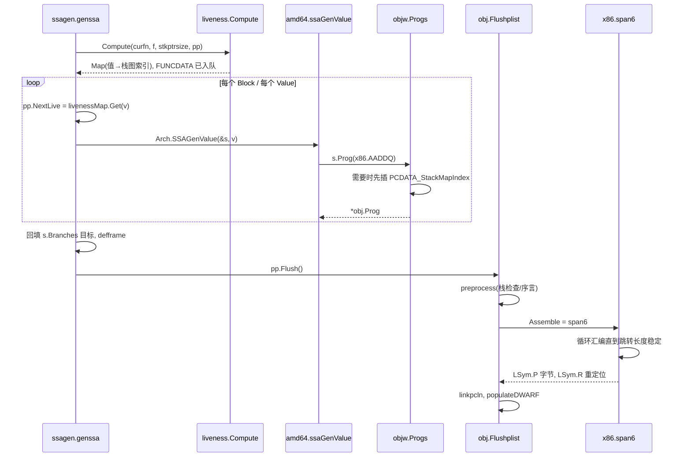

# Go 源码实现详解（五）：编译器后端——SSA、优化与代码生成

## 引言：一句话说清后端

上一篇讲完了前端（语法树、类型检查、walk）之后，`cmd/compile` 手里拿到的是一棵已经"去糖"的 `ir.Func`。后端的工作可以压缩成一句话：

> **把 `ir.Func` 翻译成一张 SSA 图，用几十个 pass 反复改写它，最后把每个 `Value` 变成 0 或 1 条机器指令，再交给 `cmd/internal/obj` 汇编成字节。**

这句话在源码里对应四个入口：

| 阶段 | 入口函数 | 所在文件 |
|---|---|---|
| IR → SSA | `buildssa` | `src/cmd/compile/internal/ssagen/ssa.go` |
| SSA 优化与 lower | `ssacompile.Compiler.Compile` | `src/cmd/compile/internal/ssacompile/compile.go` |
| SSA → `obj.Prog` | `genssa` | `src/cmd/compile/internal/ssagen/ssa.go` |
| `obj.Prog` → 机器码 | `obj.Flushplist` / `x86.span6` | `src/cmd/internal/obj/plist.go`、`src/cmd/internal/obj/x86/asm6.go` |

先给出几条读完全文后应当能复述的结论：

1. **Go 的 SSA 构建不做经典的"支配边界 + phi 插入"预计算**。`ssagen` 在遇到跨块使用的变量时先放一个占位的 `OpFwdRef`，函数体翻译完后由 `ssagen/phi.go` 的 `insertPhis` 统一解析：小函数（≤500 块）用 Braun 等人的算法，大函数用 Sreedhar & Gao；随后 `ssacompile` 的第一个优化 pass `early phielim and copyelim` 再把退化成单来源的 phi 消掉。
2. **优化 pass 是一张固定顺序的表**（`ssacompile/compile.go` 中的 `passes` 数组），配合 `passOrder` 约束在 `init()` 里自检；`-N` 时只跑 `Required: true` 的 pass。
3. **架构相关的改写不是手写的**：`ssa/_gen/*.rules` 里的 S 表达式规则由 `rulegen.go` 生成为 `ssa/rewrite/<arch>/rewrite<ARCH>.go`，`lower` pass 只是循环调用这些生成函数直到不动点。
4. **寄存器分配是线性扫描的变体**：把整个函数当成一条长基本块贪心分配，溢出时踢掉"下次使用最远"的值，合流边由 `shuffle` 补搬运代码；栈槽分配（`stackalloc`）是它的子步骤。
5. **`genssa` 和 `cmd/internal/obj` 之间的接口是 `obj.Prog` 链表**；GC 安全点的栈图（stack map）由 `liveness` 包计算，以 `PCDATA`/`FUNCDATA` 伪指令的形式夹在 `Prog` 流里。
6. **这个版本（Go 1.28 开发版）刚完成一次大规模包拆分**：以前一个 `ssa` 包里的东西被拆成 `ssa`（核心 IR）、`ssa/ssaop`（Op 表）、`ssa/block`（块类型）、`ssa/rewrite/<arch>`（生成的规则）、`ssacompile`（全部 pass 与 regalloc）等。读旧资料时要注意函数搬了家。

下面按数据流的顺序展开。

## 一、后端的入口与包结构

### 1.1 从 `compileFunctions` 到 `ssagen.Compile`

`cmd/compile/internal/gc/compile.go` 的 `compileFunctions` 用 `-c` 指定的 worker 数并发编译函数队列，每个 worker 调用：

```go
// src/cmd/compile/internal/gc/compile.go, compileFunctions
	for workerId := range base.Flag.LowerC {
		wg.Go(func() {
			// ...
				fn := compilequeue[len(compilequeue)-1]
				compilequeue = compilequeue[:len(compilequeue)-1]
				// ...
				ssagen.Compile(ssacompile.Compiler{}, fn, workerId, profile)
			// ...
		})
	}
	// ...
	ssacompile.PostCompile()
```

`ssagen.Compile` 把三步串起来：

```go
// src/cmd/compile/internal/ssagen/pgen.go, Compile
func Compile(ssacompiler ssa.Compiler, fn *ir.Func, worker int, profile *pgoir.Profile) {
	f, htmlWriter := buildssa(ssacompiler, fn, worker, inline.IsPgoHotFunc(fn, profile) || inline.HasPgoHotInline(fn))
	// Note: check arg size to fix issue 25507.
	if f.Frontend().(*ssafn).stksize >= maxStackSize || f.OwnAux.ArgWidth() >= maxStackSize {
		// ...
		return
	}
	pp := objw.NewProgs(fn, worker)
	defer pp.Free()
	genssa(htmlWriter, f, pp)
	// ...
	pp.Flush() // assemble, fill in boilerplate, etc.
```

注意第一个参数 `ssa.Compiler` 是一个接口：

```go
// src/cmd/compile/internal/ssa/compile.go
type Compiler interface {
	Compile(f *Func, htmlWriter HTMLWriter)
	Passes() []Pass
}
```

它的唯一实现是 `ssacompile.Compiler{}`。这样设计的目的就是让核心 IR 包 `ssa` 不再依赖庞大的 pass 代码，反过来 `ssacompile` 依赖 `ssa`。

### 1.2 拆分后的包布局

这是与 Go 1.25 及更早版本最显著的差异。`ssa/_gen/main.go` 里甚至保留了拆分的"阶段开关"：

```go
// src/cmd/compile/internal/ssa/_gen/main.go
var splitPhase = phase6Rewrites
// ...
func rewritesDir(arch, suff string) string {
	if splitPhase < phase6Rewrites {
		return splitRewritesDir
	}
	return "rewrite/" + rewritesPkg(arch, suff) + "/"
}
```

当前各包的职责：

| 包 | 内容 |
|---|---|
| `ssa` | `Func`/`Block`/`Value`、支配树、循环嵌套、`Cache`、`Config`、poset、`stackalloc.go` 的核心状态、`copyelim.go` 的 `PhiElimValue` |
| `ssa/ssaop` | `Op` 枚举、`OpInfo`/`RegInfo`、生成的 `opGen.go`、128 位 `RegMask` |
| `ssa/block` | `BlockKind` 枚举（生成） |
| `ssa/ssabase` | `Register`、`Location` 等最底层类型 |
| `ssa/ssaconfig` | `-d=ssa/build/...`、`-d=ssa/intrinsics/...` 等调试变量 |
| `ssa/ssadebug` | DWARF 位置列表（`FuncDebug`、`BuildFuncDebug`） |
| `ssa/ssahtml` | `GOSSAFUNC` 产出的 `ssa.html` |
| `ssa/rewrite/<arch>` | `rulegen` 生成的 `RewriteValue`/`RewriteBlock` |
| `ssacompile` | `passes` 表、全部优化 pass、`regalloc.go`、`config.go`（把各架构的 rewrite 函数塞进 `Config`） |
| `ssagen` | `buildssa`、`genssa`、`phi.go`、intrinsics、ABI wrapper |
| `<arch>`（如 `amd64`） | `ssaGenValue`/`ssaGenBlock`：把 lower 后的 `Value` 变成 `obj.Prog` |

下图是整条流水线：

```mermaid
flowchart LR
    IR["ir.Func\n(前端产物)"] --> B["ssagen.buildssa\nFwdRef → insertPhis"]
    B --> C["ssacompile.Compiler.Compile\npasses 数组 60+ 个 pass"]
    C --> L["lower / late lower\nssa/rewrite/amd64"]
    L --> R["schedule → flagalloc → regalloc\n(含 stackalloc)"]
    R --> G["ssagen.genssa\nliveness.Compute + Arch.SSAGenValue"]
    G --> P["obj.Prog 链表\n+ PCDATA/FUNCDATA"]
    P --> A["obj.Flushplist\npreprocess → span6 → linkpcln → DWARF"]
    A --> O["LSym.P 字节\n→ 目标文件"]
```



## 二、SSA 的数据结构

### 2.1 `Func`、`Block`、`Value`

三者都在 `src/cmd/compile/internal/ssa/` 下。`Func` 是一个函数的全部状态：

```go
// src/cmd/compile/internal/ssa/func.go
type Func struct {
	Config *Config     // architecture information
	Cache  *Cache      // re-usable cache
	Fe     Frontend    // frontend state associated with this Func, callbacks into compiler frontend
	Pass   *Pass       // current pass information (name, options, etc.)
	Name   string      // e.g. NewFunc or (*Func).NumBlocks (no package prefix)
	Type   *types.Type // type signature of the function.
	Blocks []*Block    // unordered set of all basic blocks (note: not indexable by ID)
	Entry  *Block      // the entry basic block

	bid IDAlloc // block ID allocator
	vid IDAlloc // value ID allocator
	// ...
	ABI0       *abi.ABIConfig // ABI configuration for ABI0
	ABI1       *abi.ABIConfig // ABI configuration for ABIInternal
	ABISelf    *abi.ABIConfig // ABI for function being compiled
	// ...
	Scheduled   bool  // Values in Blocks are in final order
	Laidout     bool  // Blocks are ordered
	// ...
	// when register allocation is done, maps value ids to locations
	RegAlloc []Location
	// ...
	NamedValues map[LocalSlot][]*Value
	Names []LocalSlot
	// ...
	FreeValues *Value // free Values linked by argstorage[0].  All other fields except ID are 0/nil.
	FreeBlocks *Block // free Blocks linked by succstorage[0].b.  All other fields except ID are 0/nil.

	cachedPostorder  []*Block   // cached postorder traversal
	cachedIdom       []*Block   // cached immediate dominators
	cachedSdom       SparseTree // cached dominator tree
	cachedLoopnest   *LoopNest  // cached loop nest information
	// ...
}
```

几个值得注意的字段：`Scheduled`/`Laidout` 是两个"阶段标志"，分别在 `schedule` 和 `layout` pass 之后置位，它们决定 `b.Values` 与 `f.Blocks` 的顺序是否有意义；`RegAlloc` 在寄存器分配后按 `Value.ID` 索引给出每个值的位置（寄存器或栈槽）；`FreeValues`/`FreeBlocks` 是侵入式空闲链表，与 `Cache` 一起让同一个 worker 反复编译函数时几乎不分配内存。

`Block` 的核心是前驱/后继边、控制值和值列表：

```go
// src/cmd/compile/internal/ssa/block.go
type Block struct {
	ID ID
	Pos src.XPos
	CPUfeatures CPUfeatures
	Kind block.BlockKind
	Likely BranchPrediction
	FlagsLiveAtEnd bool
	Hotness Hotness
	Succs []Edge
	Preds []Edge
	// Controls[1] must be nil if Controls[0] is nil.
	Controls [2]*Value
	Aux    Aux
	AuxInt int64
	Values []*Value
	Func *Func
	// Storage for Succs, Preds and Values.
	Succstorage [2]Edge
	Predstorage [4]Edge
	Valstorage  [9]*Value
}

type Edge struct {
	// block edge goes to (in a Succs list) or from (in a Preds list)
	B *Block
	// index of reverse edge.  Invariant:
	//   e := x.Succs[idx]
	//   e.b.Preds[e.I] = Edge{x,idx}
	// and similarly for predecessors.
	I int
}
```

`Edge.I` 这个"反向边下标"是 phi 正确性的关键——phi 的第 i 个参数对应 `Preds[i]`，增删边时必须同步维护。`Kind` 现在是独立包 `ssa/block` 里的 `BlockKind`，通用的几种是 `BlockPlain`、`BlockIf`、`BlockDefer`、`BlockRet`、`BlockRetJmp`、`BlockExit`、`BlockJumpTable`、`BlockFirst`，其余如 `BlockAMD64EQ` 是 lower 后的架构块。

`Value` 则很小：

```go
// src/cmd/compile/internal/ssa/value.go
type Value struct {
	ID ID
	Op ssaop.Op
	Type *types.Type
	AuxInt int64
	Aux    Aux
	Args []*Value
	Block *Block
	Pos src.XPos
	// Use count. Each appearance in Value.Args and Block.Controls counts once.
	Uses int32
	OnWasmStack bool
	InCache bool
	// Storage for the first three args
	Argstorage [3]*Value
}
```

`AuxInt`/`Aux` 是 Op 相关的附加信息（常量、符号偏移、调用描述 `*AuxCall` 等）；`Uses` 是引用计数，`deadcode` 与规则重写的 `RemoveDeadValues` 都依赖它。

### 2.2 `Op` 与 `OpInfo`

每个 `Op` 在 `ssa/ssaop/opGen.go` 的 `OpcodeTable` 里有一条 `OpInfo`：

```go
// src/cmd/compile/internal/ssa/ssaop/op.go
type OpInfo struct {
	Name              string
	Reg               RegInfo
	AuxType           AuxType
	ArgLen            int32 // the number of arguments, -1 if variable length
	asm               obj.As
	Generic           bool      // this is a generic (arch-independent) opcode
	Rematerializeable bool      // this op is rematerializeable
	Commutative       bool      // this operation is commutative (e.g. addition)
	ResultInArg0      bool      // (first, if a tuple) output of v and v.Args[0] must be allocated to the same register
	ResultNotInArgs   bool      // outputs must not be allocated to the same registers as inputs
	ClobberFlags      bool      // this op clobbers flags register
	NeedIntTemp       bool      // need a temporary free integer register
	Call              bool      // is a function call
	// ...
	NilCheck          bool      // this op is a nil check on arg0
	FaultOnNilArg0    bool      // this op will fault if arg0 is nil (and aux encodes a small offset)
	// ...
	ZeroWidth         bool      // op never translates into any machine code. example: copy, which may sometimes translate to machine code, is not zero-width.
	// ...
	ZeroUpperBits     uint8     // the op writes a 64-bit GPR whose upper N bits are always zero (0, 32, 48 or 56); for a tuple op, this holds for every integer result
}

type RegInfo struct {
	Inputs []InputInfo
	Clobbers RegMask
	ClobbersArg0 bool
	ClobbersArg1 bool
	Outputs []OutputInfo
}
```

`RegInfo` 是寄存器分配器唯一读取的"约束表"，`Inputs` 按"最受限的先分配"排序。另一个版本差异：`RegMask` 已经不是 `uint64`，而是 `ssa/ssaop/regmask.go` 里的 `struct{ V1, V2 uint64 }`，为的是容纳 SIMD/SVE 扩展的寄存器集合。

## 三、SSA 构建：`buildssa` 与 FwdRef

### 3.1 `state` 与基本流程

`buildssa` 创建一个 `state`，它就是"翻译器当前的上下文"：

```go
// src/cmd/compile/internal/ssagen/ssa.go
type state struct {
	config *ssa.Config
	f *ssa.Func
	curfn *ir.Func
	labels map[string]*ssaLabel
	breakTo    *ssa.Block // current target for plain break statement
	continueTo *ssa.Block // current target for plain continue statement
	// current location where we're interpreting the AST
	curBlock *ssa.Block
	// variable assignments in the current block (map from variable symbol to ssa value)
	vars map[ir.Node]*ssa.Value
	// fwdVars are variables that are used before they are defined in the current block.
	// This map exists just to coalesce multiple references into a single FwdRef op.
	fwdVars map[ir.Node]*ssa.Value
	// all defined variables at the end of each block. Indexed by block ID.
	defvars []map[ir.Node]*ssa.Value
	decladdrs map[*ir.Name]*ssa.Value
	startmem *ssa.Value
	sp       *ssa.Value
	sb       *ssa.Value
	// ...
	hasOpenDefers       bool // whether we are doing open-coded defers
	// ...
}
```

`buildssa` 本身的骨架（删去 GOSSAFUNC 匹配、open-coded defer 判定等细节）：

```go
// src/cmd/compile/internal/ssagen/ssa.go, buildssa
	s.f = ssaConfig.NewFunc(&fe, cache)
	// ...
	s.f.ABISelf = abiSelf
	// Allocate starting block
	s.f.Entry = s.f.NewBlock(block.BlockPlain)
	// ...
	s.startmem = s.entryNewValue0(ssaop.OpInitMem, types.TypeMem)
	// ...
	s.sp = s.entryNewValue0(ssaop.OpSP, types.Types[types.TUINTPTR])
	s.sb = s.entryNewValue0(ssaop.OpSB, types.Types[types.TUINTPTR])

	s.startBlock(s.f.Entry)
	s.vars[memVar] = s.startmem
	// ...
	params = s.f.ABISelf.ABIAnalyze(fn.Type(), true)
	// ...
	// Populate SSAable arguments.
	for _, n := range fn.Dcl {
		if n.Class == ir.PPARAM {
			if s.canSSA(n) {
				v := s.newValue0A(ssaop.OpArg, n.Type(), n)
				s.vars[n] = v
				s.addNamedValue(n, v)
			} else { // address was taken AND/OR too large for SSA
				// ...
			}
		}
	}
	// ...
	s.stmtList(fn.Body)
	// ...
	s.insertPhis()
	// Main call to ssa package to compile function
	compiler.Compile(s.f, htmlWriter)
	fe.AllocFrame(s.f)
```

三个"起始值"值得记住：`OpInitMem` 是内存状态链的起点，`OpSP`/`OpSB` 分别代表栈指针和静态基址——所有对局部变量和全局变量的寻址都以它们为根。**内存在 Go SSA 里被当作一个显式的值**（类型 `types.TypeMem`），每个 store/call 都消费一个内存值并产生新的内存值，这条"内存链"就是后续 `dse`、`writebarrier`、`schedule` 保序的依据。

### 3.2 语句与表达式的翻译

`stmt` 和 `expr` 是两个巨大的 `switch n.Op()`。`stmt` 的入口：

```go
// src/cmd/compile/internal/ssagen/ssa.go, (*state).stmt
func (s *state) stmt(n ir.Node) {
	s.pushLine(n.Pos())
	defer s.popLine()

	// If s.curBlock is nil, and n isn't a label (which might have an associated goto somewhere),
	// then this code is dead. Stop here.
	if s.curBlock == nil && n.Op() != ir.OLABEL {
		return
	}

	s.stmtList(n.Init())
	switch n.Op() {
	// ...
```

`if` 语句是理解 CFG 构造方式的最佳样本：

```go
// src/cmd/compile/internal/ssagen/ssa.go, (*state).stmt, case ir.OIF
		bEnd := s.f.NewBlock(block.BlockPlain)
		// ...
		var bThen *ssa.Block
		if len(n.Body) != 0 {
			bThen = s.f.NewBlock(block.BlockPlain)
		} else {
			bThen = bEnd
		}
		var bElse *ssa.Block
		if len(n.Else) != 0 {
			bElse = s.f.NewBlock(block.BlockPlain)
		} else {
			bElse = bEnd
		}
		s.condBranch(n.Cond, bThen, bElse, likely)

		if len(n.Body) != 0 {
			s.startBlock(bThen)
			s.stmtList(n.Body)
			if b := s.endBlock(); b != nil {
				b.AddEdgeTo(bEnd)
			}
		}
		// ... bElse 同理 ...
		s.startBlock(bEnd)
```

`condBranch` 对 `&&`/`||` 会递归拆成多个中间块，这就是"短路求值"在 SSA 层的实现；后面的 `shortcircuit` pass 再把其中冗余的跳转折叠掉。

`startBlock`/`endBlock` 维护着"当前块的变量表"：

```go
// src/cmd/compile/internal/ssagen/ssa.go
func (s *state) startBlock(b *ssa.Block) {
	if s.curBlock != nil {
		s.Fatalf("starting block %v when block %v has not ended", b, s.curBlock)
	}
	s.curBlock = b
	s.vars = map[ir.Node]*ssa.Value{}
	clear(s.fwdVars)
	// ...
}

func (s *state) endBlock() *ssa.Block {
	b := s.curBlock
	if b == nil {
		return nil
	}
	s.flushPendingHeapAllocations()
	for len(s.defvars) <= int(b.ID) {
		s.defvars = append(s.defvars, nil)
	}
	s.defvars[b.ID] = s.vars
	s.curBlock = nil
	s.vars = nil
	// ...
```

每个块结束时把 `s.vars`（"块末尾每个变量最新的定义"）存进 `s.defvars[b.ID]`，这张表就是稍后 phi 插入的输入。赋值语句的效果非常直接——`assign` 对可 SSA 化的变量只做一件事：`s.vars[left] = right`。

### 3.3 FwdRef：延后到最后再决定要不要 phi

当表达式读取变量时，走 `variable`：

```go
// src/cmd/compile/internal/ssagen/ssa.go, (*state).variable
func (s *state) variable(n ir.Node, t *types.Type) *ssa.Value {
	v := s.vars[n]
	if v != nil {
		return v
	}
	v = s.fwdVars[n]
	if v != nil {
		return v
	}

	if s.curBlock == s.f.Entry {
		// No variable should be live at entry.
		s.f.Fatalf("value %v (%v) incorrectly live at entry", n, v)
	}
	// Make a FwdRef, which records a value that's live on block input.
	// We'll find the matching definition as part of insertPhis.
	v = s.newValue0A(ssaop.OpFwdRef, t, fwdRefAux{N: n})
	s.fwdVars[n] = v
	if n.Op() == ir.ONAME {
		s.addNamedValue(n.(*ir.Name), v)
	}
	return v
}

func (s *state) mem() *ssa.Value {
	return s.variable(memVar, types.TypeMem)
}
```

**内存也是一个"变量"**（`memVar`），所以跨块的内存链同样通过 FwdRef 与 phi 合流。当前块里找不到定义时，不做任何支配关系分析，只丢一个 `OpFwdRef` 占位。

函数体全部翻译完后，`insertPhis` 才登场：

```go
// src/cmd/compile/internal/ssagen/phi.go
// This file contains the algorithm to place phi nodes in a function.
// For small functions, we use Braun, Buchwald, Hack, Leißa, Mallon, and Zwinkau.
// https://pp.info.uni-karlsruhe.de/uploads/publikationen/braun13cc.pdf
// For large functions, we use Sreedhar & Gao: A Linear Time Algorithm for Placing Φ-Nodes.

const smallBlocks = 500

func (s *state) insertPhis() {
	if len(s.f.Blocks) <= smallBlocks {
		sps := simplePhiState{s: s, f: s.f, defvars: s.defvars}
		sps.insertPhis()
		return
	}
	ps := phiState{s: s, f: s.f, defvars: s.defvars}
	ps.insertPhis()
}
```

小函数路径 `simplePhiState.insertPhis` 就是 Braun 算法的"按需查找"：对每个 FwdRef，沿每个前驱向上查找变量的出口值（`lookupVarOutgoing`），如果所有前驱给出的都是同一个值就不需要 phi，否则把这个 FwdRef 原地改成 `OpPhi`：

```go
// src/cmd/compile/internal/ssagen/phi.go, (*simplePhiState).insertPhis
		// Find variable value on each predecessor.
		args = args[:0]
		for _, e := range b.Preds {
			args = append(args, s.lookupVarOutgoing(e.Block(), v.Type, var_, v.Pos))
		}

		// Decide if we need a phi or not. We need a phi if there
		// are two different args (which are both not v).
		var w *ssa.Value
		for _, a := range args {
			if a == v {
				continue // self-reference
			}
			if a == w {
				continue // already have this witness
			}
			if w != nil {
				// two witnesses, need a phi value
				v.Op = ssaop.OpPhi
				v.AddArgs(args...)
				v.Aux = nil
				v.Pos = s.s.blockStarts[b.ID]
				continue loop
			}
			w = a // save witness
		}
```

大函数路径 `phiState.insertPhis` 先按变量编号，用 Sreedhar & Gao 的迭代支配边界算法一次性算出所有 phi 位置（`insertVarPhis`），再用 `resolveFwdRefs` 做一遍支配树遍历把 FwdRef 换成正确的定义。两条路径的产物一样：图里不再有 `OpFwdRef`，但可能留下参数全相同的"平凡 phi"和 `OpCopy`。

### 3.4 phielim 与 copyelim：SSA 构建的收尾

清理平凡 phi 的工作不在 `ssagen`，而是 `ssacompile` 的第一个可选 pass：

```go
// src/cmd/compile/internal/ssacompile/copyelim.go
// combine copyelim and phielim into a single pass.
// copyelim removes all uses of OpCopy values from f.
// A subsequent deadcode pass is needed to actually remove the copies.
func copyelim(f *ssa.Func) {
	phielim(f)
	// loop of copyelimValue(v) process has been done in phielim() pass.
	// Update block control values.
	for _, b := range f.Blocks {
		for i, v := range b.ControlValues() {
			if v.Op == ssaop.OpCopy {
				b.ReplaceControl(i, v.Args[0])
			}
		}
	}
	// ...
}

func phielim(f *ssa.Func) {
	for {
		change := false
		for _, b := range f.Blocks {
			for _, v := range b.Values {
				// ...
				copyelimValue(v)
				change = ssa.PhiElimValue(v) || change
			}
		}
		if !change {
			break
		}
	}
}
```

`ssa.PhiElimValue`（在 `ssa/copyelim.go`）判断 phi 的参数去掉自引用后是否只剩一个"证人"，是则把它改成 `OpCopy`。所以"Go 用 FwdRef + 后续 phi 消除"这个说法要落实到三处代码：`ssagen/ssa.go` 造 FwdRef，`ssagen/phi.go` 解析成 phi，`ssacompile/copyelim.go` + `ssa/copyelim.go` 消掉多余的 phi。这个版本里没有独立的 `phielim` pass，也没有 `ssa/phi.go` 文件——phi 相关逻辑全在 `ssagen/phi.go`。

## 四、优化 pass 流水线

### 4.1 `Compile` 的驱动循环

```go
// src/cmd/compile/internal/ssacompile/compile.go, (Compiler).Compile
	var p ssa.Pass
	for _, p = range passes {
		if !f.Config.Optimize && !p.Required || p.Disabled {
			continue
		}
		f.Pass = &p
		f.HTMLWriter = htmlWriter
		phaseName = p.Name
		// ...
		if checkEnabled && !f.Scheduled {
			// Test that we don't depend on the value order, by randomizing
			// the order of values in each block. See issue 18169.
			for _, b := range f.Blocks {
				for i := 0; i < len(b.Values)-1; i++ {
					j := i + rnd.Intn(len(b.Values)-i)
					b.Values[i], b.Values[j] = b.Values[j], b.Values[i]
				}
			}
		}

		tStart := time.Now()
		p.Fn(f)
		tEnd := time.Now()
		// ...
		htmlWriter.WritePhase(phaseName, ...)
		// ...
		if checkEnabled {
			checkFunc(f)
		}
	}
```

三点：`-N`（`Config.Optimize == false`）只运行 `Required` 的 pass；`-d=ssa/check/on` 时每个 pass 后都跑 `checkFunc` 校验不变量，并且在 `schedule` 之前**随机打乱每个块的 `Values` 顺序**，用来抓"依赖值顺序"的 bug；每个 pass 后向 `ssa.html` 写一列。

### 4.2 `passes` 表与 `passOrder`

完整的表（`ssacompile/compile.go`）：

```go
// src/cmd/compile/internal/ssacompile/compile.go
var passes = [...]ssa.Pass{
	{Name: "number lines", Fn: numberLines, Required: true},
	{Name: "early phielim and copyelim", Fn: copyelim},
	{Name: "early deadcode", Fn: deadcode},
	{Name: "short circuit", Fn: shortcircuit},
	{Name: "decompose user", Fn: decomposeUser, Required: true},
	{Name: "pre-opt deadcode", Fn: deadcode},
	{Name: "opt", Fn: opt, Required: true},
	{Name: "zero arg cse", Fn: zcse, Required: true},
	{Name: "opt deadcode", Fn: deadcode, Required: true},
	{Name: "generic cse", Fn: cse},
	{Name: "phiopt", Fn: phiopt},
	{Name: "gcse deadcode", Fn: deadcode, Required: true},
	{Name: "nilcheckelim", Fn: nilcheckelim},
	{Name: "prove", Fn: prove},
	{Name: "divisible", Fn: divisiblePass, Required: true},
	{Name: "divmod", Fn: divmodPass, Required: true},
	{Name: "middle opt", Fn: opt, Required: true},
	{Name: "known bits", Fn: ssa.KnownBits},
	{Name: "early fuse", Fn: fuseEarly},
	{Name: "expand calls", Fn: expandCalls, Required: true},
	{Name: "decompose builtin", Fn: postExpandCallsDecompose, Required: true},
	{Name: "softfloat", Fn: softfloat, Required: true},
	{Name: "branchelim", Fn: branchelim},
	{Name: "late opt", Fn: opt, Required: true},
	{Name: "dead auto elim", Fn: elimDeadAutosGeneric},
	{Name: "sccp", Fn: sccp},
	{Name: "generic deadcode", Fn: deadcode, Required: true},
	{Name: "late fuse", Fn: fuseLate},
	{Name: "check bce", Fn: checkbce},
	{Name: "dse", Fn: dse},
	{Name: "memcombine", Fn: memcombine},
	{Name: "writebarrier", Fn: writebarrier, Required: true},
	{Name: "insert resched checks", Fn: insertLoopReschedChecks,
		Disabled: !buildcfg.Experiment.PreemptibleLoops},
	{Name: "cpufeatures", Fn: cpufeatures, Required: buildcfg.Experiment.SIMD, Disabled: !buildcfg.Experiment.SIMD},
	{Name: "rewrite tern", Fn: rewriteTern, Required: false, Disabled: !buildcfg.Experiment.SIMD},
	{Name: "lower", Fn: lower, Required: true},
	{Name: "addressing modes", Fn: addressingModes, Required: false},
	{Name: "late lower", Fn: lateLower, Required: true},
	{Name: "pair", Fn: pair},
	{Name: "lowered deadcode for cse", Fn: deadcode},
	{Name: "lowered cse", Fn: cse},
	{Name: "elim unread autos", Fn: elimUnreadAutos},
	{Name: "tighten tuple selectors", Fn: tightenTupleSelectors, Required: true},
	{Name: "lowered deadcode", Fn: deadcode, Required: true},
	{Name: "checkLower", Fn: checkLower, Required: true},
	{Name: "loop invariant", Fn: licm},
	{Name: "late phielim and copyelim", Fn: copyelim},
	{Name: "tighten", Fn: tighten, Required: true},
	{Name: "late deadcode", Fn: deadcode},
	{Name: "critical", Fn: critical, Required: true},
	{Name: "phi tighten", Fn: phiTighten},
	{Name: "likelyadjust", Fn: likelyadjust},
	{Name: "layout", Fn: layout, Required: true},
	{Name: "schedule", Fn: schedule, Required: true},
	{Name: "late nilcheck", Fn: nilcheckelim2},
	{Name: "flagalloc", Fn: flagalloc, Required: true},
	{Name: "regalloc", Fn: regalloc, Required: true},
	{Name: "loop rotate", Fn: loopRotate},
	{Name: "trim", Fn: trim},
}
```

相比 Go 1.24/1.25，新增了 `divisible`/`divmod`（把除法规则从 generic.rules 拆到独立的 `divisible.rules`/`divmod.rules`）、`middle opt`、`known bits`、`sccp`、`pair`、`loop invariant`（licm）、`phi tighten`，以及 SIMD 实验相关的 `cpufeatures`/`rewrite tern`；`merge conditional branches` 因 issue 80102 暂时被注释掉。

`passOrder` 不改变顺序，只在 `init()` 里校验顺序，把"为什么 A 必须在 B 前"写成代码：

```go
// src/cmd/compile/internal/ssacompile/compile.go
var passOrder = [...]constraint{
	// prove relies on common-subexpression elimination for maximum benefits.
	{"generic cse", "prove"},
	// deadcode after prove to eliminate all new dead blocks.
	{"prove", "generic deadcode"},
	// cse substantially improves nilcheckelim efficacy
	{"generic cse", "nilcheckelim"},
	// nilcheckelim relies on the first opt to rewrite user nil checks
	{"opt", "nilcheckelim"},
	// ...
	// regalloc requires the removal of all critical edges
	{"critical", "regalloc"},
	// regalloc requires all the values in a block to be scheduled
	{"schedule", "regalloc"},
	// flagalloc needs instructions to be scheduled.
	{"schedule", "flagalloc"},
	// regalloc needs flags to be allocated first.
	{"flagalloc", "regalloc"},
	// loopRotate will confuse regalloc.
	{"regalloc", "loop rotate"},
	// ...
}

func init() {
	for _, c := range passOrder {
		// ... 找到 a、b 的下标 i、j ...
		if i >= j {
			log.Panicf("passes %s and %s out of order", a, b)
		}
	}
}
```

### 4.3 关键 pass 速览

按表中顺序，逐个用一句话说清它做什么、在哪个文件：

- **number lines**（`numberlines.go`）：为每条语句选一个"好的"起始 `Value` 打上 `IsStmt` 标记，是调试信息行号的基础，`Required`。
- **early/late phielim and copyelim**（`copyelim.go`）：见 3.4。
- **deadcode**（`deadcode.go`）：先 `ssa.ReachableBlocks` 找可达块，删掉从死块到活块的边（同步删 phi 参数），再从块控制值和有副作用的值出发反向标记活值，其余回收。这个 pass 在表里出现了 9 次。
- **short circuit**（`shortcircuit.go`）：`If` 块的控制值是一个含 `ConstBool` 参数的 phi 时，让对应前驱直接跳到最终目标。
- **decompose user / decompose builtin**（`decompose.go`）：把 string、slice、interface、complex 以及用户结构体/数组类型的 phi 拆成标量 phi，然后靠 `dec.rules`/`dec64.rules` 生成的规则拆其余操作。这就是题目所说的 "dec"。
- **opt / middle opt / late opt**（`opt.go`）：调用 `generic.RewriteValue`/`generic.RewriteBlock`，即 `generic.rules` 的全部规则，三次分别运行在不同阶段。
- **zero arg cse / generic cse / lowered cse**（`zcse.go`、`cse.go`）：cse 用"划分细化"法——先按 op/type/aux/auxint/argLen 粗分等价类，再迭代按参数所在等价类细分直到不动点；只重链接，不删除。
- **phiopt**（`phiopt.go`）：`x = b ? true : false` 形式的布尔 phi 直接替换成 `b`。
- **nilcheckelim**（`nilcheck.go`）：沿支配树 DFS，维护 `nonNilValues`，被支配块里对同一指针的重复 `OpNilCheck` 删除。
- **prove**（`prove.go`）：见 4.4。
- **divisible / divmod**：由 `divisible.rules`、`divmod.rules` 生成，把 `x % c == 0` 和常量除法改写成乘法/移位；放在 prove 之后是为了让 prove 先分析原始的 div/mod。
- **known bits**（`ssa/known_bits.go`）：跨位域的常量折叠。
- **early fuse / late fuse**（`fuse.go`）：合并平凡的相邻块；late 版本还做 `fuseTypeIf`（两个空分支汇合到同一个后继时删掉分支）。
- **expand calls**（`expand_calls.go`）：按 ABI 把聚合类型的参数/返回值拆成寄存器和栈槽（`OpArgIntReg`、`OpSelectN`、`OpMakeResult` 等），是寄存器 ABI 的核心实现，见第七节。
- **softfloat**（`softfloat.go`）：`Config.SoftFloat` 时把浮点 op 改成运行时调用。
- **branchelim**（`branchelim.go`）：菱形 CFG 且中间块无副作用时，把 phi 改写成 `OpCondSelect`（后续 lower 成 `CMOV`）。
- **sccp**（`sccp.go`）：Wegman–Zadeck 的稀疏条件常量传播，三层格 Top/Constant/Bottom。
- **dse**（`deadstore.go`）：块内死存储消除——被后续对同一位置的 store 无条件覆盖且中间无 load 的 store 删除。
- **memcombine**（`memcombine.go`）：把相邻的小 load/store 合并成大的（`encoding/binary` 风格代码受益最大）。
- **writebarrier**（`writebarrier.go`）：见 4.5。
- **insert resched checks**（`loopreschedchecks.go`）：在回边插入"SP 与 g 的栈界比较"的抢占检查，默认关闭（`Experiment.PreemptibleLoops`），因为 Go 1.14 后采用了异步抢占。
- **lower / late lower / checkLower**（`lower.go`）：见第五节。
- **addressing modes**（`addressingmodes.go`）：把地址计算折进访存指令（x86 的 base+index*scale+disp）。
- **tighten**（`tighten.go`）：把值移到尽量靠近使用者的块，减少寄存器压力；**phi tighten** 把可重物化的 phi 参数移到前驱末尾。
- **critical**（`critical.go`）：拆分关键边（前驱多后继、后继多前驱），regalloc 依赖这一点在合流边上插补丁代码。
- **likelyadjust / layout**（`likelyadjust.go`、`layout.go`）：前者估计分支概率，后者用带 LIFO 的深度优先拓扑排序决定块顺序以减少跳转。
- **schedule**（`schedule.go`）：见 4.6。
- **late nilcheck**（`nilcheck.go` 的 `nilcheckelim2`）：lower 后块内反向扫描，如果紧接着有 `FaultOnNilArg0` 的访存指令，显式的 nil check 就删掉——"让缺页错误替我们检查"。
- **flagalloc**（`flagalloc.go`）：条件码只有一个寄存器，这个 pass 决定块末尾希望留在 flags 里的值，需要时重算而不是保存/恢复。
- **regalloc**（`regalloc.go`）：见第六节。
- **loop rotate**（`looprotate.go`）：把"顶部判断"的循环改成"底部判断"，省一条跳转；必须在 regalloc 之后，因为它会打乱 regalloc 依赖的块顺序假设。
- **trim**（`trim.go`）：删除 `critical` 插入后变成空的块。
- **check**（`check.go` 的 `checkFunc`）：不是表中的 pass，由 `-d=ssa/check/on` 在每个 pass 后触发，校验边的对称性、phi 参数数目、支配关系、类型等几十条不变量。

### 4.4 prove：边界检查消除的核心

`prove` 是 Go 编译器里最复杂的通用 pass（2850 行）。它的状态是一张"事实表"：

```go
// src/cmd/compile/internal/ssacompile/prove.go
type factsTable struct {
	unsat      bool // true if facts contains a contradiction
	unsatDepth int  // number of unsat checkpoints

	// order* is a couple of partial order sets that record information
	// about relations between SSA values in the signed and unsigned
	// domain.
	orderS *ssa.Poset
	orderU *ssa.Poset
	// ...
	// known lower and upper constant bounds on individual values.
	limits       []ssa.Limit // indexed by value ID
	limitStack   []limitFact // previous entries
	// ...
	// For each slice s, a map from s to a len(s)/cap(s) value (if any)
	lens map[ssa.ID]*ssa.Value
	caps map[ssa.ID]*ssa.Value
	// ...
}
```

`orderS`/`orderU` 是两个偏序集（`ssa/poset.go`），分别记录有符号和无符号域的大小关系；`limits` 记录每个值的常量上下界。主算法是沿支配树的 DFS，进入子块时把"从父块的哪个分支过来"翻译成事实，回溯时 `restore`：

```go
// src/cmd/compile/internal/ssacompile/prove.go, prove
		case descend:
			ft.checkpoint()
			// Entering the block, add facts about the induction variable
			// that is bound to this block.
			for _, iv := range indVars[node.block] {
				addIndVarRestrictions(ft, parent, iv)
			}
			// ...
			// Add results of reaching this block via a branch from
			// its immediate dominator (if any).
			if branch != unknown {
				addBranchRestrictions(ft, parent, branch)
			}
			if ft.unsat {
				// node.block is unreachable.
				removeBranch(parent, branch)
				ft.restore()
				break
			}
			ft.topoSortValuesInBlock(node.block)
			addSlicesOfSameLen(ft, node.block)
			for _, v := range node.block.Values {
				ft.flowLimit(v)
				ft.constantFoldArguments(v)
				ft.addValueFact(node.block, v)
				ft.simplifyValue(node.block, v)
			}
			ft.simplifyBlock(sdom, node.block)
			work = append(work, bp{block: node.block, state: restore})
			for s := sdom.Child(node.block); s != nil; s = sdom.Sibling(s) {
				work = append(work, bp{block: s, state: descend})
			}
		case restore:
			ft.restore()
```

边界检查消除就发生在 `simplifyBlock`：对 `If` 块的两条出边分别假设"走这边"，如果事实表变得不可满足（`ft.unsat`），这条分支就是不可能的，`removeBranch` 把块改成 `BlockFirst` 并去掉控制值——`IsInBounds` 的失败分支消失，边界检查就没了。`-d=ssa/prove/debug=1` 时会打印 `Proved IsInBounds`/`Disproved ...`：

```go
// src/cmd/compile/internal/ssacompile/prove.go, removeBranch
	if c != nil && b.Func.Pass.Debug > 0 {
		verb := "Proved"
		if branch == positive {
			verb = "Disproved"
		}
		if b.Func.Pass.Debug > 1 {
			b.Func.Warnl(b.Pos, "%s %s (%s)", verb, c.Op, c)
		} else {
			b.Func.Warnl(b.Pos, "%s %s", verb, c.Op)
		}
	}
	// ...
	if branch == positive || branch == negative {
		b.Kind = block.BlockFirst
		b.ResetControls()
		if branch == positive {
			b.SwapSuccessors()
		}
	}
```

归纳变量（`findIndVar`，`loopbce.go`）是另一个重要事实来源：`for i := 0; i < len(s); i++` 里的 `i` 被识别为 `[0, len(s))` 范围内的归纳变量后，循环体里的 `s[i]` 就能证明安全。

### 4.5 writebarrier：把写屏障变成一段 if

前端生成的指针存储是普通的 `OpStore`/`OpMove`/`OpZero`；`needwb` 判断目标可能在堆上且源可能是堆指针时，把它们临时改成 `OpStoreWB`/`OpMoveWB`/`OpZeroWB`。随后 `writebarrier` 把一个块里连续的 WB 存储序列切开：

```go
// src/cmd/compile/internal/ssacompile/writebarrier.go, writebarrier
		// Build branch point.
		bThen := f.NewBlock(block.BlockPlain)
		bEnd := f.NewBlock(b.Kind)
		// ...
		// set up control flow for write barrier test
		// load word, test word, avoiding partial register write from load byte.
		cfgtypes := &f.Config.Types
		flag := b.NewValue2(pos, ssaop.OpLoad, cfgtypes.UInt32, wbaddr, mem)
		flag = b.NewValue2(pos, ssaop.OpNeq32, cfgtypes.Bool, flag, const0)
		b.Kind = block.BlockIf
		b.SetControl(flag)
		b.Likely = ssa.BranchUnlikely
		b.Succs = b.Succs[:0]
		b.AddEdgeTo(bThen)
		b.AddEdgeTo(bEnd)
		bThen.AddEdgeTo(bEnd)
```

`wbaddr` 指向 `runtime.writeBarrier` 标志。`bThen` 里调用 `OpWB`（lower 后是 `runtime.gcWriteBarrierN`，最多 `maxEntries = 8` 个槽位）拿到写屏障缓冲区指针，把**新指针和目标位置的旧指针**都写进缓冲区——这就是 Go 1.8 以来的混合写屏障（Yuasa 删除 + Dijkstra 插入）在编译器侧的形状：

```go
// src/cmd/compile/internal/ssacompile/writebarrier.go, writebarrier
			// Issue a call to get a write barrier buffer.
			t := types.NewTuple(types.Types[types.TUINTPTR].PtrTo(), types.TypeMem)
			call := bThen.NewValue1I(pos, ssaop.OpWB, t, int64(len(writes)), memThen)
			curPtr := bThen.NewValue1(pos, ssaop.OpSelect0, types.Types[types.TUINTPTR].PtrTo(), call)
			memThen = bThen.NewValue1(pos, ssaop.OpSelect1, types.TypeMem, call)
			// Write each pending pointer to a slot in the buffer.
			for i, write := range writes {
				wbuf := bThen.NewValue1I(write.pos, ssaop.OpOffPtr, types.Types[types.TUINTPTR].PtrTo(), int64(i)*f.Config.PtrSize, curPtr)
				memThen = bThen.NewValue3A(write.pos, ssaop.OpStore, types.TypeMem, types.Types[types.TUINTPTR], wbuf, write.ptr, memThen)
			}
```

`bEnd` 里再执行真正的 `OpStore`，并以 `OpWBend` 结束序列，供 liveness 识别"写屏障区间不可抢占"。`OpZeroWB`/`OpMoveWB` 走的是 `runtime.wbZero`/`runtime.wbMove` 调用。

### 4.6 schedule：块内定序

`schedule` 用优先级队列给每个块内的值排序，优先级是一组常量：

```go
// src/cmd/compile/internal/ssacompile/schedule.go
const (
	ScorePhi       = iota // towards top of block
	ScoreArg              // must occur at the top of the entry block
	ScoreInitMem          // after the args - used as mark by debug info generation
	ScoreReadTuple        // must occur immediately after tuple-generating insn (or call)
	ScoreNilCheck
	ScoreMemory
	ScoreReadFlags
	ScoreDefault
	ScoreFlags
	ScoreInductionInc // an increment of an induction variable
	ScoreControl      // towards bottom of block
)
```

打分逻辑里几条硬约束：phi、`OpArgIntReg`/`OpArgFloatReg`、`LoweredGetClosurePtr` 必须在块首；`Select0/1/N` 必须紧跟产生元组的指令（调用）；产生 flags 的值尽量贴近消费者（`ScoreFlags` 靠后、`ScoreReadFlags` 靠前），配合 `flagalloc` 避免条件码被打断；内存操作按 `storeOrder` 保序。`schedule` 之后 `f.Scheduled = true`。

## 五、规则重写系统

### 5.1 规则语法

`ssa/_gen/rulegen.go` 头部的说明就是完整的语法：

```go
// src/cmd/compile/internal/ssa/_gen/rulegen.go
// rule syntax:
//  sexpr [&& extra conditions] => [@block] sexpr
//
// sexpr are s-expressions (lisp-like parenthesized groupings)
// sexpr ::= [variable:](opcode sexpr*)
//         | variable
//         | <type>
//         | [auxint]
//         | {aux}
//
// aux      ::= variable | {code}
// type     ::= variable | {code}
// variable ::= some token
// opcode   ::= one of the opcodes from the *Ops.go files
// special rules: trailing ellipsis "..." (in the outermost sexpr?) must match on both sides of a rule.
//                trailing three underscore "___" in the outermost match sexpr indicate the presence of
//                   extra ignored args that need not appear in the replacement
//                if the right-hand side is in {}, then it is code used to generate the result.
// extra conditions is just a chunk of Go that evaluates to a boolean. It may use
// variables declared in the matching tsexpr. The variable "v" is predefined to be
// the value matched by the entire rule.
// If multiple rules match, the first one in file order is selected.
```

`generic.rules` 里是与架构无关的代数化简和常量折叠，例如：

```text
// src/cmd/compile/internal/ssa/_gen/generic.rules
(Add64  (Const64 [c])  (Const64 [d]))  => (Const64 [c+d])
(Add(64|32|16|8) (Const(64|32|16|8) [0]) x) => x
```

`AMD64.rules` 则一部分是 lower（generic op → AMD64 op），一部分是 AMD64 特有的窥孔优化：

```text
// src/cmd/compile/internal/ssa/_gen/AMD64.rules
(Add(64|32|16|8) ...) => (ADD(Q|L|L|L) ...)
...
(ADDQ x (MOVQconst <t> [c])) && ssa.Is32Bit(c) && !t.IsPtr() => (ADDQconst [int32(c)] x)
```

`(64|32|16|8)` 与 `(Q|L|L|L)` 是位置对应的"或展开"，一行写四条规则；`...` 表示"参数、aux、类型原样搬过去"，rulegen 对这种规则只生成 `v.Op = 新op; return true`。

### 5.2 从 `.rules` 到生成代码

`rulegen` 的核心 `genRulesSuffix` 读取 `<Arch><suffix>.rules`（以及 `simd<Arch>.rules`），按 op 分桶，先生成一个大 `switch v.Op`，再为每个 op 生成一个函数：

```go
// src/cmd/compile/internal/ssa/_gen/rulegen.go, genRulesSuffix
	// Main rewrite routine is a switch on v.Op.
	fn := &Func{Kind: "Value", ArgLen: -1}

	sw := &Switch{Expr: exprf("v.Op")}
	for _, op := range ops {
		eop, ok := parseEllipsisRules(oprules[op], arch)
		if ok {
			// ...
			swc := &Case{Expr: exprf("%s%s", splitOpPrefix, op)}
			swc.add(stmtf("v.Op = %s%s", splitOpPrefix, eop))
			swc.add(stmtf("return true"))
			sw.add(swc)
			continue
		}

		swc := &Case{Expr: exprf("%s%s", splitOpPrefix, op)}
		swc.add(stmtf("return %s(v)", rewriteFuncName("Value", arch.name, suff, "_"+op)))
		sw.add(swc)
	}
	// ...
	// Generate a routine per op. Note that we don't make one giant routine
	// because it is too big for some compilers.
	for _, op := range ops {
		// ...
		for _, rule := range rules {
			if rr != nil && !rr.CanFail {
				log.Fatalf("unconditional rule %s is followed by other rules", rr.Match)
			}
			rr = &RuleRewrite{Loc: rule.Loc}
			rr.Match, rr.Cond, rr.Result = rule.parse()
			pos, _ := genMatch(rr, arch, rr.Match, fn.ArgLen >= 0)
			// ...
			if rr.Cond != "" {
				rr.add(breakf("!(%s)", rr.Cond))
			}
			genResult(rr, arch, rr.Result, pos)
			// ...
```

上面那条 `ADDQ`/`MOVQconst` 规则在 `ssa/rewrite/amd64/rewriteAMD64.go`（11 万行）里生成的代码是：

```go
// src/cmd/compile/internal/ssa/rewrite/amd64/rewriteAMD64.go, rewriteValue_OpAMD64ADDQ
func rewriteValue_OpAMD64ADDQ(v *ssa.Value) bool {
	v_1 := v.Args[1]
	v_0 := v.Args[0]
	b := v.Block
	typ := &b.Func.Config.Types
	// ...
	// match: (ADDQ x (MOVQconst <t> [c]))
	// cond: ssa.Is32Bit(c) && !t.IsPtr()
	// result: (ADDQconst [int32(c)] x)
	for {
		for _i0 := 0; _i0 <= 1; _i0, v_0, v_1 = _i0+1, v_1, v_0 {
			x := v_0
			if v_1.Op != ssaop.OpAMD64MOVQconst {
				continue
			}
			t := v_1.Type
			c := ssa.AuxIntToInt64(v_1.AuxInt)
			if !(ssa.Is32Bit(c) && !t.IsPtr()) {
				continue
			}
			v.Reset(ssaop.OpAMD64ADDQconst)
			v.AuxInt = ssa.Int32ToAuxInt(int32(c))
			v.AddArg(x)
			return true
		}
		break
	}
	// ...
```

可以看到几个生成器的技巧：因为 `ADDQ` 在 Ops 表里标记为 `commutative`，rulegen 自动生成了 `_i0` 两次循环交换 `v_0`/`v_1` 来匹配两种参数顺序；`[c]` 通过类型化的 `AuxIntToInt64`/`Int32ToAuxInt` 读写；"`for { ... break }`" 结构让匹配失败时可以 `break` 到下一条规则。而 `(Add64 ...) => (ADDQ ...)` 这种省略号规则直接落在总开关里：

```go
// src/cmd/compile/internal/ssa/rewrite/amd64/rewriteAMD64.go, RewriteValue
	case ssaop.OpAdd64:
		v.Op = ssaop.OpAMD64ADDQ
		return true
```

版本差异：旧版本里这些函数叫 `rewriteValueAMD64_OpAMD64ADDQ`，位于 `ssa/rewriteAMD64.go`；现在的入口是 `amd64.RewriteValue`/`amd64.RewriteBlock`，通过 `ssacompile/config.go` 塞进 `Config`：

```go
// src/cmd/compile/internal/ssacompile/config.go, newConfig
	case "amd64":
		c.PtrSize = 8
		c.RegSize = 8
		c.LowerBlock = amd64.RewriteBlock
		c.LowerValue = amd64.RewriteValue
		c.LateLowerBlock = amd64latelower.RewriteBlock
		c.LateLowerValue = amd64latelower.RewriteValue
		c.SplitLoad = amd64splitload.RewriteValue
		c.Registers = registersAMD64[:]
		c.GpRegMask = gpRegMaskAMD64
		c.FpRegMask = fpRegMaskAMD64
		// ...
		c.IntParamRegs = paramIntRegAMD64
		c.FloatParamRegs = paramFloatRegAMD64
		c.FPReg = framepointerRegAMD64
		c.LinkReg = linkRegAMD64
		c.HasGReg = true
```

### 5.3 `lower` 与 `applyRewrite`

`lower` 本身极短：

```go
// src/cmd/compile/internal/ssacompile/lower.go
// convert to machine-dependent ops.
func lower(f *ssa.Func) {
	// repeat rewrites until we find no more rewrites
	applyRewrite(f, f.Config.LowerBlock, f.Config.LowerValue, ssa.RemoveDeadValues)
}
```

`opt` 也一样，只是换成 `generic.RewriteBlock/RewriteValue`。`applyRewrite`（`ssacompile/rewrite.go`）对所有块和值反复调用重写函数直到没有变化，迭代上限是 `max(20, f.NumBlocks())`，超过则 `Fatalf`——防止一对互相抵消的规则死循环；`RemoveDeadValues` 让被替换后引用计数归零的值立即被 `Reset(OpInvalid)`。`checkLower` 最后确认没有剩下 `Generic` 的 op（除了 `OpSP`、`OpPhi`、`OpArg`、`OpSelectN` 等允许保留的少数几个）。

### 5.4 Ops 定义

架构 op 在 `ssa/_gen/AMD64Ops.go` 里以数据形式声明，寄存器约束用位掩码组合：

```go
// src/cmd/compile/internal/ssa/_gen/AMD64Ops.go
		gp         = buildReg("AX CX DX BX BP SI DI R8 R9 R10 R11 R12 R13 R15")
		fp         = buildReg("X0 X1 X2 X3 X4 X5 X6 X7 X8 X9 X10 X11 X12 X13 X14")
		gpsp       = gp.union(buildReg("SP"))
		// ...
		gp21           = regInfo{inputs: []regMask{gp, gp}, outputs: gponly}
		gp21sp         = regInfo{inputs: []regMask{gpsp, gp}, outputs: gponly}
		// ...
		{name: "ADDQ", argLength: 2, reg: gp21sp, asm: "ADDQ", commutative: true, clobberFlags: true, earlyOk: true},
		{name: "ADDQconst", argLength: 1, reg: gp11sp, asm: "ADDQ", aux: "Int32", typ: "UInt64", clobberFlags: true, earlyOk: true},
		// ...
		{name: "MOVQload", argLength: 2, reg: gpload, asm: "MOVQ", aux: "SymOff", typ: "UInt64", faultOnNilArg0: true, symEffect: "Read", addrSinkArg0: true},
		{name: "CALLstatic", argLength: -1, reg: regInfo{clobbers: callerSave}, aux: "CallOff", clobberFlags: true, call: true},
```

注意 `gp` 里没有 R14（g 寄存器）和 X15（ABIInternal 规定的零寄存器），这是寄存器 ABI 在 op 表层面的体现。`genOp` 把它生成为 `ssa/ssaop/opGen.go` 中的 `OpInfo`：

```go
// src/cmd/compile/internal/ssa/ssaop/opGen.go
		Name:         "ADDQ",
		ArgLen:       2,
		Commutative:  true,
		ClobberFlags: true,
		EarlyOk:      true,
		asm:          x86.AADDQ,
		Reg: RegInfo{
			Inputs: []InputInfo{
				{1, RegMask{V1: 49135, V2: 0}}, // AX CX DX BX BP SI DI R8 R9 R10 R11 R12 R13 R15
				{0, RegMask{V1: 49151, V2: 0}}, // AX CX DX BX SP BP SI DI R8 R9 R10 R11 R12 R13 R15
			},
			Outputs: []OutputInfo{
				{0, RegMask{V1: 49135, V2: 0}}, // AX CX DX BX BP SI DI R8 R9 R10 R11 R12 R13 R15
			},
		},
```

`Inputs` 里第 1 个参数排在第 0 个之前，正是"更受限的先分配"排序的结果（`gp` 比 `gpsp` 少一个 SP）。

## 六、寄存器分配与栈槽分配

### 6.1 算法概述

`ssacompile/regalloc.go` 顶部的注释把算法讲得很清楚：

```go
// src/cmd/compile/internal/ssacompile/regalloc.go
// We use a version of a linear scan register allocator. We treat the
// whole function as a single long basic block and run through
// it using a greedy register allocator. Then all merge edges
// (those targeting a block with len(Preds)>1) are processed to
// shuffle data into the place that the target of the edge expects.
//
// The greedy allocator moves values into registers just before they
// are used, spills registers only when necessary, and spills the
// value whose next use is farthest in the future.
//
// The register allocator requires that a block is not scheduled until
// at least one of its predecessors have been scheduled. The most recent
// such predecessor provides the starting register state for a block.
//
// It also requires that there are no critical edges (critical =
// comes from a block with >1 successor and goes to a block with >1
// predecessor).  This makes it easy to add fixup code on merge edges -
// the source of a merge edge has only one successor, so we can add
// fixup code to the end of that block.
```

入口三步：

```go
// src/cmd/compile/internal/ssacompile/regalloc.go
func regalloc(f *ssa.Func) {
	var s regAllocState
	s.init(f)
	s.regalloc(f)
	s.close()
}
```

`init` 决定"可分配寄存器集合"：从 `GpRegMask ∪ FpRegMask ∪ SpecialRegMask ∪ SimdRegMask` 出发，去掉 SP、SB、g 寄存器、零寄存器、帧指针（若启用）以及叶子函数的链接寄存器：

```go
// src/cmd/compile/internal/ssacompile/regalloc.go, (*regAllocState).init
	s.allocatable = s.f.Config.GpRegMask.Union(s.f.Config.FpRegMask).Union(s.f.Config.SpecialRegMask).Union(s.f.Config.SimdRegMask)
	s.allocatable = s.allocatable.RemoveReg(s.SPReg)
	s.allocatable = s.allocatable.RemoveReg(s.SBReg)
	if s.f.Config.HasGReg {
		s.allocatable = s.allocatable.RemoveReg(s.GReg)
	}
	if s.ZeroIntReg != noRegister {
		s.allocatable = s.allocatable.RemoveReg(s.ZeroIntReg)
	}
	if buildcfg.FramePointerEnabled && s.f.Config.FPReg >= 0 {
		s.allocatable = s.allocatable.RemoveReg(ssaop.Register(s.f.Config.FPReg))
	}
```

### 6.2 活跃性与"下次使用距离"

`computeLive` 在分配前做一次后向数据流，算出每个块末尾活跃的值及其"到下一次使用的指令数"（`liveInfo.dist`）：

```go
// src/cmd/compile/internal/ssacompile/regalloc.go
type liveInfo struct {
	ID   ssa.ID   // ID of value
	dist int32    // # of instructions before next use
	pos  src.XPos // source position of next use
}

// computeLive computes a map from block ID to a list of value IDs live at the end
// of that block. Together with the value ID is a count of how many instructions
// to the next use of that value. The resulting map is stored in s.live.
func (s *regAllocState) computeLive() {
```

跨分支的距离用 `likelyDistance = 1`、`normalDistance = 10`、`unlikelyDistance = 100` 加权，这样"不太可能执行的分支里的使用"看起来更远，更倾向于被溢出。主循环里每处理一个块，先从块末尾反向扫描一遍建立块内的使用链（`addUse`），然后正向逐条指令分配。

### 6.3 分配与溢出

`allocReg` 先找空闲寄存器，没有就踢掉"下次使用最远"的：

```go
// src/cmd/compile/internal/ssacompile/regalloc.go, (*regAllocState).allocReg
	mask = mask.Intersect(s.allocatable)
	mask = mask.Minus(s.nospill)
	if mask.Empty() {
		s.f.Fatalf("no register available for %s", v.LongString())
	}

	// Pick an unused register if one is available.
	if !mask.Minus(s.used).Empty() {
		r := s.pickReg(mask.Minus(s.used))
		s.usedSinceBlockStart = s.usedSinceBlockStart.AddReg(r)
		return r
	}
	// ...
		v := s.regs[t].v
		if n := s.values[v.ID].Uses.Dist; n > maxuse {
			// v's next use is farther in the future than any value
			// we've seen so far. A new best spill candidate.
			r = t
			maxuse = n
		}
	}
	if maxuse == -1 {
		s.f.Fatalf("couldn't find register to spill")
	}
```

溢出的实现方式是 Go regalloc 最有特色的一点：**溢出（`OpStoreReg`）在需要恢复时才创建，而且先不放进任何块**。文件头注释的第二段解释了 spill 的放置策略：

```go
// src/cmd/compile/internal/ssacompile/regalloc.go
// Allocation occurs normally until we reach (3) and we realize we have
// a use of v and it isn't in any register. At that point, we allocate
// a spill (a StoreReg) for v. We can't determine the correct place for
// the spill at this point, so we allocate the spill as blockless initially.
// The restore is then generated to load v back into a register so it can
// be used. Subsequent uses of v will use the restored value c instead.
//
// What remains is the question of where to schedule the spill.
// During allocation, we keep track of the dominator of all restores of v.
// The spill of v must dominate that block. The spill must also be issued at
// a point where v is still in a register.
//
// To find the right place, start at b, the block which dominates all restores.
//  - If b is v.Block, then issue the spill right after v.
//    It is known to be in a register at that point, and dominates any restores.
//  - Otherwise, if v is in a register at the start of b,
//    put the spill of v at the start of b.
//  - Otherwise, set b = immediate dominator of b, and repeat.
```

这个策略由 `placeSpills` 在所有块分配完后统一执行，好处是把 spill 尽量往后推——如果某条路径根本不需要恢复，spill 就不会出现在那条路径上。可重物化的值（`Rematerializeable`，如常量、`OpSP` 偏移）则永远不溢出，直接在使用点重新计算。

### 6.4 phi 与合流边的 shuffle

注释里区分了"寄存器 phi"和"栈 phi"：前者要求 phi 及其全部输入落在同一寄存器，后者要求落在同一栈槽，输入在各前驱末尾以 `StoreReg` 形式存好。分配完成后，`shuffle` 遍历所有入度 >1 的块，对每条合流边比较"源块末尾的寄存器状态"（`endRegs`）与"目标块开头期望的状态"（`startRegs`），生成搬运代码（寄存器间 `OpCopy`、`OpLoadReg`/`OpStoreReg`）插入到源块末尾——这正是为什么 `critical` 必须先拆掉关键边：

```go
// src/cmd/compile/internal/ssacompile/regalloc.go
// shuffle fixes up all the merge edges (those going into blocks of indegree > 1).
func (s *regAllocState) shuffle(stacklive [][]ssa.ID) {
	var e edgeState
	e.s = s
	e.cache = map[ssa.ID][]*ssa.Value{}
	e.contents = map[ssa.Location]contentRecord{}
	// ...
	for _, b := range s.visitOrder {
		switch len(b.Preds) {
		case 0:
			// do nothing
		case 1:
			// ...
```

`edgeState.process` 处理"目标位置被另一个待搬运值占着"的循环依赖时会借一个空闲寄存器或栈槽做中转（`findRegFor`），这是经典的并行拷贝序列化问题。

### 6.5 stackalloc：栈槽分配是 regalloc 的子步骤

`regalloc` 主体结束、`shuffle` 之前调用 `stackalloc(s.f, s.spillLive)`。外层壳在 `ssacompile/stackalloc.go`，真正的状态机在 `ssa/stackalloc.go`：

```go
// src/cmd/compile/internal/ssacompile/stackalloc.go
// stackalloc allocates storage in the stack frame for
// all Values that did not get a register.
// Returns a map from block ID to the stack values live at the end of that block.
func stackalloc(f *ssa.Func, spillLive [][]ssa.ID) [][]ssa.ID {
	// ...
	s := ssa.NewStackAllocState(f)
	s.Init(f, spillLive)
	defer ssa.PutStackAllocState(s)
	s.Stackalloc()
	// ...
	return s.Live
}
```

`StackAllocState.Stackalloc` 的做法是：先给每个值找一个"名字"（来自 `f.NamedValues`，即它对应哪个用户变量），有名字的值直接用该变量的 `LocalSlot`；无名值按类型分桶，用 `buildInterferenceGraph` 算出的干涉关系在同类型槽位间复用——两个生命期不重叠的溢出值可以共用一个栈槽。这些槽位最终由 `ssafn.AllocFrame`（`ssagen/pgen.go`）排布到帧内并计算 `stksize`/`stkptrsize`。

## 七、寄存器 ABI（ABIInternal）

### 7.1 `abi` 包：参数如何被指派到寄存器

`src/cmd/compile/internal/abi/abiutils.go` 是编译器侧的 ABI 实现。`ABIConfig` 只记录寄存器数量和 ABI 编号；`ABIAnalyze` 对一个函数类型给出每个参数/结果的 `ABIParamAssignment`：

```go
// src/cmd/compile/internal/abi/abiutils.go
type ABIParamAssignment struct {
	Type      *types.Type
	Name      *ir.Name
	Registers []RegIndex
	offset    int32
}

func (state *assignState) assignParam(typ *types.Type, name *ir.Name, isResult bool) ABIParamAssignment {
	registers := state.tryAllocRegs(typ)

	var offset int64 = -1
	if registers == nil { // stack allocated; needs stack slot
		offset = nextSlot(&state.stackOffset, typ)
	} else if !isResult { // register-allocated param; needs spill slot
		offset = nextSlot(&state.spillOffset, typ)
	}
	// ...
}

// tryAllocRegs attempts to allocate registers to represent a
// parameter of the given type. If unsuccessful, it returns nil.
func (state *assignState) tryAllocRegs(typ *types.Type) []RegIndex {
	if typ.Size() == 0 {
		return nil // zero-size parameters are defined as being stack allocated
	}

	intRegs, floatRegs := typ.Registers()
	if int(intRegs) > state.rTotal.intRegs-state.rUsed.intRegs || int(floatRegs) > state.rTotal.floatRegs-state.rUsed.floatRegs {
		return nil // too few available registers
	}
	// ...
}
```

这里体现了 ABI 规范的两条核心规则：**一个参数要么整个进寄存器，要么整个进栈**（`tryAllocRegs` 是"全有或全无"）；**进寄存器的参数仍然在栈上预留一个溢出槽**（`spillOffset`），供 `morestack`、反射调用和调试器使用。`allocateRegs` 递归把结构体、数组拆成标量，整数/指针依次占用整数寄存器，浮点/复数占用浮点寄存器。

两套 ABI 的配置在 `ssacompile/config.go` 里创建，ABI0 就是"零个寄存器"的退化情况：

```go
// src/cmd/compile/internal/ssacompile/config.go, newConfig
	c.ABI0 = abi.NewABIConfig(0, 0, ctxt.Arch.FixedFrameSize, 0)
	c.ABI1 = abi.NewABIConfig(len(c.IntParamRegs), len(c.FloatParamRegs), ctxt.Arch.FixedFrameSize, 1)
```

amd64 的参数寄存器列表由 `AMD64Ops.go` 生成到 `ssacompile/opGen.go`：

```go
// src/cmd/compile/internal/ssacompile/opGen.go
var paramIntRegAMD64 = []int8{0, 3, 1, 7, 6, 8, 9, 10, 11}
var paramFloatRegAMD64 = []int8{16, 17, 18, 19, 20, 21, 22, 23, 24, 25, 26, 27, 28, 29, 30}
```

按 `regNamesAMD64` 的编号翻译过来就是 ABI 文档里的 `AX BX CX DI SI R8 R9 R10 R11`（9 个）和 `X0`–`X14`（15 个）。运行时侧的对应常量在 `src/internal/abi/abi_amd64.go`：`IntArgRegs = 9`、`FloatArgRegs = 15`，`runtime` 的 `reflectcall`、`morestack` 保存寄存器时用的就是它们。

### 7.2 SSA 里的体现：expand calls

`buildssa` 里参数一律先建成 `OpArg`；`expand calls` pass 再按 `ABIParamAssignment` 把它们改成 `OpArgIntReg`/`OpArgFloatReg`（寄存器参数）或保持栈 `OpArg`，调用点的聚合参数被拆成一串标量交给 `CALLstatic` 的可变长参数，返回值通过 `OpSelectN` 取出，函数出口用 `OpMakeResult` 打包：

```go
// src/cmd/compile/internal/ssacompile/expand_calls.go, expandCalls
	// Convert each aggregate arg to a call into "dismantle aggregate, store/pass parts"
	// Convert each aggregate result from a call into "assemble aggregate from parts"
	// Convert each multivalue exit into "dismantle aggregate, store/return parts"
	// Convert incoming aggregate arg into assembly of parts.
	// Feed modified AST to decompose.
```

寄存器分配器把 `OpArgIntReg` 视为"在块首就已经位于固定寄存器"的值（`placeSpills` 中的 `mustBeFirst`），`CALLstatic` 的 `clobbers: callerSave` 则表示调用后所有调用者保存寄存器失效——ABIInternal 目前没有被调用者保存寄存器（除 R14/X15 等特殊寄存器）。

### 7.3 ABI wrapper

汇编代码（ABI0）与 Go 代码（ABIInternal）互相调用时需要桥接。`ssagen/abi.go` 的 `GenABIWrappers` 根据 `symabis` 文件为需要的函数生成 wrapper——就是一个普通的 Go 函数，body 是一次调用：

```go
// src/cmd/compile/internal/ssagen/abi.go, makeABIWrapper
	tailcall := fn.Type().NumResults() == 0 && fn.Type().NumParams() == 0 && fn.Type().NumRecvs() == 0
	// ...
	if base.Ctxt.Arch.Name == "amd64" && wrapperABI == obj.ABIInternal {
		// cannot tailcall from ABIInternal to ABI0 on AMD64, as we need
		// to special registers (X15) when returning to ABIInternal.
		tailcall = false
	}

	var tail ir.Node
	call := ir.NewCallExpr(base.Pos, ir.OCALL, f.Nname, nil)
	call.Args = ir.ParamNames(fn.Type())
	call.IsDDD = fn.Type().IsVariadic()
	tail = call
	if tailcall {
		tail = ir.NewTailCallStmt(base.Pos, call)
	} else if fn.Type().NumResults() > 0 {
		n := ir.NewReturnStmt(base.Pos, nil)
		n.Results = []ir.Node{call}
		tail = n
	}
```

wrapper 用 `fn.SetABIWrapper(true)` 标记，走完整的 `buildssa` 流程，参数在两套 ABI 之间的搬运完全由 `expand calls` 和 regalloc 自动完成——这是把 ABI 差异下沉到 SSA 层的好处。

## 八、机器码生成

### 8.1 `genssa`：SSA → `obj.Prog`

`genssa` 先计算 GC 活跃性，再按 `layout` 定好的块顺序、`schedule` 定好的值顺序逐个生成 `Prog`：

```go
// src/cmd/compile/internal/ssagen/ssa.go, genssa
func genssa(htmlWriter ssa.HTMLWriter, f *ssa.Func, pp *objw.Progs) {
	var s State
	s.ABI = f.OwnAux.Fn.ABI()
	e := f.Frontend().(*ssafn)
	gatherPrintInfo := f.PrintOrHtmlSSA || ssaconfig.GenssaDump[f.Name]

	var lv *liveness.Liveness
	s.livenessMap, s.partLiveArgs, lv = liveness.Compute(e.curfn, f, e.stkptrsize, pp, gatherPrintInfo)
	emitArgInfo(e, f, pp)
	argLiveBlockMap, argLiveValueMap := liveness.ArgLiveness(e.curfn, f, pp)
	// ...
	// Emit basic blocks
	for i, b := range f.Blocks {
		// ...
		s.bstart[b.ID] = s.pp.Next
		// ...
		for _, v := range b.Values {
			x := s.pp.Next
			s.DebugFriendlySetPosFrom(v)

			if v.Op.ResultInArg0() && v.ResultReg() != v.Args[0].Reg() {
				v.Fatalf("input[0] and output not in same register %s", v.LongString())
			}

			switch v.Op {
			case ssaop.OpInitMem:
				// memory arg needs no code
			case ssaop.OpArg:
				// input args need no code
			// ... OpSP/OpSB/OpSelectN/OpVarDef/OpPhi/OpInlMark 等零宽 op ...
			default:
				// ...
				// Attach this safe point to the next
				// instruction.
				s.pp.NextLive = s.livenessMap.Get(v)
				s.pp.NextUnsafe = s.livenessMap.GetUnsafe(v)

				// let the backend handle it
				Arch.SSAGenValue(&s, v)
			}
			// ...
		}
		// ...
		var next *ssa.Block
		if i < len(f.Blocks)-1 && base.Flag.N == 0 {
			next = f.Blocks[i+1]
		}
		x := s.pp.Next
		s.SetPos(b.Pos)
		Arch.SSAGenBlock(&s, b, next)
```

`Arch.SSAGenValue`/`Arch.SSAGenBlock` 是各架构在 `galign.go` 里注册的函数指针（amd64 见 `amd64/galign.go` 的 `Init`）。块结束后传入 `next`，让架构代码知道"下一块是不是紧接着的块"，从而省掉多余的 `JMP`。所有跳转先记录到 `s.Branches`，全部块生成完后统一回填目标：

```go
// src/cmd/compile/internal/ssagen/ssa.go, genssa
	for _, br := range s.Branches {
		br.P.To.SetTarget(s.bstart[br.B.ID])
		// ...
	}
```

最后 `defframe` 确定帧大小并生成帧清零代码，`Arch.SSAGenFinish`（若有）做最后一轮 Prog 级优化（如 arm64 把相邻的 spill/reload 合成 `STP/LDP`），然后才做 `-S`/`ssa.html` 的 genssa 列输出，保证看到的就是真正汇编的指令。

### 8.2 amd64 的 `ssaGenValue`/`ssaGenBlock`

以 `ADDQ` 为例，体现了两地址指令与三地址 SSA 之间的适配：

```go
// src/cmd/compile/internal/amd64/ssa.go, ssaGenValue
	case ssaop.OpAMD64ADDQ, ssaop.OpAMD64ADDL:
		r := v.Reg()
		r1 := v.Args[0].Reg()
		r2 := v.Args[1].Reg()
		switch {
		case r == r1:
			p := s.Prog(v.Op.Asm())
			p.From.Type = obj.TYPE_REG
			p.From.Reg = r2
			p.To.Type = obj.TYPE_REG
			p.To.Reg = r
		case r == r2:
			p := s.Prog(v.Op.Asm())
			p.From.Type = obj.TYPE_REG
			p.From.Reg = r1
			p.To.Type = obj.TYPE_REG
			p.To.Reg = r
		default:
			var asm obj.As
			if v.Op == ssaop.OpAMD64ADDQ {
				asm = x86.ALEAQ
			} else {
				asm = x86.ALEAL
			}
			p := s.Prog(asm)
			p.From.Type = obj.TYPE_MEM
			p.From.Reg = r1
			p.From.Scale = 1
			p.From.Index = r2
			p.To.Type = obj.TYPE_REG
			p.To.Reg = r
		}
```

`ADDQ` 没有标 `ResultInArg0`，所以 regalloc 可以把结果放在与两个输入都不同的寄存器里，这时用 `LEAQ (r1)(r2*1), r` 完成三地址加法；而 `SUBQ`、`ANDQ` 等标了 `ResultInArg0`，regalloc 保证 `r == r1`，代码生成就简单得多。块的生成：

```go
// src/cmd/compile/internal/amd64/ssa.go, ssaGenBlock
func ssaGenBlock(s *ssagen.State, b, next *ssa.Block) {
	switch b.Kind {
	case block.BlockPlain, block.BlockDefer:
		if b.Succs[0].Block() != next {
			p := s.Prog(obj.AJMP)
			p.To.Type = obj.TYPE_BRANCH
			s.Branches = append(s.Branches, ssagen.Branch{P: p, B: b.Succs[0].Block()})
		}
	case block.BlockExit, block.BlockRetJmp:
	case block.BlockRet:
		s.Prog(obj.ARET)
	// ...
	case block.BlockAMD64EQ, block.BlockAMD64NE,
		block.BlockAMD64LT, block.BlockAMD64GE,
		// ...
		jmp := blockJump[b.Kind]
		switch next {
		case b.Succs[0].Block():
			s.Br(jmp.invasm, b.Succs[1].Block())
		case b.Succs[1].Block():
			s.Br(jmp.asm, b.Succs[0].Block())
		default:
			// ...
```

lower 阶段已经把 `BlockIf` + `SETcc` 组合改写成了 `BlockAMD64EQ` 这类"条件码块"，这里只需按 `next` 选正向或反向条件跳转。

### 8.3 `cmd/internal/obj`：`Prog`、`LSym` 与汇编器

`Prog` 是一条与架构无关表示的指令，`Addr` 是操作数：

```go
// src/cmd/internal/obj/link.go
type Prog struct {
	Ctxt     *Link     // linker context
	Link     *Prog     // next Prog in linked list
	From     Addr      // first source operand
	RestArgs []AddrPos // can pack any operands that not fit into {Prog.From, Prog.To}, same kinds of operands are saved in order
	To       Addr      // destination operand (second is RegTo2 below)
	Pool     *Prog     // constant pool entry, for arm,arm64 back ends
	Forwd    *Prog     // for x86 back end
	Rel      *Prog     // for x86, arm back ends
	Pc       int64     // for back ends or assembler: virtual or actual program counter, depending on phase
	Pos      src.XPos  // source position of this instruction
	Spadj    int32     // effect of instruction on stack pointer (increment or decrement amount)
	As       As        // assembler opcode
	Reg      int16     // 2nd source operand
	RegTo2   int16     // 2nd destination operand
	Mark     uint16    // bitmask of arch-specific items
	Optab    uint16    // arch-specific opcode index
	Scond    uint8     // bits that describe instruction suffixes (e.g. ARM conditions, RISCV Rounding Mode)
	Back     uint8     // for x86 back end: backwards branch state
	Ft       uint8     // for x86 back end: type index of Prog.From
	Tt       uint8     // for x86 back end: type index of Prog.To
	Isize    uint8     // for x86 back end: size of the instruction in bytes
}

type LSym struct {
	Name string
	Attribute
	Type objabi.SymKind
	Align  int16
	Size   int64
	Gotype *LSym
	P      []byte
	R      []Reloc
	Extra *any // *FuncInfo, *VarInfo, *FileInfo, *TypeInfo, or *ItabInfo, if present
	// ...
}
```

`pp.Flush` 最终调用 `obj.Flushplist`，对每个函数符号做固定的一串处理：

```go
// src/cmd/internal/obj/plist.go, Flushplist
	// Turn functions into machine code images.
	for _, s := range text {
		mkfwd(s)
		if ctxt.Arch.ErrorCheck != nil {
			ctxt.Arch.ErrorCheck(ctxt, s)
		}
		linkpatch(ctxt, s, newprog)
		ctxt.Arch.Preprocess(ctxt, s, newprog)
		ctxt.Arch.Assemble(ctxt, s, newprog)
		if ctxt.Errors > 0 {
			continue
		}
		writeJumpTables(ctxt, s)
		linkpcln(ctxt, s)
		ctxt.populateDWARF(plist.Curfn, s)
		// ...
	}
```

amd64 的 `LinkArch` 把 `Preprocess` 绑到 `obj6.go` 的 `preprocess`（插入栈增长检查 `stacksplit`、帧指针序言、`RET` 展开等），`Assemble` 绑到 `asm6.go` 的 `span6`：

```go
// src/cmd/internal/obj/x86/obj6.go
var Linkamd64 = obj.LinkArch{
	Arch:           sys.ArchAMD64,
	Init:           instinit,
	ErrorCheck:     errorCheck,
	Preprocess:     preprocess,
	Assemble:       span6,
	Progedit:       progedit,
	SEH:            populateSeh,
	UnaryDst:       unaryDst,
	DWARFRegisters: AMD64DWARFRegisters,
}
```

`span6` 是一个"直到不再需要重排"的循环：x86 的跳转有 8 位和 32 位两种编码，先假设短跳转，若某个前向跳转距离超过 127 就改成长编码并从头重新汇编：

```go
// src/cmd/internal/obj/x86/asm6.go, span6
	for {
		// This loop continues while there are reasons to re-assemble
		// whole block, like the presence of long forward jumps.
		reAssemble := false
		// ...
		for p := s.Func().Text; p != nil; p = p.Link {
			// ...
			p.Pc = int64(c)

			// process forward jumps to p
			for q := p.Rel; q != nil; q = q.Forwd {
				v := int32(p.Pc - (q.Pc + int64(q.Isize)))
				if q.Back&branchShort != 0 {
					if v > 127 {
						reAssemble = true
						q.Back ^= branchShort
					}
					// ...
			}
			// ...
			ab.asmins(ctxt, s, p)
			m := ab.Len()
			if int(p.Isize) != m {
				p.Isize = uint8(m)
				// ...
			}
			s.Grow(p.Pc + int64(m))
			copy(s.P[p.Pc:], ab.Bytes())
			// ...
		}
		// ...
		if !reAssemble {
			break
		}
	}
```

`asmins` → `doasm` 查 `optab` 表（`ytab` 描述操作数形态与编码），输出前缀、REX、opcode、ModR/M、SIB、立即数，字节写入 `LSym.P`，需要链接器处理的地址记入 `LSym.R`。

### 8.4 GC 栈图与安全点：`liveness` 包

`liveness.Compute` 在 `genssa` 开头运行，输出三样东西：每个安全点对应的栈图索引（`Map`）、部分活跃的参数集合、以及写进 `FUNCDATA` 的位图符号：

```go
// src/cmd/compile/internal/liveness/plive.go, Compute
func Compute(curfn *ir.Func, f *ssa.Func, stkptrsize int64, pp *objw.Progs, retLiveness bool) (Map, map[*ir.Name]bool, *Liveness) {
	// Construct the global liveness state.
	vars, idx := getvariables(curfn)
	lv := newliveness(curfn, f, vars, idx, stkptrsize)

	// Run the dataflow framework.
	lv.prologue()
	lv.solve()
	lv.epilogue()
	// ...
	fninfo.GCArgs, fninfo.GCLocals = lv.emit()

	p := pp.Prog(obj.AFUNCDATA)
	p.From.SetConst(rtabi.FUNCDATA_ArgsPointerMaps)
	// ...
	p = pp.Prog(obj.AFUNCDATA)
	p.From.SetConst(rtabi.FUNCDATA_LocalsPointerMaps)
	// ...
	if x := lv.emitStackObjects(); x != nil {
		p := pp.Prog(obj.AFUNCDATA)
		p.From.SetConst(rtabi.FUNCDATA_StackObjects)
```

`prologue`/`solve`/`epilogue` 是标准的后向活跃变量数据流：`valueEffects` 给出每个 `Value` 对变量的 use/def 效果（`OpVarDef` 是前端为多字变量显式插入的"完整定义"标记，文件头有一大段注释解释为什么 `x = x[1:]` 的 `VarDef` 必须放在正确位置），`solve` 迭代到不动点，`epilogue` 在每个安全点（调用指令）处采样活跃指针集合形成位图，`compact` 去重后编号。

安全点索引通过 `pp.NextLive` 传给 `objw.Progs.Prog`，在下一条指令前自动插入 `PCDATA`：

```go
// src/cmd/compile/internal/objw/prog.go, (*Progs).Prog
func (pp *Progs) Prog(as obj.As) *obj.Prog {
	if pp.NextLive != StackMapDontCare && pp.NextLive != pp.PrevLive {
		// Emit stack map index change.
		idx := pp.NextLive
		pp.PrevLive = idx
		p := pp.Prog(obj.APCDATA)
		p.From.SetConst(abi.PCDATA_StackMapIndex)
		p.To.SetConst(int64(idx))
	}
	if pp.NextUnsafe != pp.PrevUnsafe {
		// Emit unsafe-point marker.
		pp.PrevUnsafe = pp.NextUnsafe
		p := pp.Prog(obj.APCDATA)
		p.From.SetConst(abi.PCDATA_UnsafePoint)
		// ...
```

`markUnsafePoints` 标出不能异步抢占的区间（写屏障序列、`OpWB`–`OpWBend` 之间、nosplit 函数等），运行时的异步抢占信号处理器查 `PCDATA_UnsafePoint` 决定是否能在此处停下。这些 `PCDATA`/`FUNCDATA` 伪指令在 `Flushplist` 的 `linkpcln` 阶段被压缩成 pcln 表，成为第六篇（链接器）要处理的 `runtime._func` 元数据。

下面这张时序图概括 `genssa` 到字节码之间各方的协作：



### 8.5 DWARF 简述

优化后的代码里变量可能一会儿在寄存器、一会儿在栈上。`genssa` 在 `Flag_locationlists` 打开时调用 `ssadebug.BuildFuncDebug`：

```go
// src/cmd/compile/internal/ssagen/ssa.go, genssa
	if base.Ctxt.Flag_locationlists {
		var debugInfo *ssadebug.FuncDebug
		debugInfo = e.curfn.DebugInfo.(*ssadebug.FuncDebug)
		// ...
		if e.curfn.ABI == obj.ABIInternal && base.Flag.N != 0 {
			ssadebug.BuildFuncDebugNoOptimized(base.Ctxt, f, base.Debug.LocationLists > 1, StackOffset, debugInfo)
		} else {
			ssadebug.BuildFuncDebug(base.Ctxt, f, base.Debug.LocationLists, StackOffset, debugInfo)
		}
```

它遍历 regalloc 之后的 SSA（`f.RegAlloc` 必须非空），对每个用户变量生成一串 `LocListEntry`（"从 Value A 到 Value B 之间，变量在寄存器 R / 栈偏移 O"），存进 `FuncDebug.LocationLists`。之后 `dwarfgen/dwarf.go` 的 `createDwarfVars` 读取 `fn.DebugInfo.(*ssadebug.FuncDebug)`，借助 `GetPC` 回调把 Value ID 换算成 PC 区间，写成 DWARF 的 `DW_AT_location` 位置列表。行号信息则来自 `Prog.Pos` 经 `linkpcln` 生成的 pc-line 表，`number lines` pass 打的 `IsStmt` 标记决定哪些行会被调试器视为可停靠的语句边界。

## 九、调试与观察手段

### 9.1 `GOSSAFUNC`：看每个 pass 之后的 SSA

```go
// src/cmd/compile/internal/ssagen/ssa.go
func InitEnv() {
	ssaDump = os.Getenv("GOSSAFUNC")
	if ssaDump == "" {
		ssaDump = base.Debug.Html
	}
	ssaDir = os.Getenv("GOSSADIR")
	if ssaDump != "" {
		if strings.HasSuffix(ssaDump, "+") {
			ssaDump = ssaDump[:len(ssaDump)-1]
			ssaDumpStdout = true
		}
		spl := strings.Split(ssaDump, ":")
		if len(spl) > 1 {
			ssaDump = spl[0]
			ssaDumpCFG = spl[1]
		}
	}
}
```

用法要点：`GOSSAFUNC=main.foo go build .` 在当前目录生成 `ssa.html`，每个 pass 一列，点击某个 Value 会高亮它在各列的演变，最后一列是 `genssa` 的汇编；函数名可以写 `foo`、`pkg.foo`、`(*T).Method`，也可以加 ABI 后缀 `foo,0`；末尾加 `+` 同时把文本 dump 到标准输出；`GOSSAFUNC=foo:prove,regalloc` 会为指定 pass 额外画出 CFG 图（`ssaDumpCFG`）；`GOSSADIR` 指定输出目录。这些都对应 `buildssa` 开头的匹配代码与 `ssahtml.NewHTMLWriter(path, f, cfgMask, passes)`。

### 9.2 `-gcflags=-S`：看最终汇编

`base.Flag.S` 直接映射为 `Ctxt.Debugasm`（`base/flag.go`），在 `obj/objfile.go` 的 `debugAsmEmit` 里对每个定义的符号调用 `writeSymDebug` 打印指令、重定位和数据。`-S -S`（`Debugasm > 1`）还会打印辅助符号（栈图、DWARF 等）。与 `GOSSAFUNC` 最后一列不同，`-S` 输出的是经过 `preprocess` 之后、`span6` 汇编之前的 Prog（因此能看到栈增长检查），并附带每条指令的机器码字节。

### 9.3 `-d=ssa/<phase>/<flag>`：单个 pass 的开关与调试级别

命令行 `-d` 的解析由 `objabi.NewDebugFlag(&Debug, DebugSSA)` 完成，`ssa/` 前缀的选项被转给 `base.DebugSSA`，它在 `gc/main.go` 里被设为 `ssacompile.PhaseOption`：

```go
// src/cmd/compile/internal/ssacompile/compile.go, PhaseOption
// PhaseOption sets the specified flag in the specified ssa phase,
// returning empty string if this was successful or a string explaining
// the error if it was not.
// A version of the phase name with "_" replaced by " " is also checked for a match.
// If the phase name begins a '~' then the rest of the underscores-replaced-with-blanks
// version is used as a regular expression to match the phase name(s).
//
// Special cases that have turned out to be useful:
//   - ssa/check/on enables checking after each phase
//   - ssa/all/time enables time reporting for all phases
func PhaseOption(phase, flag string, val int, valString string) string {
```

`-d=ssa/help` 会打印内置的用法说明。常用组合：

| 选项 | 效果 |
|---|---|
| `-d=ssa/prove/debug=1` | 打印每处 `Proved`/`Disproved` 的边界检查与分支 |
| `-d=ssa/check/on` | 每个 pass 后运行 `checkFunc`，并随机打乱值顺序 |
| `-d=ssa/check/seed=1234` | 同上，指定随机种子 |
| `-d=ssa/all/time` | 打印每个 pass 的耗时 |
| `-d=ssa/all/dump=fname` | 每个 pass 后把函数 dump 到 `fname_NN__phase.dump` |
| `-d=ssa/~^.*cse$/off` | 用正则关闭所有名字以 cse 结尾的 pass（`Required` 的不能关） |
| `-d=ssa/regalloc/debug=2` | 打印寄存器分配的详细决策 |
| `-d=ssa/intrinsics/off` | 关闭 intrinsics（如 `math/bits` 直接映射到指令） |
| `-d=ssa/genssa/dump=fname` | dump genssa 之后的汇编 |

`Pass` 结构里的 `Debug`、`Stats`、`Test`、`Keywords` 字段就是这些选项的落脚点，pass 代码通过 `f.Pass.Debug` 读取；`PostCompile` 会对指定了但未被任何 pass 消费的 `@keyword` 发出警告。

## 小结

把整篇串成一条线：

1. `ssagen.buildssa` 用 `state` 逐语句翻译 IR，块内变量放 `s.vars`，跨块读取放 `OpFwdRef`；函数翻译完后 `ssagen/phi.go` 的 `insertPhis`（小函数 Braun 算法、大函数 Sreedhar & Gao）把 FwdRef 解析为 phi 或直接引用，`ssacompile` 首个 pass `copyelim`/`phielim` 消掉平凡 phi。
2. `ssacompile.Compiler.Compile` 按 `passes` 表顺序执行 60 余个 pass，`passOrder` 在 `init()` 里自检依赖；`-N` 只跑 `Required` 的 pass。`prove` 用偏序集和常量界沿支配树做事实推理来消除边界检查；`writebarrier` 把指针存储包成"检查 `runtime.writeBarrier` → 写缓冲区 → 真正存储"的菱形 CFG。
3. 规则重写系统以 `ssa/_gen/*.rules` 为源，`rulegen.go` 生成 `ssa/rewrite/<arch>/rewrite<ARCH>.go`，`opt` 与 `lower` 只是把生成的 `RewriteValue/RewriteBlock` 跑到不动点；op 的寄存器约束由 `*Ops.go` 生成到 `ssa/ssaop/opGen.go`。
4. `regalloc` 是线性扫描的贪心变体：按块顺序把整个函数当作一条长块分配，溢出选"下次使用最远"的值，spill 先建成无块的值再由 `placeSpills` 放到支配所有恢复点的位置，合流边由 `shuffle` 补搬运；`stackalloc` 在其中用干涉图复用栈槽。
5. `genssa` 先跑 `liveness.Compute` 得到栈图与安全点，再通过 `Arch.SSAGenValue/SSAGenBlock` 生成 `obj.Prog`，`objw.Progs.Prog` 自动插入 `PCDATA`；`obj.Flushplist` 依次做 `preprocess`（栈检查）、`span6`（x86 编码，循环直到跳转长度稳定）、`linkpcln`、DWARF。
6. 寄存器 ABI 的规则集中在 `abi/abiutils.go`（全有或全无、寄存器参数保留溢出槽），在 SSA 层由 `expand calls` 落实，ABI0/ABIInternal 之间的桥接是普通 Go 函数形式的 wrapper。
7. 这个版本的 `ssa` 包被拆成多个子包，旧文档里的 `ssa.Compile`、`ssa/rewriteAMD64.go`、`rewriteValueAMD64_OpAMD64ADDQ` 等名字都已迁移到 `ssacompile`、`ssa/rewrite/amd64`、`rewriteValue_OpAMD64ADDQ`。

## 延伸阅读

- `src/cmd/compile/internal/ssagen/ssa.go`：`buildssa`、`state`、`stmt`/`expr`、`variable`（FwdRef）、`genssa`。
- `src/cmd/compile/internal/ssagen/phi.go`：`insertPhis` 的两种算法实现。
- `src/cmd/compile/internal/ssagen/pgen.go`：`Compile` 驱动、`AllocFrame` 栈帧布局。
- `src/cmd/compile/internal/ssagen/abi.go`：`GenABIWrappers`、`makeABIWrapper`。
- `src/cmd/compile/internal/ssa/func.go`、`block.go`、`value.go`：核心 IR 数据结构与构造函数。
- `src/cmd/compile/internal/ssa/ssaop/op.go`、`regmask.go`：`OpInfo`、`RegInfo`、128 位 `RegMask`。
- `src/cmd/compile/internal/ssa/copyelim.go`：`PhiElimValue`。
- `src/cmd/compile/internal/ssa/stackalloc.go`：`StackAllocState` 与干涉图。
- `src/cmd/compile/internal/ssa/ssadebug/debug.go`：`FuncDebug`、`BuildFuncDebug`（DWARF 位置列表）。
- `src/cmd/compile/internal/ssa/ssahtml/html.go`：`GOSSAFUNC` 的 `ssa.html` 生成。
- `src/cmd/compile/internal/ssa/_gen/rulegen.go`、`main.go`：规则生成器与包拆分配置。
- `src/cmd/compile/internal/ssa/_gen/generic.rules`、`AMD64.rules`、`AMD64Ops.go`：规则与 op 定义源文件。
- `src/cmd/compile/internal/ssa/rewrite/amd64/rewriteAMD64.go`：生成的 AMD64 重写代码。
- `src/cmd/compile/internal/ssacompile/compile.go`：`Compiler.Compile`、`passes`、`passOrder`、`PhaseOption`。
- `src/cmd/compile/internal/ssacompile/config.go`：各架构 `Config` 的装配。
- `src/cmd/compile/internal/ssacompile/prove.go`：`factsTable`、`prove`、`simplifyBlock`、`removeBranch`。
- `src/cmd/compile/internal/ssacompile/writebarrier.go`：写屏障插入。
- `src/cmd/compile/internal/ssacompile/regalloc.go`：线性扫描寄存器分配、`placeSpills`、`shuffle`。
- `src/cmd/compile/internal/ssacompile/schedule.go`、`layout.go`、`looprotate.go`、`flagalloc.go`、`nilcheck.go`、`cse.go`、`deadstore.go`、`tighten.go`、`branchelim.go`、`loopreschedchecks.go`、`softfloat.go`、`check.go`：各 pass 实现。
- `src/cmd/compile/internal/abi/abiutils.go`：`ABIConfig`、`ABIParamAssignment`、`assignParam`。
- `src/internal/abi/abi_amd64.go`：运行时侧的寄存器 ABI 常量。
- `src/cmd/compile/internal/amd64/ssa.go`、`galign.go`：`ssaGenValue`、`ssaGenBlock` 与架构注册。
- `src/cmd/compile/internal/liveness/plive.go`：`Compute`、`emit`、安全点与栈图。
- `src/cmd/compile/internal/objw/prog.go`：`Progs.Prog` 与 `PCDATA` 插入。
- `src/cmd/internal/obj/link.go`、`plist.go`、`objfile.go`：`Prog`、`LSym`、`Flushplist`、`-S` 输出。
- `src/cmd/internal/obj/x86/obj6.go`、`asm6.go`：`preprocess`、`span6`、`doasm`。

> 资料核对日期：2026-09-12，基于 golang/go master 提交 fdcd66b（Go 1.28 开发版）。
