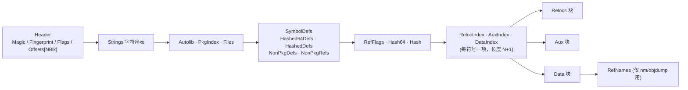
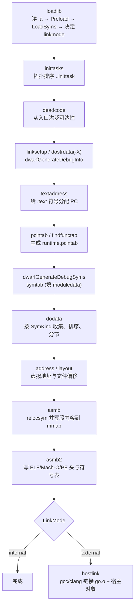
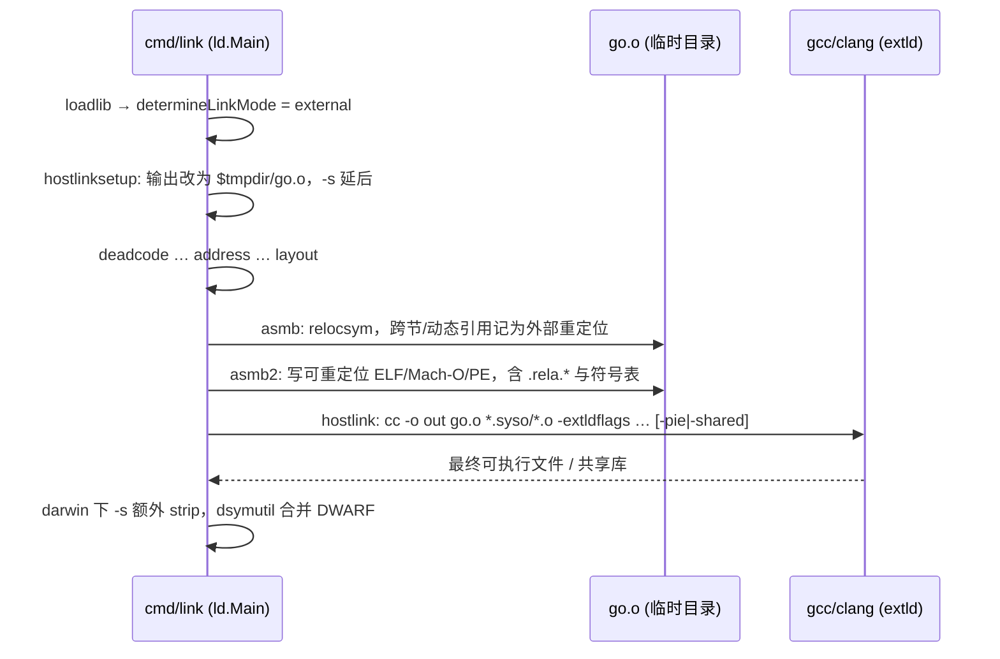

# Go 源码实现详解（六）：目标文件与链接器

先给结论：

1. **Go 目标文件不是 ELF**。`cmd/compile`/`cmd/asm` 写出的 `_go_.o`（打包在 `.a` 里）使用 `cmd/internal/goobj` 定义的私有格式：固定头部、字符串表，然后是十几个定长记录块。符号之间不靠名字而靠 `{PkgIdx, SymIdx}` 索引对互相引用，链接器可以按下标 O(1) 解析，不必逐名查哈希表。
2. **链接器是一条固定顺序的阶段流水线**。`ld.Main` 依次执行 `loadlib → inittasks → deadcode → linksetup → … → textaddress → pclntab → findfunctab → symtab → dodata → address → layout → asmb → asmb2 → hostlink`，所有符号由 `loader.Loader` 用一个全局整数索引统一管理。
3. **死代码消除是一次"沿重定位的洪泛"**。从入口与 `main..inittask` 出发跟随重定位；方法则借助 `R_METHODOFF`、`R_USEIFACE`、`R_USEIFACEMETHOD`、`R_USENAMEDMETHOD` 标记做保守裁剪，一旦看到 `ReflectMethod` 标志就放弃精确分析。
4. **重定位在 `relocsym` 中统一求值**。内部链接时链接器自己把 `R_ADDR`、`R_CALL`/`R_PCREL`、`R_TLS_LE` 等写进输出；外部链接时先产出一个可重定位的 `go.o`，把无法自行解决的重定位转成宿主格式，再调用 `gcc`/`clang`。
5. **运行时 `moduledata` 由链接器手工填写**。`symtab` 阶段按 `runtime/symtab.go` 的字段顺序逐个 `AddAddr`，`pclntab` 阶段生成 `runtime.pcheader`、`runtime.functab`、`runtime.findfunctab`，与 `runtime.findfunc` 的查表逻辑一一对应。

本文基于 golang/go master（提交 fdcd66b，Go 1.28 开发版），路径相对仓库根目录。

## 一、Go 目标文件格式：goobj

### 1.1 整体布局

`src/cmd/internal/goobj/objfile.go` 开头的注释就是格式规范，三方共用：`cmd/internal/obj/objfile.go`（编译器/汇编器写出）、`cmd/internal/objfile/goobj.go`（`nm`/`objdump` 读取）、`cmd/link/internal/loader`（链接器读取）。

```go
// src/cmd/internal/goobj/objfile.go（格式说明注释，节选）
//    Header struct {
//       Magic       [...]byte   // "\x00go120ld"
//       Fingerprint [8]byte
//       Flags       uint32
//       Offsets     [...]uint32 // byte offset of each block below
//    }
//    Strings [...]struct { Data [...]byte }
//    Autolib  [...]struct { Pkg string; Fingerprint [8]byte }
//    PkgIndex [...]string // referenced packages by index
//    Files [...]string
//    SymbolDefs [...]struct { Name string; ABI uint16; Type uint8; Flag uint8; Flag2 uint8; Size uint32; Align uint32 }
//    Hashed64Defs [...]struct { ... } // short hashed (content-addressable) symbol definitions
//    HashedDefs [...]struct { ... }   // hashed (content-addressable) symbol definitions
//    NonPkgDefs [...]struct { ... }   // non-pkg symbol definitions
//    NonPkgRefs [...]struct { ... }   // non-pkg symbol references
//    RefFlags [...]struct { Sym symRef; Flag uint8; Flag2 uint8 }
//    Hash64 [...][8]byte
//    Hash   [...][N]byte
//    RelocIndex [...]uint32 // index to Relocs
//    AuxIndex   [...]uint32 // index to Aux
//    DataIndex  [...]uint32 // offset to Data
//    Relocs [...]struct { Off int32; Size uint8; Type uint16; Add int64; Sym symRef }
//    Aux [...]struct { Type uint8; Sym symRef }
//    Data   [...]byte
//    RefNames [...]struct { Sym symRef; Name string } // blocks only used by tools (objdump, nm)
```

要点：

- 魔数 `"\x00go120ld"`（`const Magic`）自 Go 1.20 起未变；更旧的 `"\x00go114ld"` 会被 `Loader.Preload` 直接拒绝。
- `Header.Offsets` 是 `[NBlk]uint32`，块枚举为 `BlkAutolib, BlkPkgIdx, BlkFile, BlkSymdef, BlkHashed64def, BlkHasheddef, BlkNonpkgdef, BlkNonpkgref, BlkRefFlags, BlkHash64, BlkHash, BlkRelocIdx, BlkAuxIdx, BlkDataIdx, BlkReloc, BlkAux, BlkData, BlkRefName, BlkEnd`，共 `NBlk = 19` 项。
- 字符串一律编码成 `uint32 长度 + uint32 偏移`，指向紧跟头部的字符串表。
- 记录都是**定长字节数组**：`Sym` 是 `[21]byte`、`Reloc` 是 `[23]byte`、`Aux` 是 `[9]byte`，读取时用 `binary.LittleEndian` 直接在 mmap 的只读字节上取字段，不做反序列化拷贝。



### 1.2 符号定义与 `{PkgIdx, SymIdx}` 索引方案

```go
// src/cmd/internal/goobj/objfile.go
type Sym [SymSize]byte

const SymSize = stringRefSize + 2 + 1 + 1 + 1 + 4 + 4

func (s *Sym) ABI() uint16   { return binary.LittleEndian.Uint16(s[8:]) }
func (s *Sym) Type() uint8   { return s[10] }
func (s *Sym) Flag() uint8   { return s[11] }
func (s *Sym) Flag2() uint8  { return s[12] }
func (s *Sym) Siz() uint32   { return binary.LittleEndian.Uint32(s[13:]) }
func (s *Sym) Align() uint32 { return binary.LittleEndian.Uint32(s[17:]) }

// Sym.Flag
const (
	SymFlagDupok = 1 << iota
	SymFlagLocal
	SymFlagTypelink
	SymFlagLeaf
	SymFlagNoSplit
	SymFlagReflectMethod
	SymFlagGoType
)

// Sym.Flag2
const (
	SymFlagUsedInIface = 1 << iota
	SymFlagItab
	SymFlagDict
	SymFlagPkgInit
	SymFlagLinkname
	// ... SymFlagLinknameStd, SymFlagABIWrapper, SymFlagWasmExport
)
```

这些标志位后面会反复出现：`Dupok` 决定重复定义的合并策略，`ReflectMethod`/`UsedInIface`/`Itab`/`GoType` 是死代码消除的输入，`Typelink` 决定类型描述符在 `.rodata` 中的排序，`PkgInit` 标记包 init 函数。

符号引用用 `SymRef{PkgIdx, SymIdx}`，`PkgIdx` 有几个预定义值：

```go
// src/cmd/internal/goobj/objfile.go
const (
	PkgIdxNone     = (1<<31 - 1) - iota // Non-package symbols
	PkgIdxHashed64                      // Short hashed (content-addressable) symbols
	PkgIdxHashed                        // Hashed (content-addressable) symbols
	PkgIdxBuiltin                       // Predefined runtime symbols (ex: runtime.newobject)
	PkgIdxSelf                          // Symbols defined in the current package
	PkgIdxSpecial  = PkgIdxSelf         // Indices above it has special meanings
	PkgIdxInvalid  = 0
	// The index of other referenced packages starts from 1.
)
```

| PkgIdx | SymIdx 的含义 |
|---|---|
| `PkgIdxSelf` | 本包 `SymbolDefs` 下标 |
| `PkgIdxHashed64` / `PkgIdxHashed` | `Hashed64Defs` / `HashedDefs` 下标（内容寻址，链接时按哈希去重） |
| `PkgIdxNone` | `NonPkgDefs` 下标，越界则落入 `NonPkgRefs`（按名字解析：linkname、汇编符号） |
| `PkgIdxBuiltin` | 预定义 runtime 符号表下标 |
| 1..N | `PkgIndex` 块中第 N 个被引用包，`SymIdx` 是**那个包**的 `SymbolDefs` 下标 |

跨包引用能直接用对方的数组下标，是因为 `go build` 保证依赖先编译，且导出数据携带 `Fingerprint`；链接器在 `ldobj` 中 `checkFingerprint` 校验，防止索引错位。

### 1.3 重定位与 Aux

```go
// src/cmd/internal/goobj/objfile.go
type Reloc [RelocSize]byte

const RelocSize = 4 + 1 + 2 + 8 + 8

func (r *Reloc) Off() int32   { return int32(binary.LittleEndian.Uint32(r[:])) }
func (r *Reloc) Siz() uint8   { return r[4] }
func (r *Reloc) Type() uint16 { return binary.LittleEndian.Uint16(r[5:]) }
func (r *Reloc) Add() int64   { return int64(binary.LittleEndian.Uint64(r[7:])) }
func (r *Reloc) Sym() SymRef {
	return SymRef{binary.LittleEndian.Uint32(r[15:]), binary.LittleEndian.Uint32(r[19:])}
}

// Aux Type
const (
	AuxGotype = iota
	AuxFuncInfo
	AuxFuncdata
	AuxDwarfInfo
	AuxDwarfLoc
	AuxDwarfRanges
	AuxDwarfLines
	AuxPcsp
	AuxPcfile
	AuxPcline
	AuxPcinline
	AuxPcdata
	// ... AuxWasmImport, AuxWasmType, AuxSehUnwindInfo
)
```

`Siz == 0` 的重定位是"标记重定位"（`IsMarker`），不修改字节，只向链接器传递信息。Aux 把符号与附属符号绑定：函数的 `FuncInfo`、每张 PCDATA/FUNCDATA 表、DWARF 片段、变量的类型描述符，都是独立符号，通过 Aux 挂到主符号上。`RelocIndex[i]..RelocIndex[i+1]` 界定第 i 个符号的重定位范围，Aux/Data 同理，所以三个索引数组长度都是 N+1。

### 1.4 编译器如何写出：`NumberSyms` 与 `WriteObjFile`

编译末尾，`cmd/internal/obj` 先给每个 `LSym` 分配索引（`src/cmd/internal/obj/sym.go`）：

```go
// src/cmd/internal/obj/sym.go  func (ctxt *Link) NumberSyms()
	var idx, hashedidx, hashed64idx, nonpkgidx int32
	ctxt.traverseSyms(traverseDefs|traversePcdata, func(s *LSym) {
		if s.ContentAddressable() {
			if s.Size <= 8 && len(s.R) == 0 && contentHashSection(s) == 0 {
				// We can use short hash only for symbols without relocations.
				s.PkgIdx = goobj.PkgIdxHashed64
				s.SymIdx = hashed64idx
				ctxt.hashed64defs = append(ctxt.hashed64defs, s)
				hashed64idx++
			} else {
				s.PkgIdx = goobj.PkgIdxHashed
				s.SymIdx = hashedidx
				ctxt.hasheddefs = append(ctxt.hasheddefs, s)
				hashedidx++
			}
		} else if isNonPkgSym(ctxt, s) {
			s.PkgIdx = goobj.PkgIdxNone
			s.SymIdx = nonpkgidx
			ctxt.nonpkgdefs = append(ctxt.nonpkgdefs, s)
			nonpkgidx++
		} else {
			s.PkgIdx = goobj.PkgIdxSelf
			s.SymIdx = idx
			ctxt.defs = append(ctxt.defs, s)
			idx++
		}
		s.Set(AttrIndexed, true)
	})
```

内容寻址符号（字符串字面量、`gclocals·…`、类型描述符等）不进名字空间，只按内容哈希去重：≤8 字节且无重定位的用 8 字节短哈希，其余用截断 SHA256（`HashSize = 16`）。

`src/cmd/internal/obj/objfile.go` 的 `WriteObjFile` 按块顺序写出，头部先占位、末尾回填偏移：

```go
// src/cmd/internal/obj/objfile.go  func WriteObjFile(ctxt *Link, b *bio.Writer)
	h := goobj.Header{Magic: goobj.Magic, Fingerprint: ctxt.Fingerprint, Flags: flags}
	h.Write(w.Writer)
	w.StringTable()
	h.Offsets[goobj.BlkAutolib] = w.Offset()
	for i := range ctxt.Imports {
		ctxt.Imports[i].Write(w.Writer)
	}
	// ... BlkPkgIdx / BlkFile / BlkSymdef / BlkHashed64def / BlkHasheddef / BlkNonpkgdef / BlkNonpkgref / BlkRefFlags / BlkHash64 / BlkHash
	h.Offsets[goobj.BlkRelocIdx] = w.Offset()
	nreloc := uint32(0)
	lists := [][]*LSym{ctxt.defs, ctxt.hashed64defs, ctxt.hasheddefs, ctxt.nonpkgdefs}
	for _, list := range lists {
		for _, s := range list {
			w.Uint32(nreloc)
			nreloc += uint32(len(s.R))
		}
	}
	w.Uint32(nreloc)
	// ... BlkAuxIdx / BlkDataIdx / BlkReloc / BlkAux / BlkData / BlkRefName
	h.Offsets[goobj.BlkEnd] = w.Offset()
	// Fix up block offsets in the header
	end := start + int64(w.Offset())
	b.MustSeek(start, 0)
	h.Write(w.Writer)
	b.MustSeek(end, 0)
```

写重定位时 `makeSymRef` 对未编号符号直接 panic（`"unindexed symbol reference"`）；写前还会 `slices.SortFunc(s.R, relocByOffCmp)` 把重定位按偏移排序，因为 PE 等宿主格式要求地址有序。

### 1.5 观察目标文件

- `go build -gcflags=-S`：`cmd/compile` 的 `Flag.S` 赋给 `Ctxt.Debugasm`（`src/cmd/compile/internal/base/flag.go`），`obj.debugAsmEmit` 对每个定义符号调用 `writeSymDebug`，输出 `main.main STEXT size=… align=… args=… locals=… funcid=…` 头行、逐条指令与 `rel off+siz t=TYPE sym+add` 形式的重定位；`-S -S` 还打印 Aux 符号。
- `go tool nm pkg.a`：`src/cmd/internal/objfile/goobj.go` 的 `openGoFile` 读入 `.a` 中的 `_go_.o`，`symbols()` 遍历各定义块，跨包引用的名字从 `RefNames` 块补全——这是 `RefNames` 存在的唯一原因。
- `go tool objdump pkg.a`：读取 text 符号的 Data 与 Relocs，用 `goobjReloc.String` 把重定位以 `[off:siz]R_TYPE:sym+add` 内联到反汇编。

## 二、链接器主流程

### 2.1 `Main` 的阶段顺序

`src/cmd/link/internal/ld/main.go` 的 `Main` 是 `cmd/link` 的骨架。剔除平台分支后顺序如下（每个 `bench.Start` 是一个阶段，`-benchmark=cpu` 可逐段计时）：

```go
// src/cmd/link/internal/ld/main.go  func Main(arch *sys.Arch, theArch Arch)
	bench.Start("libinit");      libinit(ctxt) // creates outfile
	bench.Start("computeTLSOffset"); ctxt.computeTLSOffset()
	bench.Start("Archinit");     thearch.Archinit(ctxt)
	bench.Start("loadlib");      ctxt.loadlib()
	bench.Start("inittasks");    ctxt.inittasks()
	bench.Start("deadcode");     deadcode(ctxt)
	bench.Start("linksetup");    ctxt.linksetup()
	bench.Start("dostrdata");    ctxt.dostrdata()
	bench.Start("dwarfGenerateDebugInfo"); dwarfGenerateDebugInfo(ctxt)
	bench.Start("callgraph");    ctxt.callgraph()
	bench.Start("doStackCheck"); ctxt.doStackCheck()
	bench.Start("mangleTypeSym"); ctxt.mangleTypeSym()
	// doelf / domacho / dope+windynrelocsyms / doxcoff（按目标格式选一）
	bench.Start("textbuildid");  ctxt.textbuildid()
	bench.Start("addexport");    ctxt.setArchSyms(); ctxt.addexport()
	bench.Start("Gentext");      thearch.Gentext(ctxt, ctxt.loader) // trampolines, call stubs, etc.
	bench.Start("textaddress");  ctxt.textaddress()
	bench.Start("buildinfo");    ctxt.buildinfo()
	bench.Start("pclntab");      containers := ctxt.findContainerSyms(); pclnState := ctxt.pclntab(containers)
	bench.Start("findfunctab");  ctxt.findfunctab(pclnState, containers)
	bench.Start("dwarfGenerateDebugSyms"); dwarfGenerateDebugSyms(ctxt)
	bench.Start("symtab");       symGroupType := ctxt.symtab(pclnState)
	bench.Start("dodata");       ctxt.dodata(symGroupType)
	bench.Start("address");      order := ctxt.address()
	bench.Start("dwarfcompress"); dwarfcompress(ctxt)
	bench.Start("layout");       filesize := ctxt.layout(order)
	// ctxt.Out.Mmap(filesize)
	bench.Start("Asmb");         asmb(ctxt)
	bench.Start("Asmb2");        asmb2(ctxt)
	bench.Start("hostlink");     ctxt.hostlink()
	bench.Start("archive");      ctxt.archive()
```

一个版本差异：早期 Go 的 `Main` 里有独立的 `ctxt.typelink()` 阶段（`ld/typelink.go`）。当前源码树已没有这个文件，typelink 工作拆到两处：`symtab` 在 `moduledata` 里预留 `typedesclen` 槽位，`dodata` 的 `dodataSect` 对 `STYPE` 符号排序时计算并回填（见 5.2 节）。



### 2.2 `loadlib`：从 `.a` 到符号索引

`src/cmd/link/internal/ld/lib.go` 的 `(*Link).loadlib` 是输入阶段总入口：

```go
// src/cmd/link/internal/ld/lib.go  func (ctxt *Link) loadlib()
	ctxt.loader = loader.NewLoader(flags, &ctxt.ErrorReporter.ErrorReporter)
	// ctxt.Library grows during the loop, so not a range loop.
	i := 0
	for ; i < len(ctxt.Library); i++ {
		lib := ctxt.Library[i]
		if lib.Shlib == "" {
			loadobjfile(ctxt, lib)
		}
	}
	// ... runtime/race, runtime/msan, runtime/asan
	loadinternal(ctxt, "runtime")
	for ; i < len(ctxt.Library); i++ { /* 继续加载新追加的依赖 */ }
	// At this point, the Go objects are "preloaded". Not all the symbols are
	// added to the symbol table (only defined package symbols are).
	iscgo = ctxt.LibraryByPkg["runtime/cgo"] != nil
	// We now have enough information to determine the link mode.
	determineLinkMode(ctxt)
	// ... 显式 -linkmode=external 且无 cgo 时补加载 runtime/cgo
	// Add non-package symbols and references of externally defined symbols.
	ctxt.loader.LoadSyms(ctxt.Arch)
	// ... ldshlibsyms（-linkshared）
	ctxt.loadcgodirectives()
	hostobjs(ctxt)
	hostlinksetup(ctxt)
	// ... 内部链接且有宿主对象时，从 libgcc / libc_nonshared.a 补齐未定义符号
	loadfips(ctxt)
	ctxt.Loaded = true
```

`ctxt.Library` 是遍历中增长的工作队列：`loadobjfile` 读到对象的 `Autolib` 块后经 `addImports` 追加依赖包，从 `main` 出发做传递闭包。`loadobjfile` 解析 `.a`（`ARMAG` 魔数），跳过 `__.PKGDEF`，对每个 `.o`/`.syso` 成员调用 `ldobj`；`ldobj` 先嗅探魔数——ELF（`0x7f454c46`）、Mach-O、PE、XCOFF 作为宿主对象交给 `loadelf`/`loadmacho`/`loadpe`/`loadxcoff`，`"go o"` 开头的才是 Go 对象：

```go
// src/cmd/link/internal/ld/lib.go  func ldobj(...)
	if !strings.HasPrefix(line, "go object ") { /* uncompiled .go / stale / not an object file */ }
	// First, check that the basic GOOS, GOARCH, and Version match.
	if line != wantHdr && !*flagF {
		Errorf("%s: linked object header mismatch:\nhave %q\nwant %q\n", pn, line, wantHdr)
	}
	// Skip over exports and other info -- ends with \n!\n.
	// ...
	ldpkg(ctxt, f, lib, import1-import0-2, pn) // -2 for !\n
	f.MustSeek(import1, 0)
	fingerprint := ctxt.loader.Preload(ctxt.IncVersion(), f, lib, unit, eof-f.Offset())
	if !fingerprint.IsZero() { // Assembly objects don't have fingerprints. Ignore them.
		if lib.Fingerprint.IsZero() {
			lib.Fingerprint = fingerprint
		}
		checkFingerprint(lib, fingerprint, lib.Srcref, lib.Fingerprint)
	}
	addImports(ctxt, lib, pn)
```

一个 `_go_.o` 其实是"文本头（`go object linux amd64 …`）+ 导出数据（以 `\n!\n` 结束，`ldpkg` 从中提取 cgo 指令）+ goobj 二进制体"。`Preload` 只做最轻量的事：`f.Slice` 把对象 mmap 进来，构造 `oReader`，记录 `Autolib` 与文件表，`l.addObj`。把符号放进全局索引是稍后 `LoadSyms` 的工作。

## 三、loader：全局符号索引

### 3.1 索引空间

`src/cmd/link/internal/loader/loader.go` 的 `Loader` 是链接器唯一的符号容器，`loader.Sym` 是 `sym.LoaderSym` 的别名（整数，0 无效）：

```go
// src/cmd/link/internal/loader/loader.go
// Notes on the layout of global symbol index space:
//   - Go object files are read before host object files; each Go object
//     read adds its defined package symbols to the global index space.
//     Nonpackage symbols are not yet added.
//   - In loader.LoadNonpkgSyms, add non-package defined symbols and
//     references in all object files to the global index space.
//   - Host object file loading happens; ... this can wind up
//     extending the external symbol index space range.
//   - Each symbol gets a unique global index. For duplicated and
//     overwriting/overwritten symbols, the second (or later) appearance
//     of the symbol gets the same global index as the first appearance.
type Loader struct {
	objs        []*oReader
	extStart    Sym   // from this index on, the symbols are externally defined
	builtinSyms []Sym // global index of builtin symbols
	objSyms []objSym // global index mapping to local index
	symsByName    [2]map[string]Sym // map symbol name to index, two maps are for ABI0 and ABIInternal
	extStaticSyms map[nameVer]Sym   // externally defined static symbols, keyed by name
	extReader    *oReader // a dummy oReader, for external symbols
	payloads     []*extSymPayload // contents of linker-materialized external syms
	values       []int64          // symbol values, indexed by global sym index
	// ...
	attrReachable        Bitmap // reachable symbols, indexed by global index
	attrUsedInIface      Bitmap // "used in interface" symbols, indexed by global idx
	// ...
}
```

核心映射只有 `objSyms`：全局索引 → `{objidx, 本地索引}`。属性用按全局索引寻址的位图或稀疏 map 存放；符号数据、重定位仍留在 mmap 的目标文件里按需读取（`Relocs`、`Aux` 都是持有 `*oReader` 的轻量句柄）。只有链接器合成的符号（`extStart` 之后）才有内存载荷 `extSymPayload`。

`LoadSyms` 分两轮：先所有包的包符号，再哈希与非包符号，最后 `loadObjRefs` 解析 `NonPkgRefs`（`LookupOrCreateSym`）与 `PkgIndex`（包名 → `objidx`）：

```go
// src/cmd/link/internal/loader/loader.go  func (l *Loader) LoadSyms(arch *sys.Arch)
	for _, r := range l.objs[goObjStart:] {
		st.preloadSyms(r, pkgDef)
	}
	l.npkgsyms = l.NSym()
	for _, r := range l.objs[goObjStart:] {
		st.preloadSyms(r, hashed64Def)
		st.preloadSyms(r, hashedDef)
		st.preloadSyms(r, nonPkgDef)
	}
	// ... checkLinkname；随后对每个 oReader 调用 loadObjRefs
```

### 3.2 `addSym`：重复定义与 dupok

```go
// src/cmd/link/internal/loader/loader.go  func (st *loadState) addSym(...)
	switch kind {
	case pkgDef:
		// Defined package symbols cannot be dup to each other.
		l.symsByName[ver][name] = i
		addToGlobal()
		return i
	case hashed64Def, hashedDef:
		// ... don't add to name lookup table, as they are not referenced by name.
		if s, existed := checkHash(); existed {
			if siz > s.size {
				// New symbol has larger size, use the new one. Rewrite the index mapping.
				l.objSyms[s.sym] = objSym{r.objidx, li}
				addToHashMap(symAndSize{s.sym, siz})
			}
			return s.sym
		}
		// ...
	}
	// Non-package (named) symbol.
	oldi, existed := l.symsByName[ver][name]
	if !existed { /* 新建 */ }
	if osym.Dupok() {
		if oldsym.Dupok() {
			if l.flags&FlagStrictDups != 0 {
				l.checkdup(name, r, li, oldi)
			}
			if oldsz < sz {
				l.objSyms[oldi] = objSym{r.objidx, li}
			}
		}
		return oldi
	}
	if oldsym.Dupok() { l.objSyms[oldi] = objSym{r.objidx, li}; return oldi }
	// ... DATA/BSS/TEXT 组合表，两个都有内容则 log.Fatalf("duplicated definition of symbol ...")
```

两个 dupok 冲突时保留尺寸更大者（issue #47185），`-strictdups=1/2` 额外比较内容。两个都非 dupok 时进入 DATA/BSS/TEXT 组合表：TEXT 可覆盖 BSS（支持 `//go:linkname fn; var fn uintptr` 取函数地址），有内容者覆盖 BSS，两 BSS 取大者，两者都有内容则致命错误。

### 3.3 `resolve`：把 `SymRef` 变成全局索引

```go
// src/cmd/link/internal/loader/loader.go  func (l *Loader) resolve(r *oReader, s goobj.SymRef) Sym
	switch p := s.PkgIdx; p {
	case goobj.PkgIdxInvalid:
		// {0, X} with non-zero X is never a valid sym reference from a Go object.
		// We steal this space for symbol references from external objects.
		if l.isExtReader(r) {
			return Sym(s.SymIdx)
		}
		// ...
		return 0
	case goobj.PkgIdxHashed64:
		i := int(s.SymIdx) + r.ndef
		return r.syms[i]
	case goobj.PkgIdxHashed:
		i := int(s.SymIdx) + r.ndef + r.nhashed64def
		return r.syms[i]
	case goobj.PkgIdxNone:
		i := int(s.SymIdx) + r.ndef + r.nhashed64def + r.nhasheddef
		return r.syms[i]
	case goobj.PkgIdxBuiltin:
		if bi := l.builtinSyms[s.SymIdx]; bi != 0 {
			return bi
		}
		l.reportMissingBuiltin(int(s.SymIdx), r.unit.Lib.Pkg)
		return 0
	case goobj.PkgIdxSelf:
		rr = r
	default:
		rr = l.objs[r.pkg[p]]
	}
	return l.toGlobal(rr, s.SymIdx)
```

每个 `oReader` 有一张 `syms []Sym`，按"包符号、hashed64、hashed、非包定义、非包引用"的顺序把本地索引映射到全局索引，`resolve` 只是一次加法加一次数组访问。链接器合成的外部符号复用 `PkgIdx == 0` 这个"永远不合法"的空间，`SymIdx` 就是全局索引。

### 3.4 外部符号

`LookupOrCreateSym` 找不到名字时调用 `newExtSym`：第一次调用把 `extStart` 固定为当前长度，此后再调 `addSym` 就 panic——外部符号一旦出现，Go 对象符号空间即冻结。`CreateSymForUpdate`/`MakeSymbolUpdater` 返回 `SymbolBuilder`，把 Go 对象符号克隆为可写的外部符号，这是链接器修改符号内容（`-X`、`moduledata`）的唯一途径。

## 四、死代码消除

### 4.1 根集合

`src/cmd/link/internal/ld/deadcode.go` 的 `deadcodePass` 持有工作队列（最小堆 `wq`）、`ifaceMethod`（可达接口调用点的方法签名）、`genericIfaceMethod`（按名字）、`markableMethods`（可达类型的方法，待裁决）、`reflectSeen`。`init` 决定根：

```go
// src/cmd/link/internal/ld/deadcode.go  func (d *deadcodePass) init()
	// ... 外部链接的 exe/pie 把入口改成 "main"（windows/386 为 "_main"），因宿主链接器直接引用它
	names = append(names, *flagEntrySymbol)
	// runtime.unreachableMethod is a function that will throw if called.
	// We redirect unreachable methods to it.
	names = append(names, "runtime.unreachableMethod")
	// ... plugin：<path>..inittask、<path>.main、go:plugin.tabs 及 go:plugin.exports 引用的符号
	for _, name := range names {
		// Mark symbol as a data/ABI0 symbol.
		d.mark(d.ldr.Lookup(name, 0), 0)
		if abiInternalVer != 0 {
			// Also mark any Go functions (internal ABI).
			d.mark(d.ldr.Lookup(name, abiInternalVer), 0)
		}
	}
	// All dynamic exports are roots.
	for _, s := range d.ctxt.dynexp {
		d.mark(s, 0)
	}
	// ... d.ldr.WasmExports
	if d.ctxt.mainInittasks != 0 {
		d.mark(d.ctxt.mainInittasks, 0)
	}
```

`-buildmode=shared` 则把库内所有定义符号标成可达。`ctxt.mainInittasks` 是 `inittasks` 阶段刚生成的调度表，因此 init 函数不再需要经由 `main..inittask` 才能存活。

### 4.2 `flood`：沿重定位洪泛

```go
// src/cmd/link/internal/ld/deadcode.go  func (d *deadcodePass) flood()
		d.reflectSeen = d.reflectSeen || d.ldr.IsReflectMethod(symIdx)
		// ...
		for i := 0; i < relocs.Count(); i++ {
			r := relocs.At(i)
			if r.Weak() { /* 弱引用默认跳过（-linkshared 的 itab、用 plugin 时的直接调用除外） */ }
			t := r.Type()
			switch t {
			case objabi.R_METHODOFF:
				if usedInIface {
					methods = append(methods, methodref{src: symIdx, r: i})
					// ... 方法描述符本身也是类型描述符，带 UsedInIface 重新访问
				}
				i += 2
				continue
			case objabi.R_USETYPE:
				continue
			case objabi.R_USEIFACE:
				rs := r.Sym()
				if d.ldr.IsItab(rs) {
					rs = decodeItabType(d.ldr, d.ctxt.Arch, rs)
				}
				if !d.ldr.AttrUsedInIface(rs) {
					d.ldr.SetAttrUsedInIface(rs, true)
					if d.ldr.AttrReachable(rs) {
						d.ldr.SetAttrReachable(rs, false)
						d.mark(rs, symIdx)
					}
				}
				continue
			case objabi.R_USEIFACEMETHOD:
				m := d.decodeIfaceMethod(d.ldr, d.ctxt.Arch, rs, r.Add())
				d.ifaceMethod[m] = true
				continue
			case objabi.R_USENAMEDMETHOD:
				d.genericIfaceMethod[d.decodeGenericIfaceMethod(d.ldr, r.Sym())] = true
				continue // don't mark referenced symbol - it is not needed in the final binary.
			case objabi.R_INITORDER:
				continue
			}
			// ... 若当前类型 UsedInIface，其"子类型"也带上 UsedInIface 并重新入队
			d.mark(r.Sym(), symIdx)
		}
```

- `R_METHODOFF`：编译器在类型描述符的 `uncommonType` 方法表里，为每个方法发出连续三条（`mtyp`、`ifn`、`tfn`）。它们**不立即标记目标**，只有类型 `UsedInIface`（曾被转成接口）时才进入 `markableMethods` 等待裁决。
- `R_USEIFACE`：函数内把某类型转成接口时发出的 0 字节标记。给类型打 `UsedInIface`，若已访问过就撤销可达位重新入队——一个类型最多被访问两次，终止性有保证。
- `R_USEIFACEMETHOD`：接口调用点标记"接口 I 的第 k 个方法被调用"，解码成 `methodsig{name, typ}`。
- `R_USENAMEDMETHOD`：泛型接口方法或 `MethodByName("常量")` 只记录方法名。

Aux 中的 `AuxGotype` 被特意跳过：变量可达不意味着它的类型描述符需要保留。

### 4.3 方法可达性的定点迭代与反射

```go
// src/cmd/link/internal/ld/deadcode.go  func deadcode(ctxt *Link)
	d.init()
	d.flood()
	if ctxt.DynlinkingGo() {
		// Exported methods may satisfy interfaces we don't know
		// about yet when dynamically linking.
		d.reflectSeen = true
	}
	for {
		// Mark all methods that could satisfy a discovered
		// interface as reachable. We recheck old marked interfaces
		// as new types (with new methods) may have been discovered
		// in the last pass.
		rem := d.markableMethods[:0]
		for _, m := range d.markableMethods {
			if (d.reflectSeen && (m.isExported() || d.dynlink)) || d.ifaceMethod[m.m] || d.genericIfaceMethod[m.m.name] {
				d.markMethod(m)
			} else {
				rem = append(rem, m)
			}
		}
		d.markableMethods = rem
		if d.wq.empty() {
			break
		}
		d.flood()
	}
	if *flagPruneWeakMap {
		d.mapinitcleanup()
	}
```

三条调用路径的处理与函数头注释一致：直接调用由洪泛覆盖；接口调用把可达接口的方法签名（名字 + 函数类型描述符）与可达类型的方法签名匹配，"极端保守但简单正确"；反射依赖编译器在调用 `reflect.Value.Method`/`Type.Method`、或以非常量参数调用 `MethodByName` 的函数上打的 `ReflectMethod` 标志——`reflectSeen` 一旦为真，所有可达类型的**导出**方法全部保留。这就是引入按名取方法的反射库会让二进制显著变大的原因。

被裁掉的方法不会留下悬空引用：`relocsym` 遇到目标不可达的 `R_METHODOFF` 写入 `-1` 哨兵，`R_WEAKADDR` 指向的不可达函数被重定向到 `runtime.unreachableMethod`。`mapinitcleanup` 处理编译器外提的 map 初始化函数：包 init 对它们的弱调用若目标不可达，改为调用 `runtime.mapinitnoop`。

`-ldflags=-dumpdep` 的输出直接来自 `mark`：每次成功标记打印一行 `from -> to`，并给带 `UsedInIface`/`ReflectMethod` 的符号追加标签，是回答"这个符号为什么被链进来"的最直接手段。

## 五、数据布局与地址分配

### 5.1 `symtab`：边界符号与 `moduledata`

`src/cmd/link/internal/ld/symtab.go` 的 `symtab` 先用 `xdefine` 定义一组只有名字的边界符号（`runtime.text/etext`、`data/edata`、`bss/ebss`、`types/etypes`、`pclntab/epclntab` …），值留到 `address` 填；然后**按 `runtime/symtab.go` 中 `moduledata` 的字段顺序**拼装：

```go
// src/cmd/link/internal/ld/symtab.go  func (ctxt *Link) symtab(pcln *pclntab) []sym.SymKind
	// the definition of moduledata in runtime/symtab.go.
	moduledata := ldr.MakeSymbolUpdater(ctxt.Moduledata)
	moduledata.AddAddr(ctxt.Arch, pcln.pcheader)
	// ... funcnametab / cutab / filetab / pctab / pclntable / ftab 六个切片头
	moduledata.AddAddr(ctxt.Arch, pcln.findfunctab)
	moduledata.AddAddr(ctxt.Arch, pcln.firstFunc)                                // minpc
	moduledata.AddAddrPlus(ctxt.Arch, pcln.lastFunc, ldr.SymSize(pcln.lastFunc)) // maxpc
	moduledata.AddAddr(ctxt.Arch, ldr.Lookup("runtime.text", 0))
	moduledata.AddAddr(ctxt.Arch, ldr.Lookup("runtime.etext", 0))
	// ... noptrdata / data / bss / noptrbss / covctrs / end / gcdata / gcbss
	moduledata.AddAddr(ctxt.Arch, ldr.Lookup("runtime.types", 0))
	ctxt.moduledataTypeDescOffset = moduledata.Size()
	moduledata.AddUint(ctxt.Arch, 0) // filled in by dodataSect
	moduledata.AddAddr(ctxt.Arch, ldr.Lookup("runtime.etypes", 0))
	ctxt.moduledataItabOffset = moduledata.Size()
	moduledata.AddUint(ctxt.Arch, 0) // filled in by dodataSect
	ctxt.moduledataItabSizeOffset = moduledata.Size()
	moduledata.AddUint(ctxt.Arch, 0) // filled in by dodataSect
	moduledata.AddAddr(ctxt.Arch, ldr.Lookup("runtime.rodata", 0))
	moduledata.AddAddr(ctxt.Arch, ldr.Lookup("go:func.*", 0))
	moduledata.AddAddr(ctxt.Arch, ldr.Lookup("runtime.epclntab", 0))
	// ... textsectmap / ptab / pluginpath / pkghashes / inittasks / modulename / modulehashes / hasmain
```

```go
// src/runtime/symtab.go
type moduledata struct {
	sys.NotInHeap // Only in static data

	pcHeader     *pcHeader
	funcnametab  []byte
	cutab        []uint32
	filetab      []byte
	pctab        []byte
	pclntable    []byte
	ftab         []functab
	findfunctab  uintptr
	minpc, maxpc uintptr

	text, etext                uintptr
	noptrdata, enoptrdata      uintptr
	data, edata                uintptr
	bss, ebss                  uintptr
	noptrbss, enoptrbss        uintptr
	covctrs, ecovctrs          uintptr
	end, gcdata, gcbss         uintptr
	types, typedesclen, etypes uintptr
	itaboffset, itabsize       uintptr
	rodata                     uintptr
	gofunc                     uintptr // go.func.*
	epclntab                   uintptr
	// ... textsectmap, ptab, pluginpath, pkghashes, inittasks, modulename, modulehashes, hasmain, ...
}
```

`ctxt.Moduledata` 在 `linksetup` 中创建：普通程序复用 runtime 声明的 `runtime.firstmoduledata`，`-linkshared`/plugin 新建 `local.moduledata`；类型设为 `sym.SMODULEDATA`，尺寸用 `decodetypeSize` 从 `type:runtime.moduledata` 读出，保证与 runtime 结构体等长。`symtab` 返回每个符号重新归类后的 `SymKind`，交给 `dodata`。

### 5.2 `dodata`：收集、排序、分节

```go
// src/cmd/link/internal/ld/data.go  func (ctxt *Link) dodata(symGroupType []sym.SymKind)
	fixZeroSizedSymbols(ctxt)
	// Collect data symbols by type into data.
	state := dodataState{ctxt: ctxt, symGroupType: symGroupType}
	for s := loader.Sym(1); s < loader.Sym(ldr.NSym()); s++ {
		if !ldr.AttrReachable(s) || ldr.AttrSpecial(s) || ldr.AttrSubSymbol(s) ||
			!ldr.TopLevelSym(s) {
			continue
		}
		st := state.symType(s)
		if st <= sym.STEXTEND || st >= sym.SFirstUnallocated {
			continue
		}
		state.data[st] = append(state.data[st], s)
		// ...
	}
	state.dynreloc(ctxt)
	// Move any RO data with relocations to a separate section.
	state.makeRelroForSharedLib(ctxt)
	// Sort symbols.
	for symn := range state.data {
		go func() { state.data[symn], state.dataMaxAlign[symn] = state.dodataSect(ctxt, symn, state.data[symn]) /* ... */ }()
	}
	// ... allocateDataSections / allocateDwarfSections / allocateSEHSections
```

`sym.SymKind`（`src/cmd/link/internal/sym/symkind.go`）是一张按"最终落到哪个节"排定的枚举：`STEXT…STEXTEND` 是代码；`SRODATA`、`SPCLNTAB`、`STYPE`、`SGOFUNC` 等只读；`SFirstWritable` 之后是 `SMODULEDATA`、`SNOPTRDATA`、`SDATA`、`SBSS`、`SNOPTRBSS`、`STLSBSS`；`SFirstUnallocated` 之后（`SXREF`、`SDYNIMPORT`…）不分配空间。`dodata` 按它把可达符号分桶，每桶并行地由 `dodataSect` 排序。

`dodataSect` 默认按尺寸排序减少对齐空洞，但 `STYPE` 桶有特殊规则——这就是老版本 `typelink` 阶段的去处：

```go
// src/cmd/link/internal/ld/data.go  func (state *dodataState) dodataSect(...)
	case sym.STYPE:
		// Sort type descriptors with the typelink flag first,
		// sorted by type string. The reflect package will use
		// this to ensure that type descriptor pointers are unique.
		// Sort itabs after type descriptors.
		sort.Slice(sl, func(i, j int) bool {
			// ... head/tail、type:* 优先
			if iIsType && jIsType {
				if iIsTypelink && jIsTypelink {
					return sl[i].typeStr < sl[j].typeStr // typelink symbols sort by type string
				} else if iIsTypelink {
					return true // typelink < non-typelink
				} else if jIsTypelink {
					return false
				}
			} else if iIsType {
				return true // type < itab
			} else if jIsType {
				return false
			}
			return sortFn(i, j)
		})
		// ... 累加 typelink 描述符总长度 typeLinkSize
		su := ldr.MakeSymbolUpdater(ctxt.Moduledata)
		su.SetUint(ctxt.Arch, ctxt.moduledataTypeDescOffset, uint64(typeLinkSize))
```

带 `SymFlagTypelink` 的类型描述符按类型字符串排序放在 `runtime.types` 段最前，itab 排在所有类型之后；长度写回 `moduledata.typedesclen`、`itaboffset`、`itabsize`，runtime 的 `typelinksinit`/`itabsinit` 据此扫描。

`allocateDataSections` 随后按固定顺序创建节并放入符号，例如：

```go
// src/cmd/link/internal/ld/data.go  func (state *dodataState) allocateDataSections(ctxt *Link)
	/* pointer-free data */
	sect := state.allocateNamedSectionAndAssignSyms(&Segdata, ".noptrdata", sym.SNOPTRDATA, sym.SDATA, 06)
	ldr.SetSymSect(ldr.LookupOrCreateSym("runtime.noptrdata", 0), sect)
	ldr.SetSymSect(ldr.LookupOrCreateSym("runtime.enoptrdata", 0), sect)
	// ...
	/* data */
	sect = state.allocateNamedSectionAndAssignSyms(&Segdata, ".data", sym.SDATA, sym.SDATA, 06)
	ldr.SetSymSect(ldr.LookupOrCreateSym("runtime.data", 0), sect)
	ldr.SetSymSect(ldr.LookupOrCreateSym("runtime.edata", 0), sect)
```

此时符号的 `Value` 是**节内偏移**，节的 `Vaddr` 也只是段内偏移，绝对地址留给 `address`。`.noptrdata`/`.data`/`.bss`/`.noptrbss` 的划分让 GC 只需扫描 `.data` 与 `.bss`，`gcdata`/`gcbss` 位图由 `GCProg` 在此生成。

### 5.3 `symalign`

```go
// src/cmd/link/internal/ld/data.go
func symalign(ldr *loader.Loader, s loader.Sym) int32 {
	min := int32(thearch.Minalign)
	align := ldr.SymAlign(s)
	if align >= min {
		return align
	} else if align != 0 {
		return min
	}
	align = int32(thearch.Maxalign)
	ssz := ldr.SymSize(s)
	for int64(align) > ssz && align > min {
		align >>= 1
	}
	ldr.SetSymAlign(s, align)
	return align
}
```

编译器显式设置的对齐优先；否则从架构最大对齐（amd64 为 32）开始按尺寸折半，但不低于 `Minalign`。这也是 `goobj` 写出时对"内容寻址但未设对齐"报错的原因——哈希去重保留的是尺寸最大的副本，对齐必须自带。

### 5.4 `textaddress`、`address`、`layout`

代码地址在 `pclntab` 之前就由 `textaddress` 分配（`pclntab` 需要函数入口的相对偏移）：创建 `.text` 节，按 `Funcalign` 依次给 `ctxt.Textp` 中每个函数分配 PC，必要时插入跳板或切分多个 `.text` 节（`splitTextSections`）。`-randlayout=seed` 在此打乱函数顺序。

`address` 在 `dodata` 之后把相对偏移转成绝对虚拟地址：

```go
// src/cmd/link/internal/ld/data.go  func (ctxt *Link) address() []*sym.Segment
	va := uint64(*FlagTextAddr)
	order = append(order, &Segtext)
	Segtext.Rwx = 05
	Segtext.Vaddr = va
	for i, s := range Segtext.Sections {
		va = uint64(Rnd(int64(va), int64(s.Align)))
		s.Vaddr = va
		va += s.Length
	}
	if len(Segrodata.Sections) > 0 {
		// align to page boundary so as not to mix
		// rodata and executable text.
		va = uint64(Rnd(int64(va), *FlagRound))
		order = append(order, &Segrodata)
		Segrodata.Rwx = 04
		// ...
	}
	if len(Segrelrodata.Sections) > 0 { /* 同上，Rwx = 06 */ }
	va = uint64(Rnd(int64(va), *FlagRound))
	order = append(order, &Segdata)
	Segdata.Rwx = 06
	// ... .noptrdata .data .bss .noptrbss；Segdata.Filelen = bss.Vaddr - Segdata.Vaddr
	// ... Segpdata / Segxdata（Windows SEH）、Segdwarf
	for _, s := range ctxt.datap {
		if sect := ldr.SymSect(s); sect != nil {
			ldr.AddToSymValue(s, int64(sect.Vaddr))
		}
	}
	ctxt.xdefine("runtime.rodata", sym.SRODATA, int64(rodata.Vaddr))
	ctxt.xdefine("runtime.types", sym.SRODATA, int64(types.Vaddr))
	// ... pclntab / noptrdata / bss / data / noptrbss / end 等边界符号在此获得真实地址
	return order
```

段顺序固定为 `Segtext → Segrodata → Segrelrodata → Segdata → (Segpdata/Segxdata) → Segdwarf`，段间按 `-R`（`FlagRound`，通常是页大小）对齐，节间按各自 `Align` 对齐。`layout` 按同样顺序分配文件偏移并检查 `Vaddr ≡ Fileoff (mod FlagRound)`——ELF `PT_LOAD` 能被直接 mmap 的前提。`sym.Segment`/`sym.Section`（`src/cmd/link/internal/sym/segment.go`）只是承载 `Vaddr/Length/Fileoff/Filelen` 的简单结构。

### 5.5 写出：`asmb`、`asmb2` 与 ELF/Mach-O/PE

```go
// src/cmd/link/internal/ld/asmb.go
// Assembling the binary is broken into two steps:
//   - writing out the code/data/dwarf Segments, applying relocations on the fly
//   - writing out the architecture specific pieces.
func asmb(ctxt *Link) {
	// ...
	for _, sect := range Segtext.Sections {
		offset := sect.Vaddr - Segtext.Vaddr + Segtext.Fileoff
		if sect.Name == ".text" {
			writeParallel(&wg, f, ctxt, offset, sect.Vaddr, sect.Length)
		} else {
			writeParallel(&wg, datblk, ctxt, offset, sect.Vaddr, sect.Length)
		}
	}
	// ... Segrodata / Segrelrodata / Segdata / Segdwarf / Segpdata / Segxdata
	wg.Wait()
}

func asmb2(ctxt *Link) {
	switch ctxt.HeadType {
	case objabi.Hdarwin:  asmbMacho(ctxt)
	case objabi.Hplan9:   asmbPlan9(ctxt)
	case objabi.Hwindows: asmbPe(ctxt)
	case objabi.Haix:     asmbXcoff(ctxt)
	case objabi.Hdragonfly, objabi.Hfreebsd, objabi.Hlinux, objabi.Hnetbsd, objabi.Hopenbsd, objabi.Hsolaris:
		asmbElf(ctxt)
	}
}
```

`Main` 在 `layout` 后 `ctxt.Out.Mmap(filesize)`，`asmb` 并行把各段写进 mmap 区域，`writeBlocks` 对每个符号调用 `relocsym` 就地打补丁。`asmb2` 写各格式的头：

- **ELF**（`src/cmd/link/internal/ld/elf.go`）：`doelf` 在 `dodata` 前就创建 `.dynsym`、`.dynstr`、`.rela`、`.got`、`.plt`、`.hash`、`.gnu.version` 等符号并赋予 `SELFROSECT`/`SELFSECT` 类型，让它们作为普通数据参与布局；`asmbElf` 设置 `e_machine`，为每个段生成 `PT_LOAD`（`elfphload`），加 `PT_INTERP`、`PT_NOTE`（build id、Go build info）、`PT_TLS`、`PT_GNU_STACK`、`PT_GNU_RELRO`，最后写节头表与 `.symtab/.strtab`（`-s` 时省略）。
- **Mach-O**（`macho.go`）：`domacho`/`asmbMacho` 生成 `__TEXT/__DATA/__DWARF` 段的 load command、`LC_SYMTAB`、`LC_DYSYMTAB`、`LC_BUILD_VERSION`；外部链接时 DWARF 由 `dsymutil` 合并，内部链接由 `machoCombineDwarf` 自行拼接。
- **PE**（`pe.go`）：`dope`/`asmbPe` 生成 COFF 头、可选头、`.text/.rdata/.data/.pdata/.xdata` 节与导入表；`windynrelocsyms` 把对 DLL 符号的引用改写为经 IAT 的间接跳转。

## 六、重定位

### 6.1 `objabi.RelocType`

```go
// src/cmd/internal/objabi/reloctype.go
const (
	R_ADDR RelocType = 1 + iota
	R_ADDRPOWER
	R_ADDRARM64
	R_ADDRMIPS
	// R_ADDROFF resolves to a 32-bit offset from the beginning of the section
	// holding the data being relocated to the referenced symbol.
	R_ADDROFF
	R_SIZE
	R_CALL
	R_CALLARM
	R_CALLARM64
	R_CALLIND
	R_CALLPOWER
	R_CALLMIPS
	R_CONST
	R_PCREL
	// R_TLS_LE, used on 386, amd64, and ARM, resolves to the offset of the
	// thread-local symbol from the thread local base ...
	R_TLS_LE
	R_TLS_IE
	R_GOTOFF
	R_PLT0
	R_PLT1
	R_PLT2
	R_USEFIELD
	R_USETYPE
	R_USEIFACE
	R_USEIFACEMETHOD
	R_USENAMEDMETHOD
	R_METHODOFF
	R_KEEP
	// ... R_POWER_TOC, R_GOTPCREL, R_JMPMIPS, R_DWARFSECREF, 各架构专有类型, R_INITORDER
)
```

后面是 ARM64、PPC64、RISC-V、LoongArch 等定宽指令架构的类型（地址要拆进多条指令，如 `R_ADDRARM64` 修补 `adrp+add`）。`R_INITORDER` 表示 inittask 依赖边。`R_WEAK = -1 << 15` 是可与其他类型按位或的标志位，常用组合 `R_WEAKADDR`、`R_WEAKADDROFF`；loader 的 `Reloc.Type()` 总是先剥掉 `R_WEAK`，`Reloc.Weak()` 单独返回。`IsDirectCall`/`IsDirectJump` 把各架构 CALL/JMP 归一，供栈检查与死代码消除使用。

### 6.2 `relocsym`

`src/cmd/link/internal/ld/data.go` 的 `(*relocSymState).relocsym` 对一个符号的所有重定位求值，直接改写输出缓冲中的字节 `P`：

```go
// src/cmd/link/internal/ld/data.go  func (st *relocSymState) relocsym(s loader.Sym, P []byte)
	for ri := 0; ri < relocs.Count(); ri++ {
		r := relocs.At(ri)
		off := r.Off()
		siz := int32(r.Siz())
		rs := r.Sym()
		rt := r.Type()
		weak := r.Weak()
		// ... 越界检查
		if siz == 0 { // informational relocation - no work to do
			continue
		}
		if rs != 0 && (rst == sym.Sxxx || rst == sym.SXREF) {
			// ... shared/plugin 的 main.main 等特例外：
			st.err.errorUnresolved(ldr, s, rs)
			continue
		}
		if rt >= objabi.ElfRelocOffset {
			continue
		}
		if rs != 0 && rst != sym.STLSBSS && !weak && rt != objabi.R_METHODOFF && !ldr.AttrReachable(rs) {
			st.err.Errorf(s, "unreachable sym in relocation: %s", ldr.SymName(rs))
		}
```

"unreachable sym in relocation"是一致性断言：任何被非弱、非 `R_METHODOFF` 重定位引用的符号必定已被 `deadcode` 标记。随后按类型求值，以最常见的几种为例：

```go
// src/cmd/link/internal/ld/data.go  func (st *relocSymState) relocsym(...)
		case objabi.R_TLS_LE:
			if target.IsExternal() && target.IsElf() { nExtReloc++; o = 0; /* ... */ break }
			if target.IsElf() && target.IsARM() {
				o = 8 + ldr.SymValue(rs)
			} else if target.IsElf() || target.IsPlan9() || target.IsDarwin() {
				o = int64(syms.Tlsoffset) + r.Add()
			} else if target.IsWindows() {
				o = r.Add()
			}
		case objabi.R_ADDR, objabi.R_PEIMAGEOFF:
			if weak && !ldr.AttrReachable(rs) {
				// Redirect it to runtime.unreachableMethod, which will throw if called.
				rs = syms.unreachableMethod
			}
			if target.IsExternal() { nExtReloc++; /* set up addend for eventual relocation via outer symbol. */ break }
			// ...
			o = ldr.SymValue(rs) + r.Add()
		case objabi.R_METHODOFF:
			if !ldr.AttrReachable(rs) {
				// Set it to a sentinel value. The runtime knows this is not pointing to
				// anything valid.
				o = -1
				break
			}
			fallthrough
		case objabi.R_ADDROFF:
			// ...
			if sect.Name == ".text" {
				o = ldr.SymValue(rs) - int64(Segtext.Sections[0].Vaddr) + r.Add()
			} else {
				o = ldr.SymValue(rs) - int64(ldr.SymSect(rs).Vaddr) + r.Add()
			}
		case objabi.R_CALL, objabi.R_PCREL:
			// ... 外部链接且目标在其他节：nExtReloc++，留给宿主链接器
			o = 0
			if rs != 0 {
				o = ldr.SymValue(rs)
			}
			o += r.Add() - (ldr.SymValue(s) + int64(off) + int64(siz))
```

- `R_ADDR`：绝对地址 = 目标值 + addend；PIE/共享库下 `dynrelocsym` 还会为它生成 `R_X86_64_RELATIVE` 之类的动态重定位。
- `R_CALL`/`R_PCREL`：`目标 + addend − (当前符号地址 + off + siz)`，相对"被修补字段之后的下一字节"。
- `R_TLS_LE`：TLS 变量（`runtime.tlsg`）相对线程指针的偏移，内部链接时是 `computeTLSOffset` 算出的常量 `Tlsoffset`。
- `R_ADDROFF`/`R_METHODOFF`：节内 32 位偏移；对 `.text` 总相对**第一个** `.text` 节，对应 runtime 的 `moduledata.textOff`。

`default` 分支交给 `thearch.Archreloc`，各架构在 `src/cmd/link/internal/<arch>/asm.go` 实现。

### 6.3 内部链接 vs 外部链接

`src/cmd/link/internal/ld/config.go` 定义 `BuildMode`（`Exe`、`PIE`、`CArchive`、`CShared`、`Shared`、`Plugin`）与 `LinkMode`（`LinkAuto`、`LinkInternal`、`LinkExternal`）。`determineLinkMode` 在 `loadlib` 中所有 Go 对象预加载后调用，因为它需要知道是否引入 `runtime/cgo`、是否有宿主对象、是否有包在 `.a` 里放了 `preferlinkext`/`dynimportfail` 标记文件：

```go
// src/cmd/link/internal/ld/config.go
func mustLinkExternal(ctxt *Link) (res bool, reason string) {
	if platform.MustLinkExternal(buildcfg.GOOS, buildcfg.GOARCH, false) {
		return true, fmt.Sprintf("%s/%s requires external linking", buildcfg.GOOS, buildcfg.GOARCH)
	}
	if *flagMsan { return true, "msan" }
	if *flagAsan { return true, "asan" }
	if iscgo && platform.MustLinkExternal(buildcfg.GOOS, buildcfg.GOARCH, true) {
		return true, buildcfg.GOARCH + " does not support internal cgo"
	}
	// Some build modes require work the internal linker cannot do (yet).
	switch ctxt.BuildMode {
	case BuildModeCArchive: return true, "buildmode=c-archive"
	case BuildModeCShared:  /* wasm 除外 */ return true, "buildmode=c-shared"
	case BuildModePIE:
		if !platform.InternalLinkPIESupported(buildcfg.GOOS, buildcfg.GOARCH) {
			return true, "buildmode=pie"
		}
	case BuildModePlugin: return true, "buildmode=plugin"
	case BuildModeShared: return true, "buildmode=shared"
	}
	if ctxt.linkShared { return true, "dynamically linking with a shared library" }
	if unknownObjFormat { return true, "some input objects have an unrecognized file format" }
	// ...
}

func determineLinkMode(ctxt *Link) {
	extNeeded, extReason := mustLinkExternal(ctxt)
	if ctxt.LinkMode == LinkAuto {
		switch buildcfg.Getgoextlinkenabled() {
		case "0": ctxt.LinkMode = LinkInternal
		case "1": ctxt.LinkMode = LinkExternal
		default:
			preferExternal := len(preferlinkext) != 0
			if extNeeded || (iscgo && (externalobj || preferExternal)) {
				ctxt.LinkMode = LinkExternal
			} else {
				ctxt.LinkMode = LinkInternal
			}
		}
	}
	if ctxt.LinkMode == LinkInternal && extNeeded {
		Exitf("internal linking requested %sbut external linking required: %s", via, extReason)
	}
}
```

规则可概括为：纯 Go 程序内部链接；用了 cgo 且带有非标准库的宿主对象（`externalobj`），或 `c-archive`/`c-shared`/`plugin`/`shared` 这些 buildmode，必须外部链接。`lib.go` 的 `internalpkg` 列表（`net`、`os/user`、`runtime/cgo`、`runtime/race` 等）是允许内部链接的 cgo 包白名单——所以只 import `net` 的程序仍可静态内部链接，`-ldflags=-linkmode=external` 可强制切换，反向强制 internal 遇到 `mustLinkExternal` 为真则直接报错。

外部链接下，`hostlinksetup` 把输出改到临时目录的 `go.o` 并记住 `-s` 留给宿主链接器；`asmb`/`asmb2` 照常产出一个**可重定位**对象（`relocsym` 中每处 `nExtReloc++` 的重定位被 `extreloc` 转成宿主记录，由 `elfrelocsect` 等写进 `.rela.*`），最后 `hostlink` 拼装命令行：

```go
// src/cmd/link/internal/ld/lib.go  func (ctxt *Link) hostlink()
	if ctxt.LinkMode != LinkExternal || nerrors > 0 {
		return
	}
	if ctxt.BuildMode == BuildModeCArchive {
		return
	}
	var argv []string
	argv = append(argv, ctxt.extld()...)
	argv = append(argv, hostlinkArchArgs(ctxt.Arch)...)
	if *FlagS || debug_s { /* argv = append(argv, "-s") */ } else if *FlagW {
		argv = append(argv, "-Wl,-S") // suppress debugging symbols
	}
	switch ctxt.BuildMode {
	case BuildModePIE:     // ELF: -Wl,-z,relro（若 UseRelro）与 -pie
	case BuildModeCShared: // -shared -Wl,-z,nodelete -Wl,-Bsymbolic（darwin 为 -dynamiclib）
	case BuildModeShared, BuildModePlugin: // -shared
	}
	argv = append(argv, "-o")
	argv = append(argv, outopt)
	// ... -Wl,-rpath / --dynamic-linker / -rdynamic 或 --export-dynamic-symbol=...
	argv = append(argv, godotopath)
	argv = append(argv, hostObjCopyPaths...)
	// ... -extldflags、去重后的 #cgo LDFLAGS、libgcc/-lpthread 等
	argv = ctxt.passLongArgsInResponseFile(argv, altLinker)
	if ctxt.Debugvlog != 0 {
		ctxt.Logf("host link:")
		for _, v := range argv { ctxt.Logf(" %q", v) }
	}
	cmd := exec.Command(argv[0], argv[1:]...)
	out, err := cmd.CombinedOutput()
```

`ctxt.extld()` 默认是 `gcc`/`clang`（`-extld` 覆盖），`-extldflags` 原样附加。`go tool link -v` 会打印完整命令行，是排查外部链接问题的第一步。`c-archive` 不走 `hostlink` 而走 `archive`（用 `ar` 打包 `go.o` 与宿主对象）。



## 七、pclntab、inittask 与 DWARF

### 7.1 `runtime.pclntab` 的布局

```go
// src/cmd/link/internal/ld/pcln.go  func (ctxt *Link) pclntab(container loader.Bitmap) *pclntab
	//  .gopclntab/__gopclntab [elf/macho section]
	//    runtime.pclntab       Carrier symbol for the entire pclntab section.
	//      runtime.pcheader    (see: runtime/symtab.go:pcHeader)
	//      runtime.funcnametab []list of null terminated function names
	//      runtime.cutab       for i=0..#CUs, for j=0..#max used file index in CU[i]
	//                            uint32 offset into runtime.filetab for the filename[j]
	//      runtime.filetab     []null terminated filename strings
	//      runtime.pctab       []byte of deduplicated pc data.
	//      runtime.functab     function table, alternating PC and offset to func struct
	//                          end PC; func structures, pcdata offsets, func data.
	//      runtime.funcdata    []byte of deduplicated funcdata
	state, compUnits, funcs := makePclntab(ctxt, container)
	state.carrier = ldr.LookupOrCreateSym("runtime.pclntab", 0)
	ldr.MakeSymbolUpdater(state.carrier).SetType(sym.SPCLNTAB)
	ldr.SetAttrReachable(state.carrier, true)
	setCarrierSym(sym.SPCLNTAB, state.carrier)
	// ...
	state.generatePCHeader(ctxt)
	nameOffsets := state.generateFuncnametab(ctxt, funcs)
	cuOffsets := state.generateFilenameTabs(ctxt, compUnits, funcs)
	state.generatePctab(ctxt, funcs)
	inlSyms := makeInlSyms(ctxt, funcs, nameOffsets)
	state.generateFunctab(ctxt, funcs, inlSyms, cuOffsets, nameOffsets)
	state.generateFuncdata(ctxt, funcs, inlSyms)
	return state
```

这些子符号多是"生成器符号"（`addGeneratedSym`/`createGeneratorSymbol`）：此时只登记尺寸，内容在 `asmb` 阶段地址已知后由回调写入。`generatePCHeader` 写出的头与 runtime 的 `pcHeader` 逐字段对应：

```go
// src/cmd/link/internal/ld/pcln.go  func (state *pclntab) generatePCHeader(ctxt *Link)
		// Keep in sync with runtime/symtab.go:pcHeader and package debug/gosym.
		header.SetUint32(ctxt.Arch, 0, uint32(abi.CurrentPCLnTabMagic))
		header.SetUint8(ctxt.Arch, 6, uint8(ctxt.Arch.MinLC))
		header.SetUint8(ctxt.Arch, 7, uint8(ctxt.Arch.PtrSize))
		off := header.SetUint(ctxt.Arch, 8, uint64(state.nfunc))
		off = header.SetUint(ctxt.Arch, off, uint64(state.nfiles))
		off = header.SetUintptr(ctxt.Arch, off, 0) // unused
		off = writeSymOffset(off, state.funcnametab)
		off = writeSymOffset(off, state.cutab)
		off = writeSymOffset(off, state.filetab)
		off = writeSymOffset(off, state.pctab)
		off = writeSymOffset(off, state.pclntab)
```

对应 `src/runtime/symtab.go` 的 `pcHeader{magic, pad1, pad2, minLC, ptrSize, nfunc, nfiles, _ /*曾是 textStart*/, funcnameOffset, cuOffset, filetabOffset, pctabOffset, pclnOffset}`。`writeFuncs` 为每个函数写一个 `runtime._func`（`src/runtime/runtime2.go`）：`entryOff`（相对 `runtime.text`，由 `textOff` 计算）、`nameOff`、`args`、`deferreturn`、`pcsp/pcfile/pcln`（`runtime.pctab` 内偏移）、`npcdata`、`cuOffset`、`startLine`、`funcID`、`flag`、`nfuncdata`，其后紧跟变长的 pcdata 偏移数组与 funcdata 偏移数组（相对 `go:func.*`，缺失项为 `^0`）。所有偏移都是 32 位、相对表基址，整个 pclntab 不含需要重定位的绝对指针——PIE 下不产生动态重定位。

### 7.2 与 `runtime.findfunc` 的对应

`findfunctab` 生成两级桶表：每 `abi.FuncTabBucketSize`（256×MINFUNC）字节一个桶，桶内 16 个子桶各存相对桶基的 8 位函数索引增量：

```go
// src/cmd/link/internal/ld/pcln.go  func (ctxt *Link) findfunctab(state *pclntab, container loader.Bitmap)
	min := ldr.SymValue(ctxt.Textp[0])
	lastp := ctxt.Textp[len(ctxt.Textp)-1]
	max := ldr.SymValue(lastp) + ldr.SymSize(lastp)
	n := int32((max - min + SUBBUCKETSIZE - 1) / SUBBUCKETSIZE)
	nbuckets := int32((max - min + abi.FuncTabBucketSize - 1) / abi.FuncTabBucketSize)
	size := 4*int64(nbuckets) + int64(n)
	// ... 对每个函数覆盖的每个子桶，记录最小函数索引
		for i := int32(0); i < nbuckets; i++ {
			base := indexes[i*SUBBUCKETS]
			t.SetUint32(ctxt.Arch, int64(i)*(4+SUBBUCKETS), uint32(base))
			for j := int32(0); j < SUBBUCKETS && i*SUBBUCKETS+j < n; j++ {
				idx = indexes[i*SUBBUCKETS+j]
				if idx-base >= 256 {
					Errorf("too many functions in a findfunc bucket! ...")
				}
				t.SetUint8(ctxt.Arch, int64(i)*(4+SUBBUCKETS)+4+int64(j), uint8(idx-base))
			}
		}
```

runtime 侧的查找几乎是镜像：

```go
// src/runtime/symtab.go
func findfunc(pc uintptr) funcInfo {
	datap := findmoduledatap(pc)
	if datap == nil {
		return funcInfo{}
	}
	const nsub = uintptr(len(findfuncbucket{}.subbuckets))
	pcOff, ok := datap.textOff(pc)
	if !ok {
		return funcInfo{}
	}
	x := uintptr(pcOff) + datap.text - datap.minpc
	// ...
	b := x / abi.FuncTabBucketSize
	i := x % abi.FuncTabBucketSize / (abi.FuncTabBucketSize / nsub)
	ffb := (*findfuncbucket)(add(unsafe.Pointer(datap.findfunctab), b*unsafe.Sizeof(findfuncbucket{})))
	idx := ffb.idx + uint32(ffb.subbuckets[i])
	// Find the ftab entry.
	for datap.ftab[idx+1].entryoff <= pcOff {
		idx++
	}
	funcoff := datap.ftab[idx].funcoff
	return funcInfo{(*_func)(unsafe.Pointer(&datap.pclntable[funcoff])), datap}
}
```

`findmoduledatap` 用 `moduledata.minpc/maxpc`（链接器写入的 `pcln.firstFunc`/`lastFunc`）选模块，`textOff` 用 `moduledata.text` 与多 `.text` 节时的 `textsectmap` 把 PC 换算成偏移，桶表给出起始索引，再在 `ftab`（`functab{entryoff, funcoff}`，即 `runtime.functab` 前半部分）里线性前进几步。`pclntab` 与 `symtab` 阶段写的每个字段在这里都有消费者。

### 7.3 inittask 排序

包初始化顺序在链接期确定。`src/cmd/link/internal/ld/inittask.go` 的 `inittasks` 按 buildmode 选根（`main..inittask`、plugin 的 `<path>..inittask`、shared 的所有包），调用 `inittaskSym` 生成 `go:main.inittasks` 之类的指针数组，并把 `runtime.runtime_inittasks` 单独排好（runtime 必须最先初始化）：

```go
// src/cmd/link/internal/ld/inittask.go  func (ctxt *Link) inittaskSym(rootNames []string, symName string) loader.Sym
	// Find all reachable inittask records from the roots.
	for len(q) > 0 {
		x := q[len(q)-1]
		q = q[:len(q)-1]
		relocs := ldr.Relocs(x)
		ndeps := 0
		for i := 0; i < relocs.Count(); i++ {
			r := relocs.At(i)
			if r.Type() != objabi.R_INITORDER {
				continue
			}
			ndeps++
			s := r.Sym()
			edges = append(edges, edge{from: x, to: s})
			// ...
		}
		m[x] = ndeps
		if ndeps == 0 {
			h.push(ldr, x)
		}
	}
	sched := ldr.MakeSymbolBuilder(symName)
	sched.SetType(sym.SNOPTRDATA) // Could be SRODATA, but see issue 58857.
	for !h.empty() {
		// Pick the lexicographically first initializable package.
		s := h.pop(ldr)
		if ldr.SymSize(s) > 8 {
			// Note: don't add s if it has no functions to run.
			sched.AddAddr(ctxt.Arch, s)
		}
		// Decrement the import count for all packages that import s.
		for _, e := range edges[a:b] {
			m[e.from]--
			if m[e.from] == 0 {
				h.push(ldr, e.from)
			}
		}
	}
```

这是以包路径字典序为 tie-break 的 Kahn 拓扑排序：依赖边就是编译器（`cmd/compile/internal/pkginit`）在 `p..inittask` 上发出的 `R_INITORDER` 重定位。没有 init 函数的包（`SymSize <= 8`）不进入列表，约一半标准库包属于此类。结果切片头写进 `moduledata.inittasks`，runtime 的 `doInit` 顺序执行。因为 `inittasks` 先于 `deadcode` 运行，`flood` 中的 `R_INITORDER` 直接跳过——依赖信息已被消费。

### 7.4 DWARF 简述

`src/cmd/link/internal/ld/dwarf.go` 有两个入口：`dwarfGenerateDebugInfo` 在类型名 mangling 之前运行，为每个编译单元的类型、变量、函数生成 DIE 树（`defgotype` 从 Go 类型描述符合成 DWARF 类型，`synthesizeslicetypes`/`synthesizemaptypes`/`synthesizechantypes` 把 runtime 内部表示还原成源码层面的样子）；`dwarfGenerateDebugSyms` 在地址分配后写出 `.debug_line`、`.debug_frame`、`.debug_loc`、`.debug_ranges`、`.debug_info`，把编译器通过 `AuxDwarfInfo/Loc/Ranges/Lines` 带来的片段拼接起来。`dwarfEnabled` 在 `-w`、plan9/js/wasip1 目标下返回 false；`dwarfcompress` 默认 zlib 压缩各节（`-compressdwarf=false` 关闭），外部链接时改为把 `-Wl,--compress-debug-sections=zlib` 交给宿主链接器。

## 八、链接时选项与观察

`src/cmd/link/doc.go` 列出了全部标志，与本文关系最密切的几个：

- **`-X importpath.name=value`**：`addstrdata1` 把参数记进 `strdata` 表，`dostrdata` 阶段（`deadcode` 之后）对每个名字调用 `addstrdata`：检查符号的 Go 类型是 `type:string` 且可达，把变量克隆为外部符号，重置为 `{指针, 长度}` 两个字，指向新建的 `name.str` 只读符号。这解释了文档中的限制——变量必须是未初始化或常量字符串初始化的 `string`，否则编译器已把赋值放进 init 代码，链接器改的值会被覆盖；不可达的变量直接跳过。
- **`-s` / `-w`**：`-s` 省略符号表（`FlagS`，隐含 `-w`），`-w` 关闭 DWARF（`FlagW`）。外部链接时 `hostlinksetup` 把 `-s` 转交宿主链接器（`debug_s`），`go.o` 仍保留符号供宿主链接使用。
- **`-dumpdep`**：见 4.3 节。
- **`-linkmode=internal|external|auto`**、**`-extld`/`-extldflags`**：见 6.3 节。
- **`-buildmode`**：影响根集合、`.init_array`、`moduledata` 的 `pluginpath`/`modulehashes` 字段和 `hostlink` 参数。
- **`go tool link -v`**（或 `-ldflags=-v`）：`Debugvlog` 计数；`-v` 打印 build mode、`HEADER = -H… -T… -R…`、外部链接命令行与 `loader.Stat()` 统计，`-v -v` 额外打印 `autolib`、`deadcode start names`、`reached iface method` 等细节，并在出错时 `loader.Dump()`。
- **`-benchmark=cpu|mem`**：按 `Main` 里的 `bench.Start` 名字分段报告耗时与内存，是定位"链接慢在哪"的官方工具。

## 小结

- Go 目标文件（`goobj`）是"头 + 字符串表 + 定长记录块"的私有格式；符号用 `{PkgIdx, SymIdx}` 索引引用，内容寻址符号按哈希去重，`RelocIndex/AuxIndex/DataIndex` 三张 N+1 长的索引表把每个符号与它的重定位、附属符号、数据关联起来。编译器在 `NumberSyms` 中分类编号，在 `WriteObjFile` 中按块写出。
- `cmd/link` 的 `Main` 是固定顺序的流水线：`loadlib` 读入并预加载所有对象、决定 linkmode；`inittasks` 拓扑排序包初始化；`deadcode` 沿重定位洪泛；`textaddress`/`pclntab`/`findfunctab`/`symtab`/`dodata`/`address`/`layout` 依次完成代码地址、运行时元数据、数据分节与段布局；`asmb`/`asmb2` 写出；外部链接时再交给 `hostlink`。
- `loader.Loader` 用一个全局整数索引统一 Go 对象符号、宿主对象符号与链接器合成符号，数据留在 mmap 的输入文件中，属性用位图存储；重复定义按 dupok/尺寸/DATA-BSS-TEXT 规则合并。
- 死代码消除对方法采用"接口方法签名匹配 + `R_METHODOFF` 延迟标记 + 反射即放弃"的保守策略，被裁掉的方法槽位由 `relocsym` 写入 `-1` 哨兵或重定向到 `runtime.unreachableMethod`。
- `relocsym` 统一求值 `R_ADDR`、`R_CALL/R_PCREL`、`R_TLS_LE`、`R_ADDROFF/R_METHODOFF` 等；`mustLinkExternal`/`determineLinkMode` 决定何时把重定位留给宿主链接器。
- `pclntab` 与 `symtab` 阶段生成的每个字段都对应 `runtime/symtab.go` 里 `moduledata`、`pcHeader`、`_func`、`findfunc` 的一个读取点；typelink 已不再是独立阶段，而是 `dodataSect` 排序 `STYPE` 的副产物。

## 延伸阅读

- `src/cmd/internal/goobj/objfile.go`：Go 目标文件格式规范、`Header`/`Sym`/`Reloc`/`Aux` 的定长编码与 `PkgIdx` 索引方案。
- `src/cmd/internal/obj/sym.go`：`NumberSyms`，编译器给符号分类并分配 `PkgIdx/SymIdx`。
- `src/cmd/internal/obj/objfile.go`：`WriteObjFile` 按块写出目标文件；`debugAsmEmit` 实现 `-S` 输出。
- `src/cmd/internal/objfile/goobj.go`：`go tool nm`/`objdump` 读取 Go 目标文件的适配层。
- `src/cmd/internal/objabi/reloctype.go`：`RelocType` 全表，含标记重定位与 `R_WEAK` 标志位。
- `src/cmd/link/doc.go`：`go tool link` 全部命令行标志说明。
- `src/cmd/link/internal/ld/main.go`：`Main`，链接器阶段流水线与标志定义。
- `src/cmd/link/internal/ld/lib.go`：`loadlib`、`loadobjfile`、`ldobj`、`linksetup`、`hostlinksetup`、`hostlink`。
- `src/cmd/link/internal/ld/config.go`：`BuildMode`/`LinkMode`、`mustLinkExternal`、`determineLinkMode`。
- `src/cmd/link/internal/loader/loader.go`：`Loader` 全局符号索引、`addSym`、`resolve`、`LoadSyms`、外部符号与 `SymbolBuilder`。
- `src/cmd/link/internal/ld/deadcode.go`：`deadcodePass` 的根集合、洪泛与方法可达性判定。
- `src/cmd/link/internal/ld/data.go`：`relocsym`、`addstrdata`（`-X`）、`symalign`、`dodata`/`dodataSect`/`allocateDataSections`、`textaddress`、`address`、`layout`。
- `src/cmd/link/internal/ld/symtab.go`：`symtab`，定义边界符号并填写 `moduledata`。
- `src/cmd/link/internal/ld/asmb.go`、`src/cmd/link/internal/ld/elf.go`、`src/cmd/link/internal/ld/macho.go`、`src/cmd/link/internal/ld/pe.go`：段写出与各目标格式的头/节/符号表生成。
- `src/cmd/link/internal/ld/pcln.go`：`pclntab`、`generatePCHeader`、`writeFuncs`、`findfunctab`。
- `src/cmd/link/internal/ld/inittask.go`：`inittasks`/`inittaskSym`，基于 `R_INITORDER` 的包初始化拓扑排序。
- `src/cmd/link/internal/ld/dwarf.go`：`dwarfGenerateDebugInfo`/`dwarfGenerateDebugSyms`/`dwarfcompress`。
- `src/cmd/link/internal/sym/symkind.go`、`src/cmd/link/internal/sym/segment.go`：`SymKind` 枚举与 `Segment`/`Section` 结构。
- `src/runtime/symtab.go`、`src/runtime/runtime2.go`：`moduledata`、`pcHeader`、`functab`、`findfuncbucket`、`_func` 与 `findfunc`，链接器输出的消费方。

> 资料核对日期：2026-09-12，基于 golang/go master 提交 fdcd66b（Go 1.28 开发版）。
