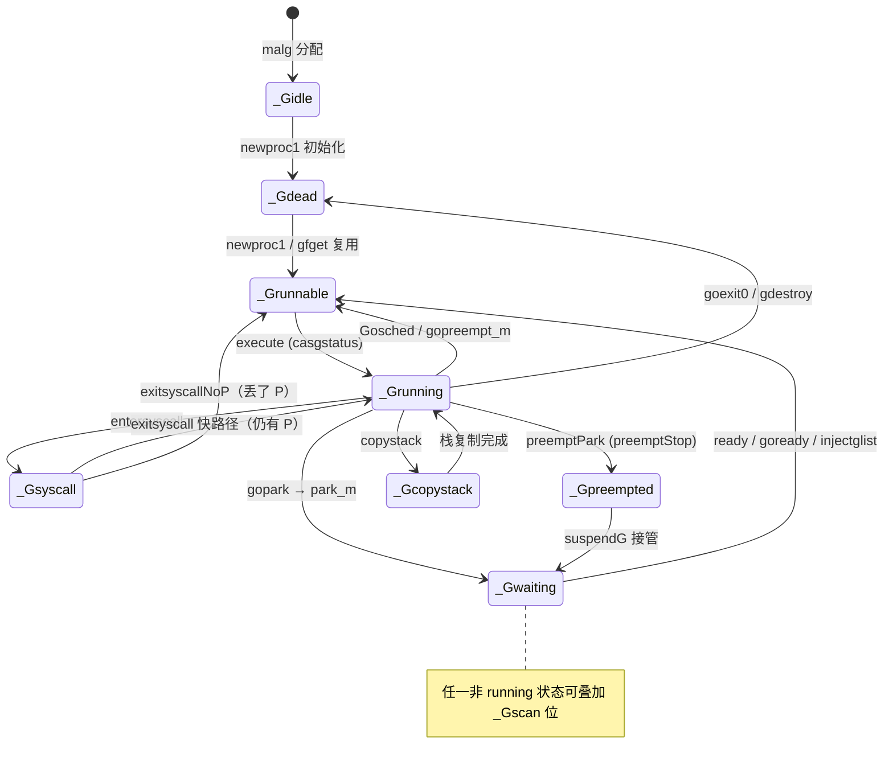
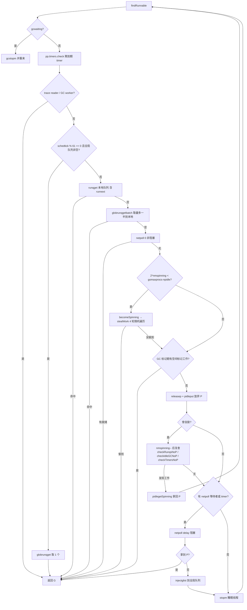
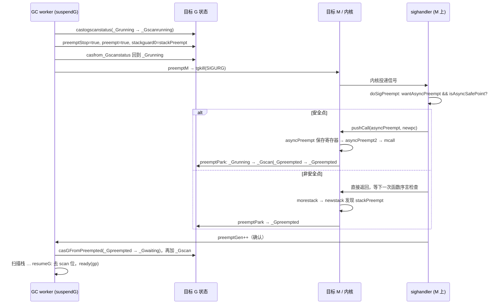

# Go 源码实现详解（七）：GMP 调度器

先给结论：

1. Go 调度器是 **M:N 两级调度**：G（goroutine）是被调度单位，M（OS 线程）是执行者，P（processor）是"执行 Go 代码的许可证"，同时承载本地运行队列、mcache、timer 堆。M 必须持有 P 才能跑 Go 代码，`gomaxprocs` 就是 P 的个数。
2. 主循环只有三个函数：`schedule` → `findRunnable` → `execute`。`findRunnable` 的顺序固定：trace reader → GC worker → 每 61 个 tick 看一次全局队列 → 本地 `runqget` → 全局 `globrunqgetbatch` → 非阻塞 `netpoll` → 成为自旋 M 后 `stealWork` → 空闲 GC mark worker → 放弃 P，阻塞在 `netpoll` 或 `stopm`。
3. 本地运行队列是 **单生产者多消费者的无锁环形队列**（256 槽）外加 `runnext` 槽；窃取靠 `runqgrab` 对 `runqhead` 的 CAS，一次拿走一半。
4. "自旋 M"在"新 G 被 ready"与"有空闲 P"之间做保守而不失并行度的线程唤醒：`wakep` 只在 `nmspinning == 0` 时唤醒一个自旋 M；最后一个停止自旋的 M 必须再唤醒一个（`resetspinning`）；`needspinning` 堵住放弃 P 时的竞态窗口。
5. `sysmon` 是不占 P 的常驻线程：20µs～10ms 自适应醒来，负责 `retake`（抢占跑满 10ms 的 P、回收陷入系统调用的 P）、10ms 未轮询时 `netpoll`、2 分钟强制 GC、唤醒 scavenger，以及 Go 1.25 起每秒一次的 GOMAXPROCS 自动更新。
6. 抢占两条路：**协作式**——`g.stackguard0 = stackPreempt`，下一次函数序言栈检查失败进 `morestack → newstack`；**异步式**——`preemptM` 用 `tgkill` 发 `SIGURG`，`doSigPreempt` 用 `isAsyncSafePoint` 判定后改写信号上下文伪造一次对 `asyncPreempt` 的调用。
7. 本文核对 golang/go master（提交 fdcd66b，Go 1.28 开发版）。与常见资料相比有几处显著差异：`_Psyscall` 已退役为 `_Psyscall_unused`，系统调用中的 P 由 G 的 `_Gsyscall` 状态配合 `setBlockOnExitSyscall` 识别；`sched.runq` 是带 `size` 的 `gQueue`，`globrunqget()` 无参数；`sched.midle` 是侵入式双向链表 `listHeadManual`；P 新增 `oldm` 弱指针让 STW 后回到原 M。

所有路径均相对仓库根目录。

## 一、核心数据结构

### 1.1 g 与 gobuf

```go
// src/runtime/runtime2.go  type g struct
type g struct {
	stack       stack   // offset known to runtime/cgo
	stackguard0 uintptr // offset known to cmd/internal/obj/*
	stackguard1 uintptr // offset known to cmd/internal/obj/*
	// ...
	m         *m      // current m
	sched     gobuf
	syscallsp uintptr // if status==Gsyscall, syscallsp = sched.sp to use during gc
	syscallpc uintptr // if status==Gsyscall, syscallpc = sched.pc to use during gc
	// ...
	atomicstatus atomic.Uint32
	goid         uint64
	schedlink    guintptr
	waitsince    int64      // approx time when the g become blocked
	waitreason   waitReason // if status==Gwaiting

	preempt       bool // preemption signal, duplicates stackguard0 = stackpreempt
	preemptStop   bool // transition to _Gpreempted on preemption; otherwise, just deschedule
	preemptShrink bool // shrink stack at synchronous safe point
	asyncSafePoint bool
	// ...
	lockedm         muintptr
	// ...
}
```

- `stackguard0` 是编译器在每个非 nosplit 函数序言里与 SP 比较的值。它既是栈溢出检查门槛，也是**协作式抢占的开关**：写成 `stackPreempt`（`src/runtime/stack.go`：`uintptrMask & -1314`）后，任何函数调用都会掉进 `morestack`。
- `preempt` 与 `stackguard0 = stackPreempt` 语义重复；`preemptStop` 决定被抢占后进 `_Gpreempted`（供 `suspendG` 接管）还是仅让出 P。
- `schedlink` 把 G 串进 `gQueue`/`gList`；`lockedm` 与 `m.lockedg` 互指实现 `LockOSThread`。

```go
// src/runtime/runtime2.go  type gobuf struct
type gobuf struct {
	sp   uintptr
	pc   uintptr
	g    guintptr
	ctxt unsafe.Pointer
	lr   uintptr
	bp   uintptr // for framepointer-enabled architectures
}
```

`gobuf` 只存 SP/PC/BP/LR 与闭包上下文：切换总发生在函数调用边界（`mcall`/`gogo`），调用者保存寄存器已由 ABI 处理。异步抢占是例外，`asyncPreempt` 汇编会把所有寄存器压到 G 栈上（第八章）。

### 1.2 g 的状态机

```go
// src/runtime/runtime2.go  const ( _Gidle = iota ... )
	_Gidle = iota // 0
	_Grunnable // 1
	_Grunning // 2
	_Gsyscall // 3
	_Gwaiting // 4
	_Gmoribund_unused // 5
	_Gdead // 6
	_Genqueue_unused // 7
	_Gcopystack // 8
	_Gpreempted // 9
	_Gleaked // 10
	_Gdeadextra // 11

	_Gscan          = 0x1000
	_Gscanrunnable  = _Gscan + _Grunnable  // 0x1001
	_Gscanrunning   = _Gscan + _Grunning   // 0x1002
	_Gscansyscall   = _Gscan + _Gsyscall   // 0x1003
	_Gscanwaiting   = _Gscan + _Gwaiting   // 0x1004
	_Gscanpreempted = _Gscan + _Gpreempted // 0x1009
	_Gscanleaked    = _Gscan + _Gleaked    // 0x100a
	_Gscandeadextra = _Gscan + _Gdeadextra // 0x100b
```

源码注释强调：**G 的状态同时充当它的栈的锁**。`_Grunning` 时栈归该 goroutine；`_Gwaiting` 时栈不属于任何人（可能被移动）；`_Gscan` 位表示 GC 正在扫描，持有 scan 位者拥有栈。所有状态读写都走 `readgstatus`/`casgstatus`/`castogscanstatus`/`casfrom_Gscanstatus`；`casgstatus` 遇到 scan 位会 `procyield`/`osyield` 自旋等待。本版本新增 `_Gleaked`（GC 检测到的泄漏 goroutine）和 `_Gdeadextra`（挂在 cgo 回调 extra M 上的 dead G），后者会出现在 `retake` 的判断中。



### 1.3 m

```go
// src/runtime/runtime2.go  type m struct
type m struct {
	g0      *g     // goroutine with scheduling stack
	morebuf gobuf  // gobuf arg to morestack
	// ...
	gsignal    *g                // signal-handling g
	curg       *g       // current running goroutine
	p puintptr
	nextp           puintptr // The next P to install before executing. Implies exclusive ownership of this P.
	oldp            puintptr // The P that was attached before executing a syscall.
	id              int64
	preemptoff      string // if != "", keep curg running on this m
	locks           int32
	spinning        bool // m is out of work and is actively looking for work
	blocked         bool // m is blocked on a note
	// ...
	park            note
	schedlink       muintptr
	idleNode        listNodeManual
	lockedg         guintptr
	lockedExt       uint32      // tracking for external LockOSThread
	lockedInt       uint32      // tracking for internal lockOSThread
	// ...
	preemptGen atomic.Uint32
	signalPending atomic.Uint32
	// ...
	self mWeakPointer
}
```

`g0` 是调度栈，`schedule`/`findRunnable`/`park_m` 都跑在 g0 上；`locks`、`preemptoff`、`mallocing` 共同决定 `canPreemptM`；`park` 是 M 睡眠的 `note`；`idleNode` 是挂到 `sched.midle` 的侵入式链表节点，`self` 是供 `p.oldm` 引用的弱指针（二者为本版本新增）；`preemptGen`/`signalPending` 用于异步抢占的确认与去重。

### 1.4 p 与本地运行队列

```go
// src/runtime/runtime2.go  type p struct
type p struct {
	id          int32
	status      uint32 // one of pidle/prunning/...
	link        puintptr
	schedtick   uint32     // incremented on every scheduler call
	syscalltick uint32     // incremented on every system call
	sysmontick  sysmontick // last tick observed by sysmon
	m           muintptr   // back-link to associated m (nil if idle)
	mcache      *mcache
	// ...
	oldm mWeakPointer
	// ...
	runqhead uint32
	runqtail uint32
	runq     [256]guintptr
	runnext guintptr
	// ...
	timers timers
	// ...
	preempt bool
	// ...
}
```

```go
// src/runtime/runtime2.go  const ( _Pidle = iota ... )
	_Pidle = iota
	_Prunning
	// _Psyscall_unused is a now-defunct state for a P. A P is
	// identified as "in a system call" by looking at the goroutine's
	// state.
	_Psyscall_unused
	_Pgcstop
	_Pdead
```

这是与老资料差异最大的一处：**`_Psyscall` 已不存在**。P 进入系统调用时仍是 `_Prunning`，"是否在系统调用中"改由当前 M 的 `curg` 是否处于 `_Gsyscall` 判断（第六章）。`schedtick` 在 `execute` 开新时间片时加一，`syscalltick` 在退出系统调用或 P 被夺走时加一，`sysmontick` 记录 sysmon 上次看到的二者。

### 1.5 schedt：全局队列与空闲链表

```go
// src/runtime/runtime2.go  type schedt struct
type schedt struct {
	// ...
	lock mutex

	midle        listHeadManual // idle m's waiting for work
	nmidle       int32          // number of idle m's waiting for work
	nmidlelocked int32          // number of locked m's waiting for work
	mnext        int64          // number of m's that have been created and next M ID
	maxmcount    int32          // maximum number of m's allowed (or die)
	nmsys        int32          // number of system m's not counted for deadlock
	// ...
	nGsyscallNoP atomic.Int32 // number of goroutines in syscalls without a P but whose M is not isExtraInC

	pidle        puintptr // idle p's
	npidle       atomic.Int32
	nmspinning   atomic.Int32  // See "Worker thread parking/unparking" comment in proc.go.
	needspinning atomic.Uint32 // See "Delicate dance" comment in proc.go. Boolean. Must hold sched.lock to set to 1.

	runq gQueue
	// ...
	gcwaiting  atomic.Bool // gc is waiting to run
	stopwait   int32
	stopnote   note
	sysmonwait atomic.Bool
	sysmonnote note
	// ...
	customGOMAXPROCS bool // GOMAXPROCS was manually set from the environment or runtime.GOMAXPROCS
	// ...
}
```

- 空闲 P 链表 `pidle` 仍是通过 `p.link` 串的单链表，由 `pidleput`/`pidleget` 维护并同步 `idlepMask`/`timerpMask` 位图。
- 空闲 M 链表 `midle` 已改为 `listHeadManual`（`src/runtime/list_manual.go`，用 `uintptr` 实现、无需写屏障的侵入式双向链表），这样 `procresize` 才能用 `mgetSpecific` 把某个 P 上次用过的 M 精确摘出来。
- 全局队列 `runq` 是 `gQueue{head, tail, size}`，旧版本单独的 `runqsize` 已并入 `size`。
- `nmspinning` 与 `npidle` 是两个独立的 `atomic.Int32`，**并未打包进同一个字**；配合它们的第三个原子量是 `needspinning`。

## 二、调度主循环

### 2.1 schedule

```go
// src/runtime/proc.go  func schedule
func schedule() {
	mp := getg().m
	if mp.locks != 0 {
		throw("schedule: holding locks")
	}
	if mp.lockedg != 0 {
		stoplockedm()
		execute(mp.lockedg.ptr(), false) // Never returns.
	}
	// ...
top:
	pp := mp.p.ptr()
	pp.preempt = false
	if mp.spinning && (pp.runnext != 0 || pp.runqhead != pp.runqtail) {
		throw("schedule: spinning with local work")
	}
	gp, inheritTime, tryWakeP := findRunnable() // blocks until work is available
	pp = mp.p.ptr() // May be on a new P.
	mp.clearAllpSnapshot()
	gcController.releaseNextGCMarkWorker(pp)
	// ...
	if mp.spinning {
		resetspinning()
	}
	// ... sched.disable.user 处理 ...
	if tryWakeP {
		wakep()
	}
	if gp.lockedm != 0 {
		startlockedm(gp) // Hands off own p to the locked m, then blocks waiting for a new p.
		goto top
	}
	execute(gp, inheritTime)
}
```

`schedule` 永远跑在 g0 上且不返回——`execute` 末尾的 `gogo` 直接跳到用户 G。若本 M 被锁定到某个 G，它只能等那个 G 可运行，`stoplockedm` 先把 P 交出去；反之找到的 G 若锁定在别的 M 上，`startlockedm` 把当前 P 递给那个 M 后自己 `stopm`。从 `findRunnable` 回来后立刻 `resetspinning`：本线程要去跑 G 了，自旋计数减一并按需 `wakep`。

### 2.2 findRunnable：查找顺序

```go
// src/runtime/proc.go  func findRunnable （节选，顺序即源码顺序）
top:
	pp := mp.p.ptr()
	if sched.gcwaiting.Load() { gcstopm(); goto top }
	if pp.runSafePointFn != 0 { runSafePointFn() }
	now, pollUntil, _ := pp.timers.check(0, nil)

	if traceEnabled() || traceShuttingDown() { /* traceReader() → return gp, false, true */ }
	if gcBlackenEnabled != 0 { /* gcController.findRunnableGCWorker → return gp, false, true */ }

	// Check the global runnable queue once in a while to ensure fairness.
	if pp.schedtick%61 == 0 && !sched.runq.empty() {
		lock(&sched.lock)
		gp := globrunqget()
		unlock(&sched.lock)
		if gp != nil { return gp, false, false }
	}
	// Wake up the finalizer G. / cleanup Gs / cgo_yield ...

	// local runq
	if gp, inheritTime := runqget(pp); gp != nil { return gp, inheritTime, false }
	// global runq
	if !sched.runq.empty() {
		lock(&sched.lock)
		gp, q := globrunqgetbatch(int32(len(pp.runq)) / 2)
		unlock(&sched.lock)
		if gp != nil { runqputbatch(pp, &q); return gp, false, false }
	}
	// Poll network. This netpoll is only an optimization before we resort to stealing.
	if netpollinited() && netpollAnyWaiters() && sched.lastpoll.Load() != 0 && sched.pollingNet.Swap(1) == 0 {
		list, delta := netpoll(0)
		// ... 非空则 injectglist 其余，返回第一个 ...
	}
```

接着是自旋窃取与放弃 P：

```go
// src/runtime/proc.go  func findRunnable （续）
	// Spinning Ms: steal work from other Ps.
	// Limit the number of spinning Ms to half the number of busy Ps.
	if mp.spinning || 2*sched.nmspinning.Load() < gomaxprocs-sched.npidle.Load() {
		if !mp.spinning {
			mp.becomeSpinning()
		}
		gp, inheritTime, tnow, w, newWork := stealWork(now)
		if gp != nil { return gp, inheritTime, false }
		if newWork { goto top }
		now = tnow
		if w != 0 && (pollUntil == 0 || w < pollUntil) { pollUntil = w }
	}
	// If we're in the GC mark phase ... run idle-time marking rather than give up the P.
	if gcBlackenEnabled != 0 && gcShouldScheduleWorker(pp) && gcController.addIdleMarkWorker() { /* ... */ }

	allpSnapshot := mp.snapshotAllp()
	// ... 加 sched.lock：再看 gcwaiting / 全局队列 / needspinning ...
	if releasep() != pp {
		throw("findRunnable: wrong p")
	}
	now = pidleput(pp, now)
	unlock(&sched.lock)
	// ... 曾自旋：nmspinning-- 后 checkRunqsNoP / checkIdleGCNoP / checkTimersNoP 复查 ...
	// Poll network until next timer.
	if netpollinited() && (netpollAnyWaiters() || pollUntil != 0) && sched.lastpoll.Swap(0) != 0 {
		list, delta := netpoll(delay) // block until new work is available
		// ... pidleget 拿 P 则返回，否则 injectglist ...
	}
	stopm()
	goto top
```



细节：

- **61**：`schedtick%61 == 0` 时先看全局队列，防止两个 G 互相 ready 霸占本地队列而饿死全局队列；61 是素数，避免与其他周期同步。
- `globrunqgetbatch(n)` 实际取 `min(n, size, size/gomaxprocs+1)`，最多本地队列一半、按 P 数均摊。
- `runqget` 的 `inheritTime` 仅在从 `runnext` 取到时为 true：该 G 继承当前时间片，`execute` 不增加 `schedtick`。
- 自旋 M 数量上限是忙碌 P 的一半。

### 2.3 execute 与 gogo

```go
// src/runtime/proc.go  func execute
func execute(gp *g, inheritTime bool) {
	mp := getg().m
	// ...
	// Assign gp.m before entering _Grunning so running Gs have an M.
	mp.curg = gp
	gp.m = mp
	gp.syncSafePoint = false // Clear the flag, which may have been set by morestack.
	casgstatus(gp, _Grunnable, _Grunning)
	gp.waitsince = 0
	gp.preempt = false
	gp.stackguard0 = gp.stack.lo + stackGuard
	if !inheritTime {
		mp.p.ptr().schedtick++
	}
	// ... DIT / profiler / trace.GoStart ...
	gogo(&gp.sched)
}
```

```asm
// src/runtime/asm_amd64.s  TEXT gogo<>(SB)
TEXT gogo<>(SB), NOSPLIT, $0
	get_tls(CX)
	MOVQ	DX, g(CX)
	MOVQ	DX, R14		// set the g register
	MOVQ	gobuf_sp(BX), SP	// restore SP
	MOVQ	gobuf_ctxt(BX), DX
	MOVQ	gobuf_bp(BX), BP
	MOVQ	$0, gobuf_sp(BX)	// clear to help garbage collector
	MOVQ	$0, gobuf_ctxt(BX)
	MOVQ	$0, gobuf_bp(BX)
	MOVQ	gobuf_pc(BX), BX
	JMP	BX
```

### 2.4 gopark / park_m / ready

```go
// src/runtime/proc.go  func gopark
func gopark(unlockf func(*g, unsafe.Pointer) bool, lock unsafe.Pointer, reason waitReason, traceReason traceBlockReason, traceskip int) {
	if reason != waitReasonSleep {
		checkTimeouts() // timeouts may expire while two goroutines keep the scheduler busy
	}
	mp := acquirem()
	gp := mp.curg
	status := readgstatus(gp)
	if status != _Grunning && status != _Gscanrunning {
		throw("gopark: bad g status")
	}
	mp.waitlock = lock
	mp.waitunlockf = unlockf
	gp.waitreason = reason
	mp.waitTraceBlockReason = traceReason
	mp.waitTraceSkip = traceskip
	releasem(mp)
	// can't do anything that might move the G between Ms here.
	mcall(park_m)
}
```

```go
// src/runtime/proc.go  func park_m （节选）
func park_m(gp *g) {
	mp := getg().m
	// ...
	casgstatus(gp, _Grunning, _Gwaiting)
	// ...
	dropg()
	if fn := mp.waitunlockf; fn != nil {
		ok := fn(gp, mp.waitlock)
		mp.waitunlockf = nil
		mp.waitlock = nil
		if !ok {
			casgstatus(gp, _Gwaiting, _Grunnable)
			// ...
			execute(gp, true) // Schedule it back, never returns.
		}
	}
	// ...
	schedule()
}
```

顺序是关键：**先切到 `_Gwaiting` 并 `dropg`，再调 `unlockf` 释放锁**。从 `unlockf` 返回起另一个线程就可以 `ready` 这个 G；`unlockf` 返回 false（条件已变）则直接 `execute(gp, true)` 恢复。这就是 channel/mutex 能安全实现"检查条件再睡眠"的基础。

```go
// src/runtime/proc.go  func ready
func ready(gp *g, traceskip int, next bool) {
	status := readgstatus(gp)
	mp := acquirem() // disable preemption because it can be holding p in a local var
	if status&^_Gscan != _Gwaiting {
		dumpgstatus(gp)
		throw("bad g->status in ready")
	}
	// status is Gwaiting or Gscanwaiting, make Grunnable and put on runq
	casgstatus(gp, _Gwaiting, _Grunnable)
	// ...
	runqput(mp.p.ptr(), gp, next)
	wakep()
	releasem(mp)
}
```

`goready` 是 `systemstack(func(){ ready(gp, traceskip, true) })`，所以 channel 唤醒的接收者总进 `runnext`——发送者一阻塞，接收者就能在同一个 P 上接着跑，这是同步 channel ping-pong 很快的根源。`newproc` 创建新 G 也用 `runqput(pp, newg, true)` 并 `wakep()`。

## 三、运行队列的无锁实现

### 3.1 runqput 与 runnext

```go
// src/runtime/proc.go  func runqput （节选）
	if next {
	retryNext:
		oldnext := pp.runnext
		if !pp.runnext.cas(oldnext, guintptr(unsafe.Pointer(gp))) {
			goto retryNext
		}
		if oldnext == 0 {
			return
		}
		// Kick the old runnext out to the regular run queue.
		gp = oldnext.ptr()
	}
retry:
	h := atomic.LoadAcq(&pp.runqhead) // load-acquire, synchronize with consumers
	t := pp.runqtail
	if t-h < uint32(len(pp.runq)) {
		pp.runq[t%uint32(len(pp.runq))].set(gp)
		atomic.StoreRel(&pp.runqtail, t+1) // store-release, makes the item available for consumption
		return
	}
	if runqputslow(pp, gp, h, t) {
		return
	}
	goto retry
```

- `runq` 是 256 槽环形缓冲，`runqhead`/`runqtail` 单调递增、取模索引。**只有所有者 P 写 `runqtail`**，所以对 tail 只需 store-release；`runqhead` 会被窃取者 CAS，所以要 load-acquire。
- `runnext` 只有一个槽：新 G 抢占它，旧的被踢到环形队列尾部。函数开头有 `if !haveSysmon && next { next = false }`——`runnext` 继承时间片，一对互相唤醒的 G 会共享同一个 `schedtick`，只能靠 sysmon 强制抢占避免饿死其他 G，所以没有 sysmon 的 wasm 禁用 `runnext`。
- 队列满时 `runqputslow` 把前一半（128 个）加上新 G 批量搬到全局队列，用 `atomic.CasRel(&pp.runqhead, h, h+n)` 提交，失败就回 `retry`。

### 3.2 runqget

```go
// src/runtime/proc.go  func runqget
func runqget(pp *p) (gp *g, inheritTime bool) {
	// If there's a runnext, it's the next G to run.
	next := pp.runnext
	// If the runnext is non-0 and the CAS fails, it could only have been stolen by another P,
	// because other Ps can race to set runnext to 0, but only the current P can set it to non-0.
	// Hence, there's no need to retry this CAS if it fails.
	if next != 0 && pp.runnext.cas(next, 0) {
		return next.ptr(), true
	}
	for {
		h := atomic.LoadAcq(&pp.runqhead) // load-acquire, synchronize with other consumers
		t := pp.runqtail
		if t == h {
			return nil, false
		}
		gp := pp.runq[h%uint32(len(pp.runq))].ptr()
		if atomic.CasRel(&pp.runqhead, h, h+1) { // cas-release, commits consume
			return gp, false
		}
	}
}
```

### 3.3 runqgrab 与 runqsteal

```go
// src/runtime/proc.go  func runqgrab （节选）
	for {
		h := atomic.LoadAcq(&pp.runqhead) // load-acquire, synchronize with other consumers
		t := atomic.LoadAcq(&pp.runqtail) // load-acquire, synchronize with the producer
		n := t - h
		n = n - n/2
		if n == 0 {
			if stealRunNextG {
				// Try to steal from pp.runnext.
				if next := pp.runnext; next != 0 {
					if pp.status == _Prunning {
						if mp := pp.m.ptr(); mp != nil {
							if gp := mp.curg; gp == nil || readgstatus(gp)&^_Gscan != _Gsyscall {
								// Sleep to ensure that pp isn't about to run the g we are about to steal.
								if !osHasLowResTimer { usleep(3) } else { osyield() }
							}
						}
					}
					if !pp.runnext.cas(next, 0) {
						continue
					}
					batch[batchHead%uint32(len(batch))] = next
					return 1
				}
			}
			return 0
		}
		if n > uint32(len(pp.runq)/2) { // read inconsistent h and t
			continue
		}
		for i := uint32(0); i < n; i++ {
			batch[(batchHead+i)%uint32(len(batch))] = pp.runq[(h+i)%uint32(len(pp.runq))]
		}
		if atomic.CasRel(&pp.runqhead, h, h+n) { // cas-release, commits consume
			return n
		}
	}
```

- 一次偷 `n - n/2`（向上取整的一半）：先把元素复制到自己 `runq` 尾部，再用一次 CAS 推进受害者的 `runqhead` 提交；失败整体重来，元素并未真正被拿走，因此无锁且线性化。
- **偷 `runnext` 是最后手段**：只在 `stealWork` 最后一轮允许，且受害 P 在运行、其 G 不在系统调用里时先 `usleep(3)`。注释的用例是"G 唤醒另一个 G 后立刻阻塞"——此时偷走 `runnext` 会让两个 G 在 P 之间反复搬迁。受害 G 在 `_Gsyscall` 时不等待，这是 `_Psyscall` 退役后改看 G 状态的地方之一。

`runqsteal` 把 `runqgrab` 到自己尾部的一批 G 中最后一个直接返回，其余用 `atomic.StoreRel(&pp.runqtail, t+n)` 发布。

### 3.4 全局队列

全局队列所有操作都要求持有 `sched.lock`：`globrunqput` 尾插、`globrunqget` 弹头、`globrunqgetbatch` 按 `min(n, size, size/gomaxprocs+1)` 批取。`Gosched`（`goschedImpl`）把让出的 G 放到全局队列尾部而非本地队列，所以主动让出比 `runnext` 抢占"更公平"；但若是为 STW 而抢占，则保留在本地 `runnext`，STW 结束后立即续跑。

## 四、自旋 M 与工作窃取

### 4.1 为什么要自旋

`src/runtime/proc.go` 开头的 "Worker thread parking/unparking" 注释列了三个被否决的方案——集中所有调度状态、把 G 直接交给刚唤醒的线程、每次 ready 都唤醒一个线程——并给出当前策略：

> We unpark an additional thread when we submit work if (this is wakep()):
> 1. There is an idle P, and
> 2. There are no "spinning" worker threads.

自旋 M 是"已经醒着、正在各 P 队列间找活"的线程。它让提交工作的一方可以不唤醒新线程（有人在找了），又保证最终把并行度用满：**最后一个退出自旋的线程若找到了工作，必须再唤醒一个自旋线程**。注释给出两条同步模式——提交方"入队 → StoreLoad 屏障 → 检查 `nmspinning`"，退出自旋方"`nmspinning--` → StoreLoad 屏障 → 复查所有队列"——两边各自先写后读，保证不会出现"工作已提交但没人负责唤醒"。

### 4.2 nmspinning、npidle 与 needspinning

```go
// src/runtime/proc.go  func (mp *m) becomeSpinning / func resetspinning
func (mp *m) becomeSpinning() {
	mp.spinning = true
	sched.nmspinning.Add(1)
	sched.needspinning.Store(0)
}

func resetspinning() {
	gp := getg()
	if !gp.m.spinning {
		throw("resetspinning: not a spinning m")
	}
	gp.m.spinning = false
	nmspinning := sched.nmspinning.Add(-1)
	if nmspinning < 0 {
		throw("findRunnable: negative nmspinning")
	}
	// M wakeup policy is deliberately somewhat conservative, so check if we
	// need to wakeup another P here.
	wakep()
}
```

`needspinning` 解决的是 "Delicate dance"：自旋 M 放弃 P 之后的复查发现了工作，但已没有空闲 P 可拿——它可能正与一个"没找到工作、准备把 P 放回空闲链表"的非自旋 M 赛跑。`pidlegetSpinning` 拿不到 P 时置 `needspinning = 1`，而非自旋 M 放弃 P 前在 `sched.lock` 下检查该标志：

```go
// src/runtime/proc.go  func findRunnable （放弃 P 前）
	if !mp.spinning && sched.needspinning.Load() == 1 {
		// See "Delicate dance" comment below.
		mp.becomeSpinning()
		unlock(&sched.lock)
		goto top
	}
	if releasep() != pp {
		throw("findRunnable: wrong p")
	}
	now = pidleput(pp, now)
```

它不放弃 P，而是代替对方成为自旋 M 重找一遍。`handoffp` 里也是同一模式：`nmspinning.CompareAndSwap(0, 1)` 成功后 `needspinning.Store(0)` 再 `startm(pp, true, false)`。

### 4.3 wakep / startm / stopm / handoffp

```go
// src/runtime/proc.go  func wakep
func wakep() {
	// Be conservative about spinning threads, only start one if none exist already.
	if sched.nmspinning.Load() != 0 || !sched.nmspinning.CompareAndSwap(0, 1) {
		return
	}
	mp := acquirem()
	var pp *p
	lock(&sched.lock)
	pp, _ = pidlegetSpinning(0)
	if pp == nil {
		if sched.nmspinning.Add(-1) < 0 {
			throw("wakep: negative nmspinning")
		}
		unlock(&sched.lock)
		releasem(mp)
		return
	}
	unlock(&sched.lock)
	startm(pp, true, false)
	releasem(mp)
}
```

`wakep` 先 CAS 抢"唯一自旋名额"，再拿空闲 P，拿不到就把名额还回去。`startm` 从 `sched.midle` `mget` 一个睡眠的 M（没有就 `mReserveID` 预分配 id 后 `newm`），把 P 放进 `m.nextp` 并 `notewakeup(&nmp.park)`：

```go
// src/runtime/proc.go  func startm （节选）
	nmp := mget()
	if nmp == nil {
		id := mReserveID()
		unlock(&sched.lock)
		var fn func()
		if spinning {
			fn = mspinning // The caller incremented nmspinning, so set m.spinning in the new M.
		}
		newm(fn, pp, id)
		// ...
		releasem(mp)
		return
	}
	// ...
	nmp.spinning = spinning
	nmp.nextp.set(pp)
	notewakeup(&nmp.park)
	releasem(mp)
```

`startm` 全程 `acquirem` 禁止抢占：每个被持有的 P 都必须有一个最终会响应 STW 的所有者，临时持有 P 的窗口若被抢占去做 STW，这个 P 就会悬空导致 STW 死锁。`mReserveID` 让 `checkdead` 把尚未启动的线程也算作 running，避免误报死锁。

```go
// src/runtime/proc.go  func stopm
func stopm() {
	gp := getg()
	if gp.m.locks != 0 { throw("stopm holding locks") }
	if gp.m.p != 0 { throw("stopm holding p") }
	if gp.m.spinning { throw("stopm spinning") }

	lock(&sched.lock)
	mput(gp.m)
	unlock(&sched.lock)
	mPark()
	acquirep(gp.m.nextp.ptr())
	gp.m.nextp = 0
}
```

`handoffp` 用于"M 不再需要这个 P 但 P 上可能有活"（系统调用被 retake、锁定 M 让出等）。注释里的不变量：**只要 `findRunnable` 在这个 P 上能找到 G，`handoffp` 就必须启动一个 M**。它依次检查本地/全局队列、trace、GC 工作、是否需要自旋 M、是否在 STW、是否是最后一个 P（需有人去 netpoll），都不满足才 `pidleput`。

### 4.4 stealWork 与随机遍历

```go
// src/runtime/proc.go  func stealWork （节选）
	const stealTries = 4
	for i := 0; i < stealTries; i++ {
		stealTimersOrRunNextG := i == stealTries-1
		for enum := stealOrder.start(cheaprand()); !enum.done(); enum.next() {
			if sched.gcwaiting.Load() {
				return nil, false, now, pollUntil, true
			}
			p2 := allp[enum.position()]
			if pp == p2 {
				continue
			}
			if stealTimersOrRunNextG && timerpMask.read(enum.position()) {
				tnow, w, ran := p2.timers.check(now, nil)
				// ... 记录最早 timer；若跑了 timer 先看自己的本地队列 ...
			}
			// Don't bother to attempt to steal if p2 is idle.
			if !idlepMask.read(enum.position()) {
				if gp := runqsteal(pp, p2, stealTimersOrRunNextG); gp != nil {
					return gp, false, now, pollUntil, ranTimer
				}
			}
		}
	}
```

四轮遍历，只有最后一轮允许偷 `runnext` 和替别的 P 跑 timer。遍历顺序由 `randomOrder` 生成：`start(i)` 取随机起点 `i % count` 和一个与 `gomaxprocs` 互素的步长 `coprimes[...]`，保证每轮恰好访问每个 P 一次且各 M 顺序不同。`idlepMask`/`timerpMask` 两张位图让窃取者跳过空闲 P 和无 timer 的 P。

### 4.5 injectglist

`netpoll`、sysmon、`startTheWorld` 收集到的就绪 G 通过 `injectglist` 投递：有 P 时为每个空闲 P 分一个 G 到全局队列并 `startm`，其余放本地队列；无 P 时全部进全局队列并按数量启动空闲 M。函数末尾无条件 `wakep()`，注释说这是对冲"读 `npidle` 之后又有 P 变空闲"的窗口。

## 五、M 的创建与线程绑定

### 5.1 newm → newm1 → newosproc → mstart

```go
// src/runtime/proc.go  func newm
func newm(fn func(), pp *p, id int64) {
	acquirem()
	mp := allocm(pp, fn, id)
	mp.nextp.set(pp)
	mp.sigmask = initSigmask
	if gp := getg(); gp != nil && gp.m != nil && (gp.m.lockedExt != 0 || gp.m.incgo) && GOOS != "plan9" {
		// We're on a locked M or a thread that may have been started by C.
		// ... ask a known-good thread to create the thread for us.
		lock(&newmHandoff.lock)
		if newmHandoff.haveTemplateThread == 0 {
			throw("on a locked thread with no template thread")
		}
		mp.schedlink = newmHandoff.newm
		newmHandoff.newm.set(mp)
		if newmHandoff.waiting {
			newmHandoff.waiting = false
			notewakeup(&newmHandoff.wake)
		}
		unlock(&newmHandoff.lock)
		releasem(getg().m)
		return
	}
	newm1(mp)
	releasem(getg().m)
}
```

`allocm` 分配 `m` 与 g0 栈；`newm1` 在 cgo 模式走 `_cgo_thread_start`，否则 `newosproc`。Linux 的 `newosproc`（`src/runtime/os_linux.go`）先屏蔽所有信号，再 `clone(cloneFlags, stk, mp, mp.g0, mstart)`，其中 `cloneFlags = _CLONE_VM | _CLONE_FS | _CLONE_FILES | _CLONE_SIGHAND | _CLONE_SYSVSEM | _CLONE_THREAD`；`EAGAIN` 会 `retryOnEAGAIN` 重试。新线程以汇编 `mstart`（`TOPFRAME`，栈回溯的根）为入口，调用 `mstart0` → `mstart1`：

```go
// src/runtime/proc.go  func mstart1 （节选）
func mstart1() {
	gp := getg()
	if gp != gp.m.g0 {
		throw("bad runtime·mstart")
	}
	// Set up m.g0.sched as a label returning to just
	// after the mstart1 call in mstart0 above, for use by goexit0 and mcall.
	gp.sched.g = guintptr(unsafe.Pointer(gp))
	gp.sched.pc = sys.GetCallerPC()
	gp.sched.sp = sys.GetCallerSP()
	gp.sched.bp = getcallerfp()

	asminit()
	minit()
	if gp.m == &m0 {
		mstartm0()
	}
	// ...
	if fn := gp.m.mstartfn; fn != nil {
		fn()
	}
	if gp.m != &m0 {
		acquirep(gp.m.nextp.ptr())
		gp.m.nextp = 0
	}
	schedule()
}
```

`g0.sched` 被设成"返回到 `mstart0` 中 `mstart1` 调用之后"，`mexit` 时 `gogo(&g0.sched)` 就能展开 g0 栈再退出线程。`mstartfn` 是 `startm` 传的 `mspinning`，或 `sysmon`/`templateThread` 这类系统 M 的主函数。

### 5.2 templateThread

被 `LockOSThread` 锁定的线程可能处于用户改过的内核态（namespace、uid 等），从它 `clone` 的线程会继承。所以 `LockOSThread` 第一次被调用时先 `startTemplateThread`，之后锁定线程或 cgo 线程上的 `newm` 都把 `m` 挂到 `newmHandoff.newm` 链表，由模板线程代为 `newm1`：

```go
// src/runtime/proc.go  func templateThread （节选）
	for {
		lock(&newmHandoff.lock)
		for newmHandoff.newm != 0 {
			newm := newmHandoff.newm.ptr()
			newmHandoff.newm = 0
			unlock(&newmHandoff.lock)
			for newm != nil {
				next := newm.schedlink.ptr()
				newm.schedlink = 0
				newm1(newm)
				newm = next
			}
			lock(&newmHandoff.lock)
		}
		newmHandoff.waiting = true
		noteclear(&newmHandoff.wake)
		unlock(&newmHandoff.lock)
		notesleep(&newmHandoff.wake)
	}
```

它没有 P（标注 `nowritebarrierrec`），只做"替别人 clone"这一件事。

### 5.3 LockOSThread 与 lockedm

```go
// src/runtime/proc.go  func LockOSThread / dolockOSThread
func LockOSThread() {
	if atomic.Load(&newmHandoff.haveTemplateThread) == 0 && GOOS != "plan9" {
		startTemplateThread()
	}
	gp := getg()
	gp.m.lockedExt++
	if gp.m.lockedExt == 0 {
		gp.m.lockedExt--
		panic("LockOSThread nesting overflow")
	}
	dolockOSThread()
}

func dolockOSThread() {
	if GOARCH == "wasm" {
		return // no threads on wasm yet
	}
	gp := getg()
	gp.m.lockedg.set(gp)
	gp.lockedm.set(gp.m)
}
```

`lockedExt` 计外部调用，`lockedInt` 计运行时内部调用（如 `runtime.main` 跑 init 时）。锁定后的调度路径：锁定 G 阻塞时，M 走 `schedule` → `stoplockedm`，先 `handoffp` 交出 P，`incidlelocked(1)`，然后 `mPark`；其他 M 取到这个 G 时 `startlockedm` 把自己的 P 经 `nextp` 递给锁定 M 并唤醒它，自己 `stopm`。所以锁定 G 每次唤醒都伴随一次 P 交接和两次线程切换。锁定 G 退出时没 `UnlockOSThread`，`gdestroy` 会让该 M 直接 `mexit`。

## 六、系统调用与 P 的归属

### 6.1 entersyscall

```go
// src/runtime/proc.go  func reentersyscall （节选）
	gp.m.locks++
	// ...
	gp.stackguard0 = stackPreempt
	gp.throwsplit = true

	// Copy the syscalltick over so we can identify if the P got stolen later.
	gp.m.syscalltick = gp.m.p.ptr().syscalltick

	pp := gp.m.p.ptr()
	if pp.runSafePointFn != 0 {
		systemstack(runSafePointFn)
	}
	gp.m.oldp.set(pp)

	// Leave SP around for GC and traceback.
	save(pc, sp, bp)
	gp.syscallsp = sp
	gp.syscallpc = pc
	gp.syscallbp = bp
	// ...
	if sched.gcwaiting.Load() {
		systemstack(func() { entersyscallHandleGCWait(trace) })
		save(pc, sp, bp)
	}
	// As soon as we switch to _Gsyscall, we are in danger of losing our P.
	// We must not touch it after this point.
	if gp.bubble != nil || !gp.atomicstatus.CompareAndSwap(_Grunning, _Gsyscall) {
		casgstatus(gp, _Grunning, _Gsyscall)
	}
	// ...
	if sched.sysmonwait.Load() {
		systemstack(entersyscallWakeSysmon)
		save(pc, sp, bp)
	}
	gp.m.locks--
```

- 整个函数 `nosplit`：系统调用参数里可能有指向栈的裸 `uintptr`，栈绝不能移动；`throwsplit = true` 让意外的栈分裂直接 `throw`。
- **P 并没有被释放**，只是记到 `m.oldp`，G 切到 `_Gsyscall`；P 仍是 `_Prunning`、`p.m` 仍指向本 M。
- 复制 `syscalltick` 是为了退出时判断 P 有没有被拿走过；有 STW 在等时 `entersyscallHandleGCWait` 立即交出 P；sysmon 深睡时唤醒它以便按时 retake。

### 6.2 exitsyscall

```go
// src/runtime/proc.go  func exitsyscall （节选）
	// Optimistically assume we're going to keep running, and switch to running.
	if gp.bubble != nil || !gp.atomicstatus.CompareAndSwap(_Gsyscall, _Grunning) {
		casgstatus(gp, _Gsyscall, _Grunning)
	}
	oldp := gp.m.oldp.ptr()
	gp.m.oldp.set(nil)

	// Check if we still have a P, and if not, try to acquire an idle P.
	pp := gp.m.p.ptr()
	if pp != nil {
		// Fast path: we still have our P. Just emit a syscall exit event.
	} else {
		// Slow path: we lost our P. Try to get another one.
		systemstack(func() {
			if pp := exitsyscallTryGetP(oldp); pp != nil {
				acquirepNoTrace(pp)
			}
		})
		pp = gp.m.p.ptr()
	}
	if pp != nil {
		pp.syscalltick++
		gp.syscallsp = 0
		gp.m.locks--
		if gp.preempt {
			gp.stackguard0 = stackPreempt // Restore the preemption request in case we cleared it in newstack.
		} else {
			gp.stackguard0 = gp.stack.lo + stackGuard
		}
		gp.throwsplit = false
		return
	}
	// Slowest path: We couldn't get a P, so call into the scheduler.
	gp.m.locks--
	mcall(exitsyscallNoP)
```

三级路径：**快路径**——`m.p` 仍非空，直接切回 `_Grunning`；**慢路径**——`exitsyscallTryGetP` 先用 `setBlockOnExitSyscall(oldp)` 抢回原 P（若它正被另一个系统调用中的 G 占着），再 `pidleget` 任意空闲 P；**最慢路径**——`mcall(exitsyscallNoP)`，G 变 `_Grunnable` 进全局队列，M `stopm`。

### 6.3 _Psyscall 退役后的判定：setBlockOnExitSyscall

```go
// src/runtime/proc.go  func setBlockOnExitSyscall （节选）
	if pp.status != _Prunning {
		return syscallingThread{}, false
	}
	mp := pp.m.ptr()
	if mp == nil { return syscallingThread{}, false }
	gp := mp.curg
	if gp == nil { return syscallingThread{}, false }
	status := readgstatus(gp) &^ _Gscan
	// A goroutine is considered in a syscall, and may have a corresponding
	// P, if it's in _Gsyscall *or* _Gdeadextra.
	if status != _Gsyscall && status != _Gdeadextra {
		return syscallingThread{}, false
	}
	if !castogscanstatus(gp, status, status|_Gscan) {
		return syscallingThread{}, false
	}
	if gp.m != mp || gp.m.p.ptr() != pp {
		casfrom_Gscanstatus(gp, status|_Gscan, status)
		return syscallingThread{}, false
	}
	return syscallingThread{gp, mp, pp, status}, true
```

思路是**借 `_Gscan` 位当锁**：给 `_Gsyscall` 的 G 加 scan 位后，`exitsyscall` 里的 `CompareAndSwap(_Gsyscall, _Grunning)` 会失败并进入 `casgstatus` 自旋，线程无法离开系统调用；调用者随后可以安全地 `takeP()`（清 `pp.m`/`mp.p`、P 置 `_Pidle`、`syscalltick++`、`addGSyscallNoP`）或 `gcstopP()`，最后 `resume()` 摘掉 scan 位放行。`sched.nGsyscallNoP` 统计"在系统调用里且已失去 P"的 G 数，供 `checkdead` 与 `/sched/goroutines/not-in-go:goroutines` 指标使用。

## 七、sysmon

### 7.1 主循环

`sysmon` 由 `runtime.main` 用 `newm(sysmon, nil, -1)` 启动，是一个**没有 P** 的 M（`haveSysmon = GOARCH != "wasm"`）：

```go
// src/runtime/proc.go  func sysmon （节选）
	idle := 0 // how many cycles in succession we had not wokeup somebody
	delay := uint32(0)
	for {
		if idle == 0 { // start with 20us sleep...
			delay = 20
		} else if idle > 50 { // start doubling the sleep after 1ms...
			delay *= 2
		}
		if delay > 10*1000 { // up to 10ms
			delay = 10 * 1000
		}
		usleep(delay)
		now := nanotime()
		if debug.schedtrace <= 0 && (sched.gcwaiting.Load() || sched.npidle.Load() == gomaxprocs) {
			// ... 所有 P 空闲或 STW 中：notetsleep(&sched.sysmonnote, sleep) 深睡 ...
		}
		lock(&sched.sysmonlock)
		now = nanotime()
		// poll network if not polled for more than 10ms
		lastpoll := sched.lastpoll.Load()
		if netpollinited() && lastpoll != 0 && lastpoll+10*1000*1000 < now {
			sched.lastpoll.CompareAndSwap(lastpoll, now)
			list, delta := netpoll(0) // non-blocking - returns list of goroutines
			if !list.empty() {
				incidlelocked(-1)
				injectglist(&list)
				incidlelocked(1)
				netpollAdjustWaiters(delta)
			}
		}
```

```go
// src/runtime/proc.go  func sysmon （续）
		// Check if we need to update GOMAXPROCS at most once per second.
		if debug.updatemaxprocs != 0 && lastgomaxprocs+1e9 <= now {
			sysmonUpdateGOMAXPROCS()
			lastgomaxprocs = now
		}
		if scavenger.sysmonWake.Load() != 0 {
			scavenger.wake() // Kick the scavenger awake if someone requested it.
		}
		// retake P's blocked in syscalls
		// and preempt long running G's
		if retake(now) != 0 {
			idle = 0
		} else {
			idle++
		}
		// check if we need to force a GC
		if t := (gcTrigger{kind: gcTriggerTime, now: now}); t.test() && forcegc.idle.Load() {
			lock(&forcegc.lock)
			forcegc.idle.Store(false)
			var list gList
			list.push(forcegc.g)
			injectglist(&list)
			unlock(&forcegc.lock)
		}
		if debug.schedtrace > 0 && lasttrace+int64(debug.schedtrace)*1000000 <= now {
			lasttrace = now
			schedtrace(debug.scheddetail > 0)
		}
		unlock(&sched.sysmonlock)
	}
```

睡眠策略：起始 20µs；连续 50 轮没干活后翻倍，封顶 10ms；所有 P 空闲时深睡到最近 timer 或 `forcegcperiod/2`，由 `entersyscallWakeSysmon`/`exitsyscallTryGetP`/`startTheWorldWithSema` 用 `sysmonnote` 唤醒。每轮工作：**netpoll 兜底**（所有 P 都忙时没人调 `netpoll`）；**GOMAXPROCS 自动更新**（每秒最多一次，第九章）；**scavenger** 唤醒；**retake**；**forcegc**（`forcegcperiod = 2 * 60 * 1e9`，把 `forcegchelper` 注入队列由它 `gcStart`）；**schedtrace** 打印。

### 7.2 retake

```go
// src/runtime/proc.go  func retake （节选）
		pd := &pp.sysmontick
		sysretake := false
		// Preempt G if it's running on the same schedtick for too long.
		schedt := int64(pp.schedtick)
		if int64(pd.schedtick) != schedt {
			pd.schedtick = uint32(schedt)
			pd.schedwhen = now
		} else if pd.schedwhen+forcePreemptNS <= now {
			preemptone(pp)
			// If pp is in a syscall, preemptone doesn't work. ... so we need to take the P ourselves.
			sysretake = true
		}
		unlock(&allpLock)
		incidlelocked(-1)
		// Try to prevent the P from continuing in the syscall, if it's in one at all.
		thread, ok := setBlockOnExitSyscall(pp)
		if !ok {
			goto done
		}
		// Retake the P if it's there for more than 1 sysmon tick (at least 20us).
		if syst := int64(pp.syscalltick); !sysretake && int64(pd.syscalltick) != syst {
			pd.syscalltick = uint32(syst)
			pd.syscallwhen = now
			thread.resume()
			goto done
		}
		if runqempty(pp) && sched.nmspinning.Load()+sched.npidle.Load() > 0 && pd.syscallwhen+10*1000*1000 > now {
			thread.resume()
			goto done
		}
		thread.takeP()
		thread.resume()
		n++
		handoffp(pp)
```

两条规则：

1. **抢占长时间运行的 G**：同一 `schedtick` 持续超过 `forcePreemptNS = 10ms` 就 `preemptone`。`runnext` 链上的 G 共享 `schedtick`，所以 10ms 是整条链的预算。
2. **回收系统调用中的 P**：对 `setBlockOnExitSyscall` 冻结成功的线程，若 `syscalltick` 自上次观察没变（同一系统调用跨了至少一个 sysmon 周期），且满足任一条件就 `takeP` 后 `handoffp`：本地队列非空；没有自旋 M 也没有空闲 P；系统调用已超 10ms（防止 sysmon 无法深睡）。

旧版本的 `_Psyscall → _Pidle` CAS 在此被 scan 位加锁 + `takeP` 取代。

### 7.3 preemptone

```go
// src/runtime/proc.go  func preemptone （节选）
	mp := pp.m.ptr()
	if mp == nil || mp == getg().m {
		return false
	}
	gp := mp.curg
	if gp == nil || gp == mp.g0 {
		return false
	}
	if readgstatus(gp)&^_Gscan == _Gsyscall {
		// Don't bother trying to preempt a goroutine in a syscall.
		return false
	}
	gp.preempt = true
	// Setting gp->stackguard0 to StackPreempt folds
	// preemption into the normal stack overflow check.
	gp.stackguard0 = stackPreempt

	// Request an async preemption of this P.
	if preemptMSupported && debug.asyncpreemptoff == 0 {
		pp.preempt = true
		preemptM(mp)
	}
	return true
```

它同时发出协作式（`stackPreempt`）与异步（`preemptM`）两种请求。`preemptall` 对所有 `_Prunning` 的 P 调用它，用于 STW 与 `freezetheworld`。

## 八、抢占

`src/runtime/preempt.go` 文件头把安全点分成三类：阻塞安全点（G 已 descheduled）、同步安全点（G 主动检查抢占请求）、异步安全点（用户代码中任意可保守扫描栈和寄存器的指令）。

### 8.1 协作式抢占：stackguard0 → morestack → newstack

编译器给每个非 nosplit 函数插入序言 `CMPQ SP, g.stackguard0; JLS morestack`。`stackguard0 = stackPreempt` 后下一次调用必然进 `morestack`，它保存现场到 `m.morebuf` 后切 g0 调 `newstack`：

```go
// src/runtime/stack.go  func newstack （节选）
	stackguard0 := atomic.Loaduintptr(&gp.stackguard0)
	preempt := stackguard0 == stackPreempt
	if preempt {
		if !canPreemptM(thisg.m) {
			// Let the goroutine keep running for now.
			// gp->preempt is set, so it will be preempted next time.
			gp.stackguard0 = gp.stack.lo + stackGuard
			gogo(&gp.sched) // never return
		}
	}
	// ...
	if preempt {
		if gp == thisg.m.g0 {
			throw("runtime: preempt g0")
		}
		if thisg.m.p == 0 && thisg.m.locks == 0 {
			throw("runtime: g is running but p is not")
		}
		if gp.preemptShrink {
			// We're at a synchronous safe point now, so do the pending stack shrink.
			gp.preemptShrink = false
			shrinkstack(gp)
		}
		gp.syncSafePoint = true
		if gp.preemptStop {
			preemptPark(gp) // never returns
		}
		// Act like goroutine called runtime.Gosched.
		gopreempt_m(gp) // never return
	}
	// Allocate a bigger segment and move the stack.
```

```go
// src/runtime/preempt.go  func canPreemptM
func canPreemptM(mp *m) bool {
	return mp.locks == 0 && mp.mallocing == 0 && mp.preemptoff == "" && mp.p.ptr().status == _Prunning && mp.curg != nil && readgstatus(mp.curg)&^_Gscan != _Gsyscall
}
```

不满足 `canPreemptM` 时恢复真实 `stackguard0` 放行，但 `gp.preempt` 仍为 true，`exitsyscall` 等路径退出时会重新设回。`gopreempt_m` → `goschedImpl(gp, true)`，G 进全局队列（STW 期间进 `runnext`）。协作式抢占的固有缺陷：没有函数调用的紧密循环永远碰不到序言检查——这是 Go 1.14 引入异步抢占的原因。

### 8.2 异步抢占：preemptM → SIGURG → doSigPreempt → asyncPreempt

```go
// src/runtime/signal_unix.go  const sigPreempt / func preemptM （节选）
const sigPreempt = _SIGURG

func preemptM(mp *m) {
	// ...
	if mp.signalPending.CompareAndSwap(0, 1) {
		// ... Only send a signal if there isn't already one pending.
		signalM(mp, sigPreempt)
	}
	// ...
}
```

`signalM` 在 Linux 上是 `tgkill(getpid(), mp.procid, sig)`，精确投递到目标线程。`signalPending` 保证同一 M 最多一个未决信号，避免多个抢占者互相踩踏造成活锁（issue #37741）。选 `SIGURG` 的理由在 `signal_unix.go` 第 44 行起：默认被忽略、调试器和程序几乎不用、无人依赖。

```go
// src/runtime/signal_unix.go  func sighandler （节选） / func doSigPreempt
	if sig == sigPreempt && debug.asyncpreemptoff == 0 && !delayedSignal {
		// Might be a preemption signal.
		doSigPreempt(gp, c)
		// Even if this was definitely a preemption signal, it
		// may have been coalesced with another signal, so we
		// still let it through to the application.
	}

func doSigPreempt(gp *g, ctxt *sigctxt) {
	// Check if this G wants to be preempted and is safe to preempt.
	if wantAsyncPreempt(gp) {
		if ok, newpc := isAsyncSafePoint(gp, ctxt.sigpc(), ctxt.sigsp(), ctxt.siglr()); ok {
			// Adjust the PC and inject a call to asyncPreempt.
			ctxt.pushCall(abi.FuncPCABI0(asyncPreempt), newpc)
		}
	}
	// Acknowledge the preemption.
	gp.m.preemptGen.Add(1)
	gp.m.signalPending.Store(0)
	// ...
}
```

`pushCall` 改写信号上下文，让线程从信号返回时"像刚在 `newpc` 处调用了 `asyncPreempt`"：

```go
// src/runtime/signal_amd64.go  func (c *sigctxt) pushCall
func (c *sigctxt) pushCall(targetPC, resumePC uintptr) {
	// Make it look like we called target at resumePC.
	sp := uintptr(c.rsp())
	sp -= goarch.PtrSize
	*(*uintptr)(unsafe.Pointer(sp)) = resumePC
	c.set_rsp(uint64(sp))
	c.set_rip(uint64(targetPC))
}
```

`asyncPreempt` 是 `mkpreempt.go` 生成的汇编：保存全部通用寄存器到 G 栈、向量寄存器存到 `p.xRegs.scratch`，再调 `asyncPreempt2`：

```asm
// src/runtime/preempt_amd64.s  TEXT ·asyncPreempt(SB) （节选）
TEXT ·asyncPreempt(SB),NOSPLIT|NOFRAME,$0-0
	PUSHQ BP
	MOVQ SP, BP
	// Save flags before clobbering them
	PUSHFQ
	// obj doesn't understand ADD/SUB on SP, but does understand ADJSP
	ADJSP $112
	// Save GPs
	MOVQ AX, 0(SP)
	MOVQ CX, 8(SP)
	// ... R15 ...
	// Save extended register state to p.xRegs.scratch
	get_tls(CX)
	MOVQ g(CX), R14
	MOVQ g_m(R14), AX
	MOVQ m_p(AX), AX
	LEAQ (p_xRegs+xRegPerP_scratch)(AX), AX
```

```go
// src/runtime/preempt.go  func asyncPreempt2
func asyncPreempt2() {
	// We can't grow the stack with untyped data from asyncPreempt, so switch to
	// the system stack right away.
	mcall(func(gp *g) {
		gp.asyncSafePoint = true
		xRegSave(gp) // Move the extended register state from the P to the G.
		if gp.preemptStop {
			preemptPark(gp)
		} else {
			gopreempt_m(gp)
		}
		// The above functions never return.
	})
	// Do not grow the stack below here!
	gp := getg()
	xRegRestore(gp)
	gp.asyncSafePoint = false
}
```

`asyncPreempt` 在栈上留下无类型信息的寄存器快照，GC 扫描到该帧时会对它及其父帧做**保守扫描**——这就是 `isAsyncSafePoint` 必须严格筛选的原因。

### 8.3 isAsyncSafePoint

```go
// src/runtime/preempt.go  func isAsyncSafePoint （节选）
	mp := gp.m
	if mp.curg != gp { // Only user Gs can have safe-points.
		return false, 0
	}
	if mp.p == 0 || !canPreemptM(mp) { // Check M state.
		return false, 0
	}
	if sp < gp.stack.lo || sp-gp.stack.lo < asyncPreemptStack { // Check stack space.
		return false, 0
	}
	// ...
	f := findfunc(pc)
	if !f.valid() { // Not Go code.
		return false, 0
	}
	up, startpc := pcdatavalue2(f, abi.PCDATA_UnsafePoint, pc)
	if up == abi.UnsafePointUnsafe {
		// Unsafe-point marked by compiler. This includes atomic sequences (e.g., write barrier) and nosplit functions (except at calls).
		return false, 0
	}
	if fd := funcdata(f, abi.FUNCDATA_LocalsPointerMaps); fd == nil || f.flag&abi.FuncFlagAsm != 0 {
		return false, 0 // This is assembly code. Don't assume it's well-formed.
	}
	u, uf := newInlineUnwinder(f, pc)
	name := u.srcFunc(uf).name()
	if stringslite.HasPrefix(name, "runtime.") || stringslite.HasPrefix(name, "internal/runtime/") || stringslite.HasPrefix(name, "reflect.") {
		return false, 0
	}
	switch up {
	case abi.UnsafePointRestart1, abi.UnsafePointRestart2:
		return true, startpc // Restartable instruction sequence. Back off PC to the start PC.
	case abi.UnsafePointRestartAtEntry:
		return true, f.entry()
	}
	return true, pc
```

条件依次是：用户 G；M 可抢占；栈剩余空间够放 `asyncPreempt` + `asyncPreempt2` + `xRegRestore` 的帧（`asyncPreemptStack`，在 `init` 里用 `funcMaxSPDelta` 算出）；PC 在 Go 函数内；编译器的 `PCDATA_UnsafePoint` 表未标为不安全点；不是汇编；不在 `runtime.`/`internal/runtime/`/`reflect.` 包内。对"可重启指令序列"返回序列起点作为恢复 PC。

### 8.4 suspendG：GC 如何停一个 G

```go
// src/runtime/preempt.go  func suspendG （节选，_Grunning 分支）
		case _Grunning:
			if gp.preemptStop && gp.preempt && gp.stackguard0 == stackPreempt && asyncM == gp.m && asyncM.preemptGen.Load() == asyncGen {
				break
			}
			// Temporarily block state transitions.
			if !castogscanstatus(gp, _Grunning, _Gscanrunning) {
				break
			}
			// Request synchronous preemption.
			gp.preemptStop = true
			gp.preempt = true
			gp.stackguard0 = stackPreempt

			// Prepare for asynchronous preemption.
			asyncM2 := gp.m
			asyncGen2 := asyncM2.preemptGen.Load()
			needAsync := asyncM != asyncM2 || asyncGen != asyncGen2
			asyncM = asyncM2
			asyncGen = asyncGen2

			casfrom_Gscanstatus(gp, _Gscanrunning, _Grunning)

			if preemptMSupported && debug.asyncpreemptoff == 0 && needAsync {
				// Rate limit preemptM calls.
				now := nanotime()
				if now >= nextPreemptM {
					nextPreemptM = now + yieldDelay/2
					preemptM(asyncM)
				}
			}
```

`preemptStop = true` 让被抢占的 G 走 `preemptPark` 进入 `_Gpreempted` 而非回到运行队列；`suspendG` 看到 `_Gpreempted` 后用 `casGFromPreempted` 变为 `_Gwaiting` 接管所有权，再加 scan 位；`resumeG` 时若 `stopped` 为真则 `ready(gp, 0, true)` 放回 `runnext`。`m.preemptGen` 是信号确认计数，避免对同一 M 重复发信号。



## 九、GOMAXPROCS 与 procresize

### 9.1 procresize

`procresize` 只在 STW 期间、持有 `sched.lock` 时调用（`schedinit` 与 `startTheWorldWithSema`）：

```go
// src/runtime/proc.go  func procresize （节选）
func procresize(nprocs int32) *p {
	assertLockHeld(&sched.lock)
	assertWorldStopped()
	old := gomaxprocs
	// ...
	// Grow allp if necessary.
	if nprocs > int32(len(allp)) {
		lock(&allpLock)
		// ...
		idlepMask = idlepMask.resize(nprocs)
		timerpMask = timerpMask.resize(nprocs)
		work.spanqMask = work.spanqMask.resize(nprocs)
		unlock(&allpLock)
	}
	// initialize new P's
	for i := old; i < nprocs; i++ {
		pp := allp[i]
		if pp == nil {
			pp = new(p)
		}
		pp.init(i)
		atomicstorep(unsafe.Pointer(&allp[i]), unsafe.Pointer(pp))
	}
	// ... 当前 M 继续用自己的 P，或改用 allp[0] ...
	// release resources from unused P's
	for i := nprocs; i < old; i++ {
		pp := allp[i]
		pp.destroy()
		// can't free P itself because it can be referenced by an M in syscall
	}
```

随后它把有可运行 G 的 P 串成链表返回给 `startTheWorldWithSema` 逐个启动 M。本版本的新优化是**优先把 P 交还给它 STW 前所在的 M**（`p.oldm` 弱指针 + `mgetSpecific`），减少 STW 前后 goroutine 在线程间漂移；GC 标记期还会直接给空闲 P 预分配 mark worker，省去一连串 `wakep`。

`runtime.GOMAXPROCS(n)`（`src/runtime/debug.go`）：置 `sched.customGOMAXPROCS = true`，等待 `computeMaxProcsLock`（确保 sysmon 正在进行的自动计算结束），然后 `stopTheWorldGC(stwGOMAXPROCS)`、设置 `newprocs = n`、`startTheWorldGC`——真正的 `procresize` 在 start 里发生。

### 9.2 cgroup 感知与自动更新（Go 1.25+）

`schedinit` 调 `defaultGOMAXPROCSInit()`，未设 `GOMAXPROCS` 环境变量时用 `defaultGOMAXPROCS(numCPUStartup)` 作初值：

```go
// src/runtime/cgroup_linux.go  func defaultGOMAXPROCS / adjustCgroupGOMAXPROCS
func defaultGOMAXPROCS(ncpu int32) int32 {
	// GOMAXPROCS is the minimum of:
	// 1. Total number of logical CPUs available from sched_getaffinity.
	// 2. The average CPU cgroup throughput limit (average throughput =
	// quota/period). A limit less than 2 is rounded up to 2, and any
	// fractional component is rounded up.
	procs := ncpu
	if procs <= 0 {
		procs = getCPUCount()
	}
	if !cgroupOK {
		// No cgroup, or disabled by debug.containermaxprocs.
		return procs
	}
	return adjustCgroupGOMAXPROCS(procs, cgroupCPU)
}

func adjustCgroupGOMAXPROCS(procs int32, cpu cgroup.CPU) int32 {
	limit, ok, err := cgroup.ReadCPULimit(cpu)
	if err == nil && ok {
		limit = ceil(limit)
		limit = max(limit, 2)
		if int32(limit) < procs {
			procs = int32(limit)
		}
	}
	return procs
}
```

`src/internal/runtime/cgroup` 包用 `internal/runtime/syscall/linux` 直接做系统调用（不能依赖 `os`）：`OpenCPU` 解析 `/proc/self/cgroup` 与 `/proc/self/mountinfo` 找到 CPU 控制器所在 cgroup，v2 打开 `cpu.max`，v1 打开 `cpu.cfs_quota_us`/`cpu.cfs_period_us`；`ReadCPULimit` 返回 quota/period。GODEBUG 开关：`containermaxprocs`（是否考虑 cgroup）、`updatemaxprocs`（是否自动更新）。

运行期更新由 sysmon 驱动，但 sysmon 没有 P、不能 STW，所以借助一个 helper goroutine：

```go
// src/runtime/proc.go  func sysmonUpdateGOMAXPROCS （节选）
	lock(&computeMaxProcsLock) // Synchronize with GOMAXPROCS.
	lock(&sched.lock)
	custom := sched.customGOMAXPROCS
	curr := gomaxprocs
	unlock(&sched.lock)
	if custom {
		unlock(&computeMaxProcsLock)
		return
	}
	// Don't hold sched.lock while we read the filesystem.
	procs := defaultGOMAXPROCS(0)
	unlock(&computeMaxProcsLock)
	if procs == curr {
		return
	}
	if updateMaxProcsG.idle.Load() {
		lock(&updateMaxProcsG.lock)
		updateMaxProcsG.procs = procs
		updateMaxProcsG.idle.Store(false)
		var list gList
		list.push(updateMaxProcsG.g)
		injectglist(&list)
		unlock(&updateMaxProcsG.lock)
	}
```

`updateMaxProcsGoroutine` 被唤醒后 `stopTheWorldGC(stwGOMAXPROCS)`，在 STW 下再次确认 `customGOMAXPROCS` 未被设置，然后写 `newprocs` 并 `startTheWorldGC`。一旦用户显式调用过 `GOMAXPROCS(n)`，自动更新永久停止；`SetDefaultGOMAXPROCS` 可重新启用。

## 十、STW 与 P 的协作（简述）

```go
// src/runtime/proc.go  func stopTheWorldWithSema （节选）
	lock(&sched.lock)
	start := nanotime()
	sched.stopwait = gomaxprocs
	sched.gcwaiting.Store(true)
	preemptall()
	// Stop current P.
	gp.m.p.ptr().status = _Pgcstop // Pgcstop is only diagnostic.
	gp.m.p.ptr().gcStopTime = start
	sched.stopwait--
	// Try to retake all P's in syscalls.
	for _, pp := range allp {
		if thread, ok := setBlockOnExitSyscall(pp); ok {
			thread.gcstopP()
			thread.resume()
		}
	}
	// Stop idle Ps.
	now := nanotime()
	for {
		pp, _ := pidleget(now)
		if pp == nil {
			break
		}
		pp.status = _Pgcstop
		pp.gcStopTime = nanotime()
		sched.stopwait--
	}
	wait := sched.stopwait > 0
	unlock(&sched.lock)
	// Wait for remaining Ps to stop voluntarily.
	if wait {
		for {
			// wait for 100us, then try to re-preempt in case of any races
			if notetsleep(&sched.stopnote, 100*1000) {
				noteclear(&sched.stopnote)
				break
			}
			preemptall()
		}
	}
```

STW 就是让 `gomaxprocs` 个 P 全部变成 `_Pgcstop`：自己的 P 直接标记；空闲 P 从 `pidle` 摘下标记；系统调用中的 P 用 `setBlockOnExitSyscall` + `gcstopP` 抢过来；正在跑用户代码的 P 靠 `preemptall`，被抢占的 G 进 `schedule` → `findRunnable` 顶部看到 `gcwaiting` 后调 `gcstopm`，把 P 置 `_Pgcstop`、`stopwait--`，减到 0 时 `notewakeup(&sched.stopnote)`。每 100µs 重发 `preemptall` 对付信号丢失。`startTheWorldWithSema` 则先做一次非阻塞 `netpoll` 注入就绪 G，`procresize` 重建 P（顺便处理 `newprocs`），为每个有活的 P 唤醒或 `newm`，最后 `wakep()` 兜底。

## 十一、调度延迟与观察

- **`GODEBUG=schedtrace=1000`**：sysmon 每 1000ms 调 `schedtrace(false)`，输出形如：

  ```
  SCHED 2004ms: gomaxprocs=8 idleprocs=6 threads=12 spinningthreads=0 needspinning=0 idlethreads=4 runqueue=0 [0 1 0 0 0 0 0 0] schedticks=[ 12 340 5 5 5 5 5 5 ]
  ```

  字段来自 `sched.npidle`、`mcount()`、`sched.nmspinning`、`sched.needspinning`、`sched.nmidle`、`sched.runq.size`；方括号内是每个 P 的 `runqtail - runqhead`，`schedticks` 是各 P 的 `schedtick`。
- **`scheddetail=1`**：`schedtrace(true)` 额外打印每个 P（status/schedtick/syscalltick/m/runqsize/timerslen）、每个 M（p/curg/mallocing/locks/spinning/blocked/lockedg）和每个 G（status/waitreason/m/lockedm）。
- **`asyncpreemptoff=1`**：关闭异步抢占只留协作式，用于排查"是不是 SIGURG 引起的"。
- **`runtime/trace` + `go tool trace`**：`execute` 的 `trace.GoStart()`、`park_m` 的 `GoPark`、`ready` 的 `GoUnpark`、`goschedImpl` 的 `GoPreempt`/`GoSched`、`entersyscall`/`exitsyscall` 的 `GoSysCall`/`GoSysExit`、`syscallingThread.releaseP` 的 `ProcSteal` 就是 trace 时间线上各事件的来源；`go tool trace` 的 "Scheduler latency profile" 由 `GoUnpark → GoStart` 间隔计算。
- **`runtime/metrics`**：`/sched/latencies:seconds` 是 `sched.timeToRun` 直方图（G 从 runnable 到 running 的等待，由 `g.tracking`/`runnableTime` 采样）；`/sched/gomaxprocs:threads`、`/sched/goroutines/not-in-go:goroutines`（来自 `nGsyscallNoP`）等也在 `src/runtime/metrics.go` 注册。

## 小结

- **结构**：G 的状态既是状态又是栈的锁，`_Gscan` 位是 GC 与调度器的互斥手段；P 承载 256 槽环形队列 + `runnext`、timer 堆、mcache；`schedt` 持全局队列、空闲 P/M 链表和 `nmspinning`/`npidle`/`needspinning` 三个原子量。
- **主循环**：`schedule` → `findRunnable` → `execute` → `gogo`。`findRunnable` 的顺序即优先级：trace reader、GC worker、每 61 tick 的全局队列、本地队列、全局队列批量、非阻塞 netpoll、自旋窃取、空闲 GC、放弃 P。
- **队列**：单生产者多消费者环形队列，生产者 store-release 尾指针，消费者 CAS 头指针；窃取一次拿一半，`runnext` 只在最后一轮且受害 P 不在系统调用时才偷（还要先 `usleep(3)`）。
- **自旋**：`wakep` 只在无自旋 M 时唤醒一个，退出自旋者负责再唤醒一个，`needspinning` 补上放弃 P 时的竞态窗口；自旋 M 不超过忙碌 P 的一半。
- **sysmon**：无 P 常驻线程，20µs～10ms 自适应睡眠，负责 10ms 时间片抢占、系统调用 P 回收、netpoll 兜底、2 分钟强制 GC、scavenger 唤醒、每秒一次的 GOMAXPROCS 自动更新。
- **抢占**：协作式借道函数序言的栈检查（`stackguard0 = stackPreempt`）；异步式靠 `SIGURG` + `isAsyncSafePoint` + 伪造 `asyncPreempt` 调用；`suspendG` 把两者串起来供 GC 使用。
- **本版本差异**：`_Psyscall` 退役，系统调用检测改看 `_Gsyscall` 并用 scan 位当锁（`setBlockOnExitSyscall`）；`sched.runq` 带 `size`；`sched.midle` 是侵入式双向链表；`p.oldm` 让 STW 后 P 回到原 M；cgroup 感知的 GOMAXPROCS 由 sysmon 每秒检查、helper goroutine 在 STW 下应用。

## 延伸阅读

- `src/runtime/runtime2.go`：`g`、`m`、`p`、`schedt`、`gobuf`、`mWeakPointer` 定义与 G/P 状态常量。
- `src/runtime/proc.go`：调度器主体——文件头 "Worker thread parking/unparking" 注释、`schedule`/`findRunnable`/`execute`、`gopark`/`ready`、`wakep`/`startm`/`stopm`/`handoffp`、运行队列全部操作、`entersyscall`/`exitsyscall`/`setBlockOnExitSyscall`、`sysmon`/`retake`/`preemptone`、`procresize`、`stopTheWorldWithSema`、`schedtrace`、`sysmonUpdateGOMAXPROCS`。
- `src/runtime/preempt.go`：安全点分类注释、`suspendG`/`resumeG`、`canPreemptM`、`asyncPreempt2`、`isAsyncSafePoint`。
- `src/runtime/preempt_amd64.s`：由 `mkpreempt.go` 生成的 `asyncPreempt` 汇编。
- `src/runtime/signal_unix.go`：`sigPreempt = _SIGURG`、`preemptM`、`doSigPreempt`、`sighandler` 中的分发。
- `src/runtime/signal_amd64.go`：`sigctxt.pushCall` 改写信号上下文伪造调用。
- `src/runtime/stack.go`：`stackPreempt` 常量与 `newstack` 中的抢占分支。
- `src/runtime/os_linux.go`：`cloneFlags`、`newosproc`、`signalM`（`tgkill`）。
- `src/runtime/cgroup_linux.go` 与 `src/internal/runtime/cgroup/cgroup_linux.go`：`defaultGOMAXPROCS`、`adjustCgroupGOMAXPROCS`、`OpenCPU`/`ReadCPULimit`。
- `src/runtime/list_manual.go`：`listHeadManual`/`listNodeManual`，无写屏障的侵入式链表（`sched.midle` 使用）。
- `src/runtime/debug.go`：`GOMAXPROCS`、`SetDefaultGOMAXPROCS` 公开 API 的实现。
- `src/runtime/asm_amd64.s`：`mstart`、`gogo`、`mcall` 等切换原语。

> 资料核对日期：2026-09-12，基于 golang/go master 提交 fdcd66b（Go 1.28 开发版）。
