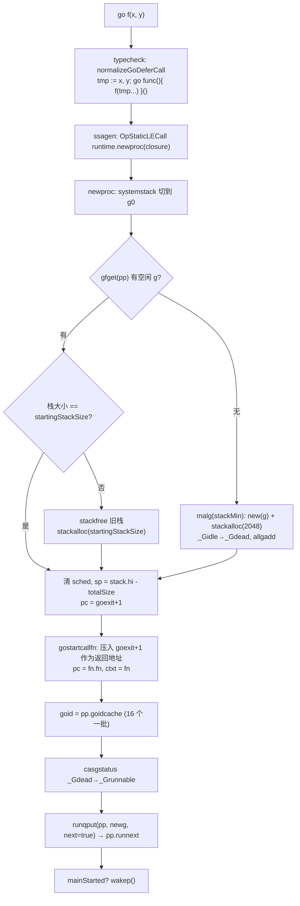
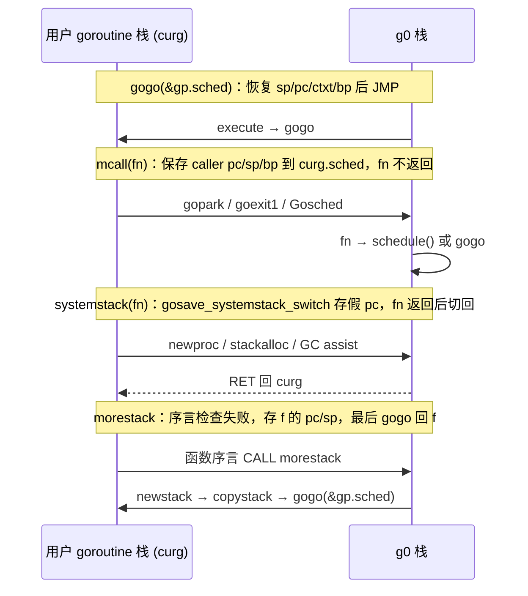
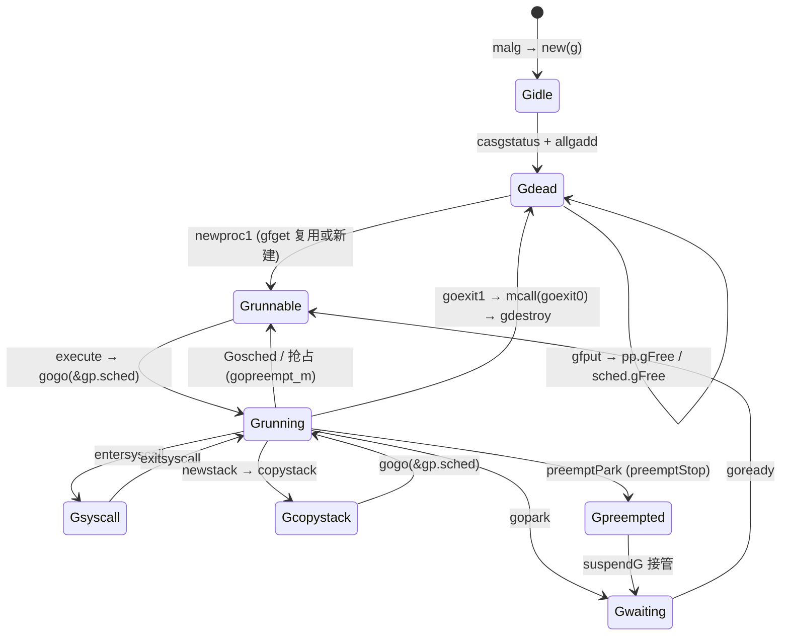

# Go 源码实现详解（八）：goroutine 生命周期与栈管理

## 引言：先给结论

一个 goroutine 从 `go f()` 到退出，runtime 只做了几件本质的事：

1. **编译期**：`go f(x, y)` 在 typecheck 阶段被改写成 `tmp := x, y; go func() { f(tmp...) }()`——一个**无参无返回值的闭包**；SSA 阶段把它变成一次 `runtime.newproc(fn *funcval)` 调用。runtime 不再关心参数拷贝，参数全部被闭包捕获。
2. **创建**：`newproc` 切到 g0 栈调用 `newproc1`：优先从 P 的 `gFree` 链表复用死掉的 g（`gfget`），否则 `malg(stackMin)` 分配 2 KB 栈；然后在新栈顶**伪造一个"从 `goexit` 调用 `fn`"的栈帧**（`gostartcallfn`），`fn` 正常 `RET` 时会"返回"到 `runtime.goexit`。goid 由 P 本地缓存按 16 个一批向 `sched.goidgen` 领取。状态 `_Gdead → _Grunnable`，放入 `pp.runnext`。
3. **切换**：所有切换都归结为对 `g.sched`（一个 `gobuf`）的保存与恢复。`gogo` 恢复 sp/pc/ctxt/bp 并跳转；`mcall` 保存当前 g 的上下文再切到 g0 栈执行不返回的调度函数；`systemstack` 是"能返回"的 `mcall`。切到 g0 是因为调度器和栈拷贝代码不能在一个可能被移动的用户栈上运行。
4. **退出**：函数返回到 `goexit` → `goexit1` → `mcall(goexit0)` → `gdestroy`：状态置 `_Gdead`，清字段，`gfput` 放回 P 的空闲链，`schedule()` 挑下一个 g。
5. **栈**：2 的幂大小，按 order 从 `stackpool`（小栈）或 `stackLarge`/`mheap_.allocManual`（大栈）分配。编译器在几乎每个函数序言里插入 `CMPQ SP, 16(R14); JLS morestack`；失败时进入 `newstack`，先判断是不是抢占请求，否则 `copystack` 到 2 倍大小并用 stack map 修正所有指向旧栈的指针。GC 扫描时使用量不足 1/4 则 `shrinkstack` 减半。

下面按这条主线逐段对照源码。路径相对 golang/go 仓库根目录，版本为 master 提交 fdcd66b（Go 1.28 开发版）。

## 一、`go f()` 的编译：从语句到 `runtime.newproc`

### 1.1 typecheck：把任意调用规范化为无参闭包

很多资料说"walk 阶段把 go 语句的参数拷贝进 newproc 的参数区"，那是 Go 1.17 之前的做法。当前实现里参数处理被提前到 typecheck 阶段：

```go
// src/cmd/compile/internal/typecheck/stmt.go  tcGoDefer / normalizeGoDeferCall
func tcGoDefer(n *ir.GoDeferStmt) {
	call := normalizeGoDeferCall(n.Pos(), n.Op(), n.Call, n.PtrInit())
	call.GoDefer = true
	n.Call = call
}

// normalizeGoDeferCall normalizes call into a normal function call
// with no arguments and no results, suitable for use in an OGO/ODEFER
// statement.  For example, it normalizes:
//	f(x, y)
// into:
//	x1, y1 := x, y          // added to init
//	func() { f(x1, y1) }()  // result
func normalizeGoDeferCall(pos src.XPos, op ir.Op, call ir.Node, init *ir.Nodes) *ir.CallExpr {
	init.Append(ir.TakeInit(call)...)

	if call, ok := call.(*ir.CallExpr); ok && call.Op() == ir.OCALLFUNC {
		if sig := call.Fun.Type(); sig.NumParams()+sig.NumResults() == 0 {
			return call // already in normal form
		}
	}

	// Create a new wrapper function without parameters or results.
	wrapperFn := ir.NewClosureFunc(pos, pos, op, types.NewSignature(nil, nil, nil), ir.CurFunc, Target, 0)
	wrapperFn.DeclareParams(true)
	wrapperFn.SetWrapper(true)
	// ...
```

函数内部用 `visit` 递归遍历被调函数值和每个实参：字面量、nil、全局函数引用、全局变量地址这类"在闭包里再求值也一样"的表达式直接跳过；其余表达式在 go 语句处先求值到临时变量 `tmp := arg`，再用 `ir.NewClosureVar(pos, wrapperFn, tmp)` 替换原表达式，让 wrapper 捕获它。这就是"go 语句的参数在 go 语句处求值"这条语义的实现位置。还有一个细节：

```go
// src/cmd/compile/internal/typecheck/stmt.go  normalizeGoDeferCall（续）
		// For "go/defer iface.M()", if iface is nil, we need to panic at
		// the point of the go/defer statement.
		if call.Op() == ir.OCALLINTER {
			iface := as.Lhs[0]
			init.Append(Stmt(ir.NewUnaryExpr(stmtPos, ir.OCHECKNIL, ir.NewUnaryExpr(iface.Pos(), ir.OITAB, iface))))
		}
```

`go iface.M()` 里 `iface` 为 nil 时必须在 go 语句处 panic，而不是在新 goroutine 里，所以额外插入 `OCHECKNIL`。

### 1.2 escape 与 order/walk：几乎不再做事

escape 分析给 go 语句的 wrapper 闭包打标记：

```go
// src/cmd/compile/internal/escape/call.go  (*escape).goDeferStmt
	if clo, ok := call.Fun.(*ir.ClosureExpr); ok && n.Op() == ir.OGO {
		clo.IsGoWrap = true
	}
```

`IsGoWrap` 唯一的消费者在 `src/cmd/compile/internal/ir/func.go`：编译 runtime 自身时逃逸到堆的闭包会报错，go 语句的 wrapper 例外——它必然逃逸。`order` 阶段只对内层调用做求值顺序处理（`case ir.ODEFER, ir.OGO` 里调用 `o.init` 和 `o.call`），`walk` 阶段则只断言并 walk 函数值：

```go
// src/cmd/compile/internal/walk/stmt.go  validGoDeferCall / walkGoDefer
func validGoDeferCall(call ir.Node) bool {
	if call, ok := call.(*ir.CallExpr); ok && call.Op() == ir.OCALLFUNC && len(call.KeepAlive) == 0 {
		sig := call.Fun.Type()
		return sig.NumParams()+sig.NumResults() == 0
	}
	return false
}

// walkGoDefer walks an OGO or ODEFER node.
func walkGoDefer(walkstate *walkState, n *ir.GoDeferStmt) ir.Node {
	if !validGoDeferCall(n.Call) {
		base.FatalfAt(n.Pos(), "invalid %v call: %v", n.Op(), n.Call)
	}
	var init ir.Nodes
	call := n.Call.(*ir.CallExpr)
	call.Fun = walkExpr(walkstate, call.Fun, &init)
	// ...
	return n
}
```

### 1.3 SSA：生成对 `runtime.newproc` 的静态调用

真正把 `OGO` 变成 runtime 调用的是 SSA 生成。`stmt` 里的 `OGO` 走 `s.callResult(call, callGo)`，`call` 内部按种类挑选目标符号：

```go
// src/cmd/compile/internal/ssagen/ssa.go  (*state).call
		case k == callGo:
			aux := ssa.StaticAuxCall(ir.Syms.Newproc, s.f.ABIDefault.ABIAnalyzeTypes(ACArgs, ACResults))
			call = s.newValue0A(ssaop.OpStaticLECall, aux.LateExpansionResultType(), aux)
```

`ir.Syms.Newproc` 在同文件 `InitConfig` 里由 `typecheck.LookupRuntimeFunc("newproc")` 解析，唯一参数就是闭包对象（`*funcval`）。于是 `go f(x, y)` 最终等价于：

```
tmp1, tmp2 := x, y
clo := &struct{ F uintptr; x, y T }{F: wrapper·f, x: tmp1, y: tmp2}   // 逃逸到堆
runtime.newproc(clo)
```

## 二、创建：`newproc` 与 `newproc1`

### 2.1 `newproc`：切到 g0，创建，入队，唤醒

```go
// src/runtime/proc.go  newproc
func newproc(fn *funcval) {
	gp := getg()
	pc := sys.GetCallerPC()
	systemstack(func() {
		newg := newproc1(fn, gp, pc, false, waitReasonZero)

		pp := getg().m.p.ptr()
		runqput(pp, newg, true)

		if mainStarted {
			wakep()
		}
	})
}
```

三个动作：在 g0 栈上调用 `newproc1`；`runqput(pp, newg, true)` 的 `next=true` 把新 g 放进 `pp.runnext`，让它继承当前时间片尽快运行；若 `runtime.main` 已开始，`wakep()` 尝试唤醒一个空闲 P。`newproc1` 的 `parked`/`waitreason` 参数是给 runtime 内部创建"一出生就阻塞"的 goroutine 用的。

### 2.2 获取 g：`gfget` 优先，`malg` 兜底

```go
// src/runtime/proc.go  newproc1
func newproc1(fn *funcval, callergp *g, callerpc uintptr, parked bool, waitreason waitReason) *g {
	if fn == nil {
		fatal("go of nil func value")
	}

	mp := acquirem() // disable preemption because we hold M and P in local vars.
	pp := mp.p.ptr()
	newg := gfget(pp)
	if newg == nil {
		newg = malg(stackMin)
		casgstatus(newg, _Gidle, _Gdead)
		allgadd(newg) // publishes with a g->status of Gdead so GC scanner doesn't look at uninitialized stack.
	}
	if newg.stack.hi == 0 {
		throw("newproc1: newg missing stack")
	}
	if readgstatus(newg) != _Gdead {
		throw("newproc1: new g is not Gdead")
	}
	// ...
```

`gfget` 先看 P 本地的 `pp.gFree`，为空则从全局 `sched.gFree` 一次搬 32 个，且**优先拿带栈的**（`sched.gFree.stack`）。拿到的 g 若栈大小不等于当前 `startingStackSize`，会释放重分配——这是自适应初始栈（第五章）的配合点：

```go
// src/runtime/proc.go  gfget（节选）
	gp := pp.gFree.pop()
	if gp == nil {
		return nil
	}
	if gp.stack.lo != 0 && gp.stack.hi-gp.stack.lo != uintptr(startingStackSize) {
		// Deallocate old stack. We kept it in gfput because it was the
		// right size when the goroutine was put on the free list, but
		// the right size has changed since then.
		systemstack(func() {
			stackfree(gp.stack)
			gp.stack.lo = 0
			gp.stack.hi = 0
			gp.stackguard0 = 0
			// ...
		})
	}
	if gp.stack.lo == 0 {
		// Stack was deallocated in gfput or just above. Allocate a new one.
		systemstack(func() {
			gp.stack = stackalloc(startingStackSize)
			// ...
		})
		gp.stackguard0 = gp.stack.lo + stackGuard
	}
```

空闲链为空时 `malg(stackMin)` 新建。`malg` 把 `stackSystem + stacksize` 向上取整到 2 的幂（Linux 上 `stackSystem == 0`，即 2048），在 g0 栈上 `stackalloc`：

```go
// src/runtime/proc.go  malg
func malg(stacksize int32) *g {
	newg := new(g)
	if stacksize >= 0 {
		stacksize = round2(stackSystem + stacksize)
		systemstack(func() {
			newg.stack = stackalloc(uint32(stacksize))
			// ...
		})
		newg.stackguard0 = newg.stack.lo + stackGuard
		newg.stackguard1 = ^uintptr(0)
		// Clear the bottom word of the stack. We record g
		// there on gsignal stack during VDSO on ARM and ARM64.
		*(*uintptr)(unsafe.Pointer(newg.stack.lo)) = 0
	}
	return newg
}
```

`stackguard1 = ^uintptr(0)` 很有意思：普通 goroutine 的 `stackguard1` 被设成最大值，带 `//go:systemstack` 的函数（它们比较 `stackguard1`）若误在用户栈上运行，序言检查必然失败并进入 `morestackc`，直接 throw "attempt to execute system stack code on user stack"。`malg(-1)` 表示"栈由操作系统提供"，用于 cgo 场景下的 g0。新 g 先 `casgstatus(_Gidle, _Gdead)` 再 `allgadd`，因为 GC 扫描 `allgs` 时跳过 `_Gdead`，避免看到未初始化的栈。

### 2.3 伪造栈帧：让 `fn` 返回到 `goexit`

```go
// src/runtime/proc.go  newproc1（续）
	totalSize := uintptr(4*goarch.PtrSize + sys.MinFrameSize) // extra space in case of reads slightly beyond frame
	totalSize = alignUp(totalSize, sys.StackAlign)
	sp := newg.stack.hi - totalSize
	// ... usesLR / arm64 的 LR、FP 处理

	memclrNoHeapPointers(unsafe.Pointer(&newg.sched), unsafe.Sizeof(newg.sched))
	newg.sched.sp = sp
	newg.stktopsp = sp
	newg.sched.pc = abi.FuncPCABI0(goexit) + sys.PCQuantum // +PCQuantum so that previous instruction is in same function
	newg.sched.g = guintptr(unsafe.Pointer(newg))
	gostartcallfn(&newg.sched, fn)
	newg.parentGoid = callergp.goid
	newg.gopc = callerpc
	newg.ancestors = saveAncestors(callergp)
	newg.startpc = fn.fn
```

先把 `sched.pc` 设为 `goexit + 1`（amd64 上 `PCQuantum` 为 1），然后 `gostartcallfn` → `gostartcall` 把它调整成"仿佛 goexit 刚 CALL 了 fn、停在 fn 第一条指令前"：

```go
// src/runtime/sys_x86.go  gostartcall
// adjust Gobuf as if it executed a call to fn with context ctxt
// and then stopped before the first instruction in fn.
func gostartcall(buf *gobuf, fn, ctxt unsafe.Pointer) {
	sp := buf.sp
	sp -= goarch.PtrSize
	*(*uintptr)(unsafe.Pointer(sp)) = buf.pc
	buf.sp = sp
	buf.pc = uintptr(fn)
	buf.ctxt = ctxt
}
```

x86 的 CALL 就是"压返回地址，跳目标"。这里手工做了前一半：把 `goexit+1` 压栈，再把 `pc` 改成 `fn` 入口、`ctxt` 设为闭包指针（`gostartcallfn` 中 `fn = fv.fn`，`ctxt = fv`）。第一次 `gogo(&newg.sched)` 时 PC 跳到 `fn`，`fn` 执行到 `RET` 自然弹出 `goexit+1` 并跳过去。而 `goexit` 只是两个 NOP 夹一个 CALL：

```asm
// src/runtime/asm_amd64.s  runtime·goexit
// The top-most function running on a goroutine
// returns to goexit+PCQuantum.
TEXT runtime·goexit(SB),NOSPLIT|TOPFRAME|NOFRAME,$0-0
	BYTE	$0x90	// NOP
	CALL	runtime·goexit1(SB)	// does not return
	// traceback from goexit1 must hit code range of goexit
	BYTE	$0x90	// NOP
```

为什么是 `goexit+1`？traceback 用 `pc-1` 找"调用指令"所在函数；若返回地址正好是 `goexit` 首字节，`pc-1` 会落进前一个函数。第一个 NOP 就是为此垫的。`TOPFRAME` 告诉 unwinder：到这一帧就到顶了。

### 2.4 goid 分配：P 本地缓存 + 全局原子计数

```go
// src/runtime/proc.go  newproc1（续）
	trace := traceAcquire()
	var status uint32 = _Grunnable
	if parked {
		status = _Gwaiting
		newg.waitreason = waitreason
	}
	if pp.goidcache == pp.goidcacheend {
		// Sched.goidgen is the last allocated id,
		// this batch must be [sched.goidgen+1, sched.goidgen+GoidCacheBatch].
		// At startup sched.goidgen=0, so main goroutine receives goid=1.
		pp.goidcache = sched.goidgen.Add(_GoidCacheBatch)
		pp.goidcache -= _GoidCacheBatch - 1
		pp.goidcacheend = pp.goidcache + _GoidCacheBatch
	}
	newg.goid = pp.goidcache
	casgstatus(newg, _Gdead, status)
	pp.goidcache++
	newg.trace.reset()
	if trace.ok() {
		trace.GoCreate(newg, newg.startpc, parked)
		traceRelease(trace)
	}
```

`_GoidCacheBatch = 16`，`sched.goidgen` 是 `atomic.Uint64`。每个 P 用完本地 16 个 id 才去全局原子加一次，所以多 P 并发创建时 goid 不是全局严格递增的：同一 P 连续创建的 goid 连续，不同 P 之间交错。这解释了 panic 输出里 goid 常"跳号"。状态迁移和 goid 赋值放在同一个 `traceAcquire` 区间，是执行追踪器的不变式要求。

`newproc1` 剩余部分复制"世袭"属性：`bubble`（synctest）、`labels`（pprof 标签，仅用户 goroutine 继承）、`fipsOnlyBypass`、`ditWanted`、`secret`；`gcController.addScannableStack` 把新栈大小记入 GC pacer。



## 三、上下文切换：`gobuf` 与汇编

### 3.1 `gobuf`：goroutine 的"寄存器快照"

```go
// src/runtime/runtime2.go  gobuf
type gobuf struct {
	// ctxt is unusual with respect to GC: it may be a
	// heap-allocated funcval, so GC needs to track it, but it
	// needs to be set and cleared from assembly, where it's
	// difficult to have write barriers. However, ctxt is really a
	// saved, live register, and we only ever exchange it between
	// the real register and the gobuf. Hence, we treat it as a
	// root during stack scanning, ...
	sp   uintptr
	pc   uintptr
	g    guintptr
	ctxt unsafe.Pointer
	lr   uintptr
	bp   uintptr // for framepointer-enabled architectures
}
```

`sp`、`pc` 最核心；`g` 指回自己，供 `gogo` 设置 TLS 和 R14；`ctxt` 是闭包上下文寄存器（amd64 上是 DX）的保存槽；`lr` 只在链接寄存器架构使用；`bp` 用于帧指针回溯。

版本差异：旧文章常列出 `gobuf.ret` 字段——当前源码里 **`ret` 已不存在**（随 register ABI 移除）。

Go 的上下文切换很"轻"：只保存 SP、PC、BP、DX，不保存其它通用寄存器。因为切换点全在函数调用边界（`mcall`、`systemstack`、`morestack` 都是 CALL 进入的），按 Go 内部 ABI 跨调用不需要保留通用寄存器。异步抢占是例外——信号处理器会把完整寄存器集压栈，调度篇已讨论。

### 3.2 `gogo`：恢复现场并跳转

```asm
// src/runtime/asm_amd64.s  runtime·gogo
TEXT runtime·gogo(SB), NOSPLIT, $0-8
	MOVQ	buf+0(FP), BX		// gobuf
	MOVQ	gobuf_g(BX), DX
	MOVQ	0(DX), CX		// make sure g != nil
	JMP	gogo<>(SB)

TEXT gogo<>(SB), NOSPLIT, $0
	get_tls(CX)
	MOVQ	DX, g(CX)
	MOVQ	DX, R14		// set the g register
	MOVQ	gobuf_sp(BX), SP	// restore SP
	MOVQ	gobuf_ctxt(BX), DX
	MOVQ	gobuf_bp(BX), BP
	MOVQ	$0, gobuf_sp(BX)	// clear to help garbage collector
	MOVQ	$0, gobuf_ctxt(BX)
	MOVQ	$0, gobuf_bp(BX)
	MOVQ	gobuf_pc(BX), BX
	JMP	BX
```

把 `gobuf.g` 写入 TLS 和 R14（amd64 上 R14 是固定 g 寄存器）；恢复 SP、DX、BP；把 gobuf 中的 sp/ctxt/bp 清零避免 GC 看到过期栈指针；`JMP` 到保存的 PC。`MOVQ 0(DX), CX` 是空指针探测：`g` 为 nil 时直接段错误，比跳到随机地址好调试。`execute → gogo(&gp.sched)` 是调度器让 goroutine 跑起来的唯一入口。

### 3.3 `mcall`：从用户栈切到 g0 执行一个不返回的函数

```asm
// src/runtime/asm_amd64.s  runtime·mcall（节选）
// Switch to m->g0's stack, call fn(g).
// Fn must never return. It should gogo(&g->sched)
// to keep running g.
TEXT runtime·mcall<ABIInternal>(SB), NOSPLIT, $0-8
	MOVQ	AX, DX	// DX = fn

	// Save state in g->sched. The caller's SP and PC are restored by gogo to
	// resume execution in the caller's frame (implicit return). ...
	MOVQ	SP, BX	// hide (SP) reads from vet
	MOVQ	8(BX), BX	// caller's PC
	MOVQ	BX, (g_sched+gobuf_pc)(R14)
	LEAQ	fn+0(FP), BX	// caller's SP
	MOVQ	BX, (g_sched+gobuf_sp)(R14)
	MOVQ	(BP), BX // caller's BP
	MOVQ	BX, (g_sched+gobuf_bp)(R14)

	// switch to m->g0 & its stack, call fn
	MOVQ	g_m(R14), BX
	MOVQ	m_g0(BX), SI	// SI = g.m.g0
	CMPQ	SI, R14	// if g == m->g0 call badmcall
	JNE	goodm
	JMP	runtime·badmcall(SB)
goodm:
	MOVQ	R14, AX		// AX (and arg 0) = g
	MOVQ	SI, R14		// g = g.m.g0
	get_tls(CX)		// Set G in TLS
	MOVQ	R14, g(CX)
	MOVQ	(g_sched+gobuf_sp)(R14), SP	// sp = g0.sched.sp
	MOVQ	$0, BP	// clear frame pointer, as caller may execute on another M
	PUSHQ	AX	// open up space for fn's arg spill slot
	MOVQ	0(DX), R12
	CALL	R12		// fn(g)
	// ...
	JMP	runtime·badmcall2(SB)
```

`mcall` 保存的是**调用者的** PC 和 SP（`8(SP)` 是 CALL 压入的返回地址，`fn+0(FP)` 是调用者栈顶），所以以后 `gogo(&g.sched)` 恢复时效果就像 `mcall` 直接返回了。然后切到 `g0.sched.sp`，调用 `fn(g)`。`fn` 永不返回——要么 `schedule()` 选下一个 g，要么 `gogo` 回来；真返回了就掉进 `badmcall2`。`gopark`、`goexit1`、`Gosched` 等所有"让出 CPU"的路径都以 `mcall(xxx_m)` 结尾。

### 3.4 `systemstack`：可以返回的临时切换

```asm
// src/runtime/asm_amd64.s  runtime·systemstack（节选）
TEXT runtime·systemstack(SB), NOSPLIT, $0-8
	MOVQ	fn+0(FP), DI	// DI = fn
	get_tls(CX)
	MOVQ	g(CX), AX	// AX = g
	MOVQ	g_m(AX), BX	// BX = m

	CMPQ	AX, m_gsignal(BX)
	JEQ	noswitch
	MOVQ	m_g0(BX), DX	// DX = g0
	CMPQ	AX, DX
	JEQ	noswitch
	CMPQ	AX, m_curg(BX)
	JNE	bad

	// Switch stacks. ... Save our state in g->sched. Pretend to
	// be systemstack_switch if the G stack is scanned.
	CALL	gosave_systemstack_switch<>(SB)

	// switch to g0
	MOVQ	DX, g(CX)
	MOVQ	DX, R14 // set the g register
	MOVQ	(g_sched+gobuf_sp)(DX), SP

	// call target function
	MOVQ	DI, DX
	MOVQ	0(DI), DI
	CALL	DI

	// switch back to g
	// ... 从 m_curg 取回 g，恢复 g.sched.sp/bp，并清零
	RET
```

和 `mcall` 的区别：`fn` 会返回，返回后切回 `m.curg` 的栈继续执行；已在 g0 或 gsignal 栈上则直接尾调用（`noswitch`）。保存上下文的工作交给 `gosave_systemstack_switch`：

```asm
// src/runtime/asm_amd64.s  gosave_systemstack_switch
TEXT gosave_systemstack_switch<>(SB),NOSPLIT|NOFRAME,$0
	// Take systemstack_switch PC and add 8 bytes to skip
	// the prologue. ...
	MOVQ	$runtime·systemstack_switch+8(SB), R9
	MOVQ	R9, (g_sched+gobuf_pc)(R14)
	LEAQ	8(SP), R9
	MOVQ	R9, (g_sched+gobuf_sp)(R14)
	MOVQ	BP, (g_sched+gobuf_bp)(R14)
	// Assert ctxt is zero. See func save.
	MOVQ	(g_sched+gobuf_ctxt)(R14), R9
	TESTQ	R9, R9
	JZ	2(PC)
	CALL	runtime·abort(SB)
	RET
```

它保存的 PC 不是真实返回地址，而是 `systemstack_switch+8`——一个假的 `UNDEF` 指令地址。目的是让 GC 或 traceback 扫描这个被挂起的用户栈时，看到栈顶是名叫 `systemstack_switch` 的"函数"，从而知道用户栈到此为止、其上的调用发生在 g0 栈。`unwinder.resolveInternal` 对 `FuncID_systemstack_switch` 有专门处理。

### 3.5 为什么一定要切到 g0 栈

三个原因，都能在源码里找到对应的 throw：

1. **扩栈期间不能再扩栈**。`stackalloc` 开头就 `throw("stackalloc not on scheduler stack")`——若调度器在用户栈上运行，分配新栈的代码本身可能触发 `morestack`，形成递归（issue 1547）。g0 栈固定大小、从不移动（`morestack` 发现是 g0 就 `badmorestackg0`）。
2. **调度代码持有 P、M 的裸指针**，中途若发生栈拷贝，这些指针要调整，GC 扫描也要暂停这个 g。在 g0 上跑就完全避开，`newstack` 也在 g0 上做 `copystack`。
3. **信号与 cgo**。异步抢占信号、sigprof 在 `gsignal` 栈上跑；cgo 调用在 g0（系统线程栈）上跑。三者各占一块栈互不干扰。

g0 栈从哪来？m0 的 g0 在 `rt0_go` 里直接从主线程栈划出 64 KB（`LEAQ (-64*1024)(SP), BX`）。其它 M 的 g0 在 `allocm` 里分配：

```go
// src/runtime/proc.go  allocm（节选）
	// In case of cgo or Solaris or illumos or Darwin, pthread_create will make us a stack.
	// Windows and Plan 9 will layout sched stack on OS stack.
	if iscgo || mStackIsSystemAllocated() {
		mp.g0 = malg(-1)
	} else {
		mp.g0 = malg(16384 * sys.StackGuardMultiplier)
	}
	mp.g0.m = mp
```

非 cgo 的 Linux 下 g0 栈 16 KB（race 模式翻倍）。g0 的 `sched` 在 `mstart1` 里被设为"返回到 `mstart0` 中 `mstart1` 调用之后"，这样 `gdestroy` 处理锁定线程的 goroutine 退出时可以 `gogo(&mp.g0.sched)` 让整个线程退出。

### 3.6 `morestack`：从函数序言进入栈扩容

```asm
// src/runtime/asm_amd64.s  runtime·morestack（节选）
TEXT runtime·morestack(SB),NOSPLIT|NOFRAME,$0-0
	// Cannot grow scheduler stack (m->g0).
	get_tls(CX)
	MOVQ	g(CX), DI     // DI = g
	MOVQ	g_m(DI), BX   // BX = m

	// Set g->sched to context in f.
	MOVQ	0(SP), AX // f's PC
	MOVQ	AX, (g_sched+gobuf_pc)(DI)
	LEAQ	8(SP), AX // f's SP
	MOVQ	AX, (g_sched+gobuf_sp)(DI)
	MOVQ	BP, (g_sched+gobuf_bp)(DI)
	MOVQ	DX, (g_sched+gobuf_ctxt)(DI)
	// ... g0 / gsignal 检查：badmorestackg0 / badmorestackgsignal

	// Called from f.
	// Set m->morebuf to f's caller.
	NOP	SP	// tell vet SP changed - stop checking offsets
	MOVQ	8(SP), AX	// f's caller's PC
	MOVQ	AX, (m_morebuf+gobuf_pc)(BX)
	LEAQ	16(SP), AX	// f's caller's SP
	MOVQ	AX, (m_morebuf+gobuf_sp)(BX)
	MOVQ	DI, (m_morebuf+gobuf_g)(BX)

	// Call newstack on m->g0's stack.
	MOVQ	m_g0(BX), BX
	MOVQ	BX, g(CX)
	MOVQ	(g_sched+gobuf_sp)(BX), SP
	MOVQ	$0, BP			// clear frame pointer, as caller may execute on another M
	CALL	runtime·newstack(SB)
	CALL	runtime·abort(SB)	// crash if newstack returns
	RET
```

`morestack` 被函数 `f` 的序言 CALL，`0(SP)` 是 `f` 里 CALL 之后的地址——`f` 应被重新执行的位置；它存到 `g.sched.pc`，稍后 `newstack` 完成后 `gogo(&gp.sched)` 跳回 `f` 序言重新做栈检查。`m.morebuf` 记录 `f` 的调用者信息供诊断。`morestack_noctxt` 只是先清零 DX 再跳到 `morestack`，给不需要闭包上下文的函数用；`morestackc` 是 `//go:systemstack` 函数误在用户栈运行时的报错入口。



## 四、退出：从 `goexit` 到 `gdestroy`

### 4.1 调用链

入口函数 `RET` 后落到 `goexit+1`，那里 `CALL runtime·goexit1`：

```go
// src/runtime/proc.go  goexit1 / goexit0
// Finishes execution of the current goroutine.
func goexit1() {
	if raceenabled {
		// ...
		racegoend()
	}
	trace := traceAcquire()
	if trace.ok() {
		trace.GoEnd()
		traceRelease(trace)
	}
	mcall(goexit0)
}

// goexit continuation on g0.
func goexit0(gp *g) {
	if goexperiment.RuntimeSecret && gp.secret > 0 {
		// Erase the whole stack. ...
		memclrNoHeapPointers(unsafe.Pointer(gp.stack.lo), gp.stack.hi-gp.stack.lo)
	}
	gdestroy(gp)
	schedule()
}
```

`runtime.Goexit()`（`src/runtime/panic.go`）跑完所有 defer 后同样调用 `goexit1()`。版本差异：早期 `goexit0` 包含全部清理逻辑，现在拆成 `goexit0`（secret 模式处理、调用 `schedule`）和 `gdestroy`（真正销毁），后者也被 `debugCallWrap` 路径复用。

### 4.2 `gdestroy`：清字段、缓存、处理锁定线程

```go
// src/runtime/proc.go  gdestroy（节选）
func gdestroy(gp *g) {
	mp := getg().m
	pp := mp.p.ptr()

	casgstatus(gp, _Grunning, _Gdead)
	gcController.addScannableStack(pp, -int64(gp.stack.hi-gp.stack.lo))
	if isSystemGoroutine(gp, false) {
		sched.ngsys.Add(-1)
	}
	gp.m = nil
	locked := gp.lockedm != 0
	gp.lockedm = 0
	mp.lockedg = 0
	gp.preemptStop = false
	gp.paniconfault = false
	gp._defer = nil // should be true already but just in case.
	gp._panic = nil // non-nil for Goexit during panic. points at stack-allocated data.
	gp.writebuf = nil
	gp.waitreason = waitReasonZero
	gp.param = nil
	gp.labels = nil
	gp.timer = nil
	gp.bubble = nil
	// ...
	if gcBlackenEnabled != 0 && gp.gcAssistBytes > 0 {
		// Flush assist credit to the global pool. ...
		gcController.bgScanCredit.Add(scanCredit)
		gp.gcAssistBytes = 0
	}

	dropg()
```

`_Grunning → _Gdead`；从 GC pacer 的可扫描栈总量里减掉栈大小；把攒下的 GC 辅助信用退还后台池；`dropg()` 解除 `m.curg` 与 `gp.m` 的绑定。之后：

```go
// src/runtime/proc.go  gdestroy（续）
	if locked && mp.lockedInt != 0 {
		print("runtime: mp.lockedInt = ", mp.lockedInt, "\n")
		if mp.isextra {
			throw("runtime.Goexit called in a thread that was not created by the Go runtime")
		}
		throw("exited a goroutine internally locked to the OS thread")
	}
	gfput(pp, gp)
	if locked {
		// The goroutine may have locked this thread because
		// it put it in an unusual kernel state. Kill it
		// rather than returning it to the thread pool.

		// Return to mstart, which will release the P and exit
		// the thread.
		if GOOS != "plan9" { // See golang.org/issue/22227.
			gogo(&mp.g0.sched)
		} else {
			mp.lockedExt = 0
		}
	}
}
```

这回答了一个常见问题：**调用了 `runtime.LockOSThread` 却没 `Unlock` 的 goroutine 退出后线程怎样？**答案是线程被杀掉。`gogo(&mp.g0.sched)` 跳回 `mstart1` 在 `mstart0` 里的返回点，`mstart0` 随后 `mexit` 释放 P 并退出线程。理由如注释：goroutine 可能把线程置于"不寻常的内核状态"（改了 namespace、CPU 亲和性等），不能再复用。`lockedInt != 0` 是 runtime 内部锁定，此时退出是 bug，直接 throw。

### 4.3 `gfput`：缓存 g，但不总是缓存栈

```go
// src/runtime/proc.go  gfput
func gfput(pp *p, gp *g) {
	if readgstatus(gp) != _Gdead {
		throw("gfput: bad status (not Gdead)")
	}

	stksize := gp.stack.hi - gp.stack.lo

	if stksize != uintptr(startingStackSize) {
		// non-standard stack size - free it.
		stackfree(gp.stack)
		gp.stack.lo = 0
		gp.stack.hi = 0
		gp.stackguard0 = 0
		// ...
	}

	pp.gFree.push(gp)
	if pp.gFree.size >= 64 {
		var (
			stackQ   gQueue
			noStackQ gQueue
		)
		for pp.gFree.size >= 32 {
			gp := pp.gFree.pop()
			if gp.stack.lo == 0 {
				noStackQ.push(gp)
			} else {
				stackQ.push(gp)
			}
		}
		lock(&sched.gFree.lock)
		sched.gFree.noStack.pushAll(noStackQ)
		sched.gFree.stack.pushAll(stackQ)
		unlock(&sched.gFree.lock)
	}
}
```

只缓存"标准大小"的栈：曾扩到 1 MB 的 goroutine 退出后栈立即归还 `stackfree`，避免 gFree 链表成为大内存的坟场。P 本地超过 64 个时搬一半到全局，按有栈/无栈分两条队列，与 `gfget` 的"优先拿有栈的"对应。`g` 结构体本身从不释放——`allgs` 只增不减，程序历史上并发 goroutine 的峰值决定了 `g` 的常驻数量。



## 五、栈的分配与释放

### 5.1 关键常量

```go
// src/runtime/stack.go  常量定义（节选）
const (
	// stackSystem is a number of additional bytes to add
	// to each stack below the usual guard area for OS-specific
	// purposes like signal handling. Used on Windows, Plan 9,
	// and iOS because they do not use a separate stack.
	stackSystem = goos.IsWindows*4096 + goos.IsPlan9*512 + goos.IsIos*goarch.IsArm64*1024

	// The minimum size of stack used by Go code
	stackMin = 2048

	// The minimum stack size to allocate.
	// The hackery here rounds fixedStack0 up to a power of 2.
	fixedStack0 = stackMin + stackSystem
	// ...
	fixedStack  = fixedStack6 + 1

	// stackNosplit is the maximum number of bytes that a chain of NOSPLIT
	// functions can use.
	stackNosplit = abi.StackNosplitBase * sys.StackGuardMultiplier

	// The stack guard is a pointer this many bytes above the
	// bottom of the stack.
	// The guard leaves enough room for a stackNosplit chain of NOSPLIT calls
	// plus one stackSmall frame plus stackSystem bytes for the OS.
	stackGuard = stackNosplit + stackSystem + abi.StackSmall
)
```

Linux/amd64 上代入数值（`src/internal/abi/stack.go`：`StackNosplitBase = 800`、`StackSmall = 128`、`StackBig = 4096`；`src/internal/runtime/sys/consts.go`：`StackGuardMultiplier = 1 + goos.IsAix + goos.IsOpenbsd + isRace`）：

- `stackMin = fixedStack = 2048`：最小栈 2 KB。
- `stackGuard = 800 + 0 + 128 = 928`：`stackguard0 = stack.lo + 928`。SP 距栈底不足 928 字节时，下一个带栈检查的函数调用触发扩容。这 928 字节留给 NOSPLIT 函数链（最多 800 字节）和一个小帧（128 字节），链接器会静态验证所有 NOSPLIT 调用链不超预算。
- `_StackCacheSize = 32 KB`、`_NumStackOrders = 4`（Linux；定义在 `src/runtime/malloc.go`）：小栈有 4 个 order，即 2 KB、4 KB、8 KB、16 KB。

另一组特殊值用来"假冒"栈溢出：

```go
// src/runtime/stack.go  stackPreempt 等
	// Goroutine preemption request.
	// 0xfffffade in hex.
	stackPreempt = uintptrMask & -1314

	// Thread is forking. Causes a split stack check failure.
	// 0xfffffb2e in hex.
	stackFork = uintptrMask & -1234

	// Force a stack movement. Used for debugging.
	// 0xfffffeed in hex.
	stackForceMove = uintptrMask & -275
```

把 `stackguard0` 设成 `stackPreempt`（比任何真实 SP 都大），下一次函数序言的比较必然失败，进入 `morestack → newstack`，由 `newstack` 识别出这是抢占请求。这就是协作式抢占的机制。

### 5.2 `stackalloc`：三级来源

```go
// src/runtime/stack.go  stackalloc（小栈分支）
//go:systemstack
func stackalloc(n uint32) stack {
	// Stackalloc must be called on scheduler stack, so that we
	// never try to grow the stack during the code that stackalloc runs.
	// Doing so would cause a deadlock (issue 1547).
	thisg := getg()
	if thisg != thisg.m.g0 {
		throw("stackalloc not on scheduler stack")
	}
	if n&(n-1) != 0 {
		throw("stack size not a power of 2")
	}
	// ...
	var v unsafe.Pointer
	if n < fixedStack<<_NumStackOrders && n < _StackCacheSize {
		order := uint8(0)
		n2 := n
		for n2 > fixedStack {
			order++
			n2 >>= 1
		}
		var x gclinkptr
		if stackNoCache != 0 || thisg.m.p == 0 || thisg.m.preemptoff != "" {
			// ... Just get a stack from the global pool.
			lock(&stackpool[order].item.mu)
			x = stackpoolalloc(order)
			unlock(&stackpool[order].item.mu)
		} else {
			c := thisg.m.p.ptr().mcache
			x = c.stackcache[order].list
			if x.ptr() == nil {
				stackcacherefill(c, order)
				x = c.stackcache[order].list
			}
			c.stackcache[order].list = x.ptr().next
			c.stackcache[order].size -= uintptr(n)
		}
		v = unsafe.Pointer(x)
	} else {
```

小栈（< 32 KB）走三级缓存：

1. **P 本地 `mcache.stackcache[order]`**：无锁链表，用完了 `stackcacherefill` 从全局池搬 16 KB（`_StackCacheSize/2`）过来。
2. **全局 `stackpool[order]`**：每个 order 一把锁和一个 `mSpanList`。`stackpoolalloc` 在池空时 `mheap_.allocManual(_StackCacheSize>>gc.PageShift, spanAllocStack)` 申请一个 32 KB 的 span，把它切成 `fixedStack << order` 大小的块串成 `s.manualFreeList`，设置 `s.elemsize`；分配时从链表头取，全部分完则把 span 从列表移除。
3. **`mheap_.allocManual`**：span 类型 `spanAllocStack`、状态 `mSpanManual`——不参与 GC 标记清扫，但占用堆地址空间（这也是 `MemStats.StackInuse` 单独计数的原因）。

大栈（≥ 32 KB）跳过 order 缓存：

```go
// src/runtime/stack.go  stackalloc（大栈分支）
	} else {
		var s *mspan
		npage := uintptr(n) >> gc.PageShift
		log2npage := stacklog2(npage)

		// Try to get a stack from the large stack cache.
		lock(&stackLarge.lock)
		if !stackLarge.free[log2npage].isEmpty() {
			s = stackLarge.free[log2npage].first
			stackLarge.free[log2npage].remove(s)
		}
		unlock(&stackLarge.lock)

		lockWithRankMayAcquire(&mheap_.lock, lockRankMheap)

		if s == nil {
			// Allocate a new stack from the heap.
			s = mheap_.allocManual(npage, spanAllocStack)
			if s == nil {
				throw("out of memory")
			}
			osStackAlloc(s)
			s.elemsize = uintptr(n)
		}
		v = unsafe.Pointer(s.base())
	}
```

### 5.3 `stackfree`：对称回收，但要看 GC 阶段

```go
// src/runtime/stack.go  stackfree（大栈分支）
	} else {
		s := spanOfUnchecked(uintptr(v))
		if s.state.get() != mSpanManual {
			println(hex(s.base()), v)
			throw("bad span state")
		}
		if gcphase == _GCoff {
			// Free the stack immediately if we're
			// sweeping.
			osStackFree(s)
			mheap_.freeManual(s, spanAllocStack)
		} else {
			// If the GC is running, we can't return a
			// stack span to the heap because it could be
			// reused as a heap span, and this state
			// change would race with GC. Add it to the
			// large stack cache instead.
			log2npage := stacklog2(s.npages)
			lock(&stackLarge.lock)
			stackLarge.free[log2npage].insert(s)
			unlock(&stackLarge.lock)
		}
	}
```

小栈回到 `mcache.stackcache`（超过 32 KB 时 `stackcacherelease` 刷一半回全局池）。大栈在 GC 未运行时直接还给堆；GC 运行中则暂存 `stackLarge`，因为把 manual span 转成堆 span 会与并发标记竞争。GC 结束时 `gcMarkTermination` 通过 `systemstack(freeStackSpans)` 把 `stackpool` 中完全空闲的 span 和 `stackLarge` 里的 span 统一还给堆。

### 5.4 初始栈大小：`startingStackSize` 与自适应

`malg(stackMin)` 只在 `gfget` 拿不到 g 时用固定 2 KB；复用 g 时用 `startingStackSize`：

```go
// src/runtime/stack.go  startingStackSize / gcComputeStartingStackSize
// startingStackSize is updated every GC by tracking the average size of
// stacks scanned during the GC.
var startingStackSize uint32 = fixedStack

func gcComputeStartingStackSize() {
	if debug.adaptivestackstart == 0 {
		return
	}
	// ...
	var scannedStackSize uint64
	var scannedStacks uint64
	for _, p := range allp {
		scannedStackSize += p.scannedStackSize
		scannedStacks += p.scannedStacks
		// Reset for next time
		p.scannedStackSize = 0
		p.scannedStacks = 0
	}
	if scannedStacks == 0 {
		startingStackSize = fixedStack
		return
	}
	avg := scannedStackSize/scannedStacks + stackGuard
	// Note: we add stackGuard to ensure that a goroutine that
	// uses the average space will not trigger a growth.
	if avg > uint64(maxstacksize) {
		avg = uint64(maxstacksize)
	}
	if avg < fixedStack {
		avg = fixedStack
	}
	startingStackSize = uint32(round2(int32(avg)))
}
```

`scanstack`（`src/runtime/mgcmark.go`）扫描每个 goroutine 时累加 `p.scannedStackSize += stack.hi - sp`（**实际使用量**）和 `p.scannedStacks++`；每轮 GC 的 `gcMarkTermination` 调用 `gcComputeStartingStackSize`，取平均使用量加 guard，向上取整到 2 的幂。`debug.adaptivestackstart` 在 `src/runtime/runtime1.go` 里默认为 1，`GODEBUG=adaptivestackstart=0` 关闭。这个 Go 1.19 引入的特性解决的是"每个 goroutine 都从 2 KB 起步、连扩几次"的重复劳动；注意第一次 GC 前所有 goroutine 仍从 2 KB 起步。

上限 `maxstacksize` 在 `runtime.main` 里设定：64 位 1 GB，32 位 250 MB（十进制，为了报错信息好看）；`debug.SetMaxStack` 可调，但不能超过 `maxstackceiling = 2 * maxstacksize`。

## 六、栈溢出检查与扩容

### 6.1 编译器在函数序言插入的检查

栈检查不是 runtime 做的，而是汇编器后端在每个非 NOSPLIT 函数的序言里生成的：

```go
// src/cmd/internal/obj/x86/obj6.go  stacksplit（节选）
	var q1 *obj.Prog
	if framesize <= abi.StackSmall {
		// small stack: SP <= stackguard
		//	CMPQ SP, stackguard
		p = obj.Appendp(p, newprog)
		p.As = cmp
		p.From.Type = obj.TYPE_REG
		p.From.Reg = REG_SP
		p.To.Type = obj.TYPE_MEM
		p.To.Reg = rg
		p.To.Offset = 2 * int64(ctxt.Arch.PtrSize) // G.stackguard0
		if cursym.CFunc() {
			p.To.Offset = 3 * int64(ctxt.Arch.PtrSize) // G.stackguard1
		}
		// Mark the stack bound check and morestack call async nonpreemptible.
		// ... See issue #35470.
		p = ctxt.StartUnsafePoint(p, newprog)
	} else if framesize <= abi.StackBig {
		// large stack: SP-framesize <= stackguard-StackSmall
		//	LEAQ -xxx(SP), tmp
		//	CMPQ tmp, stackguard
		// ...
	} else {
		// Such a large stack we need to protect against underflow.
		//	MOVQ	SP, tmp
		//	SUBQ	$(framesize - StackSmall), tmp
		//	// If subtraction wrapped (carry set), morestack.
		//	JCS	label-of-call-to-morestack
		//	CMPQ	tmp, stackguard
```

按帧大小分三档：帧 ≤ 128 字节直接 `CMPQ SP, 16(R14)`（`stackguard0` 在 `g` 偏移 16 处，紧跟 `stack.lo`、`stack.hi`；amd64 上 g 寄存器是 R14），因为 guard 之下预留了 `StackSmall` 字节，小帧不减帧大小也安全；帧 ≤ 4096 字节用 `LEAQ -(framesize-128)(SP), tmp` 再比较；更大的帧先 `SUBQ` 再 `JCS` 防止无符号回绕。后半段共用：

```go
// src/cmd/internal/obj/x86/obj6.go  stacksplit（续）
	// common
	jls := obj.Appendp(p, newprog)
	jls.As = AJLS
	jls.To.Type = obj.TYPE_BRANCH
	// ...
	// Now we are at the end of the function, but logically
	// we are still in function prologue. We need to fix the
	// SP data and PCDATA.
	spfix := obj.Appendp(last, newprog)
	spfix.As = obj.ANOP
	spfix.Spadj = -framesize

	pcdata := ctxt.EmitEntryStackMap(cursym, spfix, newprog)
	spill := ctxt.StartUnsafePoint(pcdata, newprog)
	pcdata = cursym.Func().SpillRegisterArgs(spill, newprog)

	call := obj.Appendp(pcdata, newprog)
	// ...
	morestack := "runtime.morestack"
	switch {
	case cursym.CFunc():
		morestack = "runtime.morestackc"
	case !cursym.Func().Text.From.Sym.NeedCtxt():
		morestack = "runtime.morestack_noctxt"
	}
	call.To.Sym = ctxt.Lookup(morestack)
	// ...
	jmp.To.SetTarget(startPred.Link)
	jls.To.SetTarget(spill)
```

`JLS`（无符号小于等于则跳）跳到函数**末尾**的一段代码：先把寄存器传参溢出到栈上（register ABI 下 `morestack` 会破坏这些寄存器），`CALL runtime.morestack`，返回后恢复寄存器，再 `JMP` 回序言开头重新检查。把慢路径放在函数末尾是为了让热路径连续。`EmitEntryStackMap` 在此发出函数入口的 stack map，让 `copystack` 处理这个还没建帧的函数时有正确的指针信息。`CFunc()`（`//go:systemstack`）比较 `stackguard1`、调用 `morestackc`；不用闭包上下文的函数调用 `morestack_noctxt`。

### 6.2 `newstack`：先分流抢占，再扩容

```go
// src/runtime/stack.go  newstack（节选）
func newstack() {
	thisg := getg()
	// ...
	gp := thisg.m.curg
	// ... throwsplit 检查："runtime: stack split at bad time"
	morebuf := thisg.m.morebuf
	thisg.m.morebuf.pc = 0
	thisg.m.morebuf.lr = 0
	thisg.m.morebuf.sp = 0
	thisg.m.morebuf.g = 0

	// NOTE: stackguard0 may change underfoot, if another thread
	// is about to try to preempt gp. Read it just once and use that same
	// value now and below.
	stackguard0 := atomic.Loaduintptr(&gp.stackguard0)

	// Be conservative about where we preempt.
	// We are interested in preempting user Go code, not runtime code.
	// If we're holding locks, mallocing, or preemption is disabled, don't
	// preempt.
	// ...
	preempt := stackguard0 == stackPreempt
	if preempt {
		if !canPreemptM(thisg.m) {
			// Let the goroutine keep running for now.
			// gp->preempt is set, so it will be preempted next time.
			gp.stackguard0 = gp.stack.lo + stackGuard
			gogo(&gp.sched) // never return
		}
	}
```

这是**协作式抢占的落地点**。`stackguard0 == stackPreempt` 说明不是真的栈不够，而是 sysmon 或 GC 想让这个 goroutine 让出。若当前 M 持锁、正在 malloc 或 `preemptoff` 非空（`canPreemptM` 为假），就恢复 guard 值 `gogo` 回去——`gp.preempt` 标志还在，下次再试。

```go
// src/runtime/stack.go  newstack（续）
	if preempt {
		// ... g0 / 无 P 检查
		if gp.preemptShrink {
			// We're at a synchronous safe point now, so
			// do the pending stack shrink.
			gp.preemptShrink = false
			shrinkstack(gp)
		}
		// Set a flag indicated that we've been synchronously preempted.
		gp.syncSafePoint = true

		if gp.preemptStop {
			preemptPark(gp) // never returns
		}
		// Act like goroutine called runtime.Gosched.
		gopreempt_m(gp) // never return
	}

	// Allocate a bigger segment and move the stack.
	oldsize := gp.stack.hi - gp.stack.lo
	newsize := oldsize * 2

	// Make sure we grow at least as much as needed to fit the new frame.
	if f := findfunc(gp.sched.pc); f.valid() {
		max := uintptr(funcMaxSPDelta(f))
		needed := max + stackGuard
		used := gp.stack.hi - gp.sched.sp
		for newsize-used < needed {
			newsize *= 2
		}
	}
```

可以抢占时三种去向：（a）GC 扫描时发现该栈该收缩但当时不安全而设了 `preemptShrink`，现在是同步安全点，顺手 `shrinkstack`；（b）`preemptStop` 为真说明是 GC 的 `suspendG` 要求停下，`preemptPark` 把 g 置为 `_Gpreempted`；（c）否则等价于 `Gosched`，`gopreempt_m` 把 g 放回全局队列。

真正的扩容：新大小是旧大小的 **2 倍**，并保证能容纳当前函数的最大帧（`funcMaxSPDelta` 来自 pcsp 表）。超过 `maxstacksize` 就打印 "goroutine stack exceeds 1000000000-byte limit" 并 throw——无限递归的死法。

```go
// src/runtime/stack.go  newstack（续）
	// The goroutine must be executing in order to call newstack,
	// so it must be Grunning (or Gscanrunning).
	casgstatus(gp, _Grunning, _Gcopystack)

	// The concurrent GC will not scan the stack while we are doing the copy since
	// the gp is in a Gcopystack status.
	copystack(gp, newsize)
	// ...
	casgstatus(gp, _Gcopystack, _Grunning)
	gogo(&gp.sched)
}
```

`_Gcopystack` 是专门状态，GC 看到它会等待而不是扫描。拷贝完成后 `gogo(&gp.sched)` 回到 `morestack` 保存的 PC——函数序言，重新做栈检查（这次会通过）。

### 6.3 `copystack`：搬家并修正指针

```go
// src/runtime/stack.go  copystack（节选）
func copystack(gp *g, newsize uintptr) {
	if gp.syscallsp != 0 {
		throw("stack growth not allowed in system call")
	}
	old := gp.stack
	// ...
	used := old.hi - gp.sched.sp
	gcController.addScannableStack(getg().m.p.ptr(), int64(newsize)-int64(old.hi-old.lo))

	// allocate new stack
	new := stackalloc(uint32(newsize))
	// ...
	// Compute adjustment.
	var adjinfo adjustinfo
	adjinfo.old = old
	adjinfo.delta = new.hi - old.hi

	// Adjust sudogs, synchronizing with channel ops if necessary.
	ncopy := used
	if !gp.activeStackChans {
		// ...
		adjustsudogs(gp, &adjinfo)
	} else {
		// sudogs may be pointing in to the stack and gp has
		// released channel locks, so other goroutines could
		// be writing to gp's stack. ...
		adjinfo.sghi = findsghi(gp, old)
		// Synchronize with channel ops and copy the part of
		// the stack they may interact with.
		ncopy -= syncadjustsudogs(gp, used, &adjinfo)
	}

	// Copy the stack (or the rest of it) to the new location
	memmove(unsafe.Pointer(new.hi-ncopy), unsafe.Pointer(old.hi-ncopy), ncopy)
```

Go 栈向下增长，所以是**顶对齐**拷贝：只拷贝 `used = old.hi - sp` 到 `new.hi - used`，`delta = new.hi - old.hi` 是所有指针要加的偏移。

`sudog` 需特别小心：阻塞在 channel 上的 goroutine，其 `sudog.elem` 指向栈上的接收缓冲区，发送方会直接往这个地址写。若 goroutine 处于 `activeStackChans`（已挂在 channel 上但已释放 channel 锁），另一个 goroutine 可能正在写它的栈，`syncadjustsudogs` 会先锁住相关 channel，在锁内拷贝并修正栈的低段。这也是 `newstack` 允许扩栈、`shrinkstack` 却要求 `isShrinkStackSafe` 的原因之一。

```go
// src/runtime/stack.go  copystack（续）
	// Adjust remaining structures that have pointers into stacks.
	// We have to do most of these before we traceback the new
	// stack because gentraceback uses them.
	adjustctxt(gp, &adjinfo)
	adjustdefers(gp, &adjinfo)
	adjustpanics(gp, &adjinfo)
	if adjinfo.sghi != 0 {
		adjinfo.sghi += adjinfo.delta
	}

	// Swap out old stack for new one
	gp.stack = new
	gp.stackguard0 = new.lo + stackGuard // NOTE: might clobber a preempt request
	gp.sched.sp = new.hi - used
	gp.stktopsp += adjinfo.delta

	// Adjust pointers in the new stack.
	var u unwinder
	for u.init(gp, 0); u.valid(); u.next() {
		adjustframe(&u.frame, &adjinfo)
	}
	// ...
	stackfree(old)
}
```

`adjustctxt` 修 `sched.ctxt` 和 `sched.bp`；`adjustdefers` 沿 `gp._defer` 链修 `fn`、`sp`、`link`（defer 记录本身可能在栈上）；`adjustpanics` 只修 `gp._panic` 头指针，因为 `_panic` 结构体在栈上、随栈拷贝，内部指针由 `adjustframe` 处理。注释里的 `gentraceback` 是历史名字——现在的实现是 `unwinder`，见第八章。

### 6.4 `adjustframe` 与 `adjustpointers`：靠 stack map 找指针

```go
// src/runtime/stack.go  adjustframe（节选）
func adjustframe(frame *stkframe, adjinfo *adjustinfo) {
	// Adjust saved frame pointer if there is one.
	if (goarch.ArchFamily == goarch.AMD64 || goarch.ArchFamily == goarch.ARM64) && frame.argp-frame.varp == 2*goarch.PtrSize {
		// ...
		adjustpointer(adjinfo, unsafe.Pointer(frame.varp))
	}
	// ...
	if frame.continpc == 0 {
		// Frame is dead. ...
		return
	}
	f := frame.fn
	locals, args, objs := frame.getStackMap(true)

	// Adjust local variables if stack frame has been allocated.
	if locals.n > 0 {
		size := uintptr(locals.n) * goarch.PtrSize
		adjustpointers(unsafe.Pointer(frame.varp-size), &locals, adjinfo, f)
	}

	// Adjust arguments.
	if args.n > 0 {
		adjustpointers(unsafe.Pointer(frame.argp), &args, adjinfo, funcInfo{})
	}

	// Adjust pointers in all stack objects (whether they are live or not).
	// See comments in mgcmark.go:scanframeworker.
	if frame.varp != 0 {
		for i := range objs {
			// ... 按 obj.gcdata() 位图逐字 adjustpointer
		}
	}
}
```

每帧三类东西要修：保存的帧指针 BP；locals 和 args 位图标出的指针槽；stack objects（被取地址的局部变量，位图不标、由 `stackObjectRecord` 单独描述）。`adjustpointers` 遍历位图，把落在 `[old.lo, old.hi)` 内的值加 delta，并带一个防御性检查：

```go
// src/runtime/stack.go  adjustpointers（节选）
			p := *pp
			if f.valid() && 0 < p && p < minLegalPointer && debug.invalidptr != 0 {
				// Looks like a junk value in a pointer slot.
				// Live analysis wrong?
				getg().m.traceback = 2
				print("runtime: bad pointer in frame ", funcname(f), " at ", pp, ": ", hex(p), "\n")
				throw("invalid pointer found on stack")
			}
			if minp <= p && p < maxp {
				if useCAS {
					ppu := (*unsafe.Pointer)(unsafe.Pointer(pp))
					if !atomic.Casp1(ppu, unsafe.Pointer(p), unsafe.Pointer(p+delta)) {
						goto retry
					}
				} else {
					*pp = p + delta
				}
			}
```

若某个被标为指针的槽里放着小整数，说明 liveness 出了问题（或有人用 `unsafe` 把整数放进指针类型），直接 throw "invalid pointer found on stack"——在用 cgo 或 `unsafe` 的项目里偶尔能见到。`useCAS` 对应 `sghi` 以下的区域，那里可能有并发的 channel 发送在写。

### 6.5 `shrinkstack`：GC 时收缩

```go
// src/runtime/stack.go  shrinkstack（节选）
func shrinkstack(gp *g) {
	// ... 所有权与 isShrinkStackSafe 检查
	if debug.gcshrinkstackoff > 0 {
		return
	}

	oldsize := gp.stack.hi - gp.stack.lo
	newsize := oldsize / 2
	// Don't shrink the allocation below the minimum-sized stack
	// allocation.
	if newsize < fixedStack {
		return
	}
	// Compute how much of the stack is currently in use and only
	// shrink the stack if gp is using less than a quarter of its
	// current stack. The currently used stack includes everything
	// down to the SP plus the stack guard space that ensures
	// there's room for nosplit functions.
	avail := gp.stack.hi - gp.stack.lo
	if used := gp.stack.hi - gp.sched.sp + stackNosplit; used >= avail/4 {
		return
	}
	// ...
	copystack(gp, newsize)
}
```

调用方是 `scanstack`：GC 扫描每个 goroutine 栈时，若 `isShrinkStackSafe` 则立刻收缩，否则设 `gp.preemptShrink` 让 `newstack` 在下一个同步安全点做。条件是使用量（含 `stackNosplit` 余量）不足 1/4，一次减半，最低 2 KB。`GODEBUG=gcshrinkstackoff=1` 可关掉。不安全的情形包括：正在系统调用（栈上可能有内核持有的指针）、处于异步抢占点（没有精确位图）、正在 park 到 channel 的窗口期。

## 七、栈上对象与 stack map（简述）

`copystack` 和 GC 的 `scanstack` 用同一套元数据：

- **`PCDATA_StackMapIndex`**：给定 PC，查出此刻该用第几张 locals/args 位图。位图由编译器 liveness 分析（`src/cmd/compile/internal/liveness`）在每个调用点生成，只有在该点仍活跃的指针变量才置位——这就是 GC "精确"的含义：不再使用的局部指针即使还留在栈上也不算根。
- **`FUNCDATA_LocalsPointerMaps` / `FUNCDATA_ArgsPointerMaps`**：位图表本身。
- **`FUNCDATA_StackObjects`**：被取地址的局部变量列表（`stackObjectRecord`）。它们的存活由"是否有指针指向它们"决定，`scanframeworker` 先按位图找根，再顺着根指针标记 stack object。

`stkframe.getStackMap`（`src/runtime/stkframe.go`）封装以上查询；`adjustframe` 和 `scanframeworker` 都调用它，区别只是前者把指针加 delta，后者把指针 shade 成灰色。GC 细节见本系列 GC 篇。这也解释了两条约束：`//go:nosplit` 函数不能占太多栈（没有序言检查，靠 guard 余量）；汇编函数必须声明正确的参数大小和帧布局，否则 unwinder 走不过去。

## 八、traceback 基础：`unwinder`

### 8.1 从 `gentraceback` 到 `unwinder`

Go 1.21 之前，栈遍历由一个 500 多行、带回调的 `gentraceback` 承担；现在重构为迭代器风格：

```go
// src/runtime/traceback.go  unwinder
type unwinder struct {
	// frame is the current physical stack frame, or all 0s if
	// there is no frame.
	frame stkframe

	// g is the G who's stack is being unwound. If the
	// unwindJumpStack flag is set and the unwinder jumps stacks,
	// this will be different from the initial G.
	g guintptr

	// cgoCtxt is the index into g.cgoCtxt of the next frame on the cgo stack.
	cgoCtxt int

	// calleeFuncID is the function ID of the caller of the current
	// frame.
	calleeFuncID abi.FuncID

	// flags are the flags to this unwind. ...
	flags unwindFlags
}
```

用法是 `for u.init(gp, flags); u.valid(); u.next() { ... u.frame ... }`，`copystack` 就是这么写的。`init` 从 `gp.sched` 取起点；`initAt(pc, sp, lr, gp, flags)` 允许从任意位置开始。`next` 的核心是"找到返回地址，切到调用者"：

```go
// src/runtime/traceback.go  (*unwinder).next（节选）
func (u *unwinder) next() {
	frame := &u.frame
	f := frame.fn
	gp := u.g.ptr()

	// Do not unwind past the bottom of the stack.
	if frame.lr == 0 {
		u.finishInternal()
		return
	}
	flr := findfunc(frame.lr)
	if !flr.valid() {
		// This happens if you get a profiling interrupt at just the wrong time.
		// ...
		frame.lr = 0
		u.finishInternal()
		return
	}
	// ...
	// Unwind to next frame.
	u.calleeFuncID = f.funcID
	frame.fn = flr
	frame.pc = frame.lr
	frame.lr = 0
	frame.sp = frame.fp
	frame.fp = 0
	// ...
	u.resolveInternal(false, false)
}
```

`resolveInternal` 用 `funcspdelta` 算出 `frame.fp`、读出 `frame.lr`、计算 `varp`/`argp`/`continpc`。`TOPFRAME` 标记的函数（`goexit`、`mstart` 等）让 `lr` 为 0，遍历在此结束——回到第二章，伪造 `goexit` 返回地址的第二个作用就是给 traceback 一个终点。`unwindJumpStack` 标志让 unwinder 在 g0 栈上遇到 `morestack`、`systemstack_switch` 时跳到 `curg` 的栈继续，所以 panic 时能看到从用户代码进入 runtime 的完整链。

### 8.2 `runtime.Callers` 与内联帧还原

```go
// src/runtime/traceback.go  callers / tracebackPCs（节选）
func callers(skip int, pcbuf []uintptr) int {
	sp := sys.GetCallerSP()
	pc := sys.GetCallerPC()
	gp := getg()
	var n int
	systemstack(func() {
		var u unwinder
		u.initAt(pc, sp, 0, gp, unwindSilentErrors)
		n = tracebackPCs(&u, skip, pcbuf)
	})
	return n
}

func tracebackPCs(u *unwinder, skip int, pcBuf []uintptr) int {
	// ...
	for ; n < len(pcBuf) && u.valid(); u.next() {
		f := u.frame.fn
		// ...
		for iu, uf := newInlineUnwinder(f, u.symPC()); n < len(pcBuf) && uf.valid(); uf = iu.next(uf) {
			sf := iu.srcFunc(uf)
			if sf.funcID == abi.FuncIDWrapper && elideWrapperCalling(u.calleeFuncID) {
				// ignore wrappers
			} else if skip > 0 {
				skip--
			} else {
				pcBuf[n] = uf.pc + 1
				n++
			}
			u.calleeFuncID = sf.funcID
		}
	}
	return n
}
```

每个物理帧上再套一层 `inlineUnwinder`（`src/runtime/symtabinl.go`），读取 `FUNCDATA_InlTree`——编译器为每个函数生成的内联树，每条 `inlinedCall` 记录被内联函数的 `nameOff`、`parentPc`（调用点在父函数中的偏移）和 `startLine`。`PCDATA_InlTreeIndex` 把 PC 映射到树中节点，`next` 沿 `parentPc` 向外走直到 `index == -1`（物理函数本身）：

```go
// src/runtime/symtabinl.go  (*inlineUnwinder).next
// next returns the frame representing uf's logical caller.
func (u *inlineUnwinder) next(uf inlineFrame) inlineFrame {
	if uf.index < 0 {
		uf.pc = 0
		return uf
	}
	parentPc := u.inlTree[uf.index].parentPc
	return u.resolveInternal(u.f.entry() + uintptr(parentPc))
}
```

所以 `runtime.Callers` 返回的 PC 数可能多于物理帧数——被内联的调用也各占一个 PC（`uf.pc + 1`，一个指向父函数内部的"假返回地址"）。这就是文档强调要用 `CallersFrames` 而非 `FuncForPC` 逐个解析的原因：只有前者会重新走一遍内联树。

`runtime.Stack`（`src/runtime/mprof.go`）走打印路线：`goroutineheader(gp)` 打印 "goroutine N [status]:" 头，`traceback(pc, sp, 0, gp)` → `traceback1` → `traceback2` 逐帧打印，`all=true` 时先 `stopTheWorld` 再 `tracebackothers`。

## 九、观察实验

以下实验用发布版工具链即可复现。

### 9.1 用 `runtime.Stack` 看 `goexit` 帧和 goid 分批

```go
package main

import (
	"fmt"
	"runtime"
	"sync"
)

func main() {
	var wg sync.WaitGroup
	for i := 0; i < 3; i++ {
		wg.Add(1)
		go func() {
			defer wg.Done()
			buf := make([]byte, 4096)
			n := runtime.Stack(buf, false)
			fmt.Printf("%s\n", buf[:n])
		}()
	}
	wg.Wait()
}
```

每个 goroutine 打印的最后一行是 `created by main.main in goroutine 1`——来自 `printcreatedby`，用的正是 `newproc1` 记录的 `gp.gopc` 和 `parentGoid`。默认不显示 `runtime.goexit` 帧（被 `showframe` 过滤），设 `GOTRACEBACK=system` 再触发 panic，就能在栈底看到它。把循环改成多 P 并发创建（每个 goroutine 里再 `go` 几十个），观察 goid：同一 P 连续、跨 P 以 16 为粒度交错，对应 `_GoidCacheBatch`。

### 9.2 用 `GODEBUG=gctrace=1` 看栈总量

```
gc 3 @0.512s 2%: 0.031+2.1+0.012 ms clock, 0.25+0.4/1.8/3.2+0.096 ms cpu, 12->12->6 MB, 13 MB goal, 0 MB stacks, 0 MB globals, 8 P
```

`N MB stacks` 打印的是 `gcController.lastStackScan`——上一轮 GC 实际扫描的栈字节数（`src/runtime/mgc.go` 的 `gcMarkTermination`）。写一个开 10 万个 goroutine 各自阻塞在 channel 上的程序，这个数字随 goroutine 数线性增长；让每个 goroutine 先递归 20 层再阻塞，数字会显著变大（栈扩到了 8 KB 或 16 KB）；等它们返回到浅层后再 `runtime.GC()`，数字又掉下来——那是 `shrinkstack` 在起作用。用 `GODEBUG=gctrace=1,gcshrinkstackoff=1` 对比，第二次 GC 后数字不再下降。

### 9.3 用 pprof goroutine profile 看创建点

引入 `net/http/pprof` 后：`/debug/pprof/goroutine?debug=1` 按创建点（`gopc`）和当前栈聚合，走 `runtime.GoroutineProfile`（`src/runtime/mprof.go`），底层用 `gcallers` 遍历每个 g；`?debug=2` 等价于 `runtime.Stack(buf, true)`，逐个打印完整栈和阻塞时长，排查 goroutine 泄漏最直接。输出里 `goroutine 37 [chan receive, 5 minutes]:` 这行来自 `goroutineheader`，`waitreason` 正是 `gopark` 时记录到 `gp.waitreason` 的值。

### 9.4 用反汇编看栈检查序言

```
go build -gcflags=-S main.go 2>&1 | grep -A6 'TEXT.*main.work'
```

会看到类似 `CMPQ SP, 16(R14)` / `JLS <末尾的 morestack 调用>` / `PUSHQ BP` / `MOVQ SP, BP` / `SUBQ $xx, SP`。帧超过 128 字节的函数则是 `LEAQ -xx(SP), R12; CMPQ R12, 16(R14)`。给函数加 `//go:nosplit`，这几条指令消失；再在里面声明一个大数组，链接器报 "nosplit stack over 800 byte limit"——800 就是 `StackNosplitBase`。

## 小结

- **编译期**把 `go f(args)` 规范化成无参闭包 + `runtime.newproc(closure)`，参数在 go 语句处求值并被闭包捕获；runtime 不再处理参数拷贝。
- **创建**由 `newproc1` 完成：`gfget` 复用（栈大小不等于 `startingStackSize` 则重分配）或 `malg(2048)` 新建；在栈顶伪造"goexit 调用 fn"的帧；goid 按 16 个一批从 `sched.goidgen` 领取；`_Gdead → _Grunnable` 后放入 `runnext`。
- **切换**只围绕 `gobuf{sp, pc, g, ctxt, lr, bp}`：`gogo` 恢复并跳转，`mcall` 保存后切 g0 且不返回，`systemstack` 保存后切 g0 且返回，`morestack` 保存后切 g0 调 `newstack`。切到 g0 是为了让调度和栈拷贝在一个固定、不会移动的栈上运行。
- **退出**是 `goexit → goexit1 → mcall(goexit0) → gdestroy → gfput → schedule`；非标准大小的栈立即释放；锁定线程且未解锁的 goroutine 退出会杀掉线程。
- **栈**按 2 的幂分配：小于 32 KB 走 `mcache.stackcache → stackpool → allocManual` 三级，更大的走 `stackLarge → allocManual`；序言检查 `SP <= stackguard0` 失败时 `newstack` 先分流抢占请求，再 `copystack` 到 2 倍并用 stack map 修正指针；GC 扫描时使用不足 1/4 则 `shrinkstack` 减半；`startingStackSize` 由每轮 GC 的平均栈使用量自适应。
- **traceback** 由迭代器式 `unwinder` 驱动，`inlineUnwinder` 用 `FUNCDATA_InlTree` 展开内联帧；`copystack`、GC 扫描、`runtime.Callers`、panic 打印用的是同一套 pcsp/pcdata/funcdata 元数据。

## 延伸阅读

- `src/cmd/compile/internal/typecheck/stmt.go`：`tcGoDefer` / `normalizeGoDeferCall`，把 go/defer 调用规范化为无参闭包。
- `src/cmd/compile/internal/walk/stmt.go`、`src/cmd/compile/internal/walk/order.go`：`OGO` 在 order/walk 阶段的处理。
- `src/cmd/compile/internal/ssagen/ssa.go`：`callGo` 分支生成对 `runtime.newproc` 的静态调用。
- `src/cmd/internal/obj/x86/obj6.go`：`stacksplit`，函数序言的栈检查与 `morestack` 调用生成。
- `src/internal/abi/stack.go`：`StackNosplitBase`、`StackSmall`、`StackBig` 常量。
- `src/runtime/proc.go`：`newproc`、`newproc1`、`malg`、`gfget`、`gfput`、`goexit1`、`goexit0`、`gdestroy`、`allocm`、`mstart1`。
- `src/runtime/runtime2.go`：`g`、`gobuf`、`stack`、`p.goidcache`、`sched.goidgen`、`sched.gFree` 的定义。
- `src/runtime/asm_amd64.s`：`gogo`、`mcall`、`systemstack`、`gosave_systemstack_switch`、`morestack`、`goexit` 的汇编实现。
- `src/runtime/sys_x86.go`：`gostartcall`，在栈上伪造 CALL 效果。
- `src/runtime/stack.go`：栈常量、`stackalloc`、`stackfree`、`stackpoolalloc`、`newstack`、`copystack`、`adjustframe`、`adjustpointers`、`shrinkstack`、`gcComputeStartingStackSize`、`gostartcallfn`。
- `src/runtime/malloc.go`：`_StackCacheSize`、`_NumStackOrders`。
- `src/runtime/stkframe.go`：`stkframe` 与 `getStackMap`，栈帧的指针位图查询。
- `src/runtime/mgcmark.go`：`scanstack`，GC 扫描栈并触发 `shrinkstack`、累计 `scannedStackSize`。
- `src/runtime/traceback.go`：`unwinder`、`tracebackPCs`、`callers`、`traceback1/2`。
- `src/runtime/symtabinl.go`：`inlineUnwinder`，内联帧还原。
- `src/runtime/mprof.go`：`runtime.Stack`、`GoroutineProfile`。
- `src/runtime/runtime1.go`：`adaptivestackstart`、`gcshrinkstackoff` 等 GODEBUG 开关。

> 资料核对日期：2026-09-12，基于 golang/go master 提交 fdcd66b（Go 1.28 开发版）。
